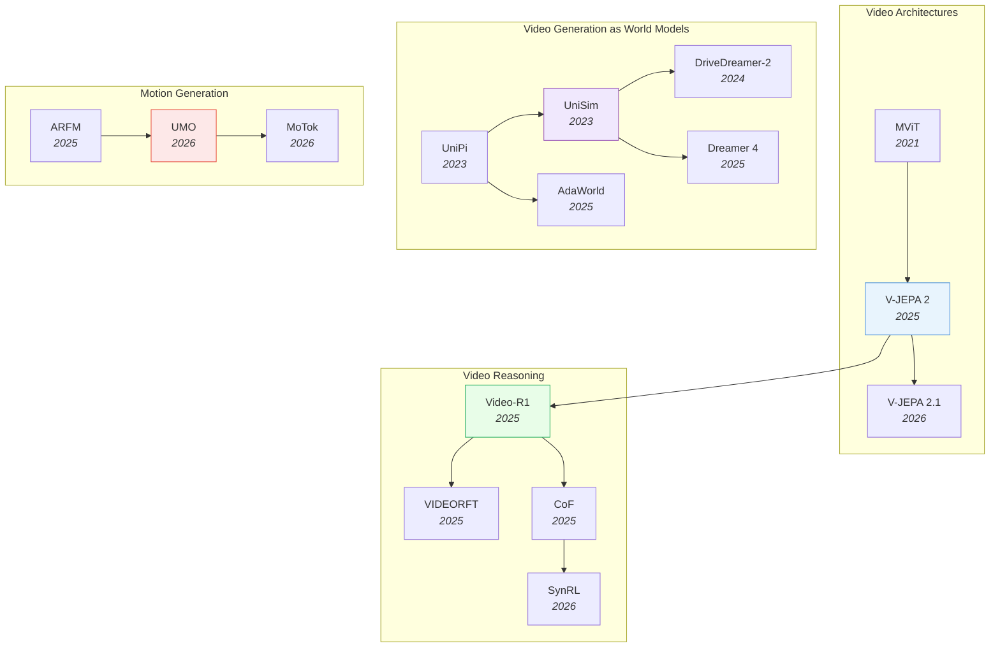

# Video & Temporal Understanding

> [!abstract] Overview
> Video models are evolving from passive understanding (classification, QA) toward active generation (world simulation, motion synthesis). The key convergence: ==video generation models are becoming world models== — they learn physics, causality, and dynamics from temporal data, enabling both content creation and robotic planning. Meanwhile, a parallel revolution in video reasoning is teaching MLLMs to think temporally through RL-based post-training and chain-of-thought methods.

## Evolution Graph

| Node | Paper |
|------|-------|
| MViT | [[2104.11227\|MViT]] |
| V-JEPA 2 | [[2506.09985\|V-JEPA 2]] |
| V-JEPA 2.1 | [[2603.14482\|V-JEPA 2.1]] |
| UniPi | [[2302.00111\|UniPi]] |
| UniSim | [[2310.06114\|UniSim]] |
| DriveDreamer-2 | [[2403.06845\|DriveDreamer-2]] |
| AdaWorld | [[2503.18938\|AdaWorld]] |
| Dreamer 4 | [[2509.24527\|Dreamer 4]] |
| Video-R1 | [[2503.21776\|Video-R1]] |
| VIDEORFT | [[2505.12434\|VIDEORFT]] |
| CoF | [[2506.00318\|CoF]] |
| SynRL | [[2603.17693\|SynRL]] |
| ARFM | [[2512.22688\|ARFM]] |
| UMO | [[2603.15975\|UMO]] |
| MoTok | [[2603.19227\|MoTok]] |

---

## 1. Video Understanding Architectures

From video classification to self-supervised video representation learning. The trajectory moves from hand-designed multiscale pooling to self-supervised world models that learn physics from raw video.

**Multiscale Vision Transformers** — Specialized Transformer architectures that capture spatiotemporal information across multiple scales for video classification and action localization.
- [[2312.17686|BMViT]], [[2112.01526|MViTv2]], [[2104.11227|MViT]]

> [!star] Key Papers
> - [[2104.11227|MViT]] — Introduced multiscale pooling attention for video Transformers; foundational architecture for the family
> - [[2112.01526|MViTv2]] — Refined pooling mechanism and added decomposed relative position embeddings; strong on both classification and detection

**Self-Supervised Video Models** — Learn general video representations from unlabeled data, progressing toward world models that support zero-shot downstream transfer.
- [[2603.22281|ThinkJEPA]], [[2603.14482|V-JEPA 2.1]], [[2507.19468|DINO-world]], [[2506.09985|V-JEPA 2]], [[2505.11129|PhiNet v2]]

> [!star] Key Papers
> - [[2506.09985|V-JEPA 2]] — Self-supervised model trained on 1M+ hours of video; learned world model enables zero-shot robotic control via MPC
> - [[2603.14482|V-JEPA 2.1]] — Added Dense Predictive Loss for fine-grained spatial features; +35% on object interaction anticipation

**Video-Language Foundation Models** — Large-scale models that jointly process video and language for fine-grained understanding, captioning, and long-context comprehension.
- [[2507.04590|VLM2Vec-V2]], [[2507.01949|Kwai Keye-VL]], [[2506.22880|DeSa2VA]], [[2506.16691|LaVi]], [[2506.10967|CDPruner]], [[2505.22654|VScan]], [[2504.16072|DAM]], [[2504.15271|Eagle 2.5]], [[2504.13180|PerceptionLM]], [[2412.04468|NVILA]]

> [!star] Key Papers
> - [[2504.15271|Eagle 2.5]] — Efficient 8B model processing 512 video frames; achieves 72.4% on Video-MME, rivaling 72B+ models
> - [[2504.16072|DAM]] — Region-level video captioning via focal prompts; SOTA across 7 benchmarks

> [!tip] The JEPA Connection
> V-JEPA 2 and V-JEPA 2.1 represent the video branch of the JEPA family. The lineage runs V-JEPA 2 --> V-JEPA 2.1 --> VL-JEPA --> VLA-JEPA. The full lineage is documented in the JEPA notes.

---

## 2. Video Reasoning & Temporal Understanding

Understanding *why* things happen in video, not just *what* happens. This section covers RL-based post-training, chain-of-thought reasoning, and spatiotemporal grounding methods that push Video-LLMs beyond perception toward genuine temporal reasoning.

**RL Post-Training for Video Reasoning** — Reinforcement learning frameworks that teach Video-LLMs temporal reasoning capabilities through rule-based rewards, self-supervised signals, or synthetic data.
- [[2603.17693|SynRL]], [[2602.20159|VBVR]], [[2602.05986|RISE-Video]], [[2601.19686|Video-KTR]], [[2511.13054|ViSS-R1]], [[2511.11113|VIDEOP2R]], [[2510.23473|Video-Thinker]], [[2508.04416|VITAL]], [[2508.03100|AVATAR]], [[2505.13934|RLVR-World]], [[2505.12434|VIDEORFT]], [[2503.21776|Video-R1]]

> [!star] Key Papers
> - [[2503.21776|Video-R1]] — First rule-based RL framework for video temporal reasoning; 37.1% on VSI-Bench surpassing GPT-4o
> - [[2505.12434|VIDEORFT]] — Reinforced fine-tuning with semantic-consistency rewards; outperforms GPT-4o on video reasoning benchmarks
> - [[2603.17693|SynRL]] — Synthetic video post-training achieves 21x data efficiency over model-generated data

**Chain-of-Thought for Video** — Methods that extend textual CoT reasoning to the video domain, explicitly grounding reasoning steps in specific frames or temporal segments.
- [[2603.16870|Chain-of-Steps]], [[2601.21037|Thinking in Frames]], [[2507.09876|ViTCoT]], [[2506.03525|VIDEO-SKOT]], [[2506.00318|CoF]]

> [!star] Key Papers
> - [[2506.00318|CoF]] — Frame-aware reasoning traces with explicit temporal grounding; SOTA on VSI-Bench and Video-MME
> - [[2603.16870|Chain-of-Steps]] — Discovered that reasoning in diffusion video models unfolds across denoising steps, not frames

**Spatiotemporal Grounding & Perception** — Architectures for precise spatial and temporal localization in video, including segmentation, tracking, and pixel-grounded language understanding.
- [[2603.12382|SPARROW]], [[2512.10359|STAR]], [[2511.19261|LAST]], [[2511.18373|MASS]], [[2511.16077|VideoSeg-R1]], [[2508.09736|M3-Agent]], [[2507.10302|DisCo]], [[2507.05258|REA]], [[2506.07850|SAM2Auto]], [[2506.05302|PAM]], [[2504.07745|SF2T]], [[2503.19355|ST-VLM]]

> [!star] Key Papers
> - [[2506.05302|PAM]] — Extends SAM 2 to full region-level understanding (recognize, explain, caption, segment); 1.2-2.4x faster
> - [[2511.18373|MASS]] — Motion-aware spatial-temporal grounding for physics reasoning; +8.7% over prior SOTA on physics tasks
> - [[2603.12382|SPARROW]] — Temporal referential consistency via target-specific tracked features; +8.9 J&F on MeViS RVOS

**Temporal Traps & Failure Analysis** — Studies revealing fundamental limitations and failure modes of current Video-LLMs, especially around the tension between image and video capabilities.
- [[2603.17541|Temporal Trap]], [[2603.14145|MMOU]], [[2511.16901|AVST-Zero]], [[2511.13787|TC2]]

> [!star] Key Papers
> - [[2603.17541|Temporal Trap]] — Revealed that Video-SFT degrades image understanding despite improving video metrics; proposed Hybrid-Frame Strategy
> - [[2603.14145|MMOU]] — Joint audio-visual reasoning benchmark; best model (64.2%) far below human (84.3%)

**Benchmarks & Evaluation** — Dedicated benchmarks measuring video spatial intelligence, fine-grained temporal reasoning, and spatial-temporal interactions.
- [[2512.10863|MMSI-Video-Bench]], [[2507.18342|EgoExoBench]], [[2503.23765|STI-Bench]]

> [!star] Key Papers
> - [[2503.23765|STI-Bench]] — Best model (Gemini-2.5-Pro) scores only 41.4% on precise spatial-temporal understanding
> - [[2512.10863|MMSI-Video-Bench]] — MLLMs achieve 38.0% vs. 96.4% human accuracy on video spatial intelligence

> [!tip] RL is the Unlock for Video Reasoning
> The pattern across Video-R1, VIDEORFT, ViSS-R1, and SynRL is clear: RL post-training consistently boosts temporal reasoning where SFT alone plateaus. Combine with frame-aware CoT (CoF, ViTCoT) for grounded reasoning traces. Watch for the temporal trap -- naive Video-SFT can hurt image understanding.

---

## 3. Video Generation as World Models

The paradigm shift: video generation models that simulate ==physically plausible futures==, becoming the foundation for planning and control. These models bridge content creation and robotic planning by learning physics, causality, and dynamics from temporal data.

**Foundational Video World Models** — Systems that treat video generation as world simulation, learning to produce physically coherent future states from observation.
- [[2601.20540|LingBot-World]], [[2510.01183|EvoWorld]], [[2409.18964|PhysGen]], [[2403.06845|DriveDreamer-2]], [[2310.06114|UniSim]], [[2302.00111|UniPi]]

> [!star] Key Papers
> - [[2302.00111|UniPi]] — First to use text-guided video generation as a universal policy; bridges video generation and robot control
> - [[2310.06114|UniSim]] — Learned interactive real-world simulator from video data; key inspiration for the WAM paradigm

**Latent-Action & Scalable World Models** — World models that extract latent action representations from unlabeled video, enabling RL-based agent training entirely within imagination.
- [[2510.26433|CoLA-World]], [[2509.24527|Dreamer 4]], [[2505.13934|RLVR-World]], [[2503.18938|AdaWorld]]

> [!star] Key Papers
> - [[2509.24527|Dreamer 4]] — First offline diamond acquisition in Minecraft; scalable world model with real-time 21 fps inference
> - [[2503.18938|AdaWorld]] — Context-invariant latent actions for adaptable world models; FVD of 767.0

**Video Generation for Planning & Grounding** — Methods that use generated video as a planning medium, grounding visual plans in physically feasible actions.
- [[2603.08403|SPIRAL]], [[2602.01960|GVP-WM]], [[2512.24766|Dream2Flow]]

> [!star] Key Papers
> - [[2602.01960|GVP-WM]] — Converts physically inconsistent video plans into feasible action sequences via latent-space trajectory optimization
> - [[2603.08403|SPIRAL]] — Closed-loop self-improving framework for controllable, long-horizon video generation

**Controllable Video Synthesis** — Dedicated architectures for high-fidelity, subject-driven, or reason-informed video editing and generation.
- [[2603.18524|3DreamBooth]], [[2512.09924|ReViSE]]

> [!star] Key Papers
> - [[2603.18524|3DreamBooth]] — 3D-consistent subject-driven video generation; Chamfer Distance of 0.0177
> - [[2512.09924|ReViSE]] — Reason-informed video editing via self-reflective learning; +32% on RVE-Bench

**Surveys & Roadmaps** — Comprehensive overviews of the video-to-world-model progression.
- [[2603.23497|WildWorld]], [[2603.22212|Omni-WorldBench]], [[2511.08585|Visual World Roadmap]]

> [!star] Key Papers
> - [[2511.08585|Visual World Roadmap]] — Four-generation taxonomy from video generators to planning-capable world simulators

> [!tip] Video World Models Feed WAMs
> This cluster directly feeds into World Action Models. If you can generate video of the future, you can plan by imagining outcomes. UniPi and UniSim established the pattern; Dreamer 4 and AdaWorld scale it. See [[04_Reinforcement-Learning]] for RL inside world models and [[07_Robotics-and-Embodied-AI]] for the embodied applications.

---

## 4. Motion Generation

Synthesizing human and robot motion — bridging video understanding with physical action. The field is converging on unified architectures that handle diverse motion tasks through a single model rather than task-specific pipelines.

**Unified Motion Architectures** — Single models that handle multiple motion generation tasks (text-to-motion, motion prediction, motion editing) through shared representations.
- [[2603.19227|MoTok]], [[2603.15975|UMO]]

> [!star] Key Papers
> - [[2603.15975|UMO]] — Unified in-context learning for diverse motion tasks via meta-operation embeddings on a pretrained DiT; FID of 9.460
> - [[2603.19227|MoTok]] — Diffusion-based discrete motion tokenizer decoupling semantics from kinematics; FID from 0.061 to 0.029

**Motion Prediction & Flow** — Autoregressive and flow-based methods for predicting future motion trajectories and bridging video generation with 3D object manipulation.
- [[2512.24766|Dream2Flow]], [[2512.22688|ARFM]]

> [!star] Key Papers
> - [[2512.22688|ARFM]] — Autoregressive flow matching as a generalized framework for probabilistic motion prediction
> - [[2512.24766|Dream2Flow]] — Bridges video generation and 3D object flow; enables open-world manipulation with up to 8/10 success rate

> [!tip] Motion as the Missing Link
> Motion generation connects video understanding (perceiving dynamics) with robotics (producing actions). UMO and MoTok show that diffusion-based approaches unify diverse motion tasks. Dream2Flow demonstrates how video generation models can directly produce 3D motion representations for robot control.

---

## Cross-References

- [[01_Foundation-Models]] — Vision Transformer backbones for video
- [[04_Reinforcement-Learning]] — RL inside world models (Dreamer 4, RLVR-World)
- [[05_Computer-Vision-and-3D]] — 3D perception for spatial video understanding
- [[07_Robotics-and-Embodied-AI]] — Video models for robotic planning and control
- [[12_Diffusion-and-Generation]] — Diffusion architectures underlying video generation

---

*Next: [[07_Robotics-and-Embodied-AI]] — where video understanding, world models, and motion generation converge for embodied intelligence.*
