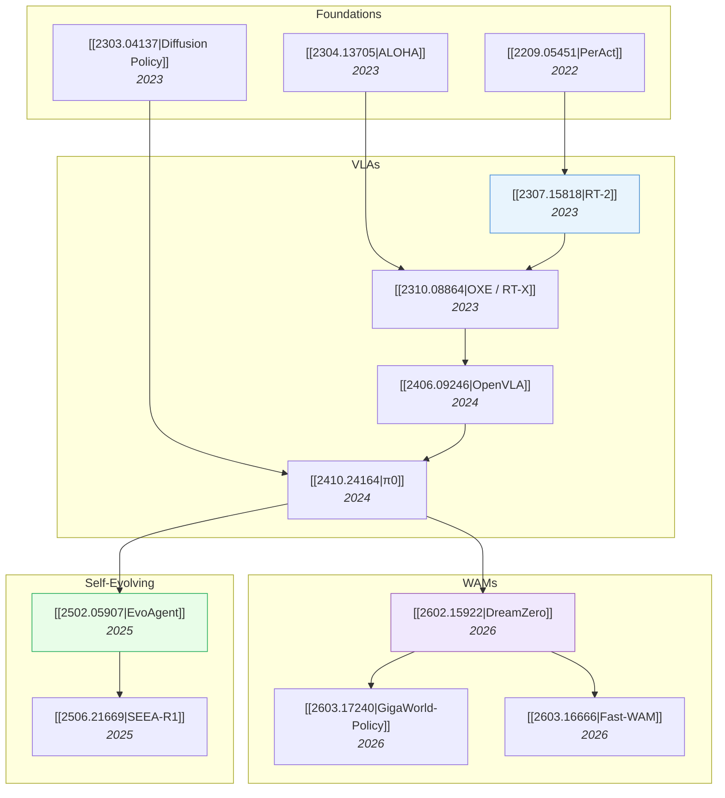

# Robotics & Embodied AI

> [!abstract] Overview
> Embodied AI sits at the convergence of all other topics: foundation models provide the backbone, VLMs provide perception, RL provides learning, and world models provide physics understanding. This note maps the landscape from VLAs through WAMs to self-evolving systems — the full path toward autonomous robots.

## Evolution Graph

---

## 1. Robotic Policy Foundations

The building blocks: how robots learn to act from demonstrations.

| Paper | Year | Contribution |
| --- | --- | --- |
| [[2209.05451\|PerAct]] | 2022 | ==Perceiver-Actor==: multi-task manipulation via voxel observations |
| [[2303.04137\|Diffusion Policy]] | 2023 | ==Action diffusion==: generate action trajectories via denoising |
| [[2304.13705\|ALOHA]] | 2023 | ==Bimanual manipulation== with low-cost hardware and co-training |
| [[2306.10007\|RPT]] | 2023 | ==Sensorimotor pre-training== for generalist robot policies |
| [[2403.03954\|DP3]] | 2024 | ==3D Diffusion Policy==: generalizable policy from 3D point clouds |

---

## 2. Vision-Language-Action Models (VLAs)

VLMs fine-tuned for robotic control — the current mainstream approach. See [[01_VLA-WAM-101]] and [[03_VLA]] for deep dives.

- [[2307.15818|RT-2]] (2023) — first large VLM (==PaLI-X/PaLM-E==) directly outputting robot actions as text tokens
- [[2310.08864|OXE / RT-X]] (2023) — ==Open X-Embodiment== dataset + cross-robot transfer models
- [[2406.09246|OpenVLA]] (2024) — open-source 7B VLA; fine-tunable for diverse robots
- [[2410.24164|π0]] (2024) — ==flow model== for general robot control; continuous action prediction
- [[2502.19645|OpenVLA-OFT]] (2025) — optimized fine-tuning for faster, cheaper VLA adaptation
- [[2412.14058|RoboVLMs]] (2024) — 600+ experiments identifying optimal VLA design choices

> [!success] Ideal VLA Recipe (from [[03_VLA|RoboVLMs]])
> ==KosMos/[[2407.07726|PaliGemma]] backbone== + ==Policy Head fusion== + ==Continuous actions== + ==MoE== + ==Post-training on in-domain data==

---

## 3. World Action Models (WAMs)

WAMs jointly predict future video frames and actions — learning physics, not just imitation. See [[04_WAM]] for the full survey.

- [[2602.15922|DreamZero]] (2026) — ==14B WAM==; zero-shot robot policies via joint video+action prediction; **39.5%** task progress on unseen tasks
- [[2603.17240|GigaWorld-Policy]] (2026) — ==action-centered== WAM; **9x speedup** over DreamZero via training-time-only video supervision
- [[2603.16666|Fast-WAM]] (2026) — proved ==training-time video modeling is what matters==, not test-time imagination; **97.6%** on LIBERO
- [[2410.06158|GR-2]] (2024) — generative video-language-action model for manipulation
- [[2410.00564|JOWA]] (2024) — jointly-optimized world-action model pretraining

---

## 4. Self-Evolving Embodied AI

Robots that improve themselves through experience — the frontier. See [[01_Self-Evolving|Self-Evolving 101]] and [[04-2_Self-Evolving-WAM-101]].

- [[2502.05907|EvoAgent]] (2025) — ==self-evolving agent== with continual world model for long-horizon tasks; **+105%** improvement
- [[2506.21669|SEEA-R1]] (2025) — ==tree-structured RL== for self-evolving embodied agents; **+24%** via MCTS + generative reward
- [[2503.01584|SENSEI]] (2025) — ==semantic exploration== with epistemic uncertainty + Go-Explore for versatile world models
- [[2510.16079|EVOLVER]] (2025) — LLM agents self-evolving through experience-driven lifecycle
- [[2603.08403|SPIRAL]] (2026) — ==closed-loop framework== for self-improving action world models via reflective planning

> [!tip] The Self-Evolving WAM Path
> The ideal trajectory: train a WAM → add continual learning → add curiosity-driven exploration → self-evolving robot. See [[04-2_Self-Evolving-WAM-101]] for the architectural blueprint.

---

## 5. Autonomous Driving (World Model Perspective)

Driving as a world model problem: predict the scene's future, then plan trajectories.

| Paper | Year | Contribution |
| --- | --- | --- |
| [[2403.06845\|DriveDreamer-2]] | 2024 | LLM-enhanced ==driving video generation==; **FID 25.0** |
| [[2603.14497\|WorldVLM]] | 2026 | ==VLM + World Model== hybrid for autonomous driving |
| [[2409.18964\|PhysGen]] | 2024 | ==Physics-grounded== image-to-video for physical reasoning |

---

## 6. Datasets, Benchmarks & Simulators

| Paper | Year | Scope |
| --- | --- | --- |
| [[2310.08864\|OXE]] | 2023 | ==Open X-Embodiment==: largest cross-robot dataset |
| [[2306.03310\|LIBERO]] | 2023 | Benchmark for ==lifelong robot learning== |
| [[2112.03227\|CALVIN]] | 2021 | Benchmark for ==long-horizon language-conditioned== manipulation |
| [[1909.12271\|RLBench]] | 2019 | Benchmark for ==robot learning== with 100 tasks |
| [[2405.05941\|SIMPLER]] | 2024 | Evaluating real-world policies ==in simulation== |
| [[2307.00595\|RH20T]] | 2023 | ==Comprehensive dataset== for diverse one-shot skills |
| [[2503.06669\|AgiBot World]] | 2025 | Large-scale ==manipulation platform== |

**Surveys:**
- [[2103.04918|Embodied AI Survey 2021]] — simulators and research tasks
- [[2407.06886|ARIO / Embodied AI Survey 2024]] — comprehensive survey with ARIO dataset standard
- [[2509.20021|Embodied AI LLM-WM Survey]] — joint MLLM-WM architecture roadmap
- [[2405.14093|VLA Survey]] — survey of VLA models for embodied AI

---

## Cross-References

- [[01_VLA-WAM-101]] — VLA vs WAM comparison
- [[03_VLA]] — VLA design principles (RoboVLMs study)
- [[04_WAM]] — WAM paper survey by category
- [[04-1_JEPA]] — JEPA evolution toward VLA-JEPA
- [[04-2_Self-Evolving-WAM-101]] — Self-evolving WAM blueprint
- [[01_Self-Evolving|Self-Evolving AI]] — Broader self-evolving paradigm
- [[04_Reinforcement-Learning]] — RL as the training backbone
- [[06_Video-and-Temporal]] — Video generation as world modeling

---

*Next: [[08_Benchmarks-and-Surveys]] for a cross-cutting view of evaluation resources.*

---

## Complete Paper Listing

### Embodied AI (11)

| Paper | Year | Summary |
| --- | --- | --- |
| [[2310.08864\|OXE]] | 2023 | The OpenX-Embodiment Collaboration released the Open X-Embodiment (OXE) Dataset, a consolidated collection of over 1 ... |
| [[2407.13771\|Training-Free Model Merging MTDA]] | 2024 | This paper introduces a training-free model merging technique for multi-target domain adaptation in semantic segmenta... |
| [[2409.20537\|HPT]] | 2024 | Heterogeneous Pre-trained Transformers (HPT) introduces a modular architecture for robotic policy learning that integ... |
| [[2410.02742\|GLIMO]] | 2024 | The GLIMO framework, developed by researchers at UCSD, enables large language models (LLMs) to effectively learn and ... |
| [[2412.07755\|SAT]] | 2024 | Researchers from Boston University, University of Washington, Allen Institute for AI, Microsoft Research, and NYU int... |
| [[2504.04259\|ORCA Hand]] | 2025 | The ORCA hand from ETH Zurich introduces an open-source, anthropomorphic, tendon-driven robotic hand designed for hig... |
| [[2506.18088\|RoboTwin 2.0]] | 2025 | RoboTwin 2.0 introduces a scalable simulation framework and benchmark designed to generate high-quality, domain-rando... |
| [[2506.21669\|SEEA-R1]] | 2025 | The SEEA-R1 framework enables embodied agents to autonomously improve their reasoning and behavior in long-horizon ta... |
| [[2511.16160\|Video2Layout]] | 2025 | Researchers from several Chinese institutions developed a framework, Video2Layout, that equips multimodal large langu... |
| [[2602.21992\|PanoEnv]] | 2026 | Researchers introduce PanoEnv, a framework featuring a synthetic, geometry-grounded benchmark and a reinforcement lea... |
| [[2603.18892\|MultihopSpatial]] | 2026 | Researchers from the Electronics and Telecommunications Research Institute and KAIST introduced MultihopSpatial, a be... |

### Imitation Learning (7)

| Paper | Year | Summary |
| --- | --- | --- |
| [[2505.03181\|AFSFT]] | 2025 | A reinforcement learning framework called AFSFT (Advantage Filtered SFT) enables vision-language models to learn inte... |
| [[2510.08558\|Early Experience]] | 2025 | The "early experience" paradigm enables autonomous language agents to learn and continuously improve from their own i... |
| [[2510.19307\|RIL]] | 2025 | The Unified Reinforcement and Imitation Learning (RIL) framework enhances lightweight Vision-Language Models (VLMs) t... |
| [[2510.25992\|SRL]] | 2025 | The Supervised Reinforcement Learning (SRL) framework enables smaller Large Language Models (LLMs) to learn complex m... |
| [[2512.20675\|VLM Reward Objectives]] | 2025 | This work demonstrates that a simple triplet loss objective, when used for finetuning Vision-Language Models for rewa... |
| [[2601.16973\|VisGym]] | 2026 | Researchers from UC Berkeley introduced VisGym, a diverse and customizable benchmark suite, to evaluate and train Vis... |
| [[2603.03818\|VLA Continual Learning]] | 2026 | Large pretrained Vision-Language-Action (VLA) models show surprising resistance to catastrophic forgetting in continu... |

### Manipulation (25)

| Paper | Year | Summary |
| --- | --- | --- |
| [[1909.12271\|RLBench]] | 2019 | RLBench, developed by the Dyson Robotics Lab at Imperial College London, is a large-scale, simulation-based benchmark... |
| [[2112.03227\|CALVIN]] | 2021 | CALVIN introduces an open-source simulated benchmark for developing language-conditioned robot policies capable of ex... |
| [[2209.05451\|PerAct]] | 2022 | PERCEIVER-ACTOR (PERACT) is a language-conditioned behavior-cloning agent for multi-task 6-DoF robotic manipulation t... |
| [[2303.04137\|Diffusion Policy]] | 2023 | Researchers from Columbia University, Google DeepMind, and MIT present Diffusion Policy, a framework that leverages d... |
| [[2304.13705\|ALOHA]] | 2023 | Researchers from Stanford University, Meta, and UC Berkeley developed ALOHA, a low-cost, open-source hardware system,... |
| [[2306.03310\|LIBERO]] | 2023 | Researchers from The University of Texas at Austin, Sony AI, and Tsinghua University introduce LIBERO, a procedurally... |
| [[2306.10007\|RPT]] | 2023 | Researchers at the University of California, Berkeley developed Robot Pre-Training (RPT), a self-supervised sensorimo... |
| [[2307.00595\|RH20T]] | 2023 | A comprehensive real-world robotic manipulation dataset, RH20T, comprising over 110,000 multi-modal sequences across ... |
| [[2309.13037\|GELLO]] | 2023 | Researchers from UC Berkeley developed GELLO, a low-cost, intuitive teleoperation framework for robot manipulators th... |
| [[2403.03954\|DP3]] | 2024 | DP3, developed by researchers at Shanghai Qi Zhi Institute, Shanghai Jiao Tong University, and Tsinghua University, i... |
| [[2405.05941\|SIMPLER]] | 2024 | SIMPLER is an open-source framework designed for reliable evaluation of real-world robot manipulation policies within... |
| [[2405.12213\|Octo]] | 2024 | Octo introduces an open-source, transformer-based generalist robot policy that achieves strong zero-shot control and ... |
| [[2407.05996\|MDT]] | 2024 | The Multimodal Diffusion Transformer (MDT) enables robots to learn versatile behaviors from multimodal goal specifica... |
| [[2409.01652\|ReKep]] | 2024 | ReKep enables robots to perform diverse, multi-stage manipulation tasks in unstructured environments by automatically... |
| [[2410.07864\|RDT-1B]] | 2024 | Researchers at Tsinghua University developed RDT-1B, the first diffusion-based foundation model for bimanual robotic ... |
| [[2412.11974\|EMMA-X]] | 2024 | Researchers at the Singapore University of Technology and Design developed EMMA-X, an embodied multimodal action mode... |
| [[2501.10074\|SpatialCoT]] | 2025 | Huawei Noah’s Ark Lab introduces SpatialCoT, a two-stage fine-tuning approach for Vision-Language Models that integra... |
| [[2502.02316\|DIME]] | 2025 | Researchers developed DIME, an algorithm that integrates diffusion policies into Maximum Entropy Reinforcement Learni... |
| [[2507.07969\|Q-chunking]] | 2025 | Researchers at UC Berkeley developed Q-chunking, a method integrating action chunking into temporal difference (TD) r... |
| [[2507.17520\|InstructVLA]] | 2025 | InstructVLA presents an end-to-end Vision-Language-Action (VLA) model that maintains vision-language reasoning capabi... |
| [[2509.18644\|State-Free Visuomotor Policy]] | 2025 | Robotic visuomotor policies achieve dramatically improved spatial generalization by removing proprioceptive state inp... |
| [[2510.12276\|Spatial Forcing]] | 2025 | A new method, Spatial Forcing (SF), implicitly develops 3D perception in Vision-Language-Action (VLA) models for robo... |
| [[2512.24497\|JEPA-WM]] | 2025 | This research provides a systematic empirical study of Joint-Embedding Predictive World Models (JEPA-WMs), identifyin... |
| [[2602.18374\|ZS-IP]] | 2026 | Researchers from the University of Surrey and University of Sheffield developed the Zero-Shot Interactive Perception ... |
| [[2603.02511\|Unveiler]] | 2026 | Researchers at Oklahoma State University and Google DeepMind developed Unveiler, a decomposed framework for sequentia... |

### Navigation (9)

| Paper | Year | Summary |
| --- | --- | --- |
| [[2103.04918\|Embodied AI Survey 2021]] | 2021 | This paper offers an encyclopedic survey of Embodied Artificial Intelligence, systematically analyzing nine prominent... |
| [[2311.00530\|LLM Embodied Navigation Survey]] | 2023 | A survey by researchers at multiple Chinese institutions comprehensively reviews the application of Large Language Mo... |
| [[2401.05946\|TDB]] | 2024 | Researchers at Google DeepMind developed the Transformer with Discrete Bottleneck (TDB) architecture, which enables t... |
| [[2412.10439\|CogNav]] | 2024 | CogNav introduces an LLM-driven framework for Object Goal Navigation that models fine-grained human-like cognitive pr... |
| [[2505.17685\|FSDrive]] | 2025 | FutureSightDrive (FSDrive) introduces a framework for Vision-Language-Action (VLA) models in autonomous driving that ... |
| [[2506.15757\|WPCL]] | 2025 | The Weakly-supervised Partial Contrastive Learning (WPCL) framework enhances Visual Language Navigation (VLN) agents ... |
| [[2510.20685\|C-Nav]] | 2025 | Researchers at Beihang University and the Chinese Academy of Sciences introduced C-Nav, a framework for continual obj... |
| [[2512.24331\|LVLDrive]] | 2025 | Researchers at Motional and the University of Amsterdam developed LVLDrive, a framework that integrates LiDAR point c... |
| [[2512.24385\|Spatial Intelligence Roadmap]] | 2025 | Researchers from Zhejiang University, National University of Singapore, and collaborators present a detailed roadmap ... |

### Vision-Language-Action (VLA) (71)

| Paper | Year | Summary |
| --- | --- | --- |
| [[2307.15818\|RT-2]] | 2023 | Google DeepMind's RT-2 directly transfers knowledge from internet-scale vision-language models to robotic control sys... |
| [[2311.01378\|RoboFlamingo]] | 2023 | RoboFlamingo presents a framework that adapts publicly available vision-language models for robot manipulation by emp... |
| [[2403.09631\|3D-VLA]] | 2024 | 3D-VLA introduces a generative world model that integrates 3D scene understanding with language and action generation... |
| [[2405.14093\|VLA Survey]] | 2024 | Vision-Language-Action (VLA) models, crucial for embodied AI, are comprehensively organized in this survey, detailing... |
| [[2406.09246\|OpenVLA]] | 2024 | OpenVLA introduces a fully open-source, 7B-parameter Vision-Language-Action model that sets a new state of the art fo... |
| [[2409.03299\|RT-1-X SCARA Transfer]] | 2024 | Researchers at the Universiteit van Amsterdam's Intelligent Robotics Lab investigated the RT-1-X robotic foundation m... |
| [[2410.06158\|GR-2]] | 2024 | Researchers at ByteDance Research developed GR-2, a generalist robot agent that combines large-scale video pre-traini... |
| [[2410.24164\|π0]] | 2024 | π0 introduces a vision-language-action flow model that combines a pre-trained VLM with a flow matching action expert ... |
| [[2411.19309\|GRAPE]] | 2024 | GRAPE introduces a framework that enhances the generalizability and objective alignment of Vision-Language-Action (VL... |
| [[2411.19650\|CogACT]] | 2024 | CogACT is a Vision-Language-Action model that improves robotic manipulation by adopting a componentized architecture ... |
| [[2412.13877\|RoboMIND]] | 2024 | RoboMIND introduces a large-scale, multi-embodiment dataset for robot manipulation, collected under unified standards... |
| [[2412.14058\|RoboVLMs]] | 2024 | A detailed empirical study by Tsinghua University, ByteDance Research, and collaborators systematically investigated ... |
| [[2501.09747\|FAST]] | 2025 | This paper introduces a novel compression-based tokenization method for converting continuous robot actions into disc... |
| [[2501.15830\|SpatialVLA]] | 2025 | Shanghai AI Laboratory's SpatialVLA introduces novel spatial representations for Vision-Language-Action models, equip... |
| [[2501.18867\|UP-VLA]] | 2025 | A unified Vision-Language-Action (VLA) model, UP-VLA, integrates multi-modal understanding with future visual predict... |
| [[2502.14795\|Humanoid-VLA]] | 2025 | This paper introduces Humanoid-VLA, the first Vision-Language-Action (VLA) model designed for humanoid robots, enabli... |
| [[2502.19645\|OpenVLA-OFT]] | 2025 | Researchers at Stanford University developed an Optimized Fine-Tuning (OFT) recipe for Vision-Language-Action (VLA) m... |
| [[2503.06669\|AgiBot World]] | 2025 | AgiBot World Colosseo presents a large-scale platform and dataset, AgiBot World, comprising over 1 million real-world... |
| [[2503.09527\|CombatVLA]] | 2025 | CombatVLA is an efficient Vision-Language-Action (VLA) model designed for real-time combat tasks in 3D Action Role-Pl... |
| [[2503.14734\|GR00T N1]] | 2025 | NVIDIA researchers developed GR00T N1, an open foundation Vision-Language-Action model for generalist humanoid robots... |
| [[2503.22020\|CoT-VLA]] | 2025 | CoT-VLA integrates visual chain-of-thought reasoning into Vision-Language-Action models by having them predict subgoa... |
| [[2504.19854\|NORA]] | 2025 | A 3B-parameter Vision-Language-Action model combines Qwen-2.5-VL-3B with FAST+ tokenization to enable real-time robot... |
| [[2505.04769\|VLA Survey]] | 2025 | This review paper synthesizes the landscape of Vision-Language-Action (VLA) models, which unify visual perception, na... |
| [[2505.05800\|3D-CAVLA]] | 2025 | 3D-CAVLA, developed by NYU researchers, enhances Vision-Language-Action (VLA) models by integrating depth, chain-of-t... |
| [[2505.15660\|AGNOSTOS]] | 2025 | This research introduces AGNOSTOS, a novel benchmark for evaluating zero-shot cross-task generalization in robotic ma... |
| [[2505.17016\|RIPT-VLA]] | 2025 | RIPT-VLA introduces a third training stage for Vision-Language-Action (VLA) models, employing reinforcement interacti... |
| [[2505.18719\|VLA-RL]] | 2025 | Tsinghua University and Nanyang Technological University researchers develop VLA-RL, a reinforcement learning framewo... |
| [[2506.01844\|SmolVLA]] | 2025 | Hugging Face researchers develop SmolVLA, a 450-million parameter vision-language-action model that achieves competit... |
| [[2506.08440\|TGRPO]] | 2025 | The TGRPO framework introduces a critic-free online reinforcement learning approach to fine-tune Vision-Language-Acti... |
| [[2506.19850\|UniVLA]] | 2025 | UniVLA introduces a unified vision-language-action (VLA) model that processes all modalities as discrete tokens withi... |
| [[2506.21539\|WorldVLA]] | 2025 | Researchers from DAMO Academy, Hupan Lab, and Zhejiang University developed WorldVLA, an autoregressive framework tha... |
| [[2506.22242\|4D-VLA]] | 2025 | The 4D-VLA framework enhances vision-language-action (VLA) pretraining by integrating 3D coordinate embeddings and mu... |
| [[2507.09160\|Tactile-VLA]] | 2025 | TACTILE-VLA integrates tactile sensing into Vision-Language-Action (VLA) models, enabling robots to interpret force-r... |
| [[2507.16815\|ThinkAct]] | 2025 | A dual-system framework named ThinkAct enables Multimodal Large Language Models to perform long-horizon planning and ... |
| [[2508.10333\|ReconVLA]] | 2025 | ReconVLA introduces a reconstructive Vision-Language-Action (VLA) model that enhances visual attention grounding by i... |
| [[2508.18269\|FlowVLA]] | 2025 | Researchers at HKUST(GZ) and Shanghai Jiao Tong University developed FlowVLA, a Vision-Language-Action (VLA) model th... |
| [[2509.00576\|G0]] | 2025 | The Galaxea Team introduces a 500-hour Open-World Dataset collected in diverse real-world environments with a consist... |
| [[2509.04996\|FLOWER]] | 2025 | FLOWER presents an efficient Vision-Language-Action (VLA) policy for generalist robotics, achieving competitive or su... |
| [[2509.06951\|F1]] | 2025 | F₁, a Vision-Language-Action (VLA) model, integrates explicit visual foresight into its decision-making process, movi... |
| [[2509.09674\|SimpleVLA-RL]] | 2025 | SimpleVLA-RL is a reinforcement learning framework designed to improve Vision-Language-Action (VLA) models by using o... |
| [[2509.22643\|VLA-Reasoner]] | 2025 | VLA-Reasoner enhances Vision-Language-Action (VLA) models with test-time reasoning through online Monte Carlo Tree Se... |
| [[2510.10274\|X-VLA]] | 2025 | X-VLA introduces a soft-prompted Transformer architecture designed to address data heterogeneity in large-scale robot... |
| [[2510.13054\|VLA-0]] | 2025 | NVIDIA researchers introduce VLA-0, a Vision-Language-Action model that achieves state-of-the-art robotic manipulatio... |
| [[2510.13626\|LIBERO-Plus]] | 2025 | Researchers from Fudan University and collaborators developed LIBERO-Plus, a diagnostic benchmark that systematically... |
| [[2510.19430\|GigaBrain-0]] | 2025 | GigaBrain-0, developed by GigaAI, is a Vision-Language-Action (VLA) model that largely relies on synthetic data gener... |
| [[2511.14148\|AsyncVLA]] | 2025 | AsyncVLA introduces an asynchronous flow matching framework for Vision-Language-Action models, allowing robots to dyn... |
| [[2511.14759\|RECAP]] | 2025 | A general-purpose reinforcement learning method, RECAP, improves the robustness and throughput of large-scale Vision-... |
| [[2511.15605\|SRPO]] | 2025 | SRPO (Self-Referential Policy Optimization) enhances Vision-Language-Action (VLA) models for robotic manipulation by ... |
| [[2511.16166\|EvoVLA]] | 2025 | EvoVLA is a self-evolving vision-language-action framework designed to overcome stage hallucination and fragile memor... |
| [[2511.17502\|RynnVLA-002]] | 2025 | Researchers from DAMO Academy, Alibaba Group, developed RynnVLA-002, a unified vision-language-action (VLA) and world... |
| [[2511.18085\|Stellar VLA]] | 2025 | Researchers from Shanghai Jiao Tong University, University of Cambridge, and AgiBot developed Stellar VLA, a knowledg... |
| [[2511.18810\|MergeVLA]] | 2025 | MergeVLA is a framework designed to overcome the challenge of merging independently fine-tuned Vision-Language-Action... |
| [[2511.18960\|AVA-VLA]] | 2025 | Researchers from LiAuto Inc. developed the AVA-VLA framework, reformulating Vision-Language-Action models from a Part... |
| [[2512.13030\|Motus]] | 2025 | Motus, a unified latent action world model from Tsinghua University, Peking University, and Horizon Robotics, integra... |
| [[2512.14666\|EVOLVE-VLA]] | 2025 | EVOLVE-VLA introduces a framework for Vision-Language-Action (VLA) models to continuously adapt and improve from envi... |
| [[2512.24125\|GenieReasoner]] | 2025 | AgiBot Research and the Shanghai Innovation Institute developed GenieReasoner, a system that integrates Vision-Langua... |
| [[2512.24653\|RoboMIND 2.0]] | 2025 | RoboMIND 2.0 introduces a large-scale, multimodal dataset comprising 310K bimanual and mobile manipulation trajectori... |
| [[2601.02456\|InternVLA-A1]] | 2026 | The InternVLA-A1 Team developed a unified Mixture-of-Transformers architecture, InternVLA-A1, which integrates semant... |
| [[2601.11404\|ACoT-VLA]] | 2026 | A framework introduces Action Chain-of-Thought (ACoT) for Vision-Language-Action (VLA) models, enabling robots to rea... |
| [[2601.16163\|Cosmos Policy]] | 2026 | Researchers from NVIDIA and Stanford University fine-tune a large, pretrained latent video diffusion model, Cosmos-Pr... |
| [[2601.18692\|LingBot-VLA]] | 2026 | The LingBot-VLA foundation model empirically demonstrates that real-world VLA performance consistently scales with in... |
| [[2601.21998\|LingBot-VA]] | 2026 | Robbyant Technology researchers developed LingBot-VA, an autoregressive diffusion framework for robot control that un... |
| [[2602.10098\|VLA-JEPA]] | 2026 | VLA-JEPA enhances Vision-Language-Action models for robotic control by integrating a Joint-Embedding Predictive Archi... |
| [[2602.11236\|ABot-M0]] | 2026 | Researchers from Alibaba Group's AMAP CV Lab developed ABot-M0, a Vision-Language-Action (VLA) foundation model that ... |
| [[2602.12063\|VLAW]] | 2026 | The VLAW framework iteratively co-improves vision-language-action (VLA) policies and action-conditioned world models ... |
| [[2602.13710\|HBVLA]] | 2026 | HBVLA introduces a 1-bit post-training quantization framework for Vision-Language-Action models, enabling their robus... |
| [[2602.22010\|WoG]] | 2026 | The "World Guidance" (WoG) framework from ByteDance Seed and The University of Hong Kong enhances Vision-Language-Act... |
| [[2603.12263\|Psi0]] | 2026 | Ψ0 introduces an open foundation model for humanoid loco-manipulation, employing a decoupled learning strategy that p... |
| [[2603.12772\|PVI]] | 2026 | Researchers at Lionrock AI Lab developed Plug-in Visual Injection (PVI), a method to enhance Vision-Language-Action (... |
| [[2603.16666\|Fast-WAM]] | 2026 | Researchers from Tsinghua University and Galaxea AI developed Fast-WAM, a World Action Model (WAM) that achieves comp... |
| [[2603.17240\|GigaWorld-Policy]] | 2026 | GigaWorld-Policy, from GigaAI, introduces an efficient action-centered World–Action model that significantly reduces ... |

### World Action Models (WAM) (26)

| Paper | Year | Summary |
| --- | --- | --- |
| [[2206.14176\|DayDreamer]] | 2022 | The DayDreamer approach enables sample-efficient learning for physical robots by utilizing world models to plan and l... |
| [[2310.06114\|UniSim]] | 2023 | UniSim is a universal simulator learning real-world interaction via video diffusion models that orchestrates heteroge... |
| [[2310.10625\|VLP]] | 2023 | The VIDEO LANGUAGE PLANNING (VLP) algorithm enables long-horizon visual planning for robotic tasks by combining visio... |
| [[2403.06845\|DriveDreamer-2]] | 2024 | DriveDreamer-2 presents an approach to generate diverse, user-customized multi-view driving videos by integrating a L... |
| [[2403.08321\|ManiGaussian]] | 2024 | A novel framework, ManiGaussian, extends Gaussian Splatting to predict future scene states conditioned on robot actio... |
| [[2407.06886\|ARIO]] | 2024 | This survey paper meticulously reviews the current state and future trajectories of Embodied Artificial Intelligence,... |
| [[2411.14499\|World Models Survey 2024]] | 2024 | Researchers from Tsinghua University present a comprehensive survey of world models, proposing a dual categorization ... |
| [[2412.14803\|VPP]] | 2024 | Video Prediction Policy (VPP) introduces a generalist robot policy that leverages predictive visual representations e... |
| [[2502.05907\|EvoAgent]] | 2025 | EvoAgent introduces a framework for embodied agents to autonomously tackle complex, long-horizon tasks in open-ended ... |
| [[2503.00200\|UVA]] | 2025 | The Unified Video Action Model (UVA) from Stanford University introduces a general-purpose robotic learning framework... |
| [[2503.16806\|DyWA]] | 2025 | A framework from Peking University and Galbot, DyWA, enables generalizable non-prehensile robotic manipulation using ... |
| [[2504.02792\|UWM]] | 2025 | Unified World Models (UWM), developed by researchers at the University of Washington and Toyota Research Institute, p... |
| [[2506.23468\|NavMorph]] | 2025 | NavMorph proposes a self-evolving world model for Vision-and-Language Navigation in Continuous Environments (VLN-CE),... |
| [[2507.13340\|LPS]] | 2025 | Latent Policy Steering (LPS) introduces an embodiment-agnostic pretrained World Model (WM) that utilizes optical flow... |
| [[2508.00795\|Video Policy]] | 2025 | A "Video Policy" framework developed by Columbia University and Toyota Research Institute leverages video generation ... |
| [[2509.20021\|Embodied AI LLM-WM Survey]] | 2025 | The paper outlines a joint Multimodal Large Language Model (MLLM) and World Model (WM) driven architecture to advance... |
| [[2510.01183\|EvoWorld]] | 2025 | Researchers at Johns Hopkins University developed EvoWorld, a generative world model that combines panoramic video ge... |
| [[2510.16732\|World Models for Embodied AI Survey]] | 2025 | Researchers from Nankai University and a collaborative network introduce a unified three-axis taxonomy for world mode... |
| [[2512.15692\|mimic-video]] | 2025 | The mimic-video framework introduces Video-Action Models (VAMs) for robotic manipulation by leveraging generative, pr... |
| [[2512.19133\|WorldRFT]] | 2025 | Researchers from the Institute of Automation, Chinese Academy of Sciences, and Li Auto developed WorldRFT, a framewor... |
| [[2512.24766\|Dream2Flow]] | 2025 | Dream2Flow introduces a framework that enables robots to perform diverse manipulation tasks in open-world settings by... |
| [[2601.20540\|LingBot-World]] | 2026 | Robbyant Team's LingBot-World offers an open-source, interactive world simulator that transcends passive video genera... |
| [[2602.04411\|Self-evolving Embodied AI]] | 2026 | Researchers at Tsinghua University define and propose "Self-evolving Embodied AI," a new paradigm enabling agents to ... |
| [[2602.15922\|DreamZero]] | 2026 | DreamZero, a 14B World Action Model (WAM) developed by NVIDIA, enables zero-shot robot policies by jointly predicting... |
| [[2603.14497\|WorldVLM]] | 2026 | WorldVLM introduces a hybrid architecture that combines Vision-Language Models (VLMs) for high-level contextual reaso... |
| [[2603.15381\|Autonomous Learning Framework]] | 2026 | Researchers from FAIR at META, NYU, and UC Berkeley propose a conceptual architecture for autonomous learning systems... |

### Other (27)

| Paper | Year | Summary |
| --- | --- | --- |
| [[2201.07207\|LLM Zero-Shot Planners]] | 2022 | Researchers from UC Berkeley, CMU, and Google developed an inference-time procedure to enable large language models (... |
| [[2212.06817\|2212.06817]] | 2022 | Google's RT-1 is a Transformer-based model trained on 130,000 real-world robotic demonstrations across 700 language-c... |
| [[2305.12821\|2305.12821]] | 2023 | FurnitureBench introduces a real-world benchmark for complex, long-horizon robotic manipulation, focusing on furnitur... |
| [[2307.05973\|2307.05973]] | 2023 | VoxPoser enables robotic manipulators to execute open-set natural language instructions by having Large Language Mode... |
| [[2312.13139\|2312.13139]] | 2023 | ByteDance Research introduced GR-1, a GPT-style transformer that leverages large-scale video generative pre-training ... |
| [[2403.12945\|2403.12945]] | 2024 | The DROID project introduces a large-scale robot manipulation dataset collected "in-the-wild" across 16 institutions,... |
| [[2406.02523\|2406.02523]] | 2024 | RoboCasa is a simulation framework designed to address the data scarcity challenge in robot learning by providing div... |
| [[2409.12514\|2409.12514]] | 2024 | TinyVLA introduces a Vision-Language-Action model that achieves robust robotic manipulation performance while being s... |
| [[2412.10345\|2412.10345]] | 2024 | TraceVLA enhances the spatial-temporal awareness of Vision-Language-Action (VLA) models by introducing visual trace p... |
| [[2412.15109\|2412.15109]] | 2024 | This paper introduces an end-to-end predictive inverse dynamics model that unifies visual prediction and action contr... |
| [[2502.14420\|2502.14420]] | 2025 | ChatVLA presents a Vision-Language-Action model that successfully unifies multimodal understanding and embodied robot... |
| [[2503.02881\|2503.02881]] | 2025 | This research introduces the Reactive Diffusion Policy (RDP), a novel slow-fast visual-tactile learning approach, pai... |
| [[2503.20020\|2503.20020]] | 2025 | Google DeepMind introduces the Gemini Robotics family of models, which extend the Gemini 2.0 multimodal model to phys... |
| [[2505.12705\|2505.12705]] | 2025 | DREAMGEN introduces a pipeline that repurposes video world models as scalable synthetic data generators for robot lea... |
| [[2505.22159\|2505.22159]] | 2025 | ForceVLA enhances Vision-Language-Action models for contact-rich robotic manipulation by integrating 6-axis force fee... |
| [[2506.00123\|2506.00123]] | 2025 | Researchers from Shanghai AI Laboratory, Tsinghua University, and SenseTime Research developed VeBrain, a unified fra... |
| [[2506.19816\|2506.19816]] | 2025 | Researchers from Shanghai AI Lab and collaborating institutions introduce CronusVLA, an efficient framework that exte... |
| [[2507.04447\|2507.04447]] | 2025 | DreamVLA, a Vision-Language-Action (VLA) model from a collaboration including Shanghai Jiao Tong University and Tsing... |
| [[2508.19236\|2508.19236]] | 2025 | Researchers from Tsinghua University and Dexmal developed MemoryVLA, a Vision-Language-Action (VLA) model for robotic... |
| [[2509.09372\|2509.09372]] | 2025 | Researchers from Beijing University of Posts and Telecommunications, Westlake University, and Zhejiang University, al... |
| [[2509.24948\|2509.24948]] | 2025 | A simulated post-training framework, RehearseVLA, enhances Vision-Language-Action (VLA) models by employing a physica... |
| [[2511.05275\|2511.05275]] | 2025 | TWINVLA presents a framework for data-efficient bimanual robotic manipulation by composing two pre-trained single-arm... |
| [[2511.17441\|2511.17441]] | 2025 | RoboCOIN is introduced as an open-source, multi-embodiment dataset for bimanual robotic manipulation, developed by re... |
| [[2512.22414\|π0.5 + ego]] | 2025 | Researchers from Physical Intelligence and Georgia Institute of Technology demonstrate that human-to-robot skill tran... |
| [[2601.11421\|2601.11421]] | 2026 | The Great March 100 (GM-100) benchmark provides a collection of 100 systematically designed, detail-oriented tasks fo... |
| [[2601.22153\|2601.22153]] | 2026 | DynamicVLA, from S-Lab at Nanyang Technological University, introduces a compact 0.4B parameter vision-language-actio... |
| [[2602.18224\|2602.18224]] | 2026 | A streamlined Vision-Language-Action (VLA) baseline, SimVLA, demonstrates state-of-the-art performance in robotic man... |
