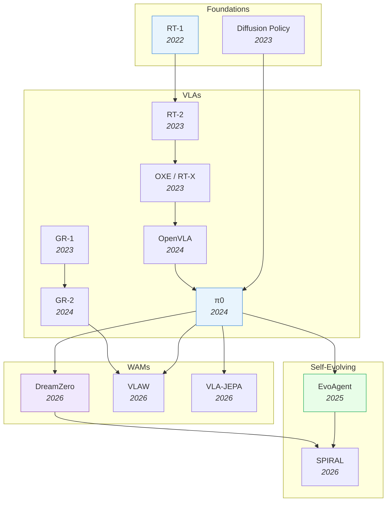

# Robotics & Embodied AI

> [!abstract] Overview
> Embodied AI sits at the convergence of all other topics: foundation models provide the backbone, VLMs provide perception, RL provides learning, and world models provide physics understanding. This note maps the landscape from VLAs through WAMs to self-evolving systems — the full path toward autonomous robots.

## Evolution Graph

The field evolved through four phases: **foundations** (2022-2023) where RT-1 and Diffusion Policy proved Transformers and diffusion work for robot control; **VLAs** (2023-2024) where RT-2, OXE, OpenVLA, and pi0 scaled vision-language-action models from proof-of-concept to generalist policies; **WAMs** (2026) where DreamZero, VLAW, and VLA-JEPA added world modeling for physics-aware control; and **self-evolving** (2025-2026) where EvoAgent and SPIRAL enabled autonomous improvement loops.

| Year | Paper | Contribution |
|------|-------|-------------|
| 2022 | [[2212.06817\|RT-1]] | Transformer policy on 130K real demos; proved Transformers work for robot control at scale |
| 2023 | [[2303.04137\|Diffusion-Policy]] | Pioneered action diffusion for robotics; proved denoising beats regression for multimodal action distributions |
| 2023 | [[2307.15818\|RT-2]] | Scaled to PaLI-X/PaLM-E backbones; first to show internet-scale VLM knowledge transfers to robot control |
| 2023 | [[2310.08864\|OXE]] | Open X-Embodiment: 1M+ trajectories from 22 embodiments; the ImageNet moment for robotics data |
| 2023 | [[2312.13139\|GR-1]] | GPT-style generative robot model unifying language, video prediction, and action in a single Transformer |
| 2024 | [[2406.09246\|OpenVLA]] | Open-source 7B VLA; democratized VLA research with competitive performance |
| 2024 | [[2410.24164\|pi0]] | Flow matching action expert + VLM for dexterous manipulation; current SOTA generalist robot control |
| 2024 | [[2410.06158\|GR-2]] | Scaled GR-1 to larger video generation backbone; improved long-horizon multi-task humanoid control |
| 2025 | [[2502.05907\|EvoAgent]] | Self-evolving agent with continual world model; +105% improvement via self-planning and self-reflection |
| 2026 | [[2602.15922\|DreamZero]] | 14B parameter WAM from NVIDIA; zero-shot robot policies via joint video+action prediction |
| 2026 | [[2604.15483\|π0.7]] | 5B steerable generalist VLA with subgoal-image + episode-metadata prompting; cross-embodiment transfer matching human experts |
| 2026 | [[2602.12063\|VLAW]] | Iterative co-improvement loop between VLA policy and world model; each bootstraps the other |
| 2026 | [[2602.10098\|VLA-JEPA]] | JEPA-style latent prediction for leakage-free future state modeling in robot control |
| 2026 | [[2603.08403\|SPIRAL]] | Closed-loop self-improving framework for controllable, long-horizon video generation and WAMs |

---

## 1. Robotic Policy Foundations & Manipulation

How robots learn to act from demonstrations. The field evolved from perception-based agents (PerAct) through diffusion-based action generation to spatial and language-conditioned policies. Manipulation is the proving ground — if a method works for dexterous object interaction, it can generalize to broader embodied tasks.

**Real-Time & Efficient Flow Policies** — One-step, low-latency, or streaming flow-matching action generation.
- [[2606.19194|INN-Adapter]], [[2605.15944|FocalPolicy]], [[2605.10051|SSIP]], [[2605.08799|ElasticFlow]], [[2602.13810|Mean-Velocity-Policy]], [[2506.08822|FreqPolicy]], [[2506.07339|RTC]], [[2505.11123|Condition-Dependent-Flow]], [[2505.01179|Fast-Flow-based-Visuomotor-Policies]], [[2412.04987|FlowPolicy]]

**RL-Tuned, Safety-Constrained & Test-Time-Guided Flow Policies** — Flow-matching policies optimized via RL/offline-RL objectives, safety/dynamics constraints, or test-time guidance.
- [[2607.14424|ConFlow]], [[2607.10504|SUREFlow]], [[2607.07076|PriGo]], [[2606.21086|ReFPO]], [[2606.13400|PolyFlow]], [[2606.11087|QGF]], [[2603.11470|NFPO]], [[2602.05051|ReFORM]], [[2511.05355|SAD-Flower]], [[2510.01068|GPC-RL]], [[2512.03973|Guided-Flow-Policy]], [[2507.21053|FPO]]

**Latent-Action & Source-Prior Flow Representations** — Flow-matching policies built on learned latent-action, source-prior, or vector-quantized action representations.
- [[2607.10206|SL-FM]], [[2606.23420|LAFM]], [[2606.23090|Flow-as-Flow]], [[2606.21600|VQActFlow]], [[2606.17408|LeaP]], [[2606.16917|UMA]], [[2602.07322|A2A]]

**Domain-Specialized & World-Model-Coupled Flow Policies** — Flow-matching policies for specific domains (tool-use, VLA smoothing, motion prediction) or coupled with world/dynamics models for planning.
- [[2607.05780|FORGE]], [[2607.04609|SEAM]], [[2606.29936|OpenSPM]], [[2606.16286|FlowMPC]], [[2605.04525|HDFlow]], [[2604.07084|FMP]], [[2603.26320|DFM-VLA]], [[2512.22688|ARFM]], [[2509.18676|3D-Flow-Diffusion-Policy]], [[2509.08435|PegasusFlow]], [[2507.13231|VITA-world-model]], [[2409.07343|Robotic-Manipulation-Policies-Point]]

**3D / Point-Cloud Diffusion Policies** — 3D-conditioned diffusion policies.
- [[2607.04714|GeoMoLa]], [[2605.26115|TriSplat]], [[2605.05756|MaMi-HOI]], [[2604.03181|MV-VDP]], [[2410.17488|GenDP]], [[2409.07163|Mamba-Policy]], [[2406.01586|ManiCM]], [[2403.03954|DP3]]

**Fast Inference: Distillation & Caching** — Accelerating diffusion-policy inference via distillation, caching, pruning, partial denoising, or adaptive real-time chunking for control.
- [[2606.31132|ELASTIC]], [[2606.10825|MODIP]], [[2605.25537|Soft-RTC]], [[2601.12894|ActionGen]], [[2508.05396|Real-Time]], [[2506.13456|BAC]], [[2503.00339|Falcon]], [[2502.12724|Responsive-Noise-Relaying-Diffusion-Policy]], [[2410.21257|One-Step-Diffusion-Policy]], [[2410.12557|Shortcut Models]], [[2406.04806|Streaming-Diffusion-Policy]]

**Efficient Diffusion Architectures & Training** — Redesigning diffusion-policy denoisers and training objectives (mixture-of-experts, routed experts, adaptive rank, RL fine-tuning) for compute efficiency.
- [[2606.21935|CoRDE]], [[2604.18518|UDM-GRPO]], [[2604.15938|VADF]], [[2502.03822|Rank-Adjustment-in]], [[2412.12953|Efficient-Diffusion-Transformer-Policies]]

**Data-Efficient Generalization & Robotics Tooling** — Efficiency via generalization (equivariance, cross-embodiment transfer, data-efficient prediction, reactive tactile control) or supporting infrastructure (fast kinematics, GPU-accelerated simulation) rather than diffusion-policy inference speed.
- [[2606.03551|Isaac-Sim-Survey]], [[2605.23733|Any2Any]], [[2604.04310|frax]], [[2503.02881|RDP]], [[2407.01479|EquiBot]], [[2311.11893|CBP]]

**RL-Tuned Diffusion Policies** — RL-finetuned diffusion policies.
- [[2607.10892|ESM]], [[2607.10369|VINE]], [[2607.06262|OTQL]], [[2606.19729|VOiLA]], [[2606.19656|DF-ExpEnse]], [[2606.17551|RQL]], [[2606.06049|L-SDPPO]], [[2605.00623|Hidden-Reward-Diffusion]], [[2604.00202|DreamControl-v2]], [[2603.13707|REFINE-DP]], [[2601.00898|DIPOLE]], [[2506.15799|DSRL]], [[2503.14833|Curiosity-Diffuser]], [[2502.02538|FQL]], [[2502.02316|DIME]], [[2409.00588|Diffusion-Policy-Policy-Optimization]], [[2205.09991|Diffuser]]

**Long-Horizon, Memory & Hierarchical Denoising** — Diffusion policies that encode non-Markovian history, hierarchical/multi-frequency action chunking, or revisable and segmented trajectories to handle long-horizon manipulation.
- [[2607.19919|DR]], [[2607.11884|MoF Policy]], [[2607.11027|SegDiff]], [[2606.30318|Chronos]], [[2606.17982|LAGO-Policy]], [[2605.14598|DSSP]], [[2604.18933|Gated-Memory-Policy]], [[2604.06067|HiPolicy]], [[2507.17846|PinchBot]], [[2506.09422|Time-Unified]], [[2505.07819|H$^3$DP]], [[2502.10040|DTP]], [[2502.08452|Push-Group-Grasp-Diffusion]]

**Spatial, Perceptual & Multimodal Conditioning** — Policies conditioned on spatial/3D structure, active perception, pixel-motion, or language and omni-modal signals, including the egocentric video datasets that supply this training data.
- [[2607.04739|Spatial Attention]], [[2606.23625|See2Act]], [[2606.14535|SCDP-Spatial]], [[2606.03682|GN0]], [[2512.07212|Diffusion-Bridge-Policy]], [[2511.00998|GauDP]], [[2510.23763|OmniAction]], [[2509.22652|DAWN]], [[2507.06710|Spatial]], [[2506.20668|DemoDiffusion]], [[2407.00451|Language-Guided]], [[2406.09905|Nymeria]], [[2210.03094|VIMA]], [[1804.02748|EPIC-KITCHENS]]

**Sampling, Guidance, Planning & Equivariant Algorithms** — The diffusion/flow sampling machinery itself: test-time guidance, mode composition, trajectory optimization, motion planning, and symmetry-aware equivariant samplers.
- [[2607.14725|BridgeFlow]], [[2606.29201|MoRE (Mode Redirection Distillation)]], [[2606.28939|ReGuide]], [[2605.09537|CAPS-Power-Sampling]], [[2512.08280|Model-Based-Diffusion-Sampling]], [[2508.21800|Tree-Guided]], [[2505.13431|Practical-Guide-Incorporating-Symmetry]], [[2503.15386|CCDP]], [[2503.12466|Modality-Composable]], [[2503.04051|RA-DP]], [[2407.01812|Equivariant-Diffusion-Policy]], [[2407.01573|MBD]], [[2305.06341|GGCS]], [[2302.01877|AdaptDiffuser]]

**Contact-Rich, Tactile & Force-Aware Manipulation** — Diffusion policies specialized for compliant, tactile-conditioned, or force/contact-guided manipulation.
- [[2606.02432|NDPP-Grasp]], [[2603.05687|CGP]], [[2511.04812|MDF]], [[2510.13324|FARM]], [[2509.19696|Diffusion-Impedance-Learning]], [[2503.03998|DP-CA-Prying]], [[2411.12982|Hierarchical-Diffusion-Policy-manipulation]], [[2410.19235|DIPCOM]]

**Cross-Embodiment, Architecture & Scaling** — Policy architectures built for embodiment-agnostic deployment, VLA-scale generation, and transformer scaling.
- [[2606.12965|EmbodiSteer]], [[2603.25406|MMaDA-VLA]], [[2502.15613|GADP]], [[2502.09029|MTDP]], [[2409.14411|Scaling-Diffusion-Policy-Transformer]], [[2407.05996|MDT]], [[2407.01531|Sparse-Diffusion-Policy]], [[2303.04137|Diffusion-Policy]]

**Safety, Verification & Empirical Analysis** — Physical-safety alignment, safety-critical whole-body control, robustness to suboptimal data, and empirical/verification studies of diffusion-policy behavior.
- [[2606.12365|Ambient-Diffusion-Policy]], [[2606.08414|PACT]], [[2605.26006|MIND]], [[2605.25546|ISSf-CBF-WBC]], [[2603.16368|SCDP]], [[2512.21430|EVE]], [[2512.16881|PolaRiS]], [[2505.05787|Diffusion-Policy-Memorization]], [[2503.22634|Empirical-Analysis-Sim-and-Real-Cotraining]]

> [!star] Key Papers
> - [[2303.04137|Diffusion-Policy]] — Pioneered action diffusion for robotics; proved denoising beats regression for multimodal distributions
> - [[2403.03954|DP3]] — Extended to 3D point clouds, enabling sim-to-real transfer without camera calibration

**One-Shot & In-Context Imitation** — Learning manipulation skills from a single or handful of demonstrations, including in-context and retrieval-based imitation.
- [[2607.20033|HOST]], [[2607.13882|Forward-Reverse Skill LfD]], [[2604.15215|HiST-AT]], [[2603.07530|ICLR-VR]], [[2602.15010|BPP]], [[2509.22149|DemoGrasp]], [[2506.15157|Robust-Instant-Policy]], [[2503.04538|SRSA]], [[2503.01206|Action-Tokenizer-Matters-In-Context]], [[2304.08742|Behavior Retrieval]], [[2201.12716|YODO]], [[2111.07447|Self-Replay]], [[1703.07326|One-Shot Imitation Learning]]

**Learning from Human Video & Cross-Embodiment Demonstration** — Policies and intent models trained on human or egocentric video and human-collected demos, transferred to robot embodiments.
- [[2606.11628|LUCID]], [[2605.05925|DexSynRefine]], [[2604.27711|ExoActor]], [[2604.24681|MoT-HRA]], [[2604.10579|AffordGen]], [[2603.22264|UniDex]], [[2602.09013|VIDEOMANIP]], [[2510.01607|ActiveUMI]], [[2508.09976|Masquerade]], [[2506.15666|Vision-in-Action]], [[2505.20795|Generalizable-Robot-Policy-Human]], [[2505.01288|ViSA-Flow]], [[2207.09450|WHIRL]], [[1707.02920|RoboInstruct-2]]

**Hierarchical, Play-Based & Skill-Composition Learning** — Long-horizon and compositional manipulation built from reusable skill primitives, play data, or spectral/hierarchical decompositions.
- [[2607.07129|Object-Centric Neural Field LfD]], [[2607.06978|SPECTRA]], [[2606.30457|Behavior-Prompting-Policy]], [[2606.29570|CSP]], [[2603.03243|HoMMI]], [[2504.15561|SPECI]], [[2503.07087|iManip]], [[2410.18907|SkillMimicGen]], [[2302.12422|MimicPlay]], [[1903.01973|Play-LMP]]

**Generalist Policies, VLA & Foundation Architectures** — Multi-task/generalist backbones, transformer and language-conditioned architectures for broad manipulation competence.
- [[2607.04591|S2C]], [[2503.21696|Embodied-Reasoner]], [[2412.11974|EMMA-X]], [[2411.02704|RT-Affordance]], [[2410.05273|HiRT]], [[2409.05865|Robot-Utility-Models]], [[2405.12213|Octo]], [[2306.10007|RPT]], [[2210.06407|Language-Table]], [[2209.05451|PerAct]], [[2203.11931|MetaMorph-UC]]

**RL-Augmented Imitation & Curriculum Learning** — Hybridizing imitation with reinforcement learning, demonstration-guided policy optimization, and curriculum strategies.
- [[2606.03335|DGPO]], [[2603.15956|ExpertGen]], [[2602.20220|Sim-to-Online-RL]], [[2602.02762|LAPO+]], [[2505.10442|IN-RIL]], [[2406.08472|RILe]], [[2405.03379|RFCL]], [[1707.05300|Reverse-Curriculum-Generation]]

**Safety-, Constraint- & Physically-Grounded Control** — Control-theoretic and physically-aware manipulation: barrier functions, safety filters, contact-rich/deformable objects, and formal constraints.
- [[2607.00534|STT-LfD]], [[2607.00215|ELMP]], [[2606.17317|CT-Warm-Start]], [[2605.06593|ReActor]], [[2602.17921|Diffeomorphic-End-Effector-Co-Design]], [[2602.07227|Cerebellar]], [[2512.03707|ContactRL]], [[2509.19555|AnySafe]], [[2506.06690|SpikePingpong]], [[2505.04961|Physics-Based]], [[2503.10334|Enhanced-View-Planning-Robotic]], [[2503.06736|OSC-CBF]], [[2502.00935|Generalizing-Safety-Beyond-Col]], [[2407.08028|AutoMate]], [[2401.17500|LeTO]], [[2203.06856|ACID]], [[2201.08355|Sim-to-Lab-to-Real]], [[2103.14256|SLDS-Differentiable-Control]]

**Action Representation, Diffusion/Flow Policies & Tokenization** — How actions are represented and generated: B-spline/waypoint/trajectory encodings, diffusion and flow-matching policies, action tokenizers.
- [[2607.09648|B-spline Policy]], [[2607.01051|AutoSpeed]], [[2604.08418|DMBN-PTE]], [[2603.22574|GIFT]], [[2510.08568|NovaFlow]], [[2510.05057|StaMo]], [[2508.01600|CLASS]], [[2506.11948|SAIL-imitation-learning]], [[2505.21851|Streaming-Flow-Policy]], [[2505.11719|Zero-Shot-diffusion]], [[2504.16925|Latent-Diffusion-Planning-Imitation]], [[2502.09268|GEVRM]], [[2411.00965|SPOT]], [[2401.00025|Any-point]], [[2307.14326|AWE]], [[2109.00137|IBC]]

**Sim-to-Real, Digital Twins & Simulation Benchmarks** — Simulators, real2sim2real pipelines, and benchmarks/toolkits used to train or transfer manipulation policies.
- [[2605.16257|DexJoCo]], [[2512.11797|AnchorDream]], [[2504.03597|Real-is-Sim]], [[2411.11839|RoboGSim]], [[2407.07788|BiGym]], [[2311.07499|Dynamic-Compliance-Tuning]], [[2104.02646|gradSim]]

**Generalization, Data Curation & Evaluation Studies** — Analytical and methodological studies of behavior-cloning generalization, data selection, distribution shift, and scaling.
- [[2607.21049|GuidedAttention]], [[2505.11816|Continuous-Subspace-Optimizati]], [[2505.09603|DataMIL]], [[2502.07645|Action-Labels-Sets-Rethinking]], [[2502.02853|Rethinking-Latent-Redundancy-Behavior]], [[2412.01770|CASHER]], [[2405.05439|How-Generalizable-Is-My-Behavi]], [[2307.03659|Factor World]], [[2011.06719|Grasping with Chopsticks]], [[1905.11979|Causal Confusion]]

**Transformer & Sequence Policies** — Transformer/sequence-model manipulation backbones.
- [[2605.00159|E²DT]], [[2506.09990|Chain-of-Action]], [[2503.13217|Dense-Policy]], [[2501.18564|SAM2Act]], [[2412.06782|CARP]], [[2410.24090|Sparsh]], [[2406.07539|BAKU]], [[2403.03181|VQ-BeT]], [[2306.14896|RVT]]

**Keypoint & Affordance-Based** — Keypoint/affordance/trajectory-conditioned manipulation.
- [[2607.10706|Action Map Policy]], [[2606.30632|GROW²]], [[2606.29028|Keypose Exploration]], [[2606.02551|AFUN]], [[2604.02408|F2F-AP]], [[2603.10052|OmniGuide]], [[2512.13214|Differentiable-MPM-Control]], [[2507.10543|MP1]], [[2503.10546|KUDA]], [[2503.03556|Afford-X]], [[2502.08643|A-Real-to-Sim-to-Real-Approach]]

**Language-Conditioned Manipulation** — Language-conditioned manipulation.
- [[2607.20207|SeededGrasp]], [[2607.10625|DASL]], [[2603.22003|VP-VLA]], [[2603.12939|RoboStream]], [[2603.07744|AeroPlace-Flow]], [[2506.21627|FrankenBot]], [[2506.18448|GraspMAS]], [[2505.09698|ManipBench]], [[2504.13351|Chain-of-Modality]], [[2503.04280|Autonomous-Reinforcement-Real-World-Robotic]], [[2502.12599|High-quality-Robotic-Wiping-Policy]], [[2412.04445|Moto]], [[2411.04999|DynaMem]], [[2210.15629|LCD]], [[2204.06252|HULC]], [[2109.12098|CLIPort]], [[2005.07648|LangLfP]]

**Grasping & Pick-and-Place** — Grasping, insertion, pick-and-place.
- [[2607.07897|StiffNET]], [[2607.00530|Multimodal HRI User Study]], [[2606.30474|GOMP]], [[2606.03385|GTP-FA]], [[2605.03363|Hierarchical-RL-QP-Grasp]], [[2505.11858|Tight-Insertion-Sim2Real]], [[2010.14406|Transporter Networks]], [[1803.09956|VPG]]

**Visual & Tactile Self-Supervised Representation Learning** — Encoder architectures, dense/3D visual representations, tactile/touch pretraining, and self-supervised training schemes for robot vision and policy learning.
- [[2607.18236|Patch Policy]], [[2607.13522|Kepler-Encoder]], [[2607.01067|TTP]], [[2607.00302|Splash]], [[2606.30101|SIR]], [[2605.28812|CoP-Tactile]], [[2605.21258|Structural-Latent-Points]], [[2506.14754|Sparsh-X]], [[2501.16389|Sim2Real-Encoder-Eval]], [[2410.22325|Robots-Pre-train-Robots]], [[2410.08208|SPA (3D Spatial-Awareness Representation)]], [[2311.16098|Dobb-E]], [[2308.03620|Exploring-Visual-Pre-training-Robot]], [[2307.01849|Crossway-Diffusion]], [[2204.02041|Example-based-Resets]], [[2203.12601|R3M]], [[2112.01511|VINN]], [[2007.04309|Self-Supervised-Deploy-Adapt]], [[1909.06933|DD Policy]]

**Action, Skill & Semantic Representations** — Representations built over actions, outcomes, skills, and world-model intermediates rather than raw pixels.
- [[2607.18709|RoboInter1.5]], [[2607.11427|EDAR]], [[2607.08354|SkillPlug]], [[2607.02466|TAP]], [[2606.29517|CORE (Outcome Regularities)]], [[2606.12499|AEM]], [[2602.00937|CLAMP]], [[2510.11103|SO3-Action-Representations]], [[2406.17768|EXTRACT]]

**Safety-Critical Control & CBF Methods** — Control-theoretic safety filters, conformal-prediction bounds, safe RL, formal synthesis, and robust state estimation for manipulation control.
- [[2607.01203|GPUSLS-LEO]], [[2607.00776|FCP-MPC]], [[2607.00424|Conformal CBF-OSCTC]], [[2607.00145|IterIEKF]], [[2606.31320|AutoSafe]], [[2606.30820|TWTL-MILP Synthesis]], [[2606.15366|Robust-Conformal-CBF/CLF]], [[2604.09452|SafeAdapt]], [[2602.23478|refineCBF]], [[2505.00779|Uncertainty-Latent-Safety-Filter]], [[2211.16657|Task-Driven-Hybrid-Model-Reduction]], [[2205.06311|Provably-Safe-RL-Shield]], [[1410.1465|invariant-extended-Kalman-filter]]

**Sim-to-Real Transfer & Digital Twins** — Real2sim2real pipelines, digital-twin and system-identification methods, and adaptive dynamics/torque-transfer models that close the sim-to-real gap, including for deformable and contact-rich objects.
- [[2606.06218|TAM-Torque-Adaptation]], [[2605.29564|VE2VF]], [[2605.26638|HyperSim]], [[2604.17513|FLASH]], [[2602.02402|SoMA-Sim]], [[2512.19390|TwinAligner]], [[2510.25405|Stress-Guided-RL]], [[2503.10118|RSR-Loop]], [[2502.18615|Distributional-Treatment-Real2Sim2Real-Object-Centric]], [[2502.14457|Watch-Less,-Feel-More]], [[2502.10894|UAN]], [[2410.20357|Dynamics-as-Prompts]], [[2410.07408|Digital-Cousins-ACDC]], [[2409.10161|SplatSim]], [[2407.07889|AdaptiGraph]], [[2404.12308|ASID]], [[2312.03673|On-the-Role-of-the-Action-Spac]], [[2111.00765|VSDR]]

**Memory & Long-Horizon Manipulation** — Episodic, vector-quantized, and retrieval-based memory modules for long-horizon, non-Markovian manipulation tasks.
- [[2606.29774|ACM]], [[2603.24576|Chameleon-Episodic-Memory]], [[2603.09513|VQ-Memory]], [[2603.01229|RMBench]], [[2510.20328|MemER]], [[2402.15487|RoboEXP]]

**Humanoid Whole-Body & Loco-Manipulation** — Humanoid retargeting, motion-data reconstruction, and whole-body control architectures that couple locomotion with manipulation.
- [[2606.05160|GRAIL]], [[2606.03297|SplitAdapter]], [[2602.23205|EmbodMocap]], [[2602.00401|ZEST]], [[2511.09484|SPIDER]], [[2509.26633|OmniRetarget]], [[2505.06776|FALCON-Loco-Manipulation]], [[2503.13441|PH2D]]

**Benchmarks, Datasets & Surveys** — Manipulation benchmarks, cross-embodiment datasets, and meta-analyses auditing evaluation practice and task-success criteria in robot manipulation.
- [[2606.04233|Manipulation-Benchmark-Audit]], [[2605.21429|roto-2.0]], [[2602.06572|Law-of-Task-Achieving-Body-Motion]], [[2505.18472|ManiFeel]], [[2505.14986|AnyBody]], [[2503.24278|AutoEval]], [[2503.03464|GenAI-in-Manipulation-Survey]], [[2408.10899|ARIO]], [[2403.19622|RH20T-P]], [[2306.11565|HomeRobot]], [[1910.11215|RoboNet]], [[1910.10897|Meta-World]]

**Offline, Multi-Task & Residual RL** — Offline/conservative Q-learning, multi-task gradient-surgery, and residual/visuomotor RL baselines for manipulation control.
- [[2104.08212|MT-Opt]], [[2103.06326|S4RL]], [[2011.11270|COCOI]], [[2006.04779|CQL]], [[2005.13239|MOPO]], [[2001.06782|PCGrad]], [[1903.11239|TossingBot]], [[1812.03201|Residual RL]], [[1504.00702|Visuomotor GPS]]

**Modern RL & Policy Optimization** — Contemporary policy-gradient, actor-critic, motion-planning, and reward-shaping methods for sample-efficient manipulation RL.
- [[2606.06041|iCEM+TL]], [[2605.19919|ZPRL]], [[2603.14469|PIPER]], [[2602.19313|TOPReward]], [[2508.11143|AC3]], [[2507.10914|M-GAPS]], [[2505.11175|Real-Time-reinforcement-learning]], [[2504.04191|GROVE]], [[2503.05696|MFPG]], [[2307.12983|Parallel-Q-Learning]], [[2307.12074|MRLM]], [[2209.13052|Training-Efficient-Controllers]]

**Foundation Models & Generalist Policies** — Large multimodal/diffusion foundation models, generalist policy architectures, embodied-reasoning training strategies, and atomic-skill/action-representation designs for manipulation.
- [[2606.26423|CoStream]], [[2605.27817|Turning-Video-Models-into]], [[2603.07648|AtomicVLA]], [[2508.05635|Genie-Envisioner]], [[2505.08243|Training-Strategies-Efficient-Embodied]], [[2502.21257|RoboBrain]], [[2502.12371|IMLE-Policy]], [[2502.07837|RoboBERT]], [[2501.09783|GeoManip]], [[2411.09658|Motion-Before-Action]], [[2410.18964|DISaM]], [[2410.07864|RDT-1B]], [[2408.17355|Bidirectional-Decoding]], [[2405.07503|Consistency-Policy]]

**Mobile Manipulation & Applied Robotics** — Mobile-manipulation motion generation, and domain-specific/applied robotics spanning medical, assistive, human-robot interaction, tool design, and actuator hardware.
- [[2607.21113|RL-MACRO]], [[2607.00066|Endovascular RL-NMPC]], [[2606.30900|CTAM Soft Tail]], [[2506.14968|FEAST]], [[2506.14763|RobotSmith]], [[2505.23692|Mobi-Pi]], [[2502.19389|Surface-Based]], [[2409.00215|Intent-Aware-Co-Manipulation]], [[2405.07991|SPIN-Mobile-Manip]], [[2310.00433|Active-Perceptive-Motion-Gen]], [[1904.03815|Quasi-Direct]]

> [!star] Key Papers
> - [[2209.05451|PerAct]] — First to use Perceiver Transformer on voxelized observations for 6-DoF multi-task manipulation
> - [[2405.12213|Octo]] — Open-source generalist policy with strong zero-shot transfer across robot morphologies
> - [[2410.24090|Sparsh]] — First SSL family of vision-based tactile representations + TacBench benchmark; **+95.1%** average over end-to-end baselines, **20-53%** greater bead-maze distance on a real robot
> - [[2506.14754|Sparsh-X]] — Extends Sparsh to four tactile modalities (image, audio, IMU, pressure) on **~1M** contact interactions; **90%** plug-insertion success, **90%** reduction in in-hand-rotation vertical drift

**Optimal Control & Trajectory Planning** — Sampling-based and control-aware optimal-control planners/optimizers for robot manipulators.
- [[2607.19284|SMO-SST]], [[2607.18731|STL-BT Synthesis]], [[2607.14455|MD-COAS]], [[2607.10842|D-SafeMPC]], [[2607.06123|MP-MPPI]], [[2607.05544|Control-Aware Optimal Trajectory Planning]], [[2607.03987|PAKR]]

**Teleoperation Hardware & Interfaces** — Physical systems, low-cost rigs, and human-guided control interfaces for dual-arm and dexterous data collection.
- [[2607.19479|ModPack]], [[2607.11481|TELEDEXTER]], [[2607.05883|DexTele]], [[2607.01201|Sensorless Bilateral Teleoperation]], [[2606.23431|DexTeleop-0]], [[2602.09888|TriPilot-FF]], [[2505.21864|DexUMI]], [[2409.15095|MoMa-Teleop]], [[2403.07788|DexCap]], [[2402.10329|UMI]], [[2309.13037|GELLO]], [[2307.04577|AnyTeleop]], [[2304.13705|ALOHA]], [[1911.04052|RoboTurk]], [[1811.02790|RoboTurk (Crowdsourcing Platform)]]

**Simulation Benchmarks & Platforms** — Simulated environments, benchmarks, and platforms for evaluating bimanual and dexterous manipulation policies.
- [[2604.05831|BiCoord]], [[2602.01939|EFM-10]], [[2601.02078|Genie-Sim-3.0]], [[2506.10966|GenManip]], [[2505.12748|TeleOpBench]], [[2504.18904|RoboVerse]], [[2504.13059|RoboTwin]], [[2503.05652|BEHAVIOR-Robot-Suite]], [[2408.06506|TacSL]], [[2407.00278|PerAct2]], [[2302.04659|ManiSkill2]], [[2206.08522|VLMbench]]

**Demonstration Generation & Data Augmentation** — Methods that synthesize, augment, or imitate manipulation demonstrations without additional physical teleoperation.
- [[2510.18316|MoMaGen]], [[2509.19454|ROPA]], [[2507.12898|Vidar]], [[2507.00990|RIGVid]], [[2507.00833|HumanoidGen]], [[2505.04860|D-CODA]], [[2505.03233|SynGrasp-1B]], [[2412.07215|RoboData]], [[2410.24185|DexMimicGen]], [[2408.14368|GR-MG]], [[2310.17596|MimicGen]], [[2310.16014|HITL-TAMP]]

**Hand-Object & Real-Robot Manipulation Datasets** — Egocentric hand-object interaction datasets and large-scale real-robot manipulation datasets used for pretraining and evaluation.
- [[2512.04884|Hoi!]], [[2510.08807|Humanoid-Everyday]], [[2502.05086|REASSEMBLE]], [[2403.19417|OAKINK2]], [[2401.08399|TACO]], [[2308.12952|BridgeData-V2]], [[2204.13662|ARCTIC]], [[2203.15709|OakInk]], [[2203.01577|HOI4D]], [[2104.11181|H2O]], [[1810.07121|MIME]], [[1806.10293|QT-Opt]]

**Bimanual Coordination & Dual-Arm Policy Learning** — Models and algorithms for coordinated dual-arm manipulation policies, including action-chunking, diffusion, and video-prediction based coordination architectures.
- [[2607.21341|BiCompoDiff]], [[2606.10899|MV-Actor]], [[2605.13452|CUBic]], [[2603.08541|EquiBim]], [[2511.21264|MPPI-Bimanual]], [[2510.27607|DUST]], [[2508.11002|3D-FlowMatch-Actor]], [[2507.11296|Imaginative-Coordination]], [[2507.07969|Q-chunking]], [[2505.24156|Bimanual-Flow-Video-Prediction]], [[2504.17784|Gripper-Keypose-Object-Pointflow]], [[2503.23271|Coordinated-Bimanual-State-Diffusion]], [[2503.17309|LLM+MAP]], [[2503.09186|Decoupled-Bimanual]], [[2503.06831|ODIL]], [[2501.14208|You-Only-Teach-Once]], [[2409.07914|InterACT]]

> [!star] Key Papers
> - [[2304.13705|ALOHA]] — Low-cost open-source bimanual system; proved co-training on diverse data dramatically improves performance

**Language & VLM-Guided Grasp Reasoning** — Grasp and task planning driven by vision-language models, natural-language instructions, voice, or text prompts.
- [[2606.19340|ZeroDex]], [[2604.05697|GraspSense]], [[2512.03874|OmniDexVLG]], [[2511.13327|ZeroDexGrasp]], [[2505.12294|PartDexTOG]], [[2503.16013|GraspCoT]], [[2503.12609|VISO-Grasp]], [[2503.01616|RoboDexVLM]], [[2412.10694|Grasp-What-You-Want]], [[2407.11298|ThinkGrasp]], [[2406.18722|Open-World-Grasping-Large-Vision-Language]], [[2405.19291|Grasp-as-You-Say]], [[2404.15189|Text2Grasp]], [[2404.10399|FoundationGrasp]]

**Affordance & Functional Grasp Generation** — Grasp synthesis grounded in object affordances, functional part-use, or one-shot tool-use imitation.
- [[2604.07517|GraspDreamer]], [[2603.08021|AffordGrasp]], [[2601.08246|FSAG]], [[2511.09558|IFG]], [[2508.08896|Affordance-Dexterous-Grasp]], [[2503.07360|AffordDexGrasp]], [[2503.06227|GAT-Grasp]], [[2503.00778|AffordGrasp-dexterous]], [[2502.11744|FUNCTO]]

**Grasp-Pose Synthesis & Datasets** — Geometric and policy-based grasp-pose generation, large-scale grasp datasets, and universal grasping policies.
- [[2607.04554|HUGS]], [[2606.17054|HUG]], [[2604.25897|Variational-Belief-Grasping]], [[2604.04138|Sparse-Taxonomy-Grasp]], [[2601.05499|TOSC]], [[2511.07418|Lightning-Grasp]], [[2505.20814|Spatial-RoboGrasp]], [[2504.04516|DexSinGrasp]], [[2503.19457|G-DexGrasp]], [[2503.04089|OPG-Policy]], [[2502.18423|Retrieval-Dexterity]], [[2502.04873|Training-free-TOG]], [[2502.03072|RoboGrasp]], [[2403.10187|Grasp-Anything-Combining]]

**Diffusion & Generative Grasp/Manipulation Models** — Diffusion, flow-matching, and other generative models for grasp and manipulation synthesis, including generative dynamics, handover systems, and diffusion-augmented imitation learning.
- [[2603.16151|EFF-Grasp]], [[2509.01819|ManiFlow]], [[2506.02489|Grasp2Grasp]], [[2503.11999|Diffusion-Dynamics-Models-Generative]], [[2503.04123|GAGrasp]], [[2503.03579|Generative-System-Robot-to-Human-Handovers]], [[2503.00508|HGDiffuser]], [[2407.17348|DexGANGrasp]], [[2402.17768|Diffusion-DAgger]]

**In-Hand Reorientation, Tactile Sensing & RL Control** — RL/IL control policies for in-hand object reorientation and proprioceptive- or tactile-sensing manipulation.
- [[2607.12105|Physics-Priors In-Hand Rotation]], [[2607.06323|LAMP-(Dexterous-Hand-Manipulation)]], [[2606.22332|Tactile-Genesis-Exploring]], [[2606.21788|Rotation-Aware]], [[2605.21330|Joint-Sensor-In-Hand]], [[2510.08884|Lookahead-RL-In-Hand]], [[2508.01695|DexReMoE]], [[2504.21585|Multi-Goal-MBRL]], [[2503.07926|Gentle-Grasping]], [[2503.02738|Variable-Friction-In-Hand]], [[2503.02587|Dexterous-In-Hand-Manipulation-Multifingered]], [[2502.08449|CordViP]], [[2410.21845|HIL-SERL]], [[2405.07391|AnyRotate]], [[2404.04219|In-Hand]]

**Sim-to-Real Transfer & Large-Scale Pretraining** — Closing the reality gap for dexterous policies via sim-to-real transfer, differentiable/real-to-sim engines, and large-scale grasp/play pretraining.
- [[2606.30749|G2D-Pretrain]], [[2606.26428|Play2Perfect]], [[2603.01151|D-REX]], [[2602.15828|Dex4D]], [[2510.08556|DexNDM]], [[2506.14317|ClutterDexGrasp]], [[2505.00991|DexCtrl]], [[2503.03045|ArticuBot]], [[2412.01791|DextrAH]], [[2407.02274|DextrAH-G]], [[2309.07350|Curriculum-Sensing-Sim2Real]]

**Retargeting, Teleoperation & Learning from Human Demonstration** — Mapping human hand motion or video demonstrations onto robot hands via kinematic retargeting, teleoperation capture, or video imitation learning.
- [[2607.11874|REGRIND]], [[2607.08341|AnyDexRT]], [[2607.07491|Smooth Operator]], [[2607.03828|ObjRetarget]], [[2607.00033|CHORD (Contact Wrench Guidance)]], [[2606.16436|V2P-Manip]], [[2606.16272|TopoRetarget]], [[2606.08057|EgoAERO]], [[2601.05844|DexterCap]], [[2511.16661|Dexterity-from-Smart-Lenses]], [[2503.21860|ManipTrans]], [[2502.09614|DexTrack]], [[2411.04005|Object-Centric]], [[2407.18178|PianoMime]], [[2404.15709|ViViDex]], [[2202.10448|Robotic-Telekinesis]]

**Cross-Embodiment, Bimanual & Compositional Manipulation** — Policies and hand hardware that generalize beyond a single fixed hand/arm: across embodiments, across two arms, or by composing multiple skills into unified control.
- [[2606.31909|CoDex]], [[2606.28323|DexCompose]], [[2606.20193|Belt-Finger]], [[2603.20236|EnergyAction]], [[2602.08278|DexFormer]], [[2602.05513|DECO]], [[2512.03743|House-of-Dextra]], [[2503.13916|Bimanual-Action-Chunking]], [[2502.16420|AnyDexGrasp]], [[2502.08054|COMBO-Grasp]], [[2411.16755|FunGrasp]], [[2410.02477|Diverse-Bimanual-Dexterous]], [[2407.15002|GET]]

**Contact-Rich Manipulation, Planning & MPC Control** — Contact-aware planning, exploration, and model-predictive control for long-horizon, contact-rich dexterous manipulation.
- [[2606.15133|DragMesh-2]], [[2606.14606|Impedance-MPC]], [[2605.21811|Safe-Steerable-Geometric-Policy]], [[2603.10971|ContactExplorer]], [[2601.10930|Contact-Intention-RL-MPC]], [[2510.14768|CADRE]], [[2509.01044|Hierarchical-Reactive-Grasping]], [[2505.04978|RT-Motion-Contact]], [[2505.02291|Contact-Trust-Region]], [[2501.03841|OmniManip]], [[2410.00841|Diffusion-Contact-Search]]

**Classic Foundational Dexterous RL & Grasping Baselines** — Early landmark papers establishing dexterous RL, grasp datasets, and dynamics-model baselines for the field.
- [[2304.04150|RoboPianist]], [[2304.03223|DexDeform]], [[2303.03486|SBRL]], [[2303.00938|UniDexGrasp]], [[2212.08333|AnyGrasp]], [[2210.13702|DeXtreme]], [[2210.04887|In-Hand-RMA]], [[2210.02697|DexGraspNet]], [[2104.11203|Reset]], [[2012.00924|CPF]], [[2008.03285|Residual Hand Pose RL]], [[1909.11652|PDDM]]

**Tactile Sensor Hardware & Simulation** — Sensor design, GelSight-style tactile simulators, and real-to-sim/sim-to-real transfer of raw tactile signal.
- [[2607.18660|MVP-Tac]], [[2607.05241|GelNeuro]], [[2606.18959|TactSpace]], [[2603.04531|PTLD]], [[2512.08920|OSMO]], [[2503.19225|CoinFT]], [[2403.08716|DIFFTACTILE]], [[2207.10763|Tactile-Gym-2.0]], [[2109.04027|Taxim]], [[2106.08796|Tactile-Real-to-Sim-GAN]], [[2105.14455|TacTip]]

**Tactile Representation Learning & Vision-to-Touch Generation** — Cross-sensor tactile embeddings, generalist tactile foundation policies, and synthesizing touch signals from vision.
- [[2607.20683|FELT]], [[2607.07287|TouchWorld]], [[2607.01684|TacImag]], [[2606.31451|UniTac]], [[2606.31236|TactX]], [[2606.30109|TacEvo]], [[2606.29948|HTT]], [[2606.29173|TacGen]], [[2606.13102|FTP-1]], [[2602.13579|TactAlign]], [[2510.14117|ViTacGen]], [[2510.09817|Cross-Sensor-Touch-Gen]], [[2506.19699|UniTac-NV]], [[2503.01058|Tactile-Cross-Training]], [[2502.19638|Sensor-Invariant-Tactile]], [[2502.12191|AnyTouch]], [[2410.11834|CTTP]], [[2406.13640|Transferable-Tactile-Transformer]]

**Visuo-Tactile Fusion Policies for Manipulation** — Policies that fuse vision, touch, vibration, and proprioception for contact-rich control.
- [[2607.09218|TACTIC]], [[2607.03723|OmniTacTune]], [[2606.29941|ViTacMotor]], [[2606.27344|VibeAct]], [[2606.17055|T-Rex-Tactile]], [[2604.01414|Adaptive-Vision-Torque-Fusion]], [[2602.13689|Symmetry-Aware-VT-Fusion]], [[2509.22421|Bimanual-Tactile-Reactive-MPC]], [[2508.14441|FBI]], [[2506.15953|ViTacFormer]], [[2506.13762|Touch-begins-where-vision]], [[2505.13982|AdapTac]], [[2504.15595|Cross-Modal-Visuo-Tactile-Grasping]], [[2503.19893|Visuo-Tactile]], [[2410.24091|3D-ViTac]], [[2410.08001|Synergistic-Generalized-Efficient-Dual-System]], [[2404.16823|HATO]], [[2112.06442|Deep-Predictive-Vision-Tactile]]

**In-Hand Dexterous Manipulation & Tactile-Guided Grasping** — Force/tactile-driven grasping and in-hand dexterity, including hardware platforms.
- [[2607.04940|Dexterous Force-Based Grasping Sim-to-Real]], [[2602.10013|Force-Regulated-Manipulation]], [[2602.07326|Blind-Grasping]], [[2602.05468|TaSA]], [[2509.23075|In-Hand-Articulated-Tools]], [[2509.07445|Text2Touch]], [[2506.07490|RAPID-Hand]], [[2505.01974|KineDex]], [[2504.16649|PP-Tac]], [[2504.05287|RobustDexGrasp]], [[2407.18834|Shape-Conditioned-Tactile-Agent]], [[2309.09979|General-In-Hand-Object-Rotatio]], [[2307.06423|Bi-Touch]]

**Contact Dynamics Modeling, State Estimation & Safety** — Learning/estimating contact dynamics and state, and certifying safety through contact.
- [[2606.30268|ConCent]], [[2606.24450|NoContactNoWorries]], [[2601.12796|Contact-Aware-Neural-Dynamics]], [[2509.20917|Long-Range-Contact]], [[2411.07833|DOBCBF-Grasping]], [[2207.13438|Contact-Safe-RL]], [[2203.02468|Predicate-State-Estimation]], [[1909.04915|Hybrid-GP-Contact-Model]]

**Force-Aware & Compliant Control** — Force/torque estimation, impedance control, and hybrid position-force control for contact-rich tasks.
- [[2607.20912|URF]], [[2607.14578|ACT Torque Proxies]], [[2607.07574|Context-Aware Force Estimation]], [[2607.00571|Passive Compliant Hybrid Position-Force Control]], [[2606.29165|Continuum Robot Force Estimation]], [[2606.14218|UME]], [[2605.25672|Compliant-Pushing]], [[2603.08342|PhaForce]], [[2602.14174|Direction-Matters]], [[2506.16685|Compliant-Residual-DAgger]], [[1906.08880|Variable-Impedance-Control]]

**MPC & Trajectory Optimization for Contact-Rich Manipulation** — Sampling-based and model-based predictive control, and contact-implicit trajectory optimization.
- [[2606.20712|Parallel-Sampling-MPC]], [[2606.14188|Robust-Deformable-MPC]], [[2606.10818|IMPACT-Internal-Model]], [[2605.30778|Object-Informed-MPPI]], [[2605.20392|VBT-MPC]], [[2605.09127|IMPACT-Active-Set]], [[2604.27175|KernelSOS]], [[2604.17833|DART]], [[2604.06133|Force-Feedback-MPC]], [[2602.17199|Continuum-NMPC]], [[2510.19974|Push-Anything]], [[2510.14643|Generative-Sampling-MPC]], [[2510.03768|Adaptive-Precision-Pushing]], [[1903.04128|Deep-Tactile-MPC]]

**Koopman-Operator & Soft-Continuum Robot Control** — Data-driven Koopman-operator dynamics and controllers for soft/continuum robots.
- [[2606.29731|Soft Arm IK/IC Controller]], [[2605.24924|Koopman-Distillation-for]], [[2605.18617|ManiSoft]], [[2605.18373|Koopman-Cloth-Folding]], [[2603.05385|Koopman-Sampling-Control]], [[2509.11567|Koopman-Continuum]], [[2505.00354|Koopman-Soft-Robot-MPC]]

**Deformable Object (Cloth/DLO) Manipulation** — Manipulation and modeling of cloth, deformable linear objects, and other non-rigid materials.
- [[2606.24552|Sim-in-Loop-Cloth]], [[2606.04206|DLO-Lab]], [[2605.31286|DeMaVLA]], [[2603.18246|Rapid-Adaptation-of]], [[2602.03623|Physics-Informed-DLO]], [[2411.16802|Leveraging-Foundation-Models]], [[2401.13362|TraKDis]], [[2306.12372|Dress-Them-All]]

**Contact-Rich Assembly, Insertion & Disassembly** — Precision peg-in-hole, part assembly, and disassembly under contact uncertainty.
- [[2607.21227|FORGE-plus]], [[2604.19677|MATCH]], [[2603.08560|CONTACT-Disassembly]], [[2510.14930|VT-Refine]], [[2411.06408|Visuotactile-Insertion]], [[2305.17110|IndustReal]]

**World & Action Models for Contact-Rich Manipulation** — Foundation-style world/action models jointly predicting and acting from multisensory (visual, tactile, audio) input.
- [[2607.02503|VT-WAM]], [[2606.08555|FAWAM]], [[2603.23481|VTAM]], [[2509.26642|MLA]], [[2405.08576|Hearing-Touch]]

**Cross-Embodiment Dexterous Grasp Generation** — Grasp-synthesis methods that produce embodiment-conditioned dexterous grasps via graph, canonical-hand, or contact representations across differing hand morphologies.
- [[2607.11031|GraspGraphNet]], [[2606.18092|EAGG]], [[2603.16806|DexGrasp-Zero]], [[2602.16712|Canonical-Hand]], [[2602.00915|UniMorphGrasp]], [[2510.06068|MachaGrasp]], [[2509.24661|CEDex]], [[2410.02479|Cross-Embodiment-DexGrasp]], [[2410.01702|DR,O-Grasp]]

**Canonical & Geometry-Aware Action Representations** — Manipulation policies built on canonical, SE(3)-equivariant, graph-based, or morphology-conditioned latent action spaces that transfer across embodiments.
- [[2603.14522|One-Policy-Fits-All]], [[2506.14608|Latent-Action-Diffusion]], [[2505.18474|Canonical-Policy]], [[2505.15211|GCNT]], [[2402.19249|Mirage-XPolicy]], [[2402.06570|Distilling-Morphology-Conditioned-Hypernetworks]]

**Cross-Embodiment Policy Training, Priors & Scaling** — VLA/diffusion-policy training strategies (action priors, skill composition, zero-shot masking, data augmentation and scaling) that generalize manipulation policies across robots.
- [[2606.26095|Action-Priors]], [[2606.24049|SPACE-Cross-Robot]], [[2606.22836|Cloak]], [[2605.17486|DyGRO-VLA]], [[2605.01448|Decompose-Recompose]], [[2602.13764|MOTIF]], [[2602.03310|RDT2]], [[2512.13100|OXE-AugE]], [[2511.04671|X-Diffusion]]

**Skill & Representation Transfer Across Embodiments** — Cross-embodiment skill discovery, imitation from human video, mobility policy synthesis, and inverse-RL built on shared, embodiment-agnostic representation learning.
- [[2505.08787|UniSkill]], [[2502.16372|COMPASS]], [[2402.19432|Cross-Embodiment Manip-Nav]], [[2307.09955|XSkill]], [[2106.03911|XIRL]]

**Human & Egocentric Video Demonstration Transfer** — Retargets manipulation skill from human or egocentric video into robot demonstrations without teleoperation.
- [[2607.19745|EgoRecovery]], [[2606.28813|Human2Any]], [[2606.19333|Do-as-I-Do]], [[2606.14665|EgoGuide]], [[2509.22578|EgoDemoGen]], [[2509.04443|EMMA]], [[2505.11920|H2R]], [[2412.10631|ARMADA-manipulation]], [[2405.20321|ORION]]

**Real2Sim & Simulation-Based Data Generation** — Reconstructs scenes into simulation (Gaussian splatting, physics engines, digital twins) to synthesize demonstrations at scale.
- [[2607.19190|Agentic Real2Sim]], [[2607.13154|WANDA]], [[2607.06699|RoboSnap]], [[2607.04880|PRISM]], [[2603.25725|SoftMimicGen]], [[2510.10637|High]], [[2507.02864|MultiGen]], [[2505.13441|GraspMolmo]], [[2504.13175|Novel-Demonstration-Generation-Gaussian]]

**Seed-Demo Multiplication via Trajectory Transformation & Generation** — Starts from a handful of real-robot or teleoperated seed demos and multiplies them through trajectory transformation, physics/constraint-aware optimization, video diffusion, or automated collection.
- [[2607.13455|Auto-E2H]], [[2607.06558|RynnWorld-Teleop]], [[2606.23689|AutoDex]], [[2604.03552|CRAFT]], [[2512.16861|ReinforceGen]], [[2512.09297|BiDemoSyn]], [[2510.20774|FieldGen]], [[2508.03944|Constraint-Preserving-DataGen]], [[2503.13171|HybridGen]], [[2502.20382|Physics-Driven-Data-Gen]], [[2502.16932|DemoGen]], [[2403.15203|DITTO (Trajectory Transformation)]]

**Trajectory Curation, Selection & Standardization for Imitation Learning** — Filters, standardizes, or selects trajectories from existing demonstration data to improve imitation-learning efficiency, without generating new demos.
- [[2607.06442|SIEVE]], [[2607.02322|The-Moving-Eye]], [[2607.00351|ACT-VLA]], [[2606.24078|MinInter]], [[2606.23371|TSD]], [[2606.22907|ISR]], [[2606.17040|R2RDreamer]], [[2503.11646|ADC]]

**3D Scene Reconstruction & Real2Sim** — Reconstructs graphics-ready or Gaussian-splat scenes and closes the real-to-sim-to-real loop for manipulation and generalist policies.
- [[2607.04144|Semantic-Guided Object Removal]], [[2604.05621|FunRec]], [[2603.16871|WorldCam]], [[2601.03200|A-High-Fidelity-Digital-Twin-f]], [[2510.05560|HoloScene]], [[2507.02861|LiteReality]], [[2506.04120|Splatting-Physical-Scenes]], [[2502.17894|FetchBot]], [[2502.08645|Re3Sim]], [[2409.20291|RL-GSBridge]]

**3D Scene Graphs & Spatial Reasoning** — Builds open-vocabulary 3D scene graphs and grounds language/affordance reasoning in explicit spatial structure.
- [[2606.29786|OP3DSG]], [[2603.19137|GSMem]], [[2603.00905|pySpatial]], [[2602.19063|Direction-aware-3D-LMM]], [[2503.11089|EmbodiedVSR]], [[2502.20041|3D-AffordanceLLM]], [[2501.18733|Integrating-LMM-Planners-3D]], [[2410.11989|DovSG]]

**Physics-Grounded & Articulated 3D Assets** — Generates simulation-ready 3D assets with physical material properties and articulated/URDF structure for physics-aware manipulation.
- [[2607.01938|PhysMani]], [[2606.13677|MANA]], [[2605.05163|PhysForge]], [[2603.23973|SLAT-Phys]], [[2603.14010|URDF-Anything+]], [[2603.01142|ArtLLM]], [[2511.21887|UniArt]], [[2511.13648|PhysX-Anything]], [[2508.17437|Pixie]], [[2507.12465|PhysX-3D]], [[2505.16249|3D-Occ-MPC]], [[2406.12769|Latent-Intuitive-Physics]], [[2204.03139|DiffCloud]]

**3D-Conditioned Manipulation Policy Architectures** — Feeds explicit 3D scene or feature representations directly into diffusion, transformer, or foundation-policy architectures for manipulation.
- [[2606.17046|GAM]], [[2604.15281|R3D]], [[2603.14498|R3DP]], [[2512.16811|GeoPredict]], [[2509.15733|GP3]], [[2505.00527|DeCo]], [[2503.08950|FP3]], [[2411.18623|Lift3D-Foundation-Policy]], [[2411.18369|G3Flow]], [[2402.10885|3D-Diffuser-Actor]], [[2309.16118|D3Fields]], [[2306.17817|Act3D]]

**Point-Cloud Representations & Cross-Domain Transfer** — Studies point-cloud encoders, positional embeddings, and equivariant representations for robust cross-domain and cross-embodiment policy transfer.
- [[2606.12759|Sparse2Act]], [[2604.14089|UMI-3D]], [[2601.17486|EquiForm]], [[2601.16212|Point-Bridge]], [[2511.10560|OmniVGGT]], [[2503.04877|Adapt3R]], [[2502.12320|Fusing-Point-Cloud-Visual]], [[2502.02562|RoPEs-Better-2D-3D]], [[2406.11740|Imagination-Policy]], [[2404.18926|Point-Cloud-Robustness]], [[2306.06799|Point-Cloud-RL-Study]], [[2011.01968|DSR-Net]]

**3D Pose & Motion Foresight** — Estimates object pose and forecasts future 3D object motion/trajectories from human or robot video.
- [[2602.22461|EgoAVFlow]], [[2601.05237|ObjectForesight]], [[2506.04227|Object-centric]], [[2504.20359|PRISM-DP]], [[2503.07135|VidBot]], [[2502.10028|3D-Foresight-Manipulation]], [[2406.04316|Omni6DPose]], [[2310.03478|RGBManip]]

**Affordance & Keypoint Reasoning** — Affordance/keypoint spatial reasoning.
- [[2607.11004|Real-to-Sim Affordance Planning]], [[2606.30613|SPARK (Anchored Robotic Keypoints)]], [[2606.27036|RelAfford6D]], [[2606.10614|Dexterous-Point-Policy]], [[2606.09314|KPGrasp]], [[2504.12636|A0]], [[2503.02748|Bridging-VLM-and-KMP]], [[2502.20391|Point-Policy]], [[2407.04689|RAM (Retrieval Affordance Transfer)]], [[2401.11439|General-Flow-as-Foundation]], [[2304.08488|VRB]], [[2103.16397|3D-AffordanceNet]]

**VLM-Guided Spatial Reasoning** — VLM-guided spatial reasoning for manipulation.
- [[2607.02417|LIME]], [[2602.20901|SpatiaLQA]], [[2601.05172|CoV]], [[2512.13660|RoboTracer]], [[2510.12276|Spatial-Forcing]], [[2506.19212|VLM-Dexterous-Scaffolding]], [[2506.11261|Gondola]], [[2506.04308|RoboRefer]], [[2503.19510|RoboFlamingo-Plus]], [[2503.18769|AlphaSpace]], [[2503.09335|NVP-HRI]], [[2503.04557|Generalizable-Language-Conditioned-Cloth-Manipulation]], [[2406.20095|LLaRA]], [[2406.18977|RoboUniView]], [[2406.13642|SpatialBot]], [[2406.01584|SpatialRGPT]], [[2403.08248|CoPa]], [[2401.12168|SpatialVLM]], [[2303.03378|PaLM-E]], [[2303.00905|MOO]]

**Trajectory & Flow Reasoning** — Trajectory/flow spatial reasoning.
- [[2607.20743|Bio-Inspired Self-Supervised Trajectory Planner]], [[2606.31493|ChronoFlow-Policy]], [[2603.05493|cuRoboV2]], [[2508.15874|Spatial-Policy]], [[2503.08029|Elastic-Motion-Policy]], [[2410.03311|Scaling-Large-Motion-Models]], [[2306.00378|Example-based]], [[2305.12577|Guided-Motion-Diffusion-Controllable]]

**Physical Scene Reconstruction, Simulation & Benchmarks** — Gaussian-splat/video-based scene reconstruction, differentiable-physics system identification, and simulation benchmarks for (often deformable) manipulation.
- [[2604.07882|ReconPhys]], [[2604.02696|VBGS-SLAM]], [[2512.04731|S2GS]], [[2506.22756|RoboPearls]], [[2503.05887|MatchMaker]], [[2503.05189|Persistent-Object-Gaussian-Splat]], [[2412.00259|One-Shot-Real-to-Sim]], [[2411.00554|DPSI]], [[2405.04378|Splat-MOVER]], [[2402.08191|THE-COLOSSEUM]], [[2210.13066|DaXBench]], [[2104.11213|ManipulaTHOR]], [[2011.07215|SoftGym]]

**Egocentric Human Video & Demonstration Learning** — Learning manipulation, handover, or fine-motor skills from egocentric or human-video demonstrations without direct robot teleoperation.
- [[2604.08534|ActiveGlasses]], [[2602.22209|WHOLE]], [[2511.19684|IndEgo]], [[2505.09601|Real2Render2Real]], [[2504.01959|Slot-Level]], [[2503.15481|Play-Piano-Real-World]], [[2503.00779|Phantom]], [[2501.04595|MobileH2R]], [[2308.06493|EgoPoser]]

**View-Invariant Perception & Active/Camera-Aware Policies** — Multi-view spatial reasoning, camera conditioning, active observation, and reachability/caging planning for robust perception under viewpoint change.
- [[2606.22143|Eikonal-Caging]], [[2604.21914|VistaBot]], [[2604.06778|RichMap]], [[2603.27967|XVR]], [[2602.18374|ZS-IP]], [[2512.07998|DIJIT]], [[2510.02268|Know-Your-Camera]], [[2508.05186|TVVE]], [[2503.13250|MindEye-OmniAssist]]

**Spatial Representations, World Models & Policy Architectures** — Implicit/explicit spatial encodings, 4D/occupancy world models, and spatial-reasoning architectures embedded directly into visuomotor policies.
- [[2607.07101|GeoProp]], [[2606.15232|SSPool]], [[2605.21133|Spatial-Brain-Cerebellum]], [[2603.13825|Explicit-WM-Manipulation]], [[2511.05491|VST]], [[2509.22442|Ball-Composing-Policies-Long-Horizon]], [[2509.18644|State-Free-Visuomotor-Policy]], [[2506.03079|ORV]], [[2505.21351|EquAct]], [[2505.16196|SEM]], [[2505.01709|RoBridge]], [[2503.00193|ProDapt]], [[2502.13142|Pre-training]], [[2502.09389|S$^2$-Diffusion]], [[2501.10074|SpatialCoT]], [[2501.01895|EnerVerse]], [[2408.05107|Depth-Helps]], [[2309.15278|Out-of-Sight-Still-in-Mind]]

> [!star] Key Papers
> - [[2501.10074|SpatialCoT]] — Chain-of-thought reasoning in 3D space; bridges VLM reasoning with spatial manipulation

**Foundational Affordance-Grounded Planning** — Early LLM/VLM zero-shot planners that ground language directly in robot affordances, 3D value maps, or multimodal reasoning for manipulation and mobile manipulation.
- [[2410.06237|BUMBLE]], [[2409.01652|ReKep]], [[2404.10220|COME-robot]], [[2401.12202|OK-Robot]], [[2307.05973|VoxPoser]], [[2204.01691|SayCan]], [[2204.00598|Socratic-Models]], [[2201.07207|LLM-Zero-Shot-Planners]]

**Symbolic and Neuro-Symbolic Task Planning** — PDDL/POMDP formalisms, formal-logic constraints, and hybrid LLM+symbolic/RL planners that give robot task plans verifiable structure.
- [[2607.18580|STeP]], [[2607.06724|EvoPlan]], [[2606.31260|SymPlan]], [[2606.15654|PO-PDDL]], [[2604.26569|LLM-Flax]], [[2604.02812|Neuro-Symbolic-Robot-Policies]], [[2604.02021|Discrete-Continuous-Planning-Bridge]], [[2603.30022|Hybrid-LLM-RL-Manipulation]], [[2603.04560|MEMO]], [[2511.01107|SLAP]]

**Memory-Guided Long-Horizon Orchestration** — Agentic harnesses, hierarchical sub-goal policies, and closed-loop planners that orchestrate skills or heterogeneous policies across long-horizon manipulation tasks.
- [[2607.19633|LENS-Clutter]], [[2607.18060|RoboHarness]], [[2607.08448|Harness VLA]], [[2607.08024|APIVOT]], [[2607.06501|HUME]], [[2607.05377|Cortex]], [[2607.04162|ACE]], [[2606.10025|GHOST]], [[2606.03047|ModuLoop]], [[2605.25832|AUTO-ROBOTIST]], [[2605.02600|CoRAL]], [[2602.21198|Reflective-Test-Time-Planning]], [[2602.20119|NovaPlan]], [[2601.15164|V-CAGE]], [[2510.14968|RDD]]

**Spatial and Interaction-Aware Manipulation Planning** — VLM/MLLM-guided planners that ground spatial reasoning, gestures, bimanual coordination, and prehensile/non-prehensile skill sequencing for instruction-following manipulation.
- [[2606.13435|GIVE]], [[2606.06139|MotionDisco]], [[2604.20348|BiCICLe]], [[2603.02511|Unveiler]], [[2503.18349|RMD-Planner]], [[2503.13055|Mitigating-Cross-Modal-Distraction-Ensuring]], [[2503.05114|Look-Before-You-Leap]], [[2502.18015|$\texttt{SPIN}$]]

**Language-Conditioned Policies and Benchmarks** — Generalist language-conditioned manipulation policies, reward/critic learning, and benchmarks for evaluating instruction-following robot manipulation.
- [[2507.17520|InstructVLA]], [[2505.10359|NVSPolicy]], [[2501.04693|FuSe]], [[2412.18194|VLABench]], [[2412.05718|RLZero]], [[2410.01345|GemBench]], [[2408.01147|Astra]], [[2405.19988|Video]], [[2405.19783|IVM]], [[2403.13358|QUARD-Auto]]

> [!star] Key Papers
> - [[2307.05973|VoxPoser]] — LLMs generate 3D value maps that guide robot actions; no robot training data needed
> - [[2409.01652|ReKep]] — Automatic keypoint discovery from VLMs for constraint-based manipulation planning
> - [[2204.01691|SayCan]] — Foundational LLM-affordance grounding: an LLM proposes plans, a learned value function scores feasibility; the paradigm behind the whole "LLM plans, robot executes" line of work

**Latent & Representation-Based World Models** — World models that predict dynamics in a compact latent or feature space (pretrained visual features, JEPA, discrete codebooks, causal or object-centric latents) rather than pixel space.
- [[2607.21576|SDM]], [[2606.03834|SFMDS]], [[2606.02027|World-Task-Factorization]], [[2605.25495|RepSAM]], [[2604.19683|MWM]], [[2603.29090|HCLSM]], [[2512.24497|JEPA-WM]], [[2503.09867|OH-A-DINO]], [[2503.00653|DC-MPC]], [[2502.20168|Model-Based]], [[2411.04983|DINO-WM]], [[2310.18534|Multi-Time-Scale-WM]]

**3D, 4D & Gaussian-Splat World Models** — World models built on explicit geometric scene representations, point clouds, splats, or 3D flow fields for spatially grounded manipulation prediction.
- [[2607.06559|RynnWorld-4D]], [[2607.01166|Structured 4D Latent]], [[2607.00148|3DPWM]], [[2606.18375|PAIWorld]], [[2606.13769|μ0]], [[2606.01950|OC-GS-World-Model]], [[2605.20752|GaussianDream]], [[2605.17522|RoboFlow4D]], [[2603.05108|GaussTwin]], [[2506.06199|3DFlowAction]]

**Generative Video & Human-Video World Models** — Action-conditioned video-generation or diffusion-based world models, including those that transfer dynamics knowledge from human demonstration videos.
- [[2607.04546|Mask2Real-WM]], [[2606.32028|DVG-WM]], [[2606.26025|ICWM]], [[2606.21406|Human-Video-Dynamics]], [[2606.05699|DexFuture]], [[2603.13615|Hand-Object]], [[2512.13644|DexWM]], [[2512.03538|AdaPower]], [[2511.01718|UD-VLA]], [[2510.10125|CTRL-WORLD]], [[2501.06605|RoboHorizon]]

**World-Model Planning & Control** — Uses a world model as the rollout engine for downstream decision-making: MPC, tree search, safe control, and offline or online policy optimization.
- [[2607.14943|WA-LQR]], [[2607.02431|WorldSample]], [[2607.02403|ACID]], [[2606.15594|SLS2]], [[2603.22430|RL]], [[2603.12553|Structured-WM-Planner]], [[2512.23541|Act2Goal]], [[2512.04341|NEUBAY]], [[2511.14004|STAR-Memory-Action]], [[2511.03077|WorldPlanner]], [[2506.18897|MinD]], [[2501.10100|RWM]], [[1812.00568|Visual MPC]]

**World-Model Diagnostics, Benchmarks & Surveys** — Empirical studies, benchmarks, and surveys that probe world-model behavior and failure modes rather than proposing a new world model.
- [[2607.12547|Hi-LeWM]], [[2607.05966|iKCE]], [[2606.27326|MMBench2]], [[2604.19092|RoboWM-Bench]], [[2604.18161|DDCG]], [[2512.03422|3D-Scene-Rep-Survey]], [[2512.01119|World-Model-Surprise-Robustness]], [[2507.10087|Foundation-Robotics-Review]]

**Sim-to-Real & Contact-Rich World Models** — World models targeting physical fidelity for contact-rich, dexterous, or force-sensitive manipulation, including sim-to-real transfer and distillation.
- [[2607.20653|PhysCoRe]], [[2606.31101|Sim-to-Real WAM]], [[2606.30988|MuSe]], [[2606.13877|ContactWorld]], [[2603.28955|WAM]], [[2603.18336|ManiDreams]], [[2603.14392|WestWorld]], [[2311.03622|TWIST-WM-Distill]]

> [!star] Key Papers
> - [[2411.04983|DINO-WM]] — World models built on pre-trained DINO features enable zero-shot planning; foundational for latent WM in manipulation
> - [[2512.24497|JEPA-WM]] — LeCun lab study identifying what drives success in JEPA-based physical planning; key design insights

> [!tip] The Diffusion Policy Shift
> Regression → diffusion → flow matching. If you're building a manipulation policy today, start with Diffusion Policy or DP3 and add 3D/spatial features for viewpoint invariance.

---

## 2. Vision-Language-Action Models (VLAs)

VLAs are the current mainstream approach to robot control: take a pre-trained vision-language model, fine-tune it to output robot actions directly. The field has exploded from RT-1/RT-2 (2022-2023) to 80+ models spanning efficient deployment, spatial awareness, reasoning, world-model augmentation, and self-evolution.

> [!success] Ideal VLA Recipe (from RoboVLMs)
> ==KosMos/[[2407.07726|PaliGemma]] backbone== + ==Policy Head fusion== + ==Continuous actions== + ==MoE== + ==Post-training on in-domain data==

**Humanoid & Whole-Body VLA** — Generalist policies on legged/whole-body humanoid platforms.
- [[2607.18016|POT-VLA]], [[2605.24225|ECo-MoE]], [[2605.02147|Entropy-OT-Control]], [[2604.10598|AWARE]], [[2603.19632|ContractionPPO]], [[2603.03751|Interaction-Aware-WBC]], [[2602.10561|Morphogenetic-Modular]], [[2510.12332|Shape-Aware]], [[2509.17884|Linear-WB-MPC]], [[2507.23203|Quadratic-Programming-Based-Posture]], [[2406.15508|LLMs]], [[2312.06571|Alter3]], [[2305.18464|Sim2Real-Info-Bottleneck]], [[2109.05603|to-Navigate-Sidewalks]]

**Dexterous & Bimanual VLA** — Generalist policies for multi-finger and two-arm manipulation.
- [[2606.26093|ForceBand]], [[2606.20285|Co-VLA]], [[2604.03613|Human-Robot-Copilot]], [[2603.03836|SkillVLA]], [[2602.16710|EgoScale]], [[2511.17366|METIS-VLA]], [[2507.05331|LBM-TRI]], [[2502.20900|DexGraspVLA]], [[2501.06919|Shake-VLA]], [[2407.18902|Lessons-from-to]], [[2407.03245|TieBot]]

**Cross-Embodiment & Morphology** — One policy across robot bodies/morphologies.
- [[2606.32009|Human-as-Humanoid]], [[2606.28133|Bridging Action VLA]], [[2606.12352|CHORUS]], [[2605.30280|Qwen-VLA]], [[2603.00182|Morphology-Aware-Transformer]], [[2602.10556|LAP]], [[2601.12993|Being-H0.5]], [[2505.07817|Pixel-Motion-as-Universal]], [[2310.08864|OXE]]

**Reasoning & CoT VLA** — VLAs with explicit reasoning / chain-of-thought.
- [[2606.30552|ZR-0]], [[2606.27373|Self-Evolving]], [[2606.23595|SPIRAL-Search-Aggregate]], [[2606.09009|Diversified-Experience]], [[2606.03100|3D-QA-View-Token]], [[2605.31251|ERGeoBench]], [[2605.01194|VLA-ATTC]], [[2603.28545|ManipArena]], [[2603.10370|GeoSense]], [[2602.04620|QUATRO]], [[2601.21199|Thinker]], [[2601.14352|RoboBrain-2.5]], [[2511.00108|Pelican-VL-1.0]], [[2510.11027|Vlaser]], [[2509.21543|Self-CriTeach]], [[2509.01106|Robix]], [[2507.02029|RoboBrain-2.0]], [[2505.21432|Hume]], [[2503.15558|Cosmos-Reason1]]

**Edge & On-Device VLA Deployment** — Real-time inference on embedded, aerial, and low-cost hardware.
- [[2607.14695|Reflex]], [[2607.12659|Jetson-PI]], [[2607.04171|XS-VLA]], [[2607.03693|CoRE-VLA]], [[2607.02501|Embodied.cpp]], [[2606.04818|5G-Aerial-Robot]], [[2604.24447|VLA-XPU]], [[2604.10170|Device-Conditioned-Architecture-Search]], [[2510.17143|Multi-UAV]], [[2510.16624|Low-Cost]], [[2510.08022|FastUMI-100K]]

**Pruning, Quantization & Latency Optimization** — Compression techniques that cut VLA inference cost.
- [[2607.12287|Temporal Token Reuse]], [[2606.20031|Neuromorphic-Reinforcement-Framework]], [[2606.14801|QPILOTS]], [[2605.13748|TinySDP]], [[2603.12960|Attenuated-Residual-Racing]], [[2602.18397|VLA-Perf]], [[2602.00780|Adaptive-VLA-Pruning]], [[2509.11480|VLA-Cross-Platform-Scaling]], [[2509.05614|SpecPrune-VLA]]

**Data- & Attention-Efficient VLA Training** — Reducing demonstration or attention-compute requirements without sacrificing accuracy.
- [[2606.04172|Affordance2Action]], [[2605.15836|GAP]], [[2605.11817|See-What-Matters]], [[2605.10925|PriorVLA]], [[2602.06575|ThinkProprio]], [[2512.20276|ActionFlow]], [[2511.18617|AutoFocus-IL]], [[2405.01472|IntervenGen]]

**Flow-Matching & Diffusion Policy Backbones** — Foundational continuous-action generalist policies built on flow-matching or diffusion.
- [[2605.06759|Pollination-Aerial-Manip]], [[2508.21112|EO-1]], [[2507.23682|villa-X]], [[2507.01424|TriVLA]], [[2505.23189|TrackVLA]], [[2503.19757|Dita]], [[2503.10631|HybridVLA]], [[2410.24164|π0]], [[2410.15959|DiT-Policy]], [[2407.15208|Im2Flow2Act]], [[2405.12213|Octo]]

**Discrete & Equivariant Diffusion Actions** — Token-based diffusion or symmetry-aware (SE(3)/rotation) action generation.
- [[2606.08015|Q-VGM]], [[2606.01847|SE3-VLA]], [[2605.13403|RotVLA]], [[2602.18532|VLANeXt]], [[2509.06932|LLaDA-VLA]], [[2508.20072|Discrete-Diffusion-VLA]]

**Fast Sampling & Inference Acceleration** — Few-step, consistency-distilled, or otherwise accelerated sampling for flow/diffusion action heads.
- [[2607.08283|TFP]], [[2607.04816|CAC-VLA]], [[2606.14409|HyVLA-0.5]], [[2606.12366|APT]], [[2605.25547|TapSampling]], [[2605.08434|AFIL]], [[2602.08245|STEP]], [[2512.19347|OMP]], [[2511.06385|Path-Consistent-Safety-Filter]], [[2510.21571|VITRA]]

**Latent World-Model & JEPA VLA Backbones** — Generalist VLAs augmented with predictive latent-state world models.
- [[2607.02195|BRIDGE-WA]], [[2607.01586|VLAFlow]], [[2606.22982|CLS-DP]], [[2606.15469|Context-ODE]], [[2605.24931|Latent-Action-Chunks]], [[2605.22597|MoSA-Continuum]], [[2605.14805|Cross-Coupled]], [[2605.11750|DreamAvoid]], [[2605.00078|Being-H0.7]], [[2603.01549|Pri4R]], [[2602.09849|BagelVLA]], [[2602.03668|MVP-LAM]], [[2602.01456|LpJEPA]], [[2601.04061|CLAP]], [[2505.06111|UniVLA]], [[2505.03500|TLI]], [[2305.08553|Distilling-Knowledge-for]]

**Physically-Grounded Dynamics Control (Aerial/Exoskeleton/Contact)** — Task-specific dynamics-model / MPC-style control on aerial, exoskeleton, or contact-rich platforms.
- [[2605.02370|Hook-Aerial-MPC]], [[2604.27450|RAY-TOLD]], [[2603.29315|IMPASTO]], [[2603.04166|Hip-Exoskeleton-Control]], [[2510.06199|DYMO-Hair]]

**Aerial & Drone RL Post-Training** — RL recipes specialized for agile flight and drone racing.
- [[2604.05828|Precise-Aggressive-Aerial]], [[2512.09571|Robust-Drone-Racing]], [[2510.14783|SkyDreamer]], [[2506.22423|ARMOR-UAV]], [[2403.12203|Bootstrap-Agile-Flight]], [[2311.13081|to-Fly-in]]

**Foundational VLA RL Milestones** — Early landmark RL/post-training results establishing the VLA paradigm.
- [[2502.13130|Magma]], [[2412.09149|Student-Informed-Teacher-Training]], [[2408.17061|Robotic-Object-Insertion]], [[2406.09246|OpenVLA]], [[2312.04670|Rapid-Motor-Adaptation]], [[2311.12996|RLIF]], [[2311.02912|Alt-MAPPO]], [[2311.01378|RoboFlamingo]], [[2307.15818|RT-2]], [[2211.02443|Robotic-Assembly-Control]], [[2205.03353|How-to-Spend]], [[2203.15390|ReIL]], [[2107.13545|Autonomous-Real-World-RL]], [[2012.07330|Active-Hierarchical-Imitation]], [[2008.06073|Visuomotor-Mechanical-Search]]

**Reward Design, Verification & Distillation for RL Post-Training** — Reward shaping, formal verification, and teacher-student distillation of RL-trained policies.
- [[2606.05143|HORIZON]], [[2605.28372|Teacher-Student-Representational-Alignment]], [[2603.13333|STL-SVPIO]], [[2603.09542|NS-VLA]], [[2603.08111|DeReCo]], [[2601.03044|SOP-VLA]], [[2511.19878|MAPS]], [[2510.24461|Surrogate-Gradients-for]], [[2510.18085|R2BC]], [[2510.04280|KL-Plan]], [[2509.23155|LAGEA]], [[2509.11481|RAPTOR]], [[2505.09546|Distilling-Realizable-Students]]

**Task-Specific RL Post-Training Recipes** — RL fine-tuning recipes targeted at specific manipulation or humanoid tasks.
- [[2606.27163|LeHome]], [[2606.26080|LLM]], [[2606.25629|Event-Adaptive]], [[2606.16513|Agile-Fall-Recovery]], [[2606.06011|MBC+MARL]], [[2605.27284|FineVLA]], [[2605.24449|Vision-Guided]], [[2605.19282|Pion]], [[2605.03269|RLDX-1]], [[2604.13733|Jump-Starting]], [[2604.01694|MiCA]], [[2603.03741|HALO-HRC]], [[2602.18071|EgoPush]]

**Navigation & Mobile VLA** — VLAs for navigation / mobile robots.
- [[2606.31144|Modular VLA Framework]], [[2606.25366|Co-Designing]], [[2605.21061|Driving-VLA-IK]], [[2605.18729|Robo-Cortex]], [[2602.23109|Active-Inference-HRI]], [[2511.21312|NMPC]], [[2511.18112|EchoVLA]], [[2506.09176|Robot-Gated]], [[2210.05714|VLMaps]], [[2210.01841|Perception-Aware-Agile-Flight]], [[2110.05113|High-Speed-Flight]]

**Flagship Generalist VLA Releases** — Major named generalist VLA systems and foundation-model releases.
- [[2607.17977|RynnBrain 1.1]], [[2607.15330|Xiaomi-Robotics-1]], [[2606.07383|RhinoVLA-Technical-Report]], [[2604.15483|π0.7]], [[2512.22414|π0.5-+-ego]], [[2512.05693|HiMoE-VLA]], [[2511.02776|XR-1]], [[2510.13778|InternVLA-M1]], [[2508.21046|CogVLA]], [[2508.19958|Long-VLA]], [[2507.15597|Being-H0]], [[2507.15493|GR-3]], [[2503.20020|Gemini-Robotics]], [[2503.04163|VLA]], [[2503.03734|OTTER]], [[2502.13508|VLAS]], [[2411.00508|CLIP-RT]], [[2410.06158|GR-2]], [[2406.18915|Manipulate-Anything]], [[2403.03174|MOKA]], [[2312.13139|GR-1]], [[2303.16958|PartManip]], [[2212.06817|RT-1]]

**Aerial & Dynamic Motion-Space Backbones** — Backbones for agile flight, drone racing, and action/motion-space design.
- [[2605.03288|Adjoint-Neural-Control]], [[2602.23408|Action-Space-Design]], [[2602.16462|Particle-Reactive-Motion]], [[2602.00807|Any3D-VLA]], [[2512.24974|DLO-Planning]], [[2511.19433|Mixture-Horizons-Action-Chunking]], [[2511.17199|VLA-4D]], [[2511.15532|Interception-NMPC]], [[2505.01059|Tensor-Planning]], [[2504.20326|Posture-Thrust-NMPC]], [[2406.12505|Demonstrating-Agile-Flight]], [[2006.05768|Drone-Acrobatics]]

**Hardware-Grounded & Sensor-Integrated Backbones** — Backbones tied to specific compute, actuator, or sensing hardware.
- [[2606.26341|GPU]], [[2605.12804|BiPneu]], [[2604.16667|Liquid-E-Stop]], [[2603.11980|Laser-Tag-MARL]], [[2603.04038|Force-Aware]], [[2502.07282|Pressure-Sensing-Fish-Formation]], [[2412.12698|Array-Based]], [[2410.01971|Run-time]], [[2410.01319|LiDAR-based]]

**Data, Scaling & Training-Recipe Studies** — Studies of data collection, scaling laws, and training recipes for generalist backbones.
- [[2606.15587|Perfect-Demo-Makes]], [[2606.05960|a-Data-Flywheel]], [[2605.24642|GFM-VLA-Study]], [[2605.19986|MetaFine]], [[2603.19131|From-Inference-Efficiency-to-E]], [[2602.04208|SCALE-VLA]], [[2511.11478|LIBERO-Mem]], [[2510.08759|Embodied-Skill-Eval]], [[2510.04041|SITCOM]], [[2510.01711|CRR-VLA]], [[2509.14117|GeoAware]], [[2508.12296|robust-and-compliant]], [[2503.11007|DARPA]], [[2503.06814|Unlocking-Generalization-for]], [[2312.02352|Working-Backwards-to]], [[2206.14349|Fleet-DAgger]], [[2110.06192|Beyond-Pick-and-Place]], [[2110.03134|Robot-Centric]], [[2105.03019|Imitation-via-Simultaneous]], [[1910.04854|Imitation-of-Sequential]]

**Task-Specific Manipulation Applications** — Backbones targeted at specific manipulation tasks or domains (care, folding, insertion, assembly).
- [[2606.17846|Qwen-RobotManip]], [[2605.17033|Actionable-Parts-Pose]], [[2604.23620|Move-Then-Operate]], [[2604.20100|JoyAI-RA]], [[2603.12193|SaPaVe]], [[2603.05504|RoboPocket]], [[2602.13086|UniManip]], [[2602.09153|SceneSmith]], [[2602.04600|Act-Sense-Act]], [[2602.03430|ProAct]], [[2512.22575|ParaMaP]], [[2512.16069|Task-Driven]], [[2511.16175|Mantis]], [[2511.04357|GraSP-VLA]], [[2508.02649|Manip4Care]], [[2506.16211|ControlVLA]], [[2506.13725|CEED-VLA]], [[2506.03574|SwitchVLA]], [[2505.09109|FoldNet]], [[2505.03815|Semantic-Level]], [[2505.02166|CrayonRobo]], [[2505.02152|Interleave-VLA]], [[2411.01850|ManiBox]]

**Interpretability, Safety & Miscellaneous Backbones** — Interpretability, steering, and other backbones not covered by the buckets above.
- [[2606.29384|Event-VLA]], [[2606.27295|LA4VLA]], [[2606.25136|Long-Horizon]], [[2606.21470|ASCII]], [[2606.20394|AutoResearch]], [[2606.17200|ACE-Ego-0]], [[2606.12475|Collaborative VLA]], [[2606.12299|Harmless-VLA-Steering]], [[2606.04708|VISTA]], [[2605.29710|PhAIL]], [[2605.15298|PhysBrain]], [[2605.11665|Nautilus]], [[2605.07381|Anchor-Centric]], [[2605.00321|Embodied-Interpretability]], [[2603.01766|NIAF]], [[2602.09021|Resource-Aware]], [[2602.03406|Deep-Learning]]

> [!star] Key Papers
> - [[2604.15483|π0.7]] — 5B-param steerable generalist VLA from Physical Intelligence with episode-metadata + subgoal-image prompting; cross-embodiment transfer matching human experts
> - [[2602.16710|EgoScale]] — NVIDIA's **20,854-hour** human-video VLA pretraining; established a log-linear scaling law for human data and enables cross-embodiment transfer
> - [[2507.15597|Being-H0]] — Physical Instruction Tuning on 150M human-hand motion pairs; first VLA to explicitly tokenize human dexterous actions for robot transfer
> - [[2212.06817|RT-1]] — Google's first VLA: 130K demonstrations, 700 tasks, Transformer-based; proved the paradigm works
> - [[2307.15818|RT-2]] — Scaled to PaLI-X/PaLM-E backbones; first to show internet-scale VLM knowledge transfers to robot control
> - [[2406.09246|OpenVLA]] — Open-source 7B VLA; democratized VLA research
> - [[2410.24164|π0]] — Flow matching for continuous actions; current SOTA for generalist robot control

**Quantization, Pruning & Caching** — Weight/activation compression and KV-style caching for cheaper VLA inference.
- [[2606.31382|Recovery-Free VLA Pruning]], [[2605.24011|ActQuant]], [[2603.07904|DyQ]], [[2602.20309|QuantVLA]], [[2509.22093|Action-Aware-VLA-Pruning]], [[2507.01016|VQ-VLA]], [[2506.07530|BitVLA]], [[2503.02310|PD-VLA]], [[2502.02175|VLA-Cache]], [[2410.15549|DP-VLA]]

**LoRA & Parameter-Efficient Fine-Tuning** — Low-rank adaptation and other parameter-efficient fine-tuning recipes for open-source VLAs.
- [[2607.10172|LoRA-VLA Efficiency Study]], [[2606.25700|LoRA-Policy-Libraries]], [[2603.09298|CORAL-LoRA-Experts]], [[2505.23705|Knowledge-Insulation-VLA]], [[2502.19645|OpenVLA-OFT]]

**Fast & Real-Time Inference Pipelines** — Caching, streaming, and one-step inference tricks that cut VLA latency.
- [[2607.06370|ActionCache]], [[2606.21372|NAC]], [[2606.05737|One-Step-VLA]], [[2605.25477|EXPO-FT]], [[2605.13778|Realtime-VLA-FLASH]], [[2605.02739|Latent-Bridge]], [[2604.05656|SnapFlow]], [[2604.05323|VLA-InfoEntropy]], [[2604.04161|AAC]], [[2603.28740|FocusVLA]], [[2603.28565|StreamingVLA]], [[2512.04952|FASTer]], [[2510.26742|Running-VLAs-at-Real-time-Spee]], [[2509.09090|SQAP-VLA]], [[2508.19257|TTF-VLA]], [[2507.14049|EdgeVLA]], [[2506.12723|SP-VLA]], [[2506.10100|EfficientVLA]], [[2501.09747|FAST]]

**Compact & Small-Footprint VLA Architectures** — Small parameter-count open-source VLAs designed to run cheaply.
- [[2607.08575|FabriVLA]], [[2605.29562|VLA-Pro]], [[2605.28634|PrimitiveVLA]], [[2605.18722|Dexora]], [[2605.09948|LoopVLA]], [[2604.20834|PokeVLA]], [[2604.11757|StarVLA-alpha]], [[2604.05672|A1]], [[2604.02965|SV-VLA]], [[2603.03380|LiteVLA]], [[2602.22896|DySL]], [[2602.20200|OptimusVLA]], [[2602.18224|SimVLA]], [[2602.13710|HBVLA]], [[2602.12322|ForeAct]], [[2602.03782|QVLA]], [[2601.22153|DynamicVLA]], [[2601.20130|REMAC]], [[2511.04555|Evo-1]], [[2509.04996|FLOWER]], [[2506.01844|SmolVLA]], [[2504.19854|NORA]], [[2409.12514|TinyVLA]]

**Async, Parallel & Deployment Infrastructure** — Systems-level infrastructure for running VLAs at scale or under real-time constraints.
- [[2512.05964|Training-Time]], [[2511.14148|AsyncVLA]], [[2511.05936|10-VLA-Challenges]], [[2510.06710|RLinf-VLA]], [[2506.19816|CronusVLA]]

> [!star] Key Papers
> - [[2501.09747|FAST]] — Compression-based action tokenization; makes VLAs 5x faster by compactly encoding continuous actions
> - [[2506.01844|SmolVLA]] — 450M params achieving competitive performance; proves VLAs don't need to be massive

**Point-Cloud & Depth-Based Spatial Representations** — Inject depth or point-cloud features into VLAs for 3D spatial generalization.
- [[2607.12356|VistaVLA]], [[2607.11498|Robot-Centric Pointmaps]], [[2607.06564|Lift3D-VLA]], [[2606.31329|3D HAMSTER]], [[2606.02274|Dexterity-BEV]], [[2605.29416|3DVLA]], [[2605.14950|Evo-Depth]], [[2605.11832|AML-VLA]], [[2603.25399|LaMP]], [[2603.24393|3D-MIX]], [[2602.23721|StemVLA]], [[2511.01571|PixelVLA]], [[2508.09071|GeoVLA]], [[2507.02190|cVLA]], [[2505.05800|3D-CAVLA]], [[2501.15830|SpatialVLA]], [[2411.02359|DeeR-VLA]], [[2403.09631|3D-VLA]]

**4D & Multi-View Camera Geometry** — Multi-view, camera-pose, or space-time (4D) alignment for VLA perception.
- [[2607.05396|CamVLA]], [[2606.03240|GeoAlign]], [[2605.05126|ConsisVLA-4D]], [[2604.02759|OMNI-PoseX]], [[2603.12730|AnchorVLA4D]], [[2602.10698|AugVLA]], [[2602.10109|ST4VLA]], [[2510.17439|FALCON-Spatial-VLA]], [[2510.00695|HAMLET]], [[2507.00416|Evo]], [[2506.23919|Goal-VLA]], [[2506.22242|4D-VLA]], [[2506.07961|BridgeVLA]], [[2506.01196|OG-VLA]], [[2405.06039|Bi-VLA]]

**3D Evaluation, Benchmarks & Active Perception** — Testbeds and active-viewpoint methods for spatially-aware VLAs.
- [[2605.29074|Embodied3DBench]], [[2605.22812|GesVLA]], [[2605.22283|SOMA]], [[2605.18746|ESI-Bench]], [[2605.10485|VEGA]], [[2601.08325|ActiveVLA]], [[2512.13080|VIPA-VLA]], [[2512.00903|SwiftVLA]]

> [!star] Key Papers
> - [[2501.15830|SpatialVLA]] — Novel spatial representations that let VLAs understand object arrangements without explicit 3D supervision

**RL & Training Recipes for Reasoning VLAs** — Fine-tuning and RL recipes that teach VLAs to reason before acting.
- [[2601.11404|ACoT-VLA]], [[2601.09708|Fast-ThinkAct]], [[2510.01623|VLA-R1]], [[2507.16815|ThinkAct]], [[2506.13757|AutoVLA]], [[2506.01953|Fast-in-Slow]], [[2506.00070|Robot-R1]], [[2505.23450|Agentic-Robot]], [[2505.21906|ChatVLA-2]], [[2505.13888|InSpire]], [[2505.11917|OneTwoVLA]], [[2503.22020|CoT-VLA]], [[2503.20384|MoLe-VLA]], [[2407.08693|ECoT]], [[2406.04339|RoboMamba]], [[2405.17418|SC-VLA]]

**Test-Time Search & Planning (MCTS/Tree-Search)** — Search or tree-based planning at inference time.
- [[2607.03751|SVA]], [[2603.09292|See-Plan-Rewind]], [[2603.05147|Act,-Think-or-Abstain]], [[2602.21157|HALO]], [[2602.08167|R&B-EnCoRe]], [[2601.01618|Action-Sketcher]], [[2601.00969|V-VLAPS]], [[2512.24125|GenieReasoner]], [[2511.14178|VLA-Pilot]], [[2510.16281|SEAL]], [[2510.10975|RoVer]], [[2509.22643|VLA-Reasoner]], [[2509.20297|mindmap]], [[2508.12211|VLAPS]]

**Visual Subgoal & Latent Chain-of-Thought** — Predicting subgoal images or latent intermediate states before acting.
- [[2605.24203|Afford-VLA]], [[2605.22816|AwareVLN]], [[2605.22183|AVP]], [[2605.14712|IntentVLA]], [[2605.13632|GTA-VLA]], [[2605.02881|MolmoAct2]], [[2605.01772|Anticipation-VLA]], [[2604.22615|GazeVLA]], [[2604.21924|LoHo-Manip]], [[2604.18486|OneVL]], [[2604.17880|ST-π]], [[2604.17800|ReFineVLA]], [[2604.14125|HiVLA]], [[2603.21341|RoboAlign]]

**Language-Grounded Explicit Reasoning & Tool-Use** — Explicit textual reasoning chains, tool invocation, or language-guided plans.
- [[2607.08724|LMP]], [[2607.04681|Pinocchio]], [[2606.31167|MIRTH]], [[2606.27268|E-TTS]], [[2606.17937|ThinkingVLA]], [[2606.12402|DIRECT]], [[2606.05979|WLA]], [[2606.03784|ERVLA]], [[2605.29438|ElegantVLA]], [[2605.13119|VLAs-as-Tools]], [[2605.12369|GuidedVLA]], [[2605.06234|RobotEQ]], [[2602.07845|RD-VLA]], [[2602.03973|VLS]], [[2602.01166|LaRA-VLA]], [[2601.07060|PALM]]

**3D-Grounded, Skill-Library & Video-CoT Reasoning** — Reasoning grounded in 3D scenes, reusable skill libraries, or video-based chain-of-thought.
- [[2512.07472|AFI]], [[2512.04733|E3AD]], [[2511.22134|DualVLA]], [[2511.19859|VITA]], [[2510.14836|QDepth-VLA]], [[2510.07134|TrackVLA++]], [[2509.25852|REVER]], [[2509.25681|dVLA]], [[2509.20109|Discrete-Diffusion-VLA-VLA]], [[2509.05578|OccVLA]], [[2505.03912|OpenHelix]], [[2503.07511|PointVLA]], [[2502.13143|SoFar]], [[2501.15068|Atomic-Skill-Library-Construction]], [[2412.03293|Diffusion-VLA]], [[2411.19650|CogACT]], [[2311.12871|Embodied-Generalist-Agent-3D]]

> [!star] Key Papers
> - [[2604.18486|OneVL]] — First latent CoT to beat explicit autoregressive CoT on driving benchmarks (88.84 PDM-score on NAVSIM) while keeping answer-only inference latency
> - [[2503.22020|CoT-VLA]] — Predicts visual subgoals as chain-of-thought before acting; bridges language reasoning with physical planning
> - [[2509.22643|VLA-Reasoner]] — Online MCTS for test-time reasoning; trades compute for better decisions

**Video-Generation World-Model Backbones** — VLA policies built directly on future-frame video prediction.
- [[2607.14739|FoMoVLA]], [[2606.21501|UniviewVLA]], [[2606.04968|ForesightFlow]], [[2606.01955|WALL-WM]], [[2604.26694|X-WAM]], [[2604.25859|PFD]], [[2604.07209|INSPATIO-WORLD]], [[2604.04913|DeltaWorld]], [[2604.01765|DriveDreamer-Policy]], [[2603.16860|DreamPlan]], [[2603.10448|DiT4DiT]], [[2603.03195|CoWVLA]], [[2601.16163|Cosmos-Policy]], [[2512.23864|DreamTacVLA]], [[2509.06951|F1]], [[2507.04447|DreamVLA]], [[2501.18867|UP-VLA]], [[2407.05530|This&That]]

**Evaluation, Benchmarks & Safety for Video-Predictive VLAs** — Testbeds and risk analysis for video-prediction-augmented policies.
- [[2606.03598|PHASER]], [[2606.03556|VLA-Patch-Attack]], [[2606.03392|OpenEAI-Platform]], [[2606.02277|RoboSemanticBench]], [[2601.18323|TC-IDM]], [[2506.00613|WorldGym]]

**Action-Video Alignment & Latent Steering** — Aligning or steering predicted video/latent trajectories with executed actions.
- [[2606.02735|S2-VLA]], [[2606.02313|VLA-Aerial-Nav-GRPO]], [[2605.12167|MoLA]], [[2605.06192|EA-WM]], [[2605.03821|RoboAlign-R1]], [[2604.12908|VGA]], [[2604.06168|Action-Images]], [[2603.19370|VAMPO]], [[2603.16195|S-VAM]], [[2603.00110|MCSWIM]], [[2602.22010|WoG]], [[2602.11832|JEPA-VLA]], [[2602.10717|SDA]], [[2602.06508|World-VLA-Loop]], [[2511.07732|ViPRA]]

**JEPA & Predictive Latent-State Models** — Explicit JEPA-style or predictive latent world models for action generation.
- [[2606.18589|DREAM-Chunk]], [[2605.06388|Semantic-LDM-WM]], [[2603.10422|World2Act]], [[2602.10098|VLA-JEPA]], [[2509.21797|MoWM]], [[2502.01828|FOREWARN]], [[2501.14622|ACT-JEPA]]

**Latent Memory & Long-Horizon Tracking** — Compressed latent-state memory for long-horizon or test-time adaptation.
- [[2607.07608|LaMem-VLA]], [[2606.23685|LaST-HD]], [[2606.03127|TTT-VLA]], [[2606.02486|AHEAD]], [[2604.28192|LaST-R1]], [[2604.02097|LatentUM]], [[2603.29844|DIAL]], [[2603.29409|CLaD]], [[2601.05248|LaST0]], [[2512.13030|Motus]], [[2511.21428|LAPS]], [[2511.16407|LAOF]]

**Language-Grounded Latent Action Representations** — Latent action spaces shaped by language or semantic grounding.
- [[2607.11397|WALA]], [[2607.11270|Lumo-2]], [[2607.08182|LEEVLA]], [[2607.04988|InternVLA-A1.5]], [[2606.17924|PearlVLA]], [[2606.17463|WeaveLA]], [[2606.07100|LARA]], [[2606.04436|3DThinkVLA]], [[2603.10158|XL-VLA]], [[2602.21736|JALA]], [[2601.15197|LangForce]], [[2509.02055|Align-Then-Steer]]

**World-Action-Model (WAM) Coupled VLAs** — VLAs explicitly coupled to a world-action model for planning.
- [[2606.12403|World-Pilot]], [[2605.10942|HarmoWAM]], [[2605.06481|OA-WAM]], [[2605.06247|CKT-WAM]], [[2605.06222|FFDC-WAM]], [[2604.21741|Hi-WM]], [[2604.14732|WVA]], [[2602.12063|VLAW]], [[2602.11291|H-WM]], [[2511.19221|Percept-WAM]], [[2511.09515|WMPO]], [[2508.18269|FlowVLA]], [[2506.21539|WorldVLA]]

**Physical Dynamics & Physics-Grounded Planning** — Physics-simulation or dynamics-model grounded planning for VLAs.
- [[2606.22729|STL-Guided-Diffusion]], [[2606.13886|PhysVLA]], [[2604.17876|OFlow]], [[2604.09651|FlowHijack]], [[2602.12099|GigaBrain-0.5M*]], [[2510.11689|Phys2Real]], [[2304.04321|ARNOLD]], [[2104.03311|PlasticineLab]]

**Memory, Long-Horizon & Value-Aware Planning** — Long-horizon memory, value estimation, or code-based planning integrated with VLAs.
- [[2606.23079|AdaReP]], [[2606.09827|MemoryVLA++]], [[2606.02745|SeeTraceAct]], [[2605.28527|VLA-Value-Probing]], [[2605.22446|Pre-VLA]], [[2605.01799|Embody4D]], [[2604.27792|MotuBrain]], [[2604.26848|STARRY]], [[2602.11075|RISE]], [[2512.05955|SIMPACT]], [[2505.15659|FLARE]], [[2410.22689|SIRIUS-FLEET]], [[2209.07753|Code-as-Policies]]

**Generalist Dynamics-Augmented VLA Systems** — Broader dynamics/planning-coupled generalist VLA product lines and systems.
- [[2607.08639|LingBot-VA 2.0]], [[2607.06403|LingBot-VLA 2.0]], [[2606.17480|GeneralVLA-2]], [[2605.30226|BORA]], [[2605.25044|X-DiffVLA]], [[2605.21862|EvoScene-VLA]], [[2605.21854|CrossVLA]], [[2605.21414|PointACT]], [[2605.20774|VLA-REPLICA]], [[2605.15153|Pelican-Unified]], [[2604.09860|RoboLab]], [[2604.05014|StarVLA]], [[2603.19201|OmniVTA]], [[2603.09030|PlayWorld]], [[2602.21633|SC-VLA]], [[2602.20057|AdaWorldPolicy]], [[2602.13977|WoVR]], [[2601.21998|LingBot-VA]], [[2512.09928|HiF-VLA]], [[2511.17502|RynnVLA-002]], [[2511.14659|NORA-1.5]]

> [!star] Key Papers
> - [[2602.12063|VLAW]] — Iterative co-improvement loop between VLA policy and world model; each bootstraps the other
> - [[2602.10098|VLA-JEPA]] — JEPA-style latent prediction for leakage-free future state modeling in robot control
> - [[2601.16163|Cosmos-Policy]] — Fine-tunes NVIDIA's Cosmos video diffusion model; 98.5% on LIBERO

**Flow/Diffusion-Based RL Algorithms (GRPO/DPO/PPO Variants)** — Algorithmic innovations for RL post-training of flow-matching/diffusion action heads.
- [[2607.12992|ChunkFlow]], [[2607.12931|ExToken]], [[2607.02092|Guided-Action-Flow]], [[2606.22303|FlowDPG]], [[2606.08708|PRPO]], [[2606.05468|FlowPRO]], [[2605.13276|D-VLA]], [[2605.13105|PAIR-VLA]], [[2605.09410|RePO-VLA]], [[2605.05172|Q2RL]], [[2605.03065|OGPO]], [[2605.00224|TUR-DPO]], [[2604.10165|MoRI]], [[2604.08168|ViVa]], [[2604.05614|GPLA]], [[2603.27670|ProgressVLA]], [[2603.26666|VLA-OPD]], [[2511.15605|SRPO]], [[2510.25889|piRL]], [[2510.09976|FPO]], [[2505.22094|ReinFlow]]

**Reward Shaping, Verification & Sample-Efficient Exploration** — Reward design and exploration strategies that make RL post-training more sample-efficient.
- [[2606.23640|Success-Visitation-Rewards]], [[2606.01036|Bad-Behavior-Rewards]], [[2606.00151|Retry-Exploration]], [[2605.13959|WarmPrior]], [[2605.00416|LWD]], [[2603.15600|Active-Critic-RL]], [[2603.00719|Keyframe-Lab-Rewards]], [[2602.12281|Scaling-Verification-VLA]], [[2602.01789|RFS]], [[2510.26406|Hi-ORS]], [[2509.19301|ResFiT]], [[2509.18198|MMCD]], [[2509.15937|VLAC]]

**Multi-Agent, Humanoid & Legged RL** — RL-enhanced VLAs for multi-agent coordination or legged/humanoid platforms.
- [[2606.31958|SARL]], [[2606.31846|Z-1]], [[2606.29892|T2VLA]], [[2606.27377|DanceOPD]], [[2606.26790|OPID]], [[2606.23623|dVLA-RL]], [[2606.19632|MARL-Comm-Verify]], [[2606.18953|Object-Centric-Residual-RL]], [[2606.17043|HABC]], [[2506.05516|Wheel-Leg]]

**RL Post-Training Scale, Distillation, Robustness & Safety** — Scaling RL post-training and hardening the resulting policies via distillation, safety, or robustness constraints.
- [[2604.27472|PRTS]], [[2604.23073|RLT]], [[2604.19730|FASTER]], [[2604.18107|PDF]], [[2604.17706|OmniVLA-RL]], [[2511.01331|RobustVLA]], [[2510.00406|VLA-RFT]], [[2509.09674|SimpleVLA-RL]], [[2509.04063|ARFM]], [[2506.17639|RLRC]], [[2506.08440|TGRPO]], [[2505.19789|RL-for-VLA-Study]], [[2505.18719|VLA-RL]], [[2503.05833|Refined-Policy-Distillation]], [[2503.03480|SafeVLA]], [[2502.05450|ConRFT]], [[2501.16664|iRe-VLA]], [[2412.09858|RLDG]], [[2411.19309|GRAPE]], [[2411.02975|Fault-Tolerant]], [[2207.14561|Cyclic-Policy-Distillation]]

**Sim-to-Real Transfer & Domain Grounding for RL** — Bridging simulation and real-world domains for RL-trained VLA policies.
- [[2603.22876|Grounding-Sim-to-Real-Generali]], [[2603.20679|Omni-View-Cross-Modality]], [[2603.04289|IPD]], [[2602.12628|RL-Co]], [[2602.00743|SA-VLA]], [[2601.06748|TT-VLA]], [[2512.01801|GR-RL]], [[2511.14759|RECAP]], [[2509.22402|ReLAM]], [[2504.00907|Grounding-Multimodal-LLMs-Embodied]], [[2409.07558|Unsupervised-Point-Cloud]], [[2407.20203|Privileged-Reinforcement-and]], [[2203.14956|LiDAR]], [[1906.04452|Sim2Real]]

**Classic RL-for-Manipulation Milestones** — Earlier RL-for-manipulation results that established the field before VLA-scale post-training.
- [[2505.17016|RIPT-VLA]], [[2505.16517|ManipLVM-R1]], [[2505.12462|Model-Free]], [[2505.03238|RobotxR1]], [[2410.24221|EgoMimic]], [[2409.16578|FLaRe]], [[2403.10833|Large-Scale-Robot-Exploration]], [[2402.11507|MAL]], [[2307.08927|Cable-Routing]], [[2303.08420|Multi-Robot-SLAM-Distill]], [[2303.07026|Visual-Policy]], [[2112.03149|DiDoR]], [[1910.11956|Franka-Kitchen]], [[1802.04765|Multi-Skilled]]

> [!star] Key Papers
> - [[2604.17706|OmniVLA-RL]] — Introduces Flow-GSPO (SDE reformulation of flow matching); 97.6% on LIBERO with faster, more stable RL than PPO/GRPO
> - [[2505.18719|VLA-RL]] — First systematic RL framework for VLAs; showed RL post-training consistently improves over SFT
> - [[2505.17016|RIPT-VLA]] — Adds a "third stage" of RL training that bridges the gap between simulation and real-world

**Continual Learning & Forgetting Mitigation** — Rehearsal, regularization, or merging mechanisms that stop VLAs from catastrophically forgetting prior skills.
- [[2605.26820|VLA-Continual-Forgetting]], [[2605.10819|ALAM]], [[2605.08879|ConSFT]], [[2602.03445|CRL-VLA]], [[2512.08333|RETAIN]], [[2511.18810|MergeVLA]], [[2511.00091|PLD]], [[2510.12710|Reflective-Self-Adaptation]], [[2509.24948|RehearseVLA]], [[2506.07127|APO]], [[2506.06658|SILVR]]

**Self-Evolving Deployment Loops** — VLAs that autonomously improve from ongoing real-world deployment experience.
- [[2607.15275|RoboTTT]], [[2607.14852|LifelongVLA]], [[2606.24884|InSight]], [[2606.18247|VERITAS]], [[2606.14084|SDN]], [[2606.05395|VASO]], [[2605.13775|RoboEvolve]], [[2605.10993|ECHO-VLA]], [[2605.01191|Sentinel-VLA]], [[2602.10503|Long-Lived-Robots]], [[2601.09512|CLARE]], [[2601.02295|CycleVLA]], [[2512.14666|EVOLVE-VLA]], [[2511.16166|EvoVLA]], [[2510.05580|MetaVLA]]

**Few-Shot & Fast Skill Adaptation** — Rapidly acquiring or composing new skills from limited demonstrations or task descriptions.
- [[2607.00666|Domain Arithmetic]], [[2606.15685|SCE]], [[2605.22671|BehaviorVLA]], [[2605.10903|CapVector]], [[2602.01811|VLA-SCT]], [[2511.02239|LACY]], [[2509.22195|Actions-as-Language]], [[2509.21986|Ego-VLA-Pretrain]], [[2504.15517|Few-Shot-VLA]]

> [!star] Key Papers
> - [[2512.14666|EVOLVE-VLA]] — Continuous adaptation from environmental feedback; addresses the deploy-and-forget problem

**Humanoid Whole-Body Loco-Manipulation** — Whole-body policies combining locomotion and manipulation on humanoid platforms.
- [[2607.20345|DEED]], [[2606.10340|OMG]], [[2606.05880|TAGA]], [[2606.05873|LadderMan]], [[2605.27724|HumanoidMimicGen]], [[2605.14417|DAJI]], [[2604.24916|asRoBallet]], [[2604.19734|UniT]], [[2604.17807|Re2MoGen]], [[2604.17335|G1-WBC-Gen+Track]], [[2604.07993|HEX]], [[2604.07457|CMP]], [[2604.07430|HY-Embodied-0.5]], [[2604.01158|SMASH]], [[2603.12263|Psi0]], [[2603.00732|UniHM]], [[2512.11047|WholeBodyVLA]], [[2508.16943|LHM-Humanoid]], [[2506.13751|LeVERB]], [[2504.09532|Humanoid-COA]], [[2503.14734|GR00T-N1]], [[2502.14795|Humanoid-VLA]], [[2411.06782|QuadWBG]], [[2403.17367|RoboDuet]], [[2403.16967|VBC]]

**Humanoid Locomotion, Balance & Fall Recovery** — Legged locomotion, balance control, and fall-recovery for humanoids.
- [[2604.23702|QuietWalk]], [[2603.15789|OmniReset]], [[2602.06341|HiWET]], [[2506.12851|KungfuBot]], [[2504.06662|RAMBO]], [[2502.12152|HUMANUP]], [[2408.00342|MuJoCo-MPC-HumanoidBench]]

**Humanoid Dexterous Manipulation & Perception** — Hand dexterity, self/other perception, and sim-to-real transfer specific to humanoid embodiments.
- [[2606.13222|Proprio-Visual-Self-Other]], [[2605.03452|BifrostUMI]], [[2602.10106|EgoHumanoid]], [[2511.16518|MiMo-Embodied]], [[2511.15200|VIRAL]], [[2508.10538|MLM]], [[2508.08328|DQ-Net]], [[2507.06905|ULC]], [[2504.11054|Meta-Motivo]], [[2503.09527|CombatVLA]], [[2502.20396|Humanoid-Sim2Real-Dex]]

**Aerial & Domain-Specific Platform Applications** — Non-humanoid platform-specific VLAs (aerial, door-opening, gaming, and other applied domains).
- [[2603.25038|AirVLA]], [[2603.20147|AGILE]], [[2603.03279|ULTRA]], [[2602.09657|AutoFly]], [[2602.00919|Green-VLA]], [[2512.13093|PvP]], [[2512.01061|Sim-to-Real-Door]], [[2511.20351|HVS]]

> [!star] Key Papers
> - [[2503.14734|GR00T-N1]] — NVIDIA's open foundation model for humanoid whole-body control
> - [[2603.12263|Psi0]] — Decoupled locomotion + manipulation for humanoids; practical loco-manipulation

**Tactile & Haptic Sensing** — VLAs integrating touch/haptic feedback for dexterous, contact-rich manipulation.
- [[2607.14609|LTP]], [[2607.14236|LIFT]], [[2606.31723|UniTacVLA]], [[2606.29089|TAP-VLA]], [[2606.11767|Blind-Dexterous-Grasping]], [[2606.11743|TacCoRL]], [[2605.27886|Tabero]], [[2605.15157|HandITL]], [[2604.28156|FlexiTac]], [[2604.27367|DOT-Sim]], [[2604.20689|FingerEye]], [[2603.15257|HapticVLA]], [[2603.12665|TacVLA]], [[2509.18830|DexSkin]], [[2507.17294|VLA-Touch]], [[2507.09160|Tactile-VLA]], [[2505.06451|Adaptive-Wiping]]

**Force & Proprioceptive Feedback Control** — VLAs conditioned on force/torque or proprioceptive signals for compliant control.
- [[2607.18231|FM-VLA]], [[2606.13232|WT-UMI]], [[2606.12406|FACTR-2]], [[2605.07308|AT-VLA]], [[2603.15169|ForceVLA2]], [[2602.23648|FAVLA]], [[2602.01153|UniForce]], [[2601.20321|TaF-VLA]], [[2509.07962|TA-VLA]], [[2505.22159|ForceVLA]], [[2505.20829|Unified-Force-Position-Control]], [[2505.09577|VTLA]], [[2503.08548|TLA]]

**Multi-Modal Sensor Fusion & Generalist Sensor VLAs** — VLAs fusing multiple non-visual modalities into a shared generalist policy.
- [[2606.17598|MuseVLA]], [[2606.09337|TORL-VLA]], [[2605.14571|MTNet]], [[2602.19764|Multi-Sensory-Sparse-Experts]], [[2602.02142|FD-VLA]], [[2512.01358|Modality-Augmented Fine-Tuning]], [[2511.18960|AVA-VLA]], [[2511.01210|OmniVLA-VLA]], [[2508.10333|ReconVLA]], [[2502.14420|ChatVLA]]

> [!star] Key Papers
> - [[2507.09160|Tactile-VLA]] — First to integrate 6-axis force feedback into VLAs; critical for assembly and insertion tasks
> - [[2603.15257|HapticVLA]] — Tactile distillation removes the need for sensors at inference; **86.7%** mean SR on contact-rich pick-and-place
> - [[2602.23648|FAVLA]] — Force-injected fast-slow architecture with adaptive frequency control; **80.8%** SR (+38.0 pp over vision-only)

**Tokenization, Memory & State Representation** — Action/state tokenizers, memory modules, and orchestration architectures for VLAs.
- [[2607.14635|Action QFormer]], [[2607.06678|NativeMEM]], [[2606.30113|SA-VLA (State-Aware Tokenizer)]], [[2606.12497|μVLA]], [[2606.12105|DAM-VLA]], [[2606.10267|Hi-VLA-Orchestration-Study]], [[2606.09572|CT-VAM]], [[2605.04678|Pixels-to-Tokens-VLA]], [[2603.12942|ReMem-VLA]], [[2603.03596|MEM]], [[2602.20687|NativeEmbodied]], [[2508.19236|MemoryVLA]]

**Attention, Anchoring & Instruction/Visual Grounding** — Semantic anchoring, attention design, and methods hardening instruction-following and visual grounding.
- [[2607.13597|Semantic Anchoring]], [[2607.13429|Anchor-Align]], [[2606.21188|CAMP]], [[2606.20246|CLP]], [[2606.13675|FRS]], [[2605.11564|RIO]], [[2605.08215|T3VF]], [[2605.06175|VLA-GSE]], [[2603.12772|PVI]], [[2602.17659|CAG]], [[2510.09459|FIPER]], [[2607.21582|V-strategy]], [[2607.20061|ReferTrack]], [[2607.10655|AFP]], [[2601.04052|RSS]]

**Architecture Position Papers, Surveys & Scaling Studies** — Position papers, surveys, and empirical scaling/robustness studies of VLA design choices.
- [[2607.13605|Stage-Information VLA Study]], [[2606.30686|VLA Physical Reasoning Position Paper]], [[2605.03941|iWorld-Bench]], [[2604.03191|Compression-Gap]], [[2603.28301|LIBERO-Para]], [[2603.22078|WAM-vs-VLA-Robustness]], [[2512.02902|VLA-Generalizability-Study]], [[2510.19430|GigaBrain-0]], [[2510.17950|RoboChallenge]], [[2510.07077|VLA-Robotics-Real-World-Review]], [[2508.15201|VLA Manipulation Survey]], [[2507.17049|VLA-Uncertainty-Eval]], [[2507.10672|VLA-Manipulation-Survey]]

**Multi-Task, Bimanual & MoE Architecture Variants** — Mixture-of-experts, bimanual, and other structural variants for multi-task VLAs.
- [[2607.20771|MoE-VLA]], [[2607.14280|DiMaS]], [[2607.08127|Temporal Ratio (TR)]], [[2607.06655|Pelican-VLA 0.5]], [[2606.27144|PAMAE]], [[2606.23589|KEMO]], [[2606.13279|Dual-Level-Bimanual-VLA]], [[2605.15735|UAM]], [[2605.02757|VideoTransfer-VLA]], [[2604.24182|M2-VLA]], [[2604.23121|DeLock]], [[2604.20012|EmbodiedMidtrain]], [[2604.19728|VLA-Foundry]], [[2604.17896|Physical-Feasibility-VLA]], [[2604.17887|StableIDM]], [[2604.02523|Tune-to-Learn]], [[2604.01570|FAN-Prior]], [[2603.24584|TAG]], [[2603.16861|MolmoBot]]

**Named Generalist Architecture Systems** — Specific named VLA architecture systems and design-choice case studies.
- [[2602.11236|ABot-M0]], [[2601.18692|LingBot-VLA]], [[2601.03309|VLM4VLA]], [[2601.02456|InternVLA-A1]], [[2511.18085|Stellar-VLA]], [[2511.05275|TwinVLA]], [[2510.13054|VLA-0]], [[2510.10274|X-VLA]], [[2506.19850|UniVLA]], [[2506.17561|VLA-OS]], [[2506.09937|SAFE]], [[2506.00123|VeBrain]], [[2412.14058|RoboVLMs]], [[2412.10345|TraceVLA]]

**Training, Adaptation & Evaluation-Selection Methods** — Training recipes, adapters, and model/checkpoint selection methods for VLA architectures.
- [[2512.02834|TACO]], [[2510.22201|ACG]], [[2510.05681|MG-Select]], [[2510.04354|SureSim]], [[2510.00600|Hybrid-Training-VLA]], [[2509.14889|CollabVLA]], [[2509.11417|VLA-Pretrain-Preserve]], [[2509.09372|VLA-Adapter]], [[2509.04018|FPC-VLA]], [[2409.03299|RT-1-X-SCARA-Transfer]], [[2312.01990|SARA-RT]]

> [!star] Key Papers
> - [[2412.14058|RoboVLMs]] — 600+ experiments systematically testing VLA design choices; the definitive recipe paper

> [!tip] The VLA Stack
> Pick a VLM backbone (PaliGemma) → add action head (flow matching) → fine-tune on in-domain data → post-train with RL. This is the proven recipe from RoboVLMs.

**Failure Detection, Monitoring & Uncertainty Estimation** — Detecting and flagging manipulation failures via monitors, classifiers, or calibrated uncertainty.
- [[2606.18043|VFD]], [[2606.16690|PATCH]], [[2606.09740|ProbeAct]], [[2605.16056|Health-VLA]], [[2604.20472|TDQC]], [[2604.18791|HELM]], [[2604.13788|Failure-ID-Filtering]], [[2603.11106|RC-NF]], [[2602.16182|WM-Failure-Classifier]], [[2602.12032|Vision-Proprio-Failure-Study]], [[2602.11124|PhyCritic]], [[2512.03913|VINE]], [[2509.04018|FPC-VLA]], [[2507.17383|VLA-Confidence-Calibration]], [[2507.00435|RoboEval]], [[2505.12224|RoboFAC]], [[2505.08548|FSD]], [[2505.05811|M-SVDD]], [[2504.11170|Sparse-MAF-AAE]], [[2503.08558|FAIL-Detect]], [[2303.07280|SuccessVQA]]

**Causal & Counterfactual Failure Diagnosis** — Root-cause analysis of failures via causal or counterfactual reasoning.
- [[2607.14826|Interventional Causal Circuits]], [[2607.06256|Semantic Handoff Diagnosis]], [[2603.13528|Counterfactual-Failure-Synthesis]], [[2603.06987|Foundational-WM]], [[2503.15202|VLM-BT-Failure-Handling]], [[2412.04455|Code-as-Monitor]], [[2406.11548|AIC-MLLM]]

**Recovery & Correction Mechanisms** — Methods that recover from or correct a detected failure at runtime.
- [[2607.01804|VLA-Corrector]], [[2606.27146|PhysReflect-VLA]], [[2606.23085|Foresight]], [[2606.20479|GroundControl]], [[2606.09630|ReCoVLA]], [[2604.21232|ReCAPA]], [[2604.16677|ReconVLA]], [[2410.14868|Diff-DAgger]], [[2409.03966|VLM-Failure-Recovery]], [[2407.08735|AESOP]], [[2406.15917|BGR]], [[2404.00756|Recover]], [[2310.17552|Sirius-Runtime]], [[2307.00329|DoReMi]], [[2306.15724|REFLECT]]

**RL & Red-Team Failure-Mining, Auditing** — Adversarial or RL-driven mining of failure modes and open-world auditing.
- [[2604.21192|VLA-Open-World-Audit]], [[2603.18091|ADV]], [[2602.12405|Self-Refining-VLM-Failure]], [[2602.01515|RAPT]], [[2601.07821|FARL]], [[2512.02787|ViFailback]], [[2512.01946|FailCoT]], [[2510.02298|ARMADA]], [[2510.01642|FailSafe]], [[2509.16072|I-FailSense]], [[2410.04640|Sentinel]], [[2410.00371|AHA]], [[2409.19190|RAIL]]

> [!star] Key Papers
> - [[2510.01642|FailSafe]] — Automatic pipeline generating failure-action data; boosts VLA success by up to 22.6%
> - [[2505.12224|RoboFAC]] — Lightweight failure critic outperforming GPT-4o; improves real-world success by 29.1%
> - [[2410.00371|AHA]] — NVIDIA's failure reasoning VLM; generalizes from sim to real with procedurally generated failure data

**Attack & Red-Teaming Methods** — Generating adversarial linguistic, visual, and physical perturbations that surface unsafe or fragile VLA behaviors before deployment. Spans linguistic fragility (DAERT, Q-DIG, ERT), visual/3D patches (EDPA, Tex3D), gradient-coordinate jailbreaks (GCG-VLA), backdoor attacks (AttackVLA), and physically grounded scene attacks (RedVLA).
- [[2607.15207|BadWAM]], [[2607.14698|ChromaGuard]], [[2607.12571|TrustVLA]], [[2607.04146|!Imperio]], [[2607.03758|Planner-Agnostic Adversarial Attack Framework]], [[2607.01518|Overthink-Triggered-Slowdown-Attack]], [[2606.16519|BadWorld]], [[2606.09499|World-Model-Poisoning]], [[2606.02307|FATE-VLA]], [[2605.30834|Hide-and-Seek]], [[2604.22591|RedVLA]], [[2604.07644|Large-Scale]], [[2604.05595|DAERT]], [[2604.01618|Tex3D]], [[2603.12510|Q-DIG]], [[2511.17798|SM2ITH]], [[2511.12149|AttackVLA]], [[2510.13237|EDPA]], [[2506.03350|GCG-VLA]], [[2505.16640|BadVLA]], [[2502.06575|RoboART]], [[2411.18676|ERT]], [[2411.13587|VLA-Adversarial-Vulnerabilities]]

**Formal Safety Guarantees & Robust Control** — Provable-safety, conformal-prediction, or MPC/CBF-based defenses that bound VLA risk rather than attack it.
- [[2607.01378|Neuro-Symbolic-VLA-Safety]], [[2606.04185|Risk-Aware]], [[2604.03868|Belief-Space]], [[2603.13944|ToMPC]], [[2603.09083|Provably-Safe-TrajGen]], [[2603.05497|Safe-SAGE]], [[2603.04579|Risk-Aware-MobileManip]], [[2602.12794|SafeFlowMPC]], [[2602.04056|Modular-Safety-Guardrails]], [[2601.18971|Switching-NMPC]], [[2512.11891|VLSA]], [[2512.00453|Conformal-Expert-Query]], [[2511.21192|UPA-RFAS]], [[2510.00272|BC-MPPI]], [[2510.00037|RobustVLA-VLA]], [[2503.07404|Safe-Robot-Foundation-Models]], [[2410.08852|Conformalized-Interactive-Imitation]]

> [!star] Key Papers
> - [[2604.05595|DAERT]] — RL-based diversity-aware red-teaming reduces π0 success from 93.33% to 5.85% with strong cross-VLA transferability
> - [[2604.22591|RedVLA]] — Two-stage physical red-teaming via risk-scenario synthesis + trajectory-driven amplification; 64.9-95.5% ASR across six VLAs
> - [[2506.03350|GCG-VLA]] — Greedy Coordinate Gradient adapts LLM jailbreaking to VLA control authority; 90%+ targeted-action success on OpenVLA, sim-to-real transfer
> - [[2511.12149|AttackVLA]] — First unified benchmark for adversarial + backdoor attacks on VLAs; BackdoorVLA achieves 50% targeted success on physical Franka arm

> [!success] VLA Red-Team Recipe
> ==Diversity-aware adversary== (DAERT, Q-DIG) generates linguistic perturbations → ==physical/3D attack surfaces== (Tex3D, RedVLA, EDPA) probe visual robustness → ==gradient-based suffix attacks== (GCG-VLA) test action-space reachability → ==adversarial fine-tuning== (Q-DIG, EDPA-defense) closes the loop. Failure-mining and adversarial robustness are now the same problem viewed from opposite sides.

> [!success] Failure-Mining ↔ Failure-Avoidance ↔ WAM-as-Eval Bridge
> Three threads converge on the same loop:
> - **RL failure-search**: [[2412.02818|RoboMD]], [[2604.05595|DAERT]], [[2509.03771|Co-Evolving-MARL]], [[1903.10654|FAILMAKER-ADVRL]] — RL learns adversaries that mine failures.
> - **Non-RL VLA red-team**: [[2604.22591|RedVLA]], [[2604.05595|DAERT]], [[2604.01618|Tex3D]], [[2603.12510|Q-DIG]], [[2511.12149|AttackVLA]], [[2510.13237|EDPA]], [[2506.03350|GCG-VLA]], [[2411.18676|ERT]], [[2411.13587|VLA-Adversarial-Vulnerabilities]], [[2509.18953|Eva-VLA]] — gradient/QD/scene attacks mine VLA failures without RL.
> - **Failure-avoidance**: [[2601.07821|FARL]] — failure-aware policy regularization closes the loop.
> - **WAM-as-eval**: [[2506.00613|WorldGym]], [[2510.21232|Confusing-World-Models]] — world models become the evaluator, not just the simulator.
> The cross-recipe: mine failures (RL or QD) → train avoidance (FARL) → re-evaluate inside a WAM (WorldGym) → repeat.

> [!note] Open Research Wedge
> Two cells are conspicuously empty in the literature:
> - **(RL scene-adversary) × (VLA target)** — DAERT uses RL on linguistic adversaries against VLAs; FAILMAKER-ADVRL/Co-Evolving MARL use RL on scene/agent adversaries against rule-based or RL agents. No paper yet trains a *physics-grounded RL adversary that perturbs the scene* to attack a VLA. RedVLA does scene attacks but with gradient-free optimization, not RL.
> - **(RL failure-search) × (WAM target)** — Confusing World Models perturbs world-model dynamics statically; WorldGym evaluates inside a WAM. No paper closes the loop with an RL adversary that searches for WAM-confusing trajectories at training time. This is the natural intersection of [[04_Reinforcement-Learning|adversarial RL]] and [[2506.00613|WorldGym]]-style WAM-as-environment.

---

## 3. World Action Models (WAMs)

WAMs go beyond VLAs by jointly predicting future states and actions — they learn the physics of the world, not just how to imitate demonstrations. The key architectural question is *where* to predict: in pixel space (video generation), latent space (JEPA-style), or action space only (efficient WAMs).

**Dreamer & TD-MPC: Recurrent Latent-Dynamics Planning Lineage** — The core Dreamer/TD-MPC family: learn world dynamics in a compressed latent space via recurrent state-space models, then plan or act by rolling out imagined trajectories.
- [[2605.04568|Dream-MPC]], [[2603.08118|RVL]], [[2310.16828|TD-MPC2]], [[2301.04104|DreamerV3]], [[2211.15944|Continual-Dreamer]], [[2206.14176|DayDreamer]], [[2203.04955|TD-MPC]], [[2010.02193|DreamerV2]], [[1912.01603|Dreamer]], [[1811.04551|PlaNet]], [[1809.01999|World Models]], [[1803.10122|World-Models]]

> [!star] Key Papers
> - [[2206.14176|DayDreamer]] — First to deploy Dreamer on real robots; proved sample-efficient learning from imagination works physically

**Exploration-Driven & Classic Model-Based Planning** — Model-based RL methods centered on exploration via prediction error/uncertainty, predating the Dreamer lineage's dominance.
- [[2510.12312|Deep-SPI]], [[2410.11234|BA-MCTS]], [[2206.02072|VSRL]], [[2007.07853|γ-Progress]], [[2005.05960|Plan2Explore]], [[1911.10601|Scaling-Active-Inference]], [[1903.00374|SimPLe]], [[1805.12114|PETS]], [[1803.11347|GrBAL]], [[1605.09674|VIME]], [[1507.00814|Predictive Exploration Bonus]]

**Recent Dreamer-Style World Models for Robotics** — Newer Dreamer-lineage variants adapted for manipulation, humanoids, and offline imitation.
- [[2607.19719|Koopman Dreamer]], [[2605.09196|RigidFormer]], [[2605.04709|ELVIS]], [[2603.18202|R2-Dreamer]], [[2509.24804|DyMoDreamer]], [[2509.24527|Dreamer-4]], [[2509.05314|ManipDreamer3D]], [[2506.08460|MOBODY]], [[2505.10075|FlowDreamer]], [[2503.21047|CBET-DreamerV3]], [[2502.11377|PrivilegedDreamer]], [[2502.05907|EvoAgent]], [[2405.18418|Puppeteer]], [[2401.16650|WMAR]], [[2308.01399|Dynalang]], [[2302.03086|DITTO]]

**Spatial Memory, Navigation & 3D-Aware Action-Video WMs** — Action-conditioned video WMs built around persistent spatial memory, multi-view/3D geometry, or navigation-specific action spaces.
- [[2606.21088|MV-WAM]], [[2606.20562|MemoryWAM]], [[2606.14048|WAM4D]], [[2606.13494|NavWAM]], [[2606.09828|Mirage-LSM]], [[2606.09803|Echo-Memory]], [[2606.05015|Quadrotor-World-Model-Study]], [[2606.04907|WAM-Nav]], [[2606.03188|GeoSem-WAM]], [[2606.02436|GeoMem-VWM]], [[2603.17117|MosaicMem]], [[2603.12639|RoboStereo]], [[2602.07854|GeoRoPE-VWM]], [[2511.12882|MTV-World]], [[2511.01177|Scaling-Cross-Embodiment-World]], [[2510.09036|iMoWM]], [[2506.05284|Long-Term-Spatial-Memory-WM]], [[2505.05495|3D-Persistent-Embodied-WM]], [[2412.03572|NWM]]

**Latent Action, Contact-Rich & Interactive Simulation WMs** — Action-video WMs built around discrete/latent action tokenization, tactile-contact prediction, or fully interactive playable simulators.
- [[2606.26663|Tactile-WAM]], [[2606.05645|Discrete-WAM]], [[2606.04130|CLAW-Latent-Action-WM]], [[2606.03943|PointAction]], [[2606.01027|τ0-WM]], [[2605.08567|ACWM-Phys]], [[2603.08546|Interactive-World-Simulator]], [[2603.03482|PERSIST]], [[2601.15533|Actionable-Simulators]], [[2506.23126|ParticleFormer]], [[2506.14135|GAF]], [[2505.20922|DIMA]], [[2312.10812|LAPO]], [[2203.01914|Playable-Environments]], [[2101.12195|CADDY]]

**Foundation-Scale General-Purpose Action-Conditioned Video WMs** — Broad, large-scale, multi-task action-conditioned video world models positioned as general robot foundation models.
- [[2607.03941|WSA1]], [[2607.02642|GigaWorld-1]], [[2607.00678|ABot-M0.5]], [[2606.29908|SWAM]], [[2606.29501|A2World]], [[2606.24742|WVM]], [[2606.16993|DreamX-World-1.0]], [[2606.03159|OmniDreams]], [[2606.02800|Cosmos-3]], [[2606.02577|RoboDream]], [[2604.08995|Matrix-Game-3.0]], [[2602.15922|DreamZero]], [[2512.15692|mimic-video]], [[2508.17600|GWM]], [[2412.14803|VPP]], [[2310.06114|UniSim]]

**Architecture & Training-Technique Variants for Action-Video WMs** — Papers distinguished mainly by a specific modeling technique: masking, flow-matching, diffusion, anchoring, or object-centric decomposition.
- [[2607.13017|FlowWAM]], [[2606.13515|MaskWAM]], [[2606.07326|AnchorWorld]], [[2605.23993|Nano-World-Models]], [[2605.14274|CreFlow]], [[2605.07794|NoiseGate]], [[2603.07799|MWM]], [[2508.03645|DiWA]], [[2502.00466|EDELINE]], [[2501.16443|OC-STORM]], [[2408.14472|DWL]], [[2405.12399|DIAMOND]]

**Specialized, Physics-Grounded & Evaluation Studies in Action-Video WMs** — Physics-flavored action-video WMs and dedicated benchmark/robustness studies within this line of work.
- [[2606.09813|iMaC]], [[2606.05773|PiL-World]], [[2606.04463|OSCAR]], [[2606.00267|StressDream]], [[2605.25874|WBench]], [[2605.18813|CoME]], [[2605.15725|DiLA]], [[2603.23376|ABot-PhysWorld]], [[2512.04040|RELIC]], [[2407.04942|FOSP]]

**Physics-Grounded Dynamics WMs for Manipulation & Tactile Control** — Physics-accurate world models wired directly into robot manipulation and tactile-contact control loops.
- [[2607.13451|PGRD]], [[2607.06018|RoboTALES]], [[2607.00673|PVWM]], [[2606.11184|TacForeSight]], [[2606.08737|Dream-Tac]], [[2605.22882|GEM-4D]], [[2605.08279|LaWM]], [[2603.17808|EVA]], [[2602.06001|VT-WM]], [[2511.07416|PhysWorld]], [[2510.21447|PhysWorld-Deformable]], [[2508.20840|Primitive-Embodied-WM]], [[2504.16693|PIN]], [[2503.10370|LUMOS]], [[2406.10788|Embodied-Gaussians]]

**Physics Understanding, Benchmarks & Interpretability in Video WMs** — Studies probing whether/how video-generation world models implicitly learn physics, plus dedicated benchmarks and domain-adaptation analyses.
- [[2606.27364|PhysiFormer]], [[2606.23296|IOI]], [[2606.22363|RefFree-PhysConsist]], [[2606.02280|LDG]], [[2604.14268|HY-World-2.0]], [[2603.25716|HyDRA]], [[2603.15759|SimDist]], [[2602.07050|Interpreting-Physics-Video-WM]], [[2601.17067|A-Mechanistic-View-on-Video-Ge]], [[2512.06628|MIND-V]], [[2411.02385|PhyWorld]]

**Robot-Specific Action-Conditioned Video-Policy Backbones** — Video-generation backbones wired directly into robot manipulation policy training and pretraining pipelines.
- [[2607.19343|MVA]], [[2607.11643|Xiaomi-Robotics-U0]], [[2607.03964|Worldscape-MoE]], [[2604.11351|WM-DAgger]], [[2604.04502|Veo-Act]], [[2603.25685|Persistent-Robot-World-Models]], [[2602.17259|FRAPPE]], [[2512.24766|Dream2Flow]], [[2512.00961|GenReward]], [[2511.19861|GigaWorld-0]], [[2508.00795|Video-Policy]], [[2505.12705|DreamGen]], [[2504.15369|Inverse-Probabilistic-Adaptation]], [[2502.00622|GPC]], [[2412.14957|DREMA]], [[2406.13301|ARDuP]], [[2310.10625|VLP]], [[2302.00111|UniPi]]

**Foundation-Scale Generative Video Backbones** — Broad, large-scale generative video-model backbones positioned as general world-model infrastructure, less tied to a specific robot-control loop.
- [[2607.15278|HDR]], [[2607.15038|Wan-Streamer v0.3]], [[2607.09024|GenCeption]], [[2607.07534|LingBot-World-Infinity]], [[2607.06291|AlayaWorld]], [[2606.28804|ViPSim]], [[2606.16533|Kairos]], [[2605.30347|NeuROK]], [[2605.28816|Gamma-World]], [[2605.26535|RecFM]], [[2605.21800|stable-worldmodel]], [[2605.15178|SANA-WM]], [[2605.11367|3D-Belief]], [[2604.18564|MultiWorld]], [[2604.13036|Lyra-2.0]], [[2602.10102|VideoWorld-2]], [[2601.20540|LingBot-World]], [[2510.26583|Emu3.5]]

**Latent Self-Supervised & RL-Integrated Video Backbones** — Backbone variants distinguished by self-supervised/JEPA-flavored representation learning or explicit RL-training integration, plus egocentric/game video-model precursors.
- [[2605.26379|LeJEPA-World-Model]], [[2605.25313|UWM-JEPA]], [[2605.19957|WEM]], [[2605.09131|MCP-Cosmos]], [[2605.01694|Latent-State-Design-WM]], [[2510.01183|EvoWorld]], [[2509.15536|SAMPO]], [[2505.13934|RLVR-World]], [[2408.14837|GameNGen]], [[2408.02272|COM-Kitchens]], [[2403.04253|R2I]], [[2306.01872|Video Adapter]], [[2210.02396|TECO]], [[2103.10369|RH-UCRL]], [[1806.09655|CLASP-Action-Space]]

> [!star] Key Papers
> - [[2602.15922|DreamZero]] — 14B parameter WAM from NVIDIA; zero-shot robot policies via joint video+action prediction; 39.5% on unseen tasks
> - [[2310.06114|UniSim]] — Universal simulator from video diffusion; learns interaction dynamics from heterogeneous data
> - [[2412.14803|VPP]] — Extracts visual representations from video diffusion in a single forward pass (no iterative denoising at test time)

**Speed & Compute-Efficient WAM Architectures** — WAMs optimized for speed via caching, sparsity, or distillation: focus compute on action prediction rather than full video generation. Key insight: you need video modeling at *training time* for learning physics, but not at *test time* for acting.
- [[2607.15065|DriftWorld]], [[2607.13960|GigaWorld-Policy-0.5]], [[2607.06216|MoWorld]], [[2607.05468|MECo-WAM]], [[2606.26217|Fast-LeWorldModel]], [[2606.10040|Efficient-WAM]], [[2606.08962|C3ache]], [[2606.05254|Flash-WAM]], [[2605.19319|SWEET]], [[2605.08732|GC-IDM]], [[2603.16666|Fast-WAM]], [[2602.08032|Horizon-Imagination]], [[2510.24482|COMBRL]], [[2506.01392|Sparse-Imagination]]

**Action-Centered Training Techniques, Planning & Egocentric Pretraining** — RL/planning training techniques for action-centered WAMs (chunking, temporally-extended actions, MBRL scaling) plus egocentric video-pretraining datasets that feed them.
- [[2607.14997|AeroAct]], [[2606.19531|ImageWAM]], [[2606.09811|AHA-WAM]], [[2604.01985|WAV]], [[2603.17240|GigaWorld-Policy]], [[2512.19133|WorldRFT]], [[2512.08108|Action-Chunk-MBRL]], [[2509.07945|ScaleZero]], [[2506.22007|RoboEnvision]], [[2505.15754|Temporally-Extended-Actions]], [[2504.16680|RWM-U]], [[2503.16806|DyWA]], [[2412.15109|Seer]], [[2411.08380|EgoVid-5M]], [[2410.00564|JOWA]], [[2203.13116|EgoPAT3D]], [[1906.03327|HowTo100M]]

> [!star] Key Papers
> - [[2603.16666|Fast-WAM]] — Proved training-time video modeling is what matters, not test-time imagination; 97.6% on LIBERO
> - [[2603.17240|GigaWorld-Policy]] — 9x speedup over DreamZero via action-centered design with training-only video supervision

**Manipulation-Focused Action-Conditioned Latent WMs** — Latent/JEPA-style world models wired into robot manipulation policy learning and control.
- [[2607.08436|EgoWAM]], [[2607.04652|KAM-WM]], [[2606.21672|GLAM]], [[2606.15768|LaWAM]], [[2606.13672|WEAVER]], [[2606.10363|HiMem-WAM]], [[2606.08775|WorldDP]], [[2605.23856|JOPAT]], [[2605.15705|Feedback-WM]], [[2605.00078|Being-H0.7]], [[2603.21017|Dream-Diffusion-Policy]], [[2603.08485|3PoinTr]], [[2603.05815|HiLAM]], [[2511.21690|TraceGen]], [[2505.11528|LaDi-WM]], [[2505.04999|CLAM]], [[2504.02792|UWM]], [[2503.00200|UVA]], [[2403.08321|ManiGaussian]]

**Egocentric, Navigation & Spatial-3D Latent World Models** — JEPA-style world models specialized for egocentric human/robot video, navigation, or explicit spatial/3D structure.
- [[2606.23444|SkyJEPA]], [[2606.20521|HumanScale]], [[2606.09215|MotionWAM]], [[2605.15477|EgoExo-WM]], [[2603.25981|PiJEPA]], [[2602.23058|GeoWorld]], [[2602.18690|Motor-Gated Neural Fields]], [[2601.03782|PointWorld]], [[2506.23468|NavMorph]], [[2505.13696|ESWM]], [[2503.18938|AdaWorld]]

**RL-Integrated Latent WMs: Bisimulation & Value-Guided Planning** — Latent world models built around bisimulation metrics, value-guided rollouts, or mixture/continual-learning extensions for planning.
- [[2607.04978|Qantara]], [[2606.05555|MR.Q]], [[2604.26182|LWM]], [[2604.03208|HWM]], [[2603.19312|LeWM]], [[2602.23770|MAGE]], [[2602.18639|Bisimulation-JEPA-Planning]], [[2602.14351|WIMLE]], [[2602.06130|SWIRL]], [[2602.01270|Mixture-of-World-Models]], [[2601.19336|EAWM]], [[2601.05230|Latent-Action-World-Models]], [[2601.00844|Value-guided-JEPA-Planning]]

**RL-Integrated Latent WMs: Model-Based RL & Generalist Transfer** — Latent world models used as the backbone for general model-based RL, offline-to-online transfer, and generalist skill transfer.
- [[2512.09929|OWM]], [[2510.04507|WISDOM]], [[2509.13095|SeqWM]], [[2508.20294|DALI]], [[2506.08902|InFOM]], [[2505.15589|Reflexive-World-Models]], [[2505.03176|seq-JEPA]], [[2504.16591|JEPA-for-RL]], [[2502.19544|Generalist-to-Specialist]], [[2502.14819|PLDM]], [[2407.01570|Ego-Foresight]], [[2206.14244|MWM-Masked-WM]]

**Core JEPA Representation-Learning & Self-Supervised Architecture Research** — Foundational JEPA/self-supervised representation-learning research: architecture variants, interpretability, and video-understanding probes underlying the applied world models above.
- [[2607.06925|PrismWM]], [[2606.32026|AdaJEPA]], [[2606.30534|Orca]], [[2606.12217|AGRA]], [[2606.02572|VISReg]], [[2603.22281|ThinkJEPA]], [[2603.14482|V-JEPA-2.1]], [[2602.02381|AdaSSL]], [[2601.14354|VJEPA-Probabilistic]], [[2511.08544|LeJEPA]], [[2510.26433|CoLA-World]], [[2510.15047|SPA]], [[2510.03578|Latent-MoS]], [[2507.19468|DINO-world]], [[2507.13340|LPS]], [[2506.09985|V-JEPA-2]], [[2502.11831|V-JEPA (Intuitive Physics)]], [[2403.00504|IWM]], [[2301.08243|I-JEPA]]

> [!star] Key Papers
> - [[2504.02792|UWM]] — Unified World Models: a single architecture handling action-conditioned, action-free, and video prediction tasks
> - [[2506.23468|NavMorph]] — Self-evolving world model for navigation; Contextual Evolution Memory updates latent representations online

**Embodied Control: Autonomous-Driving & Manipulation VLM-World Models** — VLM-integrated world models wired into a concrete control loop: autonomous-driving planning or robot manipulation.
- [[2607.18840|WorldScape Policy 2.0]], [[2607.14187|RxBrain]], [[2607.04927|DSWAM]], [[2604.02190|UniDriveVLA]], [[2603.28963|AutoWorld]], [[2603.28116|AutoDrive-P3]], [[2603.27287|Uni-World-VLA]], [[2603.14497|WorldVLM]], [[2603.08572|MetaWorld-X]], [[2603.05757|EmboAlign]], [[2602.15549|VLM-DEWM]], [[2602.05842|RWML]], [[2602.01960|GVP-WM]], [[2602.00475|GRASP]], [[2510.19818|Semantic-World-Models]], [[2509.19080|World4RL]], [[2503.06170|Object-Centric-world-model]], [[2503.00761|TRACE]], [[2403.06845|DriveDreamer-2]]

**Agentic & Spatial-Reasoning VLM-World Models** — Higher-level agentic reasoning over a world model: spatial cognition, LLM-driven planning, and simulated deliberation, not tied to one robot body.
- [[2606.11482|Social-World-Model]], [[2602.08236|AVIC]], [[2601.14514|JIT]], [[2512.15885|JARVIS]], [[2512.07733|SpatialDreamer]], [[2511.15407|IPR-1]], [[2511.02824|Kosmos-AI-Scientist]], [[2510.00855|DyVA]], [[2509.02722|VLWM]], [[2507.23773|SimuRA]], [[2507.12508|MindJourney]], [[2505.05626|PERCEPTLLM]], [[2309.17024|HoloAssist]]

> [!star] Key Papers
> - [[2602.08236|AVIC]] — Adaptive: decides when and how much to imagine based on task difficulty; 17x fewer world-model calls

**Self-Evolving WAMs** — WAMs designed to continuously improve through experience-driven loops, curiosity, and reflective planning.
- [[2607.06988|WAM-TTT]], [[2606.22449|Self-Evolving-Cognitive-Framework]], [[2606.17906|WAM-RL]], [[2606.12690|EWAM]], [[2607.04265|HALO-WA]], [[2604.07392|ERA]], [[2603.15381|Autonomous-Learning-Framework]], [[2602.04411|Self-evolving-Embodied-AI]], [[2510.09577|Dyna-Mind]], [[2509.15155|Self-Improving-EFM]], [[2507.09177|Online-Agent-OA]], [[2504.21024|WebEvolver]]

> [!star] Key Papers
> - [[2602.04411|Self-evolving-Embodied-AI]] — Defines the paradigm: agents that autonomously acquire, refine, and transfer skills across environments

**Robot Manipulation & Embodied Physics-Aware World Simulators** — Generative world simulators with explicit physics-fidelity goals wired directly into robot manipulation and embodied control loops.
- [[2607.21522|GS-Agent]], [[2607.07675|LingBot-Video]], [[2606.28128|PhysisForcing]], [[2606.04811|Dream.exe]], [[2605.27491|GE-Sim-2.0]], [[2604.22152|dWorldEval]], [[2604.16484|DexWorldModel]], [[2602.12215|LDA-1B]], [[2602.09878|MVISTA-4D]], [[2602.02454|World-Gymnast]], [[2512.16023|CoVAR]], [[2512.10675|Veo-Robotics]], [[2512.06963|VideoVLA]], [[2512.03556|RoboScape-R]], [[2506.23135|RoboScape]], [[2506.01103|DeepVerse]], [[2505.09723|EnerVerse-AC]], [[2504.20995|TesserAct]]

**Physics-Fidelity Reward Modeling & RL Alignment for Video Generation** — Video-generation world models aligned to physical plausibility via RL, reward models, or preference optimization.
- [[2603.03505|PhyPrompt]], [[2601.04153|Diffusion-DRF]], [[2511.20280|VLM-Refine-Physics-Video]], [[2511.03997|PhysCorr]], [[2510.21840|V-JEPA-2-Physics-Reward]], [[2509.24702|Implausibility-Reasoning-Video-Gen]], [[2509.21309|NewtonGen]], [[2508.10858|PhysHPO]], [[2506.18655|RDPO]], [[2505.23656|VideoREPA]], [[2505.21996|VRAG-WM]], [[2502.02088|IPO]], [[2501.13918|VideoAlign]], [[2412.02617|AIF-Dynamic-T2V]], [[2412.00596|PhyT2V]]

**Physics-Grounded Generative Diagnostics, Benchmarks & Foundation T2V Models** — Diagnostic studies, benchmarks, and general-purpose text-to-video/image foundation models used to probe or establish physical plausibility in generative video.
- [[2601.03665|PhysVideoGenerator]], [[2511.00062|Physical-AI-World-Sim]], [[2510.09734|ARROW-Weather]], [[2504.15397|MirrorVerse]], [[2504.13129|Science-T2I]], [[2503.18945|Aether]], [[2503.08153|WISA]], [[2502.01784|VILP]], [[2501.09038|Physics-IQ]], [[2412.20404|Open-Sora]], [[2411.18179|PAD]], [[2410.18072|WorldSimBench]], [[2408.07009|Imagen-3]], [[2404.05014|MagicTime]], [[2401.09985|WorldDreamer]]

**Autonomous-Driving World Models & Robot Simulation Benchmarks/Datasets** — Driving-specific physics-aware video world models plus the robot-simulation benchmarks and manipulation datasets used to evaluate physical grounding.
- [[2512.15840|LV-P]], [[2412.08410|DrivePhysica]], [[2410.13571|DriveDreamer4D]], [[2410.10076|VideoAgent]], [[2410.05582|Gen-Drive]], [[2410.00425|ManiSkill3]], [[2409.19499|FastUMI]], [[2409.16283|Gen2Act]], [[2406.16862|Dreamitate]], [[2403.09227|BEHAVIOR-1K]], [[2309.17080|GAIA-1]], [[2109.13396|Bridge]], [[2107.14483|ManiSkill]]

> [!star] Key Papers
> - [[2501.09038|Physics-IQ]] — Diagnostic study showing visual realism does not imply physical understanding; the canonical "do generative video models learn physics?" probe
> - [[2309.17080|GAIA-1]] — Wayve's 9B autoregressive driving world model; foundational result that internet-scale video pretraining yields a useful driving world simulator
> - [[2501.03575|Cosmos]] — NVIDIA's open foundation video world model platform for Physical AI; covered separately above as a video-policy backbone
> - [[2603.24506|PhyGenesis]] — Physically consistent multi-view driving video world model under challenging trajectories; co-trained on nuScenes + CARLA with a 6-DoF Physical Condition Generator that rectifies physics-violating trajectories before generation
> - [[2509.21309|NewtonGen]] — Embeds physics-informed neural ODEs (linear ODEs + residual MLP) into T2V; explicit Newtonian motion with **0.98** Physical Invariance Score on 12 motion types from only 100 physics-clean clips

**VLA Surveys, Taxonomies & Safety Reviews** — Surveys dedicated specifically to vision-language-action models: architecture taxonomies, efficiency reviews, and safety/robustness meta-analyses.
- [[2607.06706|VLA for UAVs and Bimanual Manipulation Review]], [[2604.23775|VLA-Safety-Survey]], [[2512.11362|Anatomy-Vision-Language-Action-Models-Modules]], [[2510.24795|Efficient-VLA-Survey]], [[2510.17111|Efficient-Vision-Language-Acti]], [[2509.19012|Pure-VLA-Survey]], [[2508.13073|Large-VLM-based-VLA-Survey]], [[2507.01925|Survey-Vision-Language-Action-Models-Action]], [[2506.24044|VLA4AD-Survey]]

**World Model & WAM Foundational Surveys** — Surveys and roadmaps dedicated to world models and WAMs as a category: taxonomies, tutorials, and unifying frameworks.
- [[2607.11689|Embodied Brains Roadmap]], [[2607.00836|World Action Models Tutorial]], [[2606.20781|WAM-Survey-2026]], [[2605.12090|WAM-Survey]], [[2605.00080|WM-Robot-Learning-Survey]], [[2604.22748|Agentic-World-Modeling-Survey]], [[2604.16592|Cognition-WM-Survey]], [[2603.28489|Video-Gen-as-WM-Survey]], [[2602.01630|Unified-World-Model-Framework]], [[2511.08585|Visual-World-Roadmap]], [[2511.02097|WM-Manipulation-Survey]], [[2510.16732|World-Models-for-Embodied-AI-Survey]], [[2509.20021|Embodied-AI-LLM-WM-Survey]], [[2506.22355|Embodied-AI-World-Modeling]], [[2506.01622|General-Agents-World-Models]], [[2411.14499|World-Models-Survey]], [[2310.06253|Objective-Mismatch-MBRL-Survey]]

**Manipulation, Imitation-Learning & Robot-Skill Surveys** — Surveys auditing manipulation policy-learning methods: diffusion policies, imitation-learning paradigms, and skill-transfer techniques.
- [[2512.11908|Contact-Rich-Safe-Learning-Survey]], [[2510.10903|Manipulation-Survey-2025]], [[2507.15833|Look,-Focus,-Act]], [[2507.05906|Feature-vs-GAN-LfD-Survey]], [[2504.12755|Trajectory-Adaptation-Large-Language]], [[2504.08438|Diffusion-for-Manipulation-Survey]], [[2503.09829|SE3-Equivariant-Survey]], [[2502.15679|BOSS]], [[2408.11537|Object-Centric-Manipulation-Survey]], [[2405.19424|Diffusion-Policy-Attacker]], [[2402.14606|Diverse-Behaviors-Benchmark-Imitation]]

**Humanoid, Locomotion & Whole-Body Control Surveys** — Surveys covering humanoid locomotion, whole-body control, and physical-safety failure modes.
- [[2602.21666|Biomechanical-Comparisons-Reveal-Divergence]], [[2602.06382|Now-You-See-That]], [[2512.01336|Discovering-Self-Protective-Falling-Policy]], [[2509.05581|Walk-Costume-Adversarial-Motion]], [[2508.10423|MASH]], [[2508.00362|Whole-Body-Motion-Imitation-Framework]], [[2506.20487|Survey-Behavior-Foundation-Model]], [[2503.08299|Distillation-PPO]], [[2404.17070|Deep-Reinforcement-Bipedal-Locomotion]], [[2402.18294|Whole-body]], [[2301.04317|Teleoperation-Humanoid-Robots-Survey]]

**General Embodied-AI, Navigation & Agentic Foundations Surveys** — Broader embodied-AI, navigation, and agentic-foundation-model surveys not specific to VLA/WAM/manipulation/humanoid categories above.
- [[2606.24256|TailOR]], [[2606.07017|FM-Agent-Sim-to-Real-Gap]], [[2606.06556|Robots-Need-More]], [[2605.29360|MiraBench]], [[2605.03413|NEO-Theorizer]], [[2604.04707|OpenWorldLib]], [[2603.25887|WR-Arena]], [[2511.06796|Human-Level]], [[2508.10399|Large-Model-Embodied-AI-Survey]], [[2504.15643|Goal-Oriented-Nav-Survey]], [[2504.13159|Digital-Twin-Survey]], [[2504.04170|Digital-Gene]], [[2502.15336|Embodied-Multimodal-LLMs-Survey]], [[2501.05750|Semantic-Mapping-Survey]], [[2408.03539|Deep-RL-for-Robotics-Survey]], [[2407.06886|ARIO]], [[2309.01909|PIRL-Survey]], [[2108.11544|VLN-Survey-&-Taxonomy]]

> [!star] Key Papers
> - [[2411.14499|World-Models-Survey]] — Most comprehensive world model survey; distinguishes "understanding" vs "predicting" paradigms
> - [[2602.01630|Unified-World-Model-Framework]] — Argues world model research must go beyond task-specific injection; proposes a unified framework

> [!tip] Video vs Latent
> DreamZero proves video generation works at scale, but Fast-WAM shows you only need video at *training time*. For deployment, latent prediction (UWM, VLA-JEPA) is faster and more practical.

---

## 4. Self-Evolving Embodied AI

The frontier of embodied AI: robots that improve themselves through experience without human intervention. These systems combine world models (for imagination), continual learning (for memory), curiosity (for exploration drive), and evolutionary algorithms (for policy improvement). See [[11_Self-Evolving-AI]].

- [[2502.05907|EvoAgent]] (2025) — ==self-evolving agent== with continual world model for long-horizon tasks; **+105%** improvement
- [[2506.21669|SEEA-R1]] (2025) — ==tree-structured RL== for self-evolving embodied agents; **+24%** via MCTS + generative reward
- [[2503.01584|SENSEI]] (2025) — ==semantic exploration== with epistemic uncertainty + Go-Explore for versatile world models
- [[2510.16079|EVOLVER]] (2025) — LLM agents self-evolving through experience-driven lifecycle
- [[2603.08403|SPIRAL]] (2026) — ==closed-loop framework== for self-improving action world models via reflective planning
- [[2510.12693|ERA]] (2025) — VLMs transformed into embodied agents via embodied prior learning + online RL
- [[2607.04426|ACE-Brain-0.5]] (2026) — ==unified 8B embodied foundation model== integrating spatial perception, decision-making, embodied interaction, self-monitoring, and self-improvement; **98.2%** LIBERO SR, **+8.8%** navigation success via self-improvement
- [[2607.10350|ABot-AgentOS]] (2026) — ==robotic Agent OS== with universal multi-modal graph memory and ==failure-driven lifelong self-evolution==; **+11.99%** task success over a ReAct baseline on its EmbodiedWorldBench
- [[2607.14047|Zero2Skill]] (2026) — ==autonomous data-collection → training → deployment loop== that turns transient human interventions into persistent skill improvements, easing the real-world demonstration bottleneck for VLAs

- [[2508.04700|SEAgent]] (2025) — ==self-evolving curriculum== with World State Model for computer use agents
- [[2310.08367|MCU]] (2023) — Evaluation framework for open-ended game agents with AutoEval VLM judging
- [[2305.16291|Voyager]] (2023) — ==LLM-powered lifelong-learning agent== in Minecraft: automatic curriculum + ever-growing executable skill library; discovered **3.3×** more unique items than prior agents

> [!star] Key Papers
> - [[2502.05907|EvoAgent]] — Built on DreamerV3 with continual world model; demonstrated self-planning + self-control + self-reflection loop
> - [[2603.08403|SPIRAL]] — Closed-loop self-improvement for WAMs via reflective planning; the system critiques its own failures and adapts

> [!tip] The Self-Evolving WAM Path
> The ideal trajectory: train a WAM → add continual learning → add curiosity-driven exploration → self-evolving robot.

---

## 5. Navigation & Autonomous Driving

Both navigation and driving reduce to the same core problem: perceive the environment, predict its future state, and plan a trajectory. Navigation operates at room/building scale with discrete goals; driving operates at city scale with continuous safety constraints.

**Language-Grounded Nav: VLM/LLM-Driven Agents** — Agents that use VLM/LLM reasoning directly to map language instructions to navigation actions.
- [[2607.13624|VLM Semantic Navigation]], [[2602.12385|ZLIK]], [[2512.08186|Ground-Slow,-Move-Fast]], [[2508.10416|CorrectNav]], [[2507.18033|OpenNav]], [[2503.24065|COSMO]], [[2503.13966|FlexVLN]], [[2503.12533|Being-0]], [[2503.10069|SmartWay]], [[2503.09820|ViLAM]], [[2502.19024|Ground-level]], [[2502.07306|TRAVEL]], [[2412.04453|NaVILA]], [[2410.02730|DivScene]], [[2402.15852|NaVid]]

**Language-Grounded Nav: World-Model & Memory-Based** — Imagination, dreaming, world-model, and semantic-map approaches to language-grounded navigation, plus evaluation studies.
- [[2607.12630|MTEFR]], [[2603.29165|LatentPilot]], [[2603.25937|VNM Real-World Evaluation 2026]], [[2512.01550|NavForesee]], [[2511.18845|UNeMo]], [[2510.08553|Dream-to-Recall]], [[2509.11197|DreamNav]], [[2506.06862|Multimodal-Spatial-Language-Maps]], [[2505.07868|VISTA-navigation]], [[2504.02477|Multimodal-Fusion-&-VLM-Survey]], [[2503.02247|WMNav]], [[2502.13451|MapNav]], [[2412.01857|SALI]]

**Map & Memory-Based Navigation** — Map/memory-based navigation.
- [[2607.12811|PixelLoop]], [[2607.05543|GEM-Occ]], [[2607.04764|SLAM (Lifelong VPR)]], [[2607.04745|TAO]], [[2607.04057|PreSIST]], [[2606.30809|GaussLite]], [[2606.30404|HUMEMBR]], [[2606.28712|J-LAW]], [[2604.02829|STRNet]], [[2602.00551|APEX-Aerial]], [[2509.20739|Semantic-Object-Exploration]], [[2506.17629|CLiViS]], [[2506.06487|BeliefMapNav]], [[2506.05997|SRU]], [[2402.19161|MemoNav]], [[2202.11271|ViKiNG]], [[2101.05181|MemAug-Image-Goal-Nav]], [[2012.03912|MultiON]]

**Social & Crowd-Interactive Navigation** — Human/crowd-aware navigation with group-following, communication, and LLM/VLM social reasoning.
- [[2607.20772|Socially Consistent Multi-Robot Navigation]], [[2607.19850|SOPD-SocialNav]], [[2607.18517|Target Interception in Crowds (TIC)]], [[2607.15036|VOP-Nav]], [[2607.10991|HUMA]], [[2607.07357|HumAIN]], [[2607.01925|SPLC]], [[2607.01287|Adaptive Companionship for Group-Following Robots]], [[2607.01044|CommNav]], [[2606.28760|VLM Social Robot Navigation Survey]], [[2606.26047|iCrowdNav]], [[2503.09758|Multi-Agent]], [[2503.07323|Navigating-Motion-Agents-Dynamic]]

**Dynamic-Obstacle & Reactive Motion Planning** — Physics-informed and RL-based reactive planning for navigating dynamic, cluttered environments.
- [[2607.10288|PIER-Flow]], [[2607.07885|TTC Obstacle Avoidance]], [[2606.15691|Causal Navigation Adaptation]], [[2605.21935|MIF]], [[2605.12689|3D-RL-DWA]], [[2605.02487|Visibility-Aware-Mobile-Grasping]], [[2508.05634|Conformal-Crowd-Navigation]], [[2506.02206|Reinforcement-Data-Bootstrapping-Dynamic]], [[2504.19322|Learned-Perceptive-Forward-Dynamics]]

**Zero-Shot & Foundation-Model Nav** — Zero-shot / foundation-model navigation.
- [[2607.21025|ZONDA]], [[2607.20785|Robostral Navigate]], [[2607.20679|CAT-Nav]], [[2607.18794|LANav]], [[2607.14586|SoftNav]], [[2607.13072|HRO]], [[2607.06882|GemNav]], [[2607.06537|UniLM-Nav]], [[2607.06165|EAGOR]], [[2606.30696|ViTL]], [[2512.24385|Spatial-Intelligence-Roadmap]], [[2509.12129|Embodied-Navigation-Foundation-Model]], [[2507.06747|LOVON]], [[2503.10630|UniGoal]], [[2503.05064|Perceiving-Reasoning-Adapting-Dual-Layer]], [[2502.13894|NavigateDiff]], [[2411.16425|TopV-Nav]], [[2311.00530|LLM-Embodied-Navigation-Survey]], [[2309.10309|Bridging-Zero-shot-Object-Navigation]], [[2306.14846|ViNT]]

**Legged & Humanoid Locomotion-Navigation (RL)** — RL-trained navigation coupled with legged/humanoid locomotion control.
- [[2607.12965|MAMMOTH]], [[2605.03846|SigLoMa]], [[2604.26504|HiPAN]], [[2603.18979|PRIOR-Loco]], [[2512.07464|Gait]], [[2508.03068|Hand-Eye-Autonomous-Delivery]], [[2505.06218|Let-Humanoids-Hike-Integrative]], [[2502.01536|VR-Robo]], [[2405.01792|Wheeled-Legged-NavLoco]], [[2312.11460|HIM]], [[2301.10602|DreamWaQ]]

**Memory & World-Model RL Navigation** — Episodic memory, cognitive maps, and world-model-based spatial representations for RL navigation.
- [[2606.29222|CORE Planner]], [[2605.22814|Remember-to-be-Curious]], [[2605.10118|SAGE]], [[2511.11011|Efficient-Image-Goal-Navigatio]], [[2510.09951|Hippocampus-Actor-Critic]], [[2412.14401|One-RING-Robotic-Indoor]], [[2401.05946|TDB]], [[2308.05602|Recursive-Implicit-Maps-Nav]], [[2301.13261|Blind-Nav-Agents]]

**Constrained & Generative RL Navigation Policies** — Safety-filtered/reachability-constrained policies and diffusion/flow-based generative navigation policies.
- [[2607.19880|EA-Nav]], [[2607.18200|Adaptive Safety Critic for Visual Navigation]], [[2607.14643|NavCMPO]], [[2607.01794|Lightweight-Safe-RL-for-UAV-Navigation]], [[2606.29934|RoamFlow]], [[2605.14174|VIA]], [[2512.02851|SwarmDiffusion]], [[2510.14959|CBF-RL]], [[2505.08712|NavDP]], [[2410.16687|DARE (Diffusion Robot Exploration)]]

**Exploration, Planning & Misc RL Navigation** — Attention-based exploration, local planning, and cross-embodiment/aerial RL navigation studies.
- [[2607.13553|Flow-Aware RL Navigation]], [[2607.01281|WaveLander]], [[2606.15846|FlashNav]], [[2605.06595|CRONA]], [[2603.13888|Path-Conditioned-Local-Planner]], [[2506.07006|CARoL]], [[2301.11575|ARiADNE]], [[1912.06321|Sim2Real-Predictivity]]

**Object-Goal Navigation Agents & Benchmarks** — Core object-goal navigation agents plus their simulation benchmarks.
- [[2607.21400|VoLN]], [[2607.11029|Decomposed Visual Navigation]], [[2510.20685|C-Nav]], [[2503.18525|RoboTron-Nav]], [[2412.20977|UnrealZoo]], [[2412.10439|CogNav]], [[2310.07896|NoMaD]], [[2207.10821|Lower-Fidelity-Sim2Real]], [[2204.03514|Habitat-Web]], [[2202.03735|ObjectNav-Distance-Prediction]]

**Legged & Humanoid Local Navigation** — Terrain-aware local navigation and locomotion control for legged/humanoid platforms.
- [[2603.03067|CMoE]], [[2601.12790|FocusNav]], [[2512.09431|Hierarchical-Model-Based-System-High-Performance]], [[2511.14625|Gallant]], [[2510.14947|Architecture-Is-All-You]], [[2508.14466|LookOut]], [[2506.01046|STATE-NAV]]

**World-Model, Exploration & Planning for Navigation** — World-model-based prediction, scene exploration, and planning/search algorithms supporting navigation.
- [[2607.10437|Inter-POMDP]], [[2607.00065|Zeta*]], [[2605.25685|HumanFlow]], [[2604.09445|AsymLoc]], [[2603.07799|MWM]], [[2603.05438|CompACT]], [[2603.02772|ASER]], [[2602.23024|InCoM]], [[2601.13132|GaussExplorer]], [[2512.21714|AstraNav]], [[2512.00076|Arcadia]], [[2504.16062|ForesightNav]]

> [!star] Key Papers
> - [[2412.10439|CogNav]] — Models human-like cognitive processes for navigation; outperforms reactive policies on complex layouts

**VLN Foundation Models & Generalist/Agentic Systems** — Large pretrained or agentic VLN systems built for general-purpose, scalable instruction-following.
- [[2607.13461|JOP-VLN]], [[2607.10383|ABot-N1]], [[2607.08504|Hindsight Gating]], [[2606.18426|VEGA-Nav]], [[2606.18112|Qwen-RobotNav]], [[2606.10577|AgenticNav]], [[2511.21135|SocialNav]], [[2509.10454|GC-VLN]], [[2507.22028|S2E-Navigation]], [[2507.13152|SE-VLN]], [[2407.07775|Mobility-VLA]]

**World-Model, Memory & Foresight-Based VLN** — VLN that plans via world models, imagination, or spatio-temporal memory of the environment.
- [[2607.10744|Traj-VLN]], [[2607.01043|DART-VLN]], [[2606.30367|FutureNav]], [[2606.25206|RAVEN]], [[2606.24101|NavWM]], [[2606.08992|SpaceVLN]], [[2604.07957|WorldMAP]], [[2603.25981|PiJEPA]], [[2602.00222|MapDream]], [[2512.12622|D3D-VLP]], [[2509.22548|JanusVLN]], [[2508.02549|MonoDream]], [[2506.15096|DyNaVLM]], [[2505.11383|Dynam3D]], [[2308.07498|DREAMWALKER]]

**Reasoning, Grounding & Scene-Understanding VLN** — Semantic reasoning, instance/scene-graph grounding, and dual-process reasoning for language-to-scene alignment.
- [[2607.03792|REALM]], [[2606.01313|PSG-Nav]], [[2603.16166|SignNav]], [[2602.09972|Hydra-Nav]], [[2602.02459|TIC-VLA]], [[2511.17097|Progress-Think]], [[2506.14507|VLM-Embeddings-Nav]], [[2505.11886|Aux-Think]], [[2502.00931|VL-Nav]], [[2410.08500|STMR]]

**Embodiment-Specific VLN: Aerial, Legged & Wheeled** — VLN specialized for drones, quadrupeds/humanoids, or other non-standard embodiments.
- [[2607.08359|FSD-VLN]], [[2606.31654|DynFly]], [[2606.23249|LP-NavOA]], [[2606.10449|GuideWalk]], [[2604.08883|HTNav]], [[2602.12724|TRANS]], [[2510.07725|Safe-Bipedal-Nav]], [[2509.23203|CE-Nav]], [[2509.14978|PA-MPPI]], [[2509.08177|Quadrotor-Navigation-using]], [[2507.14731|X-Nav]], [[2502.18041|Openfly]], [[2502.02054|RAPID-Drone]], [[2412.16346|SOUS]], [[2412.06313|Vision-Based]], [[2308.06735|AerialVLN]], [[2105.12923|Navigation-for-Racing]]

**Efficiency, Robustness & Data-Efficient Adaptation VLN** — Caching, drift-correction, cross-domain/continual adaptation, and data-efficient training for VLN.
- [[2606.21216|ViTs]], [[2605.23257|Cross-Domain]], [[2605.11762|NavOL]], [[2605.05960|Label-Map-Diffusion]], [[2604.24391|FreqCache]], [[2603.01999|Omni-Nav-Teacher-Student]], [[2602.06356|Nipping-the-Drift]], [[2509.12618|ActiveVLN]], [[2508.09444|DAgger-Diffusion-Nav]], [[2507.08831|View-Invariant-for]], [[2506.15757|WPCL]], [[2506.06630|Active-Test-time-Vision-Language-Navigation]], [[2503.18065|Unseen-from-Seen]], [[2502.05069|Exploring-the-Generalizability]], [[2409.02561|VLNCL]]

**Classic & Foundational VLN Methods, Benchmarks** — Canonical VLN architectures, training paradigms, and benchmarks that established the field.
- [[2405.07060|Memory-Maze]], [[2404.11327|Following-the-Human]], [[2309.13266|Cross-Modal]], [[2309.12807|Planetary-Rover-Mapless-Nav]], [[2307.15644|ScaleVLN]], [[2304.03047|ETPNav]], [[2210.03087|IVLN]], [[2209.09079|MSVIPER]], [[2203.02764|Candidate-Waypoints-Predictor]], [[2109.08677|PointGoal]], [[2105.06453|E.T.]], [[1905.12255|CLS]], [[1811.10092|RCM+SIL]]

**Control-Theoretic & Cross-Embodiment Local Planning (VLN-Adjacent)** — Classical MPC/control-theoretic local planners bridging language-conditioned and cross-embodiment navigation.
- [[2607.02222|CoFL-S]], [[2606.14763|BayesOpt-NMPC]], [[2606.12042|KinematicRL]], [[2605.09939|Distance-Guided-Path-Integral]], [[2509.18671|N2M]], [[2506.09859|Crowd-Nav-MPC]]

> [!star] Key Papers
> - [[2506.15757|WPCL]] — Weakly-supervised VLM-guided contrastive learning for VLN; reduces annotation cost while improving grounding

**Driving World-Action Models (WAM)** — End-to-end world-plus-action models unifying scene prediction with driving-action generation.
- [[2607.15898|Orbis 2]], [[2605.28544|DriveWAM]], [[2605.11550|DAWN-WAIM]], [[2604.17651|I-WM]], [[2604.09059|VLA-World]], [[2604.01765|DriveDreamer-Policy]], [[2603.24581|Latent-WAM]], [[2602.06521|DriveWorld-VLA]], [[2512.06112|WAM-Flow]], [[2510.12796|DriveVLA-W0]], [[2510.12560|CoIRL-AD]], [[2403.06845|DriveDreamer-2]], [[2311.16038|OccWorld]]

**Vision-Language-Action (VLA) Driving Agents** — VLA models that directly reason over language/vision to produce driving actions.
- [[2607.13926|S2-VLA]], [[2607.01658|DriveTeach-VLA]], [[2604.04198|DriveVA]], [[2603.25740|Drive-My-Way]], [[2603.14851|AutoMoT]], [[2603.11041|DynVLA]], [[2603.01441|LinkVLA]], [[2603.01063|ELF-VLA]], [[2602.21172|NoRD]], [[2512.24426|CF-VLA]], [[2512.24331|LVLDrive]], [[2512.22939|ColaVLA]], [[2512.12799|DrivePI]], [[2509.01944|AutoDrive-R2]], [[2507.20879|DriveAgent-R1]], [[2505.17685|FSDrive]], [[2505.16278|DriveMoE]]

**World-Model Forecasting, Prediction & Occupancy** — Scene/occupancy forecasting, world-model validation, and physical consistency of predicted futures.
- [[2607.19971|DPT]], [[2607.10781|Training-Free Norm Injection]], [[2607.07196|Admissibility Ladder]], [[2607.05705|IMR]], [[2607.04541|CRISP]], [[2607.01133|DONUT-NLL]], [[2606.31106|AD Internal Prediction Probing]], [[2604.26065|FlowS]], [[2603.28887|OccSim]], [[2603.24506|PhyGenesis]], [[2603.14497|WorldVLM]], [[2602.18739|PhysAtt]], [[2512.10958|WorldLens]], [[2510.16729|IR-WM]], [[2207.12380|p-Quantile-Anomaly-Detector]]

**Motion & Trajectory Planning (Classical + Diffusion)** — Trajectory/motion planners spanning classical optimization and diffusion-based generative planning.
- [[2607.14507|DRIFT]], [[2607.13626|TV-APF Intersection Planner]], [[2607.13354|Game-Theoretic Racing Planner]], [[2606.30940|Compressed Latent Motion Planning]], [[2606.30694|DSIP]], [[2606.26017|G2DP]], [[2606.16480|HOLO-MPPI]], [[2606.03296|SC-Diff-Planning]], [[2604.25329|ProDrive]], [[2604.18486|OneVL]], [[2604.11734|Multi-ORFT]], [[2603.15771|CorrectionPlanner]]

**Control, RL-Policy & Vehicle Dynamics** — Low-level control, RL-trained driving policies, and vehicle-dynamics-aware optimization.
- [[2607.13319|OptCar]], [[2607.10975|W-SQP]], [[2606.29684|ES-Optimized Steering CNN]], [[2605.04470|CRAFT-Driving]], [[2604.03023|Behavior-Constrained-RL]], [[2603.11600|H-EARS]], [[2511.07899|Ensemble-Safety-Filters]], [[2511.04679|GentleHumanoid]], [[2509.16500|RLGF]], [[2509.00789|CogDriver]], [[2506.08052|ReCogDrive]], [[2505.16394|Raw2Drive]], [[2502.13144|RAD]]

**Perception, SLAM & Detection Backbones** — Camera/LiDAR/radar perception pipelines, SLAM, and object-detection backbones underlying driving stacks.
- [[2607.10762|TOLiD]], [[2607.08402|Pedestrian Privacy Pipeline]], [[2607.08391|MURAL]], [[2606.31830|PriorEye]], [[2605.05328|Query2Uncertainty]], [[2604.12942|RMGS-SLAM]], [[2511.20348|Material-GS]], [[2309.13475|System-Level-Anomaly-Detector]], [[2308.09534|CFINet]], [[2303.17144|DAMO-StreamNet]], [[2008.01655|Adaptive-Memory-VO]], [[1904.03629|Adaptive-NMS]], [[1512.02325|SSD]]

**Simulation, Evaluation & Traffic/Scenario Modeling** — Driving simulators, sim-to-real evaluation gaps, and traffic/accident scenario generation.
- [[2607.00283|Planning-Critical Occlusion VLM]], [[2606.31209|RosettaSim]], [[2606.19641|Self-Play]], [[2606.05159|X4Val]], [[2604.10856|BridgeSim]], [[2604.05484|CoEnv]], [[2511.23369|SimScale]], [[2503.20654|AccidentSim]], [[2409.18964|PhysGen]], [[2309.00709|TrafficRLHF]]

**Aerial/UAV VLA Mission Systems** — Vision-language-action systems for UAV mission planning and aerial navigation (distinct embodiment from ground vehicles).
- [[2505.05622|CityNavAgent]], [[2503.02572|RaceVLA]], [[2503.02465|UAV-VLRR]], [[2503.02454|UAV-VLPA*]], [[2501.05014|UAV-VLA]]

**Localization & State Estimation (Driving)** — Sensor calibration, ego-motion, and localization pipelines that underpin accurate driving perception.
- [[2607.21281|HGeo-TopoMap]], [[2607.20232|DINS-IO]], [[2607.05801|TRIG]], [[2607.05777|CO-Calib]], [[2607.05669|EVC-Mamba]], [[2607.05449|GAIA]]

**Safety-Critical Scenario Generation (Driving)** — Adversarial RL, generative, and counterfactual methods for synthesizing rare safety-critical traffic scenarios that stress-test AV stacks. Bridges driving WMs (above) with adversarial RL ([[04_Reinforcement-Learning|§4]]).
- [[2607.10630|AWM]], [[2607.06957|Flow-ERD]], [[2607.02496|CNeVA]], [[2606.31131|Crash-to-Scenario LLM Pipeline]], [[2606.28757|CrashTwin]], [[2605.19033|RLFTSim]], [[2605.00880|AFM]], [[2603.21104|CounterScene]], [[2603.04071|SaFeR]], [[2510.18060|SPACeR-RL]], [[2510.10937|Neutral-Adversarial-Policy]], [[2508.02027|Dual-DM]], [[2506.23316|SceneStreamer]], [[2206.09682|SafeBench]], [[1903.10654|FAILMAKER-ADVRL]]

> [!star] Key Papers
> - [[2603.21104|CounterScene]] — Counterfactual causal reasoning in generative WMs; resolves the realism-adversarial trade-off via causal-agent identification + minimal interventions
> - [[2206.09682|SafeBench]] — Unified Carla benchmarking platform with 8 NHTSA pre-crash scenarios + 4 generation algorithms + 10 multi-level metrics
> - [[1903.10654|FAILMAKER-ADVRL]] — Foundational MADDPG-based adversarial RL for natural failure-scenario generation; balances adversarial reward with personal reward for realism
> - [[2605.00880|AFM]] — Adversarial flow matching produces imperceptible 1-NFE perturbations causing 88% attack success on Transformer-backbone end-to-end driving stacks

> [!tip] Infrastructure vs Ego-Centric
> Most driving WMs are ego-centric (the car's view). I-WM flips the frame: fixed roadside sensors give "temporal depth" over a location, complementing ego-vehicle "spatial breadth". Expect infrastructure + V2X world models to be a growing thread alongside ego-centric DriveDreamer-style generators.

> [!star] Key Papers
> - [[2403.06845|DriveDreamer-2]] — LLM-enhanced driving video generation; creates diverse scenarios for world model training
> - [[2603.14497|WorldVLM]] — Hybrid VLM + world model architecture; combines semantic reasoning with physics prediction for driving

**Multi-Robot Motion Planning & Optimization** — Trajectory optimization, MPC, and search-based planning for multi-robot systems.
- [[2607.20992|DMBD]], [[2607.14781|Simultaneous Arrival Control]], [[2607.13403|E-PDT]], [[2607.12423|MDOC]], [[2607.10649|Coverage Path Planning Survey]], [[2607.04215|mt-MPCC]], [[2607.00444|ST-GCS]], [[2607.00326|NeHMO]], [[2607.00156|DIVE]]

**Multi-Robot Learning-Based Coordination & Control (RL/LLM)** — RL- and LLM-driven coordination and control policies for multi-robot tasks.
- [[2607.20665|DGPPO]], [[2607.12050|EFLUX]], [[2607.07403|Megamind]], [[2607.05957|Delay-Aware Active Triangulation for Counter-UAS]], [[2607.05939|PFSP-CTBR]], [[2607.01029|AMBUSH]], [[2607.00160|Phase-Decomposed RL]], [[2606.30893|CIMORL]]

**Distributed Estimation, Localization & Perception (Multi-Robot)** — Distributed factor-graph optimization, collaborative localization, and shared perception across robot teams.
- [[2607.08735|DeepCORD]], [[2607.06563|AcoustoBots]], [[2607.01106|Async-BCD]], [[2607.00191|HydraCollab]], [[2606.29868|MP-NF]], [[2606.29673|DCL]], [[2606.29372|SPACE (Swarm Pheromone Exploration)]]

**Swarm Governance, Teaming & Industrial Fleets** — Trust/governance protocols, adaptive teaming, and industrial-scale heterogeneous fleet coordination.
- [[2607.11377|PHILIA]], [[2607.07281|Programmable Synchronization Graphs]], [[2607.06990|Closed-Loop Multi-Robot Manipulation Framework]], [[2607.04972|HOLA]], [[2607.04634|Asymmetric-Trust Caste Governance]], [[2607.00591|SCALE (Multi-Robot Fleet Coordination)]], [[2606.31339|Verification-Gated Mission Governance]], [[2409.10106|Industry 6.0]]

> [!star] Key Papers
> - [[2512.24385|Spatial-Intelligence-Roadmap]] — Comprehensive roadmap for multi-modal spatial pre-training in autonomous systems; defines the field's trajectory
> - [[2311.00530|LLM-Embodied-Navigation-Survey]] — First survey connecting LLM advances to embodied navigation; maps the integration landscape

> [!tip] Navigation → Driving
> Both reduce to "predict the future scene, then plan a trajectory." The difference is scale and safety constraints. World model approaches transfer between them.

---

## 6. Imitation Learning & RL for Robotics

The training paradigm question: pure imitation learning (behavior cloning) is simple but plateaus at the demonstration distribution ceiling. Adding RL post-training pushes policies beyond what demonstrations alone can teach — handling novel situations, recovering from errors, and optimizing long-horizon objectives.

**Foundational Continuous-Control RL** — Canonical deep RL algorithms for continuous control, widely used as baselines and building blocks throughout robot learning.
- [[2405.16158|BRO]], [[2106.01345|Decision Transformer]], [[1803.07055|ARS]], [[1509.02971|DDPG]], [[1502.05477|TRPO]]

**Interactive & Preference-Guided Correction** — DAgger-style human-in-the-loop correction and preference-based fine-tuning that steer policies with lightweight human feedback rather than full re-demonstration.
- [[2607.08877|FlowDAgger]], [[2606.16888|LOPAL]], [[2606.09758|DARP]], [[2605.27114|VR-DAgger]], [[2509.26605|BRIDGE-RL]], [[2502.03369|PVP (Proxy Value Propagation)]], [[2210.10765|PAINT]], [[2109.08273|ThriftyDAgger]], [[1810.02890|HG-DAgger]], [[1807.08364|EnsembleDAgger]]

**Safe, Smooth & Constrained RL** — Enforce safety constraints, control barriers, and action smoothness so RL-augmented policies stay within physically safe operating regions.
- [[2607.13938|DBF]], [[2607.12784|ATACOM-DC]], [[2605.09772|GP-Safe-Exploration]], [[2603.13925|SmoothVLA]], [[2404.09080|Safe-Reinforcement-Learning-on]], [[2012.06644|CAPS]], [[2010.15920|Recovery-RL]]

**Value-Based & Offline RL Algorithms** — Core algorithmic advances in offline-to-online RL, actor-critic stability, and value learning that underpin RL-augmented imitation pipelines.
- [[2605.05544|AQC]], [[2604.04539|FlashSAC]], [[2602.10539|DAWN (Residual RL Value Learning)]], [[2602.00629|OSO-DecQN]], [[2511.08234|Geometric-Action-Control]], [[2510.22512|TRL]], [[2507.07986|EXPO]], [[2505.15418|GPO-Partial-Obs]], [[2505.14975|SAW]], [[2503.14858|CRL]], [[2503.03660|Transformer-Critic-SAC]], [[2502.15280|Hyperspherical-Normalization]], [[2408.05804|Single-Goal-Contrastive-RL]], [[2311.03351|Uni-O4]], [[2209.08959|TACO-RL]], [[2110.06169|IQL]], [[2106.02039|Trajectory-Transformer]]

**RL Foundations: Representation, World Models & Continual Learning** — Representation and model-based RL techniques, plus the multi-task and forgetting-resistance properties of online RL, that generalize across the RL-augmented imitation stack.
- [[2606.11525|IWR]], [[2604.08958|WOMBET]], [[2604.05931|Saliency-Guided-Policy]], [[2604.02260|Time-Varying-MBRL]], [[2509.04259|RL's-Razor]], [[2507.05386|Reinforcement-Fine-Tuning-Natu]], [[2505.18595|MisoDICE]], [[2505.13709|Policy-Driven-WM-Adaptation]], [[2505.08078|Batch-Online-RL-Study]], [[2504.18471|AFM]], [[2502.05454|TRA]], [[2502.03752|SISL]], [[2010.13303|Trajectory-wise-MCL]], [[2010.11944|SPiRL]], [[1809.04474|Multi-task]]

**Sim-to-Real & Transfer RL** — Transfer policies from simulation or prior tasks to new real-world embodiments and conditions with minimal additional data.
- [[2607.01651|AutoSERL]], [[2605.09789|DRIS]], [[2604.06943|Sustainable-Transfer-RL]], [[2603.04029|Self-Adapting-RL]], [[2602.16863|SimToolReal]], [[2601.22550|Exo-Plore]], [[2503.24361|Sim-and-Real-Co-Training]], [[2403.03949|RialTo]]

**Humanoid & Whole-Body Motion RL** — RL for humanoid motion tracking, fall recovery, and perceptive whole-body control over challenging terrain.
- [[2606.12814|Stubborn]], [[2606.10288|MARCH]], [[2606.03985|Humanoid-GPT]], [[2606.03536|Bionic-Whole-Body-Control]], [[2606.01851|PHASOR]], [[2605.22272|Imagine2Real]], [[2602.15827|PHP]], [[2509.13833|Track-Any-Motions-under]]

**Agentic Task Execution & Self-Improvement RL** — LLM/agent-driven task execution and self-imitation loops that let policies bootstrap improvement from their own successful rollouts.
- [[2607.13818|Agentic Execution RL]], [[2606.19752|TSIL]], [[2604.07774|RoboAgent]], [[2510.25992|SRL]], [[2510.20264|OpTI-BFM]], [[2510.19307|RIL]], [[2509.22601|SPEAR]], [[2509.19292|SOE]], [[2509.01720|SoLS]], [[2505.03181|AFSFT]], [[1806.05635|SIL]]

> [!star] Key Papers
> - [[2505.03181|AFSFT]] — Advantage-filtered SFT: uses RL advantage estimates to select which demonstrations to learn from

**Manipulation & Dexterous Skill Learning** — RL-augmented imitation for grasping, deformable-object handling, and contact-rich bimanual manipulation.
- [[2606.04825|HapTile]], [[2606.04269|Instant-Fold]], [[2606.03268|EaDex]], [[2605.25829|OASIS]], [[2605.09954|JODA]], [[2604.20841|DeVI]], [[2604.10953|DRL-3DBP]], [[2604.10677|LIDEA]], [[2604.03037|ARM]], [[2507.23523|H-RDT]], [[2505.13925|TR-DRL]], [[2407.16677|ResiP]], [[2202.02005|BC-Z]]

**Active Perception & Navigation RL** — RL policies that jointly learn where to look or fly and how to act, for navigation, odometry, and egocentric perception tasks.
- [[2606.06194|ActiveMimic]], [[2606.03512|SPADE]], [[2606.01951|Ego-Video-Robot-Nav]], [[2605.14810|CaMeRL]], [[2511.21083|Dual-Agent-VIO]], [[2506.10968|EyeRobot]], [[2505.06182|APPLE-Active-Perception]]

**Generative & Observation-Only Imitation** — Learn policies from video-generative priors or observation-only demonstrations, without paired action labels or real robot data.
- [[2605.20811|Demo-JEPA]], [[2605.10063|EFGCL]], [[2601.19452|APC-RL]], [[2512.05094|GenMimic]], [[2509.12026|RDM-RL]], [[2507.21533|MPAIL]], [[2503.10626|NIL]], [[2212.02500|PhysDiff]], [[1805.07914|ILPO]]

**Preference & VLM/Language-Guided Reward Modeling** — Learn reward signals from human preferences, VLM feedback, or LLM verification instead of hand-crafted reward engineering.
- [[2607.12466|PREC]], [[2607.05391|LLM-as-a-Verifier]], [[2607.01721|CoRe]], [[2606.32027|FPL]], [[2606.30698|VL-PR]], [[2606.23280|CRWM]], [[2603.28730|SOLE-R1]], [[2603.16065|LRM]], [[2603.02115|Robometer]], [[2603.01694|MVR]], [[2602.11393|Visual-Motion-Pref-Modeling]], [[2512.20675|VLM-Reward-Objectives]], [[2511.14565|Masked-IRL]], [[2306.00958|LIV]]

> [!star] Key Papers
> - [[2512.20675|VLM-Reward-Objectives]] — Simple triplet loss on VLMs produces effective reward signals for robot learning

**Progress, Stage-Aware & Physiological Reward/Value Learning** — Dense, stage-aware progress estimation and even physiological-signal-derived reward for guiding manipulation training.
- [[2607.14393|NEURO-LOOP]], [[2607.13033|DenseReward]], [[2607.12892|UR-VC]], [[2606.31377|STDR]], [[2606.29834|STEAM]], [[2606.28320|WARP-RM]], [[2606.24633|ReTVL]], [[2606.22027|RARM]], [[2606.10305|SARM2]], [[2605.22123|FLORA]], [[2605.08774|ProcVLM]], [[2603.25968|EEG-Reward-AV]]

**Human-Video & Representation Learning for Robot Skills** — Learn transferable visual or dynamics representations, often from human/egocentric video, to bootstrap downstream reward or policy learning.
- [[2606.03940|SEAOTTER]], [[2606.03476|Human2Humanoid]], [[2605.30350|DynaFLIP]], [[2605.24934|HumanEgo]], [[2605.20373|SUGAR]], [[2604.16391|DeFI]], [[2507.12440|EgoVLA]], [[2505.17006|CoMo]]

**Humanoid & Legged Locomotion Learning** — RL and sim-to-real recipes purpose-built for humanoid and quadrupedal locomotion, from foundation models to classic terrain adaptation.
- [[2606.04718|CoRe-MoE]], [[2605.27046|Thermal-Aware-Residual]], [[2512.01996|Humanoid-Loco-15min]], [[2511.04131|BFM-Zero]], [[2509.23745|LocoFormer]], [[2505.22642|FastTD3]], [[2502.01143|ASAP]], [[2212.07740|TERT]], [[2107.04034|RMA]], [[2107.03996|LocoTransformer]], [[2003.01239|Evolutionary-Meta-Learning-Legged]]

**RL Algorithms, Safety & Robust Control** — Policy-optimization algorithms and safety/robustness mechanisms (control barriers, multi-objective optimization, robustness to environment variation) that sit alongside reward modeling.
- [[2606.03963|AgenticRL]], [[2606.03441|PerchRL]], [[2605.28442|COTRATE]], [[2605.26478|SDPG]], [[2605.26452|Koopman-CBF-SAC]], [[2605.21688|Microfiber-Shape-Control]], [[2605.19924|RoHIL]], [[2605.12771|PASTA]], [[2605.11020|TRIRL]], [[2604.10962|ScoRe-Flow]], [[2602.02481|FPO++]], [[2505.09561|PTP]], [[2407.01903|TADPoLe]]

**Memory, Benchmarks & Data-Efficient Learning** — Supporting infrastructure for reward and imitation research: memory-augmented policies, benchmark suites, and data-generation/curation tools.
- [[2605.21710|PGDG]], [[2601.16973|VisGym]], [[2502.10550|MIKASA]], [[2501.10395|t-DGR]], [[2111.09793|Robotic-Interestingness]], [[2108.03298|Robomimic]], [[2104.10218|Episodic-Memory-Manipulation]]

**Lifelong & Catastrophic-Forgetting-Resistant Learning** — Continual policy learning with generative replay, episodic memory, and other mechanisms that resist catastrophic forgetting across tasks.
- [[2606.27374|REGEN]], [[2606.27353|VND]], [[2606.17493|Sleeping-Robots]], [[2604.15814|Continual-Hand-Eye-Calibration]], [[2604.11306|Hierarchical-Episodic-Memory]], [[2603.08763|SPREAD]], [[2603.03818|VLA-Continual-Learning]], [[2105.10919|Continual-World]]

> [!star] Key Papers
> - [[2603.03818|VLA-Continual-Learning]] — Showed pre-trained VLAs have surprising resistance to catastrophic forgetting during continual adaptation

**Agentic Self-Improvement & Autonomous Skill Discovery** — Agentic loops where robots discover skills and improve policies autonomously from real-world experience, without losing prior capability.
- [[2607.01111|FAR]], [[2607.00272|ASPIRE]], [[2606.19980|ENPIRE]], [[2606.19419|RATS]], [[2606.12372|UniIntervene]], [[2606.09615|DexPIE]], [[2604.10096|ABot-Claw]], [[2604.07799|ECM]], [[2603.24350|Emergent-Self]]

**Experience-Driven & Scaling Agent Learning** — Scale agent learning through synthesized, replayed, or early real-world experience and skill-based model-based RL.
- [[2607.06740|SMPL]], [[2606.09640|Physics-Aware-Sparse-EL]], [[2604.10892|HECTOR]], [[2511.03773|Experience-Synthesis-Mexp]], [[2510.10181|Dejavu]], [[2510.08558|Early-Experience]], [[2207.07560|SkiMo]]

> [!tip] When to Add RL
> Pure imitation plateaus at the demonstration distribution. Add RL post-training (RIPT-VLA, VLA-RL) to improve robustness beyond what demonstrations alone can teach.

---

## 7. Embodied AI — General

Cross-cutting research that doesn't fit neatly into manipulation, VLAs, or navigation — but addresses fundamental challenges like cross-embodiment transfer, scene understanding, and domain adaptation that all embodied AI systems face.

**Cross-Embodiment Generalists** — Cross-embodiment generalist policies.
- [[2606.18363|Guava]], [[2604.11373|Minimal-Embodiment]], [[2502.10862|Morphological-Pretraining]], [[2501.10105|Universal-Actions-Enhanced-Embodied]], [[2205.06175|Gato]], [[2102.02202|DERL]], [[2010.01856|AMORPHEUS]], [[2007.04976|SMP]], [[1905.09808|MCP]]

**Foundation Policy Pretraining** — Foundation-scale policy pretraining.
- [[2605.11381|Kairos]], [[2604.10358|COSMIK-MPPI]], [[2604.09330|VAG]], [[2602.16444|RoboGene]], [[2602.13052|QA-Co-Inference]], [[2512.17900|Diffusion-Forcing-Multi-Agent-Interaction]], [[2511.07820|SONIC]], [[2510.07625|GATO]], [[2507.15677|Cable-Arm-DDMPC]], [[2506.14198|AMPLIFY]], [[2503.06060|STAR-planning]], [[2503.01700|Code-as-Symbolic-Planner]], [[2502.05855|DexVLA]], [[2409.20537|HPT]], [[2312.07843|Foundation-Models-Robotics-Applications]], [[2309.08587|Compositional-Foundation-Models-Hierarchical]], [[2306.00286|MPC]]

**Hierarchical & Modular** — Hierarchical / modular generalist architectures.
- [[2606.27251|OmniAct]], [[2603.10232|HTMPC-Mobile-Manip]], [[2603.10227|Perceptive-HT-MPC]], [[2506.14855|Feedback-MPPI]], [[2505.03728|PyRoki]], [[2403.01823|RT-H]]

**LLM-Guided Task Planning & Reasoning** — Language models driving high-level task decomposition and step-by-step robot reasoning.
- [[2604.10929|Ro-SLM]], [[2604.00061|R2X-Multi-Robot-MLLM-Survey]], [[2503.21564|Cooking-Task-Planning-LLM]], [[2503.07317|Self-Corrective]], [[2503.07006|HELM-planning]], [[2503.06892|SafePlan]], [[2503.06866|Graphormer-Guided]], [[2501.02486|LLMPC]], [[2410.02742|GLIMO]], [[2405.14314|Efficient-LLM-Grounding-Embodied]], [[2311.17842|Look-Before-You-Leap-reasoning]], [[2304.11477|LLM+P]], [[2212.04088|LLM-Planner]], [[2207.05608|Inner-Monologue]]

**VLM & Memory-Augmented Planning** — Vision-language grounding and long-horizon memory for embodied task execution.
- [[2607.14252|MEMORA]], [[2606.31497|Communication-Aware Robot Execution]], [[2605.25813|EQA-Decision]], [[2604.19839|EUEA]], [[2508.01415|RoboMemory]], [[2507.16713|Pragmatist-Robot-Plan-Tasks]], [[2507.12846|Mind-Palace]], [[2505.13948|Memory-Centric-EQA]], [[2505.09305|Embodied-intelligent-industrial-robotics]], [[2504.00775|Visual-Environment-Interactive-Planning-Embodied]], [[2503.10110|IMPACT]], [[2503.02106|OVAMOS]], [[2503.00729|CLEA]], [[2407.09829|VLMPC]], [[2006.06444|Compositional Skill Models for TAMP]]

**Safety-Critical & Robust Control** — Formal safety guarantees, reachability, and runtime monitoring for control loops.
- [[2607.08189|IC-STT]], [[2607.07252|Safe RL via MPC]], [[2607.07136|PINSTT]], [[2607.06535|Neural-ESO]], [[2606.28995|HJ-SafeDMP]], [[2604.23863|Safety-Value-MPC]], [[2604.08036|PriPG-RL]], [[2309.08603|Closing-the-Loop-on-Runtime-Mo]], [[2203.03432|Solution-Manifolds]], [[2002.01591|ARMTD]]

**Sampling-Based Stochastic MPC (MPPI Family)** — Sampling-based predictive control variants built on the MPPI family.
- [[2607.14245|ITAC]], [[2607.06950|RC-MPPI]], [[2605.24813|Manifold-MPPI]], [[2605.07215|PISTO]], [[2511.02015|Stein-MPPI]], [[2507.06625|Q-Guided]], [[2401.07369|CoVO-MPC]], [[2306.09852|AC-MPC]]

**Learning-Augmented & Optimization-Based MPC** — Neural/differentiable augmentations to classical optimization-based predictive control.
- [[2607.06824|CaLiSym]], [[2606.20197|Stable-Transformer-MPC]], [[2606.18189|E-MPC]], [[2606.13605|Distribution-Agnostic-Trajectory-Optimization]], [[2606.00383|BC-of-MPC]], [[2605.14937|Slot-MPC]], [[2604.19522|GenerativeMPC]], [[2603.18400|Graph-of-Constraints-Predictive-Control]], [[2602.03639|Variance-Reduced-Predictive-Path]], [[2511.19204|Reference-Free]], [[2510.12717|Residual-MPC]], [[2509.00836|One-Step]], [[2503.18871|Bootstrapped-MPC]], [[2212.02603|L2O-MPC]], [[2109.09910|Tube-MPC-Imitation]], [[1907.04202|VI-MPC]], [[1810.13400|Differentiable-MPC]]

**Domain-Specific Vehicle & Hardware Control** — Control methods tailored to specific robot morphologies and vehicle platforms.
- [[2607.14177|Adaptive Flexible-Joint Control]], [[2607.07139|Disturbance-Aware Underwater Motion Planning]], [[2607.02474|QuadRocket]], [[2607.02472|Quad-APG]], [[2607.02167|RBF-Activation-Functions-for-Robotic-Manipulator-Control]], [[2606.31889|Tractor-Trailer NMPC Path Tracking]], [[2606.31199|RBF-FBL Quadrotor Control]], [[2606.29825|KGD]], [[2606.29065|Rolling Robot Multi-Contact Path Planning]], [[2603.22201|NMR]], [[2512.09213|Satellite-Contact-MPC]], [[2510.23386|Full-Dynamics]]

**Safety, Uncertainty & Trust Guarantees for Generalist Policies** — Conformal prediction, safety indices, and responsible-AI framing for generalist robot policies.
- [[2607.07420|PAS (Probe-Authorize-Speak)]], [[2607.06344|Responsible Personalisation Framework]], [[2605.02900|Safety-in-Embodied-AI-Survey]], [[2604.21568|Bayesian-Triage-Robot]], [[2510.16166|Conformal-PPI]], [[2505.18000|Anytime-Valid-PPI]], [[2501.04823|Conformal-Safety-from-Feedback]], [[2412.07755|SAT]]

**Human Motion & Avatar Synthesis** — Generative models of human motion, contact, and avatar dynamics.
- [[2606.11277|Least]], [[2505.01425|GENMO]], [[2503.17544|PRIMAL]], [[2503.02048|FRMD]], [[2405.11126|Flexible-Motion-In-betweening-Diffusion]], [[2307.15042|TEDi]], [[2212.00541|Predictive-Sampling]], [[2207.13784|AvatarPoser]], [[1904.09251|Contact-Aided]]

**VLA Efficiency, Adaptation & Model Merging** — Parameter-efficient adaptation, distillation, and merging techniques for embodied foundation models.
- [[2607.12894|Hy-Embodied-VLM-1.0]], [[2602.06043|Shared-LoRA-Subspaces-for-almo]], [[2601.17616|Split-on-Share]], [[2601.14133|TwinBrainVLA]], [[2512.23017|Merge-before-Forget]], [[2510.21817|VITA-E]], [[2508.12189|Self-Guided]], [[2508.07033|P3]], [[2506.21250|ACTLLM]], [[2506.07639|Fast-ECoT]], [[2504.20459|SAS-Prompt]]

**Embodied Agent Frameworks, System Architecture & Interaction Design** — Software architectures, deployment frameworks, and interaction/motion-quality design for embodied agents.
- [[2607.13653|REAL]], [[2607.08620|HL Index]], [[2607.07390|Morphological Information Bottleneck]], [[2607.04443|Wan-Streamer v0.2]], [[2606.31562|Stabilization Learning]], [[2606.30293|CSAR]], [[2606.30111|AgentCanvas]], [[2606.29460|LLM Intervention Explanations in HRI]], [[2606.13049|Y-BotFrame]], [[2605.26637|Embodied-Tool-Protocol]], [[2604.15475|NeuroMesh]], [[2604.01179|Florence-2-ROS-2-Wrapper]], [[2601.10744|LMEE]], [[2506.00138|Virtual-Zebrafish-RL]], [[2503.05316|CoinRobot]], [[2409.18313|Embodied-RAG]], [[2402.15116|LMA-Survey]]

> [!star] Key Papers
> - [[2409.20537|HPT]] — Heterogeneous Pre-trained Transformers: modular architecture that handles diverse robot embodiments through shared trunk + task-specific heads

**Human-Robot Interaction & Trust** — Communicating robot internal states (uncertainty, confidence) through motion and proactively managing human trust in robot teammates.
- [[2607.19534|LfH]], [[2607.13696|Anatomy of Uncertainty]], [[2607.13595|Active Trust Management Framework]], [[2607.11690|VR Social Touch Design]], [[2607.11570|ERR@HRI 3.0]], [[2607.11018|Soft-Trunk Flow Matching]], [[2607.10372|Robotic Contextual Awareness Thesis]]

**Dexterous Hands, Prosthetics & Robot Co-Design** — Hardware design of hands, grippers, prosthetics, and morphology/structure co-optimization.
- [[2607.19714|Morphing MILR]], [[2607.18488|Open Ant]], [[2607.14730|Hybrid Rigid-Soft Gripper]], [[2607.11734|NeuralActuator]], [[2607.07968|Personalized Soft Exoglove]], [[2607.07775|Idiobionics]], [[2606.20549|Hand-Co-Design]], [[2606.17418|DexLink-Hand]], [[2605.12654|COSMIC]], [[2604.17245|MM-Hand]], [[2604.11768|GC-PFO]], [[2604.08258|EvoGymCM]], [[2504.04259|ORCA-Hand]], [[2309.06440|LEAP Hand]]

**Sim-to-Real Transfer & Digital-Twin Reconstruction** — Gaussian-splatting and video-based twin reconstruction for sim-to-real policy transfer.
- [[2606.08828|Video2Sim2Real]], [[2604.25459|GS-Playground]], [[2604.24018|Sim2Real-Betting]], [[2604.15805|WorldComposer]], [[2604.07105|Genie-Sim-PanoRecon]], [[2602.21992|PanoEnv]], [[2601.02778|Force-Based-Sim2Real]], [[2512.14696|CRISP]], [[2511.06299|Physics-Informed-Deformable-GS]], [[2511.04665|Real-to-Sim-GS]], [[2509.17647|VideoArtGS]], [[2508.12252|Robot-Trains-Robot]], [[2506.08334|iTACO]], [[2201.13248|SafeAPT]]

**Simulation Engines, Scene/Asset Generation & Deployment Infrastructure** — Physics simulation engines, procedural scene/asset generation, and serving infrastructure for robot learning.
- [[2607.01088|ROSA]], [[2606.17520|GASE]], [[2604.11251|CLAW]], [[2604.08544|SIM1]], [[2604.04664|ROSClaw]], [[2602.10116|SAGE]], [[2601.17251|EMPM]], [[2509.22970|RoLA]], [[2506.20553|Sim2Val]], [[2506.18088|RoboTwin-2.0]], [[2506.04941|ArtVIP]], [[2504.12684|SOPHY]], [[2503.22122|REMAC]], [[2202.09834|Differentiable-Physics-Online-MPC+SysID]], [[1910.00935|DiffTaichi]]

> [!star] Key Papers
> - [[2504.04259|ORCA-Hand]] — Open-source anthropomorphic hand; bridges the gap between simulation and real dexterous manipulation
> - [[2511.04665|Real-to-Sim-GS]] — 3DGS rendering + physics-informed soft-body twins; **Pearson r > 0.9** sim-real correlation across deformable manipulation tasks
> - [[2508.12252|Robot-Trains-Robot]] — Robotic-arm teacher + 3-stage RL pipeline doubles humanoid walking speed in **20 min** and learns swing-up in **15 min** of real-world training

**SLAM, VIO & Real-Time Localization** — Simultaneous localization and mapping, visual/acoustic-inertial odometry, and pose-graph estimation.
- [[2607.21416|GLAM-SLAM]], [[2607.14009|AeroMap3D]], [[2607.12265|DiffRadar]], [[2607.11184|GeoGS-SLAM]], [[2607.08115|RadLoc]], [[2607.07452|GeoGS-SLAM]], [[2607.07374|PLED-VINS]], [[2607.06782|G-PROBE]], [[2607.06222|APVI-SLAM]], [[2607.02005|OCD-SLAM]], [[2607.01860|DL-SLAM]], [[2607.01757|DL-VINS-Factory]], [[2606.29910|Sphere-VIO]], [[2606.29851|TACO (Pose Graph Optimization)]], [[2606.29237|MoPe]], [[2606.28720|CubifyGS]], [[2606.26046|RoboAtlas]], [[2604.12837|GGD-SLAM]], [[2604.11992|ReefMapGS]], [[2604.10982|Psi-Map]]

**3D Scene Graphs, Grounding & Spatial-Language Reasoning** — Structured scene graphs and vision-language models for spatial grounding and reasoning.
- [[2607.13245|JITOMA]], [[2607.10879|BRO Scene Graph Prediction]], [[2606.24338|RoBoSR]], [[2606.24068|ObsGraph]], [[2604.18484|XEmbodied]], [[2604.11320|CLASP]], [[2603.18892|MultihopSpatial]], [[2601.16538|OnlineSI]], [[2512.16909|MomaGraph]], [[2512.12822|LEMON]], [[2511.16160|Video2Layout]], [[2507.05258|REA]], [[2504.12680|Embodied-R]], [[2410.06468|SPACE]], [[2307.12981|3D-LLM]]

**Embodied Memory, Occupancy & Long-Horizon Scene Mapping** — Persistent spatial memory, occupancy prediction, and egocentric world modeling for extended tasks.
- [[2606.23565|HoloAgent-0]], [[2606.13497|SPARC-Robot]], [[2606.12956|SERF]], [[2606.03374|eMEM]], [[2604.11302|3D-ALP]], [[2604.01001|EgoSim]], [[2506.03141|CaM]], [[2505.12707|PLAICraft]], [[2504.14604|RoboOcc]], [[2412.04380|EmbodiedOcc]], [[2411.17735|3D-Mem]]

**Object/Human-Centric 3D Reconstruction & State Estimation** — Reconstructing articulated objects, human/hand interactions, and geometric state estimation.
- [[2607.21309|ST-Block]], [[2607.00978|UTTO]], [[2605.09538|PhysHanDI]], [[2605.02306|NANO-Filter]], [[2604.27508|SASI]], [[2604.08509|Visually-grounded-Humanoid-Agents]], [[2603.19231|MonoArt]], [[2602.12087|MetricMM]], [[2511.22950|RobotSeg]], [[2511.01294|Kinematify]]

> [!star] Key Papers
> - [[2604.18484|XEmbodied]] — VLM with 3D Adapter + Mamba-based Efficient Image-Embodied Adapter; SOTA on 18 embodied benchmarks including 55.28% Ego3DBench and 77.01% DriveLMM-o1

> [!star] Key Papers
> - [[2410.06468|SPACE]] — Benchmark probing whether spatial cognition emerges in frontier models; reveals fundamental gaps in spatial reasoning
> - [[2504.12680|Embodied-R]] — Activates embodied spatial reasoning in foundation models via RL; bridges perception and physical action

**Recent Sim-to-Real & Cross-Embodiment Transfer** — 2025-2026 methods transferring policies across simulators, platforms, and embodiments.
- [[2607.05665|Morphological Similarity Transfer Learning]], [[2607.02037|Cross-Platform-ASV-RL]], [[2607.01410|BIFROST]], [[2606.31043|Warp RL]], [[2606.25800|ROAD-VLA]], [[2606.15338|SimWeaver]], [[2604.13645|CFG-ADDA]], [[2604.11386|ComSim]], [[2604.11138|ViserDex]], [[2604.02911|DreamTIP]], [[2603.27313|MetaTune]], [[2603.22039|RAFL]], [[2602.23253|SPARR]], [[2602.18025|Cross-Embodiment-Offline-RL]]

**Foundation-Model & Policy-Level Domain Adaptation** — Adapting pretrained embodied foundation models and policies across domains.
- [[2510.05684|D2E]], [[2503.18684|OMLA]], [[2503.02249|Natural-Selection-Foundation-Models]], [[2502.16707|ReflectVLM]], [[2412.04323|GRAM-Robust-Adaptation]], [[2412.02818|RoboMD]], [[2407.13771|Training-Free-Model-Merging-MTDA]], [[2406.01967|DrEureka]]

**Physical Dynamics Modeling & Residual Sim-Real Alignment** — Learning residual dynamics and physical parameters to close the sim-real gap.
- [[2510.24673|Differentiable-Rheometry]], [[2509.18648|SPiDR]], [[2509.18631|Sim-Real-OT-Co-Training]], [[2508.21065|Learning-on-the-Fly]], [[2506.15680|Particle-Grid-Neural-Dynamics]], [[2506.10133|Offline-Domain-Randomization]], [[2505.12672|TransferTraj]], [[2503.10949|SCDA]]

**Classical Domain Randomization, System ID & Meta-Learning** — Foundational sim-to-real techniques: domain randomization, system identification, and meta-learned adaptation.
- [[2310.10509|Online Admittance Residual Learning]], [[2310.09053|DATT]], [[2212.03194|DiffTune+]], [[2209.10021|DiffTune]], [[2206.05165|MFMCRL]], [[2003.02471|BayRn]], [[1903.11774|DR Parameter Optimization]], [[1812.03399|Latent-Variable-MBRL]], [[1710.06537|Dynamics Randomization]], [[1703.06907|Domain Randomization]], [[1703.03400|MAML]], [[1702.02453|UP-OSI]], [[1608.02192|Playing for Data]], [[1606.05312|Successor Features]]

**Visual Domain Adaptation for Semantic Segmentation** — Cross-domain adaptation for pixel-level visual perception, distinct from robot-dynamics adaptation.
- [[2308.15855|IIDM]], [[2207.11860|Trans4PASS+]], [[2204.13132|HRDA]], [[2204.00822|SAN-SAW]], [[2103.15597|RobustNet]], [[1909.00889|DRPC]], [[1811.10200|IDD]], [[1604.01685|Cityscapes]]

> [!star] Key Papers
> - [[2602.23253|SPARR]] — Sim-trained base + real-world vision-conditioned residual policy; **95-100%** SR on 10 AutoMate tasks without human supervision; **+38.4%** relative over AutoMate
> - [[2509.18631|Sim-Real-OT-Co-Training]] — Unbalanced Optimal Transport aligning *joint* observation-action distributions across sim and real; **0.73-0.77** real-world success across modalities
> - [[2508.21065|Learning-on-the-Fly]] — Differentiable simulation + online residual dynamics learning; **81%** hover-error reduction vs L1-MPC, adapts in **4.5 s** wall-time on real quadrotors

> [!tip] Cross-Embodiment Transfer
> The key challenge: policies trained on one robot must work on others. HPT and OXE show that modular architectures + diverse training data are the path.

---

## 8. Datasets, Benchmarks & Simulators

The data and evaluation infrastructure that makes all the above research possible. Datasets provide training signal, benchmarks measure progress, and simulators enable safe, scalable experimentation.

**Whole-Body Motion Capture & Teleoperation Datasets** — Motion-tracking, retargeting, and teleoperation corpora for whole-body humanoid imitation.
- [[2603.06181|Motion-Turing-Test-Evaluating]], [[2602.15060|CLOT]], [[2601.23080|Robust-Generalized-Humanoid-Motion]], [[2511.16223|DynaMimicGen]], [[2510.26236|PHUMA]], [[2510.25241|One-shot]], [[2510.17792|SoftMimic]], [[2507.15649|EMP]], [[2506.08931|CLONE]], [[2505.02833|TWIST]], [[2504.17695|PICO]], [[2504.14305|Adversarial-Locomotion-Motion-Imitation]], [[2504.10414|HUMOTO]], [[2503.10554|NuExo]], [[2309.01952|Deep-Imitation-Humanoid-Loco-manipulation]], [[1901.08652|agile-dynamic-motor-skills]]

**Humanoid Locomotion & Skill Datasets** — Locomotion, standing, and skill-scaling datasets for humanoid control policies.
- [[2512.06571|Agile-Striker-Skills-Humanoid]], [[2512.02729|RoboWheel]], [[2511.10635|Robot-Crash-Course]], [[2511.09241|Unveiling-Impact-Data-Model]], [[2509.13780|Behavior-Foundation-Model-Humanoid]], [[2509.13200|StageACT]], [[2508.19926|FARM-humanoid]], [[2508.19002|HuBE]], [[2508.07863|Being-M0.5]], [[2507.20217|Humanoid-Occupancy]], [[2506.00305|Aerodynamics-Control-Flying-Humanoid]], [[2504.09833|PPF]], [[2503.15082|StyleLoco]], [[2503.09985|ES-Parkour]], [[2502.01465|Embrace-Collisions]]

**Dexterous Grasping & Affordance Datasets** — Grasp-centric datasets and affordance annotations for dexterous manipulation.
- [[2607.21588|AXIS]], [[2602.09973|RoboInter]], [[2511.09602|ScaleADFG]], [[2508.03339|UniFucGrasp]], [[2507.02747|DexVLG]], [[2505.11865|GLOVER++]], [[2504.21530|RoboGround]], [[2504.04573|DexTOG]], [[2504.02069|RoboAct-CLIP]], [[2503.02387|RGBSQGrasp]], [[2502.20037|FuseGrasp]], [[2406.10721|RoboPoint]], [[2403.09841|MultiGripperGrasp]]

**Manipulation Learning, Reward & Assembly Datasets** — Reward modeling, assembly, and general manipulation-learning data.
- [[2601.00675|RoboReward]], [[2512.00960|Efficient-Scalable-Monocular-Human-Object]], [[2510.07882|Proprioception-Aware-Embodied-Planning-Dual-Arm]], [[2504.06961|Two-by-Two]], [[2503.13082|Free-form]], [[2503.08372|MetaFold]], [[2503.07017|How-Train-Your-Robots]], [[2502.19250|ObjectVLA]], [[2502.11918|VLP-manipulation]], [[2502.05485|HAMSTER]], [[2411.04987|Few-Shot]], [[2411.02214|DexHub-and-DART]], [[2408.15980|In-Context]], [[2310.10639|Zero-Shot]]

**Navigation, Scene & 3D Asset Datasets** — Scene-scale, navigation, and 3D-asset datasets underlying embodied perception and VLN.
- [[2510.12215|Social-Navigation-Positive-Negative]], [[2505.11350|Search-TTA]], [[2505.10755|Infinigen-Articulated]], [[2503.17406|IRef-VLA]], [[2503.14229|HA-VLN-2.0]], [[2503.09938|PanoGen++]], [[2503.07557|AutoSpatial]], [[2410.01273|CANVAS]], [[2212.08051|Objaverse]], [[2207.06780|Empirical-Evaluation-Four-Off-the-Shelf]], [[2204.11918|GSO]], [[2109.08238|HM3D]], [[2010.07954|RxR-CE]], [[2004.02857|R2R-CE]], [[1711.07280|Room-to-Room (R2R)]]

**Large-Scale Cross-Embodiment & VLA Foundation Datasets** — Flagship cross-robot, cross-embodiment datasets underpinning generalist VLA training.
- [[2601.11269|X-Distill]], [[2511.16651|InternData-A1]], [[2508.13998|Embodied-R1]], [[2506.17811|RoboMonkey]], [[2506.00411|LoHoVLA]], [[2505.00693|Robotic-Visual-Instruction]], [[2504.10030|EmbodiedAgent]], [[2503.18738|RoboEngine]], [[2503.16408|RoboFactory]], [[2503.16365|JARVIS-VLA]], [[2503.07771|RoboCopilot]], [[2503.06796|RoboDesign1M]], [[2503.06669|AgiBot-World]], [[2502.19417|Hi-Robot]], [[2403.12945|DROID]], [[2403.12910|Yell-At-Your-Robot]], [[2310.08864|OXE]], [[2309.02561|Physically-Grounded-Vision-Language-Models]], [[2307.00595|RH20T]]

> [!star] Key Papers
> - [[2310.08864|OXE]] — Open X-Embodiment: 1M+ trajectories from 22 embodiments; the ImageNet moment for robotics
> - [[2403.12945|DROID]] — In-the-wild data across 16 institutions; proved diverse data beats curated data

**Tactile & Hand-Object Contact Datasets** — Touch-sensing and hand/object contact-pose datasets for dexterous, tactile-aware manipulation.
- [[2607.05390|Deform360]], [[2606.31836|RoboTacDex]], [[2606.31694|RCT]], [[2606.27317|OctoSense]], [[2606.19161|HT-Bench]], [[2605.13083|TouchAnything]], [[2604.20444|VTouch++]], [[2604.14944|HRDexDB]], [[2604.07335|TAMEn]], [[2603.17851|DexViTac]], [[2505.10105|EmbodiedMAE]], [[2406.03813|Touch100k]], [[2104.04631|DexYCB]], [[2008.11200|GRAB]], [[2007.09545|ContactPose]], [[1904.05767|ObMan]]

> [!star] Key Papers
> - [[2604.20444|VTouch++]] — 120K episodes / 1,000+ hr / 380+ bimanual tasks with fingertip tactile + multi-view RGB-D; contrastive learning lifts cross-modal retrieval by 7×

**Bimanual & Multi-Embodiment Manipulation Datasets** — Bimanual and cross-embodiment data-collection efforts spanning humanoid and dual-arm platforms.
- [[2606.31682|HABIT]], [[2606.27375|ABC]], [[2605.09613|SABER]], [[2604.07607|EgoVerse]], [[2512.24653|RoboMIND-2.0]], [[2511.17441|RoboCOIN]], [[2510.25725|HumanoidVTA]], [[2509.23829|DexFlyWheel]], [[2509.18865|Bi-VLA-VLA]], [[2509.00576|G0]], [[2503.21268|ClimbingCap]], [[2502.17432|FACTR]], [[2412.13877|RoboMIND]], [[2401.08577|MultiPLY]]

> [!star] Key Papers
> - [[2412.13877|RoboMIND]] — Multi-embodiment benchmark with normative manipulation data; standardizes evaluation across robot types
> - [[2512.24653|RoboMIND-2.0]] — Extended to bimanual mobile manipulation; the most comprehensive multi-modal robotics dataset

**Egocentric Human-Video Datasets** — Large-scale first-person video corpora with pose/hand annotations used to pretrain VLAs and learn dexterous priors from humans.
- [[2607.14183|Open-AoE]], [[2606.17385|EgoInfinity]], [[2606.12604|EgoEngine]], [[2606.06627|TriHands]], [[2605.07943|TAVIS]], [[2605.06747|HumanNet]], [[2605.05945|MobileEgo-Anywhere]], [[2603.15847|FEEL]], [[2509.19480|OmniVLA]], [[2505.11709|EgoDex]], [[2503.23094|FRAME]], [[2503.01439|AVR]], [[2502.16587|Human2Robot]], [[2502.04144|HD-EPIC]], [[2412.14172|Massive-Human-Videos-Universal]], [[2411.19167|HOT3D]], [[2402.13349|Aria-Everyday-Activities]], [[2203.14712|Assembly101]], [[2110.07058|Ego4D]], [[2006.00626|EGTEA-Gaze+]]

> [!star] Key Papers
> - [[2605.06747|HumanNet]] — 1M-hour human-centric video; egocentric + exocentric viewpoints; 1,000 hr pretrain matches/surpasses 100 hr real-robot pretrain
> - [[2110.07058|Ego4D]] — 3,670 hours of egocentric video from 931 wearers across 9 countries; foundational resource for first-person perception and Being-H0/EgoScale-style VLA pretraining
> - [[2505.11709|EgoDex]] — Apple's 829-hour Vision Pro dataset with SE(3) hand/body poses; establishes scaling laws for dexterous manipulation

**Dexterous & Bimanual Manipulation Sim Benchmarks** — Simulated benchmarks for dexterous hands, tactile-in-sim, and bimanual manipulation.
- [[2607.08751|DexVerse]], [[2607.05869|GraspIT]], [[2607.04234|SoftVTBench]], [[2606.18097|WireCraft]], [[2606.11901|DuoBench]], [[2604.09294|POMDAR]], [[2602.09617|AnyTouch-2]], [[2505.11032|DexGarmentLab]], [[2504.10857|ZeroGrasp]], [[2412.13211|MS-HAB]], [[2411.12503|ManiSkill-ViTac-2025]]

**Mobile & Whole-Scene Manipulation Benchmarks** — Household/scene-scale and mobile manipulation benchmarks, including humanoid whole-body tasks.
- [[2603.22760|SG-VLA]], [[2602.11337|MolmoSpaces]], [[2602.05233|MobileManiBench]], [[2511.10276|RoboBenchMart]], [[2506.09366|SkillBlender]], [[2503.02834|MuBlE]], [[2412.05313|λ/LAMBDA]], [[2406.02523|RoboCasa]], [[2403.10506|HumanoidBench]], [[2108.03332|BEHAVIOR]], [[2106.14405|Habitat-2.0]], [[2011.01975|Rearrangement Challenge]]

**Classic Tabletop & Long-Horizon Manipulation Benchmarks** — Canonical tabletop and long-horizon manipulation sim suites.
- [[2607.21017|TableVerse]], [[2607.04434|RoboDojo]], [[2606.18594|Action-Space-Bench]], [[2603.15469|RoCo-Challenge]], [[2602.21531|LiLo]], [[2602.13850|Humanoid-Hanoi]], [[2510.13626|LIBERO-Plus]], [[2405.05941|SIMPLER]], [[2306.03310|LIBERO]], [[2112.03227|CALVIN]], [[2001.03070|In-Hand-Manipulation-Benchmark]], [[1909.12271|RLBench]]

> [!star] Key Papers
> - [[2306.03310|LIBERO]] — Lifelong robot learning benchmark; tests continual learning and long-horizon capability
> - [[2405.05941|SIMPLER]] — Bridges sim and real; evaluates whether simulation performance predicts real-world success

**Perception & 3D Representation Manipulation Benchmarks** — Vision/3D-representation-focused manipulation evaluation.
- [[2605.06311|VISER]], [[2604.11674|AffordSim]], [[2603.09079|GST]], [[2510.13375|DepthVLA]], [[2510.03885|3D-Latent-Mapping]], [[2509.00361|Gen-Visual-Foresight-Pose]], [[2505.17966|Single-View-Mesh-for-Robotics]], [[2505.11563|Object-Centric-manipulation]], [[2505.05773|Human-Robot]], [[2505.01458|Nav-&-Manip-Physics-Sim-Survey]], [[2505.01399|Physics-Conditioned]], [[2503.03890|LensDFF]], [[2402.02500|Point-Cloud-Matters]]

**Policy-Evaluation, Data-Quality & Sim-Infrastructure Benchmarks** — Policy/memory evaluation methodology, contact-physics engines, and scene-generation infrastructure.
- [[2606.28276|SimFoundry]], [[2603.18494|MemoAct]], [[2603.12185|ComFree-Sim]], [[2602.22663|CEBench]], [[2602.17951|ROCKET]], [[2511.22555|JITI]], [[2510.20813|GSWorld]], [[2508.11117|Robot-Policy-Evaluation-for-Si]], [[2507.01961|AC-DiT]], [[2506.10826|RationalVLA]], [[2506.06677|RoboCerebra]], [[2506.05576|TD-TOG]], [[2505.14030|AutoBio]], [[2504.21769|LLM-based]], [[2503.13446|MoManipVLA]], [[2411.19408|SoGraB]], [[2410.20092|OGBench]], [[2410.18647|Data-Scaling-Laws-Imitation]]

**Locomotion & Humanoid Sim Benchmarks** — Locomotion / humanoid sim benchmarks.
- [[2607.06052|ThorArena]], [[2602.21599|Iterative-Closed-Loop-Motion-Synthesis]], [[2512.16446|E-SDS]], [[2511.17925|Switch-JustDance]], [[2511.10021|DecARt-Leg]], [[2510.22336|Humanoid-Brain-Body-Co-design-Joint]], [[2510.03081|Embracing-Evolution]], [[2509.26082|Evolutionary-Continuous-Adaptive-RL-Powered]], [[2509.11388|Quantum-deep-reinforcement-humanoid]], [[2508.04931|INTENTION]], [[2507.18883|Success-Humanoid-Reinforcement-under]], [[2507.13019|VLN-PE]], [[2502.03132|SPARK]], [[2409.15610|Full-Order]], [[2307.10142|Benchmarking-Potential-Based-Rewards]]

**Navigation Sim Benchmarks** — Navigation sim benchmarks.
- [[2607.19695|NavVerse]], [[2607.06248|RoboVAST]], [[2603.15359|NavThinker]], [[2602.12159|3DGSNav]], [[2510.21307|Physically-Executable-3DGS-Nav]], [[2506.09839|OctoNav]], [[2505.20897|Cross-from-Left-to-Right-Brain]], [[2504.14478|ApexNav]], [[2503.16394|Do-Visual-Imaginations-Improve]], [[2502.09238|OpenBench-navigation]], [[2408.15511|AeroVerse]], [[2006.13171|ObjectNav]]

**VLA / Policy Sim Benchmarks** — VLA / policy sim benchmarks.
- [[2607.18062|UniETP]], [[2607.01060|RoboWorld]], [[2606.18610|SC3-Eval]], [[2605.22896|Agentic]], [[2511.11520|Video-WM-Policy-Eval]], [[2508.13103|Grounding-Actions-Camera-Space]], [[2503.01378|CognitiveDrone]], [[2503.00774|Shadow]], [[2502.03270|Temporal-Trap-Entanglement-Pre-Trained]], [[2304.13723|VP2]]

**Simulators & Environments** — Simulators and environments.
- [[2607.08098|EVIS]], [[2607.05765|Image2Sim]], [[2607.07459|EmbodiedGen V2]], [[2607.06701|SPEAR]], [[2604.19737|Safe-Continual-RL-NSCMDP]], [[2510.19788|AutumnBench]], [[2503.02698|FlowPlan]], [[2203.03570|Kubric]], [[2108.10470|Isaac-Gym]], [[2108.03272|iGibson-2.0]], [[1806.07011|VirtualHome]], [[1712.05474|AI2-THOR]]

**World-Model & Physics Evaluation Benchmarks** — Benchmarks diagnosing embodied world models on physical consistency, causality, and sim-to-real physics fidelity.
- [[2607.19876|KineBench]], [[2605.27589|What-If-World]], [[2602.23152|Trinity-of-Consistency]], [[2602.08025|MIND-Bench]], [[2601.04137|WoW-World-Eval]], [[2511.19584|MMBench-World-Models]], [[2510.18135|World-in-World]], [[2508.01112|MASIV]], [[2503.10480|World-Modeling-Makes-Better]], [[2503.08481|PhysVLM]], [[2409.02920|RoboTwin-sim-to-real]]

**Policy, Safety & Uncertainty Evaluation Benchmarks** — Benchmarks and methods diagnosing policy safety, uncertainty, and out-of-distribution robustness.
- [[2602.21919|Learning-in-the-Null-Space]], [[2507.05116|VOTE]], [[2506.09930|From-Intention-to-Execution]], [[2504.20684|Identifying-Uncertainty-Self-Adaptive-Robotics]], [[2503.17125|LaMOuR]], [[2503.15707|Safety-Aware-Task-Planning]], [[2502.12330|X-IL]], [[2310.12931|Eureka]], [[2310.12567|Safety-Gymnasium]]

**Spatial, Navigation & Multi-Agent Simulation Benchmarks** — Simulation platforms and benchmarks for spatial reasoning, navigation, aerial, and multi-agent embodied tasks.
- [[2603.22279|3D-Layout-R1]], [[2601.01984|Thinking-with-Blueprints]], [[2511.04831|Isaac-Lab]], [[2510.23571|RobotArena-Infinity]], [[2510.03471|Quadcopter-Control-Eval-Suite]], [[2504.00839|Context-Aware]], [[2502.09560|EmbodiedBench]], [[2406.15349|NAVSIM]], [[2406.05756|EmbSpatial-Bench]], [[2307.02485|Building-Cooperative-Embodied-Agents]]

**World-Model & Simulation-Fidelity Diagnostic Benchmarks** — Diagnostic benchmarks probing embodied world-model memory, consistency, and simulator fidelity.
- [[2605.29341|WorldMemArena]], [[2604.21686|WorldMark]], [[2603.23497|WildWorld]], [[2603.22212|Omni-WorldBench]], [[2602.08971|WorldArena]], [[2602.05986|RISE-Video]], [[2601.21282|WorldBench]], [[2512.19562|REALM]], [[2512.05024|Simulator-Fidelity-Quantile-Curves]], [[2512.00836|Counterfactual-Model-Error]], [[2511.20937|ENACT]], [[2506.18088|RoboTwin-2.0]], [[2505.19017|WorldEval]], [[2505.09694|EWMBench]]

**Safety, Adversarial & Failure-Recovery Diagnostic Benchmarks** — Diagnostic benchmarks targeting safety violations, adversarial attacks, and failure/error recovery.
- [[2607.14543|SafeRelBench]], [[2606.31993|OopsieVerse]], [[2606.29937|REPAIR-Bench]], [[2606.23686|LIBERO-Safety]], [[2604.05498|JailWAM]], [[2603.22126|ROBOGATE]], [[2511.22780|DvFC]], [[2511.12149|AttackVLA]], [[2509.18953|Eva-VLA]], [[2206.09682|SafeBench]]

**Spatial & Embodied-QA Reasoning Diagnostic Benchmarks** — Diagnostic benchmarks for spatial reasoning, embodied question-answering, and abstention.
- [[2607.21571|Sequential-EQA]], [[2607.21072|ProVisE]], [[2606.17639|ERQA-Plus]], [[2601.15224|PROGRESSLM]], [[2601.09430|Video-MSR]], [[2512.04597|AbstainEQA]], [[2511.04670|Cambrian-S]], [[2510.19400|MV-RoboBench]], [[2508.13142|EASI]], [[2507.18342|EgoExoBench]], [[2503.23765|STI-Bench]]

**Generalization & Compositional Diagnostic Benchmarks** — Diagnostic benchmarks exposing generalization, compositional, and cross-task/sim-to-real gaps.
- [[2607.14439|Active Robot Policy Evaluation]], [[2606.29898|CI-MSE]], [[2606.16826|ATOM-Bench]], [[2606.10366|Sim-Real-VLA-Eval]], [[2603.22435|CaP-X]], [[2603.13616|N-SCORE]], [[2602.22579|VLA-Metamorphic-Testing]], [[2602.06556|LIBERO-X]], [[2601.11421|GM-100]], [[2510.03827|LIBERO-PRO]], [[2508.12211|VLAPS]], [[2507.10548|EmbRACE-3K]], [[2505.15660|AGNOSTOS]], [[2501.16411|PhysBench]], [[2305.12821|FurnitureBench]]

**VLA Evaluation Arenas, Agentic & Process Diagnostic Benchmarks** — General-purpose VLA evaluation arenas, agentic/process-aware diagnosis, and industrial dexterity platforms.
- [[2607.14021|IDB]], [[2607.05709|Co-STAR]], [[2607.04610|RoboVista]], [[2606.18239|EBench]], [[2606.13040|RoboProcessBench]], [[2606.12207|Embodied-Benchmark-Pipeline]], [[2605.10921|RoboMemArena]], [[2604.11689|LARY]], [[2603.14327|OmniClone]], [[2603.13966|vla-eval]], [[2603.04639|RoboMME]], [[2602.01640|A2Eval]], [[2512.22539|VLA-Arena]], [[2512.01989|PAI-Bench]], [[2510.17801|Robobench]], [[2509.19524|StepEval]], [[2509.17057|RoboManipBaselines]], [[2509.15273|Embodied-Arena]], [[2506.18123|RoboArena]], [[2009.12293|robosuite]]

> [!star] Key Papers
> - [[2506.18123|RoboArena]] — Distributed real-world VLA eval via crowd-sourced pairwise comparisons; 0.98 Pearson correlation with oracle, paradigm shift from sim-only benchmarking
> - [[2601.11421|GM-100]] — 100 detail-oriented tasks; current VLAs achieve very low success rates, exposing real capability gaps

**Surveys:**
- [[2607.01304|Space, Time, and State Framework]] — Systematic analysis of ROS 2 middleware revealing architectural trade-offs across Space, Time, and State dimensions; proposes a research roadmap addressing eleven cross-dimensional conflicts
- [[2606.31494|Manipulation Robustness Survey]] — Formalizes robustness across task dimensions with stochastic control models; synthesizes mechanisms from perception, planning, control, policy learning, and hardware
- [[2605.05017|SPINE]] — Position paper: embodied AI requires a privacy-utility trade-off as life-cycle architectural constraint, not localized patches
- [[2604.15395|Foundation-Models-in-Robotics-Survey]] — 435 articles across 6-criteria taxonomy; maps 5 evolutionary phases of FMs in robotics
- [[2603.06749|RFM Industrial Readiness Survey]] — Assesses 324 manipulation-capable robotic foundation models with an implication-grounded industrial-readiness framework; finds consistently low maturity on safety, real-time performance, and cost
- [[2601.07823|Video-Generation-in-Robotics-Survey]] — Systematic review of generative video models as embodied world models for imitation learning, RL, policy evaluation, and visual planning; enumerates 10 challenges including physics violations and uncertainty quantification
- [[2510.12403|Robot Learning Tutorial]] — Tutorial-style survey covering imitation learning and reinforcement learning foundations for modern robot learning
- [[2506.20966|VLA-Post-Training-Survey]] — Reviews 129 VLA post-training studies; taxonomy mirrors human motor learning (Newell's constraints-led theory) across environmental perception, embodiment awareness, task comprehension; LIBERO success climbs from 75% to 98% over 16 months
- [[2507.00917|Embodied-Intelligence-Survey]] — 2018-2025 review on physical simulators and world models; proposes IR-L0 to IR-L4 robot intelligence grading
- [[2212.14020|System-Level-OOD-Robotics]] — Stanford framework for out-of-distribution data in robotics: distinguishes distributional shifts from functional uncertainty, organizes 6 research questions across real-time / episodic / data-lifecycle timescales
- [[2505.07634|Neural-Brain-Framework]] — neuroscience-inspired framework for embodied agents; defines 4 core components for human-like adaptability
- [[2505.05108|Multi-agent-Embodied-AI-Survey]] — first systematic survey of multi-agent embodied AI
- [[2509.20021|Embodied-AI-LLM-WM-Survey]] — joint MLLM-WM architecture roadmap
- [[2506.21872|Continual-RL-Survey]] — lifelong learning in RL for sequential tasks
- [[2505.04769|VLA-Concepts-Survey]] — updated VLA landscape review
- [[2504.15037|MLLM-Spatial-Reasoning-Position-Paper]] — spatial reasoning in MLLMs requires new recipes
- [[2504.09848|LLM-Spatial-Intelligence-Survey]] — LLM-powered spatial intelligence across scales
- [[2502.02133|MPC-RL-Survey]] — MPC + RL synthesis for robotic control
- [[2501.02765|VLLM-Survey]] — visual LLMs for generalized/specialized applications
- [[2409.15310|Visual-Prompting-MLLM-Survey]] — visual prompting methods for MLLMs
- [[2407.06886|ARIO]] — comprehensive survey with ARIO dataset standard
- [[2405.14093|VLA-for-Embodied-AI-Survey]] — survey of VLA models for embodied AI
- [[2401.03568|Agent-AI-Survey]] — surveys Agent AI at the intersection of LLMs/VLMs and multimodal interaction
- [[2301.11972|Social-Cues-HRI-Survey]] — recognizing robot task failures via human social cues
- [[2103.04918|Embodied-AI-Survey]] — simulators and research tasks
- [[2207.14096|SODA]] — Small-object-detection survey and benchmark; catalogs the scale gap that autonomous-driving and embodied perception stacks must handle
- [[2107.13411|Egocentric-Future-Prediction-Survey]] — Survey of first-person future-prediction methods; foundational framing for egocentric world-model and VLA pretraining research

> [!tip] The Dataset Hierarchy
> Start with simulation (RLBench, CALVIN) → scale with in-the-wild data (DROID, OXE) → diagnose with targeted benchmarks (GM-100, LIBERO-Plus).

---

## 9. Humanoid Locomotion & Whole-Body Control

Legged and humanoid control: learning to walk, balance, and coordinate the whole body for loco-manipulation. This cluster grew rapidly in 2025–2026 as humanoid platforms matured, spanning RL gait control, whole-body loco-manipulation, teleoperation/retargeting, and fall recovery.

**Parkour & Obstacle Traversal** — Parkour benchmarks, jumping, and climbing over discrete obstacles.
- [[2602.02331|TTT-Parkour]], [[2510.20174|Wall-Climbing-RL]], [[2505.11164|Parkour-in-the-Wild]], [[2504.13672|Magnecko]], [[2502.10363|BeamDojo]], [[2409.13678|SoloParkour]], [[2402.06143|Blind-Stair-Climbing]], [[2309.14341|Extreme Parkour]], [[2309.05665|Robot Parkour]], [[2306.14874|ANYmal Parkour]], [[2302.09450|Robust-Versatile-Bipedal-Jumping]], [[2105.08328|Blind-Bipedal-Stair-Climbing]]

**Perceptive Terrain-Adaptive Locomotion** — Vision/proprioception-driven locomotion over uneven or unstructured terrain.
- [[2607.07830|HumoSlope]], [[2606.00637|GLAD]], [[2510.21369|Load-Bearing-Locomotion]], [[2508.11929|Omnidirectional-Bipedal]], [[2506.08840|MoRE-humanoid]], [[2504.13619|Robust-Humanoid-Walking-Compliant]], [[2504.09997|GenTe]], [[2503.07049|VMTS]], [[2503.00692|Perceptive-Humanoid-Terrain]], [[2411.01919|Real-Time-humanoid]], [[2410.11825|Smooth-Humanoid-Locomotion-through]], [[2410.03654|Humanoid-Locomotion-over-Challenging]], [[2209.12827|Position-Based-Locomotion]], [[2201.08117|ANYmal-Perceptive-Locomotion]]

**Reward Shaping & Curriculum RL for Legged Locomotion** — Reward design, curriculum learning, and training methodology for legged locomotion policies.
- [[2602.20375|Multi-Task Reference-Goal RL]], [[2602.03511|CMR]], [[2602.03002|RPL]], [[2510.09543|IMF-Reward]], [[2510.07152|DPL]], [[2509.20036|MARG]], [[2509.18466|RL-augmented]], [[2509.11504|FR-Net]], [[2509.06342|Towards-bridging-the-gap]], [[2508.00939|BarlowWalk]], [[2504.10390|Teacher-Motion-Priors]], [[2502.02934|Gait-Net]], [[2403.01928|ZSL-RPPO]], [[2402.06783|Learn-to-Teach]]

**Quadruped Hardware & State Estimation** — Quadruped-specific hardware co-design and state estimation for locomotion.
- [[2606.31912|Foot-Centric Proximity Locomotion]], [[2606.07424|Buoyancy-Co-Design]], [[2605.24975|SAC-Legged-Locomotion]], [[2605.09595|Neuromorphic-Quadruped]], [[2507.22653|UniLegs]], [[2211.07638|Egocentric Legged Locomotion]], [[2010.11251|ANYmal Locomotion]], [[1712.05873|Legged-Robot-State-Estimation-Through]]

**Gait & Walking Control** — Gait / walking control.
- [[2607.12114|GaitSpan]], [[2607.00442|STL Gait-Aware Locomotion]], [[2603.10878|RL-Augmented]], [[2603.07400|Perceptive-Variable-Timing-Footstep]], [[2602.06445|ECO]], [[2601.06286|Walk-the-PLANC]], [[2510.20706|Gait-Adapt-MPC-RL]], [[2508.06779|Vision-Based-Footstep-Planner-Hierarchical]], [[2506.08416|Gait-Driven-Reinforcement-Framework]], [[2506.03856|Phase-based-NMPC]], [[2505.20619|Gait-Conditioned]], [[2502.10983|Quiet-Walking]], [[2502.01329|QP]], [[2407.02282|Bipedal-Walking-on]], [[2404.19173|Single-Contact++-RL]]

**MPC Formulation & Trajectory Optimization** — Model-predictive control formulations, constraints, and optimization for legged locomotion.
- [[2607.01574|MR-NMPC]], [[2603.28243|Cost-Matching]], [[2603.19170|ADMM-CBF-Quadruped]], [[2602.16371|Soft-Quadruped-MPC]], [[2601.01409|MPPI-Sampling-Strategy]], [[2509.22815|Shared-Autonomy-NMPC]], [[2508.11917|MPOPI-Legged]], [[2506.09979|Constrained-Foothold-MPC]], [[2505.16478|Multi-Rate]], [[2504.20301|Deformable-Multibody-MPC]], [[2504.02184|Visibility-Graph-MPC]], [[2503.05666|Kinodynamic-Loco-MPC]], [[2502.15630|RO-CI-MPC]], [[2407.11673|Safe-Loco-from-MPC]]

**Learning-Augmented & Hybrid MPC-RL Control** — MPC combined with learned models, neural priors, or RL.
- [[2606.30362|ReactiveBFM]], [[2606.26392|MPC-Injection]], [[2606.05687|MPC-Guided]], [[2601.12169|Legged-Neural-MPC]], [[2510.15626|Online-Learning-MPC]], [[2510.04234|Diffusion-MPC-Loco]], [[2509.10353|Data-Fused-MPC]], [[2501.16590|MPC-vs-RL-Legged]]

**Whole-Body Control & Centroidal Dynamics** — Classical whole-body / centroidal-dynamics control formulations.
- [[2607.18760|Koopman DCM]], [[2604.03999|Humanoid-Dancing]], [[2510.08754|Spin-Aware]], [[2508.03003|Thruster-Enhanced-Locomotion-Decoupled]], [[2506.14278|Heavy-Limbs-WBC]], [[2505.23499|Centroidal-Preview-Control]], [[2309.15462|DTC]], [[1909.06586|WBIC]]

**Sim-to-Real Transfer & Domain Adaptation (Locomotion)** — Bridging the sim-to-real gap for legged locomotion via domain adaptation, simulation tooling, and adaptive representations.
- [[2606.16542|ADAPT-Locomotion]], [[2604.11090|Simulator-Adaptation-Loco]], [[2603.17927|RoboForge]], [[2510.15352|GaussGym]], [[2509.12858|Contrastive-Representation-Robust-Sim-to-Real]], [[2506.15132|Booster-Gym]], [[2504.06585|Sim-to-Real-world-model]], [[2411.08832|Diffusion-Quadruped-Adaptation]], [[2409.17992|LoopSR]], [[2406.04835|SLR]]

**Generalist & Multi-Embodiment Locomotion Policies** — Single policies transferring across morphologies, tasks, or command modalities.
- [[2607.04837|Athena-WBC]], [[2606.30290|X-Morph]], [[2606.29209|AnyBody (Whole-Body Humanoid Control)]], [[2606.25591|WOLF-VLA]], [[2603.03733|X-Loco]], [[2602.21612|Wheeled-Legged]], [[2512.00971|H-Zero]], [[2509.02815|Multi-Embodiment-Loco]], [[2505.05753|Embodiment-Scaling-Laws]], [[2503.08997|Unified-Locomotion-Transformer]], [[2503.08564|MoE-Loco]], [[2503.08007|MoRE]], [[2412.10628|Versatile-Locomotion-Skills]], [[2402.19469|Humanoid-Locomotion-as-Next]], [[2401.16889|Reinforcement-Versatile-Dynamic-Robust]], [[2312.14457|QUAR-VLA]]

**Motion Imitation & Natural Gait Learning** — Learning natural, animal-like, or human-like gaits via motion tracking and imitation.
- [[2607.19903|YAHMP]], [[2607.18737|SOM-ESN Motion Primitive Model]], [[2607.18197|NICO Gesture Imitation Pipeline]], [[2605.24592|MuGen]], [[2603.19305|PhyGile]], [[2602.23832|OmniTrack]], [[2512.23649|RoboMirror]], [[2508.14098|No-More-Marching]], [[2505.09979|Diverse-Natural-Behaviors]], [[2503.09015|Natural-Humanoid-Robot-Locomotion]], [[2503.04462|PALo]], [[2304.10888|Agile-Natural-Legged]], [[2004.00784|Imitating Animals]], [[1801.08093|Symmetric-Low-energy-Locomotion]]

**Perception & State Estimation for Locomotion** — Vision, heightmap, and odometry-based state estimation feeding locomotion controllers.
- [[2602.05855|Hybrid-Autoencoder-Robust-Heightmap]], [[2511.22744|Multi-View]], [[2511.18857|AutoOdom]], [[2510.01843|VideoGame-Footstep]], [[2505.19214|Omni-Perception]], [[2502.14814|VB-Com]], [[2411.14386|Perceptive-Internal-Model]]

**Robust, Safety-Critical & Hardware-Aware Locomotion** — Fault tolerance, disturbance robustness, safety constraints, and hardware/actuation-aware locomotion design.
- [[2606.25965|Fault-Tolerant-MoE]], [[2606.18883|ZiMPedance]], [[2603.01631|Thermal-Aware-Locomotion]], [[2511.06515|Koopman-Contact]], [[2506.23114|Quiet-Quadruped]], [[2504.17201|Collision+Force-Quadruped]], [[2504.00614|Bipedal-Locomotion-Gear-Driven-Humanoid]], [[2503.14656|Safety-Critical-and-Distributed]], [[2503.05836|Safe-Distributed-Learning-Enhanced]], [[2503.05035|QuietPaw]], [[2501.05204|Design-Control-Bipedal-Robotic]], [[2409.19795|Duke-Humanoid-Design-Control]], [[2308.09405|Risk-Averse]], [[2210.00474|Saving-the-Limping]]

**RL Algorithms & Control Methods for Locomotion** — Underlying RL algorithm design, model-based/predictive-control hybrids, and policy-optimization methods for locomotion.
- [[2603.14333|Physics-Embedded-DDPC]], [[2510.21773|QP-Solvers-Review]], [[2509.23223|SAC-Loco]], [[2509.19023|Reduced-Order]], [[2506.13432|Model-Base]], [[2506.12095|DoublyAware]], [[2506.07823|Primal-Dual]], [[2505.18780|DreamPolicy]], [[2505.13549|TD-GRPC]], [[2504.17771|Learning-Based]], [[2504.08246|Spectral-Normalization-Lipschitz-Constrained-Policies]], [[2503.21401|AcL]], [[2503.06995|PINN-PC]], [[2403.14328|Distilling-Reinforcement-Policies]], [[2307.07752|MPC+PredRL]], [[1903.09537|Iterative-Reinforcement-Based]]

**Locomotion Benchmarks & Applications** — Application demos, novel task benchmarks, and system-level locomotion frameworks.
- [[2606.25398|MAPL]], [[2606.19233|Mobile-Pedipulation]], [[2606.09286|VAIC]], [[2605.13665|Robot-Squid-Game]], [[2603.14345|VIP-Loco]], [[2603.09574|SCDP-Loco]], [[2601.08485|AME-2]], [[2512.23650|Do-You-Have]], [[2512.07248|MDS]], [[2512.00077|Hierarchical-Framework-Humanoid-Locomotion]], [[2509.20696|RuN]], [[2508.03070|Optimizing-Bipedal-Locomotion-100m]], [[2508.01247|Coordinated-Humanoid-Robot-Locomotion]], [[2505.24198|Hold-My-Beer]], [[2503.01842|DHAL]], [[2405.10830|CTS]], [[2303.03381|Real-World]]

**Sim-to-Real Transfer** — Sim-to-real locomotion transfer.
- [[2607.18210|NICO Sim-to-Real Grasping]], [[2607.18154|World Translation]], [[2607.02205|Actuator-Reality-Shaping]], [[2606.28476|FADA]], [[2606.01332|S2M-Trek]], [[2507.23445|Physics-Guided-Gain-Regularization]], [[2505.14266|Sampling-Based-SysID]], [[2404.05695|Humanoid-Gym]], [[2312.17606|Control-Strategy-for]]

**General Humanoid Locomotion** — Other humanoid locomotion.
- [[2607.20110|Extreme-RGMT]], [[2607.15163|Humanoid Transformer]], [[2607.11624|SKooP]], [[2606.31807|Skating Humanoid RL]], [[2606.31691|FastDSAC]], [[2606.25299|WaveForward]], [[2606.25123|RGB-MPPI]], [[2604.12852|PAINT-Transport]], [[2603.24047|PCHC]], [[2502.04692|STRIDE]], [[2406.19972|HumanVLA]], [[2303.05486|Arm-Assisted]], [[2009.02846|Animated Cassie]]

**Quadruped Locomotion** — Quadruped locomotion.
- [[2607.18365|Torque-Driven Quadruped RL]], [[2607.18135|Isaac Sim-to-Real Quadruped RL]], [[2607.07370|ABot-C0]], [[2607.06186|Calf-Integrated Quadruped Manipulator]], [[2602.00678|RoboGauge]], [[2510.07094|Universal-Quadruped-Sampling]], [[2508.11849|LocoMamba]], [[2507.07825|LoadAdapt]], [[2506.09588|Attention-Map-Encoding]], [[2503.20839|TAR]], [[2407.04224|PA-LOCO]], [[2305.14654|Barkour]], [[2205.02824|Rapid-Locomotion]], [[1804.10332|Minitaur Sim-to-Real]]

**Object Carrying & Transport** — Carrying / transporting objects.
- [[2603.14308|Load-Aware-Loco-Manipulation]], [[2603.10306|SteadyTray]], [[2512.24657|Antagonistic-Bowden-Cable-Actuation-Lightweight]], [[2510.14293|Human-Humanoid-Coordination-Collaborative-Object]], [[2310.03191|Sim-to-Real]], [[2306.09532|Hierarchical-Planning-Control-Box]]

**Pushing, Pulling & Doors** — Pushing, pulling, door/valve interaction.
- [[2602.16705|HERO-Humanoid-EE-Control]], [[2509.09364|AGILOped]], [[2504.17249|Demonstrating-Berkeley-Humanoid-Lite]], [[2502.00893|ToddlerBot]], [[2411.07104|MA-Quad-Pushing]], [[2411.03532|Behavior-Architecture-Fast-Humanoid]]

**Dexterous Humanoid Manipulation** — Dexterous-hand humanoid manipulation.
- [[2607.06438|WristMimic]], [[2606.23680|CoorDex]], [[2604.13015|Touch-Dreaming]], [[2603.12260|HumDex]], [[2602.06643|HMI]], [[2510.11258|DemoHLM]], [[2507.14538|21-DOF-Humanoid-Dexterous-Hand]], [[2506.01756|pyCub-Simulation-Exercise-Framework]], [[2505.24266|SignBot]], [[2505.19086|MaskedManipulator]], [[2505.12278|Emergent-Active-Perception-Dexterity]], [[2505.03738|AMO]]

**Teleoperated Humanoid Data Collection & Interfaces** — Teleoperation hardware and interfaces for collecting humanoid demonstration data.
- [[2607.20399|VR-RL Humanoid Tele-Loco-Manipulation]], [[2606.27239|HumanoidUMI]], [[2511.02832|TWIST2]], [[2510.03022|HumanoidExo]], [[2504.13165|RUKA]], [[2502.13013|HOMIE]], [[2407.10353|UMI-on-Legs]], [[2406.10454|HumanPlus]]

**Human-Video & Egocentric Imitation Learning** — Learning loco-manipulation skills from human video or egocentric demonstrations without teleoperation.
- [[2606.22174|OpenHLM]], [[2606.18772|HALOMI]], [[2606.08548|OASIS]], [[2602.04515|EgoActor]], [[2602.02473|HumanX]], [[2511.00153|EgoMI]], [[2509.11839|TrajBooster]], [[2509.09769|MimicDroid]], [[2506.22827|Hierarchical-Vision-Language-Planning-Multi-Step]], [[2506.12779|Experts-to-Generalist]], [[2505.03729|Visual-Imitation-Enables-Contextual]], [[2502.20390|InterMimic]], [[2410.11792|OKAMI]], [[2410.10803|Generalizable-Humanoid-Manipulation-3D]]

**Whole-Body Motion Tracking & Reference Imitation** — Reference-motion tracking and imitation controllers for whole-body loco-manipulation.
- [[2603.08961|FAME]], [[2603.07095|ACLM]], [[2602.21723|LessMimic]], [[2602.15733|MeshMimic]], [[2601.07718|Hiking-in-the-Wild]], [[2601.07701|Deep-WB-Parkour]], [[2510.18002|Humanoid-Goalkeeper]], [[2510.14454|Adaptive-Motion-Tracking]], [[2509.21231|SEEC]], [[2509.20322|VisualMimic]], [[2508.09960|GBC]], [[2507.08656|Multi-Critic-Twist-Tracking]], [[2507.04140|Centroidal-Arm-Motion]], [[2506.15146|TACT]], [[2412.15166|Human-Humanoid]], [[2410.01968|Bi-Level-Motion-Imitation]], [[2407.12381|Flow-Matching-Imitation-Multi-Support]], [[2310.04582|PULSE]], [[2307.05933|BiRP]], [[2305.04866|Causal-WBMM]]

**Language/Vision-Conditioned & Generalist Whole-Body Control** — Language- or vision-conditioned, zero-shot, and cross-embodiment whole-body loco-manipulation controllers.
- [[2603.09170|ZeroWBC]], [[2603.05410|PhysiFlow]], [[2602.02960|Embodiment-Aware-Distillation]], [[2601.17440|PILOT]], [[2601.09518|Human-Humanoid-Interaction]], [[2512.25072|Coordinated-Humanoid-Manipulation-Choice]], [[2509.21723|VLBiMan]], [[2506.01185|HoMeR]], [[2505.10918|Unleashing-Humanoid-Reaching-Potential]], [[2505.06584|JAEGER]], [[2504.21738|LangWBC]], [[2502.17322|TDMPBC]], [[2502.08378|HoST]], [[2412.03012|Omni-WBLM]], [[2412.00396|ARMOR]], [[2409.20514|Opt2Skill]]

**Athletic & Sports Skills** — Dynamic sports and performance skills learned via RL.
- [[2602.08370|Human-Like-Badminton-Skills-Humanoid]], [[2602.05310|Soccer-Skills-Humanoid-Robots]], [[2601.04948|SKATER]], [[2511.11218|Humanoid-Whole-Body-Badminton-Multi-Stage]], [[2511.03996|Vision-Driven-Reactive-Soccer-Skills]], [[2509.21690|PACE]], [[2509.20717|RobotDancing]], [[2509.16638|KungfuBot2]], [[2508.21043|HITTER]], [[2507.11498|Robot-Drummer]], [[2505.12679|Dribble-Master]]

**Motion Imitation & Whole-Body Tracking (RL)** — Mimic-based and motion-tracking RL controllers for whole-body loco-manipulation.
- [[2606.26855|Humanoid-DART]], [[2603.27756|Heracles]], [[2602.04851|PDF-HR]], [[2512.19043|EGM-humanoid]], [[2510.05070|ResMimic]], [[2510.02566|PhysHMR]], [[2508.08241|BeyondMimic-Motion-Tracking-Versatile]], [[2507.07356|UniTracker]], [[2412.13196|ExBody2]], [[2409.16048|WB-EE-Pose-Tracking]], [[2406.14655|HYPERmotion]], [[2402.16796|Expressive-Whole-Body-Control-Humanoid]], [[2309.12784|Walk-Fly-Adversarial-Motion]], [[2305.06456|Perpetual-Humanoid-Control-Real-time]]

**Generalist & Language-Conditioned Whole-Body Control (RL)** — Versatile, multi-skill, or language/command-conditioned RL policies unifying agility and manipulation.
- [[2602.11929|General-Humanoid-Whole-Body-Control]], [[2602.07439|TextOp]], [[2602.05791|XHugWBC]], [[2602.04412|HoRD]], [[2601.12799|FRoM-W1]], [[2511.22963|Commanding-Humanoid-by-Free-form]], [[2511.21169|Kinematics-Aware-Multi-Policy]], [[2511.19236|SENTINEL]], [[2511.17373|Agility-Meets-Stability]], [[2511.06371|Adaptive-Humanoid-Control-Multi-Behavior]], [[2503.22249|FLAM]], [[2503.08338|Trinity]], [[2502.03206|Unified-General-Humanoid-Whole-Body]], [[2410.21229|HOVER]], [[2408.07295|MHC]]

**Object, Scene & Force-Aware Interaction (RL)** — Contact-rich, forceful, and collaborative object/scene interaction via RL-learned loco-manipulation.
- [[2606.06493|HANDOFF]], [[2605.31343|Terrain-Aware]], [[2512.14689|CHIP]], [[2511.20275|HAFO]], [[2511.09141|RGMP]], [[2510.26280|Thor]], [[2510.10206|It-Takes-Two]], [[2509.16757|HDMI]], [[2509.13534|Embracing-Bulky-Objects-Humanoid]], [[2509.13239|Collab-Loco-Manip]], [[2508.14120|SimGenHOI]], [[2508.00355|TOP]], [[2505.17627|H2-COMPACT]], [[2503.19901|TokenHSI]], [[2406.06005|WoCoCo]], [[2309.07918|Unified-Human-Scene-Interaction-Prompted]]

**RL Training Methods, Hardware & Simulation Tooling** — Algorithmic RL training methods, sim-to-real robustness, hardware platforms, and simulation tooling for loco-manipulation.
- [[2607.11041|PAKE]], [[2510.01708|PolySim]], [[2509.19573|Chasing-Stability]], [[2509.18046|HuMam]], [[2507.08303|Keep-on-Going]], [[2507.00273|Mechanical-Intelligence-Aware-Curriculum-Reinforcement]], [[2506.23125|Motion-Skills-Adaptive-Assistive]], [[2506.12769|RL-from-Physical-Feedback]], [[2503.08349|LiPS]], [[2503.01255|Impact-Static-Friction-Sim2Real]], [[2502.03550|TD-MPC²]], [[2412.07773|Mobile-TeleVision]], [[2411.01349|Role-Domain-Randomization-Training]], [[2410.05681|Whole-Body]], [[2407.21781|Berkeley-Humanoid]], [[2407.10943|GRUtopia]], [[2201.03871|ALMA-Wrench-Prediction]], [[1811.09656|Hierarchical-visuomotor-control-humanoids]]

**Reaching & Whole-Body Coordination** — Reaching / whole-body coordination.
- [[2602.03205|HUSKY]], [[2512.04381|FALCON-LocoMan]], [[2508.11275|Differentiable-Reachability-Maps-Optimization-based]], [[2506.14770|GMT]], [[2505.19463|SMAP]]

**Athletic, Social & Task-Specific Applications** — Application demos: sports/acrobatics, social HRI, and task-specific humanoid loco-manipulation.
- [[2607.07972|Humanoid Surgical Feasibility Study]], [[2606.17833|HumanoidArena]], [[2603.10675|Cybo-Waiter]], [[2601.22517|RoboStriker]], [[2508.08258|Humanoid-Robot-Acrobatics-Utilizing]], [[2506.12314|Explosive-Output-Enhance-Jumping]], [[2504.20808|SoccerDiffusion]], [[2502.12808|Exceeding-Maximum-Speed-Limit]], [[2410.23234|EMOTION]], [[2406.10759|Humanoid-Parkour]]

**Language & VLM-Conditioned Generalist Whole-Body Control** — Language- or VLM-driven generalist control and motion generation for humanoids.
- [[2606.30645|VLK]], [[2601.14874|HumanoidVLM]], [[2512.24321|UniAct]], [[2511.00041|Endowing-GPT-4-Humanoid-Body]], [[2506.00043|From-Motion-to-Behavior]], [[2410.12773|Harmon]], [[2310.08580|OmniControl]], [[2309.09969|Prompt-Robot-Walk-Large]]

**Perception, Contact-Rich Control & Motion Planning** — State estimation, contact-rich control, and motion/task planning for loco-manipulation.
- [[2607.18362|FARO]], [[2606.26425|Nadia-Loco-Manip]], [[2606.26201|OmniContact]], [[2605.17300|HCLM]], [[2511.19709|WB-ID-MPC]], [[2511.16306|InEKFormer]], [[2511.14756|HMC]], [[2510.11072|PhysHSI]], [[2509.24697|Stabilizing-Humanoid-Robot-Trajectory]], [[2508.14099|Task-Motion-Planning-Humanoid]], [[2507.22042|Quadruped-Loco-MPC]], [[2507.10105|Physics-Informed]], [[2505.24068|DiffCoTune]], [[2505.19580|Whole-body-humanoid]], [[2504.16843|Latent-Diffusion-LocoMan]], [[2503.09010|HumanoidPano]], [[2503.04613|Whole-Body-humanoid]]

**Hardware Design, Cross-Embodiment Data & Generalization** — Musculoskeletal/mechanism hardware design and cross-embodiment data/priors for generalization.
- [[2605.19981|CEER]], [[2604.18557|SynAgent]], [[2602.08518|Characteristics-Management-Utilization-Muscles]], [[2601.15419|Unified-Latent-Cross-Embodiment]], [[2601.09031|Generalizable-Geometric-Prior-Recurrent]], [[2511.15704|In-N-On]], [[2509.16469|Framework-Optimal-Ankle-Design]], [[2509.16063|DSPv2]], [[2509.14935|CAD-Driven]], [[2506.20343|PIMBS]], [[2503.22459|Control-Humanoid-Robots-Parallel]], [[2203.06972|iCub3-Avatar-System]], [[2104.09025|MIT-Humanoid-Robot-Design]]

**Contact-Rich & Compliant Whole-Body** — Force/contact-aware whole-body control.
- [[2607.08742|ContactMimic]], [[2512.20188|Fast-Slow-WB-VLA]], [[2512.16705|Olaf]], [[2512.08500|Control-Physically-simulated-3D-Characters]], [[2505.23708|AMOR]], [[2503.23877|ZeroMimic]], [[2410.03441|CLoSD]], [[2409.14393|MaskedMimic]], [[2408.15270|SkillMimic]], [[2404.15121|Taming-Diffusion-Probabilistic-Models]], [[2306.00416|A-MDM]], [[2305.02195|CALM]], [[2302.00883|Physical Character-Scene Interactions]], [[2301.13868|PADL]], [[2205.01906|ASE]], [[2104.02180|AMP]], [[1804.02717|DeepMimic]]

**Teleoperation Interfaces & Haptic Devices** — VR, GUI, and haptic/dexterous-hand interfaces for humanoid teleoperation.
- [[2607.02332|HEFT]], [[2510.13594|Development-Intuitive-GUI-Non-Expert]], [[2507.03227|Dexterous-Teleoperation-20-DoF-ByteDexter]], [[2505.19530|Heavy-lifting-tasks-haptic]], [[2503.24070|HACTS]], [[2408.11805|ACE-dexterous]], [[2407.03162|Bunny-VisionPro]], [[2407.01512|Open-TeleVision]], [[2003.05212|Mobile-Robot-Hand-Arm-Teleoperation]]

**Whole-Body & Dynamic Teleoperation Control Systems** — Latency, stability, and whole-body-coordination-focused teleoperation control systems.
- [[2607.07430|VR-LLM Humanoid Teleoperation]], [[2606.29940|WARP]], [[2606.25706|ASYNC-3PT]], [[2606.07934|X-OP]], [[2602.11321|ExtremControl]], [[2602.09628|TeleGate]], [[2511.12390|Adaptive-Neural-Teleoperation-Humanoid]], [[2510.04353|Stability-Aware]], [[2508.00162|CHILD]], [[2506.14727|Casper]], [[2411.00704|Look-Around-Enhancing-Teleoperation]], [[2409.04639|High-Speed]], [[2406.08858|OmniH2O]], [[2403.04436|Human-to-Humanoid-Real-Time-Whole-Body-Teleoperation]], [[2401.02117|Mobile-ALOHA]]

**Motion Retargeting & Transfer Methods** — Human-to-humanoid and cross-embodiment motion retargeting, mapping, and transfer algorithms.
- [[2606.26741|PressMimic]], [[2606.26215|TaskNPoint]], [[2606.25056|BFMTrack]], [[2606.16696|VENOM]], [[2606.06953|LIMMT]], [[2605.23762|Direct-Dynamic-Retargeting]], [[2603.25902|Chasing-Autonomy]], [[2603.09956|Kinodynamic-Retargeting]], [[2602.08594|MOSAIC]], [[2602.06827|DynaRetarget]], [[2602.01632|Closed-Form-Geometric-Retargeting-Solver]], [[2510.14952|From-Language-to-Locomotion]], [[2510.02252|GMR]], [[2509.15443|Implicit-Kinodynamic-Retargeting]], [[2508.09846|Whole-Body-2508.09846]]

**Fall Recovery & Safety Monitoring** — Getting-up policies and CBF/stoppability/collision safety monitors for legged and humanoid systems.
- [[2607.14488|Acc-CBF-QP]], [[2603.23983|SafeFlow]], [[2603.22703|Safe-Stoppability-Monitor]], [[2603.02443|Safe-WBLM]], [[2602.16511|VIGOR]], [[2601.18963|Fauna-Sprout]], [[2601.16035|Collision-Free]], [[2512.12230|Get-Up-Across-Morphologies]], [[2512.10477|Symphony]], [[2511.23300|SafeHumanoid]], [[2511.18509|SafeFall]], [[2511.07407|Fall-Safety-Policy]], [[2508.11129|Poisson-CBF-Humanoid]], [[2508.07611|End-to-End]], [[2507.04039|ROLT]], [[2505.11494|SHIELD-Humanoid]], [[2502.20061|HiFAR]], [[2502.02858|p-SSA]], [[2410.08655|FRASA]]

**Balance Control under Disturbance & Terrain** — Balance and stability control for humanoids and legged robots under external disturbance or challenging terrain.
- [[2606.14270|Force-Guided]], [[2603.08619|Classical-Balance-RL]], [[2602.23843|OmniXtreme]], [[2602.13656|KungFuAthlete]], [[2602.11143|APEX]], [[2601.10365|FastStair]], [[2510.12346|PolygMap]], [[2510.10851|Preference-Conditioned-MORL]], [[2509.14353|DreamControl]], [[2508.20661|Traversing-Narrow-Paths]], [[2506.04147|SLAC]], [[2506.01563|Hierarchical-Intention-Aware-Expressive-Motion]], [[2506.01125|iRonCub-3]], [[2505.07294|HuB]], [[2503.00923|HWC]], [[2502.17219|Humanoid-Whole-Body-Locomotion-Narrow]], [[2502.13134|RHINO]], [[2308.14636|Linear-Impactor]]

**Legged & Quadruped World Models** — Morphology-conditioned world models and sim-to-real adaptation for legged locomotion.
- [[2606.24089|DynaWM]], [[2604.08780|Hardware-Agnostic-Quadruped-WM]], [[2602.11758|HAIC]], [[2512.08411|PRISM-WM]], [[2510.11682|Ego-Vision]], [[2510.07092|Generative-World-Modelling-Humanoids]], [[2506.01182|Humanoid-World-Models]], [[2505.05512|Occupancy-World-Model]], [[2502.16230|Humanoid-Locomotion-World-Model]], [[2409.16784|World-Model-Visual-Loco]]

> [!tip] Locomotion Meets Manipulation
> The frontier is whole-body loco-manipulation: humanoids that walk *and* manipulate under load. Start from a robust legged-locomotion RL policy, then layer manipulation and balance/safety constraints rather than training the whole body end-to-end from scratch.

---

## Cross-References

- [[11_Self-Evolving-AI]] — Broader self-evolving paradigm
- [[04_Reinforcement-Learning]] — RL as the training backbone
- [[06_Video-and-Temporal]] — Video generation as world modeling

---

*Next: [[08_Benchmarks-and-Surveys]] for a cross-cutting view of evaluation resources.*