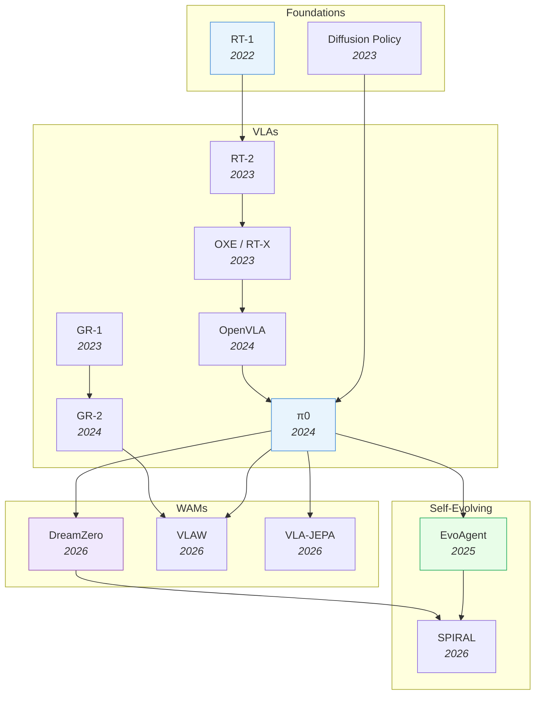

# Robotics & Embodied AI

> [!abstract] Overview
> Embodied AI sits at the convergence of all other topics: foundation models provide the backbone, VLMs provide perception, RL provides learning, and world models provide physics understanding. This note maps the landscape from VLAs through WAMs to self-evolving systems — the full path toward autonomous robots.

## Evolution Graph

The field evolved through four phases: **foundations** (2022-2023) where RT-1 and Diffusion Policy proved Transformers and diffusion work for robot control; **VLAs** (2023-2024) where RT-2, OXE, OpenVLA, and pi0 scaled vision-language-action models from proof-of-concept to generalist policies; **WAMs** (2026) where DreamZero, VLAW, and VLA-JEPA added world modeling for physics-aware control; and **self-evolving** (2025-2026) where EvoAgent and SPIRAL enabled autonomous improvement loops.

| Year | Paper | Contribution |
|------|-------|-------------|
| 2022 | [[2212.06817\|RT-1]] | Transformer policy on 130K real demos; proved Transformers work for robot control at scale |
| 2023 | [[2303.04137\|Diffusion Policy]] | Pioneered action diffusion for robotics; proved denoising beats regression for multimodal action distributions |
| 2023 | [[2307.15818\|RT-2]] | Scaled to PaLI-X/PaLM-E backbones; first to show internet-scale VLM knowledge transfers to robot control |
| 2023 | [[2310.08864\|OXE / RT-X]] | Open X-Embodiment: 1M+ trajectories from 22 embodiments; the ImageNet moment for robotics data |
| 2023 | [[2312.13139\|GR-1]] | GPT-style generative robot model unifying language, video prediction, and action in a single Transformer |
| 2024 | [[2406.09246\|OpenVLA]] | Open-source 7B VLA; democratized VLA research with competitive performance |
| 2024 | [[2410.24164\|pi0]] | Flow matching action expert + VLM for dexterous manipulation; current SOTA generalist robot control |
| 2024 | [[2410.06158\|GR-2]] | Scaled GR-1 to larger video generation backbone; improved long-horizon multi-task humanoid control |
| 2025 | [[2502.05907\|EvoAgent]] | Self-evolving agent with continual world model; +105% improvement via self-planning and self-reflection |
| 2026 | [[2602.15922\|DreamZero]] | 14B parameter WAM from NVIDIA; zero-shot robot policies via joint video+action prediction |
| 2026 | [[2604.15483\|π0.7]] | 5B steerable generalist VLA with subgoal-image + episode-metadata prompting; cross-embodiment transfer matching human experts |
| 2026 | [[2602.12063\|VLAW]] | Iterative co-improvement loop between VLA policy and world model; each bootstraps the other |
| 2026 | [[2602.10098\|VLA-JEPA]] | JEPA-style latent prediction for leakage-free future state modeling in robot control |
| 2026 | [[2603.08403\|SPIRAL]] | Closed-loop self-improving framework for controllable, long-horizon video generation and WAMs |

---

## 1. Robotic Policy Foundations & Manipulation

How robots learn to act from demonstrations. The field evolved from perception-based agents (PerAct) through diffusion-based action generation to spatial and language-conditioned policies. Manipulation is the proving ground — if a method works for dexterous object interaction, it can generalize to broader embodied tasks.

**Diffusion-Based Policies** — Treat robot actions as a noise-removal process, generating smooth multi-step trajectories that handle multimodal action distributions (e.g., reaching from the left vs. right) better than regression.
- [[2604.15938|VADF]], [[2604.07084|FMP]], [[2604.06067|HiPolicy]], [[2604.03181|MV-VDP]], [[2604.00202|DreamControl-v2]], [[2603.26320|DFM-VLA]], [[2603.25406|MMaDA-VLA]], [[2603.16368|SCDP]], [[2512.22688|ARFM]], [[2507.21053|FPO]], [[2503.02881|Reactive Diffusion Policy]], [[2502.02316|DIME]], [[2407.05996|MDT]], [[2403.03954|DP3]], [[2303.04137|Diffusion Policy]], [[2302.01877|AdaptDiffuser]], [[2205.09991|Diffuser]]

> [!star] Key Papers
> - [[2303.04137|Diffusion Policy]] — Pioneered action diffusion for robotics; proved denoising beats regression for multimodal distributions
> - [[2403.03954|DP3]] — Extended to 3D point clouds, enabling sim-to-real transfer without camera calibration

**Foundational Manipulation Architectures** — Transformer and perception-based agents that established how robots can learn multi-task manipulation from language instructions and visual observations.
- [[2604.15215|HiST-AT]], [[2604.08418|DMBN-PTE]], [[2604.02408|F2F-AP]], [[2603.22264|UniDex]], [[2603.22003|VP-VLA]], [[2603.10052|OmniGuide]], [[2603.07648|AtomicVLA]], [[2603.03243|HoMMI]], [[2412.11974|EMMA-X]], [[2410.07864|RDT-1B]], [[2405.12213|Octo]], [[2306.10007|RPT]], [[2209.05451|PerAct]]

> [!star] Key Papers
> - [[2209.05451|PerAct]] — First to use Perceiver Transformer on voxelized observations for 6-DoF multi-task manipulation
> - [[2405.12213|Octo]] — Open-source generalist policy with strong zero-shot transfer across robot morphologies

**Bimanual & Teleoperation** — Hardware platforms and methods for dual-arm manipulation and human-guided data collection, which are critical for scaling real-world demonstrations.
- [[2507.07969|Q-chunking]], [[2309.13037|GELLO]], [[2304.13705|ALOHA]]

> [!star] Key Papers
> - [[2304.13705|ALOHA]] — Low-cost open-source bimanual system; proved co-training on diverse data dramatically improves performance

**Spatial Reasoning for Manipulation** — Leverage 3D point clouds, depth maps, or learned spatial features to improve generalization across camera viewpoints and object arrangements.
- [[2604.15281|R3D]], [[2604.14089|UMI-3D]], [[2604.08534|ActiveGlasses]], [[2604.06778|RichMap]], [[2604.02696|VBGS-SLAM]], [[2603.27967|XVR]], [[2603.13825|Explicit World Model Zero-Shot Manipulation]], [[2603.00905|pySpatial]], [[2602.20901|SpatiaLQA]], [[2602.19063|Direction-aware 3D LMM]], [[2602.18374|ZS-IP]], [[2601.05172|CoV]], [[2512.13660|RoboTracer]], [[2511.05491|VST]], [[2510.12276|Spatial Forcing]], [[2509.18644|State-Free Visuomotor Policy]], [[2503.11089|EmbodiedVSR]], [[2501.10074|SpatialCoT]], [[2406.01584|SpatialRGPT]], [[2401.12168|SpatialVLM]]

> [!star] Key Papers
> - [[2501.10074|SpatialCoT]] — Chain-of-thought reasoning in 3D space; bridges VLM reasoning with spatial manipulation

**Language-Conditioned & Multi-Stage** — Plan and execute complex, multi-step tasks from natural language instructions by composing LLM planning with robot execution.
- [[2604.02812|Neuro-Symbolic Robot Policies]], [[2604.02021|Discrete-Continuous Planning Bridge]], [[2603.30022|Hybrid LLM-RL Manipulation]], [[2603.02511|Unveiler]], [[2602.21198|Reflective Test-Time Planning]], [[2507.17520|InstructVLA]], [[2409.01652|ReKep]], [[2405.19783|IVM]], [[2307.05973|VoxPoser]], [[2204.00598|Socratic Models]], [[2201.07207|LLM Zero-Shot Planners]]

> [!star] Key Papers
> - [[2307.05973|VoxPoser]] — LLMs generate 3D value maps that guide robot actions; no robot training data needed
> - [[2409.01652|ReKep]] — Automatic keypoint discovery from VLMs for constraint-based manipulation planning

**World Model Studies** — Empirical studies of predictive models in manipulation contexts.
- [[2603.29090|HCLSM]], [[2603.28955|WAM]], [[2603.18336|ManiDreams]], [[2512.24497|JEPA-WM]], [[2512.13644|DexWM]], [[2512.01119|World Model Surprise Robustness]], [[2510.10125|CTRL-WORLD]], [[2503.09867|OH-A-DINO]], [[2501.10100|RWM]], [[2411.04983|DINO-WM]]

> [!star] Key Papers
> - [[2411.04983|DINO-WM]] — World models built on pre-trained DINO features enable zero-shot planning; foundational for latent WM in manipulation
> - [[2512.24497|JEPA-WM]] — LeCun lab study identifying what drives success in JEPA-based physical planning; key design insights

> [!tip] The Diffusion Policy Shift
> Regression → diffusion → flow matching. If you're building a manipulation policy today, start with Diffusion Policy or DP3 and add 3D/spatial features for viewpoint invariance.

---

## 2. Vision-Language-Action Models (VLAs)

VLAs are the current mainstream approach to robot control: take a pre-trained vision-language model, fine-tune it to output robot actions directly. The field has exploded from RT-1/RT-2 (2022-2023) to 80+ models spanning efficient deployment, spatial awareness, reasoning, world-model augmentation, and self-evolution.

> [!success] Ideal VLA Recipe (from RoboVLMs)
> ==KosMos/[[2407.07726|PaliGemma]] backbone== + ==Policy Head fusion== + ==Continuous actions== + ==MoE== + ==Post-training on in-domain data==

**Foundation & Generalist** — The pioneering VLA architectures that established the paradigm: fine-tune a VLM to output robot actions as tokens or flow-matching trajectories.
- [[2604.15483|π0.7]], [[2512.22414|π0.5 + ego]], [[2505.03500|TLI]], [[2503.20020|Gemini Robotics]], [[2502.13130|Magma]], [[2410.24164|π0]], [[2410.06158|GR-2]], [[2406.09246|OpenVLA]], [[2405.12213|Octo]], [[2312.13139|GR-1]], [[2311.01378|RoboFlamingo]], [[2310.08864|OXE / RT-X]], [[2307.15818|RT-2]], [[2212.06817|RT-1]]

> [!star] Key Papers
> - [[2604.15483|π0.7]] — 5B-param steerable generalist VLA from Physical Intelligence with episode-metadata + subgoal-image prompting; cross-embodiment transfer matching human experts
> - [[2212.06817|RT-1]] — Google's first VLA: 130K demonstrations, 700 tasks, Transformer-based; proved the paradigm works
> - [[2307.15818|RT-2]] — Scaled to PaLI-X/PaLM-E backbones; first to show internet-scale VLM knowledge transfers to robot control
> - [[2406.09246|OpenVLA]] — Open-source 7B VLA; democratized VLA research
> - [[2410.24164|π0]] — Flow matching for continuous actions; current SOTA for generalist robot control

**Efficient & Open-Source** — Smaller, faster, or quantized VLAs optimized for real-world deployment where inference speed and cost matter.
- [[2604.11757|StarVLA-alpha]], [[2604.05672|A1]], [[2604.05656|SnapFlow]], [[2604.05323|VLA-InfoEntropy]], [[2604.04161|AAC]], [[2604.02965|SV-VLA]], [[2603.28740|FocusVLA]], [[2603.28565|StreamingVLA]], [[2602.18224|SimVLA]], [[2602.13710|HBVLA]], [[2601.22153|DynamicVLA]], [[2512.04952|FASTer]], [[2511.14148|AsyncVLA]], [[2509.04996|FLOWER]], [[2506.19816|CronusVLA]], [[2506.01844|SmolVLA]], [[2505.23705|Knowledge Insulation VLA]], [[2504.19854|NORA]], [[2503.02310|PD-VLA]], [[2502.19645|OpenVLA-OFT]], [[2501.09747|FAST]], [[2409.12514|TinyVLA]]

> [!star] Key Papers
> - [[2501.09747|FAST]] — Compression-based action tokenization; makes VLAs 5x faster by compactly encoding continuous actions
> - [[2506.01844|SmolVLA]] — 450M params achieving competitive performance; proves VLAs don't need to be massive

**Spatial & 3D-Aware** — Inject depth, 3D coordinate embeddings, or volumetric features into VLAs for better spatial generalization.
- [[2604.02759|OMNI-PoseX]], [[2603.25399|LaMP]], [[2603.24393|3D-MIX]], [[2506.22242|4D-VLA]], [[2505.05800|3D-CAVLA]], [[2501.15830|SpatialVLA]], [[2403.09631|3D-VLA]]

> [!star] Key Papers
> - [[2501.15830|SpatialVLA]] — Novel spatial representations that let VLAs understand object arrangements without explicit 3D supervision

**Reasoning & Chain-of-Thought** — VLAs that think before they act: predict subgoals, search over plans, or use MCTS for test-time reasoning.
- [[2604.18486|OneVL]], [[2604.17880|ST-π]], [[2604.14125|HiVLA]], [[2602.01166|LaRA-VLA]], [[2601.11404|ACoT-VLA]], [[2601.07060|PALM]], [[2601.00969|V-VLAPS]], [[2512.24125|GenieReasoner]], [[2509.25681|dVLA]], [[2509.22643|VLA-Reasoner]], [[2508.12211|VLAPS]], [[2507.16815|ThinkAct]], [[2503.22020|CoT-VLA]], [[2411.19650|CogACT]], [[2405.17418|SC-VLA]]

> [!star] Key Papers
> - [[2604.18486|OneVL]] — First latent CoT to beat explicit autoregressive CoT on driving benchmarks (88.84 PDM-score on NAVSIM) while keeping answer-only inference latency
> - [[2503.22020|CoT-VLA]] — Predicts visual subgoals as chain-of-thought before acting; bridges language reasoning with physical planning
> - [[2509.22643|VLA-Reasoner]] — Online MCTS for test-time reasoning; trades compute for better decisions

**World-Model-Augmented** — VLAs that also predict future states, combining action generation with physics simulation for more robust policies.
- [[2604.17876|OFlow]], [[2604.14732|WVA]], [[2604.12908|VGA]], [[2604.07209|INSPATIO-WORLD]], [[2604.06168|Action Images]], [[2604.04913|DeltaWorld]], [[2604.02097|LatentUM]], [[2604.01765|DriveDreamer-Policy]], [[2603.29844|DIAL]], [[2603.19370|VAMPO]], [[2603.19201|OmniVTA]], [[2603.16195|S-VAM]], [[2603.10448|DiT4DiT]], [[2603.09030|PlayWorld]], [[2603.03195|CoWVLA]], [[2603.00110|MCSWIM]], [[2602.22010|WoG]], [[2602.21633|SC-VLA]], [[2602.20057|AdaWorldPolicy]], [[2602.13977|WoVR]], [[2602.12099|GigaBrain-0.5M*]], [[2602.12063|VLAW]], [[2602.11832|JEPA-VLA]], [[2602.11075|RISE]], [[2602.10717|SDA]], [[2602.10098|VLA-JEPA]], [[2602.06508|World-VLA-Loop]], [[2601.21998|LingBot-VA]], [[2601.16163|Cosmos Policy]], [[2512.13030|Motus]], [[2512.05955|SIMPACT]], [[2511.19221|Percept-WAM]], [[2511.17502|RynnVLA-002]], [[2511.14659|NORA-1.5]], [[2511.09515|WMPO]], [[2511.07732|ViPRA]], [[2509.06951|F1]], [[2508.18269|FlowVLA]], [[2507.04447|DreamVLA]], [[2506.21539|WorldVLA]], [[2505.15659|FLARE]], [[2501.18867|UP-VLA]]

> [!star] Key Papers
> - [[2602.12063|VLAW]] — Iterative co-improvement loop between VLA policy and world model; each bootstraps the other
> - [[2602.10098|VLA-JEPA]] — JEPA-style latent prediction for leakage-free future state modeling in robot control
> - [[2601.16163|Cosmos Policy]] — Fine-tunes NVIDIA's Cosmos video diffusion model; 98.5% on LIBERO

**RL-Enhanced** — VLAs improved via reinforcement learning post-training, pushing performance beyond what imitation alone achieves.
- [[2604.17706|OmniVLA-RL]], [[2604.10165|MoRI]], [[2604.08168|ViVa]], [[2604.05614|GPLA]], [[2603.27670|ProgressVLA]], [[2603.26666|VLA-OPD]], [[2602.01789|RFS]], [[2511.15605|SRPO]], [[2511.14759|RECAP]], [[2510.26406|Hi-ORS]], [[2510.25889|piRL]], [[2510.00406|VLA-RFT]], [[2509.19301|ResFiT]], [[2509.15937|VLAC]], [[2509.09674|SimpleVLA-RL]], [[2506.08440|TGRPO]], [[2505.22094|ReinFlow]], [[2505.18719|VLA-RL]], [[2505.17016|RIPT-VLA]], [[2502.05450|ConRFT]], [[2501.16664|iRe-VLA]], [[2411.19309|GRAPE]]

> [!star] Key Papers
> - [[2604.17706|OmniVLA-RL]] — Introduces Flow-GSPO (SDE reformulation of flow matching); 97.6% on LIBERO with faster, more stable RL than PPO/GRPO
> - [[2505.18719|VLA-RL]] — First systematic RL framework for VLAs; showed RL post-training consistently improves over SFT
> - [[2505.17016|RIPT-VLA]] — Adds a "third stage" of RL training that bridges the gap between simulation and real-world

**Self-Evolving & Continual** — VLAs that can adapt, merge, or evolve autonomously from ongoing experience without catastrophic forgetting.
- [[2602.10503|Long-Lived Robots]], [[2602.03445|CRL-VLA]], [[2602.01811|VLA-SCT]], [[2601.02295|CycleVLA]], [[2512.14666|EVOLVE-VLA]], [[2511.18810|MergeVLA]], [[2511.16166|EvoVLA]], [[2511.02239|LACY]], [[2511.00091|PLD]], [[2510.12710|Reflective Self-Adaptation]], [[2509.24948|RehearseVLA]]

> [!star] Key Papers
> - [[2512.14666|EVOLVE-VLA]] — Continuous adaptation from environmental feedback; addresses the deploy-and-forget problem

**Humanoid & Platform-Specific** — VLAs designed for humanoid robots, loco-manipulation, or domain-specific applications.
- [[2604.17807|Re2MoGen]], [[2604.07993|HEX]], [[2604.07457|CMP]], [[2604.07430|HY-Embodied-0.5]], [[2604.02707|Humanoid Surgical Instrument Exchange]], [[2604.01158|SMASH]], [[2603.25038|AirVLA]], [[2603.15789|OmniReset]], [[2603.12263|Psi0]], [[2603.03279|ULTRA]], [[2602.10106|EgoHumanoid]], [[2511.20351|HVS]], [[2511.16518|MiMo-Embodied]], [[2506.12851|KungfuBot]], [[2503.14734|GR00T N1]], [[2503.09527|CombatVLA]], [[2502.14795|Humanoid-VLA]]

> [!star] Key Papers
> - [[2503.14734|GR00T N1]] — NVIDIA's open foundation model for humanoid whole-body control
> - [[2603.12263|Psi0]] — Decoupled locomotion + manipulation for humanoids; practical loco-manipulation

**Multi-Sensor & Force-Aware** — VLAs that go beyond vision by integrating tactile, force, or proprioceptive feedback for contact-rich tasks.
- [[2603.15169|ForceVLA2]], [[2511.18960|AVA-VLA]], [[2509.18830|DexSkin]], [[2508.10333|ReconVLA]], [[2507.09160|Tactile-VLA]], [[2505.22159|ForceVLA]], [[2505.06451|Adaptive Wiping]], [[2502.14420|ChatVLA]]

> [!star] Key Papers
> - [[2507.09160|Tactile-VLA]] — First to integrate 6-axis force feedback into VLAs; critical for assembly and insertion tasks

**Architecture Studies** — Systematic explorations of VLA design choices, scaling laws, and novel architectures.
- [[2604.17896|Physical-Feasibility VLA]], [[2604.17887|StableIDM]], [[2604.03191|Compression Gap]], [[2604.02523|Tune to Learn]], [[2604.01570|FAN Prior]], [[2603.28301|LIBERO-Para]], [[2603.22078|WAM vs VLA Robustness]], [[2603.16861|MolmoBot]], [[2603.12942|ReMem-VLA]], [[2603.12772|PVI]], [[2603.03596|MEM]], [[2602.20687|NativeEmbodied]], [[2602.17659|CAG]], [[2602.11236|ABot-M0]], [[2601.18692|LingBot-VLA]], [[2601.02456|InternVLA-A1]], [[2512.02834|TACO]], [[2511.18085|Stellar VLA]], [[2511.05275|TwinVLA]], [[2510.22201|ACG]], [[2510.19430|GigaBrain-0]], [[2510.13054|VLA-0]], [[2510.10274|X-VLA]], [[2510.09459|FIPER]], [[2510.05681|MG-Select]], [[2509.14889|CollabVLA]], [[2509.09372|2509.09372]], [[2509.04018|FPC-VLA]], [[2508.19236|MemoryVLA]], [[2506.19850|UniVLA]], [[2506.09937|SAFE]], [[2506.00123|VeBrain]], [[2412.14058|RoboVLMs]], [[2412.10345|TraceVLA]], [[2409.03299|RT-1-X SCARA Transfer]]

> [!star] Key Papers
> - [[2412.14058|RoboVLMs]] — 600+ experiments systematically testing VLA design choices; the definitive recipe paper

> [!tip] The VLA Stack
> Pick a VLM backbone (PaliGemma) → add action head (flow matching) → fine-tune on in-domain data → post-train with RL. This is the proven recipe from RoboVLMs.

**Failure Detection & Recovery** — VLAs and VLMs trained to detect, diagnose, and recover from robotic manipulation failures.
- [[2603.18091|ADV]], [[2603.13528|Counterfactual Failure Synthesis]], [[2603.11106|RC-NF]], [[2603.06987|Foundational WM]], [[2602.16182|WM Failure Classifier]], [[2602.01515|RAPT]], [[2512.02787|ViFailback]], [[2512.03913|VINE]], [[2512.01946|FailCoT]], [[2510.02298|ARMADA]], [[2510.01642|FailSafe]], [[2509.16072|I-FailSense]], [[2509.04018|FPC-VLA]], [[2507.17383|VLA Confidence Calibration]], [[2505.12224|RoboFAC]], [[2505.08548|FSD]], [[2505.05811|M-SVDD]], [[2504.11170|Sparse MAF-AAE]], [[2503.08558|FAIL-Detect]], [[2410.14868|Diff-DAgger]], [[2410.04640|Sentinel]], [[2410.00371|AHA]], [[2409.03966|VLM Failure Recovery]], [[2407.08735|AESOP]], [[2406.11548|AIC MLLM]], [[2404.00756|Recover]], [[2310.17552|Sirius-Runtime]], [[2306.15724|REFLECT]]

> [!star] Key Papers
> - [[2510.01642|FailSafe]] — Automatic pipeline generating failure-action data; boosts VLA success by up to 22.6%
> - [[2505.12224|RoboFAC]] — Lightweight failure critic outperforming GPT-4o; improves real-world success by 29.1%
> - [[2410.00371|AHA]] — NVIDIA's failure reasoning VLM; generalizes from sim to real with procedurally generated failure data

---

## 3. World Action Models (WAMs)

WAMs go beyond VLAs by jointly predicting future states and actions — they learn the physics of the world, not just how to imitate demonstrations. The key architectural question is *where* to predict: in pixel space (video generation), latent space (JEPA-style), or action space only (efficient WAMs).

**Dreamer Lineage** — The original model-based RL approach: learn world dynamics in compressed latent space via recurrent state-space models, then plan entirely in "imagination."
- [[2509.24527|Dreamer 4]], [[2503.21047|CBET-DreamerV3]], [[2502.05907|EvoAgent]], [[2401.16650|WMAR]], [[2301.04104|DreamerV3]], [[2211.15944|Continual-Dreamer]], [[2206.14176|DayDreamer]], [[2206.02072|VSRL]], [[2007.07853|γ-Progress]], [[2005.05960|Plan2Explore]], [[1912.01603|Dreamer]], [[1911.10601|Scaling Active Inference]], [[1803.10122|World Models]]

> [!star] Key Papers
> - [[2206.14176|DayDreamer]] — First to deploy Dreamer on real robots; proved sample-efficient learning from imagination works physically

**Video Generation as World Models** — Use pre-trained video diffusion models as physics simulators: generate future video frames conditioned on actions, then extract policies from the generated futures.
- [[2604.14268|HY-World 2.0]], [[2604.13036|Lyra 2.0]], [[2604.11351|WM-DAgger]], [[2603.25716|HyDRA]], [[2603.25685|Persistent Robot World Models]], [[2603.23376|ABot-PhysWorld]], [[2603.12639|RoboStereo]], [[2603.07799|MWM]], [[2602.15922|DreamZero]], [[2601.20540|LingBot-World]], [[2601.15533|Actionable Simulators]], [[2512.24766|Dream2Flow]], [[2512.15692|mimic-video]], [[2512.06628|MIND-V]], [[2510.26583|Emu3.5]], [[2510.01183|EvoWorld]], [[2508.00795|Video Policy]], [[2505.13934|RLVR-World]], [[2505.12705|DreamGen]], [[2504.15369|Inverse Probabilistic Adaptation]], [[2502.00622|GPC]], [[2412.14957|DREMA]], [[2412.14803|VPP]], [[2310.10625|VLP]], [[2310.06114|UniSim]], [[2302.00111|UniPi]]

> [!star] Key Papers
> - [[2602.15922|DreamZero]] — 14B parameter WAM from NVIDIA; zero-shot robot policies via joint video+action prediction; 39.5% on unseen tasks
> - [[2310.06114|UniSim]] — Universal simulator from video diffusion; learns interaction dynamics from heterogeneous data
> - [[2412.14803|VPP]] — Extracts visual representations from video diffusion in a single forward pass (no iterative denoising at test time)

**Efficient / Action-Centered** — WAMs optimized for speed: focus compute on action prediction rather than full video generation. Key insight: you need video modeling at *training time* for learning physics, but not at *test time* for acting.
- [[2604.01985|WAV]], [[2603.17240|GigaWorld-Policy]], [[2603.16666|Fast-WAM]], [[2512.19133|WorldRFT]], [[2504.16680|RWM-U]], [[2503.16806|DyWA]], [[2412.15109|Seer]], [[2410.00564|JOWA]]

> [!star] Key Papers
> - [[2603.16666|Fast-WAM]] — Proved training-time video modeling is what matters, not test-time imagination; 97.6% on LIBERO
> - [[2603.17240|GigaWorld-Policy]] — 9x speedup over DreamZero via action-centered design with training-only video supervision

**Latent Prediction** — Predict future states in a learned latent space (JEPA-style) rather than reconstructing pixels. Faster, more robust to visual noise, and better suited for real-time control.
- [[2604.03208|HWM]], [[2603.22281|ThinkJEPA]], [[2603.19312|LeWM]], [[2603.14482|V-JEPA 2.1]], [[2603.05815|HiLAM]], [[2602.06130|SWIRL]], [[2602.02381|AdaSSL]], [[2601.05230|Latent Action World Models]], [[2512.09929|OWM]], [[2511.08544|LeJEPA]], [[2510.26433|CoLA-World]], [[2510.15047|SPA]], [[2507.19468|DINO-world]], [[2507.13340|LPS]], [[2506.23468|NavMorph]], [[2506.09985|V-JEPA 2]], [[2505.13696|ESWM]], [[2505.11528|LaDi-WM]], [[2505.03176|seq-JEPA]], [[2504.16591|JEPA for RL]], [[2504.02792|UWM]], [[2503.18938|AdaWorld]], [[2503.00200|UVA]], [[2502.14819|PLDM]], [[2403.08321|ManiGaussian]], [[2301.08243|I-JEPA]]

> [!star] Key Papers
> - [[2504.02792|UWM]] — Unified World Models: a single architecture handling action-conditioned, action-free, and video prediction tasks
> - [[2506.23468|NavMorph]] — Self-evolving world model for navigation; Contextual Evolution Memory updates latent representations online

**VLM-Integrated** — Combine the semantic reasoning of VLMs with the physics simulation of world models for high-level planning + low-level control.
- [[2604.02190|UniDriveVLA]], [[2603.28963|AutoWorld]], [[2603.28116|AutoDrive-P3]], [[2603.27287|Uni-World VLA]], [[2603.14497|WorldVLM]], [[2602.15549|VLM-DEWM]], [[2602.08236|AVIC]], [[2602.01960|GVP-WM]], [[2602.00475|GRASP]], [[2601.14514|JIT]], [[2512.15885|JARVIS]], [[2512.07733|SpatialDreamer]], [[2511.02824|Kosmos AI Scientist]], [[2510.00855|DyVA]], [[2509.02722|VLWM]], [[2507.23773|SimuRA]], [[2507.12508|MindJourney]], [[2505.05626|PERCEPTLLM]], [[2503.00761|TRACE]], [[2403.06845|DriveDreamer-2]]

> [!star] Key Papers
> - [[2602.08236|AVIC]] — Adaptive: decides when and how much to imagine based on task difficulty; 17x fewer world-model calls

**Self-Evolving WAMs** — WAMs designed to continuously improve through experience-driven loops, curiosity, and reflective planning.
- [[2604.07392|ERA]], [[2603.15381|Autonomous Learning Framework]], [[2602.04411|Self-evolving Embodied AI]], [[2509.15155|Self-Improving EFM]], [[2507.09177|Online Agent (OA)]], [[2504.21024|WebEvolver]]

> [!star] Key Papers
> - [[2602.04411|Self-evolving Embodied AI]] — Defines the paradigm: agents that autonomously acquire, refine, and transfer skills across environments

**Surveys** — Comprehensive reviews of world model architectures, taxonomies, and design principles.
- [[2604.04707|OpenWorldLib]], [[2603.25887|WR-Arena]], [[2602.01630|Unified World Model Framework]], [[2511.08585|Visual World Roadmap]], [[2510.16732|World Models for Embodied AI Survey]], [[2509.20021|Embodied AI LLM-WM Survey]], [[2506.22355|Embodied AI World Modeling]], [[2506.01622|General Agents World Models]], [[2411.14499|World Models Survey 2024]], [[2407.06886|ARIO]], [[2310.06253|Objective Mismatch MBRL Survey]]

- [[2510.24795|Efficient VLA Survey]] — First dedicated survey on efficient VLAs
- [[2509.19012|Pure VLA Survey]] — Taxonomy of VLA action-generation paradigms
- [[2508.13073|VLA Survey 2025]] — First taxonomy-oriented VLA review
> [!star] Key Papers
> - [[2411.14499|World Models Survey 2024]] — Most comprehensive world model survey; distinguishes "understanding" vs "predicting" paradigms
> - [[2602.01630|Unified World Model Framework]] — Argues world model research must go beyond task-specific injection; proposes a unified framework

> [!tip] Video vs Latent
> DreamZero proves video generation works at scale, but Fast-WAM shows you only need video at *training time*. For deployment, latent prediction (UWM, VLA-JEPA) is faster and more practical.

---

## 4. Self-Evolving Embodied AI

The frontier of embodied AI: robots that improve themselves through experience without human intervention. These systems combine world models (for imagination), continual learning (for memory), curiosity (for exploration drive), and evolutionary algorithms (for policy improvement). See [[11_Self-Evolving-AI]].

- [[2502.05907|EvoAgent]] (2025) — ==self-evolving agent== with continual world model for long-horizon tasks; **+105%** improvement
- [[2506.21669|SEEA-R1]] (2025) — ==tree-structured RL== for self-evolving embodied agents; **+24%** via MCTS + generative reward
- [[2503.01584|SENSEI]] (2025) — ==semantic exploration== with epistemic uncertainty + Go-Explore for versatile world models
- [[2510.16079|EVOLVER]] (2025) — LLM agents self-evolving through experience-driven lifecycle
- [[2603.08403|SPIRAL]] (2026) — ==closed-loop framework== for self-improving action world models via reflective planning
- [[2510.12693|ERA]] (2025) — VLMs transformed into embodied agents via embodied prior learning + online RL

- [[2508.04700|SEAgent]] (2025) — ==self-evolving curriculum== with World State Model for computer use agents
- [[2310.08367|MCU]] (2023) — Evaluation framework for open-ended game agents with AutoEval VLM judging

> [!star] Key Papers
> - [[2502.05907|EvoAgent]] — Built on DreamerV3 with continual world model; demonstrated self-planning + self-control + self-reflection loop
> - [[2603.08403|SPIRAL]] — Closed-loop self-improvement for WAMs via reflective planning; the system critiques its own failures and adapts

> [!tip] The Self-Evolving WAM Path
> The ideal trajectory: train a WAM → add continual learning → add curiosity-driven exploration → self-evolving robot.

---

## 5. Navigation & Autonomous Driving

Both navigation and driving reduce to the same core problem: perceive the environment, predict its future state, and plan a trajectory. Navigation operates at room/building scale with discrete goals; driving operates at city scale with continuous safety constraints.

**Indoor Object-Goal Navigation** — Find and navigate to target objects in unseen environments using visual reasoning, cognitive maps, or LLM-based planning.
- [[2604.02829|STRNet]], [[2603.29165|LatentPilot]], [[2603.07799|MWM]], [[2603.02772|ASER]], [[2601.13132|GaussExplorer]], [[2510.20685|C-Nav]], [[2506.17629|CLiViS]], [[2412.10439|CogNav]], [[2401.05946|TDB]]

> [!star] Key Papers
> - [[2412.10439|CogNav]] — Models human-like cognitive processes for navigation; outperforms reactive policies on complex layouts

**Vision-Language Navigation** — Follow natural language instructions through visual environments, requiring grounding of spatial language to visual observations.
- [[2604.07957|WorldMAP]], [[2507.13152|SE-VLN]], [[2506.15757|WPCL]]

> [!star] Key Papers
> - [[2506.15757|WPCL]] — Weakly-supervised VLM-guided contrastive learning for VLN; reduces annotation cost while improving grounding

**Autonomous Driving (World Model Perspective)** — Driving as a world model problem: predict the scene's future, then plan safe trajectories.
- [[2604.18486|OneVL]], [[2604.17651|I-WM]], [[2604.12942|RMGS-SLAM]], [[2604.11734|Multi-ORFT]], [[2604.10856|BridgeSim]], [[2604.03023|Behavior-Constrained RL]], [[2604.01765|DriveDreamer-Policy]], [[2603.28887|OccSim]], [[2603.24581|Latent-WAM]], [[2603.15771|CorrectionPlanner]], [[2603.14497|WorldVLM]], [[2602.18739|PhysAtt]], [[2512.24426|CF-VLA]], [[2512.24331|LVLDrive]], [[2509.01944|AutoDrive-R2]], [[2505.17685|FSDrive]], [[2409.18964|PhysGen]], [[2403.06845|DriveDreamer-2]]

> [!tip] Infrastructure vs Ego-Centric
> Most driving WMs are ego-centric (the car's view). I-WM flips the frame: fixed roadside sensors give "temporal depth" over a location, complementing ego-vehicle "spatial breadth". Expect infrastructure + V2X world models to be a growing thread alongside ego-centric DriveDreamer-style generators.

> [!star] Key Papers
> - [[2403.06845|DriveDreamer-2]] — LLM-enhanced driving video generation; creates diverse scenarios for world model training
> - [[2603.14497|WorldVLM]] — Hybrid VLM + world model architecture; combines semantic reasoning with physics prediction for driving

**Surveys & Roadmaps** — Reviews of embodied navigation and spatial intelligence.
- [[2512.24385|Spatial Intelligence Roadmap]], [[2311.00530|LLM Embodied Navigation Survey]]

> [!star] Key Papers
> - [[2512.24385|Spatial Intelligence Roadmap]] — Comprehensive roadmap for multi-modal spatial pre-training in autonomous systems; defines the field's trajectory
> - [[2311.00530|LLM Embodied Navigation Survey]] — First survey connecting LLM advances to embodied navigation; maps the integration landscape

> [!tip] Navigation → Driving
> Both reduce to "predict the future scene, then plan a trajectory." The difference is scale and safety constraints. World model approaches transfer between them.

---

## 6. Imitation Learning & RL for Robotics

The training paradigm question: pure imitation learning (behavior cloning) is simple but plateaus at the demonstration distribution ceiling. Adding RL post-training pushes policies beyond what demonstrations alone can teach — handling novel situations, recovering from errors, and optimizing long-horizon objectives.

**RL-Augmented Imitation** — Combine imitation learning with RL reward signals to overcome the limitations of pure behavior cloning.
- [[2604.10953|DRL-3DBP]], [[2604.10677|LIDEA]], [[2604.08958|WOMBET]], [[2604.06943|Sustainable Transfer RL]], [[2604.04539|FlashSAC]], [[2604.03037|ARM]], [[2604.02260|Time-Varying MBRL]], [[2603.04029|Self-Adapting RL]], [[2510.25992|SRL]], [[2510.22512|TRL]], [[2510.19307|RIL]], [[2509.19292|SOE]], [[2509.04259|RL's Razor]], [[2505.13709|Policy-Driven WM Adaptation]], [[2505.03181|AFSFT]], [[2504.18471|AFM]], [[2503.14858|CRL]], [[2408.05804|Single-Goal Contrastive RL]], [[2010.11944|SPiRL]]

> [!star] Key Papers
> - [[2505.03181|AFSFT]] — Advantage-filtered SFT: uses RL advantage estimates to select which demonstrations to learn from

**Reward Learning** — Learn reward functions from visual feedback or human preferences to guide robot training without hand-crafted reward engineering.
- [[2604.10962|ScoRe-Flow]], [[2603.28730|SOLE-R1]], [[2603.02115|Robometer]], [[2601.16973|VisGym]], [[2512.20675|VLM Reward Objectives]], [[2511.14565|Masked IRL]]

> [!star] Key Papers
> - [[2512.20675|VLM Reward Objectives]] — Simple triplet loss on VLMs produces effective reward signals for robot learning

**Continual & Experience-Driven** — Agents that improve from ongoing real-world interaction without catastrophic forgetting.
- [[2604.15814|Continual Hand-Eye Calibration]], [[2604.11306|Hierarchical Episodic Memory]], [[2604.10892|HECTOR]], [[2604.10096|ABot-Claw]], [[2604.07799|ECM]], [[2603.24350|Emergent Self]], [[2603.03818|VLA Continual Learning]], [[2510.08558|Early Experience]], [[2207.07560|SkiMo]]

> [!star] Key Papers
> - [[2603.03818|VLA Continual Learning]] — Showed pre-trained VLAs have surprising resistance to catastrophic forgetting during continual adaptation

> [!tip] When to Add RL
> Pure imitation plateaus at the demonstration distribution. Add RL post-training (RIPT-VLA, VLA-RL) to improve robustness beyond what demonstrations alone can teach.

---

## 7. Embodied AI — General

Cross-cutting research that doesn't fit neatly into manipulation, VLAs, or navigation — but addresses fundamental challenges like cross-embodiment transfer, scene understanding, and domain adaptation that all embodied AI systems face.

**Generalist Architectures** — Modular frameworks designed to work across different robot types, sensor configurations, and task domains.
- [[2604.15475|NeuroMesh]], [[2604.11373|Minimal Embodiment]], [[2604.10929|Ro-SLM]], [[2604.09330|VAG]], [[2604.01179|Florence-2 ROS 2 Wrapper]], [[2604.00061|R2X Multi-Robot MLLM Survey]], [[2603.22201|NMR]], [[2602.16444|RoboGene]], [[2511.07820|SONIC]], [[2412.07755|SAT]], [[2410.02742|GLIMO]], [[2409.20537|HPT]], [[2402.15116|LMA Survey]]

> [!star] Key Papers
> - [[2409.20537|HPT]] — Heterogeneous Pre-trained Transformers: modular architecture that handles diverse robot embodiments through shared trunk + task-specific heads

**Hardware & Simulation Platforms** — Robotic hardware designs and simulation environments that enable large-scale data collection and policy evaluation.
- [[2604.15805|WorldComposer]], [[2604.11768|GC-PFO]], [[2604.11251|CLAW]], [[2604.08544|SIM1]], [[2604.08258|EvoGymCM]], [[2604.07105|Genie Sim PanoRecon]], [[2604.04664|ROSClaw]], [[2602.21992|PanoEnv]], [[2506.18088|RoboTwin 2.0]], [[2504.04259|ORCA Hand]], [[2503.22122|REMAC]]

> [!star] Key Papers
> - [[2504.04259|ORCA Hand]] — Open-source anthropomorphic hand; bridges the gap between simulation and real dexterous manipulation

**Spatial & Scene Understanding** — Understanding 3D scenes, layouts, and spatial relationships as a prerequisite for embodied reasoning.
- [[2604.18484|XEmbodied]], [[2604.12837|GGD-SLAM]], [[2604.11992|ReefMapGS]], [[2604.11320|CLASP]], [[2604.11302|3D-ALP]], [[2604.10982|Psi-Map]], [[2604.08509|Visually-grounded Humanoid Agents]], [[2604.01001|EgoSim]], [[2603.19231|MonoArt]], [[2603.18892|MultihopSpatial]], [[2601.16538|OnlineSI]], [[2512.12822|LEMON]], [[2511.16160|Video2Layout]], [[2511.01294|Kinematify]], [[2507.05258|REA]], [[2504.12680|Embodied-R]], [[2410.06468|SPACE]]

> [!star] Key Papers
> - [[2604.18484|XEmbodied]] — VLM with 3D Adapter + Mamba-based Efficient Image-Embodied Adapter; SOTA on 18 embodied benchmarks including 55.28% Ego3DBench and 77.01% DriveLMM-o1

> [!star] Key Papers
> - [[2410.06468|SPACE]] — Benchmark probing whether spatial cognition emerges in frontier models; reveals fundamental gaps in spatial reasoning
> - [[2504.12680|Embodied-R]] — Activates embodied spatial reasoning in foundation models via RL; bridges perception and physical action

**Domain Adaptation** — Transfer policies across visual domains without retraining from scratch.
- [[2604.02911|DreamTIP]], [[2502.16707|ReflectVLM]], [[2412.02818|RoboMD]], [[2407.13771|Training-Free Model Merging MTDA]], [[2604.11138|ViserDex]], [[2604.11386|ComSim]]

> [!tip] Cross-Embodiment Transfer
> The key challenge: policies trained on one robot must work on others. HPT and OXE show that modular architectures + diverse training data are the path.

---

## 8. Datasets, Benchmarks & Simulators

The data and evaluation infrastructure that makes all the above research possible. Datasets provide training signal, benchmarks measure progress, and simulators enable safe, scalable experimentation.

**Large-Scale Cross-Robot Datasets** — Massive datasets spanning multiple robot types and environments.
- [[2503.06669|AgiBot World]], [[2403.12945|DROID]], [[2310.08864|OXE]], [[2307.00595|RH20T]]

> [!star] Key Papers
> - [[2310.08864|OXE]] — Open X-Embodiment: 1M+ trajectories from 22 embodiments; the ImageNet moment for robotics
> - [[2403.12945|DROID]] — In-the-wild data across 16 institutions; proved diverse data beats curated data

**Multi-Modal & Bimanual Datasets** — Datasets with rich sensor modalities (tactile, force) or bimanual manipulation focus.
- [[2604.07607|EgoVerse]], [[2512.24653|RoboMIND 2.0]], [[2511.17441|RoboCOIN]], [[2509.00576|G0]], [[2412.13877|RoboMIND]]

> [!star] Key Papers
> - [[2412.13877|RoboMIND]] — Multi-embodiment benchmark with normative manipulation data; standardizes evaluation across robot types
> - [[2512.24653|RoboMIND 2.0]] — Extended to bimanual mobile manipulation; the most comprehensive multi-modal robotics dataset

**Benchmarks — Simulation** — Standardized simulation environments for reproducible evaluation.
- [[2510.13626|LIBERO-Plus]], [[2408.15511|AeroVerse]], [[2406.02523|RoboCasa]], [[2405.05941|SIMPLER]], [[2306.03310|LIBERO]], [[2112.03227|CALVIN]], [[1909.12271|RLBench]], [[2604.11674|AffordSim]]

> [!star] Key Papers
> - [[2306.03310|LIBERO]] — Lifelong robot learning benchmark; tests continual learning and long-horizon capability
> - [[2405.05941|SIMPLER]] — Bridges sim and real; evaluates whether simulation performance predicts real-world success

**Benchmarks — Diagnostic** — Targeted benchmarks that expose specific failure modes.
- [[2604.11689|LARY]], [[2604.05498|JailWAM]], [[2603.23497|WildWorld]], [[2603.22435|CaP-X]], [[2603.22212|Omni-WorldBench]], [[2603.04639|RoboMME]], [[2602.22579|VLA Metamorphic Testing]], [[2602.08971|WorldArena]], [[2602.06556|LIBERO-X]], [[2602.05986|RISE-Video]], [[2601.15224|PROGRESSLM]], [[2601.11421|GM-100]], [[2601.09430|Video-MSR]], [[2511.04670|Cambrian-S]], [[2510.03827|LIBERO-PRO]], [[2509.18953|Eva-VLA]], [[2509.17057|RoboManipBaselines]], [[2508.13142|EASI]], [[2508.12211|VLAPS]], [[2507.18342|EgoExoBench]], [[2507.10548|EmbRACE-3K]], [[2506.18088|RoboTwin 2.0]], [[2505.19017|WorldEval]], [[2505.15660|AGNOSTOS]], [[2503.23765|STI-Bench]], [[2305.12821|FurnitureBench]], [[2009.12293|robosuite]]

> [!star] Key Papers
> - [[2601.11421|GM-100]] — 100 detail-oriented tasks; current VLAs achieve very low success rates, exposing real capability gaps

**Surveys:**
- [[2604.15395|Foundation Models in Robotics Survey]] — 435 articles across 6-criteria taxonomy; maps 5 evolutionary phases of FMs in robotics
- [[2507.00917|Embodied Intelligence Survey]] — 2018-2025 review on physical simulators and world models; proposes IR-L0 to IR-L4 robot intelligence grading
- [[2505.07634|Neural Brain Framework]] — neuroscience-inspired framework for embodied agents; defines 4 core components for human-like adaptability
- [[2505.05108|Multi-agent Embodied AI Survey]] — first systematic survey of multi-agent embodied AI
- [[2509.20021|Embodied AI LLM-WM Survey]] — joint MLLM-WM architecture roadmap
- [[2508.08189|RL for Large Models Survey]] — RL methods for large models including VLAs
- [[2506.21872|Continual RL Survey]] — lifelong learning in RL for sequential tasks
- [[2505.04769|VLA Survey 2025]] — updated VLA landscape review
- [[2504.15037|MLLM Spatial Reasoning Position Paper]] — spatial reasoning in MLLMs requires new recipes
- [[2504.09848|LLM Spatial Intelligence Survey]] — LLM-powered spatial intelligence across scales
- [[2502.02133|MPC-RL Survey]] — MPC + RL synthesis for robotic control
- [[2501.02765|VLLM Survey]] — visual LLMs for generalized/specialized applications
- [[2409.15310|Visual Prompting MLLM Survey]] — visual prompting methods for MLLMs
- [[2407.06886|ARIO / Embodied AI Survey 2024]] — comprehensive survey with ARIO dataset standard
- [[2405.14093|VLA Survey]] — survey of VLA models for embodied AI
- [[2401.03568|Agent AI Survey]] — surveys Agent AI at the intersection of LLMs/VLMs and multimodal interaction
- [[2301.11972|Social Cues HRI Survey]] — recognizing robot task failures via human social cues
- [[2103.04918|Embodied AI Survey 2021]] — simulators and research tasks

> [!tip] The Dataset Hierarchy
> Start with simulation (RLBench, CALVIN) → scale with in-the-wild data (DROID, OXE) → diagnose with targeted benchmarks (GM-100, LIBERO-Plus).

---

## Cross-References

- [[11_Self-Evolving-AI]] — Broader self-evolving paradigm
- [[04_Reinforcement-Learning]] — RL as the training backbone
- [[06_Video-and-Temporal]] — Video generation as world modeling

---

*Next: [[08_Benchmarks-and-Surveys]] for a cross-cutting view of evaluation resources.*
