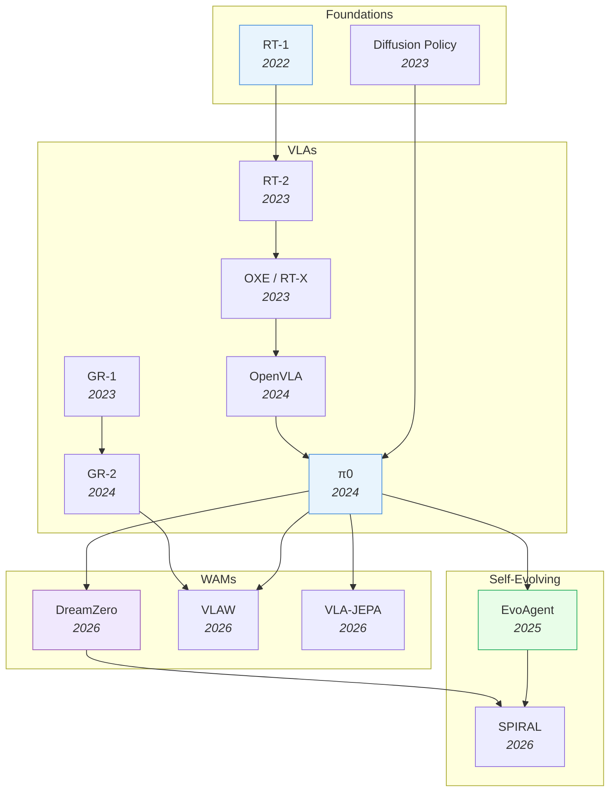

# Robotics & Embodied AI

> [!abstract] Overview
> Embodied AI sits at the convergence of all other topics: foundation models provide the backbone, VLMs provide perception, RL provides learning, and world models provide physics understanding. This note maps the landscape from VLAs through WAMs to self-evolving systems — the full path toward autonomous robots.

## Evolution Graph

The field evolved through four phases: **foundations** (2022-2023) where RT-1 and Diffusion Policy proved Transformers and diffusion work for robot control; **VLAs** (2023-2024) where RT-2, OXE, OpenVLA, and pi0 scaled vision-language-action models from proof-of-concept to generalist policies; **WAMs** (2026) where DreamZero, VLAW, and VLA-JEPA added world modeling for physics-aware control; and **self-evolving** (2025-2026) where EvoAgent and SPIRAL enabled autonomous improvement loops.

| Year | Paper | Contribution |
|------|-------|-------------|
| 2022 | [[2212.06817\|RT-1]] | Transformer policy on 130K real demos; proved Transformers work for robot control at scale |
| 2023 | [[2303.04137\|Diffusion-Policy]] | Pioneered action diffusion for robotics; proved denoising beats regression for multimodal action distributions |
| 2023 | [[2307.15818\|RT-2]] | Scaled to PaLI-X/PaLM-E backbones; first to show internet-scale VLM knowledge transfers to robot control |
| 2023 | [[2310.08864\|OXE]] | Open X-Embodiment: 1M+ trajectories from 22 embodiments; the ImageNet moment for robotics data |
| 2023 | [[2312.13139\|GR-1]] | GPT-style generative robot model unifying language, video prediction, and action in a single Transformer |
| 2024 | [[2406.09246\|OpenVLA]] | Open-source 7B VLA; democratized VLA research with competitive performance |
| 2024 | [[2410.24164\|pi0]] | Flow matching action expert + VLM for dexterous manipulation; current SOTA generalist robot control |
| 2024 | [[2410.06158\|GR-2]] | Scaled GR-1 to larger video generation backbone; improved long-horizon multi-task humanoid control |
| 2025 | [[2502.05907\|EvoAgent]] | Self-evolving agent with continual world model; +105% improvement via self-planning and self-reflection |
| 2026 | [[2602.15922\|DreamZero]] | 14B parameter WAM from NVIDIA; zero-shot robot policies via joint video+action prediction |
| 2026 | [[2604.15483\|π0.7]] | 5B steerable generalist VLA with subgoal-image + episode-metadata prompting; cross-embodiment transfer matching human experts |
| 2026 | [[2602.12063\|VLAW]] | Iterative co-improvement loop between VLA policy and world model; each bootstraps the other |
| 2026 | [[2602.10098\|VLA-JEPA]] | JEPA-style latent prediction for leakage-free future state modeling in robot control |
| 2026 | [[2603.08403\|SPIRAL]] | Closed-loop self-improving framework for controllable, long-horizon video generation and WAMs |

---

## 1. Robotic Policy Foundations & Manipulation

How robots learn to act from demonstrations. The field evolved from perception-based agents (PerAct) through diffusion-based action generation to spatial and language-conditioned policies. Manipulation is the proving ground — if a method works for dexterous object interaction, it can generalize to broader embodied tasks.

**Flow-Matching Policies** — Flow-matching action policies.
- [[2606.23420|LAFM]], [[2606.23090|Flow-as-Flow]], [[2606.21600|VQActFlow]], [[2606.21086|ReFPO]], [[2606.19194|INN-Adapter]], [[2606.17408|LeaP]], [[2606.16917|UMA]], [[2606.16286|FlowMPC]], [[2606.13400|PolyFlow]], [[2606.11087|QGF]], [[2605.15944|FocalPolicy]], [[2605.10051|SSIP]], [[2605.08799|ElasticFlow]], [[2605.04525|HDFlow]], [[2604.07084|FMP]], [[2603.26320|DFM-VLA]], [[2602.13810|Mean-Velocity-Policy]], [[2602.07322|A2A]], [[2602.05051|ReFORM]], [[2512.22688|ARFM]], [[2512.03973|Guided-Flow-Policy]], [[2511.05355|SAD-Flower]], [[2510.01068|GPC-RL]], [[2509.18676|3D-Flow-Diffusion-Policy]], [[2509.08435|PegasusFlow]], [[2507.21053|FPO]], [[2507.13231|VITA-world-model]], [[2506.08822|FreqPolicy]], [[2506.07339|RTC]], [[2505.11123|Condition-Dependent-Flow]]
- [[2505.01179|Fast-Flow-based-Visuomotor-Policies]], [[2412.04987|FlowPolicy]], [[2409.07343|Robotic-Manipulation-Policies-Point]]

**3D / Point-Cloud Diffusion Policies** — 3D-conditioned diffusion policies.
- [[2605.26115|TriSplat]], [[2605.05756|MaMi-HOI]], [[2604.03181|MV-VDP]], [[2410.17488|GenDP]], [[2409.07163|Mamba-Policy]], [[2406.01586|ManiCM]], [[2403.03954|DP3]]

**Efficient / Consistency-Distilled** — Fast/consistency-distilled diffusion policies.
- [[2606.21935|CoRDE]], [[2606.10825|MODIP]], [[2606.03551|Isaac-Sim-Survey]], [[2605.25537|Soft-RTC]], [[2605.23733|Any2Any]], [[2604.18518|UDM-GRPO]], [[2604.15938|VADF]], [[2604.04310|frax]], [[2601.12894|ActionGen]], [[2508.05396|Real-Time]], [[2506.13456|BAC]], [[2503.02881|RDP]], [[2503.00339|Falcon]], [[2502.12724|Responsive-Noise-Relaying-Diffusion-Policy]], [[2502.03822|Rank-Adjustment-in]], [[2412.12953|Efficient-Diffusion-Transformer-Policies]], [[2410.21257|One-Step-Diffusion-Policy]], [[2407.01479|EquiBot]], [[2406.04806|Streaming-Diffusion-Policy]], [[2311.11893|CBP]]

**Equivariant & Structured Diffusion** — Equivariant / structured diffusion policies.
- [[2505.13431|Practical-Guide-Incorporating-Symmetry]], [[2407.01812|Equivariant-Diffusion-Policy]]

**RL-Tuned Diffusion Policies** — RL-finetuned diffusion policies.
- [[2606.19729|VOiLA]], [[2606.06049|L-SDPPO]], [[2605.00623|Hidden-Reward-Diffusion]], [[2604.00202|DreamControl-v2]], [[2603.13707|REFINE-DP]], [[2601.00898|DIPOLE]], [[2506.15799|DSRL]], [[2503.14833|Curiosity-Diffuser]], [[2502.02316|DIME]], [[2409.00588|Diffusion-Policy-Policy-Optimization]], [[2205.09991|Diffuser]]

**General Diffusion Policies** — Other diffusion-based policies.
- [[2606.23625|See2Act]], [[2606.17982|LAGO-Policy]], [[2606.14535|SCDP-Spatial]], [[2606.12965|EmbodiSteer]], [[2606.12365|Ambient-Diffusion-Policy]], [[2606.08414|PACT]], [[2606.03682|GN0]], [[2606.02432|NDPP-Grasp]], [[2605.26006|MIND]], [[2605.25546|ISSf-CBF-WBC]], [[2605.14598|DSSP]], [[2605.09537|CAPS-Power-Sampling]], [[2604.18933|Gated-Memory-Policy]], [[2604.06067|HiPolicy]], [[2603.25406|MMaDA-VLA]], [[2603.16368|SCDP]], [[2603.05687|CGP]], [[2512.21430|EVE]], [[2512.16881|PolaRiS]], [[2512.08280|Model-Based-Diffusion-Sampling]], [[2512.07212|Diffusion-Bridge-Policy]], [[2511.04812|MDF]], [[2511.00998|GauDP]], [[2510.23763|OmniAction]], [[2510.13324|FARM]], [[2509.22652|DAWN]], [[2509.19696|Diffusion-Impedance-Learning]], [[2508.21800|Tree-Guided]], [[2507.17846|PinchBot]], [[2507.06710|Spatial]]
- [[2506.20668|DemoDiffusion]], [[2506.09422|Time-Unified]], [[2505.07819|H$^3$DP]], [[2505.05787|Diffusion-Policy-Memorization]], [[2503.22634|Empirical-Analysis-Sim-and-Real-Cotraining]], [[2503.15386|CCDP]], [[2503.12466|Modality-Composable]], [[2503.04051|RA-DP]], [[2503.03998|DP-CA-Prying]], [[2502.15613|GADP]], [[2502.10040|DTP]], [[2502.09029|MTDP]], [[2502.08452|Push-Group-Grasp-Diffusion]], [[2411.12982|Hierarchical-Diffusion-Policy-manipulation]], [[2410.19235|DIPCOM]], [[2409.14411|Scaling-Diffusion-Policy-Transformer]], [[2407.05996|MDT]], [[2407.01531|Sparse-Diffusion-Policy]], [[2407.00451|Language-Guided]], [[2406.09905|Nymeria]], [[2305.06341|GGCS]], [[2303.04137|Diffusion-Policy]], [[2302.01877|AdaptDiffuser]], [[2210.03094|VIMA]], [[1804.02748|EPIC-KITCHENS]]

> [!star] Key Papers
> - [[2303.04137|Diffusion-Policy]] — Pioneered action diffusion for robotics; proved denoising beats regression for multimodal distributions
> - [[2403.03954|DP3]] — Extended to 3D point clouds, enabling sim-to-real transfer without camera calibration

**Imitation & Behavior Cloning** — Imitation / behavior-cloning manipulation policies.
- [[2606.17317|CT-Warm-Start]], [[2606.11628|LUCID]], [[2606.03335|DGPO]], [[2605.16257|DexJoCo]], [[2605.06593|ReActor]], [[2605.05925|DexSynRefine]], [[2604.27711|ExoActor]], [[2604.24681|MoT-HRA]], [[2604.15215|HiST-AT]], [[2604.10579|AffordGen]], [[2604.08418|DMBN-PTE]], [[2603.22574|GIFT]], [[2603.22264|UniDex]], [[2603.15956|ExpertGen]], [[2603.07530|ICLR-VR]], [[2603.03243|HoMMI]], [[2602.20220|Sim-to-Online-RL]], [[2602.17921|Diffeomorphic-End-Effector-Co-Design]], [[2602.15010|BPP]], [[2602.09013|VIDEOMANIP]], [[2602.07227|Cerebellar]], [[2602.02762|LAPO+]], [[2512.11797|AnchorDream]], [[2512.03707|ContactRL]], [[2510.08568|NovaFlow]], [[2510.05057|StaMo]], [[2510.01607|ActiveUMI]], [[2509.22149|DemoGrasp]], [[2509.19555|AnySafe]], [[2508.09976|Masquerade]], [[2508.01600|CLASS]]
- [[2506.15666|Vision-in-Action]], [[2506.15157|Robust-Instant-Policy]], [[2506.11948|SAIL-imitation-learning]], [[2506.06690|SpikePingpong]], [[2505.21851|Streaming-Flow-Policy]], [[2505.20795|Generalizable-Robot-Policy-Human]], [[2505.11816|Continuous-Subspace-Optimizati]], [[2505.11719|Zero-Shot-diffusion]], [[2505.10442|IN-RIL]], [[2505.09603|DataMIL]], [[2505.04961|Physics-Based]], [[2505.01288|ViSA-Flow]], [[2504.16925|Latent-Diffusion-Planning-Imitation]], [[2504.15561|SPECI]], [[2504.03597|Real-is-Sim]], [[2503.21696|Embodied-Reasoner]], [[2503.10334|Enhanced-View-Planning-Robotic]], [[2503.07087|iManip]], [[2503.06736|OSC-CBF]], [[2503.04538|SRSA]], [[2503.01206|Action-Tokenizer-Matters-In-Context]], [[2502.09268|GEVRM]], [[2502.07645|Action-Labels-Sets-Rethinking]], [[2502.02853|Rethinking-Latent-Redundancy-Behavior]], [[2502.00935|Generalizing-Safety-Beyond-Col]], [[2412.11974|EMMA-X]], [[2412.01770|CASHER]], [[2411.11839|RoboGSim]], [[2411.02704|RT-Affordance]], [[2411.00965|SPOT]]
- [[2410.18907|SkillMimicGen]], [[2410.05273|HiRT]], [[2409.05865|Robot-Utility-Models]], [[2407.08028|AutoMate]], [[2407.07788|BiGym]], [[2406.08472|RILe]], [[2405.12213|Octo]], [[2405.05439|How-Generalizable-Is-My-Behavi]], [[2405.03379|RFCL]], [[2401.17500|LeTO]], [[2401.00025|Any-point]], [[2311.07499|Dynamic-Compliance-Tuning]], [[2306.10007|RPT]], [[2210.06407|Language-Table]], [[2209.05451|PerAct]], [[2203.11931|MetaMorph-UC]], [[2203.06856|ACID]], [[2201.08355|Sim-to-Lab-to-Real]], [[2109.00137|IBC]], [[2104.02646|gradSim]], [[2103.14256|SLDS-Differentiable-Control]], [[1707.05300|Reverse-Curriculum-Generation]]

**Transformer & Sequence Policies** — Transformer/sequence-model manipulation backbones.
- [[2506.09990|Chain-of-Action]], [[2503.13217|Dense-Policy]], [[2501.18564|SAM2Act]], [[2412.06782|CARP]], [[2410.24090|Sparsh]], [[2406.07539|BAKU]]

**Keypoint & Affordance-Based** — Keypoint/affordance/trajectory-conditioned manipulation.
- [[2606.02551|AFUN]], [[2604.02408|F2F-AP]], [[2603.10052|OmniGuide]], [[2512.13214|Differentiable-MPM-Control]], [[2507.10543|MP1]], [[2503.10546|KUDA]], [[2503.03556|Afford-X]], [[2502.08643|A-Real-to-Sim-to-Real-Approach]]

**Language-Conditioned Manipulation** — Language-conditioned manipulation.
- [[2603.22003|VP-VLA]], [[2603.12939|RoboStream]], [[2603.07744|AeroPlace-Flow]], [[2506.21627|FrankenBot]], [[2506.18448|GraspMAS]], [[2505.09698|ManipBench]], [[2504.13351|Chain-of-Modality]], [[2503.04280|Autonomous-Reinforcement-Real-World-Robotic]], [[2502.12599|High-quality-Robotic-Wiping-Policy]], [[2412.04445|Moto]], [[2411.04999|DynaMem]]

**Grasping & Pick-and-Place** — Grasping, insertion, pick-and-place.
- [[2606.03385|GTP-FA]], [[2605.03363|Hierarchical-RL-QP-Grasp]], [[2505.11858|Tight-Insertion-Sim2Real]]

**Representation & Pretraining** — Representation learning / pretraining for manipulation.
- [[2606.12499|AEM]], [[2605.28812|CoP-Tactile]], [[2605.21258|Structural-Latent-Points]], [[2602.00937|CLAMP]], [[2510.11103|SO3-Action-Representations]], [[2506.14754|Sparsh-X]], [[2501.16389|Sim2Real-Encoder-Eval]], [[2410.22325|Robots-Pre-train-Robots]], [[2406.17768|EXTRACT]], [[2308.03620|Exploring-Visual-Pre-training-Robot]], [[2307.01849|Crossway-Diffusion]], [[2204.02041|Example-based-Resets]], [[2007.04309|Self-Supervised-Deploy-Adapt]]

**General Manipulation Architectures** — Other foundational manipulation architectures.
- [[2606.06218|TAM-Torque-Adaptation]], [[2606.06041|iCEM+TL]], [[2606.05160|GRAIL]], [[2606.04233|Manipulation-Benchmark-Audit]], [[2606.03297|SplitAdapter]], [[2605.29564|VE2VF]], [[2605.27817|Turning-Video-Models-into]], [[2605.26638|HyperSim]], [[2605.21429|roto-2.0]], [[2605.19919|ZPRL]], [[2604.09452|SafeAdapt]], [[2603.24576|Chameleon-Episodic-Memory]], [[2603.09513|VQ-Memory]], [[2603.07648|AtomicVLA]], [[2603.01229|RMBench]], [[2602.23205|EmbodMocap]], [[2602.19313|TOPReward]], [[2602.06572|Law-of-Task-Achieving-Body-Motion]], [[2602.02402|SoMA-Sim]], [[2602.00401|ZEST]], [[2512.19390|TwinAligner]], [[2511.09484|SPIDER]], [[2510.25405|Stress-Guided-RL]], [[2510.20328|MemER]], [[2509.26633|OmniRetarget]], [[2508.11143|AC3]], [[2508.05635|Genie-Envisioner]], [[2507.10914|M-GAPS]], [[2506.14968|FEAST]], [[2506.14763|RobotSmith]]
- [[2505.23692|Mobi-Pi]], [[2505.18472|ManiFeel]], [[2505.14986|AnyBody]], [[2505.11175|Real-Time-reinforcement-learning]], [[2505.08243|Training-Strategies-Efficient-Embodied]], [[2505.06776|FALCON-Loco-Manipulation]], [[2505.00779|Uncertainty-Latent-Safety-Filter]], [[2504.04191|GROVE]], [[2503.24278|AutoEval]], [[2503.13441|PH2D]], [[2503.10118|RSR-Loop]], [[2503.05696|MFPG]], [[2503.03464|GenAI-in-Manipulation-Survey]], [[2502.21257|RoboBrain]], [[2502.19389|Surface-Based]], [[2502.18615|Distributional-Treatment-Real2Sim2Real-Object-Centric]], [[2502.14457|Watch-Less,-Feel-More]], [[2502.12371|IMLE-Policy]], [[2502.10894|UAN]], [[2502.07837|RoboBERT]], [[2501.09783|GeoManip]], [[2411.09658|Motion-Before-Action]], [[2410.20357|Dynamics-as-Prompts]], [[2410.18964|DISaM]], [[2410.07864|RDT-1B]], [[2410.07408|Digital-Cousins-ACDC]], [[2409.10161|SplatSim]], [[2409.00215|Intent-Aware-Co-Manipulation]], [[2408.17355|Bidirectional-Decoding]], [[2408.10899|ARIO]]
- [[2407.07889|AdaptiGraph]], [[2405.07503|Consistency-Policy]], [[2404.12308|ASID]], [[2403.19622|RH20T-P]], [[2402.15487|RoboEXP]], [[2312.03673|On-the-Role-of-the-Action-Spac]], [[2310.00433|Active-Perceptive-Motion-Gen]], [[2307.12983|Parallel-Q-Learning]], [[2306.11565|HomeRobot]], [[2209.13052|Training-Efficient-Controllers]], [[2205.06311|Provably-Safe-RL-Shield]], [[2111.00765|VSDR]], [[2104.08212|MT-Opt]], [[2011.11270|COCOI]], [[2005.13239|MOPO]], [[1910.11215|RoboNet]], [[1910.10897|Meta-World]], [[1904.03815|Quasi-Direct]], [[1410.1465|invariant-extended-Kalman-filter]]

> [!star] Key Papers
> - [[2209.05451|PerAct]] — First to use Perceiver Transformer on voxelized observations for 6-DoF multi-task manipulation
> - [[2405.12213|Octo]] — Open-source generalist policy with strong zero-shot transfer across robot morphologies
> - [[2410.24090|Sparsh]] — First SSL family of vision-based tactile representations + TacBench benchmark; **+95.1%** average over end-to-end baselines, **20-53%** greater bead-maze distance on a real robot
> - [[2506.14754|Sparsh-X]] — Extends Sparsh to four tactile modalities (image, audio, IMU, pressure) on **~1M** contact interactions; **90%** plug-insertion success, **90%** reduction in in-hand-rotation vertical drift

**Bimanual & Teleoperation** — Hardware platforms and methods for dual-arm manipulation and human-guided data collection, which are critical for scaling real-world demonstrations.
- [[2606.23431|DexTeleop-0]], [[2606.10899|MV-Actor]], [[2605.13452|CUBic]], [[2604.05831|BiCoord]], [[2603.08541|EquiBim]], [[2601.02078|Genie-Sim-3.0]], [[2512.04884|Hoi!]], [[2511.21264|MPPI-Bimanual]], [[2510.27607|DUST]], [[2510.18316|MoMaGen]], [[2510.08807|Humanoid-Everyday]], [[2509.19454|ROPA]], [[2508.11002|3D-FlowMatch-Actor]], [[2507.12898|Vidar]], [[2507.11296|Imaginative-Coordination]], [[2507.07969|Q-chunking]], [[2507.00990|RIGVid]], [[2507.00833|HumanoidGen]], [[2506.10966|GenManip]], [[2505.24156|Bimanual-Flow-Video-Prediction]], [[2505.21864|DexUMI]], [[2505.12748|TeleOpBench]], [[2505.04860|D-CODA]], [[2505.03233|SynGrasp-1B]], [[2504.18904|RoboVerse]], [[2504.17784|Gripper-Keypose-Object-Pointflow]], [[2504.13059|RoboTwin]], [[2503.23271|Coordinated-Bimanual-State-Diffusion]], [[2503.17309|LLM+MAP]]
- [[2503.09186|Decoupled-Bimanual]], [[2503.06831|ODIL]], [[2503.05652|BEHAVIOR-Robot-Suite]], [[2502.05086|REASSEMBLE]], [[2501.14208|You-Only-Teach-Once]], [[2412.07215|RoboData]], [[2410.24185|DexMimicGen]], [[2409.07914|InterACT]], [[2408.14368|GR-MG]], [[2408.06506|TacSL]], [[2403.19417|OAKINK2]], [[2403.07788|DexCap]], [[2402.10329|UMI]], [[2401.08399|TACO]], [[2310.17596|MimicGen]], [[2309.13037|GELLO]], [[2308.12952|BridgeData-V2]], [[2304.13705|ALOHA]], [[2302.04659|ManiSkill2]], [[2206.08522|VLMbench]], [[2204.13662|ARCTIC]], [[2203.01577|HOI4D]], [[2104.11181|H2O]], [[1911.04052|RoboTurk]], [[1810.07121|MIME]], [[1806.10293|QT-Opt]]

> [!star] Key Papers
> - [[2304.13705|ALOHA]] — Low-cost open-source bimanual system; proved co-training on diverse data dramatically improves performance

**Dexterous & In-Hand Manipulation** — Multi-finger grasping, in-hand reorientation, and dexterous control, including grasp synthesis and high-DoF hand policies.
- [[2606.26428|Play2Perfect]], [[2606.22332|Tactile-Genesis-Exploring]], [[2606.21788|Rotation-Aware]], [[2606.20193|Belt-Finger]], [[2606.19340|ZeroDex]], [[2606.17054|HUG]], [[2606.16436|V2P-Manip]], [[2606.16272|TopoRetarget]], [[2606.15133|DragMesh-2]], [[2606.14606|Impedance-MPC]], [[2606.08057|EgoAERO]], [[2605.21811|Safe-Steerable-Geometric-Policy]], [[2605.21330|Joint-Sensor-In-Hand]], [[2604.25897|Variational-Belief-Grasping]], [[2604.07517|GraspDreamer]], [[2604.04138|Sparse-Taxonomy-Grasp]], [[2603.20236|EnergyAction]], [[2603.16151|EFF-Grasp]], [[2603.08021|AffordGrasp]], [[2603.01151|D-REX]], [[2602.15828|Dex4D]], [[2602.08278|DexFormer]], [[2602.05513|DECO]], [[2601.10930|Contact-Intention-RL-MPC]], [[2601.05844|DexterCap]], [[2601.05499|TOSC]], [[2512.03874|OmniDexVLG]], [[2512.03743|House-of-Dextra]], [[2511.16661|Dexterity-from-Smart-Lenses]], [[2511.09558|IFG]], [[2511.07418|Lightning-Grasp]], [[2510.14768|CADRE]]
- [[2510.08884|Lookahead-RL-In-Hand]], [[2509.01819|ManiFlow]], [[2509.01044|Hierarchical-Reactive-Grasping]], [[2508.08896|Affordance-Dexterous-Grasp]], [[2508.01695|DexReMoE]], [[2506.14317|ClutterDexGrasp]], [[2506.02489|Grasp2Grasp]], [[2505.20814|Spatial-RoboGrasp]], [[2505.12294|PartDexTOG]], [[2505.04978|RT-Motion-Contact]], [[2505.02291|Contact-Trust-Region]], [[2505.00991|DexCtrl]], [[2504.21585|Multi-Goal-MBRL]], [[2504.04516|DexSinGrasp]], [[2503.21860|ManipTrans]], [[2503.19457|G-DexGrasp]], [[2503.16013|GraspCoT]], [[2503.13916|Bimanual-Action-Chunking]], [[2503.12609|VISO-Grasp]], [[2503.11999|Diffusion-Dynamics-Models-Generative]], [[2503.07926|Gentle-Grasping]], [[2503.07360|AffordDexGrasp]], [[2503.06227|GAT-Grasp]], [[2503.04123|GAGrasp]], [[2503.04089|OPG-Policy]], [[2503.03579|Generative-System-Robot-to-Human-Handovers]], [[2503.03045|ArticuBot]], [[2503.02738|Variable-Friction-In-Hand]], [[2503.02587|Dexterous-In-Hand-Manipulation-Multifingered]], [[2503.01616|RoboDexVLM]]
- [[2503.00778|AffordGrasp-dexterous]], [[2503.00508|HGDiffuser]], [[2502.18423|Retrieval-Dexterity]], [[2502.16420|AnyDexGrasp]], [[2502.11744|FUNCTO]], [[2502.09614|DexTrack]], [[2502.08449|CordViP]], [[2502.08054|COMBO-Grasp]], [[2502.04873|Training-free-TOG]], [[2502.03072|RoboGrasp]], [[2501.03841|OmniManip]], [[2412.10694|Grasp-What-You-Want]], [[2412.01791|DextrAH]], [[2411.16755|FunGrasp]], [[2411.04005|Object-Centric]], [[2410.21845|HIL-SERL]], [[2410.02477|Diverse-Bimanual-Dexterous]], [[2410.00841|Diffusion-Contact-Search]], [[2407.18178|PianoMime]], [[2407.17348|DexGANGrasp]], [[2407.15002|GET]], [[2407.11298|ThinkGrasp]], [[2407.02274|DextrAH-G]], [[2406.18722|Open-World-Grasping-Large-Vision-Language]], [[2405.19291|Grasp-as-You-Say]], [[2405.07391|AnyRotate]], [[2404.15709|ViViDex]], [[2404.15189|Text2Grasp]], [[2404.10399|FoundationGrasp]], [[2404.04219|In-Hand]]
- [[2403.10187|Grasp-Anything-Combining]], [[2402.17768|Diffusion-DAgger]], [[2309.07350|Curriculum-Sensing-Sim2Real]], [[2304.03223|DexDeform]], [[2303.00938|UniDexGrasp]], [[2212.08333|AnyGrasp]], [[2210.13702|DeXtreme]], [[2210.04887|In-Hand-RMA]], [[2104.11203|Reset]]

**Contact-Rich & Force/Tactile Manipulation** — Policies that reason about contact, force regulation, compliance, and tactile feedback for precise in-contact tasks.
- [[2606.27344|VibeAct]], [[2606.24552|Sim-in-Loop-Cloth]], [[2606.24450|NoContactNoWorries]], [[2606.20712|Parallel-Sampling-MPC]], [[2606.18959|TactSpace]], [[2606.17055|T-Rex-Tactile]], [[2606.14218|UME]], [[2606.14188|Robust-Deformable-MPC]], [[2606.13102|FTP-1]], [[2606.10818|IMPACT-Internal-Model]], [[2606.08555|FAWAM]], [[2606.04206|DLO-Lab]], [[2605.31286|DeMaVLA]], [[2605.30778|Object-Informed-MPPI]], [[2605.25672|Compliant-Pushing]], [[2605.24924|Koopman-Distillation-for]], [[2605.20392|VBT-MPC]], [[2605.18617|ManiSoft]], [[2605.18373|Koopman-Cloth-Folding]], [[2605.09127|IMPACT-Active-Set]], [[2604.27175|KernelSOS]], [[2604.19677|MATCH]], [[2604.17833|DART]], [[2604.06133|Force-Feedback-MPC]], [[2604.01414|Adaptive-Vision-Torque-Fusion]], [[2603.23481|VTAM]], [[2603.18246|Rapid-Adaptation-of]], [[2603.08342|PhaForce]], [[2603.05385|Koopman-Sampling-Control]], [[2603.04531|PTLD]], [[2602.17199|Continuum-NMPC]]
- [[2602.14174|Direction-Matters]], [[2602.13689|Symmetry-Aware-VT-Fusion]], [[2602.13579|TactAlign]], [[2602.10013|Force-Regulated-Manipulation]], [[2602.07326|Blind-Grasping]], [[2602.05468|TaSA]], [[2602.03623|Physics-Informed-DLO]], [[2601.12796|Contact-Aware-Neural-Dynamics]], [[2512.08920|OSMO]], [[2510.19974|Push-Anything]], [[2510.14930|VT-Refine]], [[2510.14643|Generative-Sampling-MPC]], [[2510.14117|ViTacGen]], [[2510.09817|Cross-Sensor-Touch-Gen]], [[2510.03768|Adaptive-Precision-Pushing]], [[2509.26642|MLA]], [[2509.23075|In-Hand-Articulated-Tools]], [[2509.20917|Long-Range-Contact]], [[2509.11567|Koopman-Continuum]], [[2509.07445|Text2Touch]], [[2508.14441|FBI]], [[2506.19699|UniTac-NV]], [[2506.16685|Compliant-Residual-DAgger]], [[2506.15953|ViTacFormer]], [[2506.13762|Touch-begins-where-vision]], [[2506.07490|RAPID-Hand]], [[2505.13982|AdapTac]], [[2505.01974|KineDex]], [[2505.00354|Koopman-Soft-Robot-MPC]], [[2504.16649|PP-Tac]]
- [[2504.15595|Cross-Modal-Visuo-Tactile-Grasping]], [[2504.05287|RobustDexGrasp]], [[2503.19893|Visuo-Tactile]], [[2503.19225|CoinFT]], [[2503.01058|Tactile-Cross-Training]], [[2502.19638|Sensor-Invariant-Tactile]], [[2502.12191|AnyTouch]], [[2411.16802|Leveraging-Foundation-Models]], [[2411.07833|DOBCBF-Grasping]], [[2411.06408|Visuotactile-Insertion]], [[2410.11834|CTTP]], [[2410.08001|Synergistic-Generalized-Efficient-Dual-System]], [[2407.18834|Shape-Conditioned-Tactile-Agent]], [[2406.13640|Transferable-Tactile-Transformer]], [[2405.08576|Hearing-Touch]], [[2404.16823|HATO]], [[2403.08716|DIFFTACTILE]], [[2401.13362|TraKDis]], [[2309.09979|General-In-Hand-Object-Rotatio]], [[2307.06423|Bi-Touch]], [[2306.12372|Dress-Them-All]], [[2207.13438|Contact-Safe-RL]], [[2112.06442|Deep-Predictive-Vision-Tactile]], [[2109.04027|Taxim]], [[2106.08796|Tactile-Real-to-Sim-GAN]], [[1909.04915|Hybrid-GP-Contact-Model]], [[1906.08880|Variable-Impedance-Control]], [[1903.04128|Deep-Tactile-MPC]]

**Cross-Embodiment & Morphology-Aware Manipulation** — Policies that transfer across robot or hand morphologies via canonical, geometry-aware, or morphology-conditioned action representations.
- [[2606.26095|Action-Priors]], [[2606.24049|SPACE-Cross-Robot]], [[2606.22836|Cloak]], [[2606.18092|EAGG]], [[2605.17486|DyGRO-VLA]], [[2605.01448|Decompose-Recompose]], [[2603.16806|DexGrasp-Zero]], [[2603.14522|One-Policy-Fits-All]], [[2602.16712|Canonical-Hand]], [[2602.13764|MOTIF]], [[2602.03310|RDT2]], [[2602.00915|UniMorphGrasp]], [[2512.13100|OXE-AugE]], [[2510.06068|MachaGrasp]], [[2509.24661|CEDex]], [[2506.14608|Latent-Action-Diffusion]], [[2505.18474|Canonical-Policy]], [[2505.15211|GCNT]], [[2505.08787|UniSkill]], [[2502.16372|COMPASS]], [[2410.02479|Cross-Embodiment-DexGrasp]], [[2410.01702|DR,O-Grasp]], [[2402.19249|Mirage-XPolicy]], [[2402.06570|Distilling-Morphology-Conditioned-Hypernetworks]], [[2307.09955|XSkill]], [[2106.03911|XIRL]]

**Demonstration & Data Generation for Manipulation** — Synthesizing or augmenting manipulation demonstrations via video diffusion, teleop trajectory generation, or sim demo synthesis.
- [[2606.24078|MinInter]], [[2606.23689|AutoDex]], [[2606.23371|TSD]], [[2606.22907|ISR]], [[2606.19333|Do-as-I-Do]], [[2606.17040|R2RDreamer]], [[2606.14665|EgoGuide]], [[2604.03552|CRAFT]], [[2603.25725|SoftMimicGen]], [[2512.16861|ReinforceGen]], [[2512.09297|BiDemoSyn]], [[2510.20774|FieldGen]], [[2510.10637|High]], [[2509.22578|EgoDemoGen]], [[2508.03944|Constraint-Preserving-DataGen]], [[2507.02864|MultiGen]], [[2505.13441|GraspMolmo]], [[2505.11920|H2R]], [[2504.13175|Novel-Demonstration-Generation-Gaussian]], [[2503.13171|HybridGen]], [[2502.16932|DemoGen]], [[2412.10631|ARMADA-manipulation]]

**3D Scene & Geometry** — 3D-geometry-grounded manipulation reasoning.
- [[2606.17046|GAM]], [[2606.12759|Sparse2Act]], [[2605.05163|PhysForge]], [[2604.15281|R3D]], [[2604.14089|UMI-3D]], [[2604.05621|FunRec]], [[2603.19137|GSMem]], [[2603.16871|WorldCam]], [[2603.14498|R3DP]], [[2603.01142|ArtLLM]], [[2603.00905|pySpatial]], [[2602.22461|EgoAVFlow]], [[2602.19063|Direction-aware-3D-LMM]], [[2601.17486|EquiForm]], [[2601.16212|Point-Bridge]], [[2601.05237|ObjectForesight]], [[2601.03200|A-High-Fidelity-Digital-Twin-f]], [[2512.16811|GeoPredict]], [[2511.21887|UniArt]], [[2511.13648|PhysX-Anything]], [[2511.10560|OmniVGGT]], [[2510.05560|HoloScene]], [[2509.15733|GP3]], [[2508.17437|Pixie]], [[2507.12465|PhysX-3D]], [[2507.02861|LiteReality]], [[2506.04227|Object-centric]], [[2506.04120|Splatting-Physical-Scenes]], [[2505.16249|3D-Occ-MPC]], [[2505.00527|DeCo]]
- [[2504.20359|PRISM-DP]], [[2503.11089|EmbodiedVSR]], [[2503.08950|FP3]], [[2503.07135|VidBot]], [[2503.04877|Adapt3R]], [[2502.20041|3D-AffordanceLLM]], [[2502.17894|FetchBot]], [[2502.12320|Fusing-Point-Cloud-Visual]], [[2502.10028|3D-Foresight-Manipulation]], [[2502.08645|Re3Sim]], [[2502.02562|RoPEs-Better-2D-3D]], [[2501.18733|Integrating-LMM-Planners-3D]], [[2411.18623|Lift3D-Foundation-Policy]], [[2411.18369|G3Flow]], [[2410.11989|DovSG]], [[2409.20291|RL-GSBridge]], [[2406.12769|Latent-Intuitive-Physics]], [[2406.11740|Imagination-Policy]], [[2404.18926|Point-Cloud-Robustness]], [[2402.10885|3D-Diffuser-Actor]], [[2306.17817|Act3D]], [[2306.06799|Point-Cloud-RL-Study]], [[2204.03139|DiffCloud]], [[2011.01968|DSR-Net]]

**Affordance & Keypoint Reasoning** — Affordance/keypoint spatial reasoning.
- [[2606.27036|RelAfford6D]], [[2606.10614|Dexterous-Point-Policy]], [[2606.09314|KPGrasp]], [[2504.12636|A0]], [[2503.02748|Bridging-VLM-and-KMP]], [[2502.20391|Point-Policy]], [[2401.11439|General-Flow-as-Foundation]]

**VLM-Guided Spatial Reasoning** — VLM-guided spatial reasoning for manipulation.
- [[2602.20901|SpatiaLQA]], [[2601.05172|CoV]], [[2512.13660|RoboTracer]], [[2510.12276|Spatial-Forcing]], [[2506.19212|VLM-Dexterous-Scaffolding]], [[2506.11261|Gondola]], [[2506.04308|RoboRefer]], [[2503.19510|RoboFlamingo-Plus]], [[2503.09335|NVP-HRI]], [[2503.04557|Generalizable-Language-Conditioned-Cloth-Manipulation]], [[2406.20095|LLaRA]], [[2406.18977|RoboUniView]], [[2406.13642|SpatialBot]], [[2406.01584|SpatialRGPT]], [[2401.12168|SpatialVLM]], [[2303.03378|PaLM-E]]

**Articulated & Object-Centric** — Articulated / object-centric spatial reasoning.
- [[2606.13677|MANA]], [[2603.14010|URDF-Anything+]]

**Trajectory & Flow Reasoning** — Trajectory/flow spatial reasoning.
- [[2603.05493|cuRoboV2]], [[2508.15874|Spatial-Policy]], [[2503.08029|Elastic-Motion-Policy]], [[2410.03311|Scaling-Large-Motion-Models]], [[2306.00378|Example-based]], [[2305.12577|Guided-Motion-Diffusion-Controllable]]

**General Spatial Reasoning** — Other spatial reasoning for manipulation.
- [[2606.22143|Eikonal-Caging]], [[2606.15232|SSPool]], [[2605.21133|Spatial-Brain-Cerebellum]], [[2604.21914|VistaBot]], [[2604.08534|ActiveGlasses]], [[2604.07882|ReconPhys]], [[2604.06778|RichMap]], [[2604.02696|VBGS-SLAM]], [[2603.27967|XVR]], [[2603.13825|Explicit-WM-Manipulation]], [[2602.22209|WHOLE]], [[2602.18374|ZS-IP]], [[2512.07998|DIJIT]], [[2512.04731|S2GS]], [[2511.19684|IndEgo]], [[2511.05491|VST]], [[2510.02268|Know-Your-Camera]], [[2509.22442|Ball-Composing-Policies-Long-Horizon]], [[2509.18644|State-Free-Visuomotor-Policy]], [[2508.05186|TVVE]], [[2506.22756|RoboPearls]], [[2506.03079|ORV]], [[2505.21351|EquAct]], [[2505.16196|SEM]], [[2505.09601|Real2Render2Real]], [[2505.01709|RoBridge]], [[2504.01959|Slot-Level]], [[2503.15481|Play-Piano-Real-World]], [[2503.13250|MindEye-OmniAssist]], [[2503.05887|MatchMaker]]
- [[2503.05189|Persistent-Object-Gaussian-Splat]], [[2503.00779|Phantom]], [[2503.00193|ProDapt]], [[2502.13142|Pre-training]], [[2502.09389|S$^2$-Diffusion]], [[2501.10074|SpatialCoT]], [[2501.04595|MobileH2R]], [[2501.01895|EnerVerse]], [[2412.00259|One-Shot-Real-to-Sim]], [[2411.00554|DPSI]], [[2408.05107|Depth-Helps]], [[2405.04378|Splat-MOVER]], [[2402.08191|THE-COLOSSEUM]], [[2309.15278|Out-of-Sight-Still-in-Mind]], [[2308.06493|EgoPoser]], [[2210.13066|DaXBench]], [[2104.11213|ManipulaTHOR]], [[2011.07215|SoftGym]]

> [!star] Key Papers
> - [[2501.10074|SpatialCoT]] — Chain-of-thought reasoning in 3D space; bridges VLM reasoning with spatial manipulation

**Language-Conditioned & Multi-Stage** — Plan and execute complex, multi-step tasks from natural language instructions by composing LLM planning with robot execution.
- [[2606.15654|PO-PDDL]], [[2606.13435|GIVE]], [[2606.10025|GHOST]], [[2606.06139|MotionDisco]], [[2606.03047|ModuLoop]], [[2605.25832|AUTO-ROBOTIST]], [[2605.02600|CoRAL]], [[2604.26569|LLM-Flax]], [[2604.02812|Neuro-Symbolic-Robot-Policies]], [[2604.02021|Discrete-Continuous-Planning-Bridge]], [[2603.30022|Hybrid-LLM-RL-Manipulation]], [[2603.04560|MEMO]], [[2603.02511|Unveiler]], [[2602.21198|Reflective-Test-Time-Planning]], [[2601.15164|V-CAGE]], [[2511.01107|SLAP]], [[2510.14968|RDD]], [[2507.17520|InstructVLA]], [[2505.10359|NVSPolicy]], [[2503.18349|RMD-Planner]], [[2503.13055|Mitigating-Cross-Modal-Distraction-Ensuring]], [[2503.05114|Look-Before-You-Leap]], [[2502.18015|$\texttt{SPIN}$]], [[2501.04693|FuSe]], [[2412.18194|VLABench]], [[2412.05718|RLZero]], [[2410.01345|GemBench]], [[2409.01652|ReKep]], [[2408.01147|Astra]], [[2405.19988|Video]]
- [[2405.19783|IVM]], [[2403.13358|QUARD-Auto]], [[2307.05973|VoxPoser]], [[2204.00598|Socratic-Models]], [[2201.07207|LLM-Zero-Shot-Planners]]

> [!star] Key Papers
> - [[2307.05973|VoxPoser]] — LLMs generate 3D value maps that guide robot actions; no robot training data needed
> - [[2409.01652|ReKep]] — Automatic keypoint discovery from VLMs for constraint-based manipulation planning

**World Model Studies** — Empirical studies of predictive models in manipulation contexts.
- [[2606.27326|MMBench2]], [[2606.26025|ICWM]], [[2606.21406|Human-Video-Dynamics]], [[2606.18375|PAIWorld]], [[2606.15594|SLS2]], [[2606.13877|ContactWorld]], [[2606.13769|μ0]], [[2606.05699|DexFuture]], [[2606.03834|SFMDS]], [[2606.02027|World-Task-Factorization]], [[2606.01950|OC-GS-World-Model]], [[2605.25495|RepSAM]], [[2605.20752|GaussianDream]], [[2605.17522|RoboFlow4D]], [[2604.19683|MWM]], [[2604.19092|RoboWM-Bench]], [[2604.18161|DDCG]], [[2603.29090|HCLSM]], [[2603.28955|WAM]], [[2603.22430|RL]], [[2603.18336|ManiDreams]], [[2603.14392|WestWorld]], [[2603.13615|Hand-Object]], [[2603.12553|Structured-WM-Planner]], [[2603.05108|GaussTwin]], [[2512.24497|JEPA-WM]], [[2512.23541|Act2Goal]], [[2512.13644|DexWM]], [[2512.03538|AdaPower]], [[2512.03422|3D-Scene-Rep-Survey]]
- [[2512.01119|World-Model-Surprise-Robustness]], [[2511.14004|STAR-Memory-Action]], [[2511.03077|WorldPlanner]], [[2511.01718|UD-VLA]], [[2510.10125|CTRL-WORLD]], [[2507.10087|Foundation-Robotics-Review]], [[2506.18897|MinD]], [[2506.06199|3DFlowAction]], [[2503.09867|OH-A-DINO]], [[2502.20168|Model-Based]], [[2501.10100|RWM]], [[2501.06605|RoboHorizon]], [[2411.04983|DINO-WM]], [[2311.03622|TWIST-WM-Distill]], [[2310.18534|Multi-Time-Scale-WM]]

> [!star] Key Papers
> - [[2411.04983|DINO-WM]] — World models built on pre-trained DINO features enable zero-shot planning; foundational for latent WM in manipulation
> - [[2512.24497|JEPA-WM]] — LeCun lab study identifying what drives success in JEPA-based physical planning; key design insights

> [!tip] The Diffusion Policy Shift
> Regression → diffusion → flow matching. If you're building a manipulation policy today, start with Diffusion Policy or DP3 and add 3D/spatial features for viewpoint invariance.

---

## 2. Vision-Language-Action Models (VLAs)

VLAs are the current mainstream approach to robot control: take a pre-trained vision-language model, fine-tune it to output robot actions directly. The field has exploded from RT-1/RT-2 (2022-2023) to 80+ models spanning efficient deployment, spatial awareness, reasoning, world-model augmentation, and self-evolution.

> [!success] Ideal VLA Recipe (from RoboVLMs)
> ==KosMos/[[2407.07726|PaliGemma]] backbone== + ==Policy Head fusion== + ==Continuous actions== + ==MoE== + ==Post-training on in-domain data==

**Humanoid & Whole-Body VLA** — Generalist policies on legged/whole-body humanoid platforms.
- [[2605.24225|ECo-MoE]], [[2605.02147|Entropy-OT-Control]], [[2604.10598|AWARE]], [[2603.19632|ContractionPPO]], [[2603.03751|Interaction-Aware-WBC]], [[2602.10561|Morphogenetic-Modular]], [[2510.12332|Shape-Aware]], [[2509.17884|Linear-WB-MPC]], [[2507.23203|Quadratic-Programming-Based-Posture]], [[2406.15508|LLMs]], [[2305.18464|Sim2Real-Info-Bottleneck]], [[2109.05603|to-Navigate-Sidewalks]]

**Dexterous & Bimanual VLA** — Generalist policies for multi-finger and two-arm manipulation.
- [[2606.26093|ForceBand]], [[2606.20285|Co-VLA]], [[2604.03613|Human-Robot-Copilot]], [[2603.03836|SkillVLA]], [[2602.16710|EgoScale]], [[2511.17366|METIS-VLA]], [[2507.05331|LBM-TRI]], [[2502.20900|DexGraspVLA]], [[2501.06919|Shake-VLA]], [[2407.18902|Lessons-from-to]], [[2407.03245|TieBot]]

**Cross-Embodiment & Morphology** — One policy across robot bodies/morphologies.
- [[2606.12352|CHORUS]], [[2605.30280|Qwen-VLA]], [[2603.00182|Morphology-Aware-Transformer]], [[2602.10556|LAP]], [[2601.12993|Being-H0.5]], [[2505.07817|Pixel-Motion-as-Universal]], [[2310.08864|OXE]]

**Reasoning & CoT VLA** — VLAs with explicit reasoning / chain-of-thought.
- [[2606.27373|Self-Evolving]], [[2606.23595|SPIRAL-Search-Aggregate]], [[2606.09009|Diversified-Experience]], [[2606.03100|3D-QA-View-Token]], [[2605.31251|ERGeoBench]], [[2605.01194|VLA-ATTC]], [[2603.28545|ManipArena]], [[2603.10370|GeoSense]], [[2602.04620|QUATRO]], [[2601.21199|Thinker]], [[2601.14352|RoboBrain-2.5]], [[2511.00108|Pelican-VL-1.0]], [[2510.11027|Vlaser]], [[2509.21543|Self-CriTeach]], [[2509.01106|Robix]], [[2507.02029|RoboBrain-2.0]], [[2505.21432|Hume]], [[2503.15558|Cosmos-Reason1]]

**Efficient & Compact VLA** — Speed/size-optimized VLA backbones.
- [[2606.20031|Neuromorphic-Reinforcement-Framework]], [[2606.14801|QPILOTS]], [[2606.04818|5G-Aerial-Robot]], [[2606.04172|Affordance2Action]], [[2605.15836|GAP]], [[2605.13748|TinySDP]], [[2605.11817|See-What-Matters]], [[2605.10925|PriorVLA]], [[2604.24447|VLA-XPU]], [[2604.10170|Device-Conditioned-Architecture-Search]], [[2603.12960|Attenuated-Residual-Racing]], [[2602.00780|Adaptive-VLA-Pruning]], [[2512.20276|ActionFlow]], [[2511.18617|AutoFocus-IL]], [[2510.17143|Multi-UAV]], [[2510.16624|Low-Cost]], [[2510.08022|FastUMI-100K]], [[2509.05614|SpecPrune-VLA]], [[2405.01472|IntervenGen]]

**Flow & Diffusion Action Experts** — Flow-matching / diffusion action heads on VLA backbones.
- [[2606.14409|HyVLA-0.5]], [[2606.08015|Q-VGM]], [[2606.01847|SE3-VLA]], [[2605.25547|TapSampling]], [[2605.13403|RotVLA]], [[2605.08434|AFIL]], [[2605.06759|Pollination-Aerial-Manip]], [[2602.18532|VLANeXt]], [[2602.08245|STEP]], [[2512.19347|OMP]], [[2511.06385|Path-Consistent-Safety-Filter]], [[2510.21571|VITRA]], [[2509.06932|LLaDA-VLA]], [[2508.21112|EO-1]], [[2508.20072|Discrete-Diffusion-VLA]], [[2507.23682|villa-X]], [[2507.01424|TriVLA]], [[2505.23189|TrackVLA]], [[2503.19757|Dita]], [[2503.10631|HybridVLA]], [[2410.24164|π0]], [[2410.15959|DiT-Policy]], [[2407.15208|Im2Flow2Act]], [[2405.12213|Octo]]

**World-Model & Dynamics-Aware VLA** — VLAs augmented with predictive / latent world models.
- [[2606.22982|CLS-DP]], [[2606.15469|Context-ODE]], [[2605.24931|Latent-Action-Chunks]], [[2605.22597|MoSA-Continuum]], [[2605.14805|Cross-Coupled]], [[2605.11750|DreamAvoid]], [[2605.02370|Hook-Aerial-MPC]], [[2605.00078|Being-H0.7]], [[2604.27450|RAY-TOLD]], [[2603.29315|IMPASTO]], [[2603.04166|Hip-Exoskeleton-Control]], [[2602.09849|BagelVLA]], [[2602.03668|MVP-LAM]], [[2602.01456|LpJEPA]], [[2601.04061|CLAP]], [[2510.06199|DYMO-Hair]], [[2505.06111|UniVLA]], [[2505.03500|TLI]], [[2305.08553|Distilling-Knowledge-for]]

**RL & Post-Trained VLA** — RL / post-training recipes for VLA policies.
- [[2606.27163|LeHome]], [[2606.26080|LLM]], [[2606.25629|Event-Adaptive]], [[2606.16513|Agile-Fall-Recovery]], [[2606.06011|MBC+MARL]], [[2606.05143|HORIZON]], [[2605.28372|Teacher-Student-Representational-Alignment]], [[2605.27284|FineVLA]], [[2605.24449|Vision-Guided]], [[2605.19282|Pion]], [[2605.03269|RLDX-1]], [[2604.13733|Jump-Starting]], [[2604.05828|Precise-Aggressive-Aerial]], [[2604.01694|MiCA]], [[2603.13333|STL-SVPIO]], [[2603.09542|NS-VLA]], [[2603.08111|DeReCo]], [[2603.03741|HALO-HRC]], [[2602.18071|EgoPush]], [[2601.03044|SOP-VLA]], [[2512.09571|Robust-Drone-Racing]], [[2511.19878|MAPS]], [[2510.24461|Surrogate-Gradients-for]], [[2510.18085|R2BC]], [[2510.14783|SkyDreamer]], [[2510.04280|KL-Plan]], [[2509.23155|LAGEA]], [[2509.11481|RAPTOR]], [[2506.22423|ARMOR-UAV]], [[2505.09546|Distilling-Realizable-Students]]
- [[2502.13130|Magma]], [[2412.09149|Student-Informed-Teacher-Training]], [[2408.17061|Robotic-Object-Insertion]], [[2406.09246|OpenVLA]], [[2403.12203|Bootstrap-Agile-Flight]], [[2312.04670|Rapid-Motor-Adaptation]], [[2311.13081|to-Fly-in]], [[2311.12996|RLIF]], [[2311.02912|Alt-MAPPO]], [[2311.01378|RoboFlamingo]], [[2307.15818|RT-2]], [[2211.02443|Robotic-Assembly-Control]], [[2205.03353|How-to-Spend]], [[2203.15390|ReIL]], [[2107.13545|Autonomous-Real-World-RL]], [[2012.07330|Active-Hierarchical-Imitation]], [[2008.06073|Visuomotor-Mechanical-Search]]

**Navigation & Mobile VLA** — VLAs for navigation / mobile robots.
- [[2606.25366|Co-Designing]], [[2605.21061|Driving-VLA-IK]], [[2605.18729|Robo-Cortex]], [[2602.23109|Active-Inference-HRI]], [[2511.21312|NMPC]], [[2511.18112|EchoVLA]], [[2506.09176|Robot-Gated]], [[2210.05714|VLMaps]], [[2210.01841|Perception-Aware-Agile-Flight]], [[2110.05113|High-Speed-Flight]]

**General VLA Backbones** — Foundational generalist VLA / policy backbones.
- [[2606.27295|LA4VLA]], [[2606.26341|GPU]], [[2606.25136|Long-Horizon]], [[2606.21470|ASCII]], [[2606.20394|AutoResearch]], [[2606.17846|Qwen-RobotManip]], [[2606.17200|ACE-Ego-0]], [[2606.15587|Perfect-Demo-Makes]], [[2606.12299|Harmless-VLA-Steering]], [[2606.07383|RhinoVLA-Technical-Report]], [[2606.05960|a-Data-Flywheel]], [[2606.04708|VISTA]], [[2605.29710|PhAIL]], [[2605.24642|GFM-VLA-Study]], [[2605.19986|MetaFine]], [[2605.17033|Actionable-Parts-Pose]], [[2605.15298|PhysBrain]], [[2605.12804|BiPneu]], [[2605.11665|Nautilus]], [[2605.07381|Anchor-Centric]], [[2605.03288|Adjoint-Neural-Control]], [[2605.00321|Embodied-Interpretability]], [[2604.23620|Move-Then-Operate]], [[2604.20100|JoyAI-RA]], [[2604.16667|Liquid-E-Stop]], [[2604.15483|π0.7]], [[2603.19131|From-Inference-Efficiency-to-E]], [[2603.12193|SaPaVe]], [[2603.11980|Laser-Tag-MARL]], [[2603.05504|RoboPocket]]
- [[2603.04038|Force-Aware]], [[2603.01766|NIAF]], [[2602.23408|Action-Space-Design]], [[2602.16462|Particle-Reactive-Motion]], [[2602.13086|UniManip]], [[2602.09153|SceneSmith]], [[2602.09021|Resource-Aware]], [[2602.04600|Act-Sense-Act]], [[2602.04208|SCALE-VLA]], [[2602.03430|ProAct]], [[2602.03406|Deep-Learning]], [[2602.00807|Any3D-VLA]], [[2512.24974|DLO-Planning]], [[2512.22575|ParaMaP]], [[2512.22414|π0.5-+-ego]], [[2512.16069|Task-Driven]], [[2512.05693|HiMoE-VLA]], [[2511.19433|Mixture-Horizons-Action-Chunking]], [[2511.17199|VLA-4D]], [[2511.16175|Mantis]], [[2511.15532|Interception-NMPC]], [[2511.11478|LIBERO-Mem]], [[2511.04357|GraSP-VLA]], [[2511.02776|XR-1]], [[2510.13778|InternVLA-M1]], [[2510.08759|Embodied-Skill-Eval]], [[2510.04041|SITCOM]], [[2510.01711|CRR-VLA]], [[2509.14117|GeoAware]], [[2508.21046|CogVLA]]
- [[2508.19958|Long-VLA]], [[2508.12296|robust-and-compliant]], [[2508.02649|Manip4Care]], [[2507.15597|Being-H0]], [[2507.15493|GR-3]], [[2506.16211|ControlVLA]], [[2506.13725|CEED-VLA]], [[2506.03574|SwitchVLA]], [[2505.09109|FoldNet]], [[2505.03815|Semantic-Level]], [[2505.02166|CrayonRobo]], [[2505.02152|Interleave-VLA]], [[2505.01059|Tensor-Planning]], [[2504.20326|Posture-Thrust-NMPC]], [[2503.20020|Gemini-Robotics]], [[2503.11007|DARPA]], [[2503.06814|Unlocking-Generalization-for]], [[2503.04163|VLA]], [[2503.03734|OTTER]], [[2502.13508|VLAS]], [[2502.07282|Pressure-Sensing-Fish-Formation]], [[2412.12698|Array-Based]], [[2411.01850|ManiBox]], [[2411.00508|CLIP-RT]], [[2410.06158|GR-2]], [[2410.01971|Run-time]], [[2410.01319|LiDAR-based]], [[2406.18915|Manipulate-Anything]], [[2406.12505|Demonstrating-Agile-Flight]], [[2403.03174|MOKA]]
- [[2312.13139|GR-1]], [[2312.02352|Working-Backwards-to]], [[2303.16958|PartManip]], [[2212.06817|RT-1]], [[2206.14349|Fleet-DAgger]], [[2110.06192|Beyond-Pick-and-Place]], [[2110.03134|Robot-Centric]], [[2105.03019|Imitation-via-Simultaneous]], [[2006.05768|Drone-Acrobatics]], [[1910.04854|Imitation-of-Sequential]]

> [!star] Key Papers
> - [[2604.15483|π0.7]] — 5B-param steerable generalist VLA from Physical Intelligence with episode-metadata + subgoal-image prompting; cross-embodiment transfer matching human experts
> - [[2602.16710|EgoScale]] — NVIDIA's **20,854-hour** human-video VLA pretraining; established a log-linear scaling law for human data and enables cross-embodiment transfer
> - [[2507.15597|Being-H0]] — Physical Instruction Tuning on 150M human-hand motion pairs; first VLA to explicitly tokenize human dexterous actions for robot transfer
> - [[2212.06817|RT-1]] — Google's first VLA: 130K demonstrations, 700 tasks, Transformer-based; proved the paradigm works
> - [[2307.15818|RT-2]] — Scaled to PaLI-X/PaLM-E backbones; first to show internet-scale VLM knowledge transfers to robot control
> - [[2406.09246|OpenVLA]] — Open-source 7B VLA; democratized VLA research
> - [[2410.24164|π0]] — Flow matching for continuous actions; current SOTA for generalist robot control

**Efficient & Open-Source** — Smaller, faster, or quantized VLAs optimized for real-world deployment where inference speed and cost matter.
- [[2606.25700|LoRA-Policy-Libraries]], [[2606.05737|One-Step-VLA]], [[2605.29562|VLA-Pro]], [[2605.28634|PrimitiveVLA]], [[2605.25477|EXPO-FT]], [[2605.24011|ActQuant]], [[2605.18722|Dexora]], [[2605.13778|Realtime-VLA-FLASH]], [[2605.09948|LoopVLA]], [[2605.02739|Latent-Bridge]], [[2604.20834|PokeVLA]], [[2604.11757|StarVLA-alpha]], [[2604.05672|A1]], [[2604.05656|SnapFlow]], [[2604.05323|VLA-InfoEntropy]], [[2604.04161|AAC]], [[2604.02965|SV-VLA]], [[2603.28740|FocusVLA]], [[2603.28565|StreamingVLA]], [[2603.09298|CORAL-LoRA-Experts]], [[2603.07904|DyQ]], [[2603.03380|LiteVLA]], [[2602.22896|DySL]], [[2602.20309|QuantVLA]], [[2602.20200|OptimusVLA]], [[2602.18224|SimVLA]], [[2602.13710|HBVLA]], [[2602.12322|ForeAct]], [[2602.03782|QVLA]], [[2601.22153|DynamicVLA]]
- [[2512.05964|Training-Time]], [[2512.04952|FASTer]], [[2511.14148|AsyncVLA]], [[2511.05936|10-VLA-Challenges]], [[2511.04555|Evo-1]], [[2510.26742|Running-VLAs-at-Real-time-Spee]], [[2510.06710|RLinf-VLA]], [[2509.22093|Action-Aware-VLA-Pruning]], [[2509.09090|SQAP-VLA]], [[2509.04996|FLOWER]], [[2508.19257|TTF-VLA]], [[2507.14049|EdgeVLA]], [[2507.01016|VQ-VLA]], [[2506.19816|CronusVLA]], [[2506.12723|SP-VLA]], [[2506.10100|EfficientVLA]], [[2506.07530|BitVLA]], [[2506.01844|SmolVLA]], [[2505.23705|Knowledge-Insulation-VLA]], [[2504.19854|NORA]], [[2503.02310|PD-VLA]], [[2502.19645|OpenVLA-OFT]], [[2502.02175|VLA-Cache]], [[2501.09747|FAST]], [[2409.12514|TinyVLA]]

> [!star] Key Papers
> - [[2501.09747|FAST]] — Compression-based action tokenization; makes VLAs 5x faster by compactly encoding continuous actions
> - [[2506.01844|SmolVLA]] — 450M params achieving competitive performance; proves VLAs don't need to be massive

**Spatial & 3D-Aware** — Inject depth, 3D coordinate embeddings, or volumetric features into VLAs for better spatial generalization.
- [[2606.03240|GeoAlign]], [[2606.02274|Dexterity-BEV]], [[2605.29416|3DVLA]], [[2605.29074|Embodied3DBench]], [[2605.22812|GesVLA]], [[2605.22283|SOMA]], [[2605.18746|ESI-Bench]], [[2605.14950|Evo-Depth]], [[2605.11832|AML-VLA]], [[2605.10485|VEGA]], [[2605.05126|ConsisVLA-4D]], [[2604.02759|OMNI-PoseX]], [[2603.25399|LaMP]], [[2603.24393|3D-MIX]], [[2603.12730|AnchorVLA4D]], [[2602.10698|AugVLA]], [[2602.10109|ST4VLA]], [[2601.08325|ActiveVLA]], [[2512.13080|VIPA-VLA]], [[2512.00903|SwiftVLA]], [[2511.01571|PixelVLA]], [[2510.17439|FALCON-Spatial-VLA]], [[2510.00695|HAMLET]], [[2508.09071|GeoVLA]], [[2507.02190|cVLA]], [[2507.00416|Evo]], [[2506.23919|Goal-VLA]], [[2506.22242|4D-VLA]], [[2506.07961|BridgeVLA]], [[2506.01196|OG-VLA]]
- [[2505.05800|3D-CAVLA]], [[2501.15830|SpatialVLA]], [[2411.02359|DeeR-VLA]], [[2405.06039|Bi-VLA]], [[2403.09631|3D-VLA]]

> [!star] Key Papers
> - [[2501.15830|SpatialVLA]] — Novel spatial representations that let VLAs understand object arrangements without explicit 3D supervision

**Reasoning & Chain-of-Thought** — VLAs that think before they act: predict subgoals, search over plans, or use MCTS for test-time reasoning.
- [[2606.27268|E-TTS]], [[2606.17937|ThinkingVLA]], [[2606.12402|DIRECT]], [[2606.05979|WLA]], [[2606.03784|ERVLA]], [[2605.29438|ElegantVLA]], [[2605.22816|AwareVLN]], [[2605.22183|AVP]], [[2605.14712|IntentVLA]], [[2605.13632|GTA-VLA]], [[2605.13119|VLAs-as-Tools]], [[2605.12369|GuidedVLA]], [[2605.06234|RobotEQ]], [[2605.02881|MolmoAct2]], [[2605.01772|Anticipation-VLA]], [[2604.22615|GazeVLA]], [[2604.21924|LoHo-Manip]], [[2604.18486|OneVL]], [[2604.17880|ST-π]], [[2604.17800|ReFineVLA]], [[2604.14125|HiVLA]], [[2603.09292|See-Plan-Rewind]], [[2603.05147|Act,-Think-or-Abstain]], [[2602.21157|HALO]], [[2602.07845|RD-VLA]], [[2602.03973|VLS]], [[2602.01166|LaRA-VLA]], [[2601.11404|ACoT-VLA]], [[2601.09708|Fast-ThinkAct]], [[2601.07060|PALM]]
- [[2601.01618|Action-Sketcher]], [[2601.00969|V-VLAPS]], [[2512.24125|GenieReasoner]], [[2512.07472|AFI]], [[2512.04733|E3AD]], [[2511.22134|DualVLA]], [[2511.19859|VITA]], [[2510.16281|SEAL]], [[2510.14836|QDepth-VLA]], [[2510.07134|TrackVLA++]], [[2510.01623|VLA-R1]], [[2509.25852|REVER]], [[2509.25681|dVLA]], [[2509.22643|VLA-Reasoner]], [[2509.20297|mindmap]], [[2509.20109|Discrete-Diffusion-VLA-VLA]], [[2509.05578|OccVLA]], [[2508.12211|VLAPS]], [[2507.16815|ThinkAct]], [[2506.13757|AutoVLA]], [[2506.01953|Fast-in-Slow]], [[2506.00070|Robot-R1]], [[2505.23450|Agentic-Robot]], [[2505.21906|ChatVLA-2]], [[2505.13888|InSpire]], [[2505.11917|OneTwoVLA]], [[2505.03912|OpenHelix]], [[2503.22020|CoT-VLA]], [[2503.20384|MoLe-VLA]], [[2503.07511|PointVLA]]
- [[2502.13143|SoFar]], [[2501.15068|Atomic-Skill-Library-Construction]], [[2412.03293|Diffusion-VLA]], [[2411.19650|CogACT]], [[2407.08693|ECoT]], [[2406.04339|RoboMamba]], [[2405.17418|SC-VLA]], [[2311.12871|Embodied-Generalist-Agent-3D]]

> [!star] Key Papers
> - [[2604.18486|OneVL]] — First latent CoT to beat explicit autoregressive CoT on driving benchmarks (88.84 PDM-score on NAVSIM) while keeping answer-only inference latency
> - [[2503.22020|CoT-VLA]] — Predicts visual subgoals as chain-of-thought before acting; bridges language reasoning with physical planning
> - [[2509.22643|VLA-Reasoner]] — Online MCTS for test-time reasoning; trades compute for better decisions

**Video-Prediction-Augmented VLAs** — VLAs augmented with video/future-frame prediction.
- [[2606.21501|UniviewVLA]], [[2606.04968|ForesightFlow]], [[2606.03598|PHASER]], [[2606.03556|VLA-Patch-Attack]], [[2606.03392|OpenEAI-Platform]], [[2606.02735|S2-VLA]], [[2606.02313|VLA-Aerial-Nav-GRPO]], [[2606.02277|RoboSemanticBench]], [[2606.01955|WALL-WM]], [[2605.12167|MoLA]], [[2605.06192|EA-WM]], [[2605.03821|RoboAlign-R1]], [[2604.26694|X-WAM]], [[2604.25859|PFD]], [[2604.12908|VGA]], [[2604.07209|INSPATIO-WORLD]], [[2604.06168|Action-Images]], [[2604.04913|DeltaWorld]], [[2604.01765|DriveDreamer-Policy]], [[2603.19370|VAMPO]], [[2603.16860|DreamPlan]], [[2603.16195|S-VAM]], [[2603.10448|DiT4DiT]], [[2603.03195|CoWVLA]], [[2603.00110|MCSWIM]], [[2602.22010|WoG]], [[2602.11832|JEPA-VLA]], [[2602.10717|SDA]], [[2602.06508|World-VLA-Loop]], [[2601.18323|TC-IDM]]
- [[2601.16163|Cosmos-Policy]], [[2512.23864|DreamTacVLA]], [[2511.07732|ViPRA]], [[2509.06951|F1]], [[2507.04447|DreamVLA]], [[2506.00613|WorldGym]], [[2501.18867|UP-VLA]], [[2407.05530|This&That]]

**Latent & JEPA-Augmented VLAs** — VLAs with latent/JEPA-style world modeling.
- [[2606.23685|LaST-HD]], [[2606.18589|DREAM-Chunk]], [[2606.17924|PearlVLA]], [[2606.17463|WeaveLA]], [[2606.07100|LARA]], [[2606.04436|3DThinkVLA]], [[2606.03127|TTT-VLA]], [[2606.02486|AHEAD]], [[2605.06388|Semantic-LDM-WM]], [[2604.28192|LaST-R1]], [[2604.02097|LatentUM]], [[2603.29844|DIAL]], [[2603.29409|CLaD]], [[2603.10422|World2Act]], [[2603.10158|XL-VLA]], [[2602.21736|JALA]], [[2602.10098|VLA-JEPA]], [[2601.15197|LangForce]], [[2512.13030|Motus]], [[2511.21428|LAPS]], [[2511.16407|LAOF]], [[2509.21797|MoWM]], [[2509.02055|Align-Then-Steer]], [[2502.01828|FOREWARN]], [[2501.14622|ACT-JEPA]]

**Dynamics & Planning-Augmented VLAs** — VLAs coupling dynamics models and planning.
- [[2606.23079|AdaReP]], [[2606.22729|STL-Guided-Diffusion]], [[2606.17480|GeneralVLA-2]], [[2606.13886|PhysVLA]], [[2606.12403|World-Pilot]], [[2606.09827|MemoryVLA++]], [[2606.02745|SeeTraceAct]], [[2605.30226|BORA]], [[2605.28527|VLA-Value-Probing]], [[2605.25044|X-DiffVLA]], [[2605.22446|Pre-VLA]], [[2605.21862|EvoScene-VLA]], [[2605.21854|CrossVLA]], [[2605.21414|PointACT]], [[2605.20774|VLA-REPLICA]], [[2605.15153|Pelican-Unified]], [[2605.10942|HarmoWAM]], [[2605.06481|OA-WAM]], [[2605.06247|CKT-WAM]], [[2605.06222|FFDC-WAM]], [[2605.01799|Embody4D]], [[2604.27792|MotuBrain]], [[2604.26848|STARRY]], [[2604.21741|Hi-WM]], [[2604.17876|OFlow]], [[2604.14732|WVA]], [[2604.09860|RoboLab]], [[2604.09651|FlowHijack]], [[2604.05014|StarVLA]], [[2603.19201|OmniVTA]]
- [[2603.09030|PlayWorld]], [[2602.21633|SC-VLA]], [[2602.20057|AdaWorldPolicy]], [[2602.13977|WoVR]], [[2602.12099|GigaBrain-0.5M*]], [[2602.12063|VLAW]], [[2602.11291|H-WM]], [[2602.11075|RISE]], [[2601.21998|LingBot-VA]], [[2512.09928|HiF-VLA]], [[2512.05955|SIMPACT]], [[2511.19221|Percept-WAM]], [[2511.17502|RynnVLA-002]], [[2511.14659|NORA-1.5]], [[2511.09515|WMPO]], [[2510.11689|Phys2Real]], [[2508.18269|FlowVLA]], [[2506.21539|WorldVLA]], [[2505.15659|FLARE]], [[2410.22689|SIRIUS-FLEET]], [[2304.04321|ARNOLD]], [[2209.07753|Code-as-Policies]], [[2104.03311|PlasticineLab]]

> [!star] Key Papers
> - [[2602.12063|VLAW]] — Iterative co-improvement loop between VLA policy and world model; each bootstraps the other
> - [[2602.10098|VLA-JEPA]] — JEPA-style latent prediction for leakage-free future state modeling in robot control
> - [[2601.16163|Cosmos-Policy]] — Fine-tunes NVIDIA's Cosmos video diffusion model; 98.5% on LIBERO

**RL-Enhanced** — VLAs improved via reinforcement learning post-training, pushing performance beyond what imitation alone achieves.
- [[2606.27377|DanceOPD]], [[2606.26790|OPID]], [[2606.23640|Success-Visitation-Rewards]], [[2606.23623|dVLA-RL]], [[2606.22303|FlowDPG]], [[2606.19632|MARL-Comm-Verify]], [[2606.18953|Object-Centric-Residual-RL]], [[2606.17043|HABC]], [[2606.08708|PRPO]], [[2606.05468|FlowPRO]], [[2606.01036|Bad-Behavior-Rewards]], [[2606.00151|Retry-Exploration]], [[2605.13959|WarmPrior]], [[2605.13276|D-VLA]], [[2605.13105|PAIR-VLA]], [[2605.09410|RePO-VLA]], [[2605.05172|Q2RL]], [[2605.03065|OGPO]], [[2605.00416|LWD]], [[2605.00224|TUR-DPO]], [[2604.27472|PRTS]], [[2604.23073|RLT]], [[2604.19730|FASTER]], [[2604.18107|PDF]], [[2604.17706|OmniVLA-RL]], [[2604.10165|MoRI]], [[2604.08168|ViVa]], [[2604.05614|GPLA]], [[2603.27670|ProgressVLA]], [[2603.26666|VLA-OPD]]
- [[2603.22876|Grounding-Sim-to-Real-Generali]], [[2603.20679|Omni-View-Cross-Modality]], [[2603.15600|Active-Critic-RL]], [[2603.04289|IPD]], [[2603.00719|Keyframe-Lab-Rewards]], [[2602.12628|RL-Co]], [[2602.12281|Scaling-Verification-VLA]], [[2602.01789|RFS]], [[2602.00743|SA-VLA]], [[2601.06748|TT-VLA]], [[2512.01801|GR-RL]], [[2511.15605|SRPO]], [[2511.14759|RECAP]], [[2511.01331|RobustVLA]], [[2510.26406|Hi-ORS]], [[2510.25889|piRL]], [[2510.09976|FPO]], [[2510.00406|VLA-RFT]], [[2509.22402|ReLAM]], [[2509.19301|ResFiT]], [[2509.18198|MMCD]], [[2509.15937|VLAC]], [[2509.09674|SimpleVLA-RL]], [[2509.04063|ARFM]], [[2506.17639|RLRC]], [[2506.08440|TGRPO]], [[2506.05516|Wheel-Leg]], [[2505.22094|ReinFlow]], [[2505.19789|RL-for-VLA-Study]], [[2505.18719|VLA-RL]]
- [[2505.17016|RIPT-VLA]], [[2505.16517|ManipLVM-R1]], [[2505.12462|Model-Free]], [[2505.03238|RobotxR1]], [[2504.00907|Grounding-Multimodal-LLMs-Embodied]], [[2503.05833|Refined-Policy-Distillation]], [[2503.03480|SafeVLA]], [[2502.05450|ConRFT]], [[2501.16664|iRe-VLA]], [[2412.09858|RLDG]], [[2411.19309|GRAPE]], [[2411.02975|Fault-Tolerant]], [[2410.24221|EgoMimic]], [[2409.16578|FLaRe]], [[2409.07558|Unsupervised-Point-Cloud]], [[2407.20203|Privileged-Reinforcement-and]], [[2403.10833|Large-Scale-Robot-Exploration]], [[2402.11507|MAL]], [[2307.08927|Cable-Routing]], [[2303.08420|Multi-Robot-SLAM-Distill]], [[2303.07026|Visual-Policy]], [[2207.14561|Cyclic-Policy-Distillation]], [[2203.14956|LiDAR]], [[2112.03149|DiDoR]], [[1910.11956|Franka-Kitchen]], [[1906.04452|Sim2Real]], [[1802.04765|Multi-Skilled]]

> [!star] Key Papers
> - [[2604.17706|OmniVLA-RL]] — Introduces Flow-GSPO (SDE reformulation of flow matching); 97.6% on LIBERO with faster, more stable RL than PPO/GRPO
> - [[2505.18719|VLA-RL]] — First systematic RL framework for VLAs; showed RL post-training consistently improves over SFT
> - [[2505.17016|RIPT-VLA]] — Adds a "third stage" of RL training that bridges the gap between simulation and real-world

**Self-Evolving & Continual** — VLAs that can adapt, merge, or evolve autonomously from ongoing experience without catastrophic forgetting.
- [[2606.24884|InSight]], [[2606.18247|VERITAS]], [[2606.15685|SCE]], [[2606.14084|SDN]], [[2606.05395|VASO]], [[2605.26820|VLA-Continual-Forgetting]], [[2605.22671|BehaviorVLA]], [[2605.13775|RoboEvolve]], [[2605.10993|ECHO-VLA]], [[2605.10903|CapVector]], [[2605.10819|ALAM]], [[2605.08879|ConSFT]], [[2605.01191|Sentinel-VLA]], [[2602.10503|Long-Lived-Robots]], [[2602.03445|CRL-VLA]], [[2602.01811|VLA-SCT]], [[2601.09512|CLARE]], [[2601.02295|CycleVLA]], [[2512.14666|EVOLVE-VLA]], [[2512.08333|RETAIN]], [[2511.18810|MergeVLA]], [[2511.16166|EvoVLA]], [[2511.02239|LACY]], [[2511.00091|PLD]], [[2510.12710|Reflective-Self-Adaptation]], [[2510.05580|MetaVLA]], [[2509.24948|RehearseVLA]], [[2509.22195|Actions-as-Language]], [[2509.21986|Ego-VLA-Pretrain]], [[2506.07127|APO]]
- [[2506.06658|SILVR]], [[2504.15517|Few-Shot-VLA]]

> [!star] Key Papers
> - [[2512.14666|EVOLVE-VLA]] — Continuous adaptation from environmental feedback; addresses the deploy-and-forget problem

**Humanoid & Platform-Specific** — VLAs designed for humanoid robots, loco-manipulation, or domain-specific applications.
- [[2606.13222|Proprio-Visual-Self-Other]], [[2606.10340|OMG]], [[2606.05880|TAGA]], [[2606.05873|LadderMan]], [[2605.27724|HumanoidMimicGen]], [[2605.14417|DAJI]], [[2605.03452|BifrostUMI]], [[2604.24916|asRoBallet]], [[2604.23702|QuietWalk]], [[2604.19734|UniT]], [[2604.17807|Re2MoGen]], [[2604.17335|G1-WBC-Gen+Track]], [[2604.07993|HEX]], [[2604.07457|CMP]], [[2604.07430|HY-Embodied-0.5]], [[2604.01158|SMASH]], [[2603.25038|AirVLA]], [[2603.20147|AGILE]], [[2603.15789|OmniReset]], [[2603.12263|Psi0]], [[2603.03279|ULTRA]], [[2603.00732|UniHM]], [[2602.10106|EgoHumanoid]], [[2602.09657|AutoFly]], [[2602.06341|HiWET]], [[2512.13093|PvP]], [[2512.11047|WholeBodyVLA]], [[2512.01061|Sim-to-Real-Door]], [[2511.20351|HVS]], [[2511.16518|MiMo-Embodied]]
- [[2511.15200|VIRAL]], [[2508.16943|LHM-Humanoid]], [[2508.10538|MLM]], [[2508.08328|DQ-Net]], [[2507.06905|ULC]], [[2506.13751|LeVERB]], [[2506.12851|KungfuBot]], [[2504.11054|Meta-Motivo]], [[2504.09532|Humanoid-COA]], [[2504.06662|RAMBO]], [[2503.14734|GR00T-N1]], [[2503.09527|CombatVLA]], [[2502.20396|Humanoid-Sim2Real-Dex]], [[2502.14795|Humanoid-VLA]], [[2502.12152|HUMANUP]], [[2411.06782|QuadWBG]], [[2408.00342|MuJoCo-MPC-HumanoidBench]], [[2403.17367|RoboDuet]], [[2403.16967|VBC]]

> [!star] Key Papers
> - [[2503.14734|GR00T-N1]] — NVIDIA's open foundation model for humanoid whole-body control
> - [[2603.12263|Psi0]] — Decoupled locomotion + manipulation for humanoids; practical loco-manipulation

**Multi-Sensor & Force-Aware** — VLAs that go beyond vision by integrating tactile, force, or proprioceptive feedback for contact-rich tasks.
- [[2606.17598|MuseVLA]], [[2606.13232|WT-UMI]], [[2606.12406|FACTR-2]], [[2606.11767|Blind-Dexterous-Grasping]], [[2606.11743|TacCoRL]], [[2606.09337|TORL-VLA]], [[2605.15157|HandITL]], [[2605.14571|MTNet]], [[2605.07308|AT-VLA]], [[2604.28156|FlexiTac]], [[2604.27367|DOT-Sim]], [[2604.20689|FingerEye]], [[2603.15257|HapticVLA]], [[2603.15169|ForceVLA2]], [[2603.12665|TacVLA]], [[2602.23648|FAVLA]], [[2602.19764|Multi-Sensory-Sparse-Experts]], [[2602.02142|FD-VLA]], [[2602.01153|UniForce]], [[2601.20321|TaF-VLA]], [[2511.18960|AVA-VLA]], [[2511.01210|OmniVLA-VLA]], [[2509.18830|DexSkin]], [[2509.07962|TA-VLA]], [[2508.10333|ReconVLA]], [[2507.17294|VLA-Touch]], [[2507.09160|Tactile-VLA]], [[2505.22159|ForceVLA]], [[2505.20829|Unified-Force-Position-Control]], [[2505.09577|VTLA]]
- [[2505.06451|Adaptive-Wiping]], [[2503.08548|TLA]], [[2502.14420|ChatVLA]]

> [!star] Key Papers
> - [[2507.09160|Tactile-VLA]] — First to integrate 6-axis force feedback into VLAs; critical for assembly and insertion tasks
> - [[2603.15257|HapticVLA]] — Tactile distillation removes the need for sensors at inference; **86.7%** mean SR on contact-rich pick-and-place
> - [[2602.23648|FAVLA]] — Force-injected fast-slow architecture with adaptive frequency control; **80.8%** SR (+38.0 pp over vision-only)

**Architecture Studies** — Systematic explorations of VLA design choices, scaling laws, and novel architectures.
- [[2606.27144|PAMAE]], [[2606.23589|KEMO]], [[2606.21188|CAMP]], [[2606.20246|CLP]], [[2606.13675|FRS]], [[2606.13279|Dual-Level-Bimanual-VLA]], [[2606.12497|μVLA]], [[2606.12105|DAM-VLA]], [[2606.10267|Hi-VLA-Orchestration-Study]], [[2606.09572|CT-VAM]], [[2605.15735|UAM]], [[2605.11564|RIO]], [[2605.08215|T3VF]], [[2605.06175|VLA-GSE]], [[2605.04678|Pixels-to-Tokens-VLA]], [[2605.03941|iWorld-Bench]], [[2605.02757|VideoTransfer-VLA]], [[2604.24182|M2-VLA]], [[2604.23121|DeLock]], [[2604.20012|EmbodiedMidtrain]], [[2604.19728|VLA-Foundry]], [[2604.17896|Physical-Feasibility-VLA]], [[2604.17887|StableIDM]], [[2604.03191|Compression-Gap]], [[2604.02523|Tune-to-Learn]], [[2604.01570|FAN-Prior]], [[2603.28301|LIBERO-Para]], [[2603.24584|TAG]], [[2603.22078|WAM-vs-VLA-Robustness]], [[2603.16861|MolmoBot]]
- [[2603.12942|ReMem-VLA]], [[2603.12772|PVI]], [[2603.03596|MEM]], [[2602.20687|NativeEmbodied]], [[2602.17659|CAG]], [[2602.11236|ABot-M0]], [[2601.18692|LingBot-VLA]], [[2601.03309|VLM4VLA]], [[2601.02456|InternVLA-A1]], [[2512.02902|VLA-Generalizability-Study]], [[2512.02834|TACO]], [[2511.18085|Stellar-VLA]], [[2511.05275|TwinVLA]], [[2510.22201|ACG]], [[2510.19430|GigaBrain-0]], [[2510.17950|RoboChallenge]], [[2510.13054|VLA-0]], [[2510.10274|X-VLA]], [[2510.09459|FIPER]], [[2510.07077|VLA-Robotics-Real-World-Review]], [[2510.05681|MG-Select]], [[2510.04354|SureSim]], [[2510.00600|Hybrid-Training-VLA]], [[2509.14889|CollabVLA]], [[2509.11417|VLA-Pretrain-Preserve]], [[2509.09372|VLA-Adapter]], [[2509.04018|FPC-VLA]], [[2508.19236|MemoryVLA]], [[2507.17049|VLA-Uncertainty-Eval]], [[2507.10672|VLA-Manipulation-Survey]]
- [[2506.19850|UniVLA]], [[2506.17561|VLA-OS]], [[2506.09937|SAFE]], [[2506.00123|VeBrain]], [[2412.14058|RoboVLMs]], [[2412.10345|TraceVLA]], [[2409.03299|RT-1-X-SCARA-Transfer]], [[2312.01990|SARA-RT]]

> [!star] Key Papers
> - [[2412.14058|RoboVLMs]] — 600+ experiments systematically testing VLA design choices; the definitive recipe paper

> [!tip] The VLA Stack
> Pick a VLM backbone (PaliGemma) → add action head (flow matching) → fine-tune on in-domain data → post-train with RL. This is the proven recipe from RoboVLMs.

**Failure Detection & Recovery** — VLAs and VLMs trained to detect, diagnose, and recover from robotic manipulation failures.
- [[2606.27146|PhysReflect-VLA]], [[2606.23085|Foresight]], [[2606.20479|GroundControl]], [[2606.18043|VFD]], [[2606.16690|PATCH]], [[2606.09740|ProbeAct]], [[2606.09630|ReCoVLA]], [[2605.16056|Health-VLA]], [[2604.21232|ReCAPA]], [[2604.21192|VLA-Open-World-Audit]], [[2604.20472|TDQC]], [[2604.18791|HELM]], [[2604.16677|ReconVLA]], [[2604.13788|Failure-ID-Filtering]], [[2603.18091|ADV]], [[2603.13528|Counterfactual-Failure-Synthesis]], [[2603.11106|RC-NF]], [[2603.06987|Foundational-WM]], [[2602.16182|WM-Failure-Classifier]], [[2602.12405|Self-Refining-VLM-Failure]], [[2602.12032|Vision-Proprio-Failure-Study]], [[2602.11124|PhyCritic]], [[2602.01515|RAPT]], [[2601.07821|FARL]], [[2512.03913|VINE]], [[2512.02787|ViFailback]], [[2512.01946|FailCoT]], [[2510.02298|ARMADA]], [[2510.01642|FailSafe]], [[2509.16072|I-FailSense]]
- [[2509.04018|FPC-VLA]], [[2507.17383|VLA-Confidence-Calibration]], [[2507.00435|RoboEval]], [[2505.12224|RoboFAC]], [[2505.08548|FSD]], [[2505.05811|M-SVDD]], [[2504.11170|Sparse-MAF-AAE]], [[2503.15202|VLM-BT-Failure-Handling]], [[2503.08558|FAIL-Detect]], [[2412.04455|Code-as-Monitor]], [[2410.14868|Diff-DAgger]], [[2410.04640|Sentinel]], [[2410.00371|AHA]], [[2409.19190|RAIL]], [[2409.03966|VLM-Failure-Recovery]], [[2407.08735|AESOP]], [[2406.15917|BGR]], [[2406.11548|AIC-MLLM]], [[2404.00756|Recover]], [[2310.17552|Sirius-Runtime]], [[2306.15724|REFLECT]], [[2303.07280|SuccessVQA]]

> [!star] Key Papers
> - [[2510.01642|FailSafe]] — Automatic pipeline generating failure-action data; boosts VLA success by up to 22.6%
> - [[2505.12224|RoboFAC]] — Lightweight failure critic outperforming GPT-4o; improves real-world success by 29.1%
> - [[2410.00371|AHA]] — NVIDIA's failure reasoning VLM; generalizes from sim to real with procedurally generated failure data

**Adversarial Robustness & Red-Teaming** — Auditing VLAs by generating adversarial linguistic, visual, and physical perturbations that surface unsafe or fragile behaviors before deployment. Spans linguistic fragility (DAERT, Q-DIG, ERT), visual/3D patches (EDPA, Tex3D, UADA-UPA-TMA), gradient-coordinate jailbreaks (GCG-VLA), backdoor attacks (AttackVLA), and physically grounded scene attacks (RedVLA).
- [[2606.16519|BadWorld]], [[2606.09499|World-Model-Poisoning]], [[2606.04185|Risk-Aware]], [[2606.02307|FATE-VLA]], [[2605.30834|Hide-and-Seek]], [[2604.22591|RedVLA]], [[2604.07644|Large-Scale]], [[2604.05595|DAERT]], [[2604.03868|Belief-Space]], [[2604.01618|Tex3D]], [[2603.13944|ToMPC]], [[2603.12510|Q-DIG]], [[2603.09083|Provably-Safe-TrajGen]], [[2603.05497|Safe-SAGE]], [[2603.04579|Risk-Aware-MobileManip]], [[2602.12794|SafeFlowMPC]], [[2602.04056|Modular-Safety-Guardrails]], [[2601.18971|Switching-NMPC]], [[2512.00453|Conformal-Expert-Query]], [[2511.21192|UPA-RFAS]], [[2511.17798|SM2ITH]], [[2511.12149|AttackVLA]], [[2510.13237|EDPA]], [[2510.00272|BC-MPPI]], [[2510.00037|RobustVLA-VLA]], [[2506.03350|GCG-VLA]], [[2505.16640|BadVLA]], [[2503.07404|Safe-Robot-Foundation-Models]], [[2502.06575|RoboART]], [[2411.18676|ERT]]
- [[2411.13587|VLA-Adversarial-Vulnerabilities]], [[2410.08852|Conformalized-Interactive-Imitation]]

> [!star] Key Papers
> - [[2604.05595|DAERT]] — RL-based diversity-aware red-teaming reduces π0 success from 93.33% to 5.85% with strong cross-VLA transferability
> - [[2604.22591|RedVLA]] — Two-stage physical red-teaming via risk-scenario synthesis + trajectory-driven amplification; 64.9-95.5% ASR across six VLAs
> - [[2506.03350|GCG-VLA]] — Greedy Coordinate Gradient adapts LLM jailbreaking to VLA control authority; 90%+ targeted-action success on OpenVLA, sim-to-real transfer
> - [[2511.12149|AttackVLA]] — First unified benchmark for adversarial + backdoor attacks on VLAs; BackdoorVLA achieves 50% targeted success on physical Franka arm

> [!success] VLA Red-Team Recipe
> ==Diversity-aware adversary== (DAERT, Q-DIG) generates linguistic perturbations → ==physical/3D attack surfaces== (Tex3D, RedVLA, EDPA) probe visual robustness → ==gradient-based suffix attacks== (GCG-VLA) test action-space reachability → ==adversarial fine-tuning== (Q-DIG, EDPA-defense) closes the loop. Failure-mining and adversarial robustness are now the same problem viewed from opposite sides.

> [!success] Failure-Mining ↔ Failure-Avoidance ↔ WAM-as-Eval Bridge
> Three threads converge on the same loop:
> - **RL failure-search**: [[2412.02818|RoboMD]], [[2604.05595|DAERT]], [[2509.03771|Co-Evolving-MARL]], [[1903.10654|FAILMAKER-ADVRL]] — RL learns adversaries that mine failures.
> - **Non-RL VLA red-team**: [[2604.22591|RedVLA]], [[2604.05595|DAERT]], [[2604.01618|Tex3D]], [[2603.12510|Q-DIG]], [[2511.12149|AttackVLA]], [[2510.13237|EDPA]], [[2506.03350|GCG-VLA]], [[2411.18676|ERT]], [[2411.13587|VLA-Adversarial-Vulnerabilities]], [[2509.18953|Eva-VLA]] — gradient/QD/scene attacks mine VLA failures without RL.
> - **Failure-avoidance**: [[2601.07821|FARL]] — failure-aware policy regularization closes the loop.
> - **WAM-as-eval**: [[2506.00613|WorldGym]], [[2510.21232|Confusing-World-Models]] — world models become the evaluator, not just the simulator.
> The cross-recipe: mine failures (RL or QD) → train avoidance (FARL) → re-evaluate inside a WAM (WorldGym) → repeat.

> [!note] Open Research Wedge
> Two cells are conspicuously empty in the literature:
> - **(RL scene-adversary) × (VLA target)** — DAERT uses RL on linguistic adversaries against VLAs; FAILMAKER-ADVRL/Co-Evolving MARL use RL on scene/agent adversaries against rule-based or RL agents. No paper yet trains a *physics-grounded RL adversary that perturbs the scene* to attack a VLA. RedVLA does scene attacks but with gradient-free optimization, not RL.
> - **(RL failure-search) × (WAM target)** — Confusing World Models perturbs world-model dynamics statically; WorldGym evaluates inside a WAM. No paper closes the loop with an RL adversary that searches for WAM-confusing trajectories at training time. This is the natural intersection of [[04_Reinforcement-Learning|adversarial RL]] and [[2506.00613|WorldGym]]-style WAM-as-environment.

---

## 3. World Action Models (WAMs)

WAMs go beyond VLAs by jointly predicting future states and actions — they learn the physics of the world, not just how to imitate demonstrations. The key architectural question is *where* to predict: in pixel space (video generation), latent space (JEPA-style), or action space only (efficient WAMs).

**Dreamer Lineage** — The original model-based RL approach: learn world dynamics in compressed latent space via recurrent state-space models, then plan entirely in "imagination."
- [[2605.09196|RigidFormer]], [[2605.04709|ELVIS]], [[2605.04568|Dream-MPC]], [[2603.18202|R2-Dreamer]], [[2603.08118|RVL]], [[2510.12312|Deep-SPI]], [[2509.24804|DyMoDreamer]], [[2509.24527|Dreamer-4]], [[2509.05314|ManipDreamer3D]], [[2506.08460|MOBODY]], [[2505.10075|FlowDreamer]], [[2503.21047|CBET-DreamerV3]], [[2502.11377|PrivilegedDreamer]], [[2502.05907|EvoAgent]], [[2410.11234|BA-MCTS]], [[2405.18418|Puppeteer]], [[2401.16650|WMAR]], [[2308.01399|Dynalang]], [[2301.04104|DreamerV3]], [[2211.15944|Continual-Dreamer]], [[2206.14176|DayDreamer]], [[2206.02072|VSRL]], [[2010.02193|DreamerV2]], [[2007.07853|γ-Progress]], [[2005.05960|Plan2Explore]], [[1912.01603|Dreamer]], [[1911.10601|Scaling-Active-Inference]], [[1903.00374|SimPLe]], [[1811.04551|PlaNet]], [[1803.10122|World-Models]]

> [!star] Key Papers
> - [[2206.14176|DayDreamer]] — First to deploy Dreamer on real robots; proved sample-efficient learning from imagination works physically

**Action-Conditioned Video World Models** — Video WMs conditioned on actions/policies.
- [[2606.26663|Tactile-WAM]], [[2606.24742|WVM]], [[2606.21088|MV-WAM]], [[2606.20562|MemoryWAM]], [[2606.16993|DreamX-World-1.0]], [[2606.14048|WAM4D]], [[2606.13515|MaskWAM]], [[2606.13494|NavWAM]], [[2606.09828|Mirage-LSM]], [[2606.09813|iMaC]], [[2606.09803|Echo-Memory]], [[2606.07326|AnchorWorld]], [[2606.05773|PiL-World]], [[2606.05645|Discrete-WAM]], [[2606.05015|Quadrotor-World-Model-Study]], [[2606.04907|WAM-Nav]], [[2606.04463|OSCAR]], [[2606.04130|CLAW-Latent-Action-WM]], [[2606.03943|PointAction]], [[2606.03188|GeoSem-WAM]], [[2606.03159|OmniDreams]], [[2606.02800|Cosmos-3]], [[2606.02577|RoboDream]], [[2606.02436|GeoMem-VWM]], [[2606.01027|τ0-WM]], [[2606.00267|StressDream]], [[2605.25874|WBench]], [[2605.23993|Nano-World-Models]], [[2605.18813|CoME]], [[2605.15725|DiLA]], [[2605.14274|CreFlow]], [[2605.08567|ACWM-Phys]], [[2605.07794|NoiseGate]]
- [[2604.08995|Matrix-Game-3.0]], [[2603.23376|ABot-PhysWorld]], [[2603.17117|MosaicMem]], [[2603.12639|RoboStereo]], [[2603.08546|Interactive-World-Simulator]], [[2603.07799|MWM]], [[2603.03482|PERSIST]], [[2602.15922|DreamZero]], [[2602.07854|GeoRoPE-VWM]], [[2601.15533|Actionable-Simulators]], [[2512.15692|mimic-video]], [[2512.04040|RELIC]], [[2511.12882|MTV-World]], [[2511.01177|Scaling-Cross-Embodiment-World]], [[2510.09036|iMoWM]], [[2508.17600|GWM]], [[2508.03645|DiWA]], [[2506.23126|ParticleFormer]], [[2506.14135|GAF]], [[2506.05284|Long-Term-Spatial-Memory-WM]], [[2505.20922|DIMA]], [[2505.05495|3D-Persistent-Embodied-WM]], [[2502.00466|EDELINE]], [[2501.16443|OC-STORM]], [[2412.14803|VPP]], [[2412.03572|NWM]], [[2408.14472|DWL]], [[2407.04942|FOSP]], [[2405.12399|DIAMOND]], [[2312.10812|LAPO]]
- [[2310.06114|UniSim]], [[2203.01914|Playable-Environments]], [[2101.12195|CADDY]]

**Physics & Dynamics Video World Models** — Physics-grounded and dynamics-aware video WMs.
- [[2606.23296|IOI]], [[2606.22363|RefFree-PhysConsist]], [[2606.11184|TacForeSight]], [[2606.08737|Dream-Tac]], [[2606.02280|LDG]], [[2605.22882|GEM-4D]], [[2604.14268|HY-World-2.0]], [[2603.25716|HyDRA]], [[2603.17808|EVA]], [[2603.15759|SimDist]], [[2602.07050|Interpreting-Physics-Video-WM]], [[2602.06001|VT-WM]], [[2601.17067|A-Mechanistic-View-on-Video-Ge]], [[2512.06628|MIND-V]], [[2511.07416|PhysWorld]], [[2510.21447|PhysWorld-Deformable]], [[2508.20840|Primitive-Embodied-WM]], [[2504.16693|PIN]], [[2503.10370|LUMOS]], [[2411.02385|PhyWorld]], [[2406.10788|Embodied-Gaussians]]

**Video Generation Backbones for WMs** — Video-generation backbones used as world models.
- [[2605.30347|NeuROK]], [[2605.28816|Gamma-World]], [[2605.26535|RecFM]], [[2605.26379|LeJEPA-World-Model]], [[2605.25313|UWM-JEPA]], [[2605.21800|stable-worldmodel]], [[2605.19957|WEM]], [[2605.15178|SANA-WM]], [[2605.11367|3D-Belief]], [[2605.09131|MCP-Cosmos]], [[2605.01694|Latent-State-Design-WM]], [[2604.18564|MultiWorld]], [[2604.13036|Lyra-2.0]], [[2604.11351|WM-DAgger]], [[2604.04502|Veo-Act]], [[2603.25685|Persistent-Robot-World-Models]], [[2602.17259|FRAPPE]], [[2602.10102|VideoWorld-2]], [[2601.20540|LingBot-World]], [[2512.24766|Dream2Flow]], [[2512.00961|GenReward]], [[2511.19861|GigaWorld-0]], [[2510.26583|Emu3.5]], [[2510.01183|EvoWorld]], [[2509.15536|SAMPO]], [[2508.00795|Video-Policy]], [[2505.13934|RLVR-World]], [[2505.12705|DreamGen]], [[2504.15369|Inverse-Probabilistic-Adaptation]], [[2502.00622|GPC]]
- [[2412.14957|DREMA]], [[2408.14837|GameNGen]], [[2408.02272|COM-Kitchens]], [[2406.13301|ARDuP]], [[2403.04253|R2I]], [[2310.10625|VLP]], [[2302.00111|UniPi]], [[2103.10369|RH-UCRL]], [[1806.09655|CLASP-Action-Space]]

> [!star] Key Papers
> - [[2602.15922|DreamZero]] — 14B parameter WAM from NVIDIA; zero-shot robot policies via joint video+action prediction; 39.5% on unseen tasks
> - [[2310.06114|UniSim]] — Universal simulator from video diffusion; learns interaction dynamics from heterogeneous data
> - [[2412.14803|VPP]] — Extracts visual representations from video diffusion in a single forward pass (no iterative denoising at test time)

**Efficient / Action-Centered** — WAMs optimized for speed: focus compute on action prediction rather than full video generation. Key insight: you need video modeling at *training time* for learning physics, but not at *test time* for acting.
- [[2606.26217|Fast-LeWorldModel]], [[2606.19531|ImageWAM]], [[2606.10040|Efficient-WAM]], [[2606.09811|AHA-WAM]], [[2606.08962|C3ache]], [[2606.05254|Flash-WAM]], [[2605.19319|SWEET]], [[2605.08732|GC-IDM]], [[2604.01985|WAV]], [[2603.17240|GigaWorld-Policy]], [[2603.16666|Fast-WAM]], [[2602.08032|Horizon-Imagination]], [[2512.19133|WorldRFT]], [[2512.08108|Action-Chunk-MBRL]], [[2510.24482|COMBRL]], [[2509.07945|ScaleZero]], [[2506.22007|RoboEnvision]], [[2506.01392|Sparse-Imagination]], [[2505.15754|Temporally-Extended-Actions]], [[2504.16680|RWM-U]], [[2503.16806|DyWA]], [[2412.15109|Seer]], [[2411.08380|EgoVid-5M]], [[2410.00564|JOWA]], [[2203.13116|EgoPAT3D]], [[1906.03327|HowTo100M]]

> [!star] Key Papers
> - [[2603.16666|Fast-WAM]] — Proved training-time video modeling is what matters, not test-time imagination; 97.6% on LIBERO
> - [[2603.17240|GigaWorld-Policy]] — 9x speedup over DreamZero via action-centered design with training-only video supervision

**Latent Prediction** — Predict future states in a learned latent space (JEPA-style) rather than reconstructing pixels. Faster, more robust to visual noise, and better suited for real-time control.
- [[2606.23444|SkyJEPA]], [[2606.21672|GLAM]], [[2606.20521|HumanScale]], [[2606.15768|LaWAM]], [[2606.13672|WEAVER]], [[2606.12217|AGRA]], [[2606.10363|HiMem-WAM]], [[2606.09215|MotionWAM]], [[2606.08775|WorldDP]], [[2605.23856|JOPAT]], [[2605.15705|Feedback-WM]], [[2605.15477|EgoExo-WM]], [[2605.00078|Being-H0.7]], [[2604.26182|LWM]], [[2604.03208|HWM]], [[2603.25981|PiJEPA]], [[2603.22281|ThinkJEPA]], [[2603.21017|Dream-Diffusion-Policy]], [[2603.19312|LeWM]], [[2603.14482|V-JEPA-2.1]], [[2603.08485|3PoinTr]], [[2603.05815|HiLAM]], [[2602.23770|MAGE]], [[2602.23058|GeoWorld]], [[2602.18639|Bisimulation-JEPA-Planning]], [[2602.14351|WIMLE]], [[2602.06130|SWIRL]], [[2602.02381|AdaSSL]], [[2602.01270|Mixture-of-World-Models]], [[2601.19336|EAWM]], [[2601.14354|VJEPA-Probabilistic]], [[2601.05230|Latent-Action-World-Models]], [[2601.03782|PointWorld]], [[2601.00844|Value-guided-JEPA-Planning]], [[2512.09929|OWM]], [[2511.21690|TraceGen]], [[2511.08544|LeJEPA]]
- [[2510.26433|CoLA-World]], [[2510.15047|SPA]], [[2510.04507|WISDOM]], [[2510.03578|Latent-MoS]], [[2509.13095|SeqWM]], [[2508.20294|DALI]], [[2507.19468|DINO-world]], [[2507.13340|LPS]], [[2506.23468|NavMorph]], [[2506.09985|V-JEPA-2]], [[2506.08902|InFOM]], [[2505.15589|Reflexive-World-Models]], [[2505.13696|ESWM]], [[2505.11528|LaDi-WM]], [[2505.04999|CLAM]], [[2505.03176|seq-JEPA]], [[2504.16591|JEPA-for-RL]], [[2504.02792|UWM]], [[2503.18938|AdaWorld]], [[2503.00200|UVA]], [[2502.19544|Generalist-to-Specialist]], [[2502.14819|PLDM]], [[2407.01570|Ego-Foresight]], [[2403.08321|ManiGaussian]], [[2403.00504|IWM]], [[2301.08243|I-JEPA]], [[2206.14244|MWM-Masked-WM]]

> [!star] Key Papers
> - [[2504.02792|UWM]] — Unified World Models: a single architecture handling action-conditioned, action-free, and video prediction tasks
> - [[2506.23468|NavMorph]] — Self-evolving world model for navigation; Contextual Evolution Memory updates latent representations online

**VLM-Integrated** — Combine the semantic reasoning of VLMs with the physics simulation of world models for high-level planning + low-level control.
- [[2606.11482|Social-World-Model]], [[2604.02190|UniDriveVLA]], [[2603.28963|AutoWorld]], [[2603.28116|AutoDrive-P3]], [[2603.27287|Uni-World-VLA]], [[2603.14497|WorldVLM]], [[2603.08572|MetaWorld-X]], [[2603.05757|EmboAlign]], [[2602.15549|VLM-DEWM]], [[2602.08236|AVIC]], [[2602.05842|RWML]], [[2602.01960|GVP-WM]], [[2602.00475|GRASP]], [[2601.14514|JIT]], [[2512.15885|JARVIS]], [[2512.07733|SpatialDreamer]], [[2511.15407|IPR-1]], [[2511.02824|Kosmos-AI-Scientist]], [[2510.19818|Semantic-World-Models]], [[2510.00855|DyVA]], [[2509.19080|World4RL]], [[2509.02722|VLWM]], [[2507.23773|SimuRA]], [[2507.12508|MindJourney]], [[2505.05626|PERCEPTLLM]], [[2503.06170|Object-Centric-world-model]], [[2503.00761|TRACE]], [[2403.06845|DriveDreamer-2]], [[2309.17024|HoloAssist]]

> [!star] Key Papers
> - [[2602.08236|AVIC]] — Adaptive: decides when and how much to imagine based on task difficulty; 17x fewer world-model calls

**Self-Evolving WAMs** — WAMs designed to continuously improve through experience-driven loops, curiosity, and reflective planning.
- [[2606.22449|Self-Evolving-Cognitive-Framework]], [[2606.17906|WAM-RL]], [[2606.12690|EWAM]], [[2604.07392|ERA]], [[2603.15381|Autonomous-Learning-Framework]], [[2602.04411|Self-evolving-Embodied-AI]], [[2510.09577|Dyna-Mind]], [[2509.15155|Self-Improving-EFM]], [[2507.09177|Online-Agent-OA]], [[2504.21024|WebEvolver]]

> [!star] Key Papers
> - [[2602.04411|Self-evolving-Embodied-AI]] — Defines the paradigm: agents that autonomously acquire, refine, and transfer skills across environments

**Physics-Aware World Simulators** — Generative world simulators with explicit physics-fidelity goals: action-conditioned video generation aligned with physical laws via RL, reward signals, or world-model surprise. The bridge between video-generation research and embodied control: papers here close the loop with action conditioning, often directly evaluating on robotics benchmarks.
- [[2605.27491|GE-Sim-2.0]], [[2604.22152|dWorldEval]], [[2604.16484|DexWorldModel]], [[2603.03505|PhyPrompt]], [[2602.12215|LDA-1B]], [[2602.09878|MVISTA-4D]], [[2602.02454|World-Gymnast]], [[2601.04153|Diffusion-DRF]], [[2601.03665|PhysVideoGenerator]], [[2512.16023|CoVAR]], [[2512.15840|LV-P]], [[2512.10675|Veo-Robotics]], [[2512.06963|VideoVLA]], [[2512.03556|RoboScape-R]], [[2511.20280|VLM-Refine-Physics-Video]], [[2511.03997|PhysCorr]], [[2511.00062|Physical-AI-World-Sim]], [[2510.21840|V-JEPA-2-Physics-Reward]], [[2510.09734|ARROW-Weather]], [[2509.24702|Implausibility-Reasoning-Video-Gen]], [[2509.21309|NewtonGen]], [[2508.10858|PhysHPO]], [[2506.23135|RoboScape]], [[2506.18655|RDPO]], [[2506.01103|DeepVerse]], [[2505.23656|VideoREPA]], [[2505.21996|VRAG-WM]], [[2505.09723|EnerVerse-AC]], [[2504.20995|TesserAct]], [[2504.15397|MirrorVerse]]
- [[2504.13129|Science-T2I]], [[2503.18945|Aether]], [[2503.08153|WISA]], [[2502.02088|IPO]], [[2502.01784|VILP]], [[2501.13918|VideoAlign]], [[2501.09038|Physics-IQ]], [[2412.20404|Open-Sora]], [[2412.08410|DrivePhysica]], [[2412.02617|AIF-Dynamic-T2V]], [[2412.00596|PhyT2V]], [[2411.18179|PAD]], [[2410.18072|WorldSimBench]], [[2410.13571|DriveDreamer4D]], [[2410.10076|VideoAgent]], [[2410.05582|Gen-Drive]], [[2410.00425|ManiSkill3]], [[2409.19499|FastUMI]], [[2409.16283|Gen2Act]], [[2408.07009|Imagen-3]], [[2406.16862|Dreamitate]], [[2404.05014|MagicTime]], [[2403.09227|BEHAVIOR-1K]], [[2401.09985|WorldDreamer]], [[2309.17080|GAIA-1]], [[2109.13396|Bridge]], [[2107.14483|ManiSkill]]

> [!star] Key Papers
> - [[2501.09038|Physics-IQ]] — Diagnostic study showing visual realism does not imply physical understanding; the canonical "do generative video models learn physics?" probe
> - [[2309.17080|GAIA-1]] — Wayve's 9B autoregressive driving world model; foundational result that internet-scale video pretraining yields a useful driving world simulator
> - [[2501.03575|Cosmos]] — NVIDIA's open foundation video world model platform for Physical AI; covered separately above as a video-policy backbone
> - [[2603.24506|PhyGenesis]] — Physically consistent multi-view driving video world model under challenging trajectories; co-trained on nuScenes + CARLA with a 6-DoF Physical Condition Generator that rectifies physics-violating trajectories before generation
> - [[2509.21309|NewtonGen]] — Embeds physics-informed neural ODEs (linear ODEs + residual MLP) into T2V; explicit Newtonian motion with **0.98** Physical Invariance Score on 12 motion types from only 100 physics-clean clips

**Surveys** — Comprehensive reviews of world model architectures, taxonomies, and design principles.
- [[2606.20781|WAM-Survey-2026]], [[2606.07017|FM-Agent-Sim-to-Real-Gap]], [[2606.06556|Robots-Need-More]], [[2605.12090|WAM-Survey]], [[2605.03413|NEO-Theorizer]], [[2605.00080|WM-Robot-Learning-Survey]], [[2604.22748|Agentic-World-Modeling-Survey]], [[2604.16592|Cognition-WM-Survey]], [[2604.04707|OpenWorldLib]], [[2603.28489|Video-Gen-as-WM-Survey]], [[2603.25887|WR-Arena]], [[2602.21666|Biomechanical-Comparisons-Reveal-Divergence]], [[2602.06382|Now-You-See-That]], [[2602.01630|Unified-World-Model-Framework]], [[2512.11908|Contact-Rich-Safe-Learning-Survey]], [[2512.11362|Anatomy-Vision-Language-Action-Models-Modules]], [[2512.01336|Discovering-Self-Protective-Falling-Policy]], [[2511.08585|Visual-World-Roadmap]], [[2511.06796|Human-Level]], [[2511.02097|WM-Manipulation-Survey]], [[2510.17111|Efficient-Vision-Language-Acti]], [[2510.16732|World-Models-for-Embodied-AI-Survey]], [[2510.10903|Manipulation-Survey-2025]], [[2509.20021|Embodied-AI-LLM-WM-Survey]], [[2509.05581|Walk-Costume-Adversarial-Motion]], [[2508.10423|MASH]], [[2508.10399|Large-Model-Embodied-AI-Survey]], [[2508.00362|Whole-Body-Motion-Imitation-Framework]], [[2507.15833|Look,-Focus,-Act]], [[2507.05906|Feature-vs-GAN-LfD-Survey]]
- [[2507.01925|Survey-Vision-Language-Action-Models-Action]], [[2506.24044|VLA4AD-Survey]], [[2506.22355|Embodied-AI-World-Modeling]], [[2506.20487|Survey-Behavior-Foundation-Model]], [[2506.01622|General-Agents-World-Models]], [[2504.15643|Goal-Oriented-Nav-Survey]], [[2504.13159|Digital-Twin-Survey]], [[2504.12755|Trajectory-Adaptation-Large-Language]], [[2504.08438|Diffusion-for-Manipulation-Survey]], [[2504.04170|Digital-Gene]], [[2503.09829|SE3-Equivariant-Survey]], [[2503.08299|Distillation-PPO]], [[2502.15679|BOSS]], [[2502.15336|Embodied-Multimodal-LLMs-Survey]], [[2501.05750|Semantic-Mapping-Survey]], [[2411.14499|World-Models-Survey]], [[2408.11537|Object-Centric-Manipulation-Survey]], [[2408.03539|Deep-RL-for-Robotics-Survey]], [[2407.06886|ARIO]], [[2405.19424|Diffusion-Policy-Attacker]], [[2404.17070|Deep-Reinforcement-Bipedal-Locomotion]], [[2402.18294|Whole-body]], [[2402.14606|Diverse-Behaviors-Benchmark-Imitation]], [[2310.06253|Objective-Mismatch-MBRL-Survey]], [[2309.01909|PIRL-Survey]], [[2301.04317|Teleoperation-Humanoid-Robots-Survey]], [[2108.11544|VLN-Survey-&-Taxonomy]]

- [[2604.23775|VLA-Safety-Survey]] — First comprehensive review of VLA safety threats, defenses, and evaluation; unifies fragmented adversarial-robustness research
- [[2510.24795|Efficient-VLA-Survey]] — First dedicated survey on efficient VLAs
- [[2509.19012|Pure-VLA-Survey]] — Taxonomy of VLA action-generation paradigms
- [[2508.13073|Large-VLM-based-VLA-Survey]] — First taxonomy-oriented VLA review
> [!star] Key Papers
> - [[2411.14499|World-Models-Survey]] — Most comprehensive world model survey; distinguishes "understanding" vs "predicting" paradigms
> - [[2602.01630|Unified-World-Model-Framework]] — Argues world model research must go beyond task-specific injection; proposes a unified framework

> [!tip] Video vs Latent
> DreamZero proves video generation works at scale, but Fast-WAM shows you only need video at *training time*. For deployment, latent prediction (UWM, VLA-JEPA) is faster and more practical.

---

## 4. Self-Evolving Embodied AI

The frontier of embodied AI: robots that improve themselves through experience without human intervention. These systems combine world models (for imagination), continual learning (for memory), curiosity (for exploration drive), and evolutionary algorithms (for policy improvement). See [[11_Self-Evolving-AI]].

- [[2502.05907|EvoAgent]] (2025) — ==self-evolving agent== with continual world model for long-horizon tasks; **+105%** improvement
- [[2506.21669|SEEA-R1]] (2025) — ==tree-structured RL== for self-evolving embodied agents; **+24%** via MCTS + generative reward
- [[2503.01584|SENSEI]] (2025) — ==semantic exploration== with epistemic uncertainty + Go-Explore for versatile world models
- [[2510.16079|EVOLVER]] (2025) — LLM agents self-evolving through experience-driven lifecycle
- [[2603.08403|SPIRAL]] (2026) — ==closed-loop framework== for self-improving action world models via reflective planning
- [[2510.12693|ERA]] (2025) — VLMs transformed into embodied agents via embodied prior learning + online RL

- [[2508.04700|SEAgent]] (2025) — ==self-evolving curriculum== with World State Model for computer use agents
- [[2310.08367|MCU]] (2023) — Evaluation framework for open-ended game agents with AutoEval VLM judging

> [!star] Key Papers
> - [[2502.05907|EvoAgent]] — Built on DreamerV3 with continual world model; demonstrated self-planning + self-control + self-reflection loop
> - [[2603.08403|SPIRAL]] — Closed-loop self-improvement for WAMs via reflective planning; the system critiques its own failures and adapts

> [!tip] The Self-Evolving WAM Path
> The ideal trajectory: train a WAM → add continual learning → add curiosity-driven exploration → self-evolving robot.

---

## 5. Navigation & Autonomous Driving

Both navigation and driving reduce to the same core problem: perceive the environment, predict its future state, and plan a trajectory. Navigation operates at room/building scale with discrete goals; driving operates at city scale with continuous safety constraints.

**Language-Grounded Object-Goal Nav** — Language-grounded indoor navigation.
- [[2603.29165|LatentPilot]], [[2602.12385|ZLIK]], [[2512.08186|Ground-Slow,-Move-Fast]], [[2512.01550|NavForesee]], [[2511.18845|UNeMo]], [[2510.08553|Dream-to-Recall]], [[2509.11197|DreamNav]], [[2508.10416|CorrectNav]], [[2507.18033|OpenNav]], [[2506.06862|Multimodal-Spatial-Language-Maps]], [[2505.07868|VISTA-navigation]], [[2504.02477|Multimodal-Fusion-&-VLM-Survey]], [[2503.24065|COSMO]], [[2503.13966|FlexVLN]], [[2503.12533|Being-0]], [[2503.10069|SmartWay]], [[2503.09820|ViLAM]], [[2503.02247|WMNav]], [[2502.19024|Ground-level]], [[2502.13451|MapNav]], [[2502.07306|TRAVEL]], [[2412.04453|NaVILA]], [[2412.01857|SALI]], [[2410.02730|DivScene]], [[2402.15852|NaVid]]

**Map & Memory-Based Navigation** — Map/memory-based navigation.
- [[2604.02829|STRNet]], [[2602.00551|APEX-Aerial]], [[2509.20739|Semantic-Object-Exploration]], [[2506.17629|CLiViS]], [[2506.06487|BeliefMapNav]], [[2506.05997|SRU]], [[2402.19161|MemoNav]], [[2101.05181|MemAug-Image-Goal-Nav]], [[2012.03912|MultiON]]

**Social & Dynamic-Environment Nav** — Social / dynamic-environment navigation.
- [[2606.26047|iCrowdNav]], [[2605.21935|MIF]], [[2605.12689|3D-RL-DWA]], [[2605.02487|Visibility-Aware-Mobile-Grasping]], [[2508.05634|Conformal-Crowd-Navigation]], [[2506.02206|Reinforcement-Data-Bootstrapping-Dynamic]], [[2504.19322|Learned-Perceptive-Forward-Dynamics]], [[2503.09758|Multi-Agent]], [[2503.07323|Navigating-Motion-Agents-Dynamic]]

**Zero-Shot & Foundation-Model Nav** — Zero-shot / foundation-model navigation.
- [[2509.12129|Embodied-Navigation-Foundation-Model]], [[2507.06747|LOVON]], [[2503.10630|UniGoal]], [[2503.05064|Perceiving-Reasoning-Adapting-Dual-Layer]], [[2502.13894|NavigateDiff]], [[2411.16425|TopV-Nav]], [[2309.10309|Bridging-Zero-shot-Object-Navigation]]

**RL & Imitation Navigation** — RL / imitation navigation policies.
- [[2606.15846|FlashNav]], [[2605.22814|Remember-to-be-Curious]], [[2605.14174|VIA]], [[2605.10118|SAGE]], [[2605.06595|CRONA]], [[2605.03846|SigLoMa]], [[2604.26504|HiPAN]], [[2603.18979|PRIOR-Loco]], [[2603.13888|Path-Conditioned-Local-Planner]], [[2512.07464|Gait]], [[2512.02851|SwarmDiffusion]], [[2511.11011|Efficient-Image-Goal-Navigatio]], [[2510.14959|CBF-RL]], [[2510.09951|Hippocampus-Actor-Critic]], [[2508.03068|Hand-Eye-Autonomous-Delivery]], [[2506.07006|CARoL]], [[2505.08712|NavDP]], [[2505.06218|Let-Humanoids-Hike-Integrative]], [[2502.01536|VR-Robo]], [[2412.14401|One-RING-Robotic-Indoor]], [[2405.01792|Wheeled-Legged-NavLoco]], [[2401.05946|TDB]], [[2312.11460|HIM]], [[2308.05602|Recursive-Implicit-Maps-Nav]], [[2301.13261|Blind-Nav-Agents]], [[2301.10602|DreamWaQ]], [[1912.06321|Sim2Real-Predictivity]]

**General Object-Goal Navigation** — Other indoor object-goal navigation.
- [[2605.25685|HumanFlow]], [[2604.09445|AsymLoc]], [[2603.07799|MWM]], [[2603.05438|CompACT]], [[2603.03067|CMoE]], [[2603.02772|ASER]], [[2602.23024|InCoM]], [[2601.13132|GaussExplorer]], [[2601.12790|FocusNav]], [[2512.21714|AstraNav]], [[2512.09431|Hierarchical-Model-Based-System-High-Performance]], [[2512.00076|Arcadia]], [[2511.14625|Gallant]], [[2510.20685|C-Nav]], [[2510.14947|Architecture-Is-All-You]], [[2508.14466|LookOut]], [[2506.01046|STATE-NAV]], [[2504.16062|ForesightNav]], [[2503.18525|RoboTron-Nav]], [[2412.20977|UnrealZoo]], [[2412.10439|CogNav]], [[2310.07896|NoMaD]], [[2207.10821|Lower-Fidelity-Sim2Real]]

> [!star] Key Papers
> - [[2412.10439|CogNav]] — Models human-like cognitive processes for navigation; outperforms reactive policies on complex layouts

**Vision-Language Navigation** — Follow natural language instructions through visual environments, requiring grounding of spatial language to visual observations.
- [[2606.25206|RAVEN]], [[2606.24101|NavWM]], [[2606.23249|LP-NavOA]], [[2606.21216|ViTs]], [[2606.18426|VEGA-Nav]], [[2606.18112|Qwen-RobotNav]], [[2606.14763|BayesOpt-NMPC]], [[2606.12042|KinematicRL]], [[2606.10577|AgenticNav]], [[2606.10449|GuideWalk]], [[2606.08992|SpaceVLN]], [[2606.01313|PSG-Nav]], [[2605.23257|Cross-Domain]], [[2605.11762|NavOL]], [[2605.09939|Distance-Guided-Path-Integral]], [[2605.05960|Label-Map-Diffusion]], [[2604.24391|FreqCache]], [[2604.08883|HTNav]], [[2604.07957|WorldMAP]], [[2603.25981|PiJEPA]], [[2603.16166|SignNav]], [[2603.01999|Omni-Nav-Teacher-Student]], [[2602.12724|TRANS]], [[2602.09972|Hydra-Nav]], [[2602.06356|Nipping-the-Drift]], [[2602.02459|TIC-VLA]], [[2602.00222|MapDream]], [[2512.12622|D3D-VLP]], [[2511.21135|SocialNav]], [[2511.17097|Progress-Think]]
- [[2510.07725|Safe-Bipedal-Nav]], [[2509.23203|CE-Nav]], [[2509.22548|JanusVLN]], [[2509.18671|N2M]], [[2509.14978|PA-MPPI]], [[2509.12618|ActiveVLN]], [[2509.10454|GC-VLN]], [[2509.08177|Quadrotor-Navigation-using]], [[2508.09444|DAgger-Diffusion-Nav]], [[2508.02549|MonoDream]], [[2507.22028|S2E-Navigation]], [[2507.14731|X-Nav]], [[2507.13152|SE-VLN]], [[2507.08831|View-Invariant-for]], [[2506.15757|WPCL]], [[2506.15096|DyNaVLM]], [[2506.14507|VLM-Embeddings-Nav]], [[2506.09859|Crowd-Nav-MPC]], [[2506.06630|Active-Test-time-Vision-Language-Navigation]], [[2505.11886|Aux-Think]], [[2505.11383|Dynam3D]], [[2503.18065|Unseen-from-Seen]], [[2502.18041|Openfly]], [[2502.05069|Exploring-the-Generalizability]], [[2502.02054|RAPID-Drone]], [[2502.00931|VL-Nav]], [[2412.16346|SOUS]], [[2412.06313|Vision-Based]], [[2407.07775|Mobility-VLA]], [[2405.07060|Memory-Maze]]
- [[2404.11327|Following-the-Human]], [[2309.13266|Cross-Modal]], [[2309.12807|Planetary-Rover-Mapless-Nav]], [[2308.07498|DREAMWALKER]], [[2209.09079|MSVIPER]], [[2109.08677|PointGoal]], [[2105.12923|Navigation-for-Racing]]

> [!star] Key Papers
> - [[2506.15757|WPCL]] — Weakly-supervised VLM-guided contrastive learning for VLN; reduces annotation cost while improving grounding

**Autonomous Driving (World Model Perspective)** — Driving as a world model problem: predict the scene's future, then plan safe trajectories.
- [[2606.26017|G2DP]], [[2606.19641|Self-Play]], [[2606.16480|HOLO-MPPI]], [[2606.05159|X4Val]], [[2606.03296|SC-Diff-Planning]], [[2605.28544|DriveWAM]], [[2605.11550|DAWN-WAIM]], [[2605.05328|Query2Uncertainty]], [[2605.04470|CRAFT-Driving]], [[2604.26065|FlowS]], [[2604.25329|ProDrive]], [[2604.18486|OneVL]], [[2604.17651|I-WM]], [[2604.12942|RMGS-SLAM]], [[2604.11734|Multi-ORFT]], [[2604.10856|BridgeSim]], [[2604.09059|VLA-World]], [[2604.05484|CoEnv]], [[2604.04198|DriveVA]], [[2604.03023|Behavior-Constrained-RL]], [[2604.01765|DriveDreamer-Policy]], [[2603.28887|OccSim]], [[2603.25740|Drive-My-Way]], [[2603.24581|Latent-WAM]], [[2603.24506|PhyGenesis]], [[2603.15771|CorrectionPlanner]], [[2603.14851|AutoMoT]], [[2603.14497|WorldVLM]], [[2603.11600|H-EARS]], [[2603.11041|DynVLA]], [[2603.01441|LinkVLA]], [[2603.01063|ELF-VLA]], [[2602.21172|NoRD]]
- [[2602.18739|PhysAtt]], [[2602.06521|DriveWorld-VLA]], [[2512.24426|CF-VLA]], [[2512.24331|LVLDrive]], [[2512.22939|ColaVLA]], [[2512.12799|DrivePI]], [[2512.10958|WorldLens]], [[2512.06112|WAM-Flow]], [[2511.23369|SimScale]], [[2511.20348|Material-GS]], [[2511.07899|Ensemble-Safety-Filters]], [[2511.04679|GentleHumanoid]], [[2510.16729|IR-WM]], [[2510.12796|DriveVLA-W0]], [[2510.12560|CoIRL-AD]], [[2509.16500|RLGF]], [[2509.01944|AutoDrive-R2]], [[2509.00789|CogDriver]], [[2507.20879|DriveAgent-R1]], [[2506.08052|ReCogDrive]], [[2505.17685|FSDrive]], [[2505.16394|Raw2Drive]], [[2505.16278|DriveMoE]], [[2505.05622|CityNavAgent]], [[2503.20654|AccidentSim]], [[2503.02572|RaceVLA]], [[2503.02465|UAV-VLRR]], [[2503.02454|UAV-VLPA*]], [[2502.13144|RAD]], [[2501.05014|UAV-VLA]]
- [[2409.18964|PhysGen]], [[2403.06845|DriveDreamer-2]], [[2309.13475|System-Level-Anomaly-Detector]], [[2303.17144|DAMO-StreamNet]], [[2207.12380|p-Quantile-Anomaly-Detector]], [[2008.01655|Adaptive-Memory-VO]]

**Safety-Critical Scenario Generation (Driving)** — Adversarial RL, generative, and counterfactual methods for synthesizing rare safety-critical traffic scenarios that stress-test AV stacks. Bridges driving WMs (above) with adversarial RL ([[04_Reinforcement-Learning|§4]]).
- [[2605.19033|RLFTSim]], [[2605.00880|AFM]], [[2603.21104|CounterScene]], [[2603.04071|SaFeR]], [[2510.18060|SPACeR-RL]], [[2510.10937|Neutral-Adversarial-Policy]], [[2508.02027|Dual-DM]], [[2506.23316|SceneStreamer]], [[2206.09682|SafeBench]], [[1903.10654|FAILMAKER-ADVRL]]

> [!star] Key Papers
> - [[2603.21104|CounterScene]] — Counterfactual causal reasoning in generative WMs; resolves the realism-adversarial trade-off via causal-agent identification + minimal interventions
> - [[2206.09682|SafeBench]] — Unified Carla benchmarking platform with 8 NHTSA pre-crash scenarios + 4 generation algorithms + 10 multi-level metrics
> - [[1903.10654|FAILMAKER-ADVRL]] — Foundational MADDPG-based adversarial RL for natural failure-scenario generation; balances adversarial reward with personal reward for realism
> - [[2605.00880|AFM]] — Adversarial flow matching produces imperceptible 1-NFE perturbations causing 88% attack success on Transformer-backbone end-to-end driving stacks

> [!tip] Infrastructure vs Ego-Centric
> Most driving WMs are ego-centric (the car's view). I-WM flips the frame: fixed roadside sensors give "temporal depth" over a location, complementing ego-vehicle "spatial breadth". Expect infrastructure + V2X world models to be a growing thread alongside ego-centric DriveDreamer-style generators.

> [!star] Key Papers
> - [[2403.06845|DriveDreamer-2]] — LLM-enhanced driving video generation; creates diverse scenarios for world model training
> - [[2603.14497|WorldVLM]] — Hybrid VLM + world model architecture; combines semantic reasoning with physics prediction for driving

**Surveys & Roadmaps** — Reviews of embodied navigation and spatial intelligence.
- [[2512.24385|Spatial-Intelligence-Roadmap]], [[2311.00530|LLM-Embodied-Navigation-Survey]]

> [!star] Key Papers
> - [[2512.24385|Spatial-Intelligence-Roadmap]] — Comprehensive roadmap for multi-modal spatial pre-training in autonomous systems; defines the field's trajectory
> - [[2311.00530|LLM-Embodied-Navigation-Survey]] — First survey connecting LLM advances to embodied navigation; maps the integration landscape

> [!tip] Navigation → Driving
> Both reduce to "predict the future scene, then plan a trajectory." The difference is scale and safety constraints. World model approaches transfer between them.

---

## 6. Imitation Learning & RL for Robotics

The training paradigm question: pure imitation learning (behavior cloning) is simple but plateaus at the demonstration distribution ceiling. Adding RL post-training pushes policies beyond what demonstrations alone can teach — handling novel situations, recovering from errors, and optimizing long-horizon objectives.

**RL-Augmented Imitation** — Combine imitation learning with RL reward signals to overcome the limitations of pure behavior cloning.
- [[2606.19752|TSIL]], [[2606.16888|LOPAL]], [[2606.12814|Stubborn]], [[2606.10288|MARCH]], [[2606.09758|DARP]], [[2606.06194|ActiveMimic]], [[2606.04825|HapTile]], [[2606.04269|Instant-Fold]], [[2606.03985|Humanoid-GPT]], [[2606.03536|Bionic-Whole-Body-Control]], [[2606.03512|SPADE]], [[2606.03268|EaDex]], [[2606.01951|Ego-Video-Robot-Nav]], [[2606.01851|PHASOR]], [[2605.27114|VR-DAgger]], [[2605.25829|OASIS]], [[2605.22272|Imagine2Real]], [[2605.20811|Demo-JEPA]], [[2605.14810|CaMeRL]], [[2605.10063|EFGCL]], [[2605.09954|JODA]], [[2605.09789|DRIS]], [[2605.09772|GP-Safe-Exploration]], [[2605.05544|AQC]], [[2604.20841|DeVI]], [[2604.10953|DRL-3DBP]], [[2604.10677|LIDEA]], [[2604.08958|WOMBET]], [[2604.07774|RoboAgent]], [[2604.06943|Sustainable-Transfer-RL]]
- [[2604.05931|Saliency-Guided-Policy]], [[2604.04539|FlashSAC]], [[2604.03037|ARM]], [[2604.02260|Time-Varying-MBRL]], [[2603.13925|SmoothVLA]], [[2603.04029|Self-Adapting-RL]], [[2602.16863|SimToolReal]], [[2602.15827|PHP]], [[2602.00629|OSO-DecQN]], [[2601.22550|Exo-Plore]], [[2601.19452|APC-RL]], [[2512.05094|GenMimic]], [[2511.21083|Dual-Agent-VIO]], [[2511.08234|Geometric-Action-Control]], [[2510.25992|SRL]], [[2510.22512|TRL]], [[2510.20264|OpTI-BFM]], [[2510.19307|RIL]], [[2509.26605|BRIDGE-RL]], [[2509.22601|SPEAR]], [[2509.19292|SOE]], [[2509.13833|Track-Any-Motions-under]], [[2509.12026|RDM-RL]], [[2509.04259|RL's-Razor]], [[2509.01720|SoLS]], [[2507.23523|H-RDT]], [[2507.21533|MPAIL]], [[2507.07986|EXPO]], [[2507.05386|Reinforcement-Fine-Tuning-Natu]], [[2505.18595|MisoDICE]]
- [[2505.15418|GPO-Partial-Obs]], [[2505.14975|SAW]], [[2505.13925|TR-DRL]], [[2505.13709|Policy-Driven-WM-Adaptation]], [[2505.08078|Batch-Online-RL-Study]], [[2505.06182|APPLE-Active-Perception]], [[2505.03181|AFSFT]], [[2504.18471|AFM]], [[2503.24361|Sim-and-Real-Co-Training]], [[2503.14858|CRL]], [[2503.10626|NIL]], [[2503.03660|Transformer-Critic-SAC]], [[2502.15280|Hyperspherical-Normalization]], [[2502.05454|TRA]], [[2502.03752|SISL]], [[2408.05804|Single-Goal-Contrastive-RL]], [[2407.16677|ResiP]], [[2404.09080|Safe-Reinforcement-Learning-on]], [[2403.03949|RialTo]], [[2311.03351|Uni-O4]], [[2212.02500|PhysDiff]], [[2210.10765|PAINT]], [[2202.02005|BC-Z]], [[2012.06644|CAPS]], [[2010.15920|Recovery-RL]], [[2010.13303|Trajectory-wise-MCL]], [[2010.11944|SPiRL]], [[1809.04474|Multi-task]], [[1805.07914|ILPO]]

> [!star] Key Papers
> - [[2505.03181|AFSFT]] — Advantage-filtered SFT: uses RL advantage estimates to select which demonstrations to learn from

**Reward Learning** — Learn reward functions from visual feedback or human preferences to guide robot training without hand-crafted reward engineering.
- [[2606.24633|ReTVL]], [[2606.23280|CRWM]], [[2606.22027|RARM]], [[2606.10305|SARM2]], [[2606.04718|CoRe-MoE]], [[2606.03963|AgenticRL]], [[2606.03940|SEAOTTER]], [[2606.03476|Human2Humanoid]], [[2606.03441|PerchRL]], [[2605.30350|DynaFLIP]], [[2605.28442|COTRATE]], [[2605.27046|Thermal-Aware-Residual]], [[2605.26478|SDPG]], [[2605.26452|Koopman-CBF-SAC]], [[2605.24934|HumanEgo]], [[2605.22123|FLORA]], [[2605.21710|PGDG]], [[2605.21688|Microfiber-Shape-Control]], [[2605.20373|SUGAR]], [[2605.19924|RoHIL]], [[2605.12771|PASTA]], [[2605.11020|TRIRL]], [[2605.08774|ProcVLM]], [[2604.16391|DeFI]], [[2604.10962|ScoRe-Flow]], [[2603.28730|SOLE-R1]], [[2603.25968|EEG-Reward-AV]], [[2603.02115|Robometer]], [[2603.01694|MVR]], [[2602.11393|Visual-Motion-Pref-Modeling]]
- [[2602.02481|FPO++]], [[2601.16973|VisGym]], [[2512.20675|VLM-Reward-Objectives]], [[2512.01996|Humanoid-Loco-15min]], [[2511.14565|Masked-IRL]], [[2511.04131|BFM-Zero]], [[2509.23745|LocoFormer]], [[2507.12440|EgoVLA]], [[2505.22642|FastTD3]], [[2505.17006|CoMo]], [[2505.09561|PTP]], [[2502.10550|MIKASA]], [[2502.01143|ASAP]], [[2501.10395|t-DGR]], [[2212.07740|TERT]], [[2111.09793|Robotic-Interestingness]], [[2108.03298|Robomimic]], [[2107.04034|RMA]], [[2107.03996|LocoTransformer]], [[2104.10218|Episodic-Memory-Manipulation]], [[2003.01239|Evolutionary-Meta-Learning-Legged]]

> [!star] Key Papers
> - [[2512.20675|VLM-Reward-Objectives]] — Simple triplet loss on VLMs produces effective reward signals for robot learning

**Continual & Experience-Driven** — Agents that improve from ongoing real-world interaction without catastrophic forgetting.
- [[2606.27374|REGEN]], [[2606.27353|VND]], [[2606.19980|ENPIRE]], [[2606.19419|RATS]], [[2606.17493|Sleeping-Robots]], [[2606.12372|UniIntervene]], [[2606.09640|Physics-Aware-Sparse-EL]], [[2606.09615|DexPIE]], [[2604.15814|Continual-Hand-Eye-Calibration]], [[2604.11306|Hierarchical-Episodic-Memory]], [[2604.10892|HECTOR]], [[2604.10096|ABot-Claw]], [[2604.07799|ECM]], [[2603.24350|Emergent-Self]], [[2603.03818|VLA-Continual-Learning]], [[2511.03773|Experience-Synthesis-Mexp]], [[2510.10181|Dejavu]], [[2510.08558|Early-Experience]], [[2207.07560|SkiMo]]

> [!star] Key Papers
> - [[2603.03818|VLA-Continual-Learning]] — Showed pre-trained VLAs have surprising resistance to catastrophic forgetting during continual adaptation

> [!tip] When to Add RL
> Pure imitation plateaus at the demonstration distribution. Add RL post-training (RIPT-VLA, VLA-RL) to improve robustness beyond what demonstrations alone can teach.

---

## 7. Embodied AI — General

Cross-cutting research that doesn't fit neatly into manipulation, VLAs, or navigation — but addresses fundamental challenges like cross-embodiment transfer, scene understanding, and domain adaptation that all embodied AI systems face.

**Cross-Embodiment Generalists** — Cross-embodiment generalist policies.
- [[2606.18363|Guava]], [[2604.11373|Minimal-Embodiment]], [[2502.10862|Morphological-Pretraining]], [[2501.10105|Universal-Actions-Enhanced-Embodied]]

**Foundation Policy Pretraining** — Foundation-scale policy pretraining.
- [[2605.11381|Kairos]], [[2604.10358|COSMIK-MPPI]], [[2604.09330|VAG]], [[2602.16444|RoboGene]], [[2602.13052|QA-Co-Inference]], [[2512.17900|Diffusion-Forcing-Multi-Agent-Interaction]], [[2511.07820|SONIC]], [[2510.07625|GATO]], [[2507.15677|Cable-Arm-DDMPC]], [[2506.14198|AMPLIFY]], [[2503.06060|STAR-planning]], [[2503.01700|Code-as-Symbolic-Planner]], [[2502.05855|DexVLA]], [[2409.20537|HPT]], [[2312.07843|Foundation-Models-Robotics-Applications]], [[2309.08587|Compositional-Foundation-Models-Hierarchical]], [[2306.00286|MPC]]

**Multi-Task & Skill-Composing** — Multi-task / skill-composing generalists.
- [[2606.27251|OmniAct]]

**Hierarchical & Modular** — Hierarchical / modular generalist architectures.
- [[2603.10232|HTMPC-Mobile-Manip]], [[2603.10227|Perceptive-HT-MPC]], [[2506.14855|Feedback-MPPI]], [[2505.03728|PyRoki]], [[2403.01823|RT-H]]

**Control & Planning Integration** — Generalists integrating control/planning.
- [[2606.20197|Stable-Transformer-MPC]], [[2606.18189|E-MPC]], [[2606.13605|Distribution-Agnostic-Trajectory-Optimization]], [[2606.00383|BC-of-MPC]], [[2605.25813|EQA-Decision]], [[2605.24813|Manifold-MPPI]], [[2605.14937|Slot-MPC]], [[2605.07215|PISTO]], [[2604.23863|Safety-Value-MPC]], [[2604.19839|EUEA]], [[2604.19522|GenerativeMPC]], [[2604.10929|Ro-SLM]], [[2604.08036|PriPG-RL]], [[2604.00061|R2X-Multi-Robot-MLLM-Survey]], [[2603.22201|NMR]], [[2603.18400|Graph-of-Constraints-Predictive-Control]], [[2602.03639|Variance-Reduced-Predictive-Path]], [[2512.09213|Satellite-Contact-MPC]], [[2511.19204|Reference-Free]], [[2511.02015|Stein-MPPI]], [[2510.23386|Full-Dynamics]], [[2510.12717|Residual-MPC]], [[2509.00836|One-Step]], [[2508.01415|RoboMemory]], [[2507.16713|Pragmatist-Robot-Plan-Tasks]], [[2507.12846|Mind-Palace]], [[2507.06625|Q-Guided]], [[2505.13948|Memory-Centric-EQA]], [[2505.09305|Embodied-intelligent-industrial-robotics]], [[2504.00775|Visual-Environment-Interactive-Planning-Embodied]]
- [[2503.21564|Cooking-Task-Planning-LLM]], [[2503.18871|Bootstrapped-MPC]], [[2503.10110|IMPACT]], [[2503.07317|Self-Corrective]], [[2503.07006|HELM-planning]], [[2503.06892|SafePlan]], [[2503.06866|Graphormer-Guided]], [[2503.02106|OVAMOS]], [[2503.00729|CLEA]], [[2501.02486|LLMPC]], [[2410.02742|GLIMO]], [[2407.09829|VLMPC]], [[2405.14314|Efficient-LLM-Grounding-Embodied]], [[2311.17842|Look-Before-You-Leap-reasoning]], [[2309.08603|Closing-the-Loop-on-Runtime-Mo]], [[2306.09852|AC-MPC]], [[2304.11477|LLM+P]], [[2212.04088|LLM-Planner]], [[2212.02603|L2O-MPC]], [[2207.05608|Inner-Monologue]], [[2203.03432|Solution-Manifolds]], [[2109.09910|Tube-MPC-Imitation]], [[1907.04202|VI-MPC]], [[1810.13400|Differentiable-MPC]]

**General Generalist Architectures** — Other generalist architectures.
- [[2606.13049|Y-BotFrame]], [[2606.11277|Least]], [[2605.26637|Embodied-Tool-Protocol]], [[2605.02900|Safety-in-Embodied-AI-Survey]], [[2604.21568|Bayesian-Triage-Robot]], [[2604.15475|NeuroMesh]], [[2604.01179|Florence-2-ROS-2-Wrapper]], [[2602.06043|Shared-LoRA-Subspaces-for-almo]], [[2601.17616|Split-on-Share]], [[2601.14133|TwinBrainVLA]], [[2601.10744|LMEE]], [[2512.23017|Merge-before-Forget]], [[2510.21817|VITA-E]], [[2510.16166|Conformal-PPI]], [[2508.12189|Self-Guided]], [[2508.07033|P3]], [[2506.21250|ACTLLM]], [[2506.07639|Fast-ECoT]], [[2506.00138|Virtual-Zebrafish-RL]], [[2505.18000|Anytime-Valid-PPI]], [[2505.01425|GENMO]], [[2504.20459|SAS-Prompt]], [[2503.17544|PRIMAL]], [[2503.05316|CoinRobot]], [[2503.02048|FRMD]], [[2501.04823|Conformal-Safety-from-Feedback]], [[2412.07755|SAT]], [[2409.18313|Embodied-RAG]], [[2405.11126|Flexible-Motion-In-betweening-Diffusion]], [[2402.15116|LMA-Survey]]
- [[2307.15042|TEDi]], [[2212.00541|Predictive-Sampling]], [[2207.13784|AvatarPoser]], [[1904.09251|Contact-Aided]]

> [!star] Key Papers
> - [[2409.20537|HPT]] — Heterogeneous Pre-trained Transformers: modular architecture that handles diverse robot embodiments through shared trunk + task-specific heads

**Hardware & Simulation Platforms** — Robotic hardware designs and simulation environments that enable large-scale data collection and policy evaluation.
- [[2606.20549|Hand-Co-Design]], [[2606.17520|GASE]], [[2606.17418|DexLink-Hand]], [[2606.08828|Video2Sim2Real]], [[2605.12654|COSMIC]], [[2604.25459|GS-Playground]], [[2604.24018|Sim2Real-Betting]], [[2604.17245|MM-Hand]], [[2604.15805|WorldComposer]], [[2604.11768|GC-PFO]], [[2604.11251|CLAW]], [[2604.08544|SIM1]], [[2604.08258|EvoGymCM]], [[2604.07105|Genie-Sim-PanoRecon]], [[2604.04664|ROSClaw]], [[2602.21992|PanoEnv]], [[2602.10116|SAGE]], [[2601.17251|EMPM]], [[2601.02778|Force-Based-Sim2Real]], [[2512.14696|CRISP]], [[2511.06299|Physics-Informed-Deformable-GS]], [[2511.04665|Real-to-Sim-GS]], [[2509.22970|RoLA]], [[2509.17647|VideoArtGS]], [[2508.12252|Robot-Trains-Robot]], [[2506.20553|Sim2Val]], [[2506.18088|RoboTwin-2.0]], [[2506.08334|iTACO]], [[2506.04941|ArtVIP]], [[2504.12684|SOPHY]]
- [[2504.04259|ORCA-Hand]], [[2503.22122|REMAC]], [[2202.09834|Differentiable-Physics-Online-MPC+SysID]], [[2201.13248|SafeAPT]]

> [!star] Key Papers
> - [[2504.04259|ORCA-Hand]] — Open-source anthropomorphic hand; bridges the gap between simulation and real dexterous manipulation
> - [[2511.04665|Real-to-Sim-GS]] — 3DGS rendering + physics-informed soft-body twins; **Pearson r > 0.9** sim-real correlation across deformable manipulation tasks
> - [[2508.12252|Robot-Trains-Robot]] — Robotic-arm teacher + 3-stage RL pipeline doubles humanoid walking speed in **20 min** and learns swing-up in **15 min** of real-world training

**Spatial & Scene Understanding** — Understanding 3D scenes, layouts, and spatial relationships as a prerequisite for embodied reasoning.
- [[2606.26046|RoboAtlas]], [[2606.24338|RoBoSR]], [[2606.24068|ObsGraph]], [[2606.23565|HoloAgent-0]], [[2606.13497|SPARC-Robot]], [[2606.12956|SERF]], [[2606.03374|eMEM]], [[2605.09538|PhysHanDI]], [[2605.02306|NANO-Filter]], [[2604.27508|SASI]], [[2604.18484|XEmbodied]], [[2604.12837|GGD-SLAM]], [[2604.11992|ReefMapGS]], [[2604.11320|CLASP]], [[2604.11302|3D-ALP]], [[2604.10982|Psi-Map]], [[2604.08509|Visually-grounded-Humanoid-Agents]], [[2604.01001|EgoSim]], [[2603.19231|MonoArt]], [[2603.18892|MultihopSpatial]], [[2602.12087|MetricMM]], [[2601.16538|OnlineSI]], [[2512.16909|MomaGraph]], [[2512.12822|LEMON]], [[2511.22950|RobotSeg]], [[2511.16160|Video2Layout]], [[2511.01294|Kinematify]], [[2507.05258|REA]], [[2506.03141|CaM]], [[2505.12707|PLAICraft]]
- [[2504.12680|Embodied-R]], [[2411.17735|3D-Mem]], [[2410.06468|SPACE]]

> [!star] Key Papers
> - [[2604.18484|XEmbodied]] — VLM with 3D Adapter + Mamba-based Efficient Image-Embodied Adapter; SOTA on 18 embodied benchmarks including 55.28% Ego3DBench and 77.01% DriveLMM-o1

> [!star] Key Papers
> - [[2410.06468|SPACE]] — Benchmark probing whether spatial cognition emerges in frontier models; reveals fundamental gaps in spatial reasoning
> - [[2504.12680|Embodied-R]] — Activates embodied spatial reasoning in foundation models via RL; bridges perception and physical action

**Domain Adaptation** — Transfer policies across visual domains without retraining from scratch.
- [[2606.25800|ROAD-VLA]], [[2606.15338|SimWeaver]], [[2604.11386|ComSim]], [[2604.11138|ViserDex]], [[2604.02911|DreamTIP]], [[2603.27313|MetaTune]], [[2602.23253|SPARR]], [[2602.18025|Cross-Embodiment-Offline-RL]], [[2510.24673|Differentiable-Rheometry]], [[2510.05684|D2E]], [[2509.18648|SPiDR]], [[2509.18631|Sim-Real-OT-Co-Training]], [[2508.21065|Learning-on-the-Fly]], [[2506.15680|Particle-Grid-Neural-Dynamics]], [[2506.10133|Offline-Domain-Randomization]], [[2505.12672|TransferTraj]], [[2503.18684|OMLA]], [[2503.10949|SCDA]], [[2503.02249|Natural-Selection-Foundation-Models]], [[2502.16707|ReflectVLM]], [[2412.04323|GRAM-Robust-Adaptation]], [[2412.02818|RoboMD]], [[2407.13771|Training-Free-Model-Merging-MTDA]], [[2406.01967|DrEureka]], [[2310.09053|DATT]], [[2212.03194|DiffTune+]], [[2209.10021|DiffTune]], [[2206.05165|MFMCRL]], [[1812.03399|Latent-Variable-MBRL]]

> [!star] Key Papers
> - [[2602.23253|SPARR]] — Sim-trained base + real-world vision-conditioned residual policy; **95-100%** SR on 10 AutoMate tasks without human supervision; **+38.4%** relative over AutoMate
> - [[2509.18631|Sim-Real-OT-Co-Training]] — Unbalanced Optimal Transport aligning *joint* observation-action distributions across sim and real; **0.73-0.77** real-world success across modalities
> - [[2508.21065|Learning-on-the-Fly]] — Differentiable simulation + online residual dynamics learning; **81%** hover-error reduction vs L1-MPC, adapts in **4.5 s** wall-time on real quadrotors

> [!tip] Cross-Embodiment Transfer
> The key challenge: policies trained on one robot must work on others. HPT and OXE show that modular architectures + diverse training data are the path.

---

## 8. Datasets, Benchmarks & Simulators

The data and evaluation infrastructure that makes all the above research possible. Datasets provide training signal, benchmarks measure progress, and simulators enable safe, scalable experimentation.

**Large-Scale Cross-Robot Datasets** — Massive datasets spanning multiple robot types and environments.
- [[2603.06181|Motion-Turing-Test-Evaluating]], [[2602.15060|CLOT]], [[2602.09973|RoboInter]], [[2601.23080|Robust-Generalized-Humanoid-Motion]], [[2601.11269|X-Distill]], [[2601.00675|RoboReward]], [[2512.06571|Agile-Striker-Skills-Humanoid]], [[2512.02729|RoboWheel]], [[2512.00960|Efficient-Scalable-Monocular-Human-Object]], [[2511.16651|InternData-A1]], [[2511.16223|DynaMimicGen]], [[2511.10635|Robot-Crash-Course]], [[2511.09602|ScaleADFG]], [[2511.09241|Unveiling-Impact-Data-Model]], [[2510.26236|PHUMA]], [[2510.25241|One-shot]], [[2510.17792|SoftMimic]], [[2510.12215|Social-Navigation-Positive-Negative]], [[2510.07882|Proprioception-Aware-Embodied-Planning-Dual-Arm]], [[2509.13780|Behavior-Foundation-Model-Humanoid]], [[2509.13200|StageACT]], [[2508.19926|FARM-humanoid]], [[2508.19002|HuBE]], [[2508.13998|Embodied-R1]], [[2508.07863|Being-M0.5]], [[2508.03339|UniFucGrasp]], [[2507.20217|Humanoid-Occupancy]], [[2507.15649|EMP]], [[2507.02747|DexVLG]], [[2506.17811|RoboMonkey]]
- [[2506.08931|CLONE]], [[2506.00411|LoHoVLA]], [[2506.00305|Aerodynamics-Control-Flying-Humanoid]], [[2505.11865|GLOVER++]], [[2505.11350|Search-TTA]], [[2505.10755|Infinigen-Articulated]], [[2505.02833|TWIST]], [[2505.00693|Robotic-Visual-Instruction]], [[2504.21530|RoboGround]], [[2504.17695|PICO]], [[2504.14305|Adversarial-Locomotion-Motion-Imitation]], [[2504.10414|HUMOTO]], [[2504.10030|EmbodiedAgent]], [[2504.09833|PPF]], [[2504.06961|Two-by-Two]], [[2504.04573|DexTOG]], [[2504.02069|RoboAct-CLIP]], [[2503.18738|RoboEngine]], [[2503.17406|IRef-VLA]], [[2503.16408|RoboFactory]], [[2503.16365|JARVIS-VLA]], [[2503.15082|StyleLoco]], [[2503.14229|HA-VLN-2.0]], [[2503.13082|Free-form]], [[2503.10554|NuExo]], [[2503.09985|ES-Parkour]], [[2503.09938|PanoGen++]], [[2503.08372|MetaFold]], [[2503.07771|RoboCopilot]], [[2503.07557|AutoSpatial]]
- [[2503.07017|How-Train-Your-Robots]], [[2503.06796|RoboDesign1M]], [[2503.06669|AgiBot-World]], [[2503.02387|RGBSQGrasp]], [[2502.20037|FuseGrasp]], [[2502.19417|Hi-Robot]], [[2502.19250|ObjectVLA]], [[2502.11918|VLP-manipulation]], [[2502.05485|HAMSTER]], [[2502.01465|Embrace-Collisions]], [[2411.04987|Few-Shot]], [[2411.02214|DexHub-and-DART]], [[2410.01273|CANVAS]], [[2408.15980|In-Context]], [[2406.10721|RoboPoint]], [[2403.12945|DROID]], [[2403.12910|Yell-At-Your-Robot]], [[2310.10639|Zero-Shot]], [[2310.08864|OXE]], [[2309.02561|Physically-Grounded-Vision-Language-Models]], [[2309.01952|Deep-Imitation-Humanoid-Loco-manipulation]], [[2307.00595|RH20T]], [[2207.06780|Empirical-Evaluation-Four-Off-the-Shelf]], [[2109.08238|HM3D]], [[2010.07954|RxR-CE]], [[2004.02857|R2R-CE]], [[1901.08652|agile-dynamic-motor-skills]]

> [!star] Key Papers
> - [[2310.08864|OXE]] — Open X-Embodiment: 1M+ trajectories from 22 embodiments; the ImageNet moment for robotics
> - [[2403.12945|DROID]] — In-the-wild data across 16 institutions; proved diverse data beats curated data

**Multi-Modal & Bimanual Datasets** — Datasets with rich sensor modalities (tactile, force) or bimanual manipulation focus.
- [[2606.27375|ABC]], [[2606.27317|OctoSense]], [[2606.19161|HT-Bench]], [[2605.13083|TouchAnything]], [[2605.09613|SABER]], [[2604.20444|VTouch++]], [[2604.07607|EgoVerse]], [[2604.07335|TAMEn]], [[2603.17851|DexViTac]], [[2512.24653|RoboMIND-2.0]], [[2511.17441|RoboCOIN]], [[2510.25725|HumanoidVTA]], [[2509.23829|DexFlyWheel]], [[2509.18865|Bi-VLA-VLA]], [[2509.00576|G0]], [[2505.10105|EmbodiedMAE]], [[2503.21268|ClimbingCap]], [[2502.17432|FACTR]], [[2412.13877|RoboMIND]], [[2406.03813|Touch100k]], [[2401.08577|MultiPLY]]

> [!star] Key Papers
> - [[2604.20444|VTouch++]] — 120K episodes / 1,000+ hr / 380+ bimanual tasks with fingertip tactile + multi-view RGB-D; contrastive learning lifts cross-modal retrieval by 7×
> - [[2412.13877|RoboMIND]] — Multi-embodiment benchmark with normative manipulation data; standardizes evaluation across robot types
> - [[2512.24653|RoboMIND-2.0]] — Extended to bimanual mobile manipulation; the most comprehensive multi-modal robotics dataset

**Egocentric Human-Video Datasets** — Large-scale first-person video corpora with pose/hand annotations used to pretrain VLAs and learn dexterous priors from humans.
- [[2606.17385|EgoInfinity]], [[2606.12604|EgoEngine]], [[2606.06627|TriHands]], [[2605.06747|HumanNet]], [[2605.05945|MobileEgo-Anywhere]], [[2509.19480|OmniVLA]], [[2505.11709|EgoDex]], [[2503.23094|FRAME]], [[2503.01439|AVR]], [[2502.16587|Human2Robot]], [[2502.04144|HD-EPIC]], [[2412.14172|Massive-Human-Videos-Universal]], [[2411.19167|HOT3D]], [[2402.13349|Aria-Everyday-Activities]], [[2203.14712|Assembly101]], [[2110.07058|Ego4D]], [[2006.00626|EGTEA-Gaze+]]

> [!star] Key Papers
> - [[2605.06747|HumanNet]] — 1M-hour human-centric video; egocentric + exocentric viewpoints; 1,000 hr pretrain matches/surpasses 100 hr real-robot pretrain
> - [[2110.07058|Ego4D]] — 3,670 hours of egocentric video from 931 wearers across 9 countries; foundational resource for first-person perception and Being-H0/EgoScale-style VLA pretraining
> - [[2505.11709|EgoDex]] — Apple's 829-hour Vision Pro dataset with SE(3) hand/body poses; establishes scaling laws for dexterous manipulation

**Manipulation Sim Benchmarks** — Simulated manipulation benchmarks.
- [[2606.18594|Action-Space-Bench]], [[2606.18097|WireCraft]], [[2606.11901|DuoBench]], [[2605.06311|VISER]], [[2604.11674|AffordSim]], [[2603.22760|SG-VLA]], [[2603.18494|MemoAct]], [[2603.15469|RoCo-Challenge]], [[2603.12185|ComFree-Sim]], [[2603.09079|GST]], [[2602.22663|CEBench]], [[2602.21531|LiLo]], [[2602.17951|ROCKET]], [[2602.13850|Humanoid-Hanoi]], [[2602.11337|MolmoSpaces]], [[2602.09617|AnyTouch-2]], [[2511.22555|JITI]], [[2511.10276|RoboBenchMart]], [[2510.20813|GSWorld]], [[2510.13626|LIBERO-Plus]], [[2510.13375|DepthVLA]], [[2510.03885|3D-Latent-Mapping]], [[2509.00361|Gen-Visual-Foresight-Pose]], [[2508.11117|Robot-Policy-Evaluation-for-Si]], [[2507.01961|AC-DiT]], [[2506.10826|RationalVLA]], [[2506.09366|SkillBlender]], [[2506.06677|RoboCerebra]], [[2505.17966|Single-View-Mesh-for-Robotics]], [[2505.14030|AutoBio]]
- [[2505.11563|Object-Centric-manipulation]], [[2505.11032|DexGarmentLab]], [[2505.05773|Human-Robot]], [[2505.01458|Nav-&-Manip-Physics-Sim-Survey]], [[2505.01399|Physics-Conditioned]], [[2504.21769|LLM-based]], [[2504.10857|ZeroGrasp]], [[2503.13446|MoManipVLA]], [[2503.03890|LensDFF]], [[2503.02834|MuBlE]], [[2410.18647|Data-Scaling-Laws-Imitation]], [[2406.02523|RoboCasa]], [[2405.05941|SIMPLER]], [[2403.10506|HumanoidBench]], [[2402.02500|Point-Cloud-Matters]], [[2306.03310|LIBERO]], [[2112.03227|CALVIN]], [[1909.12271|RLBench]]

**Locomotion & Humanoid Sim Benchmarks** — Locomotion / humanoid sim benchmarks.
- [[2602.21599|Iterative-Closed-Loop-Motion-Synthesis]], [[2512.16446|E-SDS]], [[2511.10021|DecARt-Leg]], [[2510.22336|Humanoid-Brain-Body-Co-design-Joint]], [[2510.03081|Embracing-Evolution]], [[2509.26082|Evolutionary-Continuous-Adaptive-RL-Powered]], [[2509.11388|Quantum-deep-reinforcement-humanoid]], [[2508.04931|INTENTION]], [[2507.18883|Success-Humanoid-Reinforcement-under]], [[2507.13019|VLN-PE]], [[2502.03132|SPARK]], [[2409.15610|Full-Order]], [[2307.10142|Benchmarking-Potential-Based-Rewards]]

**Navigation Sim Benchmarks** — Navigation sim benchmarks.
- [[2603.15359|NavThinker]], [[2602.12159|3DGSNav]], [[2510.21307|Physically-Executable-3DGS-Nav]], [[2506.09839|OctoNav]], [[2505.20897|Cross-from-Left-to-Right-Brain]], [[2504.14478|ApexNav]], [[2503.16394|Do-Visual-Imaginations-Improve]], [[2502.09238|OpenBench-navigation]], [[2408.15511|AeroVerse]]

**VLA / Policy Sim Benchmarks** — VLA / policy sim benchmarks.
- [[2605.22896|Agentic]], [[2511.11520|Video-WM-Policy-Eval]], [[2508.13103|Grounding-Actions-Camera-Space]], [[2503.01378|CognitiveDrone]], [[2503.00774|Shadow]], [[2502.03270|Temporal-Trap-Entanglement-Pre-Trained]]

**Simulators & Environments** — Simulators and environments.
- [[2604.19737|Safe-Continual-RL-NSCMDP]], [[2510.19788|AutumnBench]], [[2503.02698|FlowPlan]]

**Other Sim Benchmarks** — Other simulation benchmarks.
- [[2605.27589|What-If-World]], [[2603.22279|3D-Layout-R1]], [[2602.23152|Trinity-of-Consistency]], [[2602.21919|Learning-in-the-Null-Space]], [[2602.08025|MIND-Bench]], [[2601.04137|WoW-World-Eval]], [[2601.01984|Thinking-with-Blueprints]], [[2511.19584|MMBench-World-Models]], [[2511.04831|Isaac-Lab]], [[2510.23571|RobotArena-Infinity]], [[2510.18135|World-in-World]], [[2508.01112|MASIV]], [[2507.05116|VOTE]], [[2506.09930|From-Intention-to-Execution]], [[2504.20684|Identifying-Uncertainty-Self-Adaptive-Robotics]], [[2504.00839|Context-Aware]], [[2503.17125|LaMOuR]], [[2503.15707|Safety-Aware-Task-Planning]], [[2503.10480|World-Modeling-Makes-Better]], [[2503.08481|PhysVLM]], [[2502.12330|X-IL]], [[2502.09560|EmbodiedBench]], [[2409.02920|RoboTwin-sim-to-real]], [[2406.15349|NAVSIM]], [[2406.05756|EmbSpatial-Bench]], [[2310.12931|Eureka]], [[2307.02485|Building-Cooperative-Embodied-Agents]]

> [!star] Key Papers
> - [[2306.03310|LIBERO]] — Lifelong robot learning benchmark; tests continual learning and long-horizon capability
> - [[2405.05941|SIMPLER]] — Bridges sim and real; evaluates whether simulation performance predicts real-world success

**Benchmarks — Diagnostic** — Targeted benchmarks that expose specific failure modes.
- [[2606.23686|LIBERO-Safety]], [[2606.18239|EBench]], [[2606.17639|ERQA-Plus]], [[2606.16826|ATOM-Bench]], [[2606.13040|RoboProcessBench]], [[2606.12207|Embodied-Benchmark-Pipeline]], [[2606.10366|Sim-Real-VLA-Eval]], [[2605.29341|WorldMemArena]], [[2605.10921|RoboMemArena]], [[2604.21686|WorldMark]], [[2604.11689|LARY]], [[2604.05498|JailWAM]], [[2603.23497|WildWorld]], [[2603.22435|CaP-X]], [[2603.22212|Omni-WorldBench]], [[2603.22126|ROBOGATE]], [[2603.14327|OmniClone]], [[2603.13966|vla-eval]], [[2603.13616|N-SCORE]], [[2603.04639|RoboMME]], [[2602.22579|VLA-Metamorphic-Testing]], [[2602.08971|WorldArena]], [[2602.06556|LIBERO-X]], [[2602.05986|RISE-Video]], [[2602.01640|A2Eval]], [[2601.21282|WorldBench]], [[2601.15224|PROGRESSLM]], [[2601.11421|GM-100]], [[2601.09430|Video-MSR]], [[2512.22539|VLA-Arena]], [[2512.04597|AbstainEQA]]
- [[2512.19562|REALM]], [[2512.05024|Simulator-Fidelity-Quantile-Curves]], [[2512.01989|PAI-Bench]], [[2512.00836|Counterfactual-Model-Error]], [[2511.22780|DvFC]], [[2511.20937|ENACT]], [[2511.12149|AttackVLA]], [[2511.04670|Cambrian-S]], [[2510.19400|MV-RoboBench]], [[2510.17801|Robobench]], [[2510.03827|LIBERO-PRO]], [[2509.18953|Eva-VLA]], [[2509.17057|RoboManipBaselines]], [[2509.15273|Embodied-Arena]], [[2508.13142|EASI]], [[2508.12211|VLAPS]], [[2507.18342|EgoExoBench]], [[2507.10548|EmbRACE-3K]], [[2506.18123|RoboArena]], [[2506.18088|RoboTwin-2.0]], [[2505.19017|WorldEval]], [[2505.15660|AGNOSTOS]], [[2505.09694|EWMBench]], [[2503.23765|STI-Bench]], [[2501.16411|PhysBench]], [[2305.12821|FurnitureBench]], [[2206.09682|SafeBench]], [[2009.12293|robosuite]]

> [!star] Key Papers
> - [[2506.18123|RoboArena]] — Distributed real-world VLA eval via crowd-sourced pairwise comparisons; 0.98 Pearson correlation with oracle, paradigm shift from sim-only benchmarking
> - [[2601.11421|GM-100]] — 100 detail-oriented tasks; current VLAs achieve very low success rates, exposing real capability gaps

**Surveys:**
- [[2605.05017|SPINE]] — Position paper: embodied AI requires a privacy-utility trade-off as life-cycle architectural constraint, not localized patches
- [[2604.15395|Foundation-Models-in-Robotics-Survey]] — 435 articles across 6-criteria taxonomy; maps 5 evolutionary phases of FMs in robotics
- [[2601.07823|Video-Generation-in-Robotics-Survey]] — Systematic review of generative video models as embodied world models for imitation learning, RL, policy evaluation, and visual planning; enumerates 10 challenges including physics violations and uncertainty quantification
- [[2506.20966|VLA-Post-Training-Survey]] — Reviews 129 VLA post-training studies; taxonomy mirrors human motor learning (Newell's constraints-led theory) across environmental perception, embodiment awareness, task comprehension; LIBERO success climbs from 75% to 98% over 16 months
- [[2507.00917|Embodied-Intelligence-Survey]] — 2018-2025 review on physical simulators and world models; proposes IR-L0 to IR-L4 robot intelligence grading
- [[2212.14020|System-Level-OOD-Robotics]] — Stanford framework for out-of-distribution data in robotics: distinguishes distributional shifts from functional uncertainty, organizes 6 research questions across real-time / episodic / data-lifecycle timescales
- [[2505.07634|Neural-Brain-Framework]] — neuroscience-inspired framework for embodied agents; defines 4 core components for human-like adaptability
- [[2505.05108|Multi-agent-Embodied-AI-Survey]] — first systematic survey of multi-agent embodied AI
- [[2509.20021|Embodied-AI-LLM-WM-Survey]] — joint MLLM-WM architecture roadmap
- [[2506.21872|Continual-RL-Survey]] — lifelong learning in RL for sequential tasks
- [[2505.04769|VLA-Concepts-Survey]] — updated VLA landscape review
- [[2504.15037|MLLM-Spatial-Reasoning-Position-Paper]] — spatial reasoning in MLLMs requires new recipes
- [[2504.09848|LLM-Spatial-Intelligence-Survey]] — LLM-powered spatial intelligence across scales
- [[2502.02133|MPC-RL-Survey]] — MPC + RL synthesis for robotic control
- [[2501.02765|VLLM-Survey]] — visual LLMs for generalized/specialized applications
- [[2409.15310|Visual-Prompting-MLLM-Survey]] — visual prompting methods for MLLMs
- [[2407.06886|ARIO]] — comprehensive survey with ARIO dataset standard
- [[2405.14093|VLA-for-Embodied-AI-Survey]] — survey of VLA models for embodied AI
- [[2401.03568|Agent-AI-Survey]] — surveys Agent AI at the intersection of LLMs/VLMs and multimodal interaction
- [[2301.11972|Social-Cues-HRI-Survey]] — recognizing robot task failures via human social cues
- [[2103.04918|Embodied-AI-Survey]] — simulators and research tasks

> [!tip] The Dataset Hierarchy
> Start with simulation (RLBench, CALVIN) → scale with in-the-wild data (DROID, OXE) → diagnose with targeted benchmarks (GM-100, LIBERO-Plus).

---

## 9. Humanoid Locomotion & Whole-Body Control

Legged and humanoid control: learning to walk, balance, and coordinate the whole body for loco-manipulation. This cluster grew rapidly in 2025–2026 as humanoid platforms matured, spanning RL gait control, whole-body loco-manipulation, teleoperation/retargeting, and fall recovery.

**Terrain-Adaptive & Parkour** — Locomotion over difficult terrain / parkour.
- [[2606.07424|Buoyancy-Co-Design]], [[2605.24975|SAC-Legged-Locomotion]], [[2605.09595|Neuromorphic-Quadruped]], [[2602.03511|CMR]], [[2602.03002|RPL]], [[2602.02331|TTT-Parkour]], [[2510.21369|Load-Bearing-Locomotion]], [[2510.20174|Wall-Climbing-RL]], [[2510.09543|IMF-Reward]], [[2510.07152|DPL]], [[2509.20036|MARG]], [[2509.18466|RL-augmented]], [[2509.11504|FR-Net]], [[2509.06342|Towards-bridging-the-gap]], [[2508.11929|Omnidirectional-Bipedal]], [[2508.00939|BarlowWalk]], [[2507.22653|UniLegs]], [[2506.08840|MoRE-humanoid]], [[2505.11164|Parkour-in-the-Wild]], [[2504.13672|Magnecko]], [[2504.13619|Robust-Humanoid-Walking-Compliant]], [[2504.10390|Teacher-Motion-Priors]], [[2503.07049|VMTS]], [[2503.00692|Perceptive-Humanoid-Terrain]], [[2502.02934|Gait-Net]], [[2411.01919|Real-Time-humanoid]], [[2410.11825|Smooth-Humanoid-Locomotion-through]], [[2410.03654|Humanoid-Locomotion-over-Challenging]], [[2409.13678|SoloParkour]], [[2403.01928|ZSL-RPPO]]
- [[2402.06783|Learn-to-Teach]], [[2402.06143|Blind-Stair-Climbing]], [[2302.09450|Robust-Versatile-Bipedal-Jumping]], [[1712.05873|Legged-Robot-State-Estimation-Through]]

**Gait & Walking Control** — Gait / walking control.
- [[2603.10878|RL-Augmented]], [[2603.07400|Perceptive-Variable-Timing-Footstep]], [[2602.06445|ECO]], [[2601.06286|Walk-the-PLANC]], [[2510.20706|Gait-Adapt-MPC-RL]], [[2508.06779|Vision-Based-Footstep-Planner-Hierarchical]], [[2506.08416|Gait-Driven-Reinforcement-Framework]], [[2506.03856|Phase-based-NMPC]], [[2505.20619|Gait-Conditioned]], [[2502.10983|Quiet-Walking]], [[2502.01329|QP]], [[2407.02282|Bipedal-Walking-on]]

**MPC & Whole-Body Control** — MPC / whole-body locomotion control.
- [[2606.26392|MPC-Injection]], [[2606.05687|MPC-Guided]], [[2604.03999|Humanoid-Dancing]], [[2603.28243|Cost-Matching]], [[2603.19170|ADMM-CBF-Quadruped]], [[2602.16371|Soft-Quadruped-MPC]], [[2601.12169|Legged-Neural-MPC]], [[2601.01409|MPPI-Sampling-Strategy]], [[2510.15626|Online-Learning-MPC]], [[2510.08754|Spin-Aware]], [[2510.04234|Diffusion-MPC-Loco]], [[2509.22815|Shared-Autonomy-NMPC]], [[2509.10353|Data-Fused-MPC]], [[2508.11917|MPOPI-Legged]], [[2508.03003|Thruster-Enhanced-Locomotion-Decoupled]], [[2506.09979|Constrained-Foothold-MPC]], [[2505.23499|Centroidal-Preview-Control]], [[2505.16478|Multi-Rate]], [[2504.20301|Deformable-Multibody-MPC]], [[2504.02184|Visibility-Graph-MPC]], [[2503.05666|Kinodynamic-Loco-MPC]], [[2502.15630|RO-CI-MPC]], [[2501.16590|MPC-vs-RL-Legged]], [[2407.11673|Safe-Loco-from-MPC]]

**Motion Tracking & Imitation** — Motion-tracking / imitation locomotion.
- [[2606.25965|Fault-Tolerant-MoE]], [[2606.25591|WOLF-VLA]], [[2606.25398|MAPL]], [[2606.19233|Mobile-Pedipulation]], [[2606.18883|ZiMPedance]], [[2606.16542|ADAPT-Locomotion]], [[2606.09286|VAIC]], [[2605.24592|MuGen]], [[2605.13665|Robot-Squid-Game]], [[2604.11090|Simulator-Adaptation-Loco]], [[2603.17927|RoboForge]], [[2603.14345|VIP-Loco]], [[2603.14333|Physics-Embedded-DDPC]], [[2603.09574|SCDP-Loco]], [[2603.03733|X-Loco]], [[2603.01631|Thermal-Aware-Locomotion]], [[2602.21612|Wheeled-Legged]], [[2602.05855|Hybrid-Autoencoder-Robust-Heightmap]], [[2601.08485|AME-2]], [[2512.23650|Do-You-Have]], [[2512.23649|RoboMirror]], [[2512.00971|H-Zero]], [[2512.00077|Hierarchical-Framework-Humanoid-Locomotion]], [[2511.22744|Multi-View]], [[2511.18857|AutoOdom]], [[2511.06515|Koopman-Contact]], [[2510.21773|QP-Solvers-Review]], [[2510.15352|GaussGym]], [[2510.01843|VideoGame-Footstep]], [[2509.23223|SAC-Loco]]
- [[2509.20696|RuN]], [[2509.19023|Reduced-Order]], [[2509.12858|Contrastive-Representation-Robust-Sim-to-Real]], [[2509.02815|Multi-Embodiment-Loco]], [[2508.14098|No-More-Marching]], [[2508.03070|Optimizing-Bipedal-Locomotion-100m]], [[2508.01247|Coordinated-Humanoid-Robot-Locomotion]], [[2506.23114|Quiet-Quadruped]], [[2506.15132|Booster-Gym]], [[2506.13432|Model-Base]], [[2506.12095|DoublyAware]], [[2506.07823|Primal-Dual]], [[2505.24198|Hold-My-Beer]], [[2505.19214|Omni-Perception]], [[2505.18780|DreamPolicy]], [[2505.13549|TD-GRPC]], [[2505.09979|Diverse-Natural-Behaviors]], [[2505.05753|Embodiment-Scaling-Laws]], [[2504.17771|Learning-Based]], [[2504.17201|Collision+Force-Quadruped]], [[2504.08246|Spectral-Normalization-Lipschitz-Constrained-Policies]], [[2504.06585|Sim-to-Real-world-model]], [[2504.00614|Bipedal-Locomotion-Gear-Driven-Humanoid]], [[2503.21401|AcL]], [[2503.14656|Safety-Critical-and-Distributed]], [[2503.09015|Natural-Humanoid-Robot-Locomotion]], [[2503.08997|Unified-Locomotion-Transformer]], [[2503.08564|MoE-Loco]], [[2503.08007|MoRE]], [[2503.06995|PINN-PC]]
- [[2503.05836|Safe-Distributed-Learning-Enhanced]], [[2503.05035|QuietPaw]], [[2503.04462|PALo]], [[2503.01842|DHAL]], [[2502.14814|VB-Com]], [[2501.05204|Design-Control-Bipedal-Robotic]], [[2412.10628|Versatile-Locomotion-Skills]], [[2411.14386|Perceptive-Internal-Model]], [[2411.08832|Diffusion-Quadruped-Adaptation]], [[2409.19795|Duke-Humanoid-Design-Control]], [[2409.17992|LoopSR]], [[2406.04835|SLR]], [[2405.10830|CTS]], [[2403.14328|Distilling-Reinforcement-Policies]], [[2402.19469|Humanoid-Locomotion-as-Next]], [[2401.16889|Reinforcement-Versatile-Dynamic-Robust]], [[2312.14457|QUAR-VLA]], [[2308.09405|Risk-Averse]], [[2307.07752|MPC+PredRL]], [[2304.10888|Agile-Natural-Legged]], [[2303.03381|Real-World]], [[2210.00474|Saving-the-Limping]], [[1903.09537|Iterative-Reinforcement-Based]], [[1801.08093|Symmetric-Low-energy-Locomotion]]

**Robustness & Perturbation** — Robust / perturbation-resistant locomotion.
- [[2606.14270|Force-Guided]]

**Sim-to-Real Transfer** — Sim-to-real locomotion transfer.
- [[2606.01332|S2M-Trek]], [[2312.17606|Control-Strategy-for]]

**General Humanoid Locomotion** — Other humanoid locomotion.
- [[2606.25299|WaveForward]], [[2606.25123|RGB-MPPI]], [[2604.12852|PAINT-Transport]], [[2406.19972|HumanVLA]], [[2303.05486|Arm-Assisted]]

**Quadruped Locomotion** — Quadruped locomotion.
- [[2510.07094|Universal-Quadruped-Sampling]], [[2407.04224|PA-LOCO]]

**Fall Recovery & Fault-Tolerance** — Fall recovery, fault-tolerant, disturbance-robust control.
- [[2507.04039|ROLT]]

**Sim-to-Real Locomotion** — Sim-to-real locomotion transfer.
- [[2505.14266|Sampling-Based-SysID]], [[2404.05695|Humanoid-Gym]]

**Object Carrying & Transport** — Carrying / transporting objects.
- [[2603.14308|Load-Aware-Loco-Manipulation]], [[2603.10306|SteadyTray]], [[2512.24657|Antagonistic-Bowden-Cable-Actuation-Lightweight]], [[2510.14293|Human-Humanoid-Coordination-Collaborative-Object]], [[2310.03191|Sim-to-Real]], [[2306.09532|Hierarchical-Planning-Control-Box]]

**Pushing, Pulling & Doors** — Pushing, pulling, door/valve interaction.
- [[2602.16705|HERO-Humanoid-EE-Control]], [[2509.09364|AGILOped]], [[2504.17249|Demonstrating-Berkeley-Humanoid-Lite]], [[2502.00893|ToddlerBot]], [[2411.07104|MA-Quad-Pushing]], [[2411.03532|Behavior-Architecture-Fast-Humanoid]]

**Dexterous Humanoid Manipulation** — Dexterous-hand humanoid manipulation.
- [[2606.23680|CoorDex]], [[2604.13015|Touch-Dreaming]], [[2603.12260|HumDex]], [[2602.06643|HMI]], [[2510.11258|DemoHLM]], [[2507.14538|21-DOF-Humanoid-Dexterous-Hand]], [[2506.01756|pyCub-Simulation-Exercise-Framework]], [[2505.24266|SignBot]], [[2505.19086|MaskedManipulator]], [[2505.12278|Emergent-Active-Perception-Dexterity]], [[2505.03738|AMO]]

**Teleoperation & Imitation** — Teleop / imitation whole-body loco-manip.
- [[2606.27239|HumanoidUMI]], [[2606.22174|OpenHLM]], [[2606.18772|HALOMI]], [[2603.09170|ZeroWBC]], [[2603.08961|FAME]], [[2603.07095|ACLM]], [[2603.05410|PhysiFlow]], [[2602.21723|LessMimic]], [[2602.15733|MeshMimic]], [[2602.04515|EgoActor]], [[2602.02960|Embodiment-Aware-Distillation]], [[2602.02473|HumanX]], [[2601.17440|PILOT]], [[2601.09518|Human-Humanoid-Interaction]], [[2601.07718|Hiking-in-the-Wild]], [[2601.07701|Deep-WB-Parkour]], [[2512.25072|Coordinated-Humanoid-Manipulation-Choice]], [[2511.02832|TWIST2]], [[2511.00153|EgoMI]], [[2510.18002|Humanoid-Goalkeeper]], [[2510.14454|Adaptive-Motion-Tracking]], [[2510.03022|HumanoidExo]], [[2509.21723|VLBiMan]], [[2509.21231|SEEC]], [[2509.20322|VisualMimic]], [[2509.11839|TrajBooster]], [[2509.09769|MimicDroid]], [[2508.09960|GBC]], [[2507.08656|Multi-Critic-Twist-Tracking]], [[2507.04140|Centroidal-Arm-Motion]]
- [[2506.22827|Hierarchical-Vision-Language-Planning-Multi-Step]], [[2506.15146|TACT]], [[2506.12779|Experts-to-Generalist]], [[2506.01185|HoMeR]], [[2505.10918|Unleashing-Humanoid-Reaching-Potential]], [[2505.06584|JAEGER]], [[2505.03729|Visual-Imitation-Enables-Contextual]], [[2504.21738|LangWBC]], [[2504.13165|RUKA]], [[2502.20390|InterMimic]], [[2502.17322|TDMPBC]], [[2502.13013|HOMIE]], [[2502.08378|HoST]], [[2412.15166|Human-Humanoid]], [[2412.03012|Omni-WBLM]], [[2412.00396|ARMOR]], [[2410.11792|OKAMI]], [[2410.10803|Generalizable-Humanoid-Manipulation-3D]], [[2410.01968|Bi-Level-Motion-Imitation]], [[2409.20514|Opt2Skill]], [[2407.12381|Flow-Matching-Imitation-Multi-Support]], [[2407.10353|UMI-on-Legs]], [[2406.10454|HumanPlus]], [[2307.05933|BiRP]], [[2305.04866|Causal-WBMM]]

**RL-Learned Loco-Manipulation** — RL-learned whole-body loco-manipulation.
- [[2606.26855|Humanoid-DART]], [[2606.06493|HANDOFF]], [[2605.31343|Terrain-Aware]], [[2603.27756|Heracles]], [[2602.11929|General-Humanoid-Whole-Body-Control]], [[2602.08370|Human-Like-Badminton-Skills-Humanoid]], [[2602.07439|TextOp]], [[2602.05791|XHugWBC]], [[2602.05310|Soccer-Skills-Humanoid-Robots]], [[2602.04851|PDF-HR]], [[2602.04412|HoRD]], [[2601.12799|FRoM-W1]], [[2601.04948|SKATER]], [[2512.19043|EGM-humanoid]], [[2512.14689|CHIP]], [[2511.22963|Commanding-Humanoid-by-Free-form]], [[2511.21169|Kinematics-Aware-Multi-Policy]], [[2511.20275|HAFO]], [[2511.19236|SENTINEL]], [[2511.17373|Agility-Meets-Stability]], [[2511.11218|Humanoid-Whole-Body-Badminton-Multi-Stage]], [[2511.09141|RGMP]], [[2511.06371|Adaptive-Humanoid-Control-Multi-Behavior]], [[2511.03996|Vision-Driven-Reactive-Soccer-Skills]], [[2510.26280|Thor]], [[2510.10206|It-Takes-Two]], [[2510.05070|ResMimic]], [[2510.02566|PhysHMR]], [[2510.01708|PolySim]], [[2509.21690|PACE]]
- [[2509.20717|RobotDancing]], [[2509.19573|Chasing-Stability]], [[2509.18046|HuMam]], [[2509.16757|HDMI]], [[2509.16638|KungfuBot2]], [[2509.13534|Embracing-Bulky-Objects-Humanoid]], [[2509.13239|Collab-Loco-Manip]], [[2508.21043|HITTER]], [[2508.14120|SimGenHOI]], [[2508.08241|BeyondMimic-Motion-Tracking-Versatile]], [[2508.00355|TOP]], [[2507.11498|Robot-Drummer]], [[2507.08303|Keep-on-Going]], [[2507.07356|UniTracker]], [[2507.00273|Mechanical-Intelligence-Aware-Curriculum-Reinforcement]], [[2506.23125|Motion-Skills-Adaptive-Assistive]], [[2506.12769|RL-from-Physical-Feedback]], [[2505.17627|H2-COMPACT]], [[2505.12679|Dribble-Master]], [[2503.22249|FLAM]], [[2503.19901|TokenHSI]], [[2503.08349|LiPS]], [[2503.08338|Trinity]], [[2503.01255|Impact-Static-Friction-Sim2Real]], [[2502.03550|TD-MPC²]], [[2502.03206|Unified-General-Humanoid-Whole-Body]], [[2412.13196|ExBody2]], [[2412.07773|Mobile-TeleVision]], [[2411.01349|Role-Domain-Randomization-Training]], [[2410.21229|HOVER]]
- [[2410.05681|Whole-Body]], [[2409.16048|WB-EE-Pose-Tracking]], [[2408.07295|MHC]], [[2407.21781|Berkeley-Humanoid]], [[2407.10943|GRUtopia]], [[2406.14655|HYPERmotion]], [[2406.06005|WoCoCo]], [[2402.16796|Expressive-Whole-Body-Control-Humanoid]], [[2309.12784|Walk-Fly-Adversarial-Motion]], [[2309.07918|Unified-Human-Scene-Interaction-Prompted]], [[2305.06456|Perpetual-Humanoid-Control-Real-time]], [[2201.03871|ALMA-Wrench-Prediction]], [[1811.09656|Hierarchical-visuomotor-control-humanoids]]

**Reaching & Whole-Body Coordination** — Reaching / whole-body coordination.
- [[2602.03205|HUSKY]], [[2512.04381|FALCON-LocoMan]], [[2508.11275|Differentiable-Reachability-Maps-Optimization-based]], [[2506.14770|GMT]], [[2505.19463|SMAP]]

**General Humanoid Loco-Manipulation** — Other humanoid loco-manipulation.
- [[2606.26425|Nadia-Loco-Manip]], [[2606.26201|OmniContact]], [[2606.17833|HumanoidArena]], [[2605.19981|CEER]], [[2605.17300|HCLM]], [[2604.18557|SynAgent]], [[2603.10675|Cybo-Waiter]], [[2602.08518|Characteristics-Management-Utilization-Muscles]], [[2601.22517|RoboStriker]], [[2601.15419|Unified-Latent-Cross-Embodiment]], [[2601.14874|HumanoidVLM]], [[2601.09031|Generalizable-Geometric-Prior-Recurrent]], [[2512.24321|UniAct]], [[2511.19709|WB-ID-MPC]], [[2511.16306|InEKFormer]], [[2511.15704|In-N-On]], [[2511.14756|HMC]], [[2511.00041|Endowing-GPT-4-Humanoid-Body]], [[2510.11072|PhysHSI]], [[2509.24697|Stabilizing-Humanoid-Robot-Trajectory]], [[2509.16469|Framework-Optimal-Ankle-Design]], [[2509.14935|CAD-Driven]], [[2508.14099|Task-Motion-Planning-Humanoid]], [[2508.08258|Humanoid-Robot-Acrobatics-Utilizing]], [[2507.22042|Quadruped-Loco-MPC]], [[2507.10105|Physics-Informed]], [[2506.20343|PIMBS]], [[2506.12314|Explosive-Output-Enhance-Jumping]], [[2506.00043|From-Motion-to-Behavior]], [[2505.24068|DiffCoTune]]
- [[2505.19580|Whole-body-humanoid]], [[2504.20808|SoccerDiffusion]], [[2504.16843|Latent-Diffusion-LocoMan]], [[2503.22459|Control-Humanoid-Robots-Parallel]], [[2503.09010|HumanoidPano]], [[2503.04613|Whole-Body-humanoid]], [[2502.12808|Exceeding-Maximum-Speed-Limit]], [[2410.23234|EMOTION]], [[2410.12773|Harmon]], [[2406.10759|Humanoid-Parkour]], [[2310.08580|OmniControl]], [[2309.09969|Prompt-Robot-Walk-Large]], [[2203.06972|iCub3-Avatar-System]], [[2104.09025|MIT-Humanoid-Robot-Design]]

**Quadruped & Legged Loco-Manipulation** — Loco-manipulation on quadruped/legged platforms.
- [[2507.07825|LoadAdapt]]

**Contact-Rich & Compliant Whole-Body** — Force/contact-aware whole-body control.
- [[2512.20188|Fast-Slow-WB-VLA]], [[2512.16705|Olaf]], [[2512.08500|Control-Physically-simulated-3D-Characters]], [[2505.23708|AMOR]], [[2409.14393|MaskedMimic]], [[2408.15270|SkillMimic]], [[2205.01906|ASE]], [[2104.02180|AMP]], [[1804.02717|DeepMimic]]

**General Loco-Manipulation** — Other whole-body loco-manipulation methods.
- [[2503.23877|ZeroMimic]], [[2410.03441|CLoSD]], [[2404.15121|Taming-Diffusion-Probabilistic-Models]]

**Humanoid Teleoperation & Motion Retargeting** — Whole-body teleoperation systems and human-to-humanoid motion retargeting pipelines.
- [[2606.26741|PressMimic]], [[2606.26215|TaskNPoint]], [[2606.25706|ASYNC-3PT]], [[2606.25056|BFMTrack]], [[2606.16696|VENOM]], [[2606.07934|X-OP]], [[2606.06953|LIMMT]], [[2605.23762|Direct-Dynamic-Retargeting]], [[2603.25902|Chasing-Autonomy]], [[2603.09956|Kinodynamic-Retargeting]], [[2602.11321|ExtremControl]], [[2602.09628|TeleGate]], [[2602.08594|MOSAIC]], [[2602.06827|DynaRetarget]], [[2602.01632|Closed-Form-Geometric-Retargeting-Solver]], [[2511.12390|Adaptive-Neural-Teleoperation-Humanoid]], [[2510.14952|From-Language-to-Locomotion]], [[2510.13594|Development-Intuitive-GUI-Non-Expert]], [[2510.04353|Stability-Aware]], [[2509.15443|Implicit-Kinodynamic-Retargeting]], [[2508.09846|Whole-Body-2508.09846]], [[2508.00162|CHILD]], [[2507.03227|Dexterous-Teleoperation-20-DoF-ByteDexter]], [[2506.14727|Casper]], [[2505.19530|Heavy-lifting-tasks-haptic]], [[2503.24070|HACTS]], [[2411.00704|Look-Around-Enhancing-Teleoperation]], [[2409.04639|High-Speed]], [[2408.11805|ACE-dexterous]], [[2407.03162|Bunny-VisionPro]]
- [[2407.01512|Open-TeleVision]], [[2406.08858|OmniH2O]], [[2403.04436|Human-to-Humanoid-Real-Time-Whole-Body-Teleoperation]], [[2401.02117|Mobile-ALOHA]], [[2003.05212|Mobile-Robot-Hand-Arm-Teleoperation]]

**Fall Recovery, Balance & Safety** — Getting-up policies, balance control, and safety/stoppability monitors for legged and humanoid systems.
- [[2603.23983|SafeFlow]], [[2603.22703|Safe-Stoppability-Monitor]], [[2603.08619|Classical-Balance-RL]], [[2603.02443|Safe-WBLM]], [[2602.23843|OmniXtreme]], [[2602.16511|VIGOR]], [[2602.11143|APEX]], [[2601.18963|Fauna-Sprout]], [[2601.16035|Collision-Free]], [[2601.10365|FastStair]], [[2512.12230|Get-Up-Across-Morphologies]], [[2512.10477|Symphony]], [[2511.23300|SafeHumanoid]], [[2511.18509|SafeFall]], [[2511.07407|Fall-Safety-Policy]], [[2510.12346|PolygMap]], [[2510.10851|Preference-Conditioned-MORL]], [[2509.14353|DreamControl]], [[2508.20661|Traversing-Narrow-Paths]], [[2508.11129|Poisson-CBF-Humanoid]], [[2508.07611|End-to-End]], [[2506.04147|SLAC]], [[2506.01563|Hierarchical-Intention-Aware-Expressive-Motion]], [[2506.01125|iRonCub-3]], [[2505.11494|SHIELD-Humanoid]], [[2505.07294|HuB]], [[2503.00923|HWC]], [[2502.20061|HiFAR]], [[2502.17219|Humanoid-Whole-Body-Locomotion-Narrow]], [[2502.13134|RHINO]]
- [[2502.02858|p-SSA]], [[2410.08655|FRASA]]

**Legged & Quadruped World Models** — Morphology-conditioned world models and sim-to-real adaptation for legged locomotion.
- [[2606.24089|DynaWM]], [[2604.08780|Hardware-Agnostic-Quadruped-WM]], [[2602.11758|HAIC]], [[2512.08411|PRISM-WM]], [[2510.11682|Ego-Vision]], [[2510.07092|Generative-World-Modelling-Humanoids]], [[2506.01182|Humanoid-World-Models]], [[2505.05512|Occupancy-World-Model]], [[2502.16230|Humanoid-Locomotion-World-Model]], [[2409.16784|World-Model-Visual-Loco]]

> [!tip] Locomotion Meets Manipulation
> The frontier is whole-body loco-manipulation: humanoids that walk *and* manipulate under load. Start from a robust legged-locomotion RL policy, then layer manipulation and balance/safety constraints rather than training the whole body end-to-end from scratch.

---

## Cross-References

- [[11_Self-Evolving-AI]] — Broader self-evolving paradigm
- [[04_Reinforcement-Learning]] — RL as the training backbone
- [[06_Video-and-Temporal]] — Video generation as world modeling

---

*Next: [[08_Benchmarks-and-Surveys]] for a cross-cutting view of evaluation resources.*