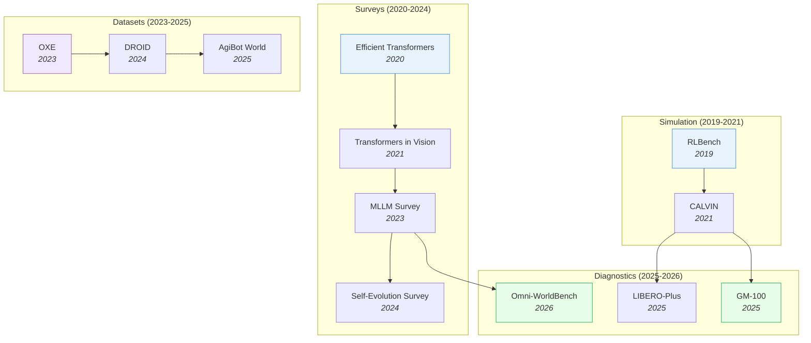

# Benchmarks & Surveys

> [!abstract] Overview
> A cross-cutting index of benchmarks, datasets, and survey papers organized by domain. Surveys map the landscape and define taxonomies; benchmarks measure progress and expose capability gaps; dataset papers address how to collect, curate, and select training data at scale.

## Evolution Graph

The field evolved through four tracks: **simulation infrastructure** (2019-2021) where RLBench and CALVIN established standardized evaluation; **survey literature** (2020-2024) where comprehensive taxonomies mapped each subfield; **large-scale datasets** (2023-2025) where OXE, DROID, and AgiBot World enabled cross-embodiment training; and **diagnostic benchmarks** (2025-2026) where LIBERO-Plus, GM-100, and Omni-WorldBench shifted focus from performance to robustness.

| Year | Paper | Contribution |
|------|-------|-------------|
| 2019 | [[1909.12271\|RLBench]] | 100 manipulation tasks with infinite expert demos; standardized few-shot evaluation |
| 2020 | [[2009.06732\|Efficient Transformers Survey]] | Foundational taxonomy of efficient attention variants |
| 2021 | [[2101.01169\|Transformers in Vision Survey]] | First comprehensive survey of vision transformers |
| 2021 | [[2112.03227\|CALVIN]] | Long-horizon language-conditioned benchmark; compositionality standard |
| 2023 | [[2306.13549\|MLLM Survey]] | Mapped the rapidly evolving multimodal LLM landscape |
| 2023 | [[2310.08864\|OXE]] | 1M+ trajectories from 22 embodiments; the ImageNet moment for robotics |
| 2024 | [[2403.12945\|DROID]] | In-the-wild data across 16 institutions; proved diverse data beats curated data |
| 2024 | [[2404.14387\|Self-Evolution Survey]] | Structured taxonomy of self-evolving LLM approaches |
| 2025 | [[2503.06669\|AgiBot World]] | 1M trajectories + GO-1 generalist policy; largest single-lab effort |
| 2025 | [[2510.13626\|LIBERO-Plus]] | 7 perturbation dimensions expose VLA brittleness despite high benchmark scores |
| 2025 | [[2601.11421\|GM-100]] | 100 detail-oriented tasks; current VLAs achieve very low success rates |
| 2026 | [[2603.22212\|Omni-WorldBench]] | First interaction-centric evaluation for world models; tests causal consistency |

---

## 1. Foundation Model & Transformer Surveys

Surveys that chart the Transformer architecture landscape — from efficient attention mechanisms through training recipes to parameter-efficient adaptation. Together they define the "how to build" side of modern AI.

**Efficient Architectures & Attention** — How to make Transformers faster without sacrificing quality, covering sparse attention, linear attention, and compact ViT designs.
- [[2604.00965|Transformers for Applied Mathematicians]], [[2508.09834|Efficient LLM Architectures Survey]], [[2505.03113|Lightweight ViT Survey]], [[2309.02031|Efficient ViT Survey]], [[2305.09880|ViT CNN-Transformer Survey]], [[2111.06091|Visual Transformers Survey]], [[2101.01169|Transformers in Vision Survey]], [[2012.12556|Visual Transformer Survey]], [[2009.06732|Efficient Transformers Survey]]

> [!star] Key Papers
> - [[2009.06732|Efficient Transformers Survey]] — The foundational taxonomy from Google Research; classifies all efficient attention variants
> - [[2508.09834|Efficient LLM Architectures Survey]] — Updated 2025 taxonomy unifying efficient architectural designs and optimization strategies for LLMs

**Training Recipes & Scaling** — Practical guidance on mixed precision, distillation, pruning, and the full training pipeline for large models.
- [[2604.00626|On-Policy Distillation Survey]], [[2505.13840|EfficientLLM]], [[2501.09223|LLM Foundations]], [[2501.00663|Titans]], [[2309.14322|Transformer Training Instabilities]], [[2302.01107|Efficient Transformer Training Survey]]

> [!star] Key Papers
> - [[2302.01107|Efficient Transformer Training Survey]] — First comprehensive categorization of training efficiency techniques
> - [[2505.13840|EfficientLLM]] — Empirical evaluation framework assessing efficiency techniques across architecture, training, and inference dimensions

**Parameter-Efficient Fine-Tuning (PEFT)** — LoRA, adapters, prompt tuning, and their systematic comparison. The PEFT landscape evolved rapidly from 2023 to 2025.
- [[2603.01097|LoRA Knowledge Memory]], [[2504.14117|PEFT A2Z]], [[2501.13787|PEFT Survey (2025)]], [[2410.19878|PEFT Methodologies Survey]], [[2403.14608|PEFT Survey 2024]], [[2312.12148|PEFT Survey]]

> [!star] Key Papers
> - [[2312.12148|PEFT Survey]] — The original comprehensive review of PEFT methods for pre-trained models
> - [[2603.01097|LoRA Knowledge Memory]] — Audits LoRA as a parametric knowledge store, revealing what fine-tuning actually memorizes

**Model Merging & Composition** — Combining multiple fine-tuned models into a single improved model without retraining.
- [[2503.08998|Model Merging Survey]], [[2408.07666|Model Merging Survey]]

**LLM Fine-Tuning Practice** — End-to-end guides for practitioners covering method selection, hyperparameter tuning, and deployment.
- [[2408.13296|LLM Fine-Tuning Guide]]

> [!tip] The PEFT Evolution
> Three PEFT surveys in two years (2023, 2025 survey, 2025 A2Z) reflect how fast this field moves. The LoRA Knowledge Memory paper adds a critical new dimension: understanding *what* LoRA actually stores. Start with the 2023 survey for foundations, then read the A2Z paper for the latest taxonomy.

---

## 2. Vision-Language & Multimodal Surveys

Surveys covering multimodal LLMs, open-vocabulary learning, hallucination, and the emerging field of multimodal reasoning.

**Multimodal LLM Architecture & Efficiency** — How to build and deploy multimodal models that understand both images and text.
- [[2510.09586|VLM Survey 26K]], [[2509.25373|VLM Perception-Cognition Survey]], [[2508.05547|VLM Unsupervised Adaptation Survey]], [[2508.04227|VLM Continual Learning Survey]], [[2506.18504|VLM Generalization Survey]], [[2505.02567|Unified Multimodal Survey]], [[2503.06063|Multi-Layer Visual Fusion]], [[2501.02765|VLLM Survey]], [[2501.02189|VLM Survey 2025]], [[2405.10739|Efficient MLLM Survey]], [[2306.13549|MLLM Survey]]

> [!star] Key Papers
> - [[2306.13549|MLLM Survey]] — The definitive 2023 survey mapping the multimodal LLM landscape
> - [[2405.10739|Efficient MLLM Survey]] — Focuses specifically on making multimodal LLMs practical for deployment

**Open-Vocabulary & Hallucination** — Extending VLMs to recognize novel categories and mitigating their tendency to hallucinate.
- [[2508.01781|LLM Hallucination Taxonomy]], [[2412.18619|Multimodal NTP Survey]], [[2409.15310|Visual Prompting MLLM Survey]], [[2402.00253|LVLM Hallucination Survey]], [[2307.09220|OVD/OVS Survey]], [[2306.15880|Open Vocabulary Learning]]

> [!star] Key Papers
> - [[2402.00253|LVLM Hallucination Survey]] — Categorizes hallucination types, root causes, and mitigation strategies for VLMs

**Multimodal Reasoning** — Surveys on how multimodal models reason across modalities, combining visual and textual information for complex inference.
- [[2508.17298|Compositional Visual Reasoning Survey]], [[2504.21277|Reinforced MLLM Survey]], [[2504.03151|Multimodal Reasoning Survey]], [[2503.12605|MCoT Survey]], [[2503.01773|ADAPTVIS]]

> [!star] Key Papers
> - [[2504.03151|Multimodal Reasoning Survey]] — Systematic framework categorizing multimodal reasoning into post-training and test-time strategies, with cognitive science integration
> - [[2508.17298|Compositional Visual Reasoning Survey]] — Five-stage taxonomy of compositional visual reasoning covering 260+ papers; maps the shift from monolithic to compositional approaches

**VLM & MLLM Benchmarks** — Evaluation frameworks and benchmarks for vision-language models across diverse tasks.
- [[2604.03016|Agentic-MME]], [[2603.20278|OpenResearcher]], [[2603.19231|MonoArt]], [[2603.18886|RLLM]], [[2603.15975|UMO]], [[2603.14609|GroundSet]], [[2603.07335|VisualScratchpad]], [[2603.03857|DeepScan]], [[2603.03241|UniG2U-Bench]], [[2603.02959|SS-Text-U]], [[2603.00461|ReMoT]], [[2603.00142|ToM Multi-Agent Eval]], [[2603.00136|TinyVLM]], [[2602.22859|DPE]], [[2602.22766|CapImagine]], [[2602.22703|GEODPO]], [[2602.21619|VSR Information Injection Analysis]], [[2602.21497|ECRD]], [[2602.21054|VAUQ]], [[2602.20687|NativeEmbodied]], [[2602.20159|VBVR]], [[2602.16702|SAP]], [[2602.12395|Frankenstein RL Analysis]], [[2602.11858|ZwZ]], [[2602.11737|OA-VCD]], [[2602.11236|ABot-M0]], [[2602.11144|GENIUS]], [[2602.10675|TwiFF]], [[2602.10551|C2RoPE]], [[2602.09463|SpotAgent]], [[2602.08346|ThinkWithImages-PRMBENCH]], [[2602.05547|MT-GRPO]], [[2602.05359|HIVE]], [[2602.04145|BIS]], [[2602.03733|RegionReasoner]], [[2602.02951|NUWA]], [[2602.02605|ESMA]], [[2602.02465|MentisOculi]], [[2602.02156|LoopViT]], [[2602.02140|GAPEVAL]], [[2602.01816|VIA-Bench]], [[2601.23265|PaperBanana]], [[2601.16973|VisGym]], [[2601.15224|PROGRESSLM]], [[2601.14127|MIR-SafetyBench]], [[2601.12964|Cross-Scale Pretraining]], [[2601.12585|MLLM Visualization Literacy]], [[2601.10679|Augmented HRM]], [[2601.05244|GREx]], [[2601.03193|UniCorn]], [[2601.02422|CoCoT]], [[2601.00561|AEGIS]], [[2512.24119|GeoBench]], [[2512.23453|CoFi-Dec]], [[2512.23169|REVEALER]], [[2512.14666|EVOLVE-VLA]], [[2512.12690|SFT vs RL VLM Study]], [[2512.08228|MM-CoT]], [[2511.20836|DSPy+HELM]], [[2511.20814|SPHINX]], [[2511.20351|HVS]], [[2511.18373|MASS]], [[2511.17487|EXTRACT+THINK]], [[2511.16901|AVST-Zero]], [[2511.04670|Cambrian-S]], [[2511.02779|MIRA]], [[2511.01833|TIR-Bench]], [[2510.23603|PixelRefer]], [[2510.23569|EgoThinker]], [[2510.16714|SceneCOT]], [[2510.16596|SHIELD]], [[2510.12225|HoneyBee]], [[2510.08189|R-Horizon]], [[2509.26346|EditReward]], [[2509.23250|VL-PRM]], [[2509.14760|ALIGN3]], [[2509.00576|G0]], [[2508.12466|Inverse-LLaVA]], [[2508.12109|Simple o3]], [[2508.11737|Ovis2.5]], [[2508.03102|CCA]], [[2508.02419|TVAI]], [[2507.23751|CoT-Self-Instruct]], [[2507.23278|UniLiP]], [[2507.23276|AI Scientist Survey]], [[2507.22003|ViHallu]], [[2507.17746|RaR]], [[2507.16746|Zebra-CoT]], [[2507.11932|Hyperphantasia]], [[2507.10548|EmbRACE-3K]], [[2507.10532|RandomCalculation]], [[2507.10202|ECP]], [[2507.05258|REA]], [[2507.02978|Inf-Bench]], [[2507.01955|GPT-4o Vision Evaluation]], [[2507.01949|Kwai Keye-VL]], [[2507.01643|SAILViT]], [[2506.23120|R2S]], [[2506.23115|MoCa]], [[2506.22992|MARBLE]], [[2506.22434|MiCo]], [[2506.22419|LLM Speedrunning Benchmark]], [[2506.22395|Test-Time VLM Consistency]], [[2506.21215|G2-Reasoner]], [[2506.17901|PostAlign]], [[2506.16141|GRPO-CARE]], [[2506.14965|GURU]], [[2506.14512|SIRI-Bench]], [[2506.13723|OTFusion]], [[2506.12776|NativeRes-LLaVA]], [[2506.12609|VisFlow]], [[2506.12508|AgentOrchestra]], [[2506.10128|ViCrit]], [[2506.08429|SCALE]], [[2506.07936|MM-ICL Mimicking vs Reasoning]], [[2506.07227|MED]], [[2506.06279|CoMemo]], [[2506.05302|PAM]], [[2506.04633|STARE]], [[2506.04277|RSVP]], [[2506.02557|KUEA]], [[2506.02126|Knowledge vs Reasoning LLM Eval]], [[2506.01850|MoDA]], [[2506.01724|ALOR]], [[2506.01663|Zoom-Refine]], [[2505.23004|QLIP]], [[2505.21538|PAM-CVR]], [[2505.21497|PosterAgent]], [[2505.21457|ACTIVE-O3]], [[2505.20612|RF100-VL]], [[2505.20444|HoPE]], [[2505.20046|REARANK]], [[2505.19094|SATORI]], [[2505.18129|V-Triune]], [[2505.17316|Patch-Aligned Training]], [[2505.17018|SophiaVL-R1]], [[2505.16151|FRANK]], [[2505.16149|REVEAL]], [[2505.15660|AGNOSTOS]], [[2505.15045|DIFFEMBED]], [[2505.14404|ViC-Bench]], [[2505.14246|Visual-ARFT]], [[2505.12448|SSR]], [[2505.12363|ViCA2]], [[2505.12312|ViCA-7B]], [[2505.11815|UniMoCo]], [[2505.10557|MathCoder-VL]], [[2505.07062|Seed1.5-VL]], [[2505.05800|3D-CAVLA]], [[2505.05472|Mogao]], [[2505.02406|TCPA]], [[2505.02056|VLM Pseudo-label Calibration]], [[2505.01064|NeaR]], [[2504.21559|BBVPE]], [[2504.21356|Nexus-Gen]], [[2504.20199|FCVC]], [[2504.19254|uqlm]], [[2504.18053|DREAM]], [[2504.17432|UniME]], [[2504.16072|DAM]], [[2504.15271|Eagle 2.5]], [[2504.13180|PerceptionLM]], [[2504.12104|Logits DeConfusion]], [[2504.10479|InternVL3]], [[2504.07745|SF2T]], [[2503.15621|LLaVA-MORE]], [[2503.12797|DeepPerception]], [[2503.10291|VisualPRM]], [[2503.07365|MM-Eureka]], [[2503.05255|CMMCoT]], [[2502.17422|MLLM Small Visual Details]], [[2502.16435|VISFACTOR]], [[2502.03387|LIMO]], [[2501.19393|s1]], [[2501.13620|VLM Perception-Reasoning Probe]], [[2412.18072|MMFactory]], [[2412.07012|ProVision]], [[2411.11930|AtomThink]], [[2411.10440|LLaVA-CoT]], [[2410.10855|CoreCognition]], [[2410.02735|OOD-Chameleon]], [[2409.17146|Molmo]], [[2404.14396|SEED-X]], [[2402.02242|V-PEFT Bench]]

> [!star] Key Papers
> - [[2504.10479|InternVL3]] — Native multimodal pre-training reaching 72.2 on MMMU; top open-source MLLM across diverse tasks
> - [[2409.17146|Molmo]] — Fully open-weight and open-data VLM family; proves high performance without proprietary synthetic data
> - [[2505.07062|Seed1.5-VL]] — ByteDance's VLM achieving SOTA on 38/60 benchmarks; strong on GUI, documents, and video

**Grounding & Referring Expression Benchmarks** — Evaluating models' ability to localize objects from language descriptions.
- [[2510.11106|CZSL Survey]], [[2506.19360|Synthetic Image Privacy SoK]], [[2505.13317|Few-shot SSL]], [[2504.00883|vsGRPO]], [[2503.21776|Video-R1]], [[2503.19903|PS3]], [[2503.12799|GCoT]], [[2503.09527|CombatVLA]], [[2503.08497|MMRL]], [[2503.06626|DiffCLIP]], [[2503.01619|Flame]], [[2502.17159|RobustMerge]], [[2502.16982|Muon]], [[2412.18319|Mulberry]], [[2412.13810|CAD-Assistant]], [[2412.07755|SAT]], [[2411.19488|ICoT]], [[2411.16044|ZoomEye]], [[2411.10231|TaylorIR]], [[2411.09691|TinyGroundingGPT]], [[2410.21676|Critical Batch Size Scaling]], [[2410.17517|Maynard-Cross Learning]], [[2410.17385|COMFORT]], [[2410.16400|VipAct]], [[2410.06158|GR-2]], [[2409.18869|Emu3]], [[2407.19666|Two-Stage Visual Reasoning]], [[2406.19934|VIREO]], [[2406.18925|VisArgs]], [[2406.18505|LLM-Xavier]], [[2406.09308|TransNAR]], [[2404.13013|Groma]], [[2404.04452|ViT Domain Robustness Survey]], [[2403.16999|VisCoT]], [[2403.13043|S2]], [[2403.03421|LEAD]], [[2402.15116|LMA Survey]], [[2402.06912|ES Linear Policy]], [[2401.13987|ADAPTER]], [[2312.14135|V*]], [[2309.11069|Dynamic Tiling]], [[2308.10677|Visual Crowd Analysis Survey]], [[2307.04054|Deep-STDP]], [[2307.03601|GPT4RoI]], [[2304.03977|EMP-SSL]], [[2211.09699|PromptCap]], [[2203.07669|PE2E]]

> [!star] Key Papers
> - [[2412.18319|Mulberry]] — Collective Monte Carlo Tree Search for step-by-step multimodal reasoning; generates 260K tree-structured reasoning examples
> - [[2403.16999|VisCoT]] — Visual chain-of-thought with grounded bounding boxes; bridges reasoning and spatial localization

> [!tip] The Hallucination Problem
> VLM hallucination remains one of the biggest barriers to deployment. The LVLM Hallucination Survey provides the taxonomy; the Efficient MLLM Survey shows how architectural choices affect both hallucination rates and inference cost.

---

## 3. Reinforcement Learning Surveys

Surveys spanning classical RL, its intersection with causal inference, continual learning, and the emerging field of RL-based reasoning in LLMs.

**RL Fundamentals & Paradigms** — Foundational overviews and comparisons of deep RL approaches.
- [[2509.08827|RL for LRM Survey]], [[2509.02547|Agentic RL Survey]], [[2508.08189|RL for Large Models Survey]], [[2412.05265|RL Overview]], [[2301.08028|Meta-RL Tutorial]], [[2110.01411|DRL vs ES Survey]]

> [!star] Key Papers
> - [[2412.05265|RL Overview]] — Sutton's modern RL overview; the authoritative reference for the field

**Causal & Continual RL** — Extending RL with causal reasoning and lifelong learning capabilities.
- [[2506.21872|Continual RL Survey]], [[2307.01452|Causal RL Survey 2307]], [[2302.05209|Causal RL Survey]]

> [!star] Key Papers
> - [[2302.05209|Causal RL Survey]] — Maps the intersection of causal inference and RL; crucial for sample-efficient policy learning
> - [[2506.21872|Continual RL Survey]] — Covers lifelong learning in RL, addressing catastrophic forgetting in sequential task settings

**RL for Reasoning** — How RL drives chain-of-thought and multi-step reasoning in large language models.
- [[2505.04921|LMRM Survey]], [[2505.02665|Slow Thinking LLM Survey]], [[2505.00551|DeepSeek-R1 Replication Survey]], [[2504.12328|Reward Model Survey]], [[2504.09037|LLM Reasoning Frontiers Survey]], [[2501.09686|Large Reasoning Models Survey]]

> [!star] Key Papers
> - [[2501.09686|Large Reasoning Models Survey]] — Defines the LRM paradigm; maps how RL + process reward models enable complex multi-step reasoning
> - [[2504.12328|Reward Model Survey]] — Comprehensive taxonomy of reward models driving RLHF and reasoning; essential for understanding post-training

> [!tip] The RL-Reasoning Connection
> The Large Reasoning Models Survey bridges two worlds: RL researchers studying reward optimization and LLM researchers studying chain-of-thought. Post-DeepSeek-R1, this intersection is where much of the field's energy is focused.

---

## 4. Robotics & Embodied AI Surveys

Surveys mapping the robotics landscape from embodied AI simulators through VLA architectures to world-model-augmented control. This domain has the highest survey density, reflecting rapid growth from 2021 to 2025.

**Embodied AI Foundations** — Broad surveys covering simulators, task hierarchies, and the overall embodied AI research landscape.
- [[2407.06886|ARIO]], [[2103.04918|Embodied AI Survey 2021]]

> [!star] Key Papers
> - [[2407.06886|ARIO]] — Comprehensive 2024 survey introducing the ARIO dataset standard for cross-study comparison
> - [[2103.04918|Embodied AI Survey 2021]] — Established the simulator-task-agent pyramid that later work builds on

**VLA & World Model Architectures** — Surveys focused specifically on vision-language-action models and world models for robot control.
- [[2604.04974|Video-to-Control Survey]], [[2604.04707|OpenWorldLib]], [[2604.00061|R2X Multi-Robot MLLM Survey]], [[2510.16732|World Models for Embodied AI Survey]], [[2509.20021|Embodied AI LLM-WM Survey]], [[2506.20134|3D World Models Survey]], [[2505.04769|VLA Survey]], [[2411.14499|World Models Survey 2024]], [[2405.14093|VLA Survey]], [[2311.00530|LLM Embodied Navigation Survey]]

> [!star] Key Papers
> - [[2509.20021|Embodied AI LLM-WM Survey]] — Maps the joint MLLM + world model architecture roadmap; the most forward-looking survey in this space
> - [[2506.20134|3D World Models Survey]] — Reviews the transition from 2D to 3D world models with spatial understanding

**Control & Planning** — Surveys on combining model-predictive control with RL for robot manipulation and locomotion.
- [[2502.02133|MPC-RL Survey]]

> [!star] Key Papers
> - [[2502.02133|MPC-RL Survey]] — Systematic classification of MPC-RL synthesis; maps how model-based control and learning complement each other

> [!tip] Survey Progression
> Read embodied AI surveys chronologically: 2021 survey for foundations, ARIO (2024) for the current landscape and dataset standards, then the LLM-WM Survey (2025) for the architectural roadmap ahead.

---

## 5. Self-Evolving AI Surveys

Surveys covering AI systems that improve themselves through experience, self-play, or evolutionary mechanisms — spanning both LLMs and embodied agents.

**LLM Self-Evolution** — How language models improve autonomously through self-training, self-play, and feedback loops.
- [[2603.25681|LLM Self-Improvement Survey]], [[2602.04411|Self-evolving Embodied AI]], [[2510.02665|MLLM Self-Improvement Survey]], [[2508.07407|Self-Evolving AI Agents Survey]], [[2404.14387|LLM Self-Evolution Survey]]

> [!star] Key Papers
> - [[2404.14387|LLM Self-Evolution Survey]] — Defines the taxonomy: self-training, self-play, and self-refinement as distinct mechanisms

**Self-Evolving Agents** — Broader agent paradigm where systems evolve their own capabilities toward increasingly general intelligence.
- [[2603.26499|AIRA2]], [[2512.16301|Agentic AI Adaptation Survey]], [[2507.21046|Self-Evolving Agents Survey]]

> [!star] Key Papers
> - [[2507.21046|Self-Evolving Agents Survey]] — Maps the path from self-improving agents to ASI; the most ambitious survey in this space

> [!tip] Self-Evolution Maturity
> The LLM Self-Evolution Survey covers text-only self-improvement. The MLLM Self-Improvement Survey extends to multimodal settings. The Self-Evolving Agents Survey goes furthest, considering agents that evolve across environments.

---

## 6. Context Engineering & Agent Memory Surveys

An emerging survey domain covering how to optimize the information supplied to LLMs and how agents maintain memory across interactions.

**Context Engineering** — Formalizing the discipline of structuring, selecting, and optimizing context windows for LLMs.
- [[2510.26493|Context Engineering 2.0]], [[2507.13334|Context Engineering Survey]]

> [!star] Key Papers
> - [[2507.13334|Context Engineering Survey]] — First to formalize "Context Engineering" as a systematic discipline beyond prompt engineering
> - [[2510.26493|Context Engineering 2.0]] — Redefines context engineering with dynamic, adaptive context management strategies

**Agent Memory Systems** — How AI agents store, retrieve, and manage information across interactions and tasks.
- [[2603.22862|LLM Tool Use Survey]], [[2601.12538|Agentic Reasoning Survey]], [[2512.13564|AI Agent Memory Survey]], [[2508.17692|Agentic Reasoning Survey]], [[2505.10468|AI Agents vs Agentic AI]], [[2504.01990|Foundation Agents Survey]]

> [!star] Key Papers
> - [[2512.13564|AI Agent Memory Survey]] — Introduces a "Forms-Functions-Dynamics" framework for analyzing memory in AI agents

> [!tip] Beyond Prompt Engineering
> Context engineering is the 2025 evolution of prompt engineering. The first survey defines the field; the 2.0 version adds dynamic adaptation. Combined with agent memory systems, these surveys define how future AI systems will manage their information flow.

---

## 7. Specialized Domain Surveys

Surveys covering specific domains and emerging fields.

**Diffusion & Generation Surveys** — Surveys on diffusion models, generative architectures, and their principles.
- [[2510.21890|Diffusion Models Principles]], [[2506.13759|Discrete Diffusion LLM Survey]]

> [!star] Key Papers
> - [[2510.21890|Diffusion Models Principles]] — Authoritative monograph from Sony AI/OpenAI/Stanford unifying variational, score-based, and flow-based diffusion perspectives
> - [[2506.13759|Discrete Diffusion LLM Survey]] — Maps dLLMs achieving 10x faster inference than autoregressive models; a key emerging paradigm

**Code Intelligence & Software Surveys** — Surveys on AI for code understanding, generation, and software engineering.
- [[2511.18538|Code Intelligence Survey]], [[2505.24189|SLM vs LLM Low-Code Workflows]]

> [!star] Key Papers
> - [[2511.18538|Code Intelligence Survey]] — End-to-end guide from data curation to autonomous coding agents; the most comprehensive code LLM survey

**Miscellaneous Surveys** — Other notable surveys spanning diverse topics.
- [[2602.17270|UL]], [[2602.01630|Unified World Model Framework]], [[2601.21187|FRISM]], [[2601.03220|Epiplexity]], [[2512.24880|mHC]], [[2510.00034|MOWI]], [[2509.04501|GRAPE]], [[2509.00421|Prompt Tuning Memory Limits]], [[2507.23276|AI Scientist Survey]], [[2507.18074|ASI-ARCH]], [[2507.17634|WSM]], [[2506.19360|Synthetic Image Privacy SoK]], [[2506.13018|NN Parameter Space Symmetry Survey]], [[2505.23725|MuLoCo]], [[2504.20966|Softpick]], [[2504.13173|Miras]], [[2503.12811|MPL]], [[2210.17067|UniOT]], [[2207.13050|Efficient High-Resolution Survey]], [[2203.12555|GriTS]], [[2201.02373|Mirror Learning]], [[2112.02814|Low-Shot Detection Survey]], [[2002.07421|EHSOD]]

> [!star] Key Papers
> - [[2602.01630|Unified World Model Framework]] — Proposes a unified framework for world models spanning simulation, prediction, and generation
> - [[2507.23276|AI Scientist Survey]] — Maps the landscape of AI-driven scientific discovery; relevant to every research domain

> [!tip] Navigating Specialized Surveys
> Start with the Diffusion Models Principles monograph for generative foundations, then consult the Discrete Diffusion LLM Survey if you need faster-than-autoregressive generation. For code tasks, the Code Intelligence Survey covers the full pipeline from pre-training to agents and is the best single entry point.

---

## 8. Evolutionary & Self-Supervised Learning Surveys

Surveys at the intersection of evolutionary computation and self-supervised learning, plus specialized visual architecture surveys.

- [[2505.13584|SSL Segmentation Survey]], [[2504.07213|E-SSL Survey]], [[2408.17059|SSL for ViT Survey]], [[2305.13689|SSL Survey]]

> [!star] Key Papers
> - [[2504.07213|E-SSL Survey]] — First systematic review combining evolutionary machine learning with self-supervised learning; maps a largely unexplored intersection

> [!tip] Underexplored Territory
> The E-SSL survey reveals that evolutionary methods and self-supervised learning are rarely combined despite natural synergies. This intersection may yield novel training paradigms as both fields mature.

---

## 9. Robotics Benchmarks & Datasets

The data and evaluation infrastructure for embodied AI. Datasets provide training signal, benchmarks measure progress, and together they define what the field considers solved vs. open.

**Cross-Embodiment Datasets** — Large-scale datasets spanning multiple robot types, enabling training of generalist policies.
- [[2503.06669|AgiBot World]], [[2412.13877|RoboMIND]], [[2310.08864|OXE]], [[2307.00595|RH20T]]

> [!star] Key Papers
> - [[2310.08864|OXE]] — Open X-Embodiment: 1M+ trajectories from 22 robot types; the ImageNet moment for robotics
> - [[2503.06669|AgiBot World]] — Large-scale manipulation platform with diverse environments and embodiments

**Simulation Benchmarks** — Standardized simulation environments for reproducible policy evaluation.
- [[2604.08258|EvoGymCM]], [[2603.28301|LIBERO-Para]], [[2603.25887|WR-Arena]], [[2603.23497|WildWorld]], [[2603.22435|CaP-X]], [[2603.22212|Omni-WorldBench]], [[2603.22078|WAM vs VLA Robustness]], [[2603.09030|PlayWorld]], [[2603.04639|RoboMME]], [[2602.13710|HBVLA]], [[2602.06556|LIBERO-X]], [[2601.18692|LingBot-VLA]], [[2601.05344|Im2Sim]], [[2512.24653|RoboMIND 2.0]], [[2510.13626|LIBERO-Plus]], [[2510.03827|LIBERO-PRO]], [[2509.18953|Eva-VLA]], [[2509.17057|RoboManipBaselines]], [[2506.18088|RoboTwin 2.0]], [[2505.19017|WorldEval]], [[2503.14734|GR00T N1]], [[2412.14058|RoboVLMs]], [[2405.12213|Octo]], [[2405.05941|SIMPLER]], [[2309.13037|GELLO]], [[2306.03310|LIBERO]], [[2304.13705|ALOHA]], [[2112.03227|CALVIN]], [[2009.12293|robosuite]], [[1909.12271|RLBench]]

> [!star] Key Papers
> - [[2306.03310|LIBERO]] — Lifelong robot learning benchmark with 5 suites and 130 tasks; tests continual learning
> - [[2405.05941|SIMPLER]] — Evaluates whether simulation performance predicts real-world success; bridges the sim-to-real gap

> [!tip] Benchmark Selection
> Start with LIBERO or CALVIN for standardized simulation evaluation. Use OXE for cross-embodiment pretraining. SIMPLER tells you whether your sim results will hold up in the real world.

---

## 10. Spatial & 3D Reasoning Benchmarks

Benchmarks that test whether models truly understand spatial relationships, 3D structure, and multi-hop compositional spatial reasoning.

**Visual Spatial Reasoning** — Binary and multi-choice spatial relationship evaluation for VLMs.
- [[2603.03944|SCP-Bench]], [[2602.20901|SpatiaLQA]], [[2602.15950|VLM Spatial Reasoning OCR]], [[2602.15918|EarthSpatialBench]], [[2602.03916|SpatiaLab]], [[2601.20354|SpatialGenEval]], [[2601.19099|m2sv]], [[2601.16520|TangramPuzzle]], [[2601.14339|CityCube]], [[2601.13304|CausalSpatial]], [[2601.11729|SpaRRTa]], [[2601.06521|BabyVision]], [[2601.00092|Spatial4D-Bench]], [[2512.24385|Spatial Intelligence Roadmap]], [[2512.23365|SpatialMosaic]], [[2512.20617|SpatialTree]], [[2512.19683|OpenBench]], [[2512.10863|MMSI-Video-Bench]], [[2511.21471|SpatialBench]], [[2510.18873|DSI-Bench]], [[2510.11549|ODI-Bench]], [[2510.09606|SpaceVista]], [[2508.13142|EASI]], [[2508.02095|VLM4D]], [[2507.21045|4D Spatial Intelligence Survey]], [[2507.20529|SpatialVTS]], [[2507.20174|LRR-Bench]], [[2507.07610|SpatialViz-Bench]], [[2506.21458|MINDCUBE]], [[2506.18385|InternSpatial]], [[2506.07966|SpaCE-10]], [[2506.03135|OmniSpatial]], [[2505.24257|DISJOINT-3DQA]], [[2505.23764|MMSI-Bench]], [[2505.21500|MVSM]], [[2505.20279|VLM-3R]], [[2505.17015|Multi-SpatialMLLM]], [[2505.17012|SpatialScore]], [[2505.11907|OSR-Bench]], [[2505.05626|PERCEPTLLM]], [[2505.05456|SITE]], [[2504.20648|SpaRE]], [[2504.15280|All-Angles Bench]], [[2504.15037|MLLM Spatial Reasoning Position Paper]], [[2504.09848|LLM Spatial Intelligence Survey]], [[2504.05786|3D Spatial Reasoning in LLM Survey]], [[2504.01805|SpaceR]], [[2503.19707|VLM Spatial Reasoning Benchmark]], [[2503.19355|ST-VLM]], [[2502.11859|VLM Spatial Abilities Benchmark]], [[2502.03214|iVISPAR]], [[2412.14171|VSI-Bench]], [[2412.10908|Do VLMs Understand 3D Shapes]], [[2412.07825|3DSRBench]], [[2408.16662|Space3D-Bench]], [[2406.14852|SpatialEval]], [[2406.02537|TopViewRS]], [[2401.12168|SpatialVLM]], [[2205.00363|VSR]]

> [!star] Key Papers
> - [[2505.17012|SpatialScore]] — Comprehensive spatial intelligence benchmark revealing significant MLLM gaps in 3D understanding; proposes SpatialAgent for +8.3% accuracy
> - [[2205.00363|VSR]] — Foundational spatial reasoning dataset exposing the 25-point gap between VLM and human spatial understanding

**Multi-View & Compositional** — Benchmarks requiring reasoning across multiple viewpoints or chaining spatial inferences.
- [[2603.18892|MultihopSpatial]], [[2603.16506|VIEW2SPACE]], [[2603.00515|MLLM-4D]]

> [!star] Key Papers
> - [[2603.18892|MultihopSpatial]] — Tests multi-hop compositional spatial reasoning; exposes failures in models that pass simpler spatial tests
> - [[2401.12168|SpatialVLM]] — Evaluates 3D spatial reasoning in VLMs with real-world spatial queries

> [!tip] Spatial Reasoning Gap
> Most VLMs pass simple spatial tests (VSR) but fail multi-hop reasoning (MultihopSpatial). This gap reveals that current models memorize spatial patterns rather than truly reasoning about space.

---

## 11. Video Understanding & Temporal Benchmarks

Benchmarks for video-level reasoning that require understanding temporal dynamics, audio-visual integration, and spatio-temporal relationships.

- [[2604.07592|FESTS]], [[2603.14145|MMOU]], [[2602.05986|RISE-Video]], [[2601.09430|Video-MSR]], [[2507.18342|EgoExoBench]], [[2503.23765|STI-Bench]]

> [!star] Key Papers
> - [[2603.14145|MMOU]] — Joint audio-visual reasoning benchmark with 15K questions; tests true multimodal video understanding
> - [[2503.23765|STI-Bench]] — Evaluates spatio-temporal world understanding; goes beyond frame-level perception

> [!tip] Beyond Frame-Level
> Both benchmarks test capabilities that frame-level VLMs cannot solve. Models need temporal reasoning (STI-Bench) and cross-modal integration (MMOU) to succeed.

---

## 12. Reasoning & Cognitive Benchmarks

Benchmarks that evaluate logical reasoning, cognitive planning, and visual logic in language and multimodal models.

- [[2604.02029|Latent Space Survey]], [[2512.14693|URM]], [[2512.06104|CompressARC]], [[2509.02350|Implicit Reasoning Survey]], [[2508.02120|Efficient Reasoning Survey]], [[2507.09662|Concise Adaptive Thinking Survey]], [[2507.06203|Latent Reasoning Survey]], [[2505.24760|REASONING GYM]], [[2505.16782|Latent CoT Survey]], [[2504.15279|VisuLogic]], [[2504.13828|Cognition Engineering]], [[2504.10903|Efficient Reasoning Models Survey]], [[2503.24235|Test-Time Scaling Survey]], [[2503.23077|LRM Efficient Inference Survey]], [[2503.21614|Efficient Reasoning Survey]], [[2503.16419|Stop Overthinking Survey]], [[2503.16416|LLM Agent Eval Survey]], [[2503.09567|Long CoT Survey]], [[2502.21321|LLM Post-Training Survey]], [[2501.11223|RLM Blueprint]], [[2309.15129|CogEval]]

> [!star] Key Papers
> - [[2309.15129|CogEval]] — Tests cognitive maps and planning in LLMs; inspired by cognitive science experiments
> - [[2512.06104|CompressARC]] — Addresses the ARC-AGI benchmark via compression-based reasoning; 20% improvement over baselines
> - [[2505.24760|REASONING GYM]] — RL environments with verifiable rewards for training and evaluating reasoning

> [!tip] Reasoning vs. Pattern Matching
> CogEval and CompressARC test fundamentally different reasoning capabilities than standard NLP benchmarks. They reveal whether models can plan (CogEval) or abstract (CompressARC) rather than just pattern-match.

---

## 13. Data Quality, Selection & Annotation

Papers addressing how to build better training datasets through curation, selection, annotation automation, and analysis of data quality issues.

**Data Selection & Curation** — Methods for selecting the most valuable training data from large pools.
- [[2506.02359|Auto-Labeling]], [[2504.13161|Nemotron-CLIMB]], [[2412.00420|TAROT]], [[2403.01299|Photonic PUF ML Resilience]], [[2205.09329|Dataset Pruning]]

> [!star] Key Papers
> - [[2412.00420|TAROT]] — Targeted data selection via Whitened Feature Distance and optimal transport; selects high-value subsets from massive pools
> - [[2504.13161|Nemotron-CLIMB]] — NVIDIA's automated framework for discovering and curating high-quality training data

**Annotation & Semi-Supervised Tools** — Reducing annotation cost through foundation-model-assisted labeling.
- [[2407.11464|Crowd-SAM]], [[2406.09294|DINOv2 (dataset application)]]

**Data Quality Analysis** — Understanding and diagnosing issues in training data.
- [[2602.11217|Magic Correlations]], [[2409.14401|In-Class Data Imbalance]]

> [!star] Key Papers
> - [[2409.14401|In-Class Data Imbalance]] — Reveals that datasets contain disproportionate sub-population representation within classes, not just across classes
> - [[2602.11217|Magic Correlations]] — Analyzes how accuracy and confidence transfer from pretraining to downstream tasks; reveals when more data helps and when it does not

> [!tip] Data Quality Over Quantity
> The In-Class Data Imbalance and Magic Correlations papers share a theme: naively adding more data does not always help. Targeted selection (TAROT, Nemotron-CLIMB) consistently outperforms random scaling.

---

## 14. Model Evaluation & Architecture Analysis

Benchmarks and analytical studies focused on evaluating model architectures, detection systems, and interpretability.

**Detection & Recognition** — Benchmarks and methods for evaluating object detection and interpretable visual recognition.
- [[2510.21501|GranViT]], [[2506.15692|MLE-STAR]], [[2506.08429|SCALE]], [[2506.08391|SECOND]], [[2506.07850|SAM2Auto]], [[2505.01109|SSL-MIL Pathology Benchmark]], [[2504.14988|FG-BMK]], [[2504.09819|Density-Guided Object Detection]], [[2410.20722|ProtoViT]], [[2410.13842|D-FINE]], [[2410.06468|SPACE]], [[2408.14371|SelEx]], [[2404.15817|VT-ADA]], [[2404.13013|Groma]], [[2404.09216|DetCLIPv3]], [[2403.14410|GLC++]], [[2311.04157|INTR]], [[2308.00692|LISA]], [[2307.12813|DOD]], [[2306.03514|RAM]], [[2305.07011|RO-ViT]], [[2303.13076|CORA]], [[2303.07110|GLC]], [[2303.05499|Grounding DINO]], [[2203.16265|SeqTR]], [[2201.02605|Detic]], [[2109.06165|CDTrans]], [[1810.09091|SG-One]], [[1806.04728|RepMet]], [[1803.01534|PANet]], [[1612.03144|FPN]]

> [!star] Key Papers
> - [[2410.13842|D-FINE]] — Redefines bounding box regression in DETR models; transforms coordinate prediction into fine-grained distribution refinement
> - [[2505.01109|SSL-MIL Pathology Benchmark]] — Reveals that simple instance-based MIL methods combined with strong SSL features outperform complex architectures

**LLM Inference & Representation Analysis** — Studies analyzing how model architectures and adaptations affect inference efficiency and learned representations.
- [[2603.02188|MLRA]], [[2602.15029|Language Symmetry Representations]], [[2510.04871|TRM]], [[2510.02292|VLM-Lens]], [[2508.19005|ELL Framework]], [[2507.10442|VLM Three-Space Analysis]], [[2507.04590|VLM2Vec-V2]], [[2506.13018|NN Parameter Space Symmetry Survey]], [[2403.13187|EvoLLM-JP]]

> [!star] Key Papers
> - [[2603.02188|MLRA]] — Multi-Head Low-Rank Attention enhances LLM inference efficiency for long contexts
> - [[2602.15029|Language Symmetry Representations]] — Proves that translation symmetry in word co-occurrence statistics determines representational geometry

> [!tip] Simplicity Wins
> Both the SSL-MIL benchmark and D-FINE share a lesson: simpler methods with strong foundations often beat complex architectures. Evaluate against these baselines before adding complexity.

---

## Cross-References

- [[01_Foundation-Models]] — Transformer architecture surveys and training recipes
- [[02_Vision-Language-Models]] — VLM and open-vocabulary surveys in context
- [[04_Reinforcement-Learning]] — RL surveys and reasoning benchmarks
- [[07_Robotics-and-Embodied-AI]] — Robotics datasets and benchmarks applied
- [[11_Self-Evolving-AI]] — Self-evolving paradigm surveys

---

*This note indexes surveys and benchmarks across the vault. For topic-specific context and paper groupings, see the individual General/ overview files.*
