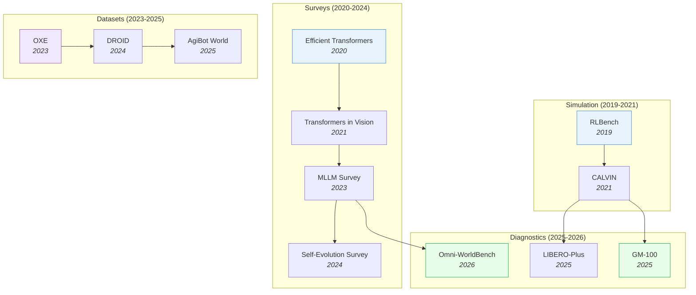

# Benchmarks & Surveys

> [!abstract] Overview
> A cross-cutting index of benchmarks, datasets, and survey papers organized by domain. Surveys map the landscape and define taxonomies; benchmarks measure progress and expose capability gaps; dataset papers address how to collect, curate, and select training data at scale.

## Evolution Graph

The field evolved through four tracks: **simulation infrastructure** (2019-2021) where RLBench and CALVIN established standardized evaluation; **survey literature** (2020-2024) where comprehensive taxonomies mapped each subfield; **large-scale datasets** (2023-2025) where OXE, DROID, and AgiBot World enabled cross-embodiment training; and **diagnostic benchmarks** (2025-2026) where LIBERO-Plus, GM-100, and Omni-WorldBench shifted focus from performance to robustness.

| Year | Paper | Contribution |
|------|-------|-------------|
| 2019 | [[1909.12271\|RLBench]] | 100 manipulation tasks with infinite expert demos; standardized few-shot evaluation |
| 2020 | [[2009.06732\|Efficient Transformers Survey]] | Foundational taxonomy of efficient attention variants |
| 2021 | [[2101.01169\|Transformers in Vision Survey]] | First comprehensive survey of vision transformers |
| 2021 | [[2112.03227\|CALVIN]] | Long-horizon language-conditioned benchmark; compositionality standard |
| 2023 | [[2306.13549\|MLLM Survey]] | Mapped the rapidly evolving multimodal LLM landscape |
| 2023 | [[2310.08864\|OXE]] | 1M+ trajectories from 22 embodiments; the ImageNet moment for robotics |
| 2024 | [[2403.12945\|DROID]] | In-the-wild data across 16 institutions; proved diverse data beats curated data |
| 2024 | [[2404.14387\|LLM Self-Evolution Survey]] | Structured taxonomy of self-evolving LLM approaches |
| 2025 | [[2503.06669\|AgiBot World]] | 1M trajectories + GO-1 generalist policy; largest single-lab effort |
| 2025 | [[2510.13626\|LIBERO-Plus]] | 7 perturbation dimensions expose VLA brittleness despite high benchmark scores |
| 2025 | [[2601.11421\|GM-100]] | 100 detail-oriented tasks; current VLAs achieve very low success rates |
| 2026 | [[2603.22212\|Omni-WorldBench]] | First interaction-centric evaluation for world models; tests causal consistency |

---

## 1. Foundation Model & Transformer Surveys

Surveys that chart the Transformer architecture landscape — from efficient attention mechanisms through training recipes to parameter-efficient adaptation. Together they define the "how to build" side of modern AI.

**Efficient Architectures & Attention** — How to make Transformers faster without sacrificing quality, covering sparse attention, linear attention, and compact ViT designs.
- [[2604.00965|Transformers for Applied Mathematicians]], [[2508.09834|Efficient LLM Architectures Survey]], [[2505.03113|Lightweight ViT Survey]], [[2309.02031|Efficient ViT Survey]], [[2305.09880|ViT CNN-Transformer Survey]], [[2111.06091|Visual Transformers Survey]], [[2101.01169|Transformers in Vision Survey]], [[2012.12556|Visual Transformer Survey]], [[2009.06732|Efficient Transformers Survey]]

> [!star] Key Papers
> - [[2009.06732|Efficient Transformers Survey]] — The foundational taxonomy from Google Research; classifies all efficient attention variants
> - [[2508.09834|Efficient LLM Architectures Survey]] — Updated 2025 taxonomy unifying efficient architectural designs and optimization strategies for LLMs

**Training Recipes & Scaling** — Practical guidance on mixed precision, distillation, pruning, and the full training pipeline for large models.
- [[2604.00626|On-Policy Distillation Survey]], [[2506.10966|GenManip]], [[2505.13840|EfficientLLM]], [[2504.18904|RoboVerse]], [[2501.09223|LLM Foundations]], [[2501.00663|Titans]], [[2309.14322|Transformer Training Instabilities]], [[2302.01107|Efficient Transformer Training Survey]], [[1907.06987|Kinetics-700]]

> [!star] Key Papers
> - [[2302.01107|Efficient Transformer Training Survey]] — First comprehensive categorization of training efficiency techniques
> - [[2505.13840|EfficientLLM]] — Empirical evaluation framework assessing efficiency techniques across architecture, training, and inference dimensions

**Parameter-Efficient Fine-Tuning (PEFT)** — LoRA, adapters, prompt tuning, and their systematic comparison. The PEFT landscape evolved rapidly from 2023 to 2025.
- [[2603.01097|LoRA Knowledge Memory]], [[2504.14117|PEFT A2Z]], [[2501.13787|PEFT for Foundation Models]], [[2410.19878|PEFT Methodologies Survey]], [[2403.14608|PEFT Comprehensive Survey]], [[2312.12148|PEFT Critical Review]]

> [!star] Key Papers
> - [[2312.12148|PEFT Critical Review]] — The original comprehensive review of PEFT methods for pre-trained models
> - [[2603.01097|LoRA Knowledge Memory]] — Audits LoRA as a parametric knowledge store, revealing what fine-tuning actually memorizes

**Model Merging & Composition** — Combining multiple fine-tuned models into a single improved model without retraining.
- [[2503.08998|Model Merging Approaches Review]], [[2408.07666|Model Merging in LLMs/MLLMs]]

**LLM Fine-Tuning Practice** — End-to-end guides for practitioners covering method selection, hyperparameter tuning, and deployment.
- [[2408.13296|LLM Fine-Tuning Guide]]

> [!tip] The PEFT Evolution
> Three PEFT surveys in two years (2023, 2025 survey, 2025 A2Z) reflect how fast this field moves. The LoRA Knowledge Memory paper adds a critical new dimension: understanding *what* LoRA actually stores. Start with the 2023 survey for foundations, then read the A2Z paper for the latest taxonomy.

---

## 2. Vision-Language & Multimodal Surveys

Surveys covering multimodal LLMs, open-vocabulary learning, hallucination, and the emerging field of multimodal reasoning.

**Multimodal LLM Architecture & Efficiency** — How to build and deploy multimodal models that understand both images and text.
- [[2602.16313|MemoryArena]], [[2510.09586|VLM Survey 26K]], [[2509.25373|VLM Perception-Cognition Survey]], [[2508.05547|VLM Unsupervised Adaptation Survey]], [[2508.04227|VLM Continual Learning Survey]], [[2506.18504|VLM Generalization Survey]], [[2505.02567|Unified Multimodal Survey]], [[2504.15965|AI Memory Survey]], [[2503.06063|Multi-Layer Visual Fusion]], [[2501.02765|VLLM Survey]], [[2501.02189|VLM SOTA Survey]], [[2405.10739|Efficient MLLM Survey]], [[2306.13549|MLLM Survey]]

> [!star] Key Papers
> - [[2306.13549|MLLM Survey]] — The definitive 2023 survey mapping the multimodal LLM landscape
> - [[2405.10739|Efficient MLLM Survey]] — Focuses specifically on making multimodal LLMs practical for deployment

**Open-Vocabulary & Hallucination** — Extending VLMs to recognize novel categories and mitigating their tendency to hallucinate.
- [[2508.01781|LLM Hallucination Taxonomy]], [[2412.18619|Multimodal NTP Survey]], [[2409.15310|Visual Prompting MLLM Survey]], [[2402.00253|LVLM Hallucination Survey]], [[2307.09220|OVD/OVS Survey]], [[2306.15880|Open Vocabulary Learning Survey]], [[2306.11565|HomeRobot]]

> [!star] Key Papers
> - [[2402.00253|LVLM Hallucination Survey]] — Categorizes hallucination types, root causes, and mitigation strategies for VLMs

**Multimodal Reasoning** — Surveys on how multimodal models reason across modalities, combining visual and textual information for complex inference.
- [[2508.17298|Compositional Visual Reasoning Survey]], [[2504.21277|Reinforced MLLM Survey]], [[2504.03151|Multimodal Reasoning Survey]], [[2503.12605|MCoT Survey]], [[2503.01773|ADAPTVIS]]

> [!star] Key Papers
> - [[2504.03151|Multimodal Reasoning Survey]] — Systematic framework categorizing multimodal reasoning into post-training and test-time strategies, with cognitive science integration
> - [[2508.17298|Compositional Visual Reasoning Survey]] — Five-stage taxonomy of compositional visual reasoning covering 260+ papers; maps the shift from monolithic to compositional approaches

**Spatial & 3D VLM Benchmarks** — Benchmarks probing spatial and 3D understanding.
- [[2606.02277|RoboSemanticBench]], [[2605.29563|ViewSuite]], [[2605.24642|GFM-VLA Study]], [[2603.19231|MonoArt]], [[2603.15975|UMO]], [[2603.14609|GroundSet]], [[2603.03857|DeepScan]], [[2603.03241|UniG2U-Bench]], [[2603.00461|ReMoT]], [[2602.21619|VSR Information Injection Analysis]], [[2602.11236|ABot-M0]], [[2602.11144|GENIUS]], [[2602.10551|C2RoPE]], [[2602.09463|SpotAgent]], [[2602.03733|RegionReasoner]], [[2602.02951|NUWA]], [[2602.02465|MentisOculi]], [[2602.02156|LoopViT]], [[2601.00561|AEGIS]], [[2511.20814|SPHINX]], [[2511.18373|MASS]], [[2511.04670|Cambrian-S]], [[2510.16714|SceneCOT]], [[2508.11737|Ovis2.5]], [[2507.11932|Hyperphantasia]], [[2507.05258|REA]], [[2507.02978|Inf-Bench]], [[2507.01955|GPT-4o Vision Evaluation]], [[2506.23120|R2S]], [[2506.22992|MARBLE]], [[2506.22434|MiCo]], [[2506.14512|SIRI-Bench]], [[2506.06279|CoMemo]], [[2506.04633|STARE]], [[2506.02557|KUEA]], [[2506.01663|Zoom-Refine]], [[2505.21538|PAM-CVR]], [[2505.21497|PosterAgent]], [[2505.20444|HoPE]], [[2505.12448|SSR]], [[2505.12363|ViCA2]], [[2505.12312|ViCA-7B]], [[2505.07062|Seed1.5-VL]], [[2505.05800|3D-CAVLA]], [[2502.16435|VISFACTOR]], [[2412.18072|MMFactory]], [[2412.07012|ProVision]], [[2404.14396|SEED-X]]

**Hallucination & Trustworthiness Benchmarks** — Hallucination, safety, and robustness evals.
- [[2606.02307|FATE-VLA]], [[2603.07335|VisualScratchpad]], [[2603.01228|SafeGuard-VL]], [[2602.22859|DPE]], [[2602.22766|CapImagine]], [[2602.21497|ECRD]], [[2602.21054|VAUQ]], [[2602.16702|SAP]], [[2602.11737|OA-VCD]], [[2602.01816|VIA-Bench]], [[2601.14127|MIR-SafetyBench]], [[2601.12585|MLLM Visualization Literacy]], [[2512.23453|CoFi-Dec]], [[2510.16596|SHIELD]], [[2509.21798|CARB]], [[2509.14760|ALIGN3]], [[2508.02419|TVAI]], [[2507.22003|ViHallu]], [[2506.22395|Test-Time VLM Consistency]], [[2506.20168|KIE-HVQA]], [[2506.17901|PostAlign]], [[2506.12609|VisFlow]], [[2506.10128|ViCrit]], [[2506.07227|MED]], [[2506.01850|MoDA]], [[2504.21559|BBVPE]], [[2504.19254|uqlm]], [[2504.18053|DREAM]], [[2502.17422|MLLM Small Visual Details]], [[2410.10855|CoreCognition]]

**Grounding & Perception Benchmarks** — Visual grounding, detection, and segmentation evals.
- [[2604.22884|SOUBench]], [[2604.21873|Physics Video Grounding Bench]], [[2604.11201|CocoaBench]], [[2603.09326|OddGridBench]], [[2602.22703|GEODPO]], [[2602.11858|ZwZ]], [[2601.12964|Cross-Scale Pretraining]], [[2601.05244|GREx]], [[2512.24119|GeoBench]], [[2512.23169|REVEALER]], [[2511.07332|GroundCUA]], [[2510.26865|MeasureBench]], [[2510.23603|PixelRefer]], [[2509.25794|Point-It-Out]], [[2507.10202|ECP]], [[2506.05302|PAM]], [[2506.04277|RSVP]]

**Reasoning & CoT Benchmarks** — Multimodal reasoning and chain-of-thought evals.
- [[2605.06234|RobotEQ]], [[2604.03016|Agentic-MME]], [[2603.18886|RLLM]], [[2602.20159|VBVR]], [[2602.10675|TwiFF]], [[2602.05547|MT-GRPO]], [[2602.05359|HIVE]], [[2602.04145|BIS]], [[2602.02605|ESMA]], [[2602.00971|HitEmotion]], [[2601.15224|PROGRESSLM]], [[2601.10679|Augmented HRM]], [[2601.02422|CoCoT]], [[2512.12690|SFT vs RL VLM Study]], [[2512.08228|MM-CoT]], [[2511.20836|DSPy+HELM]], [[2511.17487|EXTRACT+THINK]], [[2511.17171|FireScope]], [[2511.06499|SportR]], [[2511.02779|MIRA]], [[2510.23569|EgoThinker]], [[2510.12225|HoneyBee]], [[2510.08540|MM-HELIX]], [[2510.08189|R-Horizon]], [[2509.23250|VL-PRM]], [[2508.12109|Simple o3]], [[2508.10433|We-Math 2.0]], [[2507.23751|CoT-Self-Instruct]], [[2507.17746|RaR]], [[2507.16746|Zebra-CoT]]
- [[2507.10548|EmbRACE-3K]], [[2507.10532|RandomCalculation]], [[2507.07999|TreeBench]], [[2507.01949|Kwai Keye-VL]], [[2506.21215|G2-Reasoner]], [[2506.16141|GRPO-CARE]], [[2506.14965|GURU]], [[2506.07936|MM-ICL Mimicking vs Reasoning]], [[2506.02126|Knowledge vs Reasoning LLM Eval]], [[2506.01783|FaceCoT]], [[2505.20046|REARANK]], [[2505.19406|ComPABench]], [[2505.19094|SATORI]], [[2505.18129|V-Triune]], [[2505.17018|SophiaVL-R1]], [[2505.16151|FRANK]], [[2505.15660|AGNOSTOS]], [[2505.15045|DIFFEMBED]], [[2505.14552|KORGym]], [[2505.14404|ViC-Bench]], [[2505.10557|MathCoder-VL]], [[2504.20199|FCVC]], [[2504.12764|GraphOmni]], [[2504.11456|DeepMath-103K]], [[2504.10479|InternVL3]], [[2503.12797|DeepPerception]], [[2503.10291|VisualPRM]], [[2503.07365|MM-Eureka]], [[2503.05255|CMMCoT]], [[2502.03387|LIMO]]
- [[2501.19393|s1]], [[2501.13620|VLM Perception-Reasoning Probe]], [[2411.11930|AtomThink]], [[2411.10440|LLaVA-CoT]]

**General VLM/MLLM Capability Benchmarks** — Broad multimodal capability and instruction evals.
- [[2605.30341|GPIC]], [[2605.29710|PhAIL]], [[2605.20774|VLA-REPLICA]], [[2605.19986|MetaFine]], [[2605.15128|MemEye]], [[2605.03276|VEBench]], [[2603.20278|OpenResearcher]], [[2603.02959|SS-Text-U]], [[2603.00142|ToM Multi-Agent Eval]], [[2603.00136|TinyVLM]], [[2602.20687|NativeEmbodied]], [[2602.12395|Frankenstein RL Analysis]], [[2602.11964|Gaia2]], [[2602.08346|ThinkWithImages-PRMBENCH]], [[2602.02140|GAPEVAL]], [[2601.23265|PaperBanana]], [[2601.16973|VisGym]], [[2601.03193|UniCorn]], [[2512.14666|EVOLVE-VLA]], [[2511.22989|MultiBanana]], [[2511.20351|HVS]], [[2511.11478|LIBERO-Mem]], [[2511.05936|10 VLA Challenges]], [[2511.01833|TIR-Bench]], [[2510.09872|WARC-Bench]], [[2509.26601|MENLO]], [[2509.26346|EditReward]], [[2509.22391|SeekBench]], [[2509.16127|BaseReward]], [[2509.00576|G0]]
- [[2508.12466|Inverse-LLaVA]], [[2508.03102|CCA]], [[2507.23278|UniLiP]], [[2507.23276|AI Scientist Survey]], [[2507.01643|SAILViT]], [[2507.00435|RoboEval]], [[2506.23115|MoCa]], [[2506.22419|LLM Speedrunning Benchmark]], [[2506.13723|OTFusion]], [[2506.12776|NativeRes-LLaVA]], [[2506.12508|AgentOrchestra]], [[2506.08429|SCALE]], [[2506.01724|ALOR]], [[2505.23004|QLIP]], [[2505.21457|ACTIVE-O3]], [[2505.20612|RF100-VL]], [[2505.17316|Patch-Aligned Training]], [[2505.16149|REVEAL]], [[2505.15146|lmgame-Bench]], [[2505.14246|Visual-ARFT]], [[2505.11815|UniMoCo]], [[2505.05472|Mogao]], [[2505.02406|TCPA]], [[2505.02056|VLM Pseudo-label Calibration]], [[2505.01064|NeaR]], [[2504.21356|Nexus-Gen]], [[2504.17432|UniME]], [[2504.16072|DAM]], [[2504.15271|Eagle 2.5]], [[2504.13180|PerceptionLM]]
- [[2504.12104|Logits DeConfusion]], [[2504.07745|SF2T]], [[2503.15621|LLaVA-MORE]], [[2410.02735|OOD-Chameleon]], [[2409.18330|DMC-VB]], [[2409.17146|Molmo]], [[2408.02272|COM Kitchens]], [[2402.02242|V-PEFT Bench]], [[2311.16502|MMMU]], [[2307.06281|MMBench]], [[2306.13394|MME]], [[2206.08522|VLMbench]], [[2109.13202|MiniHack]], [[1801.03924|LPIPS]]

> [!star] Key Papers
> - [[2504.10479|InternVL3]] — Native multimodal pre-training reaching 72.2 on MMMU; top open-source MLLM across diverse tasks
> - [[2409.17146|Molmo]] — Fully open-weight and open-data VLM family; proves high performance without proprietary synthetic data
> - [[2505.07062|Seed1.5-VL]] — ByteDance's VLM achieving SOTA on 38/60 benchmarks; strong on GUI, documents, and video

**Grounding & Referring Expression Benchmarks** — Evaluating models' ability to localize objects from language descriptions.
- [[2510.11106|CZSL Survey]], [[2506.19360|Synthetic Image Privacy SoK]], [[2505.13317|Few-shot SSL]], [[2504.00883|vsGRPO]], [[2503.21776|Video-R1]], [[2503.19903|PS3]], [[2503.12799|GCoT]], [[2503.09527|CombatVLA]], [[2503.08497|MMRL]], [[2503.06626|DiffCLIP]], [[2503.01619|Flame]], [[2502.17159|RobustMerge]], [[2502.16982|Muon]], [[2412.18319|Mulberry]], [[2412.13810|CAD-Assistant]], [[2412.07755|SAT]], [[2411.19488|ICoT]], [[2411.16044|ZoomEye]], [[2411.10231|TaylorIR]], [[2411.09691|TinyGroundingGPT]], [[2410.21676|Critical Batch Size Scaling]], [[2410.17517|Maynard-Cross Learning]], [[2410.17385|COMFORT]], [[2410.16400|VipAct]], [[2410.06158|GR-2]], [[2409.18869|Emu3]], [[2407.19666|Two-Stage Visual Reasoning]], [[2406.19934|VIREO]], [[2406.18925|VisArgs]], [[2406.18505|LLM-Xavier]], [[2406.09308|TransNAR]], [[2404.13013|Groma]], [[2404.04452|ViT Domain Robustness Survey]], [[2403.16999|VisCoT]], [[2403.13043|S2]], [[2403.03421|LEAD]], [[2402.15116|LMA Survey]], [[2402.06912|ES Linear Policy]], [[2401.13987|ADAPTER]], [[2312.14135|V*]], [[2309.11069|Dynamic Tiling]], [[2308.10677|Visual Crowd Analysis Survey]], [[2307.04054|Deep-STDP]], [[2307.03601|GPT4RoI]], [[2304.03977|EMP-SSL]], [[2211.09699|PromptCap]], [[2203.07669|PE2E]]

> [!star] Key Papers
> - [[2412.18319|Mulberry]] — Collective Monte Carlo Tree Search for step-by-step multimodal reasoning; generates 260K tree-structured reasoning examples
> - [[2403.16999|VisCoT]] — Visual chain-of-thought with grounded bounding boxes; bridges reasoning and spatial localization

> [!tip] The Hallucination Problem
> VLM hallucination remains one of the biggest barriers to deployment. The LVLM Hallucination Survey provides the taxonomy; the Efficient MLLM Survey shows how architectural choices affect both hallucination rates and inference cost.

---

## 3. Reinforcement Learning Surveys

Surveys spanning classical RL, its intersection with causal inference, continual learning, and the emerging field of RL-based reasoning in LLMs.

**RL Fundamentals & Paradigms** — Foundational overviews and comparisons of deep RL approaches.
- [[2606.03335|DGPO]], [[2605.21429|roto 2.0]], [[2604.27859|Agentic RL Rethink]], [[2510.01764|Octax]], [[2509.19846|BoreaRL]], [[2509.08827|RL for LRM Survey]], [[2509.02547|Agentic RL Landscape Survey]], [[2508.08189|RL for Large Models Survey]], [[2507.19234|Virne]], [[2504.11453|Clean Slate Offline RL]], [[2503.14576|SocialJax]], [[2502.10550|MIKASA]], [[2502.08938|exp-a-spiel]], [[2502.08021|LSTD-Tournament]], [[2412.06531|RL Memory Taxonomy]], [[2412.05265|RL Overview]], [[2301.08028|Meta-RL Tutorial]], [[2110.01411|DRL vs ES Survey]]

> [!star] Key Papers
> - [[2412.05265|RL Overview]] — Sutton's modern RL overview; the authoritative reference for the field

**Causal & Continual RL** — Extending RL with causal reasoning and lifelong learning capabilities.
- [[2604.16484|DexWorldModel]], [[2506.21872|Continual RL Survey]], [[2307.01452|Causal RL Roadmap]], [[2302.05209|Causal RL Methods Survey]]

> [!star] Key Papers
> - [[2302.05209|Causal RL Methods Survey]] — Maps the intersection of causal inference and RL; crucial for sample-efficient policy learning
> - [[2506.21872|Continual RL Survey]] — Covers lifelong learning in RL, addressing catastrophic forgetting in sequential task settings

**RL for Reasoning** — How RL drives chain-of-thought and multi-step reasoning in large language models.
- [[2510.11653|MATH-Beyond]], [[2505.04921|LMRM Survey]], [[2505.02665|Slow Thinking LLM Survey]], [[2505.00551|DeepSeek-R1 Replication Survey]], [[2504.12328|Reward Model Survey]], [[2504.09037|LLM Reasoning Frontiers Survey]], [[2501.09686|Large Reasoning Models Survey]]

> [!star] Key Papers
> - [[2501.09686|Large Reasoning Models Survey]] — Defines the LRM paradigm; maps how RL + process reward models enable complex multi-step reasoning
> - [[2504.12328|Reward Model Survey]] — Comprehensive taxonomy of reward models driving RLHF and reasoning; essential for understanding post-training

> [!tip] The RL-Reasoning Connection
> The Large Reasoning Models Survey bridges two worlds: RL researchers studying reward optimization and LLM researchers studying chain-of-thought. Post-DeepSeek-R1, this intersection is where much of the field's energy is focused.

---

## 4. Robotics & Embodied AI Surveys

Surveys mapping the robotics landscape from embodied AI simulators through VLA architectures to world-model-augmented control. This domain has the highest survey density, reflecting rapid growth from 2021 to 2025.

**Embodied AI Foundations** — Broad surveys covering simulators, task hierarchies, and the overall embodied AI research landscape.
- [[2606.07017|FM Agent Sim-to-Real Gap]], [[2606.03551|Isaac Sim Survey]], [[2605.26637|Embodied Tool Protocol]], [[2605.02900|Safety in Embodied AI Survey]], [[2512.11908|Contact-Rich Safe Learning Survey]], [[2512.03422|3D Scene Rep Survey]], [[2507.10087|Foundation Robotics Review]], [[2507.00917|Embodied Intelligence Survey]], [[2505.07634|Neural Brain Framework]], [[2505.05108|Multi-agent Embodied AI Survey]], [[2504.13159|Digital Twin Survey]], [[2407.06886|ARIO]], [[2401.03568|Agent AI Survey]], [[2309.01909|PIRL Survey]], [[2301.11972|Social Cues HRI Survey]], [[2212.14020|System-Level OOD Robotics]], [[2103.04918|Embodied AI Survey]], [[1910.10897|Meta-World]]

> [!star] Key Papers
> - [[2407.06886|ARIO]] — Comprehensive 2024 survey introducing the ARIO dataset standard for cross-study comparison
> - [[2103.04918|Embodied AI Survey]] — Established the simulator-task-agent pyramid that later work builds on

**VLA & World Model Architectures** — Surveys focused specifically on vision-language-action models and world models for robot control.
- [[2605.12090|WAM Survey]], [[2605.03941|iWorld-Bench]], [[2605.00080|WM Robot Learning Survey]], [[2604.27621|Robot Learning from Human Videos Survey]], [[2604.26509|3D Generation for Embodied AI Survey]], [[2604.23775|VLA Safety Survey]], [[2604.16592|Cognition WM Survey]], [[2604.15395|Foundation Models in Robotics Survey]], [[2604.04974|Video-to-Control Survey]], [[2604.04707|OpenWorldLib]], [[2604.00061|R2X Multi-Robot MLLM Survey]], [[2603.28489|Video Gen as WM Survey]], [[2601.15533|Actionable Simulators]], [[2601.07823|Video Generation in Robotics Survey]], [[2511.02097|WM Manipulation Survey]], [[2510.24795|Efficient VLA Survey]], [[2510.17950|RoboChallenge]], [[2510.17111|Efficient Vision-Language-Acti]], [[2510.16732|World Models for Embodied AI Survey]], [[2510.07077|VLA Robotics Real-World Review]], [[2510.04354|SureSim]], [[2509.20021|Embodied AI LLM-WM Survey]], [[2509.19012|Pure VLA Survey]], [[2508.13073|Large VLM-based VLA Survey]], [[2507.17049|VLA Uncertainty Eval]], [[2507.10672|VLA Manipulation Survey]], [[2507.05331|LBM TRI]], [[2506.20966|VLA Post-Training Survey]], [[2506.20134|3D World Models Survey]], [[2506.17561|VLA-OS]]
- [[2506.00613|WorldGym]], [[2505.04769|VLA Concepts Survey]], [[2504.03515|Dexterous IL Survey]], [[2503.21765|Physics Cognition Survey]], [[2502.20694|WorldModelBench]], [[2411.14499|World Models Survey]], [[2408.15511|AeroVerse]], [[2405.18418|Puppeteer]], [[2405.14093|VLA for Embodied AI Survey]], [[2311.00530|LLM Embodied Navigation Survey]], [[2310.06253|Objective Mismatch MBRL Survey]]

> [!star] Key Papers
> - [[2604.15395|Foundation Models in Robotics Survey]] — 435 papers across 6-criteria taxonomy; maps 5 evolutionary phases of FMs in robotics and identifies tactile/failure data gaps
> - [[2509.20021|Embodied AI LLM-WM Survey]] — Maps the joint MLLM + world model architecture roadmap; the most forward-looking survey in this space
> - [[2506.20134|3D World Models Survey]] — Reviews the transition from 2D to 3D world models with spatial understanding

**Control & Planning** — Surveys on combining model-predictive control with RL for robot manipulation and locomotion.
- [[2605.16257|DexJoCo]], [[2604.05831|BiCoord]], [[2603.20147|AGILE]], [[2603.13033|ESPIRE]], [[2602.21015|CHAIN]], [[2601.02078|Genie Sim 3.0]], [[2510.10903|Manipulation Survey 2025]], [[2506.16012|DualTHOR]], [[2505.14986|AnyBody]], [[2505.12748|TeleOpBench]], [[2503.11117|EXPRESS-Bench]], [[2503.05652|BEHAVIOR Robot Suite]], [[2502.08844|MuJoCo Playground]], [[2502.02133|MPC-RL Survey]], [[2501.11858|EmbodiedEval]], [[2412.18194|VLABench]], [[2412.17730|Mimicking-Bench]], [[2410.01345|GemBench]], [[2408.14368|GR-MG]], [[2408.00342|MuJoCo MPC HumanoidBench]], [[2407.07788|BiGym]], [[2403.09227|BEHAVIOR-1K]], [[2304.04321|ARNOLD]], [[2302.04659|ManiSkill2]], [[2210.13066|DaXBench]], [[2107.14483|ManiSkill]], [[2104.03311|PlasticineLab]], [[2011.07215|SoftGym]]

> [!star] Key Papers
> - [[2502.02133|MPC-RL Survey]] — Systematic classification of MPC-RL synthesis; maps how model-based control and learning complement each other

> [!tip] Survey Progression
> Read embodied AI surveys chronologically: 2021 survey for foundations, ARIO (2024) for the current landscape and dataset standards, then the LLM-WM Survey (2025) for the architectural roadmap ahead.

---

## 5. Self-Evolving AI Surveys

Surveys covering AI systems that improve themselves through experience, self-play, or evolutionary mechanisms — spanning both LLMs and embodied agents.

**LLM Self-Evolution** — How language models improve autonomously through self-training, self-play, and feedback loops.
- [[2603.25681|LLM Self-Improvement Survey]], [[2602.04411|Self-evolving Embodied AI]], [[2510.02665|MLLM Self-Improvement Survey]], [[2508.07407|Self-Evolving AI Agents Survey]], [[2404.14387|LLM Self-Evolution Survey]]

> [!star] Key Papers
> - [[2404.14387|LLM Self-Evolution Survey]] — Defines the taxonomy: self-training, self-play, and self-refinement as distinct mechanisms

**Self-Evolving Agents** — Broader agent paradigm where systems evolve their own capabilities toward increasingly general intelligence.
- [[2603.26499|AIRA2]], [[2512.16301|Agentic AI Adaptation Survey]], [[2507.21046|Self-Evolving Agents Survey]]

> [!star] Key Papers
> - [[2507.21046|Self-Evolving Agents Survey]] — Maps the path from self-improving agents to ASI; the most ambitious survey in this space

> [!tip] Self-Evolution Maturity
> The LLM Self-Evolution Survey covers text-only self-improvement. The MLLM Self-Improvement Survey extends to multimodal settings. The Self-Evolving Agents Survey goes furthest, considering agents that evolve across environments.

---

## 6. Context Engineering & Agent Memory Surveys

An emerging survey domain covering how to optimize the information supplied to LLMs and how agents maintain memory across interactions.

**Context Engineering** — Formalizing the discipline of structuring, selecting, and optimizing context windows for LLMs.
- [[2510.26493|Context Engineering 2.0]], [[2507.13334|Context Engineering Survey]], [[2402.07927|Prompt Engineering Survey]]

> [!star] Key Papers
> - [[2507.13334|Context Engineering Survey]] — First to formalize "Context Engineering" as a systematic discipline beyond prompt engineering
> - [[2510.26493|Context Engineering 2.0]] — Redefines context engineering with dynamic, adaptive context management strategies

**Agent Memory Systems** — How AI agents store, retrieve, and manage information across interactions and tasks.
- [[2603.22862|LLM Tool Use Survey]], [[2601.12538|Agentic Reasoning Survey]], [[2512.13564|AI Agent Memory Survey]], [[2508.17692|Agentic Reasoning Framework Survey]], [[2505.10468|AI Agents vs Agentic AI]], [[2504.18875|Generative to Agentic AI Survey]], [[2504.01990|Foundation Agents Survey]], [[2503.23037|Agentic LLM Survey]], [[2410.16392|Scaffolded LM Survey]]

> [!star] Key Papers
> - [[2512.13564|AI Agent Memory Survey]] — Introduces a "Forms-Functions-Dynamics" framework for analyzing memory in AI agents

> [!tip] Beyond Prompt Engineering
> Context engineering is the 2025 evolution of prompt engineering. The first survey defines the field; the 2.0 version adds dynamic adaptation. Combined with agent memory systems, these surveys define how future AI systems will manage their information flow.

---

## 7. Specialized Domain Surveys

Surveys covering specific domains and emerging fields.

**Physics-Cognition for Generation Surveys** — Surveys mapping the emerging "physics-aware generation" agenda: physics-informed CV, physical AI, generative physics in robotics, and the taxonomy of physics cognition tiers in video generators.
- [[2510.04978|Physical AI Survey]], [[2504.21853|Interactive Generative Video Survey]], [[2504.04170|Digital Gene]], [[2503.21765|Physics Cognition Survey]], [[2503.04641|Multimodal Generative Models Survey]], [[2502.07007|Grounding Creativity in Physics]], [[2501.10928|Generative Physical AI Survey]], [[2402.08191|THE COLOSSEUM]], [[2305.18035|PICV Survey]]

> [!star] Key Papers
> - [[2503.21765|Physics Cognition Survey]] — Three-tier Piaget-inspired taxonomy (Basic Schema Perception → Passive Cognition → Active Cognition) covering 250+ T2V/V2V/4D-generation papers; the canonical roadmap for the physics-aware generation agenda
> - [[2510.04978|Physical AI Survey]] — Newest unified framework progressing through perception → reasoning → world modeling → embodied interaction; argues current AI lacks causal physical understanding despite scaling
> - [[2305.18035|PICV Survey]] — Physics-Informed Computer Vision: foundational taxonomy of how physical knowledge integrates into CV pipelines (observational/inductive/learning biases); covers 250+ papers across imaging, medical, robotics, fluids
> - [[2502.07007|Grounding Creativity in Physics]] — Brief but influential synthesis arguing video generators must "ground creativity in physics" to reach world-simulator status

**Diffusion & Generation Surveys** — Surveys on diffusion models, generative architectures, and their principles.
- [[2604.28185|Visual Generation Survey]], [[2604.15911|Efficient Video Diffusion Survey]], [[2510.21890|Diffusion Models Principles]], [[2506.13759|Discrete Diffusion LLM Survey]]

> [!star] Key Papers
> - [[2510.21890|Diffusion Models Principles]] — Authoritative monograph from Sony AI/OpenAI/Stanford unifying variational, score-based, and flow-based diffusion perspectives
> - [[2506.13759|Discrete Diffusion LLM Survey]] — Maps dLLMs achieving 10x faster inference than autoregressive models; a key emerging paradigm
> - [[2604.15911|Efficient Video Diffusion Survey]] — Unified categorization of video diffusion acceleration: step distillation, efficient attention, compression, and cache/trajectory optimization

**Code Intelligence & Software Surveys** — Surveys on AI for code understanding, generation, and software engineering.
- [[2511.18538|Code Intelligence Survey]], [[2505.24189|SLM vs LLM Low-Code Workflows]]

> [!star] Key Papers
> - [[2511.18538|Code Intelligence Survey]] — End-to-end guide from data curation to autonomous coding agents; the most comprehensive code LLM survey

**Miscellaneous Surveys** — Other notable surveys spanning diverse topics.
- [[2604.22748|Agentic World Modeling Survey]], [[2603.05225|AI+HW 2035]], [[2602.17270|UL]], [[2602.08145|Reliable Foundation Models Survey]], [[2602.01630|Unified World Model Framework]], [[2601.21187|FRISM]], [[2601.03220|Epiplexity]], [[2512.24880|mHC]], [[2510.00034|MOWI]], [[2509.04501|RL for Model Training Survey]], [[2509.00421|Prompt Tuning Memory Limits]], [[2507.23276|AI Scientist Survey]], [[2507.18074|ASI-ARCH]], [[2507.17634|WSM]], [[2507.16406|Sparse-View 3D Recon Survey]], [[2506.19360|Synthetic Image Privacy SoK]], [[2506.13018|NN Parameter Space Symmetry Survey]], [[2505.23725|MuLoCo]], [[2504.20966|Softpick]], [[2504.13173|Miras]], [[2503.12811|MPL]], [[2502.05206|Safety at Scale Survey]], [[2210.17067|UniOT]], [[2207.13050|Efficient High-Resolution Survey]], [[2203.12555|GriTS]], [[2201.02373|Mirror Learning]], [[2112.02814|Low-Shot Detection Survey]], [[2002.07421|EHSOD]]

> [!star] Key Papers
> - [[2602.01630|Unified World Model Framework]] — Proposes a unified framework for world models spanning simulation, prediction, and generation
> - [[2507.23276|AI Scientist Survey]] — Maps the landscape of AI-driven scientific discovery; relevant to every research domain

> [!tip] Navigating Specialized Surveys
> Start with the Diffusion Models Principles monograph for generative foundations, then consult the Discrete Diffusion LLM Survey if you need faster-than-autoregressive generation. For code tasks, the Code Intelligence Survey covers the full pipeline from pre-training to agents and is the best single entry point.

---

## 8. Evolutionary & Self-Supervised Learning Surveys

Surveys at the intersection of evolutionary computation and self-supervised learning, plus specialized visual architecture surveys.

- [[2505.13584|SSL Segmentation Survey]], [[2504.07213|E-SSL Survey]], [[2408.17059|SSL for ViT Survey]], [[2305.13689|SSL Survey]]

> [!star] Key Papers
> - [[2504.07213|E-SSL Survey]] — First systematic review combining evolutionary machine learning with self-supervised learning; maps a largely unexplored intersection

> [!tip] Underexplored Territory
> The E-SSL survey reveals that evolutionary methods and self-supervised learning are rarely combined despite natural synergies. This intersection may yield novel training paradigms as both fields mature.

---

## 9. Robotics Benchmarks & Datasets

The data and evaluation infrastructure for embodied AI. Datasets provide training signal, benchmarks measure progress, and together they define what the field considers solved vs. open.

**Cross-Embodiment Datasets** — Large-scale datasets spanning multiple robot types, enabling training of generalist policies.
- [[2602.09973|RoboInter]], [[2512.02729|RoboWheel]], [[2511.16651|InternData-A1]], [[2511.16223|DynaMimicGen]], [[2505.10755|Infinigen-Articulated]], [[2503.06669|AgiBot World]], [[2412.13877|RoboMIND]], [[2310.08864|OXE]], [[2307.00595|RH20T]], [[2109.08238|HM3D]], [[2010.07954|RxR-CE]], [[2004.02857|R2R-CE]]

> [!star] Key Papers
> - [[2310.08864|OXE]] — Open X-Embodiment: 1M+ trajectories from 22 robot types; the ImageNet moment for robotics
> - [[2503.06669|AgiBot World]] — Large-scale manipulation platform with diverse environments and embodiments

**Egocentric Human-Video Datasets** — Large-scale first-person video corpora used to pretrain VLAs and learn dexterous priors from human demonstrations.
- [[2605.06747|HumanNet]], [[2605.05945|MobileEgo Anywhere]], [[2505.11709|EgoDex]], [[2311.18259|Ego-Exo4D]], [[2110.07058|Ego4D]], [[2006.00626|EGTEA Gaze+]]

> [!star] Key Papers
> - [[2605.06747|HumanNet]] — 1M-hour human-centric video; egocentric + exocentric viewpoints with interaction-centric annotations; 1,000 hr pretrain matches/surpasses 100 hr robot-data pretrain
> - [[2110.07058|Ego4D]] — 3,670 hours of egocentric video from 931 wearers across 9 countries with rich multimodal annotations; foundational for Being-H0 and EgoScale-style VLA pretraining
> - [[2505.11709|EgoDex]] — Apple's 829-hour Vision Pro dataset with SE(3) hand/body poses; establishes scaling laws for dexterous manipulation

**Simulation Benchmarks** — Standardized simulation environments for reproducible policy evaluation.
- [[2606.13040|RoboProcessBench]], [[2606.12207|Embodied Benchmark Pipeline]], [[2606.11901|DuoBench]], [[2606.05773|PiL-World]], [[2606.05159|X4Val]], [[2606.04233|Manipulation Benchmark Audit]], [[2605.27589|What-If World]], [[2605.22896|Agentic]], [[2605.14712|IntentVLA]], [[2605.10921|RoboMemArena]], [[2604.25788|KinDER]], [[2604.21686|WorldMark]], [[2604.21192|VLA Open-World Audit]], [[2604.19737|Safe Continual RL (NSCMDP)]], [[2604.19092|RoboWM-Bench]], [[2604.11689|LARY]], [[2604.11674|AffordSim]], [[2604.08258|EvoGymCM]], [[2603.28301|LIBERO-Para]], [[2603.25887|WR-Arena]], [[2603.23497|WildWorld]], [[2603.22435|CaP-X]], [[2603.22212|Omni-WorldBench]], [[2603.22126|ROBOGATE]], [[2603.22078|WAM vs VLA Robustness]], [[2603.18494|MemoAct]], [[2603.15469|RoCo Challenge]], [[2603.15359|NavThinker]], [[2603.14327|OmniClone]], [[2603.13966|vla-eval]]
- [[2603.13616|N-SCORE]], [[2603.12185|ComFree-Sim]], [[2603.09513|VQ-Memory]], [[2603.09030|PlayWorld]], [[2603.04639|RoboMME]], [[2603.01229|RMBench]], [[2602.23152|Trinity of Consistency]], [[2602.22663|CEBench]], [[2602.22579|VLA Metamorphic Testing]], [[2602.21919|Learning in the Null Space]], [[2602.21531|LiLo]], [[2602.13850|Humanoid Hanoi]], [[2602.13710|HBVLA]], [[2602.11337|MolmoSpaces]], [[2602.09617|AnyTouch 2]], [[2602.08971|WorldArena]], [[2602.08025|MIND-Bench]], [[2602.06556|LIBERO-X]], [[2602.01640|A2Eval]], [[2601.18692|LingBot-VLA]], [[2601.05344|Im2Sim]], [[2601.04137|WoW-World-Eval]], [[2512.24653|RoboMIND 2.0]], [[2512.19562|REALM]], [[2512.05024|Simulator Fidelity Quantile Curves]], [[2512.00836|Counterfactual Model Error]], [[2511.22780|DvFC]], [[2511.22555|JITI]], [[2511.11520|Video WM Policy Eval]], [[2511.10276|RoboBenchMart]]
- [[2511.04831|Isaac Lab]], [[2510.20813|GSWorld]], [[2510.19788|AutumnBench]], [[2510.17801|Robobench]], [[2510.13626|LIBERO-Plus]], [[2510.03827|LIBERO-PRO]], [[2509.18953|Eva-VLA]], [[2509.17057|RoboManipBaselines]], [[2509.15273|Embodied Arena]], [[2509.00361|Gen Visual Foresight Pose]], [[2508.11117|Robot Policy Evaluation for Si]], [[2508.08328|DQ-Net]], [[2508.01112|MASIV]], [[2507.13019|VLN-PE]], [[2507.05116|VOTE]], [[2507.01961|AC-DiT]], [[2506.18701|Matrix-Game]], [[2506.18088|RoboTwin 2.0]], [[2506.09839|OctoNav]], [[2506.09366|SkillBlender]], [[2506.06677|RoboCerebra]], [[2506.04941|ArtVIP]], [[2505.20897|Cross from Left to Right Brain]], [[2505.19017|WorldEval]], [[2505.14030|AutoBio]], [[2505.12224|RoboFAC]], [[2505.11032|DexGarmentLab]], [[2505.09694|EWMBench]], [[2503.16394|Do Visual Imaginations Improve]], [[2503.14734|GR00T N1]]
- [[2503.13446|MoManipVLA]], [[2502.09560|EmbodiedBench]], [[2412.14058|RoboVLMs]], [[2406.15349|NAVSIM]], [[2405.12213|Octo]], [[2405.07060|Memory-Maze]], [[2405.05941|SIMPLER]], [[2403.10506|HumanoidBench]], [[2310.08367|MCU]], [[2309.13037|GELLO]], [[2307.10224|RL-ViGen]], [[2306.03310|LIBERO]], [[2304.13705|ALOHA]], [[2112.03227|CALVIN]], [[2009.12293|robosuite]], [[1909.12271|RLBench]]

> [!star] Key Papers
> - [[2511.04831|Isaac Lab]] — NVIDIA's GPU simulation framework; up to 1.6M FPS, OpenUSD-based, foundational for GR00T N1/N1.5 training
> - [[2306.03310|LIBERO]] — Lifelong robot learning benchmark with 5 suites and 130 tasks; tests continual learning
> - [[2405.05941|SIMPLER]] — Evaluates whether simulation performance predicts real-world success; bridges the sim-to-real gap

**Real-World Evaluation Frameworks** — Decentralized, preference-based, or crowd-sourced evaluation protocols for comparing generalist robot policies on real hardware.
- [[2604.09860|RoboLab]], [[2512.22539|VLA-Arena]], [[2510.23571|RobotArena Infinity]], [[2506.18123|RoboArena]]

> [!star] Key Papers
> - [[2506.18123|RoboArena]] — Distributed real-world evaluation via double-blind pairwise comparisons across 7 institutions; 0.98 Pearson correlation with oracle rankings and 1.8% Mean Max Rank Violation; paradigm shift from sim-only benchmarking

**Tactile & Contact-Rich Datasets** — Multimodal datasets with synchronized visuo-tactile-kinematic signals for contact-rich and bimanual manipulation.
- [[2606.04825|HapTile]], [[2605.13083|TouchAnything]], [[2604.20444|VTouch++]], [[2604.07335|TAMEn]], [[2603.17851|DexViTac]], [[2510.25725|HumanoidVTA]], [[2505.18472|ManiFeel]], [[2204.13662|ARCTIC]]

> [!star] Key Papers
> - [[2604.20444|VTouch++]] — 120K episodes / 1,000+ hr / 380+ bimanual tasks with fingertip tactile + multi-view RGB-D; contrastive cross-modal retrieval outperforms baselines by 7×
> - [[2603.17851|DexViTac]] — Portable visuo-tactile-kinematic capture rig at 248 demos/hr; kinematics-grounded tactile pretraining unlocks 85.8% avg success on contact-rich tasks

> [!tip] Benchmark Selection
> Start with LIBERO or CALVIN for standardized simulation evaluation. Use OXE for cross-embodiment pretraining. SIMPLER tells you whether your sim results will hold up in the real world. For generalist policy comparisons on real hardware, RoboArena is the emerging gold standard. For contact-rich tasks, VTouch++ / DexViTac provide the largest visuo-tactile corpora.

---

## 10. Spatial & 3D Reasoning Benchmarks

Benchmarks that test whether models truly understand spatial relationships, 3D structure, and multi-hop compositional spatial reasoning.

**3D & Metric Spatial Benchmarks** — Benchmarks probing 3D/metric spatial ability.
- [[2605.29074|Embodied3DBench]], [[2605.27367|SpatialBench (SFM)]], [[2605.10204|3DReflecNet]], [[2604.24300|ReVSI]], [[2604.20570|GSI-Bench]], [[2601.14339|CityCube]], [[2601.13304|CausalSpatial]], [[2601.11729|SpaRRTa]], [[2601.00092|Spatial4D-Bench]], [[2512.24385|Spatial Intelligence Roadmap]], [[2512.23365|SpatialMosaic]], [[2512.19683|OpenBench]], [[2510.18873|DSI-Bench]], [[2510.11549|ODI-Bench]], [[2507.21045|4D Spatial Intelligence Survey]], [[2507.20174|LRR-Bench]], [[2507.07781|SURPRISE3D]], [[2507.07610|SpatialViz-Bench]], [[2506.07966|SpaCE-10]], [[2505.24257|DISJOINT-3DQA]], [[2505.21500|MVSM]], [[2505.20279|VLM-3R]], [[2505.17015|Multi-SpatialMLLM]], [[2505.17012|SpatialScore]], [[2505.11907|OSR-Bench]], [[2504.15280|All-Angles Bench]], [[2504.05786|3D Spatial Reasoning in LLM Survey]], [[2504.01805|SpaceR]], [[2502.11859|VLM Spatial Abilities Benchmark]], [[2412.14171|VSI-Bench]]
- [[2412.10908|Do VLMs Understand 3D Shapes]], [[2412.07825|3DSRBench]], [[2408.16662|Space3D-Bench]]

**Embodied & Navigation Spatial Benchmarks** — Spatial benchmarks for embodied/navigation tasks.
- [[2605.25813|EQA-Decision]], [[2605.18746|ESI-Bench]], [[2603.22760|SG-VLA]], [[2603.22279|3D-Layout-R1]], [[2603.09079|GST]], [[2602.17951|ROCKET]], [[2602.12159|3DGSNav]], [[2601.21282|WorldBench]], [[2601.01984|Thinking with Blueprints]], [[2510.21307|Physically-Executable 3DGS Nav]], [[2510.13375|DepthVLA]], [[2510.03885|3D Latent Mapping]], [[2505.17966|Single-View Mesh for Robotics]], [[2504.09848|LLM Spatial Intelligence Survey]], [[2402.02500|Point Cloud Matters]], [[2012.03912|MultiON]]

**VLM Spatial Reasoning Benchmarks** — General VLM spatial-reasoning benchmarks.
- [[2606.09669|SpatialWorld]], [[2605.22536|SpaceDG]], [[2603.03944|SCP-Bench]], [[2602.20901|SpatiaLQA]], [[2602.15950|VLM Spatial Reasoning OCR]], [[2602.15918|EarthSpatialBench]], [[2602.03916|SpatiaLab]], [[2601.20354|SpatialGenEval]], [[2601.19099|m2sv]], [[2601.16520|TangramPuzzle]], [[2601.06521|BabyVision]], [[2512.20617|SpatialTree]], [[2512.19526|QuantiPhy]], [[2512.10863|MMSI-Video-Bench]], [[2511.21471|SpatialBench]], [[2510.22975|VoMP]], [[2510.09606|SpaceVista]], [[2508.13142|EASI]], [[2508.02095|VLM4D]], [[2507.20529|SpatialVTS]], [[2506.21458|MINDCUBE]], [[2506.18385|InternSpatial]], [[2506.03135|OmniSpatial]], [[2505.23764|MMSI-Bench]], [[2505.05626|PERCEPTLLM]], [[2505.05456|SITE]], [[2504.20648|SpaRE]], [[2504.15037|MLLM Spatial Reasoning Position Paper]], [[2503.19707|VLM Spatial Reasoning Benchmark]], [[2503.19355|ST-VLM]]
- [[2502.03214|iVISPAR]], [[2406.14852|SpatialEval]], [[2406.02537|TopViewRS]], [[2401.12168|SpatialVLM]], [[2205.00363|VSR]]

> [!star] Key Papers
> - [[2505.17012|SpatialScore]] — Comprehensive spatial intelligence benchmark revealing significant MLLM gaps in 3D understanding; proposes SpatialAgent for +8.3% accuracy
> - [[2205.00363|VSR]] — Foundational spatial reasoning dataset exposing the 25-point gap between VLM and human spatial understanding

**Multi-View & Compositional** — Benchmarks requiring reasoning across multiple viewpoints or chaining spatial inferences.
- [[2603.18892|MultihopSpatial]], [[2603.16506|VIEW2SPACE]], [[2603.00515|MLLM-4D]], [[2510.19400|MV-RoboBench]]

> [!star] Key Papers
> - [[2603.18892|MultihopSpatial]] — Tests multi-hop compositional spatial reasoning; exposes failures in models that pass simpler spatial tests
> - [[2401.12168|SpatialVLM]] — Evaluates 3D spatial reasoning in VLMs with real-world spatial queries

> [!tip] Spatial Reasoning Gap
> Most VLMs pass simple spatial tests (VSR) but fail multi-hop reasoning (MultihopSpatial). This gap reveals that current models memorize spatial patterns rather than truly reasoning about space.

---

## 11. Video Understanding & Temporal Benchmarks

Benchmarks for video-level reasoning that require understanding temporal dynamics, audio-visual integration, and spatio-temporal relationships.

**Video Reasoning Benchmarks** — Evaluate temporal reasoning, audio-visual integration, and spatio-temporal relationships in MLLMs.
- [[2606.03920|VSTAT]], [[2605.25874|WBench]], [[2605.22570|VGenST-Bench]], [[2604.07592|FESTS]], [[2603.14145|MMOU]], [[2602.18884|TPRU]], [[2602.05986|RISE-Video]], [[2601.09430|Video-MSR]], [[2512.14698|TimeLens]], [[2512.11782|MatAnyone 2]], [[2511.15622|SA-FARI]], [[2507.18342|EgoExoBench]], [[2503.23765|STI-Bench]]

> [!star] Key Papers
> - [[2603.14145|MMOU]] — Joint audio-visual reasoning benchmark with 15K questions; tests true multimodal video understanding
> - [[2503.23765|STI-Bench]] — Evaluates spatio-temporal world understanding; goes beyond frame-level perception

**Foundational Video Datasets** — Large-scale action and video datasets that shaped video understanding research and continue to serve as training and evaluation resources.
- [[2604.25276|OmniVTG]], [[2506.13040|MAMMA]], [[1706.04261|Something-Something]]

> [!star] Key Papers
> - [[1706.04261|Something-Something]] — 108,499 clips across 174 fine-grained action classes with contrastive action templates; pioneered the use of caption-template crowd acting to force models to learn physical common sense

**Physical Commonsense & World-Simulator Benchmarks** — Benchmarks that measure whether generative video models obey fundamental physical laws (gravity, mechanics, optics, thermodynamics, material properties). The Awesome-Physics-Cognition survey ([[2503.21765|Physics Cognition Survey]]) adds dozens of new entries here.
- [[2605.08567|ACWM-Phys]], [[2603.19607|Physion-Eval]], [[2602.13294|VisPhyWorld]], [[2601.18340|Beyond Rigid]], [[2601.15282|Embodied World Video Gen Bench]], [[2512.12756|FysicsWorld]], [[2512.10958|WorldLens]], [[2511.19584|MMBench (World Models)]], [[2510.18135|World-in-World]], [[2510.11512|LikePhys]], [[2510.08398|VideoVerse]], [[2510.07550|TRAVL]], [[2507.15824|PhysVidBench]], [[2507.13428|PhyWorldBench]], [[2506.17198|Dex1B]], [[2506.10975|GenWorld]], [[2506.09849|IntPhys 2]], [[2506.02794|PhysGaia]], [[2505.24182|MVPBench]], [[2505.22566|Universal Visuo-Tactile]], [[2505.00337|T2VPhysBench]], [[2505.00209|TRAJAN]], [[2504.02918|Morpheus]], [[2504.00983|WorldScore]], [[2503.23715|HOIGen-1M]], [[2503.21755|VBench-2.0]], [[2503.14378|Impossible Videos]], [[2503.09595|PISA]], [[2503.06800|VideoPhy-2]], [[2502.05503|PhyCoBench]]
- [[2412.01800|PhysGame]], [[2411.13609|VAMP]], [[2410.05363|PhyGenBench]], [[2406.18522|ChronoMagic-Bench]], [[2406.11802|PhyBench]], [[2406.03520|VideoPhy]], [[2311.10111|VideoCon]], [[2306.15668|Physion++]], [[2106.08261|Physion]], [[2012.04293|CRAFT]], [[1812.01717|FVD]]

> [!star] Key Papers
> - [[2106.08261|Physion]] — The foundational dataset that defined "physics prediction from video" as a benchmark setting; basis for all subsequent physical-commonsense evaluation
> - [[2504.02918|Morpheus]] — 130 real-world Newtonian mechanics videos with hierarchical Discard/Dynamical/Physical-Invariance scoring via PINNs; even SOTA generators score 0.52–0.55 vs. real-world's 0.98+ — first benchmark grounded in actual physical experiments
> - [[2503.06800|VideoPhy-2]] — Action-centric physical commonsense benchmark; best models hit only 32.6% joint performance, with VideoPhy-2-AutoEval providing 47–49% relative gains as automated judge
> - [[2410.05363|PhyGenBench]] — 160-prompt benchmark across Mechanics, Optics, Thermal, and Material Properties with PhyGenEval auto-scoring (Spearman ρ = 0.81 with humans); top T2V model scored only 0.51/3.0
> - [[2503.09595|PISA]] — Object-freefall benchmark spanning real and simulated environments; introduces Physics Supervised Fine-Tuning + Object Reward Optimization as the standard post-training recipe
> - [[2406.03520|VideoPhy]] — First benchmark explicitly targeting physical commonsense in T2V models; established the evaluation protocol that VideoPhy-2 and PhyCoBench refined

**Physical Understanding Benchmarks (VLMs/MLLMs)** — Benchmarks that probe whether VLMs and MLLMs can reason about physical scenes, properties, and dynamics — distinct from generation benchmarks above.
- [[2604.09415|PhysInOne]], [[2603.24866|VLM Real World Construction]], [[2602.06033|VLM Intuitive Physics]], [[2512.01989|PAI-Bench]], [[2510.06251|Physics Frontier Diagnostic]], [[2510.02311|IDPP]], [[2506.09987|Shortcut-aware Video-QA]], [[2506.09943|CausalVQA]], [[2506.00022|PHYSICS Dataset]], [[2505.15929|PhyX]], [[2503.21668|Object Understanding Cog-Eval]], [[2501.16411|PhysBench]]

> [!star] Key Papers
> - [[2506.09943|CausalVQA]] — Tests whether VLMs answer video questions via genuine causal reasoning rather than shortcut features; exposes the brittleness of language-conditioned video QA
> - [[2505.15929|PhyX]] — 3,000 university-level multimodal physics questions across six domains (Mechanics, EM, Thermo, Wave/Acoustics, Optics, Modern); GPT-o4-mini hits **45.8%** vs human experts **75.6%**, with **39.6%** errors traced to visual reasoning failures
> - [[2510.06251|Physics Frontier Diagnostic]] — Two-stage Physion/Physion++/CLEVRER probes that decompose perception vs physics-understanding; VLMs that pass benchmark questions often fail diagnostic subtests, revealing surface-level shortcut behavior
> - [[2510.02311|IDPP]] — First quantitative-ground-truth dataset for elasticity/viscosity/density inference from video; complements categorical physics benchmarks with regression-style evaluation

> [!tip] Beyond Frame-Level
> Both MMOU and STI-Bench test capabilities that frame-level VLMs cannot solve. Models need temporal reasoning (STI-Bench) and cross-modal integration (MMOU) to succeed. For foundational training data, Something-Something remains a strong physical-commonsense stress test for 3D CNN and VideoLLM pretraining. For physics-aware generation, PhyGenBench and PISA expose how far T2V models are from being usable world simulators.

---

## 12. Reasoning & Cognitive Benchmarks

Benchmarks that evaluate logical reasoning, cognitive planning, and visual logic in language and multimodal models.

- [[2605.15188|FutureSim]], [[2605.12474|Rubric-RL-Diagnostic]], [[2604.25067|Frontier Coding Agents AlphaZero]], [[2604.02029|Latent Space Survey]], [[2602.02196|TIDE]], [[2512.14693|URM]], [[2512.06104|CompressARC]], [[2509.02350|Implicit Reasoning Survey]], [[2508.02120|Efficient R1-style Reasoning Survey]], [[2507.09662|Concise Adaptive Thinking Survey]], [[2507.06203|Latent Reasoning Survey]], [[2505.24760|REASONING GYM]], [[2505.16782|Latent CoT Survey]], [[2504.15279|VisuLogic]], [[2504.13828|Cognition Engineering]], [[2504.10903|Efficient Reasoning Models Survey]], [[2503.24235|Test-Time Scaling Survey]], [[2503.23077|LRM Efficient Inference Survey]], [[2503.21614|Efficient Reasoning Survey]], [[2503.16419|Stop Overthinking Survey]], [[2503.16416|LLM Agent Eval Survey]], [[2503.09567|Long CoT Survey]], [[2502.21321|LLM Post-Training Survey]], [[2501.11223|RLM Blueprint]], [[2309.15129|CogEval]]

> [!star] Key Papers
> - [[2309.15129|CogEval]] — Tests cognitive maps and planning in LLMs; inspired by cognitive science experiments
> - [[2512.06104|CompressARC]] — Addresses the ARC-AGI benchmark via compression-based reasoning; 20% improvement over baselines
> - [[2505.24760|REASONING GYM]] — RL environments with verifiable rewards for training and evaluating reasoning

> [!tip] Reasoning vs. Pattern Matching
> CogEval and CompressARC test fundamentally different reasoning capabilities than standard NLP benchmarks. They reveal whether models can plan (CogEval) or abstract (CompressARC) rather than just pattern-match.

---

## 13. Data Quality, Selection & Annotation

Papers addressing how to build better training datasets through curation, selection, annotation automation, and analysis of data quality issues.

**Data Selection & Curation** — Methods for selecting the most valuable training data from large pools.
- [[2603.29791|Simula]], [[2601.19439|OSIRIS]], [[2506.02359|Auto-Labeling]], [[2504.13161|Nemotron-CLIMB]], [[2503.00743|ScoreRS]], [[2412.00420|TAROT]], [[2403.01299|Photonic PUF ML Resilience]], [[2205.09329|Dataset Pruning]]

> [!star] Key Papers
> - [[2412.00420|TAROT]] — Targeted data selection via Whitened Feature Distance and optimal transport; selects high-value subsets from massive pools
> - [[2504.13161|Nemotron-CLIMB]] — NVIDIA's automated framework for discovering and curating high-quality training data

**Annotation & Semi-Supervised Tools** — Reducing annotation cost through foundation-model-assisted labeling.
- [[2407.11464|Crowd-SAM]], [[2406.09294|JEA Scaling Study]]

**Data Quality Analysis** — Understanding and diagnosing issues in training data.
- [[2602.11217|Magic Correlations]], [[2511.10985|DPO Data Curation Study]], [[2409.14401|In-Class Data Imbalance]]

> [!star] Key Papers
> - [[2409.14401|In-Class Data Imbalance]] — Reveals that datasets contain disproportionate sub-population representation within classes, not just across classes
> - [[2602.11217|Magic Correlations]] — Analyzes how accuracy and confidence transfer from pretraining to downstream tasks; reveals when more data helps and when it does not

> [!tip] Data Quality Over Quantity
> The In-Class Data Imbalance and Magic Correlations papers share a theme: naively adding more data does not always help. Targeted selection (TAROT, Nemotron-CLIMB) consistently outperforms random scaling.

---

## 14. Model Evaluation & Architecture Analysis

Benchmarks and analytical studies focused on evaluating model architectures, detection systems, and interpretability.

**Detection & Recognition** — Benchmarks and methods for evaluating object detection and interpretable visual recognition.
- [[2605.21800|stable-worldmodel]], [[2604.10971|MMR-AD]], [[2604.10856|BridgeSim]], [[2511.22950|RobotSeg]], [[2510.21501|GranViT]], [[2506.15692|MLE-STAR]], [[2506.08429|SCALE]], [[2506.08391|SECOND]], [[2506.07850|SAM2Auto]], [[2504.14988|FG-BMK]], [[2504.09819|Density-Guided Object Detection]], [[2410.20722|ProtoViT]], [[2410.13842|D-FINE]], [[2410.06468|SPACE]], [[2408.14371|SelEx]], [[2404.15817|VT-ADA]], [[2404.13013|Groma]], [[2404.09216|DetCLIPv3]], [[2403.14410|GLC++]], [[2311.04157|INTR]], [[2308.00692|LISA]], [[2307.12813|DOD]], [[2306.03514|RAM]], [[2305.07011|RO-ViT]], [[2303.13076|CORA]], [[2303.07110|GLC]], [[2303.05499|Grounding DINO]], [[2203.16265|SeqTR]], [[2201.02605|Detic]]
- [[2109.06165|CDTrans]], [[2104.11213|ManipulaTHOR]], [[1810.09091|SG-One]], [[1806.04728|RepMet]], [[1803.01534|PANet]], [[1612.03144|FPN]]

> [!star] Key Papers
> - [[2410.13842|D-FINE]] — Redefines bounding box regression in DETR models; transforms coordinate prediction into fine-grained distribution refinement
> -  — Reveals that simple instance-based MIL methods combined with strong SSL features outperform complex architectures

**LLM Inference & Representation Analysis** — Studies analyzing how model architectures and adaptations affect inference efficiency and learned representations.
- [[2603.02188|MLRA]], [[2602.24288|DARE-bench]], [[2602.15029|Language Symmetry Representations]], [[2510.04871|TRM]], [[2510.02386|Contamination Detection Fragility]], [[2510.02292|VLM-Lens]], [[2508.19005|ELL Framework]], [[2507.10442|VLM Three-Space Analysis]], [[2507.04590|VLM2Vec-V2]], [[2506.13018|NN Parameter Space Symmetry Survey]], [[2505.15801|VerifyBench]], [[2505.06120|Lost in Multi-Turn]], [[2403.13187|EvoLLM-JP]]

> [!star] Key Papers
> - [[2603.02188|MLRA]] — Multi-Head Low-Rank Attention enhances LLM inference efficiency for long contexts
> - [[2602.15029|Language Symmetry Representations]] — Proves that translation symmetry in word co-occurrence statistics determines representational geometry

> [!tip] Simplicity Wins
> Both the SSL-MIL benchmark and D-FINE share a lesson: simpler methods with strong foundations often beat complex architectures. Evaluate against these baselines before adding complexity.

---

## Cross-References

- [[01_Foundation-Models]] — Transformer architecture surveys and training recipes
- [[02_Vision-Language-Models]] — VLM and open-vocabulary surveys in context
- [[04_Reinforcement-Learning]] — RL surveys and reasoning benchmarks
- [[07_Robotics-and-Embodied-AI]] — Robotics datasets and benchmarks applied
- [[11_Self-Evolving-AI]] — Self-evolving paradigm surveys

---
