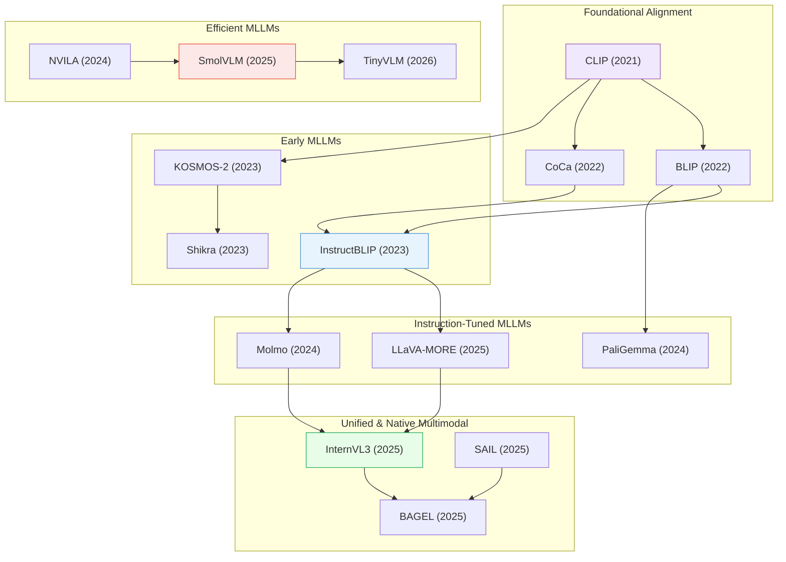

# Multimodal LLMs

> [!abstract] Overview
> Multimodal LLMs extend language models with visual, audio, and other modalities. This topic covers architectures that process and generate across modalities — distinct from [[02_Vision-Language-Models|VLMs]] (which focus on vision-language alignment) and [[01_Foundation-Models]] (which cover the base architectures). The field has evolved from early encoder-decoder designs (BLIP, Flamingo) through instruction-tuned MLLMs (InstructBLIP, LLaVA) to unified native multimodal models (InternVL3, BAGEL) and efficient sub-3B deployments (SmolVLM, TinyVLM).

## Evolution Graph

The field evolved through four phases: **foundational alignment** (2021-2022) where CLIP, BLIP, and CoCa established vision-language pretraining paradigms; **early MLLMs** (2023) where InstructBLIP, KOSMOS-2, and Shikra connected visual encoders to LLMs with instruction tuning and grounding; **instruction-tuned MLLMs** (2024-2025) where LLaVA-MORE, Molmo, and PaliGemma refined the recipe for general-purpose multimodal understanding; and **unified native multimodal + efficient deployment** (2024-2026) where InternVL3 and BAGEL achieved native multi-task generation while SmolVLM and TinyVLM pushed sub-3B parameter efficiency.

| Year | Paper | Contribution |
|------|-------|-------------|
| 2021 | [[2103.00020\|CLIP]] | Contrastive pretraining on 400M image-text pairs; enabled zero-shot visual recognition via natural language |
| 2022 | [[2201.12086\|BLIP]] | Unified vision-language understanding and generation with bootstrapped caption filtering for noisy web data |
| 2022 | [[2205.01917\|CoCa]] | Combined contrastive and generative objectives in a single model with decoupled text decoder |
| 2023 | [[2305.06500\|InstructBLIP]] | Applied instruction tuning to VLMs with instruction-aware visual features; SOTA zero-shot on unseen tasks |
| 2023 | [[2306.14824\|KOSMOS-2]] | Grounded MLLM that perceives and generates bounding boxes as location tokens in natural language |
| 2023 | [[2306.15195\|Shikra]] | Enabled referential dialogue by processing and generating spatial coordinates directly in text output |
| 2024 | [[2407.07726\|PaliGemma]] | Open-source 3B VLM matching larger models across 40 tasks; democratized VLM research |
| 2024 | [[2409.17146\|Molmo]] | Family of open-source MLLMs with state-of-the-art pointing capabilities and transparent training pipeline |
| 2024 | [[2412.04468\|NVILA]] | NVIDIA's efficient MLLM achieving strong performance via visual token compression and structured pruning |
| 2025 | [[2503.15621\|LLaVA-MORE]] | Extended LLaVA with RL-based preference optimization; improved reasoning without sacrificing perception |
| 2025 | [[2504.10479\|InternVL3]] | Native multimodal pre-training with tool-augmented generation; unified understanding and reasoning at scale |
| 2025 | [[2505.14683\|BAGEL]] | Unified multimodal model for interleaved image-text understanding and generation with 7B parameters |
| 2025 | [[2504.10462\|SAIL]] | Search-Augmented Instruction Learning for grounded multimodal reasoning with web knowledge retrieval |
| 2025 | [[2504.05299\|SmolVLM]] | Sub-3B parameter efficient MLLM achieving competitive performance through aggressive architectural optimization |
| 2026 | [[2603.00136\|TinyVLM]] | Ultra-compact MLLM pushing efficiency further with knowledge distillation from larger multimodal models |

---

## 1. Foundational Vision-Language Alignment

The core pretraining paradigms that established how to connect visual encoders with language models — from contrastive alignment to encoder-decoder fusion and multi-modal embedding spaces.

**Contrastive & Dual-Encoder Alignment** — Learning shared image-text embedding spaces through contrastive objectives on large-scale paired data.
- [[2509.01644|OpenVision 2]], [[2507.22062|Meta CLIP 2]], [[2506.03096|FuseLIP]], [[2505.21549|DCLIP]], [[2505.18983|AmorLIP]], [[2505.04601|OpenVision]], [[2505.03703|Modality Gap Reduction]], [[2502.14786|SigLIP 2]], [[2411.04997|LLM2CLIP]], [[2406.17639|AlignCLIP]], [[2212.07143|OpenCLIP]], [[2111.07991|LiT]], [[2103.00020|CLIP]]

> [!star] Key Papers
> - [[2103.00020|CLIP]] — Contrastive pre-training on 400M image-text pairs; launched the VLM era and enabled zero-shot transfer via text prompts
> - [[2502.14786|SigLIP 2]] — Multilingual vision-language encoders integrating decoder-based pretraining with sigmoid loss; advances over original SigLIP
> - [[2507.22062|Meta CLIP 2]] — Transparent, open-sourced methodology for training CLIP on native worldwide web data at scale

**Encoder-Decoder & Generative Alignment** — Architectures that unify contrastive and generative objectives for both understanding and generation.
- [[2602.02381|AdaSSL]], [[2506.16895|STRUCTURE Alignment]], [[2505.11815|UniMoCo]], [[2305.05665|ImageBind]], [[2206.07643|FIBER]], [[2205.01917|CoCa]], [[2201.12086|BLIP]]

> [!star] Key Papers
> - [[2201.12086|BLIP]] — Unified understanding and generation with bootstrapped captioning; self-cleans noisy web data
> - [[2205.01917|CoCa]] — Combined contrastive and generative objectives in a single model with decoupled text decoder
> - [[2305.05665|ImageBind]] — Extended alignment to six modalities (image, text, audio, depth, thermal, IMU) via a single embedding space

**CLIP Variants & Compositional Enhancement** — Improving CLIP's compositional understanding, fine-grained alignment, and domain-specific capabilities.
- [[2512.11141|ItemizedCLIP]], [[2511.13876|QwenCLIP]], [[2508.03102|CCA]], [[2505.20229|CLIP Attribution SAE]], [[2505.02278|GCLIP]], [[2504.16801|DeGLA]], [[2406.14830|CLIP-Decoder]]

> [!star] Key Papers
> - [[2505.02278|GCLIP]] — Training-free method enhancing CLIP's compositional understanding through grounding
> - [[2504.16801|DeGLA]] — Decoupled Global-Local Alignment for compositional VLM understanding
> - [[2511.13876|QwenCLIP]] — Medical vision-language pretraining framework adapting CLIP to clinical domains

> [!success] Three-Layer Alignment Stack
> ==Layer 1: Contrastive pretraining== (CLIP/SigLIP 2) for broad zero-shot transfer → ==Layer 2: Generative alignment== (BLIP/CoCa) for understanding + generation → ==Layer 3: Compositional refinement== ([[2505.02278|GCLIP]], [[2504.16801|DeGLA]]) for fine-grained reasoning. Modern MLLMs inherit all three layers.

> [!tip] The Alignment Stack
> The field converged on a three-layer alignment stack: (1) contrastive pretraining for broad zero-shot transfer (CLIP, SigLIP 2), (2) generative alignment for understanding + generation (BLIP, CoCa), and (3) compositional refinement for fine-grained reasoning (GCLIP, DeGLA). Each layer builds on the previous, and modern MLLMs inherit all three.

---

## 2. Early Multimodal LLMs

The first generation of models that connected visual encoders to large language models, establishing the MLLM paradigm through Q-Former bridges, instruction tuning, and grounded dialogue.

**Pioneering MLLM Architectures** — The initial designs for feeding visual information into frozen or fine-tuned LLMs.
- [[2311.05437|LLaVA-Plus]], [[2309.05519|NExT-GPT]], [[2306.15195|Shikra]], [[2306.14824|KOSMOS-2]], [[2305.14676|GRILL]], [[2305.06500|InstructBLIP]], [[2303.04671|Visual ChatGPT]], [[2211.09699|PromptCap]], [[2204.00598|Socratic Models]]

> [!star] Key Papers
> - [[2305.06500|InstructBLIP]] — Instruction-tuned BLIP-2 with Q-Former; established systematic instruction tuning for vision-language models
> - [[2306.14824|KOSMOS-2]] — Grounded MLLM generating bounding boxes alongside text; first model unifying vision-language understanding with spatial grounding
> - [[2306.15195|Shikra]] — Processes spatial coordinates as natural language tokens for referential dialogue without extra modules

**Region-Level & Grounded Understanding** — Early approaches to fine-grained visual understanding at the region or object level within MLLMs.
- [[2310.11441|SoM]], [[2308.00692|LISA]], [[2307.03601|GPT4RoI]], [[2203.17273|FindIt]], [[2104.12763|MDETR]]

> [!star] Key Papers
> - [[2308.00692|LISA]] — Introduced reasoning segmentation, enabling MLLMs to generate precise segmentation masks from complex language queries
> - [[2310.11441|SoM]] — Set-of-Mark visual prompting: overlays alphanumeric markers on images to unlock GPT-4V's fine-grained grounding

> [!tip] The Q-Former Legacy
> InstructBLIP's Q-Former bridge became the dominant early connector between frozen vision encoders and LLMs. While later work moved toward simpler linear projections (LLaVA) and native multimodal training (InternVL3), the principle of a learnable cross-modal bottleneck persists in modern designs.

---

## 3. Instruction-Tuned & Production MLLMs

The maturation of MLLMs through systematic instruction tuning, scaling to production quality, and comparative studies of different LLM backbones and training recipes.

**Flagship Instruction-Tuned Models** — Full-scale MLLMs trained with instruction-following data across diverse vision-language tasks.
- [[2508.11737|Ovis2.5]], [[2508.01558|EvoVLMA]], [[2507.22448|Falcon-H1]], [[2507.12507|Nemotron]], [[2507.01006|GLM-4.5V]], [[2506.03569|MiMo-VL]], [[2505.18842|v1]], [[2505.07062|Seed1.5-VL]], [[2505.00949|Llama-Nemotron]], [[2504.13180|PerceptionLM]], [[2504.07491|Kimi-VL]], [[2503.15621|LLaVA-MORE]], [[2502.13130|Magma]], [[2410.08202|Mono-InternVL]], [[2409.17146|Molmo]], [[2407.07726|PaliGemma]], [[2603.25040|Intern-S1-Pro]]

> [!star] Key Papers
> - [[2407.07726|PaliGemma]] — Sub-3B parameter VLM achieving SOTA across 40+ tasks; demonstrated small models can match larger counterparts
> - [[2409.17146|Molmo]] — Family of open-weight VLMs with PixMo dataset; competitive with proprietary models while fully open
> - [[2503.15621|LLaVA-MORE]] — Systematic comparative study of MLLM design choices across LLM backbones and training strategies

**Instruction Data & Training Pipelines** — Methods for creating high-quality multimodal instruction data and optimizing training procedures.
- [[2506.08429|SCALE]], [[2505.17316|Patch-Aligned Training]], [[2505.08971|PRIOR]], [[2504.21850|COMPACT]], [[2504.15619|AdaViP]], [[2412.07012|ProVision]], [[2410.02742|GLIMO]], [[2403.13187|EvoLLM-JP]], [[2306.08543|MiniLLM]], [[2302.00674|FLAD]]

> [!star] Key Papers
> - [[2412.07012|ProVision]] — Programmatic system for generating diverse vision-language instruction data at scale
> - [[2504.21850|COMPACT]] — Generates compositionally complex visual instruction tuning data for improved MLLM reasoning
> - [[2506.08429|SCALE]] — Automated pipeline curating high-quality multimodal instruction datasets with LLM-based filtering

**Model Merging & Adaptation** — Combining multiple fine-tuned models or adapting MLLMs to new domains without full retraining.
- [[2603.12248|EBFT]], [[2603.01097|LoRA Knowledge Memory]], [[2602.04118|TinyLoRA]], [[2601.07645|PlaM]], [[2507.11851|Gated LoRA]], [[2505.10088|MMRL++]], [[2505.00315|MoSA]], [[2503.08497|MMRL]], [[2502.17159|RobustMerge]], [[2501.13787|PEFT Survey]], [[2412.01282|Align-KD]], [[2408.07666|Model Merging Survey]], [[2403.14608|PEFT Survey 2024]], [[2312.12148|PEFT Survey]], [[2311.03099|DARE]], [[2306.01708|TIES-Merging]]

> [!star] Key Papers
> - [[2502.17159|RobustMerge]] — Training-free, data-free, storage-free model merging specifically designed for VLMs
> - [[2601.07645|PlaM]] — Training-free model merging preserving complementary knowledge from multiple fine-tuned models

> [!tip] Instruction Tuning is the Key
> The gap between a raw VLM and a usable MLLM is instruction tuning. PaliGemma showed that a well-tuned 3B model beats poorly tuned 13B+ models. The bottleneck has shifted from model size to data quality — SCALE, ProVision, and COMPACT address this directly.

---

## 4. Unified & Native Multimodal Models

A new generation of models trained end-to-end on interleaved multimodal data rather than bolting visual modules onto text-only LLMs, achieving seamless cross-modal understanding and generation.

**Native Multimodal Architectures** — Models pre-trained jointly on vision and language from scratch, eliminating the modular vision encoder + LLM pipeline.
- [[2603.19227|MoTok]], [[2603.15975|UMO]], [[2601.03193|UniCorn]], [[2507.23278|UniLiP]], [[2506.23044|Ovis-U1]], [[2506.17202|UniFork]], [[2506.15564|Show-o2]], [[2505.19223|LLaDA 1.5]], [[2505.16933|LLaDA-V]], [[2505.14683|BAGEL]], [[2504.20996|X-Fusion]], [[2504.17432|UniME]], [[2504.10479|InternVL3]], [[2504.10462|SAIL]], [[2503.20680|VoRA]], [[2503.13436|UniFluid]], [[2502.09992|LLaDA]], [[2501.17811|Janus-Pro]], [[2412.15188|LMFusion]], [[2412.08635|LatentLM]], [[2410.13848|Janus]], [[2409.04429|VILA-U]], [[2408.12528|Show-o]], [[2408.11039|Transfusion]], [[2407.06135|ANOLE]], [[2405.09818|Chameleon]], [[2404.14396|SEED-X]], [[2312.13286|Emu2]]

> [!star] Key Papers
> - [[2504.10479|InternVL3]] — Native multimodal pre-training paradigm jointly acquiring visual and linguistic capabilities; new MLLM SOTA
> - [[2505.14683|BAGEL]] — Open-source unified multimodal foundation model; trained on trillions of interleaved tokens for both understanding and generation
> - [[2503.20680|VoRA]] — Encoder-free MLLM treating visual features as LoRA parameters; eliminates the separate vision encoder entirely

**Multimodal Scaling Laws & Pre-Training** — Understanding how to scale native multimodal models and what training recipes work best.
- [[2603.21191|BST Scaling Rule]], [[2603.15958|Hyperparameter Scaling Laws]], [[2509.26625|LLM Visual Priors]], [[2507.15857|Diffusion vs AR]], [[2507.00994|MLM vs CLM Pretraining]], [[2506.03295|CFT]], [[2505.07291|INTELLECT-2]], [[2504.07951|NMM Scaling Laws]], [[2503.19903|PS3]], [[2502.03275|Token Assorted]], [[2412.18619|Multimodal NTP Survey]]

> [!star] Key Papers
> - [[2504.07951|NMM Scaling Laws]] — First comprehensive study of scaling laws for native multimodal models; shows joint training outperforms modular approaches
> - [[2509.26625|LLM Visual Priors]] — Demonstrates that LLM weights carry useful visual priors before any visual training

**Unified Understanding & Generation** — Models bridging the comprehension-generation gap to handle both tasks in a single framework.
- [[2603.03241|UniG2U-Bench]], [[2602.22766|CapImagine]], [[2601.03193|UniCorn]], [[2506.22880|DeSa2VA]], [[2506.13759|Discrete Diffusion LLM Survey]], [[2403.10191|GenerateU]], [[2305.17216|GILL]]

> [!star] Key Papers
> - [[2601.03193|UniCorn]] — Autonomously bridges comprehension and generation capabilities within a single model
> - [[2506.22880|DeSa2VA]] — Decouples textual and visual generation in MLLMs for improved quality in both

> [!tip] The Native Multimodal Shift
> The field is moving from "LLM + vision encoder" to jointly pre-trained multimodal models. InternVL3 and NMM Scaling Laws demonstrate that native multimodal training outperforms modular assembly. VoRA pushes this further by eliminating the encoder entirely. This trend mirrors how text-only LLMs evolved from pipeline systems to end-to-end models.

---

## 5. Visual Encoding & Feature Integration

How visual information is encoded, projected, and integrated into the language model — from vision encoder design to cross-modal connectors and feature fusion strategies.

**Vision Encoder Design** — Building and improving the visual backbone that feeds MLLMs.
- [[2602.01905|STELLAR]], [[2512.15885|JARVIS]], [[2512.10942|VL-JEPA]], [[2510.21501|GranViT]], [[2507.01643|SAILViT]], [[2507.00754|LUViT]], [[2505.24541|Mixpert]], [[2505.22664|VLM Surrogate Grafting]], [[2505.20802|Leaner Transformers]], [[2505.19985|Structured ViT Initialization]], [[2505.15970|DINOv2 Hierarchy SAE]], [[2504.13181|Perception Encoder]], [[2411.14402|AIMV2]], [[2311.13601|DINOv]], [[2112.11010|MPViT]], [[2111.12941|WinTR]], [[2107.02239|ViX]], [[2107.00641|Focal Transformer]], [[2106.08254|BEiT]]

> [!star] Key Papers
> - [[2411.14402|AIMV2]] — Apple's autoregressive + contrastive pre-training for vision encoders; strong zero-shot transfer
> - [[2504.13181|Perception Encoder]] — Family of vision models achieving SOTA across diverse tasks; designed as universal perception backbone
> - [[2512.10942|VL-JEPA]] — Joint Embedding Predictive Architecture for vision-language; shows latent prediction outperforms reconstruction

**Cross-Modal Connectors & Feature Fusion** — Mechanisms for projecting visual features into the LLM's embedding space.
- [[2603.15619|MoDA]], [[2603.15031|AttnRes]], [[2602.20980|CrystaL]], [[2512.06281|LaVer]], [[2509.07979|VIRAL]], [[2508.12466|Inverse-LLaVA]], [[2506.17629|CLiViS]], [[2506.17608|HIRE]], [[2506.16691|LaVi]], [[2506.04220|Struct2D]], [[2506.01850|MoDA]], [[2504.21447|Shallow ViT Features]], [[2503.06063|Multi-Layer Visual Fusion]], [[2410.13733|Arcana]], [[2403.13043|S2]]

> [!star] Key Papers
> - [[2503.06063|Multi-Layer Visual Fusion]] — Systematic analysis showing multi-layer visual features outperform single-layer for MLLMs
> - [[2504.21447|Shallow ViT Features]] — Demonstrates shallow ViT layers carry critical information that deep layers discard
> - [[2506.01850|MoDA]] — Modulation Adapter dynamically refining pre-aligned visual features for the LLM

**Position Encoding for Vision** — Adapting positional encodings for visual tokens in multimodal contexts.
- [[2601.15275|RayRoPE]], [[2505.21465|ID-Align]], [[2505.20444|HoPE]], [[2505.16416|Circle-RoPE]]

> [!star] Key Papers
> - [[2505.16416|Circle-RoPE]] — Decoupled rotary position encoding for visual and textual tokens; resolves position conflicts in MLLMs
> - [[2601.15275|RayRoPE]] — Projective ray positional encoding for multi-view transformers using 3D geometric priors

**High-Resolution & Multi-Scale Processing** — Handling high-resolution images without losing fine-grained details.
- [[2511.19820|CropVLM]], [[2506.12776|NativeRes-LLaVA]], [[2506.01663|Zoom-Refine]], [[2502.16025|FeatSharp]], [[2412.13871|LLaVA-UHD v2]], [[2412.13303|FastVLM]], [[2207.13050|Efficient High-Resolution Survey]]

> [!star] Key Papers
> - [[2412.13871|LLaVA-UHD v2]] — Hierarchical Window Transformer for native high-resolution MLLM input processing
> - [[2502.16025|FeatSharp]] — Generates sharper high-resolution features from low-resolution vision encoders without retraining

> [!tip] The Feature Integration Bottleneck
> How visual features reach the LLM matters as much as the encoder quality. Multi-Layer Visual Fusion and Shallow ViT Features show that using only the final encoder layer loses critical information. Meanwhile, position encoding (Circle-RoPE, HoPE) is emerging as an underappreciated factor in MLLM visual understanding.

---

## 6. Efficient & Compact MLLMs

Reducing MLLM inference cost through token compression, model compression, and compact architectures designed for resource-constrained deployment.

**Visual Token Reduction** — Dynamically pruning or merging visual tokens to reduce the computational burden of processing images.
- [[2506.10967|CDPruner]], [[2506.07138|STF]], [[2506.01097|Explainability-Guided Token Compression]], [[2505.22654|VScan]], [[2505.16411|SPIN]], [[2504.17040|DyMU]], [[2504.00557|Trimmed Llama]], [[2503.16660|Adaptive Token Reduction]]

> [!star] Key Papers
> - [[2504.17040|DyMU]] — Training-free framework dynamically reducing visual tokens based on image complexity
> - [[2506.10967|CDPruner]] — Training-free token pruning leveraging content-dependency analysis
> - [[2505.22654|VScan]] — Two-stage framework achieving up to 90% visual token reduction with minimal quality loss

**Compact Model Architectures** — Building small but capable MLLMs under 3B parameters for edge deployment.
- [[2603.06569|Penguin-VL]], [[2603.00136|TinyVLM]], [[2504.05299|SmolVLM]], [[2504.00595|Open-Qwen2VL]], [[2412.04468|NVILA]], [[2411.09691|TinyGroundingGPT]]

> [!star] Key Papers
> - [[2504.05299|SmolVLM]] — Family of compact multimodal models (256M-2B) processing images and video; competitive with much larger models
> - [[2603.00136|TinyVLM]] — Zero-shot object detection on microcontrollers; sub-1MB models for edge deployment
> - [[2412.04468|NVILA]] — NVIDIA's efficient MLLM family achieving competitive quality at reduced compute

**Efficient Inference & Acceleration** — Methods for speeding up MLLM inference at deployment time.
- [[2512.13607|Nemotron-Cascade]], [[2508.09834|Efficient LLM Architectures Survey]], [[2508.03682|SQLM]], [[2505.22618|Fast-dLLM]], [[2505.10526|MASSV]], [[2410.19878|PEFT Methodologies Survey]], [[2404.16710|LayerSkip]], [[2009.06732|Efficient Transformers Survey]]

> [!star] Key Papers
> - [[2505.10526|MASSV]] — Speculative decoding framework accelerating VLM inference through multi-head parallel generation

> [!tip] The Efficiency Imperative
> Token reduction is the most impactful lever for MLLM efficiency — VScan and CDPruner achieve 70-90% token reduction with minimal quality loss. For deployment, SmolVLM and TinyVLM show that architecture-level compactness combined with token reduction enables MLLMs on edge devices. The key insight: most visual tokens are redundant for any given query.

---

## 7. Hallucination Mitigation

Addressing the fundamental challenge of MLLMs generating text that contradicts visual evidence — through decoding strategies, contrastive methods, preference optimization, and evaluation frameworks.

**Decoding-Based Methods** — Modifying the generation process to suppress hallucinated content without retraining.
- [[2602.16702|SAP]], [[2602.11737|OA-VCD]], [[2512.23453|CoFi-Dec]], [[2509.23236|Self-Reflection VLM]], [[2509.03113|GACD]], [[2508.11616|MRGD]], [[2507.00898|ONLY]], [[2506.09522|ReVisiT]], [[2506.08391|SECOND]], [[2406.01920|CODE]]

> [!star] Key Papers
> - [[2406.01920|CODE]] — Training-free decoding method reducing hallucination through contrastive output distributions
> - [[2509.03113|GACD]] — Gradient-based influence-aware constrained decoding; first to use gradient information for hallucination mitigation
> - [[2512.23453|CoFi-Dec]] — Coarse-to-fine decoding leveraging geometric consistency for grounded generation

**Visual Attention & Token Intervention** — Steering the model's visual attention to reduce over-reliance on language priors.
- [[2603.14117|SIEVE]], [[2603.00207|VisRef]], [[2602.24041|AIR]], [[2602.21497|ECRD]], [[2602.08241|SAYO]], [[2602.02004|ClueTracer]], [[2509.12132|Reflection-V]], [[2508.02419|TVAI]], [[2507.22003|ViHallu]], [[2506.12609|VisFlow]], [[2505.17812|VaLSe]], [[2505.05177|MARK]], [[2411.12591|VIC]]

> [!star] Key Papers
> - [[2506.12609|VisFlow]] — Dual-level attention intervention redirecting model focus toward relevant visual tokens
> - [[2508.02419|TVAI]] — Identifies modality bias as a root cause of hallucination; proposes targeted visual attention injection

**Visual Prompting Against Hallucination** — Using visual cues and prompts to anchor model outputs in visual evidence.
- [[2601.00659|CRoPS]], [[2510.16596|SHIELD]], [[2506.16112|AutoV]], [[2506.07227|MED]], [[2504.21559|BBVPE]], [[2503.12799|GCoT]]

> [!star] Key Papers
> - [[2504.21559|BBVPE]] — Black-box visual prompt engineering mitigating hallucination without model access
> - [[2601.00659|CRoPS]] — Dynamic cropping strategy forcing models to attend to relevant image regions

**Preference Optimization & Training-Based** — Aligning MLLM outputs with visual ground truth through preference learning and targeted fine-tuning.
- [[2602.22859|DPE]], [[2511.15661|VisPlay]], [[2507.16814|SOPHIA]], [[2506.17901|PostAlign]], [[2506.13888|VL-GenRM]], [[2506.10128|ViCrit]], [[2504.15619|AdaViP]]

> [!star] Key Papers
> - [[2504.15619|AdaViP]] — Adaptive visual preference optimization reducing hallucination through contrastive visual grounding
> - [[2506.17901|PostAlign]] — Post-training alignment framework improving visual fidelity without catastrophic forgetting

**Hallucination Analysis & Benchmarks** — Understanding when, why, and how MLLMs hallucinate.
- [[2601.13304|CausalSpatial]], [[2509.25373|VLM Perception-Cognition Survey]], [[2508.01781|LLM Hallucination Taxonomy]], [[2507.10442|VLM Three-Space Analysis]], [[2505.23224|MMBoundary]], [[2502.17422|MLLM Small Visual Details]], [[2402.00253|LVLM Hallucination Survey]], [[2310.00754|LURE]]

> [!star] Key Papers
> - [[2402.00253|LVLM Hallucination Survey]] — Comprehensive taxonomy of hallucination types in large vision-language models
> - [[2502.17422|MLLM Small Visual Details]] — Reveals fundamental limitations in MLLM perception of small visual details

> [!tip] Defense in Depth
> No single method solves hallucination. The most effective approach combines decoding-time intervention (CODE, GACD) with attention steering (VisFlow, TVAI) and preference alignment (AdaViP). LURE and the LVLM Survey provide the diagnostic framework for understanding which hallucination types affect your specific use case.

---

## 8. Visual Grounding & Spatial Understanding

Enabling MLLMs to localize, reference, and reason about specific objects and regions in images — from bounding box prediction to dense spatial reasoning.

**Grounded MLLMs** — Models that jointly generate text and spatial coordinates for objects.
- [[2511.06908|Mono3DVG-EnSD]], [[2411.09691|TinyGroundingGPT]], [[2410.08021|OneRef]], [[2405.19783|IVM]], [[2405.17104|LLM-Optic]], [[2404.13013|Groma]], [[2401.17981|MLLM Detection Infusion]]

> [!star] Key Papers
> - [[2404.13013|Groma]] — Localized visual tokenizer for robust MLLM visual grounding at the region level
> - [[2405.19783|IVM]] — Instruction-guided visual masking that automatically highlights task-relevant image regions

**Visual Prompting for MLLMs** — Methods for communicating spatial information to MLLMs through visual annotations and markers.
- [[2510.09201|MPO]], [[2506.16112|AutoV]], [[2409.15310|Visual Prompting MLLM Survey]], [[2407.01400|GalLoP]], [[2304.06712|Visual Prompt Engineering]]

> [!star] Key Papers
> - [[2409.15310|Visual Prompting MLLM Survey]] — Comprehensive survey of visual prompting techniques for MLLMs; taxonomizes the field
> - [[2510.09201|MPO]] — Multimodal Prompt Optimizer jointly optimizing textual and visual prompts

**Dense Perception & Tracking** — Fine-grained visual understanding including tracking, referring, and pixel-level grounding.
- [[2603.03857|DeepScan]], [[2512.22799|VPTracker]], [[2510.23603|PixelRefer]], [[2505.23769|TextRegion]], [[2505.20612|RF100-VL]], [[2309.08912|MP-FGVC]]

> [!star] Key Papers
> - [[2510.23603|PixelRefer]] — Unified framework for fine-grained spatiotemporal object understanding in images and videos
> - [[2512.22799|VPTracker]] — Location-aware visual prompting enabling MLLMs for multi-object tracking

**Spatial Reasoning & Scene Understanding** — Going beyond object detection to understand spatial relationships and scene structure.
- [[2602.21619|VSR Information Injection Analysis]], [[2602.15950|VLM Spatial Reasoning OCR]], [[2602.15918|EarthSpatialBench]], [[2602.03916|SpatiaLab]], [[2602.03361|Z3D]], [[2601.22231|PE Spatial Reasoning Analysis]], [[2601.05600|SceneAlign]], [[2601.04777|GeM-VG]], [[2511.21688|G2VLM]], [[2507.00505|LLaVA-SP]], [[2506.21710|FOCUS]], [[2504.15037|MLLM Spatial Reasoning Position Paper]], [[2504.13469|HMPE]], [[2502.11859|VLM Spatial Abilities Benchmark]], [[2411.16044|ZoomEye]], [[2410.06468|SPACE]], [[2406.14852|SpatialEval]], [[2406.02537|TopViewRS]], [[2312.14135|V*]]

> [!star] Key Papers
> - [[2601.05600|SceneAlign]] — Aligns MLLMs with scene-level spatial structure for holistic visual understanding
> - [[2602.15950|VLM Spatial Reasoning OCR]] — Reveals consistent spatial reasoning degradation in VLMs on OCR-related tasks

> [!tip] Grounding as First-Class Capability
> Grounding is no longer an afterthought — KOSMOS-2 and Shikra (Section 2) showed it can be native. The trend is toward models that ground by default (Groma, PixelRefer) rather than requiring external detection modules. For robotics applications, this shift is critical — see [[07_Robotics-and-Embodied-AI]].

---

## 9. Video & Temporal MLLMs

Extending multimodal understanding to video inputs, requiring models to handle temporal dynamics, long-form content, and cross-frame reasoning.

- [[2603.17541|Temporal Trap Analysis]], [[2602.20159|VBVR]], [[2602.05986|RISE-Video]], [[2602.01984|Delimiter Token Scaling]], [[2601.09430|Video-MSR]], [[2507.01544|MARVIS]], [[2506.06279|CoMemo]]

> [!star] Key Papers
> - [[2602.05986|RISE-Video]] — Comprehensive benchmark for evaluating MLLMs on temporal video reasoning
> - [[2602.20159|VBVR]] — Community-curated dataset with over one million video reasoning examples
> - [[2506.06279|CoMemo]] — Dual-path architecture addressing the long-context memory problem in video MLLMs

> [!tip] The Video Frontier
> Video MLLMs remain significantly behind image MLLMs in capability. The core challenge is temporal context — CoMemo and Delimiter Token Scaling address this through specialized memory and multi-frame architectures. RISE-Video and VBVR provide the benchmarks needed to drive progress.

---

## 10. Reasoning & Trustworthiness

Methods for improving MLLM reasoning capabilities and estimating the reliability of model outputs.

**Visual Reasoning** — Enhancing the chain-of-thought and compositional reasoning abilities of MLLMs.
- [[2603.02556|VC-STaR]], [[2602.08346|ThinkWithImages-PRMBENCH]], [[2512.08228|MM-CoT]], [[2511.15703|VLSR]], [[2510.20817|MARA]], [[2510.20607|Compositional Energy Minimization]], [[2510.09312|CRV]], [[2508.02095|VLM4D]], [[2506.11515|Manager]], [[2506.09047|Back-Patching VLM]], [[2506.08011|ViGaL]], [[2506.08008|VLMs Overlook Visual Representations]], [[2506.07218|Perception-R1]], [[2506.04277|RSVP]], [[2505.24025|DINO-R1]], [[2505.23766|Argus]], [[2505.23764|MMSI-Bench]], [[2505.22453|MM-UPT]], [[2505.22334|Multimodal RL Cold Start]], [[2505.21538|PAM-CVR]], [[2505.20753|Griffon-R]], [[2505.20289|VisTA]], [[2505.20164|VAT]], [[2505.19590|INTUITOR]], [[2505.19255|VTool-R1]], [[2505.05626|PERCEPTLLM]], [[2504.18397|UV-CoT]], [[2504.14200|KeCO]], [[2503.16434|Interactive Sketchpad]], [[2502.07503|RINS]], [[2501.13620|VLM Perception-Reasoning Probe]], [[2412.13171|CCoT]], [[2411.10440|LLaVA-CoT]], [[2410.10855|CoreCognition]], [[2406.09403|VisualSketchPad]], [[2404.03622|VoT]], [[2302.00923|Multimodal-CoT]]

> [!star] Key Papers
> - [[2502.07503|RINS]] — Recursive Inference Scaling from Google DeepMind; enhances MLLM performance through iterative self-refinement
> - [[2603.02556|VC-STaR]] — Visual Contrastive Self-Taught Reasoner improving VLM reasoning through contrastive self-training

**Trustworthiness, Safety & Robustness** — Evaluating and improving the reliability of MLLM outputs.
- [[2603.03944|SCP-Bench]], [[2602.21054|VAUQ]], [[2602.01816|VIA-Bench]], [[2601.14127|MIR-SafetyBench]], [[2509.03518|LLM Lying]], [[2506.22982|CroPA]], [[2505.23745|TrustVLM]], [[2504.18053|DREAM]], [[2406.18925|VisArgs]]

> [!star] Key Papers
> - [[2505.23745|TrustVLM]] — Framework estimating prediction trustworthiness by combining internal and external confidence signals
> - [[2602.21054|VAUQ]] — Training-free self-evaluation framework quantifying visual vs. textual reliance in MLLM predictions
> - [[2601.14127|MIR-SafetyBench]] — First benchmark for evaluating safety risks from multi-image reasoning in MLLMs

**Continual & Incremental Learning** — Enabling MLLMs to acquire new knowledge without forgetting prior capabilities.
- [[2602.21628|RuCL]], [[2512.24695|Hope]], [[2512.09441|MoP-CIL]], [[2510.10487|Triangular Consistency]], [[2508.04227|VLM Continual Learning Survey]], [[2410.19925|MLLM Continual Learning]]

**LLM Reasoning & RL Foundations** — Core reasoning, reinforcement learning, and training methods from text-only LLMs that underpin MLLM reasoning capabilities.
- [[2603.25681|LLM Self-Improvement Survey]], [[2603.24422|OneSearch-V2]], [[2603.23355|ReVal]], [[2603.22117|RLVR Direction]], [[2603.18886|RLLM]], [[2603.10160|ReMix]], [[2603.02188|MLRA]], [[2602.23413|EvoX]], [[2602.10675|TwiFF]], [[2602.05547|MT-GRPO]], [[2602.04884|RAL]], [[2602.04879|DPPO]], [[2602.03806|COBALT]], [[2602.02951|NUWA]], [[2602.02710|MaxRL]], [[2602.01058|PEAR]], [[2602.00170|Blessing of Dimensionality LLM]], [[2601.22628|TTCS]], [[2601.19280|GDRO]], [[2601.18631|AdaReasoner]], [[2512.24601|RLMs]], [[2512.14693|URM]], [[2512.12822|LEMON]], [[2512.12633|DiG]], [[2512.10938|Derf]], [[2512.04563|COOPER]], [[2512.03442|PretrainZero]], [[2512.02472|R-FEW]], [[2512.01374|MiniRL]], [[2511.17487|EXTRACT+THINK]], [[2511.17473|MR-RLVR]], [[2511.16652|EGGROLL]], [[2511.07317|RLVE]], [[2511.01758|RLAC]], [[2511.01191|Self-Harmony]], [[2510.26788|FP16 RL Training]], [[2510.26493|Context Engineering 2.0]], [[2510.25992|SRL]], [[2510.25741|Ouro]], [[2510.23925|LaCoT]], [[2510.23596|BR-RM]], [[2510.21223|FDA]], [[2510.18927|BAPO]], [[2510.15242|DWRL]], [[2510.14901|Power Sampling]], [[2510.10603|EA4LLM]], [[2510.09001|DARO]], [[2510.08696|LENS]], [[2510.08673|Puffin]], [[2510.08191|Training-Free GRPO]], [[2510.08189|R-Horizon]], [[2510.07242|HERO]], [[2510.05069|SwiReasoning]], [[2510.03259|MASA]], [[2510.03222|Lp-Reg]], [[2510.02752|Self-Aware RL for LLMs]], [[2510.02263|RLAD]], [[2510.02245|ExGRPO]], [[2510.01265|RLP]], [[2510.01135|PCL]], [[2510.00034|MOWI]], [[2509.26626|RSA]], [[2509.26074|LENS]], [[2509.25849|Knapsack-GRPO]], [[2509.24372|Evolution Strategies at Scale]], [[2509.24251|LVR]], [[2509.22638|FCP]], [[2509.22637|Variational Reasoning]], [[2509.21128|RL Squeezes SFT Expands]], [[2509.20357|RLMT]], [[2509.15194|EVOL-RL]], [[2509.14760|ALIGN3]], [[2509.14252|LLM-JEPA]], [[2509.14234|CaT]], [[2509.11452|Multi-Objective RL Alignment]], [[2509.09284|Tree-OPO]], [[2509.08827|RL for LRM Survey]], [[2509.07980|Parallel-R1]], [[2509.06870|AggLM]], [[2509.06806|MachineLearningLM]], [[2509.04501|GRAPE]], [[2509.04259|RL's Razor]], [[2509.03646|HICRA]], [[2509.02534|Darling]], [[2509.02350|Implicit Reasoning Survey]], [[2509.02333|DCPO]], [[2509.01321|DEPO]], [[2509.00421|Prompt Tuning Memory Limits]], [[2508.17784|PSFT]], [[2508.17445|TreePO]], [[2508.16546|SFT vs RL Spectral Analysis]], [[2508.16204|M2N2]], [[2508.15568|ADAPT]], [[2508.15260|DeepConf]], [[2508.14460|DuPO]], [[2508.14313|AIRL-S]], [[2508.13755|DARS-Breadth]], [[2508.12790|Rubicon]], [[2508.10874|SSRL]], [[2508.09726|GFPO]], [[2508.08221|Lite PPO]], [[2508.05629|DFT]], [[2508.05004|R-Zero]], [[2508.02298|CAPO]], [[2508.02150|Self-Supervised RL IF]], [[2508.02124|DMA]], [[2507.23751|CoT-Self-Instruct]], [[2507.21848|EDGE-GRPO]], [[2507.20673|GMPO]], [[2507.19849|ARPO]], [[2507.18391|IBRO]], [[2507.18074|ASI-ARCH]], [[2507.17746|RaR]], [[2507.17634|WSM]], [[2507.16815|ThinkAct]], [[2507.16806|RLCR]], [[2507.16003|ICL Implicit Dynamics]], [[2507.13334|Context Engineering Survey]], [[2507.10532|RandomCalculation]], [[2507.10524|MoR]], [[2507.10302|DisCo]], [[2507.09662|Concise Adaptive Thinking Survey]], [[2507.08838|wd1]], [[2507.08068|QRPO]], [[2507.07101|Small Batch LLM Training]], [[2507.06203|Latent Reasoning Survey]], [[2507.06187|Delta Learning Hypothesis]], [[2507.02199|Huginn Latent CoT]], [[2507.01679|Prefix-RFT]], [[2507.00432|Math Reasoning Transferability]], [[2507.00417|ASTRO]], [[2506.23235|EndoRM]], [[2506.23061|DyME]], [[2506.22819|TCA]], [[2506.21495|Offline-Online RL for LLMs]], [[2506.18254|RLPR]], [[2506.15211|ProtoReasoning]], [[2506.15050|T-PPO]], [[2506.13923|Guide-GRPO]], [[2506.13018|NN Parameter Space Symmetry Survey]], [[2506.10947|Spurious Rewards RLVR]], [[2506.10943|SEAL]], [[2506.10139|ICM]], [[2506.09477|KL Divergence Gradient Pitfalls]], [[2506.09026|e3]], [[2506.08989|SwS]], [[2506.08552|Latent Reasoning Refinement]], [[2506.08440|TGRPO]], [[2506.08388|RLTs]], [[2506.08007|RPT]], [[2506.07751|AbstRaL]], [[2506.06105|T2L]], [[2506.05316|DOTS]], [[2506.05302|PAM]], [[2506.04374|SLDS LLM Reasoning]], [[2506.04209|LIFT]], [[2506.03637|RewardAnything]], [[2506.02138|PA-LRP]], [[2506.02126|Knowledge vs Reasoning LLM Eval]], [[2506.01939|High-Entropy Token RLVR]], [[2505.24864|ProRL]], [[2505.24760|REASONING GYM]], [[2505.24726|Reflect Retry Reward]], [[2505.24034|LlamaRL]], [[2505.23725|MuLoCo]], [[2505.23585|OPO]], [[2505.22954|DGM]], [[2505.22617|Entropy Collapse in RL]], [[2505.22257|Off-Policy GRPO]], [[2505.21493|VeriFree]], [[2505.21457|ACTIVE-O3]], [[2505.21444|SRT]], [[2505.20686|A*-PO]], [[2505.20561|BARL]], [[2505.20258|ARM]], [[2505.19702|Point-RFT]], [[2505.19094|SATORI]], [[2505.19000|VerIPO]], [[2505.18454|HRPO]], [[2505.17746|Fast Quiet-STaR]], [[2505.17508|RPG]], [[2505.16151|FRANK]], [[2505.15660|AGNOSTOS]], [[2505.12514|COCONUT]], [[2505.10559|Neural Thermodynamic Laws]], [[2505.07956|LLM-LEx]], [[2505.04588|ZeroSearch]], [[2505.03335|Absolute Zero]], [[2505.02665|Slow Thinking LLM Survey]], [[2505.02406|TCPA]], [[2505.02222|Muon]], [[2505.00551|DeepSeek-R1 Replication Survey]], [[2505.00147|AdaptMI]], [[2504.21801|DeepSeek-Prover-V2]], [[2504.21318|Phi-4-reasoning]], [[2504.21233|Phi-4-Mini-Reasoning]], [[2504.20966|Softpick]], [[2504.20595|ReasonIR]], [[2504.20571|1-shot RLVR]], [[2504.19599|GVPO]], [[2504.19254|uqlm]], [[2504.13055|NoisyRollout]], [[2503.24290|Open-Reasoner-Zero]], [[2503.23631|Intrinsic Motivation Human-Agent Study]], [[2503.23383|ToRL]], [[2503.20783|Dr. GRPO]], [[2503.20752|Reason-RFT]], [[2503.19612|AGRO]], [[2503.19470|ReSearch]], [[2503.18866|BoLT]], [[2503.16419|Stop Overthinking Survey]], [[2503.16219|Open-RS]], [[2503.16188|Think or Not Think]], [[2503.14476|DAPO]], [[2503.13551|HRM]], [[2503.12811|MPL]], [[2503.10622|DyT]], [[2503.10460|Light-R1]], [[2503.09567|Long CoT Survey]], [[2503.09516|Search-R1]], [[2503.07572|MRT]], [[2503.05592|R1-Searcher]], [[2503.04412|AB-MCTS]], [[2503.03746|Process-based Self-Rewarding]], [[2502.21321|LLM Post-Training Survey]], [[2502.21074|CODI]], [[2502.16982|Muon]], [[2502.14010|ICL Attention Heads]], [[2502.08922|SCIR]], [[2502.06772|ReasonFlux]], [[2502.05234|TURN]], [[2502.05171|Huginn]], [[2502.03387|LIMO]], [[2501.19393|s1]], [[2501.17161|SFT Memorizes RL Generalizes]], [[2501.11223|RLM Blueprint]], [[2501.09686|Large Reasoning Models Survey]], [[2501.05366|Search-o1]], [[2501.01478|MCTS Process Supervision]], [[2501.00663|Titans]], [[2412.09544|POWER-DL]], [[2412.09413|STILL-2]], [[2412.06769|Coconut]], [[2412.05265|RL Overview]], [[2412.01951|Sharpening Mechanism]], [[2412.00420|TAROT]], [[2411.14405|Marco-o1]], [[2411.14251|NLRL]], [[2405.14838|Stepwise Internalization]], [[2404.14387|LLM Self-Evolution Survey 2024]], [[2403.09629|Quiet-STaR]], [[2401.10020|Self-Rewarding LM]], [[2401.08190|MARIO]], [[2311.12424|Looped Transformers]], [[2310.04406|LATS]], [[2309.15129|CogEval]], [[2309.14322|Transformer Training Instabilities]], [[2309.05858|Mesa-Optimization Transformers]], [[2305.14992|RAP]], [[2303.08128|ViperGPT]], [[2211.12588|PoT]], [[2211.11559|VISPROG]], [[2211.10435|PAL]], [[2210.03629|ReAct]], [[2203.14465|STaR]], [[2201.02373|Mirror Learning]]

**Agents, Self-Evolution & Cross-Topic Foundations** — Agent architectures, self-evolving systems, robotics VLAs, and cross-cutting methods that intersect with MLLM capabilities.
- [[2603.25111|SEVerA]], [[2603.24639|ERL]], [[2603.21383|PivotRL]], [[2603.20278|OpenResearcher]], [[2603.18743|Memento-Skills]], [[2603.17621|Complementary RL]], [[2603.16856|OEL]], [[2603.12056|XSkill]], [[2603.05218|KARL]], [[2603.00461|ReMoT]], [[2603.00142|ToM Multi-Agent Eval]], [[2602.00795|DVLA-RL]], [[2601.19204|MATA]], [[2601.06794|ECHO]], [[2512.13564|AI Agent Memory Survey]], [[2511.20639|LatentMAS]], [[2511.18538|Code Intelligence Survey]], [[2511.16043|Agent0]], [[2511.10395|AgentEvolver]], [[2511.02824|Kosmos AI Scientist]], [[2510.24684|SPICE]], [[2510.23595|MAE]], [[2510.23038|TIR-Judge]], [[2510.16079|EVOLVER]], [[2510.13054|VLA-0]], [[2510.08558|Early Experience]], [[2510.04618|ACE]], [[2510.01132|Multi-turn Agentic RL Guide]], [[2509.25810|RA3]], [[2509.25454|DeepSearch]], [[2509.25140|ReasoningBank]], [[2509.25133|SIREN]], [[2509.24981|ROVER]], [[2509.24726|Socratic-Zero]], [[2509.20021|Embodied AI LLM-WM Survey]], [[2509.19349|ShinkaEvolve]], [[2509.15172|MACA]], [[2509.13351|PDDL-INSTRUCT]], [[2509.07414|LSP]], [[2509.02547|Agentic RL Survey]], [[2509.02479|SimpleTIR]], [[2509.01055|VerlTool]], [[2508.20722|rStar2-Agent]], [[2508.19005|ELL Framework]], [[2508.17692|Agentic Reasoning Survey]], [[2508.13167|CoA]], [[2508.07976|ASearcher]], [[2508.07407|Self-Evolving AI Agents Survey]], [[2508.03923|CoAct-1]], [[2508.03680|Agent Lightning]], [[2508.02085|SE-Agent]], [[2507.23773|SimuRA]], [[2507.23276|AI Scientist Survey]], [[2507.22844|RLVMR]], [[2507.21046|Self-Evolving Agents Survey]], [[2507.20534|Kimi K2]], [[2507.19457|GEPA]], [[2507.14172|SOAR]], [[2507.05707|Agentic-R1]], [[2507.01701|LbMAS]], [[2506.24119|SPIRAL]], [[2506.21539|WorldVLA]], [[2506.13131|AlphaEvolve]], [[2506.09033|Router-R1]], [[2506.07468|SELF-REDTEAM]], [[2506.06499|SPARQ]], [[2506.06122|ROLL]], [[2506.03147|UniWorld-V1]], [[2506.02153|SLMs for Agentic AI]], [[2506.01716|SCA]], [[2505.04769|VLA Survey]], [[2505.04588|ZeroSearch]], [[2504.21024|WebEvolver]], [[2503.22020|CoT-VLA]], [[2503.19263|DWIM]], [[2503.09527|CombatVLA]], [[2412.18072|MMFactory]], [[2412.14164|MetaMorph]], [[2412.13810|CAD-Assistant]], [[2412.03548|AURORA]], [[2411.17673|SketchAgent]], [[2410.16400|VipAct]], [[2410.02355|AlphaEdit]], [[2406.09246|OpenVLA]], [[2406.04151|AgentGym]], [[2406.03303|Learned Visual Prompts for ViT]], [[2405.14093|VLA Survey]], [[2403.13257|MergeKit]], [[2403.06845|DriveDreamer-2]], [[2311.01378|RoboFlamingo]], [[2307.15818|RT-2]]

> [!star] Key Papers
> - [[2410.19925|MLLM Continual Learning]] — Systematic quantification of linguistic forgetting in continually trained MLLMs
> - [[2508.04227|VLM Continual Learning Survey]] — Comprehensive taxonomy of continual learning challenges specific to VLMs

> [!tip] Beyond Accuracy
> MLLM deployment requires more than benchmark scores. TrustVLM and VAUQ address confidence calibration, MIR-SafetyBench covers safety under multi-image inputs, and continual learning (MoP-CIL) ensures models do not degrade as they are updated. These are prerequisites for real-world deployment.

---

## 11. Interpretability & Mechanistic Analysis

Understanding what MLLMs learn internally — which visual features matter, how cross-modal representations are structured, and why models produce specific outputs.

- [[2603.17063|Transformers as Bayesian Networks]], [[2603.07335|VisualScratchpad]], [[2602.15029|Language Symmetry Representations]], [[2602.11217|Magic Correlations]], [[2602.11144|GENIUS]], [[2602.02140|GAPEVAL]], [[2602.00462|LatentLens]], [[2510.02292|VLM-Lens]], [[2506.15679|Dense SAE Latents]], [[2506.11976|VLM Visual-Language Alignment]], [[2506.07326|Reward Model Interpretability]], [[2504.19627|VCM]], [[2502.02013|Layer-by-Layer Representations]], [[2501.09333|Prompt-CAM]]

> [!star] Key Papers
> - [[2602.00462|LatentLens]] — Training-free method interpreting visual token representations layer-by-layer inside MLLMs
> - [[2603.07335|VisualScratchpad]] — Interactive framework using Sparse Autoencoders to analyze and causally test visual features
> - [[2510.02292|VLM-Lens]] — Unified toolkit for systematically extracting and analyzing internal VLM representations

> [!tip] Interpretability Enables Improvement
> LatentLens and VLM-Lens reveal what MLLMs actually attend to, which directly informs hallucination mitigation (Section 7) and feature integration (Section 5). Understanding internal representations is not academic curiosity — it is the diagnostic tool for improving model quality.

---

## 12. Adaptation, Recognition & Retrieval

Applying MLLMs and VLMs to downstream tasks including fine-grained recognition, image-text retrieval, domain adaptation, and specialized applications.

**Fine-Grained Recognition** — Leveraging MLLM capabilities for detailed visual categorization and recognition tasks.
- [[2507.23070|E-FineR]], [[2507.10203|ARL]], [[2507.10202|ECP]], [[2505.20046|REARANK]], [[2505.16149|REVEAL]], [[2505.11192|FALCON]], [[2505.02056|VLM Pseudo-label Calibration]], [[2505.01064|NeaR]], [[2311.04157|INTR]]

> [!star] Key Papers
> - [[2505.01064|NeaR]] — Vocabulary-free fine-grained visual recognition combining MLLM-generated descriptions with retrieval
> - [[2507.23070|E-FineR]] — Fully automated, training-free fine-grained recognition without predefined vocabularies

**Retrieval & Composition** — Methods for image-text retrieval and composed image retrieval using VLMs.
- [[2603.02959|SS-Text-U]], [[2509.01092|REFRAG]], [[2508.04987|UniMoS++]], [[2506.23115|MoCa]], [[2505.19707|MVFT-JI]], [[2503.23508|Real-LOD]], [[2501.05452|ReFocus]]

> [!star] Key Papers
> - [[2505.19707|MVFT-JI]] — Zero-shot composed image retrieval through direct VLM fine-tuning
> - [[2506.23115|MoCa]] — Transforms causal VLMs into bidirectional encoders for robust retrieval

**Specialized Applications** — MLLMs applied to specific domains and unconventional tasks.
- [[2601.12585|MLLM Visualization Literacy]], [[2601.00561|AEGIS]], [[2512.24880|mHC]], [[2511.20836|DSPy+HELM]], [[2511.20814|SPHINX]], [[2511.11007|VisMem]], [[2509.24207|Humanline]], [[2508.13142|EASI]], [[2507.01955|GPT-4o Vision Evaluation]], [[2506.22395|Test-Time VLM Consistency]], [[2505.24189|SLM vs LLM Low-Code Workflows]], [[2505.21497|PosterAgent]], [[2505.11820|CoLM]], [[2505.01812|New News]], [[2403.19103|PRISM]], [[2312.04684|LaRS]], [[2310.10625|VLP]], [[2305.00104|MMViT]], [[2301.05226|IPVR]]

> [!star] Key Papers
> - [[2505.21497|PosterAgent]] — Automated academic poster generation from papers; demonstrates creative MLLM applications
> - [[2601.12585|MLLM Visualization Literacy]] — First taxonomy of visualization literacy barriers in MLLMs

> [!tip] MLLMs as General Visual Assistants
> The fine-grained recognition results (NeaR, E-FineR) show that MLLMs can replace specialized classifiers when paired with the right prompting strategy. For retrieval, MoCa's trick of converting causal models to bidirectional encoders unlocks capabilities that the original training never intended.

---

## 13. Open-Vocabulary Detection with MLLMs

Extending MLLM capabilities to open-vocabulary object detection — detecting objects described by arbitrary text at inference time.

- [[2505.23004|QLIP]], [[2502.17425|VPT]], [[2501.18954|LLMDet]], [[2410.13842|D-FINE]], [[2404.09216|DetCLIPv3]], [[2304.04514|DetCLIPv2]], [[2209.15639|F-VLM]], [[2209.09407|DetCLIP]]

> [!star] Key Papers
> - [[2304.04514|DetCLIPv2]] — End-to-end pre-training for open-vocabulary detection learning directly from large-scale image-text data
> - [[2209.15639|F-VLM]] — Open-vocabulary detection using frozen VLMs with minimal training overhead
> - [[2502.17425|VPT]] — Visual Perception Tokens enabling MLLMs to dynamically attend to detection-relevant regions

> [!tip] Detection Without Boundaries
> Open-vocabulary detection removes the fixed-class bottleneck. DetCLIPv2 and F-VLM show that CLIP-style alignment can drive detection, while VPT demonstrates that MLLMs can be steered toward detection tasks through learned perception tokens. See [[02_Vision-Language-Models]] for the broader open-vocabulary detection landscape.

---

## 14. Surveys & Meta-Analyses

Comprehensive overviews and large-scale analyses of the MLLM field.

- [[2510.09586|VLM Survey 26K]], [[2508.02120|Efficient Reasoning Survey]], [[2501.09223|LLM Foundations]], [[2501.02765|VLLM Survey]], [[2501.02189|VLM Survey 2025]], [[2405.10739|Efficient MLLM Survey]], [[2306.13549|MLLM Survey]], [[2111.06091|Visual Transformers Survey]], [[2012.12556|Visual Transformer Survey]]

> [!star] Key Papers
> - [[2306.13549|MLLM Survey]] — First comprehensive synthesis of the MLLM field covering architectures, training, and evaluation
> - [[2405.10739|Efficient MLLM Survey]] — Categorizes efficiency techniques across the full MLLM pipeline
> - [[2510.09586|VLM Survey 26K]] — Quantitative meta-analysis of 26,104 papers from top-tier AI conferences; maps the VLM research landscape

> [!tip] Navigating the Literature
> With 26K+ VLM papers across three years of top conferences, surveys are essential navigation aids. Start with the MLLM Survey (2023) for foundations, then the VLM Survey 2025 for recent advances, and the Efficient MLLM Survey for deployment-oriented work.

---

## Cross-References

- [[01_Foundation-Models]] — Backbone architectures (ViT, DINO, CLIP)
- [[02_Vision-Language-Models]] — Vision-language alignment, prompt learning, open-vocabulary detection
- [[03_Reasoning-and-Planning]] — Reasoning capabilities built on MLLMs
- [[05_Computer-Vision-and-3D]] — 3D and spatial understanding
- [[07_Robotics-and-Embodied-AI]] — MLLMs as perception backbone for VLAs
- [[12_Diffusion-and-Generation]] — Generation models that complement MLLM understanding

---

*Next: [[10_Agents-and-Tool-Use]] for how MLLMs are deployed as autonomous agents.*
