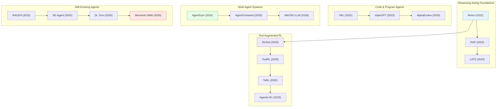

# Agents & Tool Use

> [!abstract] Overview
> AI agents that reason, plan, and use tools to accomplish multi-step tasks. This topic covers the full arc from ReAct-style reasoning-acting loops (2022) through RL-trained tool-using agents (2025) to self-evolving multi-agent systems (2026). The field has matured along several axes: single-turn to multi-turn, fixed tools to tool creation, single-agent to multi-agent orchestration, and handcrafted prompting to reinforcement-learned agentic behavior.

## Evolution Graph

The field evolved through five threads: **reasoning-acting foundations** (2022-2023) where ReAct, RAP, and LATS established think-act-observe loops with increasing search sophistication; **code agents** (2022-2025) where PAL and ViperGPT delegated computation to code, scaling to AlphaEvolve's autonomous algorithm discovery; **tool-augmented RL** (2025) where ReTool, ToolRL, ToRL, and Agentic-R1 replaced prompted tool use with learned policies; **multi-agent systems** (2024-2026) where AgentGym, AgentOrchestra, and MACRO-LLM moved from single agents to coordinated teams; and **self-evolving agents** (2025-2026) where RAGEN, SE-Agent, Dr. Zero, and Memento-Skills enabled agents that autonomously improve from experience.

| Year | Paper | Contribution |
|------|-------|-------------|
| 2022 | [[2210.03629\|ReAct]] | Synergized reasoning and acting in a think-act-observe loop; launched the LLM agent paradigm |
| 2022 | [[2211.10435\|PAL]] | Program-aided Language Models offloading computation to a Python interpreter; separated reasoning from calculation |
| 2023 | [[2305.14992\|RAP]] | Treated the LLM as its own world model for lookahead planning within reasoning-acting loops |
| 2023 | [[2310.04406\|LATS]] | Language Agent Tree Search unifying reasoning, acting, and planning through MCTS over action spaces |
| 2023 | [[2303.08128\|ViperGPT]] | LLM generates Python programs orchestrating vision modules; composable zero-shot visual reasoning |
| 2024 | [[2406.04151\|AgentGym]] | Multi-environment agent evolution via behavioral cloning + self-evolution for generalist agents |
| 2025 | [[2506.13131\|AlphaEvolve]] | Google DeepMind combining LLMs with evolutionary search to autonomously discover algorithms |
| 2025 | [[2504.11536\|ReTool]] | ByteDance's RL framework enabling LLMs to dynamically decide when to invoke tools during reasoning |
| 2025 | [[2504.13958\|ToolRL]] | Novel reward shaping for tool-use RL; meticulously designed rewards guide optimal tool invocation |
| 2025 | [[2503.23383\|ToRL]] | Scaling tool-integrated RL; trains LLMs to autonomously learn when and how to use tools |
| 2025 | [[2507.05707\|Agentic-R1]] | DualDistill framework training language models as tool-using agents via distillation and RL |
| 2025 | [[2506.12508\|AgentOrchestra]] | TEA protocol for unified multi-agent management and task orchestration |
| 2025 | [[2504.20073\|RAGEN]] | Multi-turn RL training for LLM agents; established the paradigm for sustained agent-environment interaction |
| 2025 | [[2508.02085\|SE-Agent]] | Self-evolutionary framework optimizing multi-step agent behavior through autonomous self-improvement |
| 2026 | [[2601.09295\|MACRO-LLM]] | Macro-level multi-agent coordination for complex, multi-step LLM workflows |
| 2026 | [[2601.07055\|Dr. Zero]] | Meta's framework enabling search agents to self-evolve without human-provided training data |
| 2026 | [[2603.18743\|Memento-Skills]] | Skill library as external memory for continual learning; agents store and retrieve reusable skills |

---

## 1. ReAct-Style & Agentic Reasoning

The foundational paradigm for LLM agents: interleaving reasoning traces with environment actions in think-act-observe loops. These methods established that LLMs could autonomously plan and execute multi-step tasks, not just answer questions.

**Reasoning-Acting Loops** — The core think-act-observe pattern that grounds LLM reasoning in real environment feedback, enabling self-correcting multi-step execution.
- [[2507.23773\|SimuRA]], [[2507.06261\|Gemini 2.5]], [[2410.08328\|Talker-Reasoner]], [[2310.04406\|LATS]], [[2309.15129\|CogEval]], [[2305.14992\|RAP]], [[2210.03629\|ReAct]]

> [!star] Key Papers
> - [[2210.03629\|ReAct]] — Synergizing reasoning and acting: the foundational think-act-observe loop that launched all modern LLM agents
> - [[2310.04406\|LATS]] — Language Agent Tree Search: unifies reasoning, acting, and planning through MCTS over action spaces
> - [[2305.14992\|RAP]] — Treats the LLM as its own world model, enabling lookahead planning within the reasoning-acting framework

**Agentic Reasoning Surveys & Taxonomies** — Comprehensive reviews mapping the rapidly evolving landscape of LLM-based agents, establishing conceptual frameworks and evaluation methodologies.
- [[2603.22862\|LLM Tool Use Survey]], [[2601.12538\|Agentic Reasoning Survey]], [[2512.16301\|Agentic AI Adaptation Survey]], [[2509.02547\|Agentic RL Survey]], [[2508.17692\|Agentic Reasoning Survey]], [[2508.07407\|Self-Evolving AI Agents Survey]], [[2507.23276\|AI Scientist Survey]], [[2507.21046\|Self-Evolving Agents Survey]], [[2505.10468\|AI Agents vs Agentic AI]], [[2504.18875\|Generative to Agentic AI Survey]], [[2504.09037\|LLM Reasoning Frontiers Survey]], [[2503.23037\|Agentic LLM Survey]], [[2503.16416\|LLM Agent Eval Survey]], [[2410.16392\|Scaffolded LM Survey]], [[2310.08367\|MCU]]

> [!star] Key Papers
> - [[2505.10468\|AI Agents vs Agentic AI]] — Cornell taxonomy distinguishing AI agents (autonomous entities) from agentic AI (design pattern); essential conceptual clarity
> - [[2509.02547\|Agentic RL Survey]] — Formal definition of agentic RL for LLMs using Partially Observable Markov Decision Processes

> [!tip] ReAct Set the Pattern
> ReAct's think-act-observe loop remains the default skeleton for nearly all LLM agents. LATS and RAP refined the search strategy (tree search, world-model planning), but the core loop is unchanged. When designing a new agent, start with ReAct and add structure as needed.

---

## 2. Code Agents & Program-Aided Reasoning

Agents that generate and execute code as their primary action modality. Instead of reasoning in natural language alone, these systems write programs to offload computation, compose vision modules, or perform scientific discovery.

**Program-Aided Reasoning** — LLMs generate executable code to handle computation, separating logical reasoning from arithmetic and procedural execution.
- [[2604.10929\|Ro-SLM]], [[2509.25810\|RA3]], [[2503.01619\|Flame]], [[2401.08190\|MARIO]], [[2211.12588\|PoT]], [[2211.10435\|PAL]]

> [!star] Key Papers
> - [[2211.10435\|PAL]] — Program-aided Language Models: offload computation to a Python interpreter, separating reasoning from calculation
> - [[2211.12588\|PoT]] — Program of Thoughts prompting: LLMs delegate numerical reasoning to code execution

**Visual Programming & Compositional Code** — Composing vision-and-language modules into executable programs for visual reasoning, enabling training-free compositional problem-solving.
- [[2603.22435\|CaP-X]], [[2601.05344\|Im2Sim]], [[2512.03746\|CodeVision]], [[2511.19661\|CodeV]], [[2508.11630\|Thyme]], [[2507.20766\|RRVF]], [[2505.10557\|MathCoder-VL]], [[2303.08128\|ViperGPT]], [[2211.11559\|VISPROG]]

> [!star] Key Papers
> - [[2303.08128\|ViperGPT]] — Compose vision modules via Python programs for visual reasoning without any training
> - [[2211.11559\|VISPROG]] — Neuro-symbolic visual programming: executable step-by-step programs from natural language queries
> - [[2512.03746\|CodeVision]] — Code-as-tool framework equipping MLLMs with dynamically generated visual processing code

**Autonomous Code Discovery & Evolution** — Agents that autonomously discover algorithms, evolve code solutions, or benchmark AI coding capabilities at scale.
- [[2604.01193\|SSD Code Generation]], [[2603.16790\|InCoder-32B]], [[2601.18067\|EvolVE]], [[2511.18538\|Code Intelligence Survey]], [[2509.19349\|ShinkaEvolve]], [[2506.22419\|LLM Speedrunning Benchmark]], [[2506.13131\|AlphaEvolve]]

> [!star] Key Papers
> - [[2506.13131\|AlphaEvolve]] — Google DeepMind combines LLMs with evolutionary search to autonomously discover algorithms, finding new mathematical results
> - [[2511.18538\|Code Intelligence Survey]] — Comprehensive synthesis of LLMs for automated software development across the full model lifecycle

> [!tip] Code Beats Language for Computation
> PAL and PoT proved that LLMs should not do arithmetic -- they should write code that does arithmetic. ViperGPT extended this to vision: compose perception modules via programs. The pattern generalizes: whenever reasoning involves precise computation or systematic search, delegate to code.

---

## 3. Tool-Augmented Reasoning & RL

Training LLMs to learn when and how to invoke external tools through reinforcement learning, rather than relying on handcrafted prompting. This section covers the transition from prompted tool use to learned tool-use policies.

**RL-Trained Tool Use** — Reinforcement learning frameworks that train LLMs to autonomously decide when to call tools, which tools to use, and how to integrate tool outputs into reasoning chains.
- [[2509.02479\|SimpleTIR]], [[2509.01055\|VerlTool]], [[2505.04588\|ZeroSearch]], [[2505.00024\|Nemotron-Research-Tool-N1]], [[2504.20595\|ReasonIR]], [[2504.13958\|ToolRL]], [[2504.11536\|ReTool]], [[2504.04736\|SWiRL]], [[2503.23383\|ToRL]], [[2503.19470\|ReSearch]], [[2503.09516\|Search-R1]], [[2503.05592\|R1-Searcher]], [[2501.05366\|Search-o1]], [[2412.14835\|AR-MCTS]]

> [!star] Key Papers
> - [[2504.11536\|ReTool]] — ByteDance's RL framework enabling LLMs to dynamically decide when to invoke tools during reasoning
> - [[2504.13958\|ToolRL]] — Novel reward shaping for tool-use RL; meticulously designed rewards guide optimal tool invocation
> - [[2503.23383\|ToRL]] — Scaling tool-integrated RL: trains LLMs to autonomously learn when and how to use tools

**Agentic Tool Integration Frameworks** — Unified frameworks that combine reasoning, tool invocation, and multi-step planning into coherent agent architectures.
- [[2603.23483\|SpecEyes]], [[2512.17312\|CodeDance]], [[2509.07969\|Mini-o3]], [[2508.12109\|Simple o3]], [[2507.05707\|Agentic-R1]], [[2505.05177\|MARK]], [[2505.01441\|ARTIST]], [[2504.21776\|WebThinker]]

> [!star] Key Papers
> - [[2505.01441\|ARTIST]] — Microsoft Research unifies agentic reasoning, dynamic tool integration, and RL training in a single framework
> - [[2507.05707\|Agentic-R1]] — DualDistill framework training language models as tool-using agents via distillation and RL

**Visual Tool Use & Adaptive Tool Selection** — Methods enabling vision-language models to select and invoke visual tools (detectors, segmenters, editors) on demand during reasoning.
- [[2603.17729\|SARE]], [[2601.13942\|GoG]], [[2512.16918\|AdaTooler-V]], [[2512.10359\|STAR]], [[2511.20085\|VICoT-Agent]], [[2510.27363\|ToolScope]], [[2510.09733\|EVisRAG]], [[2509.01656\|ReV PT]], [[2508.04416\|VITAL]], [[2505.08617\|OpenThinkIMG]], [[2503.19263\|DWIM]], [[2412.18072\|MMFactory]], [[2412.13810\|CAD-Assistant]], [[2412.05479\|LATTE]]

> [!star] Key Papers
> - [[2412.05479\|LATTE]] — Trains open-source VLMs to integrate external tools for complex multimodal reasoning
> - [[2512.16918\|AdaTooler-V]] — MLLM that adaptively decides when external vision tools are needed; RL-trained selective tool invocation
> - [[2505.08617\|OpenThinkIMG]] — Open-source framework for interleaved visual tool use during reasoning

**Knowledge Distillation for Tool Use** — Transferring advanced tool-use capabilities from large frontier models to smaller, deployable agents without expensive RL training.
- [[2506.15692\|MLE-STAR]], [[2506.14728\|AgentDistill]]

> [!star] Key Papers
> - [[2506.14728\|AgentDistill]] — Training-free distillation of tool-use capabilities from large to small models
> - [[2506.15692\|MLE-STAR]] — LLM agent automating machine learning engineering by leveraging web search and tool composition

> [!tip] From Prompted to Learned Tool Use
> Early agents used handcrafted prompts to invoke tools (ReAct, Toolformer). ReTool, ToolRL, and ToRL showed that RL can learn tool-use policies that surpass prompting. The key insight: tool invocation is a decision problem, and RL is better at decision problems than prompting.

---

## 4. Multi-Turn & RL-Trained Agents

Agents trained via reinforcement learning for multi-turn interactions with environments, moving beyond single-call tool use to sustained, stateful task execution across many steps.

**Multi-Turn RL Training** — Frameworks and systematic guides for training LLM agents that maintain state and adapt strategy across extended multi-turn interactions.
- [[2603.21383\|PivotRL]], [[2510.15047\|SPA]], [[2510.01132\|Multi-turn Agentic RL Guide]], [[2508.03680\|Agent Lightning]], [[2507.19849\|ARPO]], [[2506.06122\|ROLL]], [[2505.03181\|AFSFT]], [[2504.20073\|RAGEN]], [[2404.08233\|GPBT-PL]]

> [!star] Key Papers
> - [[2504.20073\|RAGEN]] — Multi-turn RL training for LLM agents; establishes the training paradigm for sustained agent-environment interaction
> - [[2510.01132\|Multi-turn Agentic RL Guide]] — Systematic practical guide from UCSD and NVIDIA for training multi-turn LLM agents
> - [[2508.03680\|Agent Lightning]] — Microsoft Research decouples RL training from inference, enabling scalable agent training

**Verifiable Reasoning & Meta-Reasoning** — Agents that verify their own reasoning steps, use meta-cognitive strategies, or integrate judges for reliable multi-step execution.
- [[2511.01833\|TIR-Bench]], [[2510.23038\|TIR-Judge]], [[2510.08191\|Training-Free GRPO]], [[2509.15172\|MACA]], [[2508.10874\|SSRL]], [[2507.22844\|RLVMR]]

> [!star] Key Papers
> - [[2507.22844\|RLVMR]] — Verifiable meta-reasoning rewards improve long-horizon agent performance by rewarding sound reasoning process, not just outcomes
> - [[2510.23038\|TIR-Judge]] — LLM judge framework integrating tool-invoked reasoning for reliable multi-step evaluation

**Dynamic Planning & Adaptive Agents** — Agents that dynamically revise plans during execution, adapting to unexpected observations rather than following fixed scripts.
- [[2512.24601\|RLMs]], [[2508.20722\|rStar2-Agent]], [[2507.19457\|GEPA]], [[2507.11988\|Aime]], [[2507.08664\|INoT]], [[2203.03485\|Self-directed Exploratory Planning]]

> [!star] Key Papers
> - [[2507.11988\|Aime]] — ByteDance multi-agent framework overcoming static planning limitations with dynamic plan revision
> - [[2508.20722\|rStar2-Agent]] — Microsoft's agentic reasoning model enabling LLMs to "think slow" with structured deliberation over action spaces
> - [[2512.24601\|RLMs]] — Recursive Language Models: inference-time paradigm for iterative computation within a single forward pass

> [!tip] Multi-Turn Is the Real Challenge
> Single-turn tool calls are largely solved. The frontier is multi-turn: agents that maintain state, recover from errors, and adapt strategy over 10-100 steps. RAGEN and the Multi-turn RL Guide show that standard RL techniques need significant modification for this setting -- reward sparsity, credit assignment, and state tracking are all harder.

---

## 5. Web Agents & GUI Interaction

Agents that operate in real digital environments -- browsing the web, interacting with GUIs, and completing tasks in applications. These bridge language understanding with pixel-level perception and action.

**Web Navigation & Browsing Agents** — Agents that navigate websites, fill forms, and complete multi-step web tasks by combining visual perception with action planning.
- [[2512.23676\|WWM]], [[2510.19245\|See Think Act Shopper]], [[2508.07976\|ASearcher]], [[2504.21024\|WebEvolver]]

> [!star] Key Papers
> - [[2512.23676\|WWM]] — Princeton's Web World Models: a new architectural paradigm where agents build predictive models of web environments for planning
> - [[2510.19245\|See Think Act Shopper]] — VLM-driven framework simulating online shopping tasks end-to-end

**GUI & Multi-Application Agents** — Agents that interact with graphical user interfaces across multiple applications, combining screen understanding with structured actions.
- [[2604.11201\|CocoaBench]], [[2604.06126\|Gym-Anything]], [[2603.24533\|UI-Voyager]], [[2508.09736\|M3-Agent]], [[2508.03923\|CoAct-1]]

> [!star] Key Papers
> - [[2508.03923\|CoAct-1]] — Multi-agent framework integrating both GUI interactions and direct programmatic API access
> - [[2508.09736\|M3-Agent]] — ByteDance's multimodal agent processing continuous video and GUI streams for real-time task completion

> [!tip] Web Agents Need World Models
> WWM's key insight: web agents that build predictive models of what happens next (like a chess engine) outperform reactive agents that just observe and act. The web is a partially observable environment, and planning beats reacting.

---

## 6. Multi-Agent Systems & Orchestration

Systems where multiple LLM agents collaborate, specialize, or compete. Multi-agent architectures enable division of labor, debate-based reasoning, and scalable task decomposition that single agents cannot achieve.

**Multi-Agent Frameworks & Orchestration** — Architectures for coordinating multiple specialized agents, managing communication, and distributing tasks across agent teams.
- [[2604.01658\|CORAL]], [[2601.23265\|PaperBanana]], [[2601.19204\|MATA]], [[2601.09295\|MACRO-LLM]], [[2508.13167\|CoA]], [[2507.01701\|LbMAS]], [[2506.12508\|AgentOrchestra]], [[2504.16129\|MARFT]], [[2504.01990\|Foundation Agents Survey]]

> [!star] Key Papers
> - [[2504.01990\|Foundation Agents Survey]] — Brain-inspired comprehensive framework integrating diverse LLM agent research areas
> - [[2506.12508\|AgentOrchestra]] — TEA protocol (Tool-Environment-Agent) for unified multi-agent management and task orchestration
> - [[2504.16129\|MARFT]] — Multi-Agent Reinforcement Fine-Tuning: RL-based optimization of LLM multi-agent systems

**Latent Communication & Emergent Coordination** — Agents that communicate through learned latent representations rather than natural language, enabling more efficient multi-agent collaboration.
- [[2601.10825\|Societies of Thought]], [[2511.20639\|LatentMAS]], [[2410.17517\|Maynard-Cross Learning]]

> [!star] Key Papers
> - [[2511.20639\|LatentMAS]] — Agents collaborate through latent-space communication rather than verbose natural language exchanges
> - [[2601.10825\|Societies of Thought]] — Reveals how advanced LLMs implicitly implement multi-agent "society of mind" reasoning internally

**Co-Evolution & Group Dynamics** — Multiple agents that evolve together, with competitive or cooperative dynamics driving collective improvement beyond what individual agents achieve.
- [[2602.08234\|SkillRL]], [[2602.04837\|GEA]], [[2601.09667\|MATTRL]], [[2510.23595\|MAE]], [[2506.24119\|SPIRAL]], [[2007.07853\|gamma-Progress]]

> [!star] Key Papers
> - [[2602.04837\|GEA]] — Group-Evolving Agents: agents co-evolve in groups, with emergent specialization and collective capability growth
> - [[2601.09667\|MATTRL]] — Multi-Agent Test-Time Reinforcement Learning from MIT/NUS/Microsoft; agents coordinate adaptation at inference time

> [!tip] Multi-Agent as Scaling Strategy
> Multi-agent systems offer a different scaling axis than bigger models: instead of more parameters, use more specialized agents. AgentOrchestra and MARFT show this works in practice. The key challenge is coordination cost -- LatentMAS addresses this by replacing verbose text communication with compact latent messages.

---

## 7. Memory, Planning & Self-Evolution

Agents that accumulate experience over time, build persistent memory, and autonomously improve their own capabilities. This represents the frontier where agents become self-evolving systems.

**Skill Libraries & External Memory** — Agents that maintain persistent skill repositories or memory banks, enabling them to reuse learned capabilities across tasks without retraining.
- [[2604.04503\|MIA]], [[2604.02268\|SKILL0]], [[2604.01007\|Omni-SimpleMem]], [[2603.29493\|MemFactory]], [[2603.24639\|ERL]], [[2603.18743\|Memento-Skills]], [[2603.12056\|XSkill]], [[2603.05218\|KARL]], [[2512.23167\|SPIRAL]], [[2512.13564\|AI Agent Memory Survey]], [[2509.25140\|ReasoningBank]], [[2603.25723|Natural-Language Agent Harnesses]], [[2603.24517|AVO]], [[2509.23285|Tool-Light]]

> [!star] Key Papers
> - [[2603.18743\|Memento-Skills]] — Skill library as external memory for continual learning; agents store and retrieve reusable skills without weight updates
> - [[2603.05218\|KARL]] — Knowledge agent via off-policy RL for grounded reasoning over enterprise knowledge bases

**Self-Evolving Agent Frameworks** — Agents that autonomously improve their own strategies, prompts, or tool-use policies through self-reflection and iterative optimization.
- [[2604.15034\|Autogenesis]], [[2604.06268\|RAGEN-2]], [[2604.04872\|SandMLE]], [[2604.04247\|Combee]], [[2604.03098\|Self-Guide]], [[2604.01687\|EvoSkills]], [[2603.25111\|SEVerA]], [[2603.19461\|HyperAgents]], [[2603.17621\|Complementary RL]], [[2603.15255\|SAGE]], [[2602.06130\|SWIRL]], [[2602.00359\|A-EVOLVE]], [[2601.07055\|Dr. Zero]], [[2601.06794\|ECHO]], [[2601.03872\|ATLAS]], [[2512.18552\|SSR]], [[2511.16043\|Agent0]], [[2511.10395\|AgentEvolver]], [[2511.00758\|ATM]], [[2510.16079\|EVOLVER]], [[2510.08558\|Early Experience]], [[2510.04618\|ACE]], [[2509.26354\|Misevolution]], [[2509.24726\|Socratic-Zero]], [[2508.19005\|ELL Framework]], [[2508.04700\|SEAgent]], [[2508.02085\|SE-Agent]], [[2507.19457\|GEPA]], [[2506.01716\|SCA]], [[2505.22954\|DGM]], [[2409.00872\|SAGE]]

> [!star] Key Papers
> - [[2508.02085\|SE-Agent]] — Self-evolutionary framework optimizing multi-step agent behavior through autonomous self-improvement
> - [[2505.22954\|DGM]] — Darwin Godel Machine: AI system that autonomously improves its own code through Darwinian evolution
> - [[2601.07055\|Dr. Zero]] — Meta's framework enabling search agents to self-evolve without human-provided training data

**Routing, Composition & Model Selection** — Meta-agents that dynamically select, compose, or route between multiple models and tools to match task requirements.
- [[2603.20278\|OpenResearcher]], [[2601.03872\|ATLAS]], [[2512.24330\|SenseNova-MARS]], [[2507.20534\|Kimi K2]], [[2506.09033\|Router-R1]], [[2403.13257\|MergeKit]]

> [!star] Key Papers
> - [[2506.09033\|Router-R1]] — RL-trained router that learns to dispatch queries to the optimal model or tool combination
> - [[2512.24330\|SenseNova-MARS]] — SenseTime's multimodal agentic reasoning and search system integrating diverse tools and models

> [!tip] Memory Makes the Agent
> Without persistent memory, an agent is just a stateless function call. Memento-Skills and KARL show that external skill/knowledge storage is the missing piece: agents that remember and reuse past solutions improve logarithmically with experience, while memoryless agents plateau.

---

## 8. Multimodal & Embodied Agents

Agents that process visual, spatial, and multi-sensory inputs alongside language, enabling interaction with physical and visual environments beyond text-only tasks.

**Multimodal Agent Architectures** — Integrated architectures combining vision-language understanding with agent capabilities for complex multimodal tasks.
- [[2604.10096\|ABot-Claw]], [[2604.07774\|RoboAgent]], [[2604.05484\|CoEnv]], [[2604.04664\|ROSClaw]], [[2604.03016\|Agentic-MME]], [[2603.29620\|Unify-Agent]], [[2603.24558\|LensWalk]], [[2603.22179\|MARCUS]], [[2601.03054\|IBISAgent]], [[2512.08511\|SubagentVL]], [[2506.16895\|STRUCTURE Alignment]], [[2505.21549\|DCLIP]], [[2505.21533\|SOP]], [[2505.19707\|MVFT-JI]], [[2505.03703\|Modality Gap Reduction]], [[2504.14988\|FG-BMK]], [[2503.23508\|Real-LOD]], [[2503.01776\|CSR]], [[2411.17673\|SketchAgent]], [[2403.12884\|HYDRA]], [[2402.15116\|LMA Survey]], [[2311.05437\|LLaVA-Plus]], [[2303.04671\|Visual ChatGPT]], [[2301.11915\|Part-Aware SSL]], [[2205.01917\|CoCa]], [[2201.12086\|BLIP]]

> [!star] Key Papers
> - [[2402.15116\|LMA Survey]] — Systematic review of Large Multimodal Agents deconstructing their core components and capabilities
> - [[2403.12884\|HYDRA]] — Multi-stage dynamic compositional visual reasoning integrating an RL agent as cognitive controller
> - [[2311.05437\|LLaVA-Plus]] — Training VLMs to learn when and how to use external visual tools for any task

**VLM Fine-Tuning & Reinforcement for Agency** — Methods for fine-tuning vision-language models via RL to act as agents in visual environments.
- [[2511.19900\|Agent0-VL]], [[2510.22832\|HRM-Agent]], [[2507.07998\|PyVision]], [[2505.14246\|Visual-ARFT]], [[2405.10292\|VLM-RL Fine-Tuning]], [[2604.08545|Metis]]

> [!star] Key Papers
> - [[2405.10292\|VLM-RL Fine-Tuning]] — Directly fine-tuning VLMs with RL for agentic visual tasks; bridges perception and action
> - [[2505.14246\|Visual-ARFT]] — Reinforcement fine-tuning framework for visual agents from Shanghai AI Lab

**Spatial Intelligence & Geometry Grounding** — Agents that reason about 3D space, geometric relationships, and physical structure for grounded problem-solving.
- [[2603.15386\|RieMind]], [[2504.09848\|LLM Spatial Intelligence Survey]], [[2408.16662\|Space3D-Bench]]

> [!star] Key Papers
> - [[2504.09848\|LLM Spatial Intelligence Survey]] — Comprehensive survey examining how LLMs enable spatial intelligence across domains
> - [[2603.15386\|RieMind]] — Geometry-grounded agentic framework decoupling spatial reasoning into interpretable geometric operations

**Scientific & Research Agents** — Agents designed for autonomous scientific research, from literature review to experiment design and execution.
- [[2603.29557\|FlowPIE]], [[2603.26499\|AIRA2]], [[2601.10402\|ML-Master 2.0]], [[2511.02824\|Kosmos AI Scientist]], [[2506.02153\|SLMs for Agentic AI]], [[2505.16938\|InternAgent]]

> [!star] Key Papers
> - [[2505.16938\|InternAgent]] — Unified closed-loop multi-agent system for fully autonomous scientific research
> - [[2511.02824\|Kosmos AI Scientist]] — Multi-agent architecture with structured world knowledge for autonomous scientific discovery
> - [[2506.02153\|SLMs for Agentic AI]] — NVIDIA/Georgia Tech argument that Small Language Models are optimal for deployable agentic systems

> [!tip] Vision Is the Missing Sense
> Most LLM agents are "blind" -- they operate on text APIs. Multimodal agents like HYDRA and M3-Agent show that adding visual perception dramatically expands the task space (GUI interaction, scientific visualization, physical manipulation). The bottleneck has shifted from architecture to training data for visual agency.

---

## Cross-References

- [[03_Reasoning-and-Planning]] — Reasoning foundations for agents (CoT, search, planning)
- [[04_Reinforcement-Learning]] — RL training methods powering agent learning
- [[11_Self-Evolving-AI]] — Self-improving and continually learning agents
- [[07_Robotics-and-Embodied-AI]] — Embodied agents in physical environments
- [[09_Multimodal-LLMs]] — Multimodal foundations for visual agents
- [[08_Benchmarks-and-Surveys]] — Agent evaluation benchmarks

---

*Next: [[11_Self-Evolving-AI]] for self-improving systems that build on agentic foundations.*
