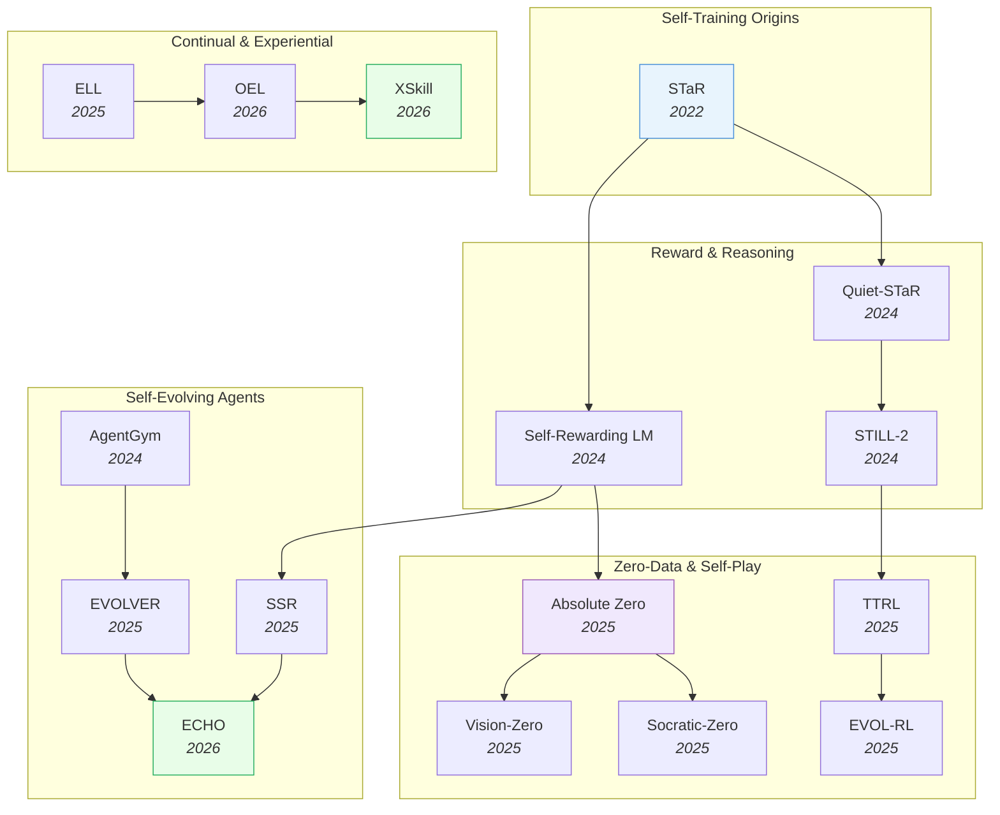

# Self-Evolving AI

> [!abstract] Overview
> AI systems that improve themselves through experience — from self-taught reasoning (STaR) to self-evolving agents (EvoAgent) to self-improving world models (SPIRAL). This topic bridges RL, continual learning, and meta-learning into autonomous self-improvement. The field has matured from simple bootstrapping loops (2022) to fully autonomous, zero-data self-play systems (2025-2026).

## Evolution Graph

The field evolved through five threads: **self-training origins** (2022) where STaR established iterative rationale bootstrapping; **reward and reasoning** (2024) where Self-Rewarding LM, Quiet-STaR, and STILL-2 added self-judging and slow-thinking; **zero-data and self-play** (2025) where Absolute Zero, TTRL, EVOL-RL, Socratic-Zero, and Vision-Zero eliminated human data entirely; **self-evolving agents** (2024-2026) where AgentGym, EVOLVER, SSR, and ECHO scaled self-improvement to multi-step agent behavior; and **continual experiential learning** (2025-2026) where ELL, OEL, and XSkill added persistent memory for lifelong improvement.

| Year | Paper | Contribution |
|------|-------|-------------|
| 2022 | [[2203.14465\|STaR]] | Pioneered iterative self-improvement: generate rationales, keep correct ones, retrain; the self-training flywheel |
| 2024 | [[2401.10020\|Self-Rewarding LM]] | Single model acts as both generator and judge via iterative DPO; broke the human-feedback bottleneck |
| 2024 | [[2403.09629\|Quiet-STaR]] | Extended STaR to think before every token via internal rationales; generalized to token-level self-training |
| 2024 | [[2412.09413\|STILL-2]] | Open-source framework reproducing o1-like slow-thinking; distillation + RL pipeline for chain-of-thought |
| 2024 | [[2406.04151\|AgentGym]] | Multi-environment agent evolution via behavioral cloning + self-evolution for generalist agents |
| 2025 | [[2505.03335\|Absolute Zero]] | Zero-data self-play: model proposes tasks, solves, verifies via code, and retrains with no human data |
| 2025 | [[2504.16084\|TTRL]] | Proved LLMs can self-improve on unlabeled test data via majority-vote rewards; 211% on AIME 2024 |
| 2025 | [[2509.15194\|EVOL-RL]] | Evolutionary RL preventing entropy collapse in label-free self-improvement; balances selection and novelty |
| 2025 | [[2509.24726\|Socratic-Zero]] | Data-free Socratic dialogue where the model debates itself to improve reasoning without any environment |
| 2025 | [[2509.25541\|Vision-Zero]] | Extended the zero-data self-play paradigm to Vision-Language Models via gamified self-play |
| 2025 | [[2510.16079\|EVOLVER]] | Agents distill raw interaction trajectories into strategic principles; experience-driven lifecycle |
| 2025 | [[2512.18552\|SSR]] | Meta's Self-play SWE-RL: agents generate learning experiences from real codebases; +10.4 on SWE-bench |
| 2025 | [[2508.19005\|ELL Framework]] | Experience-driven Lifelong Learning framework and StuLife benchmark for continual self-improvement |
| 2026 | [[2601.06794\|ECHO]] | Policy and environment co-evolve: harder challenges as policy improves, and vice versa |
| 2026 | [[2603.16856\|OEL]] | Microsoft's Online Experiential Learning: LLMs continuously learn from deployment without forgetting |
| 2026 | [[2603.12056\|XSkill]] | Dual-stream framework for continual learning from visually-grounded experience; cross-task skill transfer |

---

## 1. Self-Training & Bootstrapping

The original self-improvement paradigm: models generate their own training data by sampling reasoning chains, filtering correct ones, and retraining on successes. Each iteration bootstraps quality beyond the original training distribution. This is the foundation on which all later self-evolving methods build.

**Iterative Rationale Bootstrapping** — Generate candidate reasoning traces, keep the ones that reach correct answers, retrain, repeat. The simplest form of self-improvement, requiring only a verifier (ground-truth or model-based).
- [[2604.12002|SD-ZERO]], [[2506.00467|SST]], [[2504.08672|Genius]], [[2403.09629|Quiet-STaR]], [[2203.14465|STaR]]

> [!star] Key Papers
> - [[2203.14465|STaR]] — Pioneered iterative self-improvement: generate rationales, keep correct ones, retrain; each round improves reasoning beyond the original distribution
> - [[2403.09629|Quiet-STaR]] — Extended STaR to think before every token, not just prompted questions; implicit self-reasoning at every position
> - [[2504.08672|Genius]] — Purely unsupervised self-training without external labels; uses self-generated solutions as implicit reward signal

**Self-Rewarding & Self-Judging** — Models learn to evaluate their own outputs, creating an internal reward signal that replaces human annotators. The model is simultaneously generator and judge, enabling iterative DPO or RL without external feedback.
- [[2508.03682|Self-Questioning LM]], [[2503.03746|Process-based Self-Rewarding]], [[2502.08922|SCIR]], [[2412.01951|Sharpening Mechanism]], [[2401.10020|Self-Rewarding LM]], [[2309.16797|Promptbreeder]]

> [!star] Key Papers
> - [[2401.10020|Self-Rewarding LM]] — Single model acts as both instruction-follower and judge via iterative DPO; breaks the human-feedback bottleneck
> - [[2503.03746|Process-based Self-Rewarding]] — Extends self-rewarding from outcome-level to step-level process rewards; finer-grained self-supervision
> - [[2412.01951|Sharpening Mechanism]] — Formalizes self-improvement as "sharpening": theoretical framework explaining when and why self-training converges

**Slow-Thinking & Test-Time Reasoning** — Train models to use extended reasoning chains at inference time (o1-style), where longer thinking leads to better answers. Self-improvement happens by learning to allocate more compute to harder problems.
- [[2511.01191|Self-Harmony]], [[2509.26626|RSA]], [[2503.18866|BoLT]], [[2501.01478|MCTS Process Supervision]], [[2412.09413|STILL-2]]

> [!star] Key Papers
> - [[2412.09413|STILL-2]] — Open-source framework reproducing o1-like slow-thinking; distillation + RL pipeline for chain-of-thought enhancement
> - [[2501.01478|MCTS Process Supervision]] — Uses Monte Carlo Tree Search to generate fine-grained process supervision signals without human annotation
> - [[2503.18866|BoLT]] — "Reasoning to Learn": models use test-time reasoning chains as training signal, closing the loop between inference and learning

> [!tip] The Self-Improvement Ladder
> Start with STaR (simple self-training) --> add self-judging (Self-Rewarding LM) --> extend to process rewards (Process-based Self-Rewarding) --> scale with slow-thinking (STILL-2/BoLT). Each rung removes a human bottleneck.

---

## 2. Zero-Data & Self-Play RL

The most radical branch of self-evolution: models that improve with zero human-curated data. They either generate their own training problems (Absolute Zero), derive reward from consensus (TTRL), or use evolutionary self-play (EVOL-RL). This eliminates the last human bottleneck — the training dataset itself.

**Task Self-Generation** — The model both proposes and solves its own problems, using only a code executor or environment for verification. No human data at any stage.
- [[2604.14144|SpatialEvo]], [[2603.09206|MM-Zero]], [[2509.25541|Vision-Zero]], [[2509.24726|Socratic-Zero]], [[2506.24119|SPIRAL]], [[2506.08989|SwS]], [[2506.06499|SPARQ]], [[2506.00103|Writing-Zero]], [[2505.03335|Absolute Zero]]

> [!star] Key Papers
> - [[2505.03335|Absolute Zero]] — The defining paper: model proposes tasks, solves them, verifies via code execution, and retrains; SOTA on coding and math with literally zero human data
> - [[2509.24726|Socratic-Zero]] — Data-free Socratic dialogue where the model debates itself to improve reasoning; no environment needed
> - [[2509.25541|Vision-Zero]] — Extends the zero-data paradigm to Vision-Language Models via gamified self-play

**Label-Free RL on Test Data** — Apply reinforcement learning directly on unlabeled test distributions, using self-consistency (majority voting) as the reward signal.
- [[2510.02752|Self-Aware RL for LLMs]], [[2509.15194|EVOL-RL]], [[2505.24726|Reflect Retry Reward]], [[2504.16084|TTRL]]

> [!star] Key Papers
> - [[2504.16084|TTRL]] — Proved LLMs can self-improve on unlabeled test data via majority-vote rewards; 211% improvement on AIME 2024
> - [[2509.15194|EVOL-RL]] — Evolutionary RL that prevents entropy collapse in label-free self-improvement; balances selection pressure with novelty-driven diversity

**Self-Play & Multi-Agent Competition** — Multiple model instances compete or cooperate, driving improvement through adversarial pressure or consensus-seeking dynamics.
- [[2603.15255|SAGE]], [[2510.24684|SPICE]], [[2510.23595|MAE]], [[2509.15172|MACA]], [[2509.07414|LSP]], [[2506.07468|SELF-REDTEAM]]

> [!star] Key Papers
> - [[2509.07414|LSP]] — Language Self-Play from Meta: models improve through self-play dialogue without external reward models

**Hyperparameter & Sampling Self-Optimization** — Meta-level self-improvement: models learn to optimize their own inference parameters (temperature, sampling strategy) rather than just their weights.
- [[2510.02263|RLAD]], [[2502.05234|TURN]]

> [!star] Key Papers
> - [[2502.05234|TURN]] — Automatically discovers near-optimal sampling temperature for self-improvement; removes a key manual tuning step
> - [[2510.02263|RLAD]] — Models self-discover high-level reasoning abstractions and learn to apply them; meta-cognitive self-improvement

> [!tip] The Zero-Data Frontier
> Absolute Zero and TTRL proved the concept; EVOL-RL solved the entropy collapse problem. The next challenge is scaling zero-data self-play to open-ended domains beyond math and code, where verification is harder.

---

## 3. Curriculum Learning & Adaptive Training

Self-evolving systems need to practice on the right problems at the right difficulty. These methods automatically generate, select, and sequence training data so that each batch maximally improves the model — adaptive curricula that co-evolve with the learner.

**Adaptive Difficulty & Reweighting** — Dynamically adjust which training examples the model sees based on current capability, focusing compute on problems at the frontier of what the model can almost solve.
- [[2512.02472|R-FEW]], [[2510.09001|DARO]], [[2510.01135|PCL]], [[2504.13161|Nemotron-CLIMB]], [[2504.05520|ADARFT]]

> [!star] Key Papers
> - [[2504.05520|ADARFT]] — Adaptive curriculum for RLVR that selects training problems matching the model's current capability frontier
> - [[2510.09001|DARO]] — Dynamic reweighting for RL with verifiable rewards; prevents the model from wasting compute on too-easy or too-hard problems

**Self-Evolving Curricula** — The curriculum itself evolves: a synthesizer or environment generates new, capability-aligned challenges as the model improves, creating an unbounded supply of training signal.
- [[2601.22628|TTCS]], [[2512.06835|DoGe]], [[2511.07317|RLVE]], [[2505.14970|SEC]], [[2502.05726|ACCEL]], [[1901.01753|POET]]

> [!star] Key Papers
> - [[2505.14970|SEC]] — Self-Evolving Curriculum: the training data distribution co-evolves with the model, ensuring the curriculum never becomes stale
> - [[2511.07317|RLVE]] — Procedurally generates an unbounded supply of verifiable environments; the challenges grow as the model grows

**Multimodal & Reasoning Curricula** — Curriculum strategies specifically designed for vision-language models or multi-stage reasoning pipelines.
- [[2509.14234|CaT]], [[2507.22607|VL-Cogito]]

> [!star] Key Papers
> - [[2507.22607|VL-Cogito]] — Progressive curriculum for VLMs that sequences visual reasoning tasks from simple to complex
> - [[2509.14234|CaT]] — Compute as Teacher: uses more capable model runs to generate supervision for less capable configurations; compute itself becomes the curriculum

> [!tip] Curriculum as Co-Evolution
> The most effective curricula are not pre-designed but co-evolve with the model. SEC and RLVE show that an adaptive problem generator paired with the learner outperforms any fixed dataset, no matter how large.

---

## 4. Self-Evolving Agents

When self-improvement meets agentic AI: systems that autonomously explore environments, accumulate experience, distill lessons, and evolve their own capabilities across tasks. These go beyond single-turn reasoning to multi-step, tool-using, environment-interacting agents that learn from deployment.

**Agent Self-Evolution Frameworks** — End-to-end frameworks where agents improve by interacting with diverse environments, distilling experience into reusable strategies, and iterating.
- [[2604.18292|Agent-World]], [[2604.15034|Autogenesis]], [[2604.07799|ECM]], [[2604.01658|CORAL]], [[2603.19461|HyperAgents]], [[2603.08561|RetroAgent]], [[2603.04029|Self-Adapting RL]], [[2602.00359|A-EVOLVE]], [[2511.16166|EvoVLA]], [[2511.00758|ATM]], [[2510.20685|C-Nav]], [[2510.16079|EVOLVER]], [[2510.12710|Reflective Self-Adaptation]], [[2510.08558|Early Experience]], [[2510.04618|ACE]], [[2509.19349|ShinkaEvolve]], [[2508.04700|SEAgent]], [[2507.13152|SE-VLN]], [[2506.21669|SEEA-R1]], [[2506.01716|SCA]], [[2409.00872|SAGE]], [[2406.04151|AgentGym]]

> [!star] Key Papers
> - [[2604.18292|Agent-World]] — ByteDance/Renmin's framework unifying real-world environment synthesis with continuous self-evolution; 14B agent evaluated on 23 benchmarks, with average tool-use scores more than doubling as environment diversity scales from 0 to 1,978
> - [[2406.04151|AgentGym]] — Multi-environment agent evolution via behavioral cloning + self-evolution (AGENTEVOL); showed agents can generalize across diverse tasks
> - [[2510.16079|EVOLVER]] — Agents distill raw interaction trajectories into strategic principles; experience-driven lifecycle closes the self-improvement loop
> - [[2506.01716|SCA]] — Self-Challenging Agent: generates its own hard problems to practice on, driving continuous capability growth

**Co-Evolutionary & Multi-Agent** — Multiple agents or model components (policy + environment, actor + critic) evolve together, each improving the other in a virtuous cycle.
- [[2603.28386|COvolve]], [[2603.17621|Complementary RL]], [[2603.08403|SPIRAL]], [[2602.23413|EvoX]], [[2602.20057|AdaWorldPolicy]], [[2601.10402|ML-Master 2.0]], [[2601.06794|ECHO]], [[2510.26433|CoLA-World]], [[2509.03771|Co-Evolving MARL]], [[2507.16518|C2-Evo]], [[2506.23468|NavMorph]], [[2504.21024|WebEvolver]], [[2502.05907|EvoAgent]], [[2302.01877|AdaptDiffuser]]

> [!star] Key Papers
> - [[2601.06794|ECHO]] — Policy and environment co-evolve: the environment generates harder challenges as the policy improves, and vice versa

**Self-Play for Software Engineering** — Agents that generate, solve, and verify coding tasks through self-play on real codebases, autonomously creating training signal from software repositories.
- [[2512.18552|SSR]], [[2507.14172|SOAR]]

> [!star] Key Papers
> - [[2512.18552|SSR]] — Meta's Self-play SWE-RL: agents autonomously generate learning experiences from real codebases; +10.4 on SWE-bench Verified without human issue descriptions
> - [[2507.14172|SOAR]] — Self-improving operators for automated program refinement; LLMs iteratively improve their own code transformations

> [!tip] From Models to Agents
> Self-improving models optimize weights; self-evolving agents optimize behavior. The key difference is persistent experience: EVOLVER and ACE show that distilling interaction history into reusable principles is what turns a self-improving model into a self-evolving agent.

---

## 5. Self-Evolving Embodied AI

When self-evolution meets physical agents: VLAs, WAMs, and robots that autonomously discover failure modes, generate new experience, and improve through real-world or simulated interaction. The embodied setting adds unique challenges — physical safety, sensor noise, and the cost of real-world data collection — making world-model-based imagination particularly valuable.

**Self-Evolving VLAs** — VLAs that improve through RL post-training, continual learning, or self-play without requiring an explicit world model.
- [[2603.09030|PlayWorld]], [[2603.11653|VLA RL Continual Learning]], [[2603.03818|VLA Continual Learning]], [[2512.14666|EVOLVE-VLA]], [[2511.16166|EvoVLA]], [[2602.10503|Long-Lived Robots]], [[2602.03445|CRL-VLA]], [[2602.21633|Self-Correcting VLA]]

> [!star] Key Papers
> - [[2511.16166|EvoVLA]] — Self-evolving VLA framework that overcomes stage hallucination and fragile memory; the first end-to-end self-evolving VLA
> - [[2603.03818|VLA Continual Learning]] — Showed pre-trained VLAs are naturally resistant to catastrophic forgetting; simple sequential fine-tuning works

**Self-Evolving WAMs** — World models that autonomously improve through imagination, self-play, or co-evolution with their policy. The world model generates synthetic experience, enabling self-improvement without costly real-world interaction.
- [[2603.19370|VAMPO]], [[2603.08403|SPIRAL]], [[2509.19292|SOE]], [[2506.23468|NavMorph]], [[2504.21024|WebEvolver]], [[2503.01584|SENSEI]], [[2502.05907|EvoAgent]], [[2401.16650|WMAR]]

> [!star] Key Papers
> - [[2603.08403|SPIRAL]] — Closed-loop self-improvement for action world models via reflective planning; the system critiques its own failures and adapts
> - [[2502.05907|EvoAgent]] — Self-evolving agent with continual world model; self-planning + self-control + self-reflection achieves +105% improvement on long-horizon tasks
> - [[2603.19370|VAMPO]] — RL optimization of visual dynamics in video action models via GRPO; bridges world model quality and action quality

**Self-Evolving Robots & Navigation** — Embodied agents that discover their own failure modes and improve through real-world or simulated experience, combining exploration, curiosity, and RL.
- [[2604.07392|ERA]], [[2506.21669|SEEA-R1]], [[2510.12693|ERA]], [[2507.13152|SE-VLN]], [[2508.04700|SEAgent]], [[2603.04029|Self-Adapting RL]], [[2602.20057|AdaWorldPolicy]]

> [!star] Key Papers
> - [[2506.21669|SEEA-R1]] — Tree-structured RL for self-evolving embodied agents; +24% via MCTS + generative reward
> - [[2603.04029|Self-Adapting RL]] — World model residuals detect OOD states, triggering targeted self-adaptation

**Self-Discovery & Failure Detection** — Before self-evolution can happen, the agent must detect WHERE and WHY it's failing. These methods enable the detection step.
- [[2604.02965|SV-VLA]], [[2603.13528|Counterfactual Failure Synthesis]], [[2601.02295|CycleVLA]], [[2512.24426|CF-VLA]], [[2512.01119|WM Surprise Robustness]], [[2511.14148|AsyncVLA]], [[2510.09459|FIPER]], [[2510.01642|FailSafe]], [[2509.16072|I-FailSense]], [[2509.04018|FPC-VLA]], [[2506.09937|SAFE]], [[2505.12224|RoboFAC]], [[2412.02818|RoboMD]], [[2410.00371|AHA]], [[2409.03966|VLM Failure Recovery]], [[2503.01584|SENSEI]], [[2005.05960|Plan2Explore]], [[1705.05363|ICM]], [[2404.00756|Recover]]

> [!star] Key Papers
> - [[2510.09459|FIPER]] — Runtime failure prediction combining OOD detection with action uncertainty; predicts failures before they happen
> - [[2412.02818|RoboMD]] — RL adversary that actively discovers policy failure modes; finds what the agent can't do

> [!tip] Self-Evolving VLA vs Self-Evolving WAM
> VLAs self-evolve via RL fine-tuning (no world model needed) — simple, fast, and surprisingly resistant to forgetting. WAMs self-evolve via imagination loops — richer but more complex. The two converge when a VLA gains a world model: VLAW and VLA-JEPA + self-evolution represent this frontier.

---

## 6. Meta-Learning & Self-Adaptation

Learning to learn: models that adapt their own learning process, discover optimization algorithms, or rapidly adjust to new tasks from minimal data. While self-training improves outputs, meta-learning improves the learning procedure itself.

**Meta-Reinforcement Learning** — Agents that learn an RL algorithm implicitly through experience, enabling rapid adaptation to new reward structures without retraining from scratch.
- [[2309.05858|Mesa-Optimization Transformers]], [[2301.08028|Meta-RL Tutorial]], [[2210.05639|DPO]], [[2112.15402|RER]], [[2604.11768|GC-PFO]]

> [!star] Key Papers
> - [[2301.08028|Meta-RL Tutorial]] — Definitive survey structuring the meta-RL landscape: context-based, task-inference, and black-box approaches
> - [[2309.05858|Mesa-Optimization Transformers]] — Mechanistic explanation of how Transformers implicitly learn optimization algorithms (mesa-optimization) in-context

**Self-Adapting Language Models** — LLMs that generate their own fine-tuning data and adaptation strategies, optimizing internal parameters without external supervision.
- [[2604.06169|In-Place TTT]], [[2510.03259|MASA]], [[2506.10943|SEAL]]

> [!star] Key Papers
> - [[2506.10943|SEAL]] — Models autonomously generate optimized fine-tuning data and adaptation strategies; outperforms GPT-4.1-generated synthetic data
> - [[2510.03259|MASA]] — Meta-Awareness via Self-Alignment: RL framework enabling models to develop self-awareness of their own capabilities and limitations

**Few-Shot Object Detection** — Meta-learning applied to visual recognition: learn to detect new object categories from very few examples by leveraging learned priors.
- [[2401.07629|FPD]], [[1909.13032|Meta R-CNN]], [[1908.01998|Attention-RPN]]

> [!star] Key Papers
> - [[1909.13032|Meta R-CNN]] — General meta-learning framework for few-shot detection; class-attentive vectors modulate features per novel category
> - [[2401.07629|FPD]] — Fine-grained prototype distillation from mid-level features; state-of-the-art few-shot detection

> [!tip] Meta-Learning vs Self-Training
> Self-training improves answers; meta-learning improves the learning algorithm. SEAL and MASA represent the convergence: models that meta-learn how to self-train more effectively.

---

## 7. Vision-Language Model Self-Improvement

Extending self-evolution beyond text-only LLMs to multimodal models that process both images and text. VLMs face unique challenges: hallucination, visual grounding errors, and cross-modal consistency — requiring self-improvement methods tailored to multimodal reasoning.

**Hallucination Reduction via Self-Consistency** — VLMs detect and correct their own hallucinations by checking internal consistency across different modalities or question framings.
- [[2603.02556|Through the Lens of Contrast]], [[2510.24285|ViPER]], [[2510.10487|Triangular Consistency]], [[2509.23236|Self-Reflection VLM]]

> [!star] Key Papers
> - [[2509.23236|Self-Reflection VLM]] — Uses binary self-consistency signals to reduce hallucinations without external supervision
> - [[2510.10487|Triangular Consistency]] — Cross-checks visual, textual, and reasoning outputs for mutual consistency; self-refinement through multi-modal agreement

**Multimodal Self-Evolution Frameworks** — End-to-end pipelines for VLM self-improvement covering data generation, training, and evaluation across vision-language tasks.
- [[2602.22859|From Blind Spots to Gains]], [[2601.03193|UniCorn]], [[2510.10606|ViSurf]], [[2510.02665|MLLM Self-Improvement Survey]], [[2509.15155|Self-Improving EFM]], [[2508.19652|Self-Rewarding VLM]], [[2508.12137|Fine-Grained VLM Tuning]], [[2507.16663|MLLM Self-Improvement]], [[2412.17451|M-STAR]], [[2410.08202|Mono-InternVL]]

> [!star] Key Papers
> - [[2412.17451|M-STAR]] — Self-evolving training framework for large multimodal models; iterative self-improvement across vision-language benchmarks
> - [[2510.02665|MLLM Self-Improvement Survey]] — First comprehensive survey of self-improvement methods for multimodal LLMs; maps the taxonomy and open challenges

> [!tip] The Multimodal Gap
> Text-only self-improvement is well-understood (STaR, Absolute Zero). The frontier is extending these methods to vision-language models, where verification is harder and hallucination is the central failure mode. Vision-Zero and M-STAR point the way.

---

## 8. Continual & Experiential Learning

Self-evolution over time: systems that accumulate knowledge from ongoing experience without catastrophic forgetting. While sections 1-4 focus on improving within a training run, continual learning ensures improvements persist across deployment episodes and new environments.

**Experience-Driven Lifelong Learning** — Agents that build persistent memory banks of experiences and learn to retrieve and apply relevant past knowledge to new situations.
- [[2604.15814|Continual Hand-Eye Calibration]], [[2604.13074|PersonaVLM]], [[2604.11306|Hierarchical Episodic Memory]], [[2604.10892|HECTOR]], [[2604.10096|ABot-Claw]], [[2604.04503|MIA]], [[2604.01007|Omni-SimpleMem]], [[2603.24350|Emergent Self]], [[2603.16856|OEL]], [[2602.10503|Long-Lived Robots]], [[2512.24695|Hope]], [[2512.09441|MoP-CIL]], [[2510.04618|ACE]], [[2509.25140|ReasoningBank]], [[2508.19005|ELL Framework]], [[2507.10434|CLA]], [[2507.09177|Online Agent (OA)]], [[2411.13852|ESRM]], [[2402.15109|MU-Mis]], [[2305.13622|SER]], [[2211.15944|Continual-Dreamer]]

> [!star] Key Papers
> - [[2508.19005|ELL Framework]] — Experience-driven Lifelong Learning: introduces the framework and StuLife benchmark for measuring continual self-improvement in realistic settings
> - [[2603.16856|OEL]] — Microsoft's Online Experiential Learning: LLMs continuously learn from deployment interactions without forgetting prior knowledge
> - [[2509.25140|ReasoningBank]] — Memory-aware test-time scaling: stores and retrieves reasoning patterns for efficient reuse across problems

**Multimodal Continual Skill Acquisition** — Agents that continually learn new skills from visual and language grounding, building an expanding repertoire without losing prior capabilities.
- [[2604.08532|SelfEvo]], [[2603.18743|Memento-Skills]], [[2603.17621|Complementary RL]], [[2603.12056|XSkill]], [[2603.07648|AtomicVLA]], [[2602.03445|CRL-VLA]], [[2511.18085|Stellar VLA]], [[2504.21024|WebEvolver]], [[2504.18471|AFM]]

> [!star] Key Papers
> - [[2603.12056|XSkill]] — Dual-stream framework for continual learning from visually-grounded experience; skills transfer across tasks and modalities

**Safety & Alignment Under Self-Evolution** — Investigating and mitigating the risks that arise when models evolve autonomously, including value drift, capability misalignment, and emergent unsafe behaviors.
- [[2512.05356|Co-Improving AI]], [[2509.26354|Misevolution]], [[2506.07468|SELF-REDTEAM]]

> [!star] Key Papers
> - [[2509.26354|Misevolution]] — Identifies "misevolution" as a novel safety risk: self-evolving models can drift from intended values during autonomous improvement
> - [[2506.07468|SELF-REDTEAM]] — Self-adversarial testing to catch safety regressions during evolution; the model red-teams itself after each improvement cycle

> [!tip] The Forgetting Problem
> Self-improvement without continual learning is a leaky bucket. ELL and OEL show that persistent experience memory is essential — otherwise, gains from one round of self-improvement are lost when the model encounters a new domain.

---

## 9. Surveys & Theoretical Foundations

Comprehensive reviews and theoretical analyses that map the self-evolving AI landscape, formalize when self-improvement converges, and identify open challenges.

- [[2603.25681|LLM Self-Improvement Survey]] — Unified closed-loop lifecycle framework for LLM self-improvement; covers data acquisition, selection, optimization, inference, and evaluation
- [[2404.14387|LLM Self-Evolution Survey 2024]] — Structured taxonomy of self-evolution approaches: self-training, self-rewarding, RL-based, and evolutionary methods
- [[2510.02665|MLLM Self-Improvement Survey]] — First survey focused on multimodal LLM self-improvement; maps methods from text to vision-language
- [[2412.01951|Sharpening Mechanism]] — Theoretical framework formalizing when and why self-improvement converges; identifies conditions for guaranteed improvement
- [[2408.07666|Model Merging Survey]] — Comprehensive survey of model merging methods for combining knowledge across fine-tuned models
- [[2504.13173|Miras]] — Unified framework connecting test-time memorization, attentional bias, retention, and online optimization
- [[2506.21872|Continual RL Survey]] — Survey of continual reinforcement learning methods across environments and tasks
- [[2507.21046|Self-Evolving Agents Survey]] — Comprehensive survey on self-evolving LLM-based agents
- [[2508.04227|VLM Continual Learning Survey]] — Taxonomy of continual learning challenges specific to vision-language models
- [[2508.07407|Self-Evolving AI Agents Survey]] — Survey on self-evolving AI agent architectures and methods
- [[2602.04411|Self-evolving Embodied AI]] — Survey on self-evolving systems in embodied AI settings
- [[2601.10679|Are Reasoning Models Reasoning or Guessing]] — Mechanistic analysis of whether self-improving reasoning models truly develop hierarchical reasoning
- [[2603.15381|Autonomous Learning Framework]] — Lessons from cognitive science on why AI systems don't learn autonomously and how to address it

> [!tip] Starting Points
> New to self-evolving AI? Read the LLM Self-Evolution Survey (2024) for the taxonomy, then STaR and Absolute Zero for the two bookends of the field (simple bootstrapping vs. zero-data self-play).

---

## Cross-References

- [[04_Reinforcement-Learning]] — RL as the self-improvement engine
- [[10_Agents-and-Tool-Use]] — Self-evolving agents
- [[07_Robotics-and-Embodied-AI]] — Self-evolving embodied AI

---

*Next: [[04_Reinforcement-Learning]] for the RL foundations that power self-evolving systems.*
