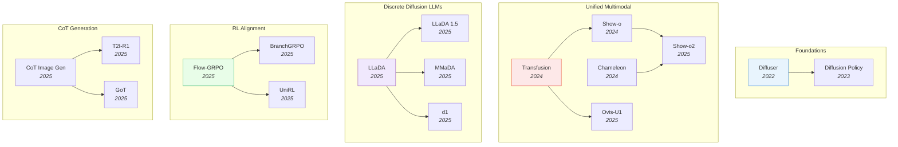

# Diffusion & Generation

> [!abstract] Overview
> Diffusion models and related generative architectures have expanded far beyond image synthesis. This topic tracks the full generative landscape: from foundational diffusion theory through discrete diffusion language models, unified multimodal architectures that combine understanding and generation, RL-based alignment of generative models, and applications in image editing, 3D, and robotics. The core question has shifted from "can diffusion generate images?" to "can diffusion replace autoregression as the foundation for general intelligence?"

## Evolution Graph

The field evolved through five threads: **foundations** (2022-2023) where Diffuser and Diffusion Policy bridged diffusion from image synthesis to RL planning and robot control; **unified multimodal** (2024-2025) where Transfusion, Show-o, Chameleon, Show-o2, and Ovis-U1 merged understanding and generation in single architectures; **discrete diffusion LLMs** (2025) where LLaDA, LLaDA 1.5, MMaDA, and d1 proved diffusion can rival autoregression for language; **RL alignment** (2025) where Flow-GRPO, BranchGRPO, and UniRL applied policy optimization to generative models; and **CoT generation** (2025) where CoT Image Gen, T2I-R1, and GoT taught generators to reason before drawing.

| Year | Paper | Contribution |
|------|-------|-------------|
| 2022 | [[2205.09991\|Diffuser]] | First to use denoising diffusion for RL planning; treated trajectories as data to denoise |
| 2023 | [[2303.04137\|Diffusion Policy]] | Extended diffusion to visuomotor control; became the standard for robot action generation |
| 2024 | [[2408.11039\|Transfusion]] | Pioneered mixing next-token prediction with diffusion loss in one model; outperformed quantization approaches |
| 2024 | [[2408.12528\|Show-o]] | Single transformer unifying understanding and generation; proved unified architectures are viable |
| 2024 | [[2405.09818\|Chameleon]] | Meta's early-fusion token-based model; proved full modality unification is architecturally viable at scale |
| 2025 | [[2506.15564\|Show-o2]] | Scaled Show-o with native multimodal capabilities and improved generation quality |
| 2025 | [[2506.23044\|Ovis-U1]] | Unified visual understanding and generation via an LLM-native multimodal architecture |
| 2025 | [[2502.09992\|LLaDA]] | First 8B diffusion LLM competitive with AR models; proved diffusion works for large-scale language modeling |
| 2025 | [[2505.19223\|LLaDA 1.5]] | Variance-Reduced Preference Optimization for aligning masked diffusion models with human preferences |
| 2025 | [[2505.15809\|MMaDA]] | Unified diffusion model handling text reasoning, image generation, and multimodal understanding simultaneously |
| 2025 | [[2504.12216\|d1]] | First RL post-training framework for dLLMs; introduced diffu-GRPO with +26.2% on Countdown |
| 2025 | [[2505.05470\|Flow-GRPO]] | First framework adapting GRPO to flow matching; enables online RL for continuous generative models |
| 2025 | [[2509.06040\|BranchGRPO]] | Tree-structured branching yielding 4.7x training speedup and 16% better alignment over vanilla GRPO |
| 2025 | [[2505.23380\|UniRL]] | Unified self-improving post-training for both diffusion and flow models |
| 2025 | [[2501.13926\|CoT Image Generation]] | First comprehensive study of CoT for AR image generation; +24% over Show-o baseline |
| 2025 | [[2505.00703\|T2I-R1]] | Bi-level CoT (semantic + token) with RL; excels on complex, reasoning-intensive prompts |
| 2025 | [[2503.10639\|GoT]] | Integrates MLLM reasoning into visual generation and editing via a unified framework |

---

## 1. Discrete Diffusion Language Models

Diffusion is no longer just for images. Masked diffusion models (MDMs) generate text by iteratively unmasking tokens, offering a non-autoregressive alternative to GPT-style LLMs. The LLaDA family proved 8B-parameter diffusion models rival autoregressive models on language benchmarks, sparking a wave of follow-up work on reasoning, alignment, and efficiency.

**Core dLLM Architectures** — Masked diffusion models trained from scratch on text, demonstrating that the denoising paradigm scales to language without autoregressive factorization.
- [[2505.19223|LLaDA 1.5]], [[2505.16933|LLaDA-V]], [[2502.09992|LLaDA]]

> [!star] Key Papers
> - [[2502.09992|LLaDA]] — First 8B diffusion LLM competitive with AR models; proved diffusion works for large-scale language modeling and solves the reversal curse
> - [[2505.19223|LLaDA 1.5]] — Variance-Reduced Preference Optimization for aligning masked diffusion models with human preferences

**Reasoning in dLLMs** — Applying RL post-training and chain-of-thought to boost diffusion LLM reasoning on math, code, and planning tasks.
- [[2507.08838|wd1]], [[2505.13138|NESYDMS]], [[2504.12216|d1]]

> [!star] Key Papers
> - [[2504.12216|d1]] — First RL post-training framework for dLLMs; introduced diffu-GRPO with +26.2% on Countdown
> - [[2507.08838|wd1]] — Weighted policy optimization achieving up to 100% improvement on reasoning benchmarks while eliminating SFT

**Efficient dLLM Inference** — Accelerating diffusion LLM decoding through KV caching, parallel decoding, and training-free optimizations.
- [[2505.22618|Fast-dLLM]]

> [!star] Key Papers
> - [[2505.22618|Fast-dLLM]] — Training-free 27.6x throughput improvement via KV cache and confidence-aware parallel decoding

**Diffusion vs. Autoregression Analysis** — Empirical studies comparing when and why diffusion beats autoregressive generation.
- [[2507.15857|Diffusion vs AR]], [[2505.15045|DIFFEMBED]]

> [!star] Key Papers
> - [[2507.15857|Diffusion vs AR]] — Diffusion has 16x better data reuse half-life; dominates AR in data-constrained settings
> - [[2505.15045|DIFFEMBED]] — Diffusion LLMs outperform AR on text embeddings by 20% on long-document retrieval, thanks to bidirectional attention

> [!tip] When to Use Diffusion Over Autoregression
> Diffusion LLMs excel where bidirectional context matters (embeddings, retrieval) and where data is limited. For open-ended generation with abundant data, AR still leads — but the gap is closing fast with LLaDA 1.5 and d1.

---

## 2. Unified Multimodal Models

The hottest design question in generative AI: can one model both understand and generate across text and images? Unified models replace the pipeline of separate encoders, LLMs, and diffusion decoders with a single architecture that handles all modalities natively. The field splits into two camps: token-based (discretize everything) and hybrid (mix AR for text + diffusion for images).

**Hybrid AR + Diffusion** — Use autoregressive generation for text tokens and diffusion for continuous image patches within a single Transformer, avoiding information loss from discretization.
- [[2603.03276|Transfusion (2026)]], [[2503.10631|HybridVLA]], [[2501.00289|D-DiT]], [[2412.15188|LMFusion]], [[2412.08635|LatentLM]], [[2408.11039|Transfusion]]

> [!star] Key Papers
> - [[2408.11039|Transfusion]] — Pioneered mixing next-token prediction with diffusion loss in one model; outperformed quantization-based approaches in scaling efficiency
> - [[2412.08635|LatentLM]] — Unified framework for discrete and continuous data via next-token diffusion in latent space

**Token-Based Unified Models** — Discretize images into tokens and treat all modalities uniformly with a single autoregressive or diffusion objective, enabling interleaved multimodal generation.
- [[2507.23278|UniLiP]], [[2506.23044|Ovis-U1]], [[2506.17202|UniFork]], [[2506.15564|Show-o2]], [[2505.05472|Mogao]], [[2504.21356|Nexus-Gen]], [[2501.17811|Janus-Pro]], [[2410.13848|Janus]], [[2409.18869|Emu3]], [[2408.12528|Show-o]], [[2405.09818|Chameleon]]

> [!star] Key Papers
> - [[2405.09818|Chameleon]] — Meta's early-fusion token-based model; proved full unification is architecturally viable at scale
> - [[2408.12528|Show-o]] — Single transformer unifying understanding and generation; later scaled to Show-o2 with native multimodal capabilities
> - [[2409.18869|Emu3]] — Showed next-token prediction alone can handle text, image, and video generation without diffusion

**Multimodal Diffusion Architectures** — Extend diffusion beyond images to jointly handle text reasoning, image generation, and multimodal understanding in a single diffusion-native model.
- [[2605.02641|Mamoda2.5]], [[2604.02097|LatentUM]], [[2506.23115|MoCa]], [[2505.15809|MMaDA]], [[2505.13031|MindOmni]]

> [!star] Key Papers
> - [[2505.15809|MMaDA]] — Unified diffusion model handling text reasoning, image generation, and multimodal understanding simultaneously

**Visual Tokenization** — Learning discrete or compressed visual representations that bridge the gap between continuous images and discrete language model architectures.
- [[2605.02134|PV-VAE]], [[2603.19227|MoTok]], [[2506.08257|TiTok]], [[2505.07538|Selftok]], [[2505.05422|TokLIP]], [[2412.03069|TokenFlow]]

> [!star] Key Papers
> - [[2505.07538|Selftok]] — Derives discrete visual tokens from the reverse diffusion process; enables purely discrete VLMs with RL-based visual reasoning
> - [[2506.08257|TiTok]] — Highly compressed 1D tokenizer that generates images via test-time optimization without a generative model

**Unified Model Surveys** — Comprehensive taxonomies and analyses of the rapidly evolving unified multimodal landscape.
- [[2506.13759|Discrete Diffusion LLM Survey]], [[2505.02567|Unified Multimodal Survey]]

> [!star] Key Papers
> - [[2506.13759|Discrete Diffusion LLM Survey]] — Systematic overview of dLLMs and dMLLMs; covers up to 10x faster inference vs. AR models

> [!tip] Token vs. Hybrid
> Token-based models (Chameleon, Show-o) are simpler but lose continuous detail. Hybrid models (Transfusion, LatentLM) preserve image fidelity but add architectural complexity. For production use, token-based is easier to scale; for quality-critical generation, hybrid wins.

---

## 3. RL Alignment for Generative Models

Reinforcement learning is transforming how diffusion and flow-matching models are trained. Instead of relying solely on maximum likelihood, these methods use reward signals (human preference, text-image alignment, task success) to directly optimize generation quality. The paradigm parallels RLHF for LLMs but requires novel algorithms for the continuous, multi-step denoising process.

**Foundational Diffusion RL Fine-Tuning** — Seminal methods that established the paradigm of RL/gradient-based fine-tuning of diffusion models against arbitrary reward functions, predating the GRPO/flow-matching wave.
- [[2605.06507|MARBLE-RL]], [[2605.03065|OGPO]], [[2309.17400|DRaFT]], [[2305.13301|DDPO]]

**Self-Distillation Alternatives to RL** — Continuous fine-tuning of diffusion models without reward signals or preference data; on-policy self-distillation matches teacher predictions along the student's own trajectories, preserving few-step inference quality.
- [[2605.05204|D-OPSD]]

> [!star] Key Papers
> - [[2305.13301|DDPO]] — Reformulated multi-step denoising as an MDP and applied policy gradients; the first principled RL approach to diffusion alignment, outperforming reward-weighted regression across compressibility, aesthetics, and prompt alignment
> - [[2309.17400|DRaFT]] — Direct backpropagation of differentiable rewards through the entire sampling chain via LoRA + gradient checkpointing; >200× more sample-efficient than DDPO and the foundation for modern reward-gradient methods

**Flow Matching + RL** — Apply policy optimization to flow-matching and continuous diffusion models, treating the denoising trajectory as a sequential decision process.
- [[2605.01663|FAN]], [[2604.24764|World-R1]], [[2604.23380|V-GRPO]], [[2603.27866|Wan-R1]], [[2603.26599|VGGRPO]], [[2603.23500|UniGRPO]], [[2603.04333|floq]], [[2509.06040|BranchGRPO]], [[2509.04063|ARFM]], [[2507.21053|FPO]], [[2505.05470|Flow-GRPO]]

> [!star] Key Papers
> - [[2505.05470|Flow-GRPO]] — First framework adapting GRPO to flow matching; enables online RL for continuous generative models
> - [[2509.06040|BranchGRPO]] — Tree-structured branching yields 4.7x training speedup and 16% better alignment over vanilla GRPO

**Inference-Time Alignment & Steering** — Training-free methods that align pre-trained diffusion models with arbitrary rewards at sampling time using particle systems, SMC, beam search, or interacting particle resampling — preserving diversity and avoiding fine-tuning costs.
- [[2503.18942|Video-T1]], [[2503.02039|DSearch]], [[2501.06848|FK Steering]], [[2501.05803|DAS]], [[2408.08252|SVDD]]

> [!star] Key Papers
> - [[2503.02039|DSearch]] — Gradient-free dynamic beam search with Monte Carlo look-ahead for inference-time alignment; achieves 35% faster reward-per-second scaling and superior naturalness over SVDD across image, DNA, and molecule domains
> - [[2501.06848|FK Steering]] — Feynman-Kac Interacting Particle Systems for steering diffusion at inference; enables a 0.8B Stable Diffusion to beat a 2.6B fine-tuned SDXL-DPO and works for both continuous and discrete state spaces
> - [[2408.08252|SVDD]] — Foundational derivative-free inference-time guidance via soft-value MDP formulation; the reference baseline that DSearch and later beam-search methods build on

**Self-Improving Generative Models** — Frameworks where generative models iteratively improve through self-generated data, reward feedback, or evolutionary strategies without fresh human annotation.
- [[2604.28190|FD-loss]], [[2603.19370|VAMPO]], [[2603.17051|Astrolabe]], [[2508.16204|M2N2]], [[2506.02095|CycleReward]], [[2505.23380|UniRL]], [[2502.02316|DIME]]

> [!star] Key Papers
> - [[2505.23380|UniRL]] — Unified self-improving post-training for both diffusion and flow models
> - [[2506.02095|CycleReward]] — Self-supervised reward via cycle consistency; eliminates need for human preference data
> - [[2603.17051|Astrolabe]] — Forward-process RL with rolling-KV streaming rollouts for distilled autoregressive video models; aligns long-video generation (30–60s) without sacrificing inference speed, and prevents reward hacking via uncertainty-aware selective KL

**Reward Models for Image Generation** — Learning reward functions that capture human preferences for image quality, text-image alignment, or edit fidelity to guide RL training.
- [[2604.27505|Edit-R1]], [[2604.11626|RationalRewards]], [[2509.26346|EditReward]], [[2507.22003|ViHallu]], [[2502.20946|Generative Uncertainty Diffusion]]

> [!star] Key Papers
> - [[2509.26346|EditReward]] — Human-aligned reward model for instruction-guided image editing; enables curation of high-quality training data
> - [[2507.22003|ViHallu]] — Vision-centric framework reducing hallucinations in LVLMs by up to 5.9% via generated visual variations

> [!success] RL Post-Training for Generative Models
> ==Likelihood pre-training== (diffusion or flow) → ==RL post-training== with reward model. Flow-matching models benefit from GRPO-adapted policy optimization; tree-structured branching yields 4–5x training speedup; cycle-consistency provides self-supervised rewards without human annotation.

> [!tip] RL for Generation
> The recipe: train a base generative model (diffusion or flow) with likelihood, then post-train with RL using a reward model. Flow-GRPO for flow matching, BranchGRPO for efficiency at scale. CycleReward eliminates the human annotation bottleneck.

---

## 4. Chain-of-Thought and Reasoning in Generation

A new paradigm: generative models that "think before they draw." Instead of generating images in a single pass, these models decompose generation into reasoning steps — planning layouts, predicting semantic structure, or generating intermediate visual states. The insight is that CoT, which transformed language reasoning, can similarly improve visual generation quality and controllability.

**CoT for Image Generation** — Autoregressive image generators that plan generation via chain-of-thought at the semantic or token level before producing final output.
- [[2506.03596|ControlThinker]], [[2505.00703|T2I-R1]], [[2503.10639|GoT]], [[2501.13926|CoT Image Generation]]

> [!star] Key Papers
> - [[2501.13926|CoT Image Generation]] — First comprehensive study of CoT for AR image generation; +24% over Show-o baseline, surpasses Stable Diffusion 3
> - [[2505.00703|T2I-R1]] — Bi-level CoT (semantic + token) with RL; excels on complex, reasoning-intensive prompts
> - [[2503.10639|GoT]] — Integrates MLLM reasoning into visual generation and editing via a unified framework

**Visual Reasoning with Generated Images** — Use generated images as intermediate reasoning artifacts, enabling models to "think" in visual space rather than text.
- [[2603.16870|Video Reasoning Chain-of-Steps]], [[2602.10675|TwiFF]], [[2601.21037|Thinking in Frames]], [[2505.22525|TwGI]], [[2505.19094|SATORI]]

> [!star] Key Papers
> - [[2505.22525|TwGI]] — Models generate images as intermediate reasoning steps; proves visual thinking complements textual CoT
> - [[2601.21037|Thinking in Frames]] — Video generators as visual reasoners; discovers "Visual Test-Time Scaling" where more frames improve OOD performance

> [!tip] Visual Chain-of-Thought
> The pattern is clear: generation quality improves when models plan first. For T2I, use semantic CoT (T2I-R1). For spatial reasoning, generate intermediate frames (TwGI). This parallels the thinking-before-acting paradigm in VLAs.

---

## 5. Image Generation & Editing Architectures

Dedicated architectures for high-quality image synthesis, editing, and multimodal generation that bridge pre-trained language models with visual output. These systems focus on the engineering challenge of getting LLMs to produce, modify, and control visual content.

**LLM-Integrated Image Generation** — Connect pre-trained LLMs to image decoders, enabling models to generate images as part of natural language interaction.
- [[2603.29620|Unify-Agent]], [[2603.28713|DreamLite]], [[2510.27492|ThinkMorph]], [[2504.20996|X-Fusion]], [[2504.06256|MetaQueries]], [[2310.02239|MiniGPT-5]], [[2305.17216|GILL]]

> [!star] Key Papers
> - [[2305.17216|GILL]] — First to enable LLMs to generate novel images via learned mapping to frozen Stable Diffusion
> - [[2504.06256|MetaQueries]] — Bridges frozen MLLMs with diffusion generators via learned meta-query tokens

**End-to-End Multimodal Generators** — Models that natively produce interleaved text and images, trained end-to-end for seamless multimodal output.
- [[2605.04128|JoyAI-Image]], [[2602.12205|DeepGen 1.0]], [[2602.05449|DisCa]], [[2510.26583|Emu3.5]], [[2510.08673|Puffin]], [[2503.20314|Wan]], [[2503.13436|UniFluid]], [[2501.08316|APT]], [[2412.14164|MetaMorph]], [[2409.04429|VILA-U]], [[2407.06135|ANOLE]], [[2404.14396|SEED-X]], [[2312.13286|Emu2]], [[2309.05519|NExT-GPT]]

**Text-to-Motion Generation** — Diffusion and contrastive methods for synthesizing and retrieving 3D human motions from natural language, including LLM-planned + physics-aware refinement pipelines.
- [[2604.24833|MotionBricks]], [[2604.17807|Re2MoGen]], [[2604.10836|HO-Flow]], [[2603.15546|Kimodo]], [[2305.00976|TMR]]

> [!star] Key Papers
> - [[2604.17807|Re2MoGen]] — MCTS-enhanced LLM keyframe planning + diffusion completion + PPO physics refinement; SOTA open-vocabulary T2M with 2.46 mm float error

> [!star] Key Papers
> - [[2309.05519|NExT-GPT]] — End-to-end any-to-any multimodal LLM covering text, image, video, and audio
> - [[2503.13436|UniFluid]] — Google DeepMind's unified AR framework using continuous and discrete tokens for seamless visual generation and understanding

**Image Editing & Controllable Generation** — Methods for precise, instruction-guided image manipulation and controllable synthesis.
- [[2605.02757|VideoTransfer-VLA]], [[2604.25636|RvR]], [[2604.06870|RefineAnything]], [[2604.04911|SpatialEdit]], [[2604.04746|Think in Strokes]], [[2604.02296|VOID]], [[2601.20354|SpatialGenEval]], [[2601.02356|Talk2Move]], [[2512.09924|ReViSE]], [[2505.18600|CoZ]], [[2403.19103|PRISM]]

> [!star] Key Papers
> - [[2601.02356|Talk2Move]] — RL-based text-instructed geometric transformations with spatially grounded rewards
> - [[2403.19103|PRISM]] — Automated black-box prompt engineering for T2I models; produces human-interpretable transferable prompts

**MLLM Self-Improvement for Generation** — Methods where multimodal models improve their own visual generation quality through self-training loops.
- [[2601.02771|AbductiveMLLM]], [[2507.16663|MLLM Self-Improvement]]

> [!star] Key Papers
> - [[2507.16663|MLLM Self-Improvement]] — Systematic framework for MLLMs to improve generation via self-generated feedback

> [!tip] Choosing an Architecture
> For research prototyping, connect a frozen LLM to a diffusion decoder (GILL, MetaQueries). For production unified models, train end-to-end (Emu3.5, UniFluid). For controllable editing, use reward-guided methods (Talk2Move, EditReward).

---

## 6. Diffusion for Robotics and Planning

Diffusion models applied to physical action generation rather than image synthesis. These methods treat robot trajectories, action sequences, or video predictions as data to denoise, enabling smooth multi-step planning that handles multimodal action distributions better than regression.

**Denoising Diffusion for Planning** — Use diffusion models not for image generation but for planning robot trajectories, treating action sequences as data to denoise. Includes guidance and curiosity-aware variants.
- [[2604.26065|FlowS]], [[2604.19730|FASTER]], [[2604.11734|Multi-ORFT]], [[2604.10953|DRL-3DBP]], [[2604.03191|Compression Gap]], [[2604.03181|MV-VDP]], [[2604.00202|DreamControl-v2]], [[2603.27670|ProgressVLA]], [[2603.25406|MMaDA-VLA]], [[2603.16368|SCDP]], [[2603.15975|UMO]], [[2603.12263|Psi0]], [[2603.10052|OmniGuide]], [[2603.03243|HoMMI]], [[2602.11236|ABot-M0]], [[2601.07060|PALM]], [[2601.02456|InternVLA-A1]], [[2512.22688|ARFM]], [[2512.21430|EVE]], [[2510.09459|FIPER]], [[2509.22652|DAWN]], [[2509.19292|SOE]], [[2508.10333|ReconVLA]], [[2504.00342|Constraint-Aligned Diffusion]], [[2503.19757|Dita]], [[2503.15386|CCDP]], [[2503.14833|Curiosity-Diffuser]], [[2503.14734|GR00T N1]], [[2502.16707|ReflectVLM]], [[2502.10040|DTP]], [[2411.19650|CogACT]], [[2410.15959|DiT Policy]], [[2410.07864|RDT-1B]], [[2407.05996|MDT]], [[2405.12213|Octo]], [[2403.03954|DP3]], [[2303.04137|Diffusion Policy]], [[2302.01877|AdaptDiffuser]], [[2302.00111|UniPi]], [[2205.09991|Diffuser]]

**Flow-Based VLA Policies** — Vision-language-action models using flow matching for continuous action generation, enabling smooth and efficient robot control.
- [[2604.10962|ScoRe-Flow]], [[2604.07084|FMP]], [[2604.05672|A1]], [[2604.05656|SnapFlow]], [[2604.04646|FDS]], [[2604.02759|OMNI-PoseX]], [[2603.29844|DIAL]], [[2603.28565|StreamingVLA]], [[2603.26320|DFM-VLA]], [[2603.24800|Calibri]], [[2602.01789|RFS]], [[2602.01166|LaRA-VLA]], [[2601.18692|LingBot-VLA]], [[2512.24125|GenieReasoner]], [[2511.14759|RECAP]], [[2511.14148|AsyncVLA]], [[2511.07732|ViPRA]], [[2510.25889|piRL]], [[2510.22201|ACG]], [[2510.10274|X-VLA]], [[2509.04996|FLOWER]], [[2508.21112|EO-1]], [[2507.23682|villa-X]], [[2506.01844|SmolVLA]], [[2505.22094|ReinFlow]], [[2504.18471|AFM]], [[2410.24164|π0]], [[2403.09631|3D-VLA]]

> [!star] Key Papers
> - [[2410.24164|pi0]] — Vision-language-action flow model for general robot control; established flow matching as the standard for VLA action generation
> - [[2506.01844|SmolVLA]] — Affordable and efficient VLA via flow matching; democratized robot learning with minimal compute requirements
> - [[2509.04996|FLOWER]] — Generalist flow-based VLA policy enabling broad robot skill transfer across embodiments

> [!star] Key Papers
> - [[2205.09991|Diffuser]] — First to use denoising diffusion for RL planning; treat trajectories as data to denoise
> - [[2303.04137|Diffusion Policy]] — Extended Diffuser to visuomotor control; became the standard for robot action generation
> - [[2302.00111|UniPi]] — Universal policy as text-conditioned video generation; crosses the boundary between video models and robot control

**Video Diffusion as World Models** — Adapt pre-trained video diffusion models to robotic tasks, using generated future video as a physics simulator for planning.
- [[2605.06388|Semantic-LDM-WM]], [[2605.06192|EA-WM]], [[2604.18564|MultiWorld]], [[2604.14732|WVA]], [[2604.09330|VAG]], [[2604.08995|Matrix-Game 3.0]], [[2603.30045|OmniRoam]], [[2603.28963|AutoWorld]], [[2603.28887|OccSim]], [[2603.25716|HyDRA]], [[2603.25685|Persistent Robot World Models]], [[2603.23376|ABot-PhysWorld]], [[2603.17240|GigaWorld-Policy]], [[2603.12639|RoboStereo]], [[2603.10448|DiT4DiT]], [[2603.07799|MWM]], [[2602.20057|AdaWorldPolicy]], [[2602.15922|DreamZero]], [[2602.10098|VLA-JEPA]], [[2602.06949|DreamDojo]], [[2601.21998|LingBot-VA]], [[2601.20540|LingBot-World]], [[2601.16163|Cosmos Policy]], [[2512.15692|mimic-video]], [[2512.13644|DexWM]], [[2512.11061|VDAWorld]], [[2510.19430|GigaBrain-0]], [[2510.10125|CTRL-WORLD]], [[2510.00855|DyVA]], [[2508.00795|Video Policy]], [[2507.17744|Yume]], [[2507.13340|LPS]], [[2506.18701|Matrix-Game]], [[2506.09995|PlayerOne]], [[2504.15369|Inverse Probabilistic Adaptation]], [[2504.12369|WorldMem]], [[2504.02792|UWM]], [[2503.00200|UVA]], [[2502.00622|GPC]], [[2501.08325|GameFactory]], [[2501.03575|Cosmos]], [[2412.14803|VPP]], [[2412.03568|The Matrix]], [[2409.18964|PhysGen]], [[2403.06845|DriveDreamer-2]], [[2402.15391|Genie]], [[2310.06114|UniSim]], [[1507.08750|Action-Conditional Video Prediction]]

> [!star] Key Papers
> - [[2512.13644|DexWM]] — Leverages human video data for dexterous manipulation; 83% zero-shot success without real-world training
> - [[2504.15369|Inverse Probabilistic Adaptation]] — Adapts internet video models to robot tasks; 3x improvement over unadapted models

**3D and Spatial Generation** — Diffusion models that generate 3D-consistent content or leverage implicit 3D priors for scene understanding.
- [[2605.05163|PhysForge]], [[2605.01799|Embody4D]], [[2605.00781|Map2World]], [[2604.26341|SpatialFusion]], [[2604.15805|WorldComposer]], [[2604.14268|HY-World 2.0]], [[2604.13036|Lyra 2.0]], [[2604.02329|Generative World Renderer]], [[2603.29089|WorldFlow3D]], [[2603.22275|GLD]], [[2603.19235|VEGA-3D]], [[2603.18524|3DreamBooth]], [[2602.15727|LoRWeB]], [[2512.13683|I-Scene]], [[2510.08575|ReSplat]]

> [!star] Key Papers
> - [[2603.19235|VEGA-3D]] — Extracts implicit 3D geometric cues from video diffusion for spatial understanding in MLLMs

> [!tip] Diffusion Beyond Images
> The same denoising framework that generates images also generates robot actions (Diffusion Policy), plans trajectories (Diffuser), and simulates physics (DexWM). If your problem involves generating structured sequences with multimodal distributions, diffusion is likely the right tool.

---

## 7. Physics-Aware Training for Generative Models

A focused thread on injecting physical laws into generative pipelines. Standard diffusion and flow models learn from pixels alone, so they reliably violate gravity, conservation, and rigid-body constraints — limiting their use as world simulators for robotics, scientific computing, and embodied AI. Methods in this section span four mechanisms: (1) **physics-grounded training data** with synthetic simulators, (2) **physics-conditioned architectures** that consume material/force inputs, (3) **physics losses** (PDE residuals, kinematic residuals, mass conservation) backpropagated during fine-tuning, and (4) **inference-time physics rewards** from latent world models or rule-based proxies.

**Physics-Conditioned Generation** — Generative models that consume explicit physical inputs (material properties, forces, rigid-body parameters) or reconstruct physical scenes as part of the generation pipeline.
- [[2604.28169|PhyCo]], [[2603.26285|PhysVid]], [[2603.13770|PhysAlign]], [[2511.20280|PhysiCheck]], [[2509.21541|ControlHair]], [[2509.21309|NewtonGen]], [[2509.20358|PhysCtrl]], [[2504.00342|Constraint-Aligned Diffusion]], [[2503.23368|VLIPP]], [[2503.21442|RainyGS]], [[2502.02492|VideoJAM]], [[2409.18964|PhysGen]], [[2211.14680|PIDM Flow Reconstruction]]

> [!star] Key Papers
> - [[2509.20358|PhysCtrl]] — Diffusion-based generative physics network conditioned on material properties and external forces; produces 3D point trajectories with spatio-temporal attention regularized by physics, velocity, and boundary losses
> - [[2603.13770|PhysAlign]] — LoRA adapter for DiT-based I2V models; dual latent-space alignment with V-JEPA2 kinematic priors and 3D-geometry depth heads, trained on only 3,000 Blender-simulated clips
> - [[2509.21309|NewtonGen]] — Physics-informed neural ODE module (Neural Newtonian Dynamics) embedded inside T2V; explicit Newtonian motion control over 12 motion types with **0.98** Physical Invariance Score

**Physics-Loss & Reward Fine-Tuning** — Post-training methods that fine-tune pre-trained generators with physics-derived loss functions or verifiable rewards (PDE residuals, Newtonian kinematic constraints, mass conservation).
- [[2603.13925|SmoothVLA]], [[2602.03627|Phys-Instruct]], [[2601.11087|PhysRVG]], [[2512.24551|PhyGDPO]], [[2512.00425|NewtonRewards]], [[2510.13809|PhysMaster]], [[2509.20570|PIRF]], [[2506.02244|PGML]], [[2504.15932|Phys-AR]], [[2503.09595|PISA]], [[2403.14404|PIDM]]

> [!star] Key Papers
> - [[2512.00425|NewtonRewards]] — Verifiable rule-based rewards from optical-flow proxies and visual-feature mass conservation; +9.75% physical fidelity on NewtonBench-60K with explicit anti-reward-hacking design
> - [[2509.20570|PIRF]] — Backpropagates trajectory-level PDE-residual rewards through the entire denoising process; layer-wise truncation prevents reward hacking and beats SOTA on 4/5 PDE benchmarks
> - [[2503.09595|PISA]] — Physics Supervised Fine-Tuning + Object Reward Optimization on small simulated datasets; first systematic post-training recipe for object freefall

**Inference-Time Physics Alignment** — Steer pre-trained generators at sampling time using physics reward models, world-model surprise signals, or counterfactual guidance — without retraining the base model.
- [[2601.10553|WMReward]], [[2506.04171|PCFM]]

> [!star] Key Papers
> - [[2601.10553|WMReward]] — Differentiable physics reward derived from V-JEPA2 prediction surprise; first place at ICCV 2025 PhysicsIQ Challenge with 62.64%, +11.4% human-preference win rate via Best-of-N + gradient guidance

**Physics-Aware Robotic World Models** — Generative video models repurposed as physically-interactable digital twins for robot policy learning, bridging visual plausibility and physical feasibility.
- [[2604.08544|SIM1]], [[2603.23376|ABot-PhysWorld]], [[2511.07416|PhysWorld]], [[2310.06114|UniSim]]

> [!star] Key Papers
> - [[2511.07416|PhysWorld]] — Reconstructs a physically interactable digital twin from generated task-conditioned videos; object-centric residual RL achieves 82% real-world success and reduces grasping failures from 18% to 3%

**Physics Cognition Limits & Surveys** — Diagnostic studies and surveys analyzing whether scaling alone yields physical understanding, and taxonomies of physics cognition tiers in video generators.
- [[2602.06033|VLM Intuitive Physics]], [[2510.06251|Physics Frontier Diagnostic]], [[2503.21765|Physics Cognition Survey]], [[2503.21668|Object Cog-Eval]], [[2503.04641|Multimodal Generative Survey]], [[2502.07007|Grounding Creativity in Physics]], [[2411.02385|Physical Law Video Gen]]

> [!star] Key Papers
> - [[2411.02385|Physical Law Video Gen]] — Definitive scaling study showing video models generalize "case-based" rather than learning abstract physics; OOD errors stay an order of magnitude above ID even at DiT-XL/6M-video scale, and the visual-attribute hierarchy (color > size > velocity > shape) explains object-consistency failures
> - [[2503.21765|Physics Cognition Survey]] — Three-tier Piaget-inspired taxonomy (Basic Schema Perception → Passive Cognition → Active Cognition) for video generators; surveys mechanics/optics/thermal/materials coverage and identifies neuro-symbolic + differentiable physics as future frontiers

**Physical Commonsense Benchmarks** — Evaluation suites that systematically measure whether generated videos obey gravity, optics, thermodynamics, and material properties.
- [[2512.12756|FysicsWorld]], [[2510.11512|LikePhys]], [[2510.08398|VideoVerse]], [[2510.02311|PhysVid]], [[2507.15824|PhysVidBench]], [[2506.00022|PHYSICS Dataset]], [[2505.15929|PhyX]], [[2504.02918|Morpheus]], [[2503.06800|VideoPhy-2]], [[2411.13609|VAMP]], [[2410.05363|PhyGenBench]], [[2406.18522|ChronoMagic-Bench]], [[2311.10111|VideoCon]], [[2106.08261|Physion]], [[2012.04293|CRAFT]]

> [!star] Key Papers
> - [[2504.02918|Morpheus]] — 130 real-world Newtonian mechanics videos with hierarchical Discard/Dynamical/Invariance scoring; even SOTA generators (WAN-2.1, COSMOS-predict2) score only 0.52–0.55 vs. real-world's 0.98+
> - [[2503.06800|VideoPhy-2]] — Action-centric physical commonsense benchmark; best models hit only 32.6% joint performance (22% on hard subset), with VideoPhy-2-AutoEval offering 47–49% relative gains as automated judge
> - [[2410.05363|PhyGenBench]] — 160-prompt benchmark across Mechanics/Optics/Thermal/Materials with PhyGenEval auto-scoring (Spearman ρ=0.81 with humans); top T2V model scored only 0.51/3.0, exposing the physics gap
> - [[2106.08261|Physion]] — Foundational dataset that pioneered "physics prediction from video" as a benchmark setting; the original benchmark that defined the model-vs-human physical-prediction gap

**Physics-Conditioned Video Generation (Extended)** — A broader sweep of physics-conditioned T2V/I2V/V2V methods that consume forces, sketches, kinematic priors, or simulator outputs to generate physically plausible video. Covers force prompting, kinematic masking, multi-stage simulators in the loop, and video models distilling physics knowledge from pre-trained foundations.
- [[2603.18639|PhysVideo]], [[2603.09094|CoECT]], [[2603.06408|Physical Simulator In-the-Loop Video]], [[2603.05449|RealWonder]], [[2601.22135|PI-Light]], [[2601.18577|Self-Refining Video Sampling]], [[2601.00504|MotionPhysics]], [[2512.10927|FoundationMotion]], [[2512.05564|ProPhy]], [[2511.17450|Sketch-Guided Plan Verification]], [[2510.02284|KineMask]], [[2509.24702|Implausibility Reasoning]], [[2509.21309|NewtonGen]], [[2508.13911|PhysGM]], [[2507.06830|Phys-Motion-Forecast]], [[2506.08006|Dreamland]], [[2506.06440|Vid2Sim]], [[2505.21653|DiffPhy]], [[2505.19386|Force Prompting]], [[2505.18151|WonderPlay]], [[2505.16971|UniPhy]], [[2505.16456|MAGIC]], [[2505.13437|FinePhys]], [[2503.20822|Synthetic Video Physical Fidelity]], [[2503.20746|PhysGen3D]], [[2503.20654|AccidentSim]], [[2502.19868|C-Drag]], [[2501.16550|PhysAnimator]], [[2412.02617|AIF-Dynamic]], [[2411.19381|Sketch Animation]], [[2411.17189|PhysMotion]], [[2411.14423|PhysFlow]], [[2409.07179|Phy124]], [[2406.04338|Physics3D]], [[2406.01476|DreamPhysics]], [[2405.13557|MotionCraft]], [[2401.16663|VR-GS]], [[2305.13840|Control-A-Video]]

> [!star] Key Papers
> - [[2505.19386|Force Prompting]] — Force vectors as a controllable generation prompt; first to enable physics-driven I2V where users specify push/drag forces
> - [[2510.02284|KineMask]] — Object-mask-conditioned kinematics for diffusion video; teaches the model object-interaction physics by guiding the masking pattern
> - [[2505.18151|WonderPlay]] — Action-conditioned dynamic 3D scene generation via differentiable physics + video diffusion; supports user-specified force interventions for one-shot replanning

**Physics-Grounded Gaussians and NeRFs** — Couples explicit 3D Gaussian / NeRF representations with physical simulators (MPM, FEM, PBD) so that each Gaussian carries material properties and obeys conservation laws under deformation. The dominant pattern for 4D dynamics: scene reconstruction first, then simulator-driven evolution.
- [[2503.21442|RainyGS]], [[2503.04720|FluidNexus]], [[2501.18982|OmniPhysGS]], [[2412.17804|GausSim]], [[2412.11258|GaussianProperty]], [[2411.14423|PhysFlow]], [[2410.08257|NeuMA]], [[2409.07179|Phy124]], [[2406.04338|Physics3D]], [[2404.01223|Feature Splatting]], [[2401.15318|Gaussian Splashing]], [[2312.00583|DeformGS]], [[2311.13099|PIE-NeRF]], [[2311.12198|PhysGaussian]], [[2308.09713|Dynamic 3D Gaussians]], [[2304.14369|NCLaw]], [[2303.05512|PAC-NeRF]]

> [!star] Key Papers
> - [[2311.12198|PhysGaussian]] — Couples 3D Gaussian Splatting with continuum mechanics MPM solver; first to make 3DGS scenes physically interactive without rebuilding meshes
> - [[2303.05512|PAC-NeRF]] — Physics-Augmented Continuum NeRF; jointly recovers geometry and material parameters (Young's modulus, density, plasticity) from video, foundational for material-property estimation from pixels
> - [[2412.11258|GaussianProperty]] — Distills Vision Foundation Model priors into 3D Gaussians to predict per-Gaussian material properties; bridges VLMs and physical simulation
> - [[2501.18982|OmniPhysGS]] — Constitutive Gaussians with learnable per-particle constitutive networks; ensemble of 12 expert models + custom PyTorch MPM reduces memory **75%** vs Warp solvers
> - [[2406.04338|Physics3D]] — Distills physical properties (Young's modulus, viscosity, plasticity) into 3D Gaussians via video diffusion priors; the canonical Score-Distillation-from-video-prior recipe for material inference

**Articulated and 4D Physics** — Methods specialized for articulated objects (joints, kinematic chains) and 4D dynamics where geometry, motion, and physics co-evolve over time.
- [[2603.03485|Phys4D]], [[2504.01204|Articulated Kinematics Distillation]], [[2411.16800|Phys4DGen]], [[2410.07155|Trans4D]], [[2405.16849|Sync4D]], [[2405.15056|ElastoGen]], [[2403.17920|TC4D]]

> [!star] Key Papers
> - [[2504.01204|Articulated Kinematics Distillation]] — Distills articulated kinematics from video diffusion priors into rigged-skeleton 3D models; bridges generative video and physically-driven character animation
> - [[2410.07155|Trans4D]] — Realistic geometry-aware transitions for compositional text-to-4D synthesis; handles topological changes (e.g., breaking, melting) that prior methods could not
> - [[2405.15056|ElastoGen]] — 4D generative elastodynamics via convolution-like local quadratic approximation + Neural Material Module; **0.98** correlation with FEM ground truth across hyperelastic materials

**Material and Elastic Physics** — Recover and edit material properties (elasticity, plasticity, fluid, granular) from video or single images, then re-simulate under new forces.
- [[2503.17973|PhysTwin]], [[2411.11343|TVML]], [[2410.08257|NeuMA]], [[2406.04338|Physics3D]], [[2406.01476|DreamPhysics]], [[2404.13026|PhysDreamer]], [[2304.14369|NCLaw]]

> [!star] Key Papers
> - [[2503.17973|PhysTwin]] — Single-image-to-physical-twin pipeline; estimates material parameters and rigging that re-simulate under arbitrary forces
> - [[2406.04338|Physics3D]] — Distills physical properties (elasticity, viscoelasticity, plasticity) into 3D Gaussians via SDS from video diffusion; canonical material-from-pixels recipe
> - [[2406.01476|DreamPhysics]] — Physics-based 3D dynamics learned from video diffusion priors via score distillation; among the first to make image/video diffusion supervise material parameter inference

**Simulator-in-the-Loop Generation** — Use a physics renderer/engine (Blender, MPM, MuJoCo) inside the generation loop, either to provide ground-truth scaffolding or to fix violations after diffusion sampling.
- [[2411.12789|Sim-GS]], [[2411.02394|AutoVFX]], [[2408.10453|Kubrick]], [[2404.09833|Video2Game]], [[2311.12631|GPT4Motion]]

> [!star] Key Papers
> - [[2411.02394|AutoVFX]] — End-to-end automatic VFX pipeline using LLMs to script Blender simulations driven by visual context; bridges generative AI and traditional rendering
> - [[2311.12631|GPT4Motion]] — GPT-4 plans Blender scenes that drive ControlNet-guided text-to-video; one of the earliest LLM+simulator+diffusion stacks for physically-grounded video

**LLM-Driven Physics Reasoning** — LLMs acting as reasoning engines to derive physical equations, force fields, or simulation parameters that drive downstream generators.
- [[2603.09094|CoECT]], [[2601.05848|Goal Force]], [[2512.04221|MoReGen]], [[2507.06830|Phys-Motion-Forecast]], [[2505.05469|LegoGPT]], [[2503.20654|AccidentSim]], [[2502.19868|C-Drag]], [[2411.08027|LLMPhy]], [[2309.17444|LVD]]

> [!star] Key Papers
> - [[2505.05469|LegoGPT]] — LLM-driven physically-stable LEGO assembly generation; the LLM proposes brick layouts that are then verified for structural physics
> - [[2603.09094|CoECT]] — Chain of Event-Centric Causal Thought; LLM decomposes physical phenomena into causally ordered event units grounded in formulas; **+8.19%** over PhysHPO on PhyGenBench
> - [[2507.06830|Phys-Motion-Forecast]] — Retrieval-based Symbolic Regression discovers physical equations from video trajectories; predicts physically aligned futures used as I2V guidance — neuro-symbolic precursor to physics-grounded T2V
> - [[2502.19868|C-Drag]] — Training-free chain-of-thought motion controller using VLM reasoning over object physics; bridges multimodal LLM perception and trajectory-based video generation

> [!tip] Physics-Aware Training Recipe
> The community has converged on a layered approach: (1) start with a strong pre-trained video diffusion / flow model, (2) fine-tune on a small (~3K-60K) synthetic physics dataset from a controllable simulator (Blender, MPM), (3) add a physics-derived loss or reward — kinematic residuals (NewtonRewards), PDE residuals (PIRF), or world-model surprise (WMReward) — with layer-wise truncation to prevent reward hacking, and (4) evaluate on PhyGenBench/VideoPhy/PhysicsIQ/VideoVerse rather than visual fidelity alone. Always include a *conservation* term (mass, feature consistency) — without it, models collapse to trivial reward-hacked solutions where objects vanish or freeze. The **neuro-symbolic frontier** (NewtonGen, Phys-Motion-Forecast, CoECT) is now competitive: physics-informed neural ODEs and equation-discovery modules embedded *inside* T2V pipelines achieve explicit Newtonian control where reward-only fine-tuning struggled.

> [!success] Validated Physics-Aware Pipeline
> ==Pre-trained generator (DiT/flow)== → ==LoRA-adapted alignment== with V-JEPA2 kinematic teacher + 3D depth head (PhysAlign) OR ==full fine-tuning== with PDE/kinematic residual reward (PIRF, NewtonRewards) → ==inference-time== Best-of-N with WMReward for an extra +6-11% physics gain at zero retraining cost. Anchor evaluation on PhyGenBench, VideoPhy, and PhysicsIQ — visual quality metrics alone do not detect physics violations.

---

## 8. Representation Learning & Theory

Foundational work on how diffusion models learn representations, the theoretical underpinnings that unify different formulations, and methods for leveraging diffusion dynamics for pre-training and downstream tasks beyond generation.

**Diffusion as Pre-Training** — Use the diffusion denoising objective as a self-supervised pre-training method for representation learning, improving downstream classification and understanding tasks.
- [[2604.11386|ComSim]], [[2512.19693|Prism Hypothesis]], [[2505.06890|RCLDT]], [[2505.02831|SRA]], [[2503.06132|USP]]

> [!star] Key Papers
> - [[2503.06132|USP]] — Unified pretraining in VAE latent space that 11.7x accelerates DiT convergence and improves both generation and understanding
> - [[2505.02831|SRA]] — Diffusion transformers provide their own representation guidance; eliminates external encoders

**Latent Space Design** — Principled methods for learning optimal latent representations that diffusion models operate in, controlling information content and generation quality.
- [[2604.16044|DCW]], [[2602.17270|UL]], [[2312.08762|DPMM-CoT]]

> [!star] Key Papers
> - [[2602.17270|UL]] — Google DeepMind's Unified Latents framework; principled regularization achieves SOTA on ImageNet-512 and Kinetics-600
> - [[2604.16044|DCW]] — Characterizes SNR-t bias in DPMs and applies training-free wavelet-domain differential correction; 42.6% FID reduction on CIFAR-10 with 20 steps

**Theoretical Foundations & Surveys** — Monographs and comprehensive surveys that unify variational, score-based, and flow-based perspectives on diffusion.
- [[2604.15911|Efficient Video Diffusion Survey]], [[2510.21890|Diffusion Models Principles]], [[2510.09586|VLM Survey 26K]], [[2506.19360|Synthetic Image Privacy SoK]], [[2410.19878|PEFT Methodologies Survey]], [[2403.14608|PEFT Survey 2024]]

> [!star] Key Papers
> - [[2510.21890|Diffusion Models Principles]] — Definitive monograph from Sony AI, OpenAI, and Stanford unifying all diffusion formulations into a continuous-time framework
> - [[2506.19360|Synthetic Image Privacy SoK]] — Empirical evaluation showing diffusion models offer superior utility-privacy tradeoffs for synthetic data

**Unified Generation Frameworks** — Architectural frameworks designed to consolidate multiple generation capabilities (understanding, generation, editing) in a single model.
- [[2604.09168|ELT]], [[2604.08121|Uni-ViGU]], [[2510.20607|Compositional Energy Minimization]], [[2507.02092|EBT]], [[2506.21046|dSVA]], [[2506.03147|UniWorld-V1]], [[2404.09216|DetCLIPv3]], [[2403.10191|GenerateU]]

> [!star] Key Papers
> - [[2506.03147|UniWorld-V1]] — Integrates VL understanding, image generation, perception, and grounding in one model

**Generative-Model Signals for OOD & Anomaly Detection** — Use the internals of diffusion or flow-matching models (posterior covariance, reversed-flow vector fields) as distribution-shift signals for unsupervised OOD and anomaly detection.
- [[2510.07206|EigenScore]], [[2508.05461|WT-Flow]], [[2504.07793|RDM]]

> [!star] Key Papers
> - [[2510.07206|EigenScore]] — Jacobian-free posterior-covariance spectrum as an OOD signal; +5% AUROC over best baseline, especially strong in near-OOD
> - [[2508.05461|WT-Flow]] — First FM-native unsupervised anomaly detector; Worst-Transport paths fix the non-invertibility of linear-interpolation flow matching

> [!tip] Diffusion Representations
> Diffusion pre-training is underexplored but powerful. USP shows a single masked-latent pretraining phase improves both generation and understanding. If you need representations and generation from the same model, start here. For diagnostic use (OOD, anomaly), EigenScore and WT-Flow show that the generative model's *internals* — its posterior covariance or reversed-flow velocity — are informative distribution-shift signals.

---

## Cross-References

- [[06_Video-and-Temporal]] — Video generation as world models
- [[07_Robotics-and-Embodied-AI]] — Diffusion Policy and flow matching for robot control
- [[04_Reinforcement-Learning]] — RL + diffusion intersection
- [[11_Self-Evolving-AI]] — Self-evolving generative systems

---

*Next: [[08_Benchmarks-and-Surveys]] for a cross-cutting view of evaluation resources.*
