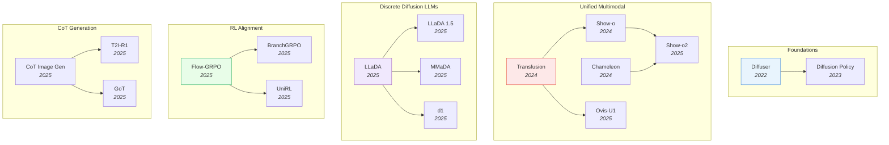

# Diffusion & Generation

> [!abstract] Overview
> Diffusion models and related generative architectures have expanded far beyond image synthesis. This topic tracks the full generative landscape: from foundational diffusion theory through discrete diffusion language models, unified multimodal architectures that combine understanding and generation, RL-based alignment of generative models, and applications in image editing, 3D, and robotics. The core question has shifted from "can diffusion generate images?" to "can diffusion replace autoregression as the foundation for general intelligence?"

## Evolution Graph

The field evolved through five threads: **foundations** (2022-2023) where Diffuser and Diffusion Policy bridged diffusion from image synthesis to RL planning and robot control; **unified multimodal** (2024-2025) where Transfusion, Show-o, Chameleon, Show-o2, and Ovis-U1 merged understanding and generation in single architectures; **discrete diffusion LLMs** (2025) where LLaDA, LLaDA 1.5, MMaDA, and d1 proved diffusion can rival autoregression for language; **RL alignment** (2025) where Flow-GRPO, BranchGRPO, and UniRL applied policy optimization to generative models; and **CoT generation** (2025) where CoT Image Gen, T2I-R1, and GoT taught generators to reason before drawing.

| Year | Paper | Contribution |
|------|-------|-------------|
| 2022 | [[2205.09991\|Diffuser]] | First to use denoising diffusion for RL planning; treated trajectories as data to denoise |
| 2023 | [[2303.04137\|Diffusion Policy]] | Extended diffusion to visuomotor control; became the standard for robot action generation |
| 2024 | [[2408.11039\|Transfusion]] | Pioneered mixing next-token prediction with diffusion loss in one model; outperformed quantization approaches |
| 2024 | [[2408.12528\|Show-o]] | Single transformer unifying understanding and generation; proved unified architectures are viable |
| 2024 | [[2405.09818\|Chameleon]] | Meta's early-fusion token-based model; proved full modality unification is architecturally viable at scale |
| 2025 | [[2506.15564\|Show-o2]] | Scaled Show-o with native multimodal capabilities and improved generation quality |
| 2025 | [[2506.23044\|Ovis-U1]] | Unified visual understanding and generation via an LLM-native multimodal architecture |
| 2025 | [[2502.09992\|LLaDA]] | First 8B diffusion LLM competitive with AR models; proved diffusion works for large-scale language modeling |
| 2025 | [[2505.19223\|LLaDA 1.5]] | Variance-Reduced Preference Optimization for aligning masked diffusion models with human preferences |
| 2025 | [[2505.15809\|MMaDA]] | Unified diffusion model handling text reasoning, image generation, and multimodal understanding simultaneously |
| 2025 | [[2504.12216\|d1]] | First RL post-training framework for dLLMs; introduced diffu-GRPO with +26.2% on Countdown |
| 2025 | [[2505.05470\|Flow-GRPO]] | First framework adapting GRPO to flow matching; enables online RL for continuous generative models |
| 2025 | [[2509.06040\|BranchGRPO]] | Tree-structured branching yielding 4.7x training speedup and 16% better alignment over vanilla GRPO |
| 2025 | [[2505.23380\|UniRL]] | Unified self-improving post-training for both diffusion and flow models |
| 2025 | [[2501.13926\|CoT Image Generation]] | First comprehensive study of CoT for AR image generation; +24% over Show-o baseline |
| 2025 | [[2505.00703\|T2I-R1]] | Bi-level CoT (semantic + token) with RL; excels on complex, reasoning-intensive prompts |
| 2025 | [[2503.10639\|GoT]] | Integrates MLLM reasoning into visual generation and editing via a unified framework |

---

## 1. Discrete Diffusion Language Models

Diffusion is no longer just for images. Masked diffusion models (MDMs) generate text by iteratively unmasking tokens, offering a non-autoregressive alternative to GPT-style LLMs. The LLaDA family proved 8B-parameter diffusion models rival autoregressive models on language benchmarks, sparking a wave of follow-up work on reasoning, alignment, and efficiency.

**Core dLLM Architectures** — Masked diffusion models trained from scratch on text, demonstrating that the denoising paradigm scales to language without autoregressive factorization.
- [[2505.19223|LLaDA 1.5]], [[2505.16933|LLaDA-V]], [[2502.09992|LLaDA]]

> [!star] Key Papers
> - [[2502.09992|LLaDA]] — First 8B diffusion LLM competitive with AR models; proved diffusion works for large-scale language modeling and solves the reversal curse
> - [[2505.19223|LLaDA 1.5]] — Variance-Reduced Preference Optimization for aligning masked diffusion models with human preferences

**Reasoning in dLLMs** — Applying RL post-training and chain-of-thought to boost diffusion LLM reasoning on math, code, and planning tasks.
- [[2507.08838|wd1]], [[2505.13138|NESYDMS]], [[2504.12216|d1]]

> [!star] Key Papers
> - [[2504.12216|d1]] — First RL post-training framework for dLLMs; introduced diffu-GRPO with +26.2% on Countdown
> - [[2507.08838|wd1]] — Weighted policy optimization achieving up to 100% improvement on reasoning benchmarks while eliminating SFT

**Efficient dLLM Inference** — Accelerating diffusion LLM decoding through KV caching, parallel decoding, and training-free optimizations.
- [[2505.22618|Fast-dLLM]]

> [!star] Key Papers
> - [[2505.22618|Fast-dLLM]] — Training-free 27.6x throughput improvement via KV cache and confidence-aware parallel decoding

**Diffusion vs. Autoregression Analysis** — Empirical studies comparing when and why diffusion beats autoregressive generation.
- [[2507.15857|Diffusion vs AR]], [[2505.15045|DIFFEMBED]]

> [!star] Key Papers
> - [[2507.15857|Diffusion vs AR]] — Diffusion has 16x better data reuse half-life; dominates AR in data-constrained settings
> - [[2505.15045|DIFFEMBED]] — Diffusion LLMs outperform AR on text embeddings by 20% on long-document retrieval, thanks to bidirectional attention

> [!tip] When to Use Diffusion Over Autoregression
> Diffusion LLMs excel where bidirectional context matters (embeddings, retrieval) and where data is limited. For open-ended generation with abundant data, AR still leads — but the gap is closing fast with LLaDA 1.5 and d1.

---

## 2. Unified Multimodal Models

The hottest design question in generative AI: can one model both understand and generate across text and images? Unified models replace the pipeline of separate encoders, LLMs, and diffusion decoders with a single architecture that handles all modalities natively. The field splits into two camps: token-based (discretize everything) and hybrid (mix AR for text + diffusion for images).

**Hybrid AR + Diffusion** — Use autoregressive generation for text tokens and diffusion for continuous image patches within a single Transformer, avoiding information loss from discretization.
- [[2603.03276|Transfusion (2026)]], [[2501.00289|D-DiT]], [[2412.15188|LMFusion]], [[2412.08635|LatentLM]], [[2408.11039|Transfusion]]

> [!star] Key Papers
> - [[2408.11039|Transfusion]] — Pioneered mixing next-token prediction with diffusion loss in one model; outperformed quantization-based approaches in scaling efficiency
> - [[2412.08635|LatentLM]] — Unified framework for discrete and continuous data via next-token diffusion in latent space

**Token-Based Unified Models** — Discretize images into tokens and treat all modalities uniformly with a single autoregressive or diffusion objective, enabling interleaved multimodal generation.
- [[2507.23278|UniLiP]], [[2506.23044|Ovis-U1]], [[2506.17202|UniFork]], [[2506.15564|Show-o2]], [[2505.05472|Mogao]], [[2504.21356|Nexus-Gen]], [[2501.17811|Janus-Pro]], [[2410.13848|Janus]], [[2409.18869|Emu3]], [[2408.12528|Show-o]], [[2405.09818|Chameleon]]

> [!star] Key Papers
> - [[2405.09818|Chameleon]] — Meta's early-fusion token-based model; proved full unification is architecturally viable at scale
> - [[2408.12528|Show-o]] — Single transformer unifying understanding and generation; later scaled to Show-o2 with native multimodal capabilities
> - [[2409.18869|Emu3]] — Showed next-token prediction alone can handle text, image, and video generation without diffusion

**Multimodal Diffusion Architectures** — Extend diffusion beyond images to jointly handle text reasoning, image generation, and multimodal understanding in a single diffusion-native model.
- [[2604.02097|LatentUM]], [[2506.23115|MoCa]], [[2505.15809|MMaDA]], [[2505.13031|MindOmni]]

> [!star] Key Papers
> - [[2505.15809|MMaDA]] — Unified diffusion model handling text reasoning, image generation, and multimodal understanding simultaneously

**Visual Tokenization** — Learning discrete or compressed visual representations that bridge the gap between continuous images and discrete language model architectures.
- [[2603.19227|MoTok]], [[2506.08257|TiTok]], [[2505.07538|Selftok]], [[2505.05422|TokLIP]], [[2412.03069|TokenFlow]]

> [!star] Key Papers
> - [[2505.07538|Selftok]] — Derives discrete visual tokens from the reverse diffusion process; enables purely discrete VLMs with RL-based visual reasoning
> - [[2506.08257|TiTok]] — Highly compressed 1D tokenizer that generates images via test-time optimization without a generative model

**Unified Model Surveys** — Comprehensive taxonomies and analyses of the rapidly evolving unified multimodal landscape.
- [[2506.13759|Discrete Diffusion LLM Survey]], [[2505.02567|Unified Multimodal Survey]]

> [!star] Key Papers
> - [[2506.13759|Discrete Diffusion LLM Survey]] — Systematic overview of dLLMs and dMLLMs; covers up to 10x faster inference vs. AR models

> [!tip] Token vs. Hybrid
> Token-based models (Chameleon, Show-o) are simpler but lose continuous detail. Hybrid models (Transfusion, LatentLM) preserve image fidelity but add architectural complexity. For production use, token-based is easier to scale; for quality-critical generation, hybrid wins.

---

## 3. RL Alignment for Generative Models

Reinforcement learning is transforming how diffusion and flow-matching models are trained. Instead of relying solely on maximum likelihood, these methods use reward signals (human preference, text-image alignment, task success) to directly optimize generation quality. The paradigm parallels RLHF for LLMs but requires novel algorithms for the continuous, multi-step denoising process.

**Flow Matching + RL** — Apply policy optimization to flow-matching and continuous diffusion models, treating the denoising trajectory as a sequential decision process.
- [[2603.27866|Wan-R1]], [[2603.26599|VGGRPO]], [[2603.23500|UniGRPO]], [[2603.04333|floq]], [[2509.06040|BranchGRPO]], [[2507.21053|FPO]], [[2505.05470|Flow-GRPO]]

> [!star] Key Papers
> - [[2505.05470|Flow-GRPO]] — First framework adapting GRPO to flow matching; enables online RL for continuous generative models
> - [[2509.06040|BranchGRPO]] — Tree-structured branching yields 4.7x training speedup and 16% better alignment over vanilla GRPO

**Self-Improving Generative Models** — Frameworks where generative models iteratively improve through self-generated data, reward feedback, or evolutionary strategies without fresh human annotation.
- [[2603.19370|VAMPO]], [[2508.16204|M2N2]], [[2506.02095|CycleReward]], [[2505.23380|UniRL]], [[2502.02316|DIME]]

> [!star] Key Papers
> - [[2505.23380|UniRL]] — Unified self-improving post-training for both diffusion and flow models
> - [[2506.02095|CycleReward]] — Self-supervised reward via cycle consistency; eliminates need for human preference data

**Reward Models for Image Generation** — Learning reward functions that capture human preferences for image quality, text-image alignment, or edit fidelity to guide RL training.
- [[2509.26346|EditReward]], [[2507.22003|ViHallu]]

> [!star] Key Papers
> - [[2509.26346|EditReward]] — Human-aligned reward model for instruction-guided image editing; enables curation of high-quality training data
> - [[2507.22003|ViHallu]] — Vision-centric framework reducing hallucinations in LVLMs by up to 5.9% via generated visual variations

> [!success] RL Post-Training for Generative Models
> ==Likelihood pre-training== (diffusion or flow) → ==RL post-training== with reward model. Use [[2505.05470|Flow-GRPO]] for flow matching, [[2509.06040|BranchGRPO]] for 4.7× speedup at scale, and [[2506.02095|CycleReward]] for self-supervised rewards without human annotation.

> [!tip] RL for Generation
> The recipe: train a base generative model (diffusion or flow) with likelihood, then post-train with RL using a reward model. Flow-GRPO for flow matching, BranchGRPO for efficiency at scale. CycleReward eliminates the human annotation bottleneck.

---

## 4. Chain-of-Thought and Reasoning in Generation

A new paradigm: generative models that "think before they draw." Instead of generating images in a single pass, these models decompose generation into reasoning steps — planning layouts, predicting semantic structure, or generating intermediate visual states. The insight is that CoT, which transformed language reasoning, can similarly improve visual generation quality and controllability.

**CoT for Image Generation** — Autoregressive image generators that plan generation via chain-of-thought at the semantic or token level before producing final output.
- [[2506.03596|ControlThinker]], [[2505.00703|T2I-R1]], [[2503.10639|GoT]], [[2501.13926|CoT Image Generation]]

> [!star] Key Papers
> - [[2501.13926|CoT Image Generation]] — First comprehensive study of CoT for AR image generation; +24% over Show-o baseline, surpasses Stable Diffusion 3
> - [[2505.00703|T2I-R1]] — Bi-level CoT (semantic + token) with RL; excels on complex, reasoning-intensive prompts
> - [[2503.10639|GoT]] — Integrates MLLM reasoning into visual generation and editing via a unified framework

**Visual Reasoning with Generated Images** — Use generated images as intermediate reasoning artifacts, enabling models to "think" in visual space rather than text.
- [[2603.16870|Video Reasoning Chain-of-Steps]], [[2602.10675|TwiFF]], [[2601.21037|Thinking in Frames]], [[2505.22525|TwGI]], [[2505.19094|SATORI]]

> [!star] Key Papers
> - [[2505.22525|TwGI]] — Models generate images as intermediate reasoning steps; proves visual thinking complements textual CoT
> - [[2601.21037|Thinking in Frames]] — Video generators as visual reasoners; discovers "Visual Test-Time Scaling" where more frames improve OOD performance

> [!tip] Visual Chain-of-Thought
> The pattern is clear: generation quality improves when models plan first. For T2I, use semantic CoT (T2I-R1). For spatial reasoning, generate intermediate frames (TwGI). This parallels the thinking-before-acting paradigm in VLAs.

---

## 5. Image Generation & Editing Architectures

Dedicated architectures for high-quality image synthesis, editing, and multimodal generation that bridge pre-trained language models with visual output. These systems focus on the engineering challenge of getting LLMs to produce, modify, and control visual content.

**LLM-Integrated Image Generation** — Connect pre-trained LLMs to image decoders, enabling models to generate images as part of natural language interaction.
- [[2603.29620|Unify-Agent]], [[2603.28713|DreamLite]], [[2510.27492|ThinkMorph]], [[2504.20996|X-Fusion]], [[2504.06256|MetaQueries]], [[2310.02239|MiniGPT-5]], [[2305.17216|GILL]]

> [!star] Key Papers
> - [[2305.17216|GILL]] — First to enable LLMs to generate novel images via learned mapping to frozen Stable Diffusion
> - [[2504.06256|MetaQueries]] — Bridges frozen MLLMs with diffusion generators via learned meta-query tokens

**End-to-End Multimodal Generators** — Models that natively produce interleaved text and images, trained end-to-end for seamless multimodal output.
- [[2510.26583|Emu3.5]], [[2510.08673|Puffin]], [[2503.20314|Wan]], [[2503.13436|UniFluid]], [[2412.14164|MetaMorph]], [[2409.04429|VILA-U]], [[2407.06135|ANOLE]], [[2404.14396|SEED-X]], [[2312.13286|Emu2]], [[2309.05519|NExT-GPT]]

> [!star] Key Papers
> - [[2309.05519|NExT-GPT]] — End-to-end any-to-any multimodal LLM covering text, image, video, and audio
> - [[2503.13436|UniFluid]] — Google DeepMind's unified AR framework using continuous and discrete tokens for seamless visual generation and understanding

**Image Editing & Controllable Generation** — Methods for precise, instruction-guided image manipulation and controllable synthesis.
- [[2604.02296|VOID]], [[2601.20354|SpatialGenEval]], [[2601.02356|Talk2Move]], [[2512.09924|ReViSE]], [[2505.18600|CoZ]], [[2403.19103|PRISM]]

> [!star] Key Papers
> - [[2601.02356|Talk2Move]] — RL-based text-instructed geometric transformations with spatially grounded rewards
> - [[2403.19103|PRISM]] — Automated black-box prompt engineering for T2I models; produces human-interpretable transferable prompts

**MLLM Self-Improvement for Generation** — Methods where multimodal models improve their own visual generation quality through self-training loops.
- [[2601.02771|AbductiveMLLM]], [[2507.16663|MLLM Self-Improvement]]

> [!star] Key Papers
> - [[2507.16663|MLLM Self-Improvement]] — Systematic framework for MLLMs to improve generation via self-generated feedback

> [!tip] Choosing an Architecture
> For research prototyping, connect a frozen LLM to a diffusion decoder (GILL, MetaQueries). For production unified models, train end-to-end (Emu3.5, UniFluid). For controllable editing, use reward-guided methods (Talk2Move, EditReward).

---

## 6. Diffusion for Robotics and Planning

Diffusion models applied to physical action generation rather than image synthesis. These methods treat robot trajectories, action sequences, or video predictions as data to denoise, enabling smooth multi-step planning that handles multimodal action distributions better than regression.

**Denoising Diffusion for Planning** — Use diffusion models not for image generation but for planning robot trajectories, treating action sequences as data to denoise.
- [[2604.03191|Compression Gap]], [[2604.03181|MV-VDP]], [[2604.00202|DreamControl-v2]], [[2603.27670|ProgressVLA]], [[2603.25406|MMaDA-VLA]], [[2603.15975|UMO]], [[2603.12263|Psi0]], [[2603.10052|OmniGuide]], [[2603.03243|HoMMI]], [[2602.11236|ABot-M0]], [[2601.07060|PALM]], [[2601.02456|InternVLA-A1]], [[2512.22688|ARFM]], [[2510.09459|FIPER]], [[2509.19292|SOE]], [[2508.10333|ReconVLA]], [[2503.14734|GR00T N1]], [[2502.16707|ReflectVLM]], [[2411.19650|CogACT]], [[2410.07864|RDT-1B]], [[2407.05996|MDT]], [[2405.12213|Octo]], [[2403.03954|DP3]], [[2303.04137|Diffusion Policy]], [[2302.01877|AdaptDiffuser]], [[2302.00111|UniPi]], [[2205.09991|Diffuser]]

**Flow-Based VLA Policies** — Vision-language-action models using flow matching for continuous action generation, enabling smooth and efficient robot control.
- [[2604.02759|OMNI-PoseX]], [[2603.29844|DIAL]], [[2603.28565|StreamingVLA]], [[2603.26320|DFM-VLA]], [[2603.24800|Calibri]], [[2602.01166|LaRA-VLA]], [[2601.18692|LingBot-VLA]], [[2512.24125|GenieReasoner]], [[2511.14759|RECAP]], [[2511.14148|AsyncVLA]], [[2510.25889|piRL]], [[2510.22201|ACG]], [[2510.10274|X-VLA]], [[2509.04996|FLOWER]], [[2506.01844|SmolVLA]], [[2505.22094|ReinFlow]], [[2504.18471|AFM]], [[2410.24164|π0]], [[2403.09631|3D-VLA]]

> [!star] Key Papers
> - [[2410.24164|pi0]] — Vision-language-action flow model for general robot control; established flow matching as the standard for VLA action generation
> - [[2506.01844|SmolVLA]] — Affordable and efficient VLA via flow matching; democratized robot learning with minimal compute requirements
> - [[2509.04996|FLOWER]] — Generalist flow-based VLA policy enabling broad robot skill transfer across embodiments

> [!star] Key Papers
> - [[2205.09991|Diffuser]] — First to use denoising diffusion for RL planning; treat trajectories as data to denoise
> - [[2303.04137|Diffusion Policy]] — Extended Diffuser to visuomotor control; became the standard for robot action generation
> - [[2302.00111|UniPi]] — Universal policy as text-conditioned video generation; crosses the boundary between video models and robot control

**Video Diffusion as World Models** — Adapt pre-trained video diffusion models to robotic tasks, using generated future video as a physics simulator for planning.
- [[2603.30045|OmniRoam]], [[2603.28963|AutoWorld]], [[2603.28887|OccSim]], [[2603.25716|HyDRA]], [[2603.25685|Persistent Robot World Models]], [[2603.23376|ABot-PhysWorld]], [[2603.17240|GigaWorld-Policy]], [[2603.10448|DiT4DiT]], [[2602.20057|AdaWorldPolicy]], [[2602.15922|DreamZero]], [[2602.10098|VLA-JEPA]], [[2601.21998|LingBot-VA]], [[2601.20540|LingBot-World]], [[2601.16163|Cosmos Policy]], [[2512.15692|mimic-video]], [[2512.13644|DexWM]], [[2510.19430|GigaBrain-0]], [[2510.10125|CTRL-WORLD]], [[2510.00855|DyVA]], [[2508.00795|Video Policy]], [[2507.13340|LPS]], [[2504.15369|Inverse Probabilistic Adaptation]], [[2504.02792|UWM]], [[2503.00200|UVA]], [[2412.14803|VPP]], [[2409.18964|PhysGen]], [[2403.06845|DriveDreamer-2]], [[2310.06114|UniSim]]

> [!star] Key Papers
> - [[2512.13644|DexWM]] — Leverages human video data for dexterous manipulation; 83% zero-shot success without real-world training
> - [[2504.15369|Inverse Probabilistic Adaptation]] — Adapts internet video models to robot tasks; 3x improvement over unadapted models

**3D and Spatial Generation** — Diffusion models that generate 3D-consistent content or leverage implicit 3D priors for scene understanding.
- [[2604.02329|Generative World Renderer]], [[2603.29089|WorldFlow3D]], [[2603.22275|GLD]], [[2603.19235|VEGA-3D]], [[2603.18524|3DreamBooth]], [[2602.15727|LoRWeB]], [[2512.13683|I-Scene]], [[2510.08575|ReSplat]]

> [!star] Key Papers
> - [[2603.19235|VEGA-3D]] — Extracts implicit 3D geometric cues from video diffusion for spatial understanding in MLLMs

> [!tip] Diffusion Beyond Images
> The same denoising framework that generates images also generates robot actions (Diffusion Policy), plans trajectories (Diffuser), and simulates physics (DexWM). If your problem involves generating structured sequences with multimodal distributions, diffusion is likely the right tool.

---

## 7. Representation Learning & Theory

Foundational work on how diffusion models learn representations, the theoretical underpinnings that unify different formulations, and methods for leveraging diffusion dynamics for pre-training and downstream tasks beyond generation.

**Diffusion as Pre-Training** — Use the diffusion denoising objective as a self-supervised pre-training method for representation learning, improving downstream classification and understanding tasks.
- [[2512.19693|Prism Hypothesis]], [[2505.06890|RCLDT]], [[2505.02831|SRA]], [[2503.06132|USP]]

> [!star] Key Papers
> - [[2503.06132|USP]] — Unified pretraining in VAE latent space that 11.7x accelerates DiT convergence and improves both generation and understanding
> - [[2505.02831|SRA]] — Diffusion transformers provide their own representation guidance; eliminates external encoders

**Latent Space Design** — Principled methods for learning optimal latent representations that diffusion models operate in, controlling information content and generation quality.
- [[2602.17270|UL]], [[2312.08762|DPMM-CoT]]

> [!star] Key Papers
> - [[2602.17270|UL]] — Google DeepMind's Unified Latents framework; principled regularization achieves SOTA on ImageNet-512 and Kinetics-600

**Theoretical Foundations & Surveys** — Monographs and comprehensive surveys that unify variational, score-based, and flow-based perspectives on diffusion.
- [[2510.21890|Diffusion Models Principles]], [[2510.09586|VLM Survey 26K]], [[2506.19360|Synthetic Image Privacy SoK]], [[2410.19878|PEFT Methodologies Survey]], [[2403.14608|PEFT Survey 2024]]

> [!star] Key Papers
> - [[2510.21890|Diffusion Models Principles]] — Definitive monograph from Sony AI, OpenAI, and Stanford unifying all diffusion formulations into a continuous-time framework
> - [[2506.19360|Synthetic Image Privacy SoK]] — Empirical evaluation showing diffusion models offer superior utility-privacy tradeoffs for synthetic data

**Unified Generation Frameworks** — Architectural frameworks designed to consolidate multiple generation capabilities (understanding, generation, editing) in a single model.
- [[2510.20607|Compositional Energy Minimization]], [[2507.02092|EBT]], [[2506.21046|dSVA]], [[2506.03147|UniWorld-V1]], [[2404.09216|DetCLIPv3]], [[2403.10191|GenerateU]]

> [!star] Key Papers
> - [[2506.03147|UniWorld-V1]] — Integrates VL understanding, image generation, perception, and grounding in one model

> [!tip] Diffusion Representations
> Diffusion pre-training is underexplored but powerful. USP shows a single masked-latent pretraining phase improves both generation and understanding. If you need representations and generation from the same model, start here.

---

## Cross-References

- [[06_Video-and-Temporal]] — Video generation as world models
- [[07_Robotics-and-Embodied-AI]] — Diffusion Policy and flow matching for robot control
- [[04_Reinforcement-Learning]] — RL + diffusion intersection
- [[11_Self-Evolving-AI]] — Self-evolving generative systems

---

*Next: [[08_Benchmarks-and-Surveys]] for a cross-cutting view of evaluation resources.*
