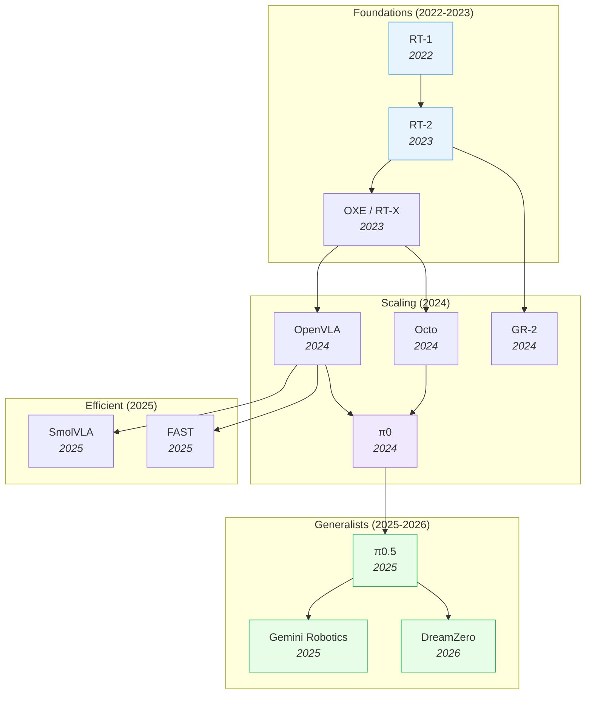

# Vision-Language-Action Models — Deep Dive

> [!abstract] Overview
> VLAs inherit robust multi-modal representations from pre-trained VLMs, giving robots semantic generalization that model-free and model-based approaches lack. From RT-1's proof-of-concept (2022) to π0.5's open-world household deployment (2025), VLAs have evolved from single-task imitation to general-purpose robot policies. This note maps the full VLA landscape: design principles, efficiency frontiers, spatial reasoning, world-model augmentation, RL post-training, multi-sensor integration, and failure modes.

## Evolution Graph

From Transformer-as-policy to flow-matching generalists — each step solved a specific bottleneck.

The field evolved through three phases: **proving the paradigm** (2022-2023), **scaling and opening** (2024), and **specialization** (2025-2026) — splitting into generalist, efficient, and world-model-augmented branches.

| Year | Model | Key Innovation | Bottleneck Solved |
|------|-------|----------------|-------------------|
| 2022 | [[2212.06817\|RT-1]] | Transformer on 130K real demos, 700 tasks | Proved Transformers work for robot control |
| 2023 | [[2307.15818\|RT-2]] | Fine-tuned PaLI-X (55B) VLM as policy | Web-scale knowledge transfers to robots |
| 2023 | [[2310.08864\|OXE]] | 1M+ trajectories from 22 robot types | Cross-embodiment positive transfer |
| 2024 | [[2405.12213\|Octo]] | Modular generalist policy | First open-source generalist robot policy |
| 2024 | [[2406.09246\|OpenVLA]] | Open-source 7B VLA | Democratized VLA research |
| 2024 | [[2410.06158\|GR-2]] | Web-scale video pre-training for actions | Video knowledge → robot manipulation |
| 2024 | [[2410.24164\|π0]] | Flow matching action expert + VLM | Continuous actions + dexterous manipulation |
| 2025 | [[2504.16054\|π0.5]] | Co-training on heterogeneous embodiments | Open-world generalization to unseen homes |
| 2025 | [[2503.20020\|Gemini Robotics]] | Gemini 2.0 extended to physical robots | Industrial-scale VLA |
| 2025 | [[2501.09747\|FAST]] | DCT+Huffman action compression | 5x faster VLA inference |
| 2025 | [[2506.01844\|SmolVLA]] | 450M param VLA | 7x less memory, 40% faster training |
| 2026 | [[2602.15922\|DreamZero]] | Joint video + action prediction (14B WAM) | Zero-shot robot policies |

> [!tip] Three Evolutionary Phases
> **Phase 1 — Proof of concept** (2022-2023): RT-1 proved Transformers work, RT-2 showed VLM knowledge transfers, OXE built the cross-embodiment data foundation. **Phase 2 — Democratization** (2024): OpenVLA and Octo opened weights/code, π0 introduced flow matching for continuous control. **Phase 3 — Specialization** (2025+): The field split — generalists scaled up (π0.5, Gemini), efficient variants scaled down (FAST, SmolVLA), and WAMs added world prediction (DreamZero).

---

## 1. Design-Space Principles

Based on [[2412.14058|RoboVLMs]]' 600+ experiments — the most systematic VLA design-space study to date.

> [!success] Ideal VLA Recipe (from RoboVLMs)
> ==KosMos/PaliGemma backbone== + ==Policy Head fusion== + ==Continuous actions== + ==MoE== + ==Post-training on in-domain data==

### Backbone Selection

| Category | Models | Finding |
|----------|--------|---------|
| ==Encoder-Decoder== | Flamingo family | Outperformed by decoder-only |
| ==Decoder-Only== | LLaVA, Qwen-VL, MoonDream, [[2407.07726\|PaliGemma]], KosMos | KosMos and PaliGemma are distinctly superior |

**Why these two win**: Extensive ==vision-language pre-training== on large-scale datasets creates stronger alignment between visual and linguistic features — critical for following complex spatial instructions.

### Architecture Axes

**Action Space**: ==Continuous== (recommended) — avoids compounding discretization errors. [[2510.13054|VLA-0]] later confirmed: simply representing actions as numerical text strings works surprisingly well without any architecture modification.

**History Fusion**: ==Policy Head== (best balance) — VLM provides per-step features; separate head fuses history. [[2506.19816|CronusVLA]] extends this to multi-frame observations for temporal robustness.

**Training Loss**: ==Flow Matching== and ==MSE+BCE== achieve similar results. [[2602.18224|SimVLA]] confirmed this with a streamlined 0.5B model achieving 98.6% on LIBERO.

### Data Strategy

| Strategy | Impact |
|----------|--------|
| **In-domain only** | Best for task-specific performance |
| **Cross-embodiment (OXE)** | Improves few-shot learning (+17.2% on CALVIN few-shot) |
| **==Post-training==** (OXE → in-domain fine-tune) | Best overall — highest gains for high-frequency skills |

> [!tip] The VLA-0 Surprise
> [[2510.13054|VLA-0]] showed you don't need custom action heads, special tokenizers, or architectural changes at all — just fine-tune an unmodified VLM with actions as text. Sometimes the simplest approach wins.

---

## 2. Efficient & Lightweight VLAs

Full-size VLAs (7B+) are impractical for real-time robot control. This frontier trades model size for deployment speed.

| Model | Params | Key Innovation | Speed |
|-------|--------|---------------|-------|
| [[2501.09747\|FAST]] | Compression | Action tokenization via DCT+Huffman; 5x faster inference | Real-time |
| [[2506.01844\|SmolVLA]] | 450M | 7x less memory, 40% faster training than OpenVLA | Real-time |
| [[2409.12514\|TinyVLA]] | Small | Diffusion action head + efficient VLM backbone | Fast |
| [[2509.09372\|VLA-Adapter]] | 0.5B | Lightweight adapter bridges VLM representations to actions | Fast |
| [[2510.13054\|VLA-0]] | Any VLM | Zero modification — actions as text strings | Varies |
| [[2511.14148\|AsyncVLA]] | Any | Asynchronous flow matching with confidence-based self-correction | Real-time |

> [!tip] When Smaller Is Enough
> For structured environments with known objects, SmolVLA (450M) matches larger models. For open-world tasks with novel objects, you still need 3B+. The sweet spot: use FAST tokenization on a mid-size model.

---

## 3. Spatial & 3D-Aware VLAs

Standard VLAs process 2D images — they lack explicit 3D understanding. These models integrate depth, point clouds, or 3D embeddings.

| Model | Spatial Feature | Result |
|-------|----------------|--------|
| [[2501.15830\|SpatialVLA]] | Adaptive 3D spatial representations | Equipped VLAs with 3D spatial understanding |
| [[2506.22242\|4D-VLA]] | 3D coordinate embeddings + multi-frame context | Resolved ambiguous robot positioning |
| [[2510.12276\|Spatial Forcing]] | Implicit 3D perception via spatial forcing | No explicit depth input needed |
| [[2508.07917\|MolmoAct]] | Depth-aware perception tokens + visual reasoning traces | Spatial reasoning for manipulation |
| [[2602.11236\|ABot-M0]] | Action Manifold Learning on 6M+ trajectories | Learned spatial action representations |
| [[2412.10345\|TraceVLA]] | Visual trace overlays of past trajectories | Spatial-temporal awareness from 2D |

> [!tip] 3D Without 3D Sensors
> The field is split: [[2501.15830|SpatialVLA]] and [[2506.22242|4D-VLA]] add explicit 3D features, while [[2510.12276|Spatial Forcing]] and [[2412.10345|TraceVLA]] achieve spatial awareness *implicitly* from 2D. Implicit approaches are cheaper to deploy but explicit approaches generalize better to novel viewpoints.

---

## 4. Reasoning & Planning-Augmented VLAs

Pure imitation is brittle — these models add test-time reasoning (chain-of-thought, MCTS, subgoal prediction) to improve robustness.

| Model | Reasoning Type | Benefit |
|-------|---------------|---------|
| [[2601.11404\|ACoT-VLA]] | Action Chain-of-Thought (reason in action space) | Explicit action-space reasoning |
| [[2509.22643\|VLA-Reasoner]] | Online MCTS with world model | Simulates futures to select optimal actions |
| [[2506.00123\|VeBrain]] | Unified spatial reasoning + control | See-Think-Control pipeline |
| [[2505.03500\|TLI]] | Text Latent Interpolation for skill recombination | Extrapolation: 9% → 83% on OOD tasks |

> [!tip] When Reasoning Helps
> Reasoning adds latency, so it's not always worth it. Use it for: (1) long-horizon tasks with many decision points, (2) novel task compositions (TLI), (3) tasks requiring spatial inference. Skip it for: fast pick-and-place where imitation suffices.

---

## 5. World-Model-Augmented VLAs

VLAs that incorporate learned dynamics models for planning, imagination, or co-training. See [[04_WAM]] for the full WAM taxonomy.

| Model | Integration Style | Key Insight |
|-------|------------------|-------------|
| [[2602.12063\|VLAW]] | Iterative co-improvement of VLA + world model | VLA and WM reinforce each other |
| [[2602.10098\|VLA-JEPA]] | JEPA-based latent world model attached to VLA | Latent prediction improves action quality |
| [[2601.16163\|Cosmos Policy]] | Video diffusion model fine-tuned as policy | Video prediction = action planning |
| [[2507.04447\|DreamVLA]] | Forecasts depth + semantics + dynamics | Comprehensive world knowledge |
| [[2506.19850\|UniVLA]] | All modalities as discrete tokens in one Transformer | Unified autoregressive generation |
| [[2511.17502\|RynnVLA-002]] | Unified VLA + world model architecture | Environmental dynamics + action planning |
| [[2509.24948\|RehearseVLA]] | Simulated post-training with VLM-guided reflection | World model for rehearsal, not inference |
| [[2603.16666\|Fast-WAM]] | Video co-training without test-time imagination | WAM benefits without WAM latency |

> [!tip] The Speed-Quality Trade-off
> WAM-augmented VLAs are more robust (spatiotemporal priors from video pretraining) but 4.8x slower than pure VLAs ([[2603.22078|WAM vs VLA Robustness]]). [[2603.16666|Fast-WAM]] shows you can get most of the benefit without test-time imagination — use video co-training, not video generation.

---

## 6. RL Post-Training for VLAs

Imitation learning alone leaves performance on the table. RL fine-tuning after initial SFT consistently improves task success, especially on multi-step tasks.

| Finding | Source |
|---------|--------|
| Simple Sequential Fine-Tuning (LoRA + RL) shows high plasticity with minimal forgetting | [[2603.11653\|VLA RL Continual Learning]] |
| VLAs are surprisingly resistant to catastrophic forgetting under continual RL | [[2603.03818\|VLA Continual Learning]] |
| Knowledge insulation: stop gradient flow from action expert to VLM backbone | [[2505.23705\|Knowledge Insulation VLA]] |

> [!success] The RL Recipe for VLAs
> 1. ==SFT== on demonstration data (format learning)
> 2. ==RL with verifiable rewards== (task success signal)
> 3. ==LoRA== for parameter-efficient updates
> 4. ==Knowledge insulation==: keep VLM backbone frozen from action gradients

> [!tip] Why RL Works for VLAs
> VLAs pre-trained on diverse data already have good representations — RL doesn't need to learn from scratch. It just needs to *calibrate* the policy to the deployment environment. LoRA makes this cheap, and VLAs don't catastrophically forget ([[2603.03818|VLA Continual Learning]]).

---

## 7. Multi-Sensor & Force-Aware VLAs

Vision-only policies fail on contact-rich tasks (insertion, assembly, surface following). These models add tactile, force, or proprioceptive modalities.

| Model | Additional Modality | Task Focus |
|-------|-------------------|-----------|
| [[2505.22159\|ForceVLA]] | 6-axis force/torque via Force-aware MoE | Contact-rich manipulation |
| [[2502.14420\|ChatVLA]] | Unified multimodal understanding + control | Vision + language + action in one model |
| [[2508.19236\|MemoryVLA]] | Bio-inspired dual-memory system | Long-horizon tasks with perceptual memory |

> [!tip] When Vision Isn't Enough
> If the task involves contact forces (insertion, polishing, assembly), add force sensing. If the task involves long-horizon memory (multi-room navigation, sequential assembly), add memory modules. Most manipulation tasks still work with vision only.

---

## 8. Humanoid & Bimanual VLAs

Single-arm tabletop manipulation is the default VLA setting — but real robots have two arms, legs, and whole-body coordination.

| Model | Embodiment | Key Innovation |
|-------|-----------|---------------|
| [[2502.14795\|Humanoid-VLA]] | Humanoid (full-body) | First VLA for humanoid robots |
| [[2511.05275\|TwinVLA]] | Bimanual | Compose two single-arm VLAs for bimanual tasks |
| [[2410.07864\|RDT-1B]] | Bimanual | 1.2B diffusion foundation model for bimanual manipulation |
| [[2512.00975\|MM-ACT]] | Multi-modal | Unified text + image + action token space |
| [[2602.12062\|HoloBrain-0]] | Multi-platform | Full-stack open-source VLA ecosystem |

> [!tip] Bimanual Scaling
> [[2511.05275|TwinVLA]] shows you can compose two pre-trained single-arm VLAs rather than training a bimanual model from scratch — data-efficient and surprisingly effective. The key insight: coordination can be learned as a thin layer on top of individual skill.

---

## 9. Self-Evolving & Continual VLAs

VLAs that autonomously improve through self-play, continual learning, or evolutionary strategies.

| Model | Self-Improvement Mechanism |
|-------|--------------------------|
| [[2511.16166\|EvoVLA]] | Self-evolving framework: overcomes stage hallucination and fragile memory |
| [[2603.11653\|VLA RL Continual Learning]] | Sequential RL fine-tuning with minimal forgetting |
| [[2603.03818\|VLA Continual Learning]] | Pre-trained VLAs are naturally resistant to forgetting |
| [[2603.09030\|PlayWorld]] | Autonomous self-play data collection → world model training |

> [!tip] The Continual Learning Surprise
> Two independent studies ([[2603.11653|VLA RL Continual Learning]], [[2603.03818|VLA Continual Learning]]) found the same result: VLAs pre-trained on diverse data are *naturally* resistant to catastrophic forgetting. You don't need complex continual learning algorithms — simple sequential fine-tuning works. This is the opposite of what the NLP literature suggests.

---

## 10. Failure Modes & Robustness

Understanding when VLAs break is as important as knowing when they work.

| Failure Mode | Evidence | Implication |
|-------------|----------|-------------|
| **Spatial overfitting** | [[2505.03500\|TLI]] — VLAs map object names to *fixed training locations* instead of abstract identities | Novel object positions break policies |
| **Visual perturbation brittleness** | [[2603.22078\|WAM vs VLA Robustness]] — VLAs struggle under camera/light/background changes | WAMs are more robust (spatiotemporal priors from video pretraining) |
| **Detail-oriented failure** | [[2601.11421\|GM-100]] — 100 detail-oriented tasks expose very low VLA success rates | Current VLAs are coarse-grained; fine manipulation is unsolved |
| **Inference speed** | WAMs are ≥4.8x slower than VLAs (π0.5 at 63ms/chunk is fastest) | Real-time control needs efficient architectures |

> [!tip] The Robustness Hierarchy
> From most to least robust: (1) WAMs with video pretraining, (2) VLAs with diverse cross-embodiment training (π0.5), (3) VLAs with in-domain-only training. If robustness matters more than speed, consider WAM augmentation. If speed matters, use knowledge insulation + diverse training.

---

## Quick-Reference Matrix

| Question | Answer |
|----------|--------|
| Why VLAs? | Strong robustness in real scenarios via VLM pre-training |
| Which backbone? | KosMos, [[2407.07726\|PaliGemma]] (extensive multi-modal pre-training) |
| How to formulate? | ==Continuous actions== + ==Policy Head== for history fusion |
| How to train? | Flow Matching ≈ MSE; ==MoE== for zero-shot generalization |
| Data strategy? | ==Post-training==: cross-embodiment pre-train → in-domain fine-tune |
| Need efficiency? | [[2501.09747\|FAST]] tokenization or [[2506.01844\|SmolVLA]] (450M) |
| Need 3D? | [[2501.15830\|SpatialVLA]] (explicit) or [[2510.12276\|Spatial Forcing]] (implicit) |
| Need reasoning? | [[2509.22643\|VLA-Reasoner]] (MCTS) or [[2601.11404\|ACoT-VLA]] (action CoT) |
| Need world model? | [[2602.12063\|VLAW]] (co-improvement) or [[2603.16666\|Fast-WAM]] (no latency) |
| Need RL? | Knowledge insulation + LoRA + verifiable rewards |
| Need bimanual? | [[2511.05275\|TwinVLA]] (compose two single-arm) or [[2410.07864\|RDT-1B]] |
| Need robustness? | WAM augmentation or diverse cross-embodiment training |

---

## Cross-References

- [[01_VLA-WAM-101]] — VLA vs WAM basics and four learning strategies
- [[04_WAM]] — Full WAM taxonomy (VideoGen, VLM-based, From Scratch)
- [[04-1_JEPA]] — JEPA evolution lineage (V-JEPA 2 → VLA-JEPA)
- [[02_Dataset-Benchmark-Environment]] — Datasets, benchmarks, and simulation platforms

---

*See [[04_WAM]] for the world-model alternative, or [[01_VLA-WAM-101]] to start from the basics.*
