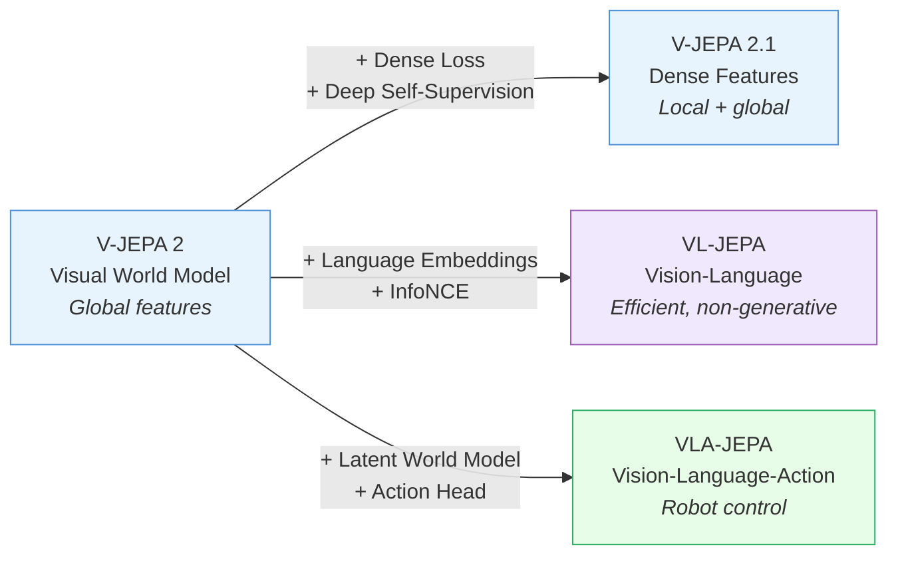

%%
PROMPT:
From @_KnowledgeHub_, briefly explain the differences between V-JEPA 2, V-JEPA 2.1, VL-JEPA, and VLA-JEPA based on the papers listed below. Explain how to evolve from V-JEPA 2 to V-JEPA 2.1, and then to VL-JEPA and VLA-JEPA, highlighting the key innovations and improvements at each stage.

- https://arxiv.org/abs/2506.09985  # V-JEPA 2
- https://arxiv.org/abs/2603.14482  # V-JEPA 2.1
- https://arxiv.org/abs/2512.10942  # VL-JEPA
- https://arxiv.org/abs/2602.10098  # VLA-JEPA
%%

# JEPA Evolution: From V-JEPA 2 to VLA-JEPA

This note traces the evolution of the Joint Embedding Predictive Architecture (JEPA) family across four key papers, showing how a self-supervised video encoder progressively gained ==dense features==, ==language understanding==, and ==robotic action generation==.

## Overview

| Model | Paper | Focus | Key Innovation |
|---|---|---|---|
| [[2506.09985\|V-JEPA 2]] | Jun 2025 | Video understanding + planning | Mask-denoising pretraining on 1M+ hours of video |
| [[2603.14482\|V-JEPA 2.1]] | Mar 2026 | Dense spatial features | Dense Predictive Loss on masked *and* unmasked tokens |
| [[2512.10942\|VL-JEPA]] | Dec 2025 | Vision-language tasks | Latent-space embedding prediction (no token generation) |
| [[2602.10098\|VLA-JEPA]] | Feb 2026 | Robotic manipulation | JEPA world model + flow-matching action head |

## Stage 1: V-JEPA 2 — The Visual World Model

[[2506.09985|V-JEPA 2]] (FAIR, Meta) established the foundation: a ==mask-denoising objective== in learned representation space, pretrained on **1M+ hours** of internet video. The core insight is that predicting in ==latent space== rather than pixel space filters out unpredictable visual noise and focuses on learnable dynamics.

**What it can do:**
- Video understanding: **77.3%** on SSv2, **84.0%** on PerceptionTest
- Zero-shot robotic control via ==Model Predictive Control (MPC)==: **80%** pick-and-place success using only **62 hours** of unlabeled robot video

**Limitation:** Features are optimized for ==global== video understanding — local spatial structure is fragmented, limiting dense tasks like depth estimation and segmentation.

## Stage 2: V-JEPA 2.1 — Unlocking Dense Features

> [!tip] Key Evolution: Global → Dense
> V-JEPA 2 only supervised ==masked== tokens, causing context tokens to become global aggregators that lose local detail. V-JEPA 2.1 fixes this by supervising ==all== tokens.

[[2603.14482|V-JEPA 2.1]] introduces three innovations on top of V-JEPA 2:

1. **Dense Predictive Loss** — Supervises both masked and unmasked tokens with a dynamically weighted scheme, forcing every token to encode fine-grained local information
2. **Deep Self-Supervision** — Applies the predictive objective at ==multiple intermediate encoder layers==, not just the final output, improving representations throughout the network
3. **Modality-specific tokenizers** — Uses 2D tokenizers for images and 3D for videos, with a learnable modality token, enabling joint image-video training at scale (==ViT-G==, VisionMix-163M)

**What changed:**
- Depth estimation: **RMSE 0.307** on NYUv2 (new SOTA)
- Grasping success: **+20%** over V-JEPA 2
- Navigation planning: **10x faster**
- Action anticipation: **+2.8%** on EPIC-KITCHENS-100

## Stage 3: VL-JEPA — Adding Language

> [!tip] Key Evolution: Vision-only → Vision-Language
> V-JEPA 2/2.1 have no language understanding. VL-JEPA brings language into the JEPA framework — but ==predicts embeddings, not tokens==, making it fundamentally different from generative VLMs.

[[2512.10942|VL-JEPA]] (FAIR, Meta) extends JEPA to vision-language by:

1. **Latent-space prediction** — Instead of autoregressively generating text tokens, VL-JEPA predicts ==abstract semantic embeddings== via an ==InfoNCE loss==, discarding surface-level linguistic variability
2. **Four-component architecture** — Visual X-Encoder, query-conditioned Predictor, textual Y-Encoder (training), Y-Decoder (inference only)
3. **Selective decoding** — For video streams, embedding similarity identifies which frames need text decoding, reducing operations by **~2.85x**

**What it can do:**
- Video classification: **46.4%** average across 8 datasets
- Text-to-video retrieval: **58.4%** Recall@1 across 8 datasets
- Competitive VQA with only **1.6B** parameters

**Key trade-off:** VL-JEPA excels at discriminative tasks (classification, retrieval) and real-time streaming, but doesn't generate open-ended text like generative VLMs.

## Stage 4: VLA-JEPA — From Understanding to Action

> [!tip] Key Evolution: Understanding → Control
> VLA-JEPA closes the loop: JEPA's latent world model becomes the backbone for a full ==Vision-Language-Action== pipeline that generates robot trajectories.

[[2602.10098|VLA-JEPA]] integrates JEPA into robotic manipulation through:

1. **JEPA-style latent world model** — Predicts future ==latent representations== (not pixels), inherently filtering noise from real-world video
2. **Leakage-free state prediction** — Future frames are used ==only as supervision targets==, never as input, ensuring latent actions capture true dynamics rather than encoding shortcuts
3. **Unified two-stage pretraining** — Combines action-free human videos + action-labeled robot data in a single pipeline (simpler than multi-stage alternatives)
4. **Flow-matching action head** — Generates smooth action trajectories conditioned on a ==Qwen3-VL== backbone

**What it can do:**
- LIBERO in-distribution: **97.2%** average success
- LIBERO-Plus (OOD): **79.5%** average success
- SimplerEnv Google Robot: **65.2%** average success (SOTA)
- Emergent skills like repeated grasping from human video exposure

## Evolution Summary

> [!abstract] The JEPA Principle
> All four models share a core idea: ==predict in representation space, not pixel space==. This filters out unpredictable visual noise and focuses learning on the underlying dynamics and semantics that matter for downstream tasks — whether that's answering questions, estimating depth, or controlling a robot.
