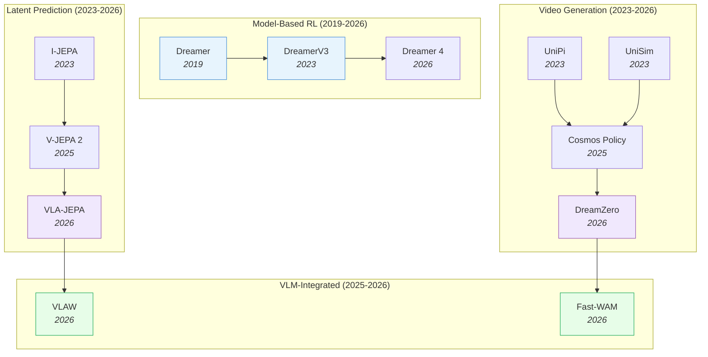

# World Action Models — Deep Dive

> [!abstract] Overview
> World Action Models (WAMs) learn to predict future states of the environment, giving robots the ability to "imagine" consequences before acting. Unlike VLAs that map observations directly to actions, WAMs explicitly model dynamics — enabling planning, robustness to perturbation, and sample-efficient learning. This note maps the full WAM landscape across five paradigms: VideoGen, latent prediction (JEPA family), model-based RL (Dreamer lineage), VLM-integrated, and efficient/action-centered designs.

## Evolution Graph

The field evolved through four threads: **model-based RL** (2019-2026) where Dreamer established latent imagination for planning; **video generation** (2023-2026) where diffusion models learned physics from internet video; **latent prediction** (2023-2026) where JEPA showed you can predict in representation space without reconstructing pixels; and **VLM integration** (2025-2026) where world models merged with VLAs for robust, efficient policies.

| Year | Paper | Contribution |
|------|-------|-------------|
| 2019 | [[1912.01603\|Dreamer]] | Latent imagination via RSSM; learned behaviors from pixels without reward |
| 2023 | [[2301.04104\|DreamerV3]] | Mastered diverse domains with fixed hyperparameters; universal model-based RL |
| 2023 | [[2302.00111\|UniPi]] | Actions as text-conditioned video; proved video generation = planning |
| 2023 | [[2310.06114\|UniSim]] | Universal simulator via video diffusion; interactive world generation |
| 2023 | [[2301.08243\|I-JEPA]] | Predict in latent space, not pixel space; avoids reconstruction artifacts |
| 2025 | [[2506.09985\|V-JEPA 2]] | Self-supervised video model enabling understanding, prediction, and planning |
| 2025 | [[2601.16163\|Cosmos Policy]] | Fine-tuned video diffusion model as visuomotor policy |
| 2026 | [[2602.15922\|DreamZero]] | 14B WAM: joint video + action prediction enables zero-shot policies |
| 2026 | [[2602.10098\|VLA-JEPA]] | JEPA world model + flow-matching action head; 97.2% LIBERO |
| 2026 | [[2602.12063\|VLAW]] | Iterative co-improvement: VLA and world model reinforce each other |
| 2026 | [[2509.24527\|Dreamer 4]] | Scalable world model training agents inside video game environments |
| 2026 | [[2603.16666\|Fast-WAM]] | WAM benefits without test-time imagination via video co-training |

---

## 1. The Design Space

Three axes define where a WAM sits in the design landscape:

| Axis | Options | Trade-off |
|------|---------|-----------|
| **Where to predict** | Pixel space (DreamZero), Latent space (JEPA, UWM), Action space (Diffuser) | Pixel = rich but slow; Latent = fast but abstract; Action = efficient but no visual feedback |
| **When to predict** | Training-time only (Fast-WAM), Test-time imagination (DreamZero) | Training-time = fast inference; Test-time = more robust but 4.8x slower |
| **What to predict** | Full video (Cosmos), Optical flow (FlowVLA), Compressed latent (WoG), Future embeddings (JEPA) | Full video = interpretable but expensive; Latent = efficient but opaque |

> [!tip] The Core Trade-off
> VideoGen WAMs are the most robust (spatiotemporal priors from internet video) but the slowest. Latent prediction WAMs are fast and sample-efficient. [[2603.16666|Fast-WAM]] shows you can bridge this gap: train with video generation objectives but deploy without test-time imagination.

---

## 2. VideoGen WAMs

Video diffusion models repurposed as world simulators. The richest source of physics priors — trained on internet-scale video data.

**Planning as Video Generation** — The foundational insight: generating a video of the future IS a plan.
- [[2310.06114|UniSim]], [[2302.00111|UniPi]], [[2310.10625|VLP]]

**Video Pretraining for Robot Policies** — Train on internet video, fine-tune for robot control.
- [[2602.15922|DreamZero]], [[2601.16163|Cosmos Policy]], [[2601.21998|LingBot-VA]], [[2508.00795|Video Policy]], [[2412.14803|VPP]], [[2410.06158|GR-2]], [[2312.13139|GR-1]]

> [!star] Key Papers
> - [[2602.15922|DreamZero]] — 14B joint video+action model; 39.5% on unseen tasks, 42% cross-embodiment improvement, 7Hz real-time
> - [[2601.16163|Cosmos Policy]] — Fine-tuned Cosmos video model achieves 98.5% on LIBERO; proves pretrained video diffusion transfers to robot control

**Video Models as Data Engines** — Use generated video as synthetic training data instead of running the world model at test time.
- [[2512.24766|Dream2Flow]], [[2512.13644|DexWM]], [[2505.12705|DreamGen]], [[2504.15369|Inverse Probabilistic Adaptation]]

**Physics-Aligned Video Generation** — Explicitly enforce physical plausibility during video generation.
- [[2603.23376|ABot-PhysWorld]], [[2602.05986|RISE-Video]], [[2409.18964|PhysGen]]

> [!star] Key Papers
> - [[2603.23376|ABot-PhysWorld]] — Diffusion-DPO for physics alignment; suppresses implausible predictions (object penetration, anti-gravity)

> [!tip] Video Generation = Physics Engine
> Video diffusion models trained on internet data implicitly learn physics. DreamZero proved joint video+action generation provides spatiotemporal priors that pure VLAs lack. But test-time video generation is expensive — consider Fast-WAM's training-only approach.

---

## 3. Latent Prediction WAMs

Predict in representation space rather than pixel space — faster, more abstract, and avoids wasting capacity on irrelevant visual details. See [[04-1_JEPA]] for the detailed JEPA evolution.

**JEPA Family** — Joint Embedding Predictive Architecture: predict future embeddings from current embeddings.
- [[2603.22281|ThinkJEPA]], [[2603.14482|V-JEPA 2.1]], [[2602.11389|Causal-JEPA]], [[2602.10098|VLA-JEPA]], [[2512.10942|VL-JEPA]], [[2506.09985|V-JEPA 2]]

> [!star] Key Papers
> - [[2602.10098|VLA-JEPA]] — Full VLA+JEPA pipeline: 97.2% LIBERO in-distribution, 79.5% LIBERO-Plus OOD, 65.2% SimplerEnv real robot
> - [[2506.09985|V-JEPA 2]] — 1M+ hours video pretraining; 80% pick-and-place with 62 hours unlabeled robot video
> - [[2602.11389|Causal-JEPA]] — Object-centric world model with causal reasoning via latent interventions

**Unified Latent Diffusion** — Shared diffusion transformer for both video and action in latent space.
- [[2512.13030|Motus]], [[2504.02792|UWM]], [[2503.18938|AdaWorld]]

> [!star] Key Papers
> - [[2504.02792|UWM]] — Unified World Models: coupled video and action diffusion pretraining; clean modern approach

**Self-Supervised Latent Models** — Learn world representations from unlabeled data using self-supervised objectives.
- [[2511.08544|LeJEPA]], [[2509.14252|LLM-JEPA]], [[2507.19468|DINO-world]], [[2505.03176|seq-JEPA]], [[2504.16591|JEPA for RL]], [[2512.19605|KerJEPA]], [[2411.04983|DINO-WM]]

> [!star] Key Papers
> - [[2511.08544|LeJEPA]] — Provable and scalable SSL framework based on Euclidean latent geometry
> - [[2411.04983|DINO-WM]] — Task-agnostic world model on frozen DINOv2 features enables zero-shot planning

> [!tip] Latent > Pixel for Efficiency
> Latent prediction avoids the expensive pixel-level reconstruction of VideoGen WAMs. V-JEPA 2 achieves competitive manipulation performance using self-supervised video pre-training alone. The JEPA family shows that predicting in embedding space produces more semantically meaningful features — you don't waste capacity modeling textures and shadows.

---

## 4. Dreamer Lineage

Model-based RL from scratch: learn a latent dynamics model (RSSM) and plan via imagination in latent space. The oldest WAM paradigm, still evolving.

| Year | Paper | Contribution |
|------|-------|-------------|
| 2019 | [[1912.01603\|Dreamer]] | Latent imagination via RSSM; learned behaviors from pixels |
| 2020 | [[2005.05960\|Plan2Explore]] | Self-supervised exploration via world model disagreement |
| 2020 | [[2007.07853\|γ-Progress]] | Curiosity signal for active world model learning |
| 2022 | [[2206.14176\|DayDreamer]] | Adapted Dreamer to physical robots; hours-not-days learning |
| 2022 | [[2211.15944\|Continual-Dreamer]] | Explored continual RL with world models; measured forgetting |
| 2023 | [[2301.04104\|DreamerV3]] | Universal: fixed hyperparameters across 150+ diverse tasks |
| 2025 | [[2503.21047\|CBET-DreamerV3]] | Change-based intrinsic motivation for harder exploration |
| 2026 | [[2509.24527\|Dreamer 4]] | Scalable world model in complex video game environments |

**Related Model-Based Planning** — Planning algorithms that leverage learned world models.
- [[2602.00475|GRASP]], [[2410.00564|JOWA]], [[2302.01877|AdaptDiffuser]], [[2205.09991|Diffuser]]

> [!star] Key Papers
> - [[2301.04104|DreamerV3]] — Fixed hyperparameters across 150+ tasks; proved model-based RL generalizes without per-task tuning
> - [[2205.09991|Diffuser]] — Denoising diffusion for trajectory optimization; unified planning and acting

> [!tip] Why Dreamer Still Matters
> Dreamer models are lean (no VLM backbone needed), sample-efficient (DayDreamer learned quadruped locomotion in 1 hour), and domain-agnostic (DreamerV3's fixed hyperparameters). When you don't have a pretrained VLM or internet video, the Dreamer approach remains the strongest option.

---

## 5. VLM-Integrated WAMs

VLMs provide semantic understanding; world models provide dynamics prediction. These papers combine both.

**Visual Chain-of-Thought** — VLMs predict visual subgoals before generating actions.
- [[2603.14497|WorldVLM]], [[2509.02722|VLWM]], [[2507.23773|SimuRA]], [[2601.02456|InternVLA-A1]]

**Unified Policy + World Model** — Single framework that jointly trains policy and world model.
- [[2602.12063|VLAW]], [[2511.17502|RynnVLA-002]], [[2506.21539|WorldVLA]], [[2506.19850|UniVLA]]

> [!star] Key Papers
> - [[2602.12063|VLAW]] — Iterative co-improvement loop: VLA and world model reinforce each other; 39% improvement
> - [[2603.14497|WorldVLM]] — Hybrid: VLM for high-level reasoning + world model for low-level dynamics

**Imagination & Test-Time Reasoning** — World models used for test-time simulation and planning.
- [[2602.08236|AVIC]], [[2507.12508|MindJourney]], [[2602.01960|GVP-WM]], [[2601.14514|JIT]]

> [!star] Key Papers
> - [[2602.08236|AVIC]] — Adaptive: decides *when and how much* to imagine based on task difficulty

**Compact Motion Representations** — Predict condensed motion signals instead of full video.
- [[2602.22010|WoG]]

> [!tip] The Co-Improvement Insight
> VLAW showed that VLA and world model don't just coexist — they actively improve each other through iterative training. The world model generates better synthetic data for the VLA, and the VLA's improving actions give the world model harder scenarios to learn from.

---

## 6. Efficient & Action-Centered WAMs

Full video generation at test time is 4.8x slower than pure VLAs. These models keep WAM benefits while eliminating the inference bottleneck.

| Model | Efficiency Strategy | Key Finding |
|-------|-------------------|-------------|
| [[2603.16666\|Fast-WAM]] | Video co-training, no test-time imagination | WAM robustness without WAM latency |
| [[2603.17240\|GigaWorld-Policy]] | Action-centered architecture | Efficient action-focused world modeling |
| [[2512.19133\|WorldRFT]] | Latent world model + RL fine-tuning | Planning in latent space for driving |
| [[2504.16680\|RWM-U]] | Uncertainty-aware robotic world model | Offline model-based RL on real robots |
| [[2503.16806\|DyWA]] | Dynamics-adaptive world action model | Generalizable non-prehensile manipulation |
| [[2410.00564\|JOWA]] | Jointly-optimized world-action pretraining | Scaled offline model-based RL |

> [!success] The Efficiency Recipe
> ==Train with video objectives== (to get spatiotemporal priors) → ==Deploy without video generation== (no test-time imagination). Fast-WAM proved this works: you get most of the robustness benefit without the latency penalty.

> [!tip] Training-Time vs Test-Time Video
> The critical insight from 2026: you need video generation at **training time** (to learn physics) but NOT at **test time** (where it causes latency). This decouples the benefit of VideoGen WAMs from their computational cost.

---

## 7. Self-Evolving WAMs

WAMs that autonomously improve through experience, self-play, or co-evolution. See [[04-2_Self-Evolving-WAM-101]] for the conceptual foundations.

| Model | Self-Improvement Mechanism |
|-------|--------------------------|
| [[2603.09030\|PlayWorld]] | Autonomous self-play data collection → world model training |
| [[2603.08403\|SPIRAL]] | Closed-loop self-improving action world model |
| [[2506.23468\|NavMorph]] | Self-evolving world model for VLN in continuous environments |
| [[2504.21024\|WebEvolver]] | Co-evolving web agent and world model |
| [[2502.05907\|EvoAgent]] | Continual self-evolving via world model; +105% on long-horizon tasks |

> [!tip] Why WAMs Enable Self-Evolution
> WAMs have a unique advantage for self-evolution: they already have a learned dynamics model that can generate synthetic experience. This means the agent can "rehearse" in imagination, discover failure modes, and improve without costly real-world interaction. SPIRAL and EvoAgent show this creates positive feedback loops.

---

## 8. Failure Modes & Robustness

| Failure Mode | Evidence | Implication |
|-------------|----------|-------------|
| **Hallucinated dynamics** | Video generation models may predict physically impossible futures | ABot-PhysWorld addresses this with Diffusion-DPO |
| **Artifact exploitation** | Agents may exploit unrealistic artifacts in generated video | Need physics-grounded training objectives |
| **Inference latency** | WAMs are ≥4.8x slower than VLAs ([[2603.22078\|WAM vs VLA Robustness]]) | Use Fast-WAM or training-only video |
| **Visual perturbation robustness** | WAMs outperform VLAs on camera/light/background changes | Spatiotemporal priors from video pretraining help |

> [!tip] When to Use WAM vs VLA
> **Use WAM when:** robustness to visual perturbations matters, physics-aware planning is needed, or real-world data is limited (world model enables imagination). **Use pure VLA when:** inference speed is critical, tasks are simple enough for direct imitation, or in-domain data is abundant.

---

## 9. Cross-Paradigm Comparison

| Paradigm | Speed | Robustness | Sample Efficiency | Transfer | Best For |
|----------|-------|-----------|-------------------|----------|----------|
| **VideoGen** (DreamZero) | Slow (7Hz) | Highest | Moderate | Cross-embodiment via video | Novel environments, zero-shot |
| **Latent** (VLA-JEPA) | Fast | High | High | Latent transfer | In-domain, real-time control |
| **Dreamer** (DreamerV3) | Fast | Moderate | Highest | Within-domain | Limited data, no VLM available |
| **VLM-Integrated** (VLAW) | Moderate | High | Moderate | Semantic transfer | Complex tasks needing reasoning |
| **Efficient** (Fast-WAM) | Fast | High | Moderate | VideoGen priors, fast deploy | Production deployment |

---

## Quick-Reference Matrix

| Question | Answer |
|----------|--------|
| Need physics? | VideoGen (DreamZero) or physics-aligned (ABot-PhysWorld) |
| Need speed? | Latent (VLA-JEPA) or Efficient (Fast-WAM) |
| Limited data? | Dreamer lineage (sample-efficient from scratch) |
| Need reasoning? | VLM-Integrated (VLAW, WorldVLM, AVIC) |
| Need self-improvement? | Self-Evolving (EvoAgent, SPIRAL) |
| Need cross-embodiment? | VideoGen (DreamZero) — video priors transfer |
| Production deployment? | Efficient (Fast-WAM) — training-time video, test-time speed |
| Full JEPA lineage? | [[04-1_JEPA]] for V-JEPA 2 → 2.1 → VL-JEPA → VLA-JEPA |

---

## Cross-References

- [[03_VLA]] — VLA deep-dive (Section 6 covers WAM-augmented VLAs)
- [[04-1_JEPA]] — Detailed JEPA evolution (V-JEPA 2 → 2.1 → VL-JEPA → VLA-JEPA)
- [[04-2_Self-Evolving-WAM-101]] — Conceptual foundations of self-evolving WAMs
- [[01_VLA-WAM-101]] — VLA vs WAM basics and four learning strategies
- [[02_Dataset-Benchmark-Environment]] — Datasets, benchmarks, and simulation platforms

---

*See [[03_VLA]] for the VLA alternative, or [[01_VLA-WAM-101]] to start from the basics.*
