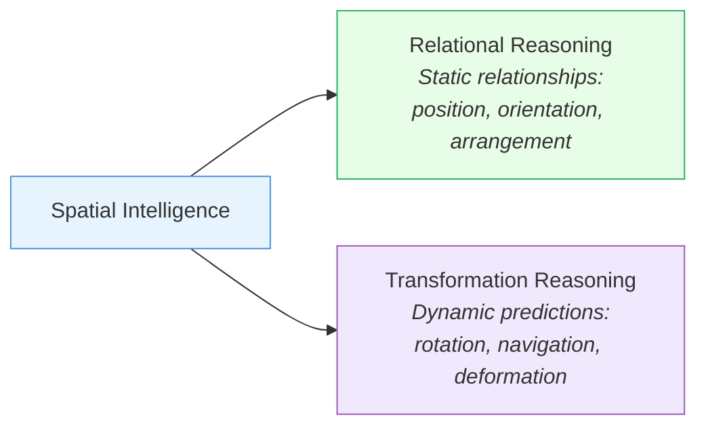

## Background & Rationales

Spatial intelligence is the cognitive ability to perceive, understand, and reason about spatial relationships within an environment. This capability — including spatial visualization, mental rotation, and navigation — is critical for AI systems performing complex tasks. Its applications are foundational to embodied agents, smart cities, and Earth sciences, where systems must interact with and comprehend the physical world [[2504.09848|LLM Spatial Intelligence Survey]].

Advancing this intelligence requires a focus on two core cognitive functions: ==relational reasoning== and ==transformation reasoning==. Relational reasoning involves understanding static relationships between objects — position, orientation, and arrangement. Transformation reasoning is the dynamic ability to predict how these relationships change over time or in response to actions, such as mentally rotating an object or navigating a new path. Mastering both is essential for building robust spatial intelligence, aligning with recent calls for precise definitions and systematic frameworks in MLLM development [[2504.09848|Scaling Spatial Intelligence]].

### High-Level Challenges

Despite progress in MLLMs, survey papers continue to identify significant challenges hindering genuine spatial intelligence. These include the lack of systematic frameworks for data curation, tailored training objectives, and a comprehensive understanding of model limitations [[2504.09848|Scaling Spatial Intelligence]], [[2504.09848|LLM Spatial Intelligence Survey]]. These general issues are confirmed by benchmark studies that pinpoint specific, recurring failures across four dimensions:

> [!warning] Four Dimensions of Spatial Failure

#### 1. Multi-View & Cross-View Reasoning

Models fail to integrate information, maintain geometric consistency, and handle occlusions across different perspectives [[2505.23764|MMSI-Bench]], [[2504.15280|All-Angles Bench]], [[2505.21500|ViewSpatial-Bench]], [[2506.18385|InternSpatial]], [[2507.18342|EgoExoBench]], [[2412.10908|Do VLMs Understand 3D Shapes]].

#### 2. Compositional & Mental Modeling

Models struggle with multi-step spatial reasoning and mental scene construction from limited information [[2506.07966|SpaCE-10]], [[2506.21458|MindCube]], [[2506.14512|SIRI-Bench]], [[2412.07825|3DSRBench]], [[2507.20174|LRR-Bench]].

#### 3. Spatio-Temporal Understanding

MLLMs exhibit notable weaknesses in precise spatio-temporal understanding, struggling to reason about dynamic events from varied viewpoints such as top-down, omnidirectional, or 4D scenes [[2503.23765|STI-Bench]], [[2406.02537|TopViewRS]], [[2506.03135|OmniSpatial]], [[2505.05456|SITE]], [[2506.03135|OmniSpatial]], [[2508.02095|VLM4D]].

#### 4. 3D Geometric Reasoning

A fundamental gap exists in complex 3D geometric reasoning, including tasks related to pose, depth, and higher-dimensional transformations [[2505.17012|SpatialScore]], [[2506.04633|STARE]], [[2506.18385|InternSpatial]], [[2507.07610|SpatialViz-Bench]], [[2507.18342|EgoExoBench]], [[2406.01584|SpatialRGPT]], [[2408.16662|Space3D-Bench]], [[2410.06468|Spatial457]], [[2410.06468|SPACE]], [[2502.16435|VISFACTOR]].

### Specialized Benchmarks

To address these limitations, specialized benchmarks have been developed to rigorously evaluate and quantify spatial reasoning capabilities:

| Category | Benchmarks |
| --- | --- |
| Multi-view & cross-view | [[2505.23764\|MMSI-Bench]], [[2504.15280\|All-Angles Bench]], [[2505.21500\|ViewSpatial-Bench]], [[2506.18385\|InternSpatial]], [[2507.18342\|EgoExoBench]], [[2412.10908\|Do VLMs Understand 3D Shapes]] |
| Spatio-temporal | [[2505.11907\|VSI-Bench]], [[2503.23765\|STI-Bench]], [[2406.02537\|TopViewRS]], [[2506.03135\|OmniSpatial]], [[2505.05456\|SITE]], [[2508.02095\|VLM4D]] |
| 3D geometric & compositional | [[2505.17012\|SpatialScore]], [[2506.07966\|SpaCE-10]], [[2506.21458\|MindCube]], [[2506.14512\|SIRI-Bench]], [[2412.07825\|3DSRBench]], [[2507.20174\|LRR-Bench]], [[2506.04633\|STARE]], [[2506.18385\|InternSpatial]], [[2507.07610\|SpatialViz-Bench]], [[2507.18342\|EgoExoBench]], [[2406.01584\|SpatialRGPT]], [[2408.16662\|Space3D-Bench]], [[2410.06468\|Spatial457]], [[2410.06468\|SPACE]], [[2502.16435\|VISFACTOR]] |

Collectively, these benchmarks reveal a significant and persistent performance gap between state-of-the-art models and human abilities.

> [!danger] Scaling Alone Is Insufficient
> Even advanced models like GPT-5 show strong performance in metric measurement and spatial relations, but still lag significantly behind human proficiency in complex spatial tasks like ==mental reconstruction and deformation== [[2508.13142|Holistic Spatial Evaluation]]. This underscores that scaling alone is an insufficient strategy for bridging this gap.

---

*Next: [[02_Research-Stages]] | [[03_Methodology]] | [[04_Challenges]]*
