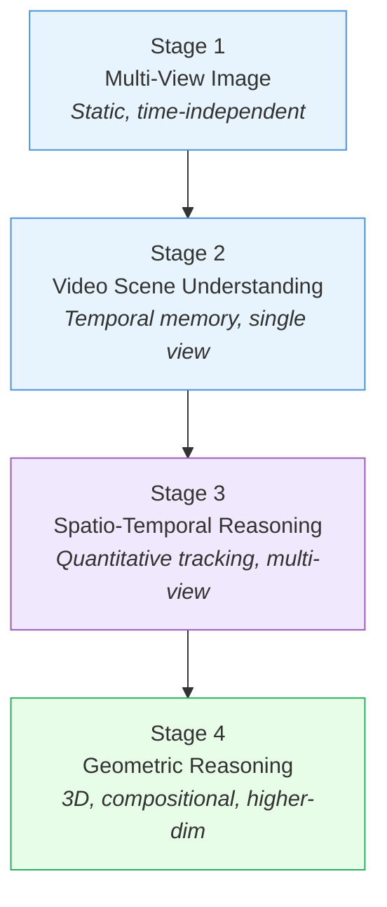

## Research Stages

> [!abstract] Progression
> Four stages of increasing complexity, each building on the last: ==static multi-view → video scene memory → spatio-temporal tracking → 3D geometric reasoning==.

### Stage 1: Multi-View Image Spatial Reasoning

**Goal:** Infer a consistent scene-centric layout from 2+ static views, handling variations in camera pose, field-of-view, and occlusions.

| Benchmark | What It Tests |
| --- | --- |
| [[2505.21500\|ViewSpatial-Bench]] | Cross-view localization and composition |
| [[2504.15280\|All-Angles Bench]] | Multi-perspective understanding |
| [[2505.23764\|MMSI-Bench]] | Multi-image spatial intelligence |
| [[2506.18385\|InternSpatial-Bench]] | Multi-view split |
| [[2506.21458\|MindCube]] | Mental modeling from limited views |

> [!tip] Objective
> Establish reliable, ==time-independent multi-view spatial reasoning== before introducing temporal dynamics.

---

### Stage 2: Video Spatial Scene Understanding

**Goal:** Construct and query a ==temporally evolving memory== of object identities and spatial layout from a single egocentric video stream.

| Benchmark | What It Tests |
| --- | --- |
| [[2505.11907\|VSI-Bench]] | Video spatial intelligence |
| [[2505.05456\|SITE]] | Spatial intelligence in temporal environments |
| [[2506.03135\|OmniSpatial]] | Multi-category video spatial |

> [!tip] Objective
> Transition from static multi-view aggregation to maintaining a ==coherent spatial memory over short video sequences==.

---

### Stage 3: Spatio-Temporal Video Spatial Reasoning

**Goal:** Track objects across distinct viewpoints (egocentric + exocentric), produce ==quantitative estimates== of pose, distance, velocity, and trajectories from RGB video.

| Benchmark | What It Tests |
| --- | --- |
| [[2503.23765\|STI-Bench]] | Precise spatio-temporal metrics |
| [[2508.02095\|VLM4D]] | 4D spatial-temporal understanding |
| [[2507.18342\|EgoExoBench]] | Cross-view temporal association |
| [[2506.14512\|SIRI-Bench]] | Multi-step spatial reasoning in video |

> [!tip] Objective
> Advance from qualitative video QA to ==explicit spatio-temporal competence== measured by quantitative geometric and temporal errors.

---

### Stage 4: Higher-Dimensional Geometric Spatial Reasoning

**Goal:** Explicit and compositionally robust ==geometric accuracy== — metric relations, pose/transformation handling, multi-constraint compositional reasoning in 3D.

| Benchmark | What It Tests |
| --- | --- |
| [[2408.16662\|Space3D-Bench]] | 3D question answering |
| [[2506.07966\|SpaCE-10]] | Compositional spatial intelligence |
| [[2410.06468\|Spatial457]] | High-dimensional diagnostics |
| [[2505.17012\|SpatialScore]] | Unified visual geometry evaluation |
| [[2412.07825\|3DSRBench]] | Single-image 3D spatial relations |
| [[2507.07610\|SpatialViz-Bench]] | 3D visualization and transformation |
| [[2406.02537\|TopViewRS]] | Top-view relational reasoning |
| [[2506.03135\|OmniSpatial]] | Omnidirectional spatial reasoning |

> [!tip] Objective
> Advance beyond video-based reasoning toward ==explicit, geometry-grounded spatial intelligence==.

---

### Stage Progression

---

*Next: [[03_Methodology]] for the methods addressing each stage.*
