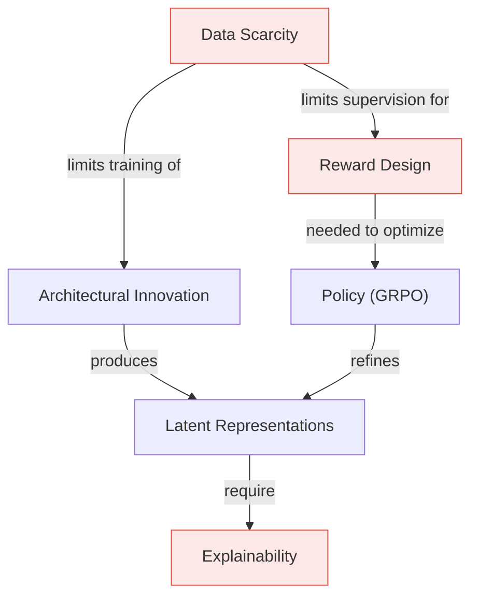

## Challenges

> [!abstract] Four Key Obstacles
> ==Data scarcity==, ==explainability of latent reasoning==, ==reward design for spatial tasks==, and ==architectural bottlenecks== for efficient spatial cognition.

---

### 1. Spatial Dataset Collection & Curation

> [!warning] The Data Bottleneck
> Existing datasets are specialized and fragmented — no single dataset covers the full spectrum of spatial reasoning tasks.

A significant challenge is the scarcity of comprehensive datasets covering the full spectrum of reasoning tasks. Existing datasets focus on narrow capabilities such as multi-perspective localization [[2505.21500|ViewSpatial-Bench]], [[2412.10439|SpaceR]], video-based reasoning [[2503.21776|Video-R1]], [[2504.00883|vsGRPO]], [[2505.12434|VideoRFT]], [[2506.03642|Spatial Understanding from Videos]], or skill decomposition [[2506.03525|Video-Skill-CoT]], [[2506.00318|Chain-of-Frames]], complicating the training of a universally proficient model. Many datasets are curated for specific paradigms including multi-image understanding [[2505.17015|Multi-SpatialMLLM]], visuospatial instruction following [[2505.12312|Visuospatial CA]], spatial model training [[2505.23747|Spatial-MLLM]], [[2505.12363|Visuospatial Cognition]], [[2507.08306|M2-Reasoning]], scene graph generation [[2507.20529|Enhancing SR Visual+Text]], and fine-grained policy optimization [[2506.21656|Fine-Grained PO]], further fragmenting the data landscape.

This highlights the need for a unified and diverse dataset. One path forward is developing a ==synthetic data generation pipeline== capable of producing varied and complex spatial scenarios at scale [[2508.12109|Simple o3]].

An alternative approach involves learning from ==explicit world models== such as cognitive maps, which provide structured spatial knowledge difficult to capture through conventional datasets [[2505.11907|VSI-Bench]], [[2508.17298|Compositional VR Survey]]. However, integrating these explicit spatial representations into training pipelines presents its own challenges, requiring models to learn complex planning and reasoning skills without standard fine-tuning supervision or clear RL reward signals [[2509.02722|VLWM]], [[2505.11907|VSI-Bench]]. Successfully leveraging world models would require novel methods bridging the gap between generating spatial structures and using them for effective reasoning [[2509.02722|VLWM]], [[2508.17298|Compositional VR Survey]].

---

### 2. Explainability for Latent Visual Reasoning

> [!warning] The Black Box Problem
> Reasoning in latent space improves efficiency but is ==inherently opaque==.

While reasoning within a latent visual space can improve efficiency and accuracy, its inherent opacity presents a significant challenge. Some approaches aim to decode latent representations to make them interpretable, but this often incurs high training and computational costs [[2501.19201|Efficient RW]], [[2506.17218|Machine Mental Imagery]], [[2412.08635|LatentLM]]. In contrast, training-free methods offer a more efficient alternative by analyzing or adaptively adjusting visual attention mechanisms to understand model focus without retraining [[2503.01773|Why Is Spatial Reasoning Hard]], [[2502.17422|MLLMs Know Where to Look]].

**Open problem:** Attention-based techniques are not inherently designed to elucidate the ==step-by-step logic of a latent reasoning process==, requiring further adaptation to provide true transparency.

---

### 3. Reward Design & Policy Optimization

> [!danger] Three Interlinked Problems
> Universal reward models are inconsistent for spatial tasks; self-rewarding systems risk reward hacking; and process-level rewards are hard to scale.

#### Reward Model Challenges

Designing effective reward models for spatial reasoning is a major challenge, as tasks demand nuanced, multi-step evaluation. Universal reward models such as LLM-as-judge can be inconsistent and struggle with domain-specific complexities [[2411.15594|LLM-as-Judge Survey]], [[2503.13551|Toward Hierarchical RM]]. Self-rewarding and self-improvement paradigms, while promising, face difficulties in generating reliable feedback, avoiding reward hacking, and ensuring alignment with true task objectives [[2508.03682|SQLM]], [[2401.10020|Self-Rewarding LM]], [[2502.08922|SCIR]], [[2505.24726|Reflect Retry Reward]], [[2505.03335|Absolute Zero]], [[2412.09413|STILL-2]], [[2507.16518|C2-Evo]], [[2412.17451|M-STAR]], [[2508.19652|Self-Rewarding VLM]], [[2410.12735|CREAM]], [[2410.08146|PAV]], [[2406.06592|OmegaPRM]], [[2506.08011|ViGaL]], [[2503.23829|Crossing TR]].

Furthermore, while process-level reward models (PRMs) offer more granular feedback than outcome-based models (ORMs), they are harder to scale, and hierarchical reward models (HRMs) that decompose complex goals are still in early development [[2411.15594|LLM-as-Judge Survey]], [[2503.13551|Toward Hierarchical RM]].

#### Policy Optimization Challenges

Improving policy optimization algorithms is critical for refining spatial reasoning skills. Standard GRPO implementations are often insufficient for complex spatial tasks, leading researchers to develop specialized variants with task-specific rewards for video reasoning, enhanced stability for multi-task learning, and verifier integration for improved data quality [[2412.10439|SpaceR]], [[2503.21776|Video-R1]], [[2504.00883|vsGRPO]], [[2507.08306|M2-Reasoning]], [[2505.19000|VerIPO]]. Despite these advancements, significant work is needed to create methods that are both sample-efficient and robust enough for the diversity of spatial reasoning challenges [[2507.13362|Enhancing SR]], [[2506.16141|GRPO-CARE]].

#### MCTS Integration Challenges

Integrating MCTS to guide reasoning trace generation can improve performance but introduces significant computational overhead and requires careful tuning [[2406.03816|ReST-MCTS*]], [[2501.01478|MCTS Process Supervision]]. Balancing the costs of search with the benefits of improved reasoning remains an open problem [[2410.12735|CREAM]], [[2406.06592|OmegaPRM]], [[2406.06592|OmegaPRM]].

---

### 4. Architectural Innovations for Efficient Spatial Reasoning

> [!warning] The Encoder Bottleneck
> Standard vision encoders are optimized for ==semantic recognition==, not geometric understanding. They flatten inputs and discard fine-grained spatial details needed for spatial reasoning.

A fundamental challenge lies in designing model architectures natively adept at spatial reasoning. Innovations include more efficient visual tokenization schemes [[2505.23747|Spatial-MLLM]], [[2507.00505|LLaVA-SP]], specialized components for visuospatial tasks [[2502.03275|Token AM]], [[2501.19201|Efficient RW]], [[2412.08635|LatentLM]], and more complex designs integrating dual vision encoders with recurrent or looped transformer decoders [[2505.12363|Visuospatial Cognition]], [[2311.12424|Looped Transformers]], [[2502.17416|Reasoning with Loops]]. However, creating and training these architectures from scratch requires significant computational resources and access to comprehensive, spatially-aware datasets — which are themselves a major bottleneck.

> [!tip] Promising Direction: Unified Multimodal Models
> Existing unified multimodal models that jointly align latent spaces by generating both image and text tokens during pretraining [[2505.02567|Unified Multimodal Survey]], [[2505.03318|UNIFIEDREWARD-THINK]], [[2503.13436|UniFluid]], [[2505.13031|MindOmni]] offer a potential starting point. The open question: can ==general-purpose alignment be harnessed for specialized spatial reasoning== without compromising broad capabilities?

---

### Challenge Dependency Map

---

*See also: [[01_Background-and-Rationales]] | [[02_Research-Stages]] | [[03_Methodology]]*
