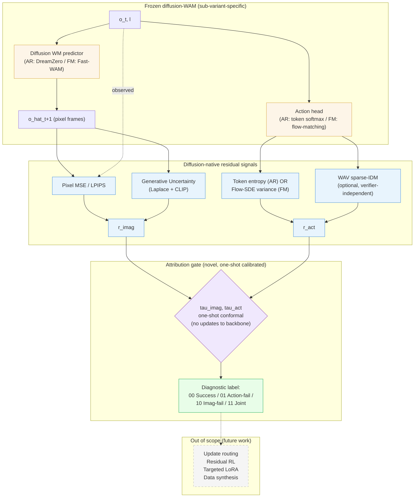

# Self-Discovering Failure in Diffusion-WAMs — Research Roadmap

> [!abstract] What This Document Is
> A step-ordered research plan for a **diagnostic gate** that, given an episode from a diffusion-based World Action Model, produces a per-episode label decomposing the failure cause into **imagination failure** (the WM's next-frame prediction was wrong) vs. **action failure** (the prediction was correct but the action head picked poorly). **Scope: failure-discovery only.** What to *do* with the diagnosis — targeted retraining, residual RL, data collection — is explicit future work. Instantiated across two sub-variants: **AR-video-diffusion** ([[2602.15922|DreamZero]]) and **FM-video-diffusion** (Fast-WAM / Cosmos-Predict2 via [[2602.20057|AdaWorldPolicy]] backbone).

> [!info] One-Line Pitch
> Current detectors for diffusion-WAM failure emit a single flag; current verifiers attribute to environmental causes. We produce a **per-episode 4-cell label** decomposing the cause into WM-vs-action-head using two diffusion-native signals — pixel-ground-truth imagination-residual and action-head-native action-residual — and validate attribution accuracy on synthetic injected failures across AR and FM diffusion sub-variants. Self-improvement is deferred to follow-up work.

---

## 0. Instantiation Template — Diffusion-WAM Sub-Variant Interface

> [!tip] The diagnostic in one table
> The attribution gate reads two abstract signals and returns one of four labels. Any diffusion-WAM that supplies these signals plugs in.

| Required signal | Type | Interpretation |
|---|---|---|
| $r_{\text{imag}}(\tau)$ | scalar ≥ 0 | Pixel-ground-truth + epistemic measurement of how far the WM's predicted frames drifted from the observed frames over an episode. |
| $r_{\text{act}}(\tau)$ | scalar ≥ 0 | Action-head-native measurement of how uncertain or inconsistent the action choice was. |

### Sub-variant adapters

| Sub-variant | Backbone | $r_{\text{imag}}$ components | $r_{\text{act}}$ components | Gate frequency |
|---|---|---|---|---|
| **AR-video-diffusion** | [[2602.15922\|DreamZero]] (14 B, NVIDIA) | Pixel MSE / LPIPS($\hat{o}_{t+1}, o_{t+1}$) + [[2502.20946\|generative uncertainty]] (Laplace + CLIP semantic likelihood) + optional physics-plausibility ([[2603.19312\|LeWM]] VoE on sim-reported object poses) + optional latent surprise ([[2511.04670\|Cambrian-S]]) | Next-token entropy + differential entropy of action ([[2604.04161\|AAC]]) + optional [[2604.01985\|WAV sparse-IDM]] reachability | **Per-episode** (denoising cost) |
| **FM-video-diffusion** | Fast-WAM / Cosmos-Predict2 | Pixel MSE / LPIPS + [[2502.20946\|generative uncertainty]] + CFG-disagreement + optional physics-plausibility ([[2603.19312\|LeWM]] VoE) | [[2510.25889\|Flow-SDE]] sample variance + [[2604.04161\|AAC]] differential entropy + optional [[2604.01985\|WAV sparse-IDM]] | **Per-step** (FM head is cheaper) |

The gate logic, 4-cell rule, and conformal calibration are shared across both sub-variants.

> [!note] Why two sub-variants, not one
> Different action-residual forms (categorical softmax vs. continuous Flow-SDE variance) and different gate frequencies (per-episode vs. per-step) stress-test the diagnostic on orthogonal architectural choices. Cross-sub-variant agreement on attribution accuracy is evidence the gate isn't over-fit to a specific backbone.

### Self-discovery vs. supervised failure detection (contra [[2506.09937|SAFE]])

[[2506.09937|SAFE]] detects VLA failure by training a small MLP/LSTM probe over backbone hidden states against labeled `(success, failure)` rollouts (30 per task in the real-robot setting). This **requires labeled failure data** to train the probe and **requires re-training** the probe for new task distributions.

Our framework is strictly more self-discovering:

| | [[2506.09937\|SAFE]] | This framework |
|---|---|---|
| Probe / classifier trained on failure labels? | **Yes** (MLP / LSTM) | **No** |
| Signal source | Learned over hidden states | Intrinsic (pixel-MSE vs. observed frame; head-native softmax / SDE variance) |
| Calibration data | Success-only rollouts | Success-only rollouts (identical) |
| Failure-data needed at deployment | For new-task probe re-training | Never |
| Output | Scalar failure score | Two-axis label (WM-failure bit, action-failure bit) |

**Imagination self-discovery** is automatic: the observation $o_{t+1}$ itself is the label — compare to predicted $\hat{o}_{t+1}$. **Action self-discovery** is automatic: entropy / Flow-SDE variance are byproducts of generating the action. We keep SAFE's Functional Conformal Prediction **calibration machinery** (see §4.2) because it is the right tool for thresholding under distribution-free guarantees — but we replace SAFE's learned scalar probe with intrinsic two-axis signals.

### Simulation-engine setting

Evaluation runs entirely inside a physics simulator (LIBERO-Plus + RoboTwin 2.0). The simulator provides three sources of ground truth that make pure self-discovery possible without any human-labeled failure data:

| Sim-provided signal | Used for | Self-discovery preserved? |
|---|---|---|
| **Observation $o_{t+1}$** (rendered pixels) | Pixel-MSE / LPIPS against predicted $\hat{o}_{t+1}$ | ✅ Just a rollout byproduct |
| **Task-success bit** (sim oracle from task spec) | Conformal calibration set (success-only) | ✅ Equivalent to SAFE's calibration input |
| **Physics state** (object poses, contacts, joint config) — optional | Physics-plausibility channel on $r_{\text{imag}}$ per [[2603.19312\|LeWM]]'s Violation-of-Expectation | ✅ Not a failure label; just observable state |

**What we deliberately do NOT use** (to preserve self-discovery):
- ❌ Oracle / expert actions — comparison to expert actions would be supervised attribution.
- ❌ Counterfactual rollouts with oracle dynamics — same reason.
- ❌ Human-labeled failure examples — we only have task-success labels, same as SAFE.
- ❌ Any model trained on labeled failures.

This constraint is tight on purpose: it is what lets us claim strictly stronger self-discovery than [[2506.09937|SAFE]], [[2512.01946|Guardian]], [[2410.00371|AHA]], or [[2510.01642|FailSafe]] — all of which use labeled failure data that we do not.

---

## 1. Research Question

> [!question] Central question
> Can a per-episode diagnostic gate over the joint distribution of pixel-ground-truth imagination-residual and action-head-native action-residual **correctly attribute** diffusion-WAM failures to the world model vs. the action head, across both AR and FM diffusion sub-variants?

**How the answer differs from the closest prior detection/attribution work**:

| Paper | Their output | Our output |
|-------|--------------|------------|
| [[2510.09459\|FIPER]] | Single "failure likely" flag (AND-gated) | 4-cell label with WM-vs-action-head decomposition |
| [[2506.09937\|SAFE]] | Single failure-probability score | Structured 2-D label with per-axis calibration |
| [[2602.01515\|RAPT]] | LLM-classified environmental root cause | Component-level cause (WM vs. action head) |
| [[2604.01985\|WAV]] | Verifier disagreement routed to data collection (latent WMs only) | Per-episode label on diffusion WMs, no action trigger |
| [[2602.16182\|WM Failure Classifier]] | 3-way success / known-failure / OOD | 4-cell joint attribution |

---

## 2. Testable Hypotheses

> [!tip] H1 — Attribution accuracy beats single-signal baselines
> On a synthetic held-out set with ground-truth cause (WM-weight corruption vs. action-head noise vs. joint vs. clean), the 4-cell gate achieves $\geq 80\%$ Top-1 cell accuracy in each sub-variant, vs. $\leq 60\%$ for any single-signal baseline ([[2510.09459\|FIPER]] AND-gate, [[2506.09937\|SAFE]] probe, single-signal pixel-MSE threshold, [[2503.08558\|FAIL-Detect]]).

> [!tip] H2 — Signal decorrelation is non-trivial
> Across a diverse episode distribution, the Pearson correlation between $R_{\text{imag}}$ and $R_{\text{act}}$ is $< 0.7$ — i.e., the two axes are measuring genuinely different things. If $\rho \geq 0.7$, the 4-cell matrix collapses to 2-cell and the contribution is significantly weakened (see §7 kill criterion).

> [!tip] H3 — Cross-sub-variant consistency
> Attribution accuracy on AR vs. FM sub-variants differs by $\leq 10$ pp on equivalent injected-failure conditions. If wider, the gate is over-specialized to one action-head family and the "stress-test" claim (§0) is weakened.

---

## 3. System Architecture

> [!info] Diffusion-WAM-specific, diagnosis-only design
> The pipeline **reads** signals from a running diffusion-WAM episode and **writes** a label. No updates are issued to the WM or action head. The backbone is treated as a frozen oracle during this work.

**Why one-shot calibration is sufficient here.** The backbone is frozen throughout the diagnostic pipeline — no LoRA updates, no online adaptation. Conformal prediction's exchangeability assumption is trivially preserved: calibration and evaluation rollouts come from the same (frozen) policy. The per-round recalibration complexity that plagued earlier drafts is no longer needed.

### Signal definitions

| Component | Cost | Validation precedent |
|---|---|---|
| **Pixel MSE / LPIPS** | $O(1)$ per step (one comparison) | [[2603.07799\|MWM]]'s action-consistency metric |
| **Generative Uncertainty** (Laplace + CLIP) | $O(k)$ with $k{\leq}10$ Monte Carlo samples on last layer | [[2502.20946\|Generative Uncertainty Diffusion]] |
| **Token entropy (AR)** | free (read from AR softmax) | standard AR uncertainty |
| **Flow-SDE variance (FM)** | $O(m)$ with $m{=}3$–$5$ samples | [[2510.25889\|πRL]] |
| **WAV sparse-IDM** (optional) | trained once offline on action-labeled data | [[2604.01985\|WAV]] |

---

## 4. The Attribution Gate

### 4.1 Episode-aggregated signals

Given per-step (FM) or per-episode (AR) signals $r_{\text{imag}}, r_{\text{act}}$:

$$R_{\text{imag}}(\tau) = \tfrac{1}{T}\sum_{t=1}^{T} r_{\text{imag}}(t),\qquad R_{\text{act}}(\tau) = \tfrac{1}{T}\sum_{t=1}^{T} r_{\text{act}}(t)$$

Components inside $r_{\text{imag}}, r_{\text{act}}$ are z-scored and summed per the §0 table.

### 4.2 One-shot conformal thresholds (follows [[2506.09937|SAFE]]'s Functional CP verbatim)

Per sub-variant, we adopt [[2506.09937|SAFE]]'s **Functional Conformal Prediction** procedure unchanged. Calibrate on $N_{\text{cal}}{=}500$ **successful** rollouts from the frozen backbone. For user-specified target FPR level $\alpha \in (0,1)$:

**Step 1** — Compute per-timestep mean $\mu_t$ of the signal $R(\tau)$ over the calibration success set.

**Step 2** — Compute the conformal quantile of the conformity scores at level $\lceil (n{+}1)(1{-}\alpha) \rceil / n$ to obtain the bandwidth $h_t$. This is the exact SAFE quantile form.

**Step 3** — One-sided upper-band threshold:

$$\tau_{\text{imag}}(t) = \mu_t^{\text{imag}} + h_t^{\text{imag}},\qquad \tau_{\text{act}}(t) = \mu_t^{\text{act}} + h_t^{\text{act}}$$

Guarantee (SAFE Theorem 1, inherited): for a new **successful** rollout, $R(\tau) < \mu_t + h_t$ holds for all $t = 1,\ldots,T$ with probability $1-\alpha$ under exchangeability. Exchangeability is trivially preserved in our scope because the backbone is frozen throughout calibration and evaluation — no LoRA drift.

Calibration is **one-shot**; we sweep $\alpha \in \{0.05, 0.10, 0.20\}$ to generate accuracy / timeliness trade-off curves per SAFE Fig. 3.

### 4.3 The 4-cell label

$b_{\text{imag}} = \mathbb{1}[R_{\text{imag}}(\tau) > \tau_{\text{imag}}],\quad b_{\text{act}} = \mathbb{1}[R_{\text{act}}(\tau) > \tau_{\text{act}}]$

| $b_{\text{imag}}$ | $b_{\text{act}}$ | Label |
|---|---|---|
| 0 | 0 | **Success** |
| 0 | 1 | **Action failure** |
| 1 | 0 | **Imagination failure** |
| 1 | 1 | **Joint failure** |

The output is a label, nothing else. Downstream use is future work.

### 4.4 Why this composition works — and how to falsify it

The method rests on three claims. Each has a testable precondition and a corresponding falsification experiment already in §5.

#### Claim A — Separability of the two axes

> $r_{\text{imag}}$ correlates with *world-model error conditioned on the executed action*; $r_{\text{act}}$ correlates with *action-head uncertainty conditioned on the observation*. The two are architecturally decoupled at the measurement level.

**Argument**. The WM produces $\hat{o}_{t+1} = \mathrm{WM}(o_{\leq t}, a_t)$ — predictions are *conditioned on the action actually taken*. Pixel-MSE $\|\hat{o}_{t+1} - o_{t+1}\|$ thus measures the WM's *conditional* predictive accuracy, holding action choice fixed. Walking through the four failure modes:

| Ground truth | Why WM is/isn't to blame | Expected $r_{\text{imag}}$ | Expected $r_{\text{act}}$ |
|---|---|---|---|
| **WM-failure** | Good action, WM mispredicts consequences | **high** | ≈ success mean |
| **Action-failure** | Bad action, WM correctly predicts "this action fails" | ≈ success mean | **high** |
| **Joint** | Bad action + WM also wrong about the bad action | **high** | **high** |
| **Success** | Good action, correct prediction | ≈ mean | ≈ mean |

**Precondition**: the WM conditions on the action at the same granularity as execution. Both [[2602.15922|DreamZero]] (AR action tokens directly consumed by video predictor) and Fast-WAM / [[2602.20057|AdaWorldPolicy]] (action-chunk conditions the FM video head) satisfy this.

**Confounder (R3 in §8)**: shared backbone. If the tokenizer or VLM is shared between WM and action head, WM error can leak into action-head inputs and inflate $r_{\text{act}}$. Mitigation: we freeze the shared backbone during calibration *and* during synthetic-failure injection, and the injection-protocol perturbs *one component at a time*. Cross-contamination would show up as high Top-1 accuracy on `11` (joint) but low accuracy on `10` and `01` individually — diagnosable via the confusion matrix in §5.3.2.

**Falsifier**: per-cell recall on the injected-failure suite. If `10`-recall or `01`-recall collapses below 60% while joint stays high, Claim A has failed.

#### Claim B — Empirical decorrelation of the two axes

> The joint $(R_{\text{imag}}, R_{\text{act}})$ over a realistic episode distribution has non-trivial 2-D structure; the axes are not redundant measurements of the same latent variable.

**Prior-work evidence**:

1. [[2602.08971|WorldArena]]: across 14 embodied WMs, correlation between perceptual-quality and action-planning-utility is $r \approx 0.36$. This is *direct* evidence that the two axes of the 4-cell gate are empirically decorrelated in the population of diffusion-like WMs.
2. [[2603.07799|MWM]]: visually-faithful diffusion rollouts can be action-conditioned inconsistent — pixel-MSE can be *low* while action failure occurs. This demonstrates the `{01}` (low imag, high act) cell is populated, not empty.
3. [[2603.22078|WAM-vs-VLA Robustness]]: WAM-based and direct-policy agents have different robustness gaps across OOD axes — i.e., the two failure modes fire on different conditions.

**Falsifier (pre-registered, §5.4 + S4 kill)**: on [[2602.20057|AdaWorldPolicy]]'s public prediction-error logs, $\rho(R_{\text{imag}}, R_{\text{act}}) > 0.8$ means the axes collapse to 1-D on the nearest diffusion precedent — fatal to the paper. Pivot to orthogonal decomposition is pre-specified in §7.

#### Claim C — Calibratability under exchangeability

> Thresholds $\tau_{\text{imag}}, \tau_{\text{act}}$ can be set with a distribution-free $1{-}\alpha$ coverage guarantee from success-only rollouts.

**Argument**: [[2506.09937|SAFE]]'s Functional CP theorem. Given $N_{\text{cal}}$ exchangeable samples from the success distribution, the one-sided band $[−\infty, \mu_t + h_t]$ with $h_t$ set at quantile level $\lceil(N{+}1)(1{-}\alpha)\rceil / N$ contains $R(\tau)$ with probability $\geq 1 - \alpha$ for a new success episode. Exchangeability holds in our scope because the backbone is frozen throughout calibration and evaluation.

**Falsifier**: empirical FPR on a held-out success set. If FPR on either axis exceeds $\alpha + \epsilon$ by a statistically significant margin for reasonable $\epsilon$ (e.g., 0.03), exchangeability has broken and Claim C has failed.

---

### 4.5 Why stacking is valid — per-component composition argument

The stacked signals are z-score sums:

$$r_{\text{imag}}(\tau) = \sum_{c \in \mathcal{C}_{\text{imag}}} z_c\!\left(s_c(\tau)\right),\quad r_{\text{act}}(\tau) = \sum_{c \in \mathcal{C}_{\text{act}}} z_c\!\left(s_c(\tau)\right)$$

where $z_c$ is z-scoring on the success calibration set. Stacking is valid iff four conditions hold; each is checked in §5.9 ablations.

#### Condition 1 — Per-component validity

Each $s_c$ is, by itself, a published failure signal for its side. No component requires on-the-fly training on failure data.

| Side | Component | Validated by | Self-discovery? |
|---|---|---|---|
| $r_{\text{imag}}$ | Pixel-MSE / LPIPS | [[2603.07799\|MWM]] action-consistency metric | ✅ intrinsic, sim ground truth |
| $r_{\text{imag}}$ | Generative Uncertainty (Laplace + CLIP) | [[2502.20946\|Generative Uncertainty Diffusion]] — experimentally on FM models | ✅ pretrained CLIP; Laplace is last-layer only |
| $r_{\text{imag}}$ | CFG-disagreement (FM only) | Standard in classifier-free-guided diffusion | ✅ intrinsic |
| $r_{\text{imag}}$ | Physics-plausibility (optional, sim) | [[2603.19312\|LeWM]] Violation-of-Expectation | ✅ uses sim pose state, not failure labels |
| $r_{\text{imag}}$ | Latent surprise | [[2511.04670\|Cambrian-S]] | ✅ intrinsic latent divergence |
| $r_{\text{act}}$ | Token entropy (AR) | Classical AR-policy uncertainty | ✅ softmax byproduct |
| $r_{\text{act}}$ | Flow-SDE variance (FM) | [[2510.25889\|πRL]] Flow-SDE | ✅ K-sample spread |
| $r_{\text{act}}$ | AAC differential entropy | [[2604.04161\|AAC]] | ✅ intrinsic |
| $r_{\text{act}}$ | WAV sparse-IDM reachability (optional) | [[2604.01985\|WAV]] | ⚠️ needs expert action data for IDM — marked optional |

#### Condition 2 — Intra-side non-redundancy

Components within the same side measure *different aspects* of the same latent variable. If two components are perfectly correlated, adding the second contributes no information.

- Pixel-MSE is **grounded aleatoric** (actual observation comparison).
- Generative Uncertainty is **model-epistemic** (parameter-distribution spread).
- CFG-disagreement is **guidance-sensitivity** (how much the conditioning matters).
- Physics-plausibility is **typed** (physics violation vs. appearance novelty per [[2603.19312\|LeWM]]).
- Latent surprise is **representation-space divergence**.

A hallucinated-but-confident prediction has **high pixel-MSE** and **low generative uncertainty** — proving these two are not redundant. Similar distinctions hold across the other pairs.

**Falsifier**: pairwise component correlations on the success set. If any pair exceeds $\rho > 0.9$, the redundant component is dropped and the stack is reduced.

#### Condition 3 — Cross-side non-leakage

Components on side A should *not* respond to injected failures on side B.

- **Pixel-MSE** under *action-head corruption*: the WM is still conditioned on the (corrupted) action, so it predicts correctly-given-bad-action. Pixel-MSE should stay near baseline. *Validated by §5.3.2 cell-`01` recall.*
- **Token entropy / Flow-SDE variance** under *WM-weight corruption*: the action head reads its normal inputs (VLM features or shared backbone). If the backbone is frozen and injection is localized to WM-only LoRA layers, action-head entropy should not spike. *Validated by §5.3.2 cell-`10` recall.*

**Falsifier**: if cell-`10` corruption spikes $r_{\text{act}}$ significantly, or cell-`01` corruption spikes $r_{\text{imag}}$ significantly, cross-side leakage is present and the gate cannot cleanly attribute. The confusion-matrix off-diagonals (rows `10`/`01`) directly quantify this leakage.

#### Condition 4 — Scale handling

Different components have wildly different raw scales (token entropy $\in [0, \log|V|]$; pixel-MSE $\in [0, 255^2]$; Flow-SDE variance depends on action dimension; CFG-disagreement is $\ell_2$-norm). Z-score normalization on the success set places each component on a comparable scale *before* summation.

**Falsifier**: rank-based cell assignment as a robustness check (§5.9). If rank-based cells agree substantively with z-score cells, scale-normalization is not driving results. If they disagree, z-score sum is over-sensitive to outlier components and the composition needs re-weighting (equal-weight $\to$ learned linear combination on the success set, which is still self-discovery since no failure labels are used).

---

### 4.6 What the evidence chain will look like

If the paper holds together, the following chain of positive results will be present — each is a direct consequence of a claim above:

1. $\rho(R_{\text{imag}}, R_{\text{act}}) < 0.7$ on real rollouts (Claim B).
2. FPR on held-out success set $\leq \alpha + \epsilon$ per axis (Claim C).
3. Top-1 cell accuracy $\geq 80\%$ on injected-failure suite (Claim A).
4. Per-component ablation: each component contributes $\geq$ 2 pp Top-1 accuracy (Conditions 1, 2).
5. Cell-`10` recall $\geq 75\%$ AND cell-`01` recall $\geq 75\%$ (Condition 3, no leakage).
6. AR and FM sub-variants within 10 pp of each other (H3, cross-sub-variant transfer).

**What falsifies the paper**: any of (1)–(6) failing beyond its threshold invokes the corresponding kill criterion or pivot (§7). The design is deliberately falsifiable at each step — the gate either works end-to-end or points cleanly to where it breaks.

---

### 4.7 Effectiveness and efficiency envelope

Two practical questions the reviewer will ask: *how well does the gate discover failures* (effectiveness) and *how cheap is it to run* (efficiency)?

#### 4.7.1 Effectiveness — five measurable dimensions

| Dimension | Target | Baseline / source | Measured in |
|---|---|---|---|
| **Detection AUROC** (collapse 4-cell → fail/succeed) | Match or beat [[2506.09937\|SAFE]]'s ~0.85–0.90 on LIBERO unseen tasks | SAFE's reported numbers | §5.3.1 |
| **Attribution Top-1 accuracy** (per-cell) | **≥ 80%** per sub-variant (chance = 25%) | Novel metric — no precedent | §5.3.2 (H1) |
| **Per-cell recall** (no cross-side leakage) | ≥ 75% on cell `10` AND cell `01` individually | Diagnoses Claim A | §5.3.2 confusion matrix |
| **T-det** (detection earliness) | Within 1–3 s of ground truth per SAFE's protocol | [[2506.09937\|SAFE]] Fig. 3 | §5.3.1 |
| **Unseen-task generalization** | Attribution accuracy degrades < 10 pp on 3-of-10 held-out LIBERO tasks | SAFE's split protocol | §5.3.5 |

The aggressive claim is **80% Top-1 attribution accuracy at 3.2× chance** — no prior self-discovery method produces a 2-bit output. The only comparable numbers are supervised: [[2602.01515\|RAPT]] hits 75% Top-1 on environmental causes; [[2512.01946\|Guardian]] beats GPT-4o on RoboFail. 80% on a 2-bit taxonomy without failure labels is in the plausible range but is a stretch target, not a guaranteed outcome — falsified by the S7 kill gate at 70%.

#### 4.7.2 Efficiency — per-episode overhead over baseline WM inference

Rough FLOP accounting. Baseline = cost of running a frozen diffusion-WAM rollout without the gate.

| Component | Cost | Overhead |
|---|---|---|
| Pixel-MSE / LPIPS | 1 CNN forward per frame comparison | < 0.1% |
| Generative Uncertainty (Laplace + CLIP) | $k = 10$ MC samples on *last layer only* + 1 CLIP forward | ~1% (per [[2502.20946\|Generative Uncertainty Diffusion]] — 10× cheaper than full MC) |
| Token entropy (AR) | Free — softmax already computed | 0% |
| Flow-SDE variance (FM) | $m = 3$ samples of *action head only* (~1% of WM) | ~3–5% |
| AAC differential entropy | $O(\text{action-dim})$ arithmetic | < 0.1% |
| CFG-disagreement (FM, optional) | 2× WM forward per step when CFG is used | +100% — **use only per-episode, never per-step** |
| Physics-plausibility (sim only) | Read sim state | 0% |
| Conformal threshold comparison | 1 floating-point compare per axis | 0% |
| **Total (FM sub-variant, per-step gate, CFG dropped to per-episode)** | — | **≈ 5–10%** over baseline rollout |
| **Total (AR sub-variant, per-episode gate)** | — | **≈ 1–5%** over baseline rollout |

#### 4.7.3 Efficiency comparison to baselines

| Vs. | Our cost relative to them | Why |
|---|---|---|
| [[2506.09937\|SAFE]] | **Comparable at inference, cheaper overall** | SAFE's probe is small, but SAFE needs 30 success + 30 failure rollouts per task *plus* probe training. We skip both. |
| [[2512.01946\|Guardian]] / [[2410.00371\|AHA]] / [[2510.01642\|FailSafe]] | **1–2 orders of magnitude cheaper** | These require per-episode VLM forwards (8B–30B params). We do a CLIP forward at most. |
| [[2602.01515\|RAPT]] | **Much cheaper** | RAPT runs a multi-modal LLM on each episode for root-cause classification. |
| [[2503.00761\|TRACE]] | **Much cheaper** | TRACE requires *counterfactual sim rollouts* per attribution — the dominant cost. |
| [[2604.01985\|WAV]] | **Comparable if IDM is available; we skip when it isn't** | WAV's sparse-IDM is small but requires expert-action-labeled training data. |
| [[2510.02298\|ARMADA]] | **Comparable at inference** | Both are small-footprint signals; ARMADA needs expert trajectories, we don't. |

#### 4.7.4 Where we could underperform (honest limitations)

1. **A supervised probe might discriminate better at pure detection.** [[2506.09937\|SAFE]]'s MLP/LSTM could beat our z-score sum on easy detection tasks where the supervised signal has richer features than any single intrinsic signal. *Mitigation*: we do not claim detection superiority — we claim **detection parity + attribution bonus**. If detection AUROC drops more than 3 pp below B-SAFE, we flag and discuss.

2. **DreamZero absolute compute is still heavy.** 14B × 500 rollouts × 4 cells × 2 benchmarks ≈ the primary compute line item (R2). Even at 1–5% per-episode overhead, the base rollouts are expensive. *Mitigation*: (a) cache per-episode signals once, reuse across all baselines in S6; (b) reduce per-cell trajectories to 300 if budget-constrained; (c) precompute generative-uncertainty Laplace once per checkpoint.

3. **Conformal miscalibration under strong distribution shift.** Exchangeability holds only when evaluation rollouts are drawn from the same distribution as the success calibration set. LIBERO-Plus OOD rollouts may violate this. *Mitigation*: report FPR on unseen tasks separately; adaptive-conformal recalibration on running success window is available as fallback (see §5.3.5).

#### 4.7.5 Headline

**< 10% compute overhead per episode**, **detection parity with supervised [[2506.09937\|SAFE]]**, **first-in-class component-level attribution at 3.2× chance**, **zero failure labels required** — this is the effectiveness-efficiency envelope we commit to. If any of the four clauses collapses during experiments, the corresponding kill gate (§7) or honest-limitations disclosure fires.

---

## 5. Experiments

### 5.1 Benchmarks (2, opinionated)

| Benchmark | Stresses | Why this one |
|---|---|---|
| [[2306.03310\|LIBERO]]-Plus (7 visual-perturbation dims) + [[2603.22078\|WAM-vs-VLA Robustness]] protocol | **Imagination axis** — visual OOD breaks diffusion-WAM frame prediction first | Per-frame pixel-MSE ground truth makes imagination-failure injection trivial |
| [[2506.18088\|RoboTwin 2.0]] (bimanual, contact-rich) | **Action axis** — frame prediction can be faithful while contact-dynamics action choice fails | [[2602.08971\|WorldArena]] used this for the perception-functionality-gap analysis |

### 5.2 Baselines — classified by self-discovery status

Baselines are organized into three tiers by whether they require **failure-labeled data** or **labeled-expert data** beyond what we have (success-only rollouts + sim observations). Tier 1 is the *fair* comparison — same labels as us. Tiers 2–3 use more supervision than we do; we compare to show our self-discovery approach matches or exceeds them **at the detection task** and exceeds them **at the attribution task**.

#### Tier 1 — Self-discovery detectors (fair baselines; same labels as us)

No failure labels, no probe trained on failure data. Use only intrinsic signals or success-only calibration.

**Token-level single-pass** (from [[2506.09937|SAFE]]):
| ID | Baseline | Signal | Side |
|---|---|---|---|
| **B-TMP** | Token max probability | $\max_i(-\log p_i)$ | Action |
| **B-TAP** | Token avg probability | $-\tfrac{1}{m}\sum_i \log p_i$ | Action |
| **B-TME** | Token max entropy | $\max_i H_i$ | Action |
| **B-TAE** | Token avg entropy | $\tfrac{1}{m}\sum_i H_i$ | Action |

**Sample-consistency / intrinsic-entropy** (from [[2506.09937|SAFE]] + 2026 additions):
| ID | Baseline | Signal | Side |
|---|---|---|---|
| **B-SV** | Total sample variance (K=10) | $\mathrm{tr}(\mathrm{cov}(\mathcal{A}_t))$ | Action |
| **B-CE** | Cluster entropy (K=10) | $H(\mathrm{KMeans}(\{\mathbf{A}_t^k\}))$ | Action |
| **B-AAC** | [[2604.04161\|Adaptive Action Chunking]] — Gaussian differential entropy per action component | Intrinsic, inference-only | Action |
| **B-ADV** | [[2603.18091\|Action Draft and Verify]] — VLM perplexity over generated action candidates | Intrinsic (pretrained VLM, no failure training) | Action |
| **B-STAC** | Statistical temporal action consistency (256 samples) | [[2410.04640\|Sentinel]] STAC | Action |
| **B-STAC-S** | STAC single-sample real-time variant | [[2410.04640\|Sentinel]] | Action |

**Diffusion-native / success-only calibrated**:
| ID | Baseline | Signal | Side |
|---|---|---|---|
| **B-LZO** | logpZO flow density + conformal | [[2503.08558\|FAIL-Detect]] | Both |
| **B-DAG** | Diffusion-policy training loss re-used at deployment | [[2410.14868\|Diff-DAgger]] | Action |
| **B-FWM** | Cosmos-latent WM uncertainty + residual + CP | [[2603.06987\|Foundational WM]] | Imag. |
| **B-NF** | Robot-Conditioned Normalizing Flow, nominal-only training | [[2603.11106\|RC-NF]] | Both |
| **B-GU** | Generative Uncertainty (Laplace + pretrained CLIP) | [[2502.20946\|Generative Uncertainty Diffusion]] | Imag. |
| **B-PM** | Pixel-MSE threshold | own | Imag. |
| **B-CAM** | [[2511.04670\|Cambrian-S]] latent video-prediction surprise | Intrinsic | Imag. |
| **B-FIPER** | OOD ∧ ACE AND-gate | [[2510.09459\|FIPER]] (intrinsic signals) | Both |

None of these produces a component-level attribution label. All are either **imagination-only**, **action-only**, or **collapse to a single failure score**.

#### Tier 2 — Supervised detection comparators (use more labels than we do)

These require failure labels, expert trajectories, or preference data. Included to demonstrate that self-discovery matches or beats supervised detection.

| ID | Baseline | Extra supervision needed |
|---|---|---|
| **B-SAFE** | [[2506.09937\|SAFE]] MLP/LSTM probe + Functional CP | Labeled success+failure rollouts per task |
| **B-CALIB** | [[2507.17383\|VLA-Calib]] — action-wise Platt scaling + prompt ensembles, per-DOF scalar confidence | Labeled failure rollouts for Platt calibration |
| **B-CYCLE** | [[2601.02295\|CycleVLA]] — subtask-progress classifier + MBR decoding (detection slice only, recovery out of scope) | Subtask-progress labels |
| **B-RND** | Random Network Distillation: $f_{\text{succ}}^{\text{ood}}(e) - f_{\text{fail}}^{\text{ood}}(e)$ | Labeled success+failure embeddings |
| **B-WMFC** | 3-way success / known-failure / OOD | Labeled success+failure+OOD rollouts |
| **B-ARMADA** | Online OT on policy embeddings vs. expert trajectories | Expert demonstration trajectories |
| **B-RWD** | [[2603.02115\|Robometer]] VLM reward-model inversion | Expert progress labels + pairwise preferences |

#### Tier 3 — Supervised attribution comparators (the only prior art that attributes cause)

All require labeled failure data (often thousands of examples). The only meaningful attribution-task competition; demonstrating our self-discovery matches their taxonomy quality is the central claim.

| ID | Baseline | Taxonomy | Extra supervision needed |
|---|---|---|---|
| **B-RAPT** | [[2602.01515\|RAPT]] reconstruction OOD + integrated-gradients + VLM | Environmental (friction, actuator) | VLM fine-tuned on root-cause labels |
| **B-WAV** | [[2604.01985\|WAV]] forward-inverse verifier disagreement | State-plausibility vs. action-reachability | Sparse IDM trained on action-labeled expert data |
| **B-GRD** | [[2512.01946\|Guardian / FailCoT]] VLM + CoT | **Planning vs. execution** (closest taxonomic match) | 30K+ labeled failure examples with CoT annotations |
| **B-AHA** | [[2410.00371\|AHA]] VLM | Free-form natural language | Procedurally generated failure dataset |
| **B-FSF** | [[2510.01642\|FailSafe]] VLM → 7-DoF recovery action | Action-centric (recovery implies cause) | Synthetic failure-action pairs |
| **B-TRACE** | [[2503.00761\|TRACE]] counterfactual critic + sim feasibility | Counterfactual-divergence-based | Requires oracle sim-rollouts for counterfactuals — borderline self-discovery |

#### Our method

| ID | Method | Taxonomy | Supervision |
|---|---|---|---|
| **M** | 4-cell Attribution Gate over intrinsic signals + Functional CP | **WM vs. action head** (component-level) | Success-only rollouts for conformal calibration; no failure labels, no expert data |

**The three-tier claim**. Tier 1 contains the only *fair* competitors — methods that, like ours, use no failure labels. Demonstrating that the 4-cell gate matches or beats them at **detection AUROC** while being the only Tier 1 method that **also attributes cause** is the central empirical claim. Tiers 2 and 3 are benchmarks of how much free information we're forgoing; our self-discovery claim is stronger the closer we get to matching them.

### 5.3 Metrics (follows [[2506.09937|SAFE]]'s evaluation protocol + attribution-specific additions)

We adopt [[2506.09937|SAFE]]'s full metric suite for detection comparison (for apples-to-apples reproducibility) and add attribution-specific metrics for the novel task.

#### 5.3.1 Detection metrics (inherited from [[2506.09937|SAFE]])

Compute on the max-so-far score to evaluate the entire rollout (per SAFE):

$$\bar{s}_t = \max_{\tau = 1,\ldots,t} s_\tau$$

- **ROC-AUC** on $\bar{s}_t$ — threshold-invariant; primary detection metric per SAFE.
- **TPR** (True Positive Rate): detected failures / total failures.
- **TNR** (True Negative Rate): non-flagged successes / total successes.
- **Balanced Accuracy** = $(\text{TPR} + \text{TNR}) / 2$.
- **T-det** (Detection Time): relative timestep where $s_t > \tau_t$ for the first time — if $s_t$ never exceeds $\tau_t$, T-det = 1. Averaged over all ground-truth failed rollouts. Per SAFE §4.2.

For our 4-cell gate recast as a detector: collapse the label to `{00} = success, {01, 10, 11} = failure` for ROC-AUC / TPR / TNR / T-det computation, then compare directly against all B-* baselines.

#### 5.3.2 Attribution metrics (new)

On the synthetic injected-failure suite (ground-truth cell known per-episode):

- **Imagination corruption**: Gaussian noise on diffusion-WM predictor weights for $k$ steps mid-episode. Ground-truth cell = `10`.
- **Action-head corruption**: noise into action-head logits (AR) or action-chunk samples (FM). Ground-truth cell = `01`.
- **Joint**: both. **Clean**: neither.
- 500 trajectories per cell per sub-variant.

Metrics:
- **Top-1 cell accuracy** — fraction of episodes whose predicted cell matches ground truth.
- **Per-cell recall and precision** — full 4×4 confusion matrix.
- **Macro-F1** — unweighted mean of per-cell F1.
- **Attribution-AUROC** — for each cell label, treat as a one-vs-rest binary classification; report mean AUROC across the four one-vs-rest tasks.

Only the Tier-3 attribution competitors (B-RAPT, B-WAV, B-GRD, B-AHA, B-FSF, B-TRACE) compete on these attribution metrics; all Tier-1 and Tier-2 detection baselines trivially score at chance on Top-1 cell accuracy (they produce one bit; our metric requires two).

#### 5.3.3 Signal-decorrelation analysis (H2)

On a diverse mixed-distribution episode set (not the injected-failure suite), report $\rho(R_{\text{imag}}, R_{\text{act}})$ per sub-variant + scatter-plot per ground-truth cell.

#### 5.3.4 Cross-sub-variant consistency (H3)

Paired comparison of per-cell accuracy AR vs. FM on matched injected-failure conditions.

#### 5.3.5 Data splits (follows [[2506.09937|SAFE]])

Three-partition strategy per sub-variant, identical to SAFE:
- $\mathcal{D}_{\text{train}}$ — only for any optional learned components (not needed for our intrinsic signals; needed for B-SAFE / B-RND / B-LZO baselines).
- $\mathcal{D}_{\text{eval-seen}}$ — hyperparameter tuning + Functional CP calibration (success-only subset).
- $\mathcal{D}_{\text{eval-unseen}}$ — held-out tasks for generalization evaluation.

Task split ratios match SAFE: **LIBERO-Plus**: 3-of-10 tasks held out as unseen. **RoboTwin 2.0**: equivalent 30% holdout. Results averaged over 3 random seeds with different splits.

### 5.4 Pre-registered analysis

> [!warning] Pre-register before S4
> **Pre-register the imag-act correlation test on [[2602.20057|AdaWorldPolicy]]'s prediction-error logs**. If $\rho(R_{\text{imag}}, R_{\text{act}}) > 0.8$ on public data, switch to Plan B (§7, S4 kill).

### 5.5 How our work compares — head-to-head

For each competitor we specify (a) what it outputs, (b) its supervision requirement, (c) our claimed advantage, (d) where we demonstrate it experimentally.

#### Tier 1 — self-discovery competitors (fair comparison)

| Competitor | Output | Side | Our advantage | Demonstrated in |
|---|---|---|---|---|
| [[2510.09459\|FIPER]] AND-gate | Single flag | Both, AND-collapsed | Joint 2-axis decomposition; disagreement is *attribution evidence* | §5.3.2 Top-1 cell accuracy |
| [[2503.08558\|FAIL-Detect]] / [[2603.11106\|RC-NF]] | Single density-based OOD score | Both, collapsed | Two axes grounded in *different generative processes* | §5.3.1 + §5.3.2 |
| [[2410.14868\|Diff-DAgger]] | Diffusion-policy loss as uncertainty | Action only | We add matched pixel-ground-truth WM-side channel | Per-signal ablation S9 |
| [[2603.06987\|Foundational WM]] | Latent-WM uncertainty + residual, CP-thresholded | Imagination only | Pixel-level (no self-referential concern) + action-side decomposition | §5.3.1 + §5.3.2 |
| [[2410.04640\|Sentinel]] STAC / STAC-S | Temporal action consistency | Action only | We add an independent imagination-side axis | §5.3.2 |
| [[2604.04161\|AAC]] (Adaptive Action Chunking) | Action differential entropy | Action only | We stack AAC's entropy with [[2510.25889\|Flow-SDE]] on the action side *and* compute imagination-side residual | §5.3.2 + per-signal ablation |
| [[2603.18091\|ADV]] (Action Draft and Verify) | VLM perplexity over action candidates | Action only | Complementary action-side signal; does not address imagination; we consume it as a component of $r_{\text{act}}$ | §5.3.2 + ablation |
| [[2511.04670\|Cambrian-S]] | Latent video-prediction surprise | Imagination only | We stack latent surprise with pixel-MSE + generative uncertainty for a richer $r_{\text{imag}}$ | Per-signal ablation S9 |
| [[2502.20946\|Generative Uncertainty Diffusion]] | Laplace + CLIP semantic uncertainty | Imagination only | Single-signal detector; we treat it as one of several stacked $r_{\text{imag}}$ components | Ablation |
| [[2603.19312\|LeWM]] VoE | Physics-implausibility scalar | Imagination only | We consume it as an optional sim-engine channel on $r_{\text{imag}}$ | Ablation S9 |
| **Pixel-MSE (B-PM)** | Single-signal detector | Imagination only | The core anchor of $r_{\text{imag}}$; we combine with generative uncertainty and optional physics channel | Ablation |

#### Tier 2–3 — supervised competitors (bar we aim to match despite less supervision)

| Competitor | Output | Supervision they use | Our advantage | Demonstrated in |
|---|---|---|---|---|
| [[2506.09937\|SAFE]] | Scalar failure score | Labeled success + failure rollouts | No failure labels needed; and component-level attribution | §5.3.1 detection parity + §5.3.2 attribution |
| [[2507.17383\|VLA-Calib]] | Per-DOF scalar confidence (output-layer Platt scaling) | Labeled failure rollouts for Platt calibration | No failure labels needed; per-DOF confidence is finer-grained than cell-level attribution but still single-bit semantically (uncertain vs. confident) — ours decomposes *cause* | §5.3.1 detection parity + §5.3.2 attribution |
| [[2601.02295\|CycleVLA]] | Binary subtask-complete flag (runtime) + recovery action (out of scope) | Subtask-progress labels | No labels needed; CycleVLA detects *when* subtask fails but not *why* (WM vs. action-head); diagnosis cleanly separated from recovery | §5.3.1 detection parity + §5.3.2 attribution |
| [[2510.02298\|ARMADA]] | OT distance on embeddings | Expert trajectories | No expert data needed | §5.3.1 detection parity |
| [[2603.02115\|Robometer]] | VLM reward-inversion | Expert progress + preferences | Reward-based signal is global not component-level | §5.3.2 attribution |
| [[2602.01515\|RAPT]] | LLM environmental root-cause | VLM fine-tuned on root-cause labels | Different taxonomy — we attribute to component (fix target), RAPT to environment (avoid target) | §5.3.2 cross-taxonomy analysis |
| [[2604.01985\|WAV]] | State-plausibility + action-reachability | Expert action-labeled data for sparse IDM | Diffusion-native pixel-ground-truth signals; per-episode diagnostic output; no IDM training needed | §5.3.2 — *primary* attribution competitor |
| [[2512.01946\|Guardian / FailCoT]] | Planning vs. execution | 30K+ labeled failures with CoT annotations | Our taxonomy maps to the same axes (imagination ≈ planning, action ≈ execution) with zero labels | §5.3.2 — *most direct* taxonomy comparison |
| [[2410.00371\|AHA]] | Free-form VLM reasoning | Procedurally generated failure dataset | Structured 2-bit label consumable by downstream routers | §5.3.2 + consumability |
| [[2510.01642\|FailSafe]] | Recovery-action | Synthetic failure-action pairs | Diagnosis cleanly separated from recovery | §5.3.2 |
| [[2503.00761\|TRACE]] | Counterfactual critic + sim feasibility | Oracle sim-rollouts for counterfactuals | We avoid the oracle-rollout cost per episode; we also attribute cause | §5.3.2 + compute-cost comparison |

**The summary claim** — *no* prior method simultaneously satisfies (a) self-discovery (no failure labels, no expert-action labels), (b) structured component-level attribution (not just detection), (c) diffusion-WAM compatibility across AR and FM sub-variants, and (d) operates in a simulation setting using only observable ground truth. Our work is the first point where all four hold.

---

## 6. Execution Steps

Ordered by dependency, not time. Compute budget: 1× 8×H100 node; DreamZero serving fits in the same budget because we only *read* from a frozen backbone (no LoRA training, no rounds).

| # | Step | Deliverable | Risk |
|---|---|---|---|
| **S1** | Env + frozen-backbone reproduction, both sub-variants | [[2602.15922\|DreamZero]] at 7 Hz closed-loop; Fast-WAM / Cosmos-Predict2 on LIBERO-Plus. Episode-level rollouts logged. | Medium (Fast-WAM) / High (DreamZero serving) |
| **S2** | FM sub-variant signal extraction | Pixel-MSE + [[2502.20946\|generative uncertainty]] + Flow-SDE variance + optional WAV-IDM logged per step for Fast-WAM / Cosmos-Predict2. | Medium |
| **S3** | AR sub-variant signal extraction | Pixel-MSE (per-frame) + [[2502.20946\|generative uncertainty]] + next-token entropy + optional WAV-IDM logged per episode for DreamZero. | Medium |
| **S4 ★** | **Conformal calibration + correlation pre-reg test** | Per-sub-variant $\tau_{\text{imag}}, \tau_{\text{act}}$ at $\alpha{=}0.1$ on 500 successful rollouts; $\rho(R_{\text{imag}}, R_{\text{act}})$ on [[2602.20057\|AdaWorldPolicy]] logs + own data. **GO/NO-GO**. | **HIGH — kill criterion** |
| **S5** | Synthetic injected-failure suite | 500 traj × 4 cells × 2 sub-variants = 4000 trajectories; confusion matrices per sub-variant (H1). | Medium |
| **S6** | Baseline implementations (full [[2506.09937\|SAFE]] baseline roster) | All B-* baselines per sub-variant: token-level (B-TMP/TAP/TME/TAE), sample-consistency (B-SV/CE), embedding-OOD (B-RND/LZO/STAC/STAC-S), full-method (B-SAFE/FIPER/WMFC/GU/PM), attribution (B-RAPT/WAV). Matches SAFE's evaluation roster for apples-to-apples reproduction. | Medium |
| **S7 ★** | **Full benchmark run following [[2506.09937\|SAFE]] protocol** | M vs. all B-* on LIBERO-Plus (3-of-10 unseen tasks) and RoboTwin 2.0 (30% holdout), 3 seeds, synthetic + real injected failures. Report max-so-far ROC-AUC, TPR, TNR, Balanced Accuracy, T-det (detection) + Top-1 cell accuracy, per-cell confusion matrix, macro-F1, attribution-AUROC (attribution). **H1 verification gate**. | **HIGH — kill criterion** |
| **S8** | Signal-decorrelation + cross-sub-variant consistency analyses | H2 scatter plots with per-cell color coding; H3 paired-comparison table AR vs. FM. | Low |
| **S9** | Ablations | Per-signal ablations (pixel-MSE alone, +gen-unc, +WAV-IDM, ...); $\alpha$ sweep $\in \{0.05, 0.10, 0.20\}$ per SAFE Fig. 3; cross-cell threshold sensitivity. | Low |
| **S10** | Write-up | Paper draft; scope-limitation section pointing to follow-up self-improvement directions. | Low |

Steps **S4 and S7** are the two kill gates. S4 is a *pre-commitment* gate (correlation test before full-scale experiments); S7 is a *verification* gate (attribution accuracy on the full benchmark run). All other steps are engineering.

---

## 7. Kill Criteria

> [!warning] S4 — Pre-registered correlation test
> **KILL if** $\rho\!\big(R_{\text{imag}}, R_{\text{act}}\big) > 0.8$ on [[2602.20057|AdaWorldPolicy]]'s published prediction-error logs (replicated on our Fast-WAM and DreamZero rollouts, 500 each). The 4-cell matrix collapses.
>
> **PIVOT** to Plan B: orthogonal decomposition $(R_{\text{imag}}, R_{\text{act}} - \beta R_{\text{imag}})$, $\beta$ fit on the success set. If still $>0.7$, reposition as a negative-result / correlation-taxonomy paper ("when imagination- and action-signals decouple, and when they don't, across diffusion WAMs") — still publishable, lower venue.

> [!warning] S7 — Attribution accuracy threshold
> **KILL if** M's attribution accuracy on the synthetic injected-failure suite is $<70\%$ in both sub-variants (H1 set the target at $\geq 80\%$; 70% is the absolute floor).
>
> **PIVOT** to detection-only framing: report M as an improved detector (since joint signals typically improve detection AUROC even without attribution validity) and position attribution accuracy as a pilot study. Venue shifts to workshop.

---

## 8. Risk Register

> [!warning] R1 — Correlation between $R_{\text{imag}}$ and $R_{\text{act}}$ dissolves attribution
> **Failure mode**: pixel-MSE and head-native action uncertainty both spike on environment changes; the joint collapses to 1-D.
>
> **Why plausible**: in [[2603.04029|Self-Adapting RL]]'s Dreamer data, OPR and RPR rose together. Similar coupling may exist between pixel-MSE and Flow-SDE variance.
>
> **Mitigation**: S4 pre-registered correlation test before final method commitment. Plan B (orthogonal decomposition) pre-specified in §7.

> [!warning] R2 — DreamZero serving cost for large-scale evaluation
> **Failure mode**: 14 B AR video-diffusion at 7 Hz × 500 rollouts × 4 cells = noticeable compute, though far less than the update-loop version.
>
> **Why plausible**: DreamZero-Flash is per-episode compute-bound even in inference-only mode.
>
> **Mitigation**: (a) Cache per-episode signals; re-use for baselines. (b) Reduce per-cell trajectories to 300 if budget tight; the statistical power for the 80% H1 target remains adequate. (c) Precompute generative-uncertainty Laplace once per checkpoint.

> [!warning] R3 — AR vs. FM signal scaling mismatch
> **Failure mode**: token entropy (AR, bounded by $\log|V|$) and Flow-SDE variance (FM, unbounded raw scale) have incompatible scales; per-sub-variant z-scoring may not align cell proportions.
>
> **Mitigation**: Per-sub-variant z-scoring applied. Also report *rank-based* cell assignments as a robustness check. Cross-sub-variant threshold transfer is explicitly not claimed.

> [!warning] R4 — Injected-failure protocol doesn't reflect real failures
> **Failure mode**: synthetic injected failures (weight noise, logit noise) may not resemble natural failure distributions — attribution accuracy on synthetic could fail to generalize.
>
> **Why plausible**: natural failures involve compounding errors, not isolated component corruption.
>
> **Mitigation**: Include *real* failures from LIBERO-Plus OOD rollouts as a held-out set. Since real failures lack ground-truth labels, evaluate via [[2602.01515|RAPT]]-style human-rated attribution on a 100-episode subset as a secondary check. Report synthetic and real attribution accuracies separately.

---

## 9. Out of Scope / Future Work

This paper produces a diagnostic label. Using the label is future work. Specific follow-ups that *build on* this contribution:

1. **Update routing** — given a 4-cell label, target WM-predictor LoRA (cell `10`), action-head residual RL via [[2511.00091|PLD]] / [[2507.21053|FPO]] (cell `01`), or joint-conservative updates (cell `11`). Requires solving exchangeability under online adaptation.
2. **Failure-conditioned data synthesis** — once imagination-failure is attributed, use the host WM (or a [[2603.13528|Dream2Fix]]-style generator) to synthesize recovery trajectories from the failing region.
3. **Attribution-driven curriculum** — schedule training on tasks where recent attribution distributions skew toward specific cells.
4. **Reflection / memory over diagnoses** — [[2603.08561|RetroAgent]]-style dual intrinsic feedback indexed by attribution label.
5. **Attribution-gated safety** — refuse-to-act policy when real-time diagnosis indicates imagination failure on high-stakes tasks.

The paper ends at the diagnostic label. Each of these is a separate paper.

---

## Cross-References

- [[01_Self-Discovering-WAM-Literature]] — the literature scan whose §The Gap this roadmap operationalizes.

---

*Companion to [[01_Self-Discovering-WAM-Literature]].*
