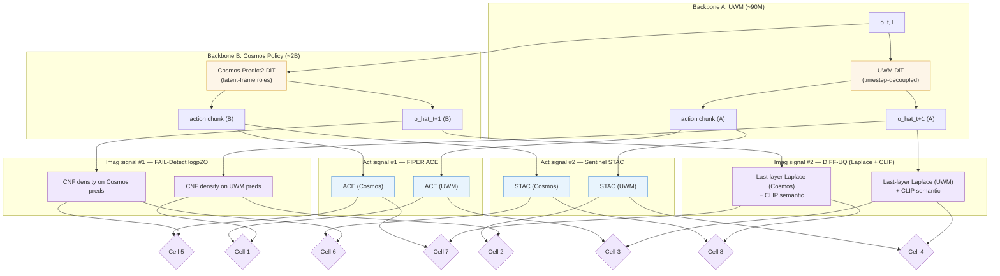

# Self-Discovering Imagination vs. Action Failure in Diffusion-WAMs — Research Roadmap

> [!abstract] What This Document Is
> A step-ordered plan for a **per-episode 2-bit attribution gate** for diffusion-WAMs, evaluated as a **2×2×2 factorial = 8 cells**: two diffusion-WAM backbones × two imag signals × two act signals. The method generalizes [[2510.09459|FIPER]]'s dual-signal CP detector to component-level attribution. **Imag anchors**: [[2503.08558|FAIL-Detect]] `logpZO` (distributional OOD, novel extension to $\hat{O}_{t+1}$) + [[2502.20946|DIFF-UQ]] (Bayesian last-layer Laplace + CLIP semantic likelihood, post-hoc on any pretrained diffusion model). **Act anchors**: FIPER-ACE + [[2410.04640|Sentinel]]-STAC. **Backbones**: [[2504.02792|UWM]] (~90M) + [[2601.16163|Cosmos Policy]] (~2B). Success-only functional CP, Bonferroni-corrected joint FPR, zero failure labels. A pre-registered **S3.1 pilot gate** collapses the design to 2×2 if the two imag signals are redundant. AR sub-variant, multi-component stacks, and closed-loop updates are deferred to publication #2.

> [!info] One-Line Pitch
> FIPER, but (a) two WM-prediction-native imag signals (`logpZO` + DIFF-UQ), (b) two act signals (ACE + STAC), (c) AND-gate → Bonferroni-corrected 2×2 cross-tabulation, (d) validated across **two diffusion-WAM backbones** as a 2×2×2 factorial — with a redundancy-collapse kill gate at S3.1.

---

## 0. Instantiation — 2×2×2 factorial interface

> [!tip] The diagnostic grid in one table
> Eight cells. All share success-only functional CP with Bonferroni α/2. Cells differ on (backbone, imag signal, act signal). S3.1 pilot tests imag-axis internal decorrelation; S4 selects winning cell on H2 decorrelation.

| Cell | Backbone | Imag signal | Act signal | Public code |
|---|---|---|---|---|
| **1** | [[2504.02792\|UWM]] (~90M) | [[2503.08558\|FAIL-Detect]] `logpZO` | FIPER-ACE | UWM + FIPER + FAIL-Detect |
| **2** | [[2504.02792\|UWM]] (~90M) | [[2503.08558\|FAIL-Detect]] `logpZO` | Sentinel-STAC | UWM + Sentinel + FAIL-Detect |
| **3** | [[2504.02792\|UWM]] (~90M) | [[2502.20946\|DIFF-UQ]] (Laplace + CLIP) | FIPER-ACE | UWM + FIPER + DIFF-UQ |
| **4** | [[2504.02792\|UWM]] (~90M) | [[2502.20946\|DIFF-UQ]] (Laplace + CLIP) | Sentinel-STAC | UWM + Sentinel + DIFF-UQ |
| **5** | [[2601.16163\|Cosmos Policy]] (~2B) | [[2503.08558\|FAIL-Detect]] `logpZO` | FIPER-ACE | Cosmos + FIPER + FAIL-Detect |
| **6** | [[2601.16163\|Cosmos Policy]] (~2B) | [[2503.08558\|FAIL-Detect]] `logpZO` | Sentinel-STAC | Cosmos + Sentinel + FAIL-Detect |
| **7** | [[2601.16163\|Cosmos Policy]] (~2B) | [[2502.20946\|DIFF-UQ]] (Laplace + CLIP) | FIPER-ACE | Cosmos + FIPER + DIFF-UQ |
| **8** | [[2601.16163\|Cosmos Policy]] (~2B) | [[2502.20946\|DIFF-UQ]] (Laplace + CLIP) | Sentinel-STAC | Cosmos + Sentinel + DIFF-UQ |

Shared across all cells:

| Axis | Instantiation |
|---|---|
| $r_{\text{imag}}(\tau)$ | `logpZO` or DIFF-UQ applied to backbone's predicted next-frame $\hat{O}_{t+1}$ |
| Calibration | Success-only functional CP + Bonferroni α/2 per axis for joint FPR |
| Gate output | 4-cell attribution label via 2×2 cross-tabulation |

### Why two backbones — and why these two

[[2503.08558|FAIL-Detect]]'s `logpZO` and [[2502.20946|DIFF-UQ]] both require a predicted next-frame $\hat{O}_{t+1}$ at inference, so any backbone that removes test-time imagination (e.g., [[2603.16666|Fast-WAM]]) is structurally ruled out. AdaWorldPolicy (2602.20057) would have been the ideal backbone — distinct WM and action weight modules — but has no public code. Among public diffusion-WAMs with preserved future imagination:

- **[[2504.02792|UWM]]** (~90M): one shared DiT with **modality-independent diffusion timesteps** for video and action.
- **[[2601.16163|Cosmos Policy]]** (~2B): one shared Cosmos-Predict2 DiT with **distinct latent-frame roles** for action / future-image / value tokens.

Neither has AdaWorldPolicy-style distinct-weight-module separation. Both are coupled through shared backbone weights + shared visual tokenizers. The 2×2×2 factorial tests whether the gate's decorrelation holds under **two coupling mechanisms** × **two imag-signal families**.

### Why two imag signals — and why these two

The imag axis must use at least two structurally-distinct signal families for the 2×2×2 design to be non-trivial.

| Axis | `logpZO` | DIFF-UQ |
|---|---|---|
| Signal family | Distributional OOD — CNF density on noise latent | Bayesian epistemic — last-layer Laplace variance + CLIP semantic-space likelihood |
| What it detects | "$\hat{O}_{t+1}$ is off the success-rollout manifold" | "The diffusion model is uncertain about generating $\hat{O}_{t+1}$" |
| Training | Separate CNF trained on success rollouts | Post-hoc Laplace fit on pretrained DiT + CLIP frozen |
| Randomness | Single forward | MC over $M$ last-layer weight samples (M=1 sufficient per paper) |
| Compute overhead | 1 CNF forward | M × last-layer re-forward + 1 CLIP forward |

**H5 at S3.1** tests imag-axis internal decorrelation on **100 success rollouts per backbone** (total 200) before committing to the full 2×2×2 benchmark run. DIFF-UQ's Laplace is a last-layer posterior — its scale-dependence on model size (UWM ~90M vs. Cosmos Policy ~2B) means a single-backbone pilot is not generalizable, so both backbones must pass. Measure Spearman rank correlation $\rho_S(R_{\text{logpZO}}, R_{\text{DIFF-UQ}})$ per backbone; report Pearson as secondary (max-so-far aggregation is heavy-tailed, so Pearson is unreliable as the primary decision variable). Pre-registered decision rule:

- $\rho_S < 0.6$ on **both** backbones → commit to full 2×2×2 (8 cells).
- $\rho_S > 0.85$ on **either** backbone → demote DIFF-UQ to S9 ablation; design collapses to 2×2 (Cells 1, 2, 5, 6).
- $\rho_S \in [0.6, 0.85]$ on one or both → proceed with caution; run full 2×2×2 but flag redundancy in write-up; claim H4 only on the backbone where $\rho_S < 0.6$.

**Statistical note**: Fisher-z analysis with n=100 gives SE ≈ 0.10 on z, which maps to ρ ± ~0.056 at ρ=0.85 — enough resolution to distinguish 0.7 vs. 0.85 at ~80% power per backbone.

### Why FM-only, not AR

Both imag anchors require flow-matching or score-matching observation decoders. Both backbones expose this. [[2602.15922|DreamZero]]'s AR token stream would require a categorical-softmax adaptation — deferred to publication #2.

### Self-discovery — strictly zero failure labels

| Paper | Failure labels? | Role |
|---|---|---|
| [[2503.08558\|FAIL-Detect]] | No (success-only CP on noise-latent density) | Imag anchor #1 (Cells 1, 2, 5, 6) |
| [[2502.20946\|DIFF-UQ]] | No (Laplace fitted on nominal generation; CLIP frozen) | Imag anchor #2 (Cells 3, 4, 7, 8) |
| [[2510.09459\|FIPER]] | No (success-only CP; ACE + RND-OE) | Structural ancestor + ACE act anchor (Cells 1, 3, 5, 7) |
| [[2410.04640\|Sentinel]] | No (STAC calibrated on success rollouts) | STAC act anchor (Cells 2, 4, 6, 8) |
| [[2504.02792\|UWM]] | No (pretrained WM; we don't retrain) | Backbone A |
| [[2601.16163\|Cosmos Policy]] | No (pretrained NVIDIA checkpoints) | Backbone B |
| [[2506.09937\|SAFE]] | **Yes** | Baseline only (B-SAFE) |
| [[2604.01985\|WAV]] | **Yes** | Baseline only (B-WAV) |
| [[2602.16182\|WM Failure Classifier]] | **Yes** | Baseline only (B-WMFC) |

---

## 1. Research Question

> [!question] Central question
> Can [[2510.09459|FIPER]]'s dual-signal success-only CP architecture be generalized to a per-episode 2-bit attribution gate on diffusion-WAMs by (a) replacing its policy-observation OOD signal with two structurally-distinct WM-prediction-native imag signals (`logpZO` on $\hat{O}_{t+1}$ + DIFF-UQ Laplace+CLIP), (b) pairing each with two action signals (ACE + STAC), (c) replacing the AND-gate with a Bonferroni-corrected 2×2 cross-tabulation, and (d) demonstrating generality **across two diffusion-WAM backbones as a 2×2×2 factorial** — with no failure labels?

---

## 2. Testable Hypotheses

> [!tip] H1 — Attribution accuracy, winning cell
> On 500 × 4-cell synthetic injected failures (uniform class priors), the winning cell of the 2×2×2 factorial achieves $\geq 75\%$ Top-1 cell accuracy. Pre-registered floor: 70%. §10.2 of the math doc relates this to Claim B's row-recall floor under joint-FPR Recall$_{00} \geq 1-\alpha$.

> [!tip] H2 — Act × imag decorrelation, per cell (decides winning cell at S4)
> On 500 success rollouts per cell: $\rho(R_{\text{imag}}, R_{\text{act}}) < 0.7$ in at least one cell per (backbone, imag-signal) combination. Cell with lowest ρ globally wins. If all committed cells have $\rho > 0.7$ → pivot.

> [!tip] H3 — Detection AUROC parity with FIPER
> Winning cell's collapsed-to-binary detection AUROC matches FIPER's published numbers (TWA **0.65** / overall acc **0.78**) within 3 pp on LIBERO.

> [!tip] H4 — Cross-cell generality (2×2×2-native, descriptive at n=2 backbones)
> **Primary test**: both backbones independently hit ≥ 3 of 4 cells at Top-1 ≥ 70% (cluster-robust per Prop. 12.2 of the math doc).
> **Secondary (descriptive)**: Top-1 ≥ 70% in ≥ 6 of 8 cells overall. Reported but anti-conservative under naive Bin(8, π) because within-backbone cells share calibration data ($n_\text{eff} \in [2, 8]$).

> [!tip] H5 — Imag-axis internal decorrelation (S3.1 precondition, dual-backbone)
> On **100 success rollouts per backbone** (total 200): **Spearman** $\rho_S(R_{\text{logpZO}}, R_{\text{DIFF-UQ}}) < 0.6$ on **both** UWM and Cosmos Policy (Pearson reported for reference only). **This is the precondition for the 2×2×2 design.** If $\rho_S > 0.85$ on either backbone, DIFF-UQ is demoted to ablation and design collapses to 2×2.

---

## 3. System Architecture

> [!info] Two backbones × two imag signals × two act signals = 2×2×2 factorial
> All eight cells share the CP calibration. Cells differ on (backbone, imag signal, act signal). Cross-cell comparison on LIBERO (the only shared benchmark).

---

## 4. The FIPER-Generalized Attribution Gate

### 4.1 Episode-aggregated signals (per cell)

$$R_{\text{imag}}(\tau) = \max_{t \leq T}\,s_{\text{imag}}(\hat{O}_{t+1}),\qquad R_{\text{act}}(\tau) = \max_{t \leq T}\,s_{\text{act}}(t)$$

where $s_{\text{imag}}$ is `logpZO` (Cells 1/2/5/6) or DIFF-UQ combined score (Cells 3/4/7/8), and $s_{\text{act}}$ is ACE (odd cells 1/3/5/7) or STAC (even cells 2/4/6/8).

### 4.2 Functional CP — Bonferroni-corrected for joint coverage

Per cell. Both imag and act signals use success-only functional Conformal Prediction with Bonferroni correction at level $\alpha / 2$.

**Step 1** — Per-axis per-timestep mean $\mu_t^{\text{axis}}$ on success calibration set (N = 500 per cell).

**Step 2** — Bonferroni-corrected conformal quantile → bandwidth $h_t^{\text{axis}}$.

**Step 3** — One-sided thresholds:

$$\tau_{\text{imag}}(t) = \mu_t^{\text{imag}} + h_t^{\text{imag}}/2,\qquad \tau_{\text{act}}(t) = \mu_t^{\text{act}} + h_t^{\text{act}}/2$$

**Joint guarantee** per cell: $P(R_{\text{imag}} < \tau_{\text{imag}} \wedge R_{\text{act}} < \tau_{\text{act}}) \geq 1 - \alpha$ by union bound. Each cell is calibrated independently.

Sweep $\alpha \in \{0.05, 0.10, 0.20\}$; copula-quantile variant as ablation.

### 4.3 The 4-cell attribution label (per cell of the 2×2×2 grid)

$b_{\text{imag}} = \mathbb{1}[R_{\text{imag}}(\tau) > \tau_{\text{imag}}],\quad b_{\text{act}} = \mathbb{1}[R_{\text{act}}(\tau) > \tau_{\text{act}}]$

| $b_{\text{imag}}$ | $b_{\text{act}}$ | Label |
|---|---|---|
| 0 | 0 | **Success** |
| 0 | 1 | **Action failure** |
| 1 | 0 | **Imagination failure** |
| 1 | 1 | **Joint failure** |

### 4.4 Why this works — claims and falsifiers

#### Claim A — WM-prediction-native density and epistemic uncertainty both discriminate imag failure

> Both imag signals — `logpZO` (distributional) and DIFF-UQ (epistemic + semantic) — assign higher failure scores to predicted frames that are off-manifold or that the model itself is uncertain about.

**Argument**. `logpZO` is a density estimator on the success-frame manifold; DIFF-UQ is a posterior-variance estimator on the diffusion model's output. These are orthogonal signal families and both are paper-validated on their own domains (FAIL-Detect: real obs; DIFF-UQ: generated images on ImageNet).

**Preconditions**. `logpZO` CNFs are trained on predicted success frames per backbone (two CNFs total). DIFF-UQ Laplace is fitted post-hoc per backbone on the same success rollouts (paper §3.3).

**Falsifier (S9 ablation)**: Per backbone, compare discrimination of `logpZO(O_t)` vs. `logpZO(\hat{O}_{t+1})` vs. DIFF-UQ-Laplace-only vs. DIFF-UQ-CLIP-only vs. DIFF-UQ-combined. If any signal fails to discriminate, flag that cell.

#### Claim B — Cross-side non-leakage (weakest claim)

> Within each cell, $r_{\text{imag}}$ responds to WM-prediction errors but NOT action-head corruption; $r_{\text{act}}$ responds to action-head uncertainty but NOT WM-prediction errors.

**Argument**. Per-backbone mechanism: UWM uses modality-independent timesteps; Cosmos Policy uses distinct latent-frame roles. Neither is distinct-weight-module decoupling — so shared-tokenizer leakage is real and must be bounded empirically.

**Confounders**: (a) shared visual tokenizers feed both imag and act paths in each backbone; (b) the 2B Cosmos Policy has richer feature mixing than UWM's ~90M; (c) DIFF-UQ's last-layer Laplace is constrained to a single layer — may not capture deeper-layer epistemic uncertainty that correlates with action-head behavior.

**Falsifier (§5.3.2 confusion matrix)**: per-cell recall on injected-failure suite. If cell-`10` or cell-`01` recall drops below 60% in a given cell, Claim B has failed for that cell. H4 requires Claim B to hold in ≥ 6 of 8 cells.

#### Claim C — Joint calibration under exchangeability

> Bonferroni-corrected functional CP controls joint FPR at $\alpha$ under exchangeability, per cell.

**Argument**: union bound over two marginal CP guarantees. Exchangeability holds per cell because the backbone and both signal paths are frozen.

**Falsifier**: empirical joint FPR on held-out success set, per cell. If FPR $> \alpha + 0.03$ in a cell, switch to copula-based joint quantile for that cell.

#### Claim D (new for 2×2×2) — Imag-axis internal decorrelation

> The two imag signals $R_{\text{logpZO}}$ and $R_{\text{DIFF-UQ}}$ are structurally distinct and empirically decorrelated on success rollouts.

**Argument**. `logpZO` measures distributional OOD on a flow model's noise latent; DIFF-UQ measures epistemic uncertainty on the diffusion model's weight posterior. Different signal families, different computations, should not collapse.

**Falsifier (S3.1 pilot, dual-backbone)**: Spearman $\rho_S(R_{\text{logpZO}}, R_{\text{DIFF-UQ}}) < 0.6$ on **100 success rollouts per backbone** (UWM **and** Cosmos Policy). If $\rho_S > 0.85$ on either backbone, Claim D has failed → demote DIFF-UQ to S9 ablation, collapse to 2×2 (Cells 1, 2, 5, 6).

---

### 4.5 Efficiency envelope (per cell)

| Component | UWM (~90M) | Cosmos Policy (~2B) |
|---|---|---|
| `logpZO` CNF forward | ≈ 1–2% | < 1% |
| DIFF-UQ Laplace (M=1, T=25 per paper) | ≈ 2–4% | ≈ 4–8% |
| DIFF-UQ CLIP-B semantic forward | ≈ 1–2% | < 1% |
| ACE — dim-wise entropy | < 0.1% | < 0.1% |
| STAC-256 | ≈ 5–10% | ≈ 10–20% |
| STAC-single (fallback) | < 0.5% | < 0.2% |
| **Cell 1 (UWM × logpZO × ACE)** | **≈ 1–2%** | — |
| **Cell 2 (UWM × logpZO × STAC-256)** | **≈ 6–12%** | — |
| **Cell 3 (UWM × DIFF-UQ × ACE)** | **≈ 3–6%** | — |
| **Cell 4 (UWM × DIFF-UQ × STAC-256)** | **≈ 8–16%** | — |
| **Cell 5 (Cosmos × logpZO × ACE)** | — | **≈ 1–2%** |
| **Cell 6 (Cosmos × logpZO × STAC-256)** | — | **≈ 11–21%** |
| **Cell 7 (Cosmos × DIFF-UQ × ACE)** | — | **≈ 5–10%** |
| **Cell 8 (Cosmos × DIFF-UQ × STAC-256)** | — | **≈ 15–30%** |

STAC-single fallback available per [[2506.09937|SAFE]]'s protocol — especially for Cell 8. DIFF-UQ M=1/T=25 config is paper-validated competitive with M=5/T=50 **for the Laplace channel only**; the CLIP semantic-entropy channel (per `DIFF-UQ/semantic_likelihood.py:46-58`) requires $M \geq 2$ sampled last-layer weights to compute cross-sample variance. Default runtime config for Cells 3/4/7/8: **M=2, T=25** if combined score is used; or drop the CLIP channel and run M=1/T=25 Laplace-only (equivalent to R9 mitigation). The combined-score overhead in the table above assumes M=2.

### 4.6 Honest limitations

1. **`logpZO(\hat{O}_{t+1})` is unvalidated by FAIL-Detect's paper.** Repo inspection confirms `train.py` feeds `observation = x_batch` = real $O_t$; no predicted-frame path. S9 ablation is load-bearing, per backbone.
2. **DIFF-UQ was evaluated on ImageNet, not robot scenes.** CLIP's feature space may not transfer well to cluttered manipulation scenes — R9.
3. **Cross-side non-leakage has no prior empirical support** on diffusion-WAMs, and both backbones use *shared-weight* decoupling (timestep or latent-role) rather than distinct-weight-module separation.
4. **Imag-axis internal decorrelation is unmeasured.** S3.1 pilot produces the first data point; redundancy collapse is a real outcome.
5. **Benchmark overlap across backbones is limited to LIBERO.** Push-T and RoboTwin 2.0 dropped from headline.

---

## 5. Experiments

### 5.1 Benchmarks

| Benchmark | UWM | Cosmos Policy | Role |
|---|---|---|---|
| **LIBERO** | ✓ via robomimic harness (UWM's `eval_robomimic.py` with `dataset=libero_*.yaml`; LIBERO-90 pretrained ckpt + downstream task finetuning per README §LIBERO Experiments) | ✓ (LIBERO-10/90 via dedicated scripts in `experiments/robot/libero/`) | **Shared headline** — cross-cell H4 test across all committed cells |
| **Robomimic** (Square, Transport, Can) | ✓ | ✗ | UWM-only backbone-native secondary (Cells 1–4) |
| **RoboCasa** | ✗ | ✓ | Cosmos Policy-only backbone-native secondary (Cells 5–8) |

3 seeds per (cell, benchmark).

### 5.2 Baselines — classified by label requirement

#### Tier 1 — label-free (fair comparison)

| ID | Baseline | Side |
|---|---|---|
| **B-FIPER** | [[2510.09459\|FIPER]] AND-gate (RND-OE ∧ ACE) | Both |
| **B-LPZ-OBS** | [[2503.08558\|FAIL-Detect]] `logpZO(O_t)` (native) | Imag |
| **B-LPZ-PRED** | [[2503.08558\|FAIL-Detect]] `logpZO(\hat{O}_{t+1})` per backbone | Imag |
| **B-DUQ** | [[2502.20946\|DIFF-UQ]] combined alone | Imag |
| **B-ACE** | FIPER-ACE alone | Act |
| **B-STAC** | Sentinel-STAC alone | Act |
| **B-FWM** | [[2603.06987\|Foundational-WM]] predicted-std (optional, reimplementation) | Imag |
| **B-NF** | [[2603.11106\|RC-NF]] nominal-only normalizing flow | Both |

#### Tier 2 — supervised baselines

| ID | Baseline | Extra supervision |
|---|---|---|
| **B-SAFE** | [[2506.09937\|SAFE]] MLP/LSTM probe + CP | Labeled success + failure rollouts |
| **B-WAV** | [[2604.01985\|WAV]] forward-inverse | Expert action data |

#### Our method

| ID | Method | Which cell |
|---|---|---|
| **M-1** … **M-8** | 2×2 gate, per cell of the factorial | Cells 1–8 |
| **M★** | Winning cell at S4 | Headline |

### 5.3 Metrics

#### 5.3.1 Detection metrics (from SAFE)

Max-so-far score, ROC-AUC, TPR/TNR, Balanced Accuracy, T-det. Collapse 4-cell → `{00, 01/10/11}` for comparison. Reported per cell.

#### 5.3.2 Attribution metrics — injection at output-token level (not weight-module level)

Synthetic injected-failure suite: 500 × 4 attribution classes × 2 backbones = 4000 trajectories.

**Why output-token injection, not weight-module injection**: neither UWM nor Cosmos Policy has distinct WM and action weight modules (both use a single shared DiT with modality-specific outputs — UWM via modality-independent diffusion timesteps, Cosmos Policy via distinct latent-frame roles). "Gaussian noise on WM DiT weights vs. action DiT weights" — the protocol used for AdaWorldPolicy-style backbones — is **structurally undefined here**. We inject at the modality-output boundary instead.

| Class | Injection site | GT |
|---|---|---|
| Clean | None | `00` |
| Imag corruption | Gaussian noise on DiT's **video-output tokens** (UWM: video-modality outputs; Cosmos Policy: future-image role tokens) mid-episode | `10` |
| Act corruption | Gaussian noise on DiT's **action-output tokens** (UWM: action-modality outputs; Cosmos Policy: action role tokens) mid-episode | `01` |
| Joint | Both simultaneously | `11` |

Noise scale calibrated per backbone: sweep σ ∈ {0.1, 0.5, 1.0} × per-token activation std on the injection-site tokens. Pre-register chosen σ before S5 based on the lowest σ that produces a measurable deviation in rollout success rate on a held-out task.

**Caveat (R6 reinforced)**: output-token injection is still synthetic and may not mirror real-world failure modes (e.g., visual OOD, contact physics failures, task misinterpretation). The §5.3.5 natural-failure VLM-rated validity check is the backstop.

Metrics: Top-1 cell accuracy, per-cell precision/recall (4×4 confusion matrix), macro-F1, attribution-AUROC. Reported per cell of the 2×2×2.

#### 5.3.3 Decorrelation analysis (H2 + H5 + S3.1/S4)

- **H5 (S3.1)**: **Spearman** $\rho_S(R_{\text{logpZO}}, R_{\text{DIFF-UQ}})$ on **100 success rollouts per backbone** (total 200) (Pearson secondary); decision on whether to commit to full 2×2×2.
- **H2 (S4)**: Spearman $\rho_S(R_{\text{imag}}, R_{\text{act}})$ per cell on 500 success rollouts (Pearson secondary); selects winning cell.

Spearman is the primary statistic throughout because max-so-far episode-aggregates are heavy-tailed (Pearson's Gaussian assumption is violated). Report: full 8×8 Spearman correlation heatmap across all signals + cells, with Pearson overlay in supplementary.

#### 5.3.4 Joint-FPR analysis (Claim C)

Empirical joint FPR per cell on held-out success vs. Bonferroni-predicted $\alpha$. Copula-quantile variant as ablation.

#### 5.3.5 Cross-cell generality (H4)

Top-1 attribution across all committed cells on LIBERO. Report: (a) "best cell" headline; (b) primary statistic — both backbones hit ≥ 3 of 4 committed cells at Top-1 ≥ 70% (cluster-robust per Prop. 12.2); (c) descriptive secondary — "≥ 6 of 8" raw count (or ≥ 3 of 4 if S3.1 collapses to 2×2); (d) ρ heatmap across cells.

#### 5.3.6 Data splits

Per anchor / backbone convention. LIBERO holdout per each backbone's published split. Robomimic per FAIL-Detect. RoboCasa per Cosmos Policy. 3 seeds.

### 5.4 Pre-registered analyses

> [!warning] Pre-register before S3.1 and S4
> Run H5 (S3.1) on public anchor data first (FIPER Push-T, Sentinel Push-T if feasible) before UWM compute commitment. Run H2 (S4) on public anchor data before backbone compute commitment.

---

## 6. Execution Steps

Compute budget: 1× 8×H100 node. UWM cells first; commit Cosmos Policy compute only after UWM cells pass S4.

| # | Step | Deliverable | Risk |
|---|---|---|---|
| **S1** | Reproduce anchor + backbone numbers within 3 pp | FIPER ACE + AND on Push-T; FAIL-Detect `logpZO(O_t)` on Robomimic; DIFF-UQ on ADM/UViT reference tasks; Sentinel STAC on Push-T; UWM on LIBERO-100; Cosmos Policy on LIBERO | Medium (env alignment × 5 anchors × 2 backbones) |
| **S1.1 ★** | **LIBERO eval-protocol alignment between backbones** — reconcile task split, held-out set, image preprocessing, and reporting metrics across UWM's robomimic-harness LIBERO pipeline and Cosmos Policy's `experiments/robot/libero/` pipeline. Deliverable: one shared LIBERO eval spec (`libero_shared.yaml`) that both backbones' inference scripts consume | Shared LIBERO eval harness; without this, cross-cell H4 is a cross-setup claim, not a cross-backbone claim | Medium |
| **S2** | Train `logpZO` CNFs on both backbones' $\hat{O}_{t+1}$; fit DIFF-UQ Laplace + CLIP on both backbones' success rollouts. **Sub-step**: verify Laplace Hessian sample-size adequacy — for each backbone, estimate #success-rollout-frames needed for a well-conditioned diagonal Laplace fit on the DiT last layer (90M last layer: ≈ 10⁴ frames plausible; 2B last layer: ≈ 10⁵ frames may be required). If per-task success data is insufficient, pool across related LIBERO tasks and document the pooling | 2 CNFs + 2 Laplace posteriors + CLIP likelihood calibration per backbone + Laplace-conditioning report | **Medium-High** (novel extension for `logpZO`; post-hoc for DIFF-UQ; sample-size for 2B Laplace is unverified) |
| **S3** | Wire ACE + STAC to both backbones' action outputs — all 8 cells staged | Per-timestep $R_{\text{act}}$ logged per cell | Medium (generalize FIPER's ACE for 7-DoF actions per R5) |
| **S3.1 ★** | **Imag-axis decorrelation pilot — dual-backbone** — 100 success rollouts on **both** UWM and Cosmos Policy (total 200); measure Spearman $\rho_S(R_{\text{logpZO}}, R_{\text{DIFF-UQ}})$ per backbone (Pearson for reference). Decision per rule in §0 / §7 (thresholds: 0.6 / 0.85, must hold on both backbones to commit) | Commit to 2×2×2 (8 cells), collapse to 2×2 (Cells 1/2/5/6), or proceed-with-caveat | **HIGH — H5 kill/demote gate** |
| **S4 ★** | **Act × imag decorrelation pilot — select winning cell** | $\rho_c$ per committed cell on 500 success rollouts. Commit to winner. **UWM cells run first; Cosmos Policy cells only if at least one UWM cell passes.** | **HIGH — H2 kill criterion** |
| **S5** | Synthetic injected-failure suite on both backbones | 4000 trajectories (500 × 4 classes × 2 backbones) | Medium |
| **S6** | Baseline roster on both backbones where applicable | B-FIPER, B-LPZ-OBS, B-LPZ-PRED (×2), B-DUQ (×2), B-ACE, B-STAC, B-NF, B-SAFE, B-WAV | Medium |
| **S7 ★** | **Full benchmark run** | All committed cells on LIBERO; UWM cells on Robomimic; Cosmos cells on RoboCasa | **HIGH — kill criterion** |
| **S8** | Decorrelation + joint-FPR + cross-side-leakage analyses, per cell | ρ heatmap across all signals × cells; per-cell Claim C empirical FPR; per-cell Claim B confusion-matrix off-diagonals | Low |
| **S9** | Ablations | `logpZO(O_t)` vs. `logpZO(\hat{O}_{t+1})` (×2 backbones); DIFF-UQ Laplace-only vs. CLIP-only vs. combined (×2 backbones); Bonferroni vs. copula; proprio-gated act signal; α sweep; backbone ablation | Low |
| **S10** | Write-up | Paper — headline = winning cell; generality = H4; honest S3.1 outcome (whether 2×2×2 survived or collapsed to 2×2) | Low |

---

## 7. Kill Criteria

> [!warning] S1 — Anchor + backbone reproduction gate
> **KILL if** any anchor or backbone fails to reproduce within 3 pp of its published number.

> [!warning] S3.1 — Imag-axis internal decorrelation gate (H5), **dual-backbone**
> Pilot runs on **both** backbones (100 success rollouts each; total 200). DIFF-UQ's Laplace is a last-layer posterior — its scale-dependence on model size (90M vs. 2B) means a UWM-only pilot does not generalize to Cosmos Policy.
>
> **COMMIT to 2×2×2** if Spearman $\rho_S < 0.6$ on **both** backbones.
> **COLLAPSE to 2×2** (demote DIFF-UQ to S9 ablation; Cells 1, 2, 5, 6 only; H4 → "≥ 3 of 4") if $\rho_S > 0.85$ on **either** backbone.
> **PROCEED WITH CAVEAT** if $\rho_S \in [0.6, 0.85]$ on one or both backbones — run full 2×2×2 but report redundancy explicitly in write-up; H4 may be claimed only on the backbone where $\rho_S < 0.6$.

> [!warning] S4 — Act × imag decorrelation gate (cell selection, H2)
> **KILL if** all committed cells have $\rho > 0.7$ AND the same holds on public anchor data.
>
> **PIVOT** to Plan B: reimplement [[2603.06987|Foundational WM]] (~3-4 weeks) as single-axis detection paper.
>
> **PARTIAL PIVOT**: if only 1 committed cell has $\rho < 0.7$, proceed with that single cell as headline; withdraw H4.

> [!warning] S7 — Attribution accuracy gate
> **KILL if** winning cell's Top-1 attribution < 70%. **PIVOT** to detection-only workshop paper.

---

## 8. Risk Register

> [!warning] R1 — `logpZO(\hat{O}_{t+1})` is an unvalidated extension of FAIL-Detect
> **Severity**: HIGH. **Evidence**: `FAIL-Detect/UQ_baselines/logpZO/train.py` feeds `observation = x_batch` = real $O_t$; paper Q&A confirms no predicted-frame application.
>
> **Mitigation**: S9 ablation `logpZO(O_t)` vs. `logpZO(\hat{O}_{t+1})` per backbone. Framing: novel contribution, not drop-in port.

> [!warning] R2 — Cross-side non-leakage has zero anchor-paper support, and both backbones lack distinct-weight-module decoupling
> **Severity**: HIGH.
>
> **Mitigation**: confusion-matrix off-diagonals per cell; proprio-gated ACE/STAC ablation; 2×2×2 factorial surfaces whether leakage is backbone-specific, imag-signal-specific, or act-signal-specific.

> [!warning] R3 — No prior ρ number for H2 on either backbone or for H5
> **Severity**: MEDIUM.
>
> **Mitigation**: run S3.1 + S4 on public data (FIPER Push-T, Sentinel Push-T, FAIL-Detect Robomimic) before committing backbone compute.

> [!warning] R4 — STAC-256 cost on 2B Cosmos Policy, compounded by DIFF-UQ
> **Severity**: MEDIUM (Cells 6 & 8). Cell 8 (Cosmos × DIFF-UQ × STAC-256) is the most expensive.
>
> **Mitigation**: STAC-single fallback on Cells 6 & 8; DIFF-UQ at M=1/T=25 config. If compute forces a cut, drop Cell 8 first.

> [!warning] R5 — ACE standalone not cleanly tabulated + ACE is dimensionality-bound (not just "3-D hardcoded")
> **Severity**: **HIGH** (Cells 1, 3, 5, 7). `fiper/evaluation/method_eval_classes/entropy_eval.py:62-96` uses dim-wise histogram binning (`cell_indices_x/y/z`, `num_cells_x/y/z`). Scaling to 7-DoF action spaces is not a config flip — a 7-D joint histogram at the same resolution has ~10⁷ cells and is intractable; per-dim marginal binning discards joint structure. Generalization requires a **rethink** — e.g., KDE, random projection to low-dim subspaces, marginalization with a defensible aggregation rule. Same concern applies to Sentinel's default `mmd_rbf_pos` (position-only MMD) on the STAC side.
>
> **Mitigation**: in S3, implement a dimensionality-agnostic ACE variant (recommend: per-dim marginal entropy summed with PCA-projection cross-check as ablation). If ACE cells underperform in S5, fall back to STAC cells (using `mmd_rbf_all`, not `mmd_rbf_pos`) as the headline. Pre-register the chosen ACE generalization before S5.

> [!warning] R6 — Injected-failure protocol doesn't reflect real failures + protocol had to be restructured after backbone swap
> **Severity**: MEDIUM-HIGH. Original protocol was weight-module Gaussian noise (AdaWorldPolicy-style, distinct WM/action modules). Neither UWM nor Cosmos Policy has separate modules — both share a single DiT with modality-specific outputs. Protocol was redesigned to **output-token injection** (§5.3.2): noise on video-output tokens (imag corruption) vs. action-output tokens (act corruption). This is a compromise — output-level noise is cleaner than weight noise in these backbones but is still synthetic.
>
> **Mitigation**: (a) σ sweep {0.1, 0.5, 1.0} × activation std pre-registered before S5; (b) real LIBERO-Plus OOD rollouts + natural failures as held-out validity check; (c) RAPT-style VLM-rated attribution on 100 natural failures as secondary (label-free, task-progress-based).

> [!warning] R7 — Benchmark overlap between backbones limited to LIBERO
> **Severity**: MEDIUM (scope).
>
> **Mitigation**: backbone-native secondaries (Robomimic, RoboCasa) provide per-backbone depth; H4 claimed within LIBERO.

> [!warning] R8 — Compute ≈ 2× the 2×2 plan; ≈ 4× the original single-backbone plan
> **Severity**: **LOW** for inference (downgraded after verification). Cosmos Policy's README reports **6.8 GB** peak VRAM for LIBERO inference; 8×H100 (80 GB each) is massively overprovisioned. Base Cosmos inference is ~0.5 s/step; STAC-256 multiplies action sampling only (cheap: ~2.6 GB peak for 256 × 10 MB action-chunk activations) and does not multiply future-state generation. DIFF-UQ M=2 + diagonal Laplace is memory-cheap. **Cell 8 is comfortably feasible** on a single 8×H100 node for inference. STAC-single fallback is available but **not load-bearing** for inference. (Risk remains relevant if CNF training for both backbones + injected-failure suite generation saturates wallclock, but that's a scheduling risk, not a compute risk.)
>
> **Mitigation**: (a) S3.1 may collapse to 2×2 (4 cells) — cheap insurance; (b) UWM cells first still recommended for faster iteration; (c) DIFF-UQ M=2/T=25; (d) STAC-single fallback available if needed; (e) Cell 8 drop-rule retained as defensive depth.

> [!warning] R9 — DIFF-UQ's CLIP was trained on web images, not robot scenes
> **Severity**: MEDIUM (Cells 3, 4, 7, 8). CLIP feature space may not transfer to cluttered manipulation scenes.
>
> **Mitigation**: S9 ablation Laplace-only vs. CLIP-only vs. combined (×2 backbones). If CLIP channel harms robot-scene performance, use Laplace-only for DIFF-UQ cells; paper reports both.

> [!warning] R10 — Imag-axis redundancy collapses 2×2×2 to 2×2
> **Severity**: MEDIUM.
>
> **Mitigation**: S3.1 pilot gate is the explicit mitigation. If it fires, DIFF-UQ becomes an ablation; paper still has a clean 2×2 story with four cells and the generality claim is H4 reduced to "≥ 3 of 4 cells."

> [!warning] R11 — Both signals sit near CP thresholds on real (subtle) failures — gate collapses to detection
> **Severity**: HIGH. Real manipulation failures (near-miss grasps, partial occlusions, subtle physics errors) may produce signal values in the 80–95 percentile of the success distribution — high enough to be concerning but below the α=0.10 CP threshold. The 2×2 gate then labels most real episodes as `00` (success-looking) with only rare `01` / `10` fires, degrading the attribution USP.
>
> **Mitigation**: §5.3.4 must report the **full joint distribution** of $(R_\text{imag}, R_\text{act})$ on natural-failure rollouts (not only gate labels); add a soft-scoring variant (rank percentiles) alongside the hard-threshold gate; include heatmap of $(R_\text{imag}, R_\text{act})$ percentiles on the injected vs. natural-failure suites.

> [!warning] R12 — Real failures are ≥ 80% mixed (class `11`) — 4-cell label effectively 2-class
> **Severity**: MED-HIGH. If natural LIBERO-Plus failures concentrate in the `11` cell (both signals elevated), the 2×2 attribution degenerates into detection with one extra bit, losing the differential-diagnosis USP. WorldArena-style co-fire correlations (r ≈ 0.36 reported in prior work) support this risk.
>
> **Mitigation**: S1 cheap probe on LIBERO-Plus to estimate class balance on natural failures; pre-register threshold "kill gate if `11` > 80% of natural failures." If `11` dominates, reframe the paper as "calibrated joint-failure detection with 4-way explanatory breakdown" rather than "attribution."

---

## 9. Out of Scope / Future Work

This paper produces a 2-bit label under FIPER-generalized stacking, on two backbones × two imag signals × two act signals. Follow-ups:

1. **AR sub-variant (DreamZero)** — adapt both imag signals to AR-token categorical flow.
2. **Multi-component signal stacks** — restore pixel-MSE + additional semantic/perceptual channels on imag; Flow-SDE + AAC on act.
3. **Closed-loop update routing** — cell `10` → WM LoRA; cell `01` → action-head residual RL.
4. **Attribution-gated safety** — refuse-to-act on real-time imag-fail.
5. **Foundational-WM reimplementation** — Plan B if S4 kills all cells.
6. **Distinct-weight-module backbone** — re-run 2×2×2 on AdaWorldPolicy if code opens or on a successor with separate WM / action weight modules.

---

## Cross-References

- [[01_Self-Discovering-WAM-Literature]] — §Anchor Elevation paragraph motivating this roadmap; DIFF-UQ as second imag anchor; Bucket A.
- [[00_Self-Discovering-WAM-Summary]] — one-page companion pitch.

---

*Companion to [[01_Self-Discovering-WAM-Literature]].*
