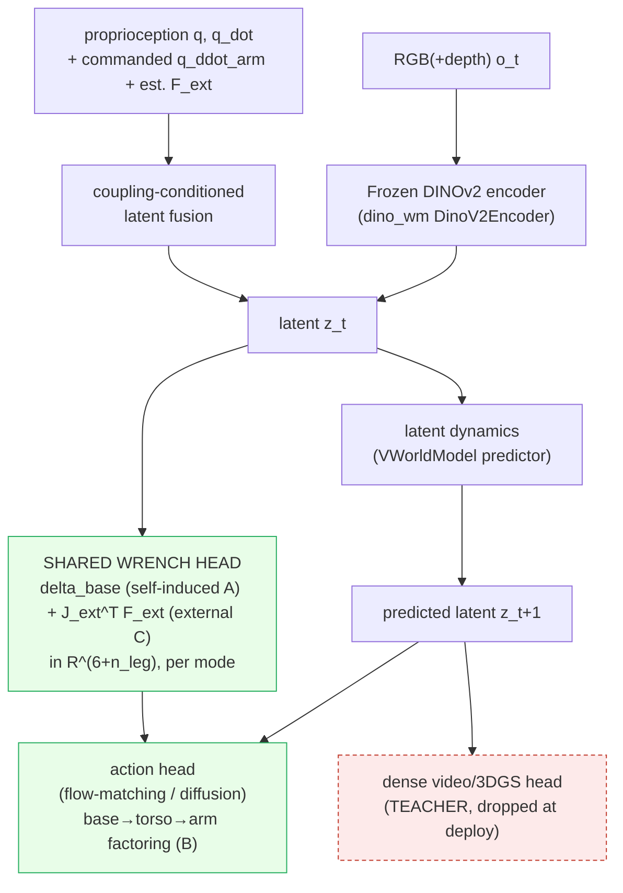
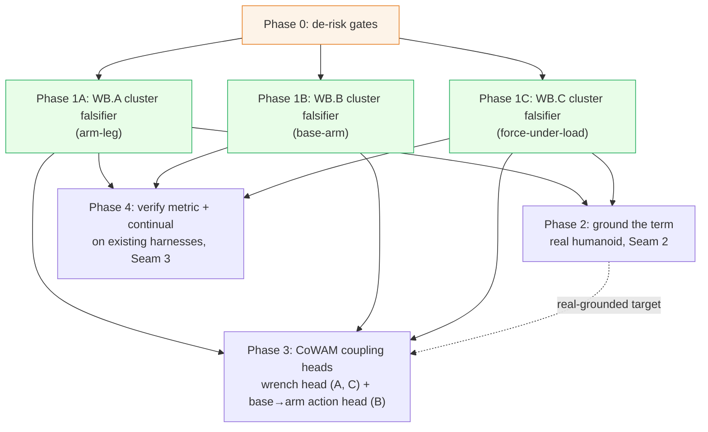

# Focus-Direction Research Plan: A Coupling-Aware World-Action Model (CoWAM)

## 1. Abstract

> [!abstract] The contribution and the program in one paragraph
> We target a conference contribution: a **World-Action Model whose latent explicitly imagines the reaction wrench of whole-body motion** (the *self-induced* inertial reaction and the *external* contact wrench), so a humanoid policy plans against a sensor-free *coupling forecast* instead of treating arm to leg, base to arm, and force-under-load coupling as an implicit residual. The model is **trained dense, deployed latent** (real-time on a G1/H1 humanoid), **grounded** by differentiable system-ID so the imagined physics is real, and **verified** by a causal-consistency metric that binds predicted coupling to measured coupling. Working name **CoWAM**. The thesis commits to **three** humanoid coupling channels, arm↔leg (inertial), base↔arm (kinematic), and force-under-load (external wrench), so the coupling lift is measured *first* on **balance / disturbance rejection** (the direct test of arm→leg reaction prediction), **mobile-manipulation** (the base↔arm anchor), and **force-under-load / OOD-payload** (the external-wrench anchor); the remaining evaluation axes are **generality / robustness checks** that the coupling term transfers across task families, not co-equal contributions. The two **force** channels (arm↔leg self-induced and force-under-load external) are the two **dominant** force-transmission pathways; they share one **output** wrench head (the legs compensate) but solve **different prediction problems** (A computable from the commanded $\ddot q_{\text{arm}}$ + inertia, C's exogenous wrench anticipated from context/load/contact); the kinematic channel (base↔arm) factors the action. Gravity/CoM is folded into the grounded model; the arm-velocity-induced Coriolis cross-term is predicted inside channel A (not a separate channel). This document is one plan, the method (problem through experiments) followed by the staged program that produces it, reducing [[Focus-Direction]]'s six clusters to one executable bet. Scope (per project decisions): the **full six-cluster program, staged parallelism** so the de-risked core leads and the three cross-cluster seams are the named research contribution; a **real humanoid is available** (grounding is near-term); a **well-resourced lab**. The staging is **not** five unconditional parallel tracks: the **three cluster falsifiers are co-equal go/no-go gates**, and each downstream build commits only after the cluster(s) it serves pass, the shared wrench head on the WB.A and WB.C gates, the autoregressive action head on the WB.B gate, real grounding on the force-cluster gates it serves. The verify track and the three cheap cluster falsifiers (one per coupling cluster, Phase 1A/1B/1C) start at M0; everything downstream of the gates is conditional. All three clusters get co-equal falsifiers, none is the master gate. Companions: [[Focus-Direction]] (thesis), [[Focus-Direction-Workflow]] (the one-page canvas pitch of this full program), [[Focus-Direction-Paper-Code-Index]] (papers to code), [[Focus-Direction-Review]] (the adversarial review absorbed here).

## 2. Introduction and motivation

> [!tip] First principles (the program bet)
> - **First principle:** the generalized mass matrix is non-block-diagonal, so every whole-body motion transmits a low-dimensional, structured cross-term (a reaction wrench, or a kinematic feasibility constraint) between the arm, the base, and the legs; that cross-term is a quantity to predict, not data to collect.
> - **Assumption challenged:** the field decouples whole-body control into an arm controller plus a balance controller and leaves the coupling implicit or reactive.
> - **The bet:** making each coupling an explicit, anticipatory, grounded, and verified world-model output beats far larger data and compute on a fixed budget, with the gain concentrated where the cross-term is largest, and it falsifies cheaply via the epsilon-curve.

Whole-body humanoid control is conventionally **decoupled**: an arm/manipulation controller plus a balance/locomotion controller, with the physical coupling between them left implicit. But the generalized mass matrix is non-block-diagonal, so a fast arm reach **is** a base and leg balance disturbance (channel **A**, self-induced), and an *external* hand wrench propagates through $J_{\text{ext}}^{\top}$ to the support legs (channel **C**, external), so force adaptation under load is a whole-body equilibrium problem, not an arm problem; discarding those cross-terms is what makes whole-body policies brittle on aggressive motion and under load. The opportunity: each cross-term is **low-dimensional and structured**, a quantity to *predict* rather than data to collect, and to predict it **anticipatorily** (from the commanded arm motion for the self-induced reaction, from an estimate of the unknown external wrench for force-under-load, before the base is perturbed). The two force channels (the two **dominant** force-transmission pathways) share one **output** wrench head while solving different prediction problems (A computable from the commanded $\ddot q_{\text{arm}}$, C anticipated from exogenous context/load/contact); the kinematic channel (base↔arm, **B**) factors the action; gravity/CoM is folded into the grounded model; the arm-velocity-induced Coriolis cross-term is predicted inside channel A (not a separate channel). This plan tests whether making that prediction explicit, carried on a World-Action Model that is trained dense and deployed latent, grounded by differentiable system-ID and verified by a causal-consistency metric, beats both implicit-coupling and reactive-observer baselines on a fixed data and compute budget. The gap it targets, and the premises taken as fixed (literature facts), are below.

> [!warning] Three fixed premises (literature facts, not relitigated here)
> 1. **[[2606.16542|ADAPT]] is reactive, not anticipatory.** It is a momentum-based analytical *disturbance observer* that estimates whole-body residual wrench online from measured state and feeds it as a PPO observation; it estimates *external* disturbances after they manifest, so it is the reactive *estimate-then-react* foil for **both force channels** (self-induced **A** and external-wrench **C**). The surviving wedge is ==anticipatory feedforward prediction of each cross-term, before it perturbs the base==: the self-induced inertial term (A), and the *unknown external* wrench (C). ADAPT was surfaced via the large concept graph rather than the original literature sweep and is now incorporated into the [[Focus-Direction-Paper-Code-Index|Paper-Code-Index]] (row 169, WB·C); it is the closest *reactive* prior art. It becomes a **mandatory baseline** on both force channels. The closest *anticipatory* prior art is [[2201.03871|ALMA]] (likewise surfaced via the large concept graph and since added to the 567-paper index, row 136, WB·C): it feeds an MPC-predicted **external** wrench as an anticipatory observation to a **separate** RL locomotion policy, but only the *self-induced known* wrench from the robot's own arm plan, on a quadruped, model-based, so it is the sharpest neighbor for the **force-under-load (C)** channel specifically. The wedge that survives ALMA is **each cross-term, learned as a world-model output inside one coupled humanoid policy** (not an MPC-computed external wrench handed to a second controller): the self-induced inertial term (A), and the *unknown external* wrench (C) that ALMA's self-induced-only scope excludes; ALMA is cited and distinguished in the Background and the novelty-positioning table, and the decoupled-anticipatory handoff is a baseline-family to position against.
> 2. **The 41% to 62% headline is borrowed** ([[2604.07993|HEX]]-implicit beating **monolithic generalist VLAs** (pi0.5 44.3 / GR00T N1.5 41.0) on unseen-scene generalization, not part-wise stacks, not explicit-vs-implicit), so it is the field's proof-of-life, not this program's claim. The program tests **two** narrower wedges instead: (i) the **explicit-vs-implicit** wedge, concentrated where arm acceleration is largest and surviving inertia-model error (the falsifier + $\varepsilon$-curve of the de-risked core and CoWAM), and (ii) the **explicit-vs-reactive** wedge, anticipatory feedforward beating ADAPT's reactive observer on fast self-reaches, isolated by the **input-isolation control of ablation #1** (same head, swap only the input). Both are go/no-go gates in PR-1A.
> 3. **The Graphify concept graph has no node for "reaction wrench" as a compound and none for "causal consistency as a verification metric"**, the two genuine whitespaces this plan targets. Re-verified against both snapshots (snapshot at writing; the live graph has since grown, so treat the precise node counts as of writing rather than freshly re-queried): the cited `data/papers/graphify-out/graph.json` (1996 nodes) and the larger `graphify-out/graph.json` (30331 nodes). Both return **0 "reaction wrench" compound nodes and 0 "causal-consistency-as-a-metric" nodes**: the large graph's one "causal consistency" hit is a *reward term* ("blueprint-aware rewards ... Causal Consistency"), not a predicted-vs-realized verification metric. Honest qualifier (re-counted against the actual graph, do not overclaim): the large graph **does** contain **80 "coupling"-substring nodes (24 standalone "coupling" + the 56 "decoupling" below), 3 "disturbance-observer"-compound nodes**, and **56 "decoupling" nodes**, so the field clearly *has* coupling and observer concepts, with decoupling-flavored concepts outnumbering the standalone-coupling ones **~2.3:1** (56 vs 24). **The disturbance-observer count is by query methodology (so the 3-vs-4 reading reconciles):** the **3** is the exact-substring match on "disturbance observer"/"disturbance-observer" (2 are ADAPT's own, [[2606.16542|ADAPT]]: its momentum-observer node and its tracking-result node, and 1 is [[2603.27313|MetaTune]]'s "joint controller and disturbance-observer tuning"). A *looser* "disturbance"-and-"observer"-co-occurrence query returns **4**, the 4th being [[2509.18865|Bi-VLA]]'s "disturbance and reaction force observers", a four-channel bilateral-control force/disturbance observer, which is **not** the whole-body momentum disturbance-observer compound this plan baselines against (ADAPT's class), so the compound count this plan cites stays **3**. The graph also now contains an **anticipatory-wrench node** ([[2201.03871|ALMA]]'s "anticipatory predicted-wrench observations" and "predicted external-wrench sequence into locomotion policy"), so the whitespace is **not** "no anticipatory-wrench node exists" (ALMA's does, for the *external* wrench in a decoupled handoff). The whitespace is the **specific framing**: no node represents *anticipatory feedforward prediction of the **self-induced** arm→base inertial cross-term as a **learned world-model output inside one coupled policy***. That sharp framing, plus the two genuinely-zero terms (reaction-wrench-compound, causal-consistency-as-metric), is the corroborated whitespace. These zeros are **exact-term substring counts on a single graph snapshot**, not an absolute-novelty claim: a **semantic-synonym sweep** for the same compounds (interaction / contact-wrench feedforward, coupling-torque feedforward, anticipatory reaction-wrench prediction, consistency-based or predicted-vs-realized world-model evaluation) likewise returns no node binding the compound as a single *predicted* quantity or as a *verification metric*, so the whitespace is the specific compound-framing and is robust to wording, not the mere absence of a substring. **Coverage note (so the whitespace rests on a graph that actually contains the foundational papers):** the whitespace counts are read on the **large** `graphify-out/graph.json` (6233 distinct source notes), where every foundational paper this plan leans on is indexed (verified: [[2606.16542|ADAPT]], [[2603.01151|D-REX]], [[2104.02646|gradSim]], [[2411.04983|DINO-WM]], [[2605.21800|stable-worldmodel]], [[2606.13877|ContactWorld]], [[2606.18610|SC3-Eval]] all present as source notes). The smaller `data/papers/graphify-out/graph.json` (533 source notes) is a subset that pre-dates the [[2606.16542|ADAPT]] ingest, so the genuine-zeros claim is robust on *both* but the *coverage* claim is made only on the large graph.

## 3. Background and related work

> [!abstract] Where CoWAM sits across five literatures
> The contribution is not in any single area but at their intersection: it takes the *explicit reaction term* the whole-body field leaves implicit, makes it a *world-model output* the WAM field has not targeted, *grounds* it with the differentiable-sysID field's machinery, and *certifies* it with a metric the WAM-evaluation field lacks.

**Whole-body loco-manipulation.** The field defaults to *decoupling*: an arm controller plus a balance controller, with coupling left implicit ([[2604.07993|HEX]]'s predictive MoE), emergent ([[2505.06776|FALCON]]'s shared observation), or one-directional ([[2509.21231|SEEC]], base→arm only). Analytic-residual approaches add a model term reactively ([[2504.06662|RAMBO]], [[2507.04140|Centroidal-Arm-Motion]]); [[2502.03206|HugWBC]] estimates privileged state; [[2606.16542|ADAPT]] feeds a momentum-observed disturbance as an observation; [[2512.11047|WholeBodyVLA]] splits loco/manip latents. The single closest *anticipatory* prior art is [[2201.03871|ALMA]] (legged mobile manipulator): a whole-body MPC manipulation controller outputs a **predicted external-wrench sequence** that is fed as an **anticipatory observation** to a *separate* RL locomotion policy, so the base proactively compensates for manipulator disturbance. ALMA is the sharpest neighbor and the one this graph surfaces (its "anticipatory predicted-wrench observations" node), so the distinction must be made explicitly, see the novelty-positioning table: ALMA is a **decoupled two-controller handoff** (the exact architecture CoWAM argues against), predicts the **self-induced applied arm wrench** (the force its own manipulation exerts, from a model-based MPC, not an unknown external load and not the **self-induced inertial cross-term** $M_{\text{base,arm}}\ddot q_{\text{arm}}$ as a *learned* output), is **not a world-action model**, and has **no $\varepsilon$-curve de-circularization, no robot-self sysID grounding, and no causal-consistency metric**. Benchmark: [[2403.10506|HumanoidBench]]. **Force-under-load** is the external-force twin: the humanoid field handles it *reactively*, via a torque-limit-aware force curriculum ([[2505.06776|FALCON]]), a force-augmented reward ([[2510.26280|Thor]], 167.7 N pull), a history-estimated load context ([[2606.03297|SplitAdapter]], 6 kg OOD), learned impedance ([[2511.04679|GentleHumanoid]], [[2505.20829|Unified-Force-Position-Control]]), or a high-load actuator model ([[2502.10894|UAN]], 113 N cart / 8 kg lift); [[2606.13232|WT-UMI]] adds directly-sensed tactile force with admittance, and ADAPT's momentum observer is the reactive external-wrench estimate. All *estimate-then-compensate from the past*; ALMA alone anticipates, but only the self-induced known wrench on a quadruped. *CoWAM* makes both the self-induced arm→leg cross-term **and the unknown external wrench** an explicit, anticipatory, *imagined* prediction inside one coupled humanoid policy (the two force channels sharing one head) and ablates against exactly these implicit / observer / decoupled-anticipatory / reactive-impedance baselines.

**World(-action) models for manipulation.** Latent-dynamics WMs ([[2411.04983|DINO-WM]], [[2603.14482|V-JEPA-2.1]], [[2602.10098|VLA-JEPA]]), video-prediction policies ([[2412.14803|VPP]], [[2412.15109|Seer]], [[2505.11528|LaDi-WM]]), and unified video+action models with drop-heads ([[2504.02792|UWM]], [[2503.00200|UVA]], [[2605.20752|GaussianDream]]) all imagine *scene* futures. Two recent results sharpen the predict bet: [[2605.23856|JOPAT]] shows a WAM predicting an explicit *structured* target (2D point tracks + visibility) beats pixel prediction, and [[2607.08436|EgoWAM]] shows an auxiliary, train-dense / deploy-action-only world-model head robustly beats plain behavior cloning (with the representation choice mattering). *CoWAM*'s imagined output is a *physics quantity* (the reaction wrench), and its latent is conditioned on commanded acceleration, not just appearance.

**Sim-to-real and differentiable system-ID.** Differentiable physics recovers *object* parameters ([[2104.02646|gradSim]], [[2603.01151|D-REX]], [[2504.16693|PIN-WM]], [[2503.17973|PhysTwin]]), learns constitutive laws ([[2304.14369|NCLaw]]), and explores to identify ([[2404.12308|ASID]]); twins close real→sim→real loops ([[2504.03597|Real-is-Sim]]). Model-free foils skip the physics model entirely, adapting humanoid dynamics few-shot ([[2606.28476|FADA]], LoRA on a factored inverse-dynamics model) or shaping the actuator reality to a fixed model ([[2607.02205|Actuator Reality Shaping]], zero-shot 22-DoF humanoid via a control-theoretic actuator interface). Structure-preserving sysID instead keeps the recovered dynamics physically consistent: [[2606.09640|Physics-Aware-Sparse-EL]] fits an Euler-Lagrange residual holding inertia SPD and the Coriolis term consistent (a ground anchor for the robot's own $M_{\text{base,arm}}$ and Coriolis cross-term, where D-REX and NCLaw recover only object physics), while [[2607.06824|CaLiSym]] enforces symplectic actuation/contact ports and cuts OOD drift on a coupled double-pendulum and a real quadruped but recovers no interpretable coupling inertia. *CoWAM* re-points the per-link sysID loop at the *robot's own* inertia $M_{\text{base,arm}}$ (Seam 2), a target none of these address.

**World-model evaluation and runtime verification.** Reproducible WM harnesses ([[2605.21800|stable-worldmodel]]), visual-realism sim-real correlation ([[2605.06311|VISER]], $r{=}0.92$), executability-vs-plausibility ([[2604.19092|RoboWM-Bench]], [[2602.08971|WorldArena]]), self-consistency ([[2606.18610|SC3-Eval]]), asymmetry verifiers ([[2604.01985|WAV]]), failure diagnosis ([[2505.12224|RoboFAC]]), dynamics-realism diagnostics ([[2607.05966|iKCE]] shows a strong latent WM imagines *kinematically* and stays statistically invariant to friction, direct evidence that generic WAMs are dynamics-blind), and decision-time inverse-dynamics action-consistency ([[2607.02403|ACID]] binds each predicted transition to a recoverable action inside planning, a verify build-on beyond SC3-Eval's metric-only use). *CoWAM* adds a causal-consistency metric binding *predicted to realized coupling* on hardware, which no public benchmark measures (Seam 3).

**Efficiency and continual learning.** Real-time levers via distillation ([[2606.05254|Flash-WAM]]), quantization ([[2602.20309|QuantVLA]]), async architectures ([[2606.09811|AHA-WAM]]); forgetting-free continual via importance-weighted regularization and expert-routed PEFT ([[1612.00796|EWC]] Fisher prior, [[2605.06175|VLA-GSE]] generalized/specialized experts). *CoWAM* composes these to clear the contact-stability floor and protect the coupling term across continual updates.

## 4. Aims and hypotheses

The work is organized around six clusters that share one spine. Three of them are the **coupling core** (co-equal): **WB.A** (arm to leg), **WB.B** (base to arm), **WB.C** (force-under-load). The other three are **complementary general breakthroughs** that the core rides on: **WAM.A** (predict), **S2R.B** (ground), **EAI.B** (verify). Each cluster gets one Aim, "improve the cluster as a whole, i.e. its directions together," and one falsifiable hypothesis. The substance of the original H1 to H4 (the explicit-beats-implicit wedge, the per-channel concentration, the plug-in lift, the gradient, and identifiability) is preserved by being mapped onto the clusters below: nothing is dropped.

**Aims (one per cluster).**

### Aim WB.A (arm to leg, coupling core)
Improve the arm-to-leg coupling direction as a whole: make the self-induced reaction wrench $\delta_{\text{base}}=M_{\text{base,arm}}\,\ddot q_{\text{arm}}$ an explicit, anticipatory **prediction** (computable from commanded arm acceleration plus the coupling inertia) rather than something the legs discover reactively, and show this explicit feedforward beats implicit and reactive baselines.

### Aim WB.B (base to arm, coupling core)
Improve the base-to-arm coupling direction as a whole: factor the mobile-manipulation action autoregressively (base to torso to arm) so the base becomes a **predicted, coupled DoF** instead of an independently commanded one, and show the coupled factorization beats treating the base as decoupled. Channel B is the **kinematic** base-to-arm coupling (the base velocity is itself a manipulation DoF). The **dynamic** base-to-arm inertial reaction (the transpose term $M_{\text{arm,base}}\ddot q_{\text{base}}$, a fast base acceleration disturbing the arm) is **scoped out under a quasi-static-base assumption** (mobile-manipulation base motion is slow relative to arm dynamics), mirroring the terrain scope-out; a M0 check tests it, and if top-quartile base acceleration violates it, that term folds into the shared wrench head as a channel-A transpose rather than opening a separate channel.

### Aim WB.C (force-under-load, coupling core)
Improve the force-under-load coupling direction as a whole (the force-twin of WB.A): estimate the **unknown external** hand wrench and anticipate the base/leg reaction $J_{\text{ext}}^{\top}F_{\text{ext}}$ it induces, sharing WB.A's reaction-wrench output head, and show this anticipatory force handling beats reactive force handling (curriculum / observer / impedance).

### Aim WAM.A (predict, complementary breakthrough)
Improve the predictive substrate as a whole: carry all three coupling channels on a **train-dense / deploy-latent** World-Action Model so the coupling is available sensor-free at deploy, with the latent conditioned on dynamics state (proprioception plus commanded arm acceleration), not just scene appearance.

### Aim S2R.B (ground, complementary breakthrough)
Improve the grounding direction as a whole, serving all three coupling clusters: recover the robot's own coupling inertia $M_{\text{base,arm}}$ (A) and the contact model / $J_{\text{ext}}$ (C) from **real interaction** by differentiable system-ID, and ground the manipulated-object physics for the mobile-manipulation (B) via the same engine's native object recovery, so each cluster's coupling terms are measured rather than read off a URDF.

### Aim EAI.B (verify, complementary breakthrough)
Improve the verification direction as a whole: certify **predicted-vs-realized coupling** with a causal-consistency metric and its three-way error decomposition, computed on existing benchmark harnesses and hardware (no new benchmark is built).

**Falsifiable hypotheses (one core hypothesis per cluster, each tested in the Evaluation plan).**

### H-WB.A (the wedge on channel A)
Explicit-feedforward arm-to-leg coupling beats implicit (MoE) and reactive (observer) baselines, with the margin **concentrated where the cross-term is largest, at high arm acceleration**, and **surviving model error** (the $\varepsilon$-curve). This is the original H1 wedge instantiated on channel A.

### H-WB.B (the wedge on channel B)
The coupled base-to-arm factorization beats the decoupled-base baseline, with the margin **concentrated on reach-extension tasks** where the base most strongly couples into the arm's reachable workspace. This is the original H1 wedge instantiated on channel B.

### H-WB.C (the wedge on channel C, plus identifiability of the force model)
Anticipatory external-wrench handling beats **both** reactive handling (observer / impedance) **and** implicit handling ([[2505.06776|FALCON]]'s force-curriculum), with the margin **concentrated in the first ~100 ms after a step-applied unknown load**, where reactive compensation lags, and **surviving model error**. The contact model / $J_{\text{ext}}$ is **identifiable in the PR-0b sim check (planted contact-model / $J_{\text{ext}}$ unknowns, known ground truth), with real-robot grounding validated downstream by PR-2 (OOD-mass SR + PR-4 force-plate self-consistency), since the real true contact model is unobservable** (the channel-C half of the original H4). This is the original H1 wedge plus H4 instantiated on channel C.

### H-WAM.A (plug-in lift and gradient)
The coupling lift is **positive and significant across every WAM backbone** (the backbone grid), so it is a module and not a backbone artifact (original H2), and, as an **exploratory, confound-aware gradient** (original H3), we expect the lift **largest where the native latent is least control-relevant**, tested *within-backbone* (cross-family magnitude and ordering are confounded by backbone size/data/training, so the gradient is observed at fixed capacity per ablation #5, not read off the cross-family ranking). Together these certify that the predictive substrate carries the coupling as a transferable module whose value plausibly scales with how dynamics-poor the host latent is.

### H-S2R.B (identifiability of the coupling inertia)
The coupling inertia $M_{\text{base,arm}}$ is **identifiable in the PR-0b sim check (planted $\tilde M$, known ground truth), with real-robot grounding validated downstream by PR-2 (OOD-mass SR + PR-4 force-plate self-consistency), since the real true inertia is unobservable** (the channel-A / inertia half of the original H4), so grounding by differentiable system-ID is validated against these downstream checks rather than against a URDF prior.

### H-EAI.B (causal-consistency is measurable and discriminative)
A predicted-vs-realized coupling check is **well-defined and discriminative on existing harnesses + hardware**: it separates models that genuinely anticipate the reaction wrench from those that do not, and its three-way error decomposition attributes residual error to prediction, grounding, or execution. No public benchmark currently binds predicted-to-realized coupling (search-confirmed), so the novelty is the metric and its decomposition, not a new benchmark.

The core contribution is the four modifications below.

> [!tip] The four breakthrough modifications (the core contribution)
> 1. **Reaction-wrench imagination head (shared across the two force channels)**: the WAM predicts both the self-induced coupling term $\delta_{\text{base}}=M_{\text{base,arm}}\,\ddot q_{\text{arm}}$ (WB.A) and the external-wrench reaction $J_{\text{ext}}^{\top}F_{\text{ext}}$ (WB.C) as a modeled *output*, not a policy input; WB.A and WB.C **share this output head** but are different prediction problems (WB.A computable from $\ddot q_{\text{arm}}$ + inertia, WB.C's exogenous wrench anticipated from context/load/contact). ([[WAM|WAM·A2]])
> 2. **Coupling-conditioned latent**: the latent carries dynamics state (proprioception + commanded arm acceleration), not just scene appearance. ([[WAM|WAM·A3]], Seam 1)
> 3. **Differentiable-sysID grounding**: the coupling inertia is measured from real interaction, not read off a URDF. ([[Sim2Real|S2R·B2]], Seam 2)
> 4. **Causal-consistency verification**: a predicted-vs-realized coupling check. This is a **new metric that does not currently exist** (no public benchmark binds predicted-to-realized coupling, search-confirmed); the novelty is the metric and its three-way error decomposition, which are **computed on existing benchmark harnesses + hardware** (no new benchmark is built). ([[Embodied-AI|EAI·B1]], Seam 3)
>
> (Mechanisms are defined once in the [[#The three seams|three-seams table]], not restated here.)

## 5. Approach

The method has seven parts, in order: the problem formalization, the architecture, the coupling clusters (the co-equal core), the mechanism clusters (the predict, ground, and verify seams), the decisive falsifier and de-circularization, and the training objectives and data pipeline.

### Problem formalization

A part-wise whole-body policy discards a term the physics has. The generalized mass matrix $M(q)$ is non-block-diagonal, so an arm acceleration is a base/leg balance disturbance:

$$
M(q)\,\ddot q + C(q,\dot q)\,\dot q + g(q) = \tau + J_{\text{ext}}^\top F_{\text{ext}}, \qquad
\delta_{\text{base}} \;=\; M_{\text{base,arm}}(q)\,\ddot q_{\text{arm}} + C_{\text{base,arm}}(q,\dot q)\,\dot q_{\text{arm}}, \qquad
\delta^{\text{ext}}_{\text{base}} \;=\; J_{\text{ext}}^\top(q)\,F_{\text{ext}}
$$

$\delta_{\text{base}}$ is **low-dimensional and structured**: a 6-vector wrench (or per-contact-mode set) determined by the commanded arm acceleration, the current arm velocity, and the corresponding blocks of $M(q)$ and the velocity-product (Coriolis) term $C(q,\dot q)\dot q$. The thesis: predict it rather than collect data for it, and predict it *anticipatorily* (from commanded $\ddot q_{\text{arm}}$ and the measured $\dot q_{\text{arm}}$, before it perturbs the base) to beat both an implicit mixture and a reactive observer, with the gain concentrated where $\ddot q_{\text{arm}}$ is largest. The external-wrench reaction $\delta^{\text{ext}}_{\text{base}}=J_{\text{ext}}^{\top}F_{\text{ext}}$ (channel **C**) is the force-twin: the same low-dimensional structure and the same output head, but a *harder prediction problem*: the force source is an *unknown external* wrench anticipated from context, load, and contact state rather than computed from the self-induced $\ddot q_{\text{arm}}$; predict its whole-body reaction anticipatorily and the gain concentrates in the first ~100 ms after a step load, where reactive compensation lags.

> [!info] Precise definition (pin this down before coding)
> - **$\ddot q_{\text{arm}}$** is the *planned/commanded* arm acceleration, read from the action chunk the policy is about to execute. Using the *planned* (not measured) acceleration is what makes the prediction **anticipatory** (available before the reaction occurs), the wedge over [[2606.16542|ADAPT]]'s reactive observer. The wedge is falsifiable on timescales: the arm→base reaction rises over the arm-acceleration ramp (~1 to a few 50 Hz policy steps, ~20 to 60 ms at top-quartile $\ddot q_{\text{arm}}$), while a momentum observer lags ~one state step plus filter delay (one 500 Hz state step = 2 ms + a 40 Hz low-pass group delay $\approx$ 4 ms $\approx$ **6 ms** observer-lag at the 500 Hz state polling of the real-robot stack). Anticipation buys a margin **iff** (reaction rise-time + actuation delay) < (observer lag + one policy-step delay); the pre-registered numeric form (PR-0a, frozen) is **rise-time $\ge$ 31 ms** at top-quartile accel ($=$ ~6 ms observer-lag + 20 ms policy step + 5 ms margin) on both H1 and G1. If the observer's next-step estimate already lands inside the policy step, A1 has no delta.
> - **$M_{\text{base,arm}}(q)$** is the off-diagonal block of the generalized mass matrix coupling arm DoF to the floating-base + leg DoF. In MuJoCo, the full $M(q)$ is `mjData.qM` (sparse) made dense via `mj_fullM`; slice base/leg rows by arm columns (see the Phase-0 extraction step below). The target $\delta_{\text{base}}^{\star}$ for the auxiliary loss is $\tilde M_{\text{base,arm}}\,\ddot q_{\text{arm}} + (C_{\text{base,arm}}\,\dot q_{\text{arm}})$: the inertial term from a **perturbed** $\tilde M$ (the de-circularization protocol) plus the arm-velocity-induced base-row velocity-product (Coriolis) term. MuJoCo's `qfrc_bias` $= C(q,\dot q)\dot q + g(q)$ includes gravity and **all** base/leg velocity-product terms, so the raw bias does **not** isolate $C_{\text{base,arm}}\dot q_{\text{arm}}$: obtain the arm-velocity-induced Coriolis cross-term by finite-differencing the bias against the gravity-only bias `qfrc_bias(q,0)` with only the arm joint velocities nonzero (gravity subtracted, base/leg velocity-product terms excluded). This isolation captures the arm-velocity-quadratic self-reaction but **drops the bilinear arm-velocity $\times$ leg-velocity Coriolis products**, defensible at the stance/command instant where leg joint speed is low; for the dynamic loco-manip regime a **pre-registered switch** handles it: when the leg joint speed at the prediction instant exceeds a frozen threshold the target reverts to the **full bias term** (the full inertial+Coriolis self-reaction named next), and **PR-0a' carries the dropped cross-velocity magnitude inside its residual budget** so its size is measured at M0, not assumed negligible. If instead the retained quantity is the full bias, it is named the full inertial+Coriolis self-reaction (to match ADAPT's full-residual observer) rather than the Coriolis term. This term is retained (not bounded negligible) because it is largest in the fast-reach headline stratum that the $\varepsilon$-curve targets and because the reactive ADAPT observer estimates the full bias term, so omitting it would mis-match the two arms.
>
> **Phase-0 `mj_fullM` extraction (verified against `humanoid-bench`).** Reach `data.qM` through humanoid-bench's `MjDataWrapper.__getattr__` passthrough (`humanoid_bench/dmc_deps/dmc_wrapper.py`, the wrapper instantiated at `env.py:212`), i.e. `env.data.qM` works directly. humanoid-bench has **zero existing `mj_fullM`/`qM` usage** (only a DMC size-metadata entry), so this is a new Phase-0 task we must author and confirm on the H1 and G1 models:
> Densify with `mj_fullM(model, M, data.qM)` (M an `nv x nv` array, `data.qM` reached via the `env.data` passthrough), then slice base+leg rows by arm-joint qvel columns: rows 0:6 are the floating base (3 linear + 3 angular DoFs), and the arm columns are the arm joints' qvel indices, NOT all of `6:`. The indices are **derived from the joint map, never hardcoded across robots**, but the H1 derivation is worked out here so the slice is concrete and auditable. In `humanoid_bench/assets/robots/h1_pos.xml` the tree order (verified) is `free_base` then `left_hip_yaw/roll/pitch`, `left_knee`, `left_ankle`, the same five right-leg joints, `torso`, then `left_shoulder_pitch/roll/yaw`, `left_elbow`, and the same four right-arm joints. The free joint takes qvel 0:6, so the qvel layout is: floating base 0-5, **legs 6-15** (left 6-10, right 11-15, the indices [6,7,8,9,11,12,13,14] are LEG joints, not arm), **torso 16**, and the **arms at qvel 17-24** (left arm 17-20, right arm 21-24, 8 DoF). So the H1 arm columns are **[17,18,19,20,21,22,23,24]**. For G1 (`humanoid_bench/assets/g1/g1.xml`, 6-DoF legs per side) the legs occupy qvel 6-17, torso 18, and the arm-proper (shoulder/elbow) joints start at 19; the per-model joint map is read at M0 and the finger/hand joints are excluded from the arm-column set, so the G1 arm-column indices are confirmed at M0 from the joint map rather than assumed.
> **Phase-0 task (gate input, not a measurement):** after `mj_step`, on **both H1 and G1**, confirm the dense conversion succeeded with a populated floating-base block (the 6x6 base block is well-formed and its leading inertia entry is positive), then confirm the base-arm block is non-trivial under a top-quartile arm acceleration. humanoid-bench ships no example for this, so authoring + confirming the extraction on H1 and G1 is itself a Phase-0 deliverable.
> - **$\delta_{\text{base}}$** is the resulting generalized reaction on the base + leg DoF: the 6-DoF floating-base wrench plus the leg-joint torques, so dim $= 6 + n_{\text{leg}}$ (H1: 6+10=16; G1: 6+12=18), predicted per contact mode ($n_{\text{modes}}=2$, sliding vs sticking). The companion arm-side dimensions, read off the same joint map, are $n_{\text{arm}}=8$ for H1 (the 17-24 block) and the shoulder/elbow arm-proper count for G1 (finger joints excluded), with the torso treated as a base-side DoF so the H1 generalized-coordinate budget is the full 6 base + 10 leg + 1 torso + 8 arm = 25 of `h1_pos.xml` (a hand/gripper variant adds its finger DoF on top), not 24. **Contact-mode labels**: from the simulator contact state in sim; from tactile/contact-force estimation ([[2606.13877|ContactWorld]] modalities) on hardware.
> - **$F_{\text{ext}}$ and $\delta^{\text{ext}}_{\text{base}}$ (channel C, the force-twin).** $F_{\text{ext}}$ is the *unknown external* hand wrench (a 6-vector), estimated from proprioception by an ADAPT-style momentum observer (no F/T sensor required at deploy); $\delta^{\text{ext}}_{\text{base}}=J_{\text{ext}}^{\top}(q)\,F_{\text{ext}}$ is its generalized reaction on the base + leg DoF, the same $(6+n_{\text{leg}})$ shape as $\delta_{\text{base}}$ and predicted by the **same shared head**. The contact Jacobian $J_{\text{ext}}$ is read from the simulator in sim and recovered by differentiable sysID on hardware (Grounding, Seam 2 for C). The anticipatory wedge for C is on a different clock from A: the reaction to a *step-applied* unknown load rises over the load-onset transient, and the metric is the first ~100 ms CoM-excursion advantage over a reactive observer/impedance tracker, priced against the *composed* onboard loop latency (observer settling + inference + actuator bandwidth), PR-0a-C.

Why a **world-action model** (not just an MLP): the target $\delta_{\text{base}}=M_{\text{base,arm}}(q)\,\ddot q_{\text{arm}}+C_{\text{base,arm}}(q,\dot q)\,\dot q_{\text{arm}}$ is an instantaneous analytic function of the current state (including arm velocity) and the commanded arm acceleration, all known at step $t$, so it is *not* a quantity that must be rolled forward. The WAM earns its place for three other reasons the bare term does not: sensor-free deploy via train-dense/latent-deploy, planning against the latent-goal + wrench-feasibility objective, and a latent that carries the grounded $M_{\text{base,arm}}$ (Seam 2). The wrench head reads the *current* coupling-conditioned latent; a genuine forecast variant predicts $\delta_{\text{base}}$ along the action-chunk horizon by integrating the commanded accelerations, not from predicted pixels. Channel C is a **stronger** case for the WAM: its target $J_{\text{ext}}^{\top}F_{\text{ext}}$ is **not** an instantaneous analytic function of the robot's own state (the wrench is exogenous), so it must genuinely be anticipated from context, load, and contact history, exactly the imagination the WAM provides. Three humanoid channels: arm to leg ($\delta_{\text{base}}$ from arm reaches, A), force-under-load ($J_{\text{ext}}^{\top}F_{\text{ext}}$ from an unknown external wrench, C, sharing A's output head), and base to arm (base velocity as a manipulation DoF, B); all three falsifiers are **co-equal and run in parallel**, with A and C sharing one output head because both are leg-compensated wrenches.

### Architecture

**Backbone: the coupling head is a plug-in, shown across a WAM grid (not tied to one backbone).** The two coupling modules (wrench-imagination head + coupling-conditioned latent) bolt onto any WAM; the backbone grid proves the lift holds across families rather than committing to one backbone. Roles in the grid:
- **`dino_wm`** ([[2411.04983|DINO-WM]]): the lean WAM grid point + MPC-planning substrate (the first CoWAM backbone; the cluster falsifiers run on the state-based PPO floor, not a WAM). Frozen DINOv2 (`models/dino.py :: DinoV2Encoder`), latent dynamics (`models/visual_world_model.py :: VWorldModel`); the `train_decoder` gate already gives the train-dense/deploy-latent split, so the wrench head is a marginal add.
- **UWM** ([[2504.02792|UWM]]): the deployed action-output CoWAM. Its unified video+action diffusion already has an action head where the wrench conditioning attaches (`sample_marginal_action()` is the fast deploy path).
- **Cosmos** ([[2501.03575|Cosmos]]): the dense teacher + internet-scale video prior (train-time), distilled into the latent student; Cosmos-Policy is also a SOTA-WAM baseline ([[2603.22078|WAM-vs-VLA-Robustness]]).
- **V-JEPA2** ([[2603.14482|V-JEPA-2.1]]): a pure predictive-latent fourth axis. ([[2412.14803|VPP]] is a further frozen-video alternative.)

**The four added modules.**

| Module | Inputs | Output | Where it plugs in |
|---|---|---|---|
| **Coupling-conditioned fusion** | $z_t$, proprio $q,\dot q$, commanded $\ddot q_{\text{arm}}$ | conditioned latent $z_t$ (held control-relevant by $\mathcal L_{\text{cond}}$, the training objectives) | `VWorldModel.separate_emb()` / latent assembly; aux decoder reconstructs proprio + $\ddot q_{\text{arm}}$ from $z_t$ |
| **Shared wrench-imagination head** (channels A + C) | coupling-conditioned latent $z_t$ (pooled); commanded $\ddot q_{\text{arm}}$ (A) and estimated $F_{\text{ext}}$ (C) | $\hat\delta_{\text{base}}$ (A) and $\widehat{J_{\text{ext}}^{\top}F_{\text{ext}}}$ (C), each $\in\mathbb R^{6+n_{\text{leg}}}$ per mode + mode logits | off the conditioned latent in `VWorldModel.forward()`; `Linear->ReLU->Linear->(6+n_leg)` per mode + mode classifier, one output head, two prediction problems (A computable from $\ddot q_{\text{arm}}$, C anticipated from exogenous context) |
| **Action head (autoregressive)** | $z_{t+1}$ and $\hat\delta_{\text{base}}$ | action chunk $a_{t:t+H}$, factored base→torso→arm | flow-matching/diffusion head; the base→torso→arm factoring (fork `brs-algo` `whole_body_decoding_order`) **is** the base↔arm coupling, unifying both anchors in one model |
| **Dense teacher head** (video/3DGS) | $z_{t+1}$ | dense future obs | training only, dropped at deploy (`train_decoder` gate) |

Contacts are discrete (sliding vs sticking), so the head emits a continuous $(6+n_{\text{leg}})$-vector per mode **plus** a contact-mode classifier ($n_{\text{modes}}=2$), with Huber on the selected mode's slice (the [[2606.13877|ContactWorld]] lesson: contact-rich latents need explicit structure).

### Improving the coupling clusters (the co-equal core)

The three coupling clusters are improved each as a whole and co-equally: improving WB.A, WB.B, or WB.C means advancing all of its directions together as one whole-body interface, with the per-direction recipes below as the parts of that single advance.

#### WB.A (arm to leg): improve WB.A1, WB.A2, WB.A3, WB.A4 together

> [!tip] First principles
> - **First principle:** an arm's motion imposes a centroidal-momentum reaction on the floating base that exists before the legs sense any base disturbance, so the coupling is causal and feed-forward, not a disturbance to reject after the fact.
> - **Assumption challenged:** loco-manip stacks treat the base as absorbing arm motion reactively (SEEC's light-arm assumption, WholeBodyVLA's separate feasibility stage, HiWET's reactive base reward).
> - **The bet:** anticipating the arm-induced base wrench one horizon ahead cuts base-pose deviation and end-effector acceleration under fast reach-while-walking versus the implicit-coupling baseline at no inference-latency cost, and zeroing the feed-forward path collapses the gain.

The four directions in WB.A are the cluster's coordinated advances at different layers of one whole-body interface in which upper-limb intent and lower-body support are coupled before commands are issued, so the legs anticipate the arm's inertial demand rather than scrambling to absorb it after the fact. They attack distinct layers: WB.A1 anticipates the arm-induced base reaction by decoding [[2604.07993|HEX]]'s forecast arm latents through the centroidal-momentum matrix of [[2506.14278|Heavy-Limbs-WBC]] into an anticipatory base reaction wrench, closing the back-coupling [[2509.21231|SEEC]] assumed away, and WB.A4 encodes the same coupling at the command-vocabulary layer by emitting [[2512.11047|WholeBodyVLA]]'s locomotion latent as a residual conditioned on the manipulation code ([[2506.13751|LeVERB]]-style) and projecting the pair onto [[2606.18772|HALOMI]]'s behavior manifold so the joint loco-plus-manip latent is feasible by construction. WB.A2 and WB.A3 then secure feasibility once the coupled command meets the real robot and the real workspace: WB.A2 freezes [[2506.09366|SkillBlender]]'s blended hull and [[2602.06341|HiWET]]'s world-frame transport as the sim-to-real feasibility substrate and repairs only the sim-to-real residual via an entropy-gated [[2602.08594|MOSAIC]] adapter, while WB.A3 schedules HiWET's base by following the gradient of a [[2508.11275|Differentiable-Reachability-Maps]] field and shrinks its margin with measured tracking residuals. WB.A2 and WB.A4 are alternative feasibility substrates the cluster evaluates, not a single stacked pipeline: WB.A2's SkillBlender-plus-HiWET blended hull and WB.A4's HALOMI behavior manifold (the [[2511.04131|BFM-Zero]] latent it projects onto) are different, non-stackable feasibility constructions, so WB.A2's residual cannot literally carry WB.A4's manifold-decoded latent. Each recipe targets the layer the next presumes: anticipate the wrench (WB.A1), couple it into the command vocabulary as a feasible-by-construction latent (WB.A4), secure sim-to-real feasibility (WB.A2), and secure workspace feasibility by reachability-aware transport (WB.A3), so the cluster advances one whole-body interface at four layers rather than landing four point fixes.

##### WB.A1: CoReWA (Coupled Reaction-Wrench Anticipation): centroidal-momentum forecast bridging a whole-body VLA and its loco-controller

**Build on** [[2604.07993|HEX]] + [[2509.21231|SEEC]] + [[2506.14278|Heavy-Limbs-WBC]]. Turn HEX's predicted future arm latents into an explicit anticipatory base reaction wrench via the centroidal-momentum matrix, inject it into both the action-fusion gate and the low-level controller.

1. Keep HEX as the high-level whole-body VLA: inputs are language tokens L, visual tokens V_t, the history query token Q_t, and the part-slot proprioceptive state. HEX's Unified Proprioceptive Predictor (UPP) already forecasts future proprio latents of all parts jointly over horizon tau_p, giving a coupled short-horizon rollout of where the arms will be.
2. Add a Reaction-Wrench head on top of UPP: decode the predicted future arm/hand latents into joint positions, velocities and accelerations via a small MLP mirroring HEX's state-decoder, push them through the centroidal-momentum matrix A(q) from Heavy-Limbs WBC, and map through floating-base dynamics to an anticipated base reaction wrench W_hat_b = [F_hat_b; T_hat_b]. This is the explicit arm-to-base inertial term that closes SEEC's Assumption 1 of negligible back-coupling.
3. Extend HEX's dual cross-attention gate with the anticipated wrench as a third conditioning stream H^w (a learned embedding of W_hat_b), so g_t = sigma(W_g[H^vl; H^p; H^w; X_t]) with residual injection F_t = H^vl + g_t * (H^p + H^w). The VLA can then pre-shape the arm trajectory to keep the anticipated base wrench inside a balance-feasible envelope.
4. Feed the same W_hat_b forward to the low-level whole-body controller: in the RL instantiation, append it to the observation and add SEEC's torque-imitation so the legs pre-load before the arm moves; in the model-based instantiation, inject it as a known external disturbance into the Heavy-Limbs HQP while preserving its priority order (physical consistency, limb tracking, base tracking, contact force) so anticipation never overrides feasibility.
5. Train with total loss L = L_a + alpha L_s + beta L_w + gamma L_mom: L_a is HEX's flow-matching action loss, L_s its state-prediction loss, L_w SEEC's torque-imitation term generalized to the whole body where tau_comp uses the anticipated rather than instantaneous wrench, and L_mom a momentum-consistency loss ||A(q) qdot_pred - h_measured|| supervising the head against realized centroidal momentum.
6. Pretrain HEX on its 12M+ humanoid frames unchanged, then in sim attach SEEC's perturbation generator plus scripted aggressive reaches so the head sees full arm-base interaction, train controller and head against realized momentum and measured torque, and co-finetune the VLA gate with the wrench stream on task demos. At deploy, UPP forecasts latents, the head emits W_hat_b one horizon ahead, the gate pre-shapes and the controller pre-stabilizes, and the controller can be swapped since the wrench comes from A(q) not a black-box coupling.

- *Why it beats each:* HEX captures arm-leg coupling only implicitly inside a latent and emits to a black-box controller with no explicit reaction term, so a fast reach hands the legs a disturbance they discover late; CoReWA makes coupling an explicit physics-grounded wrench forecast feeding both policy and stabilizer, controller-agnostic. SEEC assumes away arm-to-base back-coupling, with no high-level manipulation or VLA policy, only a stabilization-oriented end-effector tracker; CoReWA inverts that causal direction, forecasting the arm's reaction wrench on the base and pre-loading the legs while inheriting SEEC's distillation robustness. Heavy-Limbs WBC has the momentum coupling and priority order but is purely reactive with no manipulation policy or forecasting; CoReWA reuses its momentum matrix and HQP as the physics core but drives it with a learned one-horizon-ahead VLA wrench forecast.
- *Falsifier:* In sim on a heavy-limbed humanoid, ablate the feed-forward path by zeroing W_hat_b into the controller while keeping it in the gate (and vice versa) during a fast lateral reach-while-walking; if base-pose deviation and end-effector acceleration are statistically indistinguishable from the implicit-coupling HEX baseline, the explicit anticipatory term adds nothing and the method is dead.
- *Benchmark:* Humanoid loco-manipulation on a heavy-limbed bipedal platform (Booster T1 as in SEEC, Orca I as in Heavy-Limbs WBC): spill-free carry tasks, mean/max end-effector linear and angular acceleration while walking, HEX's whole-body manipulation suite (in-distribution and unseen-scene-variation success), and base-pose deviation under scripted aggressive reaches.
- *Risk:* Forecast quality is bounded by UPP's arm-latent accuracy; if tau_p is short or the latent forecast noisy, the anticipated wrench may lag or mispredict, and at high gait frequency the one-horizon lead could be too small to pre-load usefully, collapsing back toward SEEC-style reactive compensation. Sim-to-real transfer of the A(q)-derived wrench inherits Heavy-Limbs WBC's modeling assumptions (it drops contact-wrench-consistency constraints for real-time), so unmodeled friction or motor delay could degrade the feed-forward benefit.

##### WB.A2: BlendBridge: Sim-to-Real Whole-Body Loco-Manipulation by Entropy-Gated Residual-Adapting a Frozen Per-Joint Skill Blend

**Build on** [[2506.09366|SkillBlender]] + [[2602.08594|MOSAIC]] + [[2602.06341|HiWET]]. Treat SkillBlender's per-joint softmax blend of frozen primitives as a frozen feasibility substrate, then close its sim-only gap with a zero-initialized per-joint residual adapter whose authority is gated by the blend's per-joint softmax entropy.

1. Take SkillBlender's N frozen goal-conditioned whole-body primitives (Walking, Reaching, Squatting, Stepping); the high-level policy emits per-skill subgoals and raw per-joint weights, a per-joint softmax-over-skills produces W_t^i, and the Hadamard-weighted sum a_blend_t is the frozen feasibility substrate.
2. Stage 1, train the blend in sim with PPO and 1 to 2 task rewards; pretrain HiWET's frozen Kinematic Manifold Prior on constrained-IK samples to map bimanual end-effector targets to a consistent upper-body reference, and partition upper-body authority to the KMP path by setting the Reaching primitive's upper-body raw weights to large-negative so softmax drives them to zero, eliminating the two-prior conflict; add HiWET's world-frame command policy emitting base-velocity, height, and base-relative end-effector subgoals to actively transport the base beyond static reach, then freeze everything.
3. Stage 2, slot a trainable per-joint residual actor in the same joint-target space with a zero-bias near-zero-gain last layer so the frozen blend dominates early; the deployed action is a_deploy_t = a_blend_t + g(W_t) Hadamard Delta_a_t, where g is the novel per-joint authority gate.
4. The gate is an explicit function of the blend's normalized per-joint entropy H_m = -(1/log N) sum_i p_m,i log(p_m,i + eps): set g(W_t)[m] = g_min + (1 - g_min)(1 - H_m)^beta with a strictly-positive floor g_min (e.g. 0.3) and sharpness beta >= 1 (e.g. 2), so the residual gets near-full authority where one skill dominates a joint and is damped where skills are co-active; g is computed no-grad so gradients flow only into the residual.
5. At deploy the observation is proprioception, last action, and the world-frame command; the frozen path computes a_blend_t and g(W_t) under no-grad, the residual computes Delta_a_t, and the gated additive composition feeds PD torques tau = Kp(q_des - q) + Kd(qdot_des - qdot) at 50 Hz on the Unitree humanoid.
6. Train only the residual on roughly 30 minutes of hardware data via MOSAIC's dual-teacher behavior cloning (an adaptation teacher on hardware transitions and the frozen blend on general transitions), plus a KMP-tracking reward pulling the corrected upper body toward the frozen manifold and an L2 penalty on off-hull residual magnitude so it stays a correction, not a second policy.

- *Why it beats each:* SkillBlender's blend is sim-only and never shown on hardware; the entropy-gated residual plus dual-teacher BC carries it across the interface gap without retraining primitives. MOSAIC adapts one monolithic tracker with a flat residual and has no feasible composition or base transport; riding the residual on a per-joint frozen blend gives feasibility-by-construction and a principled per-joint authority map MOSAIC lacks. HiWET caps the repertoire to one IK manifold; keeping its KMP and world-frame command policy but swapping the single controller for a blendable primitive library lets the same machinery compose squat, step, reach, and walk per task, with upper-body redundancy resolved by partition.
- *Falsifier:* Three real-hardware ablations, one per coupling claim. Gate: train full BlendBridge vs a constant-gate residual on the same frozen blend and same 30 min data; if entropy gate is statistically indistinguishable on feasibility and task error, it collapses to MOSAIC-on-a-blend. Active-base: if disabling base transport does not shrink reachable workspace or far-target success, the commander adds nothing. Library: if swapping the blend for HiWET's single IK-residual leaves squat/step feasibility unchanged, the library buys nothing. Any one null kills its third.
- *Benchmark:* SkillBench (8 loco-manip tasks across Unitree H1/G1/H1-2) for sim feasibility metrics (Tilt/RootHeight/Torque/Power) plus a new real-robot transfer protocol on Unitree G1; cross-check sim world-frame hand error against HiWET's 12.4 mm and reproduce its 25.2 mm no-KMP number in the KMP-removal ablation.
- *Risk:* The entropy gate may encode blend confidence (which skill owns a joint) rather than dynamic feasibility margin, so even with a positive floor it could under-authorize the residual on exactly the coordination joints (waist/hip in a loaded reach) where correction is most needed; if the optimal g_min is near 1 the entropy structure adds no value. Separately, arm-leg coupling at foot-contact transitions may be contact-wrench-dominated and invisible to both the kinematic KMP and the joint-target residual, capping real-world hand precision.

##### WB.A3: ReachSched-WBT (Reachability-Scheduled Base Transport for World-Frame Loco-Manipulation)

**Build on** [[2602.06341|HiWET]] + [[2508.11275|Differentiable-Reachability-Maps]]. A world-frame EE commander that schedules the base by following a learned reachability field's auto-diff gradient, screening each base placement before commitment, then feeding the tracking residual back as a learned shrink on the field margin.

1. Keep HiWET's interface untouched: the Commander consumes high-level state (Tracker state, world base pose, world L/R EE targets, active-arm mask) and outputs HiWET's exact structured command (base velocity, body height, base-frame EE subgoals, waist-engagement weight alpha) into the frozen Stage-1 hybrid-action Tracker (KMP upper-body residual + absolute lower-body joint targets); only HOW base velocity and EE subgoals are computed changes.
2. Pretrain a DRM-style continuous scalar reachability field f_R >= 0 (simultaneous-reachability formulation) on the SAME PyRoki/IK feasibility data HiWET curated for its Kinematic Manifold Prior, using DRM's NN realization for SE(3) inputs; obtain the base-scheduling gradient df_R/d(base pose) by auto-diff backprop through the trained net, deliberately not claiming DRM's analytic RBF-SVM gradient.
3. Replace HiWET's reward-only base term with reachability-shaped scheduling: each step follow the auto-diff gradient to bias base velocity toward placements that raise the minimum reachability margin across active arms, and screen chosen subgoals by requiring f_R(subgoal) >= m_eff, the effective margin from step 4, while the dense gradient also accelerates HiWET's spatial curriculum.
4. Close the certificate-to-dynamics gap with a learned conservative margin: treat f_R as a quasi-static kinematic screen, not a dynamic certificate, and learn the dynamic shortfall via m_eff(alpha, base speed, body-state) = m_0 + g_phi(...), where g_phi >= 0 is a small head fit on Stage-2 logs of (f_R value, alpha, speed, gait-phase) versus actual tracking success, so the screen is tightened only where motion erodes reach and stays near zero in the quasi-static regime.
5. Losses: DRM head pretrained with softplus binary-classification loss then frozen (mirroring frozen KMP); g_phi trained by logistic/pinball calibration loss on the achieved-success logs; Tracker is HiWET's PPO with asymmetric actor-critic plus CNN state-estimator MSE auxiliary, unchanged; Commander trained by PPO with HiWET's reward augmented by a reachability-margin reward +w*min(f_R - m_eff) and a penalty for committed subgoals that violate the effective screen.
6. Train-and-deploy: Stage-0 pretrain KMP and the alpha-augmented f_R field offline on the shared IK/FK data; Stage-1 reuse HiWET's frozen Tracker with frozen KMP and f_R; Stage-2 freeze the Tracker, train the reachability-scheduled Commander by PPO with the spatial curriculum and co-fit g_phi online from rollout logs; deploy zero-shot sim-to-real on a 29-DoF Unitree G1 querying f_R (0.062 ms/sample) and the cheap g_phi head at real-time PD rate.

- *Why it beats each:* Beats HiWET, whose base scheduling is reactive planar-proximity reward with no forward reachability model, by gradient-following toward feasible placements, screening subgoals before committing, and using g_phi to close the quasi-static-to-dynamic gap HiWET never models; beats DRM, an offline QP/SQP module with a static IK model that ignores loco-manipulation coupling, by embedding it in hierarchical RL and wrapping it with a deployment-calibrated margin so the static screen becomes a closed-loop hardware scheduler, honest about what it certifies.
- *Falsifier:* On boundary targets forcing base repositioning, Ablation A reverts to HiWET's reward-only base term (if reach-to-infeasible failures do not drop, the reachability coupling adds nothing and the method collapses to HiWET); Ablation B keeps gradient scheduling but sets g_phi = 0 (if the raw quasi-static screen matches the full method, the conservative-margin novelty is unjustified and the static-to-dynamic calibration claim is falsified).
- *Benchmark:* HiWET's long-horizon world-frame loco-manipulation suite on the Unitree G1 (5 geometric world-frame trajectories from +/-5 m starts, avg EE position error target <20 mm vs HiWET's 12-15 mm RMSE, base final-position error vs 0.101 m baseline), augmented with a new static-workspace-boundary subset and a reach-to-infeasible failure rate plus screen-calibration metric measured at increasing base speeds, all on the legged G1.
- *Risk:* The one load-bearing assumption is alpha-conditioned reachability, which DRM never modeled, so the multi-alpha IK labeling and per-alpha IoU sanity check are gating risks (fallback: an alpha-indexed ensemble of fixed-alpha fields); secondary risk is g_phi miscalibration if Stage-2 speeds miss the deployment distribution (mitigation: refit from on-robot logs and prefer pessimistic quantile calibration), and if the dynamic shortfall is large and pervasive rather than localized the screen could erode the workspace enough to narrow the advantage, which Ablation B detects.

##### WB.A4: CoLA-WB (Coupled Latent Actions for Whole-Body loco-manipulation)

**Build on** [[2512.11047|WholeBodyVLA]] + [[2506.13751|LeVERB]] + [[2606.18772|HALOMI]] (whose feasibility manifold is the [[2511.04131|BFM-Zero]] Forward-Backward latent it builds on). One VLA predicts a manipulation VQ code then a locomotion latent as a residual conditioned on it, fuses the pair, and projects it onto a frozen [[2511.04131|BFM-Zero]] manifold so the joint loco+manip latent is feasible by construction.

1. Keep WholeBodyVLA's two domain-disentangled VQ-VAE Latent Action Models over frozen DINOv2 features, a manip LAM and a loco LAM pretrained on action-free egocentric human video; they stay separate so a shared codebook does not misread moving-camera loco as arm motion. Output: per-frame pseudo-labels, a discrete manip code c_mani and a continuous loco latent z_loco.
2. Couple them via LeVERB's residual CVAE: the single policy pi_theta takes ego RGB plus language, first emits c_mani (what the hands intend), then emits the loco latent as a residual conditioned on it, z_loco = z_prior(o,l) + delta(o,l,c_mani), so the base moves in service of the hands; this replaces WholeBodyVLA's two independent cross-entropy heads with an explicit loco-given-manip dependency across domains.
3. Train the residual with a LeVERB-style privileged kinematics encoder over ground-truth near-future whole-body states emitting a posterior on z_loco, added onto the VLA's prediction, with a KL term forcing it to carry only loco detail not inferable from vision-language-plus-c_mani; a gradient-reversal modality discriminator keeps the latent invariant to real-versus-blank images so language-only clips mix in. The encoder is discarded at deployment.
4. Project for feasibility (HALOMI): concatenate the decoded manip code and loco residual into one whole-body latent, project onto BFM-Zero's spherical manifold to get z_tilde, and decode through the frozen BFM-Zero prior into joint commands a = pi_BFM(z_tilde, s_bfm); the manifold makes the emitted coupled latent feasible-by-construction, removing WholeBodyVLA's separate LMO RL stage that absorbs arm-base interference after the fact.
5. End to end: inputs are ego RGB plus language at ~10 Hz high level and proprioception-only s_bfm at the 50 Hz manifold controller; the one policy emits (c_mani, z_loco-as-residual), the controller outputs dual-arm and lower-body joint commands with no discrete handoff to a velocity-tracking RL policy. The latent is resampled every H steps so the controller trains against the multimodal latent distribution, not just its mean.
6. Loss and schedule: VQ reconstruction for the frozen LAMs + cross-entropy on c_mani + residual-CVAE objective on z_loco (future-state MSE through the manifold decode + beta1 KL to the privileged posterior + beta2 gradient-reversal modality-invariance), BFM-Zero frozen so no manifold loss, plus an optional coupling-consistency penalty. Stage 0 pretrains LAMs and BFM-Zero separately, Stage 1 trains the coupled VLA on pseudo-labels plus a small teleop set, Stage 2 closes the embodiment gap via depth reprojection-plus-inpaint and CEM-fit controller-aware reference adaptation.

- *Why it beats each:* WholeBodyVLA predicts its two latents by independent cross-entropy with no cross-domain constraint and leans on a separate LMO RL policy for feasibility; CoLA-WB makes loco a residual of manip and projects onto a feasibility manifold, dropping the disturbance-handling RL stage. LeVERB's single monolithic verb latent never factors loco from manip and enforces feasibility only via its distilled tracker; CoLA-WB keeps domains separate yet coupled with a hard manifold projection. HALOMI uses sparse Cartesian head-hand targets and no disentangled video pretraining; CoLA-WB puts one VLA emitting a coupled disentangled latent on top of HALOMI's manifold, gaining both human-video efficiency and the feasibility guarantee.
- *Falsifier:* On a Unitree G1 (or Agibot X2) loco-manipulation suite, ablate only the coupling, training one variant with the residual loco-given-manip dependency and one with WholeBodyVLA's two independent heads while holding the disentangled LAMs and BFM-Zero projection fixed; if the coupled variant does not improve success on locomotion-heavy subgoals that require base motion to serve hand placement (e.g. walk-up-and-place), the residual-coupling claim is dead and the method collapses to WholeBodyVLA-on-a-manifold. Cheap: reuses one backbone, swaps only the head plus residual KL term.
- *Benchmark:* LeVERB-Bench (closed-loop photorealistic IsaacSim whole-body VLA) for the latent-interface and coupling ablations, plus real-robot Unitree G1 tasks in HALOMI's style (Bag Transfer, Pick-Bread-and-Place, Transfer-Towel-to-Basket) and Agibot X2 Bag-Packing / Box-Loading / Cart-Pushing from WholeBodyVLA for feasibility and data-efficiency.
- *Risk:* The residual coupling and the frozen BFM-Zero manifold may fight: the manifold's support could be too coarse to express the fine base adjustments the residual wants, so projection clips exactly the coupling signal and net behavior matches independent heads. Mitigation: train the residual in the manifold's tangent space, predicting z_tilde residuals directly, rather than in raw command space before projection.

- *Cluster falsifier:* On a heavy-limbed Unitree G1 running a fast walk-up-and-place under scripted aggressive reaches, run the coupled cluster configuration (WB.A1 wrench anticipation feeding a WB.A4 coupled feasible-by-construction latent, with the WB.A2 entropy-gated residual securing sim-to-real feasibility on its own substrate and the WB.A3 reachability field scheduling the base) against a decoupled baseline that strips every coupling term at once (zero W_hat_b, two independent latent heads, constant-gate residual, reward-only base term); if base-pose deviation, end-effector acceleration, and locomotion-heavy-subgoal success are statistically indistinguishable from the decoupled baseline, the cluster's shared thesis that arm and leg must be coupled before commands issue is dead.
- *Cluster benchmark:* Humanoid world-frame loco-manipulation on the Unitree G1 (HiWET's long-horizon suite plus walk-up-and-place and spill-free carry under scripted aggressive reaches), reporting base-pose deviation, mean/max end-effector linear and angular acceleration while walking, world-frame hand position error against HiWET's 12-15 mm RMSE, and locomotion-heavy-subgoal success.

#### WB.B (base to arm): improve WB.B1, WB.B2, WB.B3 together

> [!tip] First principles
> - **First principle:** within one control chunk the base pose defines the arm's reachable workspace, so feasibility is a one-directional kinematic constraint (arm reach is a function of base pose), not symmetric mutual conditioning.
> - **Assumption challenged:** that richer symmetric base-arm exchange is strictly better.
> - **The bet:** a single one-way arm-to-base feasibility edge captures nearly all the gain, concentrated on the reach-extension stratum and near-zero on fixed-base reaches, while symmetric coupling buys latency, not accuracy.

The three directions converge on one shared artifact: a single mobile-manipulation policy that denoises base, torso/arm, and perception actions inside the same action chunk over one shared frame, with a co-trained DynaMem-style spatial memory introduced by WB.B2 and WB.B3 as the connective perception interface. WB.B1 ([[2503.05652|BRS]], [[2507.01961|AC-DiT]], [[2602.23024|InCoM]]) contributes the load-bearing coupling backbone as the reusable base-first component the other two build on, a chained base-then-torso-then-arm flow-matching decoder whose only moving part is a single arm-to-base feasibility-feedback edge that fixes how the limbs constrain each other within a chunk; WB.B1's own deliverable is the stratified margin map that validates this component, a controlled test of when that one feedback edge wins rather than an aggregate beat, and it carries no DynaMem memory of its own (it is built on BRS, AC-DiT, and InCoM only). WB.B2 ([[2603.03243|HoMMI]], [[2405.07991|SPIN]], [[2411.04999|DynaMem]]) extends that same chunk by promoting a 3D look-at point to a first-class action co-optimized with the base trajectory, conditioned on DynaMem-style time-recency and semantic value maps so gaze actively reveals the regions the planned base motion is about to open. WB.B3 ([[2511.18112|EchoVLA]], [[2411.04999|DynaMem]], [[2510.07134|TrackVLA++]]) supplies the memory those value maps read from, turning DynaMem's hard ray-cast purge into a differentiable in-policy write gate with cross-visit re-ID so the scene the base and gaze act on stays self-correcting across rooms and relocated objects. They reinforce each other because each closes the loop the previous opened: B1's base-arm feasibility edge needs the perception B2's gaze action acquires, and B2's value-map conditioning is only trustworthy because B3's confidence-gated purge keeps the underlying voxel memory fresh, so once WB.B1's validated coupling backbone is wrapped in the DynaMem perception interface that WB.B2 and WB.B3 supply, a single perceive-move-update-act loop compounds into one cluster-level whole-body controller no single direction delivers alone.

##### WB.B1: KCFlow-Strat: a stratified controlled test of WHEN arm-to-base feasibility feedback wins

**Build on** [[2503.05652|BRS]] + [[2507.01961|AC-DiT]] + [[2602.23024|InCoM]]. A controlled study resolving the B1 open question (which coordination structure wins when) by holding one base-first flow-matching backbone fixed and toggling a single minimal arm-to-base feasibility-feedback edge across an in-task base-motion stratification.

1. Reframe the contribution as whitespace, not architecture: base-first is a fixed premise, so the deliverable is a stratified margin map answering H1 (bidirectional beats unidirectional only when the arm feeds back to constrain the base) and H2 (margin stratified by in-task base motion), with the feedback edge as the minimal instrument; success is the map plus winning on the reach-extension stratum, not beating InCoM's aggregate SetTable score (cited as a directional bar, not asserted as the SetTable-specific number).
2. Fix one backbone so the only moving part is the edge: take the BRS observation stack (egocentric point cloud via PointNet, proprioception MLP, action-readout tokens through the BRS causal-self-attention transformer) plus InCoM's IDPPM intent front-end (History-Transformer + DINOv2 emits intent h_t, ScaleGater produces reweighted context c_t) and DARM Sinkhorn fusion, then replace DDPM denoisers with conditional-flow-matching decoders in strict base-then-torso-then-arm order (D_base first, D_torso on a_base, D_arm on a_base and a_torso), outputting the whole-body chunk factorized base 3 / torso 4 / arms+grippers 14 every 0.1 s, held byte-identical across conditions.
3. Define conditions as toggles on this backbone: U (unidirectional base-first, no feedback, the AC-DiT control), F-edge (add the single arm-to-base feasibility edge), B-sym (InCoM-style symmetric per-layer base-arm exchange reproduced on the same backbone). All share decoders, IDPPM, DARM, capacity, data, and budget; only the cross-stream coupling differs, filling H1's B-sym vs U row and letting F-edge read as the minimal one-way subset of bidirectional.
4. Specify and supervise the edge so the feasibility predictor fires on genuinely infeasible commitments: while integrating D_arm, maintain a learnable arm-summary token with a scalar margin m_arm, detach it via stop-gradient (AC-DiT trick, arm-to-base), and feed it to D_base for one short gated base refinement; supervise m_arm not against feasible-by-construction expert joints but against a counterfactual reachability label, perturbing committed a_base over off-distribution poses and regressing m_arm to an analytic IK-feasibility-plus-Yoshikawa-manipulability infeasibility map.
5. Resolve the gate in one direction: define g = sigma(w . h_t) as the feedback-admittance gate opening (g near 1) during fine-manipulation / reach-extension when arm feasibility must constrain the base and closing (g near 0) during fast free base-transit, supervised by one lambda_gate term aligned to InCoM's kinematics-guided phase signal so deep/global features co-fire with high g during the constrain phase.
6. State the loss and convergence guard: total L sums the per-stream flow-matching velocity loss with chained kinematic conditions, lambda_feas counterfactual-reachability regression on m_arm, lambda_gate kinematics-guided gate KL with entropy, and optional DARM Sinkhorn affinity; add a one-step Newton-style consistency objective re-evaluating analytic reachability on the refined base and penalizing residual infeasibility so the correction is contractive, with a runtime monitor permitting a second bounded refinement if residual is not reduced. Train Stage 1 (D_base alone, base-only) then Stage 2 (full chained decoders, IDPPM, gate, edge end to end on whole-body teleop, vision frozen, offline reachability labels); deploy per step within the measured budget, profiling U, F-edge, B-sym on the 0.1 s control loop and pruning DARM / flow steps to stay honest.

- *Why it beats each:* vs U (AC-DiT unidirectional control), F-edge adds the H1 arm-to-base signal and wins on the reach-extension stratum where the arm reaches past the base's committed pose; vs B-sym (InCoM symmetry reproduced), the claim is not a strict aggregate beat but the H1 prediction made testable, matching B-sym on reach-extension at lower coupling bandwidth and latency and showing where one-way coupling suffices; vs BRS/WB-VIMA, it keeps base-first causality but lets the base see an arm-feasibility summary within the same chunk and swaps DDPM for few-step flow.
- *Falsifier:* H1, report F-edge-minus-U per stratum; if the margin is uniform or zero (not larger on reach-extension than fixed-base), the feedback is not the conditional lever and H1 dies. Corollary 1, m_arm must hit non-trivial AUROC predicting real joint-limit/singularity violations under off-distribution base commitments. Corollary 2, the analytic feasibility residual must drop after the single base refinement on the reach-extension stratum, else the half-loop is unsound.
- *Benchmark:* BiGym (Unitree H1, 40 mobile bimanual tasks in MuJoCo) is the humanoid substrate, run under the perception-constrained no-privileged-state regime for all conditions (B-sym reproduced on the shared backbone), stratified by its whole-body-vs-bi-manual reach-extension split (targets outside vs inside the standing arm-workspace); the humanoid hardware evidence for WB.B1 comes from the real Galaxea R1 (humanoid-type dual-arm plus torso) whole-body validation on the five BRS household tasks, reporting task/sub-task success, near-singularity rate, cumulative-collision-force, and the per-step latency-SR frontier against the 0.1 s budget. ManiSkill-HAB / MobileManiBench (Fetch, single-arm wheeled, non-humanoid) are kept only as optional dev-only sims for fast iteration, not gated or reported.
- *Risk:* main risk is a null map (flat F-edge-minus-U reduces the contribution to a negative H1 result); B-sym may match F-edge even on reach-extension at acceptable latency, narrowing the claim to efficiency; counterfactual reachability labels add offline compute and assume the analytic IK/manipulability check faithfully proxies closed-loop feasibility; and a mis-supervised ScaleGater could admit feedback during free transit and over-react to noisy arm summaries.

##### WB.B2: LookAhead-WBC: Memory-Conditioned 3D Look-at as a First-Class Action Co-Optimized with the Base Trajectory

**Build on** [[2603.03243|HoMMI]] + [[2405.07991|SPIN]] + [[2411.04999|DynaMem]]. A whole-body diffusion policy emits a horizon of 3D look-at points jointly with the base and bimanual trajectory, conditioned on a voxel memory's recency and semantic-value maps, closing a perceive-move-update loop.

1. Maintain a DynaMem-style sparse voxel memory M (per voxel: xyz, SigLIP feature, observation count, last-seen time) updated online from posed RGB-D via weighted-average add and frustum ray-cast remove; at each tick render two floor-projected value fields, a time-recency map V_T and a language-semantic map V_S from the task query embedding, the memory-derived conditioning neither HoMMI nor SPIN has.
2. Build the observation tokens exactly as HoMMI (3D head pointmap with DINOv3 features plus positional encoding attention-pooled to F_ego, 2D wrist CLS, proprioception), then add a memory-value token F_mem by sampling V_T and V_S along a fan of candidate look/heading rays anchored at the head, telling the policy where the world is stale or query-relevant.
3. A single Diffusion Policy denoises one action chunk holding the bimanual EEF SE(3) trajectory, holonomic base trajectory, and 3D look-at trajectory l_t in the shared gripper-centric frame; base and look-at are denoised in the SAME chunk conditioned on F_mem, expressing SPIN's camera-to-base coupling through HoMMI's 3D look-at abstraction.
4. Train with the Diffusion Policy denoising loss over the whole chunk on robot-free human UMI plus head demos, plus ONE auxiliary information-gain term: regress a scalar head to predict g*_t, the drop in time-recency value caused by the next observation the demonstrator's gaze actually produced over M, teaching the look-at to be memory-reducing rather than merely imitative.
5. At deploy a 100Hz Mink differential whole-body IK QP tracks EEF plus base under config, joint-vel, base-vel, collision inequalities and the upright-torso equality, bridging the 10Hz policy and 500Hz robot; l_t is solved SEPARATELY from the QP, the 2-DoF neck aligning its forward axis toward l_t so gaze never fights bimanual tracking, with new RGB-D folding back into M.
6. Run DynaMem's open-to-closed-loop schedule on the base, executing only the first ~7 waypoints then rescanning, updating M and re-denoising, and inherit DynaMem's two-stage grounding plus object-not-found abstention so the loop can declare a target absent rather than hallucinate, turning the policy into a memory-grounded searcher.

- *Why it beats each:* HoMMI's look-at is purely imitative and memoryless so it re-looks redundantly or misses changes; conditioning on V_T/V_S plus the information-gain loss and closed-loop rescan make gaze actively reduce uncertainty and search. SPIN couples camera-to-base only via raw pan/tilt learned with sim RL on privileged scandots and has no persistent memory; the 3D look-at abstraction crosses the human-robot kinematic gap, voxel memory replaces instantaneous FoV scandots, and human demos avoid the sim RL. DynaMem's value maps drive a decoupled A* goal with the camera passively following; folding them into one diffusion chunk makes where-to-look a learned manipulation-aware action coupled to the base.
- *Falsifier:* Ablate only the memory conditioning plus information-gain loss (zero F_mem, drop g*_t, keep the 3D look-at head, coupled chunk, separate-IK neck, closed-loop rescan). If on a multi-round dynamic suite the memory-conditioned variant does not beat this stripped variant on success and on a redundant re-look metric, the coupling is inert and the method collapses to HoMMI-with-closed-loop. One training run plus one eval, no new hardware.
- *Benchmark:* BEHAVIOR-1K (humanoid mobile-manipulation, long-horizon household tasks needing active search and revisiting; report success per task family plus a custom dynamic-revisit split mirroring DynaBench with targets relocated between rounds, on the RB-Y1 / a Fourier-class humanoid).
- *Risk:* The information-gain target g*_t depends on the offline-reconstructed M being accurate for human demos; if the UMI plus head rig's depth/pose is too noisy, V_T/V_S and g*_t teach noise and the coupling may not improve over plain HoMMI. Mitigation: gate the auxiliary loss weight by per-voxel observation count and verify g*_t correlates with held-out recency reduction before relying on it.

##### WB.B3: EchoPurge: In-Policy Dynamically-Purged Scene + Episodic Memory for Multi-Room Mobile Manipulation

**Build on** [[2511.18112|EchoVLA]] + [[2411.04999|DynaMem]] + [[2510.07134|TrackVLA++]]. Fuse EchoVLA's in-policy dual scene plus episodic memory with a DynaMem ray-cast purge rewritten as a differentiable in-policy write gate and TrackVLA++'s confidence-gated freeze, so the voxel map self-corrects when objects move and the episodic buffer is re-anchored by cross-visit object re-ID.

1. Keep EchoVLA's front end unchanged: 3 fixed RGB views through a frozen SigLIP tower, a point cloud through trainable PointAttn building the persistent voxel scene map V3D, frozen SigLIP text, and an MLP for proprioception, assembled into tokens S_t = [L, V_t, P_t, R_t] feeding a per-part diffusion policy with two denoisers conditioned on memory vector H_t. The synthesis lives only in the write/read path between encoders and heads.
2. Replace EchoVLA's static scene write with a DynaMem-derived differentiable purge gate: augment each voxel with observation count, latest time, and source-view id, then for every stored voxel inside the current frustum, within a depth cap, and in front of the visible surface, compute a soft staleness score from feature disagreement and decay the stored feature toward the new one by that purge weight, so changed surfaces are overwritten while unchanged voxels persist, co-training map and policy.
3. Gate the scene write by TrackVLA++ perceptual confidence: set C_region as one minus the normalized entropy of the open-vocab grounding logits, and when confidence is low or the region maps to an invalid/occluded token force both the purge weight and write weight to zero, freezing the prior reliable voxel rather than corrupting it, supplying the abstention DynaMem gets from its OWL-v2 second stage as an in-policy gate.
4. Add cross-visit object re-ID to re-anchor the episodic buffer: maintain a per-object identity slot keyed by SigLIP feature, updated by TrackVLA++'s confidence-gated running average M = (1 - w)*M_prev + w*f, so on re-entering a region a feature match re-links the current observation to logged episodic events and triggers a targeted purge of that object's stale voxels; identity slots freeze under the same invalid gate to survive long occlusions.
5. Read path keeps EchoVLA's coarse-to-fine retrieval but makes both queries identity-aware: scene query Z_scene = CrossAttn(q = V3D, k/v = stored scene maps) over the purged map, episodic query Z_epi = CrossAttn(q = S_t, k/v = episodic tokens) with selection biased toward entries whose identity slot matches the current scene, then H_t = [Z_scene, Z_epi] feeds the per-part diffusion heads unchanged.
6. Loss and deployment: train end to end with EchoVLA's per-part denoising MSE over base and arm as primary, so the purge gate, confidence gate, and identity slots get gradient only through action prediction, plus two auxiliaries (purge-supervision cross-entropy against simulator moved/unmoved labels and a re-ID contrastive term, both zero on stationary data). Pretrain on EchoVLA's MoMani trajectories plus relocation-augmented episodes, then deploy on a humanoid mobile manipulator where the map self-refines online from feature disagreement alone with no privileged labels.

- *Why it beats each:* EchoVLA's static map confidently returns stale locations for moved objects, while EchoPurge's purge gate overwrites them and re-ID re-anchors the episodic buffer; DynaMem's ray-cast purge lives in an external module that never co-trains and holds no task history, whereas EchoPurge makes the purge an in-policy differentiable write paired with episodic memory; TrackVLA++ is single-target tracking with no allocentric map or manipulation, whereas EchoPurge lifts its freeze gate and running average into the write path of a full scene plus episodic memory; relative to a naive concatenation of these parts it supplies the four pieces none of them combine (episodic channel, cross-visit re-ID, co-trained map, multi-room scaling).
- *Falsifier:* On relocated-object multi-room tasks, freeze EchoVLA's static scene map and compare against the differentiable purge gate while holding the episodic channel identical; if the static map matches the purge gate on objects moved between visits, then in-policy purging is not the lever and the synthesis reduces to EchoVLA plus re-ID. One ablation on existing relocation-augmented episodes, no new data.
- *Benchmark:* EchoVLA's own MoMani / RoboCasa mobile-manipulation suite with relocation augmentation (objects moved between visits), extended with multi-room relocation episodes binned by out-of-view returns to expose the scaling law; metric is long-horizon task success plus the redundant re-look / stale-grasp rate, cross-checked on BiGym's long-horizon multi-object floor and RMBench's M(1)-vs-M(n) memory split.
- *Risk:* The soft purge gate and the discrete ray-cast removal it replaces can disagree at the margins, over-purging a valid voxel under a transient feature disagreement like a lighting change, or under-purging a moved object before the policy acts on the stale location, and the confidence-freeze gate can mask the very disagreement that should trigger a purge so a moved-but-confidently-recognized object stays stale; tuning the purge-vs-freeze balance is the central failure mode, which is why purge supervision is included as an auxiliary.

- *Cluster falsifier:* Run the full perceive-move-update-act loop on a multi-room relocated-object suite, then ablate the DynaMem voxel interface that WB.B2 and WB.B3 supply down to a static memoryless map while holding WB.B1's base-first flow backbone fixed as the shared component (and keeping B2's coupled 3D look-at action and B3's per-part heads); the test isolates the memory's marginal contribution, so if the memory-equipped controller does not beat the memoryless variant on long-horizon success and on a redundant re-look / stale-grasp metric, the shared self-correcting memory is inert and the cluster collapses to three independently coupled chunks rather than one whole-body controller. This is consistent with WB.B1 being a memoryless study: WB.B1 contributes the fixed backbone, never the memory, and is never the term under test here.
- *Cluster benchmark:* BEHAVIOR-1K humanoid mobile-manipulation (long-horizon household tasks with active search and revisiting), run on a Galaxea R1 / RB-Y1-class humanoid with a multi-room relocation split binned by out-of-view returns, reporting per-task-family success, near-singularity and cumulative-collision-force, redundant re-look rate, and the per-step latency-SR frontier against the 0.1 s budget.

#### WB.C (force-under-load): improve WB.C1, WB.C2 together

> [!tip] First principles
> - **First principle:** an unmodeled external load is a single proprioceptive momentum residual that can be fanned out to both the legs and the arms.
> - **Assumption challenged:** that force-under-load handling must be reactive and one-directional.
> - **The bet:** a learned forecast channel cuts peak base-tilt and end-effector-tracking error in the first 0 to 300 ms after load onset for ramped loads, beating a persistence baseline, and the same residual sizes a conformal safety bound.

Improving WB.C means making its two recipes instantiate ONE shared interface: a single, sensorless, proprioceptively-estimated load-mismatch signal that is fanned out to BOTH the locomotion controller and the manipulation policy, replacing today's one-directional, reactive force handling. That single signal is PROWL's anticipatory load-mismatch forecast: WB.C1 ([[2505.06776|FALCON]] dual-agent loco-manip, [[2201.03871|ALMA]] anticipatory leaning, [[2606.16542|ADAPT]] momentum observer) produces it as a wrench lookahead, namely ADAPT's momentum-observer residual split into the unknown external hand wrench, a forecaster predicting its future value plus the induced base reaction, with that horizon injected into both FALCON's leg agent (so the base braces proactively) and its arm agent (so the end-effector pre-compensates). WB.C2 ([[2605.25546|ISSf-CBF-WBC]], [[2604.07457|CMP]], [[2602.01515|RAPT]]) does not estimate a second, independent signal: it consumes that same PROWL forecast and turns it into a calibrated disturbance bound by conformal construction, mapping the forecast load-mismatch into a certified upper bound on the physical reduced-to-full-order mismatch, which simultaneously re-parameterizes the ISSf-CBF whole-body QP at the dynamics rate and narrows CMP's competence-manifold radius at the policy rate; RAPT's action-conditioned reconstruction residual is demoted to a runtime cross-check that flags when the consumed forecast diverges from realized dynamics, not a co-equal source of the bound. The two recipes reinforce each other because they share one upstream sensor at complementary points on the safety-versus-anticipation spectrum: WB.C1 supplies the predictive, gait-softening half that acts before the load peaks, while WB.C2 supplies the certified, balance-and-collision-invariant half that stays provably safe while the load holds, so together they convert reactive force-under-load whole-body control into an anticipatory and conditionally-certified loop driving two co-modulated shields off the same live load-mismatch estimate.

##### WB.C1: PROWL: Predictive Residual-Observer Wrench Lookahead for Force-Under-Load Whole-Body Control

**Build on** [[2505.06776|FALCON]] + [[2201.03871|ALMA]] + [[2606.16542|ADAPT]]. A momentum observer's sensorless residual wrench supervises a learned forecaster whose predicted future hand-wrench-plus-base-reaction feeds a FALCON dual-agent loco-manip policy, so legs proactively brace before loads peak.

1. Adopt FALCON's dual-agent decomposition: a lower-body locomotion agent and an upper-body manipulation agent, jointly trained on a shared 5-step proprioceptive history (joint pos/vel, root angular velocity, projected gravity, prior actions), emitting concatenated actions to a joint-level PD controller as the actuation substrate.
2. Run ADAPT's momentum-based first-order disturbance observer in parallel, estimating the filtered residual (root linear/angular plus per-joint) from generalized momentum and the Christoffel identity without force/torque sensors, normalize it effort-scaled into rho, then split rho into the unknown external hand wrench (remainder) versus the self-induced inertial reaction (via the manipulation agent's commanded EE Jacobian contribution).
3. Train a small GRU forecaster f_psi (the new coupling block replacing ALMA's MPC plan) on the proprioception history, recent residual track, and the upper agent's intended action/goal, outputting predicted future external-wrench and induced base-reaction sequences (6-D each) at ALMA-style horizons of 0, 0.2, 0.4, 0.6, 0.8 s, supervised by the observer rather than a model-based plan so it forecasts unknown external wrenches.
4. Wire the forecast o_w as an extra observation modality into the lower-body agent (alongside base velocity commands, base velocities/orientation, leg joint states) so the base pre-leans against the predicted disturbance, and feed the predicted induced base-reaction to the upper-body agent so it pre-compensates its EE force target, closing the loop FALCON leaves implicit.
5. Drive training with FALCON's Torque-Limit-Aware 3D Force Curriculum so applied EE forces always satisfy the per-axis admissible torque bound, spanning the full dynamically reachable envelope, with the curriculum's known applied force serving as a privileged check that also denoises the observer's external/self split.
6. Optimize two independent PPO objectives with asymmetric critics (privileged true EE force and root velocity), a forecasting loss summing horizon MSE on predicted external wrench and induced base-reaction against rolled-forward observer targets, and ADAPT's light-step reward retargeted to penalize the FORECAST peak so the gait pre-softens; train end-to-end in MuJoCo, then deploy with nothing external swapped in, the observer onboard and sensorless, the forecaster predicting live, and no MPC at deploy.

- *Why it beats each:* FALCON compensates only reactively through shared proprioception with the load never an explicit signal; PROWL gives the legs an explicit forecast of the unknown hand wrench, converting reactive compensation into anticipatory bracing that cuts transient error at load onset. ALMA anticipates only the wrench it commands via its own MPC and must run that MPC at deploy; its headline numbers are on a quadruped, so only the anticipatory-leaning mechanism is the transferable claim here, not ALMA's quadruped numbers; PROWL anticipates unknown external wrenches via a learned observer-supervised forecaster, uses a real learned dexterous upper agent, needs no online MPC, and spans forces ALMA's quadratic-polynomial generator cannot represent. ADAPT is purely reactive on the residual that has already arrived with no manipulation agent; PROWL turns its observer into a horizon forecaster, couples it to a dual-agent so the upper body pre-compensates, and softens the gait before impact. [[2607.02332|HEFT]], the recent heavy-payload (24 kg) full-size-humanoid baseline, handles load reactively via a windowed payload curriculum (curriculum-conditioned tracking robustness), not an anticipatory predicted wrench, so PROWL's load-forecast is exactly the wedge it leaves open. [[2606.10818|IMPACT]] proves the harder half is feasible, predicting the arm's external wrench feedforward from torque residuals sensorlessly (a surprise gate switching in the internal model, generalizing OOD mass with no force-torque sensor), yet it stays one-directional and arm-side, the very decoupling PROWL's channel-C fan-out to both the leg and arm agents overturns.
- *Falsifier:* On Unitree G1 in MuJoCo, apply a step 60 N hand force (100 ms onset, out of ADAPT's range) and compare PROWL against an ablation that zeros o_w but keeps everything else (ADAPT-style reactive-only); if the forecast channel does not reduce peak base-tilt and upper-body tracking error in the 0 to 300 ms window, anticipation is not load-bearing. Second cheap check: if forecaster error at 0.4 to 0.8 s horizons is no better than a persistence baseline for unknown wrenches, the lookahead adds nothing.
- *Benchmark:* FALCON's force-under-load humanoid loco-manipulation suite on Unitree G1 (252 ACCAD motions at Large-Force alpha_g=1.0, reporting upper-body joint and root velocity tracking error), extended with ADAPT-style out-of-distribution torso/hand pulls (0 to 60 N) and asymmetric hand loads up to 4 kg, plus an ALMA-style step-onset anticipation metric (peak base tilt and EE deviation after load onset).
- *Risk:* The bet rests on the observer's external/self split being clean and the residual being predictable at 0.2 to 0.8 s; for genuinely unknown external wrenches there may be little forecastable structure beyond the current value (a step pull is unanticipated until contact), so the forecaster could degenerate to a delayed observer copy, leaving PROWL no better than reactive ADAPT plus FALCON. Forecastability likely exists only for ramped or quasi-periodic loads (carrying, cart-pulling, door-opening), not impulsive shoves, confining the benefit to a narrow load class.

##### WB.C2: PALADIN (Payload-Adaptive Load-Aware Disturbance-certified Invariance for humaNoids)

**Build on** [[2605.25546|ISSf-CBF-WBC]] + [[2604.07457|CMP]] + [[2602.01515|RAPT]]. A load-aware safety stack where a proprioceptive monitor turns live payload mismatch into a conformally bounded disturbance that re-sizes an ISSf-CBF whole-body QP and narrows a competence manifold.

1. Target one humanoid (Unitree G1, 29 DoF) and define a single nominal full-order model M_nom that RAPT's reconstruction baseline, CMP's competence manifold, and ISSf-CBF's ROM-FOM disturbance all reference, so mismatch, competence, and disturbance live in the same state and action coordinates.
2. Run a three-rate clocked loop with zero-order-hold across them: inner 1 kHz safety-torque loop (KinWBC, load-adaptive ISSf-CBF velocity QP at sub-0.5 ms, DynWBC torque QP), a 250 Hz monitor loop (RAPT forward pass at 1.6 ms plus the bound update), and a 100 Hz CMP policy loop (encode, project, decode at 2.99 ms); only the QP is hard-real-time and consumes the latest cached disturbance and command.
3. Use CMP as the command generator: per frame it takes TCP-relative trajectory goals plus proprioception and emits a raw latent intention z_t whose decoder produces a whole-body command that becomes the KinWBC reference, never sent to actuators directly so the QP certificate is always last.
4. Consume PROWL's anticipatory load-mismatch forecast m_t as the single shared signal (the forecast hand wrench plus induced base reaction, in consistent qdot-residual units), and run RAPT's action-conditioned forward-dynamics variant only as a runtime cross-check whose reconstruction residual flags when the consumed forecast diverges from realized dynamics; do not feed RAPT's raw NLL into the certificate and do not let the cross-check originate the bound.
5. Bridge mismatch to disturbance by conformal construction: offline on G1 across a payload and CoM sweep, log both the consumed forecast m_t and the measurable physical ROM-FOM velocity residual r_t, fit a monotone regressor r_hat(m_t), then split-conformal-wrap it so d_t = r_hat(m_t) + q_alpha is a valid (1-alpha) upper bound on the true physical disturbance in consistent qdot-residual units, with instant-up and slew-limited-down enveloping so spikes are never under-reported.
6. Solve ISSf-CBF's exact QP at the inner rate: minimize the deviation from KinWBC's qdot_des subject to the four ISSf-CBF inequality families, but each now uses d_t, so heavier load raises d_t and enlarges the certified margin while no load returns d_t toward d_min and recovers agility; the forward-invariance guarantee is explicitly conditional, holding on frames where true disturbance stays under d_t with probability at least 1-alpha, and realized per-frame coverage is reported as a first-class metric.
7. Co-modulate CMP's latent shield with the same signal: project z_t through CMP's Isomorphic Latent Space with a load-aware radius R_safe(m_t), enforce non-conflict by construction (CMP projects first, the QP corrects last toward feasibility) and verify it by logging CMP projection magnitude jointly with QP correction magnitude, treating non-interference as a falsifiable measured property.

- *Why it beats each:* ISSf-CBF alone relies on a fixed offline d that load can silently exceed or that makes the robot sluggish unloaded; PALADIN re-sizes d_t online via a calibrated conformal bound. CMP alone is best-effort with no balance or payload guarantee; PALADIN routes it through the certified QP and narrows its radius by load. RAPT alone only flags and halts; PALADIN keeps it as a runtime cross-check while turning PROWL's consumed forecast into a disturbance bound so the robot adapts and continues. The topology is honestly one shared upstream signal (PROWL's forecast) driving two asymmetric shields, not two independent estimators or three co-equal controllers.
- *Falsifier:* In sim on G1 with payload swept 0 to beyond rated, one sweep tests four failures: coverage falling materially below 1-alpha kills the bound; a balance or collision event while r_t was reported inside d_t kills the bridge; adaptive task-completion no better than fixed-worst-case ISSf-CBF means adaptivity bought nothing; turning CMP on raising mean QP correction magnitude versus QP-only kills the non-conflict claim. Baselines: fixed-d ISSf-CBF, unshielded CMP, RAPT-halt, and a no-conformal-quantile ablation.
- *Benchmark:* a HumanoidBench-style loco-manip protocol re-instantiated on G1 (HumanoidBench stock is H1) over whole-body tasks (carry, push, balance), extended with a payload and CoM-shift protocol; report fall rate, collision rate, conformal coverage rate, task-completion under load, and the joint CMP-projection / QP-correction distribution. Run the cross-embodiment re-instantiation gate first, then transfer to the physical G1.
- *Risk:* Invariance is conditional and statistical, holding with probability at least 1-alpha under the calibration distribution; a fast load transient or deployment drift can break exchangeability and degrade coverage within the slew window, and mitigations trade agility for coverage. Secondary risk: CMP and ISSf-CBF must reach donor-level numbers retrained and retuned on G1 before any coupling claim, and if CMP's manifold does not span G1's loaded regimes the latent shield contributes little and the load falls entirely on the QP.

- *Cluster falsifier:* On Unitree G1, drive both recipes off PROWL's single anticipatory proprioceptive load-mismatch forecast across one payload-and-pull sweep (ramped carry loads through step 60 N pulls beyond ADAPT's range): the forecast feeds the anticipatory wrench lookahead directly, and PALADIN's conformal bridge consumes that same forecast while RAPT's residual runs only as a runtime cross-check; if that one forecast cannot simultaneously drive the wrench lookahead (reducing peak base-tilt in the 0 to 300 ms window) and the conformal disturbance bound (holding coverage at 1-alpha while re-sizing the ISSf-CBF QP), the single-interface premise fails and the two recipes are not improvable as one advance.
- *Cluster benchmark:* a HumanoidBench-style loco-manip protocol re-instantiated on G1 (HumanoidBench stock is H1) over whole-body tasks (carry, push, balance), extended with FALCON's force-under-load suite (252 ACCAD motions, alpha_g=1.0) plus a payload-and-CoM-shift protocol and ADAPT-style 0 to 60 N out-of-distribution pulls, reporting tracking error, fall and collision rate, conformal coverage, and step-onset anticipation jointly.

### Improving the mechanism clusters (complementary general breakthroughs)

The three mechanism clusters are the predict, ground, and verify seams wired onto the coupling, and each is also a standalone general advance (network and training architecture, sim2real, and evaluation). Each is improved as a whole, its directions together, and absorbs the corresponding seam method.

#### WAM.A (predict): improve WAM.A1, WAM.A2, WAM.A3 together

> [!tip] First principles
> - **First principle:** train-time density and deploy-time density are independent degrees of freedom, so a grounding signal (3D geometry, contact wrench) only needs to shape the latent during learning, and any teacher whose information is fully transferred is discardable at deploy at zero inference cost.
> - **Assumption challenged:** that training with dense or tactile supervision means needing dense or tactile signals to trust the prediction at deploy.
> - **The bet:** a latent grounded through a shared code or a training-only teacher yields a calibrated residual whose ECE and failure-detection AUROC beat the uncalibrated baseline and match the sensor-equipped ceiling, at sub-2x pure-latent deploy cost.

The three directions in this cluster build one shared artifact: a predictive world-model latent that is trained dense and grounded yet deployed lightweight, paired with a single deploy-time interface, a calibrated residual gate that decides execute versus replan by comparing a cached forecast against a freshly encoded real observation. WAM.A3 (DUET-WM, on [[2605.06388|Semantic-LDM-WM]], [[2503.00653|DC-MPC]], [[2505.04999|CLAM]]) supplies the encoding substrate itself, an action-recoverable dual continuous-plus-quantized latent that can carry both bottleneck types and is grounded to control via latent inverse-dynamics; WAM.A1 (GROVER, on [[2605.20752|GaussianDream]], [[2602.10098|VLA-JEPA]], [[2605.06222|FFDC-WAM]]) grounds the geometric future of that latent by routing a single shared motion code through both a discardable dense 3D-Gaussian scene-flow teacher and a leakage-free latent forecaster; WAM.A2 (WrenchCast, on [[2606.09337|TORL-VLA]], [[2606.13877|ContactWorld]], [[2603.17851|DexViTac]]) grounds the force future by rolling that same action-conditioned latent forward and decoding a calibrated contact wrench with an inverse-dynamics teacher that survives sensor removal. They reinforce one another because each reuses the cluster's train-teacher-then-discard-and-gate recipe on a different prediction target, scene geometry, contact wrench, and action-recoverable dynamics, so a robot inherits one latent whose visual, contact, and control futures are all calibrated and gateable rather than three separate predictors.

**Grounding mechanism (Seam 1: represent to predict).** Condition the latent on the dynamics state it must forecast: proprioception, commanded arm acceleration $\ddot q_{\text{arm}}$, and the estimated external wrench $F_{\text{ext}}$ (from the momentum observer, no F/T sensor at deploy), and supervise the shared wrench head with the analytic $\delta_{\text{base}}=M_{\text{base,arm}}(q)\,\ddot q_{\text{arm}}$ for channel A and $J_{\text{ext}}^{\top}F_{\text{ext}}$ for channel C. Dense-train / latent-deploy is the architecture that carries this wiring: train density and deploy density are independent, so we learn from a dense video/3DGS teacher and act on the latent + wrench head. At deploy, load with the teacher head off (`train_decoder=False`); the wrench head stays active as a latent read-off feeding the action head. Planning minimizes latent-goal distance plus a wrench-feasibility term:

$$
a^\star=\arg\min_a \;\|z_{\text{goal}}-\hat z_{t+1}(a)\|^2 \;+\; \beta\,\|\hat\delta_{\text{base}}(a)\|_{\text{balance}}
$$

Keep deploy latency under 2x pure-latent and clear the contact-stability floor (see Grounding).

**The dense teacher, in brief.** The teacher is a renderable dense decoder ([[2605.20752|GaussianDream]]'s feed-forward 3D-Gaussian head, or a video-render fallback) that forces the shared prefix and motion code to explain a geometrically consistent, view-renderable future, so the latent the forecaster consumes carries metric 3D structure rather than [[2602.10098|VLA-JEPA]]'s anchor-free embedding. It is train-only and dropped at deploy: confined to LoRA-style adapters over a frozen-bulk backbone and kept leakage-free ([[2602.10098|VLA-JEPA]]-style stop-gradient targets that never enter the forecaster), so removing the decoder, depth head, and renderer leaves the latent forecast intact while preserving [[2605.06222|FFDC-WAM]]'s forward-pass efficiency. [[2607.05468|MECo-WAM]] is the sharpest precedent for exactly this discardable teacher: a train-only 4D-geometry expert wired in by decayed read-mask attention that zeroes out at deploy for no inference cost, so GROVER borrows its decay-to-zero drop mechanism directly (geometry rather than coupling, but the mechanism transfers). The full seven-step implementation (loss specification, shared-code routing, leakage-free design, capacity isolation, the drop-survival ablation, and the deploy contract) is given once in GROVER (WAM.A1) below.

##### WAM.A1: GROVER (Grounded Latent Residual Verifier)

**Build on** [[2605.20752|GaussianDream]] + [[2602.10098|VLA-JEPA]] + [[2605.06222|FFDC-WAM]]. A train-dense / deploy-latent WAM where one shared motion code feeds both a dense future-Gaussian scene-flow head and a leakage-free latent forecaster, so geometry causally grounds the latent, and deploy gates execute-vs-replan on a calibrated latent residual.

1. Interface and projection contract: feed a continuous-action VLA backbone with a flow-matching expert multi-view observations, short history, language, and state; its prefix module emits the renderable prefix Z_t (the only thing surviving to deploy) which branches through three adapters: P_act (existing prefix-to-action path, unchanged), P_geo (train-only Gaussian-geometry head decoding dense 3D Gaussian centers), and P_lat (linear plus LayerNorm into VLA-JEPA's latent space).
2. Shared motion code as the actual coupling: a small encoder reads Z_t into an explicit horizon-indexed motion code m_t (offsets one through five), the sole dynamics input to both the train-only dense head H_vel (predicting per-Gaussian 3D scene-flow displacements supervised by GaussianDream pseudo-targets) and the latent forecaster via P_lat, so supervising H_vel with metric scene-flow directly shapes the same m_t the latent must consume; an L1 consistency term between P_lat(m_t) and a stop-gradient latent motion delta optionally ties the two readings.
3. Latent forecast with horizon reconciliation: an autoregressive time-causal transformer predicts future latent world-states in VLA-JEPA's frozen JEPA space conditioned on prefix history, state-transition and action tokens, and m_t, but reads out at the same five horizon offsets H_vel uses via shared-embedding horizon-query tokens, tying the grounding loss only to those five overlapping horizons; the forecast is computed once per planning step from Z_t and cached (the FFDC trick), with stop-gradient-only latent targets to keep it leakage-free.
4. Capacity isolation in the build: a token-budget split reserves a prefix sub-block for the action expert behind a stop-gradient-on-write boundary while geometry and latent share a second sub-block; P_geo, the Gaussian decoder, P_lat, and the forecaster are LoRA-style adapters so the discardable train-only geometry never overwrites bulk weights; a gradient-cosine monitor down-weights per-horizon terms when geometry and latent gradients turn antagonistic.
5. Calibrated residual verifier: each control step encodes only the fresh observation o_t through VLA-JEPA's frozen encoder to s_real_t, computes the residual norm against the matching cached latent slot, and maps it (with an aggregate over cached futures and Z_t) through g_psi and a sigmoid to a confidence e_t that is Platt/temperature-calibrated to empirical open-loop success; execute the next cached action when e_t is at least tau, else trigger one re-encode plus re-forecast refreshing the cache, never a full dense re-render, with the per-step re-encode itemized separately as cost.
6. Staged losses: Stage I pretrains the dense teacher (depth L1 plus render plus 3D scene-flow per horizon) jointly with the leakage-free latent objective and consistency term on mixed action-free human and action-labeled robot video; Stage II jointly trains policy plus matched-horizon grounding (flow-matching action loss plus weighted dense, latent, and consistency terms) with the verifier head absent; Stage III is a dedicated frozen-policy calibration pass training only g_psi against a stationary success-label distribution built from temporal-swap, gripper-flip, and late-noise corruptions.

- *Why it beats each:* vs GaussianDream, it routes the same dense future-motion through m_t into a cheap latent shadow that survives deploy and gates on the realized-vs-imagined residual, turning a one-shot discarded prior into a closed-loop self-monitor; vs VLA-JEPA, it consults that training-only forecast at deploy as a Stage-III-calibrated verifier grounded by dense 3D scene-flow on five matched horizons so the latent carries true metric motion via a constructed coupling; vs FFDC, it verifies in a leakage-free geometry-grounded latent (robust to appearance nuisance) with a calibrated success probability instead of an uncalibrated 2D-token binary classifier, while still cutting the dominant dense world-model forward passes.
- *Falsifier:* train two variants identical except one routes the latent forecaster's dynamics through the shared m_t that H_vel supervises and the other decouples them with a separate motion encoder; if the grounded variant improves neither e_t's expected calibration error nor failure-detection AUROC on corrupted-future segments, the shared-code-grounds-the-latent claim is dead and GROVER collapses to FFDC-on-JEPA; a second falsifier removes the token-budget split and adapter isolation and checks whether LIBERO success regresses below both single-objective baselines.
- *Benchmark:* HumanoidBench in-distribution and held-out-task OOD success (the backbone grid off/on; SR, FWT/NBT) plus humanoid balance, disturbance, and force-under-load on G1 and H1 as in CoWAM; world-model forward-pass-count reduction (FFDC 69.10 percent) reported separately from itemized wall-clock and verifier encode latency; expected calibration error and failure-detection AUROC of e_t. Non-humanoid dev-only sims (not gated or reported): LIBERO / LIBERO-Plus (GaussianDream 98.4 percent, VLA-JEPA 97.2 / 79.5 percent), RoboTwin, and the FFDC real-robot pick-and-place reference (45 to 80 percent).
- *Risk:* the shared prefix sub-block may be too small to carry both metric geometry and a leakage-free latent (GaussianDream's full dense supervision lifts LIBERO only to 98.4 percent, thin marginal room), mitigated by the gradient-cosine monitor but with an empirical reservation size; the per-step re-encode means wall-clock savings can trail the forward-pass-count reduction; the matched five-horizon tie leaves long-horizon latent slots ungrounded; Stage III calibration is stationary only for the frozen policy, so any post-calibration drift reopens miscalibration and needs recalibration.
- *As a general advance:* a discardable dense-geometry teacher (a 3D-Gaussian future scene-flow head) grounds a leakage-free latent forecast through a shared horizon-indexed motion code (one intermediate code, two decoders) rather than through prefix correlation, and that same cached forecast becomes a Stage-III-calibrated residual verifier at deploy, unifying drop-the-dense-head supervision, leakage-free latent dynamics, and imagination-vs-reality gating into one train-dense / deploy-latent contract with standalone contributions in cross-embedding-space grounding adapters, capacity-isolated multi-objective prefix training, calibrated execution confidence, and an honest deploy cost protocol separating forward-pass-count from wall-clock.
- *Complement to coupling:* this is the predict-then-verify substrate CoWAM needs, with m_t the natural carrier for anticipatory self-induced reaction (base-arm coupled inertia times arm acceleration) and exogenous force-under-load wrench heads added as further train-dense heads on the same shared code inheriting the matched-horizon tie; the leakage-free latent and Stage III loop give a clean place to inject a differentiable-system-identification-grounded inertia and contact model, and the calibrated latent residual is exactly the causal-consistency verifier CoWAM needs, extended from scene-future mismatch to compare predicted versus measured base and leg reaction on hardware via a head-versus-analytic-versus-measured decomposition.

##### WAM.A2: WrenchCast: Sensorless Multi-Step Contact-Wrench Forecasting via Action-Conditioned Latent Rollout with Inverse-Dynamics Grounding

**Build on** [[2606.09337|TORL-VLA]] + [[2606.13877|ContactWorld]] + [[2603.17851|DexViTac]]. A world model that rolls a JEPA latent forward H steps under candidate actions, decodes a calibrated 6-DoF contact wrench off each rolled latent, separates self-motion from external contact, and survives tactile-sensor removal at deploy.

1. Interface: at deploy take vision (front plus wrist images or a point cloud), language, proprioception q_t (joint state, joint velocity, end-effector pose), and a candidate action chunk over steps t to t+H-1, and emit a calibrated future 6-DoF wrench sequence (fx, fy, fz, tx, ty, tz) over that horizon with no tactile read at inference.
2. Reuse ContactWorld's modality-specific encoders and action-conditioned JEPA predictor that autoregressively rolls the next latent over 12-to-48-step horizons, preferring point-cloud structure (planning success 32.1 vs 20.7 percent for wrist images); where ContactWorld fuses tactile at inference (its PointCloud+TacFF planner), WrenchCast re-casts that same tactile signal as a training-only teacher and drops it at deploy, so the rolled visual-plus-kinematic latent stays geometrically stable over long horizons without an inference-time tactile input.
3. Attach a temporal wrench head that decodes 6-DoF wrench off each rolled-forward latent at step k conditioned on the history latent: the delta over TORL-VLA's one-shot co-output is that the forecast is decoded off an H-step rollout, so it depends on the whole candidate chunk and accumulated future dynamics, and is then verified against a realized signal rather than assumed correct, extending action-wrench coupling from single-step co-prediction to multi-step rollout-conditioned verified prediction.
4. Condition predictor and head on DexViTac's kinematic-inertial token from q_t, q_dot_t and end-effector pose, and have the head emit two outputs per step, a self-motion wrench W_self from inertia, gravity, and the velocity-product (Coriolis) term and a residual external-contact wrench W_ext, with the total forecast equal to their sum, a decomposition DexViTac never performs.
5. Train with sensors mounted to ground-truth total wrench, summing four losses: a latent prediction term (rolled-vs-observed latent error plus ContactWorld visual regularizers), a total-wrench error over the horizon, a self-motion term on W_self computed only on free-space frames (tactile field null) so W_ext is forced to carry external contact, and a distillation feature-matching term regressing the rolled vision-plus-kinematic latent onto a stop-gradient frozen tactile-teacher latent, all training-time only.
6. Calibrate the trust gate on the deploy-time signal: on held-out data compute the residual using the same coarse joint-torque-residual wrench proxy available at deploy, fit a conformal threshold on that proxy-based residual, flag any step exceeding it as out-of-distribution coupling, and at deploy drop the sensor, run ContactWorld-style receding-horizon CEM-MPC (latent goal distance plus a W_ext over-force penalty) or feed the gated forecast as TORL-VLA's predictive contact reference, falling back to a low-force chunk when the proxy residual exceeds the threshold.

- *Why it beats each:* Beats TORL-VLA by turning its sensor-bound one-shot wrench co-output into a rollout-conditioned, verified, sensorless forecast; beats ContactWorld by adding an explicit calibrated 6-DoF wrench decoder on the same rollout, decomposed into self-motion and contact, plus distillation that removes the tactile input ContactWorld cannot drop; beats DexViTac by reusing only its kinematic token and adding the inverse-dynamics decomposition and multi-step action-conditioned wrench forecast it never produces. It positions against the two closest recent contact world-models: [[2607.02503|VT-WAM]] (a visual-tactile World-Action Model jointly predicting contact deformation and action, whose contact-gated attention against visual dominance motivates keeping the wrench term from being buried) and [[2606.30988|MuSe]] (a multisensory WM that predicts future force-torque for anticipatory compliance and adapts to the force modality forgetting-free), by adding the inverse-dynamics self/contact decomposition and the sensorless, distilled deploy neither provides. [[2606.08555|FAWAM]] is the tightest force-WAM baseline of all: it jointly forecasts future actions and end-effector wrenches with closed-loop force-residual correction, so WrenchCast must beat it via the sensorless deploy, the self-versus-external wrench decomposition, and the whole-body carry (legs compensating) that FAWAM's sensor-bound single-arm setup lacks.
- *Falsifier:* Against an action-shuffled control (permuted chunk, vision and proprioception fixed) the forecast must degrade materially versus true-action, else it is reading self-inertia not coupling; W_ext on contact frames must beat a static proprioception-only self-inertia regressor, else the decomposition is not isolating contact; and forecast-driven MPC must beat ContactWorld point-cloud-only planning success.
- *Benchmark:* ContactWorld 12-task contact-rich suite (insertion, disassembly, screwing, exploration) under receding-horizon MPC across 12-to-48-step offsets, with held-out wrench MSE broken into total, self-motion (free-space) and external-contact (contact) components plus the action-shuffled sensitivity gap; real-robot, compare sensorless WrenchCast against a sensorless base VLA, reporting sensor-equipped TORL-VLA only as a ceiling.
- *Risk:* Contact wrench is often visually under-determined under occlusion, micro-slip, or identical appearance at different force, so the vision path may fail to reproduce the tactile teacher and W_ext may collapse toward zero or toward what W_self already explains; the decomposition and action-shuffled falsifier detect exactly this safe-but-useless degeneration, signaling the sensor cannot be removed for that task class.
- *As a general advance:* A training-and-trust architecture for sensorless physical-quantity forecasting with a built-in identifiability check: attach a calibrated physical-quantity decoder to any action-conditioned latent world model supervised by a training-only sensor, distill that sensor into the deploy path by teacher-student feature matching, decompose the quantity into a self-motion component supervised where the external part is null and an external residual so the signal is identifiable, and gate trust with a conformal residual on the same coarse proxy available at deploy, converting a fragile training sensor into a cheap deploy-time forecast.
- *Complement to coupling:* It enables the coupling work on all three fronts: it PREDICTS the future 6-DoF wrench as an explicit sensorless world-model output off a multi-step action-conditioned rollout, extending TORL-VLA's one-shot co-prediction; it GROUNDS own inertia plus contact via inverse-dynamics decomposition into W_self (supervised on free-space frames) and residual W_ext, beyond DexViTac's mere conditioning; and it VERIFIES predicted-versus-realized coupling through a conformal residual on the same proprioceptive proxy used at deploy, closing the forecast-to-reality loop without overpromising a guarantee the proxy cannot honor.

##### WAM.A3: DUET-WM (Dual-Encoded, Action-Recoverable Latent for World-Model Imagination)

**Build on** [[2605.06388|Semantic-LDM-WM]] + [[2503.00653|DC-MPC]] + [[2505.04999|CLAM]]. One latent objective splits a d=96 semantic latent into a continuous flow-matching channel and an FSQ channel fed by the continuous residual, gated per token, grounded by CLAM.

1. Fix Semantic-LDM-WM's protocol (H=2 history frames plus actions); map each RGB frame through a frozen semantic encoder (V-JEPA 2.1 or Web-DINO) and the pretrained KL-regularized S-VAE adapter to the compact z-bar in R^{N x 96}, and hold the dual factorization's total bit budget to exactly this single-channel d=96 baseline.
2. Partition (not extend) the budget into co-located sub-channels: reserve a continuous part z^c in R^{N x d_c} (d_c swept and reported, e.g. 64 of 96), then form the residual r = z-bar minus a stop-gradient reconstruction of z-bar from z^c, pass r through a learned linear projection into b channel-organized scalar coordinates, and apply DC-MPC's Finite Scalar Quantization (levels e.g. L={5,3}) to get the discrete code z^q, so the discrete arm quantizes only what z^c provably fails to carry.
3. Run an up-front channel-disjointness gate after a short warm-up: estimate mutual information between z^c and z^q and each channel's mutual information with the ground-truth action via the IDM readout; if z^q's action-information is subsumed by z^c, stop and use the cheaper single arm, since DC-MPC's discrete win was on proprioceptive state and orthogonality over a compressed semantic latent must be measured, not assumed.
4. Add a learned per-token routing gate (a lightweight MLP on z-bar with stop-gradient input, initialized 0.5) that mixes the two channels' contributions per token and per frame, supervised indirectly by the combined transition loss plus a target-diversity regularizer so it routes rather than averaging.
5. Train one action-conditioned spatial-temporal DiT (Semantic-LDM-WM's wide-head DDT) as a shared trunk with two separate output heads over horizon K=8: a flow-matching head for z^c and a softmax classifier head over the FSQ codebook (DC-MPC's categorical dynamics); stabilize the straight-through-Gumbel branch via a gradient-detach curriculum, capped Gumbel BPTT depth, and report two-head loss variance and gradient-norm ratio as first-class metrics.
6. Ground the latent with CLAM's full mechanism: a latent inverse-dynamics readout to a latent action z^a, a latent forward-dynamics model whose reconstruction of the next frozen semantic latent (not pixels) is the bottleneck forcing z^a to be compact, and a small-labeled-set latent-action decoder; the FDM-latent loss also supervises the residual projection, training on Bridge V2 with encoder and adapter frozen. Total loss sums flow-matching, FSQ cross-entropy, CLAM FDM reconstruction, CLAM IDM plus decoder, and the gate diversity regularizer.

- *Why it beats each:* Beats Semantic-LDM-WM by keeping its semantic-over-reconstruction win at the true d=96 budget while the residual-FSQ channel and full CLAM grounding restore the ordinal/contact structure and action-recoverability its S-VAE adapter distorts; beats DC-MPC by porting categorical dynamics onto semantic features through a learned residual projection that re-creates the channel organization DC-MPC had natively, gated on disjointness because that transfer is untested; beats CLAM by adding a discrete contact mode and a semantic-prediction transition model to its single continuous bottleneck while reusing its FDM bottleneck in latent space; and beats the prior three-arm contingency map by shipping one adaptive union latent, but only after the gate confirms non-redundancy.
- *Falsifier:* Against continuous-only S-VAE at full d=96 and discrete-only FSQ at matched bits, same OpenVLA-in-the-loop and DiT, on a properly powered per-task-family eval (seed-variance power analysis first, not n=20) over Bridge V2 plus LIBERO-Plus OOD; killed if the disjointness gate never opens, or closed-loop SR fails to beat the better single arm by the powered minimum detectable effect stratified by task family, or the gate's per-token values fail to correlate with the stratification.
- *Benchmark:* Closed-loop VLA-in-the-loop success rate on HumanoidBench (the humanoid suite, with held-out-task OOD) at a power-analysis-sized per-task-family n, with free-space / contact-rich / distractor-heavy stratification; diagnostics: z^c-z^q and per-channel-with-action mutual information, IDM Pearson r, CEM action error, and two-head loss variance and gradient-norm ratio. Non-humanoid dev-only sims (not gated or reported): Bridge V2 (OpenVLA-7B, Semantic-LDM-WM's protocol), LIBERO / LIBERO-Plus.
- *Risk:* Orthogonality stays the central bet, now a kill-switch: the residual may carry no action-relevant ordinal structure z^c lacks on already-semantic features, halting the method; power is a second risk, since a per-token margin is a finer effect than A3's per-arm one and may be correct yet undetectable at affordable n; trunk-sharing stability is a third, with the detach curriculum, capped Gumbel BPTT, and gradient-norm ratio as mitigations and early-read, not guarantees.
- *As a general advance:* A standalone architecture advance: a dual-encoded latent partitioning one compressed semantic budget into a continuous flow-matching channel and an FSQ channel fed by the continuous residual, with a per-token gate, a grounded inverse-dynamics decoder, and a pixel-free forward-dynamics reconstruction bottleneck; a general recipe for latent world-model state that does not commit to continuous-vs-discrete a priori, applicable to any latent WM or model-based RL loop, with the disjointness gate as a reusable diagnostic for whether a multi-channel latent buys orthogonal structure.
- *Complement to coupling:* For A2's wrench channel and B-cluster grounding it supplies the latent substrate: the residual-FSQ discrete channel is the natural home for contact-mode structure (DC-MPC excelled on contact-rich Dog/Humanoid) so an imagined wrench attaches to the discrete head while the continuous head carries smooth inertial/kinematic state, the disjointness gate tests whether the wrench occupies a distinct discrete mode, and the CLAM decoder plus FDM bottleneck give a latent-space verify-imagined-vs-realized check that keeps an imagined wrench honest for B3 calibration.

- *Cluster falsifier:* train the three directions on one shared backbone so they read the same latent and the same shared motion code m_t, then ablate the cluster's joint grounding: route the geometric (3D scene-flow), force (6-DoF wrench), and action-recoverable (CLAM inverse-dynamics) teachers through one shared m_t versus three decoupled per-target motion encoders; if the jointly-grounded latent improves neither the calibrated residual gate's expected calibration error nor failure-detection AUROC across all three prediction targets over the decoupled variant, the one-latent-for-all-futures claim is dead and the cluster collapses back into three independent predictors.
- *Cluster benchmark:* HumanoidBench in-distribution and held-out-task OOD closed-loop success (the backbone grid off/on) with shared free-space / contact-rich / distractor-heavy stratification, plus Touch Dreaming's humanoid contact-rich tasks under receding-horizon MPC across 12-to-48-step offsets and FFDC-style world-model forward-pass-count reduction (FFDC 69.10 percent) reported against itemized wall-clock and verifier encode latency. Non-humanoid dev-only sims: LIBERO / LIBERO-Plus (GaussianDream 98.4 percent, VLA-JEPA 97.2 / 79.5 percent), ContactWorld.
- *As a general advance:* it defines how a single world-model latent should be encoded, grounded, and confidence-calibrated for closed-loop prediction, a unified architecture-and-training contract (train-dense teachers, deploy-latent, calibrated residual gate) that converts three separate predictors into one gateable visual-contact-control future.
- *Complement to coupling:* it is the upstream predictive substrate CoWAM's coupled controllers consume, supplying the calibrated predict-ground-verify move (predict scene-geometry, contact-wrench, and action-recoverable dynamics off one latent, ground each via a discardable teacher, verify via the calibrated latent residual gate) that the coupling layer can trust and act on.

#### S2R.B (ground): improve S2R.B1, S2R.B2, S2R.B3, S2R.B4 together

> [!tip] First principles
> - **First principle:** a differentiable twin's backward pass already prices every reconstruction error in one physically-commensurate divergence unit, so the residual is information about where the model can be trusted, not just a loss to minimize.
> - **Assumption challenged:** that fidelity is a scalar to maximize and the whole twin can be trusted uniformly.
> - **The bet:** per-channel analytic sensitivity, fidelity-gated fold-back, and an identifiability-certified residual share each beat the uniform-trust baseline by a measurable, monotone margin, and the same instrument certifies the robot's own coupling block only where it has driven divergence below threshold.

The four ground directions improve as one advance because they all build inside a single shared artifact, a differentiable physics twin whose backward pass and per-state correction residual are read out in one physically-commensurate trajectory-divergence unit, so each recipe contributes a different grounded quantity to the same calibrated interface rather than its own standalone twin. S2R.B1 ([[2503.17973|PhysTwin]], [[2511.04665|Real-to-Sim-GS]], [[2603.01151|D-REX]]) turns that twin into a per-channel sensitivity gradient saying how much each reconstruction error costs downstream transfer; S2R.B2 ([[2603.01151|D-REX]], [[2603.23973|SLAT-Phys]], [[2410.20357|Dynamics-as-Prompts]]) amortizes per-object constitutive recovery into a one-pass inverse map so the object physics those sensitivities weigh is grounded at zero per-object optimization; S2R.B3 ([[2403.03949|RialTo]], [[2504.03597|Real-is-Sim]], [[2604.13645|CFG-ADDA]]) reads the twin's photometric correction force as a free fidelity gate deciding which simulator-surfaced demos are trustworthy enough to fold back into co-training; and S2R.B4 ([[2304.14369|NCLaw]], [[2508.01112|MASIV]], [[2603.22039|RAFL]]) decomposes learned dynamics into a constitutive law (conservation-respecting by construction) plus a starved residual whose energy share is an identifiability-certified inadequacy meter, so the residual that B1 differentiates, B2 amortizes, and B3 gates becomes a falsifiable measure of whether the functional form actually generalizes. They reinforce each other because each one's grounded estimate is trusted only up to the divergence the others certify, yielding one cluster-level artifact: a residual-calibrated grounding pipeline that emits a per-twin certificate of where reconstructed object and dynamics physics can be relied on.

**Grounding mechanism (the ground seam).**

> [!info] Seam 2: recover the robot's own inertia, not just object physics
> Existing differentiable real-to-sim engines recover *object* physics. We re-point the per-link differentiable-sysID loop at the *robot's own links* to recover $M_{\text{base,arm}}$ from arm-reach interaction. Fork [[2603.01151|D-REX]] (**cloned, verified**: `D-rex/system_id/newton/mass_estimator_solver.py :: reduce_point_mass_properties` resolves at line 140, already recovers object mass / point-mass properties via differentiable Warp/Newton) extended to write per-link inertia, or [[2104.02646|gradSim]] (**cloned, verified**: `gradsim/gradsim/dflex/model.py :: ArticulationBuilder.add_link(..., inertia_m, mass)` at line 160). [[2504.16693|PIN-WM]] grounds the object physics the joint acts on. For channel **C** the same loop recovers the **contact model and contact Jacobian $J_{\text{ext}}$** (and contact compliance) rather than the link inertia, so the external-wrench reaction target $J_{\text{ext}}^{\top}F_{\text{ext}}$ is grounded on real data; where the model is uncertain, [[2502.10894|UAN]]'s unsupervised actuator net supplies the high-load actuator correction and the wrench-reaction predictor is treated as a learned residual over the nominal analytic model.

**Sim-to-real pipeline.** (1) Differentiable system-ID (~2 h, a few real demos): recover $\hat M_{\text{base,arm}}$ + object params by backprop through the differentiable sim; loss = trajectory/pose discrepancy. (2) Policy transfer with **narrow-range** randomization ($\pm 5$ to $10\%$ around identified params, not broad $\pm 50\%$ DR). (3) Optional in-context refinement on 5 to 10 real trajectories if real SR drops >15%. Humanoid sim-to-real precedents to borrow: [[2502.01143|ASAP]] (delta-action residual aligning sim and real physics for agile whole-body skills), [[2510.01708|PolySim]] (multi-simulator dynamics randomization), [[2510.15352|GaussGym]] (real-to-sim locomotion from pixels), [[2604.11090|Simulator-Adaptation]] (proprioceptive distribution matching).

**Identifiability (the real risk, distinct from dominance).** The same arm motion that excites $\delta_{\text{base}}$ also excites foot-contact reaction, actuator dynamics, and friction, so $M_{\text{base,arm}}$ may be *unobservable* from a few demos even when the term is dominant (a term can be dominant yet unidentifiable). Design excitation trajectories that make it observable (borrow [[2404.12308|ASID]]'s exploration-to-identify) and run identification *per contact mode* (use the head's mode logits) to avoid mixing regimes.

> [!warning] The methodological-transfer bet (why the object-recovery tolerance does NOT automatically apply)
> [[2603.01151|D-REX]] / [[2104.02646|gradSim]] were built to recover an **external object's** inertia, which is the *easier* problem: an object can be isolated (picked up, shaken in free space) so its parameters appear with high signal-to-noise. The robot's own coupling block $M_{\text{base,arm}}$ is structurally **harder**: it can never be excited in isolation (every reach simultaneously drives leg dynamics, foot-contact reaction, and actuator residual), so it is entangled with exactly the terms PR-0a' ranks. We therefore do **not** assume the 15% Frobenius tolerance transfers from the object setting; **PR-0b is precisely the test that prices the transfer**: it plants the *robot's own* perturbed $M_{\text{base,arm}}$ (not an object) in MuJoCo and asks whether the differentiable loop recovers it to $\le$ 15% Frobenius **under the entangled whole-body excitation**, with the $\varepsilon\in\{0.05,0.10,0.25\}$ sweep mapping how much the harder-target tolerance degrades. If the synthetic robot-self recovery cannot hit 15% even with oracle simulator labels, the transfer is rejected at M0 (fallback below) before any real-robot time is spent.

**Gate Phase 2 entry on a synthetic identifiability check**: recovered planted $\tilde M_{\text{base,arm}}$ vs its **known** ground truth under the chosen excitation (PR-0b, in sim), before committing to narrow-range randomization; if it is not identifiable in the ~2 h budget, fall back to broad DR or the implicit baseline. **The Frobenius-to-ground-truth test is confined to the SIM stage:** PR-0b ($\le$ 15% Frobenius on *synthetic* planted $\tilde M$, where the planted inertia is known) is the cheap prerequisite that **gates entry** into Phase 2. PR-2, the **pass condition for Phase 2 itself**, is **purely downstream**: there is **no** Frobenius-to-ground-truth comparison on the real robot, because `mj_fullM` is the very nominal model sysID exists to correct and the real true inertia is unobservable. PR-2 instead gates on **beating broad-DR on OOD-mass SR by $\ge$ 3 pp AND real-SR retention $\ge$ 80%**, with the PR-4 force-plate self-consistency check as the measurable grounding proxy. Entry on synthetic recoverability, passage on downstream transfer.

**Real-time inference (clear the $\ge 30$ Hz contact-stability / Nyquist floor while holding SR).** Compose four levers:

| Lever | Technique (repo) | Result | SR caveat |
|---|---|---|---|
| Async decoupling | dual-DiT low-freq planner + high-freq executor ([[2606.09811\|AHA-WAM]]) | 24 to 57 Hz | horizon-adaptive offset keeps phases aligned |
| Quantization | W4A8 selective ([[2602.20309\|QuantVLA]]) | 70% memory cut, ~2 to 3x on Orin | 97.6% LIBERO retained |
| Efficient arch | 1B MoT + multiscale latent ([[2606.10040\|Efficient-WAM]]) | 32x | task-relevant cues suffice |
| Distillation | modality-aware ([[2606.05254\|Flash-WAM]]) | 23x | 81.4% SR vs 91.3% teacher |

Recommended Orin combo: **async decoupling + W4A8**, MoT for memory margin. Report jerk-L2 ([[2603.19131|Embodied-Efficiency]]) alongside Hz (compression can hold SR yet raise jerk +19.5%).

**Real-robot stack (fork [[2505.06776|FALCON]] sim2real).** `sim2real/rl_policy/base_policy.py :: BasePolicy`: 500 Hz state polling, 50 Hz policy loop, ONNX inference, observation normalization, joint-limit safety clipping, teleop override fallback. Replace its inference with the distilled CoWAM ONNX. [[2410.21229|HOVER]]'s privileged contact-force observation doubles as the **ADAPT-observer baseline**.

**Which loop consumes $\hat\delta_{\text{base}}$, and at what rate (the two-clock question).** In this design $\hat\delta_{\text{base}}$ is a *policy-rate* term: it feeds the action head (Architecture) and the planning feasibility term at the 30 to 50 Hz policy loop, shaping action *selection*, not a kHz balance feedforward. The review's "must run inside the 500 Hz to 1 kHz WBC loop" framing applies only to a fast feedforward; we retire that reading and bound the spectral content of commanded $\ddot q_{\text{arm}}$ against the ≥30 Hz Nyquist floor. If a hardware test shows the inertial reaction needs faster correction, add the *analytic* $M_{\text{base,arm}}\,\ddot q_{\text{arm}}$ term (using the sysID-recovered inertia) at WBC rate, with the learned head correcting it at policy rate. Acceptance: realized base-reaction tracking error and balance-recovery at the chosen consumer rate vs an idealized kHz-feedforward upper bound.

> [!info] Hardware and the measured-coupling ground truth (required for Seam 3 verify)
> Platform: a Unitree **H1** (HumanoidBench's default, with Shadow Hands + 448-taxel tactile) for the sim-grounded story; **G1** for the lighter real deploy. The verify metric (see Verification) needs the *realized* base reaction measured on hardware. **This modality is pre-registered as PR-0a-modality and frozen at M0 (not deferred to Phase 2).** Committed preference order for Seam-3 ground truth (by fidelity): (i) **joint-torque sensing** if H1 exposes per-joint torque, read base/leg generalized forces directly; (ii) a **force plate under the feet** for the net base wrench, lab-feasible and the **default Seam-3 modality assumed unless an M0 hardware audit shows joint-torque is available**; (iii) only if BOTH (i) and (ii) are unavailable on the specific H1 unit, the **ADAPT momentum-based observer** is reused as a ground-truth proxy, and **only** carrying its measured per-DoF noise bound $\sigma_{\text{obs}}$ (fit against `mj_fullM` truth in the M0 sim harness): every hardware claim resting on this proxy is reported with its $\sigma_{\text{obs}}$ error bar and flagged lower-fidelity, never as exact, so the observer can never serve as its own silent ground truth; (iv) **IMU** angular-momentum differentiation is the noisiest last resort. The default is the **force plate**; the M0 audit only upgrades to joint-torque or (worst case) downgrades to the observer-with-$\sigma_{\text{obs}}$ proxy. Because de-risk (a)'s rise-time/observer-lag timing is measured in sim against the analytic `mj_fullM` truth (not on hardware, not against the observer), the timing comparison is executable at M0 independent of this hardware audit.

**Continual without forgetting** (so re-training does not erode the coupling term): fork [[2605.06175|VLA-GSE]] (`gse_peft/gse/config.py :: GSEConfig`, SVD subspace split); benchmark the humanoid continual stream (the HumanoidBench coupling tasks run sequentially), FWT/NBT/AUC; non-humanoid LIBERO-lifelong / [[2105.10919|Continual-World]] are dev-only.

**Resolving the robot-self inertia entanglement (Seam 2).**

The object-side recipe ([[2603.01151|D-REX]] mass-inertia-routed differentiable graph, distilled SLAT-Phys-style and refined CAPTURE-style) explicitly defers the robot's own inertia: the carried-object physics is observable through a deliberate poke-and-track excitation, but the arm-to-base reaction matrix M(base, arm) is never excited in isolation, never gets a clean trajectory of its own, and is structurally entangled with the leg dynamics that simultaneously react to every arm motion. The steps below detail how that harder seam is grounded.

1. Define the Seam-2 target as a small, structured residual on top of the URDF prior, not a free fit. The CAD/URDF model already pins the gross arm-link masses and the kinematic placement, so the only unknowns that need grounding are the deviations the model gets wrong in practice: a per-link mass-scale and center-of-mass offset for the arm chain, and the off-diagonal base-arm coupling block of the composite-rigid-body inertia M(base, arm) that those deviations induce. Identifying a low-dimensional residual (rather than re-estimating the full mass matrix) is what makes a tight tolerance achievable, because the model already carries most of the signal and only the coupling correction is learned. This mirrors how [[2603.01151|D-REX]] routes its trajectory-matching loss analytically through the mass-inertia matrix M to recover only the free parameters, here narrowed to the arm-chain residual rather than an external object's mass.

2. Resolve the never-excited-in-isolation problem with a designed multi-trajectory excitation protocol and aggregation, not a single rollout. Because M(base, arm) only ever appears coupled into the whole-body reaction, run a battery of short, deliberately diverse free-space arm maneuvers (varied joint-velocity and acceleration profiles, single-joint sweeps and multi-joint combinations) while the base is held in a stable, near-quasi-static stance so the leg controller is operating in its most linear regime. Each maneuver excites a different projection of the coupling block; aggregating the differentiable-sim trajectory-matching residual ([[2603.01151|D-REX]]'s L_traj summed over measured base-and-arm response, here including the base IMU and contact-force reaction, not just an object's 6-DoF pose) across the whole battery is what makes the otherwise-unidentifiable off-diagonal terms observable. Aggregation across many partial excitations replaces the one clean isolated trajectory that physically cannot exist for self-inertia.

3. Disentangle from the leg dynamics by filtering, not by ignoring them. The leg controller's reaction is the dominant confound, so two filters are applied. First, gate the identification windows: only accept maneuver segments where the stance is stable and the base acceleration is dominated by the arm reaction (high contact-margin, no commanded base motion, no slip events flagged by the contact estimator), which is the whole-body-stability gating the [[2503.05652|BRS]] and [[2506.14278|Heavy-Limbs-WBC]] line already instruments. Second, project the residual onto the arm-coupling subspace and treat the leg-side dynamics as a known, model-supplied feedforward to be subtracted, in the spirit of [[2602.21919|Learning-in-the-Null-Space]]: the leg reaction is regressed out so the remaining trajectory mismatch is attributable to the arm-to-base coupling block rather than to leg-controller behavior. What survives both filters is the clean Seam-2 signal.

4. Amortize and refine with the object-side stack, supervised by the same offline differentiable loop. Run step 2's per-robot, per-payload-configuration differentiable identification offline across a corpus that sweeps the plausible arm-residual range and varies the carried payload, exactly as the object recipe runs D-REX's per-object loop offline as a supervision generator. Distill those recoveries into a feed-forward predictor in the spirit of [[2603.23973|SLAT-Phys]]'s lightweight regression head, conditioned here on the robot's proprioceptive interaction history (commanded arm trajectory, measured base IMU and joint torques) plus the current payload estimate from the object-side AMORTI-SIM pass, outputting the arm-residual and coupling block in one forward pass. Front-load a [[2410.20357|Dynamics-as-Prompts]] (CAPTURE) in-context refiner so that when the live base-vs-predicted reaction mismatch is large (a new payload, a changed configuration), it converges in a handful of steps rather than launching a fresh gradient loop, the same zero-demo-prior-plus-few-step-residual structure the object seam uses.

5. Justify the narrow randomization range from the residual framing. Because step 1 identifies a deviation on top of a known URDF rather than an unknown absolute inertia, the prior is already tight: the arm-link masses are known to manufacturing and payload tolerance, so the residual lives in a narrow band (a small multiplicative mass-scale and a bounded center-of-mass offset per link). The downstream simulator is therefore randomized only over this narrow identified band around the recovered residual, not over a broad domain-randomization range, which is the same plug-point shift D-REX makes when it replaces broad DR with narrow randomization around an identified parameter. Narrow randomization is credible here precisely because the robot's own kinematic model supplies the center of the band and only the coupling correction is uncertain, unlike a fully unknown external object.

6. Make the ~15% Frobenius tolerance credible by tying it to a model that is already mostly right and to a measured per-object precedent. The tolerance is on the residual-corrected coupling block, and the URDF prior already captures the bulk of M(base, arm), so the learned correction only needs to close the modeling-error fraction, not the whole matrix; a Frobenius error around 15% on the coupling block is the regime where the corrected matrix is within the band the whole-body controller's stability margin tolerates, rather than an arbitrary target. It is anchored to [[2603.01151|D-REX]]'s demonstrated 4.8 to 12.0 percent percentile mass-recovery error on external objects under matched differentiable excitation: self-inertia is strictly harder (coupled, never isolated, leg-confounded), so a tolerance set modestly looser than D-REX's clean-object band, around 15%, reflects the added difficulty honestly while staying inside what the URDF-anchored residual can plausibly deliver. The same percentile-error protocol D-REX uses for objects, scored as Frobenius error on the coupling block against the **known planted ground truth in PR-0b's SIM check**, is the instrument that makes the number checkable rather than asserted; on the **real robot** the nominal CAD/URDF inertia is the model sysID corrects (not a ground-truth reference) and the true inertia is unobservable, so real-robot grounding is judged downstream by the PR-4 force-plate self-consistency check, not by a CAD-plus-load-cell Frobenius reference.

7. Verify with a self-consistency check that doubles as a falsifier. Feed the predicted arm-residual and coupling block back through the frozen differentiable whole-body graph and penalize the residual base-and-arm trajectory mismatch over held-out excitation maneuvers, the self-consistency term the object recipe uses so the prediction must reproduce real dynamics rather than match a label. The seam is falsified if the corrected M(base, arm) cannot be driven below the ~15% Frobenius band on held-out maneuvers and payloads, or if narrow randomization around the identified residual fails to beat the broad-DR baseline on the downstream whole-body reaction-compensation task, in which case the self-inertia grounding buys nothing over the URDF prior plus broad randomization.

##### S2R.B1: SENSE-T (Sensitivity-of-Embodied-Transfer)

**Build on** [[2503.17973|PhysTwin]] + [[2511.04665|Real-to-Sim-GS]] + [[2603.01151|D-REX]]. Fuse the three into one differentiable graph whose backward pass yields, per fidelity channel, the analytic sensitivity of a physically-commensurate sim-real trajectory-divergence, replacing the card's discrete fidelity sweep with a single gradient.

1. Inputs: phone scene plus per-object scans, 1 to 3 RGBD interaction videos per object, robot URDF and RealSense intrinsics, GELLO demos, and a policy panel (ACT, DP, Pi-0, SmolVLA) to be scored. Outputs are the joint twin, a per-channel sensitivity vector g, and a budget allocator that descends predicted divergence per unit reconstruction cost; the headline dependent variable is continuous trajectory-divergence, not forward Pearson-r or grasp-SR.
2. Assemble one differentiable rollout: reuse Real-to-Sim GS's spring-mass twin, Warp engine, LBS, color-alignment loss (degree-2 IRLS RGB transform) and ICP+RANSAC alignment as given substrate, then graft D-REX's trajectory-matching loss L_traj = sum_t of squared 6-DoF object-pose error (poses from FoundationPose) onto the end of the shared rollout, so a canonical interaction run identically in real and twin emits one differentiable scalar.
3. Define the commensurate unit: take canonical-interaction divergence D = L_traj at the converged twin as the common currency, so any channel perturbation (geometry control-point, stiffness, color-transform) is scored by how many metres it moves D through the shared rollout. For the appearance channel, which does not enter D directly, route the rendered policy-camera observation through a frozen copy of each policy to get the commanded action, feed that action into the same Warp rollout, so appearance reaches D and acquires the same divergence unit.
4. Compute the per-channel sensitivity analytically: by autodiff through the rollout obtain g_c = dD/d(theta_c) for c in geometry, color, stiffness, mass in one backward pass per object rather than a regenerate-and-rollout sweep. Validate minimally by running the card's within-object check once per object on a held-out panel to confirm g's sign and rank-order match the realized forward-r slope; the sweep is demoted to one-shot calibration, and g stays well-defined where forward grasp-SR is a step function.
5. Loss and allocator: the inversion loss is the joint objective C (single-dir Chamfer + CoTracker3 track error + render L1/D-SSIM) plus color-alignment plus L_traj, unchanged in form. The new top object is the allocator: given a per-channel cost vector k and the analytic g, allocate the next inversion increment to argmax_c of |g_c|/k_c, the steepest metres-of-divergence reduction per unit cost. Keep a separate additive control-dynamics residual D_ctrl that L_traj cannot reduce, so budget is never spent on a channel that cannot move the ceiling.
6. Train, deploy, bound the claim: training is per-object self-supervised inversion (no policy gradients, policies only scored) plus the one-shot calibration of g against realized forward r. On a novel object, run inversion once, read g from a single backward pass, and use it locally to pick which channel to refine next, confirmed by one rollout. Report per-class aggregates of g only as a descriptive prior with cross-object variance, never a global predictor of absolute forward r; outputs are a per-twin sensitivity certificate and a divergence-calibrated twin consumed by the eval harness or as a Sim2Real.B3 fold-back fidelity gate.

- *Why it beats each:* Beats Real-to-Sim GS by adding a differentiated rollout that emits a per-channel analytic slope in one divergence unit, turning its binary present/absent ablation into a continuous, well-posed allocation gradient. Beats PhysTwin by reusing its differentiable graph in reverse to push a forward-divergence gradient back onto reconstruction parameters, pricing each error in metres of divergence rather than floating resim metrics. Beats D-REX by differentiating its exact L_traj w.r.t. every reconstruction channel (including the appearance path routed through a frozen policy), making the gradients commensurate and rankable, and extending into the deformable regime via PhysTwin stiffness.
- *Falsifier:* On one object, compute g by one backward pass, then run the card's within-object controlled-degradation sweep (pose clamped to ground truth) and recompute the realized forward-r slope per channel. If g fails to predict the sign and rank-order of those slopes, the cheap gradient does not stand in for the expensive transfer slope and the allocator collapses to the discrete sweep. One object, one backward pass, one sweep, no new hardware.
- *Benchmark:* Primary DV is canonical-interaction sim-real trajectory-divergence D (metres of FoundationPose-tracked 6-DoF error through the Warp rollout) on the Real-to-Sim GS suite (plush-toy packing, rope routing, T-block pushing) across four policies, stratified rigid/articulated/deformable. Validation DVs: forward sim-real success-rate Pearson r, plus Single-View Mesh-for-Robotics graded Chamfer-to-grasp-transfer (2mm/5mm/1cm) as an independent check; REALM (r=0.92) is the named reference, with D_ctrl reported separately.
- *Risk:* g is first-order, so where divergence is non-convex (contact making/breaking adds kinks) the single-point gradient can mispredict a finite channel improvement and chase a locally steep but globally shallow channel; mitigate with a two-point secant (g at converged plus one perturbed point per channel) and gate allocation on sign agreement, falling back to the discrete step for any disagreeing channel. A second risk: the appearance pushforward through a frozen policy is policy-specific, so report g_color per policy and treat only its cross-policy-stable component as allocatable.
- *As a general advance:* A standalone instrumentation advance for real-to-sim inversion: one differentiable rollout, built from an off-the-shelf differentiable twin and a trajectory-matching loss, yields an analytic per-channel sensitivity of forward transfer in one commensurate divergence unit, so reconstruction budget is allocated by a gradient instead of an exhaustive sweep, defined even in the threshold-dominated contact-rich regime where the fidelity-to-success regression is ill-posed, and packaged as a per-twin sensitivity certificate any inversion engine can emit.
- *Complement to coupling:* For the coupling program it supplies the differentiable-sensitivity machinery, not a free transfer of object-grounding to robot-grounding: the same backward-pass-through-a-shared-rollout could make Whole-Body A1/C1 wrench heads sensitive to arm-base inertia and contact-Jacobian errors, but SENSE-T grounds object physics not URDF inertia, the object-to-robot-self grounding seam named in the Seam 2 callout above, so wiring g to robot-self parameters is the open contribution. The immediate complement is the fidelity gate: its residual-divergence certificate is what B3's fold-back loop and the verify-cluster predicted-vs-realized-coupling checks gate on.

##### S2R.B2: AMORTI-SIM (Amortized Constitutive System-ID via Differentiable-Physics Distillation)

**Build on** [[2603.01151|D-REX]] + [[2603.23973|SLAT-Phys]] + [[2410.20357|Dynamics-as-Prompts]]. A clutter-conditioned inference net reads a novel object's RGB-D plus interaction history and predicts its full constitutive vector (mass, friction, stiffness, density) in one forward pass, zero per-object gradient loops, supervised by differentiable-sim rollouts.

1. Interface and target: inputs are per-object segmented observations of a novel external object, a short RGB-D view plus the robot's pushing/poking action sequence and resulting 6-DoF pose trajectory from FoundationPose, drawn from a cluttered scene; output is an explicit constitutive vector p_hat (mass, friction, Young's, density, restitution), one per object instance, recovered at zero per-object demos. The robot's own inertia is explicitly NOT a target, that is the coupling plan's separate axis.
2. Stage 1, supervision generator: re-point D-REX's mass-inertia-routed differentiable rigid-body graph as an offline data engine, replaying identical actions in sim and hardware and minimizing trajectory-matching loss L_traj = sum_t ||s_sim_t(p) - s_real_t||^2 over object pose to recover p by gradient descent across a wide object/parameter corpus, extending D-REX from mass-only to the full free set, with a DOT-Sim/PhysTwin differentiable-MPM branch supplying soft-contact recoveries.
3. Stage 2, amortize the inverse map: train a single feed-forward net f_theta in SLAT-Phys's sparse-transformer-decoder spirit, but supervised by Stage-1 diff-sim recoveries instead of static 3D-asset labels, fusing SLAT-Phys's frozen TRELLIS image-to-3D latent with an interaction-history embedding and emitting the constitutive vector in log-space plus a discrete material-class head, so a novel object is identified in one pass at zero per-object demos.
4. Stage 3, in-context refiner: wrap the amortized estimate in CAPTURE's causal in-context transformer over a fixed window of (predicted-parameter, action, sim-traj, real-traj) tuples for that object, predicting the next vector from sim-vs-real mismatch and distilling CAPTURE's randomized binary search to converge in about 4 steps; in-distribution objects often need zero refinement, OOD objects close the residual online without a fresh gradient loop.
5. Loss: SLAT-Phys log-space regression plus material cross-entropy against Stage-1 recoveries, CAPTURE's shifted-input next-parameter MSE for the refiner, and a self-consistency term feeding the prediction through D-REX's frozen differentiable graph to penalize residual object-pose mismatch; add occlusion-level augmentation for clutter and a controlled-epsilon target perturbation to de-circularize, proving the win is the structured-prediction inductive bias not label leakage.
6. Train-and-deploy: train once offline on the diff-sim object/parameter/clutter corpus, freeze both nets; at deploy segment each object, run its RGB-D-plus-interaction window for a zero-demo prior, refine a few steps only under large live mismatch, and feed the identified vector to (a) narrow-range randomization grounding the policy's simulator and (b) D-REX-style force-aware grasping generalized to the full vector.

- *Why it beats each:* D-REX recovers only scalar mass and re-runs a per-object loop (N objects cost N optimizations), so AMORTI-SIM uses its graph purely as the offline supervision generator and distills a forward pass recovering the full vector for unseen objects in clutter, the exact whitespace its card flags. SLAT-Phys is the feed-forward predictor B2 wants but is supervised by static 3D-asset labels from a single passive image with no dynamics grounding, drift correction, or clutter/SR endpoint, all named open on its card; AMORTI-SIM swaps in diff-physics recoveries that reproduce real trajectories, adds interaction-history conditioning, the in-context refiner, and the SR-vs-parameter-distance frontier. CAPTURE adapts a black-box dynamics setting online per object without an explicit plug-into-sim vector, so AMORTI-SIM front-loads a feed-forward explicit-parameter prior that starts near the answer and yields an interpretable parameter extrapolating where black-box search plateaus.
- *Falsifier:* Hold out object instances on Physion++'s held-out-property protocol and THE COLOSSEUM's friction/mass axes, comparing the amortized net's vector (with refiner) against a per-object D-REX recovery at matched parameters and excitation, scored by percentile parameter error, trajectory-matching residual, and real grasp/manip SR; if it needs per-object demos to match D-REX, or broad DR matches it across the frontier, or SLAT-Phys's cheaper 3D-asset-trained predictor already matches diff-sim recovery on robot tasks, amortization buys nothing and the method is dead. One cheap sim-plus-single-robot experiment, no policy training for the recovery half.
- *Benchmark:* HumanoidBench friction/mass perturbation SR (the SR-vs-parameter-distance frontier) on the real H1/G1 with RAPT (humanoid sim2real OOD), including held-out-property inference of mass/friction/elasticity/deformability, with Offline Domain Randomization as the amortization-substrate baseline and recovery scored against per-object differentiable-sysID accuracy in D-REX's percentile-error style. Non-humanoid dev-only sims: THE COLOSSEUM, Physion++.
- *Risk:* Differentiable rigid-body sims with rich contact transients are immature, so Stage-1 friction/stiffness supervision may be biased; mitigate by generating the corpus in DOT-Sim/PhysTwin's mature soft-contact regime, expanding to rigid contact cautiously with per-parameter reporting of which dimensions amortize. Clutter occlusion corrupts the per-object observation; mitigate by segmented conditioning, occlusion augmentation, segmentation-confidence gating, and recovery-versus-occlusion reporting. Transfer past the training distribution; mitigate by a wide corpus, recovery-versus-distance reporting, and falling back to a per-object D-REX loop where the estimate is low-confidence.
- *As a general advance:* A standalone sim-to-real primitive, amortized constitutive system-ID for external objects: it generalizes the differentiable-sysID engine into a learned clutter-conditioned inverse map distilled from per-object rollouts, recovering a full constitutive vector for a novel object in one pass at zero demos with an in-context refiner for parameter-distance shift, turning per-object sysID from N gradient optimizations into a single pass that scales to clutter and to the dimensions D-REX defers, useful for any pipeline that today re-optimizes physics per object.
- *Complement to coupling:* It supplies the manipuland-side object-physics grounding the coupling work needs, since the imagined arm-to-base reaction wrench M_base,arm times q-ddot-arm and external-wrench reaction J_ext-transpose times F_ext are only real if the carried object's mass/inertia/friction are measured not guessed; AMORTI-SIM amortizes that per-object recovery online at zero optimization, and its differentiable-trajectory-residual self-consistency term doubles as a predicted-vs-realized object-dynamics check the verification seam can reuse, distinct from the plan's Seam 2 which grounds the robot's own inertia.

##### S2R.B3: FideliGate (Residual-Gated Sim<->Real Co-Training Engine)

**Build on** [[2403.03949|RialTo]] + [[2504.03597|Real-is-Sim]] + [[2604.13645|CFG-ADDA]]. Read the twin's per-state photometric correction residual as a measured fidelity score that gates which simulator-surfaced recovery demos fold back and sets per-region alignment-vs-discernibility knobs, making each round monotonically improve real success.

1. Build the per-task articulated twin RialTo-style (phone scan, GUI mesh-cut into bodies with joints and default mass/friction, exported as USD/URDF), then instantiate it as a Real-is-Sim dynamic twin (Embodied Gaussians: physical particles rigidly linked to 3D Gaussians) so the same twin runs physics and self-corrects against live RGB. Per-round inputs: a small real demo set (observation o, delta-EE or joint action a), the scan, and the prior checkpoint; outputs: a co-trained policy plus a fidelity-tagged demo pool.
2. At each control step expose the corrective virtual force u_t = C(s_t, o_rgb) (rendered-vs-live photometric error) as a per-state fidelity score f(s_t) = exp(-||residual||) rather than silently absorbing it: large sustained correction means low fidelity (sim diverges from reality), near-zero means high fidelity. Calibrate f against a held-out real rollout once per round so scores are comparable across rounds.
3. Run the current policy in Real-is-Sim offline mode (correction deactivated, parallel envs) to surface local-minima and failure states; for each, a user or scripted controller gives a short recovery demo. Admit a recovery demo into the co-training pool only if f(s_t) along its trajectory exceeds gate threshold tau, rejecting demos from regions the twin cannot track: this gate is the mechanism the audit says nobody has.
4. RL-robustify under the gate as in RialTo: PPO fine-tunes a state-based teacher in the randomized twin against a sparse goal reward with a BC anchor to the fidelity-gated demo set. Widen domain-randomization ranges only over parameters whose regions scored high fidelity and clamp them where fidelity is low, concentrating exploration where the twin is trustworthy.
5. Fold the gated real and sim recovery demos into a CFG-ADDA diffusion policy with loss L_w(phi, theta) + lambda_disc * L_disc(D_real, D_sim) (ADDA discriminator on post-vision-encoder features, one-hot environment label c). Set the mixing ratio w and guidance scale lambda per fidelity band instead of as global scalars: high-fidelity sim states get larger w and stronger negative lambda, low-fidelity-but-admitted states get small w and lambda near zero, with w held inside the measured window (roughly 0.016 to 0.3).
6. Distill the PPO teacher into a perception/twin-state student via DAgger co-trained on the mix, evaluate the checkpoint in Real-is-Sim offline mode (preserves real-robot ordering at 5x-8x speed) and record mean fidelity; accept the round only if offline-proxy success does not regress, else tighten tau and shrink the randomization/w bands. Deploy through the Real-is-Sim follower interface (real robot tracks corrected simulated joints) so the policy never touches raw real sensors, then repeat: re-measure fidelity, re-surface failures, re-gate, re-mix.

- *Why it beats each:* RialTo folds the same demos in one distillation pass and trusts the whole twin uniformly with no per-state fidelity or rejection, so it cannot tell a trustworthy recovery from a hallucinated one; FideliGate makes fold-back iterative and gated. Real-is-Sim uses the correction only as a control input and discards its magnitude with a fixed twin and hand-set augmentation budget; FideliGate repurposes that residual as the gate and knob controller. CFG-ADDA proves alignment-vs-discernibility matters but sweeps a single global w and lambda blind to per-state fidelity; FideliGate feeds it a fidelity-curated pool and sets w and lambda per band.
- *Falsifier:* On PushT, run the full engine 3 rounds and ablate the gate (admit all sim recovery demos, tau = -inf, ungated, vs fidelity-gated, all else fixed); if real success across rounds is statistically indistinguishable, or ungated does not drift while gated gives no monotonic gain, the fidelity-gating-buys-monotonic-improvement claim is dead. Cheap because offline mode gives a 5x-8x checkpoint-ordering proxy.
- *Benchmark:* real H1/G1 whole-body manipulation reporting real success per round and offline-proxy ordering, with articulated tasks (drawer, book-on-shelf) as the harder generalization check under randomization, distractors, disturbances. Non-humanoid dev-only sims: PushT on a Franka with RealSense (Real-is-Sim standard: 30 real demos at ~57%, augmented target ~80%).
- *Risk:* The photometric residual may be a noisy or biased fidelity proxy (a large correction can mean genuine sim-real divergence or merely lighting/occlusion/splat-rendering error), so the gate could reject good demos or admit bad ones and per-region w/lambda scheduling could go unstable. Mitigation: calibrate f against held-out real rollouts each round and fall back to a single global w inside the (0.016, 0.3) window if per-region scheduling fails the monotonicity guard.
- *As a general advance:* It shows the physics correction signal a self-correcting twin already computes can be read out as a free, per-state, calibrated fidelity metric, turning an unsupervised closed-loop tracker into a fidelity-aware data engine; this gives a principled, measurable answer to which simulator-generated experience to trust, with no separate sim-real discriminator or hand-tuned augmentation budgets, plus a monotonicity-guarded round protocol for iterative sim<->real data generation.
- *Complement to coupling:* The correction force u_t is literally the wrench the twin injects to reconcile predicted (simulated) contact/inertia with realized (observed) motion, so its residual directly measures predicted-vs-realized coupling error; the gate is exactly a verifier of that coupling (high residual = mis-modeled contact/inertia, low residual = predicted coupling matches reality), yielding fidelity-tagged data localized to where the robot's inertia-and-contact model is trustworthy, the substrate a coupling-aware controller needs to know where its wrench predictions hold.

##### S2R.B4: CLaRe (Constitutive-Law-versus-Residual decomposition)

**Build on** [[2304.14369|NCLaw]] + [[2508.01112|MASIV]] + [[2603.22039|RAFL]]. From real sparse multi-view video, train a two-head MPM model that pushes explanatory power into a conservation-respecting neural constitutive law and only the conservation-violating remainder into a starved per-particle residual, making the split a falsifiable extrapolation measurement.

1. Run MASIV's Phase I unchanged on real multi-view RGB video: fit dynamic 3D Gaussians, fill the interior with continuum particles, fine-tune the deformation network to emit temporally dense pseudo-ground-truth particle trajectories per MPM sub-step plus per-frame silhouettes, the only supervision. The differentiable MPM rollout exposes, per particle, the elastic deformation gradient, velocity gradient, and rotation from polar decomposition, read by both heads.
2. Decompose into two heads on one MPM solver. Head (a) is NCLaw's law: an elastic net mapping deformation gradient to Piola-Kirchhoff stress plus a plastic return-mapping net, fed only rotation invariants with rotation re-applied, bias-free and zero-load-centered. Head (b) ports RAFL's residual to MPM as a per-particle co-rotated residual acceleration from a small MLP, mass-scaled and scattered to the grid via the solver's own APIC/MLS-MPM particle-to-grid weights, added at the grid momentum update, replacing FEM element assembly rather than transplanting it.
3. Apply the asymmetric, starved-residual loss: a geometry L1 over sub-step positions plus a silhouette L1, then an L2 penalty on residual acceleration with its weight set far higher than the constitutive-head decay so the optimizer pays steeply for any residual and spends it only where the law genuinely cannot fit; the residual energy share then reads as the law's inadequacy.
4. Train on a staged schedule. Stage 0 warm-starts the constitutive head from pre-trained NCLaw, freezes the residual at zero, and fits the law plus MASIV's nuisance variables with BPTT, sub-step gradient checkpointing, and gradient clipping. Stage 1 unfreezes the residual MLP and ramps its penalty up to the frozen target so the law commits first. Stage 2 is a brief joint polish; budget is MASIV's single-head schedule plus the ramp on one GPU.
5. Certify identifiability before any real split: build a synthetic MPM dataset with a known analytic law plus a known injected residual forcing, render to multi-view video, run the full pipeline, check that recovered residual share tracks injected fraction across a sweep, and select the residual penalty as the largest value at which recovered matches injected; freeze it before real-clip reporting, reporting the real share as a lower-bounded attribution.
6. Deploy gradient-free on a new geometry and particle count: both transfer claims now ride the same MPM particle substrate (the law as a per-particle function of rotation invariants, the residual as a per-particle function of local co-rotated features), so roll out one forward pass and report trajectory/Chamfer error plus residual share, with constitutive-head-only and residual-head-only ablations on the identical held-out set.

- *Why it beats each:* NCLaw's order-of-magnitude generalization is only under full sim supervision with a single 2D dough real clip and never runs the law against a learned residual control arm; MASIV recovers one law across material types but never isolates geometry extrapolation or where the law fails; RAFL's corrector is a black-box residual over a fixed base sim, sim/marker-supervised, on an FEM mesh. CLaRe trains the conservation-structured law from real 3D video via MASIV's bridge, demotes RAFL's residual to a starved inadequacy meter on MPM particles, and measures how much held-out advantage is law versus residual, only after the probe certifies the split.
- *Falsifier:* Tier 1 (decisive): on the synthetic probe, if at zero injected residual the recovered share is not near zero or does not monotonically track the injected fraction, the split is non-identifiable and the method dies before any real-geometry claim. Tier 2 (only if Tier 1 passes): on real held-out geometry, if constitutive-head-only matches the full model with near-zero residual share the residual is dead weight, and if residual-head-only matches or beats it with a large share the conservation structure buys nothing and the premise collapses.
- *Benchmark:* Identifiability calibrated on a synthetic MPM probe with a known injected-residual split; recovery and the real held-out-geometry split scored on PAC-NeRF and Spring-Gaus (Chamfer Distance) using NCLaw's 1k-to-1M-particle and unseen-geometry sweep, with PhysGaia as an optional richer recovery check and the two head-only ablations as control arms.
- *Risk:* The dominant risk is split identifiability: a wrong law can be compensated by a structured residual that fits training yet mis-extrapolates, attacked by the asymmetric penalty, the law-first ramp, and the synthetic gate, with the honest limit that an injected-separable residual may let real residuals correlated with the law's free parameters be optimistically attributed to the law. Secondary: the MPM scatter could interact with grid-transfer smoothing the FEM mesh did not, which the probe is positioned to catch; tertiary: BPTT through contact-rich plasticity plus residual force may stay unstable despite clipping, checkpointing, and staged unfreezing.
- *As a general advance:* A standalone training-architecture advance: a conservation-structured-law-versus-structured-residual decomposition inside one differentiable MPM solver, trained from real sparse video, that converts whether the learned functional form generalizes from an unfalsifiable claim into a measured, identifiability-calibrated quantity, contributing a portable recipe for moving a discretization-agnostic residual from FEM Gauss points onto MPM particles and a principled inadequacy meter for any neural physics model.
- *Complement to coupling:* It grounds a robot's own contact dynamics: the constitutive head predicts the material's stress wrench, the differentiable MPM integrator carries robot inertia and contact boundary conditions, and the residual share stands in for the gap between conservation-structured prediction and dense observed motion. A small certified share certifies the law plus solver captured the contact wrench on a new body; a growing share flags where predicted coupling diverges from realized coupling, supplying the verification signal a closed real-to-sim-to-real loop needs, kept out of the falsifiable core.

- *Cluster falsifier:* Stand up the full residual-calibrated grounding pipeline on one shared twin and ask the residual-divergence certificate to carry across all four reads at once: compute B1's per-channel sensitivity g by one backward pass, identify B2's constitutive vector in a single amortized pass, gate B3's fold-back on the photometric residual over 3 rounds, and certify B4's law-versus-residual split on the synthetic probe; if a held-out object/geometry shows g failing to rank the realized forward-r slope, or the amortized vector needing per-object demos to match a D-REX loop, or the ungated round drifting while the gated round gives no monotonic real-success gain, or the recovered residual share failing to track injected fraction, then the single trajectory-divergence unit is not commensurate across the channels and the cluster collapses to four separate twins.
- *Cluster benchmark:* the real H1/G1/R1 whole-body sim-real trajectory-divergence D (so every direction's grounded quantity is scored in the same divergence currency), cross-checked against HumanoidBench friction/mass perturbation SR. Non-humanoid dev-only sims: the Real-to-Sim GS suite (plush-toy packing, rope routing, T-block pushing), THE COLOSSEUM, PushT on a Franka, the PAC-NeRF / Spring-Gaus Chamfer recovery sweep.
- *As a general advance:* A fidelity-aware real-to-sim inversion-and-grounding instrument that turns reconstruction quality into a measured, channel-resolved, falsifiable quantity for any manipulation pipeline, emitting a per-twin certificate of where reconstructed object and dynamics physics can be relied on.
- *Complement to coupling:* It supplies exactly the verifier substrate the coupling program lacks, since these residual certificates measure predicted-versus-realized contact and inertia error, so a grounded coupling term (a wrench-prediction head reasoning about a carried object or the robot's own contact Jacobian) is trusted only where this cluster certifies the divergence has been driven below threshold, while explicitly leaving the wiring from object-grounding to robot-URDF-grounding as the open seam rather than assuming it transfers for free.

#### EAI.B (verify): improve EAI.B1, EAI.B2, EAI.B3, EAI.B4 together

> [!tip] First principles
> - **First principle:** the physical law that predicted reaction wrench equals realized base reaction holds for held-out and counterfactual actions alike, so a metric that perturbs the action and requires imagination to diverge in proportion tests causal binding no fidelity score (FID, FVD) can, and can certify its own probes by inverse recovery.
> - **Assumption challenged:** that world-model-evaluation correlation to success rate is itself trustworthy (optimism bias can make a high-correlation world model action-blind).
> - **The bet:** a validity-gated action-counterfactual metric predicts real-fleet success better than fidelity scores, and the same residual holds R-squared at least 0.70 with backward transfer at least -2 pp through deployment and re-training.

The four EAI.B directions compose into a single verify-and-retain layer wrapped around one shared artifact: the predicted-versus-realized coupling residual emitted by the whole-body wrench head, force-plate-grounded and decomposed by channel. EAI.B1 ([[2606.05773|PiL-World]], [[2606.18610|SC3-Eval]], [[2605.29360|MiraBench]]) builds the offline certification instrument, a self-certifying action-counterfactual metric that perturbs the executed action and reports imagined-versus-real correlation only on probes the world model provably rendered honestly, while EAI.B3 ([[2507.05116|VOTE]], [[2605.08799|ElasticFlow]], [[2605.29438|ElegantVLA]]) contributes the runtime instance of that same plan-versus-reality divergence as a lagged agreement score that gates adaptive-compute span-reuse, so the offline metric and the online tracking statistic measure the analogous divergence statistic at two timescales (B1 measures action-to-imagined-wrench binding, B3 measures plan-to-realized-motion agreement). EAI.B2 ([[2606.03385|GTP-FA]], [[2506.21669|SEEA-R1]], [[2508.19236|MemoryVLA]]) closes the loop by reading that residual as a per-failure runtime signal, attributing each failure to the responsible coupling channel via counterfactual intervention and replaying it as a force-plate-grounded supervised correction, and EAI.B4 ([[2602.21919|Learning-in-the-Null-Space]], [[2603.02224|Subspace-Geometry-Forgetting]], [[2605.06175|VLA-GSE]]) protects the corrected head under continual fine-tuning by confining updates to the past-input null space so successive task re-trains cannot silently overwrite the grounded inertia and contact terms. The recipes reinforce one another because B2's runtime correction feeds B1's certification, B1 and B3 gate which gains B2 is allowed to believe, and B4 guarantees those gains survive deployment, so the cluster advances as one self-certifying causal-consistency metric plus a cause-attributed, forgetting-free continual-learning loop rather than four separable tools.

**Grounding mechanism (the verify seam).**

> [!example] Seam 3: bind predicted coupling to realized coupling
> A WAM passing FID/FVD says nothing about whether its *action* and its *prediction* are causally bound. Add **ASR (Action Success Rate)** and **COD (Counterfactual Outcome Deviation)**: sample a counterfactual action $a'$, roll the WM to $\hat o'$, require $\|\hat o'-\hat o\|$ to scale monotonically with $\|a'-a\|$. For CoWAM, extend it to bind $\hat\delta_{\text{base}}$ (A) **and** $\widehat{J_{\text{ext}}^{\top}F_{\text{ext}}}$ (C) to the *measured* base reaction on hardware (force-plate / IMU / momentum-observer ground truth from Grounding), and to score the base-arm channel (B) in its **strong, coupling-binding** form via a **measured coupling observable**, the base-motion-induced reachable-workspace shift predicted vs the realized shift (calibration), so B can be a true coupling verify, with predicted reach-feasibility vs realized reach success (calibration / AUROC) kept as the **weaker, success-proxy fallback** (confounded by grasp/perception/controller), not the closed-loop base-tracking identity (which would certify nothing about coupling since the policy commands the base), so the metric covers all three channels, not imagined frames.

Implementation: fork [[2605.21800|stable-worldmodel]] (`stable_worldmodel/world/world.py :: World.evaluate()`); the value head `wm/gcrl/module.py :: MetricValuePredictor` is the pattern for the metric module; `wav_minigrid`'s `MiniGridPhysicsOracle` for symbolic ground truth. Report the metric's correlation with downstream SR as a descriptive diagnostic (the [[2605.06311|VISER]] $r\approx 0.92$ and [[2606.18610|SC3-Eval]] forward-inverse $\rho{=}0.984$ are context precedents, not gates); the PR-4 pass condition is the $R^2$ threshold below, not this correlation.

> [!warning] Phase 4 verify gate (PR-4, numeric, so "the bet is measured" is falsifiable not asserted)
> The verify phase passes only on an explicit numeric threshold, never a qualitative read. **Pass condition (frozen, PR-4):** on the held-out **hardware** test set ($\ge 50$ episodes, by task identity, never seen in training), the predicted-vs-realized coupling agreement reaches **$R^2 \ge 0.70$** between the head forecast $\hat\delta_{\text{base}}$ and the measured base reaction $\delta_{\text{base}}^{\text{meas}}$ (pooled per-DoF, $R^2$ on the per-step matched pairs), with a **paired bootstrap 95% CI (10k resamples, shared episodes) that excludes zero**. The $R^2$ is read on the *prediction-error* leg of the three-way decomposition above (head-vs-analytic, so the recovered inertia cancels and the score isolates the head), and PR-4 additionally requires the **head-vs-analytic error $\le$ the analytic-vs-measured (sysID + measurement) error** so a passing $R^2$ cannot be carried by a lucky measurement floor. Correlation to downstream SR is reported alongside as a **descriptive diagnostic, not a PR-4 pass condition** (the [[2605.06311|VISER]] $r\approx 0.92$ is a context precedent, not a gate the run must clear); PR-4 is gated solely on the $R^2$ and head-vs-analytic conditions above. If $R^2 < 0.70$ or the CI includes zero, the bet is **not** certified on that platform and the gap is attributed by the three-way decomposition (head, sysID, or measurement), not blamed on the model by default.
> **Continual-retention gate (PR-4-continual, numeric).** After subspace-protected continual fine-tuning on the humanoid continual stream (the HumanoidBench coupling tasks run sequentially, frozen at M0), the coupling term must survive re-training: backward transfer **NBT $\ge -2$ pp** on the coupling-relevant tasks (at most 2 pp forgetting of prior-task SR) AND the post-update top-arm-accel-quartile coupling lift stays **$\ge \delta_{1A}=$ 5 pp** at $p<0.05$ (re-measured with the Phase-1A paired-bootstrap test). "Forgetting-free continual" is therefore a measured retention bound, not a mechanism description.

> [!warning] Three-way error attribution (so a metric gap is not silently blamed on the model)
> When the measured base reaction $\delta_{\text{base}}^{\text{meas}}$ disagrees with the head's forecast $\hat\delta_{\text{base}}$, the gap could come from three sources and the metric must **decompose, not conflate** them: (i) **prediction error** of the learned head, (ii) **sysID-model error** in the recovered $\hat M_{\text{base,arm}}$, and (iii) **measurement bias** in the hardware ground truth. The decomposition is pre-registered: the **analytic** reference $\delta_{\text{base}}^{\text{sysID}}=\hat M_{\text{base,arm}}\,\ddot q_{\text{arm}}$ (computed from the *recovered* inertia, no learned head) is logged alongside both the learned forecast and the measurement, giving a three-point comparison per step. (i) head-vs-analytic isolates **prediction error** (both use the same $\hat M$, so the inertia cancels); (ii) analytic-vs-measured isolates **sysID + measurement** error together; (iii) the **measurement bias** floor is bounded *independently* by the PR-0a-modality $\sigma_{\text{obs}}$ band (force-plate calibration residual, or the observer-proxy noise band when force-plate is unavailable), so any analytic-vs-measured gap **larger than $\sigma_{\text{obs}}$** is attributed to sysID error, and any within $\sigma_{\text{obs}}$ is measurement-limited and reported as such. This makes "the model is wrong" a *measured* conclusion (head-vs-analytic exceeds the analytic-vs-measured residual) rather than the default blame, and keeps the causal-consistency metric interpretable on hardware.

> [!warning] Confirmed whitespace (a metric on existing harnesses)
> No existing benchmark measures predicted-vs-realized coupling consistency as a first-class metric (search-confirmed); SC3-Eval uses forward-inverse consistency only as a regularizer. **The contribution is the metric/analysis itself, computed on existing humanoid harnesses + hardware.**

**Operationalizing the verify metric (Seam 3).**

1. **Define what the force plate physically returns, and reduce it to the comparable base reaction.** Mount the humanoid (H1 default, G1 for the light deploy) so both feet stand inside the working area of force plate(s) sampling at 500 Hz to match the state-poll rate of the grounding harness. Each plate reports a full 6-axis foot wrench: three ground-reaction force components $(F_x,F_y,F_z)$ and three moment components $(M_x,M_y,M_z)$ about the plate origin, from which the per-foot center-of-pressure is also derivable. For dual support, sum the two plate wrenches into a single net base wrench resolved at the floating-base frame (transport each plate moment to the common base frame with the measured foot-to-base transform), then project that net wrench onto the same per-DoF base-reaction coordinates the head forecasts as $\hat\delta_{\text{base}}$, yielding the measured signal $\delta_{\text{base}}^{\text{meas}}$. This makes "what the metric reads off hardware" a concrete, single-frame 6-axis quantity rather than imagined video frames, the gap [[2605.29360|MiraBench]] flags as the core failure of fidelity-only world-model evaluation.

2. **Log the three signals per step so the comparison is a genuine three-point trace, not a single residual.** At every control step record (a) the learned head forecast $\hat\delta_{\text{base}}$, (b) the analytic reference $\delta_{\text{base}}^{\text{sysID}} = \hat M_{\text{base,arm}}\,\ddot q_{\text{arm}}$ computed from the recovered inertia with no learned head, and (c) the force-plate-derived $\delta_{\text{base}}^{\text{meas}}$ from step 1. The analytic leg is the pivot of the decomposition: because the head forecast and the analytic reference share the same recovered $\hat M_{\text{base,arm}}$, comparing them cancels the inertia and isolates the head, and comparing the analytic reference against the plate isolates everything outside the head. This is the predicted-vs-realized binding that [[2606.05773|PiL-World]] (imagined-vs-real correlation $r{=}0.94$, fidelity-mediated) and [[2606.18610|SC3-Eval]] (forward-inverse self-consistency $\rho{=}0.984$) only establish for video; here it is bound to a measured physical wrench.

3. **Carry out the three-way error decomposition with each leg owning one error source.** Compute (i) the head-vs-analytic error $\lVert \hat\delta_{\text{base}} - \delta_{\text{base}}^{\text{sysID}} \rVert$, which isolates pure prediction error of the learned head; (ii) the analytic-vs-measured error $\lVert \delta_{\text{base}}^{\text{sysID}} - \delta_{\text{base}}^{\text{meas}} \rVert$, which lumps sysID-model error and measurement bias together; and (iii) bound the measurement-bias floor independently via the observation noise band $\sigma_{\text{obs}}$ from step 4. Any analytic-vs-measured gap larger than $\sigma_{\text{obs}}$ is attributed to sysID error in the recovered $\hat M_{\text{base,arm}}$; any gap within $\sigma_{\text{obs}}$ is measurement-limited and reported as such. This converts "the model is wrong" into a measured conclusion (head-vs-analytic exceeding the analytic-vs-measured residual) instead of a default blame, keeping the metric interpretable on hardware.

4. **Measure the observation noise floor empirically rather than assuming it.** Characterize $\sigma_{\text{obs}}$ as the per-DoF residual standard deviation of the force-plate ground truth: under static and quasi-static loading, record the plate's calibration residual against known applied loads to get the force-plate noise band directly. For the sim-side analogue and for fitting the fallback proxy, regress the plate (or, when force-plate is unavailable on the specific unit, the reused [[2606.16542|ADAPT]] momentum-observer estimate) against the noise-free analytic `mj_fullM` truth in the M0 sim harness, and report the per-DoF $\sigma_{\text{obs}}$ from that fit. Every hardware claim resting on the observer-proxy path carries its $\sigma_{\text{obs}}$ error bar and is flagged lower-fidelity, never exact, so the observer can never silently serve as its own ground truth; the force plate is the default and the noise floor is its calibration residual.

5. **Build the counterfactual probe on top of the measured signal so the metric reads action-binding, not scene priors.** Following [[2605.29360|MiraBench]]'s failure-inducing counterfactual families and [[2606.05773|PiL-World]]'s closed-loop chunk-wise rollout, perturb the executed action into a paired counterfactual (e.g. a faster or larger arm acceleration) with the scene held fixed, and require the predicted base-reaction divergence to scale monotonically with the action-perturbation magnitude; a head that ignores the action yields near-zero divergence and fails. To guard against the optimism bias [[2605.29360|MiraBench]] documents (success-only post-training collapsing failure preservation from 48.7% to 23.1%), reuse [[2606.18610|SC3-Eval]]'s forward-inverse recovery on the counterfactual branch as a label-free per-probe validity check, and exclude probes the model failed to render honestly from the correlation rather than letting them silently inflate it.

6. **Gate Phase-4 pass on the R2 threshold read on the prediction-error leg, with an anti-luck guard.** On a held-out hardware test set of at least 50 episodes split by task identity and never seen in training, compute the pooled per-DoF coefficient of determination $R^2$ between $\hat\delta_{\text{base}}$ and $\delta_{\text{base}}^{\text{meas}}$ on the per-step matched pairs, but read the gate on the prediction-error (head-vs-analytic) leg of step 3 so the recovered inertia cancels and the score isolates the head. Pass requires $R^2 \ge 0.70$ with a paired bootstrap 95% confidence interval (10k resamples over shared episodes) that excludes zero, AND the head-vs-analytic error must be at most the analytic-vs-measured error so a passing $R^2$ cannot be carried by a lucky measurement floor. If $R^2 < 0.70$ or the CI includes zero, the bet is not certified on that platform and the shortfall is attributed by the three-way decomposition (head, sysID, or measurement), not blamed on the model by default.

7. **Report the downstream-SR correlation as a diagnostic, never as the gate.** Alongside the $R^2$ gate, log the metric's correlation with downstream task success rate as a descriptive diagnostic, citing [[2606.05773|PiL-World]]'s $r{=}0.94$ imagined-vs-real and [[2606.18610|SC3-Eval]]'s $\rho{=}0.984$ forward-inverse figures only as context precedents to re-establish under the new measured-wrench setting, not as pass thresholds. The Phase-4 decision rests solely on the $R^2$ and head-vs-analytic conditions of step 6, keeping the contribution a metric and its three-way decomposition computed on existing harnesses plus hardware, not a new benchmark.

##### EAI.B1: CIC: Counterfactual Inverse-Consistency, a self-certifying causal-binding metric for imagination-to-action

**Build on** [[2606.05773|PiL-World]] + [[2606.18610|SC3-Eval]] + [[2605.29360|MiraBench]]. Score a world-model/policy pair by perturbing the executed action into a physical counterfactual, rolling both branches through a closed-loop chunk-wise WM, and certifying each probe optimism-bias-immune via forward-inverse recovery.

1. Take a frozen VLA policy, an initial multi-view frame and instruction, and PiL-World's chunk-wise closed-loop substrate (latent history memory, Action-to-Control Projection turning a dual-arm chunk into a head-view visual control sequence); query the policy for its nominal chunk a_plus, then apply MiraBench's Perturb operator to yield a paired failure-inducing counterfactual a_minus from a named family (grip force, premature release, carry slip, contact oscillation, wrist tilt, approach overshoot) with the scene held fixed.
2. Render both branches in the same generator W_theta conditioned on identical first frame, history, and instruction, producing stride-aligned segments x_hat_plus and x_hat_minus so any divergence is attributable to the action alone; use PiL-World's success-AND-failure LoRA fine-tuning so the WM actually renders non-goal-reaching dynamics rather than snapping back to a success prior.
3. Define the causal-binding object: require the encoder-feature divergence between branches, norm of (encode(x_hat_minus) minus encode(x_hat_plus)), to scale monotonically with perturbation magnitude norm of (a_minus minus a_plus) across the six families; an action-blind WM yields near-zero divergence and fails the monotonicity test.
4. Make it self-certifying via SC3-Eval's inverse mode applied to the counterfactual branch: run inverse dynamics on the generated failure frames to recover a_hat_minus and compute per-probe forward-inverse error U_cf; low U_cf certifies the WM rendered the perturbation on-manifold, high U_cf flags optimism-bias hallucination, replacing MiraBench's human-VLM Optimism-Bias judge with a label-free deploy-time gate.
5. Train the unified forward-inverse-cross-view WM once with PiL-World's latent denoising/flow forward objective jointly with SC3-Eval's shared-parameter random-mode flow-matching (modes realized as sampling frequencies, cross-view inpainting supervising multi-view coherence); at evaluation there is no loss, only CIC = the monotonic counterfactual-divergence score correlated against real SR, computed only over probes passing U_cf < tau (tau set on held-out data) so optimism-biased probes are excluded rather than inflating rho.
6. Train on the lab's real teleop corpus (successful and failed trajectories) with the horizon-decoupling trick (predict longer than execution, keep the first l frames); at deploy, for any new checkpoint, run the loop where the policy proposes a_plus, Perturb yields a_minus, both branches roll R rounds, U_cf gates each probe, and the gated divergence-vs-real-SR correlation is reported with the certified-valid probe fraction, then calibrated against real-fleet SR (re-establishing PiL-World r=0.94 and SC3-Eval r=0.984) with cross-lab variance.

- *Why it beats each:* PiL-World reads SR off generated frames and only rolls the taken action, so a success-prior WM scores high while action-blind; CIC adds the paired counterfactual branch and monotonic-divergence test. SC3-Eval only checks the executed action, so a hallucinated success frame still implies a plausible action; CIC runs the inverse mode on the perturbed failure branch where recovery error exposes optimism bias. MiraBench supplies the counterfactual families and Optimism-Bias probe but certifies WMs in isolation with expensive human-VLM judges and never binds to a deployed policy's SR; CIC swaps in the label-free gate, runs probes in closed-loop policy-in-the-loop rollout, and reports a calibrated rho-to-real-SR. The synthesis is the validity-gated action-counterfactual correlation, one leg per component.
- *Falsifier:* On MiraBench paired probes across fixed WAMs, regress FID, a scene-counterfactual rubric, and the CIC certified score against real-fleet SR; if FID or the scene rubric predicts SR as well as CIC, varying the action buys nothing and the diagonal collapses. Separately ablate the gate: if U_cf excludes essentially no probes on known optimism-biased models (success-only-post-trained DreamDojo, whose failure-preservation drops 48.7% to 23.1%), the inverse certificate carries no information and CIC reduces to PiL-World plus a cosmetic filter.
- *Benchmark:* the action-counterfactual + Optimism-Bias causal probe on HumanoidBench (paired rollouts) and the real H1/G1 force-plate hardware, with imagined-vs-real correlation cross-checked against real humanoid SR. Non-humanoid dev-only harnesses / context precedents: MiraBench, LIBERO / LIBERO-Plus / LIBERO-Para, RoboArena / VLA-REPLICA, PiL-World r=0.94, SC3-Eval r=0.984 / MMRV 0.022 (rho references).
- *Risk:* U_cf may itself be optimism-biased: if the shared-parameter inverse mode learned the same success prior, it could recover a_minus from a hallucinated-success frame and pass faked probes. Mitigation: validate the gate against MiraBench's held-out human optimism-bias labels (>85% agreement) before trusting it standalone, and require it to flag the scale-worsens-reliability cases (DreamDojo 2B to 14B failure-preservation collapse) as a sanity floor. Secondary: the six families may not span a deployed policy's real failure modes, narrowing certified coverage.
- *As a general advance:* The first self-certifying causal-consistency metric for world-model/policy pairs, carrying its own label-free deploy-time validity gate (forward-inverse recovery on the counterfactual branch) so correlation-to-real-SR is reported only on probes provably rendered as intended; optimism-bias immunity becomes a property of the instrument itself, replacing FID/FVD WM eval with one action-grounded number plus a coverage statistic robust to the success-prior shortcut.
- *Complement to coupling:* It is the verify leg of the coupling stack, testing predicted-vs-realized binding by perturbing the action and requiring imagination to diverge in proportion, and certifying the WM honestly rendered the perturbation before the divergence is trusted; any upstream coupling method (imagining the wrench, grounding inertia and contact) can be audited for whether its imagined dynamics actually move under the action rather than a memorized scene prior, gating which coupling gains are real before they are believed.

##### EAI.B2: CALM (Cause-Attributed Latent Memory)

**Build on** [[2606.03385|GTP-FA]] + [[2506.21669|SEEA-R1]] + [[2508.19236|MemoryVLA]]. A deployment-side outer loop that stores each failure keyed by coupling context, attributes it to one of three coupling channels via a counterfactual wrench intervention, and replays it as channel-routed process rewards under subspace protection.

1. Interface: wrap any coupling-aware whole-body stack (policy plus a wrench head emitting three channel cross-terms: arm-leg base reaction from commanded arm acceleration and inertia for A, base-arm kinematic factoring for B, anticipated hand wrench J_ext^T F_ext for C) as an execute-diagnose-store-recover-learn loop. Per episode it ingests instruction, RGB plus proprioception, action chunk, per-channel predicted cross-terms, the force-plate-grounded realized base reaction w_real, an execution summary, and the outcome; the momentum observer is only a fallback carrying its measured sigma_obs band, never its own ground truth.
2. Cross-episode memory bank from MemoryVLA: replace per-step working memory with one entry per failure while keeping the two parallel streams (low-level perceptual: contact and load estimate; high-level cognitive: progress and attributed cause). Each key is the coupling context plus contact-init feature, tagged with the dominant channel; retrieval, sigmoid-gate fusion, and consolidation are reused but made channel-stratified and frequency-aware so rare channel-C exemplars are protected from being averaged away.
3. Channel-aware attribution from GTP-FA: keep its genuine three grasp/plan modes unchanged and ADD a parallel coupling axis of three co-equal modes (FM-Ca/Cb/Cc), so discriminator D outputs over six modes. The decisive feature is the per-channel residual r_X against the force-plate truth, and FM-C is established not by temporal precedence but by a counterfactual intervention: re-roll the frozen-policy state with the head forecast replaced by the analytic reference; if the failure disappears it is causally a coupling-prediction error. For unseen contexts reuse a Coupling-Conditioned Diagnostic Space with a k-NN memory-bank prior fused with D by confidence.
4. Cause-routed recovery and replay: the fused six-way diagnosis becomes the optimization-routing signal. After a failure the loop attempts a recovery rollout, then SEEA-R1's Data Evolution runs MCTS over recovered trajectories to convert sparse outcomes into dense step-wise process rewards Q(s,a), with the MGRM giving the internal reward so no handcrafted reward is needed; the MGRM Test-Time RL bootstrap is hardened by accepting majority-vote pseudo-GT only when vote agreement clears a margin and the force-plate residual confirms the channel, with a drift monitor triggering recalibration.
5. Two-rate loss, both subspace-protected: the policy is updated reward-free by a responsibility-weighted Tree-GRPO objective whose advantage comes from the MCTS Q-values, each episode scaled by its attributed responsibility; the coupling head is NOT reward-free but supervised, each channel episode regressing w_hat_X toward the force-plate-measured w_real_X only on contexts where that FM-C fired (grasp episodes route to GTP-FA's grasp-rescore). All updates, policy and head, are confined to the VLA-GSE protected SVD gradient subspace, with KL-to-reference as only a secondary guard.
6. Verify, train, deploy against the plan's seam: bind each predicted cross-term to the force-plate base reaction on at least 50 held-out hardware episodes, report the head/sysID/measurement three-way decomposition, and pass only on R^2 at least 0.70 with bootstrap CI excluding zero and head-vs-analytic error no worse than analytic-vs-measured; retention is gated on PR-4-continual after the humanoid continual stream. Pre-train head and policy in sim; MCTS, Tree-GRPO, and the supervised correction are training-only between episodes while inference stays a single fast forward pass plus a memory read.

- *Why it beats each:* GTP-FA attributes within one run with no memory and no coupling axis; CALM adds cross-episode recall, three force-plate-keyed coupling channels, and a counterfactual (not precedence) causal test while leaving its grasp modes intact. SEEA-R1 spreads process reward uniformly with no subsystem notion and a near-stationary pseudo-GT assumption; CALM routes credit to the responsible channel, makes the coupling fix a separately-grounded supervised target, and hardens the bootstrap against drift. MemoryVLA stores raw history with no cause and never learns from failures; CALM keys memory by channel, tags an attributed cause, protects rare exemplars, and feeds failures back as a channel-targeted correction.
- *Falsifier:* Two-tier ablation replacing the six-way channel-routed responsibility weights with SEEA-R1's uniform process reward (memory and replay identical). Tier 1 (sim, go/no-go) injects known per-channel coupling faults; Tier 2 (hardware H1/G1 with force-plate truth) runs in the contaminated-residual regime the risk flags as fatal. Falsified if cause-routed CALM fails to attribute the correct channel more accurately than uniform on both tiers, drive the perturbed channel's residual down faster, and keep above-chance attribution once the residual is noisy.
- *Benchmark:* terminal success and recovery-after-failure across rounds on the humanoid coupling axes on H1/G1 (HumanoidBench balance-recovery-by-arm-accel-quartile for A, BiGym/BRS for B, FALCON force-under-load / OOD-payload for C); gated on PR-4 (R^2 at least 0.70) and PR-4-continual (NBT at least -2 pp, top-quartile lift at least 5 pp) on the humanoid continual stream under VLA-GSE. Non-humanoid dev-only sims: GTP-FA ManiSkill3 long-horizon, MemoryVLA real Franka/WidowX long-horizon-temporal suites.
- *Risk:* The per-channel residual may not separate the three coupling channels from each other or from FM-P on real hardware, since a wrong forecast and a downstream policy error surface as the same balance failure and observer noise or unmodeled foot-contact terms can dominate; force-plate grounding and the counterfactual test are the defenses, but the re-roll itself assumes the analytic reference is trustworthy, so observer-only units run with sigma_obs bars and the hardware falsifier measures mislabel rate. Reward-model and memory drift can compound over a long non-stationary deployment, mitigated but not proven by the drift monitor and exemplar-protected consolidation. The supervised correction, being distillation rather than reward-free, may contribute most of the coupling lift, which the Tier-1/Tier-2 ablation is designed to measure.
- *As a general advance:* A standalone advance in evaluation-and-training architecture for self-improving embodied agents: one cause-attributed memory loop fusing failure attribution, cross-episode memory, and reward-free policy self-evolution, where every deployment failure is diagnosed by subsystem, stored keyed to its diagnostic context, and converted into a routed update. The scope is honestly two-rate (policy improves reward-free, any explicitly-predicted physical quantity is fixed by separately-grounded supervised distillation), all under protected-subspace continual training; its portable contributions are counterfactual-intervention causal credit assignment, exemplar-protected consolidation over non-stationary streams, and a drift-hardened internal-reward bootstrap that knows when to withhold pseudo-GT.
- *Complement to coupling:* It is the carry-into-deployment runtime companion to the coupling program's verify seam, distinct from the plan's PR-4 metric rather than a substitute. Seam-3 verify is an offline causal-consistency certification (R^2 at least 0.70 with the three-way decomposition and force-plate truth plus VLA-GSE retention); CALM operationalizes the same residual, ground truth, and three-channel decomposition as a per-failure runtime signal driving recovery and a targeted supervised correction back into the offending head, run inside the same subspace protection and reported against PR-4 and PR-4-continual rather than a KL-only guard. The runtime loop feeds the certification, the certification gates the loop.

##### EAI.B3: ElastiVote: Horizon-Scheduled One-Step Policy with Lagged-Consistency-Gated Compute

**Build on** [[2507.05116|VOTE]] + [[2605.08799|ElasticFlow]] + [[2605.29438|ElegantVLA]]. A single one-step average-velocity policy with two orthogonal compute knobs, an elastic span and backbone reuse, driven per step by an RL scheduler, with VOTE voting kept verbatim and a lagged agreement score gating recompute.

1. Interface and backbone: from image and language, output a 7-DoF chunk of horizon T_h, the per-step executed action, and a chosen span index Dt, via one shared transformer that condenses into VOTE's single ACT token feeding ElasticFlow's one-step average-velocity head over absolute flow time t and span r. Generation is strictly one-NFE, so ElegantVLA's head-refinement ladder is dropped entirely and removed from the action space, loss, and reward.
2. Establish two orthogonal knobs without double-counting: Knob 1 is the discrete span Dt (small, medium, large) setting how many control steps one average-velocity prediction is open-loop reused (across-time saving); Knob 2 is ElegantVLA's backbone-reuse level deciding, when a fresh prediction fires, how much of the vision plus LLM stack to recompute (within-pass saving). On pure replay steps both head and backbone are skipped, and the two channels are reported separately so the falsifier can attribute savings.
3. Scheduler over the knobs: reuse ElegantVLA's lightweight RL scheduler wrapping the frozen policy, with action masking enforcing span validity; on a fresh step it jointly picks Dt and the backbone level, on a within-span step it trivially replays the cache. Scheduler inputs are ElegantVLA's CKA semantic-stability probe, gripper, translation, and rotation speeds, episode progress, and the lagged agreement score, with policy weights unchanged at inference.
4. VOTE voting kept verbatim plus a separate lagged signal: on each fresh step, aggregate the current chunk with K historical chunks, split by cosine similarity to the newest prediction at calibrated tau into majority and minority, and emit the majority mean as the post-hoc filter. Distinctly define c_{t-1}, the cosine agreement between the predicted segment for the just-executed steps and the realized motion (predicted-versus-realized, one step stale), as a new tracking statistic the scheduler uses as evidence, not a same-step guarantee.
5. Loss and two-stage training with a span curriculum: Stage 0 trains the policy scheduler-off with ElasticFlow's average-velocity MeanFlow objective (stop-gradient target via forward-mode autodiff) jointly with VOTE's token-plus-L1-action term across spans, with token-versus-action weights and CFG dropout as tuned hyperparameters, and a curriculum that oversamples the small-span reactive regime via inverse-frequency reweighting plus contact-phase upweight. Stage 1 freezes the policy and warm-starts the scheduler with ElegantVLA's rule-guided shaping (success minus FLOPs minus deviation from the teacher backbone target); Stage 2 drops teacher terms and optimizes success minus separately-metered FLOPs plus a verification bonus proportional to c_{t-1}, paid only when span-reuse met high realized agreement.
6. Recalibrate and deploy: after Stage 0 run a mixed-span rollout to per-span fit a voting threshold tau_Dt and an agreement threshold theta_Dt, converting the global-constant miscalibration into span-conditioned boundaries. At deploy, fresh steps run one pass at the chosen span and backbone level, emit the VOTE-majority action, and cache; within-span steps replay near-free; the scheduler escalates to a small-span recompute the moment c_{t-1} falls below theta_Dt or motion cues signal contact, accepting up to one stale step of detection latency.

- *Why it beats each:* Beats VOTE by adding across-time span amortization and a separate lagged realized-agreement signal that turns a passive post-hoc filter into an active, separately-metered compute controller. Beats ElasticFlow by making the static elastic horizon a per-step, lagged-agreement-gated reuse knob that is verified mid-execution. Beats ElegantVLA by dropping its undefined head-refinement lever on a one-NFE generator and pairing its backbone lever with an orthogonal span-reuse knob, metered separately to avoid double-counting, with a bonus preventing silent over-reuse.
- *Falsifier:* Three disentangling ablations on LIBERO and SimplerEnv: fix Dt to one span (if the FLOPs-versus-SR frontier is unchanged, across-time reuse adds nothing); fix backbone to full recompute (if unchanged, the channels were double-counting); replace c_{t-1} with a constant (if SR and frontier unchanged, the gate is uninformative). A fourth check tests whether c_{t-1} correlates with task failures in the next few steps; no correlation kills the verification bonus and escalation rule.
- *Benchmark:* HumanoidBench (average SR, plus long-horizon humanoid tasks for horizon sensitivity) for SR and control frequency, reporting Hz on A6000 and Jetson Orin with all mechanisms active and FLOPs-versus-SR Pareto curves with span-amortization and per-pass backbone channels separated, targeting >=30 Hz deployable control on Orin. Non-humanoid dev-only sims: LIBERO / LIBERO-Long, SimplerEnv WidowX and Google-Robot.
- *Risk:* The lagged feedback is acausal for the current step: a large-span replay can drift for up to one full step before the gate fires, capping safe reuse during fast contact transitions, with curriculum and recalibration only mitigating it. Whether c_{t-1} anticipates failures is an empirical assumption the fourth check must validate; the scheduler may collapse to always-small or always-large span if the bonus weight is wrong, and the span-conditioned thresholds assume the mixed-span rollout matches deployment, reopening miscalibration under large distribution shift.
- *As a general advance:* A training-and-architecture result where the replanning horizon is a first-class schedulable variable setting how many steps one prediction is reused, co-trained across spans with a small-span curriculum and routed by a lightweight RL scheduler that meters two provably-orthogonal savings channels separately. It unifies action-representation efficiency (single ACT token), generator efficiency (one NFE), and dynamic compute allocation into one edge-targeted network improving the FLOPs-versus-success frontier, and introduces a span-conditioned lagged predicted-versus-realized agreement statistic as scheduler reward: a general recipe for self-verifying adaptive-compute policies honest about its one-step latency.
- *Complement to coupling:* It enables coupling work by turning the policy's own predicted-versus-realized tracking error into a verifier of how well a cheap reused long-span prediction matched reality: c_{t-1} measures plan-versus-reality divergence over the just-executed segment, the primitive needed to ground when a fast policy may keep trusting open-loop span-reuse versus escalate to a contact-aware small-span recompute. The elastic-span knob expresses short-horizon reactive control during contact, and the lagged-gated scheduler is the loop that detects, within one step of latency, when realized coupling diverges from the plan and forces a full recompute, with the honest caveat that detection is one step stale.

##### EAI.B4: GSE-Null: Two-Space Continual Fine-Tuning for VLA Coupling Policies with an Input-Null-Space Protected Expert and a Free Adaptation Expert

**Build on** [[2602.21919|Learning-in-the-Null-Space]] + [[2603.02224|Subspace-Geometry-Forgetting]] + [[2605.06175|VLA-GSE]]. Keep NESS and VLA-GSE each where it is proven, split layer capacity into a null-space protected expert and a free adapting expert, and use the Forgetting Law only as a coarse two-regime split prior.

1. Fix two distinct spaces up front: NESS operates in activation space (left-singular vectors of past inputs X), the Forgetting Law in gradient space (subspaces of accumulated parameter gradients G), and never equate them. The substrate is a VLA with frozen VLM layers W_0 plus the coupling action pathway (residual wrench head and conditioning layers from the whole-body predictor).
2. Train task 1 as plain VLA-GSE: SVD W_0 = U S V^T, build one always-on generalized expert from the top-r_g segment, partition next segments into rank-d specialized experts, apply the expectation-preserving adjustment so the block equals W_0 in expectation at init, then train unconstrained with top-k routing and expert-wise gradient-scale balancing, output y = W_eq(x) x. This is the only task without continual protection.
3. For tasks t>=2, split each layer's specialized experts into two disjoint groups: a protected group whose updates are confined to the past-input null space (NESS), and a free group of unconstrained low-rank adapters allowed to move dominant spectral directions (VLA-GSE plasticity). This is the structural fix for plasticity starvation; fine-grained control lives in the free group, stability against past-input drift in the protected group.
4. Before task t, estimate G_t per layer with a non-applied constrained probe (protected gradients projected into the current null-space parameterization, free gradients low-rank) so no pre-gate drift touches earlier tasks, compute minimum principal angle theta_min against the stored coupling subspace via Bjorck-Golub, and use F = alpha(1 - cos^2 theta_min) + beta ONLY to bin the layer into protected-heavy (low angle) versus free-heavy (high angle). Because the Law's grip is weak (r=0.525, CV up to 18.5 percent), the gate is two-bin with hysteresis, and a tiny earlier-task validation probe can override it, forcing protected-heavy if measured drift exceeds budget.
5. Build the protected basis in activation space from past-input covariance C = sum x_i x_i^T (NESS GetUV at small singular values), and define the only cross-space bridge explicitly: push the stored coupling gradient subspace through the layer's forward map (input Jacobian and weight structure) to get the coupling pathway's input-space footprint, then take the null space of the union of high-energy past inputs and that footprint. If the union null space is empty or too small, fall back to past-input null space only, guard coupling by the soft loss alone, and log the fallback.
6. Train with L = action-regression L1 + alpha_bal router balancing + weight decay on protected matrices V_t^i tuned so the NESS bound ||x^T Delta||_2 <= eps holds (the only formal guarantee, an output-perturbation-on-past-inputs bound), plus a coupling-consistency penalty on predicted-vs-realized cross-term wrench stated plainly as a soft penalty. After the task, merge each update into the backbone, recompute the expectation-preserving adjustment so E_x[W_eq(x)] = W_0 still holds post-merge, update the capped running coupling subspace by incremental SVD, refresh the input null space, and continue. Deploy one merged VLA-GSE with no replay and no extra inference cost.

- *Why it beats each:* NESS alone protects only the past-input null space with one fixed epsilon, is blind to coupling/policy directions, and gives no pretrained protection or extra capacity; VLA-GSE alone is single-shot PEFT that erodes earlier tasks and the coupling head over a sequence; the Law alone is a diagnostic with no module. GSE-Null spends null-space protection where forgetting is predicted AND empirically confirmed while a free pathway keeps new-task skill, without over-extending any member's claim.
- *Falsifier:* Run a 5-to-10 task continual sequence on LIBERO-Plus and LIBERO-Long with the wrench head attached, against sequential VLA-GSE, NESS-on-GSE with fixed epsilon and no prior, and a fixed 50/50 split (gate ablated). Killed if the geometry prior gives no better BWT-vs-plasticity frontier than the fixed split, or earlier-task BWT is preserved only by collapsing new-task success to frozen-backbone level, or MMMU degrades despite the per-merge expectation step.
- *Benchmark:* HumanoidBench held-out perturbations (zero-shot success across perturbation dimensions) plus the humanoid continual stream reporting average success, BWT/forgetting, and pretrained retention, with coupling-head predicted-vs-realized consistency tracked as the EAI.B verify metric and the empty-union-null-space fallback rate logged per layer. Non-humanoid dev-only sims: LIBERO-Plus, the continual LIBERO-Long sequence, MMMU retention.
- *Risk:* The cross-space bridge is approximate, so the union null space may be too small and force the logged soft-loss-only fallback; the Forgetting Law was validated on classification/NLP LoRA with high uncertainty so its two-bin calls on VLA action-regression gradients may be wrong (the validation backstop wastes capacity rather than silently forgets, but adds compute); incremental-SVD merging of old coupling directions makes the per-earlier-task BWT guarantee approximate, which the falsifier measures.
- *As a general advance:* A general continual-learning architecture combining three separate ideas each kept in its proven space, activation-space null-space protection (NESS), weight-space spectral-prior MoE-LoRA with expectation preservation re-derived at every merge (VLA-GSE), and a predictive forgetting law used as a coarse regime prior (Subspace Geometry). The standalone contribution is the two-space, two-group design (protected null-space expert plus free dominant-direction expert with an angle prior and empirical backstop deciding the split), applicable to any continually fine-tuned foundation model.
- *Complement to coupling:* This is the EAI.B (verify) B4 role: forgetting-free continual fine-tuning so re-training does not erode the learned coupling term. The protected group avoids both the past-input null space and the activation-space footprint of the wrench pathway, guarding the directions that predict the cross-term wrench (self-induced inertial A and external C), while the coupling-consistency loss binds predicted-vs-realized coupling per task as a measured soft penalty, letting the wrench predictor improve task after task on real robot data without overwriting grounded inertia/contact coupling, closing the loop with the predict, ground, and verify clusters that share the coupling head.

- *Cluster falsifier:* On MiraBench paired probes layered over a LIBERO-Plus / LIBERO-Long continual sequence with the wrench head attached, regress the cluster's certified action-counterfactual score (CIC, U_cf-gated) and CALM's force-plate residual against real-fleet SR while ablating each leg in turn: if FID or a scene-counterfactual rubric predicts SR as well as the gated score, if uniform process reward attributes the coupling channel as accurately as cause-routing, if a constant replaces c_{t-1} without moving the FLOPs-vs-SR frontier, and if a fixed 50/50 null-space split matches the geometry-primed split on the BWT-vs-plasticity frontier, then the shared verify residual carries no information the four directions did not already have separately, and the cluster-level advance collapses to four cosmetic filters.
- *Cluster benchmark:* the predicted-vs-realized coupling-consistency metric gated on PR-4 (R^2 at least 0.70, paired bootstrap 95% CI 10k resamples excluding zero, head-vs-analytic error at most analytic-vs-measured) on at least 50 held-out hardware episodes with H1/G1 force-plate truth, plus PR-4-continual (NBT at least -2 pp, top-arm-accel-quartile lift at least 5 pp at p<0.05) on the humanoid continual stream under VLA-GSE, with the action-counterfactual / Optimism-Bias probe on HumanoidBench as the humanoid causal probe; non-humanoid MiraBench, PiL-World r=0.94, SC3-Eval rho=0.984 are dev-only rho references.
- *As a general advance:* The cluster is a self-certifying causal-consistency metric (action-counterfactual divergence with a label-free forward-inverse validity gate) wired to a cause-attributed, forgetting-free continual-learning loop that any modular VLA or world-model stack can adopt to test whether each predicted quantity actually moves under the action and keep that honesty alive across re-training, independent of any coupling thesis.
- *Complement to coupling:* It supplies the verify move CoWAM uses by binding every predicted cross-term to the force-plate-measured base reaction at two timescales (offline CIC certification plus CALM's runtime residual and B3's lagged c_{t-1} gate) and protecting the certified head under continual updates (B4), so the predict, ground, and design clusters' coupling gains are tested as real before they are trusted and prevented from drifting back to the implicit baseline.

### The cluster falsifiers and de-circularization (the decisive experiment)

The decisive, cheapest test of the bet is **three falsifiers run in parallel, one per coupling cluster**, each with **per-cluster go/no-go** (a cluster can fail independently). Each tests the **shared, load-bearing claim every direction in that cluster is built on**, so a pass de-risks the whole cluster (its directions advance together) and a fail voids the cluster's shared bet, not a single recipe. The two *force* clusters (WB.A, WB.C) share a three-way ablation, **explicit-feedforward (ours)** vs **implicit ([[2604.07993|HEX]]-MoE)** vs **reactive observer ([[2606.16542|ADAPT]])**, on the lean `humanoid-bench` PPO substrate, run with an input-isolation control (swap only the head input): cluster **WB.A** (arm↔leg) is stratified by arm-acceleration quartile (target $\delta_{\text{base}}$), validating the anticipatory interface WB.A1–A4 all build on; cluster **WB.C** (force-under-load) applies a *step-applied unknown external load*, stratified by load magnitude and direction, with the **first-100 ms CoM-excursion advantage** as the headline metric and the reactive foil being ADAPT's external-wrench observer / a reactive impedance tracker ([[2511.04679|GentleHumanoid]], [[2505.20829|Unified-Force-Position-Control]]) / [[2505.06776|FALCON]]'s reactive curriculum, validating the load-mismatch forecast WB.C1 produces and C2 certifies. The *kinematic* cluster **WB.B** (base↔arm) is the autoregressive-vs-flat ablation (no reactive-observer arm), validating the base-first coupling backbone WB.B2 and B3 compound on. The de-circularization and the $\varepsilon$-curve make each comparison non-circular (a per-cluster $\varepsilon$-curve, A perturbing $\tilde M$, C perturbing the contact unknowns: contact point/normal, friction-cone, contact-stiffness); the falsifier provenance and fairness sub-section pins both foils so neither is a straw man. The full ablation list lives in **Ablations**, the go/no-go gate in **Staging and gates**.

#### De-circularization and the $\varepsilon$-curve

> [!example] Why this protocol is the heart of the de-risked core
> If the explicit head's supervision target came from the *same* inertia model the rollout uses, an explicit win is a tautology (the head re-derives a number already in the loop) and will not survive any inertia error on hardware. The protocol below makes the explicit head earn its win **under a deliberately wrong inertia model**, so a win is evidence the inductive bias helps, not that the head got oracle labels.

**$\tilde M$ generation (the perturbed model, distribution pinned).** For each seed, build a perturbed dynamics model $\tilde M(q)$ by scaling **each link's mass and each diagonal rotational-inertia entry** (and optionally its CoM offset) by an **independently sampled multiplicative factor** $(1 + u_i)$ where, for link $i$, **$u_i \sim \mathrm{Uniform}(-\varepsilon, +\varepsilon)$ drawn i.i.d. per link, per seed** (a named, symmetric, element-wise uniform draw, not normal, not a single global scale). The draw is element-wise: mass and each inertia component get their own independent $u_i$. The explicit-head target $\delta_{\text{base}}^{\star} = \tilde M_{\text{base,arm}}(q)\,\ddot q_{\text{arm}}$ is computed from this **wrong** model.
- **Per-link resampling rule (frozen, so reproducibility does not break).** The perturbation vector $\{u_i\}$ is **drawn once per (seed, $\varepsilon$) pair and held fixed across that whole rollout/training run**, NOT re-drawn per rollout step. Critically, a **single random stream per seed** generates the unit-variance draws $\{v_i\} \sim \mathrm{Uniform}(-1, +1)$ **once**, and every $\varepsilon$ on the grid reuses the *same* $\{v_i\}$ scaled as $u_i = \varepsilon\,v_i$. This makes the $\varepsilon$-curve a **paired sweep along a fixed perturbation direction** (the only thing that changes across grid points is the magnitude $\varepsilon$, not the random direction), so the curve's shape reflects $\varepsilon$ alone and is not confounded by re-randomization. Across the $\ge 3$ seeds the directions $\{v_i\}$ differ; within a seed they are shared across $\varepsilon$.

**Structure-destroying control arm (matched Frobenius magnitude, so a win is inductive bias not a noisy-but-informative label).** The magnitude-only draw above scales each entry by $(1+u_i)$, which **preserves the coupling block's sparsity pattern and sign structure at every $\varepsilon$**, so a still-informative noisy label could let the explicit head win without any structural prior. To foreclose this, run a **second, structure-destroying perturbation arm** at **matched Frobenius magnitude** to the magnitude-only $\tilde M$ at the same $\varepsilon$: **permute which arm-joint columns map to which base/leg rows of $M_{\text{base,arm}}$ and randomize the cross-term sign pattern**, then rescale so $\lVert \tilde M_{\text{struct}} - M\rVert_F = \lVert \tilde M_{\text{mag}} - M\rVert_F$ (the two perturbations differ only in whether they keep the true coupling structure, not in magnitude). Matrix-Frobenius matching alone is **necessary but not sufficient**, because the head is supervised on the **induced label** $\delta^{\star}=\tilde M_{\text{base,arm}}\ddot q_{\text{arm}}$, not on $\tilde M$ directly, and a label-magnitude exploit reads the RMS of that induced label over the $\ddot q_{\text{arm}}$ distribution. So the rescale additionally matches the **induced-target RMS** (the same criterion channel C already uses for its wrench target): $\mathbb{E}\big[\lVert \tilde M_{\text{struct}}\ddot q_{\text{arm}} - M\ddot q_{\text{arm}}\rVert^2\big]^{1/2} = \mathbb{E}\big[\lVert \tilde M_{\text{mag}}\ddot q_{\text{arm}} - M\ddot q_{\text{arm}}\rVert^2\big]^{1/2}$ over the training $\ddot q_{\text{arm}}$ distribution, so the label-magnitude-exploitation filter is airtight rather than under-controlled. The explicit head is supervised on the structure-destroyed target in this arm. **De-circularization PASSES only if the magnitude-perturbed head keeps its margin WHILE the structure-destroyed head's margin collapses to $\approx 0$**: a head that wins equally under a structure-destroyed label of the same Frobenius size is exploiting label magnitude, not the coupling structure, so the bet is void.

**The asymmetry (this is what makes it non-circular).** The policy and the **implicit baseline both run on the true sim dynamics** (true `mj_fullM`) and receive **no privileged target** at all. Only the explicit head is supervised, and it is supervised on $\delta_{\text{base}}^{\star}$ from the *perturbed* $\tilde M$. So:
- explicit head: biased label from $\tilde M$ (wrong by $\varepsilon$), structured inductive bias;
- implicit baseline: no label, must discover coupling from reward/data on the true dynamics;
- both act in the true-dynamics world, so neither has oracle access to the ground-truth coupling at deploy.

**Justification of non-circularity.** If the explicit head still wins when its own supervision is wrong by $\varepsilon$, the win cannot be label leakage (the label is wrong); it must be that *predicting a structured coupling term at all* is the right inductive bias. The asymmetry is the proof: the explicit head is handicapped (wrong labels) yet the implicit baseline gets no help either, so any margin is attributable to the structure, not the oracle.

**$\varepsilon$-sweep grid and statistics.** Sweep $\varepsilon \in \{0,\ 0.05,\ 0.1,\ 0.25,\ 0.5,\ 1.0\}$ over $\ge 3$ seeds per point (shared per-link direction $\{v_i\}$ scaled by $\varepsilon$ within a seed, per the resampling rule above). Report the **explicit-vs-implicit margin as a function of $\varepsilon$** with **bootstrap 95% CIs** at every grid point.
- **Margin metric (pinned, single definition).** The $\varepsilon$-curve margin is exactly the **OOD-split success-rate gap** $\Delta\text{SR}_{\text{OOD}}=\text{SR}_{\text{explicit}}-\text{SR}_{\text{implicit}}$ of the Metrics section, a single scalar SR difference, NOT a composite of success+balance+quartile-concentration. Balance-recovery and per-quartile concentration are *separate* reported axes; the $\varepsilon$-curve is success-rate only so its slope is interpretable. The 95% CIs here are computed by the same paired bootstrap (shared seeds/init, 10k resamples) used for the per-quartile gap in the Metrics section, so the two figures are statistically commensurable.
- **Quartile feed (which split feeds the $\varepsilon$-curve vs the broader ablation #1).** The $\varepsilon$-curve is reported on the **full OOD split, pooled across all arm-accel quartiles** (no quartile stratification): it answers "does structure survive model error", a different question from "where is the wedge", which is ablation #1's top-quartile stratification. To keep the $\varepsilon$-curve from hiding a quartile interaction, additionally report **one stratified variant: the top-arm-accel-quartile $\varepsilon$-curve**, side by side with the pooled one. The headline pass condition (below) is read on the **pooled** curve; the top-quartile curve is a supporting panel.
- **Lambda-weight interaction (selectivity bias foreclosed).** $\lambda_w \in \{0.05, 0.1, 0.3\}$ (the training-objectives sweep) is orthogonal to the $\varepsilon$ grid. To avoid post-hoc cherry-picking of $\lambda_w$, $\lambda_w$ is **selected once on the $\varepsilon{=}0.1$ validation slice before any other $\varepsilon$ point is read** (a single frozen choice), and the **entire $\varepsilon$-curve is then reported at that one frozen $\lambda_w$**. The other two $\lambda_w$ values are reported only as an appendix robustness panel (full $\lambda_w \times \varepsilon$ grid), never as the headline. This is pre-registered as **PR-$\varepsilon$-lambda** so selectivity bias is addressed, not assumed away.
- **When the $\varepsilon$-curve is computed (gate sequencing, disambiguated).** The $\varepsilon$-curve is a **Phase 1A deliverable computed during 1A training**, not a separate Phase-0 prerequisite: it requires trained explicit and implicit heads, which only exist in 1A. The Phase-0 (M0) deliverable is the *frozen protocol and the $\varepsilon$-sweep procedure spec* (below, dry-run on a toy model, value-free), so M0 ships the *defined gate*, and 1A ships the *computed curve* that the gate reads. The $\varepsilon$-curve void condition (PR-$\varepsilon$) is therefore evaluated **as part of the Phase 1A go/no-go**, jointly with PR-1A, not before it.

**The $\varepsilon$-curve IS the headline and the verify harness.** Each force cluster runs one (WB.A perturbing $\tilde M$, WB.C perturbing the contact unknowns: contact point/normal, friction-cone, contact-stiffness); the curve is both a headline figure and the falsification test, the de-circularization arm of that cluster's own go/no-go (WB.A's at Phase-1A, WB.C's at Phase-1C). Each gates only its own cluster's downstream build, not the rest of the program; WB.B's kinematic falsifier has no $\varepsilon$-curve and gates independently.
- **Pass shape**: a positive margin at small $\varepsilon$ that **degrades gracefully** as $\varepsilon$ grows (the structure helps, and it is robust to moderate inertia error). The graceful-degradation envelope is what licenses the narrow-range sysID grounding (see the S2R.B ground cluster).
- **Large-$\varepsilon$ discriminator (explicitly reported).** The margins at the two **largest** grid points $\varepsilon\in\{0.5,1.0\}$ are promoted to an explicitly reported discriminator alongside the small-$\varepsilon$ positivity: a margin that stays elevated out at $\varepsilon\in\{0.5,1.0\}$ is the perturbation-exploitation signature (the head is riding the wrong label, not the true structure), whereas the pass shape requires the margin to have declined toward these large-$\varepsilon$ points. This large-$\varepsilon$ margin is reported as a headline number, and it is the same quantity the structure-destroying control arm cross-checks (the structure-destroyed head should already sit at $\approx 0$ there).
- **Void condition (pre-registered, numeric, two-part).** The contribution is declared **void** unless BOTH conditions hold; each is a numeric test on the $\varepsilon$-curve output, not a qualitative read:
  1. **Small-$\varepsilon$ positivity (label-leakage / never-helped filter).** The pooled margins at **both $\varepsilon{=}0$ AND $\varepsilon{=}0.05$** must be **significantly $>0$ at Benjamini-Hochberg FDR $q<0.05$** (paired bootstrap, 10k resamples, one-sided $>0$, BH-corrected across the six $\varepsilon$ points). If $\varepsilon{=}0$ is significant but $\varepsilon{=}0.05$ already collapses to non-significant, that is the flat-then-collapse label-leakage signature and the bet is void; if neither is significant, the structure never helped and the bet is void.
  2. **Graceful-degradation, not increase (negative-slope test).** Across the six $\varepsilon$ points the margin must be **monotone non-increasing with at most one reversal**, OR equivalently exhibit a **non-positive trend (Spearman $\rho \le 0$ of margin-vs-$\varepsilon$, with the stronger declining envelope $\rho < -0.5$ as the confirmatory target)**. A margin that *rises AND stays elevated at large $\varepsilon$* is void (the perturbation-exploitation signature: a significant Spearman $\rho > 0$, $p<0.05$, over the full grid AND a large-$\varepsilon$ margin at $\varepsilon\in\{0.5,1.0\}$ that is not significantly below the small-$\varepsilon$ margin). A bare positive local slope is **not** sufficient to void: a *small-$\varepsilon$ regularization bump* (the margin rising slightly at $\varepsilon\in\{0.05,0.1\}$ then declining toward the large-$\varepsilon$ points) is benign, because small-$\varepsilon$ label-noise can regularize, so the void test triggers only on the rise-and-stay-elevated signature, not on any positive slope. "Flat" (margin not significantly $>0$ anywhere) trivially fails condition 1.
- This two-part numeric gate is the $\varepsilon$-curve evaluation step (the procedure below); a force cluster's downstream build halts at its own gate (WB.A at Phase-1A, WB.C at Phase-1C) if its curve is not satisfied, while the other clusters proceed on their own co-equal gates.

**Procedure (built in Phase 0, as steps).** Generate $\tilde M$; at each $\varepsilon$ over $\ge 3$ seeds, train the explicit head on the perturbed target $\delta^{\star}_{\text{base}}$ and the implicit baseline on the true dynamics (no privileged target); evaluate the OOD success-rate margin; bootstrap 95% CIs; apply the two-part void gate; and freeze $\lambda_w$ once on the $\varepsilon{=}0.1$ slice (PR-$\varepsilon$-lambda). Implementation is deferred to Phase 0 against the `humanoid-bench` PPO substrate.

#### Falsifier provenance and fairness

> [!warning] Read order: within-backbone ablations FIRST, the backbone grid is a robustness check SECOND
> The evidence that *the coupling term* (not the backbone, not capacity, not data) causes the lift comes from the **within-backbone ablations #1-5** (the $\varepsilon$-curve, the input-isolation control, wrench-head on/off and coupling-conditioning on/off *at fixed backbone/capacity/data/seeds*). **These lead.** The **backbone-agnostic grid** (the backbone grid) is a *generality/robustness* check that the lift reproduces across families. **The grid alone does NOT isolate the lift**: cross-family magnitude and ordering are confounded by backbone size, data, and training, so a cross-row comparison cannot attribute a win to the coupling head. Within-backbone paired off/on is the identified comparison; the grid shows it generalizes.

**Falsifier provenance (committed before data access).** The two foil arms of ablation #1 are pinned so neither is a straw man:

- **Implicit baseline = matched-capacity MoE, re-trained in-house (architecture pinned, capacity auditable).** [[2604.07993|HEX]]'s released weights may be closed, so the implicit arm is a **matched-capacity mixture-of-experts re-trained on the identical data, seeds, and backbone** as the explicit head (same optimizer, same env-step / corpus budget). "Matched-capacity" is made **auditable, not asserted**: capacity parity is defined as **trainable parameter count within ±2% AND forward FLOPs-per-step within ±5%** of the explicit-head configuration, both reported. Frozen MoE architecture committed at M0: **$E=4$ experts**, **top-2 token-choice gating** with a softmax router, **load-balancing (router) auxiliary loss** with coefficient $\lambda_{\text{route}}=0.01$ (the standard Switch-Transformer load-balance term), each expert an MLP sized so total trainable params land in the parity band above. The explicit head's wrench-prediction parameters are added to the explicit configuration's budget before the parity band is computed, so the implicit MoE is genuinely matched to the *full* explicit head, not to a stripped backbone. **Optionally** also reproduce HEX's UPP (unified predictive policy) ablation in-house as a second implicit point. This forecloses the "your implicit baseline was under-trained / smaller" rebuttal. **Observation-content parity (PR-foils-MoE, input-pinned).** Capacity parity is necessary but not sufficient: the implicit MoE also receives a **byte-identical observation vector** to the explicit head, **including the commanded $\ddot q_{\text{arm}}$ feature the explicit head fuses**. The **only** difference between the two arms is the supervised wrench target plus the explicit wrench head, never an extra input feature, so a persistent margin cannot be the MoE missing an input. This forecloses the "your margin is just the extra $\ddot q_{\text{arm}}$ observation, not structured prediction" rebuttal.
- **Reactive baseline = ADAPT momentum observer at the high state-poll rate (~500 Hz), the STRONGEST reactive foil, not a 50 Hz straw man.** The momentum observer is run at the **500 Hz state-polling rate** of the real-robot stack (`FALCON` `BasePolicy`), giving the observer its best-case next-step estimate latency (verified in HOVER/HugWBC: privileged/state-estimator observers run at the 50 Hz policy rate off a 200 Hz sim with 4x decimation, history windows of 5 steps / 0.1 s in HugWBC and 25 steps / 0.5 s in HOVER's distillation buffer, with raw disturbance estimates available up to the state-poll rate). Running the foil at 500 Hz, not 50 Hz, is what makes the anticipatory win (if any) a real win over the best reactive option.

> [!example] ADAPT implementation provenance (committed before M0, the single largest fairness commitment)
> The reactive foil is locked to one implementation so its parameters cannot be tuned post-hoc. This paragraph is the falsifier-fairness anchor.
> - **Fork / code version.** Reimplement the momentum-based generalized-momentum observer from the [[2606.16542|ADAPT]] formulation in-house inside the `FALCON` `BasePolicy` loop (ADAPT releases no standalone reusable observer module in `data/.repositories/`, so the version-of-record is our in-house reimplementation, frozen and hash-pinned at M0, not an external fork that could drift). [[2410.21229|HOVER]]'s privileged contact-force observation path is the I/O template the reimplementation matches.
> - **Exact momentum-observer formulation (frozen).** The generalized-momentum residual $\hat\delta_{\text{base}}^{\text{obs}} = K_o\!\left(p(t) - \int_0^t (\tau + C^\top\dot q - g + \hat\delta_{\text{base}}^{\text{obs}})\,ds - p(0)\right)$ with generalized momentum $p = M(q)\dot q$. Frozen parameters committed at M0: observer gain $K_o$ tuned once on a held-out calibration episode (value frozen, never re-tuned per condition); **derivative window** = one 500 Hz state step (2 ms) finite difference for $\dot p$, never a multi-step look-back that would smuggle in anticipation; **filter cutoff** = a first-order low-pass at a pre-registered $f_c$ (default 40 Hz, just above the 30 Hz Nyquist floor, frozen at M0) on the residual; **normalization** = per-DoF z-score using the *same* mean/std statistics fit on the *training* split that normalize the explicit head's $\ddot q_{\text{arm}}$ input, so both heads see identically-scaled inputs (the input-isolation requirement below). On hardware the input-isolation control additionally requires that the anticipatory head and the momentum observer consume the **identical sysID-grounded $M(q)$**: the control currently pins shared input normalization but not the shared inertia source, and while this is clean in sim where $M$ is exact for both, a divergent hardware inertia source would reopen a model-quality-vs-timing confound.
> - **Does ADAPT train on true or perturbed inertia? (committed: TRUE).** The momentum observer's internal model ($M, C, g$ used in the residual integral) uses the **true sim dynamics**, identical to the implicit baseline and the policy (the de-circularization protocol). The observer is therefore *not* handicapped by the $\varepsilon$-perturbation: only the explicit head's supervision target $\delta_{\text{base}}^\star$ is drawn from the perturbed $\tilde M$. This makes the comparison conservative for our claim, the reactive foil runs on the correct model while the explicit head is handicapped with a wrong one, so an explicit win is doubly non-circular (it survives both wrong labels and a true-model reactive competitor). De-circularization symmetry is thus explicit: **policy, implicit baseline, and ADAPT observer all run on true dynamics; only the explicit-head label is perturbed.**
- **Input-isolation control (layer-level spec, so confounds cannot hide in preprocessing).** Same head architecture, capacity, loss, data, and seeds; swap **only the head input**: planned/commanded $\ddot q_{\text{arm}}$ (anticipatory) vs the 500 Hz observer's measured-past $\delta_{\text{base}}$ estimate (reactive). Pinned so the swap is genuinely input-only:
  - **Which layers stay identical vs differ.** Every layer is byte-identical in architecture (same `Linear->ReLU->Linear->(6+n_leg)` per mode + mode classifier (Architecture) and initialized from the same seed. The **only** difference is the contents of the first-layer input vector. There is **no extra projection layer** on either arm; the observer estimate is injected into the same input slot the commanded $\ddot q_{\text{arm}}$ occupies.
  - **Shape / normalization match.** The ADAPT observer's estimate is already a $(6+n_{\text{leg}})$-vector in the *same physical units and DoF ordering* as $\delta_{\text{base}}$, and the commanded $\ddot q_{\text{arm}}$ is an $n_{\text{arm}}$-vector. To make the swap input-only despite the differing native dimensionality, both inputs are passed through the **same frozen z-score normalizer fit on the training split** (the normalizer of the ADAPT-provenance paragraph) and zero-padded to a common input width fixed at M0; the padding mask is identical across arms. Thus neither arm gets a wider or differently-scaled input.
  - **Joint vs sequential head training (committed: each arm trained independently from scratch, jointly with its own backbone copy).** The anticipatory head and the reactive head are **not** trained sequentially or fine-tuned from each other (which would leak one arm's representation into the other). Each is trained from the shared seed init **jointly** with an identical copy of the backbone+policy on the identical data/seeds, then compared paired. This is the decisive attribution to feedforward *timing*, not head capacity, init, or training order.
- **Data split (committed).** All Phase 1A runs use the **public `humanoid-bench` release** task set and splits; any deviation is a **documented local variant** (named tasks, named OOD perturbations) recorded in the Pre-registration block. **Fixed seeds** ($\ge 3$, shared across conditions for paired comparison) are set before data access.
- **Channel-C foil provenance (committed before data access).** C's reactive arm has two pinned foils: (i) the **ADAPT momentum observer applied to the external wrench** (the same frozen formulation, gain $K_o$, 2 ms derivative window, and 40 Hz filter as the A foil, the only change being that the residual it estimates is the *external* $F_{\text{ext}}$, not the self-induced reaction), and (ii) a **reactive impedance / admittance tracker** ([[2511.04679|GentleHumanoid]]-class learned impedance, [[2505.20829|Unified-Force-Position-Control]]-class estimate-then-impedance), tuned once on a held-out calibration episode and frozen. C's implicit arm reuses [[2505.06776|FALCON]]'s torque-limit-aware force curriculum (no anticipatory term) as the strong implicit force baseline. C's de-circularization perturbs the **actual contact unknowns** (not $\tilde M$, and not $J_{\text{ext}}$ directly: $J_{\text{ext}}$ is the contact Jacobian, kinematic/analytic in $q$ once the contact point is fixed, not an inertial parameter): the **assumed contact point / surface normal by $\pm\varepsilon$ of a link length, and/or the friction-cone coefficient / contact-stiffness**, drawn by the same symmetric uniform $\pm\varepsilon$ rule. Because these unknowns are unit-incommensurate (contact point in link-lengths, surface normal an angular tolerance, friction coefficient dimensionless, contact-stiffness in N/m), each unknown's $\varepsilon$ is expressed as a fraction of its own physical sensitivity / nominal scale, so the single $\varepsilon$ is a common fractional-error axis rather than one absolute magnitude across units; the pooled C $\varepsilon$-curve is read on this normalized axis, with per-unknown C sub-curves reported as a supporting panel. The explicit head is then supervised on $J_{\text{ext}}(q, \tilde p_{\text{contact}})^{\top}\tilde F_{\text{ext}}$ (the Jacobian recomputed at the perturbed contact point against the perturbed wrench), so C's identifiability is framed as **contact-localization + wrench-estimation**, not $J_{\text{ext}}$ Frobenius recovery. The C $\varepsilon$-curve uses the identical two-part void gate (significant at small $\varepsilon$, non-increasing) plus the structure-destroying control arm (permute/sign-randomize the contact-point-to-link assignment; because a discrete contact-point-to-link permutation has no Frobenius analogue to A's inertia perturbation, its "matched magnitude" is defined as an equal RMS shift of the induced wrench target $J_{\text{ext}}^{\top}F_{\text{ext}}$ as the magnitude-perturbed arm). The input-isolation control for C swaps only the head input: the *anticipated* $\widehat{J_{\text{ext}}^{\top}F_{\text{ext}}}$ (from the estimated wrench, forward-modeled) vs the observer's *measured-past* external-wrench reaction, attributing any first-100 ms win to feedforward timing, not capacity.

### Training objectives

$$
\mathcal L = \underbrace{\lambda_z\,\|z_{t+1}-\hat z_{t+1}\|^2}_{\text{latent dynamics}}
+ \underbrace{\lambda_d\,(\mathcal L_{\text{recon}}+0.25\,\mathcal L_{\text{vq}})}_{\text{dense teacher (train only)}}
+ \underbrace{\lambda_a\,\mathcal L_{\text{action}}}_{\text{flow/diffusion}}
+ \underbrace{\lambda_w\,\mathcal L_{\text{wrench}}}_{\text{coupling}}
+ \underbrace{\lambda_{\text{cond}}\,\mathcal L_{\text{cond}}}_{\text{conditioning (Seam 1)}}
+ \underbrace{\lambda_c\,\mathcal L_{\text{consistency}}}_{\text{causal}}
$$

- $\mathcal L_{\text{latent}}$: MSE on predicted vs target latent (DINO-WM `emb_criterion`, the `z_loss`).
- $\mathcal L_{\text{dense}}$: reconstruction + VQ on the teacher head (DINO-WM `decoder_latent_loss_weight=0.25`); **train only**, dropped at deploy.
- $\mathcal L_{\text{action}}$: flow-matching/diffusion action loss (UWM `action_loss`, VPP `GCDenoiser`).
- $\mathcal L_{\text{wrench}}$ (new, shared across channels A and C): Huber on $\hat\delta_{\text{base}}-\delta_{\text{base}}^{\star}$ (A) **and** on $\widehat{J_{\text{ext}}^{\top}F_{\text{ext}}}-\delta^{\text{ext},\star}_{\text{base}}$ (C) + cross-entropy on contact mode. The A target $\delta_{\text{base}}^{\star}$ comes from MuJoCo `mj_fullM` in sim, from sysID-recovered $\hat M_{\text{base,arm}}$ (see Grounding) for real data; the C target $\delta^{\text{ext},\star}_{\text{base}}=J_{\text{ext}}^{\top}F_{\text{ext}}$ comes from the simulator contact state in sim, from the sysID-recovered $\hat J_{\text{ext}}$ + estimated wrench on real data.
- $\mathcal L_{\text{cond}}$ (new, **the Seam-1 learning mechanism**): an auxiliary loss that supervises the coupling-conditioned latent to **encode the control-relevant dynamics state**, a small decoder reads $z_t$ and is trained (MSE) to reconstruct the proprioception $q,\dot q$ and the commanded $\ddot q_{\text{arm}}$ that were fused into it. Without this term the latent is free to *ignore* the acceleration input at test time and the wrench head degenerates into a proprioception-only regressor (the wrench head would re-learn coupling only from whatever the reward path happens to carry); $\mathcal L_{\text{cond}}$ forces the latent to actually carry the commanded-acceleration signal the anticipatory wedge depends on. **Justification of the architecture's reliance on the latent is thus an experiment, not an assertion:** ablation #3 measures wrench-head error with $\mathcal L_{\text{cond}}$ (and the conditioning input) on vs off, and ablation #8 (input-source) checks the latent path beats a trivial proprio + $\ddot q_{\text{arm}}$ MLP, so the claim that the latent carries the control-relevant state is *validated*, not presumed.
- $\mathcal L_{\text{consistency}}$ (new): forward-inverse / counterfactual consistency (see Verification).

> [!warning] De-circularize the wrench target (the single most important fix)
> Define $\delta_{\text{base}}^{\star}$ from a **perturbed** $\tilde M(q)$, not the policy's own inertia model: the full $\varepsilon$-perturbed protocol is given in the De-circularization and the $\varepsilon$-curve sub-section. (From [[Focus-Direction-Review]].)

Sweep: $\lambda_z{=}1.0,\ \lambda_d{=}0.25,\ \lambda_a{=}1.0,\ \lambda_w{\in}\{0.05,0.1,0.3\},\ \lambda_{\text{cond}}{\in}\{0.0,0.1\}$ (the $0.0$ point IS ablation #3's conditioning-off arm),$\ \lambda_c{\in}\{0.0,0.1\}$.

### Data pipeline

| Source | Use | Notes |
|---|---|---|
| Sim rollouts ([[2403.10506\|HumanoidBench]] MuJoCo) | latent + wrench targets | `mj_fullM` gives exact $\delta_{\text{base}}$ and the perturbed $\tilde M$ for the $\varepsilon$-sweep |
| Action-free video (human + web) + [[2501.03575\|Cosmos]] prior | latent pretraining + dense teacher | recovers OOD breadth at low teleop cost; Cosmos supplies the internet-scale video prior distilled into the latent student |
| Contact-rich teleop ([[2606.13877\|ContactWorld]], [[2505.18472\|ManiFeel]], `sparsh`) | wrench-head supervision with real force/tactile | force/tactile shapes the latent at train, sensor-free at deploy |
| Humanoid corpora ([[2510.08807\|Humanoid-Everyday]], [[2510.26236\|PHUMA]], [[2509.00576\|Galaxea-G0]], [[2508.19926\|FARM]], [[2412.17730\|Mimicking-Bench]]) | whole-body pretraining + high-dynamic motion | real-world + physics-curated humanoid data for the balance/wrench regime |
| Real humanoid interaction | sysID grounding + sim2real | a few demos for differentiable system-ID (see Grounding) |

## 6. Evaluation plan

### Benchmark suite

> [!abstract] Cluster-aligned evaluation suite (each cluster's improvement maps to its benchmark and metric)
> A humanoid whole-body study cannot rest on tabletop manipulation. The suite is organized by the **six clusters of the thesis spine**, so each cluster's claimed improvement has a benchmark (and a humanoid benchmark for the coupling clusters) and a metric that reads it. The six benchmark-suite axes map one-to-one onto the six named clusters: **A = WB.A (balance / disturbance rejection)**, **B = WB.B (mobile-manipulation)**, **C = WB.C (force-under-load / OOD-payload)**, **D = WAM.A (WAM competence, generalization, and humanoid world-model quality)**, **E = S2R.B (deployment and sim2real reliability)**, **F = EAI.B (causal verification)**. The coupling core is not interchangeable with the rest: **A (WB.A)**, **B (WB.B)**, and **C (WB.C)** carry the **three core hypothesis tests** of arm to leg coupling, base to arm coordination, and the external-wrench reaction; **D (WAM.A)**, **E (S2R.B)**, and **F (EAI.B)** are **generality / robustness checks** that the lift transfers across task families and survives deployment, not separate contributions. The long-horizon, memory, and world-model-quality benchmarks are not a seventh cluster: they ride along as a robustness sub-axis, with long-horizon/memory folded under EAI.B and world-model quality folded under WAM.A. **Each coupling cluster has its own direct humanoid test: balance / disturbance rejection (WB.A) reads arm to leg coupling, mobile-manipulation (WB.B) reads base to arm coordination, and force-under-load (WB.C) reads the external-wrench reaction.**

**Cluster A = WB.A. Balance / disturbance rejection and whole-body loco-manip (the coupling's direct humanoid test):**

| Capability axis | Primary benchmark (repo) | Metric | Secondary / diversity |
|---|---|---|---|
| **Balance / disturbance rejection** (coupling's direct test) | [[2308.14636\|Disturbance-Rejection-Testing]] (linear impactor) | recovery rate, max recoverable impulse, CoM deviation | [[2404.19173\|Robust-Standing/Walking]]; [[2602.13656\|fall-resilient-tracking]]; [[2506.15132\|Booster-Gym]] (zero-shot sim2real); [[2307.10142\|reward-shaping-loco]]; [[2507.18883\|partial-observation-loco]]; [[2508.19926\|FARM]] |
| Whole-body loco-manip | [[2403.10506\|HumanoidBench]] (27 tasks, H1) | per-task SR; **balance recovery by arm-accel quartile**; motion-quality jerk/accel/joint-limits ([[2603.20147\|AGILE]]) | [[2606.17833\|HumanoidArena]] (egocentric hierarchical); [[2503.05652\|BRS]] (real-world WBM); [[2506.09366\|SkillBlender]]; [[2602.13850\|Humanoid-Hanoi]] (long-horizon); [[2511.17925\|Switch-JustDance]]; [[2602.21599\|Iterative-Closed-Loop-Motion]]; [[2408.00342\|MuJoCo-MPC-HB]] (baseline) |

**Cluster B = WB.B. Mobile manipulation (the base to arm anchor):**

| Capability axis | Primary benchmark (repo) | Metric | Secondary / diversity |
|---|---|---|---|
| Mobile manipulation (base to arm) | [[2407.07788\|BiGym]] (Unitree H1) / [[2503.05652\|BRS]] (Galaxea R1), humanoid; non-humanoid dev-only sims (not gated or reported) [[2412.13211\|MS-HAB]] (Fetch) / [[2602.05233\|MobileManiBench]] (its "G1" is a gripper config, not a humanoid) | sub-task / entire SR, collision force | [[2606.18239\|EBench]]; [[2306.11565\|HomeRobot]]; [[2512.24653\|RoboMIND-2.0]] |

**Cluster C = WB.C. Force-under-load / OOD-payload and contact-rich (the external-wrench test):**

| Capability axis | Primary benchmark (repo) | Metric | Secondary / diversity |
|---|---|---|---|
| **Force-under-load / OOD-payload** (channel C, the external-wrench test) | [[2505.06776\|FALCON]] force-curriculum tasks (G1/T1) | first-100 ms CoM excursion at matched step load; max recoverable load; under-force tracking error (0.37 vs 0.60) | [[2510.26280\|Thor]] (167.7 N pull); [[2502.10894\|UAN]] (113 N cart, 8 kg lift, actuator-model reference, not a humanoid task suite); [[2606.03297\|SplitAdapter]] (6 kg OOD); [[2606.13232\|WT-UMI]] (tactile + admittance); [[2511.04679\|GentleHumanoid]] |
| Contact-rich / visuo-tactile (the wrench) | [[2604.13015\|Touch-Dreaming]] (humanoid whole-body contact, dexterous-hand tactile; L_force forecast head + "w/o Touch" ablation; 5 closed-loop tasks) | sensor-free force-forecast MSE ratio; closed-loop SR; held-out wrench R^2 (PR-4 on hardware) | sim arm [[2403.10506\|HumanoidBench]] taxel-toggle manipulation subset (analytic force GT); [[2510.25725\|Humanoid-Visual-Tactile-Action]] dataset; non-humanoid dev-only sims [[2606.13877\|ContactWorld]] / [[2505.18472\|ManiFeel]] (not gated or reported) |

**Cluster D = WAM.A. WAM competence, generalization, and humanoid world-model quality (the backbone grid, manipulation):**

| Capability axis | Primary benchmark (repo) | Metric | Secondary |
|---|---|---|---|
| In-distribution competence | [[2403.10506\|HumanoidBench]] (27 humanoid tasks; the backbone grid off/on runs here) | SR, FWT/NBT | non-humanoid dev-only sims (not gated or reported): [[2306.03310\|LIBERO]]; [[2506.18088\|RoboTwin-2.0]]; [[2112.03227\|CALVIN]]; [[2406.02523\|RoboCasa]] |
| OOD generalization | [[2403.10506\|HumanoidBench]] held-out tasks + perturbations (humanoid OOD) | dimension-wise SR, composition gap | non-humanoid dev-only sims: [[2510.13626\|LIBERO-Plus]]; [[2605.06311\|VISER]]; [[2402.08191\|THE-COLOSSEUM]] |
| Humanoid world-model quality (robustness sub-axis) | [[2510.07092\|1X-World-Model-Challenge]] (1X humanoid) | generative WM fidelity + downstream SR | non-humanoid dev-only sims: [[2604.19092\|RoboWM-Bench]]; [[2602.08971\|WorldArena]]; [[2506.00613\|WorldGym]] |

*Cluster D gate (PR-plugin):* the backbone-grid **H-plugin lift is gated**, like the other clusters: it passes only if the within-backbone paired off/on lift is > 0 at BH-adjusted p < 0.05 on the deployed backbone, with a lift floor of $\Delta_{1A}$ (the Phase-1A coupling lift). The cross-row comparison is descriptive only and does not enter the gate.

**Cluster E = S2R.B. Deployment and sim2real reliability (the ground anchor):**

| Capability axis | Primary benchmark (repo) | Metric | Secondary |
|---|---|---|---|
| Real-robot transfer + sim2real reliability | real H1/G1/R1 + [[2602.01515\|RAPT]] (humanoid sim2real OOD), with [[2505.12748\|TeleOpBench]] (multi-humanoid sim-vs-real) and [[2602.02331\|TTT-Parkour]] (sim 99% to robust on a real G1) anchoring the sim-vs-real gap, no public coupling-transfer suite exists | sim-to-real SR retention, A/B ranking; OOD-detection AUROC; real-to-sim fidelity r | non-humanoid dev-only sims: [[2506.18123\|RoboArena]]; [[2510.17950\|RoboChallenge]]; [[2512.19562\|REALM]]; [[2605.20774\|VLA-REPLICA]]; [[2604.24018\|Betting-sim2real]] |

**Cluster F = EAI.B. Causal verification (the verify anchor):**

| Capability axis | Primary benchmark (repo) | Metric | Secondary |
|---|---|---|---|
| **Causal consistency** (metric on the humanoid coupling tasks + hardware) | the predicted-vs-realized coupling metric on [[2403.10506\|HumanoidBench]] + real H1/G1 force-plate hardware | ASR, COD, predicted-vs-realized error, correlation-to-SR | non-humanoid dev-only harnesses / context precedents: [[2605.21800\|stable-worldmodel]]; [[2606.18610\|SC3-Eval]]; [[2505.19017\|WorldEval]]; [[2603.22212\|Omni-WorldBench]] (none yet binds predicted-to-realized coupling on humanoid hardware) |
| Long-horizon / memory (robustness sub-axis) | [[2403.10506\|HumanoidBench]] long-horizon humanoid tasks | SR by M(1)/M(n) | non-humanoid dev-only sims: [[2603.01229\|RMBench]]; [[2603.04639\|RoboMME]]; [[2605.10921\|RoboMemArena]]; [[2506.06677\|RoboCerebra]]; [[2511.11478\|LIBERO-Mem]]; [[2412.05313\|λ]] |

*Sub-axis note:* the long-horizon/memory and world-model-quality rows are descriptive diagnostics, reported for context with no pre-registered pass threshold; they do not gate any hypothesis.

> [!tip] Why this breadth is the point (three core clusters, the rest are robustness checks)
> The three **core hypothesis tests** are the three thesis channels: cluster **A = WB.A balance / disturbance rejection** (the direct test of the arm to leg reaction the coupling head predicts), cluster **B = WB.B mobile-manipulation** (the base to arm anchor), and cluster **C = WB.C force-under-load / OOD-payload** (the external-wrench anchor). H1 (the wedge) is read on these three clusters. Clusters **D = WAM.A, E = S2R.B, and F = EAI.B** (the WAM-competence/generalization backbones with world-model quality, the deployment/sim2real-reliability axis, and the causal-verification axis with long-horizon/memory) are **generality / robustness checks**, not co-equal contributions: the coupling claim is a *physics* claim, so a lift seen only on HumanoidBench reach tasks would be a task artifact, while a lift that *also* reproduces across contact, memory, and the WAM-competence backbones is evidence the term transfers. All three coupling clusters (A, B, C) are non-negotiable, co-equal core tests, each the direct read of its own channel; the cluster D/E/F diversity axes corroborate, they do not stand in for them.

### The backbone-agnostic coupling grid (the CoWAM centerpiece)

> [!abstract] The headline is generality, not a single win (a robustness check, not the lift-isolating evidence)
> This grid is the **robustness/generality** layer, run AFTER the within-backbone ablations (the within-backbone ablations #1-5) that actually isolate the lift. The contribution is the coupling head, not the backbone. Run {backbone family} × {coupling off / on} and report the **coupling lift**, not absolute SR (absolute SR confounds with backbone size/data; the paired within-backbone lift is the cross-backbone comparable). **The grid alone does not isolate the lift**: cross-row magnitude/ordering is confounded by backbone size, data, and training, so attribution rests on the within-backbone paired off/on, and the grid only demonstrates the within-backbone lift reproduces across families.

| Grid point | Backbone | Family / axis | Role |
|---|---|---|---|
| Floor | PPO (no WM) | non-WM policy | the Phase-1A falsifier: lift exists without a world model |
| 1 | `dino_wm` ([[2411.04983\|DINO-WM]]) | JEPA latent-predictive (light, control-relevant) | falsifier + MPC planning |
| 2 | UWM ([[2504.02792\|UWM]]) | unified video+action diffusion (has action head) | deployed action-output CoWAM |
| 3 | Cosmos-Policy ([[2603.22078\|baseline]]) | large pretrained video-foundation prior | robustness end + SOTA-WAM baseline |
| 4 | [[2603.14482\|V-JEPA-2.1]] | pure predictive latent | fourth representation axis |

- **H-plugin**: the coupling lift ($\Delta\text{SR}_{\text{OOD}}$, coupling-prediction error, balance-recovery by arm-accel quartile) is positive and significant across *every* row. The contribution is a module, not a backbone artifact.
- **H-gradient (exploratory, confound-aware)**: we expect the lift *largest* where the native latent is least control-relevant and *smallest* on JEPA latents, but cross-family magnitude **and ordering** are confounded by backbone size/data/training, so this is not identified by the grid alone. Test the mechanism directly: per grid point, *measure* native-latent control-relevance (the [[2511.08544|LeJEPA]] identifiability probe, ablation #5) and correlate it against the within-backbone coupling lift; strengthen with the control-relevant-vs-reconstruction objective swap on the *same* backbone (ablation #5) so the gradient is observed at fixed capacity.
- **Controls**: identical wrench-head architecture + loss weights on every backbone; paired off/on trained on identical data/seeds; report paired lift with CIs. Matched-capacity confounds cross-family *magnitude and ordering*, so H-gradient is tested within-backbone (ablation #5), not read off the cross-family ranking.
- **Cost / staging**: the expensive figure, so it is the **CoWAM centerpiece** (4 backbones + PPO floor × 2 conditions × ≥3 seeds). The cluster falsifiers bank the result cheaply with the PPO floor only; the `dino_wm` grid point is the first CoWAM backbone (the PPO floor has no latent, so modification 2 is first exercised there).

**Baselines (across the grid):** beyond the three ablation-#1 arms (explicit / HEX-implicit / ADAPT-observer), the grid also benchmarks a plain VLA ([[2504.16054|π0.5]]-class) and the SOTA WAM Cosmos-Policy (grid point 3).

### Ablations

**Core ablations (the evidence, not extras).**
1. **Coupling ablation** (the falsifier): explicit-feedforward (ours) vs implicit ([[2604.07993|HEX]]-MoE / vanilla) vs reactive observer ([[2606.16542|ADAPT]]-style), **stratified by arm-acceleration quartile** (the wedge lives in the top quartile). The fairness commitments for the two foil arms are pre-registered in **the falsifier-provenance subsection** (matched-capacity MoE re-train for the implicit arm; ADAPT observer at 500 Hz state-poll for the reactive arm). **Input-isolation control (decisive):** hold head architecture, capacity, loss, data, and seeds fixed and swap ONLY the head input, planned-future commanded $\ddot q_{\text{arm}}$ (anticipatory) vs the measured-past momentum-observer estimate of $\delta_{\text{base}}$ (reactive); this attributes a win to feedforward timing, not head capacity, which the cross-method ADAPT arm cannot. Channel **C** runs the same three-way under a *step-applied unknown external load*, stratified by load magnitude/direction, with the **first-100 ms CoM-excursion** headline and the reactive foil = ADAPT external-wrench observer / a reactive impedance tracker ([[2511.04679|GentleHumanoid]], [[2505.20829|Unified-Force-Position-Control]]); channel **B** is the autoregressive-vs-flat ablation (no observer arm).
2. **The $\varepsilon$-curve**: explicit-vs-implicit gap as a function of model error (the de-circularization), run per force channel (A perturbs the inertia $\tilde M$, C perturbs the contact model / $J_{\text{ext}}$). This is the headline.
3. **Coupling components** (wrench head on/off; coupling-conditioning $\mathcal L_{\text{cond}}$ + the $\ddot q_{\text{arm}}$ input on/off, the $\lambda_{\text{cond}}{=}0$ arm of the sweep): isolates modification 1 vs 2 and **validates the latent carries the control-relevant acceleration signal** (conditioning-off should raise wrench-head error; if it does not, the latent was a proprio-only regressor and modification 2 is not earning its keep), run *within each backbone* of the grid above.
4. **Dense-teacher form**: 2D-video vs 3DGS head at matched deploy latency ([[WAM|WAM·A1]]).
5. **Latent objective**: control-relevant vs reconstruction-heavy, with the [[2511.08544|LeJEPA]] identifiability test ([[WAM|WAM·A3]]).
6. **Deploy levers**: SR vs Hz Pareto (async + W4A8 + MoT), with jerk-L2.
7. **Sim-to-real**: calibrated $\hat M_{\text{base,arm}}$ vs broad DR on OOD payload.
8. **Input-source** (does the WAM path earn its keep?): wrench head off a plain proprio + commanded-$\ddot q_{\text{arm}}$ MLP vs off the coupling-conditioned latent vs off the predicted $z_{t+1}$; proves the latent path beats a trivial regressor.

### Metrics, statistical rigor, and budget

**Metric definitions.** *Success rate (SR)*: task completion per each benchmark's own criterion. *OOD margin*: $\Delta\text{SR}_{\text{OOD}}=\text{SR}_{\text{explicit}}-\text{SR}_{\text{implicit}}$ on the OOD split; the claim is this grows with arm-acceleration quartile and with $\varepsilon$. *Balance-recovery rate*: fraction of perturbation episodes recovered without a fall. *Coupling-prediction error*: $\|\hat\delta_{\text{base}}-\delta_{\text{base}}^{\star}\|$ (sim and sim→real). *Deploy*: control Hz, jerk-L2, peak memory.

**Statistical rigor.** Mean ± 95% CI over ≥3 training seeds; ≥50 eval episodes per task per condition; paired comparison (shared seeds/init) for the three-way ablation; significance test on the per-quartile gap. **Pre-register** the go/no-go threshold before running Phase 1A: the matched-architecture anticipatory-vs-reactive gap (the input-isolation control) at the top arm-accel quartile ≥ the frozen $\delta_{1A}$ (below) at $p<0.05$, alongside the explicit-vs-implicit margin.

**Quartile stratification methodology (frozen at M0, so the per-quartile claim is auditable).**
- *Quartile assignment statistic:* episodes are stratified by the **peak commanded $\|\ddot q_{\text{arm}}\|$ within the episode** (the planned/anticipatory quantity, not a measured one, and not RMS), so the stratifier matches the wedge's causal variable. Quartile cut-points are computed **once, globally** over the pooled eval set (not per-episode, not per-condition) and **frozen** before any condition's results are read, so the same accel-bins apply identically across explicit / implicit / reactive arms.
- *Statistical test:* per-quartile explicit-vs-implicit and anticipatory-vs-reactive gaps are tested with a **paired bootstrap** (shared seeds/init across arms, 10k resamples, two-sided) on the per-episode SR difference; the headline "concentration in the top quartile" claim additionally requires a **significant positive trend** of the gap across the four quartiles (Jonckheere-Terpstra trend test, $p<0.05$).
- *Multiple-comparison correction:* the four per-quartile tests (and the two ablation arms) are corrected with **Benjamini-Hochberg FDR at $q=0.05$**; the top-quartile-significance gate is read off the BH-adjusted p-values. BH (not Bonferroni) is pre-registered because the quartile tests are positively dependent and Bonferroni would be over-conservative.

**Compute and data budget (well-resourced lab, order-of-magnitude).** Phase 1A: PPO on `humanoid-bench`, ~10 loco-manip tasks × 3 conditions × 3 seeds × ~1e8 env steps (days on a few GPUs). CoWAM: DINO-WM-scale backbone + heads on a multi-GPU node, days to weeks; action-free video pretraining is the largest, amortized cost. SysID grounding: a few real demos per object/config, ~2 h compute each. Deploy: Jetson Orin at ≥30 Hz. Continual: the humanoid continual stream on a single node.

### Pre-registered success criteria

> [!warning] These thresholds are committed before any training run or data access
> Consolidated and **grouped by cluster** so the falsifiability is auditable in one place. The numeric values below are **frozen now** (not deferred): $\delta_{1A}=\mathbf{5}$ **pp** (the minimum SR gap we consider a substantive effect, chosen above the typical ±2 to 3 pp seed noise on `humanoid-bench` so the gate is not noise-tripped), PR-0a rise-time bound = **31 ms** at top-quartile accel (derivation in Phase 0 de-risk (a)), PR-0a' dominance ratio = **$\ge$ 30%**, PR-0a-modality = **sim timing vs analytic `mj_fullM` truth + force-plate-default hardware modality with observer-as-proxy only carrying $\sigma_{\text{obs}}$** (frozen at M0, breaks the observer-is-its-own-ground-truth circularity), PR-0b recovery error = **$\le$ 15% Frobenius** at primary $\varepsilon{=}0.10$ and swept over the frozen grid $\varepsilon\in\{0.05,0.10,0.25\}$ for the robustness boundary, PR-0b-excite = **frozen multisine excitation family**, PR-$\varepsilon$ two-part gate = **both $\varepsilon{\in}\{0,0.05\}$ significant $>0$ at BH FDR $q<0.05$ AND non-increasing margin (Spearman $\rho\le 0$)**, PR-1B = **$\ge$ 5 pp** on the reach-extension subset ($p<0.05$) AND near-zero on fixed-base reaches AND a significant trend (split frozen at M0), PR-1C = anticipatory wrench-reaction beats the reactive foil by a **first-100 ms CoM-excursion reduction frozen at M0 above the seed-noise floor (target $\ge$ 20%)** at matched step load ($p<0.05$) AND concentrated at large/multi-directional load AND surviving contact-model error (the C $\varepsilon$-curve), PR-0a-C = the first-100 ms anticipatory window exceeds the composed onboard loop latency by $\ge$ 5 ms (else move the C headline to a steady-state max-load number), PR-3 = **$\le$ 2x** the tactile-available baseline AND a significant reduction (tactile channel removed vs available, same head/weights) on the held-out [[2604.13015|Touch-Dreaming]] humanoid contact-rich split, with the [[2403.10506|HumanoidBench]] taxel-toggle manipulation subset as the sim arm (the terms defined in the operational-definitions note below), PR-4 = **$R^2 \ge$ 0.70** for $\hat\delta_{\text{base}}$ vs measured $\delta_{\text{base}}^{\text{meas}}$ on the held-out hardware test set (paired-bootstrap 95% CI excluding zero, head-vs-analytic error $\le$ analytic-vs-measured error), PR-4-continual = **NBT $\ge -2$ pp** AND post-update top-quartile coupling lift **$\ge$ 5 pp** at $p<0.05$ after the humanoid continual stream. The $\varepsilon$-curve $\lambda_w$ is frozen once on the $\varepsilon{=}0.1$ slice (PR-$\varepsilon$-lambda). If a M0 pilot shows the seed-noise floor differs materially from the ±2 to 3 pp assumption, $\delta_{1A}$ is re-frozen **once** at (3x the measured seed-noise std) and the re-freeze is recorded with its date and the pilot number, before any Phase-1A condition results are read.

**Cross-cluster Phase-0 viability and method-provenance gates (gate every cluster; run before cluster-specific gates).**

| # | Gate | Pre-registered, falsifiable threshold | Source / how measured |
|---|---|---|---|
| **PR-0a** | Anticipatory-wedge viability (Phase 0, channel A) | anticipatory wedge claimed **only where** 10-90% reaction rise-time $\ge$ **31 ms** at top-quartile accel ($=$ ~6 ms observer-lag + 20 ms policy step + 5 ms margin), on **both** H1 and G1 | sim rise-time (500 Hz, 10-90% threshold crossing) vs 500 Hz observer-lag measurement |
| **PR-0a-C** | Anticipatory-window viability (Phase 0, channel C) | the first-100 ms anticipatory window must exceed the **composed** onboard loop latency (external-wrench observer settling + policy inference + actuator bandwidth) by a $\ge$ **5 ms** margin; else the C headline moves from the first-100 ms transient to a steady-state max-load number | sim onboard-budget measurement (observer settling vs analytic truth + inference + actuator bandwidth) |
| **PR-0a'** | Hardware-dominance check (Phase 0) | median $\|\delta_{\text{base}}\|$ at top-quartile accel **exceeds** summed (foot-contact + friction + actuator-bandwidth) residual by **$\ge$ 30%**; scope down if below | real residual budget on H1/G1 |
| **PR-0-branch** | Phase-0 gate interaction | (a)/(b) pass-fail branch table fixed: a-pass/b-fail $\Rightarrow$ analytic-term fallback (drop Seam 2); a-fail/b-pass $\Rightarrow$ drop anticipatory framing keep grounded explicit term; a-fail/b-fail $\Rightarrow$ $\varepsilon$-curve-only de-risked core, no real-deploy build. **Both (a) and (b) execute in sim at M0, so the branch table is always reachable regardless of hardware availability** (de-risk (a) times the observer against analytic `mj_fullM` truth, not hardware) | Phase 0 de-risk (a) branch table |
| **PR-0a-modality** | Seam-3 hardware ground-truth modality (frozen at M0, not deferred) | de-risk (a) timing measured in **sim vs analytic `mj_fullM` truth** (non-circular: observer never its own ground truth). Hardware modality order: joint-torque if available, else **force plate (default)**, else ADAPT observer-as-proxy **only** with its measured per-DoF noise band $\sigma_{\text{obs}}$ and flagged lower-fidelity, never exact | the S2R.B ground cluster hardware-modality note + de-risk (a) modality paragraph |
| **PR-0b** | Inertia identifiability (gates Phase 2) | simulated sysID recovery error $\le \mathbf{15\%}$ Frobenius of planted $M_{\text{base,arm}}$ at the **primary $\varepsilon{=}0.10$** plant under ASID multisine excitation (PR-0b-excite), ~2 h budget, gates Phase-2 entry; **additionally swept across the frozen grid $\varepsilon\in\{0.05,0.10,0.25\}$** to report the identifiability robustness boundary (the largest $\varepsilon$ still within 15% scopes how much inertia error the grounding tolerates); else fallback (analytic term + broad DR). Verdict separates genuine non-identifiability (CONVERGED + over 15%) from optimization failure (re-run, inconclusive) | MuJoCo synthetic D-REX/gradSim recoverability test (D-rex **cloned, verified**) |
| **PR-0b-excite** | Excitation-trajectory family (frozen at M0) | per-DoF **multisine** (3 sinusoids/DoF, log-uniform freq in 0.5-8 Hz below the 30 Hz Nyquist floor, random phase, scaled to the top-quartile accel), selected by max log-det observability Gram | the Phase-0 instrumentation subsection, de-risk (b) |
| **PR-foils-ADAPT** | ADAPT observer provenance | in-house momentum observer, gain $K_o$ frozen on held-out calibration, 2 ms (one 500 Hz step) derivative window, 40 Hz low-pass, train-split z-score normalizer, **internal model = true dynamics** (only explicit-head label perturbed) | the falsifier-provenance subsection (ADAPT) |
| **PR-foils-MoE** | Implicit MoE capacity + input parity | params within **±2%** AND forward FLOPs/step within **±5%** of full explicit head; $E=4$ experts, top-2 softmax gating, load-balance loss $\lambda_{\text{route}}=0.01$; **byte-identical observation vector (commanded $\ddot q_{\text{arm}}$ included), only the supervised wrench target + head differ** | the falsifier-provenance subsection (implicit baseline) |
| **PR-quartile** | Quartile stratification method | stratify by **peak commanded $\|\ddot q_{\text{arm}}\|$**, global frozen cut-points; paired bootstrap (10k) per quartile + Jonckheere-Terpstra trend test; **BH FDR $q=0.05$** correction | the Metrics and statistical-rigor subsection |
| **PR-foils** | Falsifier provenance | implicit = matched-capacity MoE re-trained on identical data/seeds/backbone (optional in-house HEX-UPP); reactive = ADAPT observer at 500 Hz state-poll | the falsifier-provenance subsection |
| **PR-data** | Data split + Phase-0 independence | public `humanoid-bench` release task set + splits, or a documented local variant (named tasks/perturbations); $\ge 3$ fixed shared seeds; **Phase-0 de-risk (a)/(b) trajectories drawn from a held-out instrumentation pool partitioned OUT of the Phase-1A train + OOD-eval sets** (no Phase-0 to Phase-1A leakage) | committed before data access |

**Cluster A gates (balance / disturbance rejection, the coupling wedge).**

| # | Gate | Pre-registered, falsifiable threshold | Source / how measured |
|---|---|---|---|
| **PR-1A** | Phase 1A go/no-go | margin $\ge \delta_{1A}=\mathbf{5}$ **pp** at BH-adjusted $p<0.05$ **AND** top arm-accel-quartile concentration (BH-adjusted per-quartile significance + Jonckheere-Terpstra trend $p<0.05$, stratified by peak commanded $\|\ddot q_{\text{arm}}\|$ with global frozen cut-points) **AND** anticipatory beats reactive in the matched-arch input-isolation control **by $\ge \delta_{1A}=\mathbf{5}$ pp at BH-adjusted $p<0.05$ at the top arm-accel quartile** (same pp floor and paired-bootstrap test as the explicit-vs-implicit margin) | three-way ablation, `humanoid-bench`, $\ge 3$ seeds, $\ge 50$ eps/task |
| **PR-$\varepsilon$** | $\varepsilon$-curve (de-circularization), two-part numeric void gate | **(1)** pooled OOD-SR margin at **both $\varepsilon{=}0$ AND $\varepsilon{=}0.05$ significant $>0$ at BH FDR $q<0.05$** (paired bootstrap 10k); **AND (2)** margin-vs-$\varepsilon$ **monotone non-increasing with $\le 1$ reversal, or Spearman $\rho \le 0$** (a significant $\rho>0$ rise that **stays elevated at large $\varepsilon\in\{0.5,1.0\}$** is void; a small-$\varepsilon$ regularization bump that declines toward large $\varepsilon$ is allowed); **AND (3)** the structure-destroying control arm's margin collapses to $\approx 0$ at matched Frobenius magnitude while the magnitude-perturbed margin survives. Computed during Phase 1A; see the de-circularization protocol (void gate) | $\varepsilon\in\{0,0.05,0.1,0.25,0.5,1.0\}$, $\ge 3$ seeds, fixed per-seed direction (the de-circularization protocol) |
| **PR-$\varepsilon$-lambda** | $\varepsilon$-curve $\lambda_w$ selectivity | $\lambda_w$ **frozen once on the $\varepsilon{=}0.1$ validation slice** before any other $\varepsilon$ point is read; the headline $\varepsilon$-curve is reported at that single frozen $\lambda_w$; other $\lambda_w$ only as an appendix robustness panel (forecloses post-hoc $\lambda_w$ cherry-pick) | the training objectives ($\lambda_w\in\{0.05,0.1,0.3\}$) |

**Cluster B gates (mobile manipulation, base to arm).**

| # | Gate | Pre-registered, falsifiable threshold | Source / how measured |
|---|---|---|---|
| **PR-1B** | Phase 1B go/no-go | autoregressive base→torso→arm beats flat base+arm concat by **$\ge$ 5 pp sub-task SR (same $\delta_{1B}=\delta_{1A}=$ 5 pp floor) at BH-adjusted $p<0.05$** on the **reach-extension subset** (BiGym ([[2407.07788\|BiGym]], Unitree H1) whole-body tasks whose target lies outside the fixed standing arm-workspace, so the base must reposition mid-task), **AND** the margin **concentrates there**: a near-zero margin (95% paired-bootstrap CI includes 0, $\lvert\Delta\text{SR}\rvert<$ 2 pp) on the **fixed-base-reachable subset** (BiGym tasks whose target is within the standing arm-workspace, solvable in bi-manual mode), with a **significant positive trend** of the margin from the fixed-base subset to the reach-extension subset (one-sided paired-bootstrap, $p<0.05$). Reach/fixed-base split defined by the planted goal offset vs the measured standing arm-reach radius, frozen at M0 | `brs-algo` (autoregressive `whole_body_decoding_order`) vs flat-concat baseline on BiGym ([[2407.07788\|BiGym]], Unitree H1) whole-body mobile tasks, with real-R1 corroboration on BRS ([[2503.05652\|BRS]]) whose WB-VIMA ablation already shows autoregressive whole-body decoding is critical; paired bootstrap (10k), shared seeds |

**Cluster C gates (force-under-load / OOD-payload, the external wrench).**

| # | Gate | Pre-registered, falsifiable threshold | Source / how measured |
|---|---|---|---|
| **PR-1C** | Phase 1C go/no-go (force-under-load) | anticipatory wrench-reaction beats the reactive foil (ADAPT external-wrench observer / reactive impedance [[2511.04679\|GentleHumanoid]] / [[2505.20829\|Unified-Force-Position-Control]]) by a **first-100 ms CoM-excursion reduction $\ge$ a threshold frozen at M0 above the seed-noise floor** (target $\ge$ **20%**) at matched step load (BH-adjusted $p<0.05$, paired bootstrap) **AND** concentrated where the load is largest / most multi-directional (Jonckheere-Terpstra trend $p<0.05$) **AND** surviving contact-model error (the C $\varepsilon$-curve, same two-part void gate as PR-$\varepsilon$); void if anticipatory $\approx$ reactive at matched step load | three-way on `humanoid-bench` under step-applied unknown load, $\ge 3$ seeds, $\ge 50$ eps; CoM-excursion vs the reactive foil, priced against the composed onboard loop latency (PR-0a-C) |
| **PR-3** | Phase 3 forecast | **sensor-free** wrench/force-forecast MSE $\le \mathbf{2\times}$ the **tactile-available baseline** AND a significant reduction ($p<0.05$) on the **held-out humanoid contact-rich split** (all terms defined below) | [[2604.13015\|Touch-Dreaming]] 5 real contact-rich tasks (its L_force forecast head + "w/o Touch" tactile-removal ablation, closed-loop SR), with [[2403.10506\|HumanoidBench]] manipulation subset as the sim arm (448-taxel toggle + analytic contact-force GT at scale); same $\delta_{\text{base}}^{\star}$ target both arms |

**Cluster F gates (deployment grounding, sim2real, and causal verification; cluster E retention check is bundled here as it rides the deployment-time continual stream).**

| # | Gate | Pre-registered, falsifiable threshold | Source / how measured |
|---|---|---|---|
| **PR-2** | Phase 2 ground | **purely downstream** (no Frobenius-to-ground-truth on the real robot: `mj_fullM` is the nominal model sysID exists to correct and the real true inertia is unobservable, so the 15% Frobenius test lives **only** in PR-0b's planted-$\tilde M$ SIM check): recovered $\hat M_{\text{base,arm}}$ (from real demos + narrow-range DR) **beats broad-DR on OOD-mass SR by $\ge$ 3 pp** **AND** holds **real-SR retention $\ge$ 80%** of sim SR (sim→real drop $\le$ 20 pp), with the **PR-4 force-plate self-consistency check** ($\hat\delta_{\text{base}}$ vs measured base reaction) as the measurable grounding proxy | differentiable sysID + real H1/G1 |
| **PR-4** | Phase 4 verify (causal consistency, numeric) | predicted-vs-realized coupling agreement on the held-out **hardware** test set reaches **$R^2 \ge \mathbf{0.70}$** for the *force* channels ($\hat\delta_{\text{base}}$ (A) and $\widehat{J_{\text{ext}}^{\top}F_{\text{ext}}}$ (C) vs the measured base reaction $\delta_{\text{base}}^{\text{meas}}$, pooled per-DoF over $\ge 50$ held-out hardware episodes), with a **paired bootstrap 95% CI (10k resamples) excluding zero** (the $\ge 50$-episode count and the 0.70 bar are set so the paired-bootstrap 95% CI half-width on $R^2$ is $\le$ 0.1, the pre-registered minimal-detectable-effect); for the *kinematic* channel (B), because the policy **commands** the base, a predicted-vs-realized base-motion comparison is a closed-loop tracking identity that certifies nothing about coupling, B's verify target has a **strong, coupling-binding** form: predict a **measured coupling observable**, the **base-motion-induced reachable-workspace shift**, vs the realized shift, scored as **calibration**, so B can be a true coupling verify; the predicted **reach-feasibility vs realized reach success** (scored as **calibration / AUROC**) is a **success proxy confounded by grasp/perception/controller** and is reported as the **weaker fallback consistency check, not a causal-coupling certification on par with A/C**, AND the head-vs-analytic prediction-error term of the three-way decomposition is **$\le$ the analytic-vs-measured (sysID+measurement) term** so the head is not the dominant error source; the metric's correlation to downstream SR is reported as a **descriptive diagnostic, not a gate** (the [[2605.06311\|VISER]] $r\approx 0.92$ is a context precedent, not a pass threshold) | the causal-consistency metric on [[2605.21800\|stable-worldmodel]]/[[2606.18610\|SC3-Eval]] harnesses + the Seam-3 three-way decomposition; $\delta_{\text{base}}^{\text{meas}}$ from the PR-0a-modality ground truth |
| **PR-4-continual** | Phase 4 continual retention (numeric, cluster E) | after subspace-protected continual fine-tuning on the humanoid continual stream (the HumanoidBench coupling tasks run sequentially, frozen at M0), the coupling lift is **retained**: backward transfer (NBT) on the coupling-relevant tasks **$\ge -2$ pp** (no more than 2 pp forgetting of prior-task SR) AND the post-update top-quartile coupling lift stays **$\ge \delta_{1A}=$ 5 pp** at $p<0.05$, so re-training does not erode the coupling term | the humanoid continual stream, FWT/NBT/AUC; non-humanoid LIBERO-lifelong / [[2105.10919\|Continual-World]] are dev-only; coupling lift re-measured post-update with the Phase-1A paired-bootstrap test |

> [!info] PR-1B and PR-3 operational definitions (so each gate is executable, not qualitative)
> - **PR-1B reach-extension vs fixed-base split (frozen at M0).** Both subsets are drawn from BiGym ([[2407.07788|BiGym]], Unitree H1, 40 mobile bimanual tasks), using its whole-body-vs-bimanual action modes. A plan is **reach-extension** if its target object (pick) or goal pose (place) lies *outside* the robot's standing arm-workspace radius $r_{\text{arm}}$ (so the base must reposition mid-task), and **fixed-base-reachable** if it lies inside $r_{\text{arm}}$ (the standing arm alone suffices). $r_{\text{arm}}$ is measured once at M0 from the kinematic chain (max EE reach from the nominal standing base pose, minus a 5 cm safety margin) and frozen; the per-task goal offset is read from the BiGym task layout. This makes "concentrates on reach-extension" a numeric two-subset contrast, not an eyeball judgement, with three frozen numeric conditions that all must hold: (i) the reach-extension-subset margin is **$\ge$ 5 pp sub-task SR at BH-adjusted $p<0.05$** (paired bootstrap, 10k resamples), (ii) the fixed-base-subset margin is near-zero (**$\lvert\Delta\text{SR}\rvert <$ 2 pp** and the 95% paired-bootstrap CI includes 0), and (iii) the margin's **across-subset trend is significantly positive from fixed-base to reach-extension at $p<0.05$** (one-sided paired bootstrap on the two-subset margin difference). The "significant trend" of the staging-table PR-1B entry is therefore the explicit $p<0.05$ test (iii), not a qualitative "significant" read.
> - **PR-3 "contact-rich tasks" (named, not a passing phrase).** The held-out evaluation runs primarily on [[2604.13015|Touch-Dreaming]] (a humanoid whole-body controller with dexterous hands and distributed tactile, 5 real-world contact-rich tasks with closed-loop success rate over 20 trials/task), whose **L_force head already forecasts future hand-joint forces against ground truth** and whose published **"w/o Touch" ablation is exactly the tactile-input-available-vs-removed toggle PR-3 needs**, so CoWAM re-instruments the existing head rather than bolting one on. The sim arm is [[2403.10506|HumanoidBench]]'s manipulation subset (H1 + Shadow Hands, a 448-taxel channel with analytic contact-force ground truth in MuJoCo), where the same taxel-on/off ablation runs at scale with exact force GT. "Contact-rich" is therefore *benchmark membership* (a Touch-Dreaming task or a HumanoidBench manipulation task), not a per-frame contact-fraction heuristic. This replaces the retired Humanoid-VTA (4 offline soft-object tasks): the real substrate now has a forecast head, the exact sensor toggle, more than four tasks, and closed-loop success rates.
> - **PR-3 held-out split (frozen, not approximate).** Touch Dreaming's 5 contact-rich tasks are partitioned at M0 into a train set and a **frozen held-out test set** (named in the Pre-registration block at M0, never seen in training), and the HumanoidBench manipulation subset is split identically (held-out tasks frozen at M0), so the split is by *task identity* not by trajectory and cannot leak; PR-3 is read only on the held-out tasks. The held-out tasks are chosen at M0 to span the contact-mode range (at least one sliding-dominant and one sticking-dominant task) and the choice is recorded with its date, so membership is auditable rather than picked post-hoc.
> - **PR-3 MSE computation (pooling pinned, so the ratio is a single reproducible scalar).** The wrench-head error is the **mean squared error of $\hat\delta_{\text{base}}-\delta_{\text{base}}^{\star}$ over all matched per-step pairs in the held-out set**, computed as: (1) per timestep, the squared error is summed over the $(6+n_{\text{leg}})$ DoF after the **same per-DoF z-score normalization** used in training (so high-magnitude base-wrench DoF do not dominate the leg-torque DoF); (2) **mean over all timesteps within a task** (per-timestep mean, not a per-trajectory sum, so longer trajectories are not over-weighted); (3) **macro-average across the held-out contact-rich tasks** (each task weighted equally, so a single long task cannot dominate the pooled number). Numerator and denominator use this identical pooling.
> - **PR-3 tactile-available baseline (the denominator).** The baseline is the **same head evaluated on the held-out tasks with the tactile/force channel available at inference** (the easy, sensor-equipped condition): its pooled MSE (per the pooling rule above) is the *tactile-available error*. The PR-3 numerator is the **identical head, identical weights, identical held-out tasks, but with the tactile/force channel removed at inference** (Touch Dreaming's published "w/o Touch" condition on the real humanoid; the 448-taxel channel zeroed in the HumanoidBench sim arm), pooled identically. The gate is the ratio sensor-free-MSE / tactile-available-MSE $\le 2$ **AND** a significant reduction (paired bootstrap, BH-adjusted $p<0.05$): dropping the deploy-time tactile must not more than double the forecast error, and the channel must measurably help. Both numerator and denominator use the same $\delta_{\text{base}}^{\star}$ target (the measured contact wrench / hand-joint force on the real humanoid; the analytic `mj_contact` force in the HumanoidBench sim arm), so the ratio isolates the tactile-removal cost.

## 7. Staging, builds, and gates

### The program: builds

The full six-cluster program reduces to five builds, each mapped to a forkable repo in `data/.repositories/` ($\ge$ 358 cloned, snapshot at writing). The staging is **staged parallelism**: the cheap cluster falsifiers (WB.A / WB.B / WB.C, Phase 1A/1B/1C) and the verify track run first, but the costly downstream builds (action head, real grounding, wrench head) are **gated co-equally on the three cluster falsifiers**, each build on the cluster(s) it serves: the shared wrench head on the WB.A and WB.C gates, the action head on the WB.B gate, real grounding on the force-cluster gates. The falsifiers gate the program, they do not run unconditionally alongside it.

| Build | Discharges | Fork base (repo) | Benchmarks |
|---|---|---|---|
| **Coupling predictor** (shared δ_base + J_ext^T F_ext head + aux loss) | [[Whole-Body\|WB·A1]], A3, [[Whole-Body\|B2]], [[Whole-Body\|WB·C1]] | `humanoid-bench` + PPO; reproduce on `HEX`; force foils `FALCON` / `ADAPT` | loco-manip + balance/disturbance + force-under-load |
| **Joint base to torso to arm head** | [[Whole-Body\|WB·B1]], [[Whole-Body\|A4]] | `brs-algo` (WB-VIMA, verified base) + `AC-DiT` (verified base); `InCoM` (not cloned; reference comparator) | mobile-manip + long-horizon/memory |
| **Differentiable real-to-sim inversion** | [[Sim2Real\|S2R·B1–B4]] | `D-rex`, `gradsim`, `PIN-WM`, `PhysTwin` | object-inertia recovery, sim2real OOD-mass |
| **Dense-train / latent-deploy WAM** (the CoWAM) | [[WAM\|WAM·A1–A3]] | grid: `dino_wm` · `unified-world-model` (deployed) · `cosmos` (teacher+baseline) · `vjepa2` | in-dist + OOD; contact |
| **Verify harness + continual update** | [[Embodied-AI\|EAI·B1–B4]] | `stable-worldmodel`; `VLA-GSE` | causal-consistency **metric on the humanoid coupling tasks + hardware** (not a new benchmark); the humanoid continual stream; non-humanoid [[2605.10921\|RoboMemArena]] / [[2505.12224\|RoboFAC]] / LIBERO-lifelong dev-only |

### Staging

| Build | Deliverable | Gate |
|---|---|---|
| **0 de-risk** | ADAPT baseline added; headline re-scoped; $\varepsilon$ de-circularization designed | inputs fixed |
| **WB.A cluster falsifier** (arm-leg, Phase 1A) | three-way ablation on `humanoid-bench`; OOD + balance vs arm-accel quartile; the $\varepsilon$-curve | **PRE-REG**: margin $\ge \delta_{1A}=$ **5 pp** at BH-adjusted $p<0.05$ AND top arm-accel-quartile concentration (per-quartile BH significance + Jonckheere-Terpstra trend) AND anticipatory beats reactive in the input-isolation control (matched-arch) **by $\ge \delta_{1A}=$ 5 pp at BH-adjusted $p<0.05$ at the top arm-accel quartile** (same pp floor as the explicit-vs-implicit margin, same paired-bootstrap test) |
| **WB.B cluster falsifier** (base-arm, Phase 1B) | `brs-algo` autoregressive base->torso->arm vs flat on BiGym (H1), corroborated on real R1 (BRS) | **PRE-REG (PR-1B)**: autoregressive beats flat-concat by **$\ge$ 5 pp sub-task SR at BH-adjusted $p<0.05$** on the BiGym reach-extension subset (targets outside the standing arm-workspace), **AND** near-zero margin ($\lvert\Delta\text{SR}\rvert<$ 2 pp, CI includes 0) on the fixed-base-reachable subset, **AND** a significant positive margin trend from fixed-base to reach-extension ($p<0.05$); split frozen at M0 by goal-offset vs measured arm-reach radius |
| **WB.C cluster falsifier** (force-under-load, Phase 1C) | three-way on `humanoid-bench` under a step-applied unknown external load (anticipatory wrench-reaction vs ADAPT external-wrench observer / reactive impedance / [[2505.06776\|FALCON]] curriculum vs implicit) | **PRE-REG (PR-1C)**: anticipatory beats the reactive foil by the pre-registered **first-100 ms CoM-excursion reduction** (target $\ge$ **20%**, frozen at M0 above the seed-noise floor) at matched step load (BH-adjusted $p<0.05$) **AND** concentrated at large/multi-directional load (Jonckheere-Terpstra $p<0.05$) **AND** survives contact-model error (the C $\varepsilon$-curve); void if anticipatory $\approx$ reactive |
| **2 ground** | differentiable sysID of $M_{\text{base,arm}}$ (A) and the contact model / $J_{\text{ext}}$ (C); B's mobile-manip object physics rides the engine's native recovery (no separate gate); beat DR on OOD mass/load; sim->real | **PRE-REG (PR-2)**: beats broad-DR on OOD-mass SR by **$\ge$ 3 pp** AND **real-SR retention $\ge$ 80%** of the sim SR (i.e. sim->real drop $\le$ 20 pp), with the **PR-4 force-plate self-consistency proxy** ($\hat\delta_{\text{base}}$ vs measured base reaction) as the measurable grounding check; `mj_fullM` is the nominal model sysID corrects and the real true inertia is unobservable, so the **$\le$ 15% Frobenius** test lives only in the PR-0b sim-identifiability prerequisite that gates entry to Phase 2, not on the real robot; sim->real defined: $\hat M$ from real demos, narrow-range DR, real-SR retention reported |
| **3 CoWAM** | shared wrench head; sensor-free forecast of the self-induced reaction (A) and the external wrench (C) | **PRE-REG (PR-3)**: sensor-free wrench/force-forecast MSE $\le 2\times$ the tactile-available baseline AND a significant reduction ($p<0.05$) on the held-out [[2604.13015\|Touch-Dreaming]] contact-rich split (its L_force head + "w/o Touch" ablation, closed-loop SR), with the [[2403.10506\|HumanoidBench]] taxel-toggle manipulation subset as the sim arm; same head/weights, tactile channel removed vs available; split by task identity, frozen at M0; terms defined in the PR-1B/PR-3 operational-definitions note above |
| **4 verify + continual** | causal-consistency metric across all three channels on existing harnesses + hardware; subspace-protected continual | **PRE-REG (PR-4)**: predicted-vs-realized coupling $R^2 \ge$ **0.70** on the held-out hardware test set (paired-bootstrap 95% CI excludes zero; head-vs-analytic prediction error $\le$ analytic-vs-measured error per the Seam-3 three-way decomposition) AND **(PR-4-continual)** after the humanoid continual stream the coupling lift is retained (NBT $\ge -2$ pp AND post-update top-quartile lift $\ge \delta_{1A}=$ 5 pp at $p<0.05$) |

> [!warning] The three cluster gates (go / no-go), co-equal
> Each coupling cluster has its own co-equal gate (the WB.A, WB.B, WB.C rows above), and a cluster is void if its gate fails, independently of the others. **WB.A:** if explicit ≈ implicit (no widening of OOD margin, no concentration on the fast-reach quartile, and no matched-architecture anticipatory-vs-reactive gap at the top arm-accel quartile, the input-isolation control of ablation #1), that cluster is void. **WB.B** is void on a PR-1B failure (no reach-extension margin), **WB.C** on a PR-1C failure (no first-100 ms anticipatory advantage). (Fallback: see the Risk register, every branch still yields a result.)

### Phase 0 de-risk

> [!abstract] Before any training, kill or confirm the two existential risks
> The whole bet has two ways to be dead-on-arrival regardless of how good the model is: (a) the anticipatory wedge buys no time because the reactive observer is already fast enough, and (b) the robot's own coupling inertia is not recoverable from real data so the grounded target cannot exist. Each gets a cheap, falsifiable Phase-0 experiment with a pre-registered pass/fail. Both run at M0, before Phase 1A/1C training. The same two failure modes apply to **channel C** and get their own M0 sim gates: (a-C) the first-100 ms anticipatory window does not exceed the *composed* onboard loop latency (PR-0a-C), and (b-C) the contact model / $J_{\text{ext}}$ is not recoverable to the 15% Frobenius tolerance; the per-channel branch table treats each force channel's (a)/(b) outcome independently.

**De-risk (a): observer-latency vs reaction rise-time (kills the anticipatory wedge if it fails).**
- *Data independence (committed, prevents Phase-0 to Phase-1A leakage).* Both Phase-0 de-risk experiments (a rise-time/dominance, b synthetic recoverability) draw their reach trajectories from a **dedicated Phase-0-only de-risk task pool that is partitioned out of and never enters the Phase-1A training or evaluation sets**. Concretely: the `humanoid-bench` reach tasks/seeds used to *measure* rise-time, observer-lag, the residual budget, and the synthetic sysID recovery are reserved as a held-out instrumentation split, and Phase-1A training and its OOD eval split exclude them. This keeps Phase 0 a genuine *prior* de-risk (it informs the go/no-go without contaminating the result it gates), and is recorded in the Pre-registration block (PR-data).
- *Measurement modality pre-registered BEFORE M0 (PR-0a-modality, breaks the observer-is-its-own-ground-truth circularity).* The rise-time/observer-lag comparison of de-risk (a) is executed **entirely in sim** at M0, where the ground truth is MuJoCo's exact `mj_fullM`-derived $\delta_{\text{base}}$ (a noise-free analytic reference, NOT the observer), so the Phase-0 gate is **non-circular by construction**: the thing being timed (the observer estimate) is compared against an independent analytic truth, never against itself. The **hardware** measurement modality for the eventual Seam-3 *verify* is also pre-registered now, not deferred: the committed modality order on H1 is (i) joint-torque sensing if H1 exposes per-joint torque, else (ii) a **force plate under the feet** (lab-feasible, the recommended H1 fallback and the modality assumed unless a hardware audit shows otherwise). Only if BOTH are unavailable on the specific H1 unit does the ADAPT observer become the ground-truth proxy, and in that case it is used with **quantified observer-noise bounds** (the per-DoF residual standard deviation $\sigma_{\text{obs}}$ measured against `mj_fullM` truth in the same M0 sim harness, reported as the proxy's noise floor), so a self-referential read is impossible: any hardware claim that rests on the observer-as-proxy is stated **only** with its $\sigma_{\text{obs}}$ error bar and is flagged as lower-fidelity. **Decision rule frozen at M0** (recorded as PR-0a-modality in the Pre-registration block): force-plate is the default Seam-3 modality; the observer-as-proxy path is permitted **only** with its measured $\sigma_{\text{obs}}$ band and never as exact. This makes the rise-time/observer-lag comparison executable on H1 regardless of the hardware audit outcome, with no circular test.
- *Measurement (sim, no hardware needed) with frozen instrumentation:* on H1 and G1 in `humanoid-bench`, command top-quartile $\ddot q_{\text{arm}}$ reaches and measure (i) the **arm→base reaction rise-time** and (ii) the **momentum-observer estimate latency** (the ADAPT estimator's lag at the 500 Hz state-poll, one state step + filter delay). Both are read against the **analytic `mj_fullM` truth** (not the observer), so the Phase-0 gate never measures the observer with itself. Instrumentation pinned at M0:
  - *Signal / modality:* $\delta_{\text{base}}$ is read from MuJoCo's exact `mj_fullM`-derived $M_{\text{base,arm}}(q)\,\ddot q_{\text{arm}}$ ground truth (the mass-matrix extraction), the noise-free reference, **sampled per link at 500 Hz** (the state-poll rate). No physical sensor is needed in sim; the hardware analogue (Seam 3) uses the S2R.B ground cluster joint-torque / force-plate modality.
  - *Rise-time definition:* **10%-to-90% rise-time** of $\|\delta_{\text{base}}\|$ from reach onset, extracted by threshold crossing on the 500 Hz trace (not peak-derivative), after a 40 Hz low-pass to suppress sample noise. Observer-lag is the time from the same onset to when $\hat\delta_{\text{base}}^{\text{obs}}$ first reaches 90% of the true value.
- *Pre-registered pass/fail (numeric, frozen at M0):* the **anticipatory wedge is claimed ONLY where reaction rise-time $\le$ observer-lag + one policy-step delay**, operationalized as: at top-quartile $\ddot q_{\text{arm}}$, the measured arm→base 10-90% rise-time must be **$\le$ (observer-lag at 500 Hz) + (one 50 Hz policy step = 20 ms)**, with the wedge declared viable only if this inequality holds with a margin of **$\ge$ 5 ms** (one observer-uncertainty band) on **both** H1 and G1. Concretely the budget to beat is the observer's best case: one 500 Hz state step (2 ms) + the 40 Hz filter group delay ($\approx$ 4 ms) $\approx$ 6 ms of observer-lag, so the wedge is viable iff the reaction rise-time exceeds $\approx$ 26 ms (6 ms observer-lag + 20 ms policy step) by the 5 ms margin, i.e. **rise-time $\ge$ 31 ms** at top-quartile accel. If the observer's next-step estimate already lands inside the policy step (rise-time below this bound), A1 has no delta and the anticipatory framing is dropped (fall back to the explicit-vs-implicit-only claim).
- *Hardware-dominance / 6th-perspective check (same experiment, numeric ratio):* report **$\delta_{\text{base}}$ magnitude against the other unmodeled terms** it competes with: foot-contact reaction, joint friction, and actuator-bandwidth residual. Pre-registered numeric gate: at top-quartile $\ddot q_{\text{arm}}$, the median $\|\delta_{\text{base}}\|$ must **exceed the summed median magnitude of (foot-contact + friction + actuator-bandwidth) residual by $\ge$ 30%** on the H1/G1 residual budget. If $\delta_{\text{base}}$ falls below this 30% dominance ratio, the term is dominated and the claim is scoped down before Phase 1A. This is the explicit hardware-dominance gate (distinct from identifiability).
- *Interaction with de-risk (b) (branch narratives, pre-registered):* the two Phase-0 gates are **independent** and both must clear for the *full* program; the branch table fixes what happens on each combination so no post-hoc reinterpretation is possible.
  - *(a) pass, (b) pass:* full program proceeds (anticipatory + sysID-grounded).
  - *(a) pass, (b) fail* (fast wedge exists but inertia not identifiable): proceed with the anticipatory claim but **drop Seam 2 grounding**, use the analytic $M_{\text{base,arm}}\,\ddot q_{\text{arm}}$ term from nominal URDF inertia + broad DR (PR-0b fallback). The de-risked core (sim falsifier + $\varepsilon$-curve) is unaffected.
  - *(a) fail, (b) pass* (identifiable inertia but no anticipatory margin): **drop the anticipatory framing**, fall back to the explicit-vs-implicit-only claim; the grounded explicit term is still a contribution (a sysID-grounded explicit coupling head beating implicit on the $\varepsilon$-curve), just not "anticipatory beats reactive".
  - *(a) fail, (b) fail:* the anticipatory wedge and the grounding seam are both void; the program reduces to the de-circularized explicit-vs-implicit $\varepsilon$-curve on nominal inertia (the de-circularized $\varepsilon$-curve still ships as the definitive negative-or-positive result). The full CoWAM real-deploy build is not pursued on that platform.

**De-risk (b): inertia identifiability (gates Phase 2).**
- *Excitation design:* borrow [[2404.12308|ASID]]'s exploration-to-identify to design arm-reach excitation trajectories that maximize the observability of $M_{\text{base,arm}}$, run **per contact mode** (use the head's mode logits) so sliding/sticking regimes are not mixed. Per-contact-mode identification, pinned:
  - *Mode determination during sysID (NO circular dependency in Phase 0).* The **Phase-0 simulated recoverability test (PR-0b) needs no learned classifier at all**: the contact mode is read from the **simulator contact state** (ground-truth label), so identification runs on cleanly mode-segmented windows with zero dependence on any trained head. The mode-logit classifier is used *only on real data* (Phase 2), where ground-truth mode labels are absent, purely to *segment* windows. **Sequencing (committed, non-circular):** PR-0b (M0, sim) uses sim labels; the classifier that Phase 2 needs is the **lightweight standalone contact-mode classifier trained at the start of Phase 2 on the Phase-0 sim-labeled data** (a small supervised head on proprio + tactile, NOT the CoWAM WAM, which does not exist yet at Phase 0/early Phase 2). The earlier "trained in Phase 1A" reading is retired: Phase 0 needs no classifier, and Phase 2's classifier is trained from sim labels before Phase 2 identification, so no future artifact is required by an earlier phase.
  - *Misclassification handling:* a trajectory window is admitted to a mode's identification batch only if the mode label (sim) or mode-logit confidence (real) is stable for **$\ge$ 3 consecutive 50 Hz steps**; windows straddling a mode transition are **discarded**, not assigned to either mode, so a misclassified boundary step cannot corrupt either mode's $\hat M_{\text{base,arm}}$.
  - *Logit stabilization:* during the ~2 h real identification budget the contact-mode classifier is **frozen** (trained once on the Phase-0 sim labels before Phase-2 identification, per the sequencing above), so logit drift cannot move the segmentation mid-identification; identification and classifier-update are never interleaved.
  - *Classifier sim-to-real fallback (PR-0b-classifier, pre-registered, so the classifier is not an unvalidated dependency).* The contact-mode classifier is a **sim-trained head deployed on real data**, so its transfer is itself a risk. **Pre-registered check + fallback frozen at M0:** at the start of Phase 2, validate the sim-trained classifier on a small **real-labeled holdout** (tactile/contact-force thresholding gives the real mode label on a few hundred manually-segmented real steps); require classifier real-holdout accuracy $\ge$ **90%** before it is trusted to segment. **If it fails the 90% bar, the frozen fallback is single-mode identification** (drop per-mode segmentation, identify one $\hat M_{\text{base,arm}}$ pooled across modes, accepting a wider PR-0b sim-identifiability Frobenius tolerance / larger single-mode identification error) **or direct tactile-threshold segmentation** (no learned head at all, segment by raw contact-force magnitude), whichever yields the lower single-mode identification error on the real holdout. The classifier is therefore never a hard dependency: its failure mode is pre-registered, not discovered at Phase 2.
- *Simulated sysID recoverability test (MuJoCo synthetic, no hardware):* plant a **known** perturbed $\tilde M$ in MuJoCo, generate trajectories under the excitation design, then run the D-REX / gradSim differentiable-sysID loop to recover $\hat M_{\text{base,arm}}$, and compare to the planted ground truth.
- *Pre-registered pass/fail (GATES Phase 2):* recovery error $\le \mathbf{15\%}$ **Frobenius** of the planted $M_{\text{base,arm}}$ under the chosen excitation and the ~2 h budget. **Below threshold $\Rightarrow$ Phase 2 (real grounding) proceeds**; above threshold $\Rightarrow$ the term is non-identifiable, **fallback = analytic $M_{\text{base,arm}}\,\ddot q_{\text{arm}}$ term (from URDF / nominal inertia) + broad domain randomization**, and the sysID-grounding seam (Seam 2) is dropped for that platform.

### Phase-0 instrumentation (what to build in Phase 0; we do the coding later)

> [!info] The narrative above fixes the protocol and every threshold; this subsection names the gates to build so each pass/fail (PR-0a, PR-0a', PR-0b) is computed, not asserted. No code here, implementation reuses only existing pieces (the `mj_fullM` passthrough, the in-house ADAPT observer the falsifier-provenance subsection, the `humanoid-bench` reach task, the D-REX / gradSim sysID engines); every threshold is a frozen input and every measured value is computed at runtime.

- **Mass-matrix extraction (shared).** Reach `data.qM` through `humanoid-bench`'s `env.data` passthrough, densify with `mj_fullM(model, M, data.qM)`, and slice base+leg rows by arm-joint qvel columns to get $M_{\text{base,arm}}$ (H1 arm columns **[17,18,19,20,21,22,23,24]**, the shoulder/elbow block after free-base 0-5, legs 6-15, torso 16, per the joint-map derivation in the Problem-formalization extraction note; confirm the analogous G1 arm-proper indices at M0 from its joint map, finger joints excluded). This analytic $\delta_{\text{base}}$ is the noise-free ground-truth reference for de-risk (a).
- **De-risk (a) gates (PR-0a, PR-0a').** A sim routine on H1 and G1 that commands top-quartile arm acceleration, then logs per 500 Hz step: the commanded accel, the analytic $\delta_{\text{base}}$, the in-house ADAPT observer estimate (the falsifier-provenance subsection), and the three competing residual magnitudes (foot-contact via `mj_contactForce` + contact Jacobian, joint friction via `qfrc_passive`, actuator-bandwidth residual). From a command-anchored onset, compute the 10-90% rise-time, the observer-lag, and the dominance ratio, and test them against the thresholds in the de-risk (a) spec above.
- **De-risk (b) gate (PR-0b).** The ASID-style multisine excitation selector (best log-det of the coupling-regressor observability Gram), the shared $\tilde M$ planting, the synthetic rollout, sim-label contact-mode segmentation (3-step stability, transitions discarded), and the differentiable-sysID recovery loop on D-REX (Warp/Newton; `reduce_point_mass_properties`, verified) with gradSim (`ArticulationBuilder.add_link`, verified) as the fallback engine. Report the relative Frobenius recovery error over the $\varepsilon\in\{0.05,0.10,0.25\}$ grid against the PR-0b threshold, with convergence tracking so non-identifiability (converged but over threshold) is separated from optimization failure (no plateau in the budget; re-run once at lower LR, else report inconclusive).
- **Branch driver (PR-0-branch).** The two gate booleans select the scope with no post-hoc path: (a pass, b pass) the full anticipatory + sysID-grounded program; (a pass, b fail) the anticipatory claim with the analytic $M_{\text{base,arm}}$ term + broad DR (drop Seam 2); (a fail, b pass) the grounded explicit-vs-implicit term only (drop the anticipatory framing); (a fail, b fail) the de-circularized $\varepsilon$-curve only, no real-deploy build.

### Parallelization and ownership

> [!abstract] Staged parallelism, gated co-equally per cluster (not five unconditional tracks)
> This is **staged parallelism, not five always-on tracks**. Only the cheap go/no-go work runs first in parallel: **Phase 1A + Phase 1C (Track A, the two force falsifiers sharing one head) + Phase 1B (Track B) + the verify track (Track E) + the de-risk-able engine build (Track C build, not its real-robot grounding)**. Each downstream build is **contingent on its own cluster's gate passing**: the shared wrench head on the WB.A and WB.C gates, the autoregressive action head on the WB.B gate, real grounding on the force-cluster gates it serves, **none commits until its cluster's cheap falsifier clears**. The three co-equal cluster go/no-go gates and the grounding gate are the synchronization points. The track rows below show ownership and the gate each clears.

| Track | Role / skill | Owns build | Key repos | Gate it clears |
|---|---|---|---|---|
| **A** | RL + controls | coupling predictor / arm-leg + force-under-load falsifiers (1A + 1C, shared head) | `humanoid-bench`, `HEX`, `FALCON`, `ADAPT`, `HOVER` | Phase 1A + 1C go/no-go |
| **B** | mobile manipulation | base-arm anchor / Phase 1B falsifier | `brs-algo`, `AC-DiT` (verified bases), `mshab` (dev-only sim; humanoid gate now on BiGym/BRS); `InCoM` (not cloned; reference comparator) | reach-extension margin |
| **C** | sim / graphics / physics | differentiable real-to-sim engine | `D-rex`, `gradsim`, `PIN-WM` | term works on real robot |
| **D** | world models / ML | CoWAM backbone grid + wrench head | `dino_wm`, `unified-world-model`, `cosmos`, `vjepa2` | sensor-free forecast |
| **E** | eval / systems | verify metric + continual + deploy | `stable-worldmodel`, `VLA-GSE`, `FALCON` | consistency metric validated; ≥30 Hz deploy |

Sequencing is **gate-driven, not calendar-driven**: the order of work is set by the dependency graph and the gates above (the staging diagram, the milestone gates, and the cross-track dependencies below), not by fixed dates. The cheap cluster-falsifier tracks (Track A's WB.A + WB.C, Track B's WB.B) and the verify track run first; everything downstream commits only after its cluster's gate clears.

> [!tip] Cross-track dependencies (the gates and seams)
> - Each cluster's gate unblocks its own downstream build (WB.B → action head; WB.A + WB.C → shared wrench head; the force gates + identifiability → real grounding): nobody commits to a downstream head until its cluster's cheap falsifier passes.
> - Real grounding feeding the wrench-head target on real data is **Seam 2** (the grounded $\hat M_{\text{base,arm}}$ and contact model).
> - The wrench head feeding the hardware causal-consistency check is **Seam 3** (the forecast is what the metric certifies).
> - The verify track runs continuously and ships with the de-risked core; it extends to hardware verify + continual once CoWAM is deployed.

### Execution checklist

1. **Phase 0:** confirm [[2606.16542|ADAPT]] is an observer (done); confirm MuJoCo `mj_fullM` exposes M(q) in `humanoid-bench` via the `env.data.qM` passthrough on H1 and G1 (the mass-matrix extraction step). Plus the **two existential de-risk experiments** below (the Phase 0 de-risk subsection), each with a pre-registered pass/fail that gates the rest.
2. **Phase 1A / 1C go/no-go (the two force clusters, shared head):** run the three-way ablation + the input-isolation control in `humanoid-bench`, arm-leg (1A) and under a step-applied load (1C), cross-check on `HEX` / `FALCON`; pass conditions per Staging gates 1A and 1C.
3. **Phase 1B go/no-go:** run BRS-style autoregressive vs flat on BiGym (H1); pass condition per Staging gate 1B (margin concentrates on reach-extension).
4. **Phase 2:** GitNexus impact-check before editing `D-rex` (`context` on `reduce_point_mass_properties`), then the identifiability check (the S2R.B ground cluster); pass condition per Staging gate 2.
5. **Phase 3 / 4:** WAM wrench-forecast accuracy without force sensors ([[2510.13626|LIBERO-Plus]]); causal-consistency metric correlates with downstream SR on stable-worldmodel's perturbation suite.
6. **Tooling:** Obsidian (vault / KH), Graphify (`data/papers/graphify-out/graph.json` for completeness), GitNexus (`query` / `context` / `cypher` before any code edit).

## 8. Expected contributions and outcomes

### Novelty positioning

| Closest prior art | What it has | What CoWAM adds |
|---|---|---|
| [[2606.16542\|ADAPT]] | reactive momentum **observer** of *external* disturbance | **anticipatory** prediction of *self-induced* coupling, as a WAM output, before it manifests |
| [[2201.03871\|ALMA]] | anticipatory but only the *self-induced known* wrench, fed as an observation to a **separate** RL locomotion policy on a quadruped (decoupled handoff, model-based, not a WAM) | both the **self-induced inertial cross-term** $M_{\text{base,arm}}\ddot q_{\text{arm}}$ (A) and the **unknown external** wrench $J_{\text{ext}}^{\top}F_{\text{ext}}$ (C) as a **learned WAM output in one coupled humanoid policy**, de-circularized ($\varepsilon$-curve), sysID-grounded, causal-verified |
| [[2505.06776\|FALCON]] / [[2510.26280\|Thor]] / [[2606.03297\|SplitAdapter]] / [[2511.04679\|GentleHumanoid]] / [[2607.02332\|HEFT]] | *reactive* humanoid force-under-load (curriculum / reward / history-estimated load / learned impedance / heavy-payload 24 kg curriculum) | **anticipatory** forward-model of the *unknown external* wrench reaction (channel C), sharing A's head, with the first-100 ms CoM-excursion advantage |
| [[2604.07993\|HEX]] | *implicit* arm-leg coupling via predictive MoE | explicit, supervised, *imagined* term; beats implicit on the $\varepsilon$-curve at high accel |
| [[2507.01961\|AC-DiT]] / [[2401.02117\|Mobile-ALOHA]] | *one-directional* base→arm conditioning / *flat* base+arm concatenation | explicit **base↔arm** coupling (B): autoregressive base→torso→arm factoring, the base a predicted manipulation DoF, a co-equal coupling lead |
| [[2504.02792\|UWM]] / [[2503.00200\|UVA]] | drop-head dense-train/latent-deploy WAM | the head is a **physics coupling wrench**, sysID-grounded, causal-verified |
| [[2602.10098\|VLA-JEPA]] / [[2603.14482\|V-JEPA-2.1]] | control-relevant predictive latent | latent conditioned on $\ddot q_{\text{arm}}$ and supervised by $\delta_{\text{base}}$ |

> [!warning] Frame on the coupling term, not WAM-vs-VLA robustness
> [[2603.22078|A-WAM-vs-VLA-robustness-study]] shows a plain VLA (π0.5, 85.7%) matches WAMs (Cosmos-Policy, 82.2%) on LIBERO-Plus given enough robot data, so "WAMs generalize better" is contested. CoWAM's claim is **not** that; it is that the coupling head lifts performance *across* backbones (the backbone grid). The backbone is a vehicle; the coupling term is the bet.

### The three seams

> [!quote] The cross-cluster seams are the research, not plumbing

| Seam | Today (unwired) | The wiring (contribution) | Phase |
|---|---|---|---|
| **1 represent to predict** | WAM latent = scene features, not M(q) dynamics state | condition `dino_wm` latent on proprio + $\ddot q_{\text{arm}}$ + estimated $F_{\text{ext}}$; supervise the shared wrench head with analytic $\delta_{\text{base}}$ (A) and $J_{\text{ext}}^{\top}F_{\text{ext}}$ (C) | 3 |
| **2 predict to ground** | S2R recovers *object* physics, not robot inertia | re-point `D-rex` / `gradsim` per-link sysID at the robot's own $M_{\text{base,arm}}$ (A) and the contact model / $J_{\text{ext}}$ (C); the same engine's native object recovery grounds the mobile-manipulation's object physics (B) | 2 |
| **3 deploy to verify** | verify metric checks imagination, not realized coupling | extend ASR/COD to bind $\hat\delta_{\text{base}}$ (A) and $\widehat{J_{\text{ext}}^{\top}F_{\text{ext}}}$ (C) to the *measured* base reaction, and the predicted base-arm reach-feasibility (B) to the *realized* reach outcome, on hardware across all three channels | 4 |

### Scope: what to build

> [!abstract] The de-risked core, then CoWAM
> Gate-driven, not a calendar: the cheap, de-risked cluster falsifiers run first because everything expensive depends on their go/no-go, and CoWAM commits only after they clear.

- **The de-risked core (no WAM needed).** The **three cluster falsifiers** (WB.A arm-leg + WB.C force-under-load, the two force clusters sharing one head, explicit-feedforward vs implicit vs ADAPT-observer / reactive-impedance, + WB.B base-arm autoregressive-vs-flat) + the per-cluster $\varepsilon$-curves + the predicted-vs-realized coupling-consistency check (computed on existing harnesses), on the lean `humanoid-bench` PPO substrate. The force heads here are MLPs on proprioception + commanded $\ddot q_{\text{arm}}$ (A) / estimated $F_{\text{ext}}$ (C) (no latent), so this tests modification 1 (explicit anticipatory prediction) on both force clusters; the latent-conditioned head (modification 2) is first exercised once it moves into CoWAM. Delivers the go/no-go evidence and the consistency metric cheaply.
- **CoWAM.** The coupling-aware World-Action Model: wrench-imagination head, sysID-grounded, deployed real-time on the real humanoid, verified by the WAM causal-consistency metric. Reuses the cluster falsifier as the headline ablation, now inside the WAM. Its centerpiece is the **backbone-agnostic coupling grid** (the Evaluation plan): the wrench head lifts every WAM family, so the contribution is the coupling term, not the backbone.
- **Base-arm scope split (made explicit).** The *cheap WB.B falsifier* (autoregressive base→torso→arm vs flat on BiGym, the Unitree H1 humanoid) is part of the de-risked core (it is the base-arm cluster's go/no-go and costs the same as the WB.A falsifier); the *full mobile-manipulation-scale action head* (the deployed autoregressive factoring) is **deferred** into CoWAM as the action-side coupling. The **C2 certified safe set** (a barrier/QP guaranteeing balance + collision-freeness under load) stays a deferred extension of WB.C, opened once the coupling is predicted, grounded, and verified. In CoWAM the base-arm anchor is the action head's factoring (Architecture).

> [!tip] How the three channels live in ONE model (CoWAM)
> - **arm↔leg (inertial, A)** and **force-under-load (external, C)** = the **shared wrench-imagination head** on the *prediction* side, predicting both $\delta_{\text{base}}$ and $J_{\text{ext}}^{\top}F_{\text{ext}}$ (one output head, two prediction problems: A computable from $\ddot q_{\text{arm}}$, C anticipated from exogenous context/load).
> - **base↔arm (kinematic/workspace, B)** = the **action head's autoregressive base→torso→arm factoring** on the *action* side. **Verified fork bases**: `brs-algo` (WB-VIMA; `brs_algo/learning/policy/wbvima_policy.py` exposes `whole_body_decoding_order=["mobile_base","torso","arms"]` at line 98, confirmed present) and `AC-DiT` (base→arm action-conditional diffusion transformer, confirmed cloned). `InCoM` is **not cloned** (reference comparator only, see the build table below).
> One architecture, three channels: predict the two force cross-terms with one head, factor the kinematic one.

**Falsifier-to-CoWAM bridge.** Each cluster falsifier (1A / 1B / 1C) runs its cheap go/no-go on the lean PPO substrate, then reproduces inside CoWAM as a headline ablation. "Same data" for the RL substrate means same environment, task set, seeds, and env-step budget; for CoWAM it means the same demonstration/rollout corpus and backbone with only the head toggled.

## 9. Risks and mitigation

> [!warning] Every branch yields a result
> - **Explicit ≈ implicit** (falsifier fails, per channel): you still own the definitive three-way explicit/observer/implicit ablation with the $\varepsilon$-sweep, on each channel independently.
> - **Wrong inertia or contact model poisons the term**: mitigated by the S2R.B ground cluster (inertia for A, contact model / $J_{\text{ext}}$ for C); fallback is that channel's implicit baseline.
> - **Hardware-dominant physics**: foot-contact/friction/actuator-bandwidth may swamp the inertial term. Instrument the real residual budget first; report $\delta_{\text{base}}$ magnitude vs other unmodeled terms before claiming dominance. Per upstream **H8**, take the decomposition at the worst instant (maximum CoM excursion), not only at top-quartile acceleration: if the foot-contact / support-polygon-transition share dominates there, the inertial term is mis-specified and channel A reframes as a contact-constrained hybrid-dynamics prediction. Foot-ground / terrain contact is therefore this pre-gate question, not a separate predicted channel. Scope: channels A and C are evaluated on flat / known ground with a fixed nominal support polygon; non-flat terrain and support-polygon transitions enter only via this H8 worst-instant decomposition, not as a separate evaluation axis (consistent with the flat-ground humanoid benchmarks used: HumanoidBench balance/manipulation and BiGym).
> - **Base↔arm factoring buys little, or its decode adds latency** (channel B): the autoregressive base→torso→arm win may live only on the reach-extension stratum, and if the task distribution rarely needs in-task base repositioning that stratum is thin and the pooled margin dilutes; the sequential base→torso→arm decode can also cost latency at deploy. Mitigation: report the B margin **stratified by reach-extension vs fixed-base** (PR-1B), never pooled, and parallelize/distill the chunked decode if latency bites; either way the definitive autoregressive-vs-flat ablation still ships.
> - **Coupling unidentifiable** (distinct from dominance): $M_{\text{base,arm}}$ may not be recoverable from a few demos given entangled excitation; gate Phase 2 on the identifiability check (the S2R.B ground cluster), fall back to broad DR or the implicit baseline if it fails.
> - **WAM too slow for contact**: mitigated by async decoupling + quantization clearing the 30 Hz floor; report the SR-vs-Hz Pareto honestly.
> - **Two-rate/two-clock plumbing**: the coupling term is consumed at policy rate (30 to 50 Hz); if a kHz WBC feedforward is required it cannot come from the WAM, fall back to the analytic $M_{\text{base,arm}}\,\ddot q_{\text{arm}}$ term at WBC rate (see Grounding).
> - **Force-under-load first-100 ms hostage to composed loop latency** (channel C): the C headline is a transient measured across the external-wrench-estimate → forward-model → leg-torque loop; price the whole onboard budget (observer settling + inference + actuator bandwidth, PR-0a-C) and, if it eats the 100 ms window, move the C headline to a steady-state max-load number. If the contact model / $J_{\text{ext}}$ is unidentifiable or [[2505.06776|FALCON]]'s implicit curriculum already suffices, that *is* the C falsifier: fall back to the reactive/curriculum baseline and report the definitive anticipatory-vs-reactive ablation.

## 10. Resources and references

### Resources and fork targets

- **CoWAM core:** `dino_wm` (`models/visual_world_model.py`, `models/dino.py`, `plan.py`); alts `vjepa2`, `VLA-JEPA`, `unified-world-model`.
- **Falsifier substrate:** `humanoid-bench` (`humanoid_bench/env.py`, `tasks.py`, `envs/reach.py`, `ppo/`) and `HEX` (`hex/model/framework/HEX.py`, `.../state_model/HEX_L2_StateDecoder.py`); observer baseline `HOVER` / `HugWBC`; **force-under-load foils** `FALCON` (fork, real-robot stack) + ADAPT (in-house reimplementation) + ALMA (anticipatory-wrench comparator), with `GentleHumanoid` / `Unified Force-Position` as impedance baselines.
- **Base-arm anchor:** verified fork bases `brs-algo` (WB-VIMA; `brs_algo/learning/policy/wbvima_policy.py`, `whole_body_decoding_order=["mobile_base","torso","arms"]` confirmed present) and `AC-DiT` (base→arm action-conditional diffusion transformer, confirmed cloned); `mobile-aloha`. `InCoM` is **not cloned** in `data/.repositories/` and is demoted to a **reference-only comparator** for whole-body arm control (cite for comparison, do not fork).
- **Grounding:** `D-rex` (`system_id/newton/mass_estimator_solver.py`), `gradsim` (`gradsim/dflex/model.py`), `PIN-WM`, `PhysTwin`.
- **Verify + continual:** `stable-worldmodel` (`stable_worldmodel/world/world.py`), `wav_minigrid`, `VLA-GSE` (`gse_peft/gse/config.py`).

### Cross-references

- [[Focus-Direction]]: the explicit-coupling thesis this plan executes.
- [[Focus-Direction-Paper-Code-Index]]: every cited paper to its KH note, PDF, and cloned repo.
- [[Focus-Direction-Review]]: the adversarial review whose corrections (de-circularization, ADAPT baseline, honest headline) this plan absorbs.
- Source clusters: [[WAM]] (predict), [[Sim2Real]] (ground), [[Embodied-AI]] (verify), [[Whole-Body]] (the three anchors: A arm-leg, B base-arm, C force-under-load), [[Spatial-4D]] (geometric substrate).
