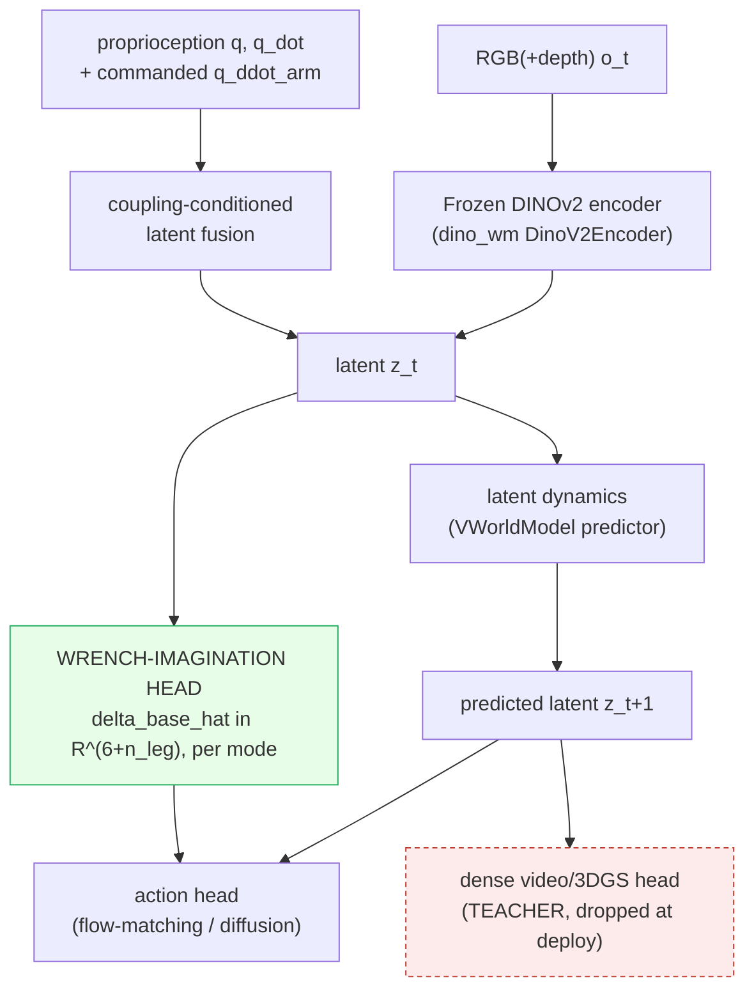
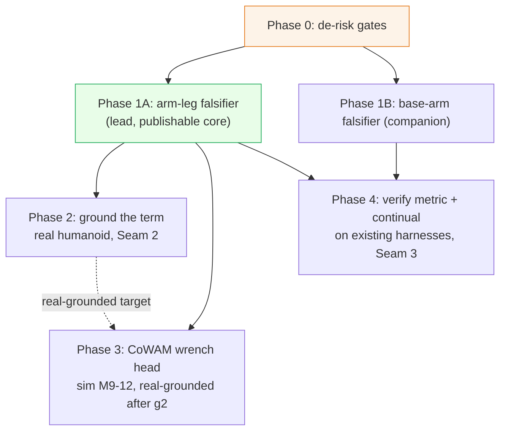
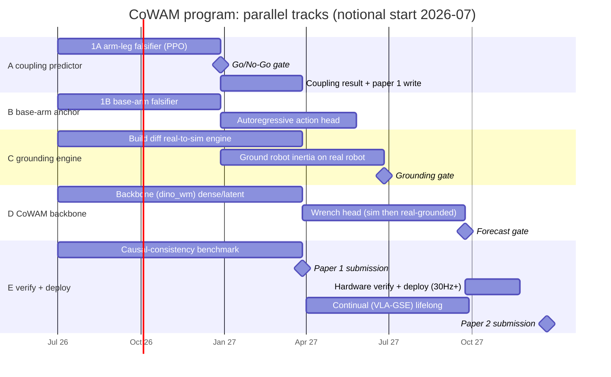

# Focus-Direction Research Plan: A Coupling-Aware World-Action Model (CoWAM)

## 1. Abstract

> [!abstract] The contribution and the program in one paragraph
> We target a conference contribution: a **World-Action Model whose latent explicitly imagines the self-induced reaction wrench of whole-body motion**, so a humanoid policy plans against a sensor-free *coupling forecast* instead of treating arm to leg and base to arm coupling as an implicit residual. The model is **trained dense, deployed latent** (real-time on a G1/H1 humanoid), **grounded** by differentiable system-ID so the imagined physics is real, and **verified** by a causal-consistency metric that binds predicted coupling to measured coupling. Working name **CoWAM**. The thesis commits to **two** humanoid couplings, arm↔leg and base↔arm, so the coupling lift is measured *first* on **balance / disturbance rejection** (the direct test of arm→leg reaction prediction) and on **mobile-manipulation** (the base↔arm anchor); the remaining evaluation axes are **generality / robustness checks** that the coupling term transfers across task families, not co-equal contributions. This document is one plan, the method (problem through experiments) followed by the staged program that produces it, reducing [[Focus-Direction]]'s five clusters to one executable bet. Scope (per project decisions): the **full five-cluster program, staged parallelism** so the de-risked core leads and the three cross-cluster seams are the named research contribution; a **real humanoid is available** (grounding is near-term); a **well-resourced lab**. The staging is **not** five unconditional parallel tracks: **Phase 1A (M0-6) is the cheap go/no-go gate**, and the full parallel build (action head, real grounding, wrench head; M6+) is **contingent on Phase 1A passing**. The verify track and the two cheap falsifiers (1A, 1B) start at M0; everything downstream of the gate is conditional. Both anchors get falsifiers. Companions: [[Focus-Direction]] (thesis), [[Focus-Direction-Paper-Code-Index]] (papers to code), [[Focus-Direction-Review]] (the adversarial review absorbed here).

## 2. Introduction and motivation

Whole-body humanoid control is conventionally **decoupled**: an arm/manipulation controller plus a balance/locomotion controller, with the physical coupling between them left implicit. But the generalized mass matrix is non-block-diagonal, so a fast arm reach **is** a base and leg balance disturbance, and discarding that cross-term is what makes whole-body policies brittle on aggressive motion. The opportunity: the cross-term is **low-dimensional and structured**, a quantity to *predict* rather than data to collect, and to predict it **anticipatorily** (from the commanded arm motion, before the base is perturbed). This plan tests whether making that prediction explicit, carried on a World-Action Model that is trained dense and deployed latent, grounded by differentiable system-ID and verified by a causal-consistency metric, beats both implicit-coupling and reactive-observer baselines on a fixed data and compute budget. The gap it targets, and the claims that are settled and off the table, are below.

> [!warning] Three settled findings, do not relitigate
> 1. **[[2606.16542|ADAPT]] is reactive, not anticipatory.** It is a momentum-based analytical *disturbance observer* that estimates whole-body residual wrench online from measured state and feeds it as a PPO observation; it estimates *external* disturbances after they manifest. The surviving wedge is ==anticipatory feedforward prediction of the self-induced cross-term, before it perturbs the base==. ADAPT is absent from the [[Focus-Direction-Paper-Code-Index|Paper-Code-Index]]'s 533 cited papers yet is the closest *reactive* prior art. It becomes a **mandatory baseline**. The closest *anticipatory* prior art is [[2201.03871|ALMA]] (likewise absent from the 533-paper index, surfaced via the large concept graph): it feeds an MPC-predicted **external** wrench as an anticipatory observation to a **separate** RL locomotion policy. The wedge that survives ALMA is **the self-induced inertial cross-term, learned as a world-model output inside one coupled policy** (not an MPC-computed external wrench handed to a second controller); ALMA is cited and distinguished in the Background and the novelty-positioning table, and the decoupled-anticipatory handoff is a baseline-family to position against.
> 2. **The 41% to 62% headline is borrowed** ([[2604.07993|HEX]]-implicit beating part-wise stacks, not explicit-vs-implicit), so it is the field's proof-of-life, not this program's claim. The program tests **two** narrower wedges instead: (i) the **explicit-vs-implicit** wedge, concentrated where arm acceleration is largest and surviving inertia-model error (the falsifier + $\varepsilon$-curve of Papers 1 and 2), and (ii) the **explicit-vs-reactive** wedge, anticipatory feedforward beating ADAPT's reactive observer on fast self-reaches, isolated by the **input-isolation control of ablation #1** (same head, swap only the input). Both are go/no-go gates in PR-1A.
> 3. **The Graphify concept graph has no node for "reaction wrench" as a compound and none for "causal consistency as a verification metric"**, the two genuine whitespaces this plan targets. Re-verified against both snapshots on **2026-06-23** (counts are the actual queried numbers, not estimates): the cited `data/papers/graphify-out/graph.json` (1826 nodes) and the larger `graphify-out/graph.json` (30331 nodes). Both return **0 "reaction wrench" compound nodes and 0 "causal-consistency-as-a-metric" nodes**: the large graph's two "causal consistency" hits are a *reward term* ("blueprint-aware rewards ... Causal Consistency") and an incidental word-match ("Causal MoMa consistently achieved ..."), neither a predicted-vs-realized verification metric. Honest qualifier (re-counted against the actual graph on 2026-06-23, do not overclaim): the large graph **does** contain **74 "coupling"-substring nodes (22 standalone "coupling" + the 52 "decoupling" below), 3 "disturbance-observer"-compound nodes**, and **52 "decoupling" nodes**, so the field clearly *has* coupling and observer concepts, with decoupling-flavored concepts outnumbering the standalone-coupling ones **~2.4:1** (52 vs 22). **The disturbance-observer count is by query methodology (so the 3-vs-4 reading reconciles):** the **3** is the exact-substring match on "disturbance observer"/"disturbance-observer" (2 are ADAPT's own, [[2606.16542|2606.16542]]: its momentum-observer node and its tracking-result node, and 1 is [[2603.27313|MetaTune]]'s "joint controller and disturbance-observer tuning"). A *looser* "disturbance"-and-"observer"-co-occurrence query returns **4**, the 4th being [[2509.18865|Bi-VLA]]'s "disturbance and reaction force observers", a four-channel bilateral-control force/disturbance observer, which is **not** the whole-body momentum disturbance-observer compound this plan baselines against (ADAPT's class), so the compound count this plan cites stays **3**. The graph also now contains an **anticipatory-wrench node** ([[2201.03871|ALMA]]'s "anticipatory predicted-wrench observations" and "predicted external-wrench sequence into locomotion policy"), so the whitespace is **not** "no anticipatory-wrench node exists" (ALMA's does, for the *external* wrench in a decoupled handoff). The whitespace is the **specific framing**: no node represents *anticipatory feedforward prediction of the **self-induced** arm→base inertial cross-term as a **learned world-model output inside one coupled policy***. That sharp framing, plus the two genuinely-zero terms (reaction-wrench-compound, causal-consistency-as-metric), is the corroborated whitespace. **Coverage note (so the whitespace rests on a graph that actually contains the foundational papers):** the whitespace counts are read on the **large** `graphify-out/graph.json` (6233 distinct source notes), where every foundational paper this plan leans on is indexed (verified 2026-06-23: [[2606.16542|ADAPT]], [[2603.01151|D-REX]], [[2104.02646|gradSim]], [[2411.04983|DINO-WM]], [[2605.21800|stable-worldmodel]], [[2606.13877|ContactWorld]], [[2606.18610|SC3-Eval]] all present as source notes). The smaller `data/papers/graphify-out/graph.json` (533 source notes) is a subset that pre-dates the [[2606.16542|ADAPT]] ingest, so the genuine-zeros claim is robust on *both* but the *coverage* claim is made only on the large graph.

## 3. Background and related work

> [!abstract] Where CoWAM sits across five literatures
> The contribution is not in any single area but at their intersection: it takes the *explicit reaction term* the whole-body field leaves implicit, makes it a *world-model output* the WAM field has not targeted, *grounds* it with the differentiable-sysID field's machinery, and *certifies* it with a metric the WAM-evaluation field lacks.

**Whole-body loco-manipulation.** The field defaults to *decoupling*: an arm controller plus a balance controller, with coupling left implicit ([[2604.07993|HEX]]'s predictive MoE), emergent ([[2505.06776|FALCON]]'s shared observation), or one-directional ([[2509.21231|SEEC]], base→arm only). Analytic-residual approaches add a model term reactively ([[2504.06662|RAMBO]], [[2507.04140|Centroidal Arm Motion]]); [[2502.03206|HugWBC]] estimates privileged state; [[2606.16542|ADAPT]] feeds a momentum-observed disturbance as an observation; [[2512.11047|WholeBodyVLA]] splits loco/manip latents. The single closest *anticipatory* prior art is [[2201.03871|ALMA]] (legged mobile manipulator): a whole-body MPC manipulation controller outputs a **predicted external-wrench sequence** that is fed as an **anticipatory observation** to a *separate* RL locomotion policy, so the base proactively compensates for manipulator disturbance. ALMA is the sharpest neighbor and the one this graph surfaces (its "anticipatory predicted-wrench observations" node), so the distinction must be made explicitly, see the novelty-positioning table: ALMA is a **decoupled two-controller handoff** (the exact architecture CoWAM argues against), predicts the **externally-exerted** wrench from a model-based MPC (not the **self-induced inertial cross-term** $M_{\text{base,arm}}\ddot q_{\text{arm}}$ as a *learned* output), is **not a world-action model**, and has **no $\varepsilon$-curve de-circularization, no robot-self sysID grounding, and no causal-consistency metric**. Benchmark: [[2403.10506|HumanoidBench]]. *CoWAM* makes the self-induced arm→leg cross-term an explicit, anticipatory, *imagined* prediction inside one coupled policy and ablates against exactly these implicit / observer / decoupled-anticipatory baselines.

**World(-action) models for manipulation.** Latent-dynamics WMs ([[2411.04983|DINO-WM]], [[2603.14482|V-JEPA 2.1]], [[2602.10098|VLA-JEPA]]), video-prediction policies ([[2412.14803|VPP]], [[2412.15109|Seer]], [[2505.11528|LaDi-WM]]), and unified video+action models with drop-heads ([[2504.02792|UWM]], [[2503.00200|UVA]], [[2605.20752|GaussianDream]]) all imagine *scene* futures. *CoWAM*'s imagined output is a *physics quantity* (the reaction wrench), and its latent is conditioned on commanded acceleration, not just appearance.

**Sim-to-real and differentiable system-ID.** Differentiable physics recovers *object* parameters ([[2104.02646|gradSim]], [[2603.01151|D-REX]], [[2504.16693|PIN-WM]], [[2503.17973|PhysTwin]]), learns constitutive laws ([[2304.14369|NCLaw]]), and explores to identify ([[2404.12308|ASID]]); twins close real→sim→real loops ([[2504.03597|Real-is-Sim]]). *CoWAM* re-points the per-link sysID loop at the *robot's own* inertia $M_{\text{base,arm}}$ (Seam 2), a target none of these address.

**World-model evaluation and runtime verification.** Reproducible WM harnesses ([[2605.21800|stable-worldmodel]]), visual-realism sim-real correlation ([[2605.06311|VISER]], $r{=}0.92$), executability-vs-plausibility ([[2604.19092|RoboWM-Bench]], [[2602.08971|WorldArena]]), self-consistency ([[2606.18610|SC3-Eval]]), asymmetry verifiers ([[2604.01985|WAV]]), and failure diagnosis ([[2505.12224|RoboFAC]]). *CoWAM* adds a causal-consistency metric binding *predicted to realized coupling* on hardware, which no public benchmark measures (Seam 3).

**Efficiency and continual learning.** Real-time levers via distillation ([[2606.05254|Flash-WAM]]), quantization ([[2602.20309|QuantVLA]]), async architectures ([[2606.09811|AHA-WAM]]); forgetting-free continual via subspace protection ([[1612.00796|EWC]], [[2605.06175|VLA-GSE]]). *CoWAM* composes these to clear the contact-stability floor and protect the coupling term across continual updates.

## 4. Aims and hypotheses

**Aims.**
- **Aim 1 (arm to leg, lead):** make the arm-to-leg reaction wrench $\delta_{\text{base}}$ an explicit, anticipatory prediction and show it beats implicit and reactive baselines.
- **Aim 2 (base to arm):** factor the mobile-manipulation action autoregressively (base to torso to arm) so the base is a predicted, coupled DoF.
- **Aim 3 (predict):** carry the coupling on a train-dense / deploy-latent World-Action Model so it is available sensor-free at deploy.
- **Aim 4 (ground):** recover the robot's own coupling inertia $M_{\text{base,arm}}$ from real interaction by differentiable system-ID (Seam 2).
- **Aim 5 (verify):** certify predicted-vs-realized coupling with a causal-consistency metric on existing harnesses and hardware (Seam 3).

**Falsifiable hypotheses** (each tested in the Evaluation plan):
- **H1 (the wedge):** explicit-feedforward coupling beats implicit (MoE) and reactive (observer) baselines, with the margin **concentrated at high arm acceleration** and **surviving inertia-model error** (the $\varepsilon$-curve).
- **H2 (plug-in lift):** the coupling lift is positive and significant **across every WAM backbone** (the backbone grid), so it is a module, not a backbone artifact.
- **H3 (gradient):** the lift is largest where the native latent is least control-relevant.
- **H4 (identifiability):** $M_{\text{base,arm}}$ is recoverable from a few real reaches within the pre-registered Frobenius tolerance.

The contribution that makes this a paper is the four modifications below.

> [!tip] The four breakthrough modifications (what makes it a paper)
> 1. **Reaction-wrench imagination head**: the WAM predicts the coupling term $\delta_{\text{base}}=M_{\text{base,arm}}\,\ddot q_{\text{arm}}$ as a modeled *output*, not a policy input. ([[WAM|WAM·A2]])
> 2. **Coupling-conditioned latent**: the latent carries dynamics state (proprioception + commanded arm acceleration), not just scene appearance. ([[WAM|WAM·A3]], Seam 1)
> 3. **Differentiable-sysID grounding**: the coupling inertia is measured from real interaction, not read off a URDF. ([[Sim2Real|S2R·B2]], Seam 2)
> 4. **Causal-consistency verification**: a predicted-vs-realized coupling check. This is a **new metric that does not currently exist** (no public benchmark binds predicted-to-realized coupling, search-confirmed); the novelty is the metric and its three-way error decomposition, which are **computed on existing benchmark harnesses + hardware** (no new benchmark is built). ([[Embodied-AI|EAI·B1]], Seam 3)
>
> (Mechanisms are defined once in the [[#The three seams|three-seams table]], not restated here.)

## 5. Approach

The method has five parts: the problem formalized, the architecture, the decisive falsifier, the training and deployment recipe, and the grounding and verification seams.

### Problem formalization

A part-wise whole-body policy discards a term the physics has. The generalized mass matrix $M(q)$ is non-block-diagonal, so an arm acceleration is a base/leg balance disturbance:

$$
M(q)\,\ddot q + C(q,\dot q)\,\dot q + g(q) = \tau + J^\top f_{\text{ext}}, \qquad
\delta_{\text{base}} \;=\; M_{\text{base,arm}}(q)\,\ddot q_{\text{arm}}
$$

$\delta_{\text{base}}$ is **low-dimensional and structured**: a 6-vector wrench (or per-contact-mode set) determined by the commanded arm acceleration and a block of $M(q)$. The thesis: predict it rather than collect data for it, and predict it *anticipatorily* (from commanded $\ddot q_{\text{arm}}$, before it perturbs the base) to beat both an implicit mixture and a reactive observer, with the gain concentrated where $\ddot q_{\text{arm}}$ is largest.

> [!info] Precise definition (pin this down before coding)
> - **$\ddot q_{\text{arm}}$** is the *planned/commanded* arm acceleration, read from the action chunk the policy is about to execute. Using the *planned* (not measured) acceleration is what makes the prediction **anticipatory** (available before the reaction occurs), the wedge over [[2606.16542|ADAPT]]'s reactive observer. The wedge is falsifiable on timescales: the arm→base reaction rises over the arm-acceleration ramp (~1 to a few 50 Hz policy steps, ~20 to 60 ms at top-quartile $\ddot q_{\text{arm}}$), while a momentum observer lags ~one state step plus filter delay (one 500 Hz state step = 2 ms + a 40 Hz low-pass group delay $\approx$ 4 ms $\approx$ **6 ms** observer-lag at the 500 Hz state polling of the real-robot stack). Anticipation buys a margin **iff** (reaction rise-time + actuation delay) < (observer lag + one policy-step delay); the pre-registered numeric form (PR-0a, frozen) is **rise-time $\ge$ 31 ms** at top-quartile accel ($=$ ~6 ms observer-lag + 20 ms policy step + 5 ms margin) on both H1 and G1. If the observer's next-step estimate already lands inside the policy step, A1 has no delta.
> - **$M_{\text{base,arm}}(q)$** is the off-diagonal block of the generalized mass matrix coupling arm DoF to the floating-base + leg DoF. In MuJoCo, the full $M(q)$ is `mjData.qM` (sparse) made dense via `mj_fullM`; slice base/leg rows by arm columns (see the Phase-0 extraction step below). The target $\delta_{\text{base}}^{\star}$ for the auxiliary loss comes from a **perturbed** $\tilde M$ (the de-circularization protocol).
>
> **Phase-0 `mj_fullM` extraction (verified against `humanoid-bench`).** Reach `data.qM` through humanoid-bench's `MjDataWrapper.__getattr__` passthrough (`humanoid_bench/dmc_deps/dmc_wrapper.py`, the wrapper instantiated at `env.py:212`), i.e. `env.data.qM` works directly. humanoid-bench has **zero existing `mj_fullM`/`qM` usage** (only a DMC size-metadata entry), so this is a new Phase-0 task we must author and confirm on the H1 and G1 models:
> Densify with `mj_fullM(model, M, data.qM)` (M an `nv x nv` array, `data.qM` reached via the `env.data` passthrough), then slice base+leg rows by arm-joint qvel columns: rows 0:6 are the floating base (3 linear + 3 angular DoFs), and the arm columns are the arm joints' qvel indices, NOT all of `6:`. The indices are **derived from the joint map, never hardcoded across robots**, but the H1 derivation is worked out here so the slice is concrete and auditable. In `humanoid_bench/assets/robots/h1_pos.xml` the tree order (verified 2026-06-23) is `free_base` then `left_hip_yaw/roll/pitch`, `left_knee`, `left_ankle`, the same five right-leg joints, `torso`, then `left_shoulder_pitch/roll/yaw`, `left_elbow`, and the same four right-arm joints. The free joint takes qvel 0:6, so the qvel layout is: floating base 0-5, **legs 6-15** (left 6-10, right 11-15, the indices [6,7,8,9,11,12,13,14] are LEG joints, not arm), **torso 16**, and the **arms at qvel 17-24** (left arm 17-20, right arm 21-24, 8 DoF). So the H1 arm columns are **[17,18,19,20,21,22,23,24]**. For G1 (`humanoid_bench/assets/g1/g1.xml`, 6-DoF legs per side) the legs occupy qvel 6-17, torso 18, and the arm-proper (shoulder/elbow) joints start at 19; the per-model joint map is read at M0 and the finger/hand joints are excluded from the arm-column set, so the G1 arm-column indices are confirmed at M0 from the joint map rather than assumed.
> **Phase-0 task (gate input, not a measurement):** after `mj_step`, on **both H1 and G1**, confirm the dense conversion succeeded with a populated floating-base block (the 6x6 base block is well-formed and its leading inertia entry is positive), then confirm the base-arm block is non-trivial under a top-quartile arm acceleration. humanoid-bench ships no example for this, so authoring + confirming the extraction on H1 and G1 is itself a Phase-0 deliverable.
> - **$\delta_{\text{base}}$** is the resulting generalized reaction on the base + leg DoF: the 6-DoF floating-base wrench plus the leg-joint torques, so dim $= 6 + n_{\text{leg}}$ (H1: 6+10=16; G1: 6+12=18), predicted per contact mode ($n_{\text{modes}}=2$, sliding vs sticking). The companion arm-side dimensions, read off the same joint map, are $n_{\text{arm}}=8$ for H1 (the 17-24 block) and the shoulder/elbow arm-proper count for G1 (finger joints excluded), with the torso treated as a base-side DoF so the H1 generalized-coordinate budget is the full 6 base + 10 leg + 1 torso + 8 arm = 25 of `h1_pos.xml` (a hand/gripper variant adds its finger DoF on top), not 24. **Contact-mode labels**: from the simulator contact state in sim; from tactile/contact-force estimation ([[2606.13877|ContactWorld]] modalities) on hardware.

Why a **world-action model** (not just an MLP): the target $\delta_{\text{base}}=M_{\text{base,arm}}(q)\,\ddot q_{\text{arm}}$ is an instantaneous analytic function of the current state and the commanded arm acceleration, both known at step $t$, so it is *not* a quantity that must be rolled forward. The WAM earns its place for three other reasons the bare term does not: sensor-free deploy via train-dense/latent-deploy, planning against the latent-goal + wrench-feasibility objective, and a latent that carries the grounded $M_{\text{base,arm}}$ (Seam 2). The wrench head reads the *current* coupling-conditioned latent; a genuine forecast variant predicts $\delta_{\text{base}}$ along the action-chunk horizon by integrating the commanded accelerations, not from predicted pixels. Two humanoid instances: arm to leg ($\delta_{\text{base}}$ from arm reaches) and base to arm (base velocity as a manipulation DoF); the lead experiment is arm to leg because its falsifier is the cheapest sharp go/no-go.

### Architecture

**Backbone: the coupling head is a plug-in, shown across a WAM grid (not tied to one backbone).** The two coupling modules (wrench-imagination head + coupling-conditioned latent) bolt onto any WAM; the backbone grid proves the lift holds across families rather than committing to one backbone. Roles in the grid:
- **`dino_wm`** ([[2411.04983|DINO-WM]]): the lean WAM grid point + MPC-planning substrate (first Paper 2 backbone; Paper 1's falsifier runs on the state-based PPO floor, not a WAM). Frozen DINOv2 (`models/dino.py :: DinoV2Encoder`), latent dynamics (`models/visual_world_model.py :: VWorldModel`); the `train_decoder` gate already gives the train-dense/deploy-latent split, so the wrench head is a marginal add.
- **UWM** ([[2504.02792|UWM]]): the deployed action-output CoWAM (Paper 2). Its unified video+action diffusion already has an action head where the wrench conditioning attaches (`sample_marginal_action()` is the fast deploy path).
- **Cosmos** ([[2501.03575|Cosmos]]): the dense teacher + internet-scale video prior (train-time), distilled into the latent student; Cosmos-Policy is also a SOTA-WAM baseline ([[2603.22078|Cosmos-Policy study]]).
- **V-JEPA2** ([[2603.14482|V-JEPA 2.1]]): a pure predictive-latent fourth axis. ([[2412.14803|VPP]] is a further frozen-video alternative.)

**The four added modules.**

| Module | Inputs | Output | Where it plugs in |
|---|---|---|---|
| **Coupling-conditioned fusion** | $z_t$, proprio $q,\dot q$, commanded $\ddot q_{\text{arm}}$ | conditioned latent $z_t$ (held control-relevant by $\mathcal L_{\text{cond}}$, the training objectives) | `VWorldModel.separate_emb()` / latent assembly; aux decoder reconstructs proprio + $\ddot q_{\text{arm}}$ from $z_t$ |
| **Wrench-imagination head** | coupling-conditioned latent $z_t$ (pooled); horizon variant integrates commanded $\ddot q_{\text{arm}}$ | $\hat\delta_{\text{base}}\in\mathbb R^{6+n_{\text{leg}}}$ per mode + mode logits | off the conditioned latent in `VWorldModel.forward()`; `Linear->ReLU->Linear->(6+n_leg)` per mode + mode classifier |
| **Action head (autoregressive)** | $z_{t+1}$ and $\hat\delta_{\text{base}}$ | action chunk $a_{t:t+H}$, factored base→torso→arm | flow-matching/diffusion head; the base→torso→arm factoring (fork `brs-algo` `whole_body_decoding_order`) **is** the base↔arm coupling, unifying both anchors in one model |
| **Dense teacher head** (video/3DGS) | $z_{t+1}$ | dense future obs | training only, dropped at deploy (`train_decoder` gate) |

Contacts are discrete (sliding vs sticking), so the head emits a continuous $(6+n_{\text{leg}})$-vector per mode **plus** a contact-mode classifier ($n_{\text{modes}}=2$), with Huber on the selected mode's slice (the [[2606.13877|ContactWorld]] lesson: contact-rich latents need explicit structure).

### The falsifier and de-circularization (the decisive experiment)

The decisive, cheapest test of the bet is a three-way ablation, **explicit-feedforward (ours)** vs **implicit ([[2604.07993|HEX]]-MoE)** vs **reactive observer ([[2606.16542|ADAPT]])**, on the lean `humanoid-bench` PPO substrate, stratified by arm-acceleration quartile and run with an input-isolation control (swap only the head input). The de-circularization in 3.1 makes the comparison non-circular (the $\varepsilon$-curve); the provenance in 3.2 pins both foils so neither is a straw man. The full ablation list lives in **Ablations**, the go/no-go gate in **Staging and gates**.

#### 3.1 De-circularization and the $\varepsilon$-curve

> [!example] Why this protocol is the heart of Paper 1
> If the explicit head's supervision target came from the *same* inertia model the rollout uses, an explicit win is a tautology (the head re-derives a number already in the loop) and will not survive any inertia error on hardware. The protocol below makes the explicit head earn its win **under a deliberately wrong inertia model**, so a win is evidence the inductive bias helps, not that the head got oracle labels.

**$\tilde M$ generation (the perturbed model, distribution pinned).** For each seed, build a perturbed dynamics model $\tilde M(q)$ by scaling **each link's mass and each diagonal rotational-inertia entry** (and optionally its CoM offset) by an **independently sampled multiplicative factor** $(1 + u_i)$ where, for link $i$, **$u_i \sim \mathrm{Uniform}(-\varepsilon, +\varepsilon)$ drawn i.i.d. per link, per seed** (a named, symmetric, element-wise uniform draw, not normal, not a single global scale). The draw is element-wise: mass and each inertia component get their own independent $u_i$. The explicit-head target $\delta_{\text{base}}^{\star} = \tilde M_{\text{base,arm}}(q)\,\ddot q_{\text{arm}}$ is computed from this **wrong** model.
- **Per-link resampling rule (frozen, so reproducibility does not break).** The perturbation vector $\{u_i\}$ is **drawn once per (seed, $\varepsilon$) pair and held fixed across that whole rollout/training run**, NOT re-drawn per rollout step. Critically, a **single random stream per seed** generates the unit-variance draws $\{v_i\} \sim \mathrm{Uniform}(-1, +1)$ **once**, and every $\varepsilon$ on the grid reuses the *same* $\{v_i\}$ scaled as $u_i = \varepsilon\,v_i$. This makes the $\varepsilon$-curve a **paired sweep along a fixed perturbation direction** (the only thing that changes across grid points is the magnitude $\varepsilon$, not the random direction), so the curve's shape reflects $\varepsilon$ alone and is not confounded by re-randomization. Across the $\ge 3$ seeds the directions $\{v_i\}$ differ; within a seed they are shared across $\varepsilon$.

**The asymmetry (this is what makes it non-circular).** The policy and the **implicit baseline both run on the true sim dynamics** (true `mj_fullM`) and receive **no privileged target** at all. Only the explicit head is supervised, and it is supervised on $\delta_{\text{base}}^{\star}$ from the *perturbed* $\tilde M$. So:
- explicit head: biased label from $\tilde M$ (wrong by $\varepsilon$), structured inductive bias;
- implicit baseline: no label, must discover coupling from reward/data on the true dynamics;
- both act in the true-dynamics world, so neither has oracle access to the ground-truth coupling at deploy.

**Justification of non-circularity.** If the explicit head still wins when its own supervision is wrong by $\varepsilon$, the win cannot be label leakage (the label is wrong); it must be that *predicting a structured coupling term at all* is the right inductive bias. The asymmetry is the proof: the explicit head is handicapped (wrong labels) yet the implicit baseline gets no help either, so any margin is attributable to the structure, not the oracle.

**$\varepsilon$-sweep grid and statistics.** Sweep $\varepsilon \in \{0,\ 0.05,\ 0.1,\ 0.25,\ 0.5,\ 1.0\}$ over $\ge 3$ seeds per point (shared per-link direction $\{v_i\}$ scaled by $\varepsilon$ within a seed, per the resampling rule above). Report the **explicit-vs-implicit margin as a function of $\varepsilon$** with **bootstrap 95% CIs** at every grid point.
- **Margin metric (pinned, single definition).** The $\varepsilon$-curve margin is exactly the **OOD-split success-rate gap** $\Delta\text{SR}_{\text{OOD}}=\text{SR}_{\text{explicit}}-\text{SR}_{\text{implicit}}$ of the Metrics section, a single scalar SR difference, NOT a composite of success+balance+quartile-concentration. Balance-recovery and per-quartile concentration are *separate* reported axes; the $\varepsilon$-curve is success-rate only so its slope is interpretable. The 95% CIs here are computed by the same paired bootstrap (shared seeds/init, 10k resamples) used for the per-quartile gap in the Metrics section, so the two figures are statistically commensurable.
- **Quartile feed (which split feeds the $\varepsilon$-curve vs the broader ablation #1).** The $\varepsilon$-curve is reported on the **full OOD split, pooled across all arm-accel quartiles** (no quartile stratification): it answers "does structure survive model error", a different question from "where is the wedge", which is ablation #1's top-quartile stratification. To keep the $\varepsilon$-curve from hiding a quartile interaction, additionally report **one stratified variant: the top-arm-accel-quartile $\varepsilon$-curve**, side by side with the pooled one. The headline pass condition (below) is read on the **pooled** curve; the top-quartile curve is a supporting panel.
- **Lambda-weight interaction (selectivity bias foreclosed).** $\lambda_w \in \{0.05, 0.1, 0.3\}$ (the training-objectives sweep) is orthogonal to the $\varepsilon$ grid. To avoid post-hoc cherry-picking of $\lambda_w$, $\lambda_w$ is **selected once on the $\varepsilon{=}0.1$ validation slice before any other $\varepsilon$ point is read** (a single frozen choice), and the **entire $\varepsilon$-curve is then reported at that one frozen $\lambda_w$**. The other two $\lambda_w$ values are reported only as an appendix robustness panel (full $\lambda_w \times \varepsilon$ grid), never as the headline. This is pre-registered as **PR-$\varepsilon$-lambda** so selectivity bias is addressed, not assumed away.
- **When the $\varepsilon$-curve is computed (gate sequencing, disambiguated).** The $\varepsilon$-curve is a **Phase 1A deliverable computed during 1A training** (M0-6), not a separate Phase-0 prerequisite: it requires trained explicit and implicit heads, which only exist in 1A. The Phase-0 (M0) deliverable is the *frozen protocol and the $\varepsilon$-sweep procedure spec* (below, dry-run on a toy model, value-free), so M0 ships the *defined gate*, and 1A ships the *computed curve* that the gate reads. The $\varepsilon$-curve void condition (PR-$\varepsilon$) is therefore evaluated **as part of the Phase 1A go/no-go**, jointly with PR-1A, not before it.

**The $\varepsilon$-curve IS the headline and the verify harness.** This single curve is both the paper's headline figure and the falsification test: it is the Phase-1A go/no-go's de-circularization arm and gates the rest of the program.
- **Pass shape**: a positive margin at small $\varepsilon$ that **degrades gracefully** as $\varepsilon$ grows (the structure helps, and it is robust to moderate inertia error). The graceful-degradation envelope is what licenses the narrow-range sysID grounding (see the Grounding subsection).
- **Void condition (pre-registered, numeric, two-part).** The contribution is declared **void** unless BOTH conditions hold; each is a numeric test on the $\varepsilon$-curve output, not a qualitative read:
  1. **Small-$\varepsilon$ positivity (label-leakage / never-helped filter).** The pooled margins at **both $\varepsilon{=}0$ AND $\varepsilon{=}0.05$** must be **significantly $>0$ at Benjamini-Hochberg FDR $q<0.05$** (paired bootstrap, 10k resamples, one-sided $>0$, BH-corrected across the six $\varepsilon$ points). If $\varepsilon{=}0$ is significant but $\varepsilon{=}0.05$ already collapses to non-significant, that is the flat-then-collapse label-leakage signature and the bet is void; if neither is significant, the structure never helped and the bet is void.
  2. **Graceful-degradation, not increase (negative-slope test).** Across the six $\varepsilon$ points the margin must be **monotone non-increasing with at most one reversal**, OR equivalently exhibit a **non-positive trend (Spearman $\rho \le 0$ of margin-vs-$\varepsilon$, with the stronger declining envelope $\rho < -0.5$ as the confirmatory target)**. A margin that *rises* with $\varepsilon$ (positive significant Spearman $\rho > 0$, $p<0.05$) is a red flag that the explicit head is exploiting the perturbation rather than the true structure, and is also void. "Flat" (margin not significantly $>0$ anywhere) trivially fails condition 1.
- This two-part numeric gate is the $\varepsilon$-curve evaluation step (the procedure below); the program halts at the Phase-1A gate if it is not satisfied.

**Procedure (built in Phase 0, as steps).** Generate $\tilde M$; at each $\varepsilon$ over $\ge 3$ seeds, train the explicit head on the perturbed target $\delta^{\star}_{\text{base}}$ and the implicit baseline on the true dynamics (no privileged target); evaluate the OOD success-rate margin; bootstrap 95% CIs; apply the two-part void gate; and freeze $\lambda_w$ once on the $\varepsilon{=}0.1$ slice (PR-$\varepsilon$-lambda). Implementation is deferred to Phase 0 against the `humanoid-bench` PPO substrate.

#### 3.2 Falsifier provenance and fairness

> [!warning] Read order: within-backbone ablations FIRST, the backbone grid is a robustness check SECOND
> The evidence that *the coupling term* (not the backbone, not capacity, not data) causes the lift comes from the **within-backbone ablations #1-5** (the $\varepsilon$-curve, the input-isolation control, wrench-head on/off and coupling-conditioning on/off *at fixed backbone/capacity/data/seeds*). **These lead.** The **backbone-agnostic grid** (the backbone grid) is a *generality/robustness* check that the lift reproduces across families. **The grid alone does NOT isolate the lift**: cross-family magnitude and ordering are confounded by backbone size, data, and training, so a cross-row comparison cannot attribute a win to the coupling head. Within-backbone paired off/on is the identified comparison; the grid shows it generalizes.

**Falsifier provenance (committed before data access).** The two foil arms of ablation #1 are pinned so neither is a straw man:

- **Implicit baseline = matched-capacity MoE, re-trained in-house (architecture pinned, capacity auditable).** [[2604.07993|HEX]]'s released weights may be closed, so the implicit arm is a **matched-capacity mixture-of-experts re-trained on the identical data, seeds, and backbone** as the explicit head (same optimizer, same env-step / corpus budget). "Matched-capacity" is made **auditable, not asserted**: capacity parity is defined as **trainable parameter count within ±2% AND forward FLOPs-per-step within ±5%** of the explicit-head configuration, both reported in the paper. Frozen MoE architecture committed at M0: **$E=4$ experts**, **top-2 token-choice gating** with a softmax router, **load-balancing (router) auxiliary loss** with coefficient $\lambda_{\text{route}}=0.01$ (the standard Switch-Transformer load-balance term), each expert an MLP sized so total trainable params land in the parity band above. The explicit head's wrench-prediction parameters are added to the explicit configuration's budget before the parity band is computed, so the implicit MoE is genuinely matched to the *full* explicit head, not to a stripped backbone. **Optionally** also reproduce HEX's UPP (unified predictive policy) ablation in-house as a second implicit point. This forecloses the "your implicit baseline was under-trained / smaller" rebuttal.
- **Reactive baseline = ADAPT momentum observer at the high state-poll rate (~500 Hz), the STRONGEST reactive foil, not a 50 Hz straw man.** The momentum observer is run at the **500 Hz state-polling rate** of the real-robot stack (`FALCON` `BasePolicy`), giving the observer its best-case next-step estimate latency (verified in HOVER/HugWBC: privileged/state-estimator observers run at the 50 Hz policy rate off a 200 Hz sim with 4x decimation, history windows of 5 steps / 0.1 s in HugWBC and 25 steps / 0.5 s in HOVER's distillation buffer, with raw disturbance estimates available up to the state-poll rate). Running the foil at 500 Hz, not 50 Hz, is what makes the anticipatory win (if any) a real win over the best reactive option.

> [!example] ADAPT implementation provenance (committed before M0, the single largest fairness commitment)
> The reactive foil is locked to one implementation so its parameters cannot be tuned post-hoc. This paragraph is the falsifier-fairness anchor.
> - **Fork / code version.** Reimplement the momentum-based generalized-momentum observer from the [[2606.16542|ADAPT]] formulation in-house inside the `FALCON` `BasePolicy` loop (ADAPT releases no standalone reusable observer module in `data/.repositories/`, so the version-of-record is our in-house reimplementation, frozen and hash-pinned at M0, not an external fork that could drift). [[2410.21229|HOVER]]'s privileged contact-force observation path is the I/O template the reimplementation matches.
> - **Exact momentum-observer formulation (frozen).** The generalized-momentum residual $\hat\delta_{\text{base}}^{\text{obs}} = K_o\!\left(p(t) - \int_0^t (\tau + C^\top\dot q - g + \hat\delta_{\text{base}}^{\text{obs}})\,ds - p(0)\right)$ with generalized momentum $p = M(q)\dot q$. Frozen parameters committed at M0: observer gain $K_o$ tuned once on a held-out calibration episode (value frozen, never re-tuned per condition); **derivative window** = one 500 Hz state step (2 ms) finite difference for $\dot p$, never a multi-step look-back that would smuggle in anticipation; **filter cutoff** = a first-order low-pass at a pre-registered $f_c$ (default 40 Hz, just above the 30 Hz Nyquist floor, frozen at M0) on the residual; **normalization** = per-DoF z-score using the *same* mean/std statistics fit on the *training* split that normalize the explicit head's $\ddot q_{\text{arm}}$ input, so both heads see identically-scaled inputs (the input-isolation requirement below).
> - **Does ADAPT train on true or perturbed inertia? (committed: TRUE).** The momentum observer's internal model ($M, C, g$ used in the residual integral) uses the **true sim dynamics**, identical to the implicit baseline and the policy (the de-circularization protocol). The observer is therefore *not* handicapped by the $\varepsilon$-perturbation: only the explicit head's supervision target $\delta_{\text{base}}^\star$ is drawn from the perturbed $\tilde M$. This makes the comparison conservative for our claim, the reactive foil runs on the correct model while the explicit head is handicapped with a wrong one, so an explicit win is doubly non-circular (it survives both wrong labels and a true-model reactive competitor). De-circularization symmetry is thus explicit: **policy, implicit baseline, and ADAPT observer all run on true dynamics; only the explicit-head label is perturbed.**
- **Input-isolation control (layer-level spec, so confounds cannot hide in preprocessing).** Same head architecture, capacity, loss, data, and seeds; swap **only the head input**: planned/commanded $\ddot q_{\text{arm}}$ (anticipatory) vs the 500 Hz observer's measured-past $\delta_{\text{base}}$ estimate (reactive). Pinned so the swap is genuinely input-only:
  - **Which layers stay identical vs differ.** Every layer is byte-identical in architecture (same `Linear->ReLU->Linear->(6+n_leg)` per mode + mode classifier (Architecture) and initialized from the same seed. The **only** difference is the contents of the first-layer input vector. There is **no extra projection layer** on either arm; the observer estimate is injected into the same input slot the commanded $\ddot q_{\text{arm}}$ occupies.
  - **Shape / normalization match.** The ADAPT observer's estimate is already a $(6+n_{\text{leg}})$-vector in the *same physical units and DoF ordering* as $\delta_{\text{base}}$, and the commanded $\ddot q_{\text{arm}}$ is an $n_{\text{arm}}$-vector. To make the swap input-only despite the differing native dimensionality, both inputs are passed through the **same frozen z-score normalizer fit on the training split** (the normalizer of the ADAPT-provenance paragraph) and zero-padded to a common input width fixed at M0; the padding mask is identical across arms. Thus neither arm gets a wider or differently-scaled input.
  - **Joint vs sequential head training (committed: each arm trained independently from scratch, jointly with its own backbone copy).** The anticipatory head and the reactive head are **not** trained sequentially or fine-tuned from each other (which would leak one arm's representation into the other). Each is trained from the shared seed init **jointly** with an identical copy of the backbone+policy on the identical data/seeds, then compared paired. This is the decisive attribution to feedforward *timing*, not head capacity, init, or training order.
- **Data split (committed).** All Phase 1A runs use the **public `humanoid-bench` release** task set and splits; any deviation is a **documented local variant** (named tasks, named OOD perturbations) recorded in the Pre-registration block. **Fixed seeds** ($\ge 3$, shared across conditions for paired comparison) are set before data access.

### Training objectives

$$
\mathcal L = \underbrace{\lambda_z\,\|z_{t+1}-\hat z_{t+1}\|^2}_{\text{latent dynamics}}
+ \underbrace{\lambda_d\,(\mathcal L_{\text{recon}}+0.25\,\mathcal L_{\text{vq}})}_{\text{dense teacher (train only)}}
+ \underbrace{\lambda_a\,\mathcal L_{\text{action}}}_{\text{flow/diffusion}}
+ \underbrace{\lambda_w\,\mathcal L_{\text{wrench}}}_{\text{coupling}}
+ \underbrace{\lambda_{\text{cond}}\,\mathcal L_{\text{cond}}}_{\text{conditioning (Seam 1)}}
+ \underbrace{\lambda_c\,\mathcal L_{\text{consistency}}}_{\text{causal}}
$$

- $\mathcal L_{\text{latent}}$: MSE on predicted vs target latent (DINO-WM `emb_criterion`, the `z_loss`).
- $\mathcal L_{\text{dense}}$: reconstruction + VQ on the teacher head (DINO-WM `decoder_latent_loss_weight=0.25`); **train only**, dropped at deploy.
- $\mathcal L_{\text{action}}$: flow-matching/diffusion action loss (UWM `action_loss`, VPP `GCDenoiser`).
- $\mathcal L_{\text{wrench}}$ (new): Huber on $\hat\delta_{\text{base}}-\delta_{\text{base}}^{\star}$ + cross-entropy on contact mode. Target $\delta_{\text{base}}^{\star}$ from MuJoCo `mj_fullM` in sim, from sysID-recovered $\hat M_{\text{base,arm}}$ (see Grounding) for real data.
- $\mathcal L_{\text{cond}}$ (new, **the Seam-1 learning mechanism**): an auxiliary loss that supervises the coupling-conditioned latent to **encode the control-relevant dynamics state**, a small decoder reads $z_t$ and is trained (MSE) to reconstruct the proprioception $q,\dot q$ and the commanded $\ddot q_{\text{arm}}$ that were fused into it. Without this term the latent is free to *ignore* the acceleration input at test time and the wrench head degenerates into a proprioception-only regressor (the wrench head would re-learn coupling only from whatever the reward path happens to carry); $\mathcal L_{\text{cond}}$ forces the latent to actually carry the commanded-acceleration signal the anticipatory wedge depends on. **Justification of the architecture's reliance on the latent is thus an experiment, not an assertion:** ablation #3 measures wrench-head error with $\mathcal L_{\text{cond}}$ (and the conditioning input) on vs off, and ablation #8 (input-source) checks the latent path beats a trivial proprio + $\ddot q_{\text{arm}}$ MLP, so the claim that the latent carries the control-relevant state is *validated*, not presumed.
- $\mathcal L_{\text{consistency}}$ (new): forward-inverse / counterfactual consistency (see Verification).

> [!warning] De-circularize the wrench target (the single most important fix)
> Do **not** define $\delta_{\text{base}}^{\star}$ from the same inertia model the policy uses, or an explicit win is trivially recoverable and will not transfer. Define it from a **perturbed** $\tilde M(q)$ with controlled error $\varepsilon$, and report the explicit-vs-implicit gap **as a function of $\varepsilon$**. That curve is both the headline and the verify harness. (From [[Focus-Direction-Review]].)

Sweep: $\lambda_z{=}1.0,\ \lambda_d{=}0.25,\ \lambda_a{=}1.0,\ \lambda_w{\in}\{0.05,0.1,0.3\},\ \lambda_{\text{cond}}{\in}\{0.0,0.1\}$ (the $0.0$ point IS ablation #3's conditioning-off arm),$\ \lambda_c{\in}\{0.0,0.1\}$.

### Data pipeline

| Source | Use | Notes |
|---|---|---|
| Sim rollouts ([[2403.10506\|HumanoidBench]] MuJoCo) | latent + wrench targets | `mj_fullM` gives exact $\delta_{\text{base}}$ and the perturbed $\tilde M$ for the $\varepsilon$-sweep |
| Action-free video (human + web) + [[2501.03575\|Cosmos]] prior | latent pretraining + dense teacher | recovers OOD breadth at low teleop cost; Cosmos supplies the internet-scale video prior distilled into the latent student |
| Contact-rich teleop ([[2606.13877\|ContactWorld]], [[2505.18472\|ManiFeel]], `sparsh`) | wrench-head supervision with real force/tactile | force/tactile shapes the latent at train, sensor-free at deploy |
| Humanoid corpora ([[2510.08807\|Humanoid Everyday]], [[2510.26236\|PHUMA]], [[2509.00576\|Galaxea G0]], [[2508.19926\|FARM]], [[2412.17730\|Mimicking-Bench]]) | whole-body pretraining + high-dynamic motion | real-world + physics-curated humanoid data for the balance/wrench regime |
| Real humanoid interaction | sysID grounding + sim2real | a few demos for differentiable system-ID (see Grounding) |

### Dense-train and latent-deploy

Train density and deploy density are independent: learn from a dense video/3DGS teacher, act on the latent + wrench head. At deploy, load with the teacher head off (`train_decoder=False`); the wrench head stays active as a latent read-off feeding the action head. Planning minimizes latent-goal distance plus a wrench-feasibility term:

$$
a^\star=\arg\min_a \;\|z_{\text{goal}}-\hat z_{t+1}(a)\|^2 \;+\; \beta\,\|\hat\delta_{\text{base}}(a)\|_{\text{balance}}
$$

Keep deploy latency under 2x pure-latent and clear the contact-stability floor (see Grounding).

### Grounding and real deployment (Seam 2)

> [!info] Seam 2: recover the robot's own inertia, not just object physics
> Existing differentiable real-to-sim engines recover *object* physics. We re-point the per-link differentiable-sysID loop at the *robot's own links* to recover $M_{\text{base,arm}}$ from arm-reach interaction. Fork [[2603.01151|D-REX]] (**cloned, verified 2026-06-23**: `D-rex/system_id/newton/mass_estimator_solver.py :: reduce_point_mass_properties` resolves at line 140, already recovers a 3x3 inertia tensor via differentiable Warp/Newton) extended to write per-link inertia, or [[2104.02646|gradSim]] (**cloned, verified**: `gradsim/gradsim/dflex/model.py :: ArticulationBuilder.add_link(..., inertia_m, mass)` at line 160). [[2504.16693|PIN-WM]] grounds the object physics the joint acts on.

**Sim-to-real pipeline.** (1) Differentiable system-ID (~2 h, a few real demos): recover $\hat M_{\text{base,arm}}$ + object params by backprop through the differentiable sim; loss = trajectory/pose discrepancy. (2) Policy transfer with **narrow-range** randomization ($\pm 5$ to $10\%$ around identified params, not broad $\pm 50\%$ DR). (3) Optional in-context refinement on 5 to 10 real trajectories if real SR drops >15%. Humanoid sim-to-real precedents to borrow: [[2502.01143|ASAP]] (delta-action residual aligning sim and real physics for agile whole-body skills), [[2510.01708|PolySim]] (multi-simulator dynamics randomization), [[2510.15352|GaussGym]] (real-to-sim locomotion from pixels), [[2604.11090|Simulator-Adaptation]] (proprioceptive distribution matching).

**Identifiability (the real risk, distinct from dominance).** The same arm motion that excites $\delta_{\text{base}}$ also excites foot-contact reaction, actuator dynamics, and friction, so $M_{\text{base,arm}}$ may be *unobservable* from a few demos even when the term is dominant (a term can be dominant yet unidentifiable). Design excitation trajectories that make it observable (borrow [[2404.12308|ASID]]'s exploration-to-identify) and run identification *per contact mode* (use the head's mode logits) to avoid mixing regimes.

> [!warning] The methodological-transfer bet (why the object-recovery tolerance does NOT automatically apply)
> [[2603.01151|D-REX]] / [[2104.02646|gradSim]] were built to recover an **external object's** inertia, which is the *easier* problem: an object can be isolated (picked up, shaken in free space) so its parameters appear with high signal-to-noise. The robot's own coupling block $M_{\text{base,arm}}$ is structurally **harder**: it can never be excited in isolation (every reach simultaneously drives leg dynamics, foot-contact reaction, and actuator residual), so it is entangled with exactly the terms PR-0a' ranks. We therefore do **not** assume the 15% Frobenius tolerance transfers from the object setting; **PR-0b is precisely the test that prices the transfer**: it plants the *robot's own* perturbed $M_{\text{base,arm}}$ (not an object) in MuJoCo and asks whether the differentiable loop recovers it to $\le$ 15% Frobenius **under the entangled whole-body excitation**, with the $\varepsilon\in\{0.05,0.10,0.25\}$ sweep mapping how much the harder-target tolerance degrades. If the synthetic robot-self recovery cannot hit 15% even with oracle simulator labels, the transfer is rejected at M0 (fallback below) before any real-robot time is spent.

**Gate Phase 2 on an identifiability check**: recovered $M_{\text{base,arm}}$ vs `mj_fullM` ground truth under the chosen excitation, before committing to narrow-range randomization; if it is not identifiable in the ~2 h budget, fall back to broad DR or the implicit baseline. **The two Frobenius gates are the same 15% number applied at two stages:** PR-0b ($\le$ 15% Frobenius on *synthetic* planted $\tilde M$) is the cheap prerequisite that **gates entry** into Phase 2; PR-2 ($\le$ 15% Frobenius on the *real-recovered* $\hat M_{\text{base,arm}}$ vs `mj_fullM`, plus the OOD-mass and real-SR-retention conditions below) is the **pass condition for Phase 2 itself**. Entry on synthetic recoverability, passage on real recovery.

**Real-time inference (clear the $\ge 30$ Hz contact-stability / Nyquist floor while holding SR).** Compose four levers:

| Lever | Technique (repo) | Result | SR caveat |
|---|---|---|---|
| Async decoupling | dual-DiT low-freq planner + high-freq executor ([[2606.09811\|AHA-WAM]]) | 24 to 57 Hz | horizon-adaptive offset keeps phases aligned |
| Quantization | W4A8 selective ([[2602.20309\|QuantVLA]]) | 70% memory cut, ~2 to 3x on Orin | 97.6% LIBERO retained |
| Efficient arch | 1B MoT + multiscale latent ([[2606.10040\|Efficient-WAM]]) | 32x | task-relevant cues suffice |
| Distillation | modality-aware ([[2606.05254\|Flash-WAM]]) | 23x | 81% of teacher SR |

Recommended Orin combo: **async decoupling + W4A8**, MoT for memory margin. Report jerk-L2 ([[2603.19131|Embodied Efficiency]]) alongside Hz (compression can hold SR yet raise jerk +19.5%).

**Real-robot stack (fork [[2505.06776|FALCON]] sim2real).** `sim2real/rl_policy/base_policy.py :: BasePolicy`: 500 Hz state polling, 50 Hz policy loop, ONNX inference, observation normalization, joint-limit safety clipping, teleop override fallback. Replace its inference with the distilled CoWAM ONNX. [[2410.21229|HOVER]]'s privileged contact-force observation doubles as the **ADAPT-observer baseline**.

**Which loop consumes $\hat\delta_{\text{base}}$, and at what rate (the two-clock question).** In this design $\hat\delta_{\text{base}}$ is a *policy-rate* term: it feeds the action head (Architecture) and the planning feasibility term at the 30 to 50 Hz policy loop, shaping action *selection*, not a kHz balance feedforward. The review's "must run inside the 500 Hz to 1 kHz WBC loop" framing applies only to a fast feedforward; we retire that reading and bound the spectral content of commanded $\ddot q_{\text{arm}}$ against the ≥30 Hz Nyquist floor. If a hardware test shows the inertial reaction needs faster correction, add the *analytic* $M_{\text{base,arm}}\,\ddot q_{\text{arm}}$ term (using the sysID-recovered inertia) at WBC rate, with the learned head correcting it at policy rate. Acceptance: realized base-reaction tracking error and balance-recovery at the chosen consumer rate vs an idealized kHz-feedforward upper bound.

> [!info] Hardware and the measured-coupling ground truth (required for Seam 3 verify)
> Platform: a Unitree **H1** (HumanoidBench's default, with Shadow Hands + 448-taxel tactile) for the sim-grounded story; **G1** for the lighter real deploy. The verify metric (see Verification) needs the *realized* base reaction measured on hardware. **This modality is pre-registered as PR-0a-modality and frozen at M0 (not deferred to Phase 2).** Committed preference order for Seam-3 ground truth (by fidelity): (i) **joint-torque sensing** if H1 exposes per-joint torque, read base/leg generalized forces directly; (ii) a **force plate under the feet** for the net base wrench, lab-feasible and the **default Seam-3 modality assumed unless an M0 hardware audit shows joint-torque is available**; (iii) only if BOTH (i) and (ii) are unavailable on the specific H1 unit, the **ADAPT momentum-based observer** is reused as a ground-truth proxy, and **only** carrying its measured per-DoF noise bound $\sigma_{\text{obs}}$ (fit against `mj_fullM` truth in the M0 sim harness): every hardware claim resting on this proxy is reported with its $\sigma_{\text{obs}}$ error bar and flagged lower-fidelity, never as exact, so the observer can never serve as its own silent ground truth; (iv) **IMU** angular-momentum differentiation is the noisiest last resort. The default is the **force plate**; the M0 audit only upgrades to joint-torque or (worst case) downgrades to the observer-with-$\sigma_{\text{obs}}$ proxy. Because de-risk (a)'s rise-time/observer-lag timing is measured in sim against the analytic `mj_fullM` truth (not on hardware, not against the observer), the timing comparison is executable at M0 independent of this hardware audit.

**Continual without forgetting** (so re-training does not erode the coupling term): fork [[2605.06175|VLA-GSE]] (`gse_peft/gse/config.py :: GSEConfig`, SVD subspace split); benchmark LIBERO-lifelong (FWT/NBT/AUC), [[2105.10919|Continual World]].

### Verification: causal-consistency metric (Seam 3)

> [!example] Seam 3: bind predicted coupling to realized coupling
> A WAM passing FID/FVD says nothing about whether its *action* and its *prediction* are causally bound. Add **ASR (Action Success Rate)** and **COD (Counterfactual Outcome Deviation)**: sample a counterfactual action $a'$, roll the WM to $\hat o'$, require $\|\hat o'-\hat o\|$ to scale monotonically with $\|a'-a\|$. For CoWAM, extend it to bind $\hat\delta_{\text{base}}$ to the *measured* base reaction on hardware (force-plate / IMU / momentum-observer ground truth from Grounding), not imagined frames.

Implementation: fork [[2605.21800|stable-worldmodel]] (`stable_worldmodel/world/world.py :: World.evaluate()`); the value head `wm/gcrl/module.py :: MetricValuePredictor` is the pattern for the metric module; `wav_minigrid`'s `MiniGridPhysicsOracle` for symbolic ground truth. Report the metric's correlation with downstream SR as a descriptive diagnostic (the [[2605.06311|VISER]] $r\approx 0.92$ and [[2606.18610|SC3-Eval]] forward-inverse $\rho{=}0.984$ are context precedents, not gates); the PR-4 pass condition is the $R^2$ threshold below, not this correlation.

> [!warning] Phase 4 verify gate (PR-4, numeric, so "the bet is measured" is falsifiable not asserted)
> The verify phase passes only on an explicit numeric threshold, never a qualitative read. **Pass condition (frozen, PR-4):** on the held-out **hardware** test set ($\ge 50$ episodes, by task identity, never seen in training), the predicted-vs-realized coupling agreement reaches **$R^2 \ge 0.70$** between the head forecast $\hat\delta_{\text{base}}$ and the measured base reaction $\delta_{\text{base}}^{\text{meas}}$ (pooled per-DoF, $R^2$ on the per-step matched pairs), with a **paired bootstrap 95% CI (10k resamples, shared episodes) that excludes zero**. The $R^2$ is read on the *prediction-error* leg of the three-way decomposition above (head-vs-analytic, so the recovered inertia cancels and the score isolates the head), and PR-4 additionally requires the **head-vs-analytic error $\le$ the analytic-vs-measured (sysID + measurement) error** so a passing $R^2$ cannot be carried by a lucky measurement floor. Correlation to downstream SR is reported alongside as a **descriptive diagnostic, not a PR-4 pass condition** (the [[2605.06311|VISER]] $r\approx 0.92$ is a context precedent, not a gate the run must clear); PR-4 is gated solely on the $R^2$ and head-vs-analytic conditions above. If $R^2 < 0.70$ or the CI includes zero, the bet is **not** certified on that platform and the gap is attributed by the three-way decomposition (head, sysID, or measurement), not blamed on the model by default.
> **Continual-retention gate (PR-4-continual, numeric).** After subspace-protected continual fine-tuning on the LIBERO-lifelong stream, the coupling term must survive re-training: backward transfer **NBT $\ge -2$ pp** on the coupling-relevant tasks (at most 2 pp forgetting of prior-task SR) AND the post-update top-arm-accel-quartile coupling lift stays **$\ge \delta_{1A}=$ 5 pp** at $p<0.05$ (re-measured with the Phase-1A paired-bootstrap test). "Forgetting-free continual" is therefore a measured retention bound, not a mechanism description.

> [!warning] Three-way error attribution (so a metric gap is not silently blamed on the model)
> When the measured base reaction $\delta_{\text{base}}^{\text{meas}}$ disagrees with the head's forecast $\hat\delta_{\text{base}}$, the gap could come from three sources and the metric must **decompose, not conflate** them: (i) **prediction error** of the learned head, (ii) **sysID-model error** in the recovered $\hat M_{\text{base,arm}}$, and (iii) **measurement bias** in the hardware ground truth. The decomposition is pre-registered: the **analytic** reference $\delta_{\text{base}}^{\text{sysID}}=\hat M_{\text{base,arm}}\,\ddot q_{\text{arm}}$ (computed from the *recovered* inertia, no learned head) is logged alongside both the learned forecast and the measurement, giving a three-point comparison per step. (i) head-vs-analytic isolates **prediction error** (both use the same $\hat M$, so the inertia cancels); (ii) analytic-vs-measured isolates **sysID + measurement** error together; (iii) the **measurement bias** floor is bounded *independently* by the PR-0a-modality $\sigma_{\text{obs}}$ band (force-plate calibration residual, or the observer-proxy noise band when force-plate is unavailable), so any analytic-vs-measured gap **larger than $\sigma_{\text{obs}}$** is attributed to sysID error, and any within $\sigma_{\text{obs}}$ is measurement-limited and reported as such. This makes "the model is wrong" a *measured* conclusion (head-vs-analytic exceeds the analytic-vs-measured residual) rather than the default blame, and keeps the causal-consistency metric interpretable on hardware.

> [!warning] Confirmed whitespace (a metric on existing harnesses)
> No existing benchmark measures predicted-vs-realized coupling consistency as a first-class metric (search-confirmed); SC3-Eval uses forward-inverse consistency only as a regularizer. **The contribution is the metric/analysis itself, computed on existing humanoid harnesses + hardware.**

## 6. Evaluation plan

### Benchmark suite

> [!abstract] Humanoid-comprehensive evaluation suite (two core axes lead; the rest are generality checks)
> A humanoid whole-body study cannot rest on tabletop manipulation. The suite spans ten axes (six humanoid in group A, two WAM-competence in B, two deployment/verification in C), but they are not co-equal: the **two core hypothesis tests** are **balance / disturbance rejection** (the direct test of arm→leg coupling, the headline humanoid result) and **mobile-manipulation** (the base↔arm anchor); the other eight axes are **generality / robustness checks** that the lift transfers across task families, not separate contributions. **Balance / disturbance rejection is the axis where arm→leg coupling shows most directly.**

**A. Humanoid whole-body axes (the study's core):**

| Capability axis | Primary benchmark (repo) | Metric | Secondary / diversity |
|---|---|---|---|
| Whole-body loco-manip | [[2403.10506\|HumanoidBench]] (27 tasks, H1) | per-task SR; **balance recovery by arm-accel quartile**; motion-quality jerk/accel/joint-limits ([[2603.20147\|AGILE]]) | [[2606.17833\|HumanoidArena]] (egocentric hierarchical); [[2503.05652\|BRS]] (real-world WBM); [[2506.09366\|SkillBlender]]; [[2602.13850\|Humanoid Hanoi]] (long-horizon); [[2511.17925\|Switch-JustDance]]; [[2602.21599\|Iterative Closed-Loop Motion]]; [[2408.00342\|MuJoCo-MPC-HB]] (baseline) |
| **Balance / disturbance rejection** (coupling's direct test) | [[2308.14636\|Disturbance-Rejection Testing]] (linear impactor) | recovery rate, max recoverable impulse, CoM deviation | [[2404.19173\|Robust Standing/Walking]]; [[2602.13656\|fall-resilient tracking]]; [[2506.15132\|Booster Gym]] (zero-shot sim2real); [[2307.10142\|reward-shaping loco]]; [[2507.18883\|partial-observation loco]]; [[2508.19926\|FARM]] |
| Mobile manipulation (base↔arm) | [[2602.05233\|MobileManiBench]] / [[2412.13211\|MS-HAB]] | sub-task / entire SR, collision force | [[2407.07788\|BiGym]]; [[2606.18239\|EBench]]; [[2306.11565\|HomeRobot]]; [[2512.24653\|RoboMIND 2.0]] |
| Contact-rich / visuo-tactile (the wrench) | [[2606.13877\|ContactWorld]] | planning SR 36.1% (PCD+tactile) vs 32.1% (point-cloud) = **+4 pp from tactile** | [[2505.18472\|ManiFeel]] (+26 pp TacFF insertion); [[2510.25725\|Humanoid Visual-Tactile-Action]] |
| Long-horizon / memory | [[2603.01229\|RMBench]] (Task Memory Complexity) | SR by M(1)/M(n) | [[2603.04639\|RoboMME]]; [[2605.10921\|RoboMemArena]]; [[2506.06677\|RoboCerebra]]; [[2511.11478\|LIBERO-Mem]]; [[2412.05313\|λ]] |
| Humanoid world-model quality | [[2510.07092\|1X World Model Challenge]] | generative WM fidelity + downstream SR | [[2604.19092\|RoboWM-Bench]]; [[2602.08971\|WorldArena]] (EWMScore); [[2506.00613\|WorldGym]] (WM-as-eval-env) |

**B. WAM-competence axes (the backbone grid, manipulation):**

| Capability axis | Primary benchmark (repo) | Metric | Secondary |
|---|---|---|---|
| In-distribution competence | [[2306.03310\|LIBERO]] (130 tasks) | SR, FWT/NBT | [[2506.18088\|RoboTwin 2.0]]; [[2112.03227\|CALVIN]]; [[2406.02523\|RoboCasa]] |
| OOD generalization | [[2510.13626\|LIBERO-Plus]] (10,030, 7 dims) | dimension-wise SR, composition gap | [[2605.06311\|VISER]]; [[2402.08191\|THE COLOSSEUM]] (14 perturbation factors) |

**C. Deployment + verification axes:**

| Capability axis | Primary benchmark (repo) | Metric | Secondary |
|---|---|---|---|
| Real-robot transfer + sim2real reliability | real H1/G1 + [[2506.18123\|RoboArena]] | sim-to-real SR retention, A/B ranking; OOD-detection AUROC; real-to-sim fidelity r | [[2510.17950\|RoboChallenge]] (large real-robot suite); [[2512.19562\|REALM]] (real-to-sim gap); [[2605.20774\|VLA-REPLICA]]; [[2602.01515\|RAPT]] (humanoid sim2real OOD); [[2604.24018\|Betting sim2real]] |
| **Causal consistency** (metric on existing harnesses) | [[2605.21800\|stable-worldmodel]] / [[2606.18610\|SC3-Eval]] harnesses + hardware | ASR, COD, predicted-vs-realized error, correlation-to-SR | [[2505.19017\|WorldEval]]; [[2603.22212\|Omni-WorldBench]]; [[2510.07092\|1X World Model Challenge]] (none yet binds predicted-to-realized coupling on hardware) |

> [!tip] Why this breadth is the point (two core axes, the rest are robustness checks)
> The two **core hypothesis tests** are the two thesis couplings: **balance / disturbance rejection** (the direct test of the arm→leg reaction the coupling head predicts) and **mobile-manipulation** (the base↔arm anchor). H1 (the wedge) is read on these two. The other eight axes (loco-manip, contact/tactile, long-horizon/memory, WM-quality, the two WAM-competence axes, and the two deployment/verification axes) are **generality / robustness checks**, not co-equal contributions: the coupling claim is a *physics* claim, so a lift seen only on HumanoidBench reach tasks would be a task artifact, while a lift that *also* reproduces across contact, memory, and the WAM-competence backbones is evidence the term transfers. The balance/disturbance axis is non-negotiable because it is the most direct of the two core tests; the diversity axes corroborate, they do not stand in for it.

### The backbone-agnostic coupling grid (Paper 2 centerpiece)

> [!abstract] The headline is generality, not a single win (a robustness check, not the lift-isolating evidence)
> This grid is the **robustness/generality** layer, run AFTER the within-backbone ablations (the within-backbone ablations #1-5) that actually isolate the lift. The contribution is the coupling head, not the backbone. Run {backbone family} × {coupling off / on} and report the **coupling lift**, not absolute SR (absolute SR confounds with backbone size/data; the paired within-backbone lift is the cross-backbone comparable). **The grid alone does not isolate the lift**: cross-row magnitude/ordering is confounded by backbone size, data, and training, so attribution rests on the within-backbone paired off/on, and the grid only demonstrates the within-backbone lift reproduces across families.

| Grid point | Backbone | Family / axis | Role |
|---|---|---|---|
| Floor | PPO (no WM) | non-WM policy | the Phase-1A falsifier: lift exists without a world model |
| 1 | `dino_wm` ([[2411.04983\|DINO-WM]]) | JEPA latent-predictive (light, control-relevant) | falsifier + MPC planning |
| 2 | UWM ([[2504.02792\|UWM]]) | unified video+action diffusion (has action head) | deployed action-output CoWAM |
| 3 | Cosmos-Policy ([[2603.22078\|baseline]]) | large pretrained video-foundation prior | robustness end + SOTA-WAM baseline |
| 4 | [[2603.14482\|V-JEPA 2.1]] | pure predictive latent | fourth representation axis |

- **H-plugin**: the coupling lift ($\Delta\text{SR}_{\text{OOD}}$, coupling-prediction error, balance-recovery by arm-accel quartile) is positive and significant across *every* row. The contribution is a module, not a backbone artifact.
- **H-gradient (exploratory, confound-aware)**: we expect the lift *largest* where the native latent is least control-relevant and *smallest* on JEPA latents, but cross-family magnitude **and ordering** are confounded by backbone size/data/training, so this is not identified by the grid alone. Test the mechanism directly: per grid point, *measure* native-latent control-relevance (the [[2511.08544|LeJEPA]] identifiability probe, ablation #5) and correlate it against the within-backbone coupling lift; strengthen with the control-relevant-vs-reconstruction objective swap on the *same* backbone (ablation #5) so the gradient is observed at fixed capacity.
- **Controls**: identical wrench-head architecture + loss weights on every backbone; paired off/on trained on identical data/seeds; report paired lift with CIs. Matched-capacity confounds cross-family *magnitude and ordering*, so H-gradient is tested within-backbone (ablation #5), not read off the cross-family ranking.
- **Cost / staging**: the expensive figure, so it is the **Paper 2** centerpiece (4 backbones + PPO floor × 2 conditions × ≥3 seeds). Paper 1 banks the result cheaply with the PPO floor only; the `dino_wm` grid point is the first Paper 2 backbone (the PPO floor has no latent, so modification 2 is first exercised there).

**Baselines (across the grid):** beyond the three ablation-#1 arms (explicit / HEX-implicit / ADAPT-observer), the grid also benchmarks a plain VLA ([[2504.16054|π0.5]]-class) and the SOTA WAM Cosmos-Policy (grid point 3).

### Ablations

**Core ablations (the evidence, not extras).**
1. **Coupling ablation** (the falsifier): explicit-feedforward (ours) vs implicit ([[2604.07993|HEX]]-MoE / vanilla) vs reactive observer ([[2606.16542|ADAPT]]-style), **stratified by arm-acceleration quartile** (the wedge lives in the top quartile). The fairness commitments for the two foil arms are pre-registered in **the falsifier-provenance subsection** (matched-capacity MoE re-train for the implicit arm; ADAPT observer at 500 Hz state-poll for the reactive arm). **Input-isolation control (decisive):** hold head architecture, capacity, loss, data, and seeds fixed and swap ONLY the head input, planned-future commanded $\ddot q_{\text{arm}}$ (anticipatory) vs the measured-past momentum-observer estimate of $\delta_{\text{base}}$ (reactive); this attributes a win to feedforward timing, not head capacity, which the cross-method ADAPT arm cannot.
2. **The $\varepsilon$-curve**: explicit-vs-implicit gap as a function of inertia-model error (the de-circularization). This is the headline.
3. **Coupling components** (wrench head on/off; coupling-conditioning $\mathcal L_{\text{cond}}$ + the $\ddot q_{\text{arm}}$ input on/off, the $\lambda_{\text{cond}}{=}0$ arm of the sweep): isolates modification 1 vs 2 and **validates the latent carries the control-relevant acceleration signal** (conditioning-off should raise wrench-head error; if it does not, the latent was a proprio-only regressor and modification 2 is not earning its keep), run *within each backbone* of the grid above.
4. **Dense-teacher form**: 2D-video vs 3DGS head at matched deploy latency ([[WAM|WAM·A1]]).
5. **Latent objective**: control-relevant vs reconstruction-heavy, with the [[2511.08544|LeJEPA]] identifiability test ([[WAM|WAM·A3]]).
6. **Deploy levers**: SR vs Hz Pareto (async + W4A8 + MoT), with jerk-L2.
7. **Sim-to-real**: calibrated $\hat M_{\text{base,arm}}$ vs broad DR on OOD payload.
8. **Input-source** (does the WAM path earn its keep?): wrench head off a plain proprio + commanded-$\ddot q_{\text{arm}}$ MLP vs off the coupling-conditioned latent vs off the predicted $z_{t+1}$; proves the latent path beats a trivial regressor.

### Metrics, statistical rigor, and budget

**Metric definitions.** *Success rate (SR)*: task completion per each benchmark's own criterion. *OOD margin*: $\Delta\text{SR}_{\text{OOD}}=\text{SR}_{\text{explicit}}-\text{SR}_{\text{implicit}}$ on the OOD split; the claim is this grows with arm-acceleration quartile and with $\varepsilon$. *Balance-recovery rate*: fraction of perturbation episodes recovered without a fall. *Coupling-prediction error*: $\|\hat\delta_{\text{base}}-\delta_{\text{base}}^{\star}\|$ (sim and sim→real). *Deploy*: control Hz, jerk-L2, peak memory.

**Statistical rigor.** Mean ± 95% CI over ≥3 training seeds; ≥50 eval episodes per task per condition; paired comparison (shared seeds/init) for the three-way ablation; significance test on the per-quartile gap. **Pre-register** the go/no-go threshold before running Phase 1A: the matched-architecture anticipatory-vs-reactive gap (the input-isolation control) at the top arm-accel quartile ≥ the frozen $\delta_{1A}$ (below) at $p<0.05$, alongside the explicit-vs-implicit margin.

**Quartile stratification methodology (frozen at M0, so the per-quartile claim is auditable).**
- *Quartile assignment statistic:* episodes are stratified by the **peak commanded $\|\ddot q_{\text{arm}}\|$ within the episode** (the planned/anticipatory quantity, not a measured one, and not RMS), so the stratifier matches the wedge's causal variable. Quartile cut-points are computed **once, globally** over the pooled eval set (not per-episode, not per-condition) and **frozen** before any condition's results are read, so the same accel-bins apply identically across explicit / implicit / reactive arms.
- *Statistical test:* per-quartile explicit-vs-implicit and anticipatory-vs-reactive gaps are tested with a **paired bootstrap** (shared seeds/init across arms, 10k resamples, two-sided) on the per-episode SR difference; the headline "concentration in the top quartile" claim additionally requires a **significant positive trend** of the gap across the four quartiles (Jonckheere-Terpstra trend test, $p<0.05$).
- *Multiple-comparison correction:* the four per-quartile tests (and the two ablation arms) are corrected with **Benjamini-Hochberg FDR at $q=0.05$**; the top-quartile-significance gate is read off the BH-adjusted p-values. BH (not Bonferroni) is pre-registered because the quartile tests are positively dependent and Bonferroni would be over-conservative.

**Compute and data budget (well-resourced lab, order-of-magnitude).** Phase 1A: PPO on `humanoid-bench`, ~10 loco-manip tasks × 3 conditions × 3 seeds × ~1e8 env steps (days on a few GPUs). CoWAM: DINO-WM-scale backbone + heads on a multi-GPU node, days to weeks; action-free video pretraining is the largest, amortized cost. SysID grounding: a few real demos per object/config, ~2 h compute each. Deploy: Jetson Orin at ≥30 Hz. Continual: LIBERO-lifelong on a single node.

### Pre-registered success criteria

> [!warning] These thresholds are committed before any training run or data access
> Consolidated so the falsifiability is auditable in one place. The numeric values below are **frozen now** (not deferred): $\delta_{1A}=\mathbf{5}$ **pp** (the minimum SR gap we consider a substantive effect, chosen above the typical ±2 to 3 pp seed noise on `humanoid-bench` so the gate is not noise-tripped), PR-0a rise-time bound = **31 ms** at top-quartile accel (derivation in Phase 0 de-risk (a)), PR-0a' dominance ratio = **$\ge$ 30%**, PR-0a-modality = **sim timing vs analytic `mj_fullM` truth + force-plate-default hardware modality with observer-as-proxy only carrying $\sigma_{\text{obs}}$** (frozen at M0, breaks the observer-is-its-own-ground-truth circularity), PR-0b recovery error = **$\le$ 15% Frobenius** at primary $\varepsilon{=}0.10$ and swept over the frozen grid $\varepsilon\in\{0.05,0.10,0.25\}$ for the robustness boundary, PR-0b-excite = **frozen multisine excitation family**, PR-$\varepsilon$ two-part gate = **both $\varepsilon{\in}\{0,0.05\}$ significant $>0$ at BH FDR $q<0.05$ AND non-increasing margin (Spearman $\rho\le 0$)**, PR-1B = **$\ge$ 5 pp** on the reach-extension subset ($p<0.05$) AND near-zero on fixed-base reaches AND a significant trend (split frozen at M0), PR-3 = **$\le$ 2x** the sim-only-error baseline (force-tactile channel removed vs available, same head/weights) on the held-out [[2606.13877|ContactWorld]] contact-rich split (the three terms defined in the operational-definitions note below), PR-4 = **$R^2 \ge$ 0.70** for $\hat\delta_{\text{base}}$ vs measured $\delta_{\text{base}}^{\text{meas}}$ on the held-out hardware test set (paired-bootstrap 95% CI excluding zero, head-vs-analytic error $\le$ analytic-vs-measured error), PR-4-continual = **NBT $\ge -2$ pp** AND post-update top-quartile coupling lift **$\ge$ 5 pp** at $p<0.05$ after the LIBERO-lifelong stream. The $\varepsilon$-curve $\lambda_w$ is frozen once on the $\varepsilon{=}0.1$ slice (PR-$\varepsilon$-lambda). If a M0 pilot shows the seed-noise floor differs materially from the ±2 to 3 pp assumption, $\delta_{1A}$ is re-frozen **once** at (3x the measured seed-noise std) and the re-freeze is recorded with its date and the pilot number, before any Phase-1A condition results are read.

| # | Gate | Pre-registered, falsifiable threshold | Source / how measured |
|---|---|---|---|
| **PR-0a** | Anticipatory-wedge viability (Phase 0) | anticipatory wedge claimed **only where** 10-90% reaction rise-time $\ge$ **31 ms** at top-quartile accel ($=$ ~6 ms observer-lag + 20 ms policy step + 5 ms margin), on **both** H1 and G1 | sim rise-time (500 Hz, 10-90% threshold crossing) vs 500 Hz observer-lag measurement |
| **PR-0a'** | Hardware-dominance check (Phase 0) | median $\|\delta_{\text{base}}\|$ at top-quartile accel **exceeds** summed (foot-contact + friction + actuator-bandwidth) residual by **$\ge$ 30%**; scope down if below | real residual budget on H1/G1 |
| **PR-0-branch** | Phase-0 gate interaction | (a)/(b) pass-fail branch table fixed: a-pass/b-fail $\Rightarrow$ analytic-term fallback (drop Seam 2); a-fail/b-pass $\Rightarrow$ drop anticipatory framing keep grounded explicit term; a-fail/b-fail $\Rightarrow$ $\varepsilon$-curve-only Paper 1, no real-deploy flagship. **Both (a) and (b) execute in sim at M0, so the branch table is always reachable regardless of hardware availability** (de-risk (a) times the observer against analytic `mj_fullM` truth, not hardware) | Phase 0 de-risk (a) branch table |
| **PR-0a-modality** | Seam-3 hardware ground-truth modality (frozen at M0, not deferred) | de-risk (a) timing measured in **sim vs analytic `mj_fullM` truth** (non-circular: observer never its own ground truth). Hardware modality order: joint-torque if available, else **force plate (default)**, else ADAPT observer-as-proxy **only** with its measured per-DoF noise band $\sigma_{\text{obs}}$ and flagged lower-fidelity, never exact | the Grounding hardware-modality note + de-risk (a) modality paragraph |
| **PR-0b-excite** | Excitation-trajectory family (frozen at M0) | per-DoF **multisine** (3 sinusoids/DoF, log-uniform freq in 0.5-8 Hz below the 30 Hz Nyquist floor, random phase, scaled to the top-quartile accel), selected by max log-det observability Gram | the Phase-0 instrumentation subsection, de-risk (b) |
| **PR-foils-ADAPT** | ADAPT observer provenance | in-house momentum observer, gain $K_o$ frozen on held-out calibration, 2 ms (one 500 Hz step) derivative window, 40 Hz low-pass, train-split z-score normalizer, **internal model = true dynamics** (only explicit-head label perturbed) | the falsifier-provenance subsection (ADAPT) |
| **PR-foils-MoE** | Implicit MoE capacity parity | params within **±2%** AND forward FLOPs/step within **±5%** of full explicit head; $E=4$ experts, top-2 softmax gating, load-balance loss $\lambda_{\text{route}}=0.01$ | the falsifier-provenance subsection (implicit baseline) |
| **PR-quartile** | Quartile stratification method | stratify by **peak commanded $\|\ddot q_{\text{arm}}\|$**, global frozen cut-points; paired bootstrap (10k) per quartile + Jonckheere-Terpstra trend test; **BH FDR $q=0.05$** correction | the Metrics and statistical-rigor subsection |
| **PR-0b** | Inertia identifiability (gates Phase 2) | simulated sysID recovery error $\le \mathbf{15\%}$ Frobenius of planted $M_{\text{base,arm}}$ at the **primary $\varepsilon{=}0.10$** plant under ASID multisine excitation (PR-0b-excite), ~2 h budget, gates Phase-2 entry; **additionally swept across the frozen grid $\varepsilon\in\{0.05,0.10,0.25\}$** to report the identifiability robustness boundary (the largest $\varepsilon$ still within 15% scopes how much inertia error the grounding tolerates); else fallback (analytic term + broad DR). Verdict separates genuine non-identifiability (CONVERGED + over 15%) from optimization failure (re-run, inconclusive) | MuJoCo synthetic D-REX/gradSim recoverability test (D-rex **cloned, verified 2026-06-23**) |
| **PR-$\varepsilon$** | $\varepsilon$-curve (de-circularization), two-part numeric void gate | **(1)** pooled OOD-SR margin at **both $\varepsilon{=}0$ AND $\varepsilon{=}0.05$ significant $>0$ at BH FDR $q<0.05$** (paired bootstrap 10k); **AND (2)** margin-vs-$\varepsilon$ **monotone non-increasing with $\le 1$ reversal, or Spearman $\rho \le 0$** (a significant $\rho>0$ rise is also void). Computed during Phase 1A; see the de-circularization protocol (void gate) | $\varepsilon\in\{0,0.05,0.1,0.25,0.5,1.0\}$, $\ge 3$ seeds, fixed per-seed direction (the de-circularization protocol) |
| **PR-$\varepsilon$-lambda** | $\varepsilon$-curve $\lambda_w$ selectivity | $\lambda_w$ **frozen once on the $\varepsilon{=}0.1$ validation slice** before any other $\varepsilon$ point is read; the headline $\varepsilon$-curve is reported at that single frozen $\lambda_w$; other $\lambda_w$ only as an appendix robustness panel (forecloses post-hoc $\lambda_w$ cherry-pick) | the training objectives ($\lambda_w\in\{0.05,0.1,0.3\}$) |
| **PR-1A** | Phase 1A go/no-go | margin $\ge \delta_{1A}=\mathbf{5}$ **pp** at BH-adjusted $p<0.05$ **AND** top arm-accel-quartile concentration (BH-adjusted per-quartile significance + Jonckheere-Terpstra trend $p<0.05$, stratified by peak commanded $\|\ddot q_{\text{arm}}\|$ with global frozen cut-points) **AND** anticipatory beats reactive in the matched-arch input-isolation control **by $\ge \delta_{1A}=\mathbf{5}$ pp at BH-adjusted $p<0.05$ at the top arm-accel quartile** (same pp floor and paired-bootstrap test as the explicit-vs-implicit margin) | three-way ablation, `humanoid-bench`, $\ge 3$ seeds, $\ge 50$ eps/task |
| **PR-1B** | Phase 1B go/no-go | autoregressive base→torso→arm beats flat base+arm concat by **$\ge$ 5 pp sub-task SR (same $\delta_{1B}=\delta_{1A}=$ 5 pp floor) at BH-adjusted $p<0.05$** on the **reach-extension subset** (MS-HAB `pick`/`place` task-plans whose target object/goal lies outside the fixed-base arm workspace, so the base must reposition mid-task), **AND** the margin **concentrates there**: a near-zero margin (95% paired-bootstrap CI includes 0, $\lvert\Delta\text{SR}\rvert<$ 2 pp) on the **fixed-base-reachable subset** (`pick`/`place` plans whose target is within the standing arm workspace), with a **significant positive trend** of the margin from the fixed-base subset to the reach-extension subset (one-sided paired-bootstrap, $p<0.05$). Reach/fixed-base split defined by the planted goal offset vs the measured standing arm-reach radius, frozen at M0 | `brs-algo` (autoregressive `whole_body_decoding_order`) vs flat-concat baseline on MS-HAB ([[2412.13211\|MS-HAB]]) `SequentialTask`/`SubtaskTrain`; paired bootstrap (10k), shared seeds |
| **PR-2** | Phase 2 ground | recovered $\hat M_{\text{base,arm}}$ within **$\le$ 15% Frobenius** of `mj_fullM` ground truth (the **same 15%** as the PR-0b identifiability prerequisite; PR-0b gates *entry* to Phase 2 on synthetic data, PR-2 is the *passage* gate on real-recovered inertia) **AND** beats broad-DR on OOD-mass SR by **$\ge$ 3 pp** **AND** real-SR retention **$\ge$ 80%** of sim SR (sim->real drop $\le$ 20 pp) (sim→real: $\hat M$ from real demos + narrow-range DR, real-SR retention reported) | differentiable sysID + real H1/G1 |
| **PR-3** | Phase 3 forecast | **sensor-free** wrench-head MSE $\le \mathbf{2\times}$ the **sim-only-error baseline** on the **held-out contact-rich split** (all three terms defined below) | [[2606.13877\|ContactWorld]] contact-rich split + [[2606.13877\|ContactWorld]]/[[2505.18472\|ManiFeel]] held-out tasks; same $\delta_{\text{base}}^{\star}$ target both arms |
| **PR-4** | Phase 4 verify (causal consistency, numeric) | predicted-vs-realized coupling agreement on the held-out **hardware** test set reaches **$R^2 \ge \mathbf{0.70}$** ($\hat\delta_{\text{base}}$ vs measured $\delta_{\text{base}}^{\text{meas}}$, pooled per-DoF over $\ge 50$ held-out hardware episodes), with a **paired bootstrap 95% CI (10k resamples) excluding zero**, AND the head-vs-analytic prediction-error term of the three-way decomposition is **$\le$ the analytic-vs-measured (sysID+measurement) term** so the head is not the dominant error source; the metric's correlation to downstream SR is reported as a **descriptive diagnostic, not a gate** (the [[2605.06311\|VISER]] $r\approx 0.92$ is a context precedent, not a pass threshold) | the causal-consistency metric on [[2605.21800\|stable-worldmodel]]/[[2606.18610\|SC3-Eval]] harnesses + the Seam-3 three-way decomposition; $\delta_{\text{base}}^{\text{meas}}$ from the PR-0a-modality ground truth |
| **PR-4-continual** | Phase 4 continual retention (numeric) | after subspace-protected continual fine-tuning on the LIBERO-lifelong stream, the coupling lift is **retained**: backward transfer (NBT) on the coupling-relevant tasks **$\ge -2$ pp** (no more than 2 pp forgetting of prior-task SR) AND the post-update top-quartile coupling lift stays **$\ge \delta_{1A}=$ 5 pp** at $p<0.05$, so re-training does not erode the coupling term | LIBERO-lifelong (FWT/NBT/AUC) + [[2105.10919\|Continual World]]; coupling lift re-measured post-update with the Phase-1A paired-bootstrap test |
| **PR-data** | Data split + Phase-0 independence | public `humanoid-bench` release task set + splits, or a documented local variant (named tasks/perturbations); $\ge 3$ fixed shared seeds; **Phase-0 de-risk (a)/(b) trajectories drawn from a held-out instrumentation pool partitioned OUT of the Phase-1A train + OOD-eval sets** (no Phase-0 to Phase-1A leakage) | committed before data access |
| **PR-foils** | Falsifier provenance | implicit = matched-capacity MoE re-trained on identical data/seeds/backbone (optional in-house HEX-UPP); reactive = ADAPT observer at 500 Hz state-poll | the falsifier-provenance subsection |

> [!info] PR-1B and PR-3 operational definitions (so each gate is executable, not qualitative)
> - **PR-1B reach-extension vs fixed-base split (frozen at M0).** Both subsets are drawn from MS-HAB ([[2412.13211|MS-HAB]]) `pick`/`place` task-plans on the validation scenes. A plan is **reach-extension** if its target object (pick) or goal pose (place) lies *outside* the robot's standing arm-workspace radius $r_{\text{arm}}$ (so the base must reposition mid-task), and **fixed-base-reachable** if it lies inside $r_{\text{arm}}$ (the standing arm alone suffices). $r_{\text{arm}}$ is measured once at M0 from the kinematic chain (max EE reach from the nominal standing base pose, minus a 5 cm safety margin) and frozen; the per-plan goal offset is read from the MS-HAB task-plan metadata. This makes "concentrates on reach-extension" a numeric two-subset contrast, not an eyeball judgement, with three frozen numeric conditions that all must hold: (i) the reach-extension-subset margin is **$\ge$ 5 pp sub-task SR at BH-adjusted $p<0.05$** (paired bootstrap, 10k resamples), (ii) the fixed-base-subset margin is near-zero (**$\lvert\Delta\text{SR}\rvert <$ 2 pp** and the 95% paired-bootstrap CI includes 0), and (iii) the margin's **across-subset trend is significantly positive from fixed-base to reach-extension at $p<0.05$** (one-sided paired bootstrap on the two-subset margin difference). The "significant trend" of the staging-table PR-1B entry is therefore the explicit $p<0.05$ test (iii), not a qualitative "significant" read.
> - **PR-3 "contact-rich tasks" (named, not a passing phrase).** The held-out evaluation runs on the [[2606.13877|ContactWorld]] contact-rich task suite (12 contact-rich manipulation tasks: insertion, disassembly, screwing, exploration, etc.), the named benchmark whose whole reason for existing is contact-rich prediction, with [[2505.18472|ManiFeel]] insertion as a secondary. "Contact-rich" is therefore a *benchmark membership* (a ContactWorld/ManiFeel task), not a per-frame contact-fraction heuristic.
> - **PR-3 held-out split (frozen count, not approximate).** The 12 ContactWorld contact-rich tasks are partitioned at M0 into a train set of **8 tasks** (wrench-head + latent trained on them, with sim force/tactile available) and a **frozen held-out test set of exactly 4 tasks** (named in the Pre-registration block at M0, never seen in training), so the split is by *task identity* not by trajectory and cannot leak; PR-3 is read only on the held-out 4-task test set. The 4 held-out tasks are chosen at M0 to span the contact-mode range (at least one sliding-dominant and one sticking-dominant task) and the choice is recorded with its date, so membership is auditable rather than picked post-hoc.
> - **PR-3 MSE computation (pooling pinned, so the ratio is a single reproducible scalar).** The wrench-head error is the **mean squared error of $\hat\delta_{\text{base}}-\delta_{\text{base}}^{\star}$ over all matched per-step pairs in the held-out set**, computed as: (1) per timestep, the squared error is summed over the $(6+n_{\text{leg}})$ DoF after the **same per-DoF z-score normalization** used in training (so high-magnitude base-wrench DoF do not dominate the leg-torque DoF); (2) **mean over all timesteps within a task** (per-timestep mean, not a per-trajectory sum, so longer trajectories are not over-weighted); (3) **macro-average across the 4 held-out tasks** (each task weighted equally, so a single long task cannot dominate the pooled number). Numerator and denominator use this identical pooling.
> - **PR-3 sim-only-error baseline (the denominator).** The baseline is the **same wrench head evaluated on the held-out 4 tasks with the sim force/tactile channel still available at inference** (the easy, sensor-equipped condition): its pooled MSE (per the pooling rule above) is the *sim-only error*. The PR-3 numerator is the **identical head, identical weights, identical held-out tasks, but with the force/tactile channel removed at inference** (sensor-free deploy), pooled identically. The gate is the ratio sensor-free-MSE / sim-only-MSE $\le 2$, i.e. dropping the deploy-time sensors must not more than double the forecast error. Both numerator and denominator use the same $\delta_{\text{base}}^{\star}$ target (`mj_fullM` in sim, sysID-recovered $\hat M_{\text{base,arm}}$ on real), so the ratio isolates the sensor-removal cost.

## 7. Timeline, staging, and gates

### The program: builds

The full five-cluster program reduces to five builds, each mapped to a forkable repo in `data/.repositories/` (327 cloned). The staging is **staged parallelism**: the cheap falsifiers (Phase 1A/1B) and the verify track run from M0, but the costly downstream builds (action head, real grounding, wrench head) are **gated on the Phase 1A go/no-go (M6)**. The falsifiers gate the program, they do not run unconditionally alongside it.

| Build | Discharges | Fork base (repo) | Benchmarks |
|---|---|---|---|
| **Coupling predictor** (δ_base head + aux loss) | [[Whole-Body\|WB·A1]], A3, [[Whole-Body\|B2]] | `humanoid-bench` + PPO; reproduce on `HEX` | loco-manip + balance/disturbance |
| **Joint base to torso to arm head** | [[Whole-Body\|WB·B1]], [[Whole-Body\|A4]] | `brs-algo` (WB-VIMA, verified base) + `AC-DiT` (verified base); `InCoM` (not cloned; reference comparator) | mobile-manip + long-horizon/memory |
| **Differentiable real-to-sim inversion** | [[Sim2Real\|S2R·B1–B4]] | `D-rex`, `gradsim`, `PIN-WM`, `PhysTwin` | object-inertia recovery, sim2real OOD-mass |
| **Dense-train / latent-deploy WAM** (the CoWAM) | [[WAM\|WAM·A1–A3]] | grid: `dino_wm` · `unified-world-model` (deployed) · `cosmos` (teacher+baseline) · `vjepa2` | in-dist + OOD; contact |
| **Verify harness + continual update** | [[Embodied-AI\|EAI·B1–B4]] | `stable-worldmodel`; `VLA-GSE` | causal-consistency **metric on existing harnesses** (not a new benchmark); [[2605.10921\|RoboMemArena]], [[2505.12224\|RoboFAC]]; LIBERO-lifelong |

### Staging

| Milestone | Window | Deliverable | Gate |
|---|---|---|---|
| **0 de-risk** | now | ADAPT baseline added; headline re-scoped; $\varepsilon$ de-circularization designed | inputs settled |
| **1A arm-leg falsifier** | M0–6 | three-way ablation on `humanoid-bench`; OOD + balance vs arm-accel quartile; the $\varepsilon$-curve | **PRE-REG**: margin $\ge \delta_{1A}=$ **5 pp** at BH-adjusted $p<0.05$ AND top arm-accel-quartile concentration (per-quartile BH significance + Jonckheere-Terpstra trend) AND anticipatory beats reactive in the input-isolation control (matched-arch) **by $\ge \delta_{1A}=$ 5 pp at BH-adjusted $p<0.05$ at the top arm-accel quartile** (same pp floor as the explicit-vs-implicit margin, same paired-bootstrap test) |
| **1B base-arm falsifier** | M0–6 | `brs-algo` autoregressive base->torso->arm vs flat on `mshab` | **PRE-REG (PR-1B)**: autoregressive beats flat-concat by **$\ge$ 5 pp sub-task SR at BH-adjusted $p<0.05$** on the reach-extension subset (MS-HAB targets outside the standing arm-workspace), **AND** near-zero margin ($\lvert\Delta\text{SR}\rvert<$ 2 pp, CI includes 0) on the fixed-base-reachable subset, **AND** a significant positive margin trend from fixed-base to reach-extension ($p<0.05$); split frozen at M0 by goal-offset vs measured arm-reach radius |
| **2 ground** | M6–12 | differentiable sysID of $M_{\text{base,arm}}$; beat DR on OOD mass; sim->real | **PRE-REG**: recovered $M_{\text{base,arm}}$ within **$\le$ 15% Frobenius** of `mj_fullM` ground truth (same threshold as the PR-0b identifiability prerequisite that gates entry to Phase 2) AND beats broad-DR on OOD-mass SR by **$\ge$ 3 pp** AND **real-SR retention $\ge$ 80%** of the sim SR (i.e. sim->real drop $\le$ 20 pp), with sim->real defined: $\hat M$ from real demos, narrow-range DR, real-SR retention reported |
| **3 CoWAM** | M9–15 (sim phase M9–12 concurrent with grounding; real-grounded after g2/M12) | wrench-imagination head; sensor-free reaction forecast | **PRE-REG (PR-3)**: sensor-free wrench-head MSE $\le 2\times$ the sim-only-error baseline on the held-out [[2606.13877\|ContactWorld]] contact-rich split (same head/weights, force-tactile channel removed at inference vs available; split by task identity, frozen at M0; the three terms are defined in the PR-1B/PR-3 operational-definitions note above) |
| **4 verify + continual** | M0–18 | causal-consistency metric on existing harnesses + hardware; subspace-protected continual | **PRE-REG (PR-4)**: predicted-vs-realized coupling $R^2 \ge$ **0.70** on the held-out hardware test set (paired-bootstrap 95% CI excludes zero; head-vs-analytic prediction error $\le$ analytic-vs-measured error per the Seam-3 three-way decomposition) AND **(PR-4-continual)** after the LIBERO-lifelong stream the coupling lift is retained (NBT $\ge -2$ pp AND post-update top-quartile lift $\ge \delta_{1A}=$ 5 pp at $p<0.05$) |

> [!warning] Phase 1A gate (go / no-go)
> If explicit ≈ implicit (no widening of OOD margin, no concentration on the fast-reach quartile, and no matched-architecture anticipatory-vs-reactive gap at the top arm-accel quartile, the input-isolation control of ablation #1), the contribution is void. (Fallback: see the Risk register, every branch still yields a paper.)

### Phase 0 de-risk

> [!abstract] Before any training, kill or confirm the two existential risks
> The whole bet has two ways to be dead-on-arrival regardless of how good the model is: (a) the anticipatory wedge buys no time because the reactive observer is already fast enough, and (b) the robot's own coupling inertia is not recoverable from real data so the grounded target cannot exist. Each gets a cheap, falsifiable Phase-0 experiment with a pre-registered pass/fail. Both run at M0, before Phase 1A training.

**De-risk (a): observer-latency vs reaction rise-time (kills the anticipatory wedge if it fails).**
- *Data independence (committed, prevents Phase-0 to Phase-1A leakage).* Both Phase-0 de-risk experiments (a rise-time/dominance, b synthetic recoverability) draw their reach trajectories from a **dedicated Phase-0-only de-risk task pool that is partitioned out of and never enters the Phase-1A training or evaluation sets**. Concretely: the `humanoid-bench` reach tasks/seeds used to *measure* rise-time, observer-lag, the residual budget, and the synthetic sysID recovery are reserved as a held-out instrumentation split, and Phase-1A training (M0-6) and its OOD eval split exclude them. This keeps Phase 0 a genuine *prior* de-risk (it informs the go/no-go without contaminating the result it gates), and is recorded in the Pre-registration block (PR-data).
- *Measurement modality pre-registered BEFORE M0 (PR-0a-modality, breaks the observer-is-its-own-ground-truth circularity).* The rise-time/observer-lag comparison of de-risk (a) is executed **entirely in sim** at M0, where the ground truth is MuJoCo's exact `mj_fullM`-derived $\delta_{\text{base}}$ (a noise-free analytic reference, NOT the observer), so the Phase-0 gate is **non-circular by construction**: the thing being timed (the observer estimate) is compared against an independent analytic truth, never against itself. The **hardware** measurement modality for the eventual Seam-3 *verify* is also pre-registered now, not deferred: the committed modality order on H1 is (i) joint-torque sensing if H1 exposes per-joint torque, else (ii) a **force plate under the feet** (lab-feasible, the recommended H1 fallback and the modality assumed unless a hardware audit shows otherwise). Only if BOTH are unavailable on the specific H1 unit does the ADAPT observer become the ground-truth proxy, and in that case it is used with **quantified observer-noise bounds** (the per-DoF residual standard deviation $\sigma_{\text{obs}}$ measured against `mj_fullM` truth in the same M0 sim harness, reported as the proxy's noise floor), so a self-referential read is impossible: any hardware claim that rests on the observer-as-proxy is stated **only** with its $\sigma_{\text{obs}}$ error bar and is flagged as lower-fidelity. **Decision rule frozen at M0** (recorded as PR-0a-modality in the Pre-registration block): force-plate is the default Seam-3 modality; the observer-as-proxy path is permitted **only** with its measured $\sigma_{\text{obs}}$ band and never as exact. This makes the rise-time/observer-lag comparison executable on H1 regardless of the hardware audit outcome, with no circular test.
- *Measurement (sim, no hardware needed) with frozen instrumentation:* on H1 and G1 in `humanoid-bench`, command top-quartile $\ddot q_{\text{arm}}$ reaches and measure (i) the **arm→base reaction rise-time** and (ii) the **momentum-observer estimate latency** (the ADAPT estimator's lag at the 500 Hz state-poll, one state step + filter delay). Both are read against the **analytic `mj_fullM` truth** (not the observer), so the Phase-0 gate never measures the observer with itself. Instrumentation pinned at M0:
  - *Signal / modality:* $\delta_{\text{base}}$ is read from MuJoCo's exact `mj_fullM`-derived $M_{\text{base,arm}}(q)\,\ddot q_{\text{arm}}$ ground truth (the mass-matrix extraction), the noise-free reference, **sampled per link at 500 Hz** (the state-poll rate). No physical sensor is needed in sim; the hardware analogue (Seam 3) uses the Grounding joint-torque / force-plate modality.
  - *Rise-time definition:* **10%-to-90% rise-time** of $\|\delta_{\text{base}}\|$ from reach onset, extracted by threshold crossing on the 500 Hz trace (not peak-derivative), after a 40 Hz low-pass to suppress sample noise. Observer-lag is the time from the same onset to when $\hat\delta_{\text{base}}^{\text{obs}}$ first reaches 90% of the true value.
- *Pre-registered pass/fail (numeric, frozen at M0):* the **anticipatory wedge is claimed ONLY where reaction rise-time $\le$ observer-lag + one policy-step delay**, operationalized as: at top-quartile $\ddot q_{\text{arm}}$, the measured arm→base 10-90% rise-time must be **$\le$ (observer-lag at 500 Hz) + (one 50 Hz policy step = 20 ms)**, with the wedge declared viable only if this inequality holds with a margin of **$\ge$ 5 ms** (one observer-uncertainty band) on **both** H1 and G1. Concretely the budget to beat is the observer's best case: one 500 Hz state step (2 ms) + the 40 Hz filter group delay ($\approx$ 4 ms) $\approx$ 6 ms of observer-lag, so the wedge is viable iff the reaction rise-time exceeds $\approx$ 26 ms (6 ms observer-lag + 20 ms policy step) by the 5 ms margin, i.e. **rise-time $\ge$ 31 ms** at top-quartile accel. If the observer's next-step estimate already lands inside the policy step (rise-time below this bound), A1 has no delta and the anticipatory framing is dropped (fall back to the explicit-vs-implicit-only claim).
- *Hardware-dominance / 6th-perspective check (same experiment, numeric ratio):* report **$\delta_{\text{base}}$ magnitude against the other unmodeled terms** it competes with: foot-contact reaction, joint friction, and actuator-bandwidth residual. Pre-registered numeric gate: at top-quartile $\ddot q_{\text{arm}}$, the median $\|\delta_{\text{base}}\|$ must **exceed the summed median magnitude of (foot-contact + friction + actuator-bandwidth) residual by $\ge$ 30%** on the H1/G1 residual budget. If $\delta_{\text{base}}$ falls below this 30% dominance ratio, the term is dominated and the claim is scoped down before Phase 1A. This is the explicit hardware-dominance gate (distinct from identifiability).
- *Interaction with de-risk (b) (branch narratives, pre-registered):* the two Phase-0 gates are **independent** and both must clear for the *full* program; the branch table fixes what happens on each combination so no post-hoc reinterpretation is possible.
  - *(a) pass, (b) pass:* full program proceeds (anticipatory + sysID-grounded).
  - *(a) pass, (b) fail* (fast wedge exists but inertia not identifiable): proceed with the anticipatory claim but **drop Seam 2 grounding**, use the analytic $M_{\text{base,arm}}\,\ddot q_{\text{arm}}$ term from nominal URDF inertia + broad DR (PR-0b fallback). Paper 1 (sim falsifier + $\varepsilon$-curve) is unaffected.
  - *(a) fail, (b) pass* (identifiable inertia but no anticipatory margin): **drop the anticipatory framing**, fall back to the explicit-vs-implicit-only claim; the grounded explicit term is still a contribution (a sysID-grounded explicit coupling head beating implicit on the $\varepsilon$-curve), just not "anticipatory beats reactive".
  - *(a) fail, (b) fail:* the anticipatory wedge and the grounding seam are both void; the program reduces to the de-circularized explicit-vs-implicit $\varepsilon$-curve on nominal inertia (Paper 1's $\varepsilon$-curve still ships as the definitive negative-or-positive result). The full CoWAM real-deploy flagship is not pursued on that platform.

**De-risk (b): inertia identifiability (gates Phase 2).**
- *Excitation design:* borrow [[2404.12308|ASID]]'s exploration-to-identify to design arm-reach excitation trajectories that maximize the observability of $M_{\text{base,arm}}$, run **per contact mode** (use the head's mode logits) so sliding/sticking regimes are not mixed. Per-contact-mode identification, pinned:
  - *Mode determination during sysID (NO circular dependency in Phase 0).* The **Phase-0 simulated recoverability test (PR-0b) needs no learned classifier at all**: the contact mode is read from the **simulator contact state** (ground-truth label), so identification runs on cleanly mode-segmented windows with zero dependence on any trained head. The mode-logit classifier is used *only on real data* (Phase 2), where ground-truth mode labels are absent, purely to *segment* windows. **Sequencing (committed, non-circular):** PR-0b (M0, sim) uses sim labels; the classifier that Phase 2 needs is the **lightweight standalone contact-mode classifier trained at the start of Phase 2 on the Phase-0 sim-labeled data** (a small supervised head on proprio + tactile, NOT the Paper-2 WAM, which does not exist yet at Phase 0/early Phase 2). The earlier "trained in Phase 1A" reading is retired: Phase 0 needs no classifier, and Phase 2's classifier is trained from sim labels before Phase 2 identification, so no future artifact is required by an earlier phase.
  - *Misclassification handling:* a trajectory window is admitted to a mode's identification batch only if the mode label (sim) or mode-logit confidence (real) is stable for **$\ge$ 3 consecutive 50 Hz steps**; windows straddling a mode transition are **discarded**, not assigned to either mode, so a misclassified boundary step cannot corrupt either mode's $\hat M_{\text{base,arm}}$.
  - *Logit stabilization:* during the ~2 h real identification budget the contact-mode classifier is **frozen** (trained once on the Phase-0 sim labels before Phase-2 identification, per the sequencing above), so logit drift cannot move the segmentation mid-identification; identification and classifier-update are never interleaved.
  - *Classifier sim-to-real fallback (PR-0b-classifier, pre-registered, so the classifier is not an unvalidated dependency).* The contact-mode classifier is a **sim-trained head deployed on real data**, so its transfer is itself a risk. **Pre-registered check + fallback frozen at M0:** at the start of Phase 2, validate the sim-trained classifier on a small **real-labeled holdout** (tactile/contact-force thresholding gives the real mode label on a few hundred manually-segmented real steps); require classifier real-holdout accuracy $\ge$ **90%** before it is trusted to segment. **If it fails the 90% bar, the frozen fallback is single-mode identification** (drop per-mode segmentation, identify one $\hat M_{\text{base,arm}}$ pooled across modes, accepting a wider PR-0b/PR-2 Frobenius tolerance) **or direct tactile-threshold segmentation** (no learned head at all, segment by raw contact-force magnitude), whichever yields the lower PR-2 Frobenius error on the real holdout. The classifier is therefore never a hard dependency: its failure mode is pre-registered, not discovered at Phase 2.
- *Simulated sysID recoverability test (MuJoCo synthetic, no hardware):* plant a **known** perturbed $\tilde M$ in MuJoCo, generate trajectories under the excitation design, then run the D-REX / gradSim differentiable-sysID loop to recover $\hat M_{\text{base,arm}}$, and compare to the planted ground truth.
- *Pre-registered pass/fail (GATES Phase 2):* recovery error $\le \mathbf{15\%}$ **Frobenius** of the planted $M_{\text{base,arm}}$ under the chosen excitation and the ~2 h budget. **Below threshold $\Rightarrow$ Phase 2 (real grounding) proceeds**; above threshold $\Rightarrow$ the term is non-identifiable, **fallback = analytic $M_{\text{base,arm}}\,\ddot q_{\text{arm}}$ term (from URDF / nominal inertia) + broad domain randomization**, and the sysID-grounding seam (Seam 2) is dropped for that platform.

### Phase-0 instrumentation (what to build in Phase 0; we do the coding later)

> [!info] The narrative above fixes the protocol and every threshold; this subsection names the gates to build so each pass/fail (PR-0a, PR-0a', PR-0b) is computed, not asserted. No code here, implementation reuses only existing pieces (the `mj_fullM` passthrough, the in-house ADAPT observer the falsifier-provenance subsection, the `humanoid-bench` reach task, the D-REX / gradSim sysID engines); every threshold is a frozen input and every measured value is computed at runtime.

- **Mass-matrix extraction (shared).** Reach `data.qM` through `humanoid-bench`'s `env.data` passthrough, densify with `mj_fullM(model, M, data.qM)`, and slice base+leg rows by arm-joint qvel columns to get $M_{\text{base,arm}}$ (H1 arm columns **[17,18,19,20,21,22,23,24]**, the shoulder/elbow block after free-base 0-5, legs 6-15, torso 16, per the joint-map derivation in the Problem-formalization extraction note; confirm the analogous G1 arm-proper indices at M0 from its joint map, finger joints excluded). This analytic $\delta_{\text{base}}$ is the noise-free ground-truth reference for de-risk (a).
- **De-risk (a) gates (PR-0a, PR-0a').** A sim routine on H1 and G1 that commands top-quartile arm acceleration, then logs per 500 Hz step: the commanded accel, the analytic $\delta_{\text{base}}$, the in-house ADAPT observer estimate (the falsifier-provenance subsection), and the three competing residual magnitudes (foot-contact via `mj_contactForce` + contact Jacobian, joint friction via `qfrc_passive`, actuator-bandwidth residual). From a command-anchored onset, compute the 10-90% rise-time, the observer-lag, and the dominance ratio, and test them against the thresholds in the de-risk (a) spec above.
- **De-risk (b) gate (PR-0b).** The ASID-style multisine excitation selector (best log-det of the coupling-regressor observability Gram), the shared $\tilde M$ planting, the synthetic rollout, sim-label contact-mode segmentation (3-step stability, transitions discarded), and the differentiable-sysID recovery loop on D-REX (Warp/Newton; `reduce_point_mass_properties`, verified 2026-06-23) with gradSim (`ArticulationBuilder.add_link`, verified) as the fallback engine. Report the relative Frobenius recovery error over the $\varepsilon\in\{0.05,0.10,0.25\}$ grid against the PR-0b threshold, with convergence tracking so non-identifiability (converged but over threshold) is separated from optimization failure (no plateau in the budget; re-run once at lower LR, else report inconclusive).
- **Branch driver (PR-0-branch).** The two gate booleans select the scope with no post-hoc path: (a pass, b pass) the full anticipatory + sysID-grounded program; (a pass, b fail) the anticipatory claim with the analytic $M_{\text{base,arm}}$ term + broad DR (drop Seam 2); (a fail, b pass) the grounded explicit-vs-implicit term only (drop the anticipatory framing); (a fail, b fail) the de-circularized $\varepsilon$-curve Paper 1 only, no real-deploy flagship.

### Parallelization and ownership

> [!abstract] Staged parallelism, gated on Phase 1A (not five unconditional tracks)
> This is **staged parallelism, not five always-on tracks**. From M0 only the cheap go/no-go work runs in parallel: **Phase 1A (Track A) + Phase 1B (Track B) + the verify track (Track E) + the de-risk-able engine build (Track C build, not its real-robot grounding)**. The **full parallel build is contingent on Phase 1A passing (M6)**: the autoregressive action head (B2), real grounding (C2), and the wrench head (D2) **do not commit until the gate clears**. The Phase 1A go/no-go gate (M6) and the grounding gate (M12) are the synchronization points. The track rows below show ownership; the Gantt below shows the M6-contingent fan-out (B2/C2/D2 all start `after g1`).

| Track | Role / skill | Owns build | Key repos | Gate it clears |
|---|---|---|---|---|
| **A** | RL + controls | coupling predictor / arm-leg falsifier | `humanoid-bench`, `HEX`, `HOVER` | Phase 1A go/no-go (M6) |
| **B** | mobile manipulation | base-arm anchor / Phase 1B falsifier | `brs-algo`, `AC-DiT` (verified bases), `mshab`; `InCoM` (not cloned; reference comparator) | reach-extension margin (M6) |
| **C** | sim / graphics / physics | differentiable real-to-sim engine | `D-rex`, `gradsim`, `PIN-WM` | term works on real robot (M12) |
| **D** | world models / ML | CoWAM backbone grid + wrench head | `dino_wm`, `unified-world-model`, `cosmos`, `vjepa2` | sensor-free forecast (M15) |
| **E** | eval / systems | verify metric + continual + deploy | `stable-worldmodel`, `VLA-GSE`, `FALCON` | consistency metric validated; ≥30 Hz deploy (M18) |

> [!tip] Cross-track dependencies (the gates and seams)
> - Gate g1 (M6) unblocks B2 (action head), C2 (real grounding), and D2 (wrench head): nobody commits to the WAM head until the cheap falsifier passes.
> - C2 to D2 is **Seam 2** (grounded $\hat M_{\text{base,arm}}$ feeds the wrench-head target on real data).
> - D2 to E2 is **Seam 3** (the forecast is what the hardware causal-consistency metric certifies).
> - E1 runs continuously from M0 and ships with Paper 1; E2/E3 extend it for Paper 2.

### Execution checklist

1. **Phase 0:** confirm [[2606.16542|ADAPT]] is an observer (done); confirm MuJoCo `mj_fullM` exposes M(q) in `humanoid-bench` via the `env.data.qM` passthrough on H1 and G1 (the mass-matrix extraction step). Plus the **two existential de-risk experiments** below (the Phase 0 de-risk subsection), each with a pre-registered pass/fail that gates the rest.
2. **Phase 1A go/no-go:** run the three-way ablation + the input-isolation control in `humanoid-bench`, cross-check on `HEX`; pass condition per Staging gate 1A.
3. **Phase 1B:** run BRS-style autoregressive vs flat on `mshab`; pass condition per Staging gate 1B (margin concentrates on reach-extension).
4. **Phase 2:** GitNexus impact-check before editing `D-rex` (`context` on `reduce_point_mass_properties`), then the identifiability check (Grounding); pass condition per Staging gate 2.
5. **Phase 3 / 4:** WAM wrench-forecast accuracy without force sensors ([[2510.13626|LIBERO-Plus]]); causal-consistency metric correlates with downstream SR on stable-worldmodel's perturbation suite.
6. **Tooling:** Obsidian (vault / KH), Graphify (`data/papers/graphify-out/graph.json` for completeness), GitNexus (`query` / `context` / `cypher` before any code edit).

## 8. Expected contributions and outcomes

### Novelty positioning

| Closest prior art | What it has | What CoWAM adds |
|---|---|---|
| [[2606.16542\|ADAPT]] | reactive momentum **observer** of *external* disturbance | **anticipatory** prediction of *self-induced* coupling, as a WAM output, before it manifests |
| [[2201.03871\|ALMA]] | MPC-predicted **external** wrench fed as an anticipatory observation to a **separate** RL locomotion policy (decoupled two-controller handoff, not a WAM) | the **self-induced inertial cross-term** $M_{\text{base,arm}}\ddot q_{\text{arm}}$ as a **learned WAM output in one coupled policy**, de-circularized ($\varepsilon$-curve), sysID-grounded, causal-verified |
| [[2604.07993\|HEX]] | *implicit* arm-leg coupling via predictive MoE | explicit, supervised, *imagined* term; beats implicit on the $\varepsilon$-curve at high accel |
| [[2504.02792\|UWM]] / [[2503.00200\|UVA]] | drop-head dense-train/latent-deploy WAM | the head is a **physics coupling wrench**, sysID-grounded, causal-verified |
| [[2602.10098\|VLA-JEPA]] / [[2603.14482\|V-JEPA 2.1]] | control-relevant predictive latent | latent conditioned on $\ddot q_{\text{arm}}$ and supervised by $\delta_{\text{base}}$ |

> [!warning] Frame on the coupling term, not WAM-vs-VLA robustness
> [[2603.22078|A WAM-vs-VLA robustness study]] shows a plain VLA (π0.5, 85.7%) matches WAMs (Cosmos-Policy, 82.2%) on LIBERO-Plus given enough robot data, so "WAMs generalize better" is contested. CoWAM's claim is **not** that; it is that the coupling head lifts performance *across* backbones (the backbone grid). The backbone is a vehicle; the coupling term is the bet.

### The three seams

> [!quote] The cross-cluster seams are the research, not plumbing

| Seam | Today (unwired) | The wiring (contribution) | Phase |
|---|---|---|---|
| **1 represent to predict** | WAM latent = scene features, not M(q) dynamics state | condition `dino_wm` latent on proprio + $\ddot q_{\text{arm}}$; supervise wrench head with analytic $\delta_{\text{base}}$ | 3 |
| **2 predict to ground** | S2R recovers *object* physics, not robot inertia | re-point `D-rex` / `gradsim` per-link sysID at the robot's own $M_{\text{base,arm}}$ | 2 |
| **3 deploy to verify** | verify metric checks imagination, not realized coupling | extend ASR/COD to bind $\hat\delta_{\text{base}}$ to *measured* base reaction on hardware | 4 |

### Scope and publication plan

> [!abstract] One paper vs the program
> The program yields more than one paper. Sequenced so the cheap, de-risked result lands first and the flagship follows.

- **Paper 1 (de-risked core, target CoRL/RSS, ~M0–9): "Does explicit coupling pay?"** The three-way falsifier (explicit-feedforward vs implicit vs ADAPT-observer) + the $\varepsilon$-curve + the predicted-vs-realized coupling-consistency check (computed on existing harnesses), on the lean `humanoid-bench` PPO substrate. Does **not** need a WAM: the head here is an MLP on proprioception + commanded $\ddot q_{\text{arm}}$ (no latent), so Paper 1 tests modification 1 (explicit anticipatory prediction); the latent-conditioned head (modification 2) is first exercised in Paper 2. Delivers the go/no-go evidence and the consistency metric.
- **Paper 2 (flagship, target RSS/CoRL, ~M9–18): "CoWAM."** The coupling-aware World-Action Model: wrench-imagination head, sysID-grounded, deployed real-time on the real humanoid, verified by the WAM causal-consistency metric. Reuses Paper 1's falsifier as the headline ablation, now inside the WAM. Its centerpiece is the **backbone-agnostic coupling grid** (the Evaluation plan): the wrench head lifts every WAM family, so the contribution is the coupling term, not the backbone.
- **Optional Paper 3 / second anchor: base↔arm.** The autoregressive base→torso→arm policy at mobile-manipulation scale. **Base-arm scope split (made explicit):** the *cheap Phase 1B falsifier* (autoregressive base→torso→arm vs flat on `mshab`, M0-6) ships as a **companion result to Paper 1** (it is the second anchor's go/no-go and costs the same as 1A); the *full mobile-manipulation-scale action head* (the deployed autoregressive factoring inside CoWAM) is **deferred**, either folded into Paper 2 as the action-side coupling or carved out as standalone Paper 3. So Paper 1 = arm-leg falsifier + base-arm falsifier (twin falsifiers, both cheap); Paper 2/3 = the scaled action head. In CoWAM the base-arm anchor is the action head's factoring (Architecture).

> [!tip] How the two couplings live in ONE model (CoWAM)
> - **arm↔leg (inertial)** = the **wrench-imagination head** on the *prediction* side (the wrench-imagination head).
> - **base↔arm (kinematic/workspace)** = the **action head's autoregressive base→torso→arm factoring** on the *action* side (the autoregressive action head). **Verified fork bases**: `brs-algo` (WB-VIMA; `brs_algo/learning/policy/wbvima_policy.py` exposes `whole_body_decoding_order=["mobile_base","torso","arms"]` at line 98, confirmed present) and `AC-DiT` (base→arm action-conditional diffusion transformer, confirmed cloned). `InCoM` is **not cloned** (reference comparator only, see the build table below).
> One architecture, both anchors: predict the inertial cross-term, factor the kinematic one.

**Falsifier-to-CoWAM bridge.** Phase 1A runs the three-way ablation on the lean PPO substrate (cheap go/no-go, M0–6); the same ablation is then reproduced inside CoWAM as the headline experiment (Paper 2). "Same data" for the RL substrate means same environment, task set, seeds, and env-step budget; for CoWAM it means the same demonstration/rollout corpus and backbone with only the head toggled.

## 9. Risks and mitigation

> [!warning] Every branch yields a paper
> - **Explicit ≈ implicit** (falsifier fails): you still own the definitive three-way explicit/observer/implicit ablation with the $\varepsilon$-sweep.
> - **Wrong inertia poisons the term**: mitigated by the Grounding subsection; fallback is the implicit baseline.
> - **Hardware-dominant physics**: foot-contact/friction/actuator-bandwidth may swamp the inertial term. Instrument the real residual budget first; report $\delta_{\text{base}}$ magnitude vs other unmodeled terms before claiming dominance.
> - **Coupling unidentifiable** (distinct from dominance): $M_{\text{base,arm}}$ may not be recoverable from a few demos given entangled excitation; gate Phase 2 on the identifiability check (Grounding), fall back to broad DR or the implicit baseline if it fails.
> - **WAM too slow for contact**: mitigated by async decoupling + quantization clearing the 30 Hz floor; report the SR-vs-Hz Pareto honestly.
> - **Two-rate/two-clock plumbing**: the coupling term is consumed at policy rate (30 to 50 Hz); if a kHz WBC feedforward is required it cannot come from the WAM, fall back to the analytic $M_{\text{base,arm}}\,\ddot q_{\text{arm}}$ term at WBC rate (see Grounding).

## 10. Resources and references

### Resources and fork targets

- **CoWAM core:** `dino_wm` (`models/visual_world_model.py`, `models/dino.py`, `plan.py`); alts `vjepa2`, `VLA-JEPA`, `unified-world-model`.
- **Falsifier substrate:** `humanoid-bench` (`humanoid_bench/env.py`, `tasks.py`, `envs/reach.py`, `ppo/`) and `HEX` (`hex/model/framework/HEX.py`, `.../state_model/HEX_L2_StateDecoder.py`); observer baseline `HOVER` / `HugWBC`.
- **Base-arm anchor:** verified fork bases `brs-algo` (WB-VIMA; `brs_algo/learning/policy/wbvima_policy.py`, `whole_body_decoding_order=["mobile_base","torso","arms"]` confirmed present) and `AC-DiT` (base→arm action-conditional diffusion transformer, confirmed cloned); `mobile-aloha`. `InCoM` is **not cloned** in `data/.repositories/` and is demoted to a **reference-only comparator** for whole-body arm control (cite for comparison, do not fork).
- **Grounding:** `D-rex` (`system_id/newton/mass_estimator_solver.py`), `gradsim` (`gradsim/dflex/model.py`), `PIN-WM`, `PhysTwin`.
- **Verify + continual:** `stable-worldmodel` (`stable_worldmodel/world/world.py`), `wav_minigrid`, `VLA-GSE` (`gse_peft/gse/config.py`).

### Cross-references

- [[Focus-Direction]]: the explicit-coupling thesis this plan executes.
- [[Focus-Direction-Paper-Code-Index]]: every cited paper to its KH note, PDF, and cloned repo.
- [[Focus-Direction-Review]]: the adversarial review whose corrections (de-circularization, ADAPT baseline, honest headline) this plan absorbs.
- Source clusters: [[WAM]] (predict), [[Sim2Real]] (ground), [[Embodied-AI]] (verify), [[Whole-Body]] (the two anchors), [[Spatial-4D]] (geometric substrate).
