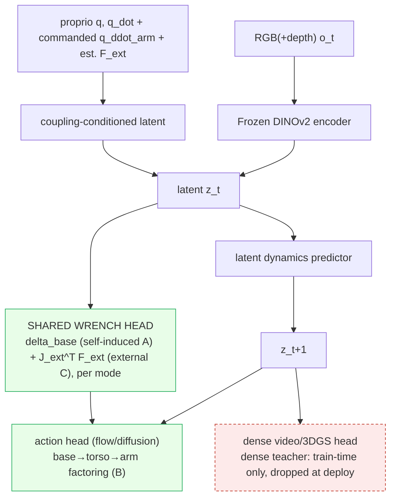

# Focus-Direction Research Plan: A Coupling-Aware World-Action Model (CoWAM)

## 1. Abstract

> [!abstract] The bet
> A World-Action Model whose latent **explicitly and anticipatorily predicts the reaction wrench** of whole-body motion (both the *self-induced* inertial reaction and the *external* contact wrench), so a humanoid policy plans against a sensor-free coupling forecast instead of treating arm-to-leg, base-to-arm, and force-under-load coupling as an implicit residual. Trained dense, deployed latent on a real G1/H1, grounded by differentiable system-ID, verified by a causal-consistency metric. Working name **CoWAM**. The bet: this one architectural term beats far larger data/compute on a fixed budget, with the gain concentrated where each channel's cross-term is largest. The thesis commits to **three** coupling channels (arm↔leg inertial, base↔arm kinematic, force-under-load external), so the lift is measured first on **balance / disturbance** (the arm→leg test), **mobile-manipulation** (the base↔arm anchor), and **force-under-load / OOD-payload** (the force-under-load anchor); the remaining evaluation axes are **generality / robustness checks**, not co-equal contributions. The two **force** channels (arm↔leg self-induced and force-under-load external) are the two **dominant** force-transmission pathways; they share **one output wrench head** (the legs compensate downstream) but solve **different prediction problems**: A's reaction is computable from the commanded $\ddot q_{\text{arm}}$ + inertia, C's exogenous wrench is anticipated from context, load, and contact state. Gravity/CoM is folded into the grounded model; the arm-velocity-induced Coriolis cross-term is predicted inside channel A (not a separate channel). The three channels are co-equal in the explicit-coupling *bet* but differ in mechanism *depth*: A is the deepest (it carries its own reactive-observer and analytic-residual baselines), C rides A's shared wrench head, and B is a thinner factoring-only claim with no reactive-observer comparator. Companions: [[Focus-Direction]] (thesis), [[Focus-Direction-Workflow]] (the one-page canvas pitch of this full program), [[Focus-Direction-Paper-Code-Index]] (papers to code). Full rigor (pre-registration, fairness commitments, instrumentation) lives in `Focus-Direction-Research-Plan-detailed.md`, which follows this same section structure.

## 2. Introduction and motivation

> [!tip] First principles (the program bet)
> - **First principle:** the generalized mass matrix is non-block-diagonal, so every whole-body motion transmits a low-dimensional, structured cross-term (a reaction wrench, or a kinematic feasibility constraint) between the arm, the base, and the legs; that cross-term is a quantity to predict, not data to collect.
> - **Assumption challenged:** the field decouples whole-body control into an arm controller plus a balance controller and leaves the coupling implicit or reactive.
> - **The bet:** making each coupling an explicit, anticipatory, grounded, and verified world-model output beats far larger data and compute on a fixed budget, with the gain concentrated where the cross-term is largest, and it falsifies cheaply via the epsilon-curve.

Whole-body humanoid control is conventionally **decoupled**: an arm/manipulation controller plus a balance/locomotion controller, with the coupling between them left implicit. But the generalized mass matrix is non-block-diagonal, so a fast arm reach **is** a base and leg balance disturbance, and likewise an *external* hand wrench propagates through $J_{\text{ext}}^{\top}$ to the support legs, so force adaptation under load is a whole-body equilibrium problem, not an arm problem. Discarding those cross-terms is what makes whole-body policies brittle on aggressive motion and under load. Each cross-term is low-dimensional and structured, a quantity to **predict** (anticipatorily, from the commanded arm motion for the self-induced reaction, from an estimate of the external wrench for force-under-load) rather than data to collect. The program runs the *same* explicit move across **three coupling channels in parallel**: the two *force* channels (arm↔leg self-induced **A**, force-under-load external **C**), the two **dominant** force-transmission pathways, share one **output** wrench head (the legs compensate) while solving different prediction problems (A computable from the commanded $\ddot q_{\text{arm}}$, C anticipated from exogenous context/load/contact), and the *kinematic* channel (base↔arm **B**) factors the action; Gravity/CoM is folded into the grounded model; the arm-velocity-induced Coriolis cross-term is predicted inside channel A (not a separate channel). This plan tests whether making that prediction explicit beats implicit-coupling and reactive-observer baselines on a fixed budget, per channel.

> [!warning] Three fixed premises (literature facts, not relitigated here)
> 1. **[[2606.16542|ADAPT]] is reactive, not anticipatory** (a momentum disturbance-observer of *external* disturbance); it is the reactive *estimate-then-react* foil for **both force channels** (self-induced A and external-wrench C). The closest *anticipatory* neighbor is [[2201.03871|ALMA]] (an MPC-predicted *self-applied end-effector* wrench, the arm's own manipulation force, known, fed as a disturbance to a *separate* RL locomotion policy, a decoupled handoff), so it anticipates only that **self-induced known** wrench on a quadruped, model-based. ALMA is the closest anticipatory precedent for both force channels by method (anticipatory wrench feedforward); by kind its wrench is an applied **end-effector** force (nearest **C**, a contact wrench) that is self-generated and model-computable (the **A**-like trait); because that self-applied wrench is analytically known, the surviving learned-anticipation wedge it leaves open is sharpest on **C** (the unknown external wrench). The surviving wedge is anticipatory feedforward of each cross-term as a learned WAM output in one coupled humanoid policy: the *self-induced* inertial cross-term (A), and the *unknown external* wrench (C) that ALMA's self-induced-only scope excludes. ADAPT is a **mandatory baseline** on both force channels and ALMA the decoupled-anticipatory comparator.
> 2. **Honest headline:** the **41 to 62 figure is borrowed** ([[2604.07993|HEX]]-implicit beating **monolithic generalist VLAs** (pi0.5 44.3 / GR00T N1.5 41.0) on unseen-scene generalization, not part-wise stacks, *not* explicit-vs-implicit), so it is the field's proof-of-life, not this program's claim. The program's claim is two narrower wedge *types* it tests on each channel: the **explicit-vs-implicit** wedge (concentrated where the channel's cross-term is largest, surviving model error; high arm-accel for A, the first ~100 ms after a step load for C; tested in the de-risked core and again inside CoWAM) and the **explicit-vs-reactive** wedge (anticipatory feedforward beats the reactive observer on the force channels A and C, isolated by the input-isolation control in ablation #1).
> 3. **Whitespace (re-verified against the actual graph, snapshot at writing):** in the large `graphify-out/graph.json` (~30331 nodes at writing, since grown), the genuine zeros are **"reaction wrench" as a compound (0) and "causal-consistency as a verification metric" (~0)** (the one "causal consistency" hit is a reward term, a blueprint-aware reward, not a metric); these load-bearing zeros are what the program rests on. Coupling and observer concepts clearly exist (snapshot at writing: ~80 coupling-substring nodes = ~24 standalone coupling + ~56 decoupling, plus **3 "disturbance-observer"-compound nodes** by exact-substring match, 2 of them [[2606.16542|ADAPT]]'s own and 1 [[2603.27313|MetaTune]]'s; the looser "disturbance"-and-"observer"-co-occurrence query returned **4**, the 4th being [[2509.18865|Bi-VLA]]'s "disturbance and reaction force observers", a four-channel bilateral-control observer, not the whole-body momentum disturbance-observer compound this plan compares against, so the compound count stays 3; decoupling outnumbered standalone-coupling ~2.3:1, ~56 vs ~24), and an anticipatory-wrench node now exists ([[2201.03871|ALMA]]'s "anticipatory predicted-wrench observations"). The whitespace is therefore the **specific framing**, no node for the *self-induced inertial cross-term as a learned world-model output in one coupled policy*, plus the two genuine zeros above.

## 3. Background and related work

The field defaults to **decoupling**: separate arm and balance controllers, with the coupling left implicit ([[2604.07993|HEX]]'s predictive MoE), emergent ([[2505.06776|FALCON]]'s shared observation), or one-directional ([[2509.21231|SEEC]], base-to-arm only); reactive observers ([[2606.16542|ADAPT]]) estimate disturbance after it manifests. The closest anticipatory neighbor is [[2201.03871|ALMA]], which feeds an MPC-predicted *external* wrench sequence as an anticipatory observation to a *separate* RL locomotion policy, so the distinction is sharp: ALMA is the very two-controller decoupled handoff CoWAM argues against, predicts the self-induced applied arm wrench (the force its own manipulation exerts, computed by MPC, not an unknown external load and not the self-induced inertial cross-term $M_{\text{base,arm}}\ddot q_{\text{arm}}$ as a learned output), is not a world-action model, and has no $\varepsilon$-curve, no robot-self sysID grounding, and no causal-consistency metric. For **force-under-load** the humanoid field is *reactive*: [[2505.06776|FALCON]] gets implicit compensation from a torque-limit-aware force curriculum, [[2510.26280|Thor]] from a force-augmented reward, [[2606.03297|SplitAdapter]] from a history-estimated load context, [[2511.04679|GentleHumanoid]] / [[2505.20829|Unified-Force-Position-Control]] via learned impedance, and [[2502.10894|UAN]] supplies the high-load actuator model (113 N cart, 8 kg lift), and [[2607.02332|HEFT]] handles heavy payload (24 kg) reactively via a windowed payload curriculum; all *estimate-then-compensate from the past* except [[2606.10818|IMPACT]], which predicts the arm's external wrench feedforward from torque residuals sensorlessly but stays one-directional and arm-side; and ALMA anticipates only the *self-induced known* wrench on a quadruped. World-action models imagine *scene* futures ([[2411.04983|DINO-WM]], [[2504.02792|UWM]], [[2603.14482|V-JEPA-2.1]]), yet [[2605.23856|JOPAT]] shows predicting an explicit structured target beats pixels and [[2607.05966|iKCE]] shows such imagined rollouts stay kinematic and friction-invariant; differentiable system-ID recovers *object* physics ([[2603.01151|D-REX]], [[2104.02646|gradSim]]), while structure-preserving sysID keeps recovered dynamics physically consistent ([[2606.09640|Physics-Aware-Sparse-EL]] holds inertia SPD and Coriolis consistent, [[2607.06824|CaLiSym]] enforces symplectic actuation/contact ports) yet still targets object or generic systems, not the robot's own $M_{\text{base,arm}}$. The closest force-WAM, [[2606.08555|FAWAM]], already forecasts end-effector wrenches jointly with actions and corrects on the force residual, though sensor-bound and single-arm. No prior work makes the self-induced arm-to-leg cross-term *or* the unknown external wrench an **explicit, anticipatory world-model output** carried in a single coupled humanoid policy, nor binds **predicted-to-realized coupling** as a metric. Full literature map: [[Whole-Body]], [[WAM]], [[Sim2Real]], [[Embodied-AI]], and the detailed plan.

## 4. Aims and hypotheses

Six clusters share one spine. Coupling core (co-equal): WB.A, WB.B, WB.C. Complementary general breakthroughs: WAM.A, S2R.B, EAI.B. One Aim and one core hypothesis per cluster; the original H1-H4 are mapped on, not dropped.

- **Aim WB.A (arm to leg):** make the self-induced reaction wrench $\delta_{\text{base}} = M_{\text{base,arm}}\ddot q_{\text{arm}} + C_{\text{base,arm}}\dot q_{\text{arm}}$ an explicit anticipatory prediction. **H-WB.A:** explicit beats implicit (MoE) and reactive (observer), margin concentrated at high arm acceleration, surviving model error (H1 on A).
- **Aim WB.B (base to arm):** factor the action autoregressively (base to torso to arm) so the base is a predicted, coupled DoF. **H-WB.B:** coupled beats decoupled-base, margin concentrated on reach-extension tasks (H1 on B).
- **Aim WB.C (force-under-load):** estimate the unknown external hand wrench and anticipate $J_{\text{ext}}^{\top}F_{\text{ext}}$, sharing WB.A's head. **H-WB.C:** anticipatory beats both reactive (observer/impedance) and implicit ([[2505.06776|FALCON]] force-curriculum), margin in the first ~100 ms after a step load; $J_{\text{ext}}$ identifiable in the PR-0b sim check (planted contact-model / $J_{\text{ext}}$ unknowns, known ground truth), with real-robot grounding validated downstream by PR-2 (OOD-mass SR + PR-4 force-plate self-consistency), since the real true contact model is unobservable (H1 + H4-C).
- **Aim WAM.A (predict):** carry all channels on a train-dense / deploy-latent WAM, latent conditioned on dynamics state. **H-WAM.A:** lift positive across every WAM backbone (H2) and, as an exploratory, confound-aware gradient tested within-backbone, expected largest where the native latent is least control-relevant (H3).
- **Aim S2R.B (ground):** recover $M_{\text{base,arm}}$ (A) and the contact model (C) from real interaction by differentiable system-ID, and ground the manipulated-object physics (B) via the same engine's native object recovery, so all three clusters are grounded. **H-S2R.B:** $M_{\text{base,arm}}$ identifiable in the PR-0b sim check (planted $\tilde M$, known ground truth), with real-robot grounding validated downstream by PR-2 (OOD-mass SR + PR-4 force-plate self-consistency), since the real true inertia is unobservable (H4-A).
- **Aim EAI.B (verify):** certify predicted-vs-realized coupling on existing harnesses + hardware. **H-EAI.B:** the causal-consistency metric is well-defined and discriminative, computed per channel (A / B / C) and with a three-way (prediction / grounding / execution) error decomposition; no public benchmark binds predicted-to-realized coupling.

Four breakthrough modifications: shared reaction-wrench imagination head ([[WAM|WAM·A2]]); coupling-conditioned latent ([[WAM|WAM·A3]]); differentiable-sysID grounding ([[Sim2Real|S2R·B2]]); causal-consistency verification ([[Embodied-AI|EAI·B1]]).

## 5. Approach

### Problem
The generalized mass matrix is non-block-diagonal, so an arm acceleration is a base/leg balance disturbance (channel **A**, self-induced), and an external hand wrench propagates to the support legs (channel **C**, external):
$$ \delta_{\text{base}} \;=\; M_{\text{base,arm}}(q)\,\ddot q_{\text{arm}} + C_{\text{base,arm}}(q,\dot q)\,\dot q_{\text{arm}}, \qquad \delta^{\text{ext}}_{\text{base}} \;=\; J_{\text{ext}}^{\top}(q)\,F_{\text{ext}} $$
Predict $\delta_{\text{base}}$ **anticipatorily** from the *commanded* $\ddot q_{\text{arm}}$ (before it perturbs the base), and forward-model the external reaction $\delta^{\text{ext}}_{\text{base}}$ from an estimate of the *unknown* $F_{\text{ext}}$ (before the load is fully felt). Both feed **one shared output wrench head** (the legs compensate downstream), but they are **different prediction problems**: A is computable from the commanded $\ddot q_{\text{arm}}$ + inertia, C's exogenous wrench must be anticipated from context, load, and contact state. The wedge is on timescales: the reaction rises over ~20 to 60 ms while a momentum observer lags ~6 ms plus one policy step, so anticipation only wins where the rise-time is long enough (pre-registered $\ge$ 31 ms, PR-0a). In MuJoCo the exact target is `mj_fullM`, reachable through `humanoid-bench`'s `MjDataWrapper.__getattr__` passthrough (`env.data.qM` works directly); but `humanoid-bench` ships **zero** existing `mj_fullM`/`qM` usage, so authoring and confirming the dense-densify-then-slice extraction on the **H1 and G1 models is a new Phase-0 task (to-be-confirmed at M0)**, not a ready dependency. For the falsifier the target comes from a *perturbed* $\tilde M$.

### Architecture

*The dense teacher (red, dashed) is a train-time-only node; the deploy-time mermaids in [[Focus-Direction-Workflow]] and the canvas omit it by design, since it is dropped at deploy.*

The coupling head is a plug-in on any WAM backbone (the backbone grid proves the lift is the term, not the backbone). Four added modules:
- **Coupling-conditioned latent:** carries proprioception + commanded $\ddot q_{\text{arm}}$, not just scene appearance. So the latent cannot ignore the acceleration input and collapse the wrench head to a proprioception-only regressor, an explicit conditioning auxiliary loss $\mathcal L_{\text{cond}}$ supervises the latent to *reconstruct* proprioception + commanded $\ddot q_{\text{arm}}$ from $z_t$ (Seam 1's learning mechanism); ablation #3 measures wrench-head error with this conditioning on vs off.
- **Shared wrench-imagination head:** predicts the self-induced reaction $\delta_{\text{base}}$ (channel A) *and* the external-wrench reaction $J_{\text{ext}}^{\top}F_{\text{ext}}$ (channel C), each a $(6+n_{\text{leg}})$-vector per contact mode, plus a mode classifier. The external wrench $F_{\text{ext}}$ is itself estimated and anticipated from proprioception, context, and contact state (an ADAPT-style observer), then forward-modeled; A and C **share this output head** but differ in the prediction problem (A computable from its own commands, C exogenous and anticipated). Contact modes are discrete (sliding vs sticking, $n_{\text{modes}}=2$), labeled from simulator contact state in sim and from tactile/contact-force thresholding ([[2606.13877|ContactWorld]] modality) on hardware.
- **Autoregressive action head:** base-to-torso-to-arm factoring (the base-arm anchor). Verified fork bases: `brs-algo` (WB-VIMA, `whole_body_decoding_order`) and [[2507.01961|AC-DiT]].
- **Dense teacher head** (video/3DGS): train only, dropped at deploy.

### Improving the coupling clusters (the co-equal core)

The three coupling clusters are improved each as a whole and co-equally: improving WB.A, WB.B, or WB.C means advancing all of its directions together as one whole-body interface, with the per-direction recipes below as the parts of that single advance.

#### WB.A (arm to leg)
The four directions are the cluster's coordinated advances at different layers of one whole-body interface in which upper-limb intent and lower-body support are coupled before commands issue, so the legs anticipate the arm's inertial demand rather than absorbing it late. WB.A1 anticipates the arm-induced base reaction wrench, WB.A4 couples the same intent into the command vocabulary as a feasible-by-construction latent, WB.A2 secures sim-to-real feasibility, and WB.A3 secures workspace feasibility. WB.A2's SkillBlender-plus-HiWET blended hull and WB.A4's HALOMI behavior manifold (the [[2511.04131|BFM-Zero]] latent) are alternative, non-stackable feasibility substrates the cluster evaluates, not a single stacked pipeline. Each recipe targets the layer the next presumes, yielding one whole-body interface advanced at four layers instead of four point fixes.
- **WB.A1 CoReWA** = [[2604.07993|HEX]] + [[2509.21231|SEEC]] + [[2506.14278|Heavy-Limbs-WBC]]: forecast arm latents into an anticipatory base reaction wrench feeding gate and controller.
- **WB.A2 BlendBridge** = [[2506.09366|SkillBlender]] + [[2602.08594|MOSAIC]] + [[2602.06341|HiWET]]: entropy-gated per-joint residual adapts a frozen skill blend across the sim-to-real gap.
- **WB.A3 ReachSched-WBT** = [[2602.06341|HiWET]] + [[2508.11275|Differentiable-Reachability-Maps]]: schedule the base along a reachability gradient, shrink the margin with tracking residuals.
- **WB.A4 CoLA-WB** = [[2512.11047|WholeBodyVLA]] + [[2506.13751|LeVERB]] + [[2606.18772|HALOMI]]: loco latent as residual of manip code, projected onto a feasible manifold.

#### WB.B (base to arm)
The three directions build one shared artifact: a single mobile-manipulation policy that denoises base, torso/arm, and perception actions in the same action chunk over one shared frame, with a co-trained DynaMem-style voxel memory introduced by B2 and B3 as the connective perception interface. B1 contributes the base-first flow-matching coupling backbone (with a single arm-to-base feasibility edge) as the reusable component the other two build on, and its own deliverable is the stratified margin map that validates when that edge wins, not a memory: B1 carries no DynaMem of its own (BRS, AC-DiT, InCoM only). B2 promotes a memory-conditioned 3D look-at into that same chunk so gaze reveals what the base motion opens, and B3 turns DynaMem's hard purge into a differentiable in-policy write gate so the scene the base and gaze act on stays self-correcting. Each closes the loop the previous opened, so once B1's validated backbone is wrapped in the B2/B3 memory interface, one perceive-move-update-act loop compounds into a whole-body controller no single direction delivers alone.
- **WB.B1 KCFlow-Strat** = [[2503.05652|BRS]] + [[2507.01961|AC-DiT]] + [[2602.23024|InCoM]]: stratified test of when one arm-to-base feasibility edge beats unidirectional base-first.
- **WB.B2 LookAhead-WBC** = [[2603.03243|HoMMI]] + [[2405.07991|SPIN]] + [[2411.04999|DynaMem]]: memory-conditioned 3D look-at co-optimized with base in one diffusion chunk.
- **WB.B3 EchoPurge** = [[2511.18112|EchoVLA]] + [[2411.04999|DynaMem]] + [[2510.07134|TrackVLA++]]: differentiable in-policy purge gate plus cross-visit re-ID for self-correcting multi-room memory.

#### WB.C (force-under-load)
Improving WB.C means making its two recipes share ONE sensorless, proprioceptively-estimated load-mismatch signal fanned out to both the locomotion controller and the manipulation policy. That single signal is PROWL's anticipatory load-mismatch forecast: WB.C1 produces it as a wrench lookahead (predict and pre-brace), and WB.C2 consumes that same forecast to build a conformal disturbance bound (certify and re-size shields), at complementary points on the anticipation-versus-safety spectrum. Together they turn reactive force-under-load whole-body control into one anticipatory, conditionally-certified loop off a shared upstream signal.
- **WB.C1 PROWL** = [[2505.06776|FALCON]] + [[2201.03871|ALMA]] + [[2606.16542|ADAPT]]: momentum-observer residual forecasts hand wrench into FALCON's dual agents, legs pre-brace before loads peak; only ALMA's anticipatory-leaning mechanism is the transferable claim, its headline numbers are on a quadruped, not the claim here.
- **WB.C2 PALADIN** = [[2605.25546|ISSf-CBF-WBC]] + [[2604.07457|CMP]] + [[2602.01515|RAPT]] (cross-check): PROWL's forecast is conformally bounded into a disturbance that re-sizes the ISSf-CBF QP and narrows CMP's radius, with RAPT's residual demoted to a runtime cross-check.

### Improving the mechanism clusters (complementary general breakthroughs)

The three mechanism clusters are the predict, ground, and verify seams wired onto the coupling, and each is also a standalone general advance (network and training architecture, sim2real, and evaluation). Each is improved as a whole, its directions together, and absorbs the corresponding seam method.

#### WAM.A (predict)
The three directions build one shared artifact: a predictive world-model latent trained dense and grounded yet deployed lightweight, paired with a calibrated residual gate that decides execute versus replan by comparing a cached forecast to a freshly encoded real observation. Each reuses the cluster's train-teacher-then-discard-and-gate recipe (the discardable train-only teacher following [[2607.05468|MECo-WAM]], whose decayed read-mask attention zeroes out at deploy for no added inference cost) on a different prediction target (scene geometry, contact wrench, action-recoverable dynamics), so a robot inherits one latent whose visual, contact, and control futures are all calibrated and gateable. It is the upstream substrate CoWAM's coupled controllers consume.
- **WAM.A1 GROVER** = [[2605.20752|GaussianDream]] + [[2602.10098|VLA-JEPA]] + [[2605.06222|FFDC-WAM]]: shared motion code grounds a leakage-free latent via a discardable 3D-Gaussian teacher, deploy gates on a calibrated residual.
- **WAM.A2 WrenchCast** = [[2606.09337|TORL-VLA]] + [[2606.13877|ContactWorld]] + [[2603.17851|DexViTac]]: rolls latent forward H steps, decodes sensorless 6-DoF wrench split into self-motion and contact, conformal trust gate.
- **WAM.A3 DUET-WM** = [[2605.06388|Semantic-LDM-WM]] + [[2503.00653|DC-MPC]] + [[2505.04999|CLAM]]: splits a d=96 semantic latent into continuous flow channel plus FSQ residual channel, per-token gated, CLAM-grounded.

#### S2R.B (ground)
The four ground directions improve as one advance by building inside a single shared artifact, a differentiable physics twin whose backward pass and per-state correction residual are read in one physically-commensurate trajectory-divergence unit, so each recipe contributes a different grounded quantity to the same calibrated interface rather than its own twin. B1 differentiates the residual, B2 amortizes it, B3 gates on it, and B4 certifies it as an identifiability-calibrated inadequacy meter, with each estimate trusted only up to the divergence the others certify. The cluster-level artifact is a residual-calibrated grounding pipeline emitting a per-twin certificate of where reconstructed object and dynamics physics can be relied on.
- **S2R.B1 SENSE-T** = [[2503.17973|PhysTwin]] + [[2511.04665|Real-to-Sim-GS]] + [[2603.01151|D-REX]]: one differentiable rollout yields per-channel analytic sensitivity of sim-real divergence, replacing the discrete fidelity sweep.
- **S2R.B2 AMORTI-SIM** = [[2603.01151|D-REX]] + [[2603.23973|SLAT-Phys]] + [[2410.20357|Dynamics-as-Prompts]]: clutter-conditioned net predicts a novel object's full constitutive vector in one pass, zero per-object loops.
- **S2R.B3 FideliGate** = [[2403.03949|RialTo]] + [[2504.03597|Real-is-Sim]] + [[2604.13645|CFG-ADDA]]: photometric correction residual becomes a fidelity gate on fold-back demos, making rounds monotonically improve real success.
- **S2R.B4 CLaRe** = [[2304.14369|NCLaw]] + [[2508.01112|MASIV]] + [[2603.22039|RAFL]]: two-head MPM splits a constitutive law from a starved residual, making the split a falsifiable extrapolation measurement.

#### EAI.B (verify)
The four EAI.B directions compose into one verify-and-retain layer around a single shared artifact: the predicted-versus-realized coupling residual emitted by the whole-body wrench head, force-plate-grounded and decomposed by channel. B1 builds the offline self-certifying action-counterfactual metric, B3 is its runtime lagged-agreement instance gating adaptive compute, B2 reads the residual as a per-failure correction signal, and B4 protects the corrected head under continual fine-tuning. They advance as one self-certifying causal-consistency metric plus a cause-attributed, forgetting-free learning loop, not four separable tools.
- **B1 CIC** = [[2606.05773|PiL-World]] + [[2606.18610|SC3-Eval]] + [[2605.29360|MiraBench]]: self-certifying action-counterfactual metric, U_cf-gated, rho=0.94/0.984 references.
- **B2 CALM** = [[2606.03385|GTP-FA]] + [[2506.21669|SEEA-R1]] + [[2508.19236|MemoryVLA]]: cause-attributed failure memory, channel-routed supervised correction, subspace-protected.
- **B3 ElastiVote** = [[2507.05116|VOTE]] + [[2605.08799|ElasticFlow]] + [[2605.29438|ElegantVLA]]: one-NFE policy, span+backbone knobs, c_{t-1}-gated recompute at >=30 Hz.
- **B4 GSE-Null** = [[2602.21919|Learning-in-the-Null-Space]] + [[2603.02224|Subspace-Geometry-Forgetting]] + [[2605.06175|VLA-GSE]]: two-space continual FT, null-space-protected wrench head, no forgetting.

### The cluster falsifiers (the decisive experiment)
**Three falsifiers run in parallel, one per coupling cluster**, each the *same* cheap ablation on the lean `humanoid-bench` PPO substrate (same data/seeds/backbone), and each testing the **shared, load-bearing claim every direction in that cluster is built on**, so a pass de-risks the whole cluster (its directions advance together) and a fail voids the cluster's shared bet, not one recipe. **Per-cluster go/no-go** (a cluster can fail independently):
- **WB.A · arm↔leg (force), stratified by arm-acceleration quartile:** the shared claim is *anticipatory coupling* (the legs anticipate the arm's inertial demand before commands issue), tested **explicit-feedforward (ours)** vs **implicit ([[2604.07993|HEX]]-MoE)** vs **reactive observer ([[2606.16542|ADAPT]])**. **Input-isolation control (decisive):** identical head, swap *only* the input, planned $\ddot q_{\text{arm}}$ (anticipatory) vs the observer's measured estimate (reactive); attributes any win to feedforward timing, not capacity. A pass validates the interface WB.A1–A4 all build on.
- **WB.C · force-under-load (force, shares WB.A's head):** the shared claim is *one anticipatory load-mismatch forecast* (which WB.C1 produces and WB.C2 certifies), tested **explicit anticipatory wrench-reaction (ours)** vs **reactive ([[2606.16542|ADAPT]] external-wrench observer / [[2505.06776|FALCON]] curriculum / a reactive impedance tracker)** vs **implicit**, under a *step-applied unknown* external load, stratified by load magnitude and direction. **Headline-C metric:** the CoM-excursion advantage in the first ~100 ms after load onset, where reactive compensation lags ([[2201.03871|ALMA]] proved anticipation beats reactive for the self-induced known wrench; C extends it to the unknown-external regime on a humanoid).
- **WB.B · base↔arm (kinematic):** the shared claim is a *base-first coupling backbone with one arm-to-base feasibility edge* (which WB.B2 and B3 compound on), tested autoregressive base→torso→arm vs flat-concatenation (a factoring claim, no reactive-observer arm), per the base-arm gate.

**De-circularization (the headline $\varepsilon$-curve).** Supervise the explicit head on $\delta^{\star}_{\text{base}}$ from a *perturbed* $\tilde M$ (each link's mass/inertia scaled by $1\pm\varepsilon$), while the implicit baseline and the observer run on the true dynamics with no privileged target. If the explicit head still wins under a deliberately wrong model, the win is the inductive bias, not label leakage. Report the margin **as a function of $\varepsilon$** with bootstrap CIs. **Void unless** the margin is significantly $>0$ at small $\varepsilon$ ($\{0,0.05\}$) **and** degrades gracefully. Implementation is specified as Phase-0 steps (coding later). Fairness (pre-registered): implicit = matched-capacity MoE on identical data/seeds; reactive = ADAPT observer at the 500 Hz state-poll on true dynamics. Each force cluster gets its own $\varepsilon$-curve: A perturbs $\tilde M$, C perturbs the contact model / $J_{\text{ext}}$; the same void gate (significant at small $\varepsilon$, non-increasing) applies per cluster.

### Benchmark suite (by cluster)

- **A = WB.A. Balance / disturbance rejection + whole-body loco-manip (coupling's direct test):** primary [[2308.14636|Disturbance-Rejection-Testing]] (recovery rate, max recoverable impulse, CoM deviation) and [[2403.10506|HumanoidBench]] (per-task SR, balance recovery by arm-accel quartile, motion-quality jerk via [[2603.20147|AGILE]]). Diversity: [[2404.19173|Single-Contact++-RL]], [[2602.13656|KungFuAthlete]], [[2506.15132|Booster-Gym]], [[2307.10142|Benchmarking-Potential-Based-Rewards]], [[2507.18883|partial-observation-loco]], [[2508.19926|FARM]], [[2606.17833|HumanoidArena]], [[2503.05652|BRS]], [[2506.09366|SkillBlender]], [[2602.13850|Humanoid-Hanoi]], [[2511.17925|Switch-JustDance]], [[2602.21599|Iterative-Closed-Loop-Motion]], [[2408.00342|MuJoCo-MPC-HB]].
- **B = WB.B. Mobile manipulation (base to arm):** primary [[2407.07788|BiGym]] (Unitree H1) and [[2503.05652|BRS]] (Galaxea R1, a wheeled dual-arm/torso mobile manipulator), used for base-arm kinematic coupling where legs are not required (sub-task/entire SR, collision force); [[2412.13211|MS-HAB]] (Fetch) and [[2602.05233|MobileManiBench]] (a mobile base; its "G1" is a gripper config, not a Unitree G1 humanoid) are non-humanoid and kept only as optional dev-only sims, not gated or reported. Diversity: [[2606.18239|EBench]], [[2306.11565|HomeRobot]], [[2512.24653|RoboMIND-2.0]].
- **C = WB.C. Force-under-load / OOD-payload + contact-rich (external wrench):** primary [[2505.06776|FALCON]] suite (FALCON's reported under-force tracking 0.37 vs 0.60), with our added metrics first-100 ms CoM excursion and max recoverable load, and [[2604.13015|Touch-Dreaming]] (the humanoid contact wrench: L_force forecast head + "w/o Touch" ablation, 5 closed-loop tasks, with the [[2403.10506|HumanoidBench]] taxel-toggle sim arm). Diversity: [[2510.26280|Thor]] (167.7 N), [[2502.10894|UAN]] (113 N / 8 kg, cited as a high-load actuator-model reference, not a humanoid task suite), [[2606.03297|SplitAdapter]] (6 kg OOD), [[2606.13232|WT-UMI]], [[2511.04679|GentleHumanoid]]. [[2606.13877|ContactWorld]] and [[2505.18472|ManiFeel]] are non-humanoid and kept only as optional dev-only sims, not gated or reported; the humanoid contact-rich tactile gate (PR-3) runs on [[2604.13015|Touch-Dreaming]] + [[2403.10506|HumanoidBench]].
- **D = WAM.A. WAM competence + generalization + WM-quality (backbone grid):** in-dist [[2403.10506|HumanoidBench]] (27 humanoid tasks; the backbone grid off/on runs here; SR, FWT/NBT); OOD on HumanoidBench held-out tasks + perturbations (dim-wise SR, composition gap); WM-quality robustness sub-axis [[2510.07092|1X-World-Model-Challenge]] (1X humanoid). Non-humanoid dev-only sims (not gated or reported): [[2306.03310|LIBERO]], [[2506.18088|RoboTwin-2.0]], [[2112.03227|CALVIN]], [[2406.02523|RoboCasa]], [[2510.13626|LIBERO-Plus]], [[2605.06311|VISER]], [[2402.08191|THE-COLOSSEUM]], [[2604.19092|RoboWM-Bench]], [[2602.08971|WorldArena]], [[2506.00613|WorldGym]]. Gate (PR-plugin): the backbone-grid H-plugin lift passes only if the within-backbone paired off/on lift is > 0 at BH-adjusted p < 0.05 on the deployed backbone, lift floor $\Delta_{1A}$.
- **E = S2R.B. Deployment / sim2real reliability:** real H1/G1/R1 + [[2602.01515|RAPT]] (humanoid sim2real OOD; SR retention, A/B rank, OOD AUROC, real-to-sim r). No public whole-body coupling-transfer suite exists, so the sim-vs-real gap is anchored on [[2505.12748|TeleOpBench]] (a dual-arm teleoperation benchmark with demonstrated sim-vs-real correlation, repurposed here only as a sim-real-gap methodology anchor) and [[2602.02331|TTT-Parkour]] (sim 99% to robust on a real G1), measured on the program's own coupling tasks. Non-humanoid dev-only sims: [[2506.18123|RoboArena]], [[2510.17950|RoboChallenge]], [[2512.19562|REALM]], [[2605.20774|VLA-REPLICA]], [[2604.24018|Betting-sim2real]].
- **F = EAI.B. Causal verification (+ long-horizon/memory):** causal consistency on the humanoid coupling tasks + real H1/G1 force-plate hardware (ASR, COD, pred-vs-realized error, corr-to-SR); long-horizon/memory robustness sub-axis on [[2403.10506|HumanoidBench]] long-horizon humanoid tasks (SR by M(1)/M(n)). Non-humanoid dev-only harnesses / context precedents: [[2605.21800|stable-worldmodel]], [[2606.18610|SC3-Eval]], [[2505.19017|WorldEval]], [[2603.22212|Omni-WorldBench]], [[2603.01229|RMBench]], [[2603.04639|RoboMME]], [[2605.10921|RoboMemArena]], [[2506.06677|RoboCerebra]], [[2511.11478|LIBERO-Mem]], [[2412.05313|λ]]. The long-horizon/memory and WM-quality sub-axes are descriptive diagnostics with no pre-registered pass threshold.

A/B/C (WB.A, WB.B, WB.C) are the three core hypothesis tests; D/E/F (WAM.A, S2R.B, EAI.B) are generality/robustness checks. Kept intact and unchanged: the backbone-agnostic coupling grid (PPO floor + DINO-WM/UWM/Cosmos-Policy/V-JEPA 2.1, H-plugin/H-gradient/controls/staging), the 8 ablations, and Metrics/statistical-rigor/budget.

### Success criteria (by cluster, every gate preserved)

- **Cross-cluster Phase-0 + provenance:** PR-0a (rise-time $\ge$ 31 ms), PR-0a-C ($\ge$ 5 ms window margin), PR-0a' ($\ge$ 30% dominance), PR-0-branch, PR-0a-modality, PR-0b ($\le$ 15% Frobenius at $\varepsilon$=0.10, grid {0.05,0.10,0.25}), PR-0b-excite (multisine), PR-foils-ADAPT, PR-foils-MoE (±2% params / ±5% FLOPs), PR-quartile (peak $\|\ddot q_{\text{arm}}\|$, BH FDR q=0.05), PR-foils, PR-data.
- **A:** PR-1A (margin $\ge$ 5 pp + top-quartile concentration + anticipatory beats reactive $\ge$ 5 pp), PR-$\varepsilon$ ($\varepsilon\in\{0,0.05\}$ sig $>0$ at BH q<0.05 AND non-increasing / Spearman $\rho\le0$), PR-$\varepsilon$-lambda ($\lambda_w$ frozen at $\varepsilon$=0.1).
- **B:** PR-1B ($\ge$ 5 pp on the BiGym (Unitree H1) reach-extension subset, near-zero $|\Delta\text{SR}|<$2 pp on fixed-base, positive trend p<0.05; real-R1 corroboration on BRS).
- **C:** PR-1C (first-100 ms CoM-excursion reduction target $\ge$ 20% above seed floor, concentrated at large load, survives C $\varepsilon$-curve), PR-3 (sensor-free MSE $\le$ 2x tactile-available baseline AND significant reduction on the held-out Touch Dreaming contact-rich split + HumanoidBench taxel-toggle sim arm).
- **F (with E retention bundled):** PR-2 (**downstream-only**: no real-robot Frobenius-to-truth, since `mj_fullM` is the nominal model sysID exists to correct and the real true inertia is unobservable, so that 15% Frobenius test lives only in PR-0b's planted-$\tilde M$ sim check; beats broad-DR on OOD-mass SR by $\ge$ 3 pp AND real-SR retention $\ge$ 80%, plus the PR-4 self-consistency proxy), PR-4 ($R^2 \ge$ 0.70, paired-bootstrap CI excludes zero, head-vs-analytic $\le$ analytic-vs-measured), PR-4-continual (NBT $\ge -2$ pp AND post-update top-quartile lift $\ge$ 5 pp).

$\delta_{1A}=\delta_{1B}=$ 5 pp floor throughout; PR-1B/PR-3 operational-definition note kept verbatim.

## 7. Staging, builds, and gates

| Build | Deliverable | Gate (pre-registered) |
|---|---|---|
| **0 de-risk** | two wedge-killer experiments (below); $\varepsilon$-protocol frozen | inputs fixed |
| **WB.A cluster falsifier** (arm-leg, Phase 1A) | three-way ablation on `humanoid-bench` + the $\varepsilon$-curve | margin $\ge$ **5 pp** ($p<0.05$) AND top-quartile concentration AND anticipatory beats reactive |
| **WB.B cluster falsifier** (base-arm, Phase 1B) | `brs-algo` autoregressive vs flat on BiGym (H1) | autoregressive beats flat by $\ge$ **5 pp** ($p<0.05$) on reach-extension sub-tasks (BiGym targets outside the standing arm-workspace) AND near-zero margin ($\lvert\Delta\text{SR}\rvert<$ 2 pp) on fixed-base reaches AND a significant positive margin trend between them ($p<0.05$) |
| **WB.C cluster falsifier** (force-under-load, Phase 1C) | three-way on `humanoid-bench` under a step-applied unknown load (anticipatory vs reactive-observer/impedance vs implicit) | anticipatory beats reactive by the pre-registered first-100 ms CoM-excursion reduction ($\ge$ **20%** target, $p<0.05$) AND concentrated at large/multi-directional load AND survives contact-model error (PR-1C) |
| **2 ground** | differentiable sysID of $M_{\text{base,arm}}$ (A) and the contact model / $J_{\text{ext}}$ (C) on the real robot; B's mobile-manip object physics rides the engine's native recovery (no separate gate) | **downstream-only** (no Frobenius-to-truth on the real robot: that 15% test lives only in PR-0b's planted-$\tilde M$ sim check, because `mj_fullM` is the nominal model sysID corrects and the real true inertia is unobservable): beats broad-DR on OOD-mass SR by $\ge$ **3 pp** AND real-SR retention $\ge$ 80%, with the PR-4 force-plate self-consistency check as the grounding proxy |
| **3 CoWAM** | shared wrench head: sensor-free forecast of the self-induced reaction (A) and the external wrench (C) | sensor-free wrench MSE $\le$ **2x** the tactile-available baseline on the held-out [[2604.13015\|Touch-Dreaming]] humanoid contact-rich split (with the [[2403.10506\|HumanoidBench]] taxel-toggle sim arm) (a held-out subset of its 5 contact-rich tasks, frozen at M0) (PR-3) |
| **4 verify + continual** | causal-consistency metric across all three channels (new, on existing harnesses) + hardware | **PR-4**: predicted-vs-realized coupling $R^2 \ge$ **0.70** on the held-out hardware set (paired-bootstrap 95% CI excludes zero) AND **PR-4-continual**: post-update coupling lift retained (NBT $\ge -2$ pp AND top-quartile lift $\ge$ **5 pp** at $p<0.05$) |

**Phase 0 de-risk (two wedge-killers, in sim, both at M0 before any Phase 1 force-cluster (1A/1C) training):** **(a)** observer-latency vs reaction rise-time against analytic `mj_fullM` truth, PR-0a: wedge viable only if rise-time $\ge$ 31 ms at top-quartile accel (else drop the anticipatory framing); same experiment checks $\delta_{\text{base}}$ dominates the other residuals by $\ge$ 30%. **(b)** inertia identifiability: recover a planted $\tilde M$ with the D-REX/gradSim loop, PR-0b $\le$ 15% Frobenius (else drop Seam 2, use the analytic term + broad DR). The same two wedge-killers apply to **channel C**: (a) the first-100 ms anticipatory window must clear the *composed* onboard loop latency (observer settling + inference + actuator bandwidth), else the C headline moves to a steady-state max-load number; (b) the contact model / $J_{\text{ext}}$ must be identifiable to the same 15% tolerance, else fall back to the reactive/curriculum baseline for C.

**Phase-0 branch table (PR-0-branch, frozen at M0 so the go/no-go is auditable *before* Phase 1A/1C).** The two gates are independent; their four outcomes pre-commit the scope, no post-hoc reinterpretation (full table in the detailed plan):

| de-risk (a) | de-risk (b) | Scope that ships |
|---|---|---|
| pass | pass | full program: anticipatory + sysID-grounded CoWAM |
| pass | fail | anticipatory claim, but drop Seam 2 (analytic $M_{\text{base,arm}}$ term + broad DR) |
| fail | pass | drop anticipatory framing, keep the grounded explicit-vs-implicit term |
| fail | fail | de-circularized $\varepsilon$-curve only, no real-deploy build |

**Per-cluster go/no-go.** Each cluster's falsifier gates independently: if explicit $\approx$ implicit (and, on the force clusters, $\approx$ reactive) with no concentration where the cross-term is largest, that cluster is void. A cluster can fail without killing the others, and every branch still yields a result.

## 8. Expected contributions and outcomes

| Closest prior art | What it has | What CoWAM adds |
|---|---|---|
| [[2606.16542\|ADAPT]] | reactive momentum **observer** of *external* disturbance | **anticipatory** prediction of *self-induced* coupling, before it manifests |
| [[2201.03871\|ALMA]] | anticipatory but only the *self-induced known* wrench, fed to a *separate* RL locomotion policy on a quadruped (decoupled handoff, model-based) | both the *self-induced inertial cross-term* (A) and the *unknown external* wrench (C) as a **learned WAM output in one coupled humanoid policy**, de-circularized ($\varepsilon$-curve), sysID-grounded, causal-verified |
| [[2505.06776\|FALCON]] / [[2510.26280\|Thor]] / [[2606.03297\|SplitAdapter]] | *reactive* humanoid force-under-load (curriculum / reward / history-estimated load) | **anticipatory** forward-model of the *unknown external* wrench reaction (channel C), as a WAM output, sharing A's head |
| [[2604.07993\|HEX]] | *implicit* arm-leg coupling via predictive MoE | explicit, supervised, imagined term; beats implicit on the $\varepsilon$-curve at high accel |
| [[2507.01961\|AC-DiT]] / [[2401.02117\|Mobile-ALOHA]] | *one-directional* base→arm conditioning / *flat* base+arm concatenation | explicit **base↔arm** coupling (B): autoregressive base→torso→arm factoring, the base a predicted manipulation DoF, a co-equal coupling lead |
| [[2504.02792\|UWM]] | drop-head dense-train/latent-deploy WAM | the head is a **physics coupling wrench**, sysID-grounded, causal-verified |
| [[2603.14482\|V-JEPA-2.1]] | control-relevant predictive latent | latent conditioned on $\ddot q_{\text{arm}}$ and supervised by $\delta_{\text{base}}$ |

**The three seams (the program's cross-cluster contribution):**

| Seam | Today (unwired) | The wiring (contribution) | Phase |
|---|---|---|---|
| **1 represent to predict** | WAM latent = scene features | condition the latent on proprio + $\ddot q_{\text{arm}}$; supervise the wrench head with analytic $\delta_{\text{base}}$ | 3 |
| **2 predict to ground** | sysID recovers *object* physics | re-point per-link sysID at the robot's own $M_{\text{base,arm}}$ (A) and the contact model / $J_{\text{ext}}$ (C); the same engine grounds the mobile-manipulation's object physics (B) | 2 |
| **3 deploy to verify** | verify metric checks imagination | bind $\hat\delta_{\text{base}}$ (A) and $\widehat{J_{\text{ext}}^{\top}F_{\text{ext}}}$ (C) to the *measured* base reaction, and the predicted base-arm reach-feasibility (B) to the *realized* reach, across all three channels | 4 |

**What ships:** the three cluster falsifiers (WB.A arm-leg + WB.C force-under-load sharing one head + WB.B base-arm) + the per-cluster $\varepsilon$-curves + the consistency metric run first on the lean `humanoid-bench` substrate (no WAM needed); CoWAM then deploys and verifies all three coupling clusters with the backbone-grid centerpiece. The **C2 certified safe set** (a barrier/QP guaranteeing balance + collision-freeness under load) stays a deferred extension of WB.C, opened once the coupling is predicted, grounded, and verified.

## 9. Risks and mitigation

- **Explicit $\approx$ implicit:** the three-way ablation + $\varepsilon$-sweep is still the definitive result (per channel).
- **Wrong / unidentifiable inertia or contact model:** gate Phase 2 on PR-0b; fall back to the analytic term + broad DR (Seam 2 dropped) for the affected channel.
- **Hardware-dominant physics:** instrument the residual budget first (PR-0a'); scope down if $\delta_{\text{base}}$ is dominated. Per upstream H8, decompose the reaction at the worst instant (max CoM excursion): if the foot-contact / support-polygon-transition share dominates there, the inertial term is mis-specified and channel A reframes as a contact-constrained hybrid-dynamics prediction (terrain/foot-ground contact is this pre-gate, not a separate predicted channel).
- **Base↔arm factoring buys little, or its decode adds latency (channel B):** the autoregressive base→torso→arm win may live only on the reach-extension stratum (thin if the task distribution rarely needs in-task base repositioning), and the sequential decode can cost latency. Report the B margin **stratified by reach-extension vs fixed-base** (PR-1B), not pooled, and parallelize/distill the decode if latency bites; the definitive autoregressive-vs-flat ablation still ships.
- **WAM too slow for contact:** async decoupling + quantization clear the 30 Hz floor; report the SR-vs-Hz Pareto honestly.
- **Force-under-load first-100 ms hostage to composed loop latency:** the C headline is a transient measured across the estimate→forward-model→leg-torque loop; price the whole onboard budget (observer settling + inference + actuator bandwidth) and, if it eats the 100 ms window, move the C headline to a steady-state max-load number.
- **External-wrench / contact unidentifiable, or implicit (FALCON curriculum) already suffices:** that *is* the C falsifier; fall back to the reactive/curriculum baseline and report the definitive anticipatory-vs-reactive ablation.

## 10. Resources and references

- **Fork targets:** `humanoid-bench` + `HEX` (falsifier); force-under-load foils `FALCON` (fork, real-robot stack) + ADAPT (in-house reimplementation) + ALMA (anticipatory-wrench comparator); `brs-algo` + `AC-DiT` (base-arm; `InCoM` is **not cloned**, reference comparator only); `D-rex` / `gradsim` (grounding, inertia + contact model); `dino_wm` / `unified-world-model` / `vjepa2` (CoWAM); `stable-worldmodel` / `VLA-GSE` (verify + continual).
- [[Focus-Direction]] (thesis), [[Focus-Direction-Paper-Code-Index]] (papers to code), [[Focus-Direction-Review]] (the adversarial review absorbed here), `Focus-Direction-Research-Plan-detailed.md` (the full-rigor version).
- Source clusters: [[WAM]] (predict), [[Sim2Real]] (ground), [[Embodied-AI]] (verify), [[Whole-Body]] (the three anchors: A arm-leg, B base-arm, C force-under-load).
