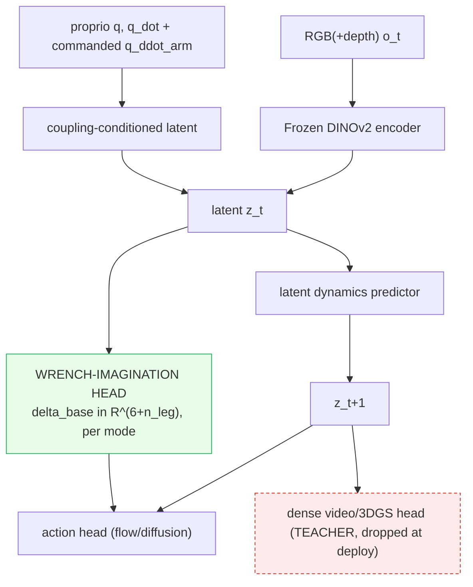

# Focus-Direction Research Plan: A Coupling-Aware World-Action Model (CoWAM)

## 1. Abstract

> [!abstract] The bet
> A World-Action Model whose latent **explicitly and anticipatorily predicts the self-induced reaction wrench** of whole-body motion, so a humanoid policy plans against a sensor-free coupling forecast instead of treating arm-to-leg and base-to-arm coupling as an implicit residual. Trained dense, deployed latent on a real G1/H1, grounded by differentiable system-ID, verified by a causal-consistency metric. Working name **CoWAM**. The bet: this one architectural term beats far larger data/compute on a fixed budget, with the gain concentrated where arm acceleration is largest. The thesis commits to **two** couplings, so the lift is measured first on **balance / disturbance** (the arm→leg test) and **mobile-manipulation** (the base↔arm anchor); the other eight evaluation axes are **generality / robustness checks**, not co-equal contributions. Companions: [[Focus-Direction]] (thesis), `Focus-Direction-Workflow.canvas` (the one-page talk diagram), [[Focus-Direction-Paper-Code-Index]] (papers to code). Full rigor (pre-registration, fairness commitments, instrumentation) lives in `Focus-Direction-Research-Plan-detailed.md`, which follows this same section structure.

## 2. Introduction and motivation

Whole-body humanoid control is conventionally **decoupled**: an arm/manipulation controller plus a balance/locomotion controller, with the coupling between them left implicit. But the generalized mass matrix is non-block-diagonal, so a fast arm reach **is** a base and leg balance disturbance, and discarding that cross-term is what makes whole-body policies brittle on aggressive motion. The cross-term is low-dimensional and structured, a quantity to **predict** (anticipatorily, from the commanded arm motion) rather than data to collect. This plan tests whether making that prediction explicit beats implicit-coupling and reactive-observer baselines on a fixed budget.

> [!warning] Three guardrails (settled, do not relitigate)
> 1. **[[2606.16542|ADAPT]] is reactive, not anticipatory** (a momentum disturbance-observer of *external* disturbance); the closest *anticipatory* neighbor is [[2201.03871|ALMA]] (MPC-predicted *external* wrench fed to a *separate* RL locomotion policy, a decoupled handoff). The surviving wedge is anticipatory feedforward of the *self-induced* cross-term as a learned WAM output in one coupled policy, so ADAPT is a **mandatory baseline** and ALMA the decoupled-anticipatory comparator.
> 2. **Honest headline:** the **41 to 62 figure is borrowed** ([[2604.07993|HEX]]-implicit beating part-wise stacks, *not* explicit-vs-implicit), so it is the field's proof-of-life, not this program's claim. The program's claim is two narrower wedges it actually tests: the **explicit-vs-implicit** wedge (concentrated at high arm-accel, surviving inertia error; Papers 1 and 2) and the **explicit-vs-reactive** wedge (anticipatory feedforward beats the reactive observer, isolated by the input-isolation control in ablation #1).
> 3. **Whitespace (re-verified against the actual graph, 2026-06-23):** in the large `graphify-out/graph.json` (30331 nodes), the genuine zeros are **"reaction wrench" as a compound (0) and "causal-consistency as a verification metric" (0)** (the two "causal consistency" hits are a reward term and an incidental word-match, neither a metric). Coupling and observer concepts clearly exist (74 coupling-substring nodes = 22 standalone coupling + 52 decoupling, plus **3 "disturbance-observer"-compound nodes** by exact-substring match, 2 of them [[2606.16542|ADAPT]]'s own and 1 [[2603.27313|MetaTune]]'s; the looser "disturbance"-and-"observer"-co-occurrence query returns **4**, the 4th being [[2509.18865|Bi-VLA]]'s "disturbance and reaction force observers", a four-channel bilateral-control observer, not the whole-body momentum disturbance-observer compound this plan compares against, so the compound count stays 3; decoupling outnumbers standalone-coupling ~2.4:1, 52 vs 22), and an anticipatory-wrench node now exists ([[2201.03871|ALMA]]'s "anticipatory predicted-wrench observations"). The whitespace is therefore the **specific framing**, no node for the *self-induced inertial cross-term as a learned world-model output in one coupled policy*, plus the two genuine zeros above.

## 3. Background and related work

The field defaults to **decoupling**: separate arm and balance controllers, with the coupling left implicit ([[2604.07993|HEX]]'s predictive MoE), emergent ([[2505.06776|FALCON]]'s shared observation), or one-directional ([[2509.21231|SEEC]], base-to-arm only); reactive observers ([[2606.16542|ADAPT]]) estimate disturbance after it manifests. The closest anticipatory neighbor is [[2201.03871|ALMA]], which feeds an MPC-predicted *external* wrench sequence as an anticipatory observation to a *separate* RL locomotion policy, so the distinction is sharp: ALMA is the very two-controller decoupled handoff CoWAM argues against, predicts the externally-exerted wrench (not the self-induced inertial cross-term $M_{\text{base,arm}}\ddot q_{\text{arm}}$), is not a world-action model, and has no $\varepsilon$-curve, no robot-self sysID grounding, and no causal-consistency metric. World-action models imagine *scene* futures ([[2411.04983|DINO-WM]], [[2504.02792|UWM]], [[2603.14482|V-JEPA 2.1]]); differentiable system-ID recovers *object* physics ([[2603.01151|D-REX]], [[2104.02646|gradSim]]). No prior work makes the self-induced arm-to-leg cross-term an **explicit, anticipatory world-model output** carried in a single coupled policy, nor binds **predicted-to-realized coupling** as a metric. Full literature map: [[Whole-Body]], [[WAM]], [[Sim2Real]], [[Embodied-AI]], and the detailed plan.

## 4. Aims and hypotheses

**Aims:** (1) arm-to-leg explicit anticipatory coupling [lead]; (2) base-to-arm autoregressive coupling (base-to-torso-to-arm factoring); (3) carry the coupling on a train-dense / deploy-latent WAM (sensor-free at deploy); (4) ground $M_{\text{base,arm}}$ from real interaction by differentiable system-ID (Seam 2); (5) verify predicted-vs-realized coupling with a causal-consistency metric (Seam 3).

**Falsifiable hypotheses** (tested in the Evaluation plan):
- **H1 (the wedge):** explicit-feedforward beats implicit (MoE) and reactive (observer), with the margin **concentrated at high arm acceleration** and **surviving inertia-model error** (the $\varepsilon$-curve).
- **H2 (plug-in lift):** the coupling lift is positive across **every WAM backbone** (the backbone grid), so it is a module, not a backbone artifact.
- **H3 (gradient):** the lift is largest where the native latent is least control-relevant.
- **H4 (identifiability):** $M_{\text{base,arm}}$ is recoverable from a few real reaches within the pre-registered tolerance.

## 5. Approach

### Problem
The generalized mass matrix is non-block-diagonal, so an arm acceleration is a base/leg balance disturbance:
$$ \delta_{\text{base}} \;=\; M_{\text{base,arm}}(q)\,\ddot q_{\text{arm}} $$
Predict $\delta_{\text{base}}$ **anticipatorily** from the *commanded* $\ddot q_{\text{arm}}$ (before it perturbs the base). The wedge is on timescales: the reaction rises over ~20 to 60 ms while a momentum observer lags ~6 ms plus one policy step, so anticipation only wins where the rise-time is long enough (pre-registered $\ge$ 31 ms, PR-0a). In MuJoCo the exact target is `mj_fullM`, reachable through `humanoid-bench`'s `MjDataWrapper.__getattr__` passthrough (`env.data.qM` works directly); but `humanoid-bench` ships **zero** existing `mj_fullM`/`qM` usage, so authoring and confirming the dense-densify-then-slice extraction on the **H1 and G1 models is a new Phase-0 task (to-be-confirmed at M0)**, not a ready dependency. For the falsifier the target comes from a *perturbed* $\tilde M$.

### Architecture

The coupling head is a plug-in on any WAM backbone (the backbone grid proves the lift is the term, not the backbone). Four added modules:
- **Coupling-conditioned latent:** carries proprioception + commanded $\ddot q_{\text{arm}}$, not just scene appearance. So the latent cannot ignore the acceleration input and collapse the wrench head to a proprioception-only regressor, an explicit conditioning auxiliary loss $\mathcal L_{\text{cond}}$ supervises the latent to *reconstruct* proprioception + commanded $\ddot q_{\text{arm}}$ from $z_t$ (Seam 1's learning mechanism); ablation #3 measures wrench-head error with this conditioning on vs off.
- **Wrench-imagination head:** predicts $\delta_{\text{base}}$ ($6+n_{\text{leg}}$ per contact mode) + a mode classifier. Contact modes are discrete (sliding vs sticking, $n_{\text{modes}}=2$), labeled from simulator contact state in sim and from tactile/contact-force thresholding ([[2606.13877|ContactWorld]] modality) on hardware.
- **Autoregressive action head:** base-to-torso-to-arm factoring (the base-arm anchor). Verified fork bases: `brs-algo` (WB-VIMA, `whole_body_decoding_order`) and [[2507.01961|AC-DiT]].
- **Dense teacher head** (video/3DGS): train only, dropped at deploy.

### The falsifier (the decisive experiment)
A three-way ablation on the lean `humanoid-bench` PPO substrate, same data/seeds/backbone, **stratified by arm-acceleration quartile**:
- **explicit-feedforward (ours)** vs **implicit ([[2604.07993|HEX]]-MoE)** vs **reactive observer ([[2606.16542|ADAPT]])**.
- **Input-isolation control (decisive):** identical head, swap *only* the input, planned $\ddot q_{\text{arm}}$ (anticipatory) vs the observer's measured estimate (reactive); attributes any win to feedforward timing, not capacity.

**De-circularization (the headline $\varepsilon$-curve).** Supervise the explicit head on $\delta^{\star}_{\text{base}}$ from a *perturbed* $\tilde M$ (each link's mass/inertia scaled by $1\pm\varepsilon$), while the implicit baseline and the observer run on the true dynamics with no privileged target. If the explicit head still wins under a deliberately wrong model, the win is the inductive bias, not label leakage. Report the margin **as a function of $\varepsilon$** with bootstrap CIs. **Void unless** the margin is significantly $>0$ at small $\varepsilon$ ($\{0,0.05\}$) **and** degrades gracefully. Implementation is specified as Phase-0 steps (coding later). Fairness (pre-registered): implicit = matched-capacity MoE on identical data/seeds; reactive = ADAPT observer at the 500 Hz state-poll on true dynamics.

### Method
- **Train dense / deploy latent.** Learn from a dense video/3DGS teacher, act on the latent + wrench head (teacher head off at deploy). Plan by minimizing latent-goal distance + a wrench-feasibility term.
- **Grounding (Seam 2).** Re-point a differentiable system-ID loop at the robot's *own* inertia to recover $M_{\text{base,arm}}$ from a few real reaches; transfer with narrow-range randomization. Fork [[2603.01151|D-REX]] (`reduce_point_mass_properties`, verified) or [[2104.02646|gradSim]] (`ArticulationBuilder.add_link`, verified). Robot-self inertia is *harder* than the external-object recovery these tools were built for (never excited in isolation, entangled with leg dynamics), so the 15% tolerance is not assumed to transfer: **PR-0b prices it** by planting the robot's own $M_{\text{base,arm}}$ synthetically and checking recovery under whole-body excitation before any real-robot time.
- **Real-time.** Clear the $\ge$ 30 Hz contact-stability floor while holding SR via async decoupling + W4A8 quantization; $\delta_{\text{base}}$ consumed at the 30 to 50 Hz policy rate (analytic term at WBC rate as fallback).
- **Verify (Seam 3).** Bind predicted to *realized* coupling: extend ASR / COD to compare $\hat\delta_{\text{base}}$ against the measured base reaction on hardware (force plate default). Fork [[2605.21800|stable-worldmodel]]. A metric gap is **decomposed three ways, not blamed on the model by default**: log the analytic $\hat M_{\text{base,arm}}\ddot q_{\text{arm}}$ alongside the learned forecast and the measurement, so head-vs-analytic isolates prediction error, analytic-vs-measured isolates sysID error, and the PR-0a-modality $\sigma_{\text{obs}}$ band bounds the measurement floor.
- **Hardware + continual.** Unitree H1 (tactile) for the grounded story, G1 for deploy; forgetting-free continual via subspace protection ([[2605.06175|VLA-GSE]]).

## 6. Evaluation plan

### Benchmarks
Balance / disturbance rejection is the **headline humanoid axis**: it directly measures the reaction the coupling head predicts. The lift must reproduce across all axes, not one task family.

**A. Humanoid whole-body (the core):**

| Axis | Primary (metric) | Secondary / diversity |
|---|---|---|
| Whole-body loco-manip | [[2403.10506\|HumanoidBench]] (per-task SR; balance recovery by arm-accel quartile) | [[2603.20147\|AGILE]]; [[2606.17833\|HumanoidArena]]; [[2503.05652\|BRS]]; [[2506.09366\|SkillBlender]] |
| **Balance / disturbance (headline)** | [[2308.14636\|Disturbance-Rejection]] (recovery rate, max impulse, CoM deviation) | [[2404.19173\|Robust Stand/Walk]]; [[2602.13656\|fall-resilient]]; [[2506.15132\|Booster Gym]]; [[2508.19926\|FARM]] |
| Mobile-manip (base-arm) | [[2602.05233\|MobileManiBench]] / [[2412.13211\|MS-HAB]] | [[2407.07788\|BiGym]]; [[2606.18239\|EBench]]; [[2512.24653\|RoboMIND 2.0]] |
| Contact / tactile (the wrench) | [[2606.13877\|ContactWorld]] | [[2505.18472\|ManiFeel]]; [[2510.25725\|Humanoid Visual-Tactile-Action]] |
| Long-horizon / memory | [[2603.01229\|RMBench]] | [[2603.04639\|RoboMME]]; [[2605.10921\|RoboMemArena]]; [[2506.06677\|RoboCerebra]] |

**B. WAM competence (the backbone grid):** [[2306.03310|LIBERO]] (in-dist), [[2510.13626|LIBERO-Plus]] (OOD); [[2506.18088|RoboTwin 2.0]], [[2406.02523|RoboCasa]].

**C. Deployment + verification:** real H1/G1 + [[2506.18123|RoboArena]], [[2510.17950|RoboChallenge]], [[2602.01515|RAPT]] (sim2real); causal-consistency on [[2605.21800|stable-worldmodel]] / [[2606.18610|SC3-Eval]] harnesses + hardware.

**Backbone grid (Paper 2 centerpiece):** {PPO floor, [[2411.04983|DINO-WM]], [[2504.02792|UWM]], [[2603.22078|Cosmos-Policy]], [[2603.14482|V-JEPA 2.1]]} x {coupling off / on}. The within-backbone paired off/on isolates the lift; the grid shows it generalizes (a robustness check, not the attribution).

### Ablations
1. **Coupling ablation** (the three-way falsifier), by arm-accel quartile.
2. **The $\varepsilon$-curve** (de-circularization), the headline.
3. **Components:** wrench head on/off, coupling-conditioning ($\mathcal L_{\text{cond}}$) on/off (validates the latent carries the control-relevant acceleration signal, not just appearance).
4. **Sim-to-real:** calibrated $\hat M_{\text{base,arm}}$ vs broad domain randomization on OOD payload.
5. **Deploy:** SR-vs-Hz Pareto with jerk-L2.

### Pre-registered success criteria
- $\delta_{1A}$ = **5 pp** (Phase 1A margin, BH-adjusted $p<0.05$, above the ~2 to 3 pp seed-noise floor).
- PR-0a = **31 ms** rise-time; PR-0a' = $\ge$ **30%** dominance; PR-0b / PR-2 = $\le$ **15% Frobenius**.
- PR-1B = autoregressive beats flat by $\ge$ **5 pp** ($p<0.05$) on the reach-extension subset (MS-HAB targets outside the standing arm-workspace) AND near-zero ($\lvert\Delta\text{SR}\rvert<$ 2 pp) on fixed-base reaches AND a significant positive margin trend ($p<0.05$, Jonckheere-Terpstra / one-sided paired bootstrap); split frozen at M0 by goal-offset vs arm-reach radius.
- PR-3 = **sensor-free** wrench-head MSE $\le$ **2x** the **sim-only-error baseline** (same head/weights, force-tactile channel removed at inference vs available) on the **held-out [[2606.13877|ContactWorld]] contact-rich split** (exactly **4 of 12 tasks**, held out by task identity, frozen at M0; MSE per-DoF z-scored, per-timestep mean, macro-averaged across the 4 tasks).
- PR-4 = predicted-vs-realized coupling **$R^2 \ge$ 0.70** on the held-out **hardware** test set ($\hat\delta_{\text{base}}$ vs measured, $\ge$ 50 episodes, paired-bootstrap 95% CI excludes zero, head-vs-analytic error $\le$ analytic-vs-measured error). PR-4-continual = after LIBERO-lifelong, **NBT $\ge -2$ pp** AND post-update top-quartile coupling lift $\ge$ **5 pp** ($p<0.05$).
- $\varepsilon$-curve void gate: margin significant $>0$ at $\varepsilon\in\{0,0.05\}$ (BH FDR $q<0.05$) **and** non-increasing (Spearman $\rho\le 0$); $\lambda_w$ frozen once on the $\varepsilon{=}0.1$ slice.
- Falsifier provenance: matched-capacity MoE (params $\pm$2%, FLOPs $\pm$5%); ADAPT observer at 500 Hz; quartiles by peak commanded $\|\ddot q_{\text{arm}}\|$ with global frozen cut-points.

## 7. Timeline, staging, and gates

| Milestone | Window | Deliverable | Gate (pre-registered) |
|---|---|---|---|
| **0 de-risk** | M0 | two wedge-killer experiments (below); $\varepsilon$-protocol frozen | inputs settled |
| **1A arm-leg falsifier** (lead) | M0-6 | three-way ablation on `humanoid-bench` + the $\varepsilon$-curve | margin $\ge$ **5 pp** ($p<0.05$) AND top-quartile concentration AND anticipatory beats reactive |
| **1B base-arm falsifier** (companion) | M0-6 | `brs-algo` autoregressive vs flat on `mshab` | autoregressive beats flat by $\ge$ **5 pp** ($p<0.05$) on reach-extension sub-tasks (MS-HAB targets outside the standing arm-workspace) AND near-zero margin ($\lvert\Delta\text{SR}\rvert<$ 2 pp) on fixed-base reaches AND a significant positive margin trend between them ($p<0.05$) |
| **2 ground** | M6-12 | differentiable sysID of $M_{\text{base,arm}}$ on the real robot | recovered $M$ within **15% Frobenius** AND beats broad-DR on OOD mass AND real-SR retention $\ge$ 80% |
| **3 CoWAM** | M9-15 | wrench-imagination head, sensor-free forecast | sensor-free wrench MSE $\le$ **2x** the sim-only-error baseline on the held-out [[2606.13877\|ContactWorld]] contact-rich split (4 of 12 tasks, frozen at M0) (PR-3) |
| **4 verify + continual** | M0-18 | causal-consistency metric (new, on existing harnesses) + hardware | **PR-4**: predicted-vs-realized coupling $R^2 \ge$ **0.70** on the held-out hardware set (paired-bootstrap 95% CI excludes zero) AND **PR-4-continual**: post-update coupling lift retained (NBT $\ge -2$ pp AND top-quartile lift $\ge$ **5 pp** at $p<0.05$) |

**Phase 0 de-risk (two wedge-killers, in sim, both at M0 before any Phase 1A training):** **(a)** observer-latency vs reaction rise-time against analytic `mj_fullM` truth, PR-0a: wedge viable only if rise-time $\ge$ 31 ms at top-quartile accel (else drop the anticipatory framing); same experiment checks $\delta_{\text{base}}$ dominates the other residuals by $\ge$ 30%. **(b)** inertia identifiability: recover a planted $\tilde M$ with the D-REX/gradSim loop, PR-0b $\le$ 15% Frobenius (else drop Seam 2, use the analytic term + broad DR).

**Phase-0 branch table (PR-0-branch, frozen at M0 so the go/no-go is auditable *before* Phase 1A).** The two gates are independent; their four outcomes pre-commit the scope, no post-hoc reinterpretation (full table in the detailed plan):

| de-risk (a) | de-risk (b) | Scope that ships |
|---|---|---|
| pass | pass | full program: anticipatory + sysID-grounded CoWAM |
| pass | fail | anticipatory claim, but drop Seam 2 (analytic $M_{\text{base,arm}}$ term + broad DR) |
| fail | pass | drop anticipatory framing, keep the grounded explicit-vs-implicit term |
| fail | fail | de-circularized $\varepsilon$-curve Paper 1 only, no real-deploy flagship |

**Phase 1A go/no-go.** If explicit $\approx$ implicit (no margin, no top-quartile concentration, no anticipatory-vs-reactive gap), the contribution is void. Every branch above still yields a paper.

## 8. Expected contributions and outcomes

| Closest prior art | What it has | What CoWAM adds |
|---|---|---|
| [[2606.16542\|ADAPT]] | reactive momentum **observer** of *external* disturbance | **anticipatory** prediction of *self-induced* coupling, before it manifests |
| [[2201.03871\|ALMA]] | MPC-predicted *external* wrench fed as an anticipatory observation to a *separate* RL locomotion policy (decoupled two-controller handoff) | the *self-induced inertial cross-term* as a **learned WAM output in one coupled policy**, de-circularized ($\varepsilon$-curve), sysID-grounded, causal-verified |
| [[2604.07993\|HEX]] | *implicit* arm-leg coupling via predictive MoE | explicit, supervised, imagined term; beats implicit on the $\varepsilon$-curve at high accel |
| [[2504.02792\|UWM]] | drop-head dense-train/latent-deploy WAM | the head is a **physics coupling wrench**, sysID-grounded, causal-verified |
| [[2603.14482\|V-JEPA 2.1]] | control-relevant predictive latent | latent conditioned on $\ddot q_{\text{arm}}$ and supervised by $\delta_{\text{base}}$ |

**The three seams (the program's cross-cluster contribution):**

| Seam | Today (unwired) | The wiring (contribution) | Phase |
|---|---|---|---|
| **1 represent to predict** | WAM latent = scene features | condition the latent on proprio + $\ddot q_{\text{arm}}$; supervise the wrench head with analytic $\delta_{\text{base}}$ | 3 |
| **2 predict to ground** | sysID recovers *object* physics | re-point per-link sysID at the robot's own $M_{\text{base,arm}}$ | 2 |
| **3 deploy to verify** | verify metric checks imagination | bind $\hat\delta_{\text{base}}$ to the *measured* base reaction on hardware | 4 |

**Publication:** Paper 1 (CoRL/RSS, ~M0-9) = the falsifier + $\varepsilon$-curve + the consistency metric on the lean substrate (no WAM needed); Paper 2 (RSS/CoRL, ~M9-18) = CoWAM, the backbone-grid centerpiece, deployed and verified.

## 9. Risks and mitigation

- **Explicit $\approx$ implicit:** the three-way ablation + $\varepsilon$-sweep is still the definitive result.
- **Wrong / unidentifiable inertia:** gate Phase 2 on PR-0b; fall back to the analytic term + broad DR (Seam 2 dropped).
- **Hardware-dominant physics:** instrument the residual budget first (PR-0a'); scope down if $\delta_{\text{base}}$ is dominated.
- **WAM too slow for contact:** async decoupling + quantization clear the 30 Hz floor; report the SR-vs-Hz Pareto honestly.

## 10. Resources and references

- **Fork targets:** `humanoid-bench` + `HEX` (falsifier); `brs-algo` + `AC-DiT` (base-arm; `InCoM` is **not cloned**, reference comparator only); `D-rex` / `gradsim` (grounding); `dino_wm` / `unified-world-model` / `vjepa2` (CoWAM); `stable-worldmodel` / `VLA-GSE` (verify + continual).
- [[Focus-Direction]] (thesis), [[Focus-Direction-Paper-Code-Index]] (papers to code), [[Focus-Direction-Review]] (the adversarial review absorbed here), `Focus-Direction-Research-Plan-detailed.md` (the full-rigor version).
- Source clusters: [[WAM]] (predict), [[Sim2Real]] (ground), [[Embodied-AI]] (verify), [[Whole-Body]] (the two anchors).
