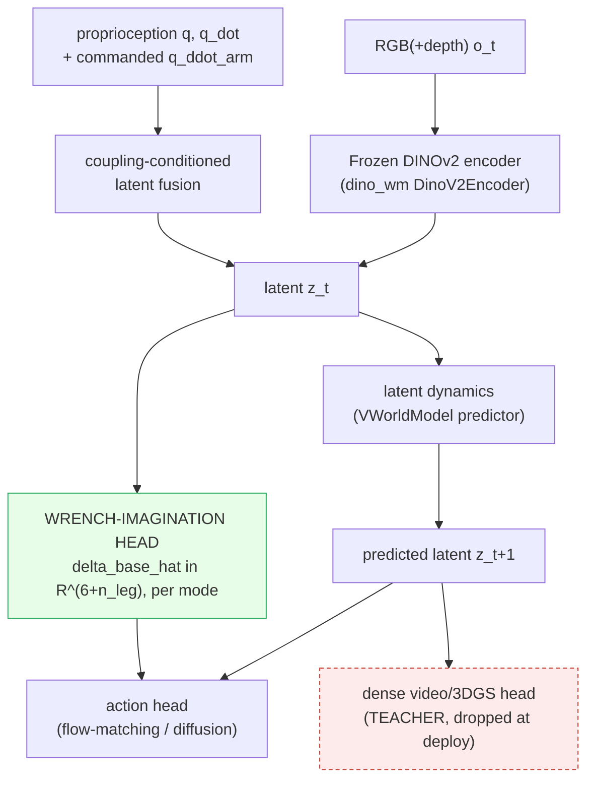
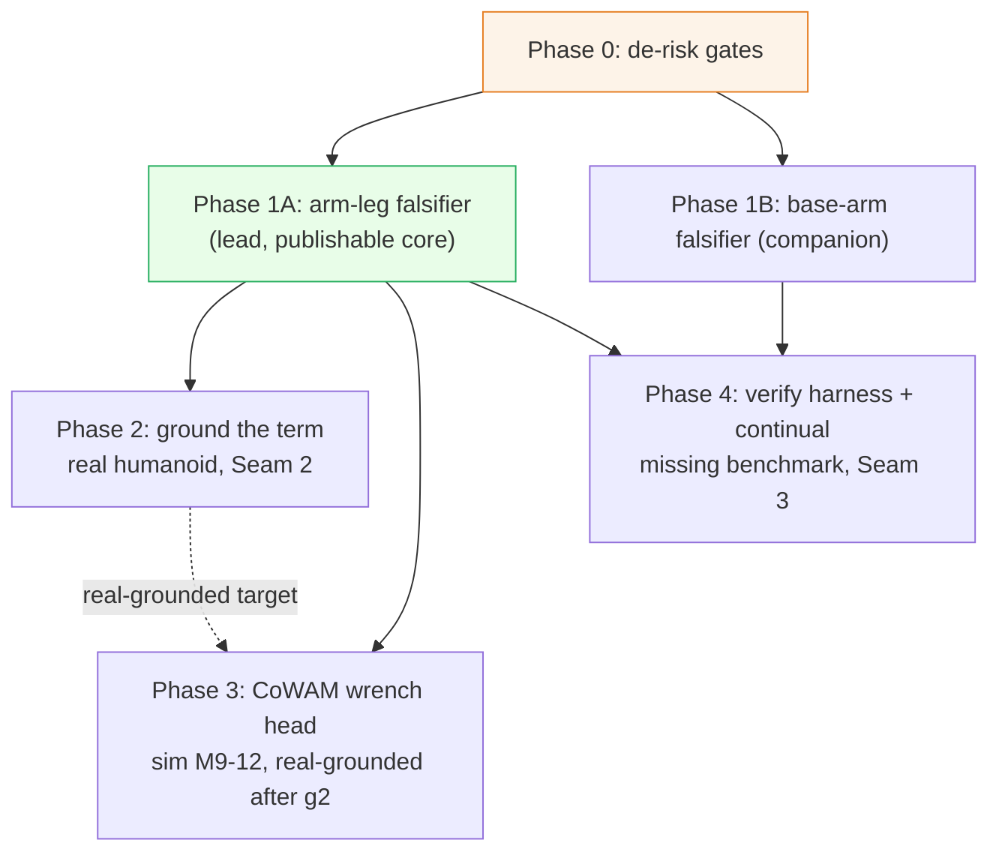
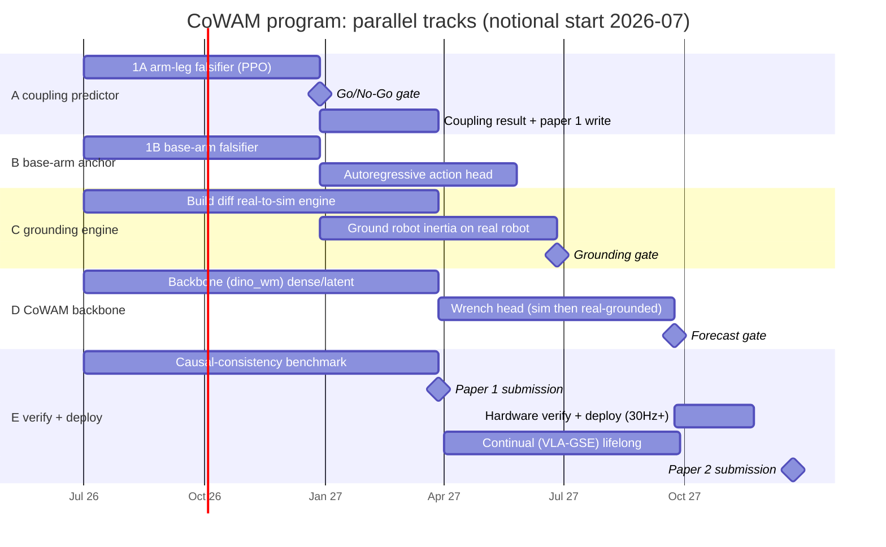

# Focus-Direction Research Plan: A Coupling-Aware World-Action Model (CoWAM)

> [!abstract] The contribution and the program in one paragraph
> We target a conference contribution: a **World-Action Model whose latent explicitly imagines the self-induced reaction wrench of whole-body motion**, so a humanoid policy plans against a sensor-free *coupling forecast* instead of treating arm to leg and base to arm coupling as an implicit residual. The model is **trained dense, deployed latent** (real-time on a G1/H1 humanoid), **grounded** by differentiable system-ID so the imagined physics is real, and **verified** by a causal-consistency metric that binds predicted coupling to measured coupling. Working name **CoWAM**. This document is both the paper methodology (**Part I**) and the staged program that produces it (**Part II**), reducing [[Focus-Direction]]'s five clusters to one executable bet. Scope (per project decisions): the **full five-cluster program, staged** so the de-risked core leads and the three cross-cluster seams are the named research contribution; a **real humanoid is available** (grounding is near-term); a **well-resourced lab** (the four co-solvable builds run in parallel, both anchors get falsifiers). Companions: [[Focus-Direction]] (thesis), [[Focus-Direction-Paper-Code-Index]] (papers to code), [[Focus-Direction-Review]] (the adversarial review absorbed here).

> [!tip] The four breakthrough modifications (what makes it a paper)
> 1. **Reaction-wrench imagination head**: the WAM predicts the coupling term $\delta_{\text{base}}=M_{\text{base,arm}}\,\ddot q_{\text{arm}}$ as a modeled *output*, not a policy input. ([[WAM|WAM·A2]])
> 2. **Coupling-conditioned latent**: the latent carries dynamics state (proprioception + commanded arm acceleration), not just scene appearance. ([[WAM|WAM·A3]], Seam 1)
> 3. **Differentiable-sysID grounding**: the coupling inertia is measured from real interaction, not read off a URDF. ([[Sim2Real|S2R·B2]], Seam 2)
> 4. **Causal-consistency verification (ships as the benchmark)**: predicted coupling is checked against realized coupling. ([[Embodied-AI|EAI·B1]], Seam 3)
>
> (Mechanisms are defined once in the [[#The three seams = the full-program contribution|three-seams table]], not restated here.)

> [!warning] Three settled findings, do not relitigate
> 1. **[[2606.16542|ADAPT]] is reactive, not anticipatory.** It is a momentum-based analytical *disturbance observer* that estimates whole-body residual wrench online from measured state and feeds it as a PPO observation; it estimates *external* disturbances after they manifest. The surviving wedge is ==anticipatory feedforward prediction of the self-induced cross-term, before it perturbs the base==. ADAPT is absent from the [[Focus-Direction-Paper-Code-Index|Paper-Code-Index]]'s 533 cited papers yet is the closest prior art. It becomes a **mandatory baseline**.
> 2. **The 41% to 62% headline is borrowed** ([[2604.07993|HEX]]-implicit beating part-wise stacks, not explicit-vs-implicit). The honest claim is the explicit-vs-implicit wedge, concentrated where arm acceleration is largest, surviving inertia-model error, and beating ADAPT's reactive observer on fast self-reaches.
> 3. **The Graphify concept graph has no node** for "reaction wrench" or "disturbance observer" (the anticipatory-coupling wedge), nor for "causal consistency" (the missing benchmark) (`data/papers/graphify-out/graph.json`, 1826 nodes), while *decoupling* concepts dominate. Direct corroboration that both whitespaces, the anticipatory coupling wedge and the causal-consistency benchmark, are genuinely open.

---

## 0. Scope and publication plan

> [!abstract] One paper vs the program
> The program yields more than one paper. Sequenced so the cheap, de-risked result lands first and the flagship follows.

- **Paper 1 (de-risked core, target CoRL/RSS, ~M0–9): "Does explicit coupling pay?"** The three-way falsifier (explicit-feedforward vs implicit vs ADAPT-observer) + the $\varepsilon$-curve + the coupling-consistency benchmark, on the lean `humanoid-bench` PPO substrate. Does **not** need a WAM: the head here is an MLP on proprioception + commanded $\ddot q_{\text{arm}}$ (no latent), so Paper 1 tests modification 1 (explicit anticipatory prediction); the latent-conditioned head (modification 2) is first exercised in Paper 2. Ships the benchmark (high citation value) and the go/no-go evidence.
- **Paper 2 (flagship, target RSS/CoRL, ~M9–18): "CoWAM."** The coupling-aware World-Action Model: wrench-imagination head, sysID-grounded, deployed real-time on the real humanoid, verified by the WAM causal-consistency metric. Reuses Paper 1's falsifier as the headline ablation, now inside the WAM. Its centerpiece is the **backbone-agnostic coupling grid** (§8): the wrench head lifts every WAM family, so the contribution is the coupling term, not the backbone.
- **Optional Paper 3 / second anchor: base↔arm.** The autoregressive base→torso→arm policy at mobile-manipulation scale (the Phase 1B falsifier). In CoWAM it is the action head's factoring (below), so it can be standalone or folded into Paper 2.

> [!tip] How the two couplings live in ONE model (CoWAM)
> - **arm↔leg (inertial)** = the **wrench-imagination head** on the *prediction* side (§2, the wrench-imagination head).
> - **base↔arm (kinematic/workspace)** = the **action head's autoregressive base→torso→arm factoring** on the *action* side (§2, the autoregressive action head; fork `brs-algo` `brs_algo/learning/policy/wbvima_policy.py` `whole_body_decoding_order=["mobile_base","torso","arms"]`).
> One architecture, both anchors: predict the inertial cross-term, factor the kinematic one.

**Falsifier-to-CoWAM bridge.** Phase 1A runs the three-way ablation on the lean PPO substrate (cheap go/no-go, M0–6); the same ablation is then reproduced inside CoWAM as the headline experiment (Paper 2). "Same data" for the RL substrate means same environment, task set, seeds, and env-step budget; for CoWAM it means the same demonstration/rollout corpus and backbone with only the head toggled.

---

# Part I: The contribution (paper methodology)

## 1. Problem formulation

A part-wise whole-body policy discards a term the physics has. The generalized mass matrix $M(q)$ is non-block-diagonal, so an arm acceleration is a base/leg balance disturbance:

$$
M(q)\,\ddot q + C(q,\dot q)\,\dot q + g(q) = \tau + J^\top f_{\text{ext}}, \qquad
\delta_{\text{base}} \;=\; M_{\text{base,arm}}(q)\,\ddot q_{\text{arm}}
$$

$\delta_{\text{base}}$ is **low-dimensional and structured**: a 6-vector wrench (or per-contact-mode set) determined by the commanded arm acceleration and a block of $M(q)$. The thesis: predict it rather than collect data for it, and predict it *anticipatorily* (from commanded $\ddot q_{\text{arm}}$, before it perturbs the base) to beat both an implicit mixture and a reactive observer, with the gain concentrated where $\ddot q_{\text{arm}}$ is largest.

> [!info] Precise definition (pin this down before coding)
> - **$\ddot q_{\text{arm}}$** is the *planned/commanded* arm acceleration, read from the action chunk the policy is about to execute. Using the *planned* (not measured) acceleration is what makes the prediction **anticipatory** (available before the reaction occurs), the wedge over [[2606.16542|ADAPT]]'s reactive observer. The wedge is falsifiable on timescales: the arm→base reaction rises over the arm-acceleration ramp (~1 to a few 50 Hz policy steps, ~20 to 60 ms at top-quartile $\ddot q_{\text{arm}}$), while a momentum observer lags ~one state step plus filter delay (~2 to 20 ms at the 500 Hz state polling of §6). Anticipation buys a margin **iff** (reaction rise-time + actuation delay) < (observer lag + one policy-step delay); if the observer's next-step estimate already lands inside the policy step, A1 has no delta.
> - **$M_{\text{base,arm}}(q)$** is the off-diagonal block of the generalized mass matrix coupling arm DoF to the floating-base + leg DoF. In MuJoCo, the full $M(q)$ is `mjData.qM` (dense via `mj_fullM`); slice base/leg rows by arm columns. The target $\delta_{\text{base}}^{\star}$ for the auxiliary loss comes from a **perturbed** $\tilde M$ (§3 de-circularization).
> - **$\delta_{\text{base}}$** is the resulting generalized reaction on the base + leg DoF: the 6-DoF floating-base wrench plus the leg-joint torques, so dim $= 6 + n_{\text{leg}}$ (H1: 6+10=16; G1: 6+12=18), predicted per contact mode ($n_{\text{modes}}=2$, sliding vs sticking). **Contact-mode labels**: from the simulator contact state in sim; from tactile/contact-force estimation ([[2606.13877|ContactWorld]] modalities) on hardware.

Why a **world-action model** (not just an MLP): the target $\delta_{\text{base}}=M_{\text{base,arm}}(q)\,\ddot q_{\text{arm}}$ is an instantaneous analytic function of the current state and the commanded arm acceleration, both known at step $t$, so it is *not* a quantity that must be rolled forward. The WAM earns its place for three other reasons the bare term does not: sensor-free deploy via train-dense/latent-deploy (§4), planning against the latent-goal + wrench-feasibility objective (§4), and a latent that carries the grounded $M_{\text{base,arm}}$ (Seam 2). The wrench head reads the *current* coupling-conditioned latent; a genuine forecast variant predicts $\delta_{\text{base}}$ along the action-chunk horizon by integrating the commanded accelerations, not from predicted pixels. Two humanoid instances: arm to leg ($\delta_{\text{base}}$ from arm reaches) and base to arm (base velocity as a manipulation DoF); the lead experiment is arm to leg because its falsifier is the cheapest sharp go/no-go.

## 2. Architecture

**Backbone: the coupling head is a plug-in, shown across a WAM grid (not tied to one backbone).** The two coupling modules (wrench-imagination head + coupling-conditioned latent) bolt onto any WAM; §8 proves the lift holds across families rather than committing to one backbone. Roles in the grid:
- **`dino_wm`** ([[2411.04983|DINO-WM]]): the lean WAM grid point + MPC-planning substrate (first Paper 2 backbone; Paper 1's falsifier runs on the state-based PPO floor, not a WAM). Frozen DINOv2 (`models/dino.py :: DinoV2Encoder`), latent dynamics (`models/visual_world_model.py :: VWorldModel`); the `train_decoder` gate already gives the train-dense/deploy-latent split, so the wrench head is a marginal add.
- **UWM** ([[2504.02792|UWM]]): the deployed action-output CoWAM (Paper 2). Its unified video+action diffusion already has an action head where the wrench conditioning attaches (`sample_marginal_action()` is the fast deploy path).
- **Cosmos** ([[2501.03575|Cosmos]]): the dense teacher + internet-scale video prior (train-time), distilled into the latent student; Cosmos-Policy is also a SOTA-WAM baseline ([[2603.22078|Cosmos-Policy study]]).
- **V-JEPA2** ([[2603.14482|V-JEPA 2.1]]): a pure predictive-latent fourth axis. ([[2412.14803|VPP]] is a further frozen-video alternative.)

**The four added modules.**

| Module | Inputs | Output | Where it plugs in |
|---|---|---|---|
| **Coupling-conditioned fusion** | $z_t$, proprio $q,\dot q$, commanded $\ddot q_{\text{arm}}$ | conditioned latent $z_t$ | `VWorldModel.separate_emb()` / latent assembly |
| **Wrench-imagination head** | coupling-conditioned latent $z_t$ (pooled); horizon variant integrates commanded $\ddot q_{\text{arm}}$ | $\hat\delta_{\text{base}}\in\mathbb R^{6+n_{\text{leg}}}$ per mode + mode logits | off the conditioned latent in `VWorldModel.forward()`; `Linear->ReLU->Linear->(6+n_leg)` per mode + mode classifier |
| **Action head (autoregressive)** | $z_{t+1}$ and $\hat\delta_{\text{base}}$ | action chunk $a_{t:t+H}$, factored base→torso→arm | flow-matching/diffusion head; the base→torso→arm factoring (fork `brs-algo` `whole_body_decoding_order`) **is** the base↔arm coupling, unifying both anchors in one model |
| **Dense teacher head** (video/3DGS) | $z_{t+1}$ | dense future obs | training only, dropped at deploy (`train_decoder` gate) |

Contacts are discrete (sliding vs sticking), so the head emits a continuous $(6+n_{\text{leg}})$-vector per mode **plus** a contact-mode classifier ($n_{\text{modes}}=2$), with Huber on the selected mode's slice (the [[2606.13877|ContactWorld]] lesson: contact-rich latents need explicit structure).

## 3. Training objectives

$$
\mathcal L = \underbrace{\lambda_z\,\|z_{t+1}-\hat z_{t+1}\|^2}_{\text{latent dynamics}}
+ \underbrace{\lambda_d\,(\mathcal L_{\text{recon}}+0.25\,\mathcal L_{\text{vq}})}_{\text{dense teacher (train only)}}
+ \underbrace{\lambda_a\,\mathcal L_{\text{action}}}_{\text{flow/diffusion}}
+ \underbrace{\lambda_w\,\mathcal L_{\text{wrench}}}_{\text{coupling}}
+ \underbrace{\lambda_c\,\mathcal L_{\text{consistency}}}_{\text{causal}}
$$

- $\mathcal L_{\text{latent}}$: MSE on predicted vs target latent (DINO-WM `emb_criterion`, the `z_loss`).
- $\mathcal L_{\text{dense}}$: reconstruction + VQ on the teacher head (DINO-WM `decoder_latent_loss_weight=0.25`); **train only**, dropped at deploy.
- $\mathcal L_{\text{action}}$: flow-matching/diffusion action loss (UWM `action_loss`, VPP `GCDenoiser`).
- $\mathcal L_{\text{wrench}}$ (new): Huber on $\hat\delta_{\text{base}}-\delta_{\text{base}}^{\star}$ + cross-entropy on contact mode. Target $\delta_{\text{base}}^{\star}$ from MuJoCo `mj_fullM` in sim, from sysID-recovered $\hat M_{\text{base,arm}}$ (Section 6) for real data.
- $\mathcal L_{\text{consistency}}$ (new): forward-inverse / counterfactual consistency (Section 7).

> [!warning] De-circularize the wrench target (the single most important fix)
> Do **not** define $\delta_{\text{base}}^{\star}$ from the same inertia model the policy uses, or an explicit win is trivially recoverable and will not transfer. Define it from a **perturbed** $\tilde M(q)$ with controlled error $\varepsilon$, and report the explicit-vs-implicit gap **as a function of $\varepsilon$**. That curve is both the headline and the verify harness. (From [[Focus-Direction-Review]].)

Sweep: $\lambda_z{=}1.0,\ \lambda_d{=}0.25,\ \lambda_a{=}1.0,\ \lambda_w{\in}\{0.05,0.1,0.3\},\ \lambda_c{\in}\{0.0,0.1\}$.

## 4. Dense-train / latent-deploy

Train density and deploy density are independent: learn from a dense video/3DGS teacher, act on the latent + wrench head. At deploy, load with the teacher head off (`train_decoder=False`); the wrench head stays active as a latent read-off feeding the action head. Planning minimizes latent-goal distance plus a wrench-feasibility term:

$$
a^\star=\arg\min_a \;\|z_{\text{goal}}-\hat z_{t+1}(a)\|^2 \;+\; \beta\,\|\hat\delta_{\text{base}}(a)\|_{\text{balance}}
$$

Keep deploy latency under 2x pure-latent and clear the contact-stability floor (Section 6).

## 5. Data pipeline

| Source | Use | Notes |
|---|---|---|
| Sim rollouts ([[2403.10506\|HumanoidBench]] MuJoCo) | latent + wrench targets | `mj_fullM` gives exact $\delta_{\text{base}}$ and the perturbed $\tilde M$ for the $\varepsilon$-sweep |
| Action-free video (human + web) + [[2501.03575\|Cosmos]] prior | latent pretraining + dense teacher | recovers OOD breadth at low teleop cost; Cosmos supplies the internet-scale video prior distilled into the latent student |
| Contact-rich teleop ([[2606.13877\|ContactWorld]], [[2505.18472\|ManiFeel]], `sparsh`) | wrench-head supervision with real force/tactile | force/tactile shapes the latent at train, sensor-free at deploy |
| Humanoid corpora ([[2510.08807\|Humanoid Everyday]], [[2510.26236\|PHUMA]], [[2509.00576\|Galaxea G0]], [[2508.19926\|FARM]], [[2412.17730\|Mimicking-Bench]]) | whole-body pretraining + high-dynamic motion | real-world + physics-curated humanoid data for the balance/wrench regime |
| Real humanoid interaction | sysID grounding + sim2real | a few demos for differentiable system-ID (Section 6) |

## 6. Grounding and real deployment

> [!info] Seam 2: recover the robot's own inertia, not just object physics
> Existing differentiable real-to-sim engines recover *object* physics. We re-point the per-link differentiable-sysID loop at the *robot's own links* to recover $M_{\text{base,arm}}$ from arm-reach interaction. Fork [[2603.01151|D-REX]] (`system_id/newton/mass_estimator_solver.py :: reduce_point_mass_properties`, already recovers a 3x3 inertia tensor via differentiable Warp/Newton) extended to write per-link inertia, or [[2104.02646|gradSim]] (`gradsim/dflex/model.py :: Articulation.add_link(inertia_m)`). [[2504.16693|PIN-WM]] grounds the object physics the joint acts on.

**Sim-to-real pipeline.** (1) Differentiable system-ID (~2 h, a few real demos): recover $\hat M_{\text{base,arm}}$ + object params by backprop through the differentiable sim; loss = trajectory/pose discrepancy. (2) Policy transfer with **narrow-range** randomization ($\pm 5$ to $10\%$ around identified params, not broad $\pm 50\%$ DR). (3) Optional in-context refinement on 5 to 10 real trajectories if real SR drops >15%. Humanoid sim-to-real precedents to borrow: [[2502.01143|ASAP]] (delta-action residual aligning sim and real physics for agile whole-body skills), [[2510.01708|PolySim]] (multi-simulator dynamics randomization), [[2510.15352|GaussGym]] (real-to-sim locomotion from pixels), [[2604.11090|Simulator-Adaptation]] (proprioceptive distribution matching).

**Identifiability (the real risk, distinct from dominance).** The same arm motion that excites $\delta_{\text{base}}$ also excites foot-contact reaction, actuator dynamics, and friction, so $M_{\text{base,arm}}$ may be *unobservable* from a few demos even when the term is dominant (a term can be dominant yet unidentifiable). Design excitation trajectories that make it observable (borrow [[2404.12308|ASID]]'s exploration-to-identify) and run identification *per contact mode* (use the head's mode logits) to avoid mixing regimes. **Gate Phase 2 on an identifiability check**: recovered $M_{\text{base,arm}}$ vs `mj_fullM` ground truth under the chosen excitation, before committing to narrow-range randomization; if it is not identifiable in the ~2 h budget, fall back to broad DR or the implicit baseline.

**Real-time inference (clear the $\ge 30$ Hz contact-stability / Nyquist floor while holding SR).** Compose four levers:

| Lever | Technique (repo) | Result | SR caveat |
|---|---|---|---|
| Async decoupling | dual-DiT low-freq planner + high-freq executor ([[2606.09811\|AHA-WAM]]) | 24 to 57 Hz | horizon-adaptive offset keeps phases aligned |
| Quantization | W4A8 selective ([[2602.20309\|QuantVLA]]) | 70% memory cut, ~2 to 3x on Orin | 97.6% LIBERO retained |
| Efficient arch | 1B MoT + multiscale latent ([[2606.10040\|Efficient-WAM]]) | 32x | task-relevant cues suffice |
| Distillation | modality-aware ([[2606.05254\|Flash-WAM]]) | 23x | 81% of teacher SR |

Recommended Orin combo: **async decoupling + W4A8**, MoT for memory margin. Report jerk-L2 ([[2603.19131|Embodied Efficiency]]) alongside Hz (compression can hold SR yet raise jerk +19.5%).

**Real-robot stack (fork [[2505.06776|FALCON]] sim2real).** `sim2real/rl_policy/base_policy.py :: BasePolicy`: 500 Hz state polling, 50 Hz policy loop, ONNX inference, observation normalization, joint-limit safety clipping, teleop override fallback. Replace its inference with the distilled CoWAM ONNX. [[2410.21229|HOVER]]'s privileged contact-force observation doubles as the **ADAPT-observer baseline**.

**Which loop consumes $\hat\delta_{\text{base}}$, and at what rate (the two-clock question).** In this design $\hat\delta_{\text{base}}$ is a *policy-rate* term: it feeds the action head (§2) and the planning feasibility term (§4) at the 30 to 50 Hz policy loop, shaping action *selection*, not a kHz balance feedforward. The review's "must run inside the 500 Hz to 1 kHz WBC loop" framing applies only to a fast feedforward; we retire that reading and bound the spectral content of commanded $\ddot q_{\text{arm}}$ against the ≥30 Hz Nyquist floor. If a hardware test shows the inertial reaction needs faster correction, add the *analytic* $M_{\text{base,arm}}\,\ddot q_{\text{arm}}$ term (using the sysID-recovered inertia) at WBC rate, with the learned head correcting it at policy rate. Acceptance: realized base-reaction tracking error and balance-recovery at the chosen consumer rate vs an idealized kHz-feedforward upper bound.

> [!info] Hardware and the measured-coupling ground truth (required for Seam 3 verify)
> Platform: a Unitree **H1** (HumanoidBench's default, with Shadow Hands + 448-taxel tactile) for the sim-grounded story; **G1** for the lighter real deploy. The verify metric (§7) needs the *realized* base reaction measured on hardware. By fidelity: (i) **joint torque sensors** (read base/leg generalized forces directly), (ii) a **momentum-based observer** (the ADAPT estimator reused as a ground-truth proxy, with the caveat it is itself an estimate), (iii) a **force plate** under the feet for the net base wrench, (iv) **IMU** angular-momentum differentiation (noisiest). Use (i)+(iii) where available; otherwise (ii) and report observer noise. This is a hardware dependency to confirm before Phase 2.

**Continual without forgetting** (so re-training does not erode the coupling term): fork [[2605.06175|VLA-GSE]] (`gse_peft/gse/config.py :: GSEConfig`, SVD subspace split); benchmark LIBERO-lifelong (FWT/NBT/AUC), [[2105.10919|Continual World]].

## 7. Verification: causal-consistency metric (and the missing benchmark)

> [!example] Seam 3: bind predicted coupling to realized coupling
> A WAM passing FID/FVD says nothing about whether its *action* and its *prediction* are causally bound. Add **ASR (Action Success Rate)** and **COD (Counterfactual Outcome Deviation)**: sample a counterfactual action $a'$, roll the WM to $\hat o'$, require $\|\hat o'-\hat o\|$ to scale monotonically with $\|a'-a\|$. For CoWAM, extend it to bind $\hat\delta_{\text{base}}$ to the *measured* base reaction on hardware (force-plate / IMU / momentum-observer ground truth from Section 6), not imagined frames.

Implementation: fork [[2605.21800|stable-worldmodel]] (`stable_worldmodel/world/world.py :: World.evaluate()`); the value head `wm/gcrl/module.py :: MetricValuePredictor` is the pattern for the metric module; `wav_minigrid`'s `MiniGridPhysicsOracle` for symbolic ground truth. Validate correlation with downstream SR (target [[2605.06311|VISER]] $r\approx 0.92$; [[2606.18610|SC3-Eval]] reports forward-inverse $\rho{=}0.984$ as partial precedent).

> [!warning] Confirmed whitespace
> No public benchmark measures forward-inverse / coupling consistency as a first-class object (search-confirmed). SC3-Eval uses it only as a regularizer. **Building this benchmark is a contribution in itself** and the program's most durable deliverable.

## 8. Experiments: benchmark suite and ablations

> [!abstract] Humanoid-comprehensive evaluation suite (diverse axes, the coupling lift must hold across all)
> A humanoid whole-body study cannot rest on tabletop manipulation. The suite spans ten axes (six humanoid in group A, two WAM-competence in B, two deployment/verification in C); the coupling lift must reproduce across loco-manip, balance-under-disturbance, mobile-manip, and contact, not one task family. **Balance / disturbance rejection is the axis where arm→leg coupling shows most directly** and is the headline humanoid result.

**A. Humanoid whole-body axes (the study's core):**

| Capability axis | Primary benchmark (repo) | Metric | Secondary / diversity |
|---|---|---|---|
| Whole-body loco-manip | [[2403.10506\|HumanoidBench]] (27 tasks, H1) | per-task SR; **balance recovery by arm-accel quartile**; motion-quality jerk/accel/joint-limits ([[2603.20147\|AGILE]]) | [[2606.17833\|HumanoidArena]] (egocentric hierarchical); [[2503.05652\|BRS]] (real-world WBM); [[2506.09366\|SkillBlender]]; [[2602.13850\|Humanoid Hanoi]] (long-horizon); [[2511.17925\|Switch-JustDance]] (motion tracking) |
| **Balance / disturbance rejection** (coupling's direct test) | [[2308.14636\|Disturbance-Rejection Testing]] (linear impactor) | recovery rate, max recoverable impulse, CoM deviation | [[2404.19173\|Robust Standing/Walking]]; [[2602.13656\|fall-resilient tracking]]; [[2506.15132\|Booster Gym]] (zero-shot sim2real); [[2307.10142\|reward-shaping loco]]; [[2507.18883\|partial-observation loco]] |
| Mobile manipulation (base↔arm) | [[2602.05233\|MobileManiBench]] / [[2412.13211\|MS-HAB]] | sub-task / entire SR, collision force | [[2407.07788\|BiGym]]; [[2606.18239\|EBench]] (elemental diagnosis) |
| Contact-rich / visuo-tactile (the wrench) | [[2606.13877\|ContactWorld]] | planning SR 36.1% (PCD+tactile) vs 32.1% (point-cloud) = **+4 pp from tactile** | [[2505.18472\|ManiFeel]] (+26 pp TacFF insertion); [[2510.25725\|Humanoid Visual-Tactile-Action]] |
| Long-horizon / memory | [[2603.01229\|RMBench]] (Task Memory Complexity) | SR by M(1)/M(n) | [[2412.05313\|λ long-horizon mobile-manip]] |
| Humanoid world-model quality | [[2510.07092\|1X World Model Challenge]] | generative WM fidelity + downstream SR | [[2604.19092\|RoboWM-Bench]]; [[2602.08971\|WorldArena]] (EWMScore) |

**B. WAM-competence axes (the backbone grid, manipulation):**

| Capability axis | Primary benchmark (repo) | Metric | Secondary |
|---|---|---|---|
| In-distribution competence | [[2306.03310\|LIBERO]] (130 tasks) | SR, FWT/NBT | [[2504.13059\|RoboTwin]] |
| OOD generalization | [[2510.13626\|LIBERO-Plus]] (10,030, 7 dims) | dimension-wise SR, composition gap | [[2605.06311\|VISER]] |

**C. Deployment + verification axes:**

| Capability axis | Primary benchmark (repo) | Metric | Secondary |
|---|---|---|---|
| Real-robot transfer + sim2real reliability | real H1/G1 + [[2506.18123\|RoboArena]] | sim-to-real SR retention, A/B ranking; OOD-detection AUROC | [[2605.20774\|VLA-REPLICA]]; [[2602.01515\|RAPT]] (humanoid sim2real OOD); [[2604.24018\|Betting sim2real]] |
| **Causal consistency (new)** | **CoWAM-CC benchmark (we build it)** | ASR, COD, correlation-to-SR | [[2606.18610\|SC3-Eval]] (partial) |

> [!tip] Why this breadth is the point
> The coupling claim is a *physics* claim, so it must hold wherever the physics holds. Diversity across the six humanoid axes (A) is the robustness of the contribution: a lift seen only on HumanoidBench reach tasks is a task artifact; a lift seen on balance-under-disturbance, mobile-manip, and contact alike is the coupling term. The balance/disturbance axis is non-negotiable because it measures the reaction the coupling head predicts.

### The backbone-agnostic coupling grid (Paper 2 centerpiece)

> [!abstract] The headline is generality, not a single win
> The contribution is the coupling head, not the backbone. Run {backbone family} × {coupling off / on} and report the **coupling lift**, not absolute SR (absolute SR confounds with backbone size/data; the paired lift is the cross-backbone comparable).

| Grid point | Backbone | Family / axis | Role |
|---|---|---|---|
| Floor | PPO (no WM) | non-WM policy | the Phase-1A falsifier: lift exists without a world model |
| 1 | `dino_wm` ([[2411.04983\|DINO-WM]]) | JEPA latent-predictive (light, control-relevant) | falsifier + MPC planning |
| 2 | UWM ([[2504.02792\|UWM]]) | unified video+action diffusion (has action head) | deployed action-output CoWAM |
| 3 | Cosmos-Policy ([[2603.22078\|baseline]]) | large pretrained video-foundation prior | robustness end + SOTA-WAM baseline |
| 4 | [[2603.14482\|V-JEPA 2.1]] | pure predictive latent | fourth representation axis |

- **H-plugin**: the coupling lift ($\Delta\text{SR}_{\text{OOD}}$, coupling-prediction error, balance-recovery by arm-accel quartile) is positive and significant across *every* row. The contribution is a module, not a backbone artifact.
- **H-gradient (exploratory, confound-aware)**: we expect the lift *largest* where the native latent is least control-relevant and *smallest* on JEPA latents, but cross-family magnitude **and ordering** are confounded by backbone size/data/training, so this is not identified by the grid alone. Test the mechanism directly: per grid point, *measure* native-latent control-relevance (the [[2511.08544|LeJEPA]] identifiability probe, ablation #5) and correlate it against the within-backbone coupling lift; strengthen with the control-relevant-vs-reconstruction objective swap on the *same* backbone (ablation #5) so the gradient is observed at fixed capacity.
- **Controls**: identical wrench-head architecture + loss weights on every backbone; paired off/on trained on identical data/seeds; report paired lift with CIs. Matched-capacity confounds cross-family *magnitude and ordering*, so H-gradient is tested within-backbone (ablation #5), not read off the cross-family ranking.
- **Cost / staging**: the expensive figure, so it is the **Paper 2** centerpiece (4 backbones + PPO floor × 2 conditions × ≥3 seeds). Paper 1 banks the result cheaply with the PPO floor only; the `dino_wm` grid point is the first Paper 2 backbone (the PPO floor has no latent, so modification 2 is first exercised there).

**Baselines (across the grid):** beyond the three ablation-#1 arms (explicit / HEX-implicit / ADAPT-observer), the grid also benchmarks a plain VLA ([[2504.16054|π0.5]]-class) and the SOTA WAM Cosmos-Policy (grid point 3).

**Core ablations (the evidence, not extras).**
1. **Coupling ablation** (the falsifier): explicit-feedforward (ours) vs implicit ([[2604.07993|HEX]]-MoE / vanilla) vs reactive observer ([[2606.16542|ADAPT]]-style), **stratified by arm-acceleration quartile** (the wedge lives in the top quartile). **Input-isolation control (decisive):** hold head architecture, capacity, loss, data, and seeds fixed and swap ONLY the head input, planned-future commanded $\ddot q_{\text{arm}}$ (anticipatory) vs the measured-past momentum-observer estimate of $\delta_{\text{base}}$ (reactive); this attributes a win to feedforward timing, not head capacity, which the cross-method ADAPT arm cannot.
2. **The $\varepsilon$-curve**: explicit-vs-implicit gap as a function of inertia-model error (the de-circularization). This is the headline.
3. **Coupling components** (wrench head on/off, coupling-conditioning on/off): isolates modification 1 vs 2, run *within each backbone* of the grid above.
4. **Dense-teacher form**: 2D-video vs 3DGS head at matched deploy latency ([[WAM|WAM·A1]]).
5. **Latent objective**: control-relevant vs reconstruction-heavy, with the [[2511.08544|LeJEPA]] identifiability test ([[WAM|WAM·A3]]).
6. **Deploy levers**: SR vs Hz Pareto (async + W4A8 + MoT), with jerk-L2.
7. **Sim-to-real**: calibrated $\hat M_{\text{base,arm}}$ vs broad DR on OOD payload.
8. **Input-source** (does the WAM path earn its keep?): wrench head off a plain proprio + commanded-$\ddot q_{\text{arm}}$ MLP vs off the coupling-conditioned latent vs off the predicted $z_{t+1}$; proves the latent path beats a trivial regressor.

### Metrics, statistical rigor, and budget

**Metric definitions.** *Success rate (SR)*: task completion per each benchmark's own criterion. *OOD margin*: $\Delta\text{SR}_{\text{OOD}}=\text{SR}_{\text{explicit}}-\text{SR}_{\text{implicit}}$ on the OOD split; the claim is this grows with arm-acceleration quartile and with $\varepsilon$. *Balance-recovery rate*: fraction of perturbation episodes recovered without a fall. *Coupling-prediction error*: $\|\hat\delta_{\text{base}}-\delta_{\text{base}}^{\star}\|$ (sim and sim→real). *Deploy*: control Hz, jerk-L2, peak memory.

**Statistical rigor.** Mean ± 95% CI over ≥3 training seeds; ≥50 eval episodes per task per condition; paired comparison (shared seeds/init) for the three-way ablation; significance test on the per-quartile gap. **Pre-register** the go/no-go threshold before running Phase 1A: the matched-architecture anticipatory-vs-reactive gap (the input-isolation control) at the top arm-accel quartile ≥ a chosen $\delta$ at $p<0.05$, alongside the explicit-vs-implicit margin.

**Compute and data budget (well-resourced lab, order-of-magnitude).** Phase 1A: PPO on `humanoid-bench`, ~10 loco-manip tasks × 3 conditions × 3 seeds × ~1e8 env steps (days on a few GPUs). CoWAM: DINO-WM-scale backbone + heads on a multi-GPU node, days to weeks; action-free video pretraining is the largest, amortized cost. SysID grounding: a few real demos per object/config, ~2 h compute each. Deploy: Jetson Orin at ≥30 Hz. Continual: LIBERO-lifelong on a single node.

## 9. Novelty positioning (what the reviewer checks)

| Closest prior art | What it has | What CoWAM adds |
|---|---|---|
| [[2606.16542\|ADAPT]] | reactive momentum **observer** of *external* disturbance | **anticipatory** prediction of *self-induced* coupling, as a WAM output, before it manifests |
| [[2604.07993\|HEX]] | *implicit* arm-leg coupling via predictive MoE | explicit, supervised, *imagined* term; beats implicit on the $\varepsilon$-curve at high accel |
| [[2504.02792\|UWM]] / [[2503.00200\|UVA]] | drop-head dense-train/latent-deploy WAM | the head is a **physics coupling wrench**, sysID-grounded, causal-verified |
| [[2602.10098\|VLA-JEPA]] / [[2603.14482\|V-JEPA 2.1]] | control-relevant predictive latent | latent conditioned on $\ddot q_{\text{arm}}$ and supervised by $\delta_{\text{base}}$ |

> [!warning] Frame on the coupling term, not WAM-vs-VLA robustness
> [[2603.22078|A WAM-vs-VLA robustness study]] shows a plain VLA (π0.5, 85.7%) matches WAMs (Cosmos-Policy, 82.2%) on LIBERO-Plus given enough robot data, so "WAMs generalize better" is contested. CoWAM's claim is **not** that; it is that the coupling head lifts performance *across* backbones (the §8 grid). The backbone is a vehicle; the coupling term is the bet.

## 10. Related work map

> [!abstract] Where CoWAM sits across five literatures
> The contribution is not in any single area but at their intersection: it takes the *explicit reaction term* the whole-body field leaves implicit, makes it a *world-model output* the WAM field has not targeted, *grounds* it with the differentiable-sysID field's machinery, and *certifies* it with a metric the WAM-evaluation field lacks.

**Whole-body loco-manipulation.** The field defaults to *decoupling*: an arm controller plus a balance controller, with coupling left implicit ([[2604.07993|HEX]]'s predictive MoE), emergent ([[2505.06776|FALCON]]'s shared observation), or one-directional ([[2509.21231|SEEC]], base→arm only). Analytic-residual approaches add a model term reactively ([[2504.06662|RAMBO]], [[2507.04140|Centroidal Arm Motion]]); [[2502.03206|HugWBC]] estimates privileged state; [[2606.16542|ADAPT]] feeds a momentum-observed disturbance as an observation; [[2512.11047|WholeBodyVLA]] splits loco/manip latents. Benchmark: [[2403.10506|HumanoidBench]]. *CoWAM* makes the arm→leg cross-term an explicit, anticipatory, imagined prediction and ablates against exactly these implicit/observer baselines.

**World(-action) models for manipulation.** Latent-dynamics WMs ([[2411.04983|DINO-WM]], [[2603.14482|V-JEPA 2.1]], [[2602.10098|VLA-JEPA]]), video-prediction policies ([[2412.14803|VPP]], [[2412.15109|Seer]], [[2505.11528|LaDi-WM]]), and unified video+action models with drop-heads ([[2504.02792|UWM]], [[2503.00200|UVA]], [[2605.20752|GaussianDream]]) all imagine *scene* futures. *CoWAM*'s imagined output is a *physics quantity* (the reaction wrench), and its latent is conditioned on commanded acceleration, not just appearance.

**Sim-to-real and differentiable system-ID.** Differentiable physics recovers *object* parameters ([[2104.02646|gradSim]], [[2603.01151|D-REX]], [[2504.16693|PIN-WM]], [[2503.17973|PhysTwin]]), learns constitutive laws ([[2304.14369|NCLaw]]), and explores to identify ([[2404.12308|ASID]]); twins close real→sim→real loops ([[2504.03597|Real-is-Sim]]). *CoWAM* re-points the per-link sysID loop at the *robot's own* inertia $M_{\text{base,arm}}$ (Seam 2), a target none of these address.

**World-model evaluation and runtime verification.** Reproducible WM harnesses ([[2605.21800|stable-worldmodel]]), visual-realism sim-real correlation ([[2605.06311|VISER]], $r{=}0.92$), executability-vs-plausibility ([[2604.19092|RoboWM-Bench]], [[2602.08971|WorldArena]]), self-consistency ([[2606.18610|SC3-Eval]]), asymmetry verifiers ([[2604.01985|WAV]]), and failure diagnosis ([[2505.12224|RoboFAC]]). *CoWAM* adds a causal-consistency metric binding *predicted to realized coupling* on hardware, which no public benchmark measures (Seam 3).

**Efficiency and continual learning.** Real-time levers via distillation ([[2606.05254|Flash-WAM]]), quantization ([[2602.20309|QuantVLA]]), async architectures ([[2606.09811|AHA-WAM]]); forgetting-free continual via subspace protection ([[1612.00796|EWC]], [[2605.06175|VLA-GSE]]). *CoWAM* composes these to clear the contact-stability floor and protect the coupling term across continual updates.

---

# Part II: The program (staging and gates)

The full five-cluster program reduces to five builds, each mapped to a forkable repo in `data/.repositories/` (328 cloned, 325 GitNexus-indexed). All five run in parallel (the four co-solvable builds plus the verify track); the falsifiers gate them.

| Build | Discharges | Fork base (repo) | Benchmarks |
|---|---|---|---|
| **Coupling predictor** (δ_base head + aux loss) | [[Whole-Body\|WB·A1]], A3, [[Whole-Body\|B2]] | `humanoid-bench` + PPO; reproduce on `HEX` | §8-A loco-manip + balance/disturbance |
| **Joint base to torso to arm head** | [[Whole-Body\|WB·B1]], [[Whole-Body\|A4]] | `brs-algo`, `AC-DiT`, `InCoM` | §8-A mobile-manip + long-horizon/memory |
| **Differentiable real-to-sim inversion** | [[Sim2Real\|S2R·B1–B4]] | `D-rex`, `gradsim`, `PIN-WM`, `PhysTwin` | object-inertia recovery, sim2real OOD-mass |
| **Dense-train / latent-deploy WAM** (the CoWAM) | [[WAM\|WAM·A1–A3]] | grid: `dino_wm` · `unified-world-model` (deployed) · `cosmos` (teacher+baseline) · `vjepa2` | §8-B in-dist + OOD; §8-A contact |
| **Verify harness + continual update** | [[Embodied-AI\|EAI·B1–B4]] | `stable-worldmodel`; `VLA-GSE` | NEW causal-consistency bench; [[2605.10921\|RoboMemArena]], [[2505.12224\|RoboFAC]]; LIBERO-lifelong |

## Staging

| Milestone | Window | Deliverable | Gate |
|---|---|---|---|
| **0 de-risk** | now | ADAPT baseline added; headline re-scoped; $\varepsilon$ de-circularization designed | inputs settled |
| **1A arm-leg falsifier** | M0–6 | three-way ablation on `humanoid-bench`; OOD + balance vs arm-accel quartile; the $\varepsilon$-curve | go/no-go on the whole direction |
| **1B base-arm falsifier** | M0–6 | `brs-algo` autoregressive base->torso->arm vs flat on `mshab` | margin concentrates on reach-extension |
| **2 ground** | M6–12 | differentiable sysID of $M_{\text{base,arm}}$; beat DR on OOD mass; sim->real | explicit term works on the real humanoid |
| **3 CoWAM** | M9–15 (sim phase M9–12 concurrent with grounding; real-grounded after g2/M12) | wrench-imagination head; sensor-free reaction forecast | forecast survives without force sensors |
| **4 verify + continual** | M0–18 | causal-consistency benchmark ships; subspace-protected continual | the bet is measured, not asserted |

> [!warning] Phase 1A gate (go / no-go)
> If explicit ≈ implicit (no widening of OOD margin, no concentration on the fast-reach quartile, and no matched-architecture anticipatory-vs-reactive gap at the top arm-accel quartile, the input-isolation control of ablation #1), the contribution is void. (Fallback: see the Risk register, every branch still yields a paper.)

## Parallelization and ownership

> [!abstract] Five concurrent tracks (well-resourced lab)
> The four co-solvable builds plus the verify track run in parallel from M0; the Phase 1A go/no-go gate (M6) and the grounding gate (M12) are the synchronization points.

| Track | Role / skill | Owns build | Key repos | Gate it clears |
|---|---|---|---|---|
| **A** | RL + controls | coupling predictor / arm-leg falsifier | `humanoid-bench`, `HEX`, `HOVER` | Phase 1A go/no-go (M6) |
| **B** | mobile manipulation | base-arm anchor / Phase 1B falsifier | `brs-algo`, `AC-DiT`, `InCoM`, `mshab` | reach-extension margin (M6) |
| **C** | sim / graphics / physics | differentiable real-to-sim engine | `D-rex`, `gradsim`, `PIN-WM` | term works on real robot (M12) |
| **D** | world models / ML | CoWAM backbone grid + wrench head | `dino_wm`, `unified-world-model`, `cosmos`, `vjepa2` | sensor-free forecast (M15) |
| **E** | eval / systems | verify harness + continual + deploy | `stable-worldmodel`, `VLA-GSE`, `FALCON` | benchmark ships; ≥30 Hz deploy (M18) |

> [!tip] Cross-track dependencies (the gates and seams)
> - Gate g1 (M6) unblocks B2 (action head), C2 (real grounding), and D2 (wrench head): nobody commits to the WAM head until the cheap falsifier passes.
> - C2 to D2 is **Seam 2** (grounded $\hat M_{\text{base,arm}}$ feeds the wrench-head target on real data).
> - D2 to E2 is **Seam 3** (the forecast is what the hardware causal-consistency metric certifies).
> - E1 runs continuously from M0 and ships with Paper 1; E2/E3 extend it for Paper 2.

## The three seams = the full-program contribution

> [!quote] The cross-cluster seams are the research, not plumbing

| Seam | Today (unwired) | The wiring (contribution) | Phase |
|---|---|---|---|
| **1 represent to predict** | WAM latent = scene features, not M(q) dynamics state | condition `dino_wm` latent on proprio + $\ddot q_{\text{arm}}$; supervise wrench head with analytic $\delta_{\text{base}}$ | 3 |
| **2 predict to ground** | S2R recovers *object* physics, not robot inertia | re-point `D-rex` / `gradsim` per-link sysID at the robot's own $M_{\text{base,arm}}$ | 2 |
| **3 deploy to verify** | verify metric checks imagination, not realized coupling | extend ASR/COD to bind $\hat\delta_{\text{base}}$ to *measured* base reaction on hardware | 4 |

## Risk register and gates

> [!warning] Every branch yields a paper
> - **Explicit ≈ implicit** (falsifier fails): you still own the definitive three-way explicit/observer/implicit ablation with the $\varepsilon$-sweep.
> - **Wrong inertia poisons the term**: mitigated by Section 6 grounding; fallback is the implicit baseline.
> - **Hardware-dominant physics**: foot-contact/friction/actuator-bandwidth may swamp the inertial term. Instrument the real residual budget first; report $\delta_{\text{base}}$ magnitude vs other unmodeled terms before claiming dominance.
> - **Coupling unidentifiable** (distinct from dominance): $M_{\text{base,arm}}$ may not be recoverable from a few demos given entangled excitation; gate Phase 2 on the §6 identifiability check, fall back to broad DR or the implicit baseline if it fails.
> - **WAM too slow for contact**: mitigated by async decoupling + quantization clearing the 30 Hz floor; report the SR-vs-Hz Pareto honestly.
> - **Two-rate/two-clock plumbing**: the coupling term is consumed at policy rate (30 to 50 Hz); if a kHz WBC feedforward is required it cannot come from the WAM, fall back to the analytic $M_{\text{base,arm}}\,\ddot q_{\text{arm}}$ term at WBC rate (§6).

## Verification (how to test end-to-end)

1. **Phase 0:** confirm [[2606.16542|ADAPT]] is an observer (done); confirm MuJoCo `mj_fullM` exposes M(q) in `humanoid-bench`.
2. **Phase 1A go/no-go:** run the three-way ablation + the input-isolation control in `humanoid-bench`, cross-check on `HEX`; pass condition per Staging gate 1A.
3. **Phase 1B:** run BRS-style autoregressive vs flat on `mshab`; pass condition per Staging gate 1B (margin concentrates on reach-extension).
4. **Phase 2:** GitNexus impact-check before editing `D-rex` (`context` on `reduce_point_mass_properties`), then the §6 identifiability check; pass condition per Staging gate 2.
5. **Phase 3 / 4:** WAM wrench-forecast accuracy without force sensors ([[2510.13626|LIBERO-Plus]]); causal-consistency metric correlates with downstream SR on stable-worldmodel's perturbation suite.
6. **Tooling:** Obsidian (vault / KH), Graphify (`data/papers/graphify-out/graph.json` for completeness), GitNexus (`query` / `context` / `cypher` before any code edit).

## Critical files and fork targets

- **CoWAM core:** `dino_wm` (`models/visual_world_model.py`, `models/dino.py`, `plan.py`); alts `vjepa2`, `VLA-JEPA`, `unified-world-model`.
- **Falsifier substrate:** `humanoid-bench` (`humanoid_bench/env.py`, `tasks.py`, `envs/reach.py`, `ppo/`) and `HEX` (`hex/model/framework/HEX.py`, `.../state_model/HEX_L2_StateDecoder.py`); observer baseline `HOVER` / `HugWBC`.
- **Base-arm anchor:** `brs-algo`, `AC-DiT`, `InCoM`, `mobile-aloha`.
- **Grounding:** `D-rex` (`system_id/newton/mass_estimator_solver.py`), `gradsim` (`gradsim/dflex/model.py`), `PIN-WM`, `PhysTwin`.
- **Verify + continual:** `stable-worldmodel` (`stable_worldmodel/world/world.py`), `wav_minigrid`, `VLA-GSE` (`gse_peft/gse/config.py`).

## Cross-references

- [[Focus-Direction]]: the explicit-coupling thesis this plan executes.
- [[Focus-Direction-Paper-Code-Index]]: every cited paper to its KH note, PDF, and cloned repo.
- [[Focus-Direction-Review]]: the adversarial review whose corrections (de-circularization, ADAPT baseline, honest headline) this plan absorbs.
- Source clusters: [[WAM]] (predict), [[Sim2Real]] (ground), [[Embodied-AI]] (verify), [[Whole-Body]] (the two anchors), [[Spatial-4D]] (geometric substrate).
