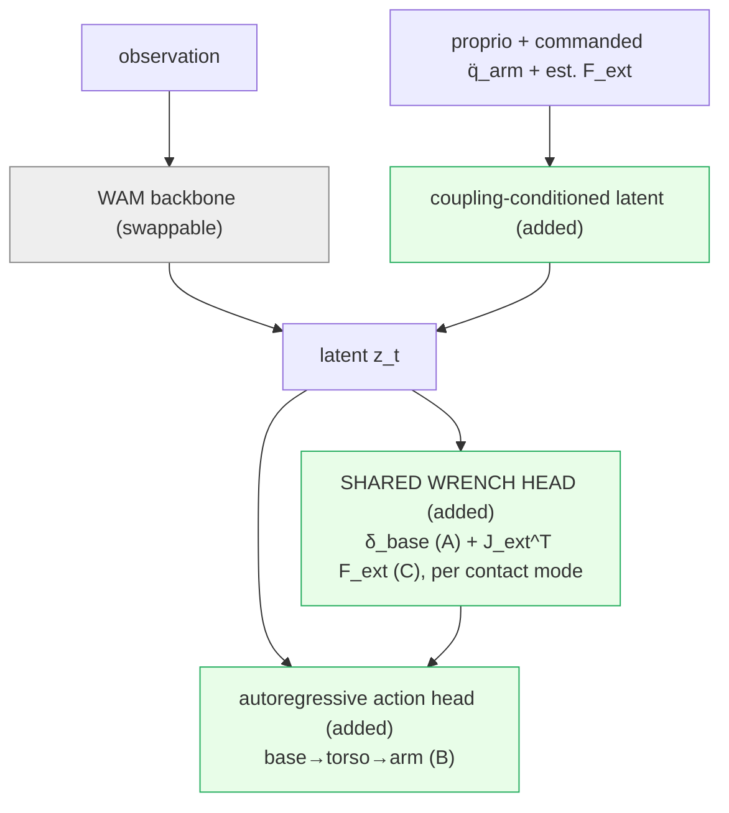

# Focus-Direction Workflow: the CoWAM program pitch

> [!abstract] The bet
> Improve whole-body humanoid capability by attacking it across **six clusters at once**: three **coupling** clusters that are the co-equal core (the **green** spine) and three **mechanism** clusters that supply and complement it (the **cyan** layer). The coupling core makes the whole-body couplings a humanoid policy normally discards **explicit and anticipatory**: **WB.A arm↔leg** (self-induced inertial), **WB.B base↔arm** (kinematic), **WB.C force-under-load** (external wrench), working name **CoWAM** (Coupling-aware World-Action Model). The mechanism clusters are general embodied-AI breakthroughs in their own right that also feed CoWAM's loop: **WAM.A predict** (better world-model architecture and training), **Sim2Real.B ground** (better sim2real), **Embodied-AI.B verify** (better evaluation). The whole program is one bet, that a cheap, structured physics term, predicted, grounded, and verified, beats far larger data and compute on a fixed budget and can cheaply prove itself wrong up front. Companions: [[Focus-Direction]], [[Focus-Direction-Research-Plan]], [[Focus-Direction-Research-Plan-detailed]].

> [!note] How to read this
> The walkthrough for the face-to-face: seven rows top to bottom, then the closing **ask**. The color legend below maps every node.
> 1. **Physics and first principles.** *Speaker note (what I say):* the generalized mass matrix is non-block-diagonal, so every whole-body motion transmits a low-dimensional structured cross-term, a quantity to predict, not data to collect.
> 2. **The gap across the program.** *Speaker note (what I say):* each coupling is handled today, but reactively, one-directionally, or implicitly, never anticipatory inside one coupled humanoid policy, and the predict / ground / verify mechanisms are unwired to the coupling.
> 3. **The six-cluster program.** *Speaker note (what I say):* the **green** coupling core (WB.A, WB.B, WB.C, each improved as a whole) plus the **cyan** mechanism clusters (WAM.A predict, Sim2Real.B ground, Embodied-AI.B verify), six recipe-card columns, one shared spine.
> 4. **The de-risking experiments.** *Speaker note (what I say):* three cheap falsifiers in parallel, one per coupling **cluster**, each testing the shared claim every direction in that cluster is built on, so a pass advances the whole cluster, same data, same backbone, in sim, with per-cluster go/no-go and the de-circularizing ε-curve.
> 5. **What to build.** *Speaker note (what I say):* gate-driven, not a calendar, de-risk first, then ground, then CoWAM, then verify, every expensive build commits only after its gate clears. Just what to build per cluster and the go/no-go that green-lights the next.
> 6. **Benchmarks.** *Speaker note (what I say):* three core humanoid axes are the actual hypothesis tests (balance / disturbance for A, mobile-manipulation for B, force-under-load for C), everything else is a robustness check.
> 7. **Risks.** *Speaker note (what I say):* each cluster can fail independently and every failure branch still yields a result, which is why grounding sits in the core, not the extension.
> Then the **ask**: an early read on the full program direction and which clusters to prioritize first.

> [!note] Color legend (for the canvas)
> **green** = coupling core (CoWAM): the three co-equal coupling clusters WB.A / WB.B / WB.C, the bet. **cyan** = mechanism complementary clusters: the predict / ground / verify general breakthroughs (WAM.A, Sim2Real.B, Embodied-AI.B) that also supply CoWAM's loop. **red** = reactive foils, what fails. **orange** = the headline benchmark axes. **purple** = deferred extension (C2 certified safe set). **grey** = context that recedes (deployment surface, mechanism substrate).

---

## Row 1 · The physics and first principles (why the program)

**Speaker note (what I say):** *whole-body control is conventionally split into an arm controller and a balance controller, with the coupling between them left implicit. The physics says that split throws away real terms. The whole program is one bet: make those terms explicit and anticipatory. Predicting, grounding, and verifying that bet each demands a general embodied-AI breakthrough on its own.*

> [!tip] First principles (the program bet)
> - **First principle:** the generalized mass matrix is non-block-diagonal, so every whole-body motion transmits a low-dimensional, structured cross-term (a reaction wrench, or a kinematic feasibility constraint) between the arm, the base, and the legs; that cross-term is a quantity to predict, not data to collect.
> - **Assumption challenged:** the field decouples whole-body control into an arm controller plus a balance controller and leaves the coupling implicit or reactive.
> - **The bet:** making each coupling an explicit, anticipatory, grounded, and verified world-model output beats far larger data and compute on a fixed budget, with the gain concentrated where the cross-term is largest, and it falsifies cheaply via the epsilon-curve.

- **The coupling physics (the core, green):** the non-block-diagonal mass matrix M(q) gives **three coupling channels** part-wise control discards: arm↔leg self-induced inertial (**δ_base = M(base,arm)·q̈_arm**, A), force-under-load external wrench (**δ_ext = J_ext^T·F_ext**, C), and base↔arm kinematic (the base is itself a manipulation DoF, B). A and C are the two *dominant* force pathways and share one output head; B is the separate kinematic one. These are structured terms the physics already contains, not a new dataset or a bigger model.
- **The three enablers (mechanism-complementary, cyan):** an explicit-coupling model needs **predicting** (the architecture and training that carries the cross-term on a world-action latent: [[WAM|WAM·A]]), **grounding** (the sim2real that makes the imagined physics real via differentiable system-ID: [[Sim2Real|S2R·B]]), and **verifying** (the evaluation that binds predicted to realized coupling: [[Embodied-AI|EAI·B]]). Each is also a standalone general embodied-AI breakthrough: a control-relevant predictive latent, robot-self system-ID, and a causal-consistency metric that no public benchmark provides.

---

## Row 2 · The gap across the program

**Speaker note (what I say):** *each coupling is handled today, but reactively, implicitly, or one-directionally, never as an anticipatory prediction inside one coupled humanoid policy, and the three enabler fields each leave the matching seam unwired. Six clusters, one gap apiece.*

**The coupling core (green) leaves all three channels on the table:**
- **WB.A · arm↔leg:** handled **implicitly**, [[2604.07993|HEX]]'s predictive MoE never makes the inertial cross-term an explicit term, [[2606.16542|ADAPT]] reacts after the fact.
- **WB.B · base↔arm:** handled **one-directionally**, [[2507.01961|AC-DiT]] conditions base→arm only, [[2401.02117|Mobile-ALOHA]] flat-concats and lets drift accumulate.
- **WB.C · force-under-load:** handled **reactively**, [[2505.06776|FALCON]] / [[2510.26280|Thor]] / [[2606.03297|SplitAdapter]] estimate-then-compensate from the past; [[2201.03871|ALMA]] anticipates only the self-induced *known* wrench, on a quadruped, in a separate policy.

**The three enabler seams (cyan) are each unwired:**
- **WAM.A · predict:** world-action models imagine *scene* futures ([[2411.04983|DINO-WM]], [[2504.02792|UWM]], [[2603.14482|V-JEPA-2.1]]), none output an **anticipatory coupling-wrench** as a modeled physics quantity.
- **Sim2Real.B · ground:** differentiable system-ID recovers *object* physics ([[2603.01151|D-REX]]), never re-pointed at the robot's **own** M(base,arm) and contact model (the self physics).
- **Embodied-AI.B · verify:** WM-evaluation harnesses score **fidelity / plausibility** ([[2606.05773|PiL-World]], [[2606.18610|SC3-Eval]]), none certify the **causal binding** of predicted coupling to realized coupling.

> [!warning] The honest headline (say this, do not oversell)
> The well-known "**41% → 62%**" out-of-distribution margin is **borrowed**: it is [[2604.07993|HEX]]-implicit beating part-wise stacks (implicit-vs-part-wise, on the arm↔leg channel), the **field's** proof-of-life, **not my claim** and **not explicit-vs-implicit**. My testable wedge per channel is **explicit-vs-implicit** (and, on the two force channels A and C, **explicit-vs-reactive**), which each falsifier *tests*, not a number already in hand.

**The gap in one line:** no prior work makes the self-induced inertial cross-term (A) *or* the unknown external wrench (C) an **explicit, anticipatory world-model output carried inside one coupled humanoid policy**, nor binds **predicted coupling to realized coupling** as a metric, and the predict / ground / verify fields each leave the matching seam unwired.

---

## Row 3 · The program: six clusters, twenty directions

**Speaker note (what I say):** the full program improves each cluster *as a whole*: improving WB.A, WB.B, WB.C, WAM.A, S2R.B, or EAI.B means advancing all of its directions together as one artifact, not landing isolated point fixes. The three **coupling** clusters (green) are the co-equal core; the three **mechanism** clusters (cyan) are the predict / ground / verify seams. The coupling core and the predict/ground/verify mechanism cores compose into one deployable model, **CoWAM**.

The coupling head (predict A+C wrench, factor B) plugs onto any WAM backbone, grounded and verified:

*Backbone-agnostic: the three **green** modules are the contribution, a plug-in on **any** WAM backbone, grounded (S2R.B) and verified (EAI.B). The backbone grid (DINO-WM / UWM / V-JEPA / Cosmos / a PPO floor) proves the lift is the coupling term, not the backbone.*

---

### Part 1 · Coupling core (WB.A / WB.B / WB.C, green)

#### WB.A (arm to leg)

*Unified advance:* one whole-body interface advanced at four layers, where upper-limb intent and lower-body support are coupled **before** commands issue, so the legs anticipate the arm's inertial demand rather than absorbing it late.

- **WB.A1 CoReWA** = [[2604.07993|HEX]] + [[2509.21231|SEEC]] + [[2506.14278|Heavy-Limbs-WBC]]: forecast arm latents into an anticipatory base reaction wrench feeding gate and controller.
- **WB.A2 BlendBridge** = [[2506.09366|SkillBlender]] + [[2602.08594|MOSAIC]] + [[2602.06341|HiWET]]: entropy-gated per-joint residual adapts a frozen skill blend across the sim-to-real gap.
- **WB.A3 ReachSched-WBT** = [[2602.06341|HiWET]] + [[2508.11275|Differentiable-Reachability-Maps]]: schedule the base along a reachability gradient, shrink the margin with tracking residuals.
- **WB.A4 CoLA-WB** = [[2512.11047|WholeBodyVLA]] + [[2506.13751|LeVERB]] + [[2606.18772|HALOMI]]: loco latent as residual of manip code, projected onto a feasible manifold.

> [!tip] First principles (WB.A)
> The bet: anticipating the arm-induced base wrench one horizon ahead cuts base-pose deviation and end-effector acceleration under fast reach-while-walking versus the implicit-coupling baseline at no inference-latency cost, and zeroing the feed-forward path collapses the gain.

#### WB.B (base to arm)

*Unified advance:* one perceive-move-update-act loop, a single mobile-manipulation policy that denoises base, torso/arm, and perception actions in the same chunk over one shared frame, wrapped in a co-trained DynaMem-style memory interface.

- **WB.B1 KCFlow-Strat** = [[2503.05652|BRS]] + [[2507.01961|AC-DiT]] + [[2602.23024|InCoM]]: stratified test of when one arm-to-base feasibility edge beats unidirectional base-first.
- **WB.B2 LookAhead-WBC** = [[2603.03243|HoMMI]] + [[2405.07991|SPIN]] + [[2411.04999|DynaMem]]: memory-conditioned 3D look-at co-optimized with base in one diffusion chunk.
- **WB.B3 EchoPurge** = [[2511.18112|EchoVLA]] + [[2411.04999|DynaMem]] + [[2510.07134|TrackVLA++]]: differentiable in-policy purge gate plus cross-visit re-ID for self-correcting multi-room memory.

> [!tip] First principles (WB.B)
> The bet: a single one-way arm-to-base feasibility edge captures nearly all the gain, concentrated on the reach-extension stratum and near-zero on fixed-base reaches, while symmetric coupling buys latency, not accuracy.

#### WB.C (force-under-load)

*Unified advance:* one anticipatory, conditionally-certified loop off a shared upstream signal, PROWL's sensorless load-mismatch forecast (predict and pre-brace) feeding a conformal disturbance bound (certify and re-size shields).

- **WB.C1 PROWL** = [[2505.06776|FALCON]] + [[2201.03871|ALMA]] + [[2606.16542|ADAPT]]: momentum-observer residual forecasts hand wrench into FALCON's dual agents, legs pre-brace before loads peak; only ALMA's anticipatory-leaning mechanism is the transferable claim, its headline numbers are on a quadruped, not the claim here.
- **WB.C2 PALADIN** = [[2605.25546|ISSf-CBF-WBC]] + [[2604.07457|CMP]] + [[2602.01515|RAPT]] (cross-check): PROWL's forecast is conformally bounded into a disturbance that re-sizes the ISSf-CBF QP and narrows CMP's radius, with RAPT's residual demoted to a runtime cross-check.

> [!tip] First principles (WB.C)
> The bet: a learned forecast channel cuts peak base-tilt and end-effector-tracking error in the first 0 to 300 ms after load onset for ramped loads, beating a persistence baseline, and the same residual sizes a conformal safety bound.

---

### Part 2 · Mechanism clusters, complementary general breakthroughs (WAM.A / Sim2Real.B / Embodied-AI.B, cyan)

*Each is wired onto the coupling as the predict / ground / verify seam, and each is also a standalone general advance.*

#### WAM.A (predict)

*Dual role:* a standalone advance in **network and training architecture** (one latent trained dense and grounded yet deployed lightweight, gated on a calibrated residual) AND the **predict** move CoWAM uses, the upstream substrate its coupled controllers consume.

- **WAM.A1 GROVER** = [[2605.20752|GaussianDream]] + [[2602.10098|VLA-JEPA]] + [[2605.06222|FFDC-WAM]]: shared motion code grounds a leakage-free latent via a discardable 3D-Gaussian teacher, deploy gates on a calibrated residual.
- **WAM.A2 WrenchCast** = [[2606.09337|TORL-VLA]] + [[2606.13877|ContactWorld]] + [[2603.17851|DexViTac]]: rolls latent forward H steps, decodes sensorless 6-DoF wrench split into self-motion and contact, conformal trust gate.
- **WAM.A3 DUET-WM** = [[2605.06388|Semantic-LDM-WM]] + [[2503.00653|DC-MPC]] + [[2505.04999|CLAM]]: splits a d=96 semantic latent into continuous flow channel plus FSQ residual channel, per-token gated, CLAM-grounded.

> [!tip] First principles (WAM.A)
> The bet: a latent grounded through a shared code or a training-only teacher yields a calibrated residual whose ECE and failure-detection AUROC beat the uncalibrated baseline and match the sensor-equipped ceiling, at sub-2x pure-latent deploy cost.

#### Sim2Real.B (ground)

*Dual role:* a standalone advance in **sim2real** (one differentiable-twin grounding pipeline emitting a per-twin certificate of where physics can be relied on) AND the **ground** move CoWAM uses, re-pointing sysID at the robot's own M(base,arm) and contact model.

- **S2R.B1 SENSE-T** = [[2503.17973|PhysTwin]] + [[2511.04665|Real-to-Sim-GS]] + [[2603.01151|D-REX]]: one differentiable rollout yields per-channel analytic sensitivity of sim-real divergence, replacing the discrete fidelity sweep.
- **S2R.B2 AMORTI-SIM** = [[2603.01151|D-REX]] + [[2603.23973|SLAT-Phys]] + [[2410.20357|Dynamics-as-Prompts]]: clutter-conditioned net predicts a novel object's full constitutive vector in one pass, zero per-object loops.
- **S2R.B3 FideliGate** = [[2403.03949|RialTo]] + [[2504.03597|Real-is-Sim]] + [[2604.13645|CFG-ADDA]]: photometric correction residual becomes a fidelity gate on fold-back demos, making rounds monotonically improve real success.
- **S2R.B4 CLaRe** = [[2304.14369|NCLaw]] + [[2508.01112|MASIV]] + [[2603.22039|RAFL]]: two-head MPM splits a constitutive law from a starved residual, making the split a falsifiable extrapolation measurement.

> [!tip] First principles (S2R.B)
> The bet: per-channel analytic sensitivity, fidelity-gated fold-back, and an identifiability-certified residual share each beat the uniform-trust baseline by a measurable, monotone margin, and the same instrument certifies the robot's own coupling block only where it has driven divergence below threshold.

#### Embodied-AI.B (verify)

*Dual role:* a standalone advance in **evaluation** (one self-certifying causal-consistency metric plus a cause-attributed, forgetting-free learning loop) AND the **verify** move CoWAM uses, binding predicted to measured coupling on hardware.

- **B1 CIC** = [[2606.05773|PiL-World]] + [[2606.18610|SC3-Eval]] + [[2605.29360|MiraBench]]: self-certifying action-counterfactual metric, U_cf-gated, rho=0.94/0.984 references.
- **B2 CALM** = [[2606.03385|GTP-FA]] + [[2506.21669|SEEA-R1]] + [[2508.19236|MemoryVLA]]: cause-attributed failure memory, channel-routed supervised correction, subspace-protected.
- **B3 ElastiVote** = [[2507.05116|VOTE]] + [[2605.08799|ElasticFlow]] + [[2605.29438|ElegantVLA]]: one-NFE policy, span+backbone knobs, c_{t-1}-gated recompute at >=30 Hz.
- **B4 GSE-Null** = [[2602.21919|Learning-in-the-Null-Space]] + [[2603.02224|Subspace-Geometry-Forgetting]] + [[2605.06175|VLA-GSE]]: two-space continual FT, null-space-protected wrench head, no forgetting.

> [!tip] First principles (EAI.B)
> The bet: a validity-gated action-counterfactual metric predicts real-fleet success better than fidelity scores, and the same residual holds R-squared at least 0.70 with backward transfer at least -2 pp through deployment and re-training.

---

## Row 4 · The first experiments: one cluster falsifier per coupling cluster

**Speaker note (what I say):** before building anything expensive, I run three cheap experiments, one per coupling **cluster**, each testing the *shared* claim every direction in that cluster is built on, so a pass de-risks the **whole cluster at once** (all its directions advance together on the validated foundation) and a fail voids that cluster's shared bet, not a single recipe. Same data, same backbone, same tasks, in simulation, no new data. **Per-cluster go/no-go**: a cluster can fail without killing the others.

### WB.A cluster falsifier · arm↔leg (does anticipatory coupling pay?)

The claim **all four WB.A directions are built on**: the legs anticipate the arm's inertial demand *before* commands issue. Three-way ablation, **stratified by arm-acceleration quartile**: **explicit-feedforward (ours)** vs **implicit ([[2604.07993|HEX]]-style, matched-capacity, re-trained in-house)** vs **reactive observer ([[2606.16542|ADAPT]])**. **Input-isolation control:** identical head, swap **only** the input, planned q̈_arm (anticipatory) vs the observer's measured estimate (reactive), so any win is **feedforward timing, not capacity**. A pass validates the anticipatory interface that **A1** (forecast wrench), **A2** (sim-to-real feasibility), **A3** (workspace feasibility), and **A4** (feasible-latent command) all build on, so the whole WB.A cluster advances together.

### WB.C cluster falsifier · force-under-load (shares WB.A's head)

The claim **both WB.C directions ride on**: one anticipatory load-mismatch forecast off a shared upstream signal. The same three-way under a **step-applied unknown external load**, stratified by load magnitude and direction: **anticipatory wrench-reaction (ours)** vs **reactive (ADAPT external-wrench observer / [[2505.06776|FALCON]] curriculum / reactive impedance)** vs **implicit**. **Headline-C metric:** the **first-100 ms CoM-excursion advantage** after load onset, where reactive compensation lags. A pass validates the forecast **C1** produces (predict and pre-brace) and **C2** consumes (conformally certify and re-size shields), so both WB.C directions advance together.

### WB.B cluster falsifier · base↔arm (kinematic)

The claim **the whole WB.B loop wraps**: a base-first coupling backbone with one arm-to-base feasibility edge. **Autoregressive base→torso→arm ([[2503.05652|BRS]]-style) vs flat-concatenation ([[2401.02117|Mobile-ALOHA]] floor)**, with [[2507.01961|AC-DiT]]'s one-directional base→arm conditioning as the middle rung (a factoring claim, no reactive-observer arm): the margin must **concentrate on reach-extension** tasks (target outside the standing arm-workspace) and vanish on fixed-base reaches. A pass validates the backbone **B1** contributes, that **B2** (memory-conditioned look-at) and **B3** (self-correcting memory) compound on, so the whole WB.B perceive-move-update-act loop advances together.

### The ε-curve: the de-circularization move (the cleverest single idea)

Supervise each force head on a **deliberately wrong** physics model (perturbed by ε) and report the win **as a function of model error ε**. If the explicit head still wins when its own supervision is wrong, the win is the **inductive bias, not label leakage**. That one curve is both the headline figure and the falsification test.

> [!example] De-circularization and the falsifiable prediction (illustrative, replace with measured)
> Each force cluster supervises its head on a **deliberately perturbed** model (A perturbs the inertia M̃, C perturbs the contact model) and reports the margin **as a function of model error ε**, if it still wins under a wrong model, the win is the inductive bias, not label leakage. **GO/NO-GO per cluster:** A, margin ≥ 5 pp concentrated at high arm-accel AND anticipatory beats reactive by ≥ 5 pp; C, the pre-registered first-100 ms CoM-excursion reduction (target ≥ 20%) at matched load; B, ≥ 5 pp on reach-extension with near-zero on fixed-base. If a cluster's explicit ≈ implicit, that bet is **void** and the others continue. That each can cheaply prove itself wrong up front is what makes them good problems.

---

## Row 5 · What to build (gate-driven, not a timeline)

**Speaker note (what I say):** *the order is set by dependencies and gates, not a calendar: the cheap cluster falsifiers and the de-risk checks come first because everything expensive depends on them, and each build commits only after its gate clears. Just what to build per cluster and the go/no-go that green-lights the next thing.*

**Phase 0 de-risk (one line, before any training, in sim):** kill or confirm the two existential risks per force cluster: anticipatory window viable (A reaction rise-time ≥ **31 ms** at top-quartile accel; C first-100 ms window beats the composed onboard loop latency by ≥ 5 ms) and physics identifiable (recover a planted inertia / contact model to ≤ **15% Frobenius**); the gates **pre-commit the scope** (anticipation fails → keep the grounded explicit-vs-implicit term; grounding fails → analytic term + broad DR; both fail → ship the de-circularized ε-curve only).

### The builds and their gates

| Build | Deliverable | Gate (pre-registered) |
|---|---|---|
| **The three cluster falsifiers** (WB.A · WB.B · WB.C, parallel, co-equal) | per-cluster three-way / autoregressive ablations + per-cluster ε-curves | each cluster's go/no-go (A ≥ 5 pp at high arm-accel AND anticipatory beats reactive ≥ 5 pp; C first-100 ms CoM-excursion ≥ 20% at matched load; B ≥ 5 pp on reach-extension, near-zero fixed-base) |
| **Ground the terms** | differentiable sysID of M(base,arm) (A) and the contact model / J_ext (C) on the real robot; B's mobile-manip object physics rides the same engine's native recovery (no separate gate) | ≤ 15% Frobenius AND beats broad-DR on OOD mass/load AND ≥ 80% real-SR retention |
| **CoWAM** | shared wrench head, sensor-free forecast of the self-induced (A) and external (C) reaction | sensor-free wrench MSE ≤ 2x the tactile-available baseline on held-out [[2604.13015\|Touch-Dreaming]] (real, its "w/o Touch" ablation) + [[2403.10506\|HumanoidBench]] taxel-toggle sim arm |
| **Verify + continual** | causal-consistency metric across all three clusters + hardware | predicted-vs-realized R² ≥ 0.70 AND continual lift retained (NBT ≥ -2 pp) |

The cheap cluster falsifiers and the verify track run first; the costly downstream builds (ground, CoWAM, verify-on-hardware) **commit only after the falsifiers' gate clears**. The **C2 certified safe set** (a barrier / QP guaranteeing balance + collision-freeness under load) stays a **deferred extension** of WB.C, opened only once the coupling is predicted, grounded, and verified.

### Feasibility: robot, compute, code (one line)

Real Unitree **H1** (Shadow Hands + 448-taxel tactile) for the grounded story, **G1** for the lighter deploy; the cluster falsifiers run cheap on a few GPUs, CoWAM on a multi-GPU node, deploy on a Jetson Orin at ≥ 30 Hz; **327 repos already cloned** with named fork targets per build (`humanoid-bench` / `HEX`, `FALCON` / `ADAPT`, `brs-algo` / `AC-DiT`, `D-rex` / `gradsim`, `dino_wm` / `UWM` / `vjepa2`, `stable-worldmodel` / `VLA-GSE`).

---

## Row 6 · Benchmarks: where the lift must show

**Speaker note (what I say):** *humanoid benchmarks only, the same suites the anchor papers themselves run on (verified by reading their PDFs via Graphify). The mechanism clusters (predict / ground / verify) are measured on these same humanoid benchmarks, a non-humanoid tabletop suite would not test a humanoid-optimized WAM. Note: MobileManiBench, ContactWorld, MS-HAB, ManiFeel are non-humanoid (mobile-base or fixed-arm), so they are out.*

### WB.A arm↔leg (balance, disturbance, whole-body loco-manip)

[[2403.10506|HumanoidBench]] (the standard humanoid suite), [[2603.20147|AGILE]], [[2606.17833|HumanoidArena]], [[2503.05652|BRS]] (whole-body on Galaxea R1), [[2506.09366|SkillBench]] (SkillBlender's own), [[2506.13751|LeVERB-Bench]] (LeVERB's own), [[2308.14636|Disturbance-Rejection]] and [[2404.19173|Single-Contact++]] (Digit impact tests), with [[2602.13656|KungFuAthlete]], [[2508.19926|FARM]], [[2602.13850|Humanoid-Hanoi]], [[2511.17925|Switch-JustDance]], [[2602.21599|Iterative-Closed-Loop-Motion]], [[2507.18883|Partial-Observation-Loco]], [[2307.10142|Potential-Based-Rewards]], [[2408.00342|MuJoCo-MPC-HB]].

### WB.B base↔arm (humanoid mobile-manipulation)

[[2407.07788|BiGym]] (Unitree H1 bimanual mobile-manip) and [[2503.05652|BRS]] (Galaxea R1 whole-body). The common mobile-manip suites (MobileManiBench, MS-HAB) are non-humanoid, so they are not used.

### WB.C force-under-load (external wrench, contact)

[[2505.06776|FALCON]] force-curriculum (FALCON's own), [[2510.26280|Thor]] (167.7 N pull), [[2606.03297|SplitAdapter]] (6 kg OOD), and the contact wrench on [[2604.13015|Touch-Dreaming]] (real, L_force forecast head + "w/o Touch" ablation) with the [[2403.10506|HumanoidBench]] taxel-toggle sim arm, plus [[2510.25725|Humanoid-Visual-Tactile-Action]] as the tactile dataset.

### Real-robot sim2real (humanoid)

[[2602.01515|RAPT]] humanoid sim2real OOD, on the H1/G1 deploy from Row 5.

### The backbone grid

{ PPO floor, [[2411.04983|DINO-WM]], [[2504.02792|UWM]], [[2501.03575|Cosmos]], [[2603.14482|V-JEPA-2.1]] } × { coupling off / on }, run on the humanoid benchmarks above. The within-backbone paired off/on isolates the lift, and the grid shows the lift is the coupling term, not the backbone.

---

## Row 7 · Risks and fallbacks: every branch, on every cluster, yields a result

**Speaker note (what I say):** this is a de-risked program, not a single fragile bet. Each channel can fail independently, and every failure mode still produces a result.

| Risk | Fallback (still a result) |
|---|---|
| **Explicit ≈ implicit** on a channel | I still own that channel's definitive three-way explicit / implicit / reactive ablation with the ε-sweep |
| **Wrong or unidentifiable inertia / contact model** | fall back to the analytic term + broad domain randomization for that channel (grounding seam dropped); the ablation still ships |
| **Force-under-load first-100 ms hostage to composed loop latency (C)** | price the whole onboard budget (PR-0a-C); if it eats the window, move the C headline to a steady-state max-load number |
| **Hardware-dominant physics** (foot-contact / friction / actuator swamp the term) | instrument the residual budget first (PR-0a'); scope down if the term is dominated |
| **Base↔arm factoring buys little, or its decode adds latency (B)** | report the autoregressive-vs-flat margin stratified by reach-extension (PR-1B), not pooled; parallelize / distill the chunked decode if latency bites; the definitive ablation still ships |
| **WAM too slow for contact** | async decoupling + quantization clear the ≥ 30 Hz floor; report the SR-vs-Hz Pareto honestly |

> [!warning] The one risk the direction absorbs
> The explicit heads need a half-decent physics model: a wrong URDF or contact model poisons them and then explicit ≈ implicit. This is exactly why **grounding (differentiable system-ID) is in the core, not the extension layer**. If sysID cannot be learned cleanly on a channel, the fallback is that channel's implicit / reactive baseline, and I have still produced the definitive ablation, which the verify metric makes publishable either way.

---

## What I am asking

**Speaker note (what I say):** I want your sign-off on the **direction** before I commit the next phase, and a steer on sequencing.

**Your endorsement of the full program direction.** The shape is: the **green** coupling core (WB.A arm↔leg, WB.B base↔arm, WB.C force-under-load) as the co-equal spine, with the **cyan** mechanism clusters (WAM.A predict, Sim2Real.B ground, Embodied-AI.B verify) complementary, each a standalone embodied-AI advance that also wires the predict / ground / verify loop onto the coupling. Is the explicit, anticipatory coupling bet, predict the cross-term, ground it, verify predicted equals realized, the right thing to pursue across these six clusters? And given the first experiments are cheap, parallel, and self-falsifying (no new data), **which clusters should I prioritize first**? An early read from you on the framing and the cluster set is what I most want from this meeting.

---

> [!note] Assets to add by hand (yours to fill on the canvas)
> 1. **Row 3 is six cluster columns of recipe cards:** three **green** coupling columns (WB.A, WB.B, WB.C) and three **cyan** mechanism columns (WAM.A predict, Sim2Real.B ground, Embodied-AI.B verify). Lay them out as six side-by-side bands, green spine left, cyan complementary layer right, and color each recipe card by its cluster.
> 2. **Figure placeholders:** the **ADAPT** disturbance-observer diagram in the gap row, a **FALCON** / load-carrying figure for the force-under-load lane, and the illustrative **expected-result chart** in the experiments row (swap for measured numbers once the falsifiers run).
> 3. Color every anchor-paper card by its role tag via the legend up top (green = coupling core, cyan = mechanism complementary, grey = deployment / substrate, purple = deferred).

## Cross-references

- [[Focus-Direction]]: the explicit-coupling thesis this pitch reduces from.
- [[Focus-Direction-Research-Plan]] and [[Focus-Direction-Research-Plan-detailed]]: the lean and full-rigor plans.
- [[Focus-Direction-Paper-Code-Index]]: every cited paper to its KH note and cloned repo.
- Source clusters: [[Whole-Body]] (the three anchors: A arm-leg, B base-arm, C force-under-load), [[WAM]] (predict), [[Sim2Real]] (ground), [[Embodied-AI]] (verify).
