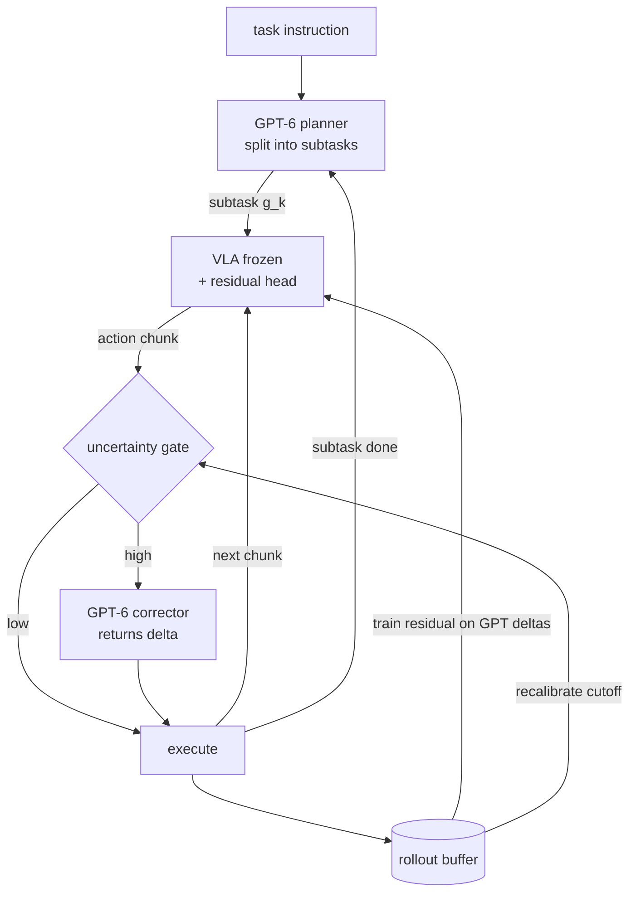

# Hybrid Pipeline

```mermaid
flowchart TD
    L["task instruction"] --> P["GPT-6 planner<br/>split into subtasks"]
    P -->|"subtask g_k"| V["VLA frozen<br/>+ residual head"]
    V -->|"action chunk"| G{"uncertainty gate"}
    G -->|"low"| E["execute"]
    G -->|"high"| C["GPT-6 corrector<br/>returns delta"]
    C --> E
    E --> B[("rollout buffer")]
    E -->|"next chunk"| V
    E -->|"subtask done"| P
    B -->|"train residual on GPT deltas"| V
    B -->|"recalibrate cutoff"| G
```

| Loop | Rate |
| --- | --- |
| Planner | per subtask |
| VLA + gate | per chunk |
| Corrector | on gate fire |
| Buffer to residual | offline |
